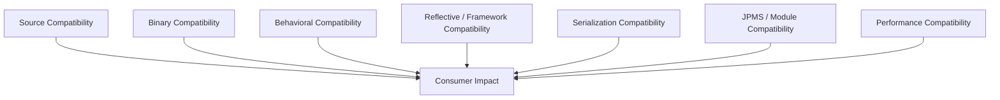
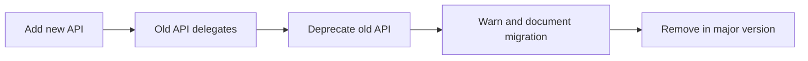
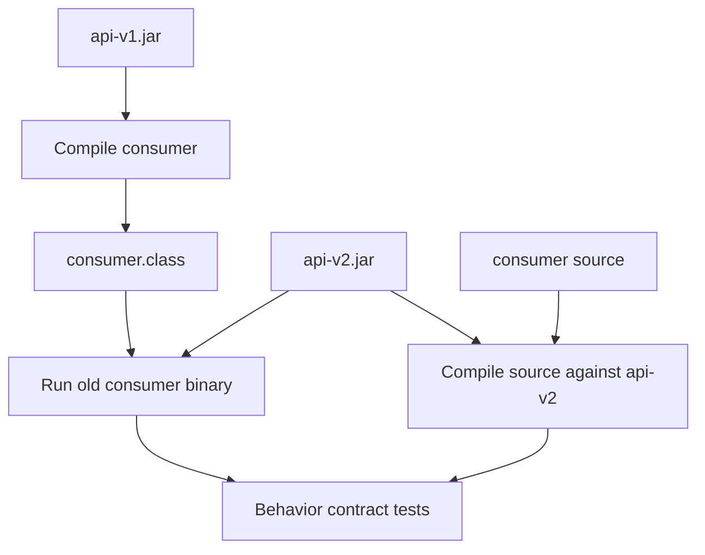

# Part 010 — Public API Evolution and Compatibility

> Target: mampu mengubah public API Java dengan sadar terhadap **source compatibility, binary compatibility, behavioral compatibility, generic erasure, reflection, JPMS, dan migration path**.

API design yang baik bukan hanya “enak dipakai hari ini”. API design yang baik bisa bertahan saat kebutuhan berubah.

Part ini menjawab:

- Apa bedanya source, binary, dan behavioral compatibility?
- Mengapa perubahan yang “compile fine” bisa tetap mematahkan runtime?
- Mengapa perubahan yang binary compatible bisa tetap merusak behavior?
- Apa risiko overload, generics, default method, sealed type, records, dan JPMS terhadap evolusi API?
- Bagaimana membuat migration path yang realistis?
- Bagaimana menguji compatibility sebagai bagian dari CI?

---

## 1. Kaufman Framing: Skill yang Sedang Dilatih

Kita bukan menghafal semua aturan JLS Chapter 13. Kita membangun decision model.

### 1.1 Target Performance

Anda harus bisa melihat perubahan API dan segera mengklasifikasikannya:

```text
Apakah ini breaking?
  ├─ Source breaking?
  ├─ Binary breaking?
  ├─ Behavioral breaking?
  ├─ Reflection/framework breaking?
  ├─ Serialization breaking?
  ├─ JPMS/module breaking?
  └─ Migration path tersedia?
```

### 1.2 Shortcut Top 1%

Engineer kuat tidak hanya bertanya:

> “Apakah test kita masih hijau?”

Mereka bertanya:

> “Apakah consumer lama yang tidak recompile masih bisa link dan berjalan benar?”

Itu perbedaan besar pada library, platform, SDK, internal framework, shared domain model, dan API artifact.

---

## 2. Compatibility Layers

Compatibility bukan satu hal. Ia berlapis.



### 2.1 Source Compatibility

Source compatible berarti source code consumer lama masih bisa dikompilasi ulang terhadap API baru.

Contoh source break:

```java
// v1
public void submit(String id) {}

// v2
public void submit(UUID id) {}
```

Consumer lama:

```java
client.submit("CASE-1");
```

Ini gagal compile ketika diarahkan ke v2.

### 2.2 Binary Compatibility

Binary compatible berarti class file consumer lama yang sudah dikompilasi terhadap v1 masih bisa link terhadap v2 tanpa linkage error.

Contoh binary break:

```java
// v1
public class CaseClient {
    public void submit(String id) {}
}
```

```java
// v2
public class CaseClient {
    public void submit(UUID id) {}
}
```

Consumer lama sudah punya bytecode yang memanggil method descriptor:

```text
submit(Ljava/lang/String;)V
```

Jika method itu hilang, runtime bisa gagal dengan `NoSuchMethodError`.

### 2.3 Behavioral Compatibility

Behavioral compatible berarti program tetap bermakna sama dari sudut pandang contract.

Contoh binary compatible tetapi behavioral breaking:

```java
// v1
public boolean isEligible(Case c) {
    return c.status() == OPEN || c.status() == ESCALATED;
}
```

```java
// v2
public boolean isEligible(Case c) {
    return c.status() == OPEN;
}
```

Signature tidak berubah. Binary aman. Tetapi consumer yang mengandalkan `ESCALATED` eligible akan rusak secara behavior.

### 2.4 Reflective Compatibility

Framework sering memanggil API melalui reflection, annotation, naming convention, constructor, atau record component.

Perubahan ini bisa breaking walau source/binary biasa tampak aman:

```java
// v1
public CaseDto(String id, String status) {}
```

```java
// v2
public CaseDto(String id, CaseStatus status) {}
```

Framework binding JSON, DI, ORM, atau test fixture bisa rusak karena constructor/field/property berubah.

### 2.5 Serialization Compatibility

Java native serialization, JSON schema, XML schema, Avro/Protobuf, atau custom binary format punya aturan compatibility sendiri. Jangan menyamakan Java binary compatibility dengan data compatibility.

Contoh:

```java
public record CaseEvent(String id, String status) {}
```

Menambahkan field record:

```java
public record CaseEvent(String id, String status, Instant occurredAt) {}
```

Java source mungkin mudah diperbaiki, tetapi consumer JSON lama/baru bisa terdampak tergantung serializer dan schema policy.

### 2.6 JPMS/Module Compatibility

Perubahan `module-info.java` juga API.

```java
module com.acme.caseengine {
    exports com.acme.caseengine.api;
}
```

Jika package tidak lagi diekspor:

```java
module com.acme.caseengine {
    // export removed
}
```

Consumer module bisa gagal compile/link.

---

## 3. Binary Compatibility Mental Model

JVM memanggil method berdasarkan owner, name, dan descriptor.

```text
Owner:      com/acme/CaseClient
Name:       submit
Descriptor: (Ljava/lang/String;)V
```

Ketika consumer sudah dikompilasi, ia tidak “mencari method mirip”. Ia mencari symbol yang sesuai.

```mermaid
sequenceDiagram
    participant ConsumerClass as Consumer.class compiled against v1
    participant Runtime as JVM Linker
    participant ApiV2 as api-v2.jar

    ConsumerClass->>Runtime: invoke CaseClient.submit(String)
    Runtime->>ApiV2: find submit(Ljava/lang/String;)V
    alt found
        ApiV2-->>Runtime: method resolved
    else missing
        Runtime-->>ConsumerClass: NoSuchMethodError
    end
```

Karena itu, perubahan kecil di source bisa besar di binary.

---

## 4. Compatibility Matrix: Class-Level Changes

| Change | Source Compatibility | Binary Compatibility | Behavioral Risk | Notes |
|---|---:|---:|---:|---|
| Add new public class | Usually yes | Usually yes | Low | Bisa menimbulkan name conflict pada wildcard/static imports. |
| Remove public class | No | No | High | Consumer lama bisa `NoClassDefFoundError`. |
| Rename public class | No | No | High | Secara praktis sama dengan remove + add. |
| Move class package | No | No | High | Binary name berubah. |
| Make class `final` | Maybe | Often breaking for subclassers | High | Consumer subclass bisa gagal. |
| Remove `final` | Usually yes | Usually yes | Low | Membuka extension surface. |
| Change superclass | Depends | Risky | High | Bisa memengaruhi inherited methods, casts, serialization. |
| Add interface implementation | Usually yes | Usually yes | Medium | Bisa memengaruhi overload/casts/behavior. |
| Remove interface implementation | Maybe | Risky | High | Existing casts bisa gagal. |
| Change public to package-private/private | No | No | High | Access/linkage break. |

### 4.1 Rename Is Not Refactor for Public API

IDE rename aman untuk codebase lokal. Public API rename adalah breaking change.

```java
// v1
public final class CaseLifecycleClient {}

// v2
public final class CaseTransitionClient {}
```

Untuk consumer, type lama hilang.

Migration yang lebih aman:

```java
/**
 * @deprecated use {@link CaseTransitionClient}
 */
@Deprecated(forRemoval = false, since = "2.3")
public final class CaseLifecycleClient extends CaseTransitionClient {
    public CaseLifecycleClient(/* args */) {
        super(/* args */);
    }
}
```

Tetapi ini hanya bisa jika inheritance valid. Jika class final atau constructor sulit, gunakan adapter/factory.

---

## 5. Method-Level Changes

| Change | Risk |
|---|---|
| Add method to class | Usually safe, but overload/name conflict possible. |
| Remove method | Breaking. |
| Rename method | Breaking. |
| Change parameter type | Breaking; descriptor changes. |
| Change return type | Usually breaking unless covariant rules preserve bridge expectations. |
| Add checked exception | Source breaking for callers compiling against it. |
| Remove checked exception | Usually source compatible, but override contracts may matter. |
| Add overload | Source ambiguity risk. |
| Change method from instance to static | Breaking. |
| Change method from static to instance | Breaking. |
| Change visibility narrower | Breaking. |
| Change visibility wider | Usually safe. |

### 5.1 Additive Method Change

```java
// v1
public final class CaseClient {
    public Case get(String id) { ... }
}
```

```java
// v2
public final class CaseClient {
    public Case get(String id) { ... }
    public Case get(UUID id) { ... }
}
```

Usually safe, tetapi bisa memengaruhi source overload resolution:

```java
client.get(null); // now ambiguous if String and UUID overloads exist
```

### 5.2 Overload Trap

Overload adalah API convenience yang sering menjadi compatibility hazard.

```java
public void publish(Object event) {}
public void publish(String event) {}
```

Call:

```java
publish(null);
```

Compiler memilih most-specific overload. Ketika overload baru ditambah, source behavior bisa berubah atau menjadi ambiguous.

Guideline:

- Hindari overload yang hanya berbeda pada type yang sering menerima `null`.
- Hindari overload campuran primitive/wrapper/varargs.
- Pertimbangkan nama method berbeda untuk semantic berbeda.
- Gunakan command object untuk evolusi jangka panjang.

Lebih stabil:

```java
public TransitionResult transition(TransitionCommand command) {}
```

Command object bisa berkembang lebih aman dibanding menambah banyak overload.

---

## 6. Field and Constructor Changes

### 6.1 Public Fields Are Expensive

```java
public final class CaseStatusInfo {
    public String status;
}
```

Mengubah field menjadi accessor adalah breaking:

```java
public final class CaseStatusInfo {
    private final String status;
    public String status() { return status; }
}
```

Consumer bytecode lama mencari field:

```text
getfield CaseStatusInfo.status:Ljava/lang/String;
```

Jika hilang, runtime error.

Guideline: jangan expose mutable public fields pada API serius.

### 6.2 Constructors Are API

```java
public CaseClient(HttpClient httpClient, URI endpoint) {}
```

Constructor public adalah contract. Menambah parameter breaking.

Lebih evolvable:

```java
public final class CaseClient {
    private CaseClient(Builder builder) {}

    public static Builder builder() {
        return new Builder();
    }

    public static final class Builder {
        public Builder endpoint(URI endpoint) { ... }
        public Builder httpClient(HttpClient httpClient) { ... }
        public Builder retryPolicy(RetryPolicy retryPolicy) { ... }
        public CaseClient build() { ... }
    }
}
```

Builder bukan selalu benar, tetapi untuk public API dengan banyak optional dependency, builder mengurangi constructor compatibility pressure.

---

## 7. Interface Evolution

Interface adalah kontrak paling mahal untuk dievolusi karena consumer bisa mengimplementasikannya.

### 7.1 Adding Abstract Method

```java
// v1
public interface Rule {
    boolean matches(Context context);
}
```

```java
// v2
public interface Rule {
    boolean matches(Context context);
    String description();
}
```

Source impact: implementer lama gagal compile sampai menambahkan method.

Runtime impact: binary lama bisa tetap load, tetapi pemanggilan method baru pada implementer lama dapat gagal dengan `AbstractMethodError`.

### 7.2 Default Method as Migration Tool

```java
public interface Rule {
    boolean matches(Context context);

    default String description() {
        return getClass().getName();
    }
}
```

Default method membantu kompatibilitas, tetapi bukan gratis:

- Bisa menciptakan conflict jika class/interface lain punya method sama.
- Bisa menambah behavior yang tidak diinginkan.
- Default implementation menjadi contract.
- Tidak semua semantic punya default aman.

### 7.3 Capability Interface

Alih-alih menambah method ke interface besar:

```java
public interface Rule {
    boolean matches(Context context);
}

public interface DescribedRule extends Rule {
    String description();
}
```

Consumer bisa mengecek capability:

```java
if (rule instanceof DescribedRule described) {
    log.info(described.description());
}
```

Ini tidak selalu ideal, tetapi sering lebih aman untuk extension ecosystem.

---

## 8. Abstract Class Evolution

Abstract class lebih mudah dievolusi daripada interface dalam beberapa kasus karena Anda bisa menambahkan concrete method dan state internal. Tetapi abstract class menghabiskan single inheritance slot.

```java
public abstract class AbstractRule implements Rule {
    @Override
    public String description() {
        return getClass().getSimpleName();
    }
}
```

Risiko:

- Protected method adalah API untuk subclass.
- Constructor adalah API untuk subclass.
- Field protected hampir selalu menjadi liability.
- Calling overridable method dari constructor berbahaya.

Guideline:

- Gunakan abstract class untuk partial implementation yang benar-benar stabil.
- Gunakan interface untuk role/capability.
- Jangan expose protected state kecuali sangat terpaksa.

---

## 9. Generics and Type Erasure Compatibility

Generics tampak source-level, tetapi erasure memengaruhi binary signature.

### 9.1 Erased Signature

```java
public void handle(List<String> values) {}
```

Erased descriptor menggunakan `List`, bukan `List<String>`.

```text
handle(Ljava/util/List;)V
```

Anda tidak bisa overload hanya berdasarkan generic parameter:

```java
public void handle(List<String> values) {}
public void handle(List<Integer> values) {} // compile error: same erasure
```

### 9.2 Changing Generic Bound

```java
// v1
public final class Registry<T> { }
```

```java
// v2
public final class Registry<T extends Named> { }
```

Source consumer bisa break jika memakai type yang tidak memenuhi bound. Runtime/generic metadata reflection juga berubah.

### 9.3 Return Type Generic Change

```java
// v1
public List<String> names() {}
```

```java
// v2
public Collection<String> names() {}
```

Walau `List` adalah `Collection`, perubahan return type ke supertype dapat breaking. Consumer bytecode mencari descriptor lama.

Lebih aman:

```java
public List<String> names() {}

public Collection<String> nameCollection() {
    return names();
}
```

Atau deprecate method lama secara bertahap.

### 9.4 Wildcard Evolution

```java
// v1
public void register(List<Rule> rules) {}
```

```java
// v2
public void register(List<? extends Rule> rules) {}
```

Secara source lebih fleksibel. Tetapi erased descriptor tetap `List`, sehingga binary biasanya tidak berubah. Namun generic signature metadata berubah dan reflection/framework/tooling bisa melihat perbedaan.

---

## 10. Records, Enums, and Sealed Types

Modern Java type shapes membawa compatibility concern khusus.

### 10.1 Record Evolution

Record component adalah API: constructor canonical, accessor, `equals`, `hashCode`, `toString`, pattern usage, serialization/data binding.

```java
public record CaseDto(String id, String status) {}
```

Menambah component:

```java
public record CaseDto(String id, String status, Instant updatedAt) {}
```

Dampak:

- Canonical constructor berubah.
- Pattern deconstruction consumer bisa terdampak.
- JSON/XML binding bisa berubah.
- `equals`/`hashCode` semantics berubah.
- Serialization form bisa berubah.

Guideline:

- Gunakan record untuk value shape yang relatif stabil.
- Untuk external long-lived API, pertimbangkan class + builder jika shape sering berevolusi.
- Jangan menganggap record component addition sebagai perubahan kecil.

### 10.2 Enum Evolution

Menambah enum constant sering dianggap aman, tetapi behavioral risk tinggi.

```java
public enum CaseStatus {
    OPEN, CLOSED
}
```

```java
public enum CaseStatus {
    OPEN, CLOSED, ESCALATED
}
```

Consumer lama:

```java
switch (status) {
    case OPEN -> handleOpen();
    case CLOSED -> handleClosed();
}
```

Jika tidak punya default atau exhaustive handling baru, behavior bisa salah atau compile warning/error tergantung konteks.

Guideline:

- Document apakah enum closed forever atau extensible over time.
- Untuk external protocols, sediakan `UNKNOWN` jika data bisa datang dari versi baru.
- Untuk internal state machine, enum tertutup bisa valid.

### 10.3 Sealed Hierarchy Evolution

```java
public sealed interface CaseEvent permits CaseOpened, CaseClosed {}
```

Menambah permitted subtype mengubah exhaustiveness expectation.

```java
public sealed interface CaseEvent permits CaseOpened, CaseClosed, CaseEscalated {}
```

Dampak:

- Consumer switch exhaustive bisa perlu update.
- Behavioral completeness berubah.
- Ini bukan sekadar add class; ini mengubah state space.

Guideline:

- Pakai sealed jika hierarchy memang dikontrol.
- Treat permitted set sebagai contract.
- Untuk external extension, jangan sealed atau sediakan SPI lain.

---

## 11. Exception Compatibility

Exception adalah API, bahkan unchecked exception sekalipun secara behavioral.

### 11.1 Checked Exception

```java
// v1
public Case get(String id) throws CaseNotFoundException {}
```

Menambah checked exception:

```java
// v2
public Case get(String id) throws CaseNotFoundException, CaseAccessException {}
```

Source caller harus menangani exception baru. Ini source breaking.

### 11.2 Runtime Exception

Unchecked exception tidak mengubah compile contract, tetapi tetap behavior contract.

```java
// v1 returns empty optional
public Optional<Case> find(String id) {}
```

```java
// v2 throws IllegalArgumentException for unknown id format
public Optional<Case> find(String id) {}
```

Bisa valid jika id invalid memang precondition. Tetapi jika sebelumnya diterima, ini behavior breaking.

### 11.3 Error Taxonomy

Untuk public API, stabilkan error taxonomy:

```java
public class CaseEngineException extends RuntimeException {}
public final class CaseNotFoundException extends CaseEngineException {}
public final class InvalidTransitionException extends CaseEngineException {}
public final class CaseAccessDeniedException extends CaseEngineException {}
```

Jangan leak implementation exception:

```java
throw new SQLException(...);       // leak persistence
throw new JsonProcessingException(...); // leak mapper
throw new FeignException(...);      // leak client library
```

---

## 12. Behavioral Contract Evolution

Perubahan paling berbahaya sering tidak terlihat di signature.

### 12.1 Contract Dimensions

| Dimension | Example Breaking Change |
|---|---|
| Nullability | Dulu menerima null, sekarang reject null. |
| Ordering | Dulu stable order, sekarang unordered. |
| Mutability | Dulu returned list mutable, sekarang immutable. |
| Caching | Dulu fresh read, sekarang cached. |
| Timing | Dulu synchronous, sekarang async/lazy. |
| Idempotency | Dulu retry safe, sekarang side effect ganda. |
| Thread-safety | Dulu safe across threads, sekarang tidak. |
| Exception | Dulu returns empty, sekarang throws. |
| Precision | Dulu rounded half-up, sekarang banker's rounding. |
| Locale/time zone | Dulu UTC, sekarang system default. |

### 12.2 Document Behavioral Invariants

```java
/**
 * Returns active cases ordered by creation time descending.
 *
 * <p>The returned list is immutable. The method never returns {@code null}.
 * If no active case exists, it returns an empty list.
 *
 * <p>This method performs a point-in-time query. It does not subscribe to future changes.
 */
public List<CaseSummary> activeCases() {}
```

Tanpa contract seperti ini, tim akan “mengoptimasi” behavior dan tidak sadar sedang breaking.

---

## 13. API Evolution Patterns

### 13.1 Add, Delegate, Deprecate, Remove

Safe migration ladder:



Example:

```java
public final class CaseClient {

    /**
     * @deprecated since 2.4, use {@link #transition(TransitionCommand)}.
     */
    @Deprecated(since = "2.4", forRemoval = false)
    public TransitionResult transition(String caseId, String targetState) {
        return transition(TransitionCommand.builder()
                .caseId(caseId)
                .targetState(targetState)
                .build());
    }

    public TransitionResult transition(TransitionCommand command) {
        // new implementation
    }
}
```

### 13.2 Introduce Parameter Object

Before:

```java
public SearchResult search(String query, int limit, boolean includeClosed) {}
```

After:

```java
public SearchResult search(SearchRequest request) {}
```

Keep old API:

```java
@Deprecated(since = "2.2", forRemoval = false)
public SearchResult search(String query, int limit, boolean includeClosed) {
    return search(SearchRequest.builder()
            .query(query)
            .limit(limit)
            .includeClosed(includeClosed)
            .build());
}
```

### 13.3 Introduce Capability Interface

Before:

```java
public interface Exporter {
    byte[] export(ExportRequest request);
}
```

Need new feature: streaming export.

Risky:

```java
public interface Exporter {
    byte[] export(ExportRequest request);
    void exportTo(ExportRequest request, OutputStream out);
}
```

Safer:

```java
public interface Exporter {
    byte[] export(ExportRequest request);
}

public interface StreamingExporter extends Exporter {
    void exportTo(ExportRequest request, OutputStream out);
}
```

### 13.4 Introduce Options Object with Defaults

```java
public record TransitionOptions(
        boolean validateOnly,
        boolean includeAudit,
        RetryMode retryMode
) {
    public static TransitionOptions defaults() {
        return new TransitionOptions(false, true, RetryMode.DEFAULT);
    }
}
```

Untuk external long-lived API, class builder bisa lebih evolvable daripada record jika option set sering bertambah.

---

## 14. Versioning Policy

Semantic versioning berguna, tetapi tidak menggantikan compatibility engineering.

### 14.1 Practical Policy

| Version Change | Allowed API Change |
|---|---|
| Patch | Bug fix, no intended API change, no behavior contract break. |
| Minor | Additive compatible API, deprecated old API, optional behavior extension. |
| Major | Breaking source/binary/behavioral change with migration guide. |

### 14.2 Internal Platform Policy

Untuk internal engineering platform, jangan jadikan “internal” sebagai alasan sembarang breaking. Internal consumer tetap consumer.

Minimal policy:

```text
- Public API package: compatibility checked every release.
- SPI package: no abstract method addition without migration plan.
- Internal package: no guarantee, but not exported and not documented.
- Experimental package: explicit annotation/documentation and migration window.
- Generated package: compatibility level documented separately.
```

### 14.3 Annotation for API Status

Anda bisa memakai annotation internal:

```java
public @interface ApiStatus {
    enum Level { STABLE, EXPERIMENTAL, INTERNAL }
    Level value();
}
```

Atau gunakan library annotation status jika organisasi sudah punya standar.

Yang penting: status harus berpengaruh pada review, CI, dan documentation.

---

## 15. Compatibility Testing

### 15.1 Binary Compatibility Check

Gunakan tool seperti `japicmp` atau `revapi` untuk membandingkan artifact lama dan baru.

Pseudo build rule:

```text
compare previous-release.jar vs current.jar
fail if:
  - public class removed
  - public method removed
  - method descriptor changed
  - field removed
  - visibility narrowed
  - superclass/interface incompatible change
```

### 15.2 Source Compatibility Check

Simpan consumer sample project:

```text
compat-tests/
  consumer-v1-source/
  consumer-v1-binary/
```

Test:

1. Compile consumer against old API.
2. Run consumer binary against new API.
3. Compile consumer source against new API.
4. Run behavioral contract tests.



### 15.3 Reflection Compatibility Check

Jika API dipakai framework:

- Test JSON serialization/deserialization.
- Test DI construction.
- Test annotation scanning.
- Test record component access.
- Test proxy creation.
- Test module reflective access.

### 15.4 JPMS Compatibility Check

Jika modular:

- Compile sample module requiring your module.
- Verify exported packages.
- Verify qualified opens for framework.
- Run with module path, not only classpath.

---

## 16. Design Review Playbook

Sebelum merge API change, isi template ini.

```text
API Change Review
=================

1. Public surface changed:
   - Added:
   - Removed:
   - Modified:
   - Deprecated:

2. Compatibility impact:
   - Source:
   - Binary:
   - Behavioral:
   - Reflection/framework:
   - Serialization/schema:
   - JPMS/module:

3. Consumer impact:
   - Known consumers:
   - SPI implementers:
   - Generated code:
   - Test fixtures:

4. Migration:
   - Old API delegates to new API? yes/no
   - Deprecation annotation? yes/no
   - Replacement documented? yes/no
   - Removal target version:

5. Verification:
   - Compatibility tool:
   - Consumer compile test:
   - Old binary runtime test:
   - Behavioral contract test:
```

---

## 17. Worked Example: Evolving a Transition API

### 17.1 v1 API

```java
package com.acme.caseengine.api;

public final class CaseLifecycleClient {
    public TransitionResult transition(String caseId, String targetState) {
        // ...
    }
}
```

Problems:

- Parameters not self-describing.
- Hard to add actor, reason, validation mode, idempotency key.
- Overload pressure likely.

### 17.2 Bad v2

```java
public TransitionResult transition(
        String caseId,
        String targetState,
        String actor,
        String reason,
        boolean validateOnly
) {
    // ...
}
```

Problems:

- Old binary breaks if old method removed.
- Boolean parameter unclear.
- Future changes create more overloads.
- Caller can swap string parameters.

### 17.3 Better v2

```java
public final class CaseLifecycleClient {

    @Deprecated(since = "2.1", forRemoval = false)
    public TransitionResult transition(String caseId, String targetState) {
        return transition(TransitionCommand.builder()
                .caseId(caseId)
                .targetState(targetState)
                .build());
    }

    public TransitionResult transition(TransitionCommand command) {
        // new implementation
    }
}
```

```java
public final class TransitionCommand {
    private final String caseId;
    private final String targetState;
    private final Optional<String> actor;
    private final Optional<String> reason;
    private final boolean validateOnly;

    private TransitionCommand(Builder builder) {
        this.caseId = Objects.requireNonNull(builder.caseId, "caseId");
        this.targetState = Objects.requireNonNull(builder.targetState, "targetState");
        this.actor = Optional.ofNullable(builder.actor);
        this.reason = Optional.ofNullable(builder.reason);
        this.validateOnly = builder.validateOnly;
    }

    public static Builder builder() {
        return new Builder();
    }

    public String caseId() {
        return caseId;
    }

    public String targetState() {
        return targetState;
    }

    public Optional<String> actor() {
        return actor;
    }

    public Optional<String> reason() {
        return reason;
    }

    public boolean validateOnly() {
        return validateOnly;
    }

    public static final class Builder {
        private String caseId;
        private String targetState;
        private String actor;
        private String reason;
        private boolean validateOnly;

        public Builder caseId(String caseId) {
            this.caseId = caseId;
            return this;
        }

        public Builder targetState(String targetState) {
            this.targetState = targetState;
            return this;
        }

        public Builder actor(String actor) {
            this.actor = actor;
            return this;
        }

        public Builder reason(String reason) {
            this.reason = reason;
            return this;
        }

        public Builder validateOnly(boolean validateOnly) {
            this.validateOnly = validateOnly;
            return this;
        }

        public TransitionCommand build() {
            return new TransitionCommand(this);
        }
    }
}
```

Why better:

- Old method still exists for binary compatibility.
- New command object can grow.
- Builder makes optional fields clearer.
- Deprecation communicates migration.
- Behavioral contract can be centralized.

---

## 18. High-Risk Changes Checklist

Treat these as danger signs:

```text
[ ] Removing public/protected type, method, constructor, or field.
[ ] Renaming public type or moving package.
[ ] Changing method parameter/return type.
[ ] Adding overload with ambiguous null/primitive/wrapper/varargs interactions.
[ ] Adding abstract method to public SPI interface.
[ ] Changing record components.
[ ] Adding enum constants consumed by exhaustive logic.
[ ] Changing sealed permitted subclasses.
[ ] Narrowing visibility.
[ ] Changing exception behavior.
[ ] Changing nullability/mutability/ordering/thread-safety.
[ ] Removing module export/open directive.
[ ] Changing annotation retention/target/name used by processors/frameworks.
[ ] Changing generated type names.
```

---

## 19. Low-Risk Changes Checklist

Usually safer, but still review:

```text
[ ] Adding new class in existing exported API package.
[ ] Adding new method to final class without overload ambiguity.
[ ] Adding default method with safe default to interface.
[ ] Widening visibility intentionally.
[ ] Adding optional builder method.
[ ] Adding new package export if package is intended as API.
[ ] Adding new unchecked exception subtype while preserving documented base exception.
[ ] Improving implementation while preserving documented behavior.
```

“Usually safe” bukan berarti “tidak perlu test”.

---

## 20. Part Summary

API evolution adalah disiplin kontrak.

Takeaways:

1. Compatibility punya banyak lapisan: source, binary, behavioral, reflective, serialization, module, performance.
2. Binary compatibility berkaitan dengan symbol dan descriptor yang dicari bytecode lama.
3. Perubahan source kecil bisa menyebabkan `NoSuchMethodError`, `NoClassDefFoundError`, `IllegalAccessError`, atau `AbstractMethodError`.
4. Interface adalah surface mahal untuk dievolusi karena ada implementer.
5. Overload sering menjadi source compatibility trap.
6. Records, enums, dan sealed types membawa state-space compatibility risk.
7. Behavioral compatibility harus didokumentasikan: nullability, ordering, mutability, idempotency, thread-safety, exception behavior.
8. Migration path terbaik biasanya add → delegate → deprecate → remove.
9. Compatibility harus diuji di CI, bukan diingat manual.
10. Public API yang bagus bukan API yang tidak pernah berubah, tetapi API yang bisa berubah tanpa mengkhianati consumer.

Next: kita masuk Phase 3 — **OOP as Type and Behavior Modeling**. Di sana kita akan membahas OOP bukan sebagai pattern catalog, melainkan sebagai sistem modeling behavior, responsibility, invariants, dispatch, dan substitutability.

---

## References

- Java Language Specification, Java SE 25 Edition — Chapter 13: Binary Compatibility.
- Java Virtual Machine Specification, Java SE 25 Edition — class file symbolic references and descriptors.
- Java SE 25 API Documentation — `java.lang`, records, enums, sealed classes/interfaces, reflection.
- Oracle JDK compatibility and CSR process documentation.
- Common Java API compatibility tools: japicmp, Revapi, jdeps.
