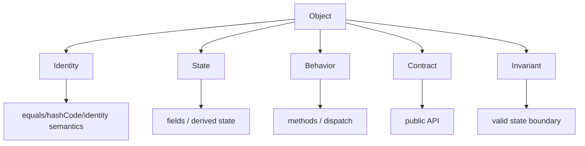
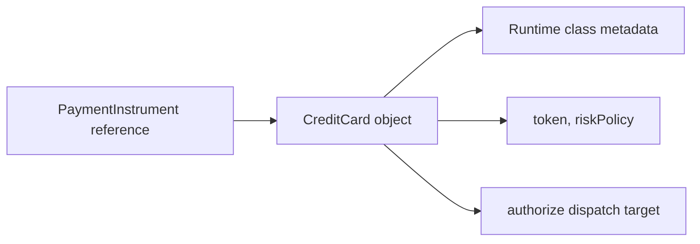
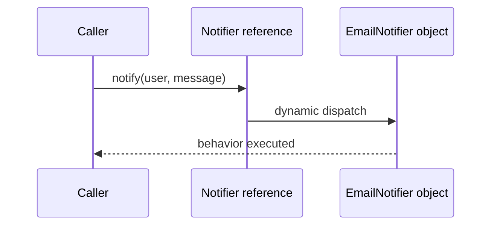
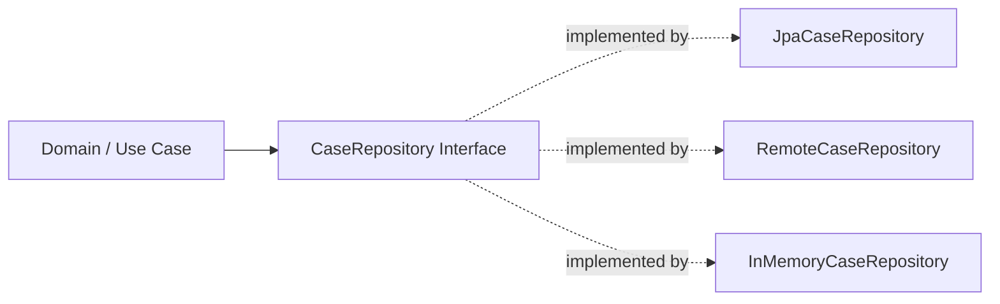
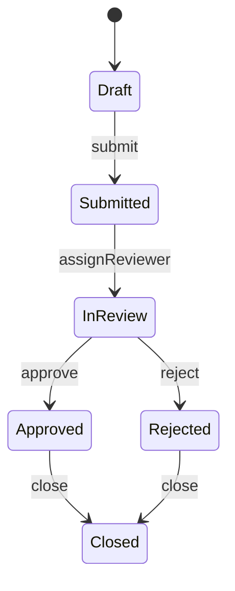
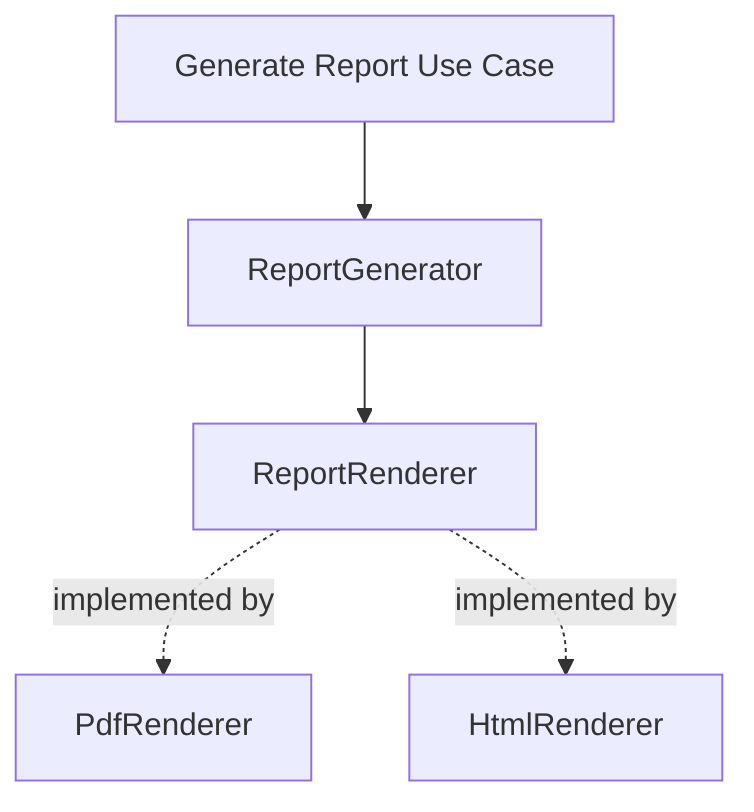

# Part 011 — OOP as Type and Behavior Modeling

> Target: mampu melihat OOP Java bukan sebagai kumpulan template class, pattern, getter/setter, atau diagram UML, tetapi sebagai **cara membentuk kontrak tipe, pemilik perilaku, batas invariant, dan dispatch behavior**.

OOP di Java sering diajarkan terlalu dangkal:

```text
Class punya field + method.
Object adalah instance dari class.
Inheritance berarti is-a.
Encapsulation berarti private field + getter/setter.
Polymorphism berarti method overriding.
```

Semua kalimat itu tidak salah, tetapi tidak cukup untuk engineering level tinggi.

Di sistem besar, OOP adalah alat untuk menjawab pertanyaan yang lebih keras:

- Siapa yang berhak mengubah state?
- Di mana invariant dipertahankan?
- Apa kontrak substitusi sebuah tipe?
- Apa bedanya entity, value, service, policy, strategy, adapter, dan capability?
- Kapan behavior harus menempel pada object, kapan harus dipisah?
- Bagaimana API tetap stabil saat implementasi berubah?
- Bagaimana mencegah class menjadi data bag atau god object?
- Bagaimana mendesain polymorphism agar extensible tanpa membuat sistem rapuh?

Part ini membangun fondasi tersebut.

---

## 1. Kaufman Framing: Skill yang Sedang Dilatih

Dalam framework Josh Kaufman, kita tidak mulai dari teori besar. Kita mulai dari **target performance**.

### 1.1 Target Performance

Setelah bagian ini, Anda harus bisa mengambil sebuah class Java dan menjawab:

```text
Untuk class ini:
  - Tipe apa yang sedang dimodelkan?
  - Kontrak apa yang dijanjikan tipe ini?
  - State apa yang sah?
  - Siapa yang menjaga invariant?
  - Behavior apa yang memang milik object ini?
  - Behavior apa yang seharusnya external policy/service?
  - Apakah subtype dapat menggantikan supertype tanpa kejutan?
  - Apakah public API memaksa caller memahami detail internal?
```

Jika Anda tidak bisa menjawab pertanyaan itu, class tersebut belum benar-benar didesain. Ia hanya “ditulis”.

### 1.2 Deconstruct the Skill

OOP sebagai skill bisa dipecah menjadi beberapa sub-skill:

| Sub-skill | Pertanyaan Utama | Output Engineering |
|---|---|---|
| Type modeling | “Benda/konsep apa yang sedang saya ekspresikan?” | class/interface/record/sealed hierarchy yang bermakna |
| Behavior ownership | “Siapa yang bertanggung jawab melakukan ini?” | method placement yang tidak acak |
| Invariant design | “State apa yang tidak boleh terjadi?” | constructor/factory/mutator yang menjaga validitas |
| Substitutability | “Apakah implementasi berbeda tetap aman dipakai?” | polymorphic contract |
| Collaboration modeling | “Object ini bekerja dengan siapa?” | dependency, role, adapter, policy, strategy |
| API boundary | “Apa yang boleh diketahui caller?” | public surface yang kecil dan stabil |
| Runtime model | “Apa dampaknya di dispatch, reflection, serialization?” | desain yang tidak hanya compile, tapi robust |

### 1.3 Remove Barriers

Hambatan belajar OOP untuk engineer berpengalaman biasanya bukan syntax, tetapi kebiasaan buruk:

- membuat class sebagai tabel database dalam bentuk Java;
- menaruh semua logic di service besar;
- menggunakan inheritance karena ingin reuse code, bukan substitutability;
- membuat interface hanya karena “best practice”, bukan karena ada role;
- membuka setter untuk semua field lalu berharap invariant tetap aman;
- membuat domain object terlalu anemik atau terlalu maha-kuasa;
- memakai pattern name sebagai pengganti reasoning.

### 1.4 Practice Loop

Latihan yang efektif:

1. Ambil class existing.
2. Tulis kontraknya dalam 5 kalimat.
3. Tulis invariant-nya.
4. Hapus semua method yang tidak menjaga invariant atau tidak merepresentasikan behavior natural class itu.
5. Pindahkan policy yang berubah-ubah ke collaborator.
6. Tulis test yang membuktikan invalid state tidak bisa dibuat.
7. Tulis test polymorphic untuk semua implementation.

---

## 2. Mental Model: Object Bukan Sekadar Data

Object Java bukan hanya “data + functions”. Object adalah **unit identitas, state, behavior, dan contract**.



Desain object yang baik tidak dimulai dari field. Ia dimulai dari **konsep dan responsibility**.

### 2.1 Field-First Design Bias

Banyak class Java buruk lahir dari urutan berpikir seperti ini:

```text
Ada tabel customer.
Kolomnya id, name, email, status.
Buat class Customer.
Generate getter/setter.
Selesai.
```

Hasilnya:

```java
public class Customer {
    private String id;
    private String name;
    private String email;
    private String status;

    public String getId() { return id; }
    public void setId(String id) { this.id = id; }

    public String getName() { return name; }
    public void setName(String name) { this.name = name; }

    public String getEmail() { return email; }
    public void setEmail(String email) { this.email = email; }

    public String getStatus() { return status; }
    public void setStatus(String status) { this.status = status; }
}
```

Masalahnya bukan karena getter/setter selalu salah. Masalahnya: class ini tidak mengatakan apa pun tentang domain behavior.

Apa status yang sah?

```text
ACTIVE?
SUSPENDED?
DELETED?
PENDING_VERIFICATION?
```

Transisi apa yang sah?

```text
PENDING -> ACTIVE
ACTIVE -> SUSPENDED
SUSPENDED -> ACTIVE
DELETED -> ACTIVE ?
```

Siapa yang boleh mengubah email?

```text
User sendiri?
Admin?
Compliance process?
Background reconciliation?
```

Class field-first membuat semua caller menjadi co-owner invariant. Itu desain yang rapuh.

### 2.2 Behavior-First Design

Pendekatan lebih baik:

```java
public final class CustomerAccount {
    private final CustomerId id;
    private EmailAddress email;
    private CustomerStatus status;

    private CustomerAccount(CustomerId id, EmailAddress email, CustomerStatus status) {
        this.id = Objects.requireNonNull(id);
        this.email = Objects.requireNonNull(email);
        this.status = Objects.requireNonNull(status);
    }

    public static CustomerAccount register(CustomerId id, EmailAddress email) {
        return new CustomerAccount(id, email, CustomerStatus.PENDING_VERIFICATION);
    }

    public void verifyEmail(EmailAddress verifiedEmail) {
        if (!this.email.equals(verifiedEmail)) {
            throw new IllegalArgumentException("Verified email does not match account email");
        }
        if (status != CustomerStatus.PENDING_VERIFICATION) {
            throw new IllegalStateException("Only pending accounts can be verified");
        }
        this.status = CustomerStatus.ACTIVE;
    }

    public void suspend(String reason) {
        if (status == CustomerStatus.DELETED) {
            throw new IllegalStateException("Deleted accounts cannot be suspended");
        }
        if (reason == null || reason.isBlank()) {
            throw new IllegalArgumentException("Suspension reason is required");
        }
        this.status = CustomerStatus.SUSPENDED;
    }

    public CustomerId id() {
        return id;
    }

    public CustomerStatus status() {
        return status;
    }
}
```

Perubahan penting:

| Dari | Menjadi |
|---|---|
| public setter | intention-revealing command |
| string status | constrained enum/type |
| object validitas tersebar | object menjaga invariant sendiri |
| caller tahu detail transisi | object menyediakan operation bermakna |
| semua state bisa diubah bebas | state berubah melalui behavior sah |

OOP yang kuat menyembunyikan representasi, tetapi mengekspresikan perilaku.

---

## 3. Class, Type, Object, and Contract

Di Java, `class` dan `type` sering dipakai bergantian, tetapi mental model-nya berbeda.

| Konsep | Arti Praktis |
|---|---|
| Class | blueprint implementasi: field, constructor, method body |
| Interface | contract/capability tanpa state instance langsung |
| Record | transparent carrier untuk immutable aggregate data |
| Enum | closed set of named singleton constants |
| Sealed type | controlled hierarchy, hanya subtype tertentu yang diizinkan |
| Object | runtime instance dengan identity dan behavior |
| Type | sesuatu yang dapat dipakai compiler untuk memeriksa operasi sah |

### 3.1 Type adalah Kontrak Operasi

Ketika Anda menulis:

```java
PaymentInstrument instrument;
```

Anda tidak sedang mengatakan implementasinya apa. Anda mengatakan:

> “Saya hanya butuh sesuatu yang memenuhi kontrak `PaymentInstrument`.”

Contoh:

```java
public interface PaymentInstrument {
    Authorization authorize(Money amount, Merchant merchant);
}
```

API consumer tidak peduli apakah implementasinya:

```text
CreditCard
DebitCard
WalletBalance
BankTransferMandate
```

Yang penting, semua dapat dipakai melalui kontrak yang sama.

### 3.2 Class adalah Implementasi Kontrak

```java
public final class CreditCard implements PaymentInstrument {
    private final CardToken token;
    private final RiskPolicy riskPolicy;

    @Override
    public Authorization authorize(Money amount, Merchant merchant) {
        riskPolicy.check(amount, merchant);
        return Authorization.approved(token, amount, merchant);
    }
}
```

`CreditCard` adalah salah satu cara memenuhi kontrak `PaymentInstrument`.

### 3.3 Object adalah Runtime Entity

```java
PaymentInstrument a = new CreditCard(token1, riskPolicy);
PaymentInstrument b = new CreditCard(token2, riskPolicy);
```

`a` dan `b` memiliki type reference yang sama, class runtime yang sama, tetapi identity dan state berbeda.

Mental model:



### 3.4 Contract Lebih Penting dari Shape

Dua class bisa punya method signature sama tapi contract berbeda.

```java
interface Cache<K, V> {
    V get(K key);
}
```

Apakah `get` boleh return `null`?

Apakah `get` melakukan remote call?

Apakah `get` thread-safe?

Apakah `get` memuat value kalau belum ada?

Apakah exception berarti key tidak ada, backend down, atau permission denied?

Signature tidak cukup. API contract harus menjelaskan behavior.

---

## 4. Behavior Ownership

Pertanyaan paling penting dalam OOP:

> Behavior ini milik siapa?

Buruk:

```java
public final class InvoiceService {
    public boolean isOverdue(Invoice invoice, LocalDate today) {
        return invoice.getDueDate().isBefore(today)
            && invoice.getStatus() != InvoiceStatus.PAID;
    }
}
```

Lebih baik:

```java
public final class Invoice {
    private final LocalDate dueDate;
    private InvoiceStatus status;

    public boolean isOverdueOn(LocalDate date) {
        return dueDate.isBefore(date) && status != InvoiceStatus.PAID;
    }
}
```

Mengapa?

Karena `isOverdue` adalah interpretasi state internal invoice. Kalau logic ini tersebar di service, setiap service harus tahu detail status dan due date.

### 4.1 Behavior yang Biasanya Milik Object

Behavior cenderung milik object jika:

- behavior hanya bergantung pada state internal object;
- behavior menjaga invariant object;
- behavior merepresentasikan lifecycle object;
- behavior adalah pertanyaan natural terhadap object;
- behavior mengurangi kebutuhan expose getter.

Contoh:

```java
invoice.isOverdueOn(today)
account.canWithdraw(amount)
subscription.renew(period)
caseFile.escalate(reason)
order.cancel(cancellationPolicy)
```

### 4.2 Behavior yang Tidak Selalu Milik Object

Behavior lebih baik dipisah jika:

- policy sering berubah;
- behavior butuh dependency eksternal;
- behavior adalah orchestration lintas aggregate/object;
- behavior membutuhkan I/O;
- behavior merupakan use case application layer;
- behavior tergantung tenant/config/regulasi/context.

Contoh buruk:

```java
public final class Customer {
    public void sendWelcomeEmail(SmtpClient smtpClient) {
        smtpClient.send(email, "Welcome");
    }
}
```

Lebih baik:

```java
public final class CustomerOnboardingService {
    private final EmailSender emailSender;

    public void welcome(Customer customer) {
        emailSender.sendWelcomeEmail(customer.email());
    }
}
```

### 4.3 Rule of Thumb

```text
If the behavior protects the object's truth, keep it near the object.
If the behavior coordinates the outside world, move it to a service/collaborator.
```

---

## 5. Invariant: Core of Serious OOP

Invariant adalah kondisi yang harus selalu benar selama object hidup.

Contoh invariant:

```text
Money amount cannot be negative.
Approved case must have approval timestamp.
Closed ticket cannot be reassigned.
Percentage must be between 0 and 100.
Date range start must be <= end.
Email address must be syntactically valid.
```

### 5.1 Object Tanpa Invariant adalah Struct Berbahaya

```java
public class DateRange {
    public LocalDate start;
    public LocalDate end;
}
```

Caller bisa membuat:

```java
DateRange range = new DateRange();
range.start = LocalDate.of(2026, 12, 31);
range.end = LocalDate.of(2026, 1, 1);
```

Tidak ada yang melarang invalid state.

### 5.2 Constructor as Invariant Gate

```java
public record DateRange(LocalDate start, LocalDate end) {
    public DateRange {
        Objects.requireNonNull(start, "start");
        Objects.requireNonNull(end, "end");
        if (end.isBefore(start)) {
            throw new IllegalArgumentException("end must not be before start");
        }
    }

    public boolean contains(LocalDate date) {
        return !date.isBefore(start) && !date.isAfter(end);
    }
}
```

Record bukan hanya DTO. Dengan compact constructor, record dapat menjadi value object yang menjaga invariant.

### 5.3 Mutation as Invariant Gate

Jika object mutable, setiap mutasi harus menjaga invariant.

```java
public final class WorkItem {
    private WorkItemStatus status;
    private Assignee assignee;

    public void assignTo(Assignee assignee) {
        Objects.requireNonNull(assignee, "assignee");
        if (status == WorkItemStatus.CLOSED) {
            throw new IllegalStateException("Closed work item cannot be reassigned");
        }
        this.assignee = assignee;
    }

    public void close() {
        if (assignee == null) {
            throw new IllegalStateException("Cannot close unassigned work item");
        }
        this.status = WorkItemStatus.CLOSED;
    }
}
```

Setter generik melemahkan invariant karena mutation path terlalu bebas.

### 5.4 Invariant Placement

| Invariant Type | Biasanya Ditempatkan Di |
|---|---|
| Field-level format | value object constructor/factory |
| Cross-field consistency | aggregate/entity constructor/method |
| Lifecycle transition | domain method/state machine |
| External policy | policy object/domain service |
| Persistence constraint | database + application validation |
| API contract | boundary DTO + use case validation |

Top 1% engineer tidak menaruh semua validation di satu layer. Mereka tahu invariant punya level.

---

## 6. Identity vs Value Semantics

OOP Java menjadi kacau ketika identity dan value semantics dicampur.

### 6.1 Identity Object

Identity object penting karena “siapa”-nya lebih penting daripada “isinya”.

Contoh:

```text
CustomerAccount
BankAccount
CaseFile
WorkflowInstance
Order
Ticket
Session
```

Dua `CustomerAccount` bisa punya field sama, tetapi tetap merepresentasikan entity berbeda jika identity berbeda.

```java
public final class CustomerAccount {
    private final CustomerId id;

    public CustomerId id() {
        return id;
    }
}
```

Untuk entity, `equals` biasanya berdasarkan identity stabil, bukan semua mutable fields.

### 6.2 Value Object

Value object penting karena “apa nilainya” lebih penting daripada identity object.

Contoh:

```text
Money
EmailAddress
DateRange
Percentage
CurrencyCode
PhoneNumber
Coordinates
```

Record sering cocok untuk value object:

```java
public record Money(BigDecimal amount, Currency currency) {
    public Money {
        Objects.requireNonNull(amount, "amount");
        Objects.requireNonNull(currency, "currency");
        if (amount.scale() > currency.getDefaultFractionDigits()) {
            throw new IllegalArgumentException("Amount scale exceeds currency fraction digits");
        }
    }

    public Money add(Money other) {
        requireSameCurrency(other);
        return new Money(amount.add(other.amount), currency);
    }

    private void requireSameCurrency(Money other) {
        if (!currency.equals(other.currency)) {
            throw new IllegalArgumentException("Currency mismatch");
        }
    }
}
```

### 6.3 Service Object

Service object biasanya tidak memiliki identity domain. Ia memiliki behavior dan dependency.

```java
public final class FraudScoringService {
    private final RiskModel riskModel;

    public FraudScore score(PaymentAttempt attempt) {
        return riskModel.evaluate(attempt.features());
    }
}
```

### 6.4 Policy Object

Policy object mengekspresikan aturan yang bisa berubah.

```java
public interface DiscountPolicy {
    Money discountFor(Customer customer, Cart cart);
}
```

Policy lebih fleksibel dibanding menaruh semua aturan di entity.

### 6.5 Class Stereotype Matrix

| Stereotype | Punya Identity? | Mutable? | Fokus | Contoh |
|---|---:|---:|---|---|
| Entity | Ya | Sering | lifecycle + invariant | `Order`, `CaseFile` |
| Value Object | Tidak | Sebaiknya tidak | valid value + operation | `Money`, `EmailAddress` |
| Service | Tidak domain-level | Biasanya stateless | orchestration/computation | `PaymentService` |
| Policy | Tidak | Biasanya stateless | configurable rule | `RetryPolicy` |
| Strategy | Tidak | Biasanya stateless | interchangeable algorithm | `PricingStrategy` |
| Adapter | Tidak penting | Bisa | translate boundary | `JpaCustomerRepository` |
| Event | Tidak entity | Immutable | fact that happened | `AccountSuspended` |
| Command | Tidak entity | Immutable | request/intention | `SuspendAccountCommand` |

---

## 7. Encapsulation is Behavioral, Not Cosmetic

Encapsulation bukan berarti field private lalu semua field punya getter/setter.

```java
private String status;
public String getStatus() { return status; }
public void setStatus(String status) { this.status = status; }
```

Ini hanya syntactic privacy. Secara semantic, state tetap terbuka penuh.

### 7.1 Real Encapsulation

Real encapsulation berarti caller tidak dapat membuat object invalid atau memaksa representasi internal tertentu.

```java
public final class Subscription {
    private final LocalDate startedAt;
    private LocalDate expiresAt;

    public void renewForMonths(int months) {
        if (months <= 0) {
            throw new IllegalArgumentException("months must be positive");
        }
        this.expiresAt = expiresAt.plusMonths(months);
    }

    public boolean isActiveOn(LocalDate date) {
        return !date.isBefore(startedAt) && date.isBefore(expiresAt);
    }
}
```

Caller tidak perlu tahu apakah subscription menyimpan `expiresAt`, `duration`, `period`, atau list renewal. API mengekspos capability, bukan representation.

### 7.2 Getter Leak

Getter tidak otomatis buruk, tetapi setiap getter menambah coupling.

```java
if (invoice.getDueDate().isBefore(today) && invoice.getStatus() != PAID) {
    // overdue
}
```

Lebih baik:

```java
if (invoice.isOverdueOn(today)) {
    // overdue
}
```

Pertanyaan sederhana:

> Apakah getter ini membuat caller mengambil keputusan yang seharusnya milik object?

Jika ya, ganti dengan intention-revealing method.

---

## 8. Polymorphism: Dispatching Behavior Through Contract

Polymorphism sering dijelaskan sebagai “method overriding”. Lebih tepat:

> Polymorphism adalah kemampuan kode menggunakan kontrak tipe tanpa mengetahui implementasi konkret, lalu runtime memilih behavior yang tepat.

### 8.1 Conditional Logic Smell

```java
public Money calculateFee(PaymentMethod method, Money amount) {
    return switch (method.type()) {
        case CARD -> amount.multiply(new BigDecimal("0.029"));
        case BANK_TRANSFER -> Money.zero(amount.currency());
        case WALLET -> amount.multiply(new BigDecimal("0.010"));
    };
}
```

Jika `PaymentMethod` memiliki behavior berbeda berdasarkan type-nya, pertimbangkan polymorphism:

```java
public interface PaymentMethod {
    Money feeFor(Money amount);
}

public final class CardPayment implements PaymentMethod {
    @Override
    public Money feeFor(Money amount) {
        return amount.multiply(new BigDecimal("0.029"));
    }
}

public final class BankTransferPayment implements PaymentMethod {
    @Override
    public Money feeFor(Money amount) {
        return Money.zero(amount.currency());
    }
}
```

### 8.2 Kapan Switch Lebih Baik?

Polymorphism bukan selalu lebih baik. `switch` bisa lebih baik jika:

- variasi tertutup dan kecil;
- semua behavior berada di satu tempat secara sengaja;
- menggunakan sealed hierarchy untuk exhaustiveness;
- operation lebih sering berubah daripada variant;
- Anda butuh central policy table.

Dengan sealed types:

```java
public sealed interface PaymentMethod
        permits CardPayment, BankTransferPayment, WalletPayment {
}

public record CardPayment(CardToken token) implements PaymentMethod {}
public record BankTransferPayment(BankAccount account) implements PaymentMethod {}
public record WalletPayment(WalletId walletId) implements PaymentMethod {}
```

Lalu:

```java
public Money feeFor(PaymentMethod method, Money amount) {
    return switch (method) {
        case CardPayment ignored -> amount.multiply(new BigDecimal("0.029"));
        case BankTransferPayment ignored -> Money.zero(amount.currency());
        case WalletPayment ignored -> amount.multiply(new BigDecimal("0.010"));
    };
}
```

Perhatikan trade-off:

| Desain | Mudah Tambah Variant | Mudah Tambah Operation |
|---|---:|---:|
| Polymorphic method | Ya | Tidak selalu |
| Central switch over sealed type | Tidak selalu | Ya |
| Visitor | Sedang | Sedang, tapi verbose |

Top engineer tidak anti-`switch`; mereka tahu kapan polymorphism memberi value.

---

## 9. Dynamic Dispatch Mental Model

Di Java, instance method overriding dipilih berdasarkan runtime class object, bukan static type reference.

```java
interface Notifier {
    void notify(User user, Message message);
}

final class EmailNotifier implements Notifier {
    @Override
    public void notify(User user, Message message) {
        // send email
    }
}

Notifier notifier = new EmailNotifier();
notifier.notify(user, message);
```

Compile-time melihat `Notifier#notify`. Runtime dispatch ke `EmailNotifier#notify`.



### 9.1 Dispatch and API Design

Polymorphic dispatch kuat jika contract jelas.

Buruk:

```java
public interface Processor {
    void process(Object input);
}
```

Masalah:

- input tidak punya semantic type;
- error terjadi runtime;
- implementation harus melakukan cast;
- contract tidak jelas.

Lebih baik:

```java
public interface CommandHandler<C extends Command> {
    HandlingResult handle(C command);
}
```

Tetapi type erasure punya konsekuensi yang akan dibahas nanti pada bagian generics.

---

## 10. Role Modeling with Interfaces

Interface seharusnya merepresentasikan role/capability, bukan sekadar “supaya bisa di-mock”.

### 10.1 Good Interface Names

Interface bagus sering menjawab:

```text
Apa yang bisa dilakukan object ini?
```

Contoh:

```java
public interface Clock {
    Instant now();
}

public interface IdGenerator<T> {
    T nextId();
}

public interface Validator<T> {
    ValidationResult validate(T candidate);
}

public interface Repository<ID, E> {
    Optional<E> findById(ID id);
    E save(E entity);
}
```

### 10.2 Weak Interface Smells

```java
public interface CustomerServiceInterface {
    Customer getCustomer(String id);
    void saveCustomer(Customer customer);
    void deleteCustomer(String id);
    void sendEmail(Customer customer);
    void exportCustomer(Customer customer);
}
```

Smells:

- nama mengulang implementasi;
- terlalu banyak responsibility;
- tidak merepresentasikan satu role;
- operation campur persistence, notification, export;
- caller mungkin hanya butuh satu method tapi dipaksa depend pada semua.

Lebih baik pecah berdasarkan role:

```java
public interface CustomerLookup {
    Optional<Customer> findCustomer(CustomerId id);
}

public interface CustomerStore {
    Customer save(Customer customer);
}

public interface CustomerExporter {
    ExportedFile export(Customer customer);
}
```

### 10.3 Interface as Port

Dalam architecture, interface sering menjadi port:

```java
public interface CaseRepository {
    Optional<CaseFile> findById(CaseId id);
    CaseFile save(CaseFile caseFile);
}
```

Implementation bisa database, memory, remote API, atau event-sourced store.



Interface bukan goal. Interface adalah boundary ketika ada alasan variasi, test seam, atau dependency inversion.

---

## 11. Class Responsibility Boundaries

Satu class idealnya punya responsibility yang dapat dijelaskan singkat.

Buruk:

```java
public final class OrderManager {
    public void validate(Order order) {}
    public void calculatePrice(Order order) {}
    public void reserveInventory(Order order) {}
    public void chargePayment(Order order) {}
    public void sendEmail(Order order) {}
    public void writeAuditLog(Order order) {}
    public void exportCsv(Order order) {}
}
```

Ini bukan object model. Ini procedural script dalam satu class.

Lebih baik:

```text
Order                     -> owns order lifecycle invariant
PricingService            -> computes price using policy/catalog
InventoryReservationPort  -> reserves stock
PaymentGateway            -> charges payment
OrderNotificationService  -> sends messages
AuditSink                 -> records audit event
OrderExporter             -> export concern
```

### 11.1 Responsibility Split Heuristic

Pisahkan class ketika:

- alasan berubahnya berbeda;
- dependency-nya berbeda;
- test setup-nya berbeda;
- caller yang membutuhkan behavior berbeda;
- lifecycle-nya berbeda;
- failure mode-nya berbeda.

Gabungkan behavior ketika:

- invariant-nya sama;
- state-nya sama;
- caller selalu membutuhkan bersama;
- split hanya membuat anaemic pass-through;
- tidak ada variasi nyata.

---

## 12. Lifecycle Modeling

Banyak object penting memiliki lifecycle.

```text
DRAFT -> SUBMITTED -> REVIEWED -> APPROVED -> CLOSED
```

Buruk:

```java
caseFile.setStatus(CaseStatus.APPROVED);
```

Lebih baik:

```java
caseFile.approve(approver, decisionTime);
```

Karena approve bukan hanya status assignment. Ia mungkin perlu:

- memastikan current state valid;
- menyimpan approver;
- menyimpan timestamp;
- menghasilkan domain event;
- menolak approval ganda;
- memastikan required evidence lengkap.

### 12.1 Lifecycle Method Example

```java
public final class ReviewCase {
    private final CaseId id;
    private CaseStatus status;
    private Reviewer assignedReviewer;
    private Instant submittedAt;
    private Instant approvedAt;

    public void submit(Instant now) {
        if (status != CaseStatus.DRAFT) {
            throw new IllegalStateException("Only draft cases can be submitted");
        }
        this.status = CaseStatus.SUBMITTED;
        this.submittedAt = Objects.requireNonNull(now);
    }

    public void assignReviewer(Reviewer reviewer) {
        if (status != CaseStatus.SUBMITTED) {
            throw new IllegalStateException("Only submitted cases can be assigned");
        }
        this.assignedReviewer = Objects.requireNonNull(reviewer);
        this.status = CaseStatus.IN_REVIEW;
    }

    public void approve(Reviewer reviewer, Instant now) {
        if (status != CaseStatus.IN_REVIEW) {
            throw new IllegalStateException("Only cases in review can be approved");
        }
        if (!reviewer.equals(assignedReviewer)) {
            throw new IllegalArgumentException("Only assigned reviewer can approve");
        }
        this.status = CaseStatus.APPROVED;
        this.approvedAt = Objects.requireNonNull(now);
    }
}
```

OOP di sini bukan “class punya method”. OOP adalah state machine yang disembunyikan di balik intention-revealing API.

### 12.2 Diagram Lifecycle



---

## 13. Anemic Domain Model vs God Object

Dua ekstrem umum:

### 13.1 Anemic Domain Model

```java
public class Order {
    private List<OrderLine> lines;
    private OrderStatus status;
    // getters/setters only
}

public class OrderService {
    public void submit(Order order) {
        if (order.getLines().isEmpty()) throw ...;
        order.setStatus(OrderStatus.SUBMITTED);
    }
}
```

Semua behavior di service. Object hanya data.

Masalah:

- invariant tersebar;
- domain object tidak melindungi dirinya;
- caller lain bisa bypass service;
- test domain behavior menjadi test service besar;
- model tidak mengajari programmer baru apa yang sah.

### 13.2 God Object

```java
public class Order {
    public void submit() {}
    public void calculateTax() {}
    public void reserveInventory() {}
    public void chargeCreditCard() {}
    public void sendEmail() {}
    public void writeToDatabase() {}
}
```

Object terlalu tahu dunia luar.

Masalah:

- dependency meledak;
- sulit test;
- domain tercampur infrastructure;
- lifecycle domain tercampur use case orchestration;
- object tidak portable.

### 13.3 Balanced Model

```text
Order owns order invariant and lifecycle transition.
PricingPolicy computes price rules.
PaymentGateway charges external payment.
InventoryPort reserves external stock.
Application service coordinates transaction/use case.
```

```java
public final class SubmitOrderUseCase {
    private final OrderRepository orders;
    private final InventoryPort inventory;
    private final PaymentGateway payment;

    public OrderReceipt submit(OrderId id, PaymentDetails paymentDetails) {
        Order order = orders.findRequired(id);
        order.submit();

        inventory.reserve(order.items());
        PaymentReceipt receipt = payment.charge(order.total(), paymentDetails);

        order.markPaid(receipt.id());
        orders.save(order);

        return OrderReceipt.from(order, receipt);
    }
}
```

Object menjaga rule internal. Use case mengatur dunia luar.

---

## 14. Tell, Don't Ask — With Nuance

Prinsip “Tell, Don’t Ask” berarti jangan ambil state object lalu ambil keputusan di luar jika object bisa melakukan behavior itu sendiri.

Buruk:

```java
if (account.getBalance().compareTo(amount) >= 0) {
    account.setBalance(account.getBalance().subtract(amount));
}
```

Lebih baik:

```java
account.withdraw(amount);
```

Tetapi jangan ekstrem. Kadang query method memang perlu.

Baik:

```java
if (subscription.isActiveOn(today)) {
    featureGate.enablePremiumFeatures();
}
```

`subscription` menjawab pertanyaan domain. Caller tetap mengambil keputusan use case.

### 14.1 Nuanced Rule

```text
Ask object about its own truth.
Tell object to perform its own state transition.
Do not make object orchestrate unrelated external systems.
```

---

## 15. Modeling Collaboration

Object rarely lives alone. Yang penting adalah dependency shape.

### 15.1 Direct Construction Coupling

```java
public final class ReportGenerator {
    public Report generate(CaseFile file) {
        PdfRenderer renderer = new PdfRenderer();
        return renderer.render(file);
    }
}
```

Masalah: `ReportGenerator` terkunci ke `PdfRenderer`.

### 15.2 Constructor Dependency

```java
public final class ReportGenerator {
    private final ReportRenderer renderer;

    public ReportGenerator(ReportRenderer renderer) {
        this.renderer = Objects.requireNonNull(renderer);
    }

    public Report generate(CaseFile file) {
        return renderer.render(file);
    }
}
```

Sekarang dependency diekspresikan sebagai role.

### 15.3 Collaboration Diagram



---

## 16. Mutability Choices

Mutability adalah keputusan desain OOP yang mahal.

| Choice | Kelebihan | Risiko |
|---|---|---|
| Immutable value | aman, mudah test, thread-friendly | perlu copy/new object |
| Mutable entity | cocok lifecycle panjang | invariant harus dijaga ketat |
| Mutable DTO | simple mapping | mudah bocor ke domain |
| Builder | konstruksi fleksibel | builder bisa invalid jika tidak divalidasi |
| Copy-with method | immutable evolution | boilerplate jika kompleks |

### 16.1 Immutable Value Example

```java
public record Percentage(int value) {
    public Percentage {
        if (value < 0 || value > 100) {
            throw new IllegalArgumentException("Percentage must be between 0 and 100");
        }
    }

    public BigDecimal asRatio() {
        return BigDecimal.valueOf(value).movePointLeft(2);
    }
}
```

### 16.2 Mutable Entity Example

```java
public final class SupportTicket {
    private final TicketId id;
    private TicketStatus status;
    private Agent assignee;

    public void assignTo(Agent agent) {
        if (status == TicketStatus.CLOSED) {
            throw new IllegalStateException("Closed ticket cannot be assigned");
        }
        this.assignee = Objects.requireNonNull(agent);
    }
}
```

Mutation sah karena entity punya lifecycle.

---

## 17. Nullability as Object Model Concern

Null bukan sekadar runtime hazard. Null memengaruhi kontrak object.

Buruk:

```java
public final class Employee {
    private Manager manager;

    public Manager getManager() {
        return manager;
    }
}
```

Apakah `manager` boleh null? Belum jelas.

Lebih eksplisit:

```java
public Optional<Manager> manager() {
    return Optional.ofNullable(manager);
}
```

Atau modelkan variasi:

```java
public sealed interface ReportingLine permits HasManager, NoManager {
}

public record HasManager(Manager manager) implements ReportingLine {
    public HasManager {
        Objects.requireNonNull(manager);
    }
}

public record NoManager() implements ReportingLine {
}
```

Gunakan `Optional` untuk return value ketika absence adalah hasil yang wajar. Hindari menyimpan `Optional` sebagai field domain tanpa alasan kuat.

---

## 18. Exception Semantics in OOP

Exception adalah bagian dari behavior contract.

```java
public void withdraw(Money amount)
```

Pertanyaan:

- Apa yang terjadi jika amount negatif?
- Apa yang terjadi jika balance kurang?
- Apa yang terjadi jika account closed?
- Apakah method atomic?
- Apakah sebagian state bisa berubah sebelum exception?

Contoh:

```java
public void withdraw(Money amount) {
    requirePositive(amount);
    if (status != AccountStatus.ACTIVE) {
        throw new IllegalStateException("Only active accounts can withdraw");
    }
    if (balance.isLessThan(amount)) {
        throw new InsufficientFundsException(id, amount, balance);
    }
    this.balance = balance.subtract(amount);
}
```

Contract harus menjelaskan precondition dan failure mode.

---

## 19. Object Model Review Checklist

Gunakan checklist ini saat review code.

### 19.1 Type Meaning

```text
[ ] Nama class merepresentasikan konsep jelas.
[ ] Public methods merepresentasikan behavior, bukan manipulasi field acak.
[ ] Interface merepresentasikan role/capability, bukan sekadar mock seam.
[ ] Record digunakan untuk value/data transparan, bukan entity mutable.
[ ] Enum/sealed type digunakan jika state space tertutup.
```

### 19.2 Invariant

```text
[ ] Invalid state tidak bisa dibuat lewat constructor/factory.
[ ] Invalid transition tidak bisa dilakukan lewat public API.
[ ] Setter tidak melemahkan invariant.
[ ] Getter tidak memaksa caller mengambil keputusan internal.
[ ] Mutation method atomic secara semantic.
```

### 19.3 Behavior Ownership

```text
[ ] Behavior yang menjaga object truth berada dekat object.
[ ] Policy yang berubah-ubah dipisah menjadi collaborator.
[ ] I/O dan external orchestration tidak bocor ke entity/value object.
[ ] Use case mengkoordinasi, bukan mengambil alih semua domain behavior.
```

### 19.4 Polymorphism

```text
[ ] Contract polymorphic jelas.
[ ] Semua implementation memenuhi pre/postcondition supertype.
[ ] Tidak ada instanceof/switch yang mengindikasikan missing behavior tanpa alasan.
[ ] Jika memakai sealed + switch, variasi memang tertutup.
```

---

## 20. Practice Lab

### 20.1 Refactor Data Bag

Mulai dari class ini:

```java
public class LoanApplication {
    private String id;
    private String applicantId;
    private BigDecimal amount;
    private String status;
    private LocalDate submittedDate;

    public String getId() { return id; }
    public void setId(String id) { this.id = id; }
    public BigDecimal getAmount() { return amount; }
    public void setAmount(BigDecimal amount) { this.amount = amount; }
    public String getStatus() { return status; }
    public void setStatus(String status) { this.status = status; }
}
```

Tugas:

1. Ganti primitive/string obsession dengan value object dan enum.
2. Hilangkan setter publik.
3. Tambahkan factory `draft` atau `submit`.
4. Tambahkan behavior `submit`, `approve`, `reject`, `withdraw`.
5. Tambahkan invariant: amount positive, submitted application cannot change amount, approved application cannot be withdrawn.

### 20.2 Expected Direction

```java
public final class LoanApplication {
    private final LoanApplicationId id;
    private final ApplicantId applicantId;
    private Money requestedAmount;
    private LoanApplicationStatus status;
    private LocalDate submittedDate;

    public static LoanApplication draft(
            LoanApplicationId id,
            ApplicantId applicantId,
            Money requestedAmount
    ) {
        return new LoanApplication(id, applicantId, requestedAmount, LoanApplicationStatus.DRAFT, null);
    }

    public void submit(LocalDate today) {
        if (status != LoanApplicationStatus.DRAFT) {
            throw new IllegalStateException("Only draft applications can be submitted");
        }
        this.status = LoanApplicationStatus.SUBMITTED;
        this.submittedDate = Objects.requireNonNull(today);
    }

    public void approve() {
        if (status != LoanApplicationStatus.SUBMITTED) {
            throw new IllegalStateException("Only submitted applications can be approved");
        }
        this.status = LoanApplicationStatus.APPROVED;
    }
}
```

---

## 21. Common Failure Modes

### 21.1 Data Class Everywhere

Symptom:

```text
All classes have only fields, getters, setters.
All behavior lives in services.
```

Consequence:

- invariant scattered;
- service explosion;
- domain rules duplicated;
- invalid state easy.

### 21.2 Interface for Every Class

Symptom:

```text
UserService interface has exactly one UserServiceImpl.
No alternative implementation.
No meaningful role abstraction.
```

Consequence:

- more files;
- weaker discoverability;
- false abstraction;
- API surface noise.

### 21.3 Inheritance for Code Reuse

Symptom:

```text
Subclass exists only to reuse helper methods/fields.
```

Consequence:

- fragile base class;
- hidden coupling;
- broken substitutability.

Part 012 akan membedah ini detail.

### 21.4 Over-Encapsulation

Symptom:

```text
Every class hides everything, but no useful behavior emerges.
```

Consequence:

- awkward API;
- too many pass-through methods;
- hard composition.

Encapsulation harus melayani behavior, bukan menjadi ritual.

---

## 22. What Top Engineers Do Differently

Mereka tidak bertanya:

> “Pattern apa yang cocok?”

Mereka bertanya:

```text
What is the stable concept?
What is the changing policy?
Where is the invariant?
What does the type promise?
What should be impossible?
What should callers not need to know?
What can vary without changing the public API?
```

OOP yang kuat membuat perubahan menjadi lokal.

---

## 23. Summary

Dalam Java, OOP yang matang berarti:

- class bukan sekadar field container;
- type adalah kontrak operasi;
- object menjaga invariant;
- behavior ditempatkan berdasarkan ownership;
- identity dan value semantics tidak dicampur;
- polymorphism dipakai untuk contract-based variation;
- interface merepresentasikan role/capability;
- service mengorkestrasi dunia luar, bukan mengambil semua domain logic;
- lifecycle direpresentasikan melalui method bermakna;
- invalid state dibuat sulit atau mustahil.

Part berikutnya akan membedah pertanyaan yang sering disederhanakan terlalu jauh:

> Inheritance atau composition?

Kita akan melihat bahwa jawaban yang benar bukan “always prefer composition”, tetapi:

> Gunakan inheritance hanya ketika substitutability contract kuat, extension points terkendali, dan superclass memang didesain untuk diwariskan.

---

## References

- Java Language Specification, Java SE 25 Edition — Classes, Interfaces, Type System, and Binary Compatibility: https://docs.oracle.com/javase/specs/jls/se25/html/index.html
- Java SE 25 API — `java.lang.Object`: https://docs.oracle.com/en/java/javase/25/docs/api/java.base/java/lang/Object.html
- Java SE 25 API — `java.lang.Record`: https://docs.oracle.com/en/java/javase/25/docs/api/java.base/java/lang/Record.html
- Java SE 25 API — `java.lang.Enum`: https://docs.oracle.com/en/java/javase/25/docs/api/java.base/java/lang/Enum.html
- Java SE 25 API — `java.lang.Class`: https://docs.oracle.com/en/java/javase/25/docs/api/java.base/java/lang/Class.html
