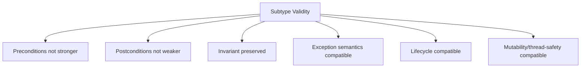
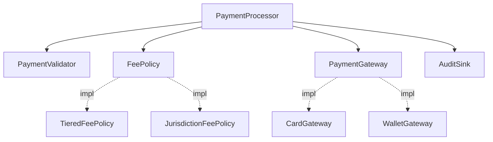

# Part 012 — Inheritance, Composition, and Substitutability

> Target: mampu memutuskan kapan inheritance valid, kapan composition lebih tepat, bagaimana menerapkan substitutability, dan bagaimana mendesain class yang aman untuk extension di Java.

Kalimat populer:

> Prefer composition over inheritance.

Kalimat ini berguna, tetapi sering dipahami terlalu dangkal. Engineer yang matang tidak berhenti di slogan. Mereka bertanya:

```text
Apa kontrak supertype?
Apakah subtype bisa menggantikan supertype tanpa mengejutkan caller?
Apakah superclass memang dirancang untuk inheritance?
Apakah reuse code sedang disamarkan sebagai type relationship?
Apa extension point yang stabil?
Apa yang boleh dioverride dan apa yang final?
Apakah invariant superclass bisa dirusak subclass?
```

Part ini membangun mental model untuk menjawab pertanyaan itu.

---

## 1. Kaufman Framing: Skill yang Sedang Dilatih

### 1.1 Target Performance

Setelah part ini, Anda harus bisa melihat relasi antar class dan mengklasifikasikannya:

```text
Relasi antar konsep:
  ├─ true subtype?             -> inheritance/interface implementation mungkin valid
  ├─ uses behavior?            -> composition/dependency
  ├─ owns component?           -> composition/aggregation
  ├─ configurable algorithm?   -> strategy/policy
  ├─ closed variant set?       -> sealed hierarchy
  ├─ reuse helper code?        -> delegation/utility/skeletal implementation
  └─ framework extension?      -> documented protected hooks/template method
```

### 1.2 The One-Sentence Shortcut

Inheritance adalah benar ketika subtype dapat dipakai di semua tempat supertype dipakai tanpa memperlemah kontrak.

Composition adalah benar ketika object membutuhkan behavior/part/collaborator tanpa menjadi subtype dari collaborator tersebut.

### 1.3 Practice Loop

Latihan untuk setiap hierarchy:

1. Tulis kontrak supertype dalam bahasa manusia.
2. Tulis precondition, postcondition, invariant.
3. Ambil setiap subtype dan cek apakah kontrak diperkuat atau dilemahkan.
4. Cari overridden method yang memanggil atau bergantung pada state superclass.
5. Cari protected field/method yang bisa merusak invariant.
6. Ganti inheritance yang hanya reuse code dengan composition.
7. Tambahkan polymorphic contract tests.

---

## 2. Inheritance Has Two Meanings

Di Java, inheritance sering menggabungkan dua tujuan berbeda:

```text
1. Type relationship: subtype adalah variasi sah dari supertype.
2. Implementation reuse: subclass memakai ulang field/method superclass.
```

Masalah muncul ketika tujuan kedua menyamar sebagai tujuan pertama.

### 2.1 Valid Type Relationship

```java
public interface NotificationChannel {
    void send(Notification notification);
}

public final class EmailChannel implements NotificationChannel {
    @Override
    public void send(Notification notification) {
        // send email
    }
}

public final class SmsChannel implements NotificationChannel {
    @Override
    public void send(Notification notification) {
        // send sms
    }
}
```

`EmailChannel` dan `SmsChannel` adalah variasi sah dari `NotificationChannel` karena caller hanya membutuhkan capability `send`.

### 2.2 Weak Inheritance for Reuse

```java
public class CsvReportGenerator extends FileWriterHelper {
    public Report generate(DataSet dataSet) {
        writeHeader();
        writeRows(dataSet);
        return closeFile();
    }
}
```

Apakah `CsvReportGenerator` benar-benar `FileWriterHelper`? Tidak. Ia hanya ingin memakai helper method.

Lebih baik:

```java
public final class CsvReportGenerator {
    private final ReportFileWriter writer;

    public CsvReportGenerator(ReportFileWriter writer) {
        this.writer = Objects.requireNonNull(writer);
    }

    public Report generate(DataSet dataSet) {
        writer.writeHeader();
        writer.writeRows(dataSet);
        return writer.closeFile();
    }
}
```

Composition membuat dependency eksplisit.

---

## 3. Substitutability: LSP as Engineering Contract

Liskov Substitution Principle sering dikutip sebagai:

> Subtypes must be substitutable for their base types.

Versi engineering-nya:

> Kode yang benar terhadap supertype harus tetap benar ketika diberi instance subtype.

### 3.1 Contract Dimensions

Subtype tidak boleh:

- menuntut precondition lebih kuat;
- memberi postcondition lebih lemah;
- merusak invariant supertype;
- mengubah exception semantics secara mengejutkan;
- mengubah lifecycle semantics tanpa dokumentasi;
- mengubah mutability/thread-safety contract;
- mengubah performance expectation secara ekstrem jika contract mengimplikasikan batas tertentu.



### 3.2 Bad Example: Stronger Precondition

```java
public interface DocumentStore {
    void save(Document document);
}
```

Implementation buruk:

```java
public final class PdfOnlyDocumentStore implements DocumentStore {
    @Override
    public void save(Document document) {
        if (!document.fileName().endsWith(".pdf")) {
            throw new IllegalArgumentException("Only PDF is supported");
        }
        // save
    }
}
```

Jika kontrak `DocumentStore` mengatakan semua `Document` sah, maka `PdfOnlyDocumentStore` memperkuat precondition. Caller yang benar terhadap `DocumentStore` bisa rusak.

Solusi 1: ubah type contract.

```java
public interface DocumentStore<D extends Document> {
    void save(D document);
}

public final class PdfDocumentStore implements DocumentStore<PdfDocument> {
    @Override
    public void save(PdfDocument document) {
        // save pdf
    }
}
```

Solusi 2: buat capability lebih spesifik.

```java
public interface PdfDocumentStore {
    void save(PdfDocument document);
}
```

### 3.3 Bad Example: Weaker Postcondition

```java
public interface IdGenerator<T> {
    T nextId();
}
```

Jika contract menyatakan `nextId()` tidak pernah return null, implementation ini melanggar:

```java
public final class NullableIdGenerator implements IdGenerator<OrderId> {
    @Override
    public OrderId nextId() {
        return maybeUnavailable() ? null : OrderId.random();
    }
}
```

Solusi:

```java
public interface OptionalIdGenerator<T> {
    Optional<T> tryNextId();
}
```

Jangan menyembunyikan contract berbeda di subtype yang sama.

---

## 4. The Rectangle-Square Trap, Java Edition

Contoh klasik: `Square` sebagai subtype `Rectangle`.

```java
public class Rectangle {
    private int width;
    private int height;

    public void setWidth(int width) {
        this.width = width;
    }

    public void setHeight(int height) {
        this.height = height;
    }

    public int area() {
        return width * height;
    }
}
```

Lalu:

```java
public class Square extends Rectangle {
    @Override
    public void setWidth(int width) {
        super.setWidth(width);
        super.setHeight(width);
    }

    @Override
    public void setHeight(int height) {
        super.setWidth(height);
        super.setHeight(height);
    }
}
```

Secara matematika, square adalah rectangle. Secara mutable object contract, belum tentu.

Caller yang benar terhadap `Rectangle`:

```java
void resize(Rectangle r) {
    r.setWidth(10);
    r.setHeight(5);
    assert r.area() == 50;
}
```

Jika diberi `Square`, assertion gagal. Substitutability rusak.

### 4.1 Fix: Immutable Value Shape

```java
public sealed interface Shape permits Rectangle, Square {
    int area();
}

public record Rectangle(int width, int height) implements Shape {
    public Rectangle {
        if (width <= 0 || height <= 0) throw new IllegalArgumentException();
    }

    @Override
    public int area() {
        return width * height;
    }
}

public record Square(int side) implements Shape {
    public Square {
        if (side <= 0) throw new IllegalArgumentException();
    }

    @Override
    public int area() {
        return side * side;
    }
}
```

Masalah hilang karena mutating setters hilang, dan supertype `Shape` punya contract yang benar-benar sama untuk semua subtype.

---

## 5. Why “is-a” Is Not Enough

“Square is a rectangle” bisa benar secara taxonomy tetapi salah secara software contract.

Pertanyaan yang lebih berguna:

```text
Can every operation promised by the supertype be validly supported by the subtype?
```

### 5.1 Taxonomy vs Behavior

| Question | Weak | Strong |
|---|---|---|
| Taxonomy | “Apakah X adalah Y?” | “Dalam konteks operasi API ini, apakah X bisa menggantikan Y?” |
| Reuse | “Butuh method dari parent?” | “Apakah parent contract benar untuk child?” |
| Modeling | “Mirip secara dunia nyata?” | “Apakah invariant dan lifecycle compatible?” |

### 5.2 Real Example: Read-Only vs Mutable Collection

```java
public interface MutableBag<E> {
    void add(E element);
    boolean remove(E element);
    int size();
}
```

Read-only bag tidak boleh implement ini lalu throw `UnsupportedOperationException` untuk `add` jika contract mengatakan mutable.

Lebih baik:

```java
public interface Bag<E> {
    int size();
    boolean contains(E element);
}

public interface MutableBag<E> extends Bag<E> {
    void add(E element);
    boolean remove(E element);
}
```

Capability dipisah.

---

## 6. Inheritance in Java: Mechanics That Matter

Java class inheritance memiliki sifat berikut:

- class hanya bisa `extends` satu class;
- class bisa `implements` banyak interface;
- instance methods dapat dioverride jika tidak `final`, `static`, atau private;
- fields tidak dioverride, tetapi disembunyikan/hiding;
- static methods tidak polymorphic seperti instance methods;
- constructors tidak diwariskan;
- superclass constructor selalu dijalankan sebelum subclass constructor body;
- `protected` membuka akses ke subclass dan package;
- `final` class tidak bisa diwariskan;
- `sealed` class membatasi subtype yang diizinkan.

### 6.1 Overriding vs Overloading vs Hiding

```java
class Parent {
    void process(String value) {}
    static void describe() {}
    String name = "parent";
}

class Child extends Parent {
    @Override
    void process(String value) {}       // overriding

    void process(Object value) {}       // overloading, not overriding

    static void describe() {}           // hiding, not polymorphic overriding

    String name = "child";              // field hiding
}
```

Field hiding dan static method hiding sering menyebabkan confusion. Jangan gunakan sebagai desain API.

### 6.2 Constructor Execution Hazard

Superclass constructor dapat memanggil overridable method. Ini berbahaya.

```java
public class BaseProcessor {
    public BaseProcessor() {
        initialize();
    }

    protected void initialize() {
    }
}

public class FileProcessor extends BaseProcessor {
    private final Path path;

    public FileProcessor(Path path) {
        this.path = path;
    }

    @Override
    protected void initialize() {
        // path is still null when BaseProcessor constructor calls this
        path.toAbsolutePath();
    }
}
```

Jangan panggil overridable method dari constructor.

Solusi:

```java
public abstract class BaseProcessor {
    protected BaseProcessor() {
    }

    public final void start() {
        initialize();
    }

    protected abstract void initialize();
}
```

Namun tetap dokumentasikan lifecycle: object harus constructed sebelum `start`.

---

## 7. Fragile Base Class Problem

Fragile base class problem terjadi ketika perubahan internal superclass mematahkan subclass meskipun public API superclass tampak kompatibel.

### 7.1 Example: Self-Use of Overridable Methods

```java
public class AuditedList<E> extends ArrayList<E> {
    private int addCount;

    @Override
    public boolean add(E e) {
        addCount++;
        return super.add(e);
    }

    @Override
    public boolean addAll(Collection<? extends E> c) {
        addCount += c.size();
        return super.addAll(c);
    }

    public int addCount() {
        return addCount;
    }
}
```

Jika `ArrayList.addAll` internally calls `add`, count bisa double tergantung implementation details. Bahkan jika tidak terjadi hari ini, subclass bergantung pada self-use internals superclass.

Lebih baik composition:

```java
public final class AuditedList<E> {
    private final List<E> delegate;
    private int addCount;

    public AuditedList(List<E> delegate) {
        this.delegate = Objects.requireNonNull(delegate);
    }

    public boolean add(E e) {
        addCount++;
        return delegate.add(e);
    }

    public boolean addAll(Collection<? extends E> elements) {
        addCount += elements.size();
        return delegate.addAll(elements);
    }

    public int addCount() {
        return addCount;
    }
}
```

### 7.2 Fragility Sources

| Source | Why Dangerous |
|---|---|
| Overridable methods called internally | subclass affected by superclass implementation |
| Protected mutable fields | subclass can break invariant |
| Undocumented call order | subclass relies on accidental behavior |
| Constructor calls override | subclass state not initialized |
| Non-final methods in security-sensitive class | behavior can be replaced unexpectedly |
| Inheritance from concrete collection/framework class | too many inherited methods to honor |

---

## 8. Designing for Inheritance

Jika class akan diwariskan, desainlah secara eksplisit.

### 8.1 Document Extension Points

```java
public abstract class AbstractCsvReader<T> {
    public final List<T> readAll(Reader reader) throws IOException {
        List<T> result = new ArrayList<>();
        for (CsvRow row : parseRows(reader)) {
            result.add(mapRow(row));
        }
        return List.copyOf(result);
    }

    /**
     * Maps one parsed CSV row to a domain object.
     * Implementations must not retain the mutable CsvRow reference.
     * Implementations may throw CsvMappingException for invalid rows.
     */
    protected abstract T mapRow(CsvRow row);

    private List<CsvRow> parseRows(Reader reader) throws IOException {
        // internal parsing, not overridable
        return List.of();
    }
}
```

Prinsip:

- public algorithm `final`;
- protected hook kecil dan documented;
- helper internal `private` atau `final`;
- subclass contract jelas.

### 8.2 Constructor Rules

Untuk inheritance-safe class:

- constructor tidak memanggil overridable method;
- constructor tidak expose `this`;
- state final sebanyak mungkin;
- lifecycle hook dipanggil setelah construction;
- subclass responsibility documented.

### 8.3 Protected Access Budget

`protected` adalah public API untuk subclass.

Jangan:

```java
protected List<OrderLine> lines;
```

Lebih baik:

```java
protected final List<OrderLine> linesView() {
    return List.copyOf(lines);
}

protected final void addValidatedLine(OrderLine line) {
    validateLine(line);
    lines.add(line);
}
```

Protected field membuat subclass bisa bypass invariant.

---

## 9. Final by Default, Open by Design

Untuk API serius:

```text
Classes should be final unless explicitly designed for inheritance.
Methods should be final/private unless explicitly designed as hooks.
State should be private unless subclass access is part of contract.
```

### 9.1 Final Class Example

```java
public final class MoneyFormatter {
    private final Locale locale;

    public MoneyFormatter(Locale locale) {
        this.locale = Objects.requireNonNull(locale);
    }

    public String format(Money money) {
        // stable behavior
    }
}
```

Class ini tidak perlu inheritance. Variasi bisa lewat collaborator:

```java
public interface MoneyFormatStrategy {
    String format(Money money, Locale locale);
}
```

### 9.2 Sealed as Controlled Openness

`final` menutup semuanya. `sealed` membuka hanya untuk subtype yang dipilih.

```java
public sealed interface PaymentResult
        permits PaymentApproved, PaymentDeclined, PaymentPending {
}

public record PaymentApproved(AuthorizationId authorizationId) implements PaymentResult {}
public record PaymentDeclined(DeclineReason reason) implements PaymentResult {}
public record PaymentPending(Instant checkAfter) implements PaymentResult {}
```

Sealed type cocok ketika:

- variasi domain tertutup;
- caller perlu exhaustive handling;
- Anda ingin mencegah external subtype;
- hierarchy menjadi bagian dari API contract.

---

## 10. Composition Forms

Composition bukan satu teknik. Ada beberapa bentuk.

### 10.1 Has-a Composition

Object memiliki component.

```java
public final class Invoice {
    private final List<InvoiceLine> lines;
}
```

### 10.2 Uses-a Dependency

Object menggunakan collaborator.

```java
public final class InvoicePrinter {
    private final TemplateRenderer renderer;
}
```

### 10.3 Strategy Composition

Behavior diganti-ganti lewat interface.

```java
public final class RetryExecutor {
    private final RetryPolicy retryPolicy;

    public <T> T execute(Callable<T> operation) throws Exception {
        // use retryPolicy to decide retry
    }
}
```

### 10.4 Decorator Composition

Wrapper menambah behavior di sekitar delegate.

```java
public final class AuditingNotifier implements Notifier {
    private final Notifier delegate;
    private final AuditSink auditSink;

    @Override
    public void notify(User user, Message message) {
        delegate.notify(user, message);
        auditSink.record("notification.sent", user.id());
    }
}
```

### 10.5 Adapter Composition

Adapter menerjemahkan interface.

```java
public final class SmtpEmailSender implements EmailSender {
    private final SmtpClient smtp;

    @Override
    public void send(Email email) {
        smtp.send(toSmtpMessage(email));
    }
}
```

### 10.6 Policy Composition

Policy memisahkan aturan yang berubah.

```java
public interface EscalationPolicy {
    boolean shouldEscalate(CaseFile caseFile, Instant now);
}
```

---

## 11. Delegation Pattern Without Ceremony

Delegation adalah composition + forwarding.

```java
public final class ReadOnlyOrderRepository implements OrderRepository {
    private final OrderRepository delegate;

    public ReadOnlyOrderRepository(OrderRepository delegate) {
        this.delegate = Objects.requireNonNull(delegate);
    }

    @Override
    public Optional<Order> findById(OrderId id) {
        return delegate.findById(id);
    }

    @Override
    public Order save(Order order) {
        throw new UnsupportedOperationException("Repository is read-only");
    }
}
```

Tapi hati-hati: jika `OrderRepository` contract menyatakan `save` wajib supported, wrapper ini tidak substitutable. Lebih baik pisahkan interface:

```java
public interface OrderLookup {
    Optional<Order> findById(OrderId id);
}

public interface OrderStore extends OrderLookup {
    Order save(Order order);
}
```

Read-only implementation cukup implement `OrderLookup`.

---

## 12. Skeletal Implementation

Kadang inheritance berguna untuk mengurangi boilerplate, terutama di API library. Java collection framework menggunakan pendekatan skeletal implementation seperti `AbstractList`.

Desain skeletal implementation:

```java
public interface Validator<T> {
    ValidationResult validate(T candidate);
}

public abstract class AbstractValidator<T> implements Validator<T> {
    @Override
    public final ValidationResult validate(T candidate) {
        Objects.requireNonNull(candidate, "candidate");
        ValidationResult result = doValidate(candidate);
        return Objects.requireNonNull(result, "result");
    }

    protected abstract ValidationResult doValidate(T candidate);
}
```

Manfaat:

- public contract dijaga final method;
- subclass hanya mengisi hook;
- null handling konsisten;
- invariant framework tetap aman.

Risiko:

- hierarchy bisa rigid;
- subclass bisa bergantung pada internal sequence;
- protected API menjadi beban compatibility.

Gunakan skeletal implementation jika:

- ada banyak implementasi;
- ada algorithm skeleton stabil;
- hook kecil dan jelas;
- contract subclass terdokumentasi.

---

## 13. Abstract Class vs Interface

| Use Interface When | Use Abstract Class When |
|---|---|
| Butuh role/capability | Butuh shared implementation state |
| Multiple unrelated classes dapat mengimplementasi | Ada partial implementation yang stabil |
| API ingin minim coupling ke hierarchy | Anda mengontrol inheritance tree |
| Default method cukup untuk helper kecil | Ada constructor/protected hooks |
| Ingin support multiple roles | Butuh template method/skeletal implementation |

### 13.1 Interface First

```java
public interface RateLimiter {
    boolean allow(RequestKey key);
}
```

### 13.2 Abstract Class Optional

```java
public abstract class AbstractWindowRateLimiter implements RateLimiter {
    private final Clock clock;

    protected AbstractWindowRateLimiter(Clock clock) {
        this.clock = Objects.requireNonNull(clock);
    }

    protected final Instant now() {
        return clock.instant();
    }
}
```

Caller bergantung pada interface. Implementer bisa memakai abstract class jika berguna.

---

## 14. Template Method: Powerful but Sharp

Template method menaruh algorithm skeleton di superclass dan hook di subclass.

```java
public abstract class ImportJob {
    public final ImportResult run(Path file) {
        validateFile(file);
        List<Row> rows = readRows(file);
        ImportResult result = processRows(rows);
        afterImport(result);
        return result;
    }

    protected abstract List<Row> readRows(Path file);
    protected abstract ImportResult processRows(List<Row> rows);

    protected void afterImport(ImportResult result) {
        // optional hook
    }

    private void validateFile(Path file) {
        Objects.requireNonNull(file, "file");
    }
}
```

Risiko:

- hook order menjadi hidden contract;
- subclass sulit compose beberapa behaviors;
- test harus lewat subclass;
- perubahan skeleton bisa mematahkan subclass.

Alternatif composition:

```java
public final class ImportJob {
    private final RowReader rowReader;
    private final RowProcessor rowProcessor;
    private final ImportListener listener;

    public ImportResult run(Path file) {
        validateFile(file);
        List<Row> rows = rowReader.readRows(file);
        ImportResult result = rowProcessor.process(rows);
        listener.afterImport(result);
        return result;
    }
}
```

Composition sering lebih fleksibel untuk runtime configuration.

---

## 15. Multiple Inheritance of Behavior via Interfaces

Java tidak punya multiple class inheritance, tetapi interface dapat memiliki default methods.

```java
public interface Timestamped {
    Instant createdAt();

    default boolean wasCreatedBefore(Instant instant) {
        return createdAt().isBefore(instant);
    }
}
```

Default method bagus untuk:

- derived behavior kecil;
- convenience method;
- backward-compatible interface evolution;
- behavior yang hanya bergantung pada abstract methods interface.

Default method buruk untuk:

- behavior dengan mutable state;
- behavior dengan heavy dependency;
- behavior yang butuh lifecycle;
- complex framework flow.

### 15.1 Conflict Example

```java
interface A {
    default String name() { return "A"; }
}

interface B {
    default String name() { return "B"; }
}

class C implements A, B {
    @Override
    public String name() {
        return A.super.name();
    }
}
```

Konflik harus diselesaikan eksplisit.

---

## 16. Composition vs Inheritance Decision Matrix

| Situation | Prefer | Reason |
|---|---|---|
| Need interchangeable behavior | Interface + composition | role/capability clearer |
| Need reuse helper method | Composition/private helper | avoid false subtype |
| Need controlled closed variants | Sealed hierarchy | exhaustiveness + domain shape |
| Need framework skeleton | Abstract class template | if hooks stable |
| Need add behavior around object | Decorator | avoids subclass coupling |
| Need adapt external API | Adapter | boundary translation |
| Need share constants only | Utility/value object | inheritance wrong |
| Need domain entity specialization | Maybe sealed/abstract | only if lifecycle compatible |
| Need expose extension API | Abstract base + documented protected hooks | design for inheritance |

### 16.1 Fast Heuristic

```text
Can I replace parent with child everywhere without changing caller assumptions?
  yes -> inheritance may be valid
  no  -> composition/interface split

Am I inheriting only to reuse code?
  yes -> composition/helper/delegation

Can external users safely subclass this?
  no -> final or sealed
```

---

## 17. Case Study: Payment Fees

### 17.1 Inheritance Trap

```java
public abstract class PaymentProcessor {
    public Receipt process(PaymentRequest request) {
        validate(request);
        Money fee = calculateFee(request);
        return charge(request, fee);
    }

    protected abstract Money calculateFee(PaymentRequest request);
    protected abstract Receipt charge(PaymentRequest request, Money fee);
}
```

Looks okay. But what if:

- fee policy changes by merchant tier;
- charge strategy changes by payment rail;
- validation changes by jurisdiction;
- audit/logging changes by tenant;
- retry changes by gateway.

Subclass explosion:

```text
PremiumMerchantCardProcessor
PremiumMerchantWalletProcessor
EuCardProcessor
EuPremiumWalletProcessor
RetryableEuPremiumCardProcessor
```

### 17.2 Composition Design

```java
public final class PaymentProcessor {
    private final PaymentValidator validator;
    private final FeePolicy feePolicy;
    private final PaymentGateway gateway;
    private final AuditSink auditSink;

    public Receipt process(PaymentRequest request) {
        validator.validate(request);
        Money fee = feePolicy.feeFor(request);
        Receipt receipt = gateway.charge(request, fee);
        auditSink.record(PaymentAuditEvent.success(request, receipt));
        return receipt;
    }
}
```

Composition allows independent variation.



---

## 18. Case Study: Framework Extension API

Kadang inheritance memang tepat, terutama untuk framework extension.

```java
public abstract class AbstractMessageHandler<M extends Message> {
    public final HandlingResult handle(M message) {
        Objects.requireNonNull(message, "message");
        beforeHandle(message);
        HandlingResult result = doHandle(message);
        afterHandle(message, result);
        return result;
    }

    protected void beforeHandle(M message) {
    }

    protected abstract HandlingResult doHandle(M message);

    protected void afterHandle(M message, HandlingResult result) {
    }
}
```

Aman jika:

- hook order documented;
- `handle` final;
- internal invariant tidak bisa dilewati;
- optional hooks jelas;
- subclass tidak perlu menyentuh state internal;
- framework memiliki compatibility policy untuk protected API.

---

## 19. Testing Substitutability

Substitutability harus dites sebagai contract, bukan hanya implementation-specific unit test.

### 19.1 Contract Test Interface

```java
public interface CacheContractTest {
    Cache<String, String> createCache();

    @Test
    default void storedValueCanBeRetrieved() {
        Cache<String, String> cache = createCache();
        cache.put("k", "v");
        assertEquals(Optional.of("v"), cache.get("k"));
    }

    @Test
    default void missingValueReturnsEmptyOptional() {
        Cache<String, String> cache = createCache();
        assertEquals(Optional.empty(), cache.get("missing"));
    }
}
```

Implementation-specific test:

```java
class InMemoryCacheTest implements CacheContractTest {
    @Override
    public Cache<String, String> createCache() {
        return new InMemoryCache<>();
    }
}
```

Setiap subtype harus lulus contract test yang sama.

### 19.2 What to Test

```text
[ ] Accepted inputs from supertype contract.
[ ] Return semantics.
[ ] Exception semantics.
[ ] State transition semantics.
[ ] Nullability contract.
[ ] Idempotency if promised.
[ ] Immutability/mutability expectation.
[ ] Thread-safety if promised.
```

---

## 20. Anti-Patterns

### 20.1 Inheritance for Constants

```java
public interface ErrorCodes {
    String INVALID_TOKEN = "INVALID_TOKEN";
}

public class AuthService implements ErrorCodes {
}
```

Bad. Use final utility class or enum/value object.

```java
public final class ErrorCodes {
    private ErrorCodes() {}

    public static final String INVALID_TOKEN = "INVALID_TOKEN";
}
```

### 20.2 Base Class with Protected State

```java
public abstract class BaseOrder {
    protected List<OrderLine> lines = new ArrayList<>();
}
```

Subclass can mutate without validation. Prefer private state + protected final operations.

### 20.3 Deep Hierarchy

```text
BaseEntity
  AuditedEntity
    TenantScopedAuditedEntity
      SoftDeletableTenantScopedAuditedEntity
        VersionedSoftDeletableTenantScopedAuditedEntity
```

Problems:

- behavior inherited implicitly;
- constructor complexity;
- state coupling;
- unclear contract;
- hard persistence mapping;
- hard testing.

Prefer composition:

```java
public record AuditInfo(UserId createdBy, Instant createdAt, UserId updatedBy, Instant updatedAt) {}
public record TenantScope(TenantId tenantId) {}
public record SoftDeletion(boolean deleted, Instant deletedAt) {}
```

### 20.4 Marker Superclass

```java
public abstract class DomainObject {
}
```

If no behavior/contract, it may not justify inheritance. Marker interface can be okay for framework metadata, but use sparingly.

### 20.5 Override to Disable

```java
public class ReadOnlyList<E> extends ArrayList<E> {
    @Override
    public boolean add(E e) {
        throw new UnsupportedOperationException();
    }
}
```

If superclass contract says add works, disabling it breaks substitutability.

---

## 21. Sealed Hierarchy vs Open Interface

### 21.1 Use Open Interface When Extension Is Expected

```java
public interface MessageEncoder {
    byte[] encode(Message message);
}
```

External modules can add encoders.

### 21.2 Use Sealed Hierarchy When Variants Are Controlled

```java
public sealed interface CaseDecision
        permits Approved, Rejected, NeedsMoreInformation {
}

public record Approved(Approver approver, Instant at) implements CaseDecision {}
public record Rejected(String reason) implements CaseDecision {}
public record NeedsMoreInformation(List<String> missingItems) implements CaseDecision {}
```

Caller can handle all variants.

### 21.3 Open vs Closed Trade-off

| Choice | Strength | Cost |
|---|---|---|
| Open interface | extensible by consumers | exhaustive handling impossible |
| Sealed interface | controlled variants | harder external extension |
| Final class | stable implementation | no subtype variation |
| Abstract class | reuse + template | fragile if poorly designed |

---

## 22. API Design Rules for Extension

When exposing API to other teams/libraries:

### 22.1 If Not Designed for Subclassing

```java
public final class TokenVerifier {
    public VerificationResult verify(Token token) {
        // stable implementation
    }
}
```

Or at least make constructor private/package-private.

### 22.2 If Designed for Subclassing

```java
public abstract class TokenVerifier {
    public final VerificationResult verify(Token token) {
        Objects.requireNonNull(token);
        return verifyToken(token);
    }

    protected abstract VerificationResult verifyToken(Token token);
}
```

Document:

- which methods are overrideable;
- whether super must be called;
- call order;
- threading assumptions;
- exception expectations;
- state constraints;
- compatibility promise.

### 22.3 If Designed for Plug-ins

Prefer interface:

```java
public interface TokenVerifierPlugin {
    VerificationResult verify(Token token, VerificationContext context);
}
```

Framework owns lifecycle; plugin owns algorithm.

---

## 23. Refactoring from Inheritance to Composition

### 23.1 Before

```java
public class JsonAuditLogger extends AuditLogger {
    @Override
    protected String format(AuditEvent event) {
        return toJson(event);
    }
}
```

If only formatting varies, inheritance is too much.

### 23.2 After

```java
public final class AuditLogger {
    private final AuditEventFormatter formatter;
    private final AuditSink sink;

    public void log(AuditEvent event) {
        sink.write(formatter.format(event));
    }
}

public interface AuditEventFormatter {
    String format(AuditEvent event);
}
```

Now formatter and sink vary independently.

### 23.3 Migration Strategy

If public API already exposes inheritance:

1. Keep old abstract class for compatibility.
2. Introduce new interface/collaborator API.
3. Make old subclass path delegate to new composition path.
4. Deprecate old extension points with migration docs.
5. Remove only in major version if policy allows.

---

## 24. Checklist: Should This Be Inheritance?

Use this before writing `extends`.

```text
[ ] Is the subtype truly substitutable for the supertype?
[ ] Are all inherited public methods meaningful for the subtype?
[ ] Can subtype preserve superclass invariants?
[ ] Is superclass documented for inheritance?
[ ] Are override hooks small and stable?
[ ] Does superclass avoid constructor calls to overridable methods?
[ ] Are protected members minimal and safe?
[ ] Is the hierarchy shallow?
[ ] Is code reuse not the only motivation?
[ ] Would composition make variation clearer?
```

If more than two answers are “no” or “not sure”, do not use inheritance.

---

## 25. Checklist: Should This Be Composition?

```text
[ ] The object uses another behavior but is not a subtype of it.
[ ] Multiple behavior axes vary independently.
[ ] The relationship is runtime-configurable.
[ ] Testing benefits from replacing collaborator.
[ ] You need wrapper/decorator behavior.
[ ] You need adapt external API.
[ ] You want to hide implementation details.
[ ] You want to avoid protected API compatibility burden.
```

Composition is the default for flexible systems.

---

## 26. Practice Lab

### 26.1 Refactor Bad Hierarchy

Input:

```java
public abstract class Report {
    protected String title;
    protected List<String> rows = new ArrayList<>();

    public void addRow(String row) {
        rows.add(row);
    }

    public abstract byte[] export();
}

public class PdfReport extends Report {
    @Override
    public byte[] export() {
        return PdfLibrary.render(title, rows);
    }
}

public class CsvReport extends Report {
    @Override
    public byte[] export() {
        return CsvLibrary.render(rows);
    }
}
```

Problems:

- `Report` mixes data model and export behavior;
- protected mutable rows can be corrupted;
- `CsvReport` may not need title;
- adding new export format requires subtype;
- report data and renderer lifecycle are coupled.

### 26.2 Refactor Direction

```java
public record ReportDocument(String title, List<String> rows) {
    public ReportDocument {
        Objects.requireNonNull(title, "title");
        rows = List.copyOf(rows);
    }
}

public interface ReportExporter {
    byte[] export(ReportDocument report);
}

public final class PdfReportExporter implements ReportExporter {
    @Override
    public byte[] export(ReportDocument report) {
        return PdfLibrary.render(report.title(), report.rows());
    }
}

public final class CsvReportExporter implements ReportExporter {
    @Override
    public byte[] export(ReportDocument report) {
        return CsvLibrary.render(report.rows());
    }
}
```

Now data shape and export strategy vary independently.

---

## 27. Summary

Inheritance is not evil. Inheritance is expensive.

Use inheritance when:

- there is a true subtype relationship;
- substitutability holds;
- superclass is designed for extension;
- hooks are documented;
- invariant cannot be bypassed;
- hierarchy is stable and shallow.

Use composition when:

- you need behavior reuse;
- variation axes are independent;
- runtime configuration matters;
- you need adapters/decorators/policies;
- subclassing would expose too much internal detail.

The most important sentence:

> Inheritance creates an API contract between superclass and subclass; composition creates a collaboration contract between objects.

Choose the cheaper, clearer, safer contract.

---

## References

- Java Language Specification, Java SE 25 Edition — Classes, Interfaces, Inheritance, Overriding, and Binary Compatibility: https://docs.oracle.com/javase/specs/jls/se25/html/index.html
- Java SE 25 API — `java.lang.Object`: https://docs.oracle.com/en/java/javase/25/docs/api/java.base/java/lang/Object.html
- Java SE 25 API — `java.lang.Class`: https://docs.oracle.com/en/java/javase/25/docs/api/java.base/java/lang/Class.html
- Java SE 25 API — `java.lang.Record`: https://docs.oracle.com/en/java/javase/25/docs/api/java.base/java/lang/Record.html
- Oracle Java Documentation — Sealed Classes and Interfaces: https://docs.oracle.com/en/java/javase/17/language/sealed-classes-and-interfaces.html
