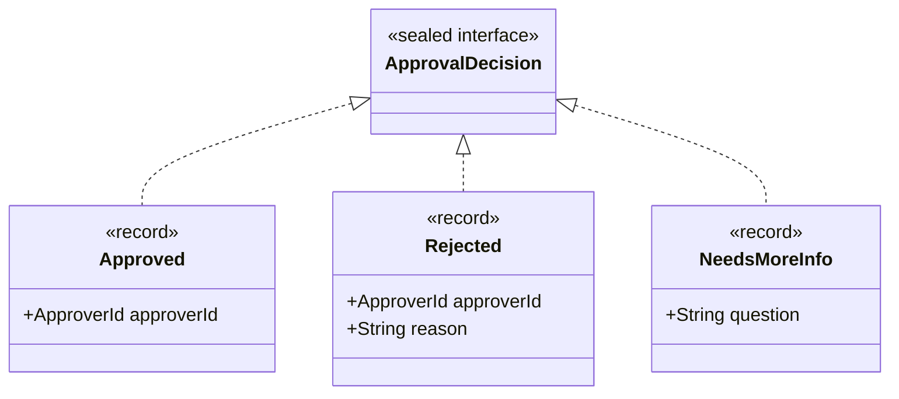
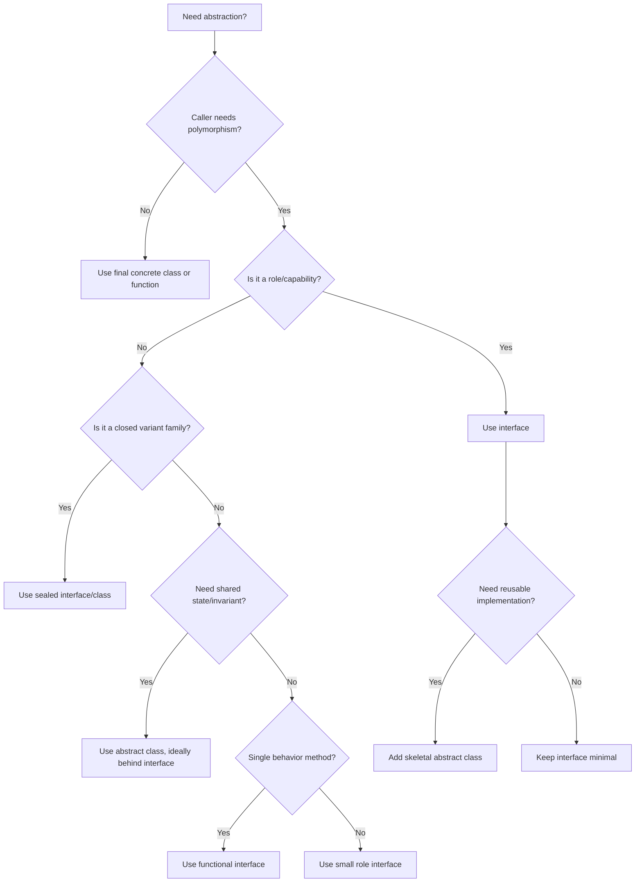

# Part 013 — Interfaces, Abstract Classes, and Role Modeling

> Target: mampu mendesain interface dan abstract class sebagai kontrak API yang stabil, bukan sekadar “tempat menaruh method”. Anda harus bisa memilih antara interface, abstract class, sealed interface, functional interface, skeletal implementation, dan composition boundary dengan alasan yang kuat.

Banyak engineer memakai interface karena “best practice”. Itu terlalu dangkal.

Di Java, interface dan abstract class adalah alat desain kontrak. Keduanya mempengaruhi:

- bagaimana caller memahami kemampuan object;
- bagaimana implementor mempertahankan invariant;
- bagaimana library berevolusi tanpa mematahkan consumer;
- bagaimana framework melakukan discovery, proxying, mocking, dependency injection, dan reflection;
- bagaimana module/package boundary terlihat di public API;
- bagaimana generics dan polymorphism bekerja pada compile-time dan runtime.

Part ini membahas interface dan abstract class dari sudut **language mechanism + API design + evolvability**.

---

## 1. Kaufman Framing: Skill yang Sedang Dilatih

### 1.1 Skill Deconstruction

Skill utama part ini adalah:

```text
Mendesain kontrak Java yang minimal, stabil, expressive, dan mudah diimplementasikan.
```

Skill ini dapat dipecah menjadi beberapa sub-skill:

```text
Contract design skill:
  ├─ role modeling
  │   ├─ identify capability
  │   ├─ avoid god interface
  │   ├─ separate query/command roles
  │   └─ separate consumer/provider roles
  │
  ├─ abstraction selection
  │   ├─ interface
  │   ├─ abstract class
  │   ├─ sealed interface
  │   ├─ record/enum alternative
  │   ├─ functional interface
  │   └─ final concrete class
  │
  ├─ evolution design
  │   ├─ adding methods
  │   ├─ default methods
  │   ├─ private interface helpers
  │   ├─ skeletal implementation
  │   └─ compatibility risks
  │
  ├─ implementation guidance
  │   ├─ invariants
  │   ├─ protected hooks
  │   ├─ final template methods
  │   ├─ nullability/error rules
  │   └─ contract tests
  │
  └─ failure modeling
      ├─ marker interface abuse
      ├─ inheritance lock-in
      ├─ default method conflict
      ├─ binary/source compatibility trap
      ├─ leaky abstraction
      └─ framework proxy limitation
```

### 1.2 Target Performance

Setelah menyelesaikan part ini, Anda harus bisa melihat kandidat abstraction dan menjawab:

```text
1. Apakah ini role, family implementation, closed variant, atau concrete value?
2. Apakah caller butuh polymorphism atau cukup function/callback?
3. Apakah implementor butuh shared state/invariant?
4. Apakah public API ini harus bisa bertahan bertahun-tahun?
5. Apakah method ini benar-benar bagian dari kontrak minimum?
6. Apakah default method aman secara semantic dan binary?
7. Apakah abstraction ini mudah dites sebagai contract?
8. Apakah abstraction ini akan dipakai oleh framework/proxy/reflection?
```

### 1.3 The One-Sentence Shortcut

Interface mendefinisikan **apa yang bisa dilakukan object**.

Abstract class mendefinisikan **kerangka implementasi parsial dengan state/invariant bersama**.

Role modeling yang baik membuat caller bergantung pada **kemampuan minimum**, bukan pada bentuk object yang terlalu besar.

---

## 2. Mental Model: Interface Itu Role, Bukan “Class Tanpa Field”

Cara berpikir yang kurang tepat:

```java
interface UserService {
    User create(User user);
    User update(User user);
    void delete(UserId id);
    Optional<User> findById(UserId id);
    List<User> search(UserQuery query);
    void exportCsv(OutputStream out);
    void importCsv(InputStream in);
    void rebuildIndex();
    void notifyUser(UserId id, Message message);
}
```

Ini bukan role kecil. Ini service surface besar.

Masalahnya:

- caller yang hanya butuh lookup tetap melihat operasi destructive;
- implementor wajib mengimplementasikan banyak method yang mungkin tidak relevan;
- test double menjadi berat;
- security boundary menjadi kabur;
- evolusi API lebih mahal;
- capability object tidak bisa diberikan secara granular.

Role modeling yang lebih baik:

```java
public interface UserLookup {
    Optional<User> findById(UserId id);
}

public interface UserSearch {
    List<User> search(UserQuery query);
}

public interface UserRegistration {
    User create(CreateUserRequest request);
}

public interface UserProfileUpdate {
    User update(UpdateUserRequest request);
}

public interface UserRemoval {
    void delete(UserId id);
}
```

Sekarang dependency dapat dibuat lebih presisi:

```java
public final class AccountPageRenderer {
    private final UserLookup users;

    public AccountPageRenderer(UserLookup users) {
        this.users = Objects.requireNonNull(users);
    }
}
```

Renderer tidak bisa menghapus user karena capability-nya tidak diberikan.

Ini bukan sekadar “Interface Segregation Principle”. Ini **capability control**.

---

## 3. Interface vs Abstract Class: Keputusan Desain

### 3.1 Decision Matrix

| Pertanyaan | Pilih Interface | Pilih Abstract Class |
|---|---|---|
| Apakah ini role/capability? | Ya | Tidak utama |
| Apakah implementor boleh punya inheritance lain? | Ya, interface lebih fleksibel | Tidak, abstract class memakan single class inheritance slot |
| Apakah perlu shared state? | Hindari | Cocok jika state bagian dari invariant |
| Apakah perlu constructor logic? | Tidak tersedia | Tersedia |
| Apakah perlu protected hook? | Terbatas | Cocok |
| Apakah ingin multiple inheritance of type? | Ya | Tidak |
| Apakah ingin shared implementation ringan? | Default method mungkin | Cocok untuk skeletal implementation |
| Apakah ingin closed hierarchy? | `sealed interface` | `sealed abstract class` |
| Apakah perlu enforce field invariant? | Sulit | Lebih kuat |
| Apakah API public jangka panjang? | Sangat umum | Hati-hati, lebih mengikat implementor |

### 3.2 Interface: Role Contract

Gunakan interface ketika Anda ingin mendefinisikan kemampuan:

```java
public interface ClockSource {
    Instant now();
}

public interface IdGenerator<T> {
    T nextId();
}

public interface Policy<C, R> {
    R evaluate(C context);
}
```

Interface seperti ini baik karena:

- kecil;
- implementasinya bebas;
- mudah diganti di test;
- tidak memaksakan inheritance chain;
- bisa dipakai sebagai public boundary;
- bisa dikombinasikan dengan generics.

### 3.3 Abstract Class: Implementation Framework

Gunakan abstract class ketika Anda bukan hanya mendefinisikan role, tapi juga menyediakan **framework implementasi parsial**.

```java
public abstract class AbstractRetryingClient implements RemoteClient {
    private final RetryPolicy retryPolicy;
    private final ClockSource clock;

    protected AbstractRetryingClient(RetryPolicy retryPolicy, ClockSource clock) {
        this.retryPolicy = Objects.requireNonNull(retryPolicy);
        this.clock = Objects.requireNonNull(clock);
    }

    @Override
    public final Response execute(Request request) {
        Objects.requireNonNull(request, "request");

        RetryState state = RetryState.initial(clock.now());

        while (true) {
            try {
                return doExecute(request, state);
            } catch (TransientRemoteException ex) {
                if (!retryPolicy.shouldRetry(state, ex)) {
                    throw ex;
                }
                state = state.next(clock.now());
            }
        }
    }

    protected abstract Response doExecute(Request request, RetryState state);
}
```

Di sini abstract class punya alasan kuat:

- ada shared state (`retryPolicy`, `clock`);
- ada invariant constructor;
- ada template method final (`execute`);
- subclass hanya mengisi extension point (`doExecute`);
- flow utama tidak bisa dirusak subclass.

### 3.4 Rule of Thumb

```text
Interface first untuk role.
Abstract class only when shared implementation is part of the contract.
Final concrete class when extension is not intended.
Sealed type when variant set must be controlled.
Record when this is transparent immutable data carrier.
Enum when this is a fixed set of singleton constants with optional behavior.
```

---

## 4. Role Modeling: Capability-Oriented Interfaces

### 4.1 Dari Noun-Based ke Capability-Based API

Interface buruk sering memakai nama noun yang terlalu besar:

```java
public interface OrderManager {
    void submit(Order order);
    void cancel(OrderId id);
    void approve(OrderId id);
    void reject(OrderId id, String reason);
    Optional<Order> find(OrderId id);
    List<Order> search(OrderSearchCriteria criteria);
    void export(OrderExportTarget target);
}
```

`Manager` hampir selalu sinyal desain yang belum matang.

Pecah berdasarkan capability:

```java
public interface OrderSubmission {
    SubmittedOrder submit(DraftOrder order);
}

public interface OrderCancellation {
    CancelledOrder cancel(OrderId id, CancellationReason reason);
}

public interface OrderApproval {
    ApprovedOrder approve(OrderId id, ApprovalDecision decision);
}

public interface OrderLookup {
    Optional<OrderView> find(OrderId id);
}
```

Keuntungannya bukan cuma “lebih clean”. Keuntungannya arsitektural:

- caller mendapat permission minimum;
- implementation dapat dipisah berdasarkan transaction boundary;
- event/audit bisa berbeda per capability;
- test lebih targeted;
- API lebih mudah berubah;
- security review lebih mudah.

### 4.2 Read Role vs Write Role

Jangan gabungkan read dan write tanpa alasan kuat.

```java
public interface CaseReader {
    Optional<CaseSnapshot> find(CaseId id);
}

public interface CaseCommandHandler<C extends CaseCommand> {
    CaseResult handle(C command);
}
```

Read role sering punya karakteristik berbeda:

- idempotent;
- cacheable;
- read model bisa eventual;
- query-friendly;
- lebih aman diberikan ke banyak collaborator.

Write role punya karakteristik berbeda:

- transactional;
- audited;
- authorization-sensitive;
- concurrency-sensitive;
- side-effectful.

### 4.3 Provider vs Consumer Role

Misalnya event processing:

```java
public interface EventPublisher<E> {
    void publish(E event);
}

public interface EventHandler<E> {
    void handle(E event);
}
```

Jangan jadikan satu:

```java
public interface EventBus<E> {
    void publish(E event);
    void subscribe(EventHandler<E> handler);
}
```

`EventBus` mungkin berguna sebagai infrastructure abstraction, tetapi kebanyakan business component hanya butuh publisher atau handler.

### 4.4 Query Role vs Derivation Role

```java
public interface PriceLookup {
    Optional<Money> findPrice(ProductId productId);
}

public interface PriceCalculator {
    Money calculate(PriceContext context);
}
```

`Lookup` dan `Calculator` bukan role yang sama. Lookup mengambil state. Calculator menurunkan value dari input. Jika dicampur, caller tidak tahu apakah operation pure, cacheable, deterministic, atau side-effectful.

---

## 5. Interface Method Design

### 5.1 Nama Method Harus Mengungkap Kontrak

Bandingkan:

```java
void process(Order order);
```

Dengan:

```java
SubmittedOrder submit(DraftOrder order);
ApprovedOrder approve(OrderId id, ApprovalDecision decision);
RejectedOrder reject(OrderId id, RejectionReason reason);
```

`process` menyembunyikan intent, state transition, dan result.

Untuk API yang tahan lama, method name harus menjawab:

```text
1. Operation apa?
2. Input apa yang dianggap valid?
3. Output apa yang dijanjikan?
4. Side effect apa yang mungkin terjadi?
5. Failure apa yang merupakan bagian dari kontrak?
```

### 5.2 Jangan Pakai Interface untuk Menutupi Model yang Kabur

Interface ini terlihat fleksibel:

```java
public interface Handler {
    Object handle(Object input);
}
```

Tapi kontraknya miskin. Semua pengetahuan pindah ke runtime.

Versi lebih kuat:

```java
public interface Handler<I, O> {
    O handle(I input);
}
```

Lebih baik lagi jika domain operation jelas:

```java
public interface CaseEscalationPolicy {
    EscalationDecision evaluate(CaseSnapshot snapshot, EscalationContext context);
}
```

### 5.3 Nullability Harus Jadi Bagian dari Kontrak

Jangan biarkan implementor menebak apakah `null` legal.

```java
public interface CustomerLookup {
    Optional<Customer> find(CustomerId id);
}
```

Lebih jelas daripada:

```java
public interface CustomerLookup {
    Customer find(CustomerId id); // returns null if missing? throws? unknown
}
```

Tetapi `Optional` bukan jawaban universal. Untuk collection, lebih baik empty collection.

```java
public interface OrderSearch {
    List<OrderSummary> search(OrderQuery query);
}
```

Bukan:

```java
List<OrderSummary> search(OrderQuery query); // may return null
```

Kontrak interface harus menulis secara eksplisit:

```text
- parameter tidak boleh null kecuali disebutkan;
- return value tidak pernah null kecuali disebutkan;
- missing single value -> Optional;
- missing many values -> empty collection;
- invalid input -> exception yang terdokumentasi;
- domain rejection -> result object atau domain exception sesuai boundary.
```

### 5.4 Exception Surface

Interface yang baik tidak hanya mendefinisikan success path.

```java
public interface PaymentAuthorization {
    AuthorizationResult authorize(AuthorizationRequest request)
            throws PaymentGatewayUnavailableException;
}
```

Pertanyaan desain:

```text
Apakah failure ini recoverable oleh caller?
Apakah checked exception memberi value?
Apakah domain rejection harus exception atau result?
Apakah infrastructure failure harus bocor ke domain API?
Apakah method name menunjukkan side effect?
```

Untuk domain decision, result object sering lebih baik:

```java
public sealed interface AuthorizationResult
        permits AuthorizationResult.Approved, AuthorizationResult.Declined {

    record Approved(AuthorizationId authorizationId) implements AuthorizationResult {}
    record Declined(DeclineCode code, String message) implements AuthorizationResult {}
}
```

Untuk infrastructure failure yang tidak bisa dipulihkan di level tersebut, unchecked exception bisa lebih jujur.

---

## 6. Functional Interface: Interface sebagai Behavior Value

Functional interface adalah interface dengan satu abstract method.

```java
@FunctionalInterface
public interface Rule<C, R> {
    R evaluate(C context);
}
```

Gunakan `@FunctionalInterface` bukan karena wajib, tetapi karena itu compile-time guard terhadap accidental addition of abstract methods.

### 6.1 Kapan Membuat Functional Interface Sendiri?

Java sudah menyediakan `java.util.function` seperti `Function`, `Predicate`, `Supplier`, `Consumer`, `BiFunction`. Namun domain-specific functional interface tetap berguna ketika:

- nama role penting;
- exception contract berbeda;
- generic parameter perlu lebih expressive;
- method name domain-specific;
- dokumentasi kontrak domain perlu melekat;
- future default combinator method dibutuhkan.

Bandingkan:

```java
Predicate<CaseSnapshot> predicate
```

Dengan:

```java
@FunctionalInterface
public interface EscalationCondition {
    boolean matches(CaseSnapshot snapshot);

    default EscalationCondition and(EscalationCondition other) {
        Objects.requireNonNull(other, "other");
        return snapshot -> this.matches(snapshot) && other.matches(snapshot);
    }
}
```

Yang kedua membawa semantic yang lebih jelas.

### 6.2 Jangan Mengubah Functional Interface Sembarangan

Menambah abstract method ke functional interface adalah breaking secara source untuk lambda user.

```java
@FunctionalInterface
public interface Validator<T> {
    ValidationResult validate(T value);
}
```

Menambahkan ini berbahaya:

```java
ValidationSeverity severity();
```

Karena lambda seperti ini tidak lagi valid:

```java
Validator<Order> validator = order -> validateOrder(order);
```

Jika perlu evolusi, pakai default method:

```java
@FunctionalInterface
public interface Validator<T> {
    ValidationResult validate(T value);

    default ValidationSeverity severity() {
        return ValidationSeverity.ERROR;
    }
}
```

Tapi default method pun membawa risiko behavioral compatibility. Caller lama mungkin mendapat behavior default yang tidak cocok secara domain.

---

## 7. Default Methods: Evolusi API, Bukan Tempat Menaruh Semua Logic

Default method memungkinkan interface memiliki method dengan implementation.

```java
public interface Repository<ID, T> {
    Optional<T> findById(ID id);

    default T getRequired(ID id) {
        return findById(id).orElseThrow(() -> new NoSuchElementException("No entity: " + id));
    }
}
```

Ini berguna untuk method turunan yang bisa didefinisikan dari primitive operation.

### 7.1 Pola yang Baik: Primitive + Derived Operation

```java
public interface Policy<C, R> {
    R evaluate(C context);

    default Policy<C, R> traced(String name, PolicyTracer tracer) {
        Objects.requireNonNull(name, "name");
        Objects.requireNonNull(tracer, "tracer");

        return context -> {
            tracer.before(name, context);
            R result = evaluate(context);
            tracer.after(name, context, result);
            return result;
        };
    }
}
```

Default method di sini tidak membutuhkan state internal implementor.

### 7.2 Pola yang Buruk: Default Method yang Mengasumsikan State

```java
public interface SessionAwareService {
    Session currentSession();

    default User currentUser() {
        return currentSession().user();
    }
}
```

Ini mungkin terlihat wajar. Tapi default method mulai mengunci semantic implementor:

- apakah session selalu ada?
- apakah session lazy?
- apakah current user boleh anonymous?
- apakah method ini mahal?
- apakah thread-local dipakai?

Jika behavior sangat domain-specific, lebih baik taruh di abstract class atau helper service.

### 7.3 Default Method Conflict

Jika class mengimplementasikan dua interface dengan default method signature yang sama, class harus menyelesaikan konflik.

```java
interface Auditable {
    default String label() {
        return "auditable";
    }
}

interface Displayable {
    default String label() {
        return "displayable";
    }
}

final class CaseView implements Auditable, Displayable {
    @Override
    public String label() {
        return Displayable.super.label();
    }
}
```

Default method tidak membuat Java punya multiple inheritance of state. Tetapi ia membuat multiple inheritance of behavior terbatas. Karena itu default method harus tetap kecil dan composable.

### 7.4 Class Wins over Interface

Jika superclass punya concrete method dan interface punya default method dengan signature sama, class method menang.

```java
class BaseNamed {
    public String name() {
        return "base";
    }
}

interface Named {
    default String name() {
        return "interface";
    }
}

final class Concrete extends BaseNamed implements Named {
}
```

`new Concrete().name()` memakai implementation dari `BaseNamed`.

Mental model:

```text
class implementation > interface default implementation
more specific interface > less specific interface
conflict between unrelated defaults -> must override
```

### 7.5 Default Method Compatibility Trap

Menambahkan default method ke public interface sering binary-compatible, tetapi tidak selalu source-compatible atau behavior-compatible.

Contoh source conflict:

```java
interface OldApi {
}

interface OtherApi {
    default void reset() {}
}

class Impl implements OldApi, OtherApi {
}
```

Jika versi baru `OldApi` menambahkan:

```java
default void reset() {}
```

`Impl` bisa mengalami konflik default method saat recompile.

Jadi jangan berpikir “default method selalu aman”. Ia hanya salah satu alat evolusi.

---

## 8. Private Interface Methods

Interface modern dapat memiliki private method untuk membantu default/static methods.

```java
public interface NormalizedText {
    String raw();

    default String normalized() {
        return normalize(raw());
    }

    default boolean isBlankAfterNormalization() {
        return normalize(raw()).isBlank();
    }

    private static String normalize(String value) {
        return value == null ? "" : value.trim().replaceAll("\\s+", " ");
    }
}
```

Private interface method berguna untuk:

- menghindari duplikasi antar default method;
- menjaga helper tetap bukan bagian dari public API;
- menghindari utility class kecil yang tidak perlu;
- mempertahankan interface sebagai unit kontrak.

Namun tetap ada batas:

```text
Jika helper makin kompleks, kemungkinan logic itu bukan milik interface.
Jika butuh state, interface bukan tempatnya.
Jika butuh inheritance hook, abstract class lebih tepat.
Jika helper domain-heavy, pindahkan ke collaborator.
```

---

## 9. Static Methods in Interface

Interface boleh punya static method.

```java
public interface MoneyFormatter {
    String format(Money money);

    static MoneyFormatter iso() {
        return money -> money.currency().code() + " " + money.amount();
    }
}
```

Gunakan static interface method untuk factory kecil yang sangat terkait dengan interface.

Namun jangan ubah interface menjadi utility dump:

```java
public interface UserUtils {
    static boolean isValidEmail(String email) { ... }
    static String normalizeName(String name) { ... }
    static int calculateAge(LocalDate birthDate) { ... }
}
```

Itu bukan interface kontrak. Itu utility holder yang sebaiknya menjadi final utility class atau domain service/value object.

---

## 10. Marker Interfaces: Kapan Valid, Kapan Abuse

Marker interface tidak punya method.

```java
public interface SensitiveData {
}
```

Marker interface historis terkenal: `Serializable`, `Cloneable`, `RandomAccess`.

Marker interface memberi type-level signal yang bisa dipakai compile-time atau runtime.

### 10.1 Kapan Marker Interface Masuk Akal?

Marker interface masuk akal jika:

- marker adalah bagian dari type system;
- method menerima hanya object dengan marker tertentu;
- ada semantic contract yang kuat;
- runtime/framework perlu membedakan behavior;
- annotation tidak cukup karena butuh compile-time type constraint.

Contoh:

```java
public interface DomainEvent {
    EventId eventId();
    Instant occurredAt();
}
```

Ini bukan marker murni karena ada behavior minimum.

Marker murni:

```java
public interface InternalOnly {
}
```

Biasanya lemah. Lebih baik pakai package/module boundary atau annotation untuk metadata.

### 10.2 Marker Interface vs Annotation

| Kebutuhan | Marker Interface | Annotation |
|---|---|---|
| Compile-time type constraint | Kuat | Lemah |
| Runtime metadata | Bisa, tapi kasar | Kuat |
| Dapat membawa attribute | Tidak | Ya |
| Dapat dipakai pada method/field/parameter | Tidak | Ya |
| Cocok untuk capability behavior | Ya | Tidak langsung |
| Cocok untuk metadata declarative | Tidak utama | Ya |

Contoh annotation lebih cocok:

```java
@Retention(RetentionPolicy.RUNTIME)
@Target(ElementType.TYPE)
public @interface Audited {
    AuditCategory value();
}
```

Contoh marker/capability interface lebih cocok:

```java
public interface Redactable {
    RedactedView redact(RedactionPolicy policy);
}
```

---

## 11. Abstract Class sebagai Skeletal Implementation

Skeletal implementation adalah abstract class yang membantu implementor interface dengan menyediakan default behavior yang stabil.

Contoh JDK klasik adalah pola `AbstractList`, `AbstractSet`, `AbstractMap`.

Desain modern:

```java
public interface RuleSet<C> {
    List<Rule<C>> rules();

    default EvaluationReport evaluate(C context) {
        EvaluationReport.Builder report = EvaluationReport.builder();
        for (Rule<C> rule : rules()) {
            report.add(rule.evaluate(context));
        }
        return report.build();
    }
}

public abstract class AbstractRuleSet<C> implements RuleSet<C> {
    private final List<Rule<C>> rules;

    protected AbstractRuleSet(List<Rule<C>> rules) {
        this.rules = List.copyOf(Objects.requireNonNull(rules, "rules"));
    }

    @Override
    public final List<Rule<C>> rules() {
        return rules;
    }
}
```

Di sini:

- interface menyatakan role;
- abstract class menyediakan implementation reusable;
- caller tetap bergantung pada interface;
- implementor yang tidak butuh abstract class bebas mengimplementasikan sendiri.

### 11.1 Pattern: Interface + Abstract Base

```java
public interface EventHandler<E> {
    void handle(E event);
}

public abstract class AbstractEventHandler<E> implements EventHandler<E> {
    private final Class<E> eventType;

    protected AbstractEventHandler(Class<E> eventType) {
        this.eventType = Objects.requireNonNull(eventType, "eventType");
    }

    public final Class<E> eventType() {
        return eventType;
    }
}
```

Keunggulan:

```text
External API depends on EventHandler.
Framework can inspect AbstractEventHandler when available.
Custom implementation is still possible.
```

### 11.2 Jangan Paksa Semua Implementor Extend Abstract Base

Buruk:

```java
public abstract class PaymentProcessor {
    public abstract PaymentResult process(PaymentCommand command);
}
```

Lebih fleksibel:

```java
public interface PaymentProcessor {
    PaymentResult process(PaymentCommand command);
}

public abstract class AbstractPaymentProcessor implements PaymentProcessor {
    protected final PaymentAudit audit;

    protected AbstractPaymentProcessor(PaymentAudit audit) {
        this.audit = Objects.requireNonNull(audit);
    }
}
```

Interface menjadi public contract. Abstract class menjadi optional implementation aid.

---

## 12. Template Method yang Aman

Template method adalah pola di mana superclass mengontrol flow, subclass mengisi hook.

```java
public abstract class AbstractImporter<T> {
    public final ImportReport importFrom(InputStream input) throws IOException {
        Objects.requireNonNull(input, "input");

        List<T> records = parse(input);
        ImportReport.Builder report = ImportReport.builder();

        for (T record : records) {
            ValidationResult validation = validate(record);
            if (validation.isValid()) {
                persist(record);
                report.imported(record);
            } else {
                report.rejected(record, validation);
            }
        }

        return report.build();
    }

    protected abstract List<T> parse(InputStream input) throws IOException;

    protected ValidationResult validate(T record) {
        return ValidationResult.valid();
    }

    protected abstract void persist(T record);
}
```

Kunci desain:

- method utama `final`;
- hooks minimal;
- invariant superclass tidak bisa dilewati;
- protected method terdokumentasi;
- subclass tidak memegang state internal langsung;
- failure behavior jelas.

### 12.1 Protected Hook Contract

Setiap protected hook adalah API untuk subclass. Dokumentasikan seperti public API.

```java
/**
 * Persists one validated record.
 *
 * Contract:
 * - record is non-null
 * - record has already passed validate(record)
 * - implementation may throw ImportPersistenceException
 * - implementation must not close resources owned by the template
 */
protected abstract void persist(T record);
```

Protected bukan “internal”. Protected adalah API untuk subclass.

### 12.2 Hindari Protected Field

Buruk:

```java
public abstract class AbstractService {
    protected final Map<String, Object> context = new HashMap<>();
}
```

Subclass dapat merusak invariant.

Lebih baik:

```java
public abstract class AbstractService {
    private final Map<String, Object> context = new HashMap<>();

    protected final Optional<Object> contextValue(String key) {
        return Optional.ofNullable(context.get(key));
    }

    protected final void putContextValue(String key, Object value) {
        context.put(Objects.requireNonNull(key), Objects.requireNonNull(value));
    }
}
```

Protected method memberi kontrol. Protected field mengekspos representation.

---

## 13. Sealed Interfaces untuk Closed Role Families

Sealed interface membatasi implementor langsung.

```java
public sealed interface ApprovalDecision
        permits ApprovalDecision.Approved, ApprovalDecision.Rejected, ApprovalDecision.NeedsMoreInfo {

    record Approved(ApproverId approverId) implements ApprovalDecision {}

    record Rejected(ApproverId approverId, String reason) implements ApprovalDecision {}

    record NeedsMoreInfo(String question) implements ApprovalDecision {}
}
```

Gunakan sealed interface ketika:

- variant set harus dikontrol;
- exhaustive handling penting;
- domain state space terbatas;
- public implementor bebas justru berbahaya;
- compiler-aided evolution lebih penting daripada open extension.

Jangan gunakan sealed interface jika:

- library memang harus menerima plugin implementor eksternal;
- domain variant berkembang oleh consumer;
- implementor pihak ketiga adalah bagian dari design goal.

### 13.1 Open Role vs Closed Variant

Open role:

```java
public interface TaxRule {
    TaxResult apply(TaxContext context);
}
```

Siapa pun boleh menambah tax rule.

Closed variant:

```java
public sealed interface TaxDecision
        permits TaxDecision.Taxable, TaxDecision.Exempt, TaxDecision.RequiresReview {

    record Taxable(Money amount) implements TaxDecision {}
    record Exempt(String legalBasis) implements TaxDecision {}
    record RequiresReview(String reason) implements TaxDecision {}
}
```

Consumer tidak boleh menambah arbitrary decision type karena downstream logic perlu exhaustive.

### 13.2 Mermaid Model



---

## 14. Interface Inheritance: Jangan Membangun Piramida Role

Interface boleh extend interface lain.

```java
public interface Identified<ID> {
    ID id();
}

public interface Versioned {
    long version();
}

public interface AggregateRoot<ID> extends Identified<ID>, Versioned {
}
```

Ini valid jika role gabungan punya semantic jelas.

Tetapi piramida role sering berbahaya:

```java
interface ReadableEntity extends Identified<UUID>, Versioned, Timestamped, Auditable, Serializable, Comparable<ReadableEntity> {
}
```

Masalah:

- role terlalu banyak;
- consumer kecil ikut bergantung pada semua kontrak;
- implementor dipaksa membawa method yang tidak relevan;
- API menjadi sulit berubah;
- generic bound menjadi berat.

Lebih baik gunakan composition di parameter atau context:

```java
public interface AuditTrailWriter {
    void append(AuditRecord record);
}

public record AuditRecord(
        ObjectId objectId,
        long version,
        Instant occurredAt,
        String action
) {}
```

### 14.1 Interface Extension Rule

```text
Extend interface only when every implementation of child role is necessarily also a valid implementation of parent role.
```

Jangan extend hanya untuk “reuse method declaration”.

---

## 15. Nested Interfaces and Local API Shape

Nested interface berguna untuk kontrak yang hanya berarti dalam konteks owner.

```java
public final class WorkflowEngine {
    public interface Listener {
        void onTransition(TransitionEvent event);
    }
}
```

Gunakan nested interface jika:

- role tidak reusable secara global;
- nama menjadi lebih jelas dengan konteks owner;
- ingin menghindari package pollution;
- interface adalah extension point kecil dari type tertentu.

Jangan gunakan nested interface jika:

- role dipakai lintas package;
- implementor pihak lain perlu menemukan interface dengan mudah;
- interface perlu dokumentasi dan versioning sendiri;
- nested path membuat API canggung.

---

## 16. Interface, Proxies, and Frameworks

Framework Java sering memanfaatkan interface untuk proxy:

```text
JDK dynamic proxy      -> interface-based
CGLIB/Byte Buddy       -> subclass/class-based
Reflection scanning    -> annotation/type metadata
DI container           -> interface or concrete type injection
AOP                    -> proxy boundary dependent
```

Konsekuensi desain:

- final class sulit diproxy dengan subclass-based proxy;
- final method tidak bisa dioverride proxy;
- package-private type mungkin sulit diakses across module;
- default method handling pada proxy butuh mekanisme khusus;
- sealed interface/class dapat membatasi proxy implementor;
- module `opens` mempengaruhi reflective access.

Jangan desain domain API semata-mata demi framework, tetapi sadari constraint-nya.

### 16.1 Framework-Friendly Interface

```java
public interface CaseCommandHandler<C extends CaseCommand> {
    CaseResult handle(C command);
}
```

Ini mudah diproxy, diwrap, dites, dan dikomposisi.

### 16.2 Framework-Unfriendly Contract

```java
public sealed interface CaseCommandHandler<C extends CaseCommand>
        permits InternalCaseCommandHandler {
    CaseResult handle(C command);
}
```

Ini mungkin benar untuk internal closed system, tetapi buruk jika framework perlu membuat proxy yang menjadi implementor langsung. Solusinya bisa berupa:

- jangan seal extension point framework;
- seal result type, bukan handler role;
- gunakan wrapper/proxy yang permitted;
- expose non-sealed subinterface untuk extension;
- gunakan composition decorator.

---

## 17. API Evolution: Interface Lebih Sulit Diubah daripada Kelihatannya

### 17.1 Menambah Abstract Method

Breaking untuk semua implementor.

```java
public interface CustomerExporter {
    void export(Customer customer, OutputStream out) throws IOException;
}
```

Menambahkan:

```java
ExportFormat supportedFormat();
```

Membuat implementor lama gagal compile.

### 17.2 Menambah Default Method

Lebih aman secara binary dalam banyak kasus, tetapi tetap bisa:

- konflik dengan interface lain;
- mengubah overload resolution;
- menciptakan behavioral surprise;
- merusak implementor yang punya method package-private/private dengan signature terkait;
- membingungkan mocking/proxy framework.

### 17.3 Menambah Static Method

Umumnya aman, karena tidak mempengaruhi implementor instance contract. Tetapi tetap menambah public API surface.

### 17.4 Mengubah Return Type

Covariant return type bisa aman dalam beberapa skenario, tetapi harus hati-hati terhadap binary compatibility dan erased signature.

```java
interface OldApi {
    Number value();
}

interface NewApi {
    Integer value();
}
```

Untuk interface public, perubahan seperti ini tidak boleh dianggap trivial.

### 17.5 Mengubah Throws

Checked exception adalah bagian dari source contract.

```java
void write(Data data) throws IOException;
```

Menghapus checked exception mungkin membantu caller baru, tetapi bisa mempengaruhi source compatibility untuk caller lama yang menangkap exception tersebut jika catch menjadi unreachable dalam konteks tertentu.

Menambah checked exception jelas breaking.

---

## 18. Contract Testing untuk Interface

Interface yang serius harus punya contract tests.

Contoh:

```java
public interface IdGeneratorContract<T> {
    IdGenerator<T> generator();

    @Test
    default void generatedIdsAreNotNull() {
        assertNotNull(generator().nextId());
    }

    @Test
    default void generatedIdsAreUniqueAcrossReasonableSample() {
        Set<T> ids = new HashSet<>();
        for (int i = 0; i < 1_000; i++) {
            assertTrue(ids.add(generator().nextId()));
        }
    }
}
```

Implementor test:

```java
final class UuidGeneratorTest implements IdGeneratorContract<UUID> {
    @Override
    public IdGenerator<UUID> generator() {
        return new UuidGenerator();
    }
}
```

Contract test memastikan interface bukan hanya syntax, tetapi semantic.

### 18.1 Apa yang Dites?

```text
Interface contract tests:
  ├─ null handling
  ├─ invalid input handling
  ├─ idempotency/non-idempotency
  ├─ deterministic behavior
  ├─ ordering guarantee
  ├─ equality/hash compatibility if relevant
  ├─ exception mapping
  ├─ concurrency expectation if documented
  └─ side-effect boundary
```

Jangan membuat interface tanpa memikirkan testability kontraknya.

---

## 19. Anti-Patterns

### 19.1 God Interface

```java
public interface PlatformService {
    void createUser();
    void deleteUser();
    void sendEmail();
    void generateReport();
    void publishEvent();
    void clearCache();
}
```

Gejala:

- implementor banyak method kosong;
- caller bergantung pada terlalu banyak capability;
- mocking berat;
- permission boundary tidak ada;
- setiap perubahan menyentuh banyak module.

### 19.2 Interface for Every Class

```java
public interface UserNameNormalizer {
    String normalize(String value);
}

public final class DefaultUserNameNormalizer implements UserNameNormalizer {
    ...
}
```

Ini valid jika polymorphism dibutuhkan. Tapi jika hanya ada satu implementation dan tidak ada boundary/test need, interface bisa menjadi noise.

Tanyakan:

```text
Apakah caller butuh swapping implementation?
Apakah ini public extension point?
Apakah ini dependency inversion boundary?
Apakah test double sulit tanpa interface?
Apakah future implementation realistis atau hanya spekulatif?
```

### 19.3 Abstract Class Without Invariant

```java
public abstract class AbstractThing {
    public abstract void run();
}
```

Jika tidak ada shared state, constructor, template flow, atau invariant, ini kemungkinan harus menjadi interface.

### 19.4 Default Method Dump

```java
public interface CustomerApi {
    Customer find(String id);

    default Customer findOrCreate(String id) { ... }
    default void sendWelcomeEmail(String id) { ... }
    default void auditAccess(String id) { ... }
    default void warmCache(String id) { ... }
}
```

Default methods berubah menjadi service implementation tersembunyi. Ini memperbesar API dan menyembunyikan side effects.

### 19.5 Marker Interface Without Contract

```java
public interface Important {
}
```

Important menurut siapa? Dipakai oleh siapa? Apa behavior-nya? Jika jawabannya kabur, ini metadata palsu.

### 19.6 Leaky Role

```java
public interface UserRepository {
    EntityManager entityManager();
}
```

Ini membuat abstraction bocor. Caller sekarang tahu detail persistence. Gunakan role yang benar atau expose SPI secara terpisah.

---

## 20. Design Recipes

### 20.1 Designing a Small Role Interface

Checklist:

```text
1. Name role by capability, not implementation.
2. Keep method count minimal.
3. Make inputs domain-specific.
4. Make outputs explicit.
5. Define null policy.
6. Define failure policy.
7. Avoid leaking infrastructure unless the interface is infrastructure.
8. Consider generic parameter only if it increases type safety.
9. Add default methods only when derivable from primitive operations.
10. Write contract tests.
```

Example:

```java
@FunctionalInterface
public interface CaseAssignmentPolicy {
    AssignmentDecision decide(CaseSnapshot snapshot, AgentPool pool);
}
```

### 20.2 Designing Interface + Skeletal Implementation

```java
public interface Exporter<T> {
    void export(T value, OutputStream output) throws IOException;
}

public abstract class AbstractTextExporter<T> implements Exporter<T> {
    private final Charset charset;

    protected AbstractTextExporter(Charset charset) {
        this.charset = Objects.requireNonNull(charset, "charset");
    }

    @Override
    public final void export(T value, OutputStream output) throws IOException {
        Objects.requireNonNull(value, "value");
        Objects.requireNonNull(output, "output");

        try (Writer writer = new OutputStreamWriter(output, charset)) {
            write(value, writer);
        }
    }

    protected abstract void write(T value, Writer writer) throws IOException;
}
```

Important nuance: closing `OutputStream` owned by caller may be wrong. In many APIs, wrapper should flush but not close. The contract must decide. A more careful version:

```java
@Override
public final void export(T value, OutputStream output) throws IOException {
    Objects.requireNonNull(value, "value");
    Objects.requireNonNull(output, "output");

    Writer writer = new OutputStreamWriter(output, charset);
    write(value, writer);
    writer.flush();
}
```

This is an API contract decision, not implementation trivia.

### 20.3 Designing Closed Result Interface

```java
public sealed interface ValidationResult
        permits ValidationResult.Valid, ValidationResult.Invalid {

    record Valid() implements ValidationResult {}

    record Invalid(List<Violation> violations) implements ValidationResult {
        public Invalid {
            violations = List.copyOf(violations);
            if (violations.isEmpty()) {
                throw new IllegalArgumentException("violations must not be empty");
            }
        }
    }

    static ValidationResult valid() {
        return new Valid();
    }

    static ValidationResult invalid(List<Violation> violations) {
        return new Invalid(violations);
    }
}
```

Closed result types are often better than exception-heavy control flow for expected domain outcomes.

---

## 21. Deep Example: Case Workflow Role Model

Misalnya kita mendesain case management workflow.

Bad API:

```java
public interface CaseService {
    Case create(Case input);
    Case update(Case input);
    void assign(String caseId, String userId);
    void escalate(String caseId);
    void close(String caseId);
    Case find(String caseId);
    List<Case> search(Map<String, Object> filters);
}
```

Better role model:

```java
public interface CaseIntake {
    CaseId open(OpenCaseCommand command);
}

public interface CaseAssignment {
    AssignmentResult assign(AssignCaseCommand command);
}

public interface CaseEscalation {
    EscalationResult escalate(EscalateCaseCommand command);
}

public interface CaseClosure {
    ClosureResult close(CloseCaseCommand command);
}

public interface CaseLookup {
    Optional<CaseSnapshot> find(CaseId id);
}

public interface CaseSearch {
    Page<CaseSummary> search(CaseSearchQuery query, PageRequest page);
}
```

The domain result can be sealed:

```java
public sealed interface EscalationResult
        permits EscalationResult.Escalated,
                EscalationResult.NotAllowed,
                EscalationResult.AlreadyEscalated {

    record Escalated(CaseId caseId, EscalationLevel level) implements EscalationResult {}
    record NotAllowed(CaseId caseId, String reason) implements EscalationResult {}
    record AlreadyEscalated(CaseId caseId, EscalationLevel currentLevel) implements EscalationResult {}
}
```

Composition root can combine them:

```java
public final class DefaultCaseApplicationService
        implements CaseIntake, CaseAssignment, CaseEscalation, CaseClosure {

    private final CaseRepository repository;
    private final CasePolicyEngine policies;
    private final DomainEventPublisher events;

    public DefaultCaseApplicationService(
            CaseRepository repository,
            CasePolicyEngine policies,
            DomainEventPublisher events
    ) {
        this.repository = Objects.requireNonNull(repository);
        this.policies = Objects.requireNonNull(policies);
        this.events = Objects.requireNonNull(events);
    }

    @Override
    public EscalationResult escalate(EscalateCaseCommand command) {
        // command boundary, policy boundary, aggregate state transition, event publication
        throw new UnsupportedOperationException("example");
    }
}
```

Caller depends on only the role it needs:

```java
public final class EscalationController {
    private final CaseEscalation escalation;

    public EscalationController(CaseEscalation escalation) {
        this.escalation = Objects.requireNonNull(escalation);
    }
}
```

This is role modeling as architecture.

---

## 22. Decision Tree



---

## 23. Practice: 20-Hour Deliberate Exercises

### Exercise 1 — Interface Shrinking

Take a service interface with more than seven methods. Split it into role interfaces.

Expected output:

```text
- original interface
- role map
- new interfaces
- caller dependency before/after
- tests simplified
- methods removed from public exposure
```

### Exercise 2 — Abstract Class Justification

Find an abstract class and answer:

```text
1. What invariant does it enforce?
2. What state does it own?
3. Which method is template method?
4. Which methods are subclass hooks?
5. Are protected hooks documented?
6. Could this be interface + skeletal implementation?
```

### Exercise 3 — Default Method Safety Review

For every default method in a public interface, classify:

```text
- derived from primitive operation? safe
- assumes state? risky
- performs side effect? risky
- creates conflict potential? inspect
- could be static helper instead? maybe
```

### Exercise 4 — Contract Test

Write a JUnit interface test for a role interface.

Focus on semantic contract, not implementation.

### Exercise 5 — Sealed Role Review

Pick a sealed interface and ask:

```text
Is this a closed variant or an extension point?
```

If it is an extension point, unseal it.

---

## 24. Engineering Heuristics

Use these heuristics in real code review:

```text
1. Interface names should be capability names, not implementation names.
2. Abstract classes should protect invariant, not merely avoid duplicate code.
3. Default methods should be derived, small, and side-effect-light.
4. Protected members are API and require documentation.
5. Avoid protected fields.
6. Avoid god interfaces.
7. Avoid speculative interfaces for every class.
8. Prefer interface + optional skeletal implementation over abstract class-only API.
9. Use sealed interfaces for closed results and domain alternatives.
10. Do not seal plugin/extension interfaces without a deliberate proxy/extension story.
11. Write contract tests for important interfaces.
12. Keep role dependency as narrow as possible.
```

---

## 25. Summary

Interface dan abstract class bukan interchangeable.

Interface adalah alat untuk role/capability modeling. Abstract class adalah alat untuk shared implementation, constructor invariant, protected hooks, dan template method. Default method adalah alat evolusi dan derivation, bukan tempat membangun service implementation tersembunyi. Sealed interface cocok untuk closed variant/result type, bukan untuk extension point bebas.

Mental model utama:

```text
Role?                         -> interface
Single behavior role?          -> functional interface
Shared implementation/invariant? -> abstract class, ideally behind interface
Closed variant family?         -> sealed interface/class
Transparent immutable data?    -> record
Fixed singleton alternatives?   -> enum
No polymorphism needed?         -> final concrete class
```

Engineer top-level mendesain abstraction bukan agar “terlihat clean”, tetapi agar kontrak kecil, stabil, bisa dites, bisa berevolusi, dan tidak memberi capability yang tidak perlu.

---

## References

- Java Language Specification, Java SE 25, especially Chapter 8 Classes, Chapter 9 Interfaces, and Chapter 13 Binary Compatibility.
- Java SE 25 API documentation for `java.lang`, `java.lang.Class`, and related reflection/runtime metadata.
- Java language documentation on sealed classes and interfaces.
- Java language documentation on records and pattern matching evolution.
