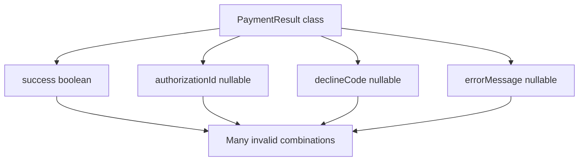
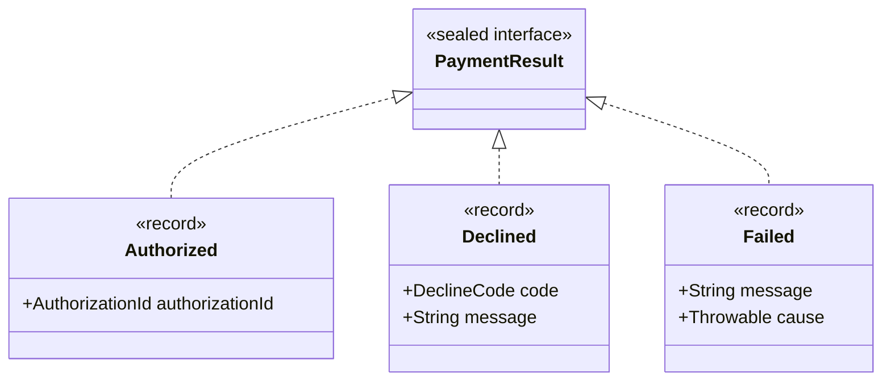
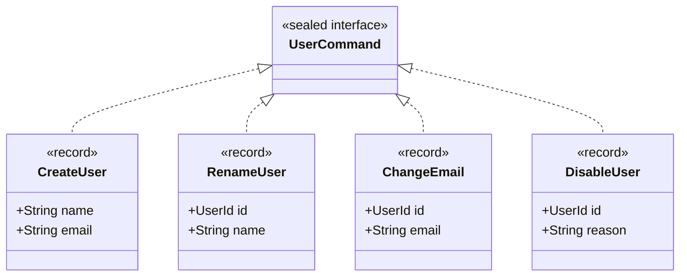
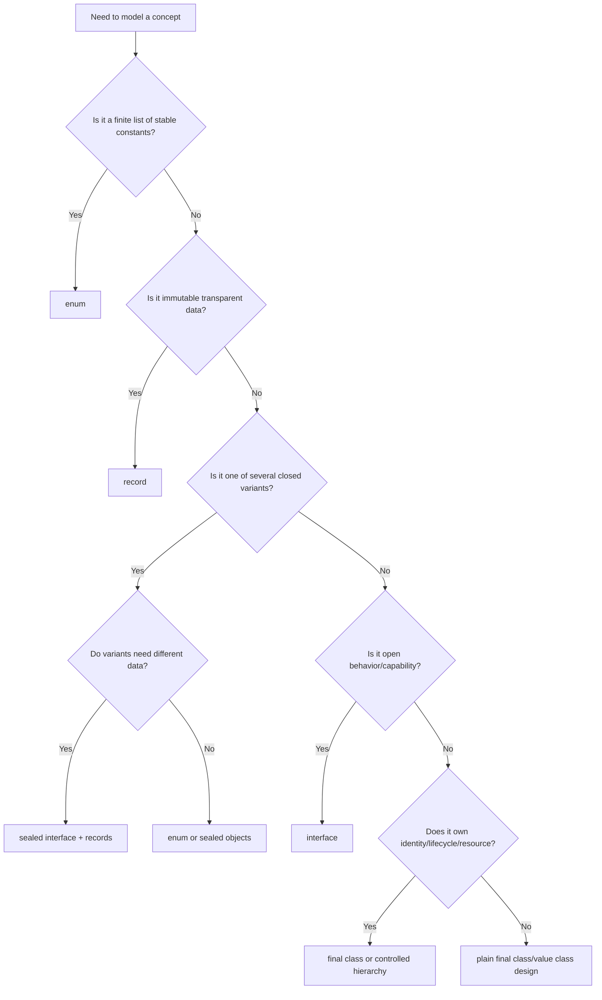

# Part 014 — Sealed, Record, Enum, and Domain Shape Control

> Target: mampu memakai `sealed`, `record`, dan `enum` untuk mengontrol bentuk domain model, mengurangi illegal state, membuat handling lebih exhaustive, dan mendesain API yang eksplisit tentang varian data dan behavior.

Part sebelumnya membahas interface dan abstract class sebagai role/implementation contract. Part ini membahas bentuk type Java yang lebih spesifik:

```text
record  -> product type / transparent immutable data carrier
sealed  -> closed family / controlled subtype set
enum    -> fixed singleton constants / finite named alternatives
```

Ketiganya adalah alat **state-space control**.

Engineer biasa bertanya:

```text
Class apa yang harus saya buat?
```

Engineer yang lebih matang bertanya:

```text
State apa yang legal?
Variant apa yang legal?
Siapa yang boleh menambah variant?
Apakah caller bisa menangani semua case secara exhaustive?
Apakah object ini identity-bearing atau value-like?
Apakah representation harus transparan atau disembunyikan?
Bagaimana type ini berevolusi tanpa merusak caller?
```

---

## 1. Kaufman Framing: Skill yang Sedang Dilatih

### 1.1 Skill Deconstruction

Skill utama:

```text
Membentuk domain model Java yang membatasi kemungkinan salah sejak compile-time.
```

Sub-skill:

```text
Domain shape control:
  ├─ classify state shape
  │   ├─ product data
  │   ├─ sum variants
  │   ├─ finite constants
  │   ├─ open extension role
  │   └─ identity-bearing entity
  │
  ├─ choose Java construct
  │   ├─ record
  │   ├─ sealed interface/class
  │   ├─ enum
  │   ├─ final class
  │   ├─ interface
  │   └─ abstract class
  │
  ├─ enforce invariants
  │   ├─ compact canonical constructor
  │   ├─ private constructors
  │   ├─ factory methods
  │   ├─ defensive copying
  │   └─ controlled subtype permits
  │
  ├─ design exhaustive handling
  │   ├─ pattern matching
  │   ├─ switch expression
  │   ├─ visitor alternative
  │   └─ default branch discipline
  │
  └─ model evolution
      ├─ adding record component
      ├─ changing enum constants
      ├─ adding sealed subtype
      ├─ opening/closing hierarchy
      └─ binary/source/behavioral compatibility
```

### 1.2 Target Performance

Setelah part ini, Anda harus bisa:

```text
1. Mengubah model boolean/null-heavy menjadi sealed result type.
2. Mengubah DTO mutable menjadi record yang menjaga invariant.
3. Memilih enum hanya saat finite constants benar-benar stabil.
4. Mendesain sealed hierarchy yang exhaustive tetapi masih evolvable.
5. Menjelaskan dampak compatibility saat menambah enum constant atau sealed subtype.
6. Menghindari misuse record untuk entity yang identity/lifecycle-heavy.
7. Menerapkan pattern matching tanpa default branch yang menutupi evolusi domain.
```

### 1.3 The One-Sentence Shortcut

Gunakan type system untuk membuat illegal state sulit atau tidak mungkin direpresentasikan.

---

## 2. State-Space Thinking

Sebelum memilih `class`, `record`, `enum`, atau `sealed`, pikirkan state-space.

Contoh buruk:

```java
public final class PaymentResult {
    private boolean success;
    private String authorizationId;
    private String declineCode;
    private String errorMessage;
}
```

Berapa banyak state legal?

```text
success=true, authorizationId present, declineCode absent, errorMessage absent    -> legal
success=false, authorizationId absent, declineCode present, errorMessage present  -> legal maybe
success=true, authorizationId absent                                               -> illegal
success=true, declineCode present                                                  -> illegal
success=false, authorizationId present                                              -> illegal
success=false, all fields absent                                                    -> illegal
```

Model ini membiarkan banyak state illegal ada.

Dengan sealed:

```java
public sealed interface PaymentResult
        permits PaymentResult.Authorized, PaymentResult.Declined, PaymentResult.Failed {

    record Authorized(AuthorizationId authorizationId) implements PaymentResult {}

    record Declined(DeclineCode code, String message) implements PaymentResult {}

    record Failed(String message, Throwable cause) implements PaymentResult {}
}
```

Sekarang setiap variant punya field yang relevan saja.

State-space berubah dari:

```text
boolean × nullable authorizationId × nullable declineCode × nullable errorMessage
```

Menjadi:

```text
Authorized(authorizationId)
OR Declined(code, message)
OR Failed(message, cause)
```

Ini lebih dekat ke domain truth.

---

## 3. Product Types and Sum Types in Java Terms

Java tidak menyebut secara sehari-hari “product type” dan “sum type”, tetapi mental model ini sangat berguna.

### 3.1 Product Type

Product type adalah gabungan beberapa field.

```java
public record Money(BigDecimal amount, Currency currency) {
}
```

State-nya kira-kira:

```text
amount × currency
```

Record cocok untuk product type karena record menyatakan data carrier transparan.

### 3.2 Sum Type

Sum type adalah pilihan salah satu dari beberapa variant.

```java
public sealed interface CaseState
        permits CaseState.Open, CaseState.UnderReview, CaseState.Closed {

    record Open(Instant openedAt) implements CaseState {}
    record UnderReview(ReviewerId reviewerId, Instant assignedAt) implements CaseState {}
    record Closed(ClosureReason reason, Instant closedAt) implements CaseState {}
}
```

State-nya:

```text
Open(openedAt)
OR UnderReview(reviewerId, assignedAt)
OR Closed(reason, closedAt)
```

Sealed hierarchy membuat sum type versi Java.

### 3.3 Enum as Simple Sum

Enum adalah finite constants.

```java
public enum RiskLevel {
    LOW,
    MEDIUM,
    HIGH,
    CRITICAL
}
```

State-nya:

```text
LOW OR MEDIUM OR HIGH OR CRITICAL
```

Enum cocok jika setiap variant tidak membutuhkan data berbeda yang kompleks. Jika setiap variant membawa data berbeda, sealed records sering lebih expressive.

---

## 4. Records: Transparent Immutable Data Carrier

Record adalah special kind of class untuk data aggregate. Record otomatis memiliki:

- private final fields untuk components;
- public accessor untuk setiap component;
- canonical constructor;
- `equals`;
- `hashCode`;
- `toString`;
- component metadata di reflection.

Contoh:

```java
public record CustomerId(String value) {
}
```

Ini bukan hanya mengurangi boilerplate. Ini menyatakan design intent:

```text
CustomerId adalah value-like data carrier dengan representation transparan: value.
```

### 4.1 Record Bukan “Lombok Data Replacement” Saja

Record harus dipilih karena semantic-nya cocok:

```text
- data transparan;
- identity bukan object identity;
- equality berdasarkan state;
- field set relatif stabil;
- object immutable secara shallow;
- invariant bisa dijaga saat construction;
- accessor names adalah component names.
```

Jangan pilih record hanya karena malas menulis getter.

### 4.2 Compact Canonical Constructor

Gunakan compact constructor untuk invariant.

```java
public record CustomerId(String value) {
    public CustomerId {
        Objects.requireNonNull(value, "value");
        if (value.isBlank()) {
            throw new IllegalArgumentException("value must not be blank");
        }
        value = value.trim();
    }
}
```

Perhatikan assignment `value = value.trim();` mengubah parameter constructor sebelum disimpan ke field record.

### 4.3 Defensive Copying

Record hanya shallowly immutable. Jika component mutable, Anda harus copy.

Buruk:

```java
public record OrderLines(List<OrderLine> lines) {
}
```

Caller bisa memodifikasi list setelah construction.

Lebih baik:

```java
public record OrderLines(List<OrderLine> lines) {
    public OrderLines {
        lines = List.copyOf(Objects.requireNonNull(lines, "lines"));
        if (lines.isEmpty()) {
            throw new IllegalArgumentException("lines must not be empty");
        }
    }
}
```

Jika `OrderLine` sendiri mutable, masih ada masalah. Immutable harus dilihat secara transitive.

### 4.4 Accessor Names Are API

Record accessor bukan `getValue()`, tetapi `value()`.

```java
CustomerId id = new CustomerId("C-001");
String raw = id.value();
```

Component name adalah public API. Mengganti component name adalah perubahan API serius.

### 4.5 Record Components Are Representation Commitment

Record membuat representation transparan.

```java
public record Money(BigDecimal amount, Currency currency) {
}
```

Caller tahu Money terdiri dari `amount` dan `currency`. Jika suatu saat Anda ingin menyembunyikan representation, record mungkin terlalu terbuka.

Untuk domain object dengan invariant kompleks dan representation yang ingin disembunyikan, final class bisa lebih baik:

```java
public final class Money {
    private final BigDecimal minorUnits;
    private final Currency currency;

    private Money(BigDecimal minorUnits, Currency currency) {
        this.minorUnits = minorUnits;
        this.currency = currency;
    }

    public static Money ofMajor(BigDecimal amount, Currency currency) {
        // conversion and invariant
        return new Money(toMinorUnits(amount, currency), currency);
    }
}
```

Record adalah explicit representation contract.

---

## 5. Records and Domain Value Objects

Record cocok untuk banyak value object:

```java
public record EmailAddress(String value) {
    public EmailAddress {
        Objects.requireNonNull(value, "value");
        value = value.trim().toLowerCase(Locale.ROOT);
        if (!value.contains("@")) {
            throw new IllegalArgumentException("invalid email address");
        }
    }
}
```

Tapi jangan berlebihan.

### 5.1 Record Cocok Jika

```text
- identity = value equality;
- semua state penting dapat diekspos sebagai components;
- tidak ada lifecycle mutation;
- invariant dapat dicek saat construction;
- object tidak mewakili resource hidup;
- object tidak punya lazy state internal kompleks;
- serialisasi/deserialisasi representation stabil.
```

### 5.2 Record Tidak Cocok Jika

```text
- object punya identity dan lifecycle;
- object mengelola resource;
- representation harus disembunyikan;
- state berubah secara controlled;
- equals/hashCode tidak boleh semua component;
- inheritance behavior dibutuhkan;
- framework membutuhkan no-arg constructor/mutable setters;
- invariants butuh process panjang atau repository lookup.
```

Buruk:

```java
public record BankAccount(AccountId id, Money balance, AccountStatus status) {
    public BankAccount debit(Money amount) { ... }
}
```

Ini mungkin cocok sebagai snapshot, tapi bukan aggregate root mutable/lifecycle-heavy.

Lebih jelas:

```java
public record BankAccountSnapshot(AccountId id, Money balance, AccountStatus status) {
}

public final class BankAccount {
    private final AccountId id;
    private Money balance;
    private AccountStatus status;

    public DebitResult debit(Money amount) {
        // state transition with invariant
        throw new UnsupportedOperationException("example");
    }
}
```

---

## 6. Records as API Boundary DTOs

Records sangat baik untuk command/query/result object.

```java
public record OpenCaseCommand(
        ReporterId reporterId,
        String title,
        String description,
        Priority priority
) {
    public OpenCaseCommand {
        Objects.requireNonNull(reporterId, "reporterId");
        Objects.requireNonNull(priority, "priority");
        title = requireNonBlank(title, "title");
        description = requireNonBlank(description, "description");
    }

    private static String requireNonBlank(String value, String name) {
        Objects.requireNonNull(value, name);
        if (value.isBlank()) {
            throw new IllegalArgumentException(name + " must not be blank");
        }
        return value.trim();
    }
}
```

Command record memberi boundary jelas:

- input operation terkumpul;
- validation dekat dengan construction;
- method signature tidak melebar;
- future field addition lebih terkontrol;
- test data builder mudah dibuat.

Namun ingat: menambah record component pada public record adalah perubahan API yang dapat memengaruhi construction, pattern matching, serialization, dan source compatibility.

---

## 7. Sealed Classes and Interfaces

Sealed type membatasi subtype langsung.

```java
public sealed interface DocumentCommand
        permits CreateDocument, UpdateDocument, DeleteDocument {
}

public record CreateDocument(String title, String content) implements DocumentCommand {}
public record UpdateDocument(DocumentId id, String content) implements DocumentCommand {}
public record DeleteDocument(DocumentId id) implements DocumentCommand {}
```

Keuntungan:

- subtype set diketahui;
- compiler bisa membantu exhaustive handling;
- public extension dapat dikontrol;
- domain variant tidak liar;
- API lebih explicit.

### 7.1 Sealed Interface vs Sealed Abstract Class

| Kebutuhan | Sealed Interface | Sealed Abstract Class |
|---|---|---|
| Closed variants tanpa shared state | Sangat cocok | Bisa, tapi lebih berat |
| Variant records | Sangat cocok | Tidak langsung extends record karena record extends `java.lang.Record` |
| Shared constructor/state | Tidak | Cocok |
| Multiple role composition | Ya | Tidak |
| Framework proxy flexibility | Lebih hati-hati | Lebih hati-hati |
| Domain result/command/event | Sangat cocok | Kadang |
| Algorithm family with shared invariant | Kadang | Cocok |

Karena record tidak bisa extend class selain `java.lang.Record`, sealed interface adalah pasangan natural untuk sealed record variants.

### 7.2 `permits`, `final`, `sealed`, `non-sealed`

Subtype langsung dari sealed type harus menentukan apakah dia:

- `final` — tidak bisa diperluas lagi;
- `sealed` — mempersempit lagi ke subtype tertentu;
- `non-sealed` — membuka kembali extension.

```java
public sealed interface Notification
        permits EmailNotification, SmsNotification, ExternalNotification {
}

public final class EmailNotification implements Notification {
}

public final class SmsNotification implements Notification {
}

public non-sealed class ExternalNotification implements Notification {
}
```

`non-sealed` adalah keputusan eksplisit untuk membuka cabang hierarchy.

### 7.3 Sealed Hierarchy Package/Module Constraint

Dalam Java, permitted direct subclasses harus berada dalam module yang sama jika sealed type berada dalam named module, atau package yang sama jika berada di unnamed module. Ini penting untuk desain library dan multi-module architecture.

Konsekuensi:

```text
Sealed public API bukan plugin API bebas.
Permitted subtype harus direncanakan di boundary module/package.
Jika consumer harus menambah subtype, jangan seal root tersebut.
```

---

## 8. Exhaustive Handling with Switch and Pattern Matching

Dengan sealed hierarchy, handling bisa dibuat exhaustive.

```java
public static String describe(PaymentResult result) {
    return switch (result) {
        case PaymentResult.Authorized authorized ->
                "authorized: " + authorized.authorizationId();
        case PaymentResult.Declined declined ->
                "declined: " + declined.code();
        case PaymentResult.Failed failed ->
                "failed: " + failed.message();
    };
}
```

Jika semua permitted subtype tercakup, default branch tidak diperlukan.

### 8.1 Avoid Default Branch for Domain Exhaustiveness

Buruk:

```java
return switch (result) {
    case PaymentResult.Authorized authorized -> "ok";
    default -> "not ok";
};
```

Default branch menutupi saat variant baru ditambahkan.

Lebih baik biarkan compiler memaksa update handling ketika variant bertambah.

### 8.2 When Default Branch Is Acceptable

Default branch bisa diterima jika:

- input berasal dari external/untrusted compatibility boundary;
- enum/sealed type berasal dari library yang bisa menambah variant tanpa Anda recompile;
- Anda memang ingin fallback behavior;
- logging/telemetry menangkap unknown variant.

Tetapi untuk internal domain exhaustive handling, default branch sering mengurangi safety.

---

## 9. Enum: Fixed Constants with Identity

Enum cocok untuk finite set yang stabil.

```java
public enum CasePriority {
    LOW,
    MEDIUM,
    HIGH,
    CRITICAL
}
```

Enum constant adalah singleton object. Enum bisa punya field dan method.

```java
public enum CasePriority {
    LOW(1),
    MEDIUM(2),
    HIGH(3),
    CRITICAL(4);

    private final int severity;

    CasePriority(int severity) {
        this.severity = severity;
    }

    public int severity() {
        return severity;
    }
}
```

### 9.1 Enum with Behavior

```java
public enum RetryDecision {
    RETRY {
        @Override
        public boolean shouldContinue() {
            return true;
        }
    },
    STOP {
        @Override
        public boolean shouldContinue() {
            return false;
        }
    };

    public abstract boolean shouldContinue();
}
```

Ini valid jika behavior melekat kuat pada constant.

Namun jangan memasukkan terlalu banyak business policy yang berubah sering ke enum. Enum constants adalah API dan serialized representation yang cenderung stabil.

### 9.2 Enum vs Sealed Records

Enum cocok:

```java
public enum ApprovalStatus {
    PENDING,
    APPROVED,
    REJECTED
}
```

Sealed records lebih cocok jika variant punya data berbeda:

```java
public sealed interface ApprovalOutcome
        permits ApprovalOutcome.Approved, ApprovalOutcome.Rejected, ApprovalOutcome.NeedsMoreInfo {

    record Approved(ApproverId approverId, Instant approvedAt) implements ApprovalOutcome {}
    record Rejected(ApproverId approverId, String reason) implements ApprovalOutcome {}
    record NeedsMoreInfo(String question) implements ApprovalOutcome {}
}
```

Jika Anda membuat enum plus banyak nullable fields di container object, kemungkinan sealed records lebih tepat.

### 9.3 Enum Persistence Warning

Jangan persist enum ordinal.

```java
// dangerous idea
@Enumerated(EnumType.ORDINAL)
private CasePriority priority;
```

Ordinal berubah jika urutan constant berubah. Simpan stable code/name yang Anda kontrol.

```java
public enum CasePriority {
    LOW("L"),
    MEDIUM("M"),
    HIGH("H"),
    CRITICAL("C");

    private final String code;

    CasePriority(String code) {
        this.code = code;
    }

    public String code() {
        return code;
    }

    public static CasePriority fromCode(String code) {
        for (CasePriority value : values()) {
            if (value.code.equals(code)) {
                return value;
            }
        }
        throw new IllegalArgumentException("Unknown priority code: " + code);
    }
}
```

### 9.4 Adding Enum Constant Is Not Always Safe

Menambah enum constant tampak kecil, tetapi bisa mematahkan logic:

```java
switch (priority) {
    case LOW -> ...;
    case MEDIUM -> ...;
    case HIGH -> ...;
    case CRITICAL -> ...;
}
```

Source yang exhaustive mungkin perlu update saat recompile. Runtime behavior juga bisa berubah jika external data mengandung value baru.

Enum adalah public contract.

---

## 10. Choosing Between Boolean, Enum, Record, and Sealed

### 10.1 Boolean Trap

Buruk:

```java
public record AccountStatus(boolean active) {
}
```

Hari ini hanya active/inactive. Besok ada suspended, closed, pendingVerification.

Lebih baik jika domain finite:

```java
public enum AccountStatus {
    PENDING_VERIFICATION,
    ACTIVE,
    SUSPENDED,
    CLOSED
}
```

### 10.2 Enum Trap

Enum juga bisa terlalu lemah jika setiap status butuh data.

```java
public record AccountState(
        AccountStatus status,
        Instant suspendedAt,
        String suspensionReason,
        Instant closedAt,
        String closureReason
) {}
```

Banyak nullable fields.

Lebih baik:

```java
public sealed interface AccountState
        permits AccountState.PendingVerification,
                AccountState.Active,
                AccountState.Suspended,
                AccountState.Closed {

    record PendingVerification(Instant requestedAt) implements AccountState {}
    record Active(Instant activatedAt) implements AccountState {}
    record Suspended(Instant suspendedAt, String reason) implements AccountState {}
    record Closed(Instant closedAt, String reason) implements AccountState {}
}
```

### 10.3 Decision Table

| Domain Shape | Java Construct |
|---|---|
| Two-state flag with no future growth | `boolean`, but consider naming carefully |
| Stable finite list of constants | `enum` |
| Immutable data bundle | `record` |
| Closed variants with different data | `sealed interface` + `record` variants |
| Closed variants with shared state/behavior | `sealed abstract class` |
| Open plugin behavior | `interface` |
| Identity/lifecycle object | `final class` or controlled class hierarchy |
| Shared implementation family | `abstract class` behind interface |

---

## 11. Illegal State Prevention Patterns

### 11.1 Replace Null Fields with Variants

Before:

```java
public record VerificationResult(
        boolean verified,
        String failureReason,
        Instant verifiedAt
) {}
```

After:

```java
public sealed interface VerificationResult
        permits VerificationResult.Verified, VerificationResult.Failed {

    record Verified(Instant verifiedAt) implements VerificationResult {}
    record Failed(String reason) implements VerificationResult {}
}
```

### 11.2 Replace Mode Enum + Switch Fields with Sealed Commands

Before:

```java
public record UserCommand(
        CommandType type,
        UserId id,
        String name,
        String email,
        String reason
) {}
```

After:

```java
public sealed interface UserCommand
        permits CreateUser, RenameUser, ChangeEmail, DisableUser {
}

public record CreateUser(String name, String email) implements UserCommand {}
public record RenameUser(UserId id, String name) implements UserCommand {}
public record ChangeEmail(UserId id, String email) implements UserCommand {}
public record DisableUser(UserId id, String reason) implements UserCommand {}
```

Each command carries only relevant data.

### 11.3 Replace Stringly-Typed Codes with Value Records or Enum

Before:

```java
void assign(String caseId, String agentId, String priority) { ... }
```

After:

```java
void assign(CaseId caseId, AgentId agentId, CasePriority priority) { ... }
```

Where:

```java
public record CaseId(String value) {
    public CaseId {
        value = requireNonBlank(value, "value");
    }
}
```

### 11.4 Replace Magic Combination with Factory

If record constructor allows too many invalid combinations, use private final class instead.

```java
public final class DateRange {
    private final LocalDate startInclusive;
    private final LocalDate endExclusive;

    private DateRange(LocalDate startInclusive, LocalDate endExclusive) {
        this.startInclusive = startInclusive;
        this.endExclusive = endExclusive;
    }

    public static DateRange of(LocalDate startInclusive, LocalDate endExclusive) {
        Objects.requireNonNull(startInclusive, "startInclusive");
        Objects.requireNonNull(endExclusive, "endExclusive");
        if (!startInclusive.isBefore(endExclusive)) {
            throw new IllegalArgumentException("startInclusive must be before endExclusive");
        }
        return new DateRange(startInclusive, endExclusive);
    }
}
```

Record can do this too, but if you need named factories and representation hiding, class is often better.

---

## 12. Pattern Matching and Domain Readability

Pattern matching improves domain handling readability.

```java
public Money feeFor(AccountState state) {
    return switch (state) {
        case AccountState.PendingVerification ignored -> Money.zero();
        case AccountState.Active active -> standardFee(active.activatedAt());
        case AccountState.Suspended suspended -> suspensionFee(suspended.reason());
        case AccountState.Closed ignored -> Money.zero();
    };
}
```

This makes domain state explicit.

### 12.1 Guarded Patterns

```java
return switch (state) {
    case AccountState.Active active when active.activatedAt().isBefore(cutoff) -> legacyFee();
    case AccountState.Active active -> standardFee(active.activatedAt());
    case AccountState.Suspended suspended -> suspensionFee(suspended.reason());
    case AccountState.PendingVerification ignored -> Money.zero();
    case AccountState.Closed ignored -> Money.zero();
};
```

Use guards carefully. If guards become complex, move decision into a policy object.

### 12.2 Avoid Business Logic Explosion in Switch

Switch over sealed type is useful, but a huge switch can become procedural domain leakage.

If behavior belongs to variant and is stable, polymorphism may be better:

```java
public sealed interface AccountState
        permits PendingVerification, Active, Suspended, Closed {
    boolean canReceivePayment();
}
```

If behavior is one of many external policies, switch in policy service may be better.

Decision:

```text
Behavior intrinsic to variant?     -> method on variant/interface
Behavior varies by use case?       -> external policy/switch/visitor
Behavior needs dependencies?       -> external service/policy
Behavior must be exhaustive?       -> switch over sealed type
```

---

## 13. Visitor Pattern vs Pattern Matching

Before pattern matching, visitor often modeled exhaustive handling.

```java
public interface PaymentResultVisitor<R> {
    R authorized(PaymentResult.Authorized result);
    R declined(PaymentResult.Declined result);
    R failed(PaymentResult.Failed result);
}
```

Sealed + switch is often simpler:

```java
R value = switch (result) {
    case PaymentResult.Authorized authorized -> ...;
    case PaymentResult.Declined declined -> ...;
    case PaymentResult.Failed failed -> ...;
};
```

Visitor still useful when:

- targeting older Java;
- avoiding switch spread;
- adding operations more often than variants;
- centralizing operation families;
- needing double dispatch-like API.

But for modern Java, sealed + pattern matching often removes boilerplate.

---

## 14. Domain Shape Diagrams

### 14.1 Boolean/Nullable Model



### 14.2 Sealed Variant Model



### 14.3 Command Model



---

## 15. API Evolution of Records

Records are public representation contracts.

### 15.1 Adding a Record Component

Before:

```java
public record CustomerView(CustomerId id, String name) {
}
```

After:

```java
public record CustomerView(CustomerId id, String name, EmailAddress email) {
}
```

Impact:

- constructor call sites break;
- deconstruction/pattern matching call sites may break;
- serialization format may change;
- equals/hashCode changes;
- toString changes;
- accessor set changes.

So record component changes are not trivial.

### 15.2 Changing Component Type

```java
public record CustomerView(CustomerId id, String name) {}
```

To:

```java
public record CustomerView(CustomerId id, DisplayName name) {}
```

This is a serious source/binary/API change.

### 15.3 Adding Method to Record

Safer:

```java
public record CustomerView(CustomerId id, String name) {
    public String displayLabel() {
        return id.value() + " - " + name;
    }
}
```

Adding method expands API but does not change components.

### 15.4 Record for Internal vs Public API

Internal record can evolve faster. Public record should be treated like schema.

Rule:

```text
Public record components are like public fields with better syntax and invariant hooks.
```

---

## 16. API Evolution of Sealed Hierarchies

### 16.1 Adding a Permitted Subtype

Before:

```java
public sealed interface PaymentResult
        permits Authorized, Declined {
}
```

After:

```java
public sealed interface PaymentResult
        permits Authorized, Declined, PendingReview {
}
```

Impact:

- exhaustive switch source may need update;
- downstream handling may lack branch;
- serialized messages may need schema evolution;
- pattern matching tests need update.

This is often desired because compiler surfaces missing handling.

### 16.2 Removing a Subtype

Usually breaking.

### 16.3 Changing Sealed to Non-Sealed/Open

Opening a hierarchy changes assumptions. Code that relied on exhaustiveness may be affected.

### 16.4 Changing Open to Sealed

Breaking for external implementors.

Rule:

```text
Sealing is an API commitment about who controls variants.
```

---

## 17. API Evolution of Enums

### 17.1 Adding Constant

Can break exhaustive assumptions.

### 17.2 Removing/Renaming Constant

Breaking, especially for persisted data and serialized protocols.

### 17.3 Reordering Constants

Dangerous if ordinal is used anywhere. Avoid ordinal persistence and protocol usage.

### 17.4 Adding Field/Method

Usually safer, but still expands API.

### 17.5 Changing `name()` Usage

`name()` is stable only if you never rename constants. For external protocols, prefer explicit code.

---

## 18. Entity, Value, Snapshot, Event: Do Not Confuse Shapes

### 18.1 Entity

Entity has identity and lifecycle.

```java
public final class CaseAggregate {
    private final CaseId id;
    private CaseState state;
    private long version;

    public EscalationResult escalate(EscalationCommand command) {
        // enforce transition
        throw new UnsupportedOperationException("example");
    }
}
```

### 18.2 Value

Value is equality-by-state.

```java
public record CaseId(String value) {
}
```

### 18.3 Snapshot

Snapshot is immutable observation of entity at a time.

```java
public record CaseSnapshot(
        CaseId id,
        CaseState state,
        long version,
        Instant capturedAt
) {}
```

### 18.4 Event

Event is immutable fact that happened.

```java
public sealed interface CaseEvent
        permits CaseOpened, CaseAssigned, CaseEscalated, CaseClosed {
    CaseId caseId();
    Instant occurredAt();
}

public record CaseEscalated(
        CaseId caseId,
        EscalationLevel level,
        Instant occurredAt
) implements CaseEvent {}
```

Do not model all four with the same “record because concise” habit. Shape matters.

---

## 19. Deep Example: Enforcement Case Lifecycle

Suppose case lifecycle:

```text
Draft -> Open -> UnderInvestigation -> Escalated -> Resolved -> Closed
```

Naive model:

```java
public record CaseData(
        String id,
        String status,
        String investigatorId,
        String escalationReason,
        String resolution,
        Instant closedAt
) {}
```

Illegal states:

- `status = Draft` with `closedAt` present;
- `status = Closed` without resolution;
- `status = Escalated` without escalation reason;
- `status = UnderInvestigation` without investigator;
- typo status string;
- inconsistent timestamp order.

Better shape:

```java
public sealed interface EnforcementCaseState
        permits EnforcementCaseState.Draft,
                EnforcementCaseState.Open,
                EnforcementCaseState.UnderInvestigation,
                EnforcementCaseState.Escalated,
                EnforcementCaseState.Resolved,
                EnforcementCaseState.Closed {

    record Draft(Instant createdAt) implements EnforcementCaseState {}

    record Open(Instant openedAt) implements EnforcementCaseState {}

    record UnderInvestigation(InvestigatorId investigatorId, Instant assignedAt)
            implements EnforcementCaseState {}

    record Escalated(EscalationLevel level, String reason, Instant escalatedAt)
            implements EnforcementCaseState {}

    record Resolved(Resolution resolution, Instant resolvedAt)
            implements EnforcementCaseState {}

    record Closed(Resolution resolution, Instant closedAt)
            implements EnforcementCaseState {}
}
```

Transition logic can be centralized:

```java
public final class EnforcementCase {
    private final CaseId id;
    private EnforcementCaseState state;

    public EnforcementCase(CaseId id, EnforcementCaseState initialState) {
        this.id = Objects.requireNonNull(id, "id");
        this.state = Objects.requireNonNull(initialState, "initialState");
    }

    public EscalationResult escalate(EscalationLevel level, String reason, Instant now) {
        Objects.requireNonNull(level, "level");
        Objects.requireNonNull(now, "now");

        return switch (state) {
            case EnforcementCaseState.UnderInvestigation investigating -> {
                this.state = new EnforcementCaseState.Escalated(level, reason, now);
                yield new EscalationResult.Escalated(id, level);
            }
            case EnforcementCaseState.Escalated escalated ->
                    new EscalationResult.AlreadyEscalated(id, escalated.level());
            case EnforcementCaseState.Closed ignored ->
                    new EscalationResult.NotAllowed(id, "case is closed");
            default ->
                    new EscalationResult.NotAllowed(id, "case is not under investigation");
        };
    }
}
```

Notice the nuance: there is a `default` here. Why? Because this method groups several states into the same domain response. If you want compiler to force review for every new state, enumerate all states explicitly. For regulatory-grade workflows, explicit enumeration is often better.

More exhaustive:

```java
return switch (state) {
    case EnforcementCaseState.Draft ignored ->
            new EscalationResult.NotAllowed(id, "case is still draft");
    case EnforcementCaseState.Open ignored ->
            new EscalationResult.NotAllowed(id, "case has no investigator");
    case EnforcementCaseState.UnderInvestigation investigating -> {
        this.state = new EnforcementCaseState.Escalated(level, reason, now);
        yield new EscalationResult.Escalated(id, level);
    }
    case EnforcementCaseState.Escalated escalated ->
            new EscalationResult.AlreadyEscalated(id, escalated.level());
    case EnforcementCaseState.Resolved ignored ->
            new EscalationResult.NotAllowed(id, "case is already resolved");
    case EnforcementCaseState.Closed ignored ->
            new EscalationResult.NotAllowed(id, "case is closed");
};
```

This is more verbose but more defensible.

---

## 20. Serialization and Interop Considerations

### 20.1 Records

Records work well with many serializers, but public component names become serialization-relevant in many frameworks.

Risks:

- renaming component changes JSON property unless mapped;
- adding component changes payload;
- canonical constructor validation affects deserialization;
- framework support varies by version/configuration.

### 20.2 Sealed Hierarchies

Sealed hierarchy serialization needs type discriminator strategy.

Example JSON shape:

```json
{
  "type": "DECLINED",
  "code": "INSUFFICIENT_FUNDS",
  "message": "Insufficient funds"
}
```

Your Java shape:

```java
public sealed interface PaymentResult {
    record Authorized(AuthorizationId authorizationId) implements PaymentResult {}
    record Declined(DeclineCode code, String message) implements PaymentResult {}
    record Failed(String message) implements PaymentResult {}
}
```

Do not assume sealed Java type automatically gives stable wire schema. Design the wire contract deliberately.

### 20.3 Enums

For external wire contracts, prefer explicit stable codes.

```java
public enum DeclineCode {
    INSUFFICIENT_FUNDS("insufficient_funds"),
    CARD_EXPIRED("card_expired"),
    SUSPECTED_FRAUD("suspected_fraud");

    private final String wireCode;

    DeclineCode(String wireCode) {
        this.wireCode = wireCode;
    }

    public String wireCode() {
        return wireCode;
    }
}
```

---

## 21. Reflection and Runtime Metadata

### 21.1 Records

Runtime can inspect record components.

```java
if (type.isRecord()) {
    for (RecordComponent component : type.getRecordComponents()) {
        System.out.println(component.getName() + ": " + component.getType());
    }
}
```

This is useful for frameworks, serializers, validators, and code generators.

### 21.2 Sealed Types

Runtime can inspect permitted subclasses.

```java
if (type.isSealed()) {
    for (Class<?> permitted : type.getPermittedSubclasses()) {
        System.out.println(permitted.getName());
    }
}
```

This matters later when we discuss reflection and code generation.

### 21.3 Enums

Runtime can inspect enum constants.

```java
if (type.isEnum()) {
    Object[] constants = type.getEnumConstants();
}
```

Enums, records, and sealed types are not just syntax. They produce runtime metadata frameworks can use.

---

## 22. Code Smells and Refactorings

### 22.1 Smell: Boolean Result with Optional Error

```java
record Result(boolean ok, String error) {}
```

Refactor to sealed result.

### 22.2 Smell: Enum + Many Nullable Fields

```java
record Notification(NotificationType type, String email, String phone, String deviceToken) {}
```

Refactor:

```java
sealed interface NotificationTarget {
    record Email(String address) implements NotificationTarget {}
    record Sms(String phoneNumber) implements NotificationTarget {}
    record Push(String deviceToken) implements NotificationTarget {}
}
```

### 22.3 Smell: Record with Behavior and Mutable Lifecycle

```java
record Order(OrderId id, List<OrderLine> lines, OrderStatus status) {
    Order addLine(OrderLine line) { ... }
    Order submit() { ... }
}
```

Maybe it is an immutable aggregate, maybe not. If lifecycle rules are complex, use class for aggregate and record for snapshot/commands/events.

### 22.4 Smell: Enum Used as Strategy Registry

```java
enum TaxStrategy {
    US { ... }, EU { ... }, ID { ... }
}
```

If strategies change often or need dependencies, use interface + registry.

```java
public interface TaxCalculator {
    TaxJurisdiction jurisdiction();
    TaxResult calculate(TaxContext context);
}
```

### 22.5 Smell: Sealed Extension Point

```java
public sealed interface Plugin permits BuiltInPlugin {
}
```

If external plugins are required, this is wrong. Use open interface.

---

## 23. Testing Shape-Controlled Models

### 23.1 Record Invariant Tests

```java
@Test
void customerIdRejectsBlankValue() {
    assertThrows(IllegalArgumentException.class, () -> new CustomerId(" "));
}

@Test
void customerIdTrimsValue() {
    assertEquals("C-001", new CustomerId(" C-001 ").value());
}
```

### 23.2 Sealed Exhaustiveness Tests

Compile-time exhaustiveness is strongest, but runtime tests can ensure business mapping covers variants.

```java
@Test
void allPaymentResultsHaveUserMessage() {
    List<PaymentResult> examples = List.of(
            new PaymentResult.Authorized(new AuthorizationId("A-1")),
            new PaymentResult.Declined(new DeclineCode("D-1"), "declined"),
            new PaymentResult.Failed("failed", new RuntimeException("x"))
    );

    for (PaymentResult result : examples) {
        assertFalse(messageFor(result).isBlank());
    }
}
```

### 23.3 Enum Mapping Tests

```java
@Test
void everyPriorityHasStableCode() {
    for (CasePriority priority : CasePriority.values()) {
        assertSame(priority, CasePriority.fromCode(priority.code()));
    }
}
```

---

## 24. Practical Decision Tree



---

## 25. Engineering Heuristics

```text
1. Use record when representation transparency is acceptable.
2. Use compact constructors to enforce record invariants.
3. Defensively copy mutable record components.
4. Do not use record for every domain object; distinguish value, snapshot, command, event, entity.
5. Use enum for stable finite constants, not data-rich variants.
6. Do not persist enum ordinal.
7. Use sealed interface + record variants for closed sum types.
8. Avoid default branch when you want exhaustive domain handling.
9. Adding enum constant or sealed subtype is an API evolution event.
10. Sealed extension point is usually a contradiction.
11. Public record components are schema-like commitments.
12. Prefer explicit stable wire codes over enum names for external protocols.
13. Model illegal states out of existence where possible.
14. Use class, not record, when representation must be hidden or lifecycle mutation is central.
```

---

## 26. Summary

`record`, `sealed`, dan `enum` adalah alat untuk mengendalikan bentuk domain.

- `record` cocok untuk immutable transparent product data.
- `sealed` cocok untuk closed variant families.
- `enum` cocok untuk stable finite singleton constants.
- `final class` tetap penting untuk entity, resource, representation hiding, dan lifecycle-heavy objects.
- `interface` tetap tepat untuk open role/capability.

Mental model utama:

```text
Jangan hanya menulis class yang bisa menampung data.
Tulis type yang hanya bisa merepresentasikan state legal.
```

Inilah bedanya model yang sekadar “jalan” dengan model yang defensible, evolvable, dan aman dipakai dalam sistem besar.

---

## References

- Java Language Specification, Java SE 25, especially Chapter 8 Classes, Chapter 9 Interfaces, Chapter 13 Binary Compatibility, records, enums, and sealed class/interface rules.
- Java SE 25 API documentation for `java.lang.Record`, `java.lang.Enum`, and `java.lang.Class` runtime metadata methods.
- Java language documentation on sealed classes and interfaces.
- Java language documentation on records and Java language changes through Java 25.
