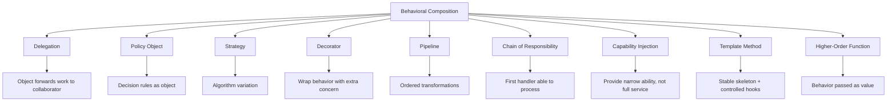
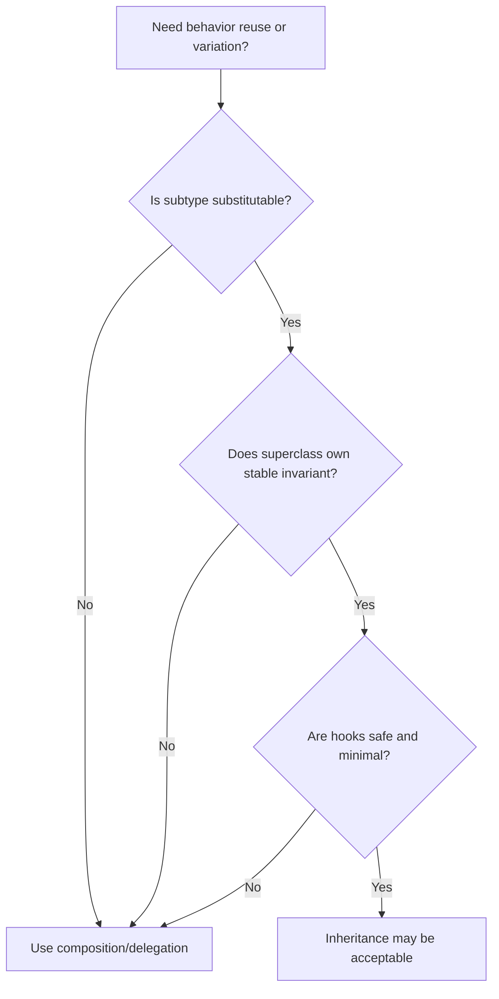
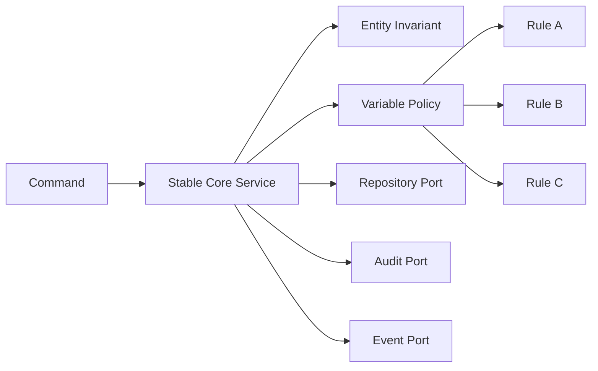

# Part 015 — Behavioral Composition Without Framework Magic

> Target: mampu membangun behavior yang fleksibel, testable, dan bisa berevolusi melalui composition, delegation, policy objects, dan pipeline kecil — tanpa langsung bergantung pada framework, inheritance hierarchy besar, atau pattern template yang dihafal.

Part sebelumnya membahas `record`, `sealed`, dan `enum` sebagai alat **domain shape control**. Part ini membahas sisi behavior:

```text
Bagaimana object melakukan sesuatu?
Bagaimana behavior diganti tanpa merusak invariant?
Bagaimana variasi bisnis ditambahkan tanpa membuat inheritance tree rapuh?
Bagaimana API menerima policy, validator, mapper, dan handler secara eksplisit?
```

Composition bukan sekadar slogan "favor composition over inheritance". Dalam sistem enterprise, composition adalah cara mengendalikan variasi tanpa membiarkan variasi itu bocor ke seluruh codebase.

---

## 1. Kaufman Framing: Skill yang Sedang Dilatih

### 1.1 Skill Deconstruction

Skill utama:

```text
Mendesain behavior Java sebagai kumpulan unit kecil yang eksplisit, bisa diganti, bisa dites, dan tetap menjaga invariant domain.
```

Sub-skill:

```text
Behavioral composition:
  ├─ identify stable core behavior
  ├─ identify variable policies
  ├─ isolate side effects
  ├─ model capabilities explicitly
  ├─ compose behavior with delegation
  ├─ expose extension points safely
  ├─ build pipelines without hidden magic
  ├─ test contract and composition order
  └─ evolve API without inheritance traps
```

Yang ingin dihindari:

```text
Inheritance as configuration
Framework annotations as design substitute
God service with 27 injected dependencies
Boolean flags that change behavior invisibly
Subclass override hooks that break invariants
Implicit order of interceptors no one owns
```

### 1.2 Target Performance Level

Setelah part ini, targetnya bukan hanya bisa menulis Strategy Pattern. Targetnya:

1. Bisa membedakan **state composition** dan **behavior composition**.
2. Bisa memilih antara delegation, policy object, template method, higher-order function, chain, decorator, dan pipeline.
3. Bisa membaca sebuah service besar lalu memecahnya menjadi stable core + variable policies.
4. Bisa membuat extension point yang aman untuk framework internal.
5. Bisa menghindari hidden coupling akibat dependency injection yang terlalu bebas.
6. Bisa mendesain komposisi yang punya ordering, failure, observability, dan testing model jelas.

---

## 2. Mental Model: Behavior Itu Punya Ownership

Pertanyaan awal:

```text
Siapa pemilik behavior ini?
```

Banyak desain buruk muncul karena behavior ditempatkan di object yang salah.

Contoh domain enforcement:

```java
public final class CaseFile {
    private CaseStatus status;

    public void escalate() {
        if (status != CaseStatus.OPEN) {
            throw new IllegalStateException("Only open cases can be escalated");
        }
        status = CaseStatus.ESCALATED;
    }
}
```

Ini bagus jika aturan `escalate` adalah invariant intrinsic dari `CaseFile`.

Namun bayangkan aturan eskalasi berbeda per regulator, risk tier, SLA, dan channel:

```text
Case can be escalated if:
  - status is OPEN
  - severity is HIGH or CRITICAL
  - SLA breach is near
  - assigned team allows manual escalation
  - region-specific rule permits escalation
```

Jika semua dimasukkan ke entity, `CaseFile` berubah menjadi object raksasa yang tahu policy, clock, region, SLA, org structure, dan authorization.

Lebih tepat:

```text
CaseFile owns invariant state transition.
EscalationPolicy owns contextual decision.
EscalationService orchestrates policy + state transition + side effects.
```

```java
public interface EscalationPolicy {
    EscalationDecision evaluate(EscalationContext context);
}

public record EscalationDecision(
        boolean allowed,
        String reason
) {
    public static EscalationDecision allow(String reason) {
        return new EscalationDecision(true, reason);
    }

    public static EscalationDecision deny(String reason) {
        return new EscalationDecision(false, reason);
    }
}

public final class CaseFile {
    private CaseStatus status;

    public void escalate() {
        if (status != CaseStatus.OPEN) {
            throw new IllegalStateException("Only open cases can be escalated");
        }
        status = CaseStatus.ESCALATED;
    }
}

public final class EscalationService {
    private final EscalationPolicy policy;
    private final CaseRepository repository;
    private final AuditSink auditSink;

    public EscalationService(
            EscalationPolicy policy,
            CaseRepository repository,
            AuditSink auditSink
    ) {
        this.policy = policy;
        this.repository = repository;
        this.auditSink = auditSink;
    }

    public void escalate(CaseId id, UserId actor) {
        CaseFile caseFile = repository.get(id);
        EscalationContext context = EscalationContext.from(caseFile, actor);
        EscalationDecision decision = policy.evaluate(context);

        if (!decision.allowed()) {
            throw new EscalationRejectedException(decision.reason());
        }

        caseFile.escalate();
        repository.save(caseFile);
        auditSink.record("CASE_ESCALATED", id, actor, decision.reason());
    }
}
```

Mental model:

```text
Entity       -> owns invariant state mutation
Policy       -> owns context-sensitive decision
Service      -> owns orchestration and side effects
Repository   -> owns persistence boundary
AuditSink    -> owns audit side effect
```

Composition adalah memecah ownership behavior agar perubahan tidak merambat liar.

---

## 3. Taxonomy of Behavioral Composition

Composition punya beberapa bentuk. Jangan mencampur semuanya dengan nama generik "service".



### 3.1 Delegation

Delegation:

```text
Object A receives request.
Object A asks Object B to perform a part of the behavior.
Object A remains responsible for the overall contract.
```

Example:

```java
public final class EnforcementCaseService {
    private final CaseNumberGenerator numberGenerator;
    private final CaseRepository repository;

    public EnforcementCaseService(
            CaseNumberGenerator numberGenerator,
            CaseRepository repository
    ) {
        this.numberGenerator = numberGenerator;
        this.repository = repository;
    }

    public CaseId openCase(OpenCaseCommand command) {
        CaseNumber number = numberGenerator.nextNumber(command.jurisdiction());
        CaseFile caseFile = CaseFile.open(number, command.subject(), command.allegation());
        repository.save(caseFile);
        return caseFile.id();
    }
}
```

`EnforcementCaseService` tidak mewarisi generator. Ia memakai generator.

Delegation cocok saat:

```text
- collaborator punya responsibility jelas
- caller tetap mengontrol workflow utama
- behavior perlu diganti di test atau konfigurasi
- variasi tidak seharusnya menjadi subtype dari caller
```

Anti-pattern:

```java
public final class CaseService {
    private final EverythingService everything;

    public void openCase(OpenCaseCommand command) {
        everything.validate(command);
        everything.generateNumber(command);
        everything.persist(command);
        everything.audit(command);
        everything.notify(command);
    }
}
```

Ini bukan composition yang baik. Ini hanya memindahkan god object ke dependency lain.

### 3.2 Policy Object

Policy object adalah object yang menjawab pertanyaan keputusan:

```text
Is this allowed?
Which option should be selected?
What limit applies?
What classification applies?
```

```java
public interface AssignmentPolicy {
    Assignee selectAssignee(AssignmentContext context);
}

public final class LeastLoadedTeamPolicy implements AssignmentPolicy {
    private final TeamLoadSnapshot loadSnapshot;

    public LeastLoadedTeamPolicy(TeamLoadSnapshot loadSnapshot) {
        this.loadSnapshot = loadSnapshot;
    }

    @Override
    public Assignee selectAssignee(AssignmentContext context) {
        return loadSnapshot.findLeastLoaded(context.requiredSkill())
                .orElseThrow(() -> new NoEligibleAssigneeException(context.requiredSkill()));
    }
}
```

Policy object berbeda dari entity method.

```text
Entity method:
  caseFile.close()

Policy object:
  closurePolicy.canClose(caseFile, actor, clock.now())
```

Policy cocok saat aturan:

1. Berubah berdasarkan deployment/customer/region.
2. Membutuhkan context eksternal.
3. Ingin dites secara terpisah.
4. Tidak layak menjadi invariant internal entity.
5. Bisa dikombinasikan.

### 3.3 Strategy

Strategy adalah variasi algoritma untuk tujuan yang sama.

```java
public interface RiskScoringStrategy {
    RiskScore score(RiskInput input);
}

public final class RuleBasedRiskScoring implements RiskScoringStrategy {
    @Override
    public RiskScore score(RiskInput input) {
        int score = 0;
        if (input.hasPriorViolation()) score += 30;
        if (input.transactionAmount().isHigh()) score += 20;
        if (input.subjectType() == SubjectType.REGULATED_ENTITY) score += 10;
        return new RiskScore(score);
    }
}
```

Strategy cocok saat semua implementasi punya contract sama:

```text
Input sama
Output sama
Semantics sama
Algorithm berbeda
```

Kalau semantics berbeda, jangan paksakan strategy.

Bad example:

```java
interface CaseActionStrategy {
    void execute(CaseFile file);
}
```

Jika implementasi `CloseCase`, `EscalateCase`, `AssignCase`, dan `DeleteCase` dimasukkan ke strategy yang sama, contract menjadi kosong. Nama `execute` menyembunyikan domain semantics.

Lebih baik:

```java
public interface CaseClosurePolicy {
    ClosureDecision evaluate(CaseFile file, UserId actor);
}

public interface CaseEscalationPolicy {
    EscalationDecision evaluate(CaseFile file, UserId actor);
}
```

### 3.4 Decorator

Decorator menambah behavior di sekitar behavior lain tanpa mengubah core implementation.

```java
public final class AuditingEscalationPolicy implements EscalationPolicy {
    private final EscalationPolicy delegate;
    private final AuditSink auditSink;

    public AuditingEscalationPolicy(EscalationPolicy delegate, AuditSink auditSink) {
        this.delegate = delegate;
        this.auditSink = auditSink;
    }

    @Override
    public EscalationDecision evaluate(EscalationContext context) {
        EscalationDecision decision = delegate.evaluate(context);
        auditSink.record("ESCALATION_POLICY_EVALUATED", context.caseId(), decision.reason());
        return decision;
    }
}
```

Decorator cocok untuk concern sekitar:

```text
- logging
- auditing
- metrics
- caching
- retry
- authorization check
- tracing
- circuit breaker
```

Namun hati-hati: tidak semua cross-cutting concern aman sebagai decorator. Transaction boundary, retry, idempotency, dan side effect ordering harus jelas.

### 3.5 Pipeline

Pipeline adalah sequence transformation/validation/handling yang urutannya penting.

```java
public interface CaseIntakeStep {
    IntakeDraft apply(IntakeDraft draft);
}

public final class IntakePipeline {
    private final List<CaseIntakeStep> steps;

    public IntakePipeline(List<CaseIntakeStep> steps) {
        this.steps = List.copyOf(steps);
    }

    public IntakeDraft run(IntakeDraft initial) {
        IntakeDraft current = initial;
        for (CaseIntakeStep step : steps) {
            current = step.apply(current);
        }
        return current;
    }
}
```

Pipeline cocok saat:

```text
- output step N menjadi input step N+1
- order eksplisit
- semua step punya contract sempit
- failure handling bisa didefinisikan
- observability per step penting
```

Pipeline buruk jika step diam-diam mengubah shared mutable context tanpa contract.

```java
// Risky: every step mutates hidden context arbitrarily.
interface Step {
    void execute(Map<String, Object> context);
}
```

Map context terlihat fleksibel, tetapi biasanya menghancurkan type safety.

Lebih baik:

```java
public record IntakeDraft(
        Subject subject,
        Allegation allegation,
        Optional<RiskScore> riskScore,
        List<ValidationMessage> messages
) {
    public IntakeDraft withRiskScore(RiskScore score) {
        return new IntakeDraft(subject, allegation, Optional.of(score), messages);
    }
}
```

### 3.6 Chain of Responsibility

Chain of Responsibility berbeda dari pipeline.

```text
Pipeline:
  all steps usually run in order

Chain:
  each handler may handle, decline, or pass to next
```

```java
public interface CommandHandler<C extends Command> {
    boolean supports(Command command);
    CommandResult handle(C command);
}

public final class CommandBus {
    private final List<CommandHandler<? extends Command>> handlers;

    public CommandBus(List<CommandHandler<? extends Command>> handlers) {
        this.handlers = List.copyOf(handlers);
    }

    public CommandResult dispatch(Command command) {
        for (CommandHandler<? extends Command> handler : handlers) {
            if (handler.supports(command)) {
                return invoke(handler, command);
            }
        }
        throw new UnsupportedCommandException(command.getClass().getName());
    }

    @SuppressWarnings({"unchecked", "rawtypes"})
    private static CommandResult invoke(CommandHandler handler, Command command) {
        return handler.handle(command);
    }
}
```

This design has an erased generic cast. That is acceptable only if `supports` and registration enforce the invariant. Later in the generics parts, we will improve this with type tokens and registries.

Chain cocok untuk:

```text
- command dispatch
- validation rule selection
- exception mapping
- message routing
- parser selection
- plugin extension
```

Failure mode terbesar: lebih dari satu handler mendukung input yang sama.

Solusi:

```text
- detect ambiguity at startup
- require priority explicitly
- fail fast on duplicate capability
- expose diagnostic endpoint
```

### 3.7 Capability Injection

Dependency injection sering terlalu kasar.

Bad:

```java
public final class CaseClosureService {
    private final CaseRepository repository;
    private final UserService userService;
    private final OrganizationService organizationService;
    private final AuthorizationService authorizationService;
    private final EmailService emailService;
    private final AuditService auditService;
    private final Clock clock;
    private final ConfigService configService;
    private final FeatureFlagService featureFlagService;

    // constructor omitted
}
```

Banyak dependency berarti service memegang terlalu banyak capability.

Capability injection memberi dependency sempit:

```java
public interface CanReadCase {
    CaseFile get(CaseId id);
}

public interface CanSaveCase {
    void save(CaseFile caseFile);
}

public interface CanRecordAudit {
    void record(AuditEvent event);
}

public interface CanAuthorizeCaseAction {
    void requireAllowed(UserId actor, CaseAction action, CaseId caseId);
}
```

Service hanya menerima yang ia butuhkan:

```java
public final class CaseClosureService {
    private final CanReadCase reader;
    private final CanSaveCase writer;
    private final CanAuthorizeCaseAction authorizer;
    private final CanRecordAudit audit;
    private final ClosurePolicy policy;

    public CaseClosureService(
            CanReadCase reader,
            CanSaveCase writer,
            CanAuthorizeCaseAction authorizer,
            CanRecordAudit audit,
            ClosurePolicy policy
    ) {
        this.reader = reader;
        this.writer = writer;
        this.authorizer = authorizer;
        this.audit = audit;
        this.policy = policy;
    }
}
```

Trade-off:

```text
Pro:
  - dependency contract lebih kecil
  - test lebih mudah
  - accidental coupling turun
  - service tidak bisa memakai operasi yang tidak dimaksudkan

Con:
  - jumlah interface bisa naik
  - wiring lebih kompleks
  - butuh naming discipline
```

---

## 4. Composition vs Inheritance: Decision Matrix



### 4.1 Use Composition When

```text
- variasi bisa berubah runtime/config/deployment
- behavior membutuhkan dependency eksternal
- behavior bukan identity/type dari object utama
- ingin menghindari fragile base class
- ingin kombinasi N x M tanpa subclass explosion
- ingin testing granular
- extension point dipakai oleh konsumen API
```

### 4.2 Use Inheritance When

```text
- subtype benar-benar substitutable
- superclass punya invariant stabil
- extension hooks terbatas dan terdokumentasi
- construction lifecycle jelas
- binary compatibility risk diterima
- subclass bukan plugin liar dengan side effect tak terkendali
```

Good inheritance example:

```java
public abstract class AbstractCaseExporter {
    public final ExportResult export(CaseFile caseFile) {
        validate(caseFile);
        byte[] payload = render(caseFile);
        return new ExportResult(contentType(), payload);
    }

    private void validate(CaseFile caseFile) {
        if (caseFile == null) {
            throw new IllegalArgumentException("caseFile must not be null");
        }
    }

    protected abstract byte[] render(CaseFile caseFile);

    protected abstract String contentType();
}
```

Superclass owns skeleton. Hooks are narrow. `export` is final.

Bad inheritance example:

```java
public abstract class BaseCaseService {
    protected CaseRepository repository;
    protected AuditService auditService;
    protected EmailService emailService;
    protected ConfigService configService;

    protected void beforeExecute() {}
    protected void afterExecute() {}
    protected void onError(Exception e) {}
    protected abstract void execute();
}
```

This is a framework disguised as a base class. It leaks lifecycle, dependencies, and side effects to all subclasses.

---

## 5. Stable Core + Variable Edge

A strong composition design separates:

```text
Stable core:
  - invariant
  - domain transition
  - command semantics
  - transaction semantics
  - audit semantics

Variable edge:
  - policy
  - mapping
  - selection
  - formatting
  - external integration
  - notification channel
```



Example:

```java
public final class CaseAssignmentService {
    private final AssignmentPolicy assignmentPolicy;
    private final CaseRepository caseRepository;
    private final AssignmentRepository assignmentRepository;
    private final AuditSink auditSink;

    public AssignmentId assign(CaseId caseId, UserId actor) {
        CaseFile caseFile = caseRepository.get(caseId);
        AssignmentContext context = AssignmentContext.from(caseFile, actor);

        Assignee assignee = assignmentPolicy.selectAssignee(context);
        Assignment assignment = caseFile.assignTo(assignee, actor);

        assignmentRepository.save(assignment);
        caseRepository.save(caseFile);
        auditSink.record(AuditEvent.caseAssigned(caseId, assignee.id(), actor));

        return assignment.id();
    }
}
```

The core workflow is stable. The policy is replaceable.

---

## 6. Composition Order Is a Contract

Jika behavior dikomposisikan, urutan adalah bagian dari contract.

Example validation pipeline:

```text
1. normalize input
2. syntactic validation
3. semantic validation
4. authorization validation
5. duplicate detection
6. enrichment
7. persistence
```

Salah urutan bisa menciptakan bug:

```text
authorization before normalization -> checks wrong identifier
semantic validation before enrichment -> missing reference data
duplicate detection after persistence -> duplicate already stored
notification before commit -> user notified for failed transaction
```

Represent order explicitly:

```java
public enum IntakeStage {
    NORMALIZE,
    SYNTACTIC_VALIDATE,
    SEMANTIC_VALIDATE,
    AUTHORIZE,
    DEDUPLICATE,
    ENRICH
}

public interface OrderedIntakeStep {
    IntakeStage stage();
    IntakeDraft apply(IntakeDraft draft);
}
```

Or use explicit construction:

```java
public final class IntakePipelineFactory {
    public IntakePipeline create(DefaultDependencies deps) {
        return new IntakePipeline(List.of(
                new NormalizeSubjectStep(),
                new SyntacticValidationStep(),
                new SemanticValidationStep(deps.referenceData()),
                new AuthorizationStep(deps.authorization()),
                new DeduplicationStep(deps.caseIndex()),
                new EnrichmentStep(deps.enrichment())
        ));
    }
}
```

In internal platforms, do not let arbitrary component scan define critical order unless you have explicit ordering metadata and startup diagnostics.

---

## 7. Avoid Boolean Flag Composition

Boolean flags often hide multiple behaviors in one API.

Bad:

```java
public void closeCase(CaseId id, boolean notifySubject, boolean force, boolean audit) {
    // many branches
}
```

This creates unclear behavior combinations:

```text
notifySubject=true, force=true, audit=false
notifySubject=false, force=false, audit=true
notifySubject=true, force=false, audit=false
```

Better: use explicit command shape.

```java
public sealed interface CaseClosureMode permits NormalClosure, ForcedClosure {
}

public record NormalClosure(ClosureReason reason) implements CaseClosureMode {
}

public record ForcedClosure(ClosureReason reason, ForceJustification justification) implements CaseClosureMode {
}

public record CloseCaseCommand(
        CaseId caseId,
        UserId actor,
        CaseClosureMode mode,
        NotificationPreference notificationPreference
) {
}
```

Now the API describes intent, not implementation flags.

---

## 8. Explicit Extension Points

A reusable Java platform needs extension points, but extension points are dangerous if too broad.

Bad extension point:

```java
public interface CaseLifecycleHook {
    void before(Object context);
    void after(Object context);
    void onError(Object context, Exception exception);
}
```

Problems:

```text
- Object context is untyped
- hook can mutate anything
- unclear transaction boundary
- unclear error behavior
- no ordering model
- no observability model
```

Better:

```java
public interface BeforeCaseClosurePolicy {
    ClosurePrecheckResult check(BeforeCaseClosureContext context);
}

public record BeforeCaseClosureContext(
        CaseId caseId,
        CaseStatus currentStatus,
        UserId actor,
        Instant requestedAt
) {
}

public sealed interface ClosurePrecheckResult permits ClosurePrecheckResult.Allowed, ClosurePrecheckResult.Rejected {
    record Allowed() implements ClosurePrecheckResult {}
    record Rejected(String reason) implements ClosurePrecheckResult {}
}
```

Make extension point narrow:

```text
Specific phase
Specific input
Specific output
Specific failure semantics
Specific mutability rule
Specific ordering
```

---

## 9. Composition and Invariants

Composition must not allow collaborators to violate invariants.

Bad:

```java
public interface CaseMutationPlugin {
    void mutate(CaseFile caseFile);
}
```

Any plugin can corrupt state.

Better:

```java
public interface CaseDecisionPlugin {
    CaseDecision evaluate(CaseSnapshot snapshot);
}
```

Then core service applies mutation:

```java
public final class CaseDecisionService {
    private final List<CaseDecisionPlugin> plugins;

    public void applyDecisions(CaseFile caseFile) {
        CaseSnapshot snapshot = CaseSnapshot.from(caseFile);
        List<CaseDecision> decisions = plugins.stream()
                .map(plugin -> plugin.evaluate(snapshot))
                .toList();

        for (CaseDecision decision : decisions) {
            caseFile.apply(decision);
        }
    }
}
```

Rule:

```text
Plugins may propose.
Core applies.
Entity enforces.
```

---

## 10. Composition with Immutable Inputs

When a pipeline step receives mutable object, ownership becomes ambiguous.

```java
public final class MutableContext {
    public String subjectName;
    public List<String> warnings = new ArrayList<>();
    public Map<String, Object> attributes = new HashMap<>();
}
```

Better for deterministic composition:

```java
public record IntakeContext(
        SubjectName subjectName,
        List<Warning> warnings,
        Map<String, AttributeValue> attributes
) {
    public IntakeContext {
        warnings = List.copyOf(warnings);
        attributes = Map.copyOf(attributes);
    }

    public IntakeContext withWarning(Warning warning) {
        ArrayList<Warning> copy = new ArrayList<>(warnings);
        copy.add(warning);
        return new IntakeContext(subjectName, copy, attributes);
    }
}
```

Immutable composition gives:

```text
- easier reasoning
- safer reuse
- clearer tests
- no hidden mutation order
- easier replay/debug
```

Cost:

```text
- more allocation
- careful design for large data
- may require persistent data structure or builder at boundary
```

For hot paths, use mutable builders internally but publish immutable results.

```java
public final class IntakeContextBuilder {
    private SubjectName subjectName;
    private final List<Warning> warnings = new ArrayList<>();

    public IntakeContext build() {
        return new IntakeContext(subjectName, warnings, Map.of());
    }
}
```

---

## 11. Composition with Side Effects

Side effects must be explicit.

```text
Pure behavior:
  input -> output

Effectful behavior:
  input -> output + external change
```

Bad:

```java
public final class RiskScoringPolicy implements EscalationPolicy {
    @Override
    public EscalationDecision evaluate(EscalationContext context) {
        emailService.sendRiskAlert(context.caseId());
        return EscalationDecision.allow("high risk");
    }
}
```

A policy evaluation should usually not send emails. It makes tests flaky and retry behavior dangerous.

Better:

```java
public record PolicyEvaluation(
        EscalationDecision decision,
        List<DomainEvent> events
) {
}
```

```java
public final class EscalationService {
    public void escalate(CaseId id, UserId actor) {
        CaseFile caseFile = repository.get(id);
        PolicyEvaluation evaluation = policy.evaluate(EscalationContext.from(caseFile, actor));

        if (!evaluation.decision().allowed()) {
            throw new EscalationRejectedException(evaluation.decision().reason());
        }

        caseFile.escalate();
        repository.save(caseFile);
        eventPublisher.publish(evaluation.events());
    }
}
```

Rule:

```text
Decision code returns facts.
Orchestration code performs effects.
```

---

## 12. Composition Error Semantics

Every composition mechanism needs an error policy.

For pipeline:

```text
- stop at first error?
- collect all errors?
- compensate previous steps?
- skip optional steps?
- classify fatal vs warning?
```

For chain:

```text
- what if no handler matches?
- what if multiple handlers match?
- what if handler throws?
- is order deterministic?
```

For decorator:

```text
- should decorator swallow exceptions?
- should metrics record failures?
- should retry wrap idempotent operations only?
```

Represent explicitly:

```java
public sealed interface ValidationResult permits ValidationResult.Valid, ValidationResult.Invalid {
    record Valid() implements ValidationResult {}
    record Invalid(List<ValidationError> errors) implements ValidationResult {
        public Invalid {
            errors = List.copyOf(errors);
        }
    }
}

public interface Validator<T> {
    ValidationResult validate(T value);
}
```

Collecting validator:

```java
public final class CompositeValidator<T> implements Validator<T> {
    private final List<Validator<T>> validators;

    public CompositeValidator(List<Validator<T>> validators) {
        this.validators = List.copyOf(validators);
    }

    @Override
    public ValidationResult validate(T value) {
        ArrayList<ValidationError> errors = new ArrayList<>();

        for (Validator<T> validator : validators) {
            ValidationResult result = validator.validate(value);
            if (result instanceof ValidationResult.Invalid invalid) {
                errors.addAll(invalid.errors());
            }
        }

        return errors.isEmpty()
                ? new ValidationResult.Valid()
                : new ValidationResult.Invalid(errors);
    }
}
```

This is different from fail-fast validator:

```java
public final class FailFastValidator<T> implements Validator<T> {
    private final List<Validator<T>> validators;

    public FailFastValidator(List<Validator<T>> validators) {
        this.validators = List.copyOf(validators);
    }

    @Override
    public ValidationResult validate(T value) {
        for (Validator<T> validator : validators) {
            ValidationResult result = validator.validate(value);
            if (result instanceof ValidationResult.Invalid) {
                return result;
            }
        }
        return new ValidationResult.Valid();
    }
}
```

Same validators, different composition semantics.

---

## 13. Composition and Observability

Framework magic often hides the real execution graph. For critical workflows, make composition visible.

Example traced pipeline:

```java
public final class TracedPipeline<T> {
    private final List<NamedStep<T>> steps;
    private final TraceSink traceSink;

    public TracedPipeline(List<NamedStep<T>> steps, TraceSink traceSink) {
        this.steps = List.copyOf(steps);
        this.traceSink = traceSink;
    }

    public T run(T input) {
        T current = input;
        for (NamedStep<T> step : steps) {
            long start = System.nanoTime();
            try {
                current = step.apply(current);
                traceSink.success(step.name(), System.nanoTime() - start);
            } catch (RuntimeException ex) {
                traceSink.failure(step.name(), System.nanoTime() - start, ex);
                throw ex;
            }
        }
        return current;
    }
}

public interface NamedStep<T> {
    String name();
    T apply(T input);
}
```

A top engineer asks:

```text
Can I explain what was executed?
Can I reproduce ordering?
Can I see which composed behavior failed?
Can I measure each part?
Can I turn off one extension safely?
```

---

## 14. Composition Registration

For platform/framework code, behavior is often registered.

Simple explicit registry:

```java
public final class PolicyRegistry<K, P> {
    private final Map<K, P> policies;

    public PolicyRegistry(Map<K, P> policies) {
        this.policies = Map.copyOf(policies);
    }

    public P get(K key) {
        P policy = policies.get(key);
        if (policy == null) {
            throw new IllegalArgumentException("No policy registered for " + key);
        }
        return policy;
    }
}
```

Usage:

```java
public enum Jurisdiction {
    ID,
    SG,
    AU
}

PolicyRegistry<Jurisdiction, EscalationPolicy> registry = new PolicyRegistry<>(Map.of(
        Jurisdiction.ID, new IndonesiaEscalationPolicy(),
        Jurisdiction.SG, new SingaporeEscalationPolicy(),
        Jurisdiction.AU, new AustraliaEscalationPolicy()
));
```

Fail fast:

```java
public final class CompletePolicyRegistry<K, P> {
    private final Map<K, P> policies;

    public CompletePolicyRegistry(Set<K> requiredKeys, Map<K, P> policies) {
        Set<K> missing = new LinkedHashSet<>(requiredKeys);
        missing.removeAll(policies.keySet());
        if (!missing.isEmpty()) {
            throw new IllegalArgumentException("Missing policies: " + missing);
        }
        this.policies = Map.copyOf(policies);
    }
}
```

This is better than discovering missing policy after production traffic hits a rare branch.

---

## 15. Composition Over DI Container Magic

Dependency injection containers are useful, but they do not replace design.

Bad mental model:

```text
If Spring can wire it, the design is fine.
```

Better mental model:

```text
Composition is a graph of responsibilities.
The DI container is only a graph assembler.
```

A good composition root:

```java
public final class CaseModule {
    public CaseAssignmentService caseAssignmentService() {
        AssignmentPolicy policy = new CompositeAssignmentPolicy(List.of(
                new SkillBasedAssignmentPolicy(),
                new LeastLoadedAssignmentPolicy(),
                new FallbackSupervisorPolicy()
        ));

        return new CaseAssignmentService(
                policy,
                caseRepository(),
                assignmentRepository(),
                auditSink()
        );
    }
}
```

Even if production uses Spring, manual composition like this is useful because it clarifies dependencies.

---

## 16. Composite Policy Design

Sometimes policy itself is composition.

```java
public interface ClosureRule {
    Optional<ClosureRejection> check(ClosureContext context);
}

public final class ClosurePolicy {
    private final List<ClosureRule> rules;

    public ClosurePolicy(List<ClosureRule> rules) {
        this.rules = List.copyOf(rules);
    }

    public ClosureDecision evaluate(ClosureContext context) {
        ArrayList<ClosureRejection> rejections = new ArrayList<>();
        for (ClosureRule rule : rules) {
            rule.check(context).ifPresent(rejections::add);
        }

        if (!rejections.isEmpty()) {
            return ClosureDecision.rejected(rejections);
        }
        return ClosureDecision.allowed();
    }
}
```

Rules:

```java
public final class NoOpenTasksRule implements ClosureRule {
    @Override
    public Optional<ClosureRejection> check(ClosureContext context) {
        if (context.openTaskCount() > 0) {
            return Optional.of(new ClosureRejection("Case has open tasks"));
        }
        return Optional.empty();
    }
}

public final class EvidenceReviewedRule implements ClosureRule {
    @Override
    public Optional<ClosureRejection> check(ClosureContext context) {
        if (!context.evidenceReviewed()) {
            return Optional.of(new ClosureRejection("Evidence has not been reviewed"));
        }
        return Optional.empty();
    }
}
```

This design gives:

```text
- each rule small
- test each rule independently
- test policy aggregation separately
- add rule without editing giant if block
- provide detailed rejection reasons
```

But it has risks:

```text
- rule order may matter accidentally
- rule dependency may be hidden
- performance may degrade with many remote checks
- duplicate rules may exist
```

Mitigation:

```text
- make rules pure
- pass complete context, avoid remote calls in rules
- create context with pre-fetched data
- detect duplicate rule ids
- expose rule diagnostics
```

---

## 17. Rule Object vs Specification Pattern

You may know Specification Pattern from earlier series. Here we avoid repeating the pattern mechanically. The key distinction:

```text
Predicate/Specification:
  returns true/false

Rule:
  returns diagnostic reason, severity, metadata, remediation
```

For enterprise systems, boolean is usually too weak.

```java
public interface Rule<T> {
    RuleResult evaluate(T value);
}

public record RuleResult(
        boolean passed,
        String code,
        String message,
        Severity severity
) {
    public static RuleResult pass(String code) {
        return new RuleResult(true, code, "", Severity.INFO);
    }

    public static RuleResult fail(String code, String message, Severity severity) {
        return new RuleResult(false, code, message, severity);
    }
}
```

This is more operationally useful than:

```java
Predicate<CaseFile> canClose;
```

Use predicate when all you need is boolean composition. Use rule when humans, audit, remediation, or compliance need explanation.

---

## 18. Composition and Type Safety

Stringly typed composition is common in framework code.

Bad:

```java
registry.register("case.close.before", hook);
registry.invoke("case.close.before", mapContext);
```

Better:

```java
public final class ExtensionPoint<I, O> {
    private final String name;
    private final Class<I> inputType;
    private final Class<O> outputType;

    public ExtensionPoint(String name, Class<I> inputType, Class<O> outputType) {
        this.name = Objects.requireNonNull(name);
        this.inputType = Objects.requireNonNull(inputType);
        this.outputType = Objects.requireNonNull(outputType);
    }

    public String name() {
        return name;
    }

    public Class<I> inputType() {
        return inputType;
    }

    public Class<O> outputType() {
        return outputType;
    }
}
```

```java
public interface Extension<I, O> {
    O apply(I input);
}
```

Later, in generics/type token sections, we will improve this to handle parameterized types more safely.

---

## 19. Practical Refactoring: God Service to Composition

Before:

```java
public final class CaseIntakeService {
    public CaseId intake(Request request) {
        // parse
        // validate nulls
        // validate semantics
        // enrich subject
        // score risk
        // check duplicates
        // assign team
        // persist case
        // publish event
        // audit
        // notify
        // handle retries
        return id;
    }
}
```

Refactoring path:

```text
Step 1: identify phases
Step 2: classify phases as pure/side-effectful
Step 3: create immutable context/result types
Step 4: extract policies/rules/mappers
Step 5: keep transaction orchestration explicit
Step 6: add diagnostics per step
Step 7: test pipeline contract
```

After:

```java
public final class CaseIntakeService {
    private final IntakeNormalizer normalizer;
    private final Validator<IntakeDraft> validator;
    private final SubjectEnricher enricher;
    private final RiskScoringPolicy riskScoringPolicy;
    private final DuplicateCasePolicy duplicateCasePolicy;
    private final AssignmentPolicy assignmentPolicy;
    private final CaseRepository repository;
    private final EventPublisher eventPublisher;
    private final AuditSink auditSink;

    public CaseId intake(RawIntakeRequest request, UserId actor) {
        IntakeDraft draft = normalizer.normalize(request);

        ValidationResult validation = validator.validate(draft);
        if (validation instanceof ValidationResult.Invalid invalid) {
            throw new IntakeValidationException(invalid.errors());
        }

        EnrichedIntake enriched = enricher.enrich(draft);
        RiskScore riskScore = riskScoringPolicy.score(enriched);

        duplicateCasePolicy.requireNoDuplicate(enriched.subject(), enriched.allegation());

        CaseFile caseFile = CaseFile.open(enriched, riskScore, actor);
        Assignee assignee = assignmentPolicy.selectAssignee(AssignmentContext.from(caseFile));
        caseFile.assignTo(assignee, actor);

        repository.save(caseFile);
        eventPublisher.publish(CaseOpenedEvent.from(caseFile));
        auditSink.record(AuditEvent.caseOpened(caseFile.id(), actor));

        return caseFile.id();
    }
}
```

This is still one orchestration method, but behavior is now named and testable.

Do not over-fragment into meaningless classes. Extract only when responsibility has a stable name and contract.

---

## 20. Testing Composition

### 20.1 Unit Test Policy

```java
class NoOpenTasksRuleTest {
    @Test
    void rejects_case_with_open_tasks() {
        NoOpenTasksRule rule = new NoOpenTasksRule();
        ClosureContext context = new ClosureContext(3, true);

        Optional<ClosureRejection> rejection = rule.check(context);

        assertTrue(rejection.isPresent());
        assertEquals("Case has open tasks", rejection.get().message());
    }
}
```

### 20.2 Test Aggregation Contract

```java
class ClosurePolicyTest {
    @Test
    void collects_rejections_from_all_rules() {
        ClosureRule first = context -> Optional.of(new ClosureRejection("A"));
        ClosureRule second = context -> Optional.of(new ClosureRejection("B"));

        ClosurePolicy policy = new ClosurePolicy(List.of(first, second));
        ClosureDecision decision = policy.evaluate(new ClosureContext(0, false));

        assertFalse(decision.allowed());
        assertEquals(2, decision.rejections().size());
    }
}
```

### 20.3 Test Order

```java
class IntakePipelineTest {
    @Test
    void runs_steps_in_configured_order() {
        ArrayList<String> order = new ArrayList<>();

        CaseIntakeStep a = draft -> {
            order.add("A");
            return draft;
        };
        CaseIntakeStep b = draft -> {
            order.add("B");
            return draft;
        };

        new IntakePipeline(List.of(a, b)).run(IntakeDraft.empty());

        assertEquals(List.of("A", "B"), order);
    }
}
```

### 20.4 Contract Test Extension Point

```java
interface ClosureRuleContract {
    ClosureRule rule();

    @Test
    default void rule_does_not_throw_for_valid_context() {
        assertDoesNotThrow(() -> rule().check(ClosureContext.valid()));
    }

    @Test
    default void rule_returns_result_not_null() {
        assertNotNull(rule().check(ClosureContext.valid()));
    }
}
```

Every plugin implementer can run the same contract.

---

## 21. Composition Smells

### 21.1 Dependency Explosion

```text
Class has 12 dependencies.
```

Possible causes:

```text
- class owns too many phases
- dependency is too coarse
- missing facade/capability boundary
- orchestration and decision mixed
```

### 21.2 Strategy With Empty Contract

```java
interface Processor {
    void process(Object input);
}
```

Smell: the interface says nothing.

### 21.3 Hidden Mutation Context

```java
void execute(Context context);
```

Smell: no one knows what fields are required or produced.

### 21.4 Annotation as Design Replacement

```java
@MagicStep(order = 42, phase = "before-close")
public void doSomething(Map<String, Object> context) {
}
```

Smell: metadata exists, but type contract is weak.

### 21.5 Decorator Order Accident

```text
retry -> transaction -> audit
transaction -> retry -> audit
metrics -> retry -> circuit breaker
```

Different order changes semantics.

### 21.6 Subclass Hook Explosion

```java
protected void beforeA() {}
protected void afterA() {}
protected void beforeB() {}
protected void afterB() {}
protected void onAnyError() {}
```

Smell: inheritance framework is replacing composition.

---

## 22. Design Checklist

Use this checklist before adding a new behavior extension.

```text
1. What stable contract does this behavior implement?
2. Is it a decision, transformation, side effect, routing, or lifecycle hook?
3. Does it need external dependencies?
4. Does order matter?
5. Can multiple implementations run together?
6. What happens if it fails?
7. Can it mutate domain state directly?
8. Can it be tested without framework/container?
9. Is input/output typed strongly enough?
10. Is the extension point narrow enough?
11. Is the composition visible in diagnostics?
12. Can future API changes preserve compatibility?
```

---

## 23. Practice Drills

### Drill 1 — Extract Policy

Given:

```java
public boolean canEscalate(CaseFile file, User actor) {
    return file.status() == CaseStatus.OPEN
            && actor.hasRole("SUPERVISOR")
            && file.riskScore().value() > 70
            && file.openTaskCount() == 0;
}
```

Refactor into:

```text
- EscalationContext
- EscalationRule
- EscalationPolicy
- diagnostic rejection reasons
```

### Drill 2 — Replace Boolean Flags

Given:

```java
closeCase(id, true, false, true);
```

Create explicit command and mode types.

### Drill 3 — Pipeline Contract

Build an `IntakePipeline` with:

```text
- normalize
- validate
- enrich
- score
```

Then write test proving order.

### Drill 4 — Extension Point Hardening

Given:

```java
interface Plugin {
    void execute(Map<String, Object> context);
}
```

Replace it with a typed extension point.

---

## 24. Summary

Composition is not merely using fields instead of `extends`. It is a discipline for assigning behavior ownership.

Core ideas:

```text
- Entity owns invariant mutation.
- Policy owns decision.
- Strategy owns algorithm variation.
- Decorator owns surrounding concern.
- Pipeline owns ordered transformations.
- Chain owns handler selection.
- Capability interface owns narrow authority.
- Orchestrator owns side effects and transaction boundary.
```

The best Java APIs often feel simple because the composition is explicit, narrow, and type-safe. The worst internal frameworks feel flexible because they hide behavior behind reflection, maps, annotations, and inheritance hooks — until debugging, compatibility, and correctness become expensive.

In the next part, we move into functional Java: functional interfaces, lambdas, method references, captured variables, and the object model behind behavior-as-value.

---

## References

- Oracle Java SE 25 API Documentation — `java.lang`, `java.util`, `java.util.function`, `java.util.stream`
- Java Language Specification, Java SE 25 Edition — classes, interfaces, expressions, method invocation, lambda expressions, binary compatibility
- Effective Java design principles around composition, inheritance, immutability, and API contracts
