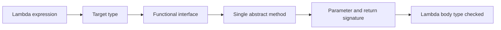
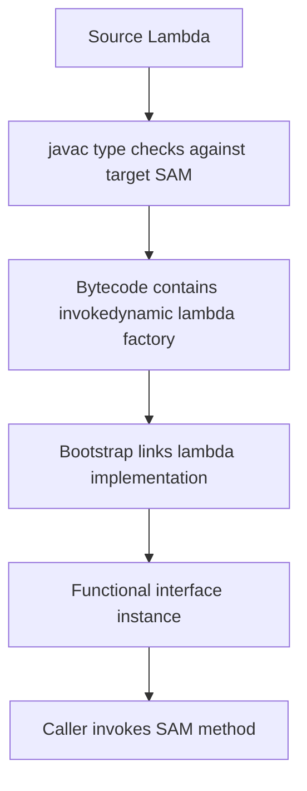

# Part 016 — Functional Interfaces and Lambda Object Model

> Target: memahami lambda Java bukan sebagai “syntax pendek”, tetapi sebagai mekanisme language-level untuk mengirim behavior sebagai value melalui target type functional interface, dengan konsekuensi pada type inference, capture, identity, performance, exceptions, serialization, dan API design.

Part sebelumnya membahas behavioral composition menggunakan object: policy, strategy, decorator, pipeline, chain, dan capability. Part ini membahas bentuk composition yang lebih ringan:

```java
Validator<Command> validator = command -> command.caseId() != null;
```

Lambda membuat behavior bisa diperlakukan sebagai value, tetapi Java tetap bukan bahasa dengan function type murni seperti beberapa bahasa functional. Java menggunakan **functional interface** sebagai target type.

Mental model paling penting:

```text
Lambda expression has no standalone type.
Lambda expression is typed by its target functional interface.
```

---

## 1. Kaufman Framing: Skill yang Sedang Dilatih

### 1.1 Skill Deconstruction

Skill utama:

```text
Mendesain dan memakai behavior-as-value di Java secara type-safe, readable, efficient, dan kompatibel dengan object model Java.
```

Sub-skill:

```text
Functional Java substrate:
  ├─ understand functional interface / SAM type
  ├─ understand target typing
  ├─ design custom functional interfaces
  ├─ choose java.util.function types correctly
  ├─ reason about lambda capture
  ├─ reason about method references
  ├─ handle checked exceptions intentionally
  ├─ avoid identity/serialization traps
  ├─ compose functions safely
  ├─ expose higher-order APIs
  └─ know when lambda makes API worse
```

Yang ingin dihindari:

```text
Using Function<T, R> for every concept
Lambdas with hidden side effects
Unreadable nested lambda chains
Checked exception hacks
Relying on lambda identity
Serializable lambda contracts without discipline
Leaking generic complexity into users
```

---

## 2. Functional Interface: The Real Type of a Lambda

A functional interface is an interface with exactly one abstract method. It may still have default methods, static methods, private methods, and methods inherited from `Object`.

```java
@FunctionalInterface
public interface CasePredicate {
    boolean test(CaseFile caseFile);

    default CasePredicate and(CasePredicate other) {
        Objects.requireNonNull(other);
        return caseFile -> this.test(caseFile) && other.test(caseFile);
    }
}
```

Usage:

```java
CasePredicate highRisk = caseFile -> caseFile.riskScore().value() >= 80;
CasePredicate open = caseFile -> caseFile.status() == CaseStatus.OPEN;

CasePredicate openAndHighRisk = open.and(highRisk);
```

`@FunctionalInterface` is not required, but it is valuable. It asks the compiler to reject accidental changes that make the interface non-functional.

Bad evolution:

```java
@FunctionalInterface
public interface CasePredicate {
    boolean test(CaseFile caseFile);

    // This breaks functional interface contract.
    String explain(CaseFile caseFile);
}
```

Compiler rejects it because there are now two abstract methods.

---

## 3. SAM Type Mental Model

SAM means Single Abstract Method.



Example:

```java
Predicate<CaseFile> isOpen = caseFile -> caseFile.status() == CaseStatus.OPEN;
```

The lambda body is checked against:

```java
boolean test(CaseFile value);
```

Same lambda shape can become different target types:

```java
Predicate<CaseFile> predicate = c -> c.status() == CaseStatus.OPEN;
CasePredicate custom = c -> c.status() == CaseStatus.OPEN;
```

The lambda does not have an independent type like:

```text
CaseFile -> boolean
```

It is assigned to a functional interface type.

---

## 4. Target Typing

Lambda can appear where Java expects a target type:

```java
// Assignment context
Predicate<CaseFile> open = c -> c.status() == CaseStatus.OPEN;

// Method invocation context
cases.stream().filter(c -> c.status() == CaseStatus.OPEN).toList();

// Cast context
Object predicate = (Predicate<CaseFile>) c -> c.status() == CaseStatus.OPEN;

// Return context
Predicate<CaseFile> openPredicate() {
    return c -> c.status() == CaseStatus.OPEN;
}
```

Target typing is why this fails:

```java
var f = x -> x.toString(); // does not compile
```

`var` needs an initializer type, but the lambda needs a target type. There is no standalone lambda type for the compiler to infer.

Fix:

```java
Function<Object, String> f = x -> x.toString();
```

Or:

```java
var f = (Function<Object, String>) x -> x.toString();
```

---

## 5. Standard Functional Interfaces

The `java.util.function` package provides common functional interfaces.

```text
Predicate<T>        T -> boolean
Function<T, R>      T -> R
Consumer<T>         T -> void
Supplier<T>         () -> T
UnaryOperator<T>    T -> T
BinaryOperator<T>   (T, T) -> T
BiFunction<T,U,R>   (T, U) -> R
BiConsumer<T,U>     (T, U) -> void
BiPredicate<T,U>    (T, U) -> boolean
```

Primitive specializations avoid boxing:

```text
IntPredicate
LongPredicate
DoublePredicate
IntFunction<R>
ToIntFunction<T>
IntUnaryOperator
IntBinaryOperator
ObjIntConsumer<T>
```

Example:

```java
ToIntFunction<CaseFile> riskValue = caseFile -> caseFile.riskScore().value();
IntPredicate highRisk = value -> value >= 80;
```

Prefer primitive specializations in hot paths:

```java
IntUnaryOperator plusOne = x -> x + 1;
```

Instead of:

```java
Function<Integer, Integer> plusOne = x -> x + 1; // boxing/unboxing
```

For most business code, readability matters more than micro-optimization. For high-volume stream processing, metrics, parsers, codecs, or numeric loops, boxing matters.

---

## 6. Custom Functional Interface vs `java.util.function`

Use standard interfaces when semantics are generic:

```java
Predicate<CaseFile> isOpen;
Function<RawRequest, Command> mapper;
Supplier<Instant> clock;
Consumer<AuditEvent> auditSink;
```

Use custom interface when domain semantics matter:

```java
@FunctionalInterface
public interface EscalationPolicy {
    EscalationDecision evaluate(EscalationContext context);
}
```

This is better than:

```java
Function<EscalationContext, EscalationDecision> policy;
```

because `EscalationPolicy` communicates:

```text
- this is a policy
- input has escalation semantics
- output has decision semantics
- future default composition methods can be added
- documentation belongs to the domain concept
```

Rule of thumb:

```text
Use Predicate/Function/Supplier/Consumer for local generic plumbing.
Use named functional interface for public API, domain contract, or extension point.
```

---

## 7. Lambda Capture Semantics

A lambda may capture local variables, but captured local variables must be final or effectively final.

```java
int threshold = 80;
Predicate<CaseFile> highRisk = c -> c.riskScore().value() >= threshold;
```

This is fine because `threshold` is effectively final.

This fails:

```java
int threshold = 80;
Predicate<CaseFile> highRisk = c -> c.riskScore().value() >= threshold;
threshold = 90; // now threshold is not effectively final
```

Why? The local variable belongs to stack frame lifetime. Lambda may outlive the method invocation. Java captures the value/reference, not a mutable local variable slot.

Important nuance:

```java
List<String> messages = new ArrayList<>();
Consumer<String> add = message -> messages.add(message);
```

`messages` reference is effectively final, but the object it points to is mutable. This compiles.

That does not mean it is always good design.

Risk:

```text
- hidden side effect
- thread-safety issue
- order-sensitive tests
- harder reasoning
```

Prefer collecting through explicit API:

```java
List<String> messages = stream
        .map(this::toMessage)
        .toList();
```

---

## 8. Capturing `this`

Inside instance method:

```java
public final class CaseClassifier {
    private final RiskThreshold threshold;

    public Predicate<CaseFile> highRiskPredicate() {
        return caseFile -> caseFile.riskScore().value() >= threshold.value();
    }
}
```

The lambda captures `this` because it reads instance field `threshold`.

This matters for lifecycle:

```text
- lambda may keep outer object alive
- can create memory leaks in listeners/callback registries
- can capture more state than intended
- can complicate serialization
```

Safer alternative when long-lived:

```java
public Predicate<CaseFile> highRiskPredicate() {
    int value = threshold.value();
    return caseFile -> caseFile.riskScore().value() >= value;
}
```

Now lambda captures only an int value, not the whole classifier instance.

---

## 9. Lambda Identity Is Not a Contract

Do not rely on lambda object identity.

```java
Predicate<CaseFile> a = c -> c.status() == CaseStatus.OPEN;
Predicate<CaseFile> b = c -> c.status() == CaseStatus.OPEN;

System.out.println(a == b); // do not depend on result
```

The Java language gives lambda semantics through functional interface behavior, not a stable identity model for comparing lambda instances.

Bad:

```java
registry.unregister(c -> c.status() == CaseStatus.OPEN); // cannot match previous lambda reliably
```

Better:

```java
public final class RegisteredRule<T> {
    private final RuleId id;
    private final Predicate<T> predicate;

    public RegisteredRule(RuleId id, Predicate<T> predicate) {
        this.id = id;
        this.predicate = predicate;
    }

    public RuleId id() {
        return id;
    }

    public boolean test(T value) {
        return predicate.test(value);
    }
}
```

Use explicit id for registration/unregistration.

---

## 10. Lambda Object Model and `invokedynamic`

At the language level, a lambda is converted to an instance of a functional interface.

At the JVM implementation level, Java compilers commonly represent lambda creation using `invokedynamic` and runtime linkage facilities such as `LambdaMetafactory`.

Mental model:



Important distinction:

```text
Language contract:
  lambda conforms to target functional interface

Implementation strategy:
  compiler/JVM may use invokedynamic and generated classes internally
```

Why advanced engineers care:

```text
- stack traces may show synthetic lambda names
- reflection does not treat lambda like normal named class source
- serialization is specialized and fragile
- performance warmup/linkage behavior differs from anonymous class intuition
- static analysis and instrumentation need to understand invokedynamic
```

Do not design ordinary APIs around lambda implementation details.

---

## 11. Lambda vs Anonymous Class

Anonymous class:

```java
Predicate<CaseFile> open = new Predicate<>() {
    @Override
    public boolean test(CaseFile caseFile) {
        return caseFile.status() == CaseStatus.OPEN;
    }
};
```

Lambda:

```java
Predicate<CaseFile> open = caseFile -> caseFile.status() == CaseStatus.OPEN;
```

Differences that matter:

```text
Anonymous class creates a distinct class body.
Anonymous class has its own `this`.
Lambda does not introduce a new `this`; `this` refers to enclosing instance.
Anonymous class can declare fields and additional methods.
Lambda is only implementation of SAM behavior.
```

Example:

```java
public final class Example {
    void run() {
        Runnable lambda = () -> System.out.println(this.getClass().getName());

        Runnable anonymous = new Runnable() {
            @Override
            public void run() {
                System.out.println(this.getClass().getName());
            }
        };
    }
}
```

In lambda, `this` is the enclosing `Example`. In anonymous class, `this` is the anonymous object.

---

## 12. Method References

Method references are compact lambdas referring to existing methods.

Forms:

```text
Static method:        TypeName::staticMethod
Bound instance:       instance::instanceMethod
Unbound instance:     TypeName::instanceMethod
Constructor:          TypeName::new
Array constructor:    TypeName[]::new
```

Examples:

```java
Function<String, Integer> parse = Integer::parseInt;
Supplier<ArrayList<String>> listFactory = ArrayList::new;
Predicate<String> empty = String::isEmpty;
Consumer<String> printer = System.out::println;
```

Unbound instance method:

```java
Function<String, Integer> length = String::length;
```

The receiver becomes the first argument.

Equivalent lambda:

```java
Function<String, Integer> length = value -> value.length();
```

Bound instance method:

```java
CaseRepository repository = ...;
Function<CaseId, CaseFile> loader = repository::get;
```

Equivalent:

```java
Function<CaseId, CaseFile> loader = id -> repository.get(id);
```

Constructor reference:

```java
Function<String, CaseId> idFactory = CaseId::new;
```

---

## 13. Method Reference Readability Rule

Method references are good when method name already explains intent.

Good:

```java
cases.stream()
        .map(CaseFile::id)
        .toList();
```

Less clear:

```java
cases.stream()
        .filter(this::check)
        .toList();
```

If `check` is vague, lambda may be clearer:

```java
cases.stream()
        .filter(caseFile -> closurePolicy.canClose(caseFile))
        .toList();
```

Do not optimize for fewer characters. Optimize for less ambiguity.

---

## 14. Function Composition

`Function<T, R>` has `compose` and `andThen`.

```java
Function<RawRequest, NormalizedRequest> normalize = this::normalize;
Function<NormalizedRequest, Command> toCommand = this::toCommand;
Function<Command, ValidatedCommand> validate = this::validate;

Function<RawRequest, ValidatedCommand> pipeline = normalize
        .andThen(toCommand)
        .andThen(validate);
```

Direction:

```text
f.andThen(g):  input -> f -> g
f.compose(g):  input -> g -> f
```

Example:

```java
Function<Integer, Integer> timesTwo = x -> x * 2;
Function<Integer, Integer> plusThree = x -> x + 3;

int a = timesTwo.andThen(plusThree).apply(5); // 13
int b = timesTwo.compose(plusThree).apply(5); // 16
```

Prefer `andThen` for pipeline readability.

---

## 15. Predicate Composition

`Predicate<T>` has `and`, `or`, and `negate`.

```java
Predicate<CaseFile> open = c -> c.status() == CaseStatus.OPEN;
Predicate<CaseFile> highRisk = c -> c.riskScore().value() >= 80;
Predicate<CaseFile> eligible = open.and(highRisk);
```

Readable if predicates are named.

Bad:

```java
cases.stream()
        .filter(c -> c.status() == CaseStatus.OPEN)
        .filter(c -> c.riskScore().value() >= 80)
        .filter(c -> c.assignee().isEmpty())
        .filter(c -> c.openTaskCount() == 0)
        .toList();
```

Better:

```java
Predicate<CaseFile> eligibleForAutoAssignment = isOpen()
        .and(isHighRisk())
        .and(isUnassigned())
        .and(hasNoOpenTasks());
```

```java
private Predicate<CaseFile> isOpen() {
    return c -> c.status() == CaseStatus.OPEN;
}
```

But do not over-abstract trivial one-off conditions.

---

## 16. Consumer and Side Effects

`Consumer<T>` represents side-effectful operation.

```java
Consumer<AuditEvent> audit = auditSink::record;
```

Be careful composing consumers:

```java
Consumer<AuditEvent> publish = event -> eventPublisher.publish(event);
Consumer<AuditEvent> log = event -> logger.info("audit={}", event.id());
Consumer<AuditEvent> both = publish.andThen(log);
```

If `publish` throws, `log` will not run. That may or may not be desired.

For critical side effects, a named component with explicit error semantics is often better:

```java
public interface AuditEventDispatcher {
    DispatchResult dispatch(AuditEvent event);
}
```

Do not hide complex operational behavior in a `Consumer` chain.

---

## 17. Supplier and Lazy Evaluation

`Supplier<T>` represents delayed production.

```java
public CaseFile getOrCreate(CaseId id, Supplier<CaseFile> factory) {
    return repository.find(id).orElseGet(factory);
}
```

Useful for:

```text
- lazy default value
- test clock/id generator
- expensive computation
- factory injection
- deferred error message
```

Example deferred error:

```java
public static <T> T requirePresent(Optional<T> value, Supplier<String> message) {
    return value.orElseThrow(() -> new IllegalArgumentException(message.get()));
}
```

Only builds message if needed.

But be careful with repeated invocation:

```java
Supplier<UUID> ids = UUID::randomUUID;
UUID a = ids.get();
UUID b = ids.get(); // different
```

Supplier does not mean cached. It means callable producer.

---

## 18. Checked Exceptions and Functional Interfaces

Standard `java.util.function` interfaces do not declare checked exceptions.

This does not compile if `read` throws `IOException`:

```java
Function<Path, String> reader = path -> Files.readString(path);
```

Common options:

### Option 1 — Catch Inside Lambda

```java
Function<Path, String> reader = path -> {
    try {
        return Files.readString(path);
    } catch (IOException e) {
        throw new UncheckedIOException(e);
    }
};
```

Good when converting I/O failure into unchecked boundary is intentional.

### Option 2 — Define Throwing Functional Interface

```java
@FunctionalInterface
public interface ThrowingFunction<T, R, E extends Exception> {
    R apply(T value) throws E;
}
```

Usage:

```java
ThrowingFunction<Path, String, IOException> reader = Files::readString;
```

Adapter:

```java
public static <T, R> Function<T, R> unchecked(
        ThrowingFunction<T, R, IOException> function
) {
    return value -> {
        try {
            return function.apply(value);
        } catch (IOException e) {
            throw new UncheckedIOException(e);
        }
    };
}
```

### Option 3 — Use Result Type

```java
public sealed interface IoResult<T> permits IoResult.Success, IoResult.Failure {
    record Success<T>(T value) implements IoResult<T> {}
    record Failure<T>(IOException error) implements IoResult<T> {}
}
```

```java
Function<Path, IoResult<String>> safeReader = path -> {
    try {
        return new IoResult.Success<>(Files.readString(path));
    } catch (IOException e) {
        return new IoResult.Failure<>(e);
    }
};
```

This is useful in pipelines where errors are data, not exceptions.

---

## 19. Lambda and Generics

Generic functional interfaces are powerful but can make APIs cryptic.

```java
public static <T, R> List<R> map(
        List<T> values,
        Function<? super T, ? extends R> mapper
) {
    ArrayList<R> result = new ArrayList<>(values.size());
    for (T value : values) {
        result.add(mapper.apply(value));
    }
    return List.copyOf(result);
}
```

Why bounds?

```text
Function<? super T, ? extends R>
  input side can accept T or its supertypes
  output side can produce R or its subtypes
```

This increases API flexibility.

Example:

```java
Function<Object, String> stringify = Object::toString;
List<CaseId> ids = List.of(new CaseId("C-1"));
List<String> strings = map(ids, stringify);
```

A `Function<Object, String>` can process `CaseId`, so accepting only `Function<T, R>` would be unnecessarily strict.

This will be explored deeply in the generics phase.

---

## 20. Higher-Order API Design

A higher-order API accepts or returns behavior.

Example retry:

```java
public final class Retryer {
    private final int maxAttempts;

    public Retryer(int maxAttempts) {
        if (maxAttempts < 1) {
            throw new IllegalArgumentException("maxAttempts must be >= 1");
        }
        this.maxAttempts = maxAttempts;
    }

    public <T> T run(Supplier<T> operation) {
        RuntimeException last = null;
        for (int attempt = 1; attempt <= maxAttempts; attempt++) {
            try {
                return operation.get();
            } catch (RuntimeException e) {
                last = e;
            }
        }
        throw last;
    }
}
```

Usage:

```java
CaseFile file = retryer.run(() -> repository.get(caseId));
```

But this API is incomplete for production because it lacks:

```text
- exception classification
- backoff
- idempotency contract
- interruption handling
- metrics
- timeout
```

Better public API:

```java
public final class RetryPolicy {
    private final int maxAttempts;
    private final Predicate<RuntimeException> retryable;

    public RetryPolicy(int maxAttempts, Predicate<RuntimeException> retryable) {
        this.maxAttempts = maxAttempts;
        this.retryable = Objects.requireNonNull(retryable);
    }

    public boolean shouldRetry(RuntimeException exception, int attempt) {
        return attempt < maxAttempts && retryable.test(exception);
    }
}
```

Then `Supplier<T>` is only the operation, not the entire policy model.

---

## 21. Lambda in Public APIs: Ergonomics vs Clarity

Good public API:

```java
public interface CaseRepository {
    Optional<CaseFile> find(CaseId id);

    default CaseFile getOrElse(CaseId id, Supplier<? extends RuntimeException> exceptionSupplier) {
        return find(id).orElseThrow(exceptionSupplier);
    }
}
```

Usage:

```java
CaseFile file = repository.getOrElse(
        caseId,
        () -> new CaseNotFoundException(caseId)
);
```

This is clear.

Potentially bad API:

```java
<T, R, X, Y> Y process(
        T input,
        Function<T, R> first,
        BiFunction<T, R, X> second,
        Function<X, Y> third
);
```

If users need to mentally execute a type puzzle to call your API, ergonomics failed.

Rules:

```text
- use lambdas for narrow behavior slots
- name domain extension points
- avoid too many lambda parameters in one method
- avoid nested generic functional parameters in public API
- provide overloads/builders for complex composition
```

---

## 22. Lambda and Nullability

Functional interfaces do not imply null policy.

```java
Function<String, Integer> length = String::length;
length.apply(null); // NullPointerException
```

Your API must define null contract.

```java
public static <T, R> List<R> mapNonNull(
        List<T> values,
        Function<? super T, ? extends R> mapper
) {
    Objects.requireNonNull(values, "values must not be null");
    Objects.requireNonNull(mapper, "mapper must not be null");

    ArrayList<R> result = new ArrayList<>(values.size());
    for (T value : values) {
        if (value == null) {
            throw new IllegalArgumentException("values must not contain null elements");
        }
        R mapped = mapper.apply(value);
        if (mapped == null) {
            throw new IllegalStateException("mapper must not return null");
        }
        result.add(mapped);
    }
    return List.copyOf(result);
}
```

This may feel verbose, but public API boundaries need explicit failure semantics.

---

## 23. Lambda Serialization Trap

A lambda can be assigned to a functional interface that extends `Serializable`.

```java
@FunctionalInterface
public interface SerializablePredicate<T> extends Predicate<T>, Serializable {
}
```

But serialized lambdas are fragile for long-term storage and cross-version compatibility. Implementation details, captured state, class names, and method references can change.

Avoid using serialized lambdas as durable business configuration.

Bad:

```text
Store user-defined workflow condition as serialized Java lambda in database.
```

Better:

```text
Store declarative rule model:
  field: "riskScore"
  operator: ">="
  value: 80
```

Then compile/evaluate it with controlled code.

Serializable lambdas may be acceptable for short-lived distributed execution in controlled homogeneous environments, but they are usually a bad durable API contract.

---

## 24. Lambdas and Framework Reflection

A lambda implementation class is not a normal source-level class contract.

Avoid APIs that inspect lambda internals to infer domain metadata.

Bad:

```java
query.where(CaseFile::status).eq(CaseStatus.OPEN);
```

This looks nice, but if the framework tries to extract property name from serialized lambda internals, it becomes fragile unless heavily engineered.

Better alternatives:

```java
query.where(CaseFields.STATUS).eq(CaseStatus.OPEN);
```

or generated metamodel:

```java
query.where(QCaseFile.status).eq(CaseStatus.OPEN);
```

Method references are behavior, not guaranteed metadata carriers.

---

## 25. Designing Domain-Specific Functional Interfaces

Example: validator.

```java
@FunctionalInterface
public interface Validator<T> {
    ValidationResult validate(T value);

    default Validator<T> and(Validator<? super T> other) {
        Objects.requireNonNull(other);
        return value -> ValidationResult.combine(
                this.validate(value),
                other.validate(value)
        );
    }
}
```

This is better than:

```java
Function<T, ValidationResult>
```

because it carries domain meaning and can define composition semantics.

Example `ValidationResult.combine`:

```java
public sealed interface ValidationResult permits ValidationResult.Valid, ValidationResult.Invalid {
    record Valid() implements ValidationResult {}
    record Invalid(List<ValidationError> errors) implements ValidationResult {
        public Invalid {
            errors = List.copyOf(errors);
        }
    }

    static ValidationResult combine(ValidationResult first, ValidationResult second) {
        if (first instanceof Valid && second instanceof Valid) {
            return new Valid();
        }

        ArrayList<ValidationError> errors = new ArrayList<>();
        if (first instanceof Invalid invalid) {
            errors.addAll(invalid.errors());
        }
        if (second instanceof Invalid invalid) {
            errors.addAll(invalid.errors());
        }
        return new Invalid(errors);
    }
}
```

Now `and` means collect errors, not short-circuit. That semantic belongs to `Validator`, not generic `Function`.

---

## 26. Functional Interface Evolution

Adding default methods to a functional interface usually preserves the single abstract method contract.

```java
@FunctionalInterface
public interface Rule<T> {
    RuleResult evaluate(T value);

    default Rule<T> named(String name) {
        return new NamedRule<>(name, this);
    }
}
```

Adding another abstract method breaks lambda users.

```java
@FunctionalInterface
public interface Rule<T> {
    RuleResult evaluate(T value);

    // Breaking source compatibility for lambdas.
    String name();
}
```

Instead:

```java
default String name() {
    return getClass().getName();
}
```

But be careful: default implementation may be semantically weak.

For public extension point, prefer wrapper metadata:

```java
public record NamedRule<T>(String name, Rule<T> delegate) implements Rule<T> {
    @Override
    public RuleResult evaluate(T value) {
        return delegate.evaluate(value);
    }
}
```

---

## 27. Lambda Debugging

Stack traces may include synthetic lambda names:

```text
com.example.CaseService.lambda$openCase$3(CaseService.java:42)
```

Make debugging easier by naming important behavior:

```java
private Predicate<CaseFile> eligibleForEscalation() {
    return caseFile -> caseFile.status() == CaseStatus.OPEN
            && caseFile.riskScore().value() >= 80;
}
```

Or use named class for critical policies:

```java
public final class HighRiskOpenCasePolicy implements EscalationPolicy {
    @Override
    public EscalationDecision evaluate(EscalationContext context) {
        // named behavior with testable diagnostics
    }
}
```

Lambdas are best for local obvious behavior. Named classes are better for domain-critical behavior requiring documentation, diagnostics, configuration, or lifecycle.

---

## 28. Lambda Performance Mental Model

Do not assume all lambdas allocate per invocation. Do not assume none allocate. It depends on capture, linkage, runtime optimization, and implementation.

Practical guidance:

```text
Non-capturing lambdas are often optimized/reused by runtime.
Capturing lambdas need captured state and may allocate.
Boxing from generic functional interfaces can dominate cost in hot numeric paths.
Stream/lambda overhead may matter in tight loops.
For ordinary business workflows, clarity usually wins.
Measure before rewriting.
```

Examples:

```java
Predicate<CaseFile> open = c -> c.status() == CaseStatus.OPEN; // non-capturing
```

```java
int threshold = config.threshold();
Predicate<CaseFile> highRisk = c -> c.riskScore().value() >= threshold; // capturing
```

In hot loops:

```java
IntPredicate positive = x -> x > 0;
```

is preferable to:

```java
Predicate<Integer> positive = x -> x > 0;
```

because the latter boxes/unboxes `Integer`.

---

## 29. Lambda Anti-Patterns

### 29.1 Lambda Wall

```java
processor.process(input,
        a -> b -> c -> d -> {
            if (x) {
                return y.stream()
                        .filter(z -> z.a().b().c())
                        .map(z -> transform(z, q -> q.value()))
                        .toList();
            }
            return List.of();
        });
```

If a lambda needs scrolling, naming, or comments, extract it.

### 29.2 Generic Function Everywhere

```java
Function<CaseFile, Boolean> canClose;
```

Prefer:

```java
Predicate<CaseFile> canClose;
```

Or domain:

```java
ClosurePolicy closurePolicy;
```

### 29.3 Hidden Side Effects

```java
cases.stream()
        .filter(c -> {
            auditSink.record("CHECK", c.id());
            return c.status() == CaseStatus.OPEN;
        })
        .toList();
```

Filtering should not usually audit.

### 29.4 Capturing Mutable State

```java
int[] count = {0};
cases.forEach(c -> count[0]++);
```

Prefer:

```java
long count = cases.stream().count();
```

### 29.5 Lambda as Poor Man's DSL

```java
workflow.step(ctx -> ctx.get("a")).step(ctx -> ctx.put("b", 1));
```

If your lambda-based API relies on string maps and hidden side effects, it is not type-safe composition.

---

## 30. Practical API Examples

### 30.1 Validator API

```java
public final class Validators {
    public static <T> Validator<T> all(List<Validator<? super T>> validators) {
        return value -> {
            ArrayList<ValidationError> errors = new ArrayList<>();
            for (Validator<? super T> validator : validators) {
                ValidationResult result = validator.validate(value);
                if (result instanceof ValidationResult.Invalid invalid) {
                    errors.addAll(invalid.errors());
                }
            }
            return errors.isEmpty()
                    ? new ValidationResult.Valid()
                    : new ValidationResult.Invalid(errors);
        };
    }
}
```

### 30.2 Mapper API

```java
@FunctionalInterface
public interface Mapper<S, T> {
    T map(S source);

    default <U> Mapper<S, U> andThen(Mapper<? super T, ? extends U> next) {
        Objects.requireNonNull(next);
        return source -> next.map(this.map(source));
    }
}
```

Usage:

```java
Mapper<RawRequest, NormalizedRequest> normalize = this::normalize;
Mapper<NormalizedRequest, Command> command = this::toCommand;
Mapper<RawRequest, Command> pipeline = normalize.andThen(command);
```

### 30.3 Policy API

```java
@FunctionalInterface
public interface Policy<C, D> {
    D decide(C context);
}
```

This may be too generic for public API. Domain-specific often reads better:

```java
@FunctionalInterface
public interface CaseAssignmentPolicy {
    Assignee selectAssignee(AssignmentContext context);
}
```

---

## 31. When Not to Use Lambda

Avoid lambda when behavior needs:

```text
- stable identity
- rich configuration
- lifecycle start/stop
- dependency injection with many collaborators
- operational diagnostics
- multiple related methods
- reusable documentation
- inheritance/subtyping contract
- durable serialization
- public extension point with compatibility burden
```

Use named class:

```java
public final class JurisdictionAwareEscalationPolicy implements EscalationPolicy {
    private final JurisdictionRules rules;
    private final Clock clock;

    public JurisdictionAwareEscalationPolicy(JurisdictionRules rules, Clock clock) {
        this.rules = rules;
        this.clock = clock;
    }

    @Override
    public EscalationDecision evaluate(EscalationContext context) {
        // explicit, named, testable behavior
    }
}
```

---

## 32. Checklist for Lambda-Based API Design

```text
1. Is the target type clear from call site?
2. Does standard java.util.function express the semantics?
3. Would a domain-specific functional interface be clearer?
4. Is null policy documented/enforced?
5. Are checked exceptions handled intentionally?
6. Is side-effect behavior explicit?
7. Does composition order matter?
8. Is a lambda too large to remain readable?
9. Does behavior need identity or metadata?
10. Are primitive specializations needed for hot paths?
11. Does this API remain compatible if evolved?
12. Are captures safe for lifecycle and memory?
```

---

## 33. Practice Drills

### Drill 1 — Target Typing

Explain why this fails:

```java
var mapper = x -> x.toString();
```

Then fix it three ways.

### Drill 2 — Custom Functional Interface

Replace:

```java
Function<ClosureContext, ClosureDecision> closurePolicy;
```

with a named interface that supports composition.

### Drill 3 — Checked Exception Adapter

Create:

```java
ThrowingSupplier<T, E extends Exception>
```

and an adapter to `Supplier<T>` that wraps `IOException` as `UncheckedIOException`.

### Drill 4 — Capture Audit

Find every lambda in a class that captures `this`. Refactor one long-lived callback so it captures only required immutable values.

### Drill 5 — Predicate Diagnostics

Refactor:

```java
Predicate<CaseFile> canClose;
```

into a `ClosureRule` that returns diagnostic rejection reasons.

---

## 34. Summary

Lambda Java is not just shorter anonymous class syntax. It is a target-typed conversion into a functional interface.

Core mental models:

```text
- Lambda has no standalone type.
- Functional interface supplies the SAM contract.
- java.util.function is good for generic plumbing.
- Domain-specific functional interfaces are better for public contracts.
- Captures must be effectively final, but captured objects may still be mutable.
- `this` in lambda is enclosing `this`, not a new lambda object.
- Method references are behavior references, not metadata contracts.
- Standard functional interfaces do not throw checked exceptions.
- Lambda identity and serialization are not durable design foundations.
- Use lambdas for small local behavior; use named classes for important domain behavior.
```

The next part moves from individual behavior values to API-level composition: designing pipelines, hooks, validators, mappers, and higher-order APIs that are readable, safe, and evolvable.

---

## References

- Oracle Java SE 25 API Documentation — `java.util.function`, `Function`, `Predicate`, `Consumer`, `Supplier`, primitive functional interfaces
- Oracle Java SE 25 API Documentation — `java.util.stream.Stream` pipeline model
- Java Language Specification, Java SE 25 Edition — functional interfaces, lambda expressions, method references, type inference, method invocation
- OpenJDK/JSR 335 design materials — lambda expressions and functional interface design background
