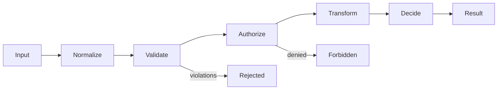
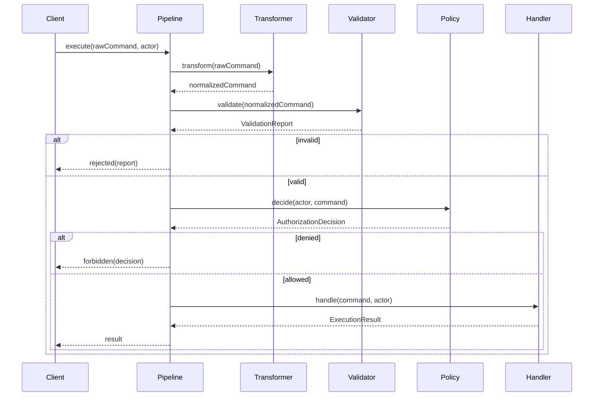

# Part 017 — Composition Pipelines and Higher-Order API Design

> Target: mampu mendesain API Java yang menerima, mengembalikan, menyusun, dan mengeksekusi behavior secara eksplisit; bukan sekadar memakai lambda, tetapi membangun **composition model** yang type-safe, readable, testable, evolvable, dan sulit disalahgunakan.

Part sebelumnya membahas functional interface dan lambda object model. Sekarang kita naik satu level: bagaimana behavior-as-value dipakai untuk membangun **pipeline**, **policy chain**, **hook**, **callback**, **validator**, **mapper**, **interceptor**, dan **domain-specific composition API**.

Mental model utama:

```text
A higher-order API does not only accept data.
It accepts behavior slots with contracts.

Good API design makes those slots explicit:
  - what input is given?
  - what output is expected?
  - may it mutate?
  - may it throw?
  - is order important?
  - is it called once, many times, lazily, eagerly?
  - who owns side effects?
  - how are diagnostics preserved?
```

Java memberi kita `Function`, `Predicate`, `Consumer`, `Supplier`, method references, default composition methods, dan custom functional interfaces. Tetapi **API yang bagus bukan API yang memakai `Function` di mana-mana**. API yang bagus memberi nama pada konsep behavior.

---

## 1. Kaufman Framing: Skill yang Sedang Dilatih

### 1.1 Skill Deconstruction

Skill utama:

```text
Mendesain API berbasis composition pipeline yang memungkinkan behavior disusun tanpa kehilangan type safety, semantic clarity, diagnostics, dan evolvability.
```

Sub-skill:

```text
Higher-order API design:
  ├─ identify behavior variation points
  ├─ choose correct functional shape
  ├─ name behavior using domain roles
  ├─ define stage input/output contract
  ├─ compose behavior deterministically
  ├─ preserve diagnostics and failure context
  ├─ avoid function soup
  ├─ avoid hidden side effects
  ├─ design fluent/staged APIs responsibly
  ├─ balance generic flexibility vs usability
  ├─ make ordering rules explicit
  └─ test contracts at composition boundary
```

Yang ingin dihindari:

```text
Function<T, R> everywhere
Predicate returning false without reason
Consumer hiding business mutation
Pipeline stages with implicit ordering
Callback hell in Java form
Boolean blindness
Stringly-typed hooks
Side-effectful mappers
Generic signatures too clever for users
Framework magic without contract clarity
```

### 1.2 Kaufman Target Performance Level

Setelah part ini, Anda seharusnya bisa:

1. membedakan kapan memakai `Function`, `Predicate`, `Consumer`, `Supplier`, `UnaryOperator`, `BiFunction`, atau custom interface;
2. mendesain API yang menerima behavior tanpa membuat kontrak menjadi kabur;
3. membangun pipeline domain yang readable dan testable;
4. menghindari function soup dan boolean blindness;
5. menjelaskan ordering, failure semantics, mutation policy, dan diagnostics policy dari API Anda;
6. membuat fluent API yang memandu pengguna ke urutan valid.

---

## 2. Higher-Order API: Definisi yang Praktis

API disebut higher-order ketika API tersebut menerima behavior sebagai parameter atau mengembalikan behavior sebagai hasil.

Contoh sederhana:

```java
List<CaseFile> highRisk = cases.stream()
    .filter(CaseFile::isHighRisk)
    .toList();
```

`filter` menerima `Predicate<? super T>`. Itu higher-order API.

Contoh domain API:

```java
Decision decision = DecisionPipeline.<CaseCommand>builder()
    .validate(command -> command.caseId() != null)
    .authorize((actor, command) -> actor.can("CASE_APPROVE"))
    .transform(command -> command.normalized())
    .decide(command -> Decision.approved(command.caseId()))
    .execute(command, actor);
```

Masalahnya bukan “bisa dibuat dengan lambda atau tidak”. Masalahnya:

```text
Apakah API ini menjelaskan kontrak behavior dengan cukup jelas?
```

---

## 3. Primitive Behavior Shapes di Java

`java.util.function` menyediakan bentuk umum behavior. Gunakan sebagai kosakata dasar, bukan sebagai pengganti bahasa domain.

| Shape | Interface | Makna | Risiko Jika Salah Pakai |
|---|---|---|---|
| `T -> R` | `Function<T, R>` | transformasi | Terlalu generik; kehilangan nama domain |
| `T -> boolean` | `Predicate<T>` | pertanyaan ya/tidak | Boolean blindness; alasan gagal hilang |
| `T -> void` | `Consumer<T>` | side effect terhadap input/lingkungan | Mutation tersembunyi |
| `() -> T` | `Supplier<T>` | deferred value/factory/lazy source | Bisa menyembunyikan IO/time/randomness |
| `T -> T` | `UnaryOperator<T>` | transformasi tipe sama | Bisa membingungkan kalau sebenarnya mutation |
| `(A, B) -> R` | `BiFunction<A, B, R>` | transformasi dua input | Sering butuh nama domain lebih jelas |
| `(A, B) -> boolean` | `BiPredicate<A, B>` | pertanyaan dua input | Alasan gagal hilang |
| `(A, B) -> void` | `BiConsumer<A, B>` | side effect dua input | Urutan dan ownership kabur |

Contoh penggunaan yang masih cukup jelas:

```java
Function<String, String> normalize = String::trim;
Predicate<CaseFile> highRisk = CaseFile::isHighRisk;
Supplier<Instant> now = clock::instant;
Consumer<AuditEvent> publishAudit = auditPublisher::publish;
UnaryOperator<CaseDraft> sanitize = CaseDraft::sanitized;
```

Tetapi API publik seperti ini sering terlalu abstrak:

```java
public Decision execute(
    Function<Request, Request> f1,
    Predicate<Request> f2,
    Consumer<Request> f3
) { ... }
```

Lebih baik:

```java
public Decision execute(
    RequestNormalizer normalizer,
    EligibilityRule eligibilityRule,
    AuditSink auditSink
) { ... }
```

Dengan custom functional interfaces:

```java
@FunctionalInterface
public interface RequestNormalizer {
    Request normalize(Request request);
}

@FunctionalInterface
public interface EligibilityRule {
    EligibilityResult evaluate(Request request);
}

@FunctionalInterface
public interface AuditSink {
    void record(AuditEvent event);
}
```

Mengapa lebih baik?

```text
Function<Request, Request> says shape.
RequestNormalizer says intent.

Predicate<Request> says boolean.
EligibilityRule says business decision point.

Consumer<AuditEvent> says side effect.
AuditSink says side-effect boundary.
```

---

## 4. Shape vs Semantics

Satu signature functional dapat mewakili banyak makna.

```java
Function<CaseFile, CaseFile> f;
```

Bisa berarti:

```text
normalize case
redact sensitive fields
apply defaults
calculate derived fields
sanitize unsafe text
upgrade schema
remove invalid attachments
```

Secara type system semuanya sama. Secara API contract, semuanya berbeda.

Rule penting:

```text
Use java.util.function for local code and obvious transformations.
Use named functional interfaces for public API, framework extension point, domain rule, or anything with non-trivial semantics.
```

### 4.1 Contoh: `Predicate` vs Result Object

Buruk untuk domain validation:

```java
Predicate<CaseCommand> valid = command -> command.caseId() != null;
```

Masalah:

```text
false means what?
  - missing case id?
  - invalid format?
  - forbidden state?
  - external policy failed?
```

Lebih baik:

```java
@FunctionalInterface
public interface Validator<T> {
    ValidationResult validate(T value);
}

public record ValidationResult(
    boolean valid,
    List<Violation> violations
) {
    public static ValidationResult ok() {
        return new ValidationResult(true, List.of());
    }

    public static ValidationResult failed(Violation violation) {
        return new ValidationResult(false, List.of(violation));
    }
}
```

Kemudian:

```java
Validator<CaseCommand> hasCaseId = command ->
    command.caseId() == null
        ? ValidationResult.failed(new Violation("caseId", "caseId is required"))
        : ValidationResult.ok();
```

`Predicate` cocok untuk filtering. `Validator` cocok untuk diagnosis.

---

## 5. Composition Semantics: `compose`, `andThen`, `and`, `or`, `negate`

Java menyediakan default composition methods pada beberapa functional interfaces.

### 5.1 `Function.andThen`

```java
Function<String, String> trim = String::trim;
Function<String, String> upper = String::toUpperCase;

Function<String, String> normalize = trim.andThen(upper);

String result = normalize.apply("  abc  "); // "ABC"
```

Urutan:

```text
input -> trim -> upper -> output
```

### 5.2 `Function.compose`

```java
Function<String, String> normalize = upper.compose(trim);
```

Artinya:

```text
input -> trim -> upper -> output
```

`a.andThen(b)` biasanya lebih readable untuk pipeline kiri-ke-kanan.

### 5.3 `Predicate.and`, `or`, `negate`

```java
Predicate<CaseFile> open = CaseFile::isOpen;
Predicate<CaseFile> highRisk = CaseFile::isHighRisk;

Predicate<CaseFile> actionable = open.and(highRisk);
```

Hati-hati: kombinasi boolean tidak membawa alasan.

Untuk rules internal sederhana, ini baik. Untuk validasi/regulatory decision, lebih baik result object.

### 5.4 `Consumer.andThen`

```java
Consumer<AuditEvent> log = logger::info;
Consumer<AuditEvent> publish = auditPublisher::publish;

Consumer<AuditEvent> audit = log.andThen(publish);
```

`Consumer` composition adalah side-effect sequencing. Ini harus dipakai dengan sadar.

Pertanyaan desain:

```text
Kalau log berhasil tapi publish gagal, apa status operasi?
Kalau log gagal, apakah publish tetap jalan?
Apakah urutan observable oleh user?
Apakah operation idempotent?
```

Jika jawaban penting untuk correctness, jangan sembunyikan di `Consumer.andThen`. Buat orchestrator eksplisit.

---

## 6. Anatomy of a Pipeline

Pipeline bukan sekadar rangkaian method. Pipeline adalah kontrak berurutan.

```text
Pipeline
  ├─ input contract
  ├─ stage list
  ├─ stage order
  ├─ context propagation
  ├─ failure semantics
  ├─ result semantics
  ├─ diagnostics model
  └─ extension policy
```

Diagram:



Setiap stage harus menjawab:

| Pertanyaan | Contoh Jawaban |
|---|---|
| Apakah stage pure? | Normalizer pure; auditor impure |
| Apakah boleh mutate input? | Tidak; return object baru |
| Apakah boleh throw? | Hanya programming error; business failure via result |
| Apakah dipanggil sekali? | Ya per execution |
| Apakah order penting? | Ya: normalize sebelum validate |
| Apakah boleh short-circuit? | Validate/authorize boleh stop |
| Bagaimana diagnostics disimpan? | `PipelineTrace` atau `DecisionReport` |

---

## 7. Stage Contract: Jangan Biarkan Implisit

Buruk:

```java
public interface Stage<I, O> {
    O apply(I input);
}
```

Ini terlalu kosong untuk domain serius.

Lebih baik:

```java
@FunctionalInterface
public interface PipelineStage<I, O> {
    StageResult<O> apply(I input, PipelineContext context);
}

public sealed interface StageResult<T>
    permits StageResult.Continue, StageResult.Stop {

    record Continue<T>(T value) implements StageResult<T> {}

    record Stop<T>(PipelineFailure failure) implements StageResult<T> {}

    static <T> StageResult<T> proceed(T value) {
        return new Continue<>(value);
    }

    static <T> StageResult<T> stop(PipelineFailure failure) {
        return new Stop<>(failure);
    }
}

public record PipelineContext(
    String correlationId,
    Actor actor,
    Instant startedAt,
    Map<String, Object> attributes
) {}
```

Keuntungan:

```text
Stage can continue or stop explicitly.
Business failure is not encoded as null.
Diagnostics have a home.
Context is explicit.
```

---

## 8. Designing a Simple Validation Pipeline

### 8.1 Domain Types

```java
public record CaseCommand(
    String caseId,
    String action,
    String reason
) {}

public record Violation(String field, String message) {}

public record ValidationReport(List<Violation> violations) {
    public boolean valid() {
        return violations.isEmpty();
    }

    public ValidationReport merge(ValidationReport other) {
        var merged = new ArrayList<Violation>(violations);
        merged.addAll(other.violations);
        return new ValidationReport(List.copyOf(merged));
    }

    public static ValidationReport ok() {
        return new ValidationReport(List.of());
    }

    public static ValidationReport failed(String field, String message) {
        return new ValidationReport(List.of(new Violation(field, message)));
    }
}
```

### 8.2 Named Functional Interface

```java
@FunctionalInterface
public interface CaseValidator {
    ValidationReport validate(CaseCommand command);

    default CaseValidator and(CaseValidator next) {
        Objects.requireNonNull(next, "next validator must not be null");
        return command -> this.validate(command).merge(next.validate(command));
    }
}
```

### 8.3 Composition

```java
CaseValidator requireCaseId = command ->
    command.caseId() == null || command.caseId().isBlank()
        ? ValidationReport.failed("caseId", "caseId is required")
        : ValidationReport.ok();

CaseValidator requireReason = command ->
    command.reason() == null || command.reason().isBlank()
        ? ValidationReport.failed("reason", "reason is required")
        : ValidationReport.ok();

CaseValidator validator = requireCaseId.and(requireReason);

ValidationReport report = validator.validate(new CaseCommand(null, "CLOSE", ""));
```

Hal yang bagus dari desain ini:

```text
Composition rule belongs to CaseValidator.
Failure diagnostics are preserved.
No exception for expected validation failure.
No boolean blindness.
No framework required.
```

---

## 9. Designing Transformation Pipelines

Transformasi cocok untuk `Function<T, R>` jika lokal. Untuk public/domain API, beri nama.

```java
@FunctionalInterface
public interface CaseCommandTransformer {
    CaseCommand transform(CaseCommand command);

    default CaseCommandTransformer andThen(CaseCommandTransformer next) {
        Objects.requireNonNull(next, "next transformer must not be null");
        return command -> next.transform(this.transform(command));
    }
}
```

Contoh:

```java
CaseCommandTransformer trimFields = command -> new CaseCommand(
    trim(command.caseId()),
    trim(command.action()),
    trim(command.reason())
);

CaseCommandTransformer uppercaseAction = command -> new CaseCommand(
    command.caseId(),
    command.action() == null ? null : command.action().toUpperCase(Locale.ROOT),
    command.reason()
);

CaseCommandTransformer normalize = trimFields.andThen(uppercaseAction);
```

Helper:

```java
private static String trim(String value) {
    return value == null ? null : value.trim();
}
```

Design rule:

```text
A transformer should return a value.
A transformer should not secretly publish events, write database rows, or mutate global state.
```

Kalau butuh side effect, pisahkan stage-nya.

---

## 10. Designing Policy APIs

Policy biasanya lebih kaya daripada boolean.

Buruk:

```java
BiPredicate<Actor, CaseCommand> canApprove;
```

Lebih baik:

```java
@FunctionalInterface
public interface AuthorizationPolicy<C> {
    AuthorizationDecision decide(Actor actor, C command);
}

public sealed interface AuthorizationDecision
    permits AuthorizationDecision.Allowed, AuthorizationDecision.Denied {

    record Allowed() implements AuthorizationDecision {}

    record Denied(String reasonCode, String message) implements AuthorizationDecision {}

    static AuthorizationDecision allowed() {
        return new Allowed();
    }

    static AuthorizationDecision denied(String code, String message) {
        return new Denied(code, message);
    }
}
```

Komposisi:

```java
public final class AuthorizationPolicies {
    private AuthorizationPolicies() {}

    public static <C> AuthorizationPolicy<C> allOf(List<AuthorizationPolicy<C>> policies) {
        return (actor, command) -> {
            for (AuthorizationPolicy<C> policy : policies) {
                AuthorizationDecision decision = policy.decide(actor, command);
                if (decision instanceof AuthorizationDecision.Denied) {
                    return decision;
                }
            }
            return AuthorizationDecision.allowed();
        };
    }
}
```

Mengapa short-circuit?

```text
Authorization sering butuh stop on first deny.
Validation sering butuh collect all violations.
Transformation biasanya sequential.
Audit biasanya best-effort atau transactional tergantung requirement.
```

Setiap behavior family punya composition semantics berbeda. Jangan paksa semuanya memakai `Function`.

---

## 11. Higher-Order Builder: Memandu Urutan Valid

Fluent API sering terlihat bagus tetapi mudah salah jika semua method optional dan urutan bebas.

Buruk:

```java
Pipeline.builder()
    .execute(input); // compile, tapi belum ada stage penting
```

Lebih baik gunakan staged builder untuk urutan wajib.

```java
public final class CasePipeline {
    private final CaseCommandTransformer transformer;
    private final CaseValidator validator;
    private final AuthorizationPolicy<CaseCommand> authorization;
    private final CaseHandler handler;

    private CasePipeline(
        CaseCommandTransformer transformer,
        CaseValidator validator,
        AuthorizationPolicy<CaseCommand> authorization,
        CaseHandler handler
    ) {
        this.transformer = transformer;
        this.validator = validator;
        this.authorization = authorization;
        this.handler = handler;
    }

    public static TransformerStep builder() {
        return transformer -> validator -> authorization -> handler ->
            new CasePipeline(transformer, validator, authorization, handler);
    }

    public interface TransformerStep {
        ValidatorStep transformer(CaseCommandTransformer transformer);
    }

    public interface ValidatorStep {
        AuthorizationStep validator(CaseValidator validator);
    }

    public interface AuthorizationStep {
        HandlerStep authorization(AuthorizationPolicy<CaseCommand> authorization);
    }

    public interface HandlerStep {
        CasePipeline handler(CaseHandler handler);
    }
}
```

Penggunaan:

```java
CasePipeline pipeline = CasePipeline.builder()
    .transformer(normalize)
    .validator(validator)
    .authorization(policy)
    .handler(handler);
```

Kelebihan:

```text
Cannot build without required pieces.
Order is visible.
Behavior roles are named.
```

Kekurangan:

```text
More types.
More boilerplate.
Can be overkill for small APIs.
```

Rule praktis:

```text
Use staged builders when invalid construction is costly or common.
Use simple constructors/factories when API is small and obvious.
```

---

## 12. Pipeline Execution Model

Contoh eksekusi:

```java
public ExecutionResult execute(CaseCommand rawCommand, Actor actor) {
    CaseCommand command = transformer.transform(rawCommand);

    ValidationReport validation = validator.validate(command);
    if (!validation.valid()) {
        return ExecutionResult.rejected(validation);
    }

    AuthorizationDecision authz = authorization.decide(actor, command);
    if (authz instanceof AuthorizationDecision.Denied denied) {
        return ExecutionResult.forbidden(denied);
    }

    return handler.handle(command, actor);
}
```

Ini bukan framework magic. Ini orchestrator eksplisit.



Kelebihan explicit orchestration:

```text
Easy to test.
Easy to debug.
Easy to trace.
No hidden reflection.
No annotation magic.
No lifecycle surprise.
```

---

## 13. Variance in Higher-Order APIs: Preview yang Perlu Sekarang

Generics detail akan dibahas di Part 020-024, tetapi API higher-order perlu satu rule sekarang.

Jika API menerima function, sering gunakan wildcard agar lebih fleksibel:

```java
public <T, R> List<R> map(
    List<? extends T> values,
    Function<? super T, ? extends R> mapper
) {
    return values.stream().map(mapper).toList();
}
```

Makna:

```text
values may produce T or subtype of T.
mapper may accept T or supertype of T.
mapper may return R or subtype of R.
```

Untuk domain-specific interface, Anda bisa meniru:

```java
public interface Transformer<I, O> {
    O transform(I input);
}

public static <I, O> List<O> transformAll(
    List<? extends I> inputs,
    Transformer<? super I, ? extends O> transformer
) {
    List<O> result = new ArrayList<>();
    for (I input : inputs) {
        result.add(transformer.transform(input));
    }
    return List.copyOf(result);
}
```

Jangan over-engineer semua API dengan wildcard. Gunakan ketika consumer API benar-benar butuh fleksibilitas subtype/supertype.

---

## 14. Laziness vs Eagerness

Higher-order API sering menyembunyikan kapan behavior dieksekusi.

```java
Supplier<Token> tokenSupplier = authClient::fetchToken;
```

Pertanyaan:

```text
Apakah fetchToken dipanggil saat API dibuat?
Saat execute?
Setiap request?
Hanya saat token expired?
Apakah hasil di-cache?
Apakah thread-safe?
```

API harus eksplisit:

```java
public interface TokenProvider {
    Token currentToken(); // may cache, may refresh, documented
}
```

Atau:

```java
public final class ClientOptions {
    private final Supplier<Token> tokenSupplier;

    /**
     * The supplier is invoked for every outbound request.
     * Implementations should be fast and thread-safe if the client is shared.
     */
    public ClientOptions(Supplier<Token> tokenSupplier) {
        this.tokenSupplier = Objects.requireNonNull(tokenSupplier);
    }
}
```

Rule:

```text
When accepting Supplier, document execution timing and caching semantics.
```

---

## 15. Callback APIs: Use Carefully

Callback adalah behavior yang dipanggil oleh API saat event tertentu.

```java
public interface ImportListener {
    void onRowAccepted(int rowNumber);
    void onRowRejected(int rowNumber, List<Violation> violations);
    void onCompleted(ImportSummary summary);
}
```

Ini lebih jelas daripada tiga `Consumer` terpisah:

```java
Consumer<Integer> onAccepted;
BiConsumer<Integer, List<Violation>> onRejected;
Consumer<ImportSummary> onCompleted;
```

Mengapa?

```text
Listener groups related callbacks.
Default methods can provide optional hooks.
Lifecycle is easier to document.
Future extension is easier.
```

Dengan default methods:

```java
public interface ImportListener {
    default void onRowAccepted(int rowNumber) {}
    default void onRowRejected(int rowNumber, List<Violation> violations) {}
    default void onCompleted(ImportSummary summary) {}
}
```

Hati-hati:

```text
Default no-op methods make hooks optional.
But they can hide missing implementation if user expected callback to run.
```

Untuk critical hook, jangan beri default no-op.

---

## 16. Interceptor APIs

Interceptor berbeda dari listener.

```text
Listener observes.
Interceptor participates.
```

Listener:

```java
void onDecisionMade(Decision decision);
```

Interceptor:

```java
Decision aroundDecision(DecisionRequest request, DecisionChain chain);
```

Contoh:

```java
@FunctionalInterface
public interface DecisionInterceptor {
    Decision intercept(DecisionRequest request, DecisionChain chain);
}

@FunctionalInterface
public interface DecisionChain {
    Decision proceed(DecisionRequest request);
}
```

Penggunaan:

```java
DecisionInterceptor timing = (request, chain) -> {
    long started = System.nanoTime();
    try {
        return chain.proceed(request);
    } finally {
        long elapsed = System.nanoTime() - started;
        metrics.record("decision.elapsed", elapsed);
    }
};
```

Interceptor harus mendokumentasikan:

```text
May call proceed zero, one, or multiple times?
May replace request?
May replace response?
May throw?
Is order deterministic?
```

Untuk kebanyakan enterprise API, batasi:

```text
Interceptor may call proceed at most once.
Interceptor order follows registration order.
Exceptions propagate unless documented otherwise.
```

---

## 17. Designing Misuse-Resistant Composition

### 17.1 Null Policy

Buruk:

```java
public Pipeline add(Stage stage) {
    stages.add(stage); // maybe NPE later
    return this;
}
```

Lebih baik:

```java
public Pipeline add(Stage stage) {
    stages.add(Objects.requireNonNull(stage, "stage must not be null"));
    return this;
}
```

### 17.2 Empty Pipeline Policy

Tentukan:

```text
Empty transformation pipeline = identity?
Empty validation pipeline = valid?
Empty authorization policy = deny all or allow all?
```

Contoh:

```java
public static CaseCommandTransformer identity() {
    return command -> command;
}

public static CaseValidator alwaysValid() {
    return command -> ValidationReport.ok();
}

public static <C> AuthorizationPolicy<C> denyAll() {
    return (actor, command) -> AuthorizationDecision.denied(
        "POLICY_NOT_CONFIGURED",
        "No authorization policy configured"
    );
}
```

Untuk security-related behavior, default aman biasanya deny.

### 17.3 Ordering Policy

```java
public final class OrderedStage<I, O> {
    private final int order;
    private final PipelineStage<I, O> stage;
}
```

Hati-hati dengan integer order yang tersebar. Alternatif:

```java
enum StagePhase {
    NORMALIZE,
    VALIDATE,
    AUTHORIZE,
    DECIDE,
    AUDIT
}
```

Rule:

```text
If order changes behavior, make order visible in API or type structure.
```

---

## 18. Error and Failure Semantics in Higher-Order APIs

Jangan semua failure menjadi exception.

| Failure Type | Contoh | Mekanisme Cocok |
|---|---|---|
| Programming error | null illegal argument | exception |
| Expected business rejection | validation failed | result object |
| Authorization denial | actor lacks role | result object |
| External IO failure | audit broker down | exception/result tergantung boundary |
| Contract violation by plugin | stage returns null when forbidden | exception with stage identity |

Contoh guard:

```java
StageResult<O> result = stage.apply(input, context);
if (result == null) {
    throw new IllegalStateException(
        "Stage " + stageName + " returned null; stages must return StageResult"
    );
}
```

Untuk framework-like API, error message adalah bagian dari developer experience.

Buruk:

```text
NullPointerException
```

Lebih baik:

```text
Stage 'normalize-case-id' returned null. Pipeline stages must return StageResult.proceed(value) or StageResult.stop(failure).
```

---

## 19. Diagnostics: Jangan Hilangkan Asal Behavior

Lambda sering anonymous. Dalam pipeline, ini masalah.

```java
pipeline.add(command -> normalize(command));
```

Ketika gagal, stage name tidak jelas.

Lebih baik:

```java
pipeline.add("normalize-case-id", command -> normalize(command));
```

API:

```java
public Pipeline add(String name, CaseCommandTransformer transformer) {
    stages.add(new NamedStage<>(
        requireValidName(name),
        Objects.requireNonNull(transformer)
    ));
    return this;
}
```

Atau named object:

```java
public interface NamedTransformer<T> extends UnaryOperator<T> {
    String name();
}
```

Rule:

```text
Every user-provided behavior in framework-like APIs should have a diagnostic identity.
```

---

## 20. Avoiding Function Soup

Function soup terjadi ketika API dipenuhi lambda kecil tanpa semantic grouping.

Contoh buruk:

```java
register(
    x -> x.a() != null,
    x -> x.b().trim(),
    (x, y) -> x.can(y),
    x -> publisher.publish(x),
    x -> mapper.toDto(x)
);
```

Masalah:

```text
Readers must reverse-engineer role by position.
Parameter order is fragile.
Debugging is poor.
Future extension breaks callers.
```

Lebih baik:

```java
CaseActionDefinition definition = CaseActionDefinition.builder()
    .eligibilityRule(hasOpenCase())
    .normalizer(trimActionFields())
    .authorizationPolicy(requiresPermission("CASE_APPROVE"))
    .auditSink(auditPublisher::publish)
    .responseMapper(CaseResponseMapper.standard())
    .build();
```

Rule:

```text
When behavior count > 2, prefer named builder/factory over positional arguments.
```

---

## 21. Local Lambdas vs Public Extension Points

Local lambda:

```java
var names = users.stream()
    .filter(User::active)
    .map(User::name)
    .toList();
```

Public extension point:

```java
public interface UserEligibilityRule {
    EligibilityDecision evaluate(User user, EligibilityContext context);
}
```

Different standards:

| Aspect | Local Lambda | Public Extension Point |
|---|---|---|
| Naming | optional | required/strongly recommended |
| Diagnostics | stack trace enough | explicit stage/plugin name |
| Versioning | local change | compatibility policy |
| Null contract | local convention | documented/preconditioned |
| Exception policy | local decision | documented |
| Side effects | reader can inspect | must be constrained |
| Generic flexibility | low | may need wildcard bounds |

---

## 22. API Example: Rule Engine Without Engine Magic

Kita bisa membuat rule composition sederhana tanpa membangun full rule engine.

```java
@FunctionalInterface
public interface Rule<F> {
    RuleResult evaluate(F fact);

    default Rule<F> and(Rule<F> next) {
        Objects.requireNonNull(next, "next rule must not be null");
        return fact -> {
            RuleResult first = this.evaluate(fact);
            if (!first.matched()) {
                return first;
            }
            return next.evaluate(fact);
        };
    }

    default Rule<F> or(Rule<F> alternative) {
        Objects.requireNonNull(alternative, "alternative rule must not be null");
        return fact -> {
            RuleResult first = this.evaluate(fact);
            if (first.matched()) {
                return first;
            }
            return alternative.evaluate(fact);
        };
    }
}

public record RuleResult(
    boolean matched,
    String code,
    String explanation
) {
    public static RuleResult match(String code, String explanation) {
        return new RuleResult(true, code, explanation);
    }

    public static RuleResult noMatch(String code, String explanation) {
        return new RuleResult(false, code, explanation);
    }
}
```

Rule dengan diagnostics:

```java
Rule<CaseFile> hasEvidence = file ->
    file.evidenceCount() > 0
        ? RuleResult.match("HAS_EVIDENCE", "Case has evidence")
        : RuleResult.noMatch("NO_EVIDENCE", "Case has no evidence");

Rule<CaseFile> isOpen = file ->
    file.status() == CaseStatus.OPEN
        ? RuleResult.match("CASE_OPEN", "Case is open")
        : RuleResult.noMatch("CASE_NOT_OPEN", "Case is not open");

Rule<CaseFile> actionable = isOpen.and(hasEvidence);
```

Ini bukan pengganti Drools atau policy engine besar. Ini composition API kecil yang jelas.

---

## 23. Fluent APIs: Readability vs Type Safety

Fluent API bagus ketika membaca seperti konfigurasi domain.

```java
Pipeline.define("case-approval")
    .normalize(trimFields())
    .validate(requireCaseId())
    .validate(requireReason())
    .authorize(requiresPermission("CASE_APPROVE"))
    .handle(approveCase())
    .build();
```

Tetapi fluent API bisa menjadi buruk jika:

```text
method chain terlalu panjang
state internal mutable tidak jelas
urutan bebas padahal tidak valid
error baru muncul saat runtime
terlalu banyak overload ambiguous
lambda parameter names tidak membantu
```

Rule:

```text
Fluent API should encode workflow, not hide it.
```

---

## 24. Performance Model: Jangan Overreact, Tapi Pahami Biayanya

Higher-order API menambah beberapa biaya:

```text
allocation/capture risk
indirection call
less obvious stack trace
potential megamorphic call site
debugger step-through cost
```

Namun dalam banyak business applications, clarity lebih penting daripada micro-optimization.

Optimisasi yang masuk akal:

1. gunakan stateless lambdas/method references bila mungkin;
2. hindari membuat pipeline baru per record jika pipeline bisa reusable;
3. jangan capture object besar tanpa perlu;
4. cache compiled pipeline/validator jika konstruksinya mahal;
5. jangan gunakan reflection untuk memanggil stage kalau direct call cukup;
6. benchmark jika benar-benar hot path.

Contoh reusable pipeline:

```java
public final class CaseService {
    private final CasePipeline pipeline;

    public CaseService(CasePipeline pipeline) {
        this.pipeline = Objects.requireNonNull(pipeline);
    }

    public ExecutionResult execute(CaseCommand command, Actor actor) {
        return pipeline.execute(command, actor);
    }
}
```

---

## 25. Testing Higher-Order APIs

Test bukan hanya output akhir. Test kontrak composition.

### 25.1 Test Ordering

```java
@Test
void executesTransformersInRegistrationOrder() {
    List<String> calls = new ArrayList<>();

    CaseCommandTransformer first = command -> {
        calls.add("first");
        return command;
    };
    CaseCommandTransformer second = command -> {
        calls.add("second");
        return command;
    };

    CaseCommandTransformer composed = first.andThen(second);
    composed.transform(new CaseCommand("C-1", "APPROVE", "ok"));

    assertEquals(List.of("first", "second"), calls);
}
```

### 25.2 Test Short-Circuit

```java
@Test
void authorizationStopsAtFirstDeny() {
    AtomicBoolean secondCalled = new AtomicBoolean(false);

    AuthorizationPolicy<CaseCommand> deny = (actor, command) ->
        AuthorizationDecision.denied("DENIED", "No access");

    AuthorizationPolicy<CaseCommand> second = (actor, command) -> {
        secondCalled.set(true);
        return AuthorizationDecision.allowed();
    };

    var policy = AuthorizationPolicies.allOf(List.of(deny, second));

    policy.decide(actor, command);

    assertFalse(secondCalled.get());
}
```

### 25.3 Test Diagnostics

```java
@Test
void reportsStageNameWhenStageReturnsNull() {
    Pipeline pipeline = Pipeline.builder()
        .add("bad-stage", input -> null)
        .build();

    IllegalStateException ex = assertThrows(
        IllegalStateException.class,
        () -> pipeline.execute(input)
    );

    assertTrue(ex.getMessage().contains("bad-stage"));
}
```

---

## 26. Design Checklist

Sebelum membuat higher-order API, jawab:

```text
1. What behavior varies?
2. Is the behavior local or public extension point?
3. Is java.util.function expressive enough?
4. Does the behavior need a domain name?
5. What is input/output contract?
6. May it mutate input?
7. May it perform side effects?
8. May it throw checked/unchecked exceptions?
9. Is failure expected or exceptional?
10. Is composition sequential, parallel, short-circuiting, or aggregating?
11. Does order matter?
12. How are diagnostics preserved?
13. What is the default empty behavior?
14. What happens if user returns null?
15. How will the API evolve later?
```

---

## 27. Common Failure Modes

### 27.1 Boolean Blindness

```java
Predicate<Command> valid;
```

Fix:

```java
Validator<Command> validator;
```

### 27.2 Side-Effectful Mapper

```java
Function<Command, Command> normalize = command -> {
    auditPublisher.publish(...);
    return command.normalized();
};
```

Fix: separate transformer and audit sink.

### 27.3 Hidden Ordering Dependency

```java
pipeline.add(validate);
pipeline.add(normalize);
```

But validate expects normalized input.

Fix: type or stage API encodes order.

### 27.4 Positional Lambda API

```java
configure(a -> ..., b -> ..., c -> ...);
```

Fix: named builder steps.

### 27.5 Anonymous Failure

```text
Pipeline failed in lambda$configure$2
```

Fix: require stage name.

---

## 28. Practice Loop

Latihan 1:

```text
Ambil service method besar yang memiliki banyak if/else policy.
Pisahkan menjadi:
  - transformer
  - validator
  - authorization policy
  - handler
  - audit sink
```

Latihan 2:

```text
Desain custom functional interface untuk validation.
Jangan return boolean.
Return report dengan violation list.
```

Latihan 3:

```text
Buat staged builder yang tidak bisa build pipeline tanpa validator dan handler.
```

Latihan 4:

```text
Tambahkan diagnostic stage name dan test error message ketika stage return null.
```

Latihan 5:

```text
Bandingkan dua desain:
  - API dengan Function/Predicate/Consumer langsung
  - API dengan named domain functional interfaces
Nilai readability dan evolvability-nya.
```

---

## 29. Summary

Higher-order API design di Java bukan sekadar kemampuan memakai lambda. Ini adalah kemampuan mendesain **behavior contract**.

Prinsip utama:

```text
Use behavior-as-value to expose controlled variation points.
Name domain behavior when semantics matter.
Keep pipeline ordering explicit.
Preserve diagnostics.
Separate transformation, decision, validation, and side effects.
Prefer result objects for expected business failure.
Use fluent API only when it improves correctness and readability.
```

Mental model akhir:

```text
A good composition API is not just flexible.
It is constrained in the right places.
```

Part berikutnya akan membahas **Side Effects, Purity, and Boundary Design**: bagaimana memisahkan pure core dari impure shell, membuat composition deterministic, dan mendesain boundary agar side effects tidak merusak reasoning.
