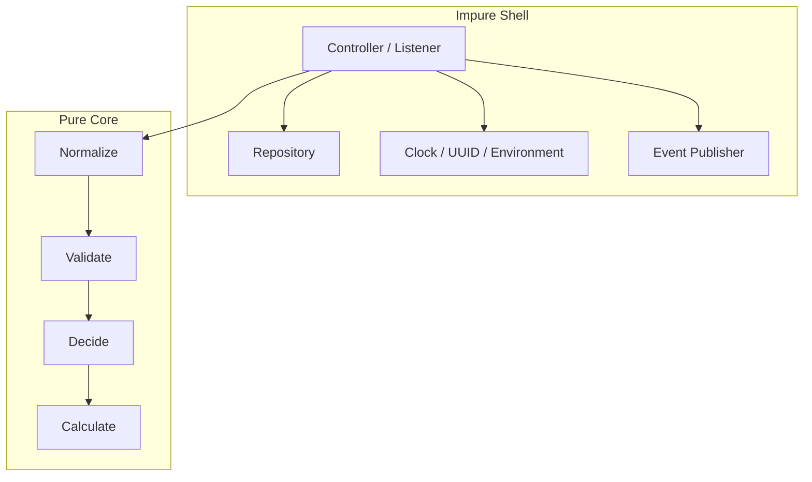
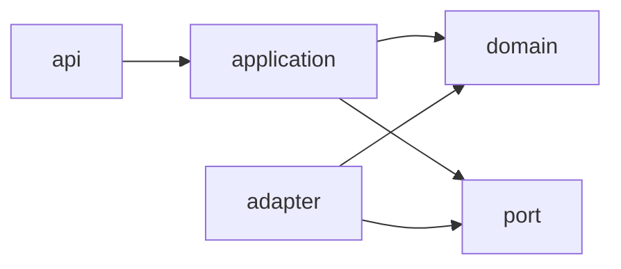

# Part 018 — Side Effects, Purity, and Boundary Design

> Target: mampu membedakan pure logic dari side-effect boundary, mendesain API yang deterministic, testable, dan mudah di-reason, serta menghindari composition yang terlihat functional tetapi sebenarnya penuh efek tersembunyi.

Part sebelumnya membahas composition pipelines dan higher-order API design. Bagian ini membahas hal yang menentukan apakah composition tersebut tetap bisa dipercaya: **side effects**.

Mental model utama:

```text
Pure logic is easy to compose.
Side effects are hard to compose.

The goal is not to eliminate all side effects.
The goal is to isolate, name, sequence, and test them deliberately.
```

Java adalah bahasa imperative dan object-oriented. Side effects wajar: menulis database, membaca file, publish event, mutate state, log, call network, read clock, generate UUID. Tetapi pada level API/framework/library, side effects yang tidak eksplisit membuat sistem sulit dipahami.

---

## 1. Kaufman Framing: Skill yang Sedang Dilatih

### 1.1 Skill Deconstruction

Skill utama:

```text
Mendesain Java components dengan pure core dan explicit effect boundaries sehingga business reasoning, tests, composition, dan API evolution tetap stabil.
```

Sub-skill:

```text
Side-effect boundary design:
  ├─ identify side effects
  ├─ classify effect types
  ├─ isolate pure transformations
  ├─ pass time/randomness explicitly
  ├─ separate query from command
  ├─ avoid mutation leaks
  ├─ design deterministic validators/rules
  ├─ make IO boundaries explicit
  ├─ keep domain logic framework-free
  ├─ test pure logic without mocks
  ├─ test effect shell with contracts
  └─ avoid fake functional style
```

Yang ingin dihindari:

```text
Mapper that writes database
Validator that calls remote service unexpectedly
Predicate that logs/audits/publishes
Supplier that hides network IO
Domain method that reads current time directly
Record that exposes mutable list
Static global state in business rules
Tests full of mocks for simple calculations
```

---

## 2. Apa Itu Side Effect?

Sebuah operasi memiliki side effect jika selain menghasilkan return value, operasi tersebut mengubah atau bergantung pada state di luar input eksplisitnya.

Contoh side effect:

```text
Writing database row
Publishing message
Calling remote API
Writing file
Logging
Updating metric
Reading current time
Generating random number
Reading environment variable
Mutating object passed as parameter
Mutating static/global state
Throwing exception for expected branch
Starting thread
Acquiring lock
```

Contoh pure function:

```java
public static BigDecimal calculatePenalty(BigDecimal principal, BigDecimal rate) {
    return principal.multiply(rate);
}
```

Untuk input yang sama, output sama. Tidak ada state eksternal.

Contoh impure:

```java
public BigDecimal calculatePenalty(BigDecimal principal, BigDecimal rate) {
    auditRepository.save(new AuditEntry("calculatePenalty"));
    return principal.multiply(rate);
}
```

Return value sama, tetapi fungsi menulis database.

Contoh impure karena membaca waktu:

```java
public boolean expired(Deadline deadline) {
    return Instant.now().isAfter(deadline.value());
}
```

Untuk input yang sama, output bisa berbeda tergantung waktu.

Lebih baik:

```java
public boolean expired(Deadline deadline, Instant now) {
    return now.isAfter(deadline.value());
}
```

Atau pada boundary:

```java
public final class DeadlineService {
    private final Clock clock;

    public DeadlineService(Clock clock) {
        this.clock = Objects.requireNonNull(clock);
    }

    public boolean expired(Deadline deadline) {
        return deadline.expiredAt(clock.instant());
    }
}
```

---

## 3. Pure Core / Impure Shell

Prinsip paling praktis:

```text
Put business decisions in pure core.
Put IO, time, randomness, persistence, messaging, and framework concerns in shell.
```

Diagram:



Pure core:

```text
records/value objects
calculators
validators
policies
state transition functions
decision functions
mapping that does not call IO
```

Impure shell:

```text
HTTP controllers
message listeners
repositories
gateways
transaction orchestration
security context reading
clock/uuid/random source
audit/event publishing
logging/metrics/tracing
```

---

## 4. Why Purity Matters for Java API Design

Purity memberi keuntungan bukan karena “functional programming lebih keren”, tetapi karena reasoning menjadi lokal.

Jika function pure:

```text
same input => same output
can test without mocks
can compose safely
can cache if needed
can run in any order if independent
can replay in tests
can document easily
```

Jika function impure:

```text
output may depend on hidden state
order matters
retry can duplicate effects
tests need fixtures/mocks
failure semantics more complex
composition can surprise users
```

Dalam enterprise system, kebanyakan complexity muncul bukan dari calculation, tetapi dari efek:

```text
DB transaction boundaries
remote API failure
duplicate event publish
time-dependent rules
security context assumptions
hidden mutation
partial success
```

Maka desain yang bagus tidak menghapus efek; desain yang bagus membatasi area ledaknya.

---

## 5. Classification of Effects

Tidak semua side effect sama. Klasifikasi membantu API design.

| Effect | Contoh | Risiko | Boundary yang Cocok |
|---|---|---|---|
| Time | `Instant.now()` | nondeterministic tests | `Clock`, explicit `Instant` |
| Randomness | `UUID.randomUUID()` | replay sulit | `Supplier<UUID>` / generator |
| IO read | repository query | latency/failure | repository/gateway boundary |
| IO write | save/publish | partial success | application service/shell |
| Mutation | modify input list | aliasing bug | copy/immutable contract |
| Global state | static cache/config | test pollution | injected dependency |
| Logging | logger call | usually acceptable but still effect | shell or low-risk observer |
| Metrics/tracing | record telemetry | observability effect | decorator/interceptor |
| Exception | throw for expected domain outcome | control flow ambiguity | result object for expected branches |
| Threading | start async work | ordering/lifecycle complexity | explicit executor boundary |

Rule:

```text
The more externally visible or irreversible the effect is, the closer it should be to the shell.
```

---

## 6. Mutation: Efek Paling Sering Diremehkan

Contoh buruk:

```java
public List<Violation> validate(CaseCommand command, List<Violation> violations) {
    if (command.caseId() == null) {
        violations.add(new Violation("caseId", "required"));
    }
    return violations;
}
```

Masalah:

```text
caller-owned list is mutated
result depends on initial list state
same validator cannot be safely reused without discipline
composition order may leak through shared collection
```

Lebih baik:

```java
public ValidationReport validate(CaseCommand command) {
    if (command.caseId() == null) {
        return ValidationReport.failed("caseId", "required");
    }
    return ValidationReport.ok();
}
```

Untuk aggregate:

```java
public ValidationReport validateAll(CaseCommand command, List<CaseValidator> validators) {
    ValidationReport report = ValidationReport.ok();
    for (CaseValidator validator : validators) {
        report = report.merge(validator.validate(command));
    }
    return report;
}
```

Mutable lokal boleh:

```java
public ValidationReport validateAll(CaseCommand command, List<CaseValidator> validators) {
    List<Violation> violations = new ArrayList<>();
    for (CaseValidator validator : validators) {
        violations.addAll(validator.validate(command).violations());
    }
    return new ValidationReport(List.copyOf(violations));
}
```

Rule:

```text
Local mutation is an implementation detail.
Shared mutation is an API contract risk.
```

---

## 7. Defensive Immutability at Boundaries

Record bukan otomatis deeply immutable.

```java
public record ValidationReport(List<Violation> violations) {}
```

Jika caller memberi mutable list, isi report bisa berubah.

Lebih aman:

```java
public record ValidationReport(List<Violation> violations) {
    public ValidationReport {
        violations = List.copyOf(violations);
    }
}
```

Untuk getter record, list tetap reference ke list internal, tetapi `List.copyOf` membuat unmodifiable copy.

Rule:

```text
At API boundaries, copy mutable inputs unless ownership transfer is explicitly documented.
```

Contoh ownership transfer jarang cocok untuk API publik Java biasa. Lebih umum untuk performance-critical internals.

---

## 8. Time as Explicit Input

Buruk:

```java
public EligibilityDecision evaluate(CaseFile file) {
    if (file.deadline().isBefore(Instant.now())) {
        return EligibilityDecision.denied("DEADLINE_EXPIRED");
    }
    return EligibilityDecision.allowed();
}
```

Lebih baik untuk pure core:

```java
public EligibilityDecision evaluate(CaseFile file, Instant now) {
    if (file.deadline().isBefore(now)) {
        return EligibilityDecision.denied("DEADLINE_EXPIRED");
    }
    return EligibilityDecision.allowed();
}
```

Shell:

```java
public final class CaseEligibilityService {
    private final Clock clock;
    private final CaseEligibilityPolicy policy;

    public CaseEligibilityService(Clock clock, CaseEligibilityPolicy policy) {
        this.clock = Objects.requireNonNull(clock);
        this.policy = Objects.requireNonNull(policy);
    }

    public EligibilityDecision evaluate(CaseFile file) {
        return policy.evaluate(file, clock.instant());
    }
}
```

Test pure:

```java
@Test
void deniesWhenDeadlineExpired() {
    Instant now = Instant.parse("2026-06-30T10:00:00Z");
    CaseFile file = new CaseFile(Instant.parse("2026-06-30T09:59:59Z"));

    EligibilityDecision decision = policy.evaluate(file, now);

    assertEquals(EligibilityDecision.denied("DEADLINE_EXPIRED"), decision);
}
```

Tidak perlu mock static `Instant.now()`.

---

## 9. Randomness and ID Generation

Buruk:

```java
public CaseId newCaseId() {
    return new CaseId(UUID.randomUUID().toString());
}
```

Ini sederhana, tetapi menyulitkan deterministic tests dan replay.

Lebih eksplisit:

```java
@FunctionalInterface
public interface IdGenerator<T> {
    T nextId();
}

public final class UuidCaseIdGenerator implements IdGenerator<CaseId> {
    @Override
    public CaseId nextId() {
        return new CaseId(UUID.randomUUID().toString());
    }
}
```

Pure-ish shell injection:

```java
public final class CaseFactory {
    private final IdGenerator<CaseId> idGenerator;
    private final Clock clock;

    public CaseFactory(IdGenerator<CaseId> idGenerator, Clock clock) {
        this.idGenerator = Objects.requireNonNull(idGenerator);
        this.clock = Objects.requireNonNull(clock);
    }

    public CaseFile open(NewCaseRequest request) {
        return new CaseFile(
            idGenerator.nextId(),
            request.subject(),
            clock.instant(),
            CaseStatus.OPEN
        );
    }
}
```

Rule:

```text
Randomness is an input source. Treat it like dependency, not invisible magic.
```

---

## 10. Query vs Command Separation

A pure query asks and returns. A command changes something.

Buruk:

```java
public CaseFile findCase(CaseId id) {
    CaseFile file = repository.find(id);
    auditRepository.save(new AuditEntry("case viewed"));
    return file;
}
```

Maybe valid requirement, but method name hides a write.

Lebih eksplisit:

```java
public CaseFile viewCase(CaseId id, Actor actor) {
    CaseFile file = repository.find(id);
    auditRepository.save(AuditEntry.caseViewed(id, actor.id(), clock.instant()));
    return file;
}
```

Atau pisah:

```java
public CaseFile findCase(CaseId id) {
    return repository.find(id);
}

public void recordCaseViewed(CaseId id, Actor actor) {
    auditRepository.save(AuditEntry.caseViewed(id, actor.id(), clock.instant()));
}
```

Rule:

```text
A method that writes should not look like a harmless query unless the write is a documented part of the query semantics.
```

---

## 11. Validators Should Usually Be Pure

Validation logic idealnya pure:

```java
public interface Validator<T> {
    ValidationReport validate(T value);
}
```

Pure validator:

```java
Validator<CaseCommand> requireReason = command ->
    command.reason() == null || command.reason().isBlank()
        ? ValidationReport.failed("reason", "required")
        : ValidationReport.ok();
```

Impure validator:

```java
Validator<CaseCommand> caseMustExist = command ->
    repository.exists(command.caseId())
        ? ValidationReport.ok()
        : ValidationReport.failed("caseId", "case does not exist");
```

Apakah ini salah? Tidak selalu. Tetapi namanya bukan lagi pure validation; ini validation plus external lookup.

Lebih jelas:

```java
public interface CaseExistencePolicy {
    ValidationReport evaluate(CaseCommand command);
}
```

Atau pisah shell/core:

```java
public ValidationReport validateCaseReference(CaseCommand command, Set<CaseId> existingCaseIds) {
    return existingCaseIds.contains(new CaseId(command.caseId()))
        ? ValidationReport.ok()
        : ValidationReport.failed("caseId", "case does not exist");
}
```

Shell mengambil data:

```java
Set<CaseId> existing = caseRepository.findExistingIds(List.of(command.caseId()));
ValidationReport report = validator.validateCaseReference(command, existing);
```

Rule:

```text
If validation performs IO, name and place it as policy/check boundary, not simple validator.
```

---

## 12. Mappers Should Not Have Business Effects

Buruk:

```java
public CaseDto toDto(CaseFile file) {
    accessLogRepository.save(...);
    return new CaseDto(...);
}
```

Mapper seharusnya transformasi. Jika transformasi punya side effect, caller tidak bisa reason dengan aman.

Lebih baik:

```java
CaseDto dto = mapper.toDto(file);
auditSink.record(AuditEvent.caseViewed(file.id(), actor.id()));
```

Atau orchestrator:

```java
public CaseDto viewCase(CaseId id, Actor actor) {
    CaseFile file = repository.get(id);
    auditSink.record(AuditEvent.caseViewed(id, actor.id(), clock.instant()));
    return mapper.toDto(file);
}
```

Rule:

```text
A mapper maps.
An auditor audits.
An orchestrator decides order.
```

---

## 13. Effects and Composition Order

Pure functions compose freely if independent.

```java
Function<String, String> trim = String::trim;
Function<String, String> upper = s -> s.toUpperCase(Locale.ROOT);
```

Order may still matter for output, but no external side effect happens.

Side-effectful functions create external history:

```java
Consumer<CaseFile> log = file -> logger.info("case {}", file.id());
Consumer<CaseFile> publish = file -> publisher.publish(CaseViewed.of(file.id()));

Consumer<CaseFile> effect = log.andThen(publish);
```

Now order is externally visible.

Questions:

```text
If log succeeds and publish fails, should operation fail?
If publish succeeds and log fails, should operation fail?
If retry happens, can duplicate publish occur?
Is log part of business outcome or diagnostics only?
```

Rule:

```text
Do not compose irreversible effects casually with Consumer.andThen unless failure semantics are acceptable and documented.
```

---

## 14. Effect Boundary as Port

For effectful operations, define a port.

```java
public interface CaseRepository {
    Optional<CaseFile> findById(CaseId id);
    void save(CaseFile file);
}

public interface CaseEventPublisher {
    void publish(CaseEvent event);
}

public interface AuditSink {
    void record(AuditEvent event);
}
```

Application service coordinates:

```java
public final class ApproveCaseService {
    private final CaseRepository repository;
    private final CaseApprovalPolicy policy;
    private final CaseEventPublisher publisher;
    private final AuditSink auditSink;
    private final Clock clock;

    public ApproveCaseService(
        CaseRepository repository,
        CaseApprovalPolicy policy,
        CaseEventPublisher publisher,
        AuditSink auditSink,
        Clock clock
    ) {
        this.repository = Objects.requireNonNull(repository);
        this.policy = Objects.requireNonNull(policy);
        this.publisher = Objects.requireNonNull(publisher);
        this.auditSink = Objects.requireNonNull(auditSink);
        this.clock = Objects.requireNonNull(clock);
    }

    public ApprovalResult approve(ApproveCaseCommand command, Actor actor) {
        CaseFile file = repository.findById(command.caseId())
            .orElseThrow(() -> new CaseNotFoundException(command.caseId()));

        ApprovalDecision decision = policy.decide(file, actor, clock.instant());
        if (decision instanceof ApprovalDecision.Denied denied) {
            return ApprovalResult.denied(denied.reason());
        }

        CaseFile approved = file.approve(actor.id(), clock.instant());
        repository.save(approved);
        publisher.publish(CaseEvent.approved(approved.id()));
        auditSink.record(AuditEvent.caseApproved(approved.id(), actor.id()));

        return ApprovalResult.approved(approved.id());
    }
}
```

Policy can be pure:

```java
public interface CaseApprovalPolicy {
    ApprovalDecision decide(CaseFile file, Actor actor, Instant now);
}
```

---

## 15. Functional Core, Object Shell

Di Java, pure core tidak harus berarti static functions. Bisa object dengan immutable dependencies atau no dependencies.

```java
public final class CaseApprovalRules {
    public ApprovalDecision decide(CaseFile file, Actor actor, Instant now) {
        if (!file.isOpen()) {
            return ApprovalDecision.denied("CASE_NOT_OPEN");
        }
        if (!actor.hasPermission("CASE_APPROVE")) {
            return ApprovalDecision.denied("MISSING_PERMISSION");
        }
        if (file.deadline().isBefore(now)) {
            return ApprovalDecision.denied("DEADLINE_EXPIRED");
        }
        return ApprovalDecision.allowed();
    }
}
```

Ini object-oriented tetapi pure jika:

```text
no hidden mutable state
no IO
no clock read inside
same input => same output
```

Object shell:

```java
public final class CaseApprovalApplicationService {
    private final CaseRepository repository;
    private final CaseApprovalRules rules;
    private final Clock clock;

    // coordinates effects
}
```

Rule:

```text
Functional core is about determinism, not syntax.
```

---

## 16. Exceptions as Effects

Exception mengubah control flow. Untuk programming error, exception tepat.

```java
public Money add(Money other) {
    Objects.requireNonNull(other, "other must not be null");
    if (!currency.equals(other.currency)) {
        throw new IllegalArgumentException("currency mismatch");
    }
    return new Money(amount.add(other.amount), currency);
}
```

Untuk expected business branch, result object sering lebih baik.

Buruk:

```java
public void approve(CaseFile file) throws CaseNotEligibleException {
    if (!file.isEligible()) {
        throw new CaseNotEligibleException(...);
    }
}
```

Lebih composable:

```java
public ApprovalDecision decide(CaseFile file) {
    if (!file.isEligible()) {
        return ApprovalDecision.denied("NOT_ELIGIBLE");
    }
    return ApprovalDecision.allowed();
}
```

Exception masih cocok untuk:

```text
invalid programmer input
broken invariant
unexpected infrastructure failure
contract violation
unrecoverable adapter failure
```

Result cocok untuk:

```text
validation failed
authorization denied
business rule rejected
not eligible
conflict expected by workflow
```

---

## 17. Idempotency and Retry Awareness

Side effects menjadi rumit ketika retry terjadi.

```java
repository.save(approved);
publisher.publish(CaseEvent.approved(approved.id()));
```

Jika publish berhasil tetapi response timeout, retry bisa publish duplicate.

Ini sudah masuk reliability/domain integration, tetapi untuk API design minimalnya:

```text
Effectful methods should reveal whether they are safe to retry.
Commands should carry idempotency keys when duplicate execution matters.
Pure functions do not need idempotency keys because they do not cause external effects.
```

Contoh command:

```java
public record ApproveCaseCommand(
    CaseId caseId,
    String reason,
    IdempotencyKey idempotencyKey
) {}
```

Effect boundary:

```java
public interface CaseCommandStore {
    boolean alreadyProcessed(IdempotencyKey key);
    void markProcessed(IdempotencyKey key, ApprovalResult result);
}
```

Rule:

```text
Once an API performs externally visible writes, retry semantics are part of the contract.
```

---

## 18. Hidden Effects in `Supplier`

`Supplier<T>` looks innocent.

```java
Supplier<ExchangeRate> rate = exchangeRateClient::latestRate;
```

But it may perform network IO.

If API accepts supplier:

```java
public PriceCalculator(Supplier<ExchangeRate> exchangeRateSupplier) { ... }
```

Document:

```text
called per calculation or once?
may throw?
should be cached?
must be thread-safe?
can block?
```

Better domain name:

```java
public interface ExchangeRateProvider {
    ExchangeRate currentRate(Currency from, Currency to);
}
```

Then the effect is visible from name.

Rule:

```text
Supplier is fine for simple deferred values.
For effectful retrieval, prefer named provider/gateway interface.
```

---

## 19. Boundary Placement in Package Architecture

A package layout that supports purity:

```text
com.acme.caseapproval
  ├─ api
  │   ├─ ApproveCaseCommand.java
  │   └─ ApprovalResult.java
  ├─ domain
  │   ├─ CaseFile.java
  │   ├─ CaseApprovalRules.java
  │   └─ ApprovalDecision.java
  ├─ application
  │   └─ ApproveCaseService.java
  ├─ port
  │   ├─ CaseRepository.java
  │   ├─ CaseEventPublisher.java
  │   └─ AuditSink.java
  └─ adapter
      ├─ JdbcCaseRepository.java
      ├─ KafkaCaseEventPublisher.java
      └─ StructuredAuditSink.java
```

Dependency direction:



Important:

```text
domain should not depend on adapter
port should not depend on adapter
domain rules should not read database directly
application coordinates effects
adapter implements effects
```

---

## 20. Testing Strategy

### 20.1 Pure Core Tests

No mocks.

```java
@Test
void approvalDeniedWhenCaseClosed() {
    CaseApprovalRules rules = new CaseApprovalRules();
    CaseFile closed = CaseFile.closed(new CaseId("C-1"));
    Actor actor = Actor.withPermission("CASE_APPROVE");
    Instant now = Instant.parse("2026-06-30T10:00:00Z");

    ApprovalDecision decision = rules.decide(closed, actor, now);

    assertEquals(ApprovalDecision.denied("CASE_NOT_OPEN"), decision);
}
```

### 20.2 Shell Tests

Shell tests verify coordination.

```java
@Test
void approvePersistsPublishesAndAuditsWhenAllowed() {
    InMemoryCaseRepository repository = new InMemoryCaseRepository();
    RecordingPublisher publisher = new RecordingPublisher();
    RecordingAuditSink audit = new RecordingAuditSink();
    Clock clock = Clock.fixed(Instant.parse("2026-06-30T10:00:00Z"), ZoneOffset.UTC);

    ApproveCaseService service = new ApproveCaseService(
        repository,
        new CaseApprovalRules(),
        publisher,
        audit,
        clock
    );

    repository.save(CaseFile.open(new CaseId("C-1")));

    ApprovalResult result = service.approve(
        new ApproveCaseCommand(new CaseId("C-1"), "valid reason"),
        Actor.withPermission("CASE_APPROVE")
    );

    assertTrue(result.approved());
    assertEquals(1, publisher.events().size());
    assertEquals(1, audit.events().size());
}
```

Mocks boleh, tetapi fake/in-memory sering memberi test yang lebih tahan refactor.

---

## 21. Refactoring Example: From Impure Method to Boundary Design

### 21.1 Before

```java
public ApprovalResult approve(String caseId, String actorId) {
    CaseFile file = repository.find(caseId);

    if (!securityContext.currentUser().id().equals(actorId)) {
        logger.warn("actor mismatch");
        return ApprovalResult.denied("ACTOR_MISMATCH");
    }

    if (file.deadline().isBefore(Instant.now())) {
        auditRepository.save(new AuditEntry(caseId, "deadline expired"));
        return ApprovalResult.denied("DEADLINE_EXPIRED");
    }

    file.setStatus("APPROVED");
    file.setApprovedAt(Instant.now());
    repository.save(file);
    eventBus.publish(new CaseApprovedEvent(caseId));
    return ApprovalResult.approved(caseId);
}
```

Problems:

```text
stringly typed status
hidden security context
direct time access twice
mutation of entity state
business rule mixed with audit/repository/event bus
hard to test without mocks
hard to replay deterministically
```

### 21.2 Extract Pure Decision

```java
public final class CaseApprovalPolicy {
    public ApprovalDecision decide(CaseFile file, Actor actor, Instant now) {
        if (!actor.hasPermission("CASE_APPROVE")) {
            return ApprovalDecision.denied("MISSING_PERMISSION");
        }
        if (file.deadline().isBefore(now)) {
            return ApprovalDecision.denied("DEADLINE_EXPIRED");
        }
        return ApprovalDecision.allowed();
    }
}
```

### 21.3 Make State Transition Return New Value

```java
public record CaseFile(
    CaseId id,
    CaseStatus status,
    Instant deadline,
    Instant approvedAt
) {
    public CaseFile approve(Instant approvedAt) {
        if (status != CaseStatus.OPEN) {
            throw new IllegalStateException("Only OPEN case can be approved");
        }
        return new CaseFile(id, CaseStatus.APPROVED, deadline, approvedAt);
    }
}
```

### 21.4 Shell Coordinates Effects

```java
public ApprovalResult approve(ApproveCaseCommand command, Actor actor) {
    Instant now = clock.instant();
    CaseFile file = repository.get(command.caseId());

    ApprovalDecision decision = policy.decide(file, actor, now);
    if (decision instanceof ApprovalDecision.Denied denied) {
        auditSink.record(AuditEvent.approvalDenied(file.id(), actor.id(), denied.code(), now));
        return ApprovalResult.denied(denied.code());
    }

    CaseFile approved = file.approve(now);
    repository.save(approved);
    publisher.publish(CaseEvent.approved(approved.id(), now));
    auditSink.record(AuditEvent.caseApproved(approved.id(), actor.id(), now));

    return ApprovalResult.approved(approved.id());
}
```

Now:

```text
policy is pure
clock read once
effects are visible
state transition is explicit
expected denial is result, not exception
```

---

## 22. When Impurity Is Acceptable Inside Domain Objects

Do not turn purity into dogma.

Some object methods naturally mutate internal state:

```java
public final class CaseDraft {
    private final List<Attachment> attachments = new ArrayList<>();

    public void addAttachment(Attachment attachment) {
        attachments.add(Objects.requireNonNull(attachment));
    }
}
```

This can be fine if:

```text
object owns the state
invariants are preserved
state is not shared unsafely
method name signals command
lifecycle is controlled
```

But for public API and composition pipelines, immutable values usually reduce reasoning cost.

Rule:

```text
Mutation is acceptable when ownership is clear.
Mutation is dangerous when ownership is shared or hidden behind query-like names.
```

---

## 23. Side Effects in Fluent APIs

Fluent APIs can hide execution.

```java
client.request()
    .withHeader("X", "Y")
    .body(payload)
    .send();
```

This is okay because `send` signals effect.

Ambiguous:

```java
pipeline
    .validate(command)
    .audit()
    .approve();
```

Does `validate` execute? Does `audit` write? Does `approve` persist?

Design fluent APIs with clear terminal operations:

```java
ApprovalPlan plan = approvalPlanner.plan(command, actor);
ApprovalResult result = approvalExecutor.execute(plan);
```

Or:

```java
ApprovalResult result = approvalFlow
    .forCommand(command)
    .as(actor)
    .execute();
```

Rule:

```text
A fluent chain should distinguish configuration/building from execution/effects.
```

---

## 24. Documentation Contract for Effects

For public APIs, document effect behavior.

Example:

```java
/**
 * Normalizes the command without performing IO or mutating the supplied command.
 *
 * @param command command to normalize, must not be null
 * @return normalized command, never null
 */
CaseCommand normalize(CaseCommand command);
```

Effectful:

```java
/**
 * Publishes the event to the configured external event channel.
 *
 * <p>This method may block and may throw EventPublishException if the event
 * cannot be accepted by the underlying channel. Implementations should be
 * idempotent with respect to eventId when possible.</p>
 */
void publish(CaseEvent event);
```

Minimal documentation dimensions:

```text
Does it perform IO?
Can it block?
Can it mutate input?
Can it throw?
Is it retry-safe?
Is it thread-safe?
When is supplied behavior invoked?
Does it cache results?
```

---

## 25. Checklist: Side-Effect Boundary Review

Use this checklist during code review:

```text
1. Does method name reveal whether it is query or command?
2. Does business logic read time/randomness directly?
3. Does mapper/validator/predicate perform IO?
4. Does any function mutate caller-owned collection/object?
5. Are mutable inputs copied at boundaries?
6. Are expected business failures represented as result objects?
7. Are effect ordering and retry semantics clear?
8. Are side effects near shell/application layer?
9. Can pure rules be tested without mocks?
10. Are effectful ports named by domain capability?
11. Does fluent API clearly separate build from execute?
12. Are Supplier/Consumer uses hiding expensive or irreversible behavior?
```

---

## 26. Common Failure Modes

### 26.1 Fake Functional Style

```java
Function<Command, Command> f = command -> {
    repository.save(command);
    return command;
};
```

Looks functional, behaves effectful.

Fix: use `CommandRepository` or `CommandHandler`.

### 26.2 Clock Hidden in Domain Rule

```java
return deadline.isBefore(Instant.now());
```

Fix: pass `Instant now` or inject `Clock` at shell.

### 26.3 Mutable Record Field

```java
record Report(List<String> lines) {}
```

Fix: compact constructor with `List.copyOf`.

### 26.4 Boolean Return for Rejection

```java
boolean allowed = policy.allowed(actor, command);
```

Fix: `AuthorizationDecision` with reason.

### 26.5 Consumer Chain for Critical Writes

```java
audit.andThen(publish).andThen(save).accept(event);
```

Fix: orchestrator with explicit transaction/failure semantics.

---

## 27. Practice Loop

Latihan 1:

```text
Cari 3 method yang membaca Instant.now(), UUID.randomUUID(), atau System.getenv() di tengah business logic.
Refactor agar time/randomness/config menjadi dependency atau explicit input.
```

Latihan 2:

```text
Ambil validator yang return boolean.
Ubah menjadi ValidationReport dengan diagnostics.
Pastikan validator pure.
```

Latihan 3:

```text
Ambil mapper yang punya side effect.
Pisahkan mapper dan auditor/publisher.
Buat orchestrator yang menentukan order.
```

Latihan 4:

```text
Review satu fluent API.
Tandai method mana yang hanya konfigurasi dan mana yang mengeksekusi side effect.
Rename jika ambiguous.
```

Latihan 5:

```text
Buat package boundary:
  - domain pure
  - port effect interface
  - application orchestration
  - adapter implementation
Pastikan dependency direction tidak bocor.
```

---

## 28. Summary

Side effects tidak buruk. Side effects yang tidak bernama, tidak terisolasi, dan tidak terdokumentasi adalah sumber complexity.

Prinsip utama:

```text
Keep business decisions pure when practical.
Move IO/time/randomness to explicit boundaries.
Prefer result objects for expected domain outcomes.
Do not hide writes inside mappers, validators, predicates, or suppliers.
Copy mutable inputs at API boundaries.
Make effect order and retry semantics visible.
Use application services as orchestration shells.
```

Mental model akhir:

```text
Composition is easy when behavior is deterministic.
Boundary design is the discipline that keeps it deterministic.
```

Part berikutnya akan membahas **Fluent API, Builder, DSL, and Composability**: bagaimana membuat API yang enak dipakai tanpa mengorbankan type safety, evolvability, dan misuse resistance.
