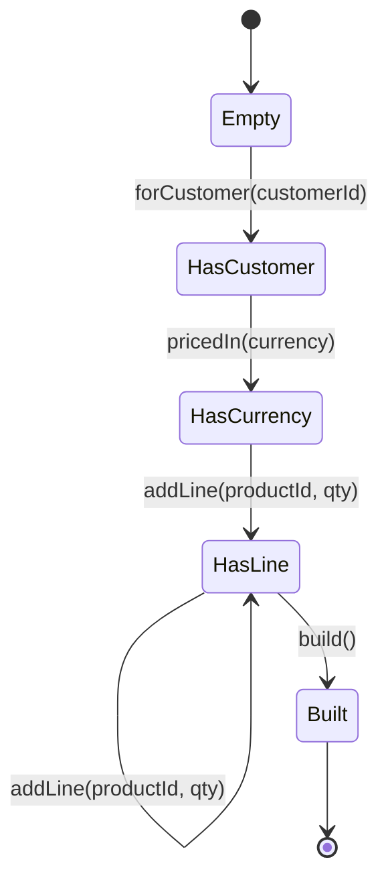
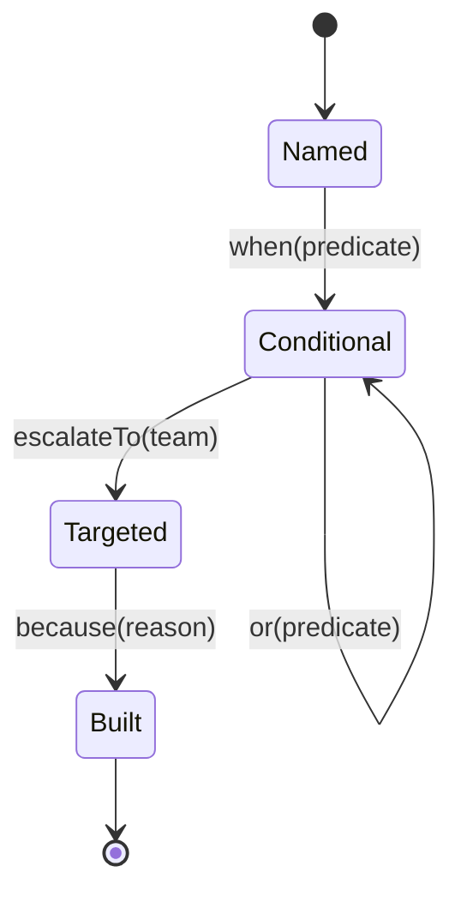

------
title: Learn Java Language Object Model, API Design & Metaprogramming - Part 019
description: Fluent API, builder, internal DSL, staged construction, type-safe composition, and misuse-resistant API design in Java.
series: learn-java-language-object-model-metaprogramming
seriesTitle: Learn Java Language Object Model, API Design & Metaprogramming
order: 19
partTitle: Fluent API, Builder, DSL, and Composability
tags:
- java
- api-design
- fluent-api
- builder-pattern
- dsl
- composition
- oop
- functional-java
date: 2026-06-30
---

# Part 019 — Fluent API, Builder, DSL, and Composability

> Goal: mampu merancang API Java yang enak dipakai, sulit disalahgunakan, mudah diuji, stabil untuk evolusi, dan tetap jujur terhadap invariant domain — bukan sekadar membuat method chain yang terlihat “fluent”.

Bagian ini menutup fase functional composition. Setelah memahami functional interface, behavior pipeline, dan boundary side effect, sekarang kita masuk ke desain API yang sering terlihat sederhana tetapi punya konsekuensi besar: **fluent API**, **builder**, dan **internal DSL**.

Banyak engineer menganggap fluent API sebagai “return `this` dari setiap method”. Itu salah frame. Fluent API yang baik adalah **bahasa kecil** yang mengarahkan pengguna melewati alur valid menuju objek, query, pipeline, konfigurasi, atau command. Builder yang baik bukan cuma alternatif constructor panjang; builder yang baik adalah mekanisme untuk mengelola **invariant construction** dan **API evolution**.

---

## 1. Kaufman Deconstruction

Dalam framework Josh Kaufman, kita pecah skill ini menjadi sub-skill yang bisa dilatih cepat:

| Sub-skill | Apa yang harus bisa dilakukan | Failure mode umum |
|---|---|---|
| API grammar design | Mendesain urutan operasi yang masuk akal bagi caller | Chain bebas tanpa constraint sehingga misuse baru terdeteksi runtime |
| Construction invariant | Memastikan objek tidak pernah lahir dalam state invalid | Builder hanya menunda validasi dan mengumpulkan null |
| Fluent readability | Membuat call site terbaca seperti intent, bukan detail mekanis | Method chain terlalu panjang, ambiguity, side effect tersembunyi |
| Type-state API | Menggunakan tipe untuk membatasi urutan method | Generics terlalu rumit sampai API tidak usable |
| Composition model | Membuat step/validator/mapper/policy dapat digabung | Pipeline tidak punya failure semantics dan observability |
| Compatibility design | Menambah opsi tanpa merusak caller lama | Constructor explosion, overload ambiguity, binary breakage |

Target performa: setelah bagian ini, Anda seharusnya bisa melihat sebuah fluent API dan langsung menilai:

1. Apakah ia benar-benar membawa grammar?
2. Apakah invariant dijaga compile-time, construction-time, atau runtime?
3. Apakah chain bersifat pure builder atau menjalankan side effect?
4. Apakah API bisa berevolusi tanpa overload hell?
5. Apakah error message-nya membantu caller memperbaiki input?

---

## 2. Mental Model: Fluent API Adalah Grammar, Bukan Chain

Fluent API adalah cara membuat **bahasa internal** di dalam Java.

Contoh buruk:

```java
OrderRequest request = new OrderRequest()
    .customerId(customerId)
    .currency(currency)
    .line(line)
    .discount(discount)
    .submit();
```

Masalahnya bukan sintaks. Masalahnya: dari call site, kita tidak tahu apakah `submit()` membangun object, melakukan network call, menulis database, atau mengirim event.

Contoh lebih jelas:

```java
OrderRequest request = OrderRequest.builder()
    .forCustomer(customerId)
    .pricedIn(Currency.getInstance("IDR"))
    .addLine(productId, Quantity.of(2))
    .withPromotion(promotionCode)
    .build();
```

Lebih baik karena grammar-nya menyatakan intent:

- `builder()` memulai construction context.
- `forCustomer(...)` adalah required domain information.
- `pricedIn(...)` menyatakan pricing boundary.
- `addLine(...)` mengumpulkan item.
- `build()` menyelesaikan construction.

Namun ini masih belum menjamin required fields secara compile-time. Ia hanya membuat call site lebih jelas.

### 2.1 API sebagai finite state machine

Builder yang serius bisa dipikirkan sebagai state machine:



Setiap fluent method adalah transisi. Pertanyaan desainnya:

- State mana yang valid?
- Transisi mana yang boleh?
- Apakah Java type system perlu menegakkan transisi?
- Apakah validasi runtime cukup?
- Apakah error sebaiknya dikumpulkan atau fail-fast?

---

## 3. Kapan Memakai Constructor, Static Factory, Builder, atau Fluent DSL

Tidak semua object butuh builder. Builder sering disalahgunakan untuk object kecil yang lebih jelas dengan constructor atau static factory.

| Bentuk API | Cocok untuk | Hindari jika |
|---|---|---|
| Constructor | Required fields sedikit, invariant jelas, object sederhana | Parameter banyak dengan tipe sama, optional banyak, invariant bercabang |
| Static factory | Perlu nama intent, caching, subtype hiding, validation, normalization | Nama factory terlalu banyak dan saling overlap |
| Simple builder | Banyak optional fields, object immutable, API butuh evolusi | Required fields penting tetapi builder tidak memaksa urutan |
| Staged builder | Required sequence penting, misuse harus dicegah compile-time | Generic/interface complexity lebih mahal dari manfaat |
| Fluent DSL | User sedang membangun query/rule/pipeline/workflow | DSL menyembunyikan side effect atau terlalu magical |
| Functional options | Konfigurasi fleksibel dan composable | Caller perlu discoverability kuat di IDE |

### 3.1 Constructor yang masih benar

```java
public record Money(BigDecimal amount, Currency currency) {
    public Money {
        Objects.requireNonNull(amount, "amount");
        Objects.requireNonNull(currency, "currency");
        if (amount.scale() > currency.getDefaultFractionDigits()) {
            throw new IllegalArgumentException("Amount scale exceeds currency fraction digits");
        }
    }
}
```

Tidak perlu builder untuk `Money`. Constructor canonical record cukup karena:

- field sedikit;
- semua field required;
- invariant dekat dengan state;
- object value-like;
- call site masih jelas.

### 3.2 Static factory yang memberi nama intent

```java
public final class CreditLimit {
    private final Money value;

    private CreditLimit(Money value) {
        this.value = Objects.requireNonNull(value, "value");
    }

    public static CreditLimit fixed(Money value) {
        return new CreditLimit(value);
    }

    public static CreditLimit unlimited(Currency currency) {
        return new CreditLimit(new Money(maxAmountFor(currency), currency));
    }
}
```

Factory memberi semantic name. Constructor `new CreditLimit(...)` tidak bisa menjelaskan apakah value itu fixed, derived, default, migrated, atau unlimited.

---

## 4. Builder Bukan Tempat Menaruh Domain Anemia

Builder sering menjadi “kantong mutable” yang menunda semua masalah sampai `build()`.

Contoh buruk:

```java
public final class CaseAssignment {
    private String caseId;
    private String assigneeId;
    private String reason;

    public CaseAssignment caseId(String caseId) {
        this.caseId = caseId;
        return this;
    }

    public CaseAssignment assigneeId(String assigneeId) {
        this.assigneeId = assigneeId;
        return this;
    }

    public CaseAssignment reason(String reason) {
        this.reason = reason;
        return this;
    }
}
```

Ini bukan builder. Ini mutable DTO dengan fluent setters.

Masalah:

- object bisa dipakai sebelum lengkap;
- tidak ada titik finalisasi;
- invariant tidak jelas;
- thread-safety buruk;
- sulit membedakan construction phase dan usage phase.

Versi lebih sehat:

```java
public final class CaseAssignment {
    private final CaseId caseId;
    private final UserId assigneeId;
    private final AssignmentReason reason;

    private CaseAssignment(Builder builder) {
        this.caseId = Objects.requireNonNull(builder.caseId, "caseId");
        this.assigneeId = Objects.requireNonNull(builder.assigneeId, "assigneeId");
        this.reason = Objects.requireNonNull(builder.reason, "reason");
    }

    public static Builder builder() {
        return new Builder();
    }

    public static final class Builder {
        private CaseId caseId;
        private UserId assigneeId;
        private AssignmentReason reason;

        private Builder() {}

        public Builder caseId(CaseId caseId) {
            this.caseId = Objects.requireNonNull(caseId, "caseId");
            return this;
        }

        public Builder assigneeId(UserId assigneeId) {
            this.assigneeId = Objects.requireNonNull(assigneeId, "assigneeId");
            return this;
        }

        public Builder reason(AssignmentReason reason) {
            this.reason = Objects.requireNonNull(reason, "reason");
            return this;
        }

        public CaseAssignment build() {
            return new CaseAssignment(this);
        }
    }
}
```

Minimal improvement:

- target object immutable;
- construction mutability terisolasi di builder;
- `build()` menjadi boundary validasi;
- object final tidak bisa setengah jadi.

Namun builder ini masih runtime-validated. Caller masih bisa lupa `reason(...)` dan baru tahu saat `build()`.

---

## 5. Staged Builder: Memindahkan Required Sequence ke Type System

Staged builder menggunakan interface bertahap untuk membuat urutan valid secara compile-time.

```java
public final class CaseAssignment {
    private final CaseId caseId;
    private final UserId assigneeId;
    private final AssignmentReason reason;

    private CaseAssignment(CaseId caseId, UserId assigneeId, AssignmentReason reason) {
        this.caseId = caseId;
        this.assigneeId = assigneeId;
        this.reason = reason;
    }

    public static CaseStep builder() {
        return new Steps();
    }

    public interface CaseStep {
        AssigneeStep caseId(CaseId caseId);
    }

    public interface AssigneeStep {
        ReasonStep assigneeId(UserId assigneeId);
    }

    public interface ReasonStep {
        BuildStep reason(AssignmentReason reason);
    }

    public interface BuildStep {
        CaseAssignment build();
    }

    private static final class Steps implements CaseStep, AssigneeStep, ReasonStep, BuildStep {
        private CaseId caseId;
        private UserId assigneeId;
        private AssignmentReason reason;

        @Override
        public AssigneeStep caseId(CaseId caseId) {
            this.caseId = Objects.requireNonNull(caseId, "caseId");
            return this;
        }

        @Override
        public ReasonStep assigneeId(UserId assigneeId) {
            this.assigneeId = Objects.requireNonNull(assigneeId, "assigneeId");
            return this;
        }

        @Override
        public BuildStep reason(AssignmentReason reason) {
            this.reason = Objects.requireNonNull(reason, "reason");
            return this;
        }

        @Override
        public CaseAssignment build() {
            return new CaseAssignment(caseId, assigneeId, reason);
        }
    }
}
```

Call site:

```java
CaseAssignment assignment = CaseAssignment.builder()
    .caseId(caseId)
    .assigneeId(userId)
    .reason(reason)
    .build();
```

Compile-time property:

- caller tidak bisa memanggil `build()` sebelum `reason(...)`;
- caller tidak bisa memanggil `assigneeId(...)` sebelum `caseId(...)`;
- caller diarahkan oleh IDE autocomplete.

### 5.1 Kapan staged builder layak?

Gunakan jika:

- object high-risk;
- required sequence penting;
- API dipakai banyak tim;
- misuse mahal;
- domain object memiliki lifecycle construction yang tegas.

Hindari jika:

- object sederhana;
- urutan field tidak penting;
- optional fields banyak;
- staged interface membuat API terlalu berat;
- caller lebih butuh fleksibilitas daripada grammar ketat.

---

## 6. Type-State DSL

Staged builder adalah bentuk sederhana dari **type-state API**: tipe return method merepresentasikan state selanjutnya.

Contoh: query builder yang memaksa `select -> from -> where/order/build`.

```java
public final class QueryDsl {
    public static SelectStep query() {
        return new Steps();
    }

    public interface SelectStep {
        FromStep select(String... columns);
    }

    public interface FromStep {
        WhereStep from(String table);
    }

    public interface WhereStep extends BuildStep {
        WhereStep where(String condition);
        WhereStep orderBy(String column);
    }

    public interface BuildStep {
        QuerySpec build();
    }

    private static final class Steps implements SelectStep, FromStep, WhereStep {
        private final List<String> columns = new ArrayList<>();
        private String table;
        private final List<String> predicates = new ArrayList<>();
        private final List<String> orderBy = new ArrayList<>();

        @Override
        public FromStep select(String... columns) {
            if (columns.length == 0) {
                throw new IllegalArgumentException("At least one column is required");
            }
            this.columns.addAll(List.of(columns));
            return this;
        }

        @Override
        public WhereStep from(String table) {
            this.table = Objects.requireNonNull(table, "table");
            return this;
        }

        @Override
        public WhereStep where(String condition) {
            predicates.add(Objects.requireNonNull(condition, "condition"));
            return this;
        }

        @Override
        public WhereStep orderBy(String column) {
            orderBy.add(Objects.requireNonNull(column, "column"));
            return this;
        }

        @Override
        public QuerySpec build() {
            return new QuerySpec(List.copyOf(columns), table, List.copyOf(predicates), List.copyOf(orderBy));
        }
    }
}

public record QuerySpec(
    List<String> columns,
    String table,
    List<String> predicates,
    List<String> orderBy
) {}
```

Diagram grammar:

```mermaid
flowchart LR
    A[query] --> B[select]
    B --> C[from]
    C --> D[where]*
    C --> E[orderBy]*
    D --> F[build]
    E --> F
    C --> F
```

Catatan penting: contoh ini bukan SQL builder production. Fokusnya grammar. Production SQL builder harus memodelkan identifier, parameter binding, dialect, escaping, injection safety, dan query plan constraints.

---

## 7. Fluent API Harus Jujur Tentang Side Effect

Ada tiga kategori fluent API:

| Kategori | Contoh | Prinsip |
|---|---|---|
| Builder fluent | `builder().x().y().build()` | Chain mengumpulkan state, side effect hanya lokal |
| Transformer fluent | `pipeline.map().filter().execute()` | Chain membangun transformasi, eksekusi eksplisit |
| Command fluent | `client.request().header().send()` | Chain mungkin berujung IO, harus jelas di terminal method |

Nama terminal method harus menunjukkan boundary:

```java
// Construction boundary
RuleSet rules = RuleSet.builder()
    .add(rule)
    .build();

// Execution boundary
EvaluationResult result = RuleEngine.prepare(rules)
    .withInput(input)
    .execute();

// IO boundary
HttpResponse response = HttpRequestBuilder.post(uri)
    .json(body)
    .send();
```

Hindari terminal method ambigu:

```java
.apply();  // apply ke object? apply side effect? return apa?
.run();    // sync? async? blocking? retry?
.done();   // membangun? menjalankan? commit?
```

Gunakan nama yang mengungkap boundary:

- `build()` untuk construction;
- `validate()` untuk validation;
- `evaluate()` untuk pure-ish computation;
- `execute()` untuk action;
- `send()` untuk network/message;
- `persist()` untuk storage;
- `commit()` untuk transaction boundary.

---

## 8. Fluent API dan Immutability

Ada dua pendekatan:

### 8.1 Mutable builder

```java
ReportSpec spec = ReportSpec.builder()
    .title("Open Cases")
    .addColumn("case_id")
    .addColumn("status")
    .build();
```

Builder mutable, result immutable. Ini lazim dan efisien.

### 8.2 Immutable fluent object

```java
ReportSpec spec = ReportSpec.empty()
    .withTitle("Open Cases")
    .withColumn("case_id")
    .withColumn("status");
```

Setiap method mengembalikan instance baru. Cocok jika:

- state kecil;
- sharing penting;
- composition butuh persistence-like semantics;
- ingin menghindari mutation dalam chain.

Contoh:

```java
public record ReportSpec(String title, List<String> columns) {
    public static ReportSpec empty() {
        return new ReportSpec("Untitled", List.of());
    }

    public ReportSpec withTitle(String title) {
        return new ReportSpec(Objects.requireNonNull(title, "title"), columns);
    }

    public ReportSpec withColumn(String column) {
        ArrayList<String> next = new ArrayList<>(columns);
        next.add(Objects.requireNonNull(column, "column"));
        return new ReportSpec(title, List.copyOf(next));
    }
}
```

Trade-off:

| Aspek | Mutable builder | Immutable fluent |
|---|---|---|
| Allocation | Lebih sedikit | Lebih banyak |
| Thread sharing | Builder tidak aman | Object aman jika immutable |
| Required fields | Mudah divalidasi di `build()` | Perlu default atau staged API |
| Ergonomics | Familiar | Cocok untuk value transformation |
| Debugging | State berubah | Setiap step explicit new state |

---

## 9. Builder dengan Validation Strategy

Validation di builder bisa fail-fast atau accumulate.

### 9.1 Fail-fast

```java
public Builder maxRetries(int maxRetries) {
    if (maxRetries < 0) {
        throw new IllegalArgumentException("maxRetries must be >= 0");
    }
    this.maxRetries = maxRetries;
    return this;
}
```

Cocok untuk programmer error.

### 9.2 Accumulating validation

```java
public final class ValidationErrors {
    private final List<String> messages = new ArrayList<>();

    public void add(String message) {
        messages.add(message);
    }

    public void throwIfAny() {
        if (!messages.isEmpty()) {
            throw new IllegalArgumentException(String.join("; ", messages));
        }
    }
}
```

```java
public CaseSearch build() {
    ValidationErrors errors = new ValidationErrors();

    if (from != null && to != null && from.isAfter(to)) {
        errors.add("from must be <= to");
    }
    if (statuses.isEmpty() && assignee == null) {
        errors.add("At least one filter is required: statuses or assignee");
    }

    errors.throwIfAny();
    return new CaseSearch(from, to, Set.copyOf(statuses), assignee);
}
```

Cocok untuk user-facing configuration, DSL, rule authoring, atau batch config.

### 9.3 Validasi jangan tersebar tanpa hierarchy

Gunakan layer:

1. **Parameter validation** di method builder.
2. **Field-level invariant** di value object.
3. **Cross-field invariant** di `build()`.
4. **External invariant** di service/domain boundary.

Contoh:

```java
public Builder timeout(Duration timeout) {
    this.timeout = requirePositive(timeout, "timeout"); // parameter-level
    return this;
}

public ClientConfig build() {
    if (retryPolicy.maxAttempts() > 1 && timeout.compareTo(Duration.ofMillis(50)) < 0) {
        throw new IllegalArgumentException("timeout too low for retry-enabled client");
    }
    return new ClientConfig(timeout, retryPolicy);
}
```

---

## 10. Fluent API dan Nullability Policy

Fluent API harus punya nullability policy eksplisit.

Buruk:

```java
builder.description(null); // clear? invalid? allowed?
```

Lebih jelas:

```java
builder.description("Manual review required");
builder.noDescription();
```

Atau:

```java
builder.description(Optional.of("Manual review required"));
```

Namun `Optional` sebagai parameter sering tidak nyaman untuk API publik. Lebih ergonomis:

```java
public Builder description(String description) {
    this.description = Optional.of(Objects.requireNonNull(description, "description"));
    return this;
}

public Builder withoutDescription() {
    this.description = Optional.empty();
    return this;
}
```

Rule praktis:

- Jangan pakai `null` untuk command semantic seperti “hapus”, “default”, “unset”.
- Sediakan method bernama jelas: `defaultTimeout()`, `withoutDescription()`, `useSystemClock()`.
- Jika field optional, result object boleh expose `Optional<T>`, tetapi builder call site sebaiknya ergonomis.

---

## 11. Builder dan Collection Safety

Kesalahan umum:

```java
public Builder tags(List<String> tags) {
    this.tags = tags;
    return this;
}
```

Caller bisa memutasi list setelah `build()`.

Lebih aman:

```java
public Builder tags(Collection<String> tags) {
    this.tags = List.copyOf(Objects.requireNonNull(tags, "tags"));
    return this;
}

public Builder addTag(String tag) {
    this.tags.add(Objects.requireNonNull(tag, "tag"));
    return this;
}
```

Di target object:

```java
private ReportSpec(Builder builder) {
    this.tags = List.copyOf(builder.tags);
}
```

Design choices:

| Input method | Makna |
|---|---|
| `tags(Collection<String>)` | Replace semua tags |
| `addTag(String)` | Tambah satu item |
| `addTags(Collection<String>)` | Tambah banyak item |
| `clearTags()` | Kosongkan explicit |

Jangan membuat `tags(...)` kadang replace, kadang append.

---

## 12. Fluent API dengan Functional Composition

Fluent API yang kuat sering menerima behavior:

```java
ValidationPipeline<Customer> pipeline = ValidationPipeline.<Customer>builder()
    .add("customer-id", c -> c.id() != null)
    .add("active", Customer::active)
    .onFailure(FailureMode.ACCUMULATE)
    .build();
```

Minimal implementation:

```java
public final class ValidationPipeline<T> {
    private final List<NamedRule<T>> rules;
    private final FailureMode failureMode;

    private ValidationPipeline(Builder<T> builder) {
        this.rules = List.copyOf(builder.rules);
        this.failureMode = builder.failureMode;
    }

    public ValidationResult validate(T value) {
        List<String> failures = new ArrayList<>();
        for (NamedRule<T> rule : rules) {
            if (!rule.predicate().test(value)) {
                failures.add(rule.name());
                if (failureMode == FailureMode.FAIL_FAST) {
                    break;
                }
            }
        }
        return failures.isEmpty() ? ValidationResult.ok() : ValidationResult.failed(failures);
    }

    public static <T> Builder<T> builder() {
        return new Builder<>();
    }

    public static final class Builder<T> {
        private final List<NamedRule<T>> rules = new ArrayList<>();
        private FailureMode failureMode = FailureMode.FAIL_FAST;

        public Builder<T> add(String name, Predicate<? super T> predicate) {
            rules.add(new NamedRule<>(name, predicate));
            return this;
        }

        public Builder<T> onFailure(FailureMode failureMode) {
            this.failureMode = Objects.requireNonNull(failureMode, "failureMode");
            return this;
        }

        public ValidationPipeline<T> build() {
            if (rules.isEmpty()) {
                throw new IllegalArgumentException("At least one rule is required");
            }
            return new ValidationPipeline<>(this);
        }
    }
}

record NamedRule<T>(String name, Predicate<? super T> predicate) {}
enum FailureMode { FAIL_FAST, ACCUMULATE }
```

Perhatikan `Predicate<? super T>`. Ini membuat builder lebih fleksibel: pipeline untuk `Customer` bisa menerima predicate untuk supertype yang relevan.

---

## 13. Internal DSL: Ketika API Menjadi Bahasa Kecil

Internal DSL di Java harus realistis. Java bukan Kotlin atau Scala. Jangan memaksa syntax sampai mengorbankan clarity.

Contoh rule DSL:

```java
Rule<CaseFile> rule = Rule.<CaseFile>named("high-risk-open-case")
    .when(c -> c.status() == Status.OPEN)
    .and(c -> c.riskScore() >= 80)
    .then(c -> Escalation.required(c.id(), "High risk open case"));
```

Model grammar:

```mermaid
flowchart TD
    A[named] --> B[when predicate]
    B --> C[and/or predicate]*
    C --> D[then action]
    D --> E[Rule]
```

Implementation sketch:

```java
public final class Rule<T> {
    private final String name;
    private final Predicate<? super T> condition;
    private final Function<? super T, ?> action;

    private Rule(String name, Predicate<? super T> condition, Function<? super T, ?> action) {
        this.name = name;
        this.condition = condition;
        this.action = action;
    }

    public static <T> WhenStep<T> named(String name) {
        return new Steps<>(Objects.requireNonNull(name, "name"));
    }

    public interface WhenStep<T> {
        ConditionStep<T> when(Predicate<? super T> condition);
    }

    public interface ConditionStep<T> {
        ConditionStep<T> and(Predicate<? super T> condition);
        ConditionStep<T> or(Predicate<? super T> condition);
        Rule<T> then(Function<? super T, ?> action);
    }

    private static final class Steps<T> implements WhenStep<T>, ConditionStep<T> {
        private final String name;
        private Predicate<? super T> condition;

        private Steps(String name) {
            this.name = name;
        }

        @Override
        public ConditionStep<T> when(Predicate<? super T> condition) {
            this.condition = Objects.requireNonNull(condition, "condition");
            return this;
        }

        @Override
        public ConditionStep<T> and(Predicate<? super T> next) {
            condition = condition.and(next);
            return this;
        }

        @Override
        public ConditionStep<T> or(Predicate<? super T> next) {
            condition = condition.or(next);
            return this;
        }

        @Override
        public Rule<T> then(Function<? super T, ?> action) {
            return new Rule<>(name, condition, Objects.requireNonNull(action, "action"));
        }
    }
}
```

Catatan penting:

- DSL ini menyimpan action sebagai `Function`, bukan mengeksekusi saat chain dibuat.
- `then(...)` adalah terminal construction, bukan execution.
- Execution perlu method terpisah seperti `evaluate(T input)` atau engine lain.

---

## 14. Fluent API dan Discoverability di IDE

API bagus harus memanfaatkan autocomplete.

Buruk:

```java
client.option("timeout", "30s")
      .option("retry", "true")
      .option("mode", "safe");
```

Masalah:

- typo baru ketahuan runtime;
- value tidak typed;
- documentation tidak muncul natural;
- refactoring lemah.

Lebih baik:

```java
client.timeout(Duration.ofSeconds(30))
      .retryPolicy(RetryPolicy.exponentialBackoff())
      .mode(ClientMode.SAFE);
```

Atau untuk opsi extensible:

```java
client.option(ClientOptions.TIMEOUT, Duration.ofSeconds(30))
      .option(ClientOptions.RETRY_POLICY, RetryPolicy.exponentialBackoff());
```

Dengan typed option:

```java
public record Option<T>(String name, Class<T> type) {}

public final class ClientOptions {
    public static final Option<Duration> TIMEOUT = new Option<>("timeout", Duration.class);
    public static final Option<RetryPolicy> RETRY_POLICY = new Option<>("retryPolicy", RetryPolicy.class);
}
```

Discoverability rule:

1. Preferred path harus muncul dari static factory atau builder entry point.
2. Optional features harus mudah ditemukan lewat method names.
3. Escape hatch boleh ada, tapi jangan menjadi primary API.
4. Stringly typed extension point harus dibungkus typed abstraction.

---

## 15. Fluent API dan Error Message Design

API yang mudah dipakai bukan berarti tidak pernah error. Error harus memperbaiki caller.

Buruk:

```text
IllegalArgumentException: invalid config
```

Lebih baik:

```text
IllegalArgumentException: ClientConfig is invalid: timeout must be >= 100ms when retryPolicy is enabled; baseUrl is required
```

Untuk DSL:

```text
Rule 'high-risk-open-case' is invalid: then(...) action is missing
```

Untuk staged builder, beberapa error hilang di compile-time. Tetapi runtime invariant tetap perlu jelas, misalnya cross-field validation.

---

## 16. API Evolution: Builder Lebih Stabil daripada Constructor Panjang

Constructor panjang sulit berevolusi:

```java
public ClientConfig(URI baseUrl, Duration timeout, int maxRetries, boolean compression) {}
```

Jika Anda menambah parameter:

```java
public ClientConfig(URI baseUrl, Duration timeout, int maxRetries, boolean compression, Clock clock) {}
```

Caller lama tidak otomatis cocok. Overload bisa ambiguous, terutama jika parameter bertipe sama atau nullable.

Builder lebih aman:

```java
ClientConfig config = ClientConfig.builder(baseUrl)
    .timeout(Duration.ofSeconds(3))
    .maxRetries(2)
    .compressionEnabled()
    .build();
```

Nanti menambah field:

```java
.clock(clock)
```

Caller lama tetap berjalan jika default semantic valid.

Tetapi builder juga bisa merusak behavior compatibility jika default berubah. Default adalah bagian dari contract.

### 16.1 Default harus eksplisit secara dokumentasi

```java
public static Builder builder(URI baseUrl) {
    return new Builder(baseUrl)
        .timeout(Duration.ofSeconds(5))
        .retryPolicy(RetryPolicy.none())
        .clock(Clock.systemUTC());
}
```

Jika default penting, expose:

```java
public static ClientConfig defaultFor(URI baseUrl) { ... }
```

---

## 17. Fluent API Anti-Patterns

### 17.1 Return `this` dari domain entity mutable

```java
caseFile.assignTo(user).markHighPriority().save();
```

Ini mencampur:

- state mutation;
- domain decision;
- persistence;
- transaction boundary;
- side effect.

Lebih defensible:

```java
CaseFile updated = caseFile.assignTo(user, reason);
repository.save(updated);
```

Atau command explicit:

```java
assignmentService.assign(caseId, userId, reason);
```

### 17.2 Chain terlalu panjang

```java
builder.a().b().c().d().e().f().g().h().i().j().build();
```

Jika chain terlalu panjang, mungkin API sedang menyembunyikan object intermediate yang seharusnya bernama.

Refactor:

```java
PricingPolicy pricing = PricingPolicy.builder()
    .currency(IDR)
    .rounding(HALF_UP)
    .tax(taxPolicy)
    .build();

OrderRequest request = OrderRequest.builder()
    .customer(customer)
    .pricing(pricing)
    .lines(lines)
    .build();
```

### 17.3 Fluent API stringly typed

```java
workflow.step("review").on("approve").goTo("closed");
```

Lebih aman:

```java
workflow.step(REVIEW).on(APPROVE).goTo(CLOSED);
```

Atau:

```java
workflow.step(ReviewState.class)
        .on(Approve.class)
        .goTo(ClosedState.class);
```

### 17.4 Build method yang melakukan IO

```java
Client client = Client.builder()
    .baseUrl(uri)
    .build(); // secretly opens socket? starts thread? registers global state?
```

Jika build melakukan side effect berat, dokumentasikan dan pertimbangkan nama lain:

```java
Client client = Client.connect(config);
```

---

## 18. Misuse-Resistant API Checklist

Sebelum mempublikasikan builder/fluent API, cek:

- Apakah object hasilnya immutable atau mutation-nya sengaja?
- Apakah required fields terlihat dari entry point?
- Apakah optional fields punya default yang stabil?
- Apakah `null` punya semantic yang jelas atau dilarang?
- Apakah collection di-copy defensively?
- Apakah terminal method menunjukkan boundary?
- Apakah chain mengeksekusi side effect tersembunyi?
- Apakah error message menyebut field/rule yang salah?
- Apakah public method bisa ditambah tanpa ambiguity?
- Apakah DSL terlalu pintar sampai sulit di-debug?
- Apakah type-state benar-benar memberi value atau hanya menambah noise?

---

## 19. Design Exercise: Regulatory Escalation DSL

Target: buat DSL kecil untuk escalation rule.

Desired call site:

```java
EscalationRule<CaseFile> rule = EscalationRule.<CaseFile>named("stale-high-risk")
    .when(c -> c.riskScore() >= 80)
    .and(c -> c.daysOpen() > 14)
    .escalateTo(Team.SENIOR_REVIEW)
    .because("High-risk case stale for more than 14 days");
```

Grammar:



Possible staged interfaces:

```java
public interface NamedStep<T> {
    ConditionStep<T> when(Predicate<? super T> condition);
}

public interface ConditionStep<T> {
    ConditionStep<T> and(Predicate<? super T> condition);
    ConditionStep<T> or(Predicate<? super T> condition);
    TargetStep<T> escalateTo(Team team);
}

public interface TargetStep<T> {
    EscalationRule<T> because(String reason);
}
```

Invariant:

- name required;
- at least one condition required;
- target team required;
- reason required;
- predicates must not be null;
- execution must be separate from construction.

---

## 20. Operational Heuristics

Gunakan heuristic ini saat review API:

1. **Constructor first** jika object kecil dan semua field required.
2. **Static factory** jika construction punya intent berbeda.
3. **Builder** jika optional banyak atau API perlu evolusi.
4. **Staged builder** jika urutan required mahal jika salah.
5. **DSL** jika caller sedang menulis policy/rule/query/pipeline, bukan sekadar object.
6. **Avoid fluent mutation** untuk aggregate/entity kecuali semantics sangat jelas.
7. **Expose terminal boundary**: `build`, `evaluate`, `execute`, `send`, `commit`.
8. **Move domain invariant into value objects**, bukan hanya ke builder.
9. **Do not hide side effects inside chain setup**.
10. **Prefer named concepts over long chains**.

---

## 21. Latihan 20 Jam — Part 019

### Latihan 1 — Constructor vs builder audit

Ambil 5 class dari codebase Anda. Untuk setiap class:

- jumlah required fields;
- jumlah optional fields;
- apakah ada parameter bertipe sama;
- apakah invariant field-level atau cross-field;
- apakah constructor/factory/builder paling tepat.

### Latihan 2 — Convert mutable fluent object

Cari object dengan fluent setter yang mengembalikan `this`. Refactor menjadi:

- immutable target;
- nested builder;
- defensive copy;
- clear `build()` validation.

### Latihan 3 — Staged builder kecil

Buat staged builder untuk command:

```java
AssignCaseCommand.builder()
    .caseId(caseId)
    .assignee(userId)
    .reason(reason)
    .build();
```

Pastikan `build()` tidak tersedia sebelum `reason(...)`.

### Latihan 4 — DSL side-effect audit

Ambil DSL/fluent API yang ada. Tandai setiap method:

- construction;
- transformation;
- validation;
- execution;
- IO;
- mutation.

Jika sebuah method setup melakukan IO, pertimbangkan rename atau split boundary.

---

## 22. Ringkasan

Fluent API bukan kosmetik. Fluent API adalah desain grammar. Builder bukan pengganti otomatis constructor. Builder adalah construction boundary, invariant boundary, dan compatibility tool. DSL bukan sekadar chain panjang; DSL adalah bahasa kecil yang harus punya state machine, terminal boundary, failure semantics, dan observability.

Mental model top-tier:

> Desain fluent API seperti mendesain protokol. Setiap method adalah transisi, setiap return type adalah state berikutnya, dan setiap terminal method adalah boundary semantic.

Pada bagian berikutnya, kita membuka fase generics. Generics adalah fondasi yang membuat banyak builder, DSL, pipeline, repository, validator, mapper, dan framework API bisa tetap type-safe — tetapi juga sumber bug halus karena erasure, variance, raw type, dan reifiability.

---

## References

- Java SE 25 API — `java.util.function.Function`, `compose`, `andThen`: https://docs.oracle.com/en/java/javase/25/docs/api/java.base/java/util/function/Function.html
- Java SE 25 API — `java.util.function` package: https://docs.oracle.com/en/java/javase/25/docs/api/java.base/java/util/function/package-summary.html
- Java Language Specification SE 25: https://docs.oracle.com/javase/specs/jls/se25/html/index.html
