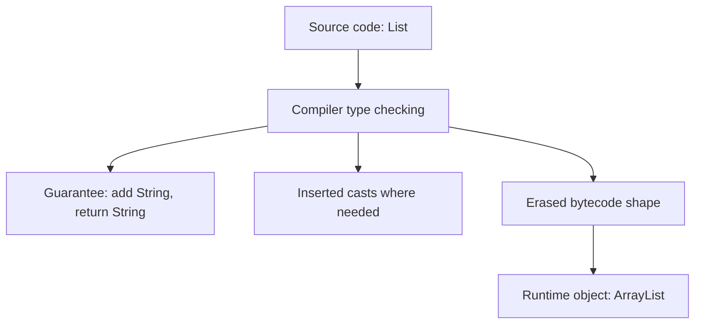
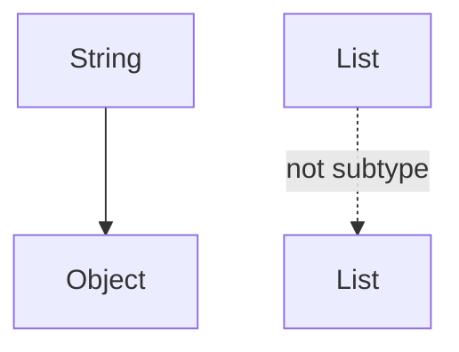

------
title: Learn Java Language Object Model, API Design & Metaprogramming - Part 020
description: Deep mental model of Java generics: parameterized types, bounds, invariance, generic methods, inference, API design, and runtime limitations.
series: learn-java-language-object-model-metaprogramming
seriesTitle: Learn Java Language Object Model, API Design & Metaprogramming
order: 20
partTitle: Generics Mental Model
tags:
- java
- generics
- type-system
- api-design
- type-erasure
- object-model
- compile-time-safety
date: 2026-06-30
---

# Part 020 — Generics Mental Model

> Goal: memahami generics sebagai alat desain kontrak compile-time, bukan sebagai “tipe runtime”. Setelah bagian ini, Anda harus bisa membaca dan merancang generic API tanpa terjebak asumsi salah tentang inheritance, runtime type, dan type erasure.

Generics adalah salah satu bagian Java yang paling sering “dipakai setiap hari tetapi tidak benar-benar dipahami”. Banyak engineer bisa menulis `List<String>` dan `Map<String, Object>`, tetapi mulai goyah saat melihat:

```java
<T extends Comparable<? super T>>
```

atau:

```java
public <R> Pipeline<R> map(Function<? super T, ? extends R> mapper)
```

Generics di Java adalah sistem kontrak compile-time yang dibangun di atas object model nominal Java dan dijalankan dengan model runtime yang sebagian besar terhapus melalui **type erasure**. Artinya, generics meningkatkan safety dan expressiveness saat compile-time, tetapi tidak membuat JVM menyimpan setiap `T` sebagai runtime type biasa seperti `Class<T>`.

Bagian ini membangun mental model dasar. Wildcards, variance, erasure detail, bridge methods, raw types, heap pollution, dan type token akan didalami di bagian berikutnya.

---

## 1. Kaufman Deconstruction

Kita pecah generics menjadi sub-skill:

| Sub-skill | Harus bisa | Kesalahan umum |
|---|---|---|
| Parameterized type | Memahami `List<String>` sebagai `List` dengan type argument | Mengira `List<String>` subtype dari `List<Object>` |
| Type variable | Mendesain `T`, `R`, `K`, `V`, `E` sebagai hubungan antar parameter/return | Menggunakan generic saat tidak ada hubungan type yang perlu dijaga |
| Bounds | Membatasi kemampuan yang boleh dipakai di generic body | Over-bound atau under-bound |
| Generic method | Memakai type parameter di method level | Menaruh generic di class padahal hanya method yang butuh |
| Inference | Membaca bagaimana compiler menebak type | Bingung saat lambda/overload/generic method saling berinteraksi |
| Runtime limitation | Tahu apa yang hilang akibat erasure | `instanceof List<String>`, `new T()`, generic array creation |
| API ergonomics | Membuat generic API yang fleksibel tapi readable | Signature terlalu abstrak sampai caller tersiksa |

Target performa: Anda bisa menjawab “apa relasi tipe yang sedang dijaga?” setiap kali melihat generic signature.

---

## 2. Mental Model Inti

Generics menjawab pertanyaan:

> Bagaimana compiler bisa memastikan beberapa nilai memiliki relasi type tertentu tanpa membuat class baru untuk setiap kombinasi type?

Contoh:

```java
List<String> names = new ArrayList<>();
names.add("Ayu");
String first = names.getFirst();
```

Compiler tahu bahwa:

- list menerima `String`;
- `getFirst()` menghasilkan `String`;
- tidak perlu cast manual di call site;
- jika memasukkan `Integer`, compile error.

Namun secara runtime, object list tetap instance dari `ArrayList`, bukan instance khusus `ArrayList<String>`.

Diagram mental:



Generics adalah **compile-time relationship**, bukan runtime specialization.

---

## 3. Generic Class

Generic class mendefinisikan type variable di level class:

```java
public final class Box<T> {
    private final T value;

    public Box(T value) {
        this.value = value;
    }

    public T value() {
        return value;
    }
}
```

Penggunaan:

```java
Box<String> box = new Box<>("hello");
String value = box.value();
```

`T` menyatakan hubungan:

- constructor menerima `T`;
- field menyimpan `T`;
- method `value()` mengembalikan `T` yang sama.

Jika tidak ada hubungan seperti ini, generic mungkin tidak dibutuhkan.

### 3.1 Generic yang buruk

```java
public final class Printer<T> {
    public void print(String value) {
        System.out.println(value);
    }
}
```

`T` tidak dipakai. Ini noise.

### 3.2 Generic yang terlalu luas

```java
public final class Response<T> {
    private final T body;
    private final int status;

    public T body() { return body; }
    public int status() { return status; }
}
```

Ini masuk akal jika body bisa bermacam-macam dan caller perlu type safety.

Namun jangan memakai `Response<Object>` sebagai default dumping ground. Itu menghilangkan manfaat generic.

---

## 4. Generic Method

Generic method punya type parameter sendiri:

```java
public static <T> T requirePresent(Optional<T> optional, String name) {
    return optional.orElseThrow(() -> new IllegalArgumentException(name + " is required"));
}
```

Penggunaan:

```java
String username = requirePresent(user.username(), "username");
Integer age = requirePresent(user.age(), "age");
```

`T` hanya relevan untuk method itu. Tidak perlu membuat class generic.

### 4.1 Class generic vs method generic

Pilih class generic jika type parameter adalah bagian dari identitas object:

```java
public final class Repository<T, ID> {
    public Optional<T> findById(ID id) { ... }
    public T save(T entity) { ... }
}
```

Pilih method generic jika type parameter hanya relasi lokal:

```java
public final class JsonCodec {
    public <T> T decode(String json, Class<T> type) { ... }
}
```

### 4.2 Generic method sebagai relation declaration

```java
public static <T> List<T> copyOf(Iterable<? extends T> source) { ... }
```

Signature ini menyatakan:

- method menghasilkan `List<T>`;
- source boleh berisi subtype dari `T`;
- caller/target type bisa membantu inference.

Kita akan bahas wildcard detail di Part 021.

---

## 5. Naming Type Parameters

Konvensi umum:

| Name | Makna umum |
|---|---|
| `T` | Type umum |
| `E` | Element |
| `K` | Key |
| `V` | Value |
| `R` | Result/return |
| `ID` | Identifier type |
| `SELF` | Self type dalam fluent API |

Contoh:

```java
public interface Mapper<S, T> {
    T map(S source);
}
```

Kadang `S` dan `T` lebih jelas sebagai `IN` dan `OUT`:

```java
public interface Transformer<IN, OUT> {
    OUT transform(IN input);
}
```

Untuk public API, readability lebih penting daripada konvensi pendek jika signature kompleks.

---

## 6. Bounds: Memberi Kemampuan pada `T`

Tanpa bound, compiler hanya tahu `T` adalah `Object`.

```java
public static <T> T max(T a, T b) {
    // tidak bisa a.compareTo(b)
    return a;
}
```

Tambahkan bound:

```java
public static <T extends Comparable<T>> T max(T a, T b) {
    return a.compareTo(b) >= 0 ? a : b;
}
```

Sekarang compiler tahu `T` punya `compareTo(T)`.

Namun signature ini masih kurang fleksibel untuk beberapa kasus. Versi lebih umum:

```java
public static <T extends Comparable<? super T>> T max(T a, T b) {
    return a.compareTo(b) >= 0 ? a : b;
}
```

Makna:

- `T` harus comparable;
- compare target boleh supertype dari `T`;
- ini mendukung class yang mewarisi comparability dari parent.

Detail `? super T` akan dibahas di Part 021.

### 6.1 Multiple bounds

```java
public static <T extends AutoCloseable & Runnable> void runAndClose(T resource) throws Exception {
    try (resource) {
        resource.run();
    }
}
```

Rules:

- paling banyak satu class bound;
- class bound, jika ada, harus pertama;
- interface bounds bisa banyak.

Contoh valid:

```java
<T extends BaseJob & Auditable & Runnable>
```

Contoh invalid:

```java
<T extends Auditable & BaseJob>
```

Jika `BaseJob` adalah class, ia harus pertama.

---

## 7. Invariance: Sumber Kebingungan Nomor Satu

`String` adalah subtype dari `Object`.

Tetapi:

```java
List<String> bukan subtype dari List<Object>
```

Kenapa?

Bayangkan ini boleh:

```java
List<String> strings = new ArrayList<>();
List<Object> objects = strings; // Java melarang ini
objects.add(42);
String value = strings.get(0); // rusak
```

Jika `List<String>` dianggap `List<Object>`, maka kita bisa memasukkan `Integer` ke list string. Jadi Java membuat generic type invariant secara default.

Diagram:



Untuk fleksibilitas, Java memakai wildcard:

```java
List<? extends Object> readable = List.of("a", "b");
```

Tetapi setelah wildcard, kemampuan write/read berubah. Detailnya Part 021.

---

## 8. Arrays vs Generics

Arrays di Java covariant:

```java
String[] strings = new String[1];
Object[] objects = strings;
objects[0] = 42; // ArrayStoreException runtime
```

Generics invariant:

```java
List<String> strings = new ArrayList<>();
// List<Object> objects = strings; // compile error
```

Perbandingan:

| Aspek | Array | Generic collection |
|---|---|---|
| Variance | Covariant | Invariant by default |
| Type check | Runtime component type | Compile-time type argument |
| Failure | `ArrayStoreException` | Compile error |
| Reifiable | Ya, component type runtime diketahui | Type argument umumnya tidak reifiable |

Ini alasan generic array creation dibatasi:

```java
// List<String>[] array = new List<String>[10]; // illegal
```

Karena runtime tidak bisa menjaga component type `List<String>` secara penuh.

---

## 9. Type Inference

Java sering bisa menebak type argument.

```java
List<String> names = new ArrayList<>();
```

Diamond `<>` memakai target type `List<String>`.

Generic method:

```java
var names = List.of("Ayu", "Bima");
```

Compiler menginfer `List<String>`.

Namun inference bisa menjadi kompleks saat:

- lambda;
- method reference;
- overload;
- nested generic method;
- wildcard;
- target type tidak jelas;
- raw type masuk ke expression.

Contoh:

```java
var empty = List.of();
```

Tanpa target type, compiler bisa memilih `List<Object>` atau type yang paling sesuai menurut konteks. Jika ingin jelas:

```java
List<String> emptyNames = List.of();
```

atau:

```java
var emptyNames = List.<String>of();
```

### 9.1 Explicit type witness

```java
List<String> names = Collections.<String>emptyList();
```

`<String>` sebelum method name disebut type witness. Jarang dibutuhkan, tetapi berguna saat inference gagal atau readability meningkat.

---

## 10. Generics dan API Relationship

Generic type parameter harus menyatakan relationship. Jika tidak, signature menjadi abstraksi palsu.

### 10.1 Good: input-output relationship

```java
public interface Decoder {
    <T> T decode(String payload, Class<T> type);
}
```

`Class<T>` dan return `T` terhubung.

### 10.2 Bad: generic return tanpa evidence

```java
public <T> T get(String key) {
    return (T) values.get(key);
}
```

Ini terlihat type-safe, tetapi compiler tidak punya evidence. Caller bisa menulis:

```java
Integer age = registry.get("username");
```

Compile berhasil, runtime gagal.

Lebih baik memakai typed key:

```java
public record Key<T>(String name, Class<T> type) {}

public final class Registry {
    private final Map<Key<?>, Object> values = new HashMap<>();

    public <T> void put(Key<T> key, T value) {
        values.put(key, key.type().cast(value));
    }

    public <T> Optional<T> get(Key<T> key) {
        Object value = values.get(key);
        return value == null ? Optional.empty() : Optional.of(key.type().cast(value));
    }
}
```

Sekarang return `T` didukung oleh `Key<T>`.

---

## 11. `Class<T>` sebagai Runtime Type Token Sederhana

Karena generic type argument umumnya tidak tersedia sebagai runtime class biasa, API sering meminta `Class<T>`.

```java
public <T> T instantiate(Class<T> type) {
    try {
        return type.getDeclaredConstructor().newInstance();
    } catch (ReflectiveOperationException e) {
        throw new IllegalArgumentException("Cannot instantiate " + type.getName(), e);
    }
}
```

Penggunaan:

```java
Customer customer = instantiate(Customer.class);
```

`Class<T>` menyediakan evidence runtime untuk `T`.

Keterbatasan:

```java
Class<List<String>> type = List<String>.class; // illegal
```

`Class<T>` tidak bisa merepresentasikan `List<String>` secara langsung. Ia bisa merepresentasikan raw class `List.class`, bukan parameterized type lengkap. Untuk itu diperlukan type token yang lebih kaya, misalnya `Type`, `ParameterizedType`, atau library abstraction.

---

## 12. Generic Constructors

Constructor juga bisa generic meskipun class-nya tidak generic atau punya generic sendiri.

```java
public final class AuditEntry {
    private final String actor;
    private final String payloadType;

    public <T> AuditEntry(User actor, T payload) {
        this.actor = actor.id().value();
        this.payloadType = payload.getClass().getName();
    }
}
```

Namun generic constructor jarang dibutuhkan. Sering kali static factory lebih jelas:

```java
public static <T> AuditEntry from(User actor, T payload) {
    return new AuditEntry(actor.id().value(), payload.getClass().getName());
}
```

Static factory juga memberi nama intent dan inference lebih enak.

---

## 13. Generic Static Members

Class generic type parameter tidak tersedia untuk static field/method context.

Invalid:

```java
public final class Box<T> {
    // private static T cached; // illegal
}
```

Kenapa? Karena `T` milik instance-level parameterization. Static member milik class, bukan instance `Box<String>` atau `Box<Integer>`.

Static method harus mendeklarasikan type parameter sendiri:

```java
public final class Boxes {
    public static <T> Box<T> of(T value) {
        return new Box<>(value);
    }
}
```

---

## 14. Raw Types: Compatibility Escape Hatch yang Berbahaya

Raw type adalah generic type tanpa type argument:

```java
List raw = new ArrayList<String>();
raw.add(42);
```

Raw type ada demi backward compatibility dengan kode sebelum Java 5. Tetapi raw type melemahkan type checking dan bisa menimbulkan heap pollution.

Prefer:

```java
List<?> unknown = new ArrayList<String>();
```

`List<?>` berarti “list of some unknown type”. Compiler membatasi operasi write agar lebih aman.

Raw type akan dibahas lebih dalam di Part 022, tetapi aturan praktisnya sederhana:

> Jangan gunakan raw type di kode baru kecuali sedang berinteraksi dengan legacy API yang tidak bisa diubah.

---

## 15. Generic API Design Patterns Dasar

### 15.1 Repository

```java
public interface Repository<T, ID> {
    Optional<T> findById(ID id);
    T save(T aggregate);
    void deleteById(ID id);
}
```

Relasi:

- repository menyimpan aggregate type `T`;
- id type `ID` mencegah salah ID antar aggregate;
- `findById` dan `deleteById` konsisten.

Lebih kuat:

```java
public interface Identified<ID> {
    ID id();
}

public interface Repository<T extends Identified<ID>, ID> {
    Optional<T> findById(ID id);
    T save(T aggregate);
}
```

Sekarang repository tahu entity punya `id()` dengan type yang sama.

### 15.2 Mapper

```java
public interface Mapper<S, T> {
    T map(S source);
}
```

Jika mapper bisa compose:

```java
public interface Mapper<S, T> {
    T map(S source);

    default <R> Mapper<S, R> andThen(Mapper<? super T, ? extends R> next) {
        Objects.requireNonNull(next, "next");
        return source -> next.map(map(source));
    }
}
```

Ini mulai memakai variance. Part 021 akan menjelaskan kenapa `? super T` dan `? extends R` penting.

### 15.3 Validator

```java
public interface Validator<T> {
    ValidationResult validate(T value);
}
```

Composition:

```java
public default Validator<T> and(Validator<? super T> other) {
    Objects.requireNonNull(other, "other");
    return value -> validate(value).combine(other.validate(value));
}
```

Validator untuk supertype bisa dipakai untuk subtype.

---

## 16. Generics dan Fluent API

Fluent API sering butuh self type.

Contoh naive:

```java
public class BaseBuilder {
    public BaseBuilder name(String name) {
        return this;
    }
}

public class UserBuilder extends BaseBuilder {
    public UserBuilder email(String email) {
        return this;
    }
}
```

Masalah:

```java
new UserBuilder()
    .name("Ayu")
    .email("ayu@example.com"); // compile error jika name() return BaseBuilder
```

Solusi F-bounded self type:

```java
public abstract class BaseBuilder<SELF extends BaseBuilder<SELF>> {
    private String name;

    public SELF name(String name) {
        this.name = name;
        return self();
    }

    protected abstract SELF self();
}

public final class UserBuilder extends BaseBuilder<UserBuilder> {
    private String email;

    public UserBuilder email(String email) {
        this.email = email;
        return this;
    }

    @Override
    protected UserBuilder self() {
        return this;
    }
}
```

Ini advanced pattern. Gunakan hanya jika hierarchy builder benar-benar diperlukan. Banyak kasus lebih baik memakai composition daripada inheritance antar builder.

---

## 17. Generics Tidak Menggantikan Domain Types

Buruk:

```java
public record Pair<A, B>(A first, B second) {}
```

`Pair` bisa berguna secara internal, tetapi untuk public domain API sering menghapus makna.

```java
Pair<String, BigDecimal> result = calculate(...);
```

Apa `String`? currency? accountId? reason? Apa `BigDecimal`? amount? rate? balance?

Lebih baik:

```java
public record PricingResult(Currency currency, BigDecimal amount) {}
```

Generics memberi type relation, bukan semantic name. Untuk API publik, semantic type lebih berharga daripada generic container abstrak.

---

## 18. What Generics Cannot Do

Generics tidak bisa langsung:

### 18.1 `new T()`

```java
public final class Factory<T> {
    public T create() {
        // return new T(); // illegal
        throw new UnsupportedOperationException();
    }
}
```

Solusi:

```java
public final class Factory<T> {
    private final Supplier<? extends T> supplier;

    public Factory(Supplier<? extends T> supplier) {
        this.supplier = supplier;
    }

    public T create() {
        return supplier.get();
    }
}
```

Atau pakai `Class<T>` jika reflection memang tepat.

### 18.2 `instanceof List<String>`

```java
if (value instanceof List<String>) { // illegal
}
```

Runtime tidak menyimpan type argument seperti itu untuk check biasa.

Gunakan:

```java
if (value instanceof List<?> list) {
    // inspect elements if needed
}
```

### 18.3 Generic primitive specialization

```java
List<int> numbers; // illegal
```

Java generics bekerja dengan reference types, bukan primitive type secara langsung. Gunakan wrapper `Integer` atau primitive-specialized APIs seperti `IntStream`, `IntFunction`, `IntPredicate`, tergantung kebutuhan.

---

## 19. Reading Complex Generic Signatures

Gunakan metode tiga langkah:

1. Temukan type variables: `T`, `R`, `K`, `V`.
2. Temukan relationship: input, output, ownership, constraint.
3. Temukan variance: producer/consumer boundary.

Contoh:

```java
public <R> Pipeline<R> map(Function<? super T, ? extends R> mapper)
```

Baca:

- method memperkenalkan result type `R`;
- pipeline saat ini membawa item `T`;
- mapper boleh menerima `T` atau supertype dari `T`;
- mapper menghasilkan `R` atau subtype dari `R`;
- hasilnya pipeline baru berisi `R`.

Contoh lain:

```java
public static <T extends Comparable<? super T>> T max(Collection<? extends T> values)
```

Baca:

- method mencari maksimum dari nilai bertipe `T`;
- `T` comparable terhadap dirinya atau supertype-nya;
- collection boleh berisi subtype dari `T`;
- return tepat `T`.

---

## 20. Generic Design Checklist

Saat menulis generic API, tanyakan:

- Apakah type parameter menyatakan relationship nyata?
- Apakah generic harus di class level atau method level?
- Apakah bound memberi kemampuan yang benar, tidak lebih?
- Apakah caller perlu runtime type evidence seperti `Class<T>` atau `Type`?
- Apakah `Object` lebih jujur daripada generic palsu?
- Apakah wildcard akan membuat API lebih fleksibel?
- Apakah return type terlalu generic sampai kehilangan semantic?
- Apakah raw type muncul? Jika iya, kenapa?
- Apakah inference di call site mudah?
- Apakah error compiler akan bisa dipahami caller?

---

## 21. Latihan 20 Jam — Part 020

### Latihan 1 — Relationship audit

Ambil 10 generic class/method di codebase. Untuk tiap signature, tulis:

```text
Type parameter:
Relationship yang dijaga:
Apakah class-level atau method-level sudah tepat:
Apakah bound sudah tepat:
Apakah caller butuh runtime type evidence:
```

Jika tidak bisa menjelaskan relationship, generic itu mungkin noise.

### Latihan 2 — Invariance proof

Tulis snippet yang menunjukkan kenapa `List<String>` tidak boleh menjadi `List<Object>`. Jelaskan dengan kemungkinan memasukkan `Integer`.

### Latihan 3 — Refactor unsafe registry

Mulai dari API ini:

```java
<T> T get(String key);
```

Refactor menjadi typed key:

```java
record Key<T>(String name, Class<T> type) {}
```

Pastikan `put` dan `get` menjaga type relationship.

### Latihan 4 — Generic method vs class generic

Buat dua versi `JsonCodec`:

```java
class JsonCodec<T> { T decode(String json); }
```

versus:

```java
class JsonCodec { <T> T decode(String json, Class<T> type); }
```

Jelaskan mana lebih tepat untuk shared codec service dan kenapa.

---

## 22. Ringkasan

Generics adalah alat untuk membuat compiler menjaga hubungan antar tipe. Generic bukan metadata runtime lengkap, bukan pengganti semantic domain types, dan bukan dekorasi untuk membuat API terlihat advanced.

Mental model ringkas:

> Type parameter harus selalu menjawab: “nilai mana yang harus punya tipe yang sama atau terhubung?”

Jika tidak ada relationship, jangan gunakan generic. Jika relationship membutuhkan runtime evidence, tambahkan `Class<T>`, `Type`, typed key, supplier, atau abstraction lain. Jika API perlu fleksibel terhadap subtype/supertype, wildcard akan menjadi alat utama — dan itu topik berikutnya.

---

## References

- Java Language Specification SE 25 — Chapter 4, Types, Values, and Variables: https://docs.oracle.com/javase/specs/jls/se25/html/jls-4.html
- Java Language Specification SE 25 — Type Erasure, Reifiable Types, Raw Types: https://docs.oracle.com/javase/specs/jls/se25/html/jls-4.html#jls-4.6
- Java SE 25 API — `java.lang.reflect.Type`: https://docs.oracle.com/en/java/javase/25/docs/api/java.base/java/lang/reflect/Type.html
- Java SE 25 API — `java.lang.reflect.ParameterizedType`: https://docs.oracle.com/en/java/javase/25/docs/api/java.base/java/lang/reflect/ParameterizedType.html
- Java SE 25 API — `java.util.function.Function`: https://docs.oracle.com/en/java/javase/25/docs/api/java.base/java/util/function/Function.html
