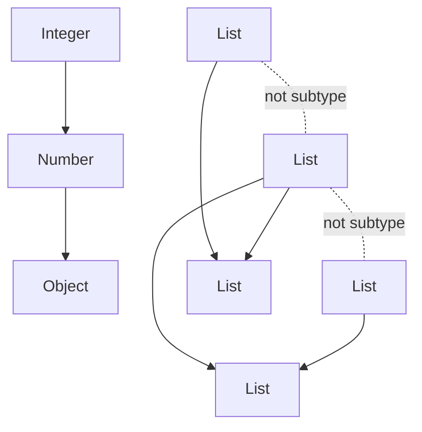
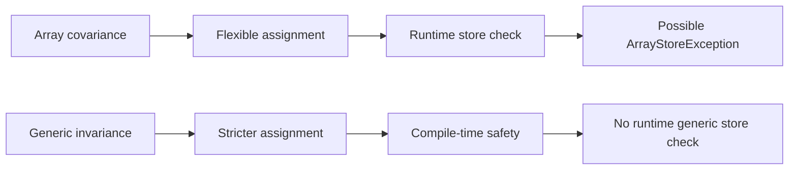
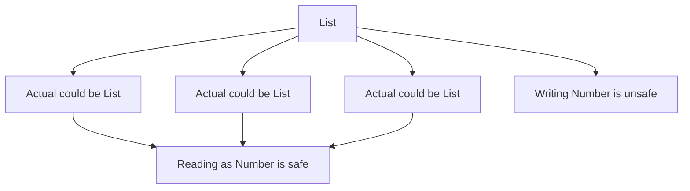
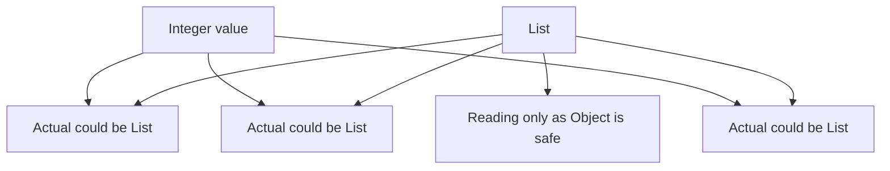
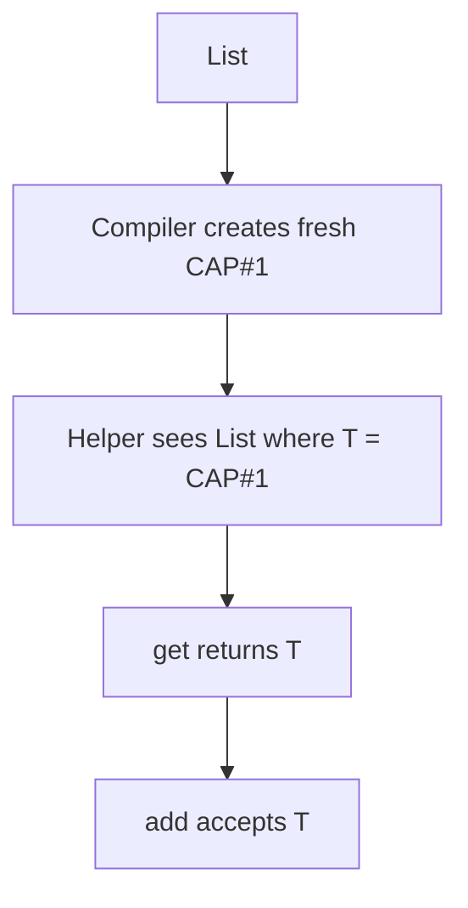

------
title: Learn Java Language Object Model, API Design & Metaprogramming - Part 021
description: Deep study of Java wildcards, variance, capture conversion, PECS, and flexible generic API design.
series: learn-java-language-object-model-metaprogramming
seriesTitle: Learn Java Language Object Model, API Design & Metaprogramming
order: 21
partTitle: Wildcards, Variance, and API Flexibility
tags:
- java
- generics
- wildcards
- variance
- api-design
- type-system
- compile-time-safety
date: 2026-06-30
---

# Part 021 — Wildcards, Variance, and API Flexibility

> Goal: memahami wildcard sebagai mekanisme **use-site variance** untuk membuat generic API fleksibel tanpa mengorbankan type safety. Setelah bagian ini, Anda harus bisa membaca signature seperti `Function<? super T, ? extends R>`, `Comparator<? super T>`, `Collection<? extends E>`, dan tahu kapan wildcard membantu atau justru merusak API.

Generics dasar menjawab pertanyaan: “bagaimana compiler menjaga hubungan type?” Wildcards menjawab pertanyaan lanjutan:

> Bagaimana sebuah API bisa menerima keluarga type yang lebih luas tanpa membuka celah type-unsafe?

Contoh paling umum:

```java
List<Integer> integers = List.of(1, 2, 3);
List<Number> numbers = integers; // compile error
```

Banyak engineer baru terhadap generics menganggap ini aneh, karena `Integer` adalah subtype dari `Number`. Namun `List<Integer>` **bukan** subtype dari `List<Number>`. Inilah titik awal variance.

---

## 1. Kaufman Deconstruction

Sub-skill wildcards:

| Sub-skill | Harus bisa | Kesalahan umum |
|---|---|---|
| Invariance | Memahami kenapa `List<Integer>` bukan `List<Number>` | Menganggap generic mengikuti inheritance element type |
| Upper bound | Membaca `? extends T` sebagai producer/read boundary | Mencoba menulis value arbitrary ke `List<? extends T>` |
| Lower bound | Membaca `? super T` sebagai consumer/write boundary | Mengira hasil read otomatis bertipe `T` |
| Unbounded wildcard | Memakai `?` untuk unknown type | Memakai `List<?>` saat sebenarnya butuh `<T>` |
| Capture conversion | Memahami `capture of ?` dan helper method | Mengira compiler “bodoh” saat menolak kode yang tampak aman |
| API placement | Menaruh wildcard di parameter, bukan return type sembarangan | Return `List<? extends X>` membuat caller sulit memakai hasil |
| Higher-order signatures | Membaca `Function<? super T, ? extends R>` | Menulis `Function<T, R>` terlalu kaku |

Kaufman-style practice: jangan hafalkan “PECS” sebagai slogan. Latih dengan pertanyaan operasional:

1. Apakah API hanya membaca dari input? Gunakan upper bound.
2. Apakah API menulis ke target? Gunakan lower bound.
3. Apakah API perlu menjaga hubungan type yang sama? Gunakan type parameter `<T>`.
4. Apakah type tidak perlu diketahui? Gunakan `?`.
5. Apakah wildcard muncul di return type? Curigai ergonomics-nya.

---

## 2. Mental Model: Variance adalah Relasi antar Container Type

Kita punya relasi class biasa:

```java
Integer <: Number <: Object
```

Pertanyaan variance:

> Jika `Integer` subtype dari `Number`, apakah `Container<Integer>` subtype dari `Container<Number>`?

Jawabannya tergantung desain type system.

| Variance | Relasi | Contoh konseptual |
|---|---|---|
| Covariant | `Container<Integer>` subtype dari `Container<Number>` | Aman jika container hanya produce/read |
| Contravariant | `Container<Number>` subtype dari `Container<Integer>` | Aman jika container hanya consume/write |
| Invariant | Tidak ada subtype relation | Default Java generic class/interface |
| Bivariant | Dua arah | Umumnya tidak sound untuk mutable API |

Java generic type seperti `List<T>` bersifat invariant. Namun Java menyediakan wildcard di **use site**:

```java
List<? extends Number> source;
List<? super Integer> sink;
```

Diagram:



`List<Integer>` bukan `List<Number>`, tetapi `List<Integer>` bisa dipakai sebagai `List<? extends Number>`.

---

## 3. Kenapa `List<Integer>` Bukan `List<Number>`?

Misalkan Java mengizinkan:

```java
List<Integer> integers = new ArrayList<>();
List<Number> numbers = integers; // bayangkan ini legal
numbers.add(3.14);               // legal untuk List<Number>
Integer first = integers.get(0); // runtime problem
```

Jika `List<Integer>` dianggap subtype dari `List<Number>`, maka lewat alias `numbers`, kita bisa memasukkan `Double` ke list yang seharusnya hanya berisi `Integer`.

Invariance mencegah ini.

### 3.1 Arrays berbeda — dan itu sumber pelajaran

Java arrays covariant:

```java
Integer[] ints = new Integer[10];
Number[] nums = ints;  // legal
nums[0] = 3.14;        // ArrayStoreException at runtime
```

Arrays membawa runtime component type, sehingga violation bisa dicek runtime. Generic type arguments tidak direifikasi penuh; `List<Integer>` dan `List<Double>` berbagi runtime class yang sama. Karena itu compiler harus mencegah masalah lebih awal.

Mental model:



---

## 4. Empat Bentuk Utama Generic Parameter

Anggap kita punya:

```java
interface Sink<T> {
    void accept(T value);
}

interface Source<T> {
    T get();
}
```

Untuk collection-like API, empat bentuk utama:

| Bentuk | Arti | Bisa read sebagai | Bisa write |
|---|---|---|---|
| `List<T>` | List of exactly `T` dalam konteks type variable | `T` | `T` |
| `List<?>` | List of unknown element type | `Object` | hanya `null` |
| `List<? extends T>` | List of some subtype of `T` | `T` | hanya `null` |
| `List<? super T>` | List of some supertype of `T` | `Object` | `T` dan subtype `T` |

Kunci: wildcard bukan “tipe longgar”. Wildcard adalah **tipe eksistensial**: “ada suatu type tertentu, tetapi saya tidak tahu namanya di sini.”

---

## 5. `? extends T`: Producer Boundary

`? extends T` berarti:

> Ada type unknown `X`, dan `X` adalah subtype dari `T`.

Contoh:

```java
public static double sum(List<? extends Number> values) {
    double total = 0;
    for (Number value : values) {
        total += value.doubleValue();
    }
    return total;
}
```

Caller bisa memberikan:

```java
sum(List.of(1, 2, 3));       // List<Integer>
sum(List.of(1.5, 2.5));     // List<Double>
sum(List.of(BigDecimal.ONE));
```

Kita bisa membaca sebagai `Number`, karena apa pun unknown type-nya, ia minimal subtype dari `Number`.

Namun kita tidak bisa menulis arbitrary `Number`:

```java
void broken(List<? extends Number> values) {
    values.add(1);      // compile error
    values.add(1.5);    // compile error
    values.add(null);   // technically allowed, but usually bad design
}
```

Kenapa?

`values` bisa saja sebenarnya `List<Integer>`. Jika kita memasukkan `Double`, itu tidak aman.

### 5.1 Read safe, write unsafe



### 5.2 API example: input source

```java
public final class BatchProcessor<T> {
    public void processAll(Collection<? extends T> items) {
        for (T item : items) {
            process(item);
        }
    }

    private void process(T item) {
        // business logic
    }
}
```

Jika `BatchProcessor<Number>`, caller boleh mengirim `Collection<Integer>` atau `Collection<BigDecimal>`, karena processor hanya membaca item sebagai `Number`.

---

## 6. `? super T`: Consumer Boundary

`? super T` berarti:

> Ada type unknown `X`, dan `X` adalah supertype dari `T`.

Contoh klasik:

```java
public static <T> void copy(List<? extends T> source, List<? super T> target) {
    for (T item : source) {
        target.add(item);
    }
}
```

Jika source berisi `Integer`, target boleh berupa:

```java
List<Integer> integers = new ArrayList<>();
List<Number> numbers = new ArrayList<>();
List<Object> objects = new ArrayList<>();

copy(List.of(1, 2, 3), integers);
copy(List.of(1, 2, 3), numbers);
copy(List.of(1, 2, 3), objects);
```

Karena setiap `Integer` aman dimasukkan ke container yang menerima `Integer`, `Number`, atau `Object`.

Namun hasil read dari `List<? super Integer>` hanya aman sebagai `Object`:

```java
void inspect(List<? super Integer> sink) {
    sink.add(42);      // safe
    Object value = sink.getFirst(); // safe
    Integer i = sink.getFirst();    // compile error
}
```

Kenapa? Karena actual list bisa `List<Object>`. Isinya tidak harus semua `Integer`.

### 6.1 Write safe, read imprecise



---

## 7. PECS: Producer Extends, Consumer Super — tapi Jangan Berhenti di Slogan

PECS:

- **Producer Extends**: jika parameter hanya menghasilkan `T`, pakai `? extends T`.
- **Consumer Super**: jika parameter hanya menerima `T`, pakai `? super T`.

Namun slogan ini sering terlalu sederhana. Pertanyaan yang lebih presisi:

| Pertanyaan | Pilihan umum |
|---|---|
| Apakah parameter dibaca sebagai `T`? | `? extends T` |
| Apakah parameter ditulis dengan `T`? | `? super T` |
| Apakah parameter dibaca dan ditulis dengan type yang sama? | `T` tanpa wildcard |
| Apakah type perlu dihubungkan dengan return type? | `<T>` method type parameter |
| Apakah type tidak penting sama sekali? | `?` |

Contoh read + write membutuhkan exact relation:

```java
public static <T> void replaceAll(List<T> list, UnaryOperator<T> op) {
    for (int i = 0; i < list.size(); i++) {
        list.set(i, op.apply(list.get(i)));
    }
}
```

Menggunakan `List<? extends T>` di sini akan menyulitkan write. Menggunakan `List<? super T>` akan menyulitkan read sebagai `T`.

---

## 8. Unbounded Wildcard: `List<?>`

`List<?>` berarti:

> List dengan element type tertentu yang tidak diketahui dan tidak perlu diketahui.

Gunakan saat operasi tidak bergantung pada element type:

```java
public static boolean isEmpty(Collection<?> values) {
    return values == null || values.isEmpty();
}

public static int totalSize(List<?>... lists) {
    int total = 0;
    for (List<?> list : lists) {
        total += list.size();
    }
    return total;
}
```

Jangan gunakan `List<Object>` sebagai pengganti `List<?>`.

```java
void acceptsObjectList(List<Object> values) {}
void acceptsUnknownList(List<?> values) {}

List<String> names = List.of("Ayu");
acceptsObjectList(names);  // compile error
acceptsUnknownList(names); // ok
```

`List<Object>` berarti list yang bisa menyimpan object apa pun. `List<?>` berarti list dengan suatu element type yang tidak diketahui.

---

## 9. Wildcard vs Type Parameter

Sering ada dua pilihan:

```java
void printAll(List<?> values)
```

atau:

```java
<T> void printAll(List<T> values)
```

Jika `T` hanya muncul sekali, biasanya wildcard lebih tepat.

```java
void printAll(List<?> values) {
    values.forEach(System.out::println);
}
```

Jika type perlu menghubungkan dua tempat, gunakan type parameter:

```java
public static <T> T first(List<T> values) {
    return values.getFirst();
}
```

atau:

```java
public static <T> void moveFirst(List<T> from, List<T> to) {
    to.add(from.removeFirst());
}
```

Namun hati-hati: `<T> void moveFirst(List<T>, List<T>)` terlalu kaku jika target boleh supertype. Lebih fleksibel:

```java
public static <T> void moveFirst(List<? extends T> from, List<? super T> to) {
    to.add(from.removeFirst());
}
```

Rule praktis:

> Wildcard menyatakan unknown type. Type parameter menyatakan named relationship.

---

## 10. Capture Conversion: Kenapa Ada `capture of ?`

Kode ini sering mengejutkan:

```java
static void rotateFirstToEnd(List<?> list) {
    Object first = list.getFirst();
    list.add(first); // compile error
}
```

Compiler tahu `list` berisi suatu type unknown, tetapi setelah `getFirst()`, value yang kita simpan di variable `Object` tidak lagi membawa bukti bahwa ia berasal dari type unknown yang sama.

Versi helper:

```java
static void rotateFirstToEnd(List<?> list) {
    rotateFirstToEndCaptured(list);
}

private static <T> void rotateFirstToEndCaptured(List<T> list) {
    T first = list.removeFirst();
    list.add(first);
}
```

Helper method membuat unknown type “tertangkap” sebagai named type variable `T`.

### 10.1 Mental model capture



Capture conversion tidak menciptakan runtime object baru. Ini murni compile-time reasoning.

### 10.2 Contoh yang tetap tidak aman

```java
static void swapFirst(List<? extends Number> a, List<? extends Number> b) {
    Number firstA = a.getFirst();
    Number firstB = b.getFirst();
    // a.add(firstB); // compile error
}
```

Walaupun keduanya `? extends Number`, actual type bisa berbeda:

```java
List<Integer> ints = new ArrayList<>();
List<Double> doubles = new ArrayList<>();
swapFirst(ints, doubles);
```

Compiler benar menolak write antar dua capture berbeda.

---

## 11. Higher-Order API Signatures

Functional API yang baik sering menggunakan wildcard di dua sisi.

### 11.1 `Function<? super T, ? extends R>`

Contoh pipeline:

```java
public final class Pipeline<T> {
    private final List<T> values;

    public Pipeline(List<T> values) {
        this.values = List.copyOf(values);
    }

    public <R> Pipeline<R> map(Function<? super T, ? extends R> mapper) {
        List<R> result = new ArrayList<>();
        for (T value : values) {
            result.add(mapper.apply(value));
        }
        return new Pipeline<>(result);
    }
}
```

Kenapa bukan `Function<T, R>`?

- Input mapper boleh menerima supertype dari `T`.
- Output mapper boleh menghasilkan subtype dari `R`.

Contoh:

```java
Pipeline<Integer> p = new Pipeline<>(List.of(1, 2, 3));

Function<Number, CharSequence> numberToText = n -> "n=" + n;
Pipeline<CharSequence> texts = p.map(numberToText);
```

`Function<Number, CharSequence>` aman untuk `Integer`, karena setiap `Integer` adalah `Number`.

### 11.2 `Predicate<? super T>`

```java
public List<T> filter(Predicate<? super T> predicate) {
    return values.stream()
            .filter(predicate)
            .toList();
}
```

Predicate hanya consume `T`, jadi `? super T`.

### 11.3 `Comparator<? super T>`

```java
public void sort(Comparator<? super T> comparator) {
    values.sort(comparator);
}
```

Jika kita punya `List<Employee>`, comparator untuk `Person` juga valid jika `Employee extends Person`.

```java
Comparator<Person> byName = Comparator.comparing(Person::name);
List<Employee> employees = new ArrayList<>();
employees.sort(byName); // valid with Comparator<? super Employee>
```

---

## 12. API Design Patterns dengan Wildcards

### 12.1 Copy API

```java
public static <T> void copy(
        Iterable<? extends T> source,
        Collection<? super T> target
) {
    for (T item : source) {
        target.add(item);
    }
}
```

Fleksibel karena source dan target tidak harus exact same collection type.

### 12.2 Event handler registry

Misalkan:

```java
interface Event {}
record UserRegistered(String id) implements Event {}
record PaymentFailed(String paymentId) implements Event {}

interface EventHandler<E extends Event> {
    void handle(E event);
}
```

Register handler:

```java
public <E extends Event> void register(
        Class<E> eventType,
        EventHandler<? super E> handler
) {
    // store handler
}
```

Kenapa `? super E`?

Handler untuk `Event` bisa menangani `UserRegistered`. Handler untuk supertype aman sebagai consumer.

### 12.3 Validator composition

```java
@FunctionalInterface
interface Validator<T> {
    ValidationResult validate(T value);
}

public static <T> Validator<T> allOf(
        List<? extends Validator<? super T>> validators
) {
    return value -> {
        for (Validator<? super T> validator : validators) {
            ValidationResult result = validator.validate(value);
            if (!result.isValid()) {
                return result;
            }
        }
        return ValidationResult.valid();
    };
}
```

`validators` sebagai list bisa berisi validator yang lebih umum dari `T`.

### 12.4 Repository query projection

```java
public interface Query<T> {
    boolean matches(T candidate);
}

public interface Repository<T> {
    List<T> findAll(Query<? super T> query);
}
```

Query untuk `Object`, `Auditable`, atau base class dapat dipakai untuk entity subtype.

---

## 13. Wildcard Placement: Parameter vs Return Type

Wildcards paling sering berguna di input parameter.

Baik:

```java
void addAll(Collection<? extends E> source)
```

Caller punya fleksibilitas, implementor tetap bisa membaca sebagai `E`.

Return wildcard sering menyulitkan:

```java
List<? extends Customer> customers();
```

Caller menerima list yang hanya bisa dibaca; tidak bisa menambah `Customer` walaupun mungkin dia berharap bisa. Jika memang return read-only view, lebih jujur dokumentasikan immutability atau return `List<Customer>` yang tidak modifiable.

Lebih baik:

```java
List<Customer> customers();
```

atau jika tipe output memang generic:

```java
<T extends Customer> List<T> customers(Class<T> type);
```

Namun jangan absolut. Return wildcard bisa valid untuk internal helper atau API yang sengaja menyembunyikan exact subtype:

```java
Class<? extends Annotation> annotationType();
```

Rule praktis:

> Wildcard di parameter memperluas caller compatibility. Wildcard di return memindahkan kompleksitas ke caller.

---

## 14. Wildcards dan Mutability

Mutability adalah akar banyak aturan wildcard.

Immutable/read-only API lebih mudah covariant secara konseptual:

```java
interface ReadOnlyList<T> {
    T get(int index);
    int size();
}
```

Jika Java punya declaration-site covariance seperti beberapa bahasa lain, `ReadOnlyList<Integer>` bisa dianggap subtype dari `ReadOnlyList<Number>`. Java memilih use-site wildcard:

```java
void printNumbers(ReadOnlyList<? extends Number> numbers) {}
```

Mutable API membutuhkan kehati-hatian:

```java
interface MutableList<T> {
    T get(int index);
    void set(int index, T value);
}
```

Karena ada read dan write, invariance sering paling aman.

Design implication:

- pisahkan read interface dan write interface jika ingin variance lebih fleksibel;
- jangan buat satu type melakukan semua hal jika API sering dipakai lintas hierarchy;
- gunakan immutable return untuk mengurangi kebutuhan wildcard return.

---

## 15. Wildcards dalam API Internal vs Public

Untuk public API, wildcard adalah bagian dari kontrak caller. Terlalu sedikit wildcard membuat API kaku. Terlalu banyak wildcard membuat API unreadable.

Contoh terlalu kaku:

```java
public void addRules(List<Rule<T>> rules)
```

Lebih fleksibel:

```java
public void addRules(List<? extends Rule<? super T>> rules)
```

Tapi signature ini punya cognitive cost. Mungkin lebih baik menyederhanakan dengan method kecil:

```java
public void addRule(Rule<? super T> rule)

public void addRules(Iterable<? extends Rule<? super T>> rules) {
    for (Rule<? super T> rule : rules) {
        addRule(rule);
    }
}
```

Public API harus menyeimbangkan:

- type correctness;
- readability;
- error message quality;
- IDE discoverability;
- binary/source compatibility;
- testability.

---

## 16. Error Message Reading

Error umum:

```text
required: CAP#1
found: Object
where CAP#1 extends Object from capture of ?
```

Terjemahan:

> Compiler punya unknown type spesifik untuk wildcard ini. Anda mencoba memasukkan value yang tidak terbukti memiliki type yang sama.

Error:

```text
inference variable T has incompatible bounds
```

Terjemahan:

> Compiler mencoba mencari satu type `T` yang memenuhi semua input/return constraint, tetapi constraints saling bertentangan.

Error:

```text
no instance(s) of type variable(s) exist so that X conforms to Y
```

Terjemahan:

> Generic method membutuhkan relasi type yang tidak dapat dibuktikan dari argumen yang diberikan.

Debug checklist:

1. Identifikasi type variable utama: `T`, `R`, `E`, `K`, `V`.
2. Tandai posisi producer vs consumer.
3. Ganti wildcard mental menjadi fresh type: `CAP#1`, `CAP#2`.
4. Periksa apakah Anda mencoba menyamakan dua unknown type yang berbeda.
5. Jika perlu menjaga relasi, ubah wildcard menjadi helper `<T>`.
6. Jika API terlalu kaku, ubah parameter input ke `extends`/`super`.

---

## 17. Wildcard Refactoring Recipes

### 17.1 From exact input to covariant input

Before:

```java
void publishAll(List<Event> events)
```

Problem:

```java
List<UserRegistered> users = List.of(...);
publishAll(users); // error
```

After:

```java
void publishAll(List<? extends Event> events)
```

### 17.2 From exact consumer to contravariant consumer

Before:

```java
void forEach(Consumer<T> consumer)
```

After:

```java
void forEach(Consumer<? super T> consumer)
```

### 17.3 From over-generic method to wildcard

Before:

```java
public static <T> int size(Collection<T> values) {
    return values.size();
}
```

After:

```java
public static int size(Collection<?> values) {
    return values.size();
}
```

Because `T` does not connect anything.

### 17.4 From wildcard to helper type parameter

Before:

```java
void normalize(List<?> values) {
    values.set(0, values.get(0)); // error
}
```

After:

```java
void normalize(List<?> values) {
    normalizeCaptured(values);
}

private <T> void normalizeCaptured(List<T> values) {
    values.set(0, values.get(0));
}
```

---

## 18. Advanced Signature Reading

### 18.1 `Collections.max`-style bound

A common advanced signature shape:

```java
public static <T extends Object & Comparable<? super T>> T max(Collection<? extends T> coll)
```

Mental model:

- collection may contain subtype of `T`;
- `T` must be comparable to itself or one of its supertypes;
- `Comparable<? super T>` allows natural ordering defined at base class level.

Example:

```java
class Person implements Comparable<Person> { ... }
class Employee extends Person { ... }

List<Employee> employees = ...;
Employee max = max(employees);
```

`Employee` inherits comparability to `Person`, and `Comparable<? super Employee>` accepts `Comparable<Person>`.

### 18.2 Transformer API

```java
public <R> List<R> transform(
        Iterable<? extends T> source,
        Function<? super T, ? extends R> mapper
) {
    List<R> result = new ArrayList<>();
    for (T item : source) {
        result.add(mapper.apply(item));
    }
    return List.copyOf(result);
}
```

Positions:

- `source`: producer of `T` → `? extends T`
- `mapper` input: consumer of `T` → `? super T`
- `mapper` output: producer of `R` → `? extends R`
- return `List<R>`: exact stable result for caller

---

## 19. Anti-Patterns

### 19.1 Wildcard everywhere

```java
Map<? extends String, ? super Object> values
```

This is almost always nonsense. `String` is final, so `? extends String` gives little practical benefit. `? super Object` can only be `Object`, so it is noise.

### 19.2 Return unknown type when caller needs exact type

```java
List<? extends Order> findOrders()
```

If callers need `Order`, return `List<Order>`. If callers need subtype projection, make it explicit with `Class<T>` or query object.

### 19.3 Using `?` instead of relationship

```java
void put(Map<?, ?> map, Object key, Object value) {
    map.put(key, value); // impossible
}
```

If you need to write, unknown type is not enough.

### 19.4 Using `Object` instead of wildcard

```java
void inspect(List<Object> values)
```

This rejects `List<String>`, `List<Integer>`, etc. Use `List<?>` if you only inspect.

### 19.5 Lower bound when you need read precision

```java
void calculate(List<? super Number> values) {
    Number n = values.getFirst(); // compile error
}
```

If you need to read as `Number`, use `? extends Number`.

---

## 20. API Design Heuristics

Use this checklist before publishing a generic signature:

1. **Name the role**: source, sink, transformer, predicate, comparator, factory, registry.
2. **Mark direction**: does each parameter produce, consume, or both?
3. **Prefer wildcard at input boundary**: make caller arguments flexible.
4. **Prefer exact type at output boundary**: reduce caller burden.
5. **Use `<T>` when there is a relationship** across parameters or return.
6. **Avoid wildcard fields** unless you are implementing generic infrastructure.
7. **Avoid `List<? extends X>` as mutable state**; it is hard to use safely.
8. **Document mutation semantics**: read-only, copy, retain reference, mutate in place.
9. **Test with subtype/supertype callers**, not only exact types.
10. **Read compiler errors as type proofs**, not as arbitrary restrictions.

---

## 21. Mini Case Study: Rule Engine API

Naive API:

```java
public interface Rule<T> {
    boolean matches(T input);
}

public final class RuleSet<T> {
    private final List<Rule<T>> rules = new ArrayList<>();

    public void addAll(List<Rule<T>> rules) {
        this.rules.addAll(rules);
    }

    public boolean matches(T input) {
        return rules.stream().allMatch(rule -> rule.matches(input));
    }
}
```

Problem: `Rule<Object>` or `Rule<BaseCase>` cannot be added to `RuleSet<EnforcementCase>` even if it can safely handle the input.

Better:

```java
public interface Rule<T> {
    boolean matches(T input);
}

public final class RuleSet<T> {
    private final List<Rule<? super T>> rules = new ArrayList<>();

    public void add(Rule<? super T> rule) {
        rules.add(Objects.requireNonNull(rule));
    }

    public void addAll(Iterable<? extends Rule<? super T>> incoming) {
        for (Rule<? super T> rule : incoming) {
            add(rule);
        }
    }

    public boolean matches(T input) {
        for (Rule<? super T> rule : rules) {
            if (!rule.matches(input)) {
                return false;
            }
        }
        return true;
    }
}
```

Why this is better:

- rule consumes `T`, so `Rule<? super T>`;
- incoming collection produces rules, so `Iterable<? extends Rule<? super T>>`;
- internal list stores consumer rules;
- public method `add` keeps common case readable;
- complex wildcard is isolated in batch method.

---

## 22. Deliberate Practice

### Exercise 1 — Explain invariance

Explain why this is rejected:

```java
List<Integer> ints = new ArrayList<>();
List<Number> nums = ints;
```

Then explain why this is accepted:

```java
List<? extends Number> nums = ints;
```

### Exercise 2 — Design a flexible copy

Implement:

```java
static <T> void copy(Iterable<? extends T> source, Collection<? super T> target)
```

Test with:

- `List<Integer>` to `List<Integer>`;
- `List<Integer>` to `List<Number>`;
- `List<Integer>` to `List<Object>`;
- `List<Double>` to `List<Number>`.

### Exercise 3 — Fix over-strict API

Given:

```java
interface Handler<T> {
    void handle(T value);
}

final class Dispatcher<T> {
    void register(Handler<T> handler) {}
}
```

Refactor so `Dispatcher<Employee>` can accept `Handler<Person>`.

### Exercise 4 — Capture helper

Why does this fail?

```java
static void duplicateFirst(List<?> list) {
    list.add(list.getFirst());
}
```

Fix it with a private helper method.

### Exercise 5 — Signature reading

Explain each wildcard:

```java
public <R> List<R> mapAll(
        Iterable<? extends T> input,
        Function<? super T, ? extends R> mapper
)
```

---

## 23. Summary

Wildcards are not decoration. They are Java's mechanism for expressing variance at usage sites.

Core rules:

- Generic types are invariant by default.
- `? extends T` is for producers/read boundaries.
- `? super T` is for consumers/write boundaries.
- `?` is for unknown type when exact type does not matter.
- Use `<T>` when a type relationship must be named and preserved.
- Wildcards are usually best in input parameters, not return types.
- Capture conversion explains many “capture of ?” errors.
- Flexible public APIs often combine `extends` on input collections and `super` on callbacks/consumers.

A top-level Java engineer reads wildcard signatures as **data-flow and capability-flow**, not as syntax trivia.

---

## References

- Java Language Specification SE 25 — Chapter 4, Types, Values, and Variables: `https://docs.oracle.com/javase/specs/jls/se25/html/jls-4.html`
- Java Language Specification SE 25 — Chapter 5, Conversions and Contexts: `https://docs.oracle.com/javase/specs/jls/se25/html/jls-5.html`
- Oracle Java Tutorial — Wildcard Capture and Helper Methods: `https://docs.oracle.com/javase/tutorial/java/generics/capture.html`
- Java SE 25 API — `java.util.function`: `https://docs.oracle.com/en/java/javase/25/docs/api/java.base/java/util/function/package-summary.html`
