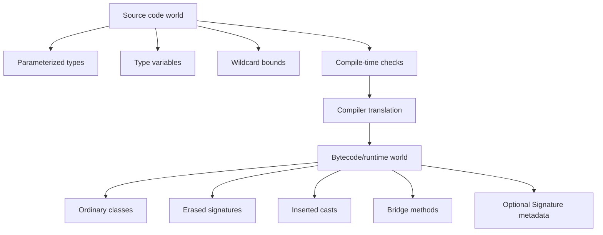

------
title: Learn Java Language Object Model, API Design & Metaprogramming - Part 022
description: Deep study of Java type erasure, bridge methods, reifiable types, heap pollution, raw types, generic arrays, and API consequences.
series: learn-java-language-object-model-metaprogramming
seriesTitle: Learn Java Language Object Model, API Design & Metaprogramming
order: 22
partTitle: Type Erasure, Bridge Methods, and Reifiable Types
tags:
- java
- generics
- type-erasure
- bridge-methods
- reifiable-types
- bytecode
- api-design
date: 2026-06-30
---

# Part 022 — Type Erasure, Bridge Methods, and Reifiable Types

> Goal: memahami batas antara type safety compile-time dan runtime representation Java. Setelah bagian ini, Anda harus bisa menjelaskan kenapa `List<String>` tidak bisa dicek dengan `instanceof`, kenapa generic overload tertentu bentrok, kenapa bridge method muncul, bagaimana heap pollution terjadi, dan bagaimana merancang API yang tidak berpura-pura punya runtime generic information yang sebenarnya tidak ada.

Generics membuat Java jauh lebih aman di compile-time. Namun implementasinya sengaja kompatibel dengan runtime model lama: **type erasure**.

Kalimat inti:

> Java generics adalah kontrak compile-time yang sebagian besar diterjemahkan menjadi bytecode non-generic melalui erasure, cast insertion, dan bridge methods.

Artinya:

```java
List<String> names = new ArrayList<>();
List<Integer> numbers = new ArrayList<>();

System.out.println(names.getClass() == numbers.getClass()); // true
```

Keduanya runtime `ArrayList`. Perbedaan `String` vs `Integer` hidup di compile-time type system dan sebagian metadata class-file, bukan sebagai runtime class berbeda.

---

## 1. Kaufman Deconstruction

Sub-skill erasure:

| Sub-skill | Harus bisa | Kesalahan umum |
|---|---|---|
| Erasure mapping | Menerjemahkan `T`, `List<T>`, `T[]`, generic method ke erased shape | Mengira JVM punya `List<String>` class |
| Cast insertion | Tahu compiler menyisipkan cast untuk menjaga source-level contract | Mengira cast hilang total |
| Bridge method | Menjelaskan method synthetic untuk polymorphism generic | Bingung melihat stack trace/javap berisi method tambahan |
| Reifiable types | Tahu type mana tersedia penuh di runtime | Menulis `instanceof List<String>` atau `new T[]` |
| Raw type | Memahami migration compatibility dan risiko | Memakai raw type sebagai jalan pintas |
| Heap pollution | Menemukan jalur data yang merusak parameterized type | Mengabaikan unchecked warning |
| API design | Memakai `Class<T>`, `Supplier<T>`, atau type token saat butuh runtime type | Memakai `T` seolah bisa di-instantiate atau di-inspect runtime |

Kaufman-style target performance: ketika melihat generic API, Anda bisa menggambar dua bentuknya:

1. **source-level contract** yang dilihat caller;
2. **erased runtime shape** yang dipakai JVM.

---

## 2. Mental Model: Two Worlds

Java generic code hidup di dua dunia:



The source world is rich. The runtime world is intentionally simpler.

This separation explains many restrictions:

- cannot `new T()` because `T` is not a runtime constructor target;
- cannot `new List<String>[10]` because generic array component type is non-reifiable;
- cannot overload `m(List<String>)` and `m(List<Integer>)` because erased signatures collide;
- cannot reliably check `value instanceof List<String>` because runtime does not know element type.

---

## 3. What Erasure Does

For a generic class:

```java
public final class Box<T> {
    private final T value;

    public Box(T value) {
        this.value = value;
    }

    public T value() {
        return value;
    }
}
```

If `T` is unbounded, erasure replaces `T` with `Object`:

```java
public final class Box {
    private final Object value;

    public Box(Object value) {
        this.value = value;
    }

    public Object value() {
        return value;
    }
}
```

At source level:

```java
Box<String> box = new Box<>("hello");
String value = box.value();
```

The compiler effectively knows a cast is needed after erasure:

```java
Box box = new Box("hello");
String value = (String) box.value();
```

You do not write the cast, but the bytecode-level behavior must recover the source-level expectation.

---

## 4. Erasure of Bounds

Unbounded type variable:

```java
final class Holder<T> {
    T value;
}
```

Erases to `Object`.

Bounded type variable:

```java
final class NumberBox<T extends Number> {
    T value;

    double asDouble() {
        return value.doubleValue();
    }
}
```

Erases to leftmost bound, `Number`:

```java
final class NumberBox {
    Number value;

    double asDouble() {
        return value.doubleValue();
    }
}
```

Multiple bounds:

```java
final class SortedBox<T extends Number & Comparable<T>> {
    T value;
}
```

Erasure uses the leftmost bound: `Number`.

This ordering matters for binary shape. If you change bound order in a public generic type, you can affect erased members and compatibility.

---

## 5. Erasure of Generic Methods

Source:

```java
public static <T> T identity(T value) {
    return value;
}
```

Erased shape:

```java
public static Object identity(Object value) {
    return value;
}
```

Call site:

```java
String s = identity("x");
```

Conceptually:

```java
String s = (String) identity("x");
```

Bounded method:

```java
public static <T extends CharSequence> int length(T value) {
    return value.length();
}
```

Erased shape:

```java
public static int length(CharSequence value) {
    return value.length();
}
```

---

## 6. Erasure and Overload Collision

This does not compile:

```java
void process(List<String> values) {}
void process(List<Integer> values) {}
```

Both erase to:

```java
void process(List values) {}
```

The JVM method descriptor cannot distinguish them by generic type argument.

Similarly:

```java
void save(Map<String, String> attributes) {}
void save(Map<String, Integer> attributes) {}
```

Erasure collision.

API design rule:

> Do not overload only by generic type arguments. Use different method names, different wrapper types, or explicit strategy objects.

Better:

```java
void saveTextAttributes(Map<String, String> attributes) {}
void saveNumericAttributes(Map<String, Integer> attributes) {}
```

or:

```java
record TextAttributes(Map<String, String> values) {}
record NumericAttributes(Map<String, Integer> values) {}

void save(TextAttributes attributes) {}
void save(NumericAttributes attributes) {}
```

Records create distinct nominal runtime types and improve API readability.

---

## 7. Bridge Methods: Preserving Polymorphism After Erasure

Consider:

```java
class Node<T> {
    private T data;

    public void setData(T data) {
        this.data = data;
    }

    public T getData() {
        return data;
    }
}

class IntNode extends Node<Integer> {
    @Override
    public void setData(Integer data) {
        super.setData(data);
    }
}
```

At source level, `IntNode#setData(Integer)` overrides `Node<T>#setData(T)` as seen through `Node<Integer>`.

After erasure:

```java
class Node {
    public void setData(Object data) { ... }
    public Object getData() { ... }
}

class IntNode extends Node {
    public void setData(Integer data) { ... }
}
```

Problem: `setData(Integer)` does not override `setData(Object)` at JVM descriptor level.

But polymorphism must still work:

```java
Node<Integer> node = new IntNode();
node.setData(123);
```

So the compiler can generate a synthetic bridge method:

```java
class IntNode extends Node {
    public void setData(Integer data) {
        super.setData(data);
    }

    // synthetic bridge
    public void setData(Object data) {
        setData((Integer) data);
    }
}
```

Diagram:

```mermaid
flowchart TD
    A[Source override: setData(Integer)] --> B[Erasure]
    B --> C[Superclass method: setData(Object)]
    B --> D[Subclass method: setData(Integer)]
    C --> E[Override would be lost]
    E --> F[Compiler emits bridge setData(Object)]
    F --> G[Bridge casts and delegates]
    G --> H[Polymorphism preserved]
```

Bridge methods are why you may see synthetic methods in reflection, bytecode tools, stack traces, coverage tools, or AOP/proxy systems.

---

## 8. Bridge Methods and Reflection

Reflection can see synthetic/bridge methods:

```java
for (Method method : IntNode.class.getDeclaredMethods()) {
    System.out.printf(
            "%s bridge=%s synthetic=%s%n",
            method,
            method.isBridge(),
            method.isSynthetic()
    );
}
```

Framework implication:

- when scanning handlers, avoid registering both real and bridge methods;
- use `method.isBridge()` and `method.isSynthetic()` carefully;
- when resolving annotations, bridge methods may not carry the same annotations as source method;
- generic-aware method resolution must often map bridge method back to bridged method.

This matters for:

- dependency injection;
- event dispatch;
- MVC handler scanning;
- repository method scanning;
- AOP pointcuts;
- serialization frameworks;
- test frameworks.

---

## 9. Reifiable vs Non-Reifiable Types

A type is **reifiable** if its type information is fully available at runtime.

Examples of reifiable types:

```java
String
int
String[]
List<?>        // unbounded wildcard parameterization
List           // raw type
Object
Runnable
```

Examples of non-reifiable types:

```java
List<String>
List<Integer>
Map<String, List<Order>>
T
List<T>
List<? extends Number>
```

Why this matters:

```java
if (value instanceof List<String>) { // compile error
}
```

Runtime can check `value instanceof List`, but cannot check the list's element type argument.

Allowed:

```java
if (value instanceof List<?>) {
    List<?> list = (List<?>) value;
}
```

`List<?>` is reifiable enough because it asks only: “is this some List?” not “is this List of String?”

---

## 10. Generic Arrays and Why They Are Restricted

This is illegal:

```java
List<String>[] lists = new List<String>[10]; // compile error
```

Why? Arrays are reified and covariant; generics are erased and invariant. Combining them naively breaks type safety.

Imagine it were legal:

```java
List<String>[] stringLists = new List<String>[1];
Object[] objects = stringLists;
objects[0] = List.of(42);      // would pass array store if runtime sees only List[]
String s = stringLists[0].get(0); // ClassCastException later
```

The runtime array store check cannot distinguish `List<String>` from `List<Integer>`.

Allowed but warning-prone:

```java
@SuppressWarnings("unchecked")
List<String>[] lists = (List<String>[]) new List<?>[10];
```

This is advanced and should be encapsulated in a small, auditable scope if used at all.

Design alternatives:

- use `List<List<String>>`;
- use `List<T>[]` only internally with controlled unchecked cast;
- use `ArrayList<List<String>>`;
- use arrays only for reifiable component types;
- prefer collection APIs for generic elements.

---

## 11. Raw Types

Raw type:

```java
List raw = new ArrayList();
```

Parameterized type:

```java
List<String> names = new ArrayList<>();
```

Raw types exist for migration compatibility with pre-generics Java. They bypass generic checking and create unchecked warnings.

Example:

```java
List<String> names = new ArrayList<>();
List raw = names;
raw.add(42); // unchecked warning, compiles
String first = names.get(0); // ClassCastException later
```

Raw type is a hole in the compile-time proof.

Rule:

> Treat unchecked warnings as design defects unless isolated, documented, and tested.

Acceptable raw/unchecked zones:

- framework internals that bridge erased runtime data to typed API;
- serialization/deserialization boundary;
- reflection/classpath scanning;
- legacy API adapter;
- type-token registry internals.

Even then, keep the unsafe part small.

---

## 12. Heap Pollution

Heap pollution occurs when a variable of parameterized type refers to an object that is not actually safe for that parameterization.

Example:

```java
List<String> strings = new ArrayList<>();
List raw = strings;
raw.add(100);

String value = strings.get(0); // ClassCastException
```

The heap now contains a list referenced as `List<String>` but containing an `Integer`.

### 12.1 Heap pollution through varargs

Varargs are arrays. Generic varargs can create unsafe aliasing.

```java
static void unsafe(List<String>... lists) {
    Object[] array = lists;
    array[0] = List.of(42);
    String s = lists[0].get(0); // ClassCastException
}
```

This is why generic varargs produce warnings.

### 12.2 `@SafeVarargs`

Use `@SafeVarargs` only when the method does not perform unsafe operations on the varargs array:

```java
@SafeVarargs
public static <T> List<T> concat(List<? extends T>... lists) {
    List<T> result = new ArrayList<>();
    for (List<? extends T> list : lists) {
        result.addAll(list);
    }
    return List.copyOf(result);
}
```

This method is safe if:

- it does not write into `lists`;
- it does not expose `lists` array to untrusted code;
- it only reads elements according to their declared bound.

Better API in many cases:

```java
public static <T> List<T> concat(List<? extends List<? extends T>> lists)
```

or simply:

```java
public static <T> List<T> concat(Collection<? extends Collection<? extends T>> groups)
```

Avoid generic varargs in public APIs unless ergonomics strongly justify it.

---

## 13. `instanceof`, Casts, and Runtime Checks

Illegal:

```java
if (value instanceof List<String> strings) {
}
```

Legal:

```java
if (value instanceof List<?> list) {
    for (Object element : list) {
        // inspect manually
    }
}
```

Unchecked cast:

```java
@SuppressWarnings("unchecked")
List<String> strings = (List<String>) value;
```

This cast checks only that `value` is a `List` at runtime. It cannot validate element type.

Safer boundary:

```java
static List<String> asStringList(Object value) {
    if (!(value instanceof List<?> list)) {
        throw new IllegalArgumentException("Expected List");
    }
    List<String> result = new ArrayList<>();
    for (Object element : list) {
        if (!(element instanceof String s)) {
            throw new IllegalArgumentException("Expected String element: " + element);
        }
        result.add(s);
    }
    return List.copyOf(result);
}
```

This validates elements explicitly and returns a clean typed value.

---

## 14. Runtime Type Evidence: `Class<T>`

Because `T` is erased, this is impossible:

```java
public final class Parser<T> {
    public T parse(String text) {
        return new T(); // impossible
    }
}
```

Pass runtime evidence explicitly:

```java
public final class Parser<T> {
    private final Class<T> type;

    public Parser(Class<T> type) {
        this.type = Objects.requireNonNull(type);
    }

    public T parse(String text) {
        Object raw = parseRaw(text, type);
        return type.cast(raw);
    }
}
```

`Class<T>` works for reifiable class tokens:

```java
Parser<Customer> parser = new Parser<>(Customer.class);
```

But it cannot represent `List<String>.class` because that class literal does not exist.

For nested generic type evidence, frameworks often use type token patterns.

---

## 15. Type Tokens and Generic Metadata

Even though runtime objects do not carry full generic arguments, class files may contain generic signature metadata. Reflection APIs can expose declarations:

```java
class CustomerRepository implements Repository<Customer> {}

Type[] interfaces = CustomerRepository.class.getGenericInterfaces();
```

You may see a `ParameterizedType` representing `Repository<Customer>`.

Important distinction:

| Question | Usually possible? | Example |
|---|---:|---|
| What generic interface does this class declare? | Yes, via metadata | `Repository<Customer>` |
| What is the element type of this arbitrary `ArrayList` instance? | No | `new ArrayList<String>()` at runtime |
| What is field generic type? | Yes, if declared | `Field#getGenericType()` |
| What is method generic return type? | Yes, if declared | `Method#getGenericReturnType()` |
| What did caller infer for `T` at a generic method invocation? | No direct runtime object | erased |

Type token idiom:

```java
abstract class TypeRef<T> {
    private final Type type;

    protected TypeRef() {
        Type superclass = getClass().getGenericSuperclass();
        if (!(superclass instanceof ParameterizedType parameterized)) {
            throw new IllegalStateException("Missing type parameter");
        }
        this.type = parameterized.getActualTypeArguments()[0];
    }

    public Type type() {
        return type;
    }
}

TypeRef<List<String>> ref = new TypeRef<>() {};
```

This works by creating an anonymous subclass whose generic superclass signature records `List<String>`.

Trade-offs:

- useful for JSON/XML/framework binding;
- depends on reflective metadata;
- can break under obfuscation/minimization if signatures are stripped;
- does not make runtime list elements automatically safe;
- should be part of boundary code, not domain model everywhere.

---

## 16. Erasure and API Evolution

Changing generic signatures can have multiple compatibility dimensions.

Example:

```java
public List<Customer> findAll()
```

Changing to:

```java
public Collection<Customer> findAll()
```

may be source-incompatible for callers expecting `List`, and binary compatibility depends on method descriptor change. Return type participates in JVM method descriptor? The JVM descriptor includes return type, but Java method signature rules for overload differ. Practically, changing public return type is a high-risk API change.

Changing:

```java
public void addAll(List<Customer> customers)
```

to:

```java
public void addAll(Collection<Customer> customers)
```

changes erased parameter type from `List` to `Collection`; existing binaries may fail linkage because the method descriptor changed.

Changing only type argument:

```java
public void addAll(List<Customer> customers)
```

to:

```java
public void addAll(List<? extends Customer> customers)
```

may have same erasure (`List`) but can affect source compatibility, reflection metadata, documentation, and overriding relationships.

API evolution rule:

> Always evaluate generic API changes at source, binary, behavioral, and reflective-framework levels.

---

## 17. Erasure and Method Signature Design

Because erasure affects method signatures, these are dangerous:

```java
interface Converter {
    String convert(List<String> input);
    Integer convert(List<Integer> input); // erasure conflict
}
```

Use named concepts:

```java
String convertNames(List<String> names);
Integer convertScores(List<Integer> scores);
```

or wrapper types:

```java
record Names(List<String> values) {}
record Scores(List<Integer> values) {}

String convert(Names names);
Integer convert(Scores scores);
```

For internal frameworks, avoid dispatch by generic type argument alone unless you carry explicit type metadata:

```java
record HandlerKey(Type eventType) {}
```

or:

```java
<E> void register(Class<E> eventType, Handler<? super E> handler)
```

---

## 18. Erasure and Factories

Bad:

```java
class Factory<T> {
    T create() {
        return new T(); // impossible
    }
}
```

Better with supplier:

```java
class Factory<T> {
    private final Supplier<? extends T> supplier;

    Factory(Supplier<? extends T> supplier) {
        this.supplier = supplier;
    }

    T create() {
        return supplier.get();
    }
}
```

Better with constructor function:

```java
class EntityFactory<ID, T> {
    private final Function<? super ID, ? extends T> constructor;

    EntityFactory(Function<? super ID, ? extends T> constructor) {
        this.constructor = constructor;
    }

    T create(ID id) {
        return constructor.apply(id);
    }
}
```

Better with `Class<T>` when reflection is acceptable:

```java
class ReflectiveFactory<T> {
    private final Class<T> type;

    ReflectiveFactory(Class<T> type) {
        this.type = type;
    }

    T create() {
        try {
            return type.getDeclaredConstructor().newInstance();
        } catch (ReflectiveOperationException e) {
            throw new IllegalStateException("Cannot instantiate " + type.getName(), e);
        }
    }
}
```

Reflection should be explicit because it has access, module, constructor, exception, and performance implications.

---

## 19. Erasure and Exception Safety

Generic casts often fail far from the unsafe boundary.

Bad boundary:

```java
@SuppressWarnings("unchecked")
static <T> T read(String key) {
    return (T) STORE.get(key);
}
```

Caller:

```java
Customer customer = read("order:123"); // ClassCastException here or later
```

Better boundary with `Class<T>`:

```java
static <T> T read(String key, Class<T> type) {
    Object value = STORE.get(key);
    if (value == null) {
        return null;
    }
    return type.cast(value);
}
```

For non-reifiable types:

```java
static <T> T read(String key, TypeRef<T> type) {
    Object raw = STORE.get(key);
    return convert(raw, type.type());
}
```

Design principle:

> Put runtime type validation at the boundary where untyped data enters typed code.

---

## 20. Erasure and Framework Design

Frameworks often need to reconstruct generic information from declarations:

- dependency injection resolves `Repository<Customer>`;
- JSON binding resolves `List<OrderLine>`;
- event bus maps `Handler<UserRegistered>`;
- validation framework reads `Validator<Payment>`;
- REST client maps `Response<List<Customer>>`.

But framework code must separate:

1. **declaration metadata**: generic signature from fields/classes/methods;
2. **runtime object identity**: actual object class;
3. **validated payload shape**: elements/properties checked or converted.

Failure mode:

```java
class HandlerRegistry {
    void register(Object handler) {
        Type eventType = inferGenericArgument(handler.getClass());
        // dangerous if inference fails, proxies hide type, bridge methods confuse scanner,
        // or handler implements multiple generic interfaces.
    }
}
```

More explicit API:

```java
<E> void register(Class<E> eventType, Handler<? super E> handler)
```

or:

```java
<E> void register(TypeRef<E> eventType, Handler<? super E> handler)
```

Explicit metadata usually improves error messages and debuggability.

---

## 21. Reading `javap` for Erasure

Given:

```java
public final class Box<T extends Number> {
    public T value;

    public T get() {
        return value;
    }
}
```

Compile and inspect:

```bash
javac Box.java
javap -c -v Box
```

You should expect:

- field descriptor similar to `Ljava/lang/Number;`;
- method descriptor similar to `()Ljava/lang/Number;`;
- generic `Signature` attribute preserving `TT;` metadata;
- no separate class for `Box<Integer>` or `Box<Double>`.

For bridge method inspection:

```bash
javac Node.java IntNode.java
javap -c -v IntNode
```

Look for flags such as:

```text
ACC_BRIDGE, ACC_SYNTHETIC
```

This is a powerful diagnostic skill when debugging frameworks, proxies, and AOP behavior.

---

## 22. Defensive API Patterns

### 22.1 Runtime type needed? Ask for it.

```java
<T> T decode(byte[] bytes, Class<T> type)
```

For generic nested type:

```java
<T> T decode(byte[] bytes, TypeRef<T> type)
```

### 22.2 Construction needed? Ask for factory.

```java
<T> T create(Supplier<? extends T> supplier)
```

### 22.3 Collection element validation needed? Validate elements.

```java
static <T> List<T> checkedList(Object value, Class<T> elementType) {
    if (!(value instanceof List<?> list)) {
        throw new IllegalArgumentException("Expected list");
    }
    List<T> result = new ArrayList<>();
    for (Object element : list) {
        result.add(elementType.cast(element));
    }
    return List.copyOf(result);
}
```

### 22.4 Unsafe cast needed? Isolate it.

```java
final class TypedRegistry {
    private final Map<Class<?>, Object> values = new HashMap<>();

    public <T> void put(Class<T> type, T value) {
        values.put(type, type.cast(value));
    }

    public <T> Optional<T> get(Class<T> type) {
        Object value = values.get(type);
        return value == null ? Optional.empty() : Optional.of(type.cast(value));
    }
}
```

This avoids unchecked cast entirely for reifiable class keys.

For non-reifiable keys, you need stronger `TypeRef` key handling and conversion discipline.

---

## 23. Checklist for Reviewing Generic/Erased Code

Use this review checklist:

1. Does any method rely on `T` existing at runtime?
2. Are there raw types? Why?
3. Are unchecked warnings suppressed? Is the unsafe scope minimal?
4. Can a generic overload erase to the same signature as another overload?
5. Are generic varargs used? Is `@SafeVarargs` justified?
6. Are arrays of parameterized types avoided or safely encapsulated?
7. Does reflection scanner ignore bridge/synthetic methods when appropriate?
8. Are runtime type tokens explicit at untyped boundaries?
9. Are errors raised at boundary, not much later as `ClassCastException`?
10. Are public generic signature changes evaluated for binary/source/reflective compatibility?

---

## 24. Mini Case Study: Typed Attribute Bag

Naive attribute bag:

```java
final class Attributes {
    private final Map<String, Object> values = new HashMap<>();

    @SuppressWarnings("unchecked")
    public <T> T get(String key) {
        return (T) values.get(key);
    }

    public void put(String key, Object value) {
        values.put(key, value);
    }
}
```

Problem:

```java
String name = attributes.get("age"); // compiles, fails later
```

Better with typed key:

```java
public final class AttributeKey<T> {
    private final String name;
    private final Class<T> type;

    private AttributeKey(String name, Class<T> type) {
        this.name = Objects.requireNonNull(name);
        this.type = Objects.requireNonNull(type);
    }

    public static <T> AttributeKey<T> of(String name, Class<T> type) {
        return new AttributeKey<>(name, type);
    }

    String name() {
        return name;
    }

    Class<T> type() {
        return type;
    }
}

public final class Attributes {
    private final Map<AttributeKey<?>, Object> values = new HashMap<>();

    public <T> void put(AttributeKey<T> key, T value) {
        values.put(key, key.type().cast(value));
    }

    public <T> Optional<T> get(AttributeKey<T> key) {
        Object value = values.get(key);
        return value == null ? Optional.empty() : Optional.of(key.type().cast(value));
    }
}
```

Usage:

```java
AttributeKey<Integer> AGE = AttributeKey.of("age", Integer.class);
AttributeKey<String> NAME = AttributeKey.of("name", String.class);

attributes.put(AGE, 42);
Optional<Integer> age = attributes.get(AGE);
```

What improved:

- type relation is carried by key;
- runtime validation uses `Class<T>`;
- no unchecked cast required;
- wrong assignment fails early;
- caller API remains ergonomic.

Limitation: this handles reifiable `Class<T>` types. For `List<String>`, use a richer type token and explicit element validation/conversion.

---

## 25. Deliberate Practice

### Exercise 1 — Erase by hand

Write erased shapes for:

```java
class Pair<L, R> {
    L left;
    R right;
}
```

and:

```java
class Numeric<T extends Number & Comparable<T>> {
    T value;
}
```

### Exercise 2 — Find overload collision

Why does this fail?

```java
void audit(List<String> ids) {}
void audit(List<Long> ids) {}
```

Refactor using nominal wrapper records.

### Exercise 3 — Bridge method

Create `Node<T>` and `StringNode extends Node<String>`. Compile and inspect with `javap -v`. Identify the bridge method.

### Exercise 4 — Validate instead of unchecked cast

Given an `Object` that should be `List<CustomerId>`, write a validator that checks:

- value is a list;
- every element is a `CustomerId`;
- output is immutable `List<CustomerId>`.

### Exercise 5 — Attribute bag

Extend the typed `Attributes` example with:

- default value support;
- required key lookup;
- clear error message when stored value has wrong type.

---

## 26. Summary

Type erasure is not a historical annoyance; it is the central reason Java generics behave as they do.

Core takeaways:

- `List<String>` and `List<Integer>` share the same runtime class.
- Erasure maps type variables to their leftmost bound or `Object`.
- Compiler inserts casts to preserve source-level generic contracts.
- Bridge methods preserve polymorphism after erasure changes signatures.
- Reifiable types are fully available at runtime; most parameterized types are not.
- Raw types and unchecked casts are controlled holes in the type system.
- Heap pollution happens when those holes allow wrong objects into parameterized structures.
- Generic arrays are restricted because arrays are reified but generics are erased.
- Runtime type needs must be represented explicitly with `Class<T>`, `Type`, `TypeRef<T>`, or factories.
- Public generic API changes must be reviewed for source, binary, behavioral, and reflective compatibility.

A top-level Java engineer does not merely “know generics are erased.” They can predict the erased shape, identify where casts and bridge methods appear, and design APIs whose runtime boundaries are honest.

---

## References

- Java Language Specification SE 25 — Chapter 4, Types, Values, and Variables: `https://docs.oracle.com/javase/specs/jls/se25/html/jls-4.html`
- Java Language Specification SE 25 — Chapter 8, Classes: `https://docs.oracle.com/javase/specs/jls/se25/html/jls-8.html`
- Java Language Specification SE 25 — Chapter 13, Binary Compatibility: `https://docs.oracle.com/javase/specs/jls/se25/html/jls-13.html`
- Oracle Java Tutorial — Type Erasure: `https://docs.oracle.com/javase/tutorial/java/generics/erasure.html`
- Oracle Java Tutorial — Effects of Type Erasure and Bridge Methods: `https://docs.oracle.com/javase/tutorial/java/generics/bridgeMethods.html`
- Oracle Java Tutorial — Non-Reifiable Types: `https://docs.oracle.com/javase/tutorial/java/generics/nonReifiableVarargsType.html`
- Java SE 25 API — `java.lang.reflect`: `https://docs.oracle.com/en/java/javase/25/docs/api/java.base/java/lang/reflect/package-summary.html`
