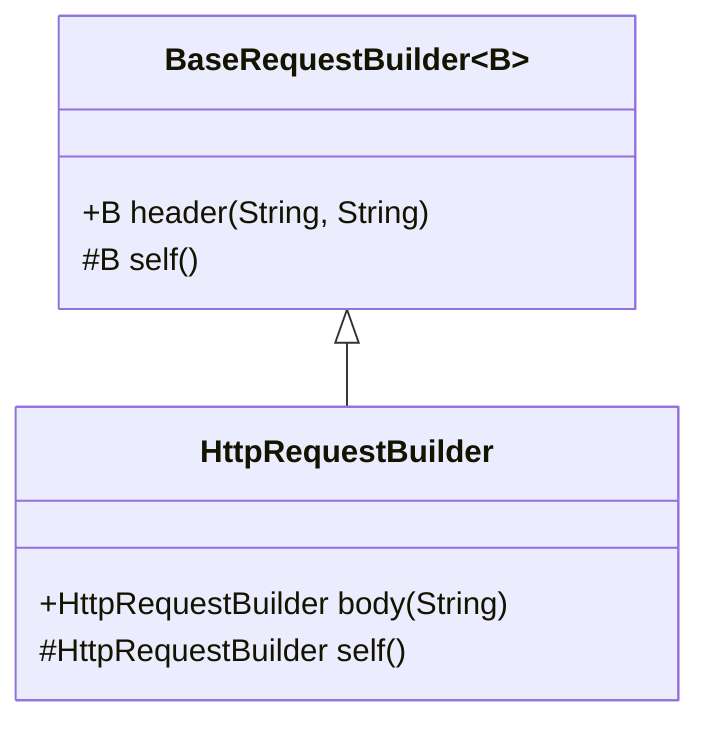
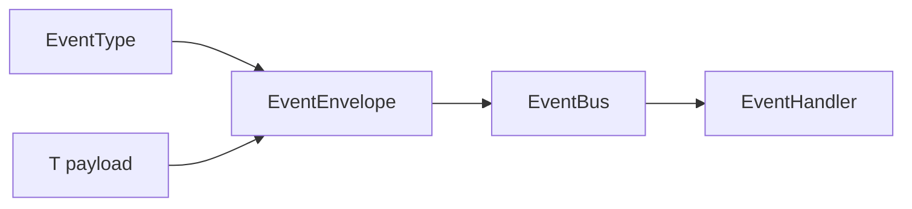

------
title: Learn Java Language Object Model, API Design & Metaprogramming - Part 023
description: Advanced generic API patterns for Java engineers: F-bounded polymorphism, self types, type tokens, heterogeneous containers, type-state APIs, generic builders, and framework-grade type modeling.
series: learn-java-language-object-model-metaprogramming
seriesTitle: Learn Java Language Object Model, API Design & Metaprogramming
order: 23
partTitle: Advanced Generic API Patterns
tags:
- java
- generics
- api-design
- type-system
- type-erasure
- metaprogramming
date: 2026-06-30
---

# Part 023 — Advanced Generic API Patterns

> Target: setelah bagian ini, kita tidak hanya bisa “memakai generics”, tetapi bisa **mendesain API generic yang fleksibel, aman, evolvable, dan layak dipakai di library/framework internal skala besar**.

Bagian sebelumnya membangun mental model dasar generics dan wildcard. Bagian ini masuk ke pola yang lebih tajam: F-bounded polymorphism, self type, type token, heterogeneous container, type-safe registry, phantom type, type-state builder, generic factory, generic adapter, dan generic API untuk extension framework.

Kita tetap menjaga batas seri: ini bukan materi collection API biasa, bukan DSA, bukan design pattern template, dan bukan persistence/mapping framework. Fokusnya adalah **language-level API engineering**.

---

## 1. Kaufman Deconstruction

Josh Kaufman menyarankan kita memecah skill kompleks menjadi sub-skill kecil yang bisa dilatih. Untuk advanced generics, pecahannya seperti ini:

| Sub-skill | Pertanyaan inti | Output praktis |
|---|---|---|
| Relationship modeling | Apa hubungan antar type yang ingin API nyatakan? | Generic class/method signature yang jujur |
| Constraint modeling | Apa constraint minimum yang perlu diketahui compiler? | Bounds: `extends`, intersection bounds, wildcard |
| Evidence modeling | Apakah type perlu diketahui di runtime? | `Class<T>`, `Type`, `TypeRef<T>`, codec registry |
| Fluent composition | Apakah chain API perlu mempertahankan subtype/self type? | F-bounded polymorphism/self type |
| State modeling | Apakah urutan pemakaian API perlu dikunci? | Phantom type/type-state builder |
| Extension modeling | Apakah pihak luar bisa plug in behavior secara aman? | Generic SPI, factory, adapter, handler registry |
| Failure containment | Di mana unchecked cast boleh hidup? | Cast quarantine di boundary kecil |

Skill target kita bukan menulis signature paling “pintar”. Skill targetnya adalah:

> Mampu menaruh kompleksitas generic pada tempat yang benar sehingga caller mendapatkan API yang sederhana, compiler mendapat informasi cukup, dan runtime tidak dipenuhi asumsi palsu.

---

## 2. Core Mental Model: Generics as Relationship Language

Generics bukan “parameter agar class bisa menerima tipe apa saja”. Definisi itu terlalu dangkal.

Generics adalah bahasa untuk menyatakan **relasi antar type**.

Contoh buruk:

```java
interface Converter<T> {
    Object convert(Object input);
}
```

Generic `T` tidak dipakai untuk mengikat apa pun. Ini generic palsu.

Contoh lebih baik:

```java
interface Converter<S, T> {
    T convert(S source);
}
```

Di sini signature menyatakan relasi:

```text
source type S -> target type T
```

API yang baik menggunakan generics untuk menghubungkan beberapa titik:

```java
interface Repository<ID, E> {
    Optional<E> findById(ID id);
    E save(E entity);
}
```

Relasinya:

```text
ID belongs to E repository
save receives E and returns E
findById accepts ID and returns Optional<E>
```

Namun API ini masih bisa bocor secara domain: `Repository<String, Customer>` dan `Repository<String, Account>` sama-sama memakai `String`. Jika ID antar aggregate tidak boleh tertukar, kita butuh value type atau phantom marker.

```java
record CustomerId(String value) {}
record AccountId(String value) {}

interface Repository<ID, E> {
    Optional<E> findById(ID id);
}
```

Sekarang compiler bisa mencegah:

```java
Repository<CustomerId, Customer> customers = ...;
AccountId wrong = new AccountId("A-123");

// customers.findById(wrong); // compile-time error
```

Generic API yang baik membuat illegal relationship gagal di compile-time.

---

## 3. Pattern 1 — Generic Method Instead of Generic Class

Salah satu kesalahan umum: menjadikan class generic padahal yang generic hanya satu operasi.

### 3.1 Bad: type parameter melekat ke object terlalu lama

```java
final class JsonReader<T> {
    T read(String json) {
        // ...
        throw new UnsupportedOperationException();
    }
}
```

Masalah:

- satu instance `JsonReader<T>` hanya untuk satu `T`;
- caller perlu membawa `JsonReader<Customer>` dan `JsonReader<Order>`;
- kalau type evidence dibutuhkan runtime, `T` tetap hilang karena erasure;
- API terlihat type-safe, tetapi implementasi tidak punya informasi runtime yang cukup.

### 3.2 Better: generic method dengan explicit type evidence

```java
final class JsonReader {
    public <T> T read(String json, Class<T> targetType) {
        Objects.requireNonNull(json, "json");
        Objects.requireNonNull(targetType, "targetType");
        // parse and instantiate targetType
        throw new UnsupportedOperationException();
    }
}
```

Generic method lebih tepat ketika:

| Kondisi | Pilihan |
|---|---|
| Type berubah per method call | Generic method |
| Type adalah identity object tersebut | Generic class/interface |
| Type diperlukan runtime | Generic method + type token/evidence |
| Type hanya compile-time relation | Generic method/class tanpa evidence mungkin cukup |

### 3.3 Rule

Gunakan generic class jika type parameter adalah bagian dari **stateful identity** object.

Gunakan generic method jika type parameter hanya bagian dari **operation-level relation**.

---

## 4. Pattern 2 — Bounded Type Parameter

Bounds menyatakan kemampuan minimum yang dibutuhkan API.

```java
public static <T extends Comparable<? super T>> T max(Collection<? extends T> values) {
    Iterator<? extends T> iterator = values.iterator();
    if (!iterator.hasNext()) {
        throw new NoSuchElementException("values must not be empty");
    }

    T max = iterator.next();
    while (iterator.hasNext()) {
        T next = iterator.next();
        if (next.compareTo(max) > 0) {
            max = next;
        }
    }
    return max;
}
```

Perhatikan bound:

```java
<T extends Comparable<? super T>>
```

Bukan:

```java
<T extends Comparable<T>>
```

Mengapa `? super T`? Karena sebuah subtype bisa dibandingkan menggunakan comparator/Comparable milik supertype.

```java
class Money implements Comparable<Money> { ... }
class DiscountedMoney extends Money { ... }
```

Jika kita punya `DiscountedMoney`, membandingkannya sebagai `Money` bisa valid.

### 4.1 Bound as minimum capability

Jangan memberi bound berlebihan.

Buruk:

```java
interface ReportRenderer<T extends Serializable & Comparable<T> & Cloneable> {
    String render(T value);
}
```

Jika renderer hanya butuh membaca field, bound ini noise. Ia mengunci caller pada kontrak yang tidak relevan.

Lebih baik:

```java
interface ReportRenderer<T> {
    String render(T value);
}
```

Atau jika benar-benar butuh capability:

```java
interface Identified<ID> {
    ID id();
}

interface ReportRenderer<T extends Identified<?>> {
    String render(T value);
}
```

Bound harus menjawab: “method apa yang implementasi butuhkan secara langsung?”

---

## 5. Pattern 3 — Intersection Bounds

Java mendukung multiple bounds untuk type parameter.

```java
public static <T extends AutoCloseable & Runnable> void runAndClose(T task) throws Exception {
    try (task) {
        task.run();
    }
}
```

Intersection bounds berguna ketika API membutuhkan kombinasi capability tanpa membuat interface baru.

Namun untuk public API, intersection bounds perlu hati-hati. Signature seperti ini sulit dibaca:

```java
<T extends HasId<ID> & Versioned & Auditable & Validatable>
```

Untuk internal helper, ini bisa efektif. Untuk public API, sering lebih baik membuat role eksplisit:

```java
interface ManagedEntity<ID> extends HasId<ID>, Versioned, Auditable, Validatable {}

public interface EntityStore<ID, E extends ManagedEntity<ID>> {
    E save(E entity);
}
```

### 5.1 When intersection bounds are good

| Cocok | Tidak cocok |
|---|---|
| Helper internal | Public API yang sering dibaca manusia |
| Capability kecil | Domain concept penting |
| Tidak perlu nama konsep baru | Konsep punya semantic weight |
| Membatasi generic method | Membentuk model domain utama |

---

## 6. Pattern 4 — F-Bounded Polymorphism

F-bounded polymorphism adalah pola ketika type parameter dibatasi oleh dirinya sendiri.

```java
interface Comparable<T> {
    int compareTo(T other);
}
```

Contoh umum:

```java
interface SelfValidating<T extends SelfValidating<T>> {
    ValidationResult validate(T self);
}
```

Tetapi penggunaan paling praktis adalah fluent API yang ingin mempertahankan subtype.

---

## 7. Pattern 5 — Self Type for Fluent APIs

Misalnya kita punya base builder:

```java
abstract class BaseRequestBuilder {
    private final Map<String, String> headers = new LinkedHashMap<>();

    public BaseRequestBuilder header(String name, String value) {
        headers.put(name, value);
        return this;
    }
}

final class HttpRequestBuilder extends BaseRequestBuilder {
    public HttpRequestBuilder body(String body) {
        return this;
    }
}
```

Masalah:

```java
new HttpRequestBuilder()
    .header("X-Trace", "abc")
    // .body("payload") // tidak bisa, karena header() return BaseRequestBuilder
    ;
```

Solusi F-bound:

```java
abstract class BaseRequestBuilder<B extends BaseRequestBuilder<B>> {
    private final Map<String, String> headers = new LinkedHashMap<>();

    public B header(String name, String value) {
        headers.put(name, value);
        return self();
    }

    protected abstract B self();
}

final class HttpRequestBuilder extends BaseRequestBuilder<HttpRequestBuilder> {
    public HttpRequestBuilder body(String body) {
        return this;
    }

    @Override
    protected HttpRequestBuilder self() {
        return this;
    }
}
```

Sekarang:

```java
new HttpRequestBuilder()
    .header("X-Trace", "abc")
    .body("payload");
```

### 7.1 Diagram



### 7.2 Self-type warning

Self type pattern tidak benar-benar menjamin subtype jujur.

```java
final class BadBuilder extends BaseRequestBuilder<HttpRequestBuilder> {
    @Override
    protected HttpRequestBuilder self() {
        return new HttpRequestBuilder();
    }
}
```

Kalau class hierarchy internal dan constructor dikontrol, risiko bisa dikelola. Untuk public inheritance API, F-bound bisa memperbesar kompleksitas.

### 7.3 Practical rule

Gunakan F-bound untuk:

- fluent base class internal;
- skeletal implementation;
- framework builder yang subclass-nya Anda kontrol;
- API yang return type harus mempertahankan concrete subtype.

Hindari F-bound untuk:

- domain model biasa;
- API public yang tidak benar-benar butuh fluent inheritance;
- signature yang bisa diselesaikan dengan composition.

---

## 8. Pattern 6 — Recursive Generic Constraints for Domain Relationship

Kadang hubungan domain bersifat recursive.

```java
interface Node<N extends Node<N>> {
    List<N> children();
}

final class MenuNode implements Node<MenuNode> {
    private final List<MenuNode> children = new ArrayList<>();

    @Override
    public List<MenuNode> children() {
        return List.copyOf(children);
    }
}
```

Manfaat:

```java
void render(Node<?> node) { ... }
```

atau:

```java
<N extends Node<N>> void traverse(N root, Consumer<? super N> visitor) {
    visitor.accept(root);
    for (N child : root.children()) {
        traverse(child, visitor);
    }
}
```

API menyatakan bahwa children punya tipe node yang sama dengan root.

Tetapi jangan memaksakan recursive generic bila tree heterogen:

```java
sealed interface AstNode permits Expression, Statement {}
sealed interface Expression extends AstNode permits Literal, BinaryExpression {}
sealed interface Statement extends AstNode permits IfStatement, ReturnStatement {}
```

Untuk AST heterogen, sealed hierarchy sering lebih jelas daripada `Node<N extends Node<N>>`.

---

## 9. Pattern 7 — Type Token with `Class<T>`

Karena erasure, `T` tidak tersedia sebagai runtime object kecuali kita membawa evidence.

```java
public final class Registry {
    private final Map<Class<?>, Object> values = new HashMap<>();

    public <T> void put(Class<T> type, T value) {
        values.put(type, type.cast(value));
    }

    public <T> Optional<T> get(Class<T> type) {
        return Optional.ofNullable(values.get(type)).map(type::cast);
    }
}
```

Penggunaan:

```java
Registry registry = new Registry();
registry.put(String.class, "hello");
registry.put(Integer.class, 42);

String value = registry.get(String.class).orElseThrow();
```

Ini adalah **typesafe heterogeneous container** versi sederhana.

### 9.1 Why `Class<T>` helps

`Class<T>` mengikat runtime token dengan compile-time return type.

```java
<T> T get(Class<T> type)
```

Signature ini berkata:

> Berikan saya token runtime untuk `T`, saya akan mengembalikan value bertipe `T`.

### 9.2 Limitation

`Class<T>` hanya merepresentasikan raw/reifiable type.

Bisa:

```java
String.class
Customer.class
int.class
String[].class
```

Tidak bisa:

```java
List<String>.class // tidak legal
Map<String, Integer>.class // tidak legal
```

Untuk parameterized type, kita butuh `Type`, `ParameterizedType`, atau custom `TypeRef<T>`.

---

## 10. Pattern 8 — Super Type Token / `TypeRef<T>`

Untuk membawa `List<Customer>` ke runtime, banyak framework memakai pola anonymous subclass.

```java
public abstract class TypeRef<T> {
    private final Type type;

    protected TypeRef() {
        Type superType = getClass().getGenericSuperclass();
        if (!(superType instanceof ParameterizedType parameterized)) {
            throw new IllegalStateException("TypeRef must be parameterized");
        }
        this.type = parameterized.getActualTypeArguments()[0];
    }

    public final Type type() {
        return type;
    }
}
```

Penggunaan:

```java
TypeRef<List<Customer>> customers = new TypeRef<>() {};
Type type = customers.type();
```

### 10.1 Why this works

Generic type argument untuk superclass anonymous subclass disimpan dalam generic signature metadata class file. Ia bukan runtime reification penuh seperti array, tetapi metadata reflektif masih bisa dibaca.

### 10.2 Limitation

Pola ini tidak menciptakan runtime specialization. Ia hanya membawa metadata.

```java
new TypeRef<List<T>>() {}
```

Jika `T` sendiri type variable dari method/class, Anda belum punya concrete runtime type. Anda hanya menyimpan `TypeVariable`, bukan `Customer`.

### 10.3 Robust type reference

Untuk API framework, jangan hanya expose `Type`. Bungkus dengan domain type evidence.

```java
public final class CodecKey<T> {
    private final Type type;

    private CodecKey(Type type) {
        this.type = Objects.requireNonNull(type);
    }

    public static <T> CodecKey<T> of(Class<T> type) {
        return new CodecKey<>(type);
    }

    public static <T> CodecKey<T> of(TypeRef<T> ref) {
        return new CodecKey<>(ref.type());
    }

    public Type type() {
        return type;
    }
}
```

Sekarang registry bisa punya vocabulary domain:

```java
interface Codec<T> {
    byte[] encode(T value);
    T decode(byte[] bytes);
}

final class CodecRegistry {
    private final Map<Type, Codec<?>> codecs = new HashMap<>();

    public <T> void register(CodecKey<T> key, Codec<T> codec) {
        codecs.put(key.type(), codec);
    }

    public <T> Codec<T> codecFor(CodecKey<T> key) {
        Codec<?> codec = codecs.get(key.type());
        if (codec == null) {
            throw new NoSuchElementException("No codec registered for " + key.type());
        }
        @SuppressWarnings("unchecked")
        Codec<T> typed = (Codec<T>) codec;
        return typed;
    }
}
```

Unchecked cast tetap ada, tetapi dikarantina di registry boundary.

---

## 11. Pattern 9 — Type-Safe Heterogeneous Container

Heterogeneous container adalah container yang menyimpan banyak tipe berbeda, tetapi retrieval tetap type-safe dari sudut pandang caller.

```java
public final class Attributes {
    private final Map<Key<?>, Object> values = new HashMap<>();

    public <T> void put(Key<T> key, T value) {
        values.put(key, key.type().cast(value));
    }

    public <T> Optional<T> get(Key<T> key) {
        return Optional.ofNullable(values.get(key)).map(key.type()::cast);
    }

    public record Key<T>(String name, Class<T> type) {
        public Key {
            Objects.requireNonNull(name, "name");
            Objects.requireNonNull(type, "type");
        }
    }
}
```

Usage:

```java
Attributes.Key<String> TRACE_ID = new Attributes.Key<>("traceId", String.class);
Attributes.Key<Integer> RETRY_COUNT = new Attributes.Key<>("retryCount", Integer.class);

Attributes attributes = new Attributes();
attributes.put(TRACE_ID, "abc");
attributes.put(RETRY_COUNT, 3);

String traceId = attributes.get(TRACE_ID).orElse("missing");
```

### 11.1 Key identity matters

Kalau `Key` memakai `record`, equality berdasarkan `name` dan `type`. Itu bisa cocok untuk shared key constants. Tapi untuk key yang harus unique by identity, jangan pakai record equality.

```java
public final class Key<T> {
    private final String debugName;
    private final Class<T> type;

    private Key(String debugName, Class<T> type) {
        this.debugName = debugName;
        this.type = type;
    }

    public static <T> Key<T> create(String debugName, Class<T> type) {
        return new Key<>(debugName, type);
    }

    Class<T> type() {
        return type;
    }

    @Override
    public String toString() {
        return debugName;
    }
}
```

Karena tidak override `equals/hashCode`, key identity adalah object identity.

### 11.2 Design decision

| Key semantics | Gunakan |
|---|---|
| Same name+type means same attribute | `record Key<T>(String name, Class<T> type)` |
| Key constant identity matters | final class without value equality |
| Distributed serialization needed | stable string key + type descriptor |
| Plugin extension needed | namespace-qualified key |

---

## 12. Pattern 10 — Generic Handler Registry

Banyak framework butuh dispatch berdasarkan message/event/command type.

Naive:

```java
interface Handler<T> {
    void handle(T message);
}

final class HandlerRegistry {
    private final Map<Class<?>, Handler<?>> handlers = new HashMap<>();

    public <T> void register(Class<T> type, Handler<T> handler) {
        handlers.put(type, handler);
    }

    public <T> void dispatch(T message) {
        @SuppressWarnings("unchecked")
        Handler<T> handler = (Handler<T>) handlers.get(message.getClass());
        if (handler == null) {
            throw new NoSuchElementException("No handler for " + message.getClass().getName());
        }
        handler.handle(message);
    }
}
```

Masalah:

- hanya exact class match;
- generic payload nested tidak bisa dibedakan;
- unchecked cast tersembunyi;
- inheritance dispatch policy tidak jelas;
- duplicate handler policy tidak jelas.

Lebih eksplisit:

```java
public final class MessageType<T> {
    private final Class<T> rawType;

    private MessageType(Class<T> rawType) {
        this.rawType = Objects.requireNonNull(rawType);
    }

    public static <T> MessageType<T> of(Class<T> rawType) {
        return new MessageType<>(rawType);
    }

    public Class<T> rawType() {
        return rawType;
    }
}

@FunctionalInterface
public interface MessageHandler<T> {
    void handle(T message);
}

public final class MessageHandlers {
    private final Map<MessageType<?>, MessageHandler<?>> handlers = new LinkedHashMap<>();

    public <T> void register(MessageType<T> type, MessageHandler<? super T> handler) {
        Objects.requireNonNull(type, "type");
        Objects.requireNonNull(handler, "handler");

        if (handlers.putIfAbsent(type, handler) != null) {
            throw new IllegalStateException("Handler already registered for " + type.rawType().getName());
        }
    }

    public <T> void dispatch(MessageType<T> type, T message) {
        MessageHandler<? super T> handler = find(type);
        handler.handle(message);
    }

    private <T> MessageHandler<? super T> find(MessageType<T> type) {
        MessageHandler<?> handler = handlers.get(type);
        if (handler == null) {
            throw new NoSuchElementException("No handler registered for " + type.rawType().getName());
        }

        @SuppressWarnings("unchecked")
        MessageHandler<? super T> typed = (MessageHandler<? super T>) handler;
        return typed;
    }
}
```

Perhatikan:

```java
MessageHandler<? super T>
```

Handler untuk supertype boleh menangani subtype.

---

## 13. Pattern 11 — Type-Safe Event Bus with Explicit Envelope

Daripada dispatch berdasarkan `message.getClass()`, sering lebih kuat memakai envelope.

```java
public record EventEnvelope<T>(
    EventType<T> type,
    T payload,
    Instant occurredAt,
    Map<String, String> metadata
) {}

public final class EventType<T> {
    private final String name;
    private final Class<T> payloadType;

    private EventType(String name, Class<T> payloadType) {
        this.name = Objects.requireNonNull(name);
        this.payloadType = Objects.requireNonNull(payloadType);
    }

    public static <T> EventType<T> of(String name, Class<T> payloadType) {
        return new EventType<>(name, payloadType);
    }

    public Class<T> payloadType() {
        return payloadType;
    }

    public String name() {
        return name;
    }
}

@FunctionalInterface
public interface EventHandler<T> {
    void handle(EventEnvelope<T> event);
}
```

Registry:

```java
public final class EventBus {
    private final Map<EventType<?>, List<EventHandler<?>>> handlers = new LinkedHashMap<>();

    public <T> void subscribe(EventType<T> type, EventHandler<? super T> handler) {
        handlers.computeIfAbsent(type, ignored -> new ArrayList<>()).add((EventHandler<?>) handler);
    }

    public <T> void publish(EventEnvelope<T> event) {
        List<EventHandler<?>> selected = handlers.getOrDefault(event.type(), List.of());
        for (EventHandler<?> handler : selected) {
            invoke(handler, event);
        }
    }

    private static <T> void invoke(EventHandler<?> handler, EventEnvelope<T> event) {
        @SuppressWarnings("unchecked")
        EventHandler<? super T> typed = (EventHandler<? super T>) handler;
        typed.handle(event);
    }
}
```

The cast is not removed. It is localized. That is the best realistic goal in erased Java.

### 13.1 Diagram



---

## 14. Pattern 12 — Generic SPI

SPI sering butuh generic relationship antara input, output, dan capability.

Misal validation engine:

```java
public interface Constraint<T> {
    String name();
    ValidationResult validate(T value);
}

public interface ConstraintProvider<T> {
    Class<T> targetType();
    List<Constraint<? super T>> constraints();
}
```

Mengapa `Constraint<? super T>`?

Jika `Customer` extends `Party`, constraint untuk `Party` bisa valid untuk `Customer`.

```java
Constraint<Party> partyMustHaveLegalName = ...;
Constraint<Customer> customerSpecificRule = ...;
```

A provider untuk `Customer` bisa mengembalikan keduanya:

```java
List<Constraint<? super Customer>>
```

### 14.1 SPI registration

```java
public final class ConstraintEngine {
    private final Map<Class<?>, List<Constraint<?>>> constraintsByType = new HashMap<>();

    public <T> void register(Class<T> type, Constraint<? super T> constraint) {
        constraintsByType.computeIfAbsent(type, ignored -> new ArrayList<>()).add(constraint);
    }

    public <T> ValidationResult validate(Class<T> type, T value) {
        List<Constraint<?>> constraints = constraintsByType.getOrDefault(type, List.of());
        ValidationResult.Builder result = ValidationResult.builder();

        for (Constraint<?> constraint : constraints) {
            result.merge(apply(constraint, value));
        }

        return result.build();
    }

    private static <T> ValidationResult apply(Constraint<?> constraint, T value) {
        @SuppressWarnings("unchecked")
        Constraint<? super T> typed = (Constraint<? super T>) constraint;
        return typed.validate(value);
    }
}
```

### 14.2 SPI design heuristic

For extension APIs:

| Role | Type shape |
|---|---|
| Producer of `T` | `? extends T` |
| Consumer of `T` | `? super T` |
| Transformer `S -> T` | `Function<? super S, ? extends T>` |
| Handler of event payload `T` | `Handler<? super T>` |
| Registry keyed by runtime type | `Class<T>` or `TypeRef<T>` |
| Plugin contract | keep type parameter on provider/handler, not on registry implementation |

---

## 15. Pattern 13 — Generic Factory

Factory API harus jelas apakah ia menghasilkan exact type, subtype, atau abstraksi.

### 15.1 Exact type factory

```java
interface Factory<T> {
    T create();
}
```

### 15.2 Contextual factory

```java
interface Factory<T, C> {
    T create(C context);
}
```

### 15.3 Runtime type factory

```java
interface InstanceFactory {
    <T> T create(Class<T> type);
}
```

Ini sering muncul di DI/container/reflection framework.

### 15.4 Safer constructor binding

```java
public final class ConstructorFactory<T> implements Factory<T> {
    private final Constructor<T> constructor;

    public ConstructorFactory(Class<T> type) {
        try {
            this.constructor = type.getDeclaredConstructor();
        } catch (NoSuchMethodException e) {
            throw new IllegalArgumentException("Type must have no-arg constructor: " + type.getName(), e);
        }
    }

    @Override
    public T create() {
        try {
            return constructor.newInstance();
        } catch (ReflectiveOperationException e) {
            throw new IllegalStateException("Failed to instantiate " + constructor.getDeclaringClass().getName(), e);
        }
    }
}
```

Generic factory harus menghindari ilusi:

```java
<T> T create(); // bad without input evidence
```

Method ini tidak punya informasi untuk memilih `T`. Caller bisa menulis:

```java
Customer customer = factory.create();
Order order = factory.create();
```

Tanpa `Class<T>`, key, atau context, implementation hanya bisa guessing/casting.

---

## 16. Pattern 14 — Generic Mapper/Adapter Without Data-Mapping Repetition

Kita tidak mengulang seri data mapper. Di sini kita lihat generic shape API-nya.

```java
@FunctionalInterface
public interface Adapter<S, T> {
    T adapt(S source);

    default <U> Adapter<S, U> andThen(Adapter<? super T, ? extends U> next) {
        Objects.requireNonNull(next, "next");
        return source -> next.adapt(this.adapt(source));
    }
}
```

Perhatikan signature:

```java
Adapter<? super T, ? extends U>
```

`next` boleh menerima supertype dari `T` dan menghasilkan subtype dari `U`.

Usage:

```java
Adapter<CustomerEntity, CustomerSnapshot> toSnapshot = ...;
Adapter<CustomerSnapshot, CustomerDto> toDto = ...;

Adapter<CustomerEntity, CustomerDto> pipeline = toSnapshot.andThen(toDto);
```

### 16.1 Registry with source-target pair

```java
public record TypePair<S, T>(Class<S> sourceType, Class<T> targetType) {
    public TypePair {
        Objects.requireNonNull(sourceType);
        Objects.requireNonNull(targetType);
    }
}

public final class AdapterRegistry {
    private final Map<TypePair<?, ?>, Adapter<?, ?>> adapters = new HashMap<>();

    public <S, T> void register(TypePair<S, T> key, Adapter<? super S, ? extends T> adapter) {
        adapters.put(key, adapter);
    }

    public <S, T> Adapter<S, T> adapter(TypePair<S, T> key) {
        Adapter<?, ?> adapter = adapters.get(key);
        if (adapter == null) {
            throw new NoSuchElementException("No adapter for " + key);
        }
        @SuppressWarnings("unchecked")
        Adapter<S, T> typed = (Adapter<S, T>) adapter;
        return typed;
    }
}
```

Unchecked cast ada di registry boundary. Caller tetap type-safe.

---

## 17. Pattern 15 — Phantom Types

Phantom type adalah type parameter yang tidak dipakai sebagai field value, tetapi dipakai untuk membedakan state/semantics di compile-time.

```java
sealed interface Currency permits USD, EUR {}
final class USD implements Currency {}
final class EUR implements Currency {}

public record Money<C extends Currency>(BigDecimal amount) {
    public Money {
        Objects.requireNonNull(amount);
    }
}
```

Sekarang:

```java
Money<USD> usd = new Money<>(new BigDecimal("10.00"));
Money<EUR> eur = new Money<>(new BigDecimal("10.00"));

// usd = eur; // compile-time error
```

Runtime class tetap `Money`. `USD` dan `EUR` adalah compile-time markers.

### 17.1 Operations

```java
public static <C extends Currency> Money<C> add(Money<C> left, Money<C> right) {
    return new Money<>(left.amount().add(right.amount()));
}
```

Tidak bisa menambah USD dan EUR tanpa explicit conversion API.

```java
Money<USD> totalUsd = add(usd, usd);
// Money<USD> invalid = add(usd, eur); // compile-time error
```

### 17.2 Phantom type trade-off

| Manfaat | Risiko |
|---|---|
| Mencegah tertukar semantics | Marker type bisa berlebihan |
| Tidak ada runtime overhead berarti | Runtime tidak bisa cek `Money<USD>` tanpa metadata tambahan |
| Cocok untuk units/state/phase | Serialization/deserialization butuh hati-hati |
| Membuat API self-documenting | Error message compiler bisa kompleks |

---

## 18. Pattern 16 — Type-State Builder

Type-state builder menggunakan generic marker untuk memastikan urutan pemakaian benar.

Misal API membuat request harus punya method dan URL sebelum `build()`.

```java
sealed interface SetState permits Set {}
sealed interface MissingState permits Missing {}
final class Set implements SetState {}
final class Missing implements MissingState {}

public final class RequestBuilder<M, U> {
    private String method;
    private URI uri;
    private final Map<String, String> headers = new LinkedHashMap<>();

    private RequestBuilder() {}

    public static RequestBuilder<Missing, Missing> create() {
        return new RequestBuilder<>();
    }

    public RequestBuilder<Set, U> method(String method) {
        this.method = Objects.requireNonNull(method);
        @SuppressWarnings("unchecked")
        RequestBuilder<Set, U> self = (RequestBuilder<Set, U>) this;
        return self;
    }

    public RequestBuilder<M, Set> uri(URI uri) {
        this.uri = Objects.requireNonNull(uri);
        @SuppressWarnings("unchecked")
        RequestBuilder<M, Set> self = (RequestBuilder<M, Set>) this;
        return self;
    }

    public RequestBuilder<M, U> header(String name, String value) {
        headers.put(name, value);
        return this;
    }

    public Request build(Ready ready) {
        return new Request(method, uri, Map.copyOf(headers));
    }

    public static Ready ready(RequestBuilder<Set, Set> builder) {
        return new Ready();
    }

    public static final class Ready private Ready() {}
}
```

Penggunaan masih agak canggung:

```java
var builder = RequestBuilder.create()
    .method("GET")
    .uri(URI.create("https://example.com"));

Request request = builder.build(RequestBuilder.ready(builder));
```

Lebih ergonomis dengan interface stages:

```java
interface MethodStage {
    UrlStage method(String method);
}

interface UrlStage {
    OptionalStage uri(URI uri);
}

interface OptionalStage {
    OptionalStage header(String name, String value);
    Request build();
}
```

Stage interface sering lebih sederhana daripada phantom generic builder untuk public API.

### 18.1 Type-state rule

Gunakan type-state generic jika:

- state space besar dan reusable;
- compiler enforcement bernilai tinggi;
- caller teknis dan toleran terhadap signature kompleks;
- invalid sequence berdampak mahal.

Gunakan staged interface jika:

- urutan sederhana;
- public API harus mudah dibaca;
- builder tidak perlu generic extensibility.

---

## 19. Pattern 17 — Generic Result and Error Typing

Java tidak punya checked generic exception yang fleksibel untuk banyak desain modern, tetapi kita bisa model result.

```java
public sealed interface Result<T, E> permits Result.Ok, Result.Err {
    record Ok<T, E>(T value) implements Result<T, E> {}
    record Err<T, E>(E error) implements Result<T, E> {}

    static <T, E> Result<T, E> ok(T value) {
        return new Ok<>(value);
    }

    static <T, E> Result<T, E> err(E error) {
        return new Err<>(error);
    }
}
```

Mapping:

```java
public static <T, U, E> Result<U, E> map(
    Result<T, E> result,
    Function<? super T, ? extends U> mapper
) {
    return switch (result) {
        case Result.Ok<T, E> ok -> Result.ok(mapper.apply(ok.value()));
        case Result.Err<T, E> err -> Result.err(err.error());
    };
}
```

Catatan: pattern matching switch untuk generic sealed result bisa membutuhkan perhatian terhadap preview/final state tergantung versi Java dan konfigurasi compiler. Dalam API publik, pertimbangkan method instance agar caller tidak perlu melihat detail pattern matching.

```java
public sealed interface Result<T, E> permits Result.Ok, Result.Err {
    <U> Result<U, E> map(Function<? super T, ? extends U> mapper);

    record Ok<T, E>(T value) implements Result<T, E> {
        @Override
        public <U> Result<U, E> map(Function<? super T, ? extends U> mapper) {
            return new Ok<>(mapper.apply(value));
        }
    }

    record Err<T, E>(E error) implements Result<T, E> {
        @Override
        public <U> Result<U, E> map(Function<? super T, ? extends U> mapper) {
            return new Err<>(error);
        }
    }
}
```

---

## 20. Pattern 18 — Generic Policy Object

Policy object sering lebih kuat daripada enum strategy ketika behavior butuh type safety.

```java
public interface MergePolicy<T> {
    T merge(T current, T incoming);
}

public final class Policies {
    public static <T> MergePolicy<T> keepCurrent() {
        return (current, incoming) -> current;
    }

    public static <T> MergePolicy<T> replaceWithIncoming() {
        return (current, incoming) -> incoming;
    }

    public static <T> MergePolicy<T> failOnConflict() {
        return (current, incoming) -> {
            if (!Objects.equals(current, incoming)) {
                throw new IllegalStateException("Conflict: " + current + " vs " + incoming);
            }
            return current;
        };
    }
}
```

Domain usage:

```java
final class SnapshotMerger<T> {
    private final MergePolicy<T> policy;

    SnapshotMerger(MergePolicy<T> policy) {
        this.policy = policy;
    }

    T merge(T current, T incoming) {
        return policy.merge(current, incoming);
    }
}
```

### 20.1 Generic policy with context

```java
public interface Policy<T, C> {
    Decision decide(T subject, C context);
}
```

Avoid:

```java
interface Policy<T> {
    Decision decide(T subject, Object context);
}
```

`Object context` defeats generics. If context is part of the relation, model it.

---

## 21. Pattern 19 — Generic Visitor Alternative

Classic visitor can become verbose. Generics can help if result type must be configurable.

```java
sealed interface Expr permits Literal, Add, Multiply {
    <R> R accept(ExprVisitor<R> visitor);
}

record Literal(int value) implements Expr {
    @Override
    public <R> R accept(ExprVisitor<R> visitor) {
        return visitor.visitLiteral(this);
    }
}

record Add(Expr left, Expr right) implements Expr {
    @Override
    public <R> R accept(ExprVisitor<R> visitor) {
        return visitor.visitAdd(this);
    }
}

record Multiply(Expr left, Expr right) implements Expr {
    @Override
    public <R> R accept(ExprVisitor<R> visitor) {
        return visitor.visitMultiply(this);
    }
}

interface ExprVisitor<R> {
    R visitLiteral(Literal literal);
    R visitAdd(Add add);
    R visitMultiply(Multiply multiply);
}
```

Usage:

```java
final class Eval implements ExprVisitor<Integer> { ... }
final class Print implements ExprVisitor<String> { ... }
```

With modern sealed types and switch, visitor is not always needed. But generic visitor remains useful when:

- operations are extensible by external modules;
- result type varies per operation;
- target version/tooling makes exhaustive pattern matching less ideal;
- double dispatch matters.

---

## 22. Pattern 20 — Generic Test Contract

Generic API needs generic tests. For a contract like repository:

```java
interface Repository<ID, E> {
    E save(E entity);
    Optional<E> findById(ID id);
}
```

Make reusable contract test:

```java
public interface RepositoryContract<ID, E> {
    Repository<ID, E> repository();
    E newEntity();
    ID idOf(E entity);

    @Test
    default void savedEntityCanBeFoundById() {
        E saved = repository().save(newEntity());
        assertEquals(Optional.of(saved), repository().findById(idOf(saved)));
    }
}
```

Concrete implementation:

```java
final class InMemoryCustomerRepositoryTest implements RepositoryContract<CustomerId, Customer> {
    private final InMemoryCustomerRepository repository = new InMemoryCustomerRepository();

    @Override
    public Repository<CustomerId, Customer> repository() {
        return repository;
    }

    @Override
    public Customer newEntity() {
        return new Customer(new CustomerId("C-1"), "Alice");
    }

    @Override
    public CustomerId idOf(Customer entity) {
        return entity.id();
    }
}
```

This is important: generic API is not complete until its **generic contract** is testable.

---

## 23. API Design Matrix

| Problem | Pattern | Example signature |
|---|---|---|
| Operation generic per call | Generic method | `<T> T read(String, Class<T>)` |
| Runtime evidence for raw type | Type token | `Class<T>` |
| Runtime evidence for parameterized type | Super type token | `TypeRef<List<Customer>>` |
| Many typed values in one map | Heterogeneous container | `Key<T>` |
| Dispatch by typed message | Handler registry | `register(MessageType<T>, Handler<? super T>)` |
| Preserve subtype in fluent chain | F-bound self type | `B extends BaseBuilder<B>` |
| Prevent mixed semantic units | Phantom type | `Money<USD>` |
| Enforce construction order | Type-state/staged builder | `Builder<Set, Missing>` |
| Compose transformations | Higher-order generic | `Function<? super S, ? extends T>` |
| Extension provider | Generic SPI | `Provider<T>` |

---

## 24. Smell Catalog

### 24.1 Unused type parameter

```java
interface Service<T> {
    void execute();
}
```

If `T` does not affect method input/output/state, remove it.

### 24.2 Method-level type parameter with no evidence

```java
<T> T currentUser();
```

How does implementation know `T`? Better:

```java
<T extends UserPrincipal> Optional<T> currentUser(Class<T> type);
```

or return a fixed abstraction:

```java
UserPrincipal currentUser();
```

### 24.3 Wildcard in return type

```java
List<? extends Customer> findCustomers();
```

Caller cannot easily add or reason about exact type. Prefer:

```java
List<Customer> findCustomers();
```

Unless the wildcard expresses a real abstraction and caller only reads.

### 24.4 Raw boundary leak

```java
Map<Class, Handler> handlers;
```

Prefer:

```java
Map<Class<?>, Handler<?>> handlers;
```

Then centralize unchecked cast.

### 24.5 Generic parameter as decoration

```java
class Response<T> {
    int status;
    String body;
}
```

If `T` is not used, it is lying. If body should be `T`, model it:

```java
record Response<T>(int status, T body) {}
```

---

## 25. Decision Heuristics

Ask these in order:

1. Does the type parameter connect at least two API points?
2. Is the relation stable enough to belong in public API?
3. Does runtime need to know the type?
4. Can `Class<T>` represent it, or do we need `TypeRef<T>`?
5. Is the API a producer, consumer, or transformer?
6. Would wildcard help caller flexibility or hurt readability?
7. Can unchecked cast be quarantined in one method/class?
8. Can a non-generic design be simpler and equally safe?
9. Will future API evolution be harder because of this signature?
10. Can tests express the generic contract?

---

## 26. Practice Lab

### Lab 1 — Build a type-safe attribute bag

Requirements:

- typed key;
- optional retrieval;
- no unchecked warning outside implementation;
- key semantics explicit: value-based or identity-based.

### Lab 2 — Build a handler registry

Requirements:

- `MessageType<T>` key;
- `Handler<? super T>` support;
- duplicate registration policy;
- clear error when missing handler;
- all unchecked casts localized.

### Lab 3 — Build a codec registry

Requirements:

- support `Class<T>` keys;
- support `TypeRef<T>` for `List<Customer>`;
- encode/decode generic API;
- prove via tests that wrong codec cannot be retrieved by normal caller path.

### Lab 4 — Refactor a fluent base class

Start with base builder returning base type. Refactor using F-bound self type. Then decide whether staged interface would be clearer.

### Lab 5 — Model units with phantom types

Model:

```text
Distance<Kilometer>
Distance<Mile>
Duration<Second>
Rate<DistanceUnit, TimeUnit>
```

Prevent compile-time mixing unless explicit conversion is used.

---

## 27. Engineering Checklist

Before approving a generic API, check:

- [ ] Every type parameter has a clear semantic role.
- [ ] Type parameter names are meaningful enough for API complexity.
- [ ] Wildcards appear mostly at input boundaries, not return types.
- [ ] `? extends` is used for producers, `? super` for consumers.
- [ ] Runtime type needs are represented by `Class<T>`, `Type`, or `TypeRef<T>`.
- [ ] Unchecked casts are localized and justified.
- [ ] Public API does not expose raw types.
- [ ] Generic varargs are avoided or safely annotated with `@SafeVarargs` only when truly safe.
- [ ] Recursive bounds are necessary, not ornamental.
- [ ] Fluent inheritance does not leak broken self types.
- [ ] Binary/source compatibility has been considered.
- [ ] Contract tests cover more than one concrete type.

---

## 28. Key Takeaways

Advanced generics are valuable only when they improve correctness or expressiveness. They are harmful when they become a puzzle.

Use these principles:

1. Generics model relationships, not decoration.
2. Type parameters should connect inputs, outputs, state, or runtime evidence.
3. Runtime evidence must be explicit because Java generics are erased.
4. Wildcards are boundary tools, not domain modeling tools.
5. F-bound/self type is useful for fluent subtype preservation but easy to overuse.
6. Heterogeneous containers and registries are realistic places where unchecked casts survive; quarantine them.
7. Phantom types and type-state builders can encode invariants, but they trade API simplicity for compile-time enforcement.
8. A great generic API makes the common path simple and the illegal path impossible or localized.

---

## 29. References

- Java Language Specification, Java SE 25 — Chapter 4: Types, Values, and Variables: https://docs.oracle.com/javase/specs/jls/se25/html/jls-4.html
- Java Language Specification, Java SE 25 — Chapter 8: Classes: https://docs.oracle.com/javase/specs/jls/se25/html/jls-8.html
- Java Language Specification, Java SE 25 — Chapter 9: Interfaces: https://docs.oracle.com/javase/specs/jls/se25/html/jls-9.html
- Java SE 25 API — `java.lang.Class`: https://docs.oracle.com/en/java/javase/25/docs/api/java.base/java/lang/Class.html
- Java SE 25 API — `java.lang.reflect.Type`: https://docs.oracle.com/en/java/javase/25/docs/api/java.base/java/lang/reflect/Type.html
- Oracle Java Tutorials — Generics: https://docs.oracle.com/javase/tutorial/java/generics/index.html
