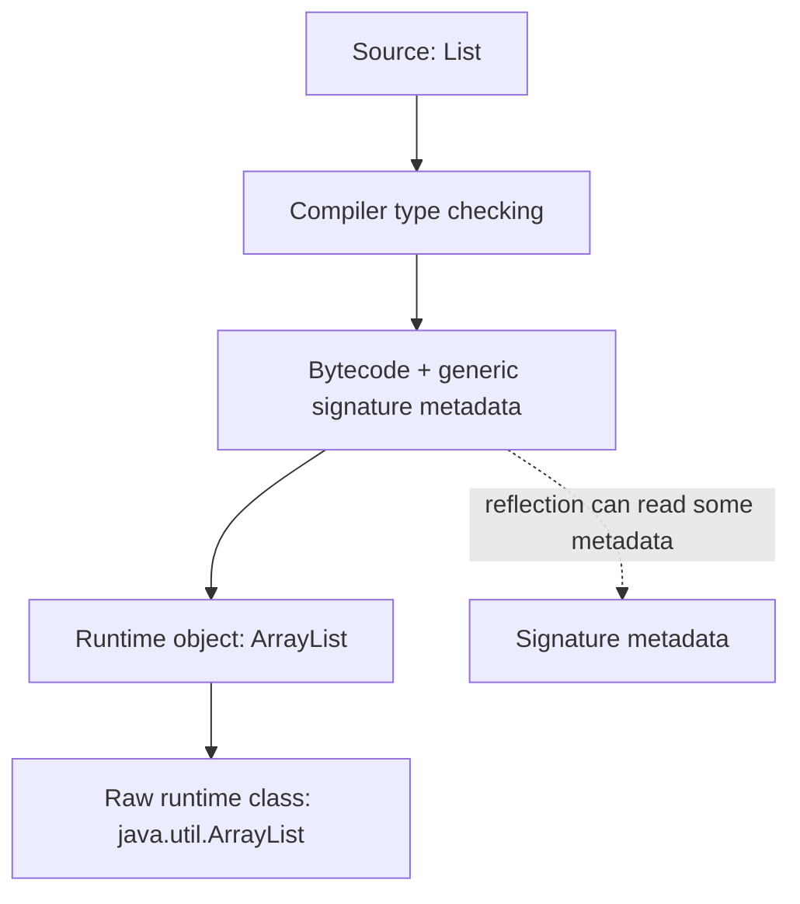
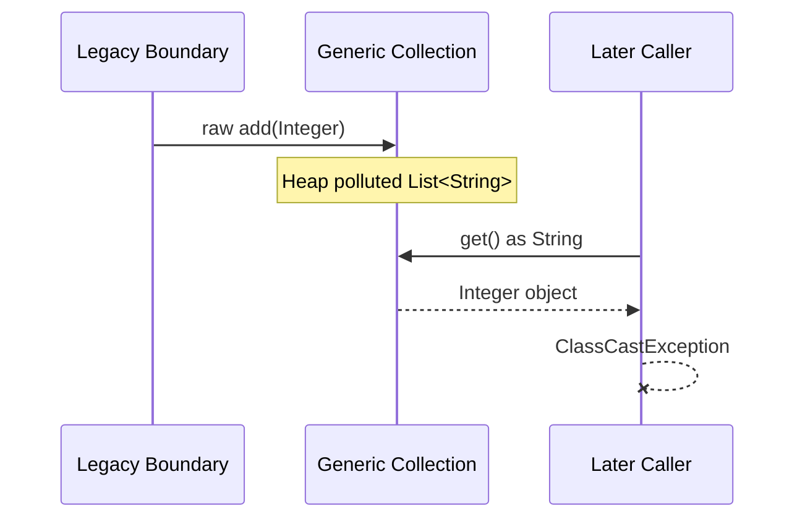
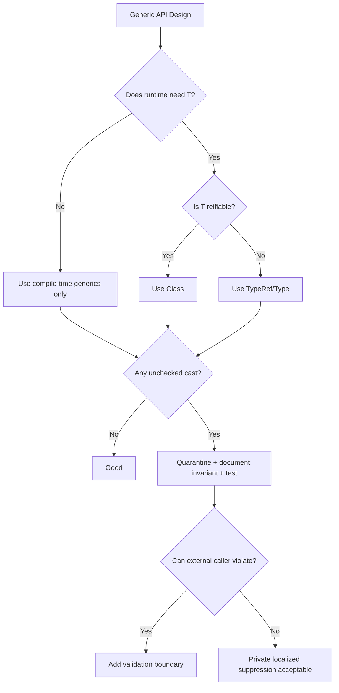

------
title: Learn Java Language Object Model, API Design & Metaprogramming - Part 024
description: Failure modes and defensive design techniques for Java generic APIs, including raw types, heap pollution, unchecked casts, wildcard overuse, erased overloads, bridge methods, binary compatibility, reflection traps, and runtime type evidence.
series: learn-java-language-object-model-metaprogramming
seriesTitle: Learn Java Language Object Model, API Design & Metaprogramming
order: 24
partTitle: Generic Failure Modes and Defensive API Design
tags:
- java
- generics
- type-erasure
- api-design
- failure-modes
- defensive-programming
date: 2026-06-30
---

# Part 024 — Generic Failure Modes and Defensive API Design

> Target: setelah bagian ini, kita bisa membaca signature generic Java dan langsung melihat risiko: raw type leak, heap pollution, unchecked cast boundary, erased overload collision, bridge method surprise, non-reifiable varargs, reflection trap, wildcard overuse, dan compatibility break.

Advanced generics memberi leverage besar, tetapi failure mode-nya tidak selalu muncul di tempat penyebabnya. Banyak bug generic Java bersifat **delayed failure**: compile warning muncul di satu tempat, `ClassCastException` terjadi di tempat lain, dan root cause ada di API design yang membiarkan invariant bocor.

Bagian ini adalah katalog risiko plus defensive design playbook.

---

## 1. Kaufman Skill Deconstruction

Untuk menguasai defensive generic design, pecah skill menjadi:

| Sub-skill | Yang harus dikenali | Defensive response |
|---|---|---|
| Erasure awareness | Runtime tidak tahu `List<String>` vs `List<Integer>` | Bawa `Class<T>`/`TypeRef<T>` jika perlu |
| Warning interpretation | `unchecked`, `rawtypes`, `heap pollution` | Jangan suppress global; lokalisasi |
| Boundary design | API menyimpan `T` tetapi runtime tidak bisa verifikasi | Quarantine cast di registry/factory |
| Variance control | `extends/super` salah tempat | PECS + avoid wildcard return |
| Compatibility control | Generic signature berubah | Cek erased signature dan binary impact |
| Reflection realism | Generic metadata tidak sama dengan runtime guarantee | Validate raw type + metadata carefully |
| Test design | Bug muncul pada kombinasi type tertentu | Contract tests dengan multiple types |

Goal bukan menghapus semua warning dengan `@SuppressWarnings`. Goalnya adalah:

> Mendesain API sehingga unchecked operation hanya ada di tempat kecil, jelas, dapat diuji, dan tidak merembes ke caller.

---

## 2. The Root Cause: Erasure Creates Split-Brain Type Information

Java generic type punya dua sisi:

```text
Compile-time view: List<Customer>
Runtime view:      List
```

Compiler menggunakan `List<Customer>` untuk type-checking. Runtime sebagian besar melihat raw class `java.util.List` atau implementation seperti `java.util.ArrayList`.



Dampaknya:

- runtime tidak bisa membedakan `List<String>` dan `List<Integer>` secara langsung;
- generic array creation dibatasi;
- overload berdasarkan generic argument bisa clash;
- casts ke parameterized type tidak bisa diverifikasi penuh;
- framework harus membawa type evidence eksplisit;
- warning compiler sering lebih penting daripada kelihatannya.

---

## 3. Failure Mode 1 — Raw Type Leak

Raw type adalah generic type tanpa type argument.

```java
List names = new ArrayList();
names.add("Alice");
names.add(42);

List<String> typed = names;
String first = typed.get(1); // ClassCastException later
```

Masalah raw type bukan hanya “kurang modern”. Raw type mematikan type checker pada boundary itu.

### 3.1 Better

```java
List<String> names = new ArrayList<>();
```

Jika tipe memang unknown:

```java
List<?> values = loadValues();
```

`List<?>` masih type-safe untuk membaca sebagai `Object`, tetapi tidak mengizinkan add arbitrary object selain `null`.

### 3.2 In internal registries

Buruk:

```java
private final Map<Class, Handler> handlers = new HashMap<>();
```

Lebih baik:

```java
private final Map<Class<?>, Handler<?>> handlers = new HashMap<>();
```

Masih ada wildcard, tetapi kita tidak mematikan generic checker secara total.

### 3.3 Rule

Raw type hanya boleh muncul saat interoperasi dengan legacy API, dan harus langsung dikonversi ke typed/wildcard representation di boundary.

---

## 4. Failure Mode 2 — Heap Pollution

Heap pollution terjadi ketika variable dari parameterized type mengacu ke object yang bukan dari parameterized type tersebut.

```java
List<String> strings = new ArrayList<>();
List raw = strings;
raw.add(123);

String value = strings.get(0); // ClassCastException
```

Root cause ada saat `raw.add(123)`, failure muncul saat retrieval.

### 4.1 Delayed failure is dangerous



Generic failure sering sulit ditelusuri karena stack trace terjadi di caller yang tidak bersalah.

### 4.2 Defensive strategy

Gunakan checked wrapper di boundary yang menerima input tidak terpercaya.

```java
public static <T> List<T> checkedCopy(Collection<?> input, Class<T> elementType) {
    List<T> result = new ArrayList<>(input.size());
    for (Object element : input) {
        result.add(elementType.cast(element));
    }
    return List.copyOf(result);
}
```

Daripada cast list:

```java
@SuppressWarnings("unchecked")
List<Customer> customers = (List<Customer>) raw; // dangerous
```

Lebih baik validasi elemen:

```java
List<Customer> customers = checkedCopy(raw, Customer.class);
```

---

## 5. Failure Mode 3 — Unchecked Cast to Parameterized Type

```java
Object value = load();
List<String> strings = (List<String>) value; // unchecked
```

Runtime hanya bisa cek apakah `value` adalah `List`, bukan apakah setiap elemen adalah `String`.

### 5.1 Safe-ish if invariant is controlled

Kadang unchecked cast valid jika invariant dijaga oleh desain.

```java
public final class TypedStore {
    private final Map<Key<?>, Object> values = new HashMap<>();

    public <T> void put(Key<T> key, T value) {
        values.put(key, key.type().cast(value));
    }

    public <T> T get(Key<T> key) {
        Object value = values.get(key);
        return key.type().cast(value);
    }
}
```

Di sini tidak perlu unchecked cast karena `Class<T>` bisa memverifikasi raw runtime type.

Untuk parameterized type:

```java
public final class CodecRegistry {
    private final Map<Type, Codec<?>> codecs = new HashMap<>();

    public <T> void register(TypeRef<T> type, Codec<T> codec) {
        codecs.put(type.type(), codec);
    }

    public <T> Codec<T> codecFor(TypeRef<T> type) {
        Codec<?> codec = codecs.get(type.type());
        if (codec == null) {
            throw new NoSuchElementException("No codec for " + type.type());
        }
        @SuppressWarnings("unchecked")
        Codec<T> typed = (Codec<T>) codec;
        return typed;
    }
}
```

Cast aman hanya karena registry invariant:

```text
for every key TypeRef<T>, value is Codec<T>
```

Invariant itu harus dijaga oleh semua write path.

### 5.2 Suppress warning only at smallest scope

Buruk:

```java
@SuppressWarnings("unchecked")
public final class CodecRegistry { ... }
```

Lebih baik:

```java
@SuppressWarnings("unchecked")
Codec<T> typed = (Codec<T>) codec;
```

Tambahkan komentar invariant jika perlu.

```java
// Safe because register(TypeRef<T>, Codec<T>) is the only write path for this map.
@SuppressWarnings("unchecked")
Codec<T> typed = (Codec<T>) codec;
```

---

## 6. Failure Mode 4 — Generic Array Creation

Java arrays reified dan covariant. Generics erased dan invariant. Campuran keduanya berbahaya.

Tidak legal:

```java
List<String>[] array = new List<String>[10]; // compile error
```

Mengapa? Karena jika legal, heap pollution mudah terjadi:

```java
List<String>[] strings = new List<String>[1];
Object[] objects = strings;
objects[0] = List.of(42);
String value = strings[0].get(0); // would fail later
```

### 6.1 Prefer List of List

```java
List<List<String>> matrix = new ArrayList<>();
```

### 6.2 If array is required internally

Kadang internal implementation butuh array.

```java
public final class RingBuffer<T> {
    private final Object[] elements;

    public RingBuffer(int capacity) {
        this.elements = new Object[capacity];
    }

    public void set(int index, T value) {
        elements[index] = value;
    }

    public T get(int index) {
        @SuppressWarnings("unchecked")
        T value = (T) elements[index];
        return value;
    }
}
```

Ini aman jika hanya `T` yang bisa masuk melalui public API.

For stronger runtime checking:

```java
public final class CheckedArray<T> {
    private final Class<T> type;
    private final Object[] elements;

    public CheckedArray(Class<T> type, int size) {
        this.type = Objects.requireNonNull(type);
        this.elements = new Object[size];
    }

    public void set(int index, T value) {
        elements[index] = type.cast(value);
    }

    public T get(int index) {
        return type.cast(elements[index]);
    }
}
```

---

## 7. Failure Mode 5 — Generic Varargs and Non-Reifiable Types

Varargs memakai array. Jika varargs element type non-reifiable, risiko heap pollution muncul.

```java
static void dangerous(List<String>... lists) {
    Object[] array = lists;
    array[0] = List.of(42);
    String value = lists[0].get(0); // ClassCastException
}
```

Compiler akan memberi warning.

### 7.1 Prefer collection parameter

```java
static void safe(List<List<String>> lists) {
    for (List<String> list : lists) {
        // process
    }
}
```

### 7.2 `@SafeVarargs`

`@SafeVarargs` hanya boleh dipakai jika method tidak melakukan operasi unsafe pada varargs array dan tidak mengekspos array itu ke pihak yang bisa mempollute.

```java
@SafeVarargs
public static <T> List<T> immutableListOf(T... values) {
    return List.of(values);
}
```

But be careful:

```java
@SafeVarargs
public static <T> T[] unsafeIdentity(T... values) {
    return values; // exposes varargs array
}
```

Exposing array can allow external mutation/pollution. In public API, prefer returning `List<T>` or copying.

### 7.3 Rule

For generic varargs:

- do not write into the varargs array;
- do not expose the varargs array;
- do not store it for later mutation;
- prefer defensive copy;
- use `@SafeVarargs` only when you can explain why safe.

---

## 8. Failure Mode 6 — Wildcard Overuse

Wildcard is good at boundaries, bad as domain language.

Buruk:

```java
interface CustomerService {
    List<? extends Customer> findActiveCustomers();
}
```

Caller gets a producer but loses exact collection mutability and element target clarity.

Better:

```java
interface CustomerService {
    List<Customer> findActiveCustomers();
}
```

If the service wants to return immutable snapshot, express that behavior in docs/implementation, not wildcard.

### 8.1 Good wildcard input

```java
void addAll(Collection<? extends Customer> customers) { ... }
```

Caller can pass `List<PremiumCustomer>`.

### 8.2 Good wildcard consumer

```java
void writeCustomers(Collection<? super Customer> output) { ... }
```

Caller can pass `Collection<Person>` or `Collection<Object>`.

### 8.3 Bad wildcard fields

```java
private List<? extends Customer> customers;
```

Fields usually represent owned state. Wildcards on fields often mean ownership model is unclear. Prefer exact type internally:

```java
private List<Customer> customers;
```

or generic class:

```java
final class CustomerGroup<C extends Customer> {
    private final List<C> customers;
}
```

---

## 9. Failure Mode 7 — Exposing Implementation Type Parameter

```java
public final class Cache<K, V, M extends Map<K, V>> {
    private final M map;
}
```

This exposes internal storage choice as public API. Caller now depends on `M`.

Better:

```java
public final class Cache<K, V> {
    private final Map<K, V> map;

    public Cache(Map<K, V> map) {
        this.map = new LinkedHashMap<>(map);
    }
}
```

Expose type parameters only if they are meaningful to caller.

### 9.1 Smell

If type parameter appears only in constructor or field but not in useful operations, it might be an implementation leak.

```java
class Processor<T, C extends Collection<T>> {
    private final C collection;
}
```

Ask:

- Does caller need exact collection subtype back?
- Does behavior differ by `C`?
- Is `C` part of the semantic contract?

If not, remove it.

---

## 10. Failure Mode 8 — Erased Overload Collision

These methods cannot coexist:

```java
void process(List<String> values) {}
void process(List<Integer> values) {}
```

After erasure both become:

```java
void process(List values)
```

### 10.1 Bad workaround

```java
void processStrings(List<String> values) {}
void processIntegers(List<Integer> values) {}
```

Sometimes okay, but can become ad hoc.

### 10.2 Better: explicit type evidence

```java
<T> void process(List<T> values, Class<T> elementType) {
    // use elementType if behavior differs
}
```

Or separate domain abstractions:

```java
void processCustomerNames(CustomerNames names) {}
void processRetryCounts(RetryCounts counts) {}
```

### 10.3 API evolution trap

Adding overloads later can change overload resolution at source level even when binary compatibility seems fine.

```java
void save(Collection<Customer> customers) {}

// later
void save(List<Customer> customers) {}
```

Existing source recompilation may bind to a different overload. Behavioral compatibility can break even if binary compatibility passes.

---

## 11. Failure Mode 9 — Bridge Method Surprise

Bridge methods are synthetic methods generated by compiler to preserve polymorphism after erasure.

Example:

```java
class Box<T> {
    T get() { return null; }
}

class StringBox extends Box<String> {
    @Override
    String get() { return "x"; }
}
```

After erasure, `Box.get()` returns `Object`. `StringBox.get()` returns `String`. Compiler may generate a bridge:

```java
Object get() { return get(); } // conceptual bridge
```

Reflection/framework code may see synthetic bridge methods.

### 11.1 Defensive reflection

When scanning methods:

```java
for (Method method : type.getDeclaredMethods()) {
    if (method.isBridge() || method.isSynthetic()) {
        continue;
    }
    // process real API method
}
```

But do not blindly ignore synthetic methods in all frameworks. Some generated/proxy code relies on synthetic members. Reflection scanner should have a clear policy.

### 11.2 Bridge method can affect stack traces

Stack traces may include bridge methods or apparent duplicate methods. Framework diagnostics should normalize user-facing method display.

---

## 12. Failure Mode 10 — Reflection Metadata Misread

Reflection can expose generic metadata:

```java
Field field = Order.class.getDeclaredField("items");
Type type = field.getGenericType();
```

If field is:

```java
List<OrderItem> items;
```

`getGenericType()` can return `ParameterizedType`.

But this does not mean runtime object is guaranteed to be `List<OrderItem>`. Reflection metadata describes declaration, not necessarily current object contents.

### 12.1 TypeVariable trap

```java
class Box<T> {
    T value;
}
```

Reflection on `value` returns a `TypeVariable`, not actual `Customer`.

```java
Field field = Box.class.getDeclaredField("value");
System.out.println(field.getGenericType()); // T
```

If you have `Box<Customer>` at source level, runtime object is still `Box` unless you carried type evidence externally.

### 12.2 Superclass resolution

```java
class CustomerBox extends Box<Customer> {}
```

Now superclass generic metadata can reveal `Customer` through `getGenericSuperclass()`. But this works only because concrete subclass encoded it.

### 12.3 Defensive reflection rule

When reading generic metadata:

- distinguish `Class<?>`, `ParameterizedType`, `TypeVariable<?>`, `WildcardType`, `GenericArrayType`;
- resolve type variables against known owner context;
- do not assume every `Type` is `Class<?>`;
- give clear error messages when unsupported generic shapes appear;
- keep runtime validation separate from declaration metadata parsing.

---

## 13. Failure Mode 11 — `Class<T>` Overpromise

`Class<T>` is useful but limited.

```java
<T> T read(String json, Class<T> type)
```

Good for:

```java
read(json, Customer.class)
```

Not enough for:

```java
List<Customer>
Map<String, List<Order>>
```

Bad API:

```java
List<Customer> customers = reader.read(json, List.class); // unchecked assignment elsewhere
```

Better:

```java
<T> T read(String json, TypeRef<T> type)
```

Usage:

```java
List<Customer> customers = reader.read(json, new TypeRef<List<Customer>>() {});
```

### 13.1 Hybrid API

```java
public final class Reader {
    public <T> T read(String input, Class<T> type) {
        return read(input, TypeRef.of(type));
    }

    public <T> T read(String input, TypeRef<T> type) {
        // full metadata path
        throw new UnsupportedOperationException();
    }
}
```

Offer simple path for simple types and advanced path for parameterized types.

---

## 14. Failure Mode 12 — Generic Exception Illusion

Java does not allow generic subclasses of `Throwable`.

Illegal:

```java
class Problem<T> extends Exception {} // compile error
```

Do not design error systems assuming catch can discriminate generic parameter.

Bad:

```java
try {
    ...
} catch (ValidationException<Customer> e) { // impossible
    ...
}
```

Better:

```java
public final class ValidationException extends RuntimeException {
    private final Class<?> targetType;
    private final List<Violation> violations;
}
```

Or model typed result:

```java
Result<Customer, ValidationError<Customer>> result = validator.validate(customer);
```

But once thrown, generic type discrimination is not the right mechanism.

---

## 15. Failure Mode 13 — Inference Trap

Sometimes compiler inference chooses a type that surprises caller.

```java
static <T> List<T> listOf(T first, T second) {
    return List.of(first, second);
}

var values = listOf("x", 1);
```

`T` may be inferred as a common supertype/intersection-like type depending context. Caller might expect error but compiler finds a common type.

### 15.1 Use explicit target type when needed

```java
List<String> strings = listOf("x", "y");
```

### 15.2 API design with overloads

Avoid overload sets that depend on fragile inference.

```java
<T> T parse(String value, Class<T> type)
<T> Optional<T> parse(String value, Parser<T> parser)
```

These can be okay. But if lambdas are involved, overload resolution can become ambiguous.

### 15.3 Better names over clever overloads

```java
<T> T parseAs(String value, Class<T> type)
<T> Optional<T> parseWith(String value, Parser<T> parser)
```

Clarity beats overloaded cleverness in public APIs.

---

## 16. Failure Mode 14 — Recursive Generic Complexity

```java
abstract class Builder<T extends Builder<T, R>, R> {
    abstract T self();
    abstract R build();
}
```

This can be useful. But nested recursive bounds quickly become unreadable.

```java
interface Node<N extends Node<N, E>, E extends Edge<N, E>> { ... }
interface Edge<N extends Node<N, E>, E extends Edge<N, E>> { ... }
```

This may be correct for graph libraries, but terrible for ordinary application code.

### 16.1 Complexity budget

Use recursive generics only when:

- model truly requires same-type relation;
- compiler enforcement prevents real bugs;
- implementers are advanced users;
- docs include examples;
- error messages remain tolerable.

Otherwise use simpler abstraction:

```java
interface Node {
    List<? extends Node> children();
}
```

or sealed hierarchy.

---

## 17. Failure Mode 15 — Misplaced `? extends` and `? super`

### 17.1 Producer example

```java
void copyFrom(Collection<? extends Customer> source) {
    for (Customer customer : source) {
        // safe read
    }
}
```

### 17.2 Consumer example

```java
void copyTo(Collection<? super Customer> target, Customer customer) {
    target.add(customer);
}
```

### 17.3 Transformer example

```java
<S, T> List<T> map(
    Collection<? extends S> source,
    Function<? super S, ? extends T> mapper
) {
    List<T> result = new ArrayList<>();
    for (S item : source) {
        result.add(mapper.apply(item));
    }
    return result;
}
```

If you write:

```java
Function<S, T>
```

it works, but is less flexible for caller.

### 17.4 Rule

- `extends` gives you read as upper bound;
- `super` gives you write of lower bound;
- exact type gives you both, but less flexibility;
- wildcard return often pushes complexity to caller.

---

## 18. Failure Mode 16 — Public API With Captured Wildcard Problem

```java
void process(List<?> values) {
    values.set(0, values.get(0)); // compile error in direct form sometimes surprises people
}
```

Helper method can capture wildcard:

```java
void process(List<?> values) {
    processCaptured(values);
}

private <T> void processCaptured(List<T> values) {
    values.set(0, values.get(0));
}
```

Wildcard capture is a compiler mechanism, not runtime feature.

### 18.1 API smell

If callers frequently need helper methods to use your wildcard return, your API may be too abstract.

---

## 19. Failure Mode 17 — Generic Signature Compatibility

Changing generic signatures can break source compatibility, binary compatibility, reflective consumers, or behavioral assumptions.

### 19.1 Example: return type narrowing

```java
// v1
List<Customer> customers();

// v2
ArrayList<Customer> customers();
```

Binary compatibility may involve bridge/covariant return mechanics depending context, but behavior/API design is worse: now callers depend on mutable implementation.

### 19.2 Example: adding bound

```java
// v1
class Box<T> {}

// v2
class Box<T extends Serializable> {}
```

Existing callers with non-serializable `T` fail to compile.

### 19.3 Example: changing wildcard

```java
// v1
void addAll(Collection<Customer> customers)

// v2
void addAll(Collection<? extends Customer> customers)
```

This is often source-compatible improvement for callers, but erased signature may remain same. Still, reflection/generic metadata changes may affect frameworks.

### 19.4 API evolution rule

Before changing a generic signature, check:

- erased descriptor;
- source recompilation behavior;
- overload resolution;
- reflection/generic metadata consumers;
- serialization/deserialization if signature used by frameworks;
- documentation contract;
- test matrix with old client binaries and new library.

---

## 20. Failure Mode 18 — `Optional<T>` and Generic Null Confusion

`Optional<T>` is generic, but it does not solve all absence/error cases.

Bad:

```java
Optional<List<Customer>> findCustomers();
```

This can mean:

- no query executed;
- customer list absent;
- customer list present but empty;
- access denied hidden as empty;
- downstream unavailable.

Generics cannot fix unclear semantics.

Better domain-specific return:

```java
sealed interface CustomerLookupResult {
    record Found(List<Customer> customers) implements CustomerLookupResult {}
    record NotAllowed(String reason) implements CustomerLookupResult {}
    record SourceUnavailable(Throwable cause) implements CustomerLookupResult {}
}
```

Generic wrapper:

```java
Result<List<Customer>, CustomerLookupError>
```

But only if team understands error algebra.

---

## 21. Failure Mode 19 — Serialization/Deserialization Generic Trap

Generic DTO/container:

```java
record Page<T>(List<T> items, int page, int size) {}
```

At runtime, deserializer needs to know `T`.

Insufficient:

```java
Page<Customer> page = reader.read(json, Page.class); // loses Customer
```

Better:

```java
Page<Customer> page = reader.read(json, new TypeRef<Page<Customer>>() {});
```

or library-specific type reference.

### 21.1 Defensive API

Do not provide only `Class<T>` overload if your domain frequently uses parameterized root types. Provide both:

```java
<T> T read(String input, Class<T> type);
<T> T read(String input, TypeRef<T> type);
```

And document limitation of `Class<T>`.

---

## 22. Failure Mode 20 — Generic API Hiding Behavioral Contract

```java
interface Cache<K, V> {
    V get(K key);
    void put(K key, V value);
}
```

Signature says nothing about:

- null key allowed?
- null value allowed?
- missing key behavior?
- eviction?
- identity vs equality?
- thread safety?
- serialization?
- lifecycle?

Generics provide type relationship, not full contract.

Better:

```java
interface Cache<K, V> {
    Optional<V> get(K key);
    void put(K key, V value);
    boolean containsKey(K key);
}
```

And document:

```text
- keys and values must be non-null
- key equality follows equals/hashCode
- cache is not thread-safe unless wrapped
- entries may be evicted after TTL
```

Type safety is not semantic safety.

---

## 23. Defensive Design Pattern — Cast Quarantine

When unchecked cast is unavoidable, quarantine it.

```java
final class SafeRegistry {
    private final Map<Key<?>, Object> values = new HashMap<>();

    public <T> void put(Key<T> key, T value) {
        values.put(key, key.validate(value));
    }

    public <T> Optional<T> get(Key<T> key) {
        return Optional.ofNullable(values.get(key)).map(key::validate);
    }
}
```

If `Key<T>` can validate runtime type via `Class<T>`, no unchecked cast needed.

For non-reifiable type:

```java
final class CodecRegistry {
    private final Map<Type, Codec<?>> codecs = new HashMap<>();

    public <T> void put(TypeRef<T> ref, Codec<T> codec) {
        codecs.put(ref.type(), codec);
    }

    public <T> Codec<T> get(TypeRef<T> ref) {
        Codec<?> codec = codecs.get(ref.type());
        if (codec == null) {
            throw new NoSuchElementException("No codec for " + ref.type());
        }
        return castCodec(ref, codec);
    }

    private static <T> Codec<T> castCodec(TypeRef<T> ref, Codec<?> codec) {
        // Safe if put(TypeRef<T>, Codec<T>) is the only write path.
        @SuppressWarnings("unchecked")
        Codec<T> typed = (Codec<T>) codec;
        return typed;
    }
}
```

Keep cast method private, small, documented, and tested.

---

## 24. Defensive Design Pattern — Runtime Validation Boundary

When data enters from untyped external sources, validate immediately.

```java
public final class MessageReader {
    public <T> T read(byte[] bytes, Class<T> type) {
        Object decoded = decodeUntyped(bytes);
        return type.cast(decoded);
    }

    private Object decodeUntyped(byte[] bytes) {
        // external/untyped boundary
        throw new UnsupportedOperationException();
    }
}
```

For collections:

```java
public <T> List<T> readList(byte[] bytes, Class<T> elementType) {
    Object decoded = decodeUntyped(bytes);
    if (!(decoded instanceof List<?> list)) {
        throw new IllegalArgumentException("Expected list but got " + decoded.getClass().getName());
    }
    List<T> result = new ArrayList<>(list.size());
    for (Object element : list) {
        result.add(elementType.cast(element));
    }
    return List.copyOf(result);
}
```

This checks each element and prevents polluted collection from entering typed core.

---

## 25. Defensive Design Pattern — Keep Invariant Ownership Narrow

If a map stores typed values keyed by typed keys, only one class should own both write and read.

Bad:

```java
Map<Key<?>, Object> values(); // exposes internal invariant
```

Good:

```java
public final class Attributes {
    private final Map<Key<?>, Object> values = new HashMap<>();

    public <T> void put(Key<T> key, T value) { ... }
    public <T> Optional<T> get(Key<T> key) { ... }
}
```

Never expose the raw invariant map unless the caller is trusted infrastructure and the method name screams danger.

```java
Map<Key<?>, Object> unsafeSnapshotForDiagnosticsOnly()
```

Even then, prefer immutable copy.

---

## 26. Defensive Design Pattern — Compile With Strong Warnings

For serious library/platform code, configure compiler to surface generic issues.

Maven example:

```xml
<compilerArgs>
    <arg>-Xlint:unchecked</arg>
    <arg>-Xlint:rawtypes</arg>
</compilerArgs>
```

Gradle example:

```kotlin
tasks.withType<JavaCompile>().configureEach {
    options.compilerArgs.addAll(listOf("-Xlint:unchecked", "-Xlint:rawtypes"))
}
```

Treat warnings as design feedback, not noise.

### 26.1 Suppression policy

Every `@SuppressWarnings("unchecked")` should answer:

1. What invariant makes this safe?
2. Who owns the invariant?
3. Can external caller violate it?
4. Is there a test proving normal API path preserves it?
5. Can runtime validation replace the cast?

---

## 27. Generic API Review Checklist

### Type parameter role

- [ ] Does every type parameter appear in meaningful input/output/state?
- [ ] Is any type parameter only implementation detail?
- [ ] Would a generic method be better than generic class?
- [ ] Would exact type be better than wildcard?

### Erasure and runtime evidence

- [ ] Does runtime need to know `T`?
- [ ] Is `Class<T>` enough?
- [ ] Is `TypeRef<T>` required?
- [ ] Are parameterized root types supported?
- [ ] Is reflection metadata resolved correctly?

### Cast and pollution

- [ ] Any raw type?
- [ ] Any unchecked cast?
- [ ] Is the cast local and documented?
- [ ] Can heap pollution escape into typed core?
- [ ] Are generic varargs safe?

### API usability

- [ ] Are compiler errors understandable?
- [ ] Are wildcards mostly in parameters, not returns?
- [ ] Are overloads inference-friendly?
- [ ] Are behavioral contracts documented beyond type signatures?

### Compatibility

- [ ] Does changed signature alter erased descriptor?
- [ ] Does it alter overload resolution?
- [ ] Does it affect bridge methods?
- [ ] Does reflection/scanning code depend on generic metadata?
- [ ] Are old binaries tested against new library?

---

## 28. Failure Diagnosis Playbook

When you see `ClassCastException` in generic code:

1. Identify the failing cast inserted by compiler or explicit code.
2. Find where the object entered the typed structure.
3. Search for raw type warnings near that write path.
4. Search for `@SuppressWarnings("unchecked")`.
5. Check generic varargs methods.
6. Check reflection/deserialization boundaries.
7. Check registry maps like `Map<Class<?>, Object>` or `Map<Type, ?>`.
8. Reproduce with minimal type pair.
9. Add runtime validation at ingress.
10. Move unchecked cast to one quarantined method.

---

## 29. Case Study — Unsafe Plugin Registry

### 29.1 Initial design

```java
public final class PluginRegistry {
    private final Map<Class, Object> plugins = new HashMap<>();

    public void register(Class type, Object plugin) {
        plugins.put(type, plugin);
    }

    public <T> T get(Class<T> type) {
        return (T) plugins.get(type);
    }
}
```

Problems:

- raw `Class`;
- `Object` plugin accepted without validation;
- unchecked cast in public method;
- caller can register wrong plugin for key;
- failure delayed.

### 29.2 Defensive design

```java
public final class PluginRegistry {
    private final Map<Class<?>, Object> plugins = new HashMap<>();

    public <T> void register(Class<T> type, T plugin) {
        Objects.requireNonNull(type, "type");
        Objects.requireNonNull(plugin, "plugin");
        plugins.put(type, type.cast(plugin));
    }

    public <T> Optional<T> get(Class<T> type) {
        Objects.requireNonNull(type, "type");
        return Optional.ofNullable(plugins.get(type)).map(type::cast);
    }
}
```

Now wrong registration fails at registration:

```java
PluginRegistry registry = new PluginRegistry();
// registry.register(CustomerPlugin.class, new OrderPlugin()); // compile-time error if typed normally
```

Even if raw caller cheats, `type.cast` catches at boundary.

---

## 30. Case Study — Unsafe Mapper Registry with Source/Target Pair

### 30.1 Initial design

```java
public final class MapperRegistry {
    private final Map<String, Mapper> mappers = new HashMap<>();

    public void register(String key, Mapper mapper) {
        mappers.put(key, mapper);
    }

    public <S, T> T map(S source, Class<T> targetType) {
        Mapper mapper = mappers.get(source.getClass().getName() + "->" + targetType.getName());
        return (T) mapper.map(source);
    }
}
```

Problems:

- raw mapper;
- string key not type-safe;
- missing source type abstraction;
- unchecked cast at result;
- duplicate/ambiguous mapper policy absent.

### 30.2 Defensive key

```java
public record MappingKey<S, T>(Class<S> sourceType, Class<T> targetType) {
    public MappingKey {
        Objects.requireNonNull(sourceType);
        Objects.requireNonNull(targetType);
    }
}

@FunctionalInterface
public interface Mapper<S, T> {
    T map(S source);
}
```

Registry:

```java
public final class MapperRegistry {
    private final Map<MappingKey<?, ?>, Mapper<?, ?>> mappers = new HashMap<>();

    public <S, T> void register(MappingKey<S, T> key, Mapper<? super S, ? extends T> mapper) {
        if (mappers.putIfAbsent(key, mapper) != null) {
            throw new IllegalStateException("Mapper already registered for " + key);
        }
    }

    public <S, T> T map(MappingKey<S, T> key, S source) {
        Mapper<S, T> mapper = find(key);
        return mapper.map(source);
    }

    private <S, T> Mapper<S, T> find(MappingKey<S, T> key) {
        Mapper<?, ?> mapper = mappers.get(key);
        if (mapper == null) {
            throw new NoSuchElementException("No mapper for " + key);
        }
        // Safe because register(MappingKey<S,T>, Mapper<? super S, ? extends T>) is the only write path.
        @SuppressWarnings("unchecked")
        Mapper<S, T> typed = (Mapper<S, T>) mapper;
        return typed;
    }
}
```

Unchecked cast remains but is controlled.

---

## 31. Test Strategy for Generic Failure Modes

### 31.1 Test wrong registration path

```java
@Test
void rejectsWrongRuntimeTypeAtBoundary() {
    PluginRegistry registry = new PluginRegistry();

    @SuppressWarnings({"rawtypes", "unchecked"})
    Class raw = CustomerPlugin.class;

    assertThrows(ClassCastException.class, () -> registry.register(raw, new OrderPlugin()));
}
```

This intentionally simulates legacy/raw caller.

### 31.2 Test parameterized key invariant

```java
@Test
void returnsCodecRegisteredForExactTypeRef() {
    CodecRegistry registry = new CodecRegistry();
    TypeRef<List<Customer>> customerList = new TypeRef<>() {};
    Codec<List<Customer>> codec = ...;

    registry.register(customerList, codec);

    assertSame(codec, registry.codecFor(customerList));
}
```

### 31.3 Test missing handler diagnostics

```java
@Test
void missingHandlerMessageContainsType() {
    MessageHandlers handlers = new MessageHandlers();
    MessageType<CustomerCreated> type = MessageType.of(CustomerCreated.class);

    NoSuchElementException error = assertThrows(
        NoSuchElementException.class,
        () -> handlers.dispatch(type, new CustomerCreated())
    );

    assertTrue(error.getMessage().contains(CustomerCreated.class.getName()));
}
```

Generic API tests should verify both type safety and diagnostic quality.

---

## 32. Mental Model Summary



---

## 33. Practical Rules

1. Prefer `List<?>` over raw `List` when element type is unknown.
2. Prefer exact return types over wildcard return types.
3. Use `Class<T>` only when raw runtime type is enough.
4. Use `TypeRef<T>` when parameterized type matters.
5. Do not cast `Object` to `List<T>` and pretend it is verified.
6. Validate elements when crossing untyped boundaries.
7. Avoid generic arrays; use `List<T>` or `Object[]` internally with invariant control.
8. Use `@SafeVarargs` only after proving no heap pollution path exists.
9. Keep unchecked casts private, tiny, documented, and tested.
10. Treat generic compiler warnings as design review comments.
11. Do not expose implementation type parameters.
12. Check erased signatures before changing public generic APIs.
13. Reflection generic metadata is declaration metadata, not runtime content proof.
14. Type signatures do not replace behavioral contracts.

---

## 34. Practice Lab

### Lab 1 — Find the pollution

Given:

```java
class Bag<T> {
    private final List<T> values = new ArrayList<>();
    void add(T value) { values.add(value); }
    T get(int index) { return values.get(index); }
}
```

Write a test that pollutes it through raw type and causes delayed `ClassCastException`. Then add API boundary protections where possible.

### Lab 2 — Refactor raw registry

Refactor:

```java
Map<Class, Object> services;
Object get(Class type);
void put(Class type, Object service);
```

Into:

```java
<T> void put(Class<T> type, T service);
<T> Optional<T> get(Class<T> type);
```

Add raw caller abuse test.

### Lab 3 — Replace wildcard return

Refactor:

```java
List<? extends Rule> rules();
```

Into either:

```java
List<Rule> rules();
```

or:

```java
interface RuleSet<R extends Rule> {
    List<R> rules();
}
```

Justify which one fits ownership semantics.

### Lab 4 — Build safe generic varargs

Design:

```java
@SafeVarargs
static <T> List<T> concat(List<? extends T>... lists)
```

Prove whether it is safe. Avoid writing into varargs array. Return immutable copy.

### Lab 5 — Compatibility check

Take a public API:

```java
interface Store<T> {
    T get(String id);
}
```

Try changing it to:

```java
interface Store<T extends Serializable> {
    Optional<T> get(String id);
}
```

List source, binary, behavioral, and reflective compatibility impact.

---

## 35. Key Takeaways

Generic failures in Java are rarely random. They follow from erasure, raw type leakage, uncontrolled unchecked casts, wildcard misuse, and runtime evidence gaps.

A strong Java engineer treats generic warnings as architectural signals:

- raw types show a boundary where type checking was disabled;
- unchecked casts show an invariant the compiler cannot verify;
- heap pollution shows an object entered the wrong typed container;
- non-reifiable varargs show arrays and erased generics colliding;
- bridge methods show erased runtime compatibility machinery;
- reflection generic metadata shows declaration intent, not runtime truth.

Defensive generic API design means moving from “trust me” to “the API shape enforces or validates this”.

---

## 36. References

- Java Language Specification, Java SE 25 — Chapter 4: Types, Values, and Variables: https://docs.oracle.com/javase/specs/jls/se25/html/jls-4.html
- Java Language Specification, Java SE 25 — Chapter 8: Classes: https://docs.oracle.com/javase/specs/jls/se25/html/jls-8.html
- Java Language Specification, Java SE 25 — Chapter 13: Binary Compatibility: https://docs.oracle.com/javase/specs/jls/se25/html/jls-13.html
- Java SE 25 API — `java.lang.reflect.Type`: https://docs.oracle.com/en/java/javase/25/docs/api/java.base/java/lang/reflect/Type.html
- Java SE 25 API — `java.lang.reflect.ParameterizedType`: https://docs.oracle.com/en/java/javase/25/docs/api/java.base/java/lang/reflect/ParameterizedType.html
- Oracle Java Tutorials — Type Erasure: https://docs.oracle.com/javase/tutorial/java/generics/erasure.html
- Oracle Java Tutorials — Effects of Type Erasure and Bridge Methods: https://docs.oracle.com/javase/tutorial/java/generics/bridgeMethods.html
- Oracle Java Tutorials — Non-Reifiable Types: https://docs.oracle.com/javase/tutorial/java/generics/nonReifiableVarargsType.html
