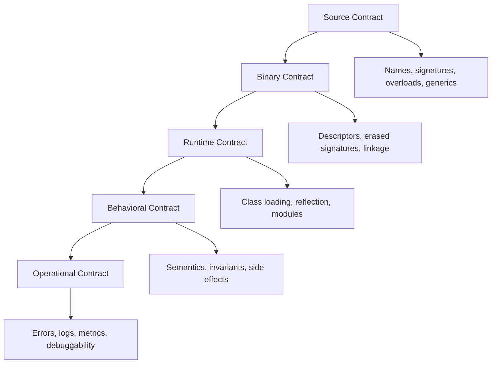
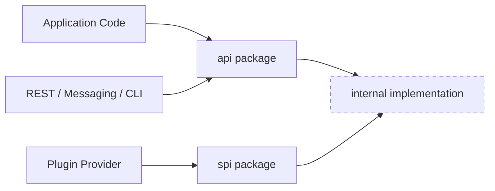

# Part 025 — API Design Principles for Java Libraries

## 0. Posisi Part Ini Dalam Seri

Kita sudah membahas package boundary, accessibility, API surface minimization, OOP, composition, functional interfaces, generics, wildcard, type erasure, dan generic failure modes.

Part ini menjawab pertanyaan yang lebih praktis:

> Bagaimana mendesain API Java yang enak dipakai, sulit disalahgunakan, stabil untuk berevolusi, dan cukup jelas untuk dipertanggungjawabkan di sistem enterprise?

Kita tidak sedang membuat class “rapi”. Kita sedang mendesain **kontrak publik** yang akan dipakai oleh manusia, compiler, framework, runtime, test suite, observability tooling, dan future maintainers.

Di level senior/staff/principal, API design bukan soal preferensi gaya. API design adalah trade-off antara:

- semantic clarity,
- type safety,
- runtime safety,
- compatibility,
- evolvability,
- operational diagnosability,
- migration cost,
- dan risiko misuse.

## 1. Kaufman Skill Deconstruction

Mengikuti pendekatan Josh Kaufman, skill “mendesain Java API” kita pecah menjadi beberapa sub-skill kecil yang bisa dilatih secara sadar.

| Sub-skill | Target kemampuan | Latihan efektif |
|---|---|---|
| Contract reading | Mampu membaca method signature sebagai kontrak | Review API JDK dan tulis ulang implied contract-nya |
| Surface minimization | Membedakan API, SPI, internal, helper | Refactor package publik menjadi public/internal/SPI |
| Naming precision | Memberi nama yang membawa semantic load | Bandingkan `get`, `find`, `load`, `resolve`, `require` |
| Type-driven design | Memindahkan constraint dari runtime ke compile-time | Ubah primitive/string obsession menjadi domain type |
| Nullability discipline | Mendesain policy null yang konsisten | Audit API: input nullable? output nullable? field nullable? |
| Error modeling | Memilih exception, return type, atau result abstraction | Desain ulang 5 method gagal dengan strategi berbeda |
| Evolution planning | Menilai dampak perubahan signature | Simulasikan v1 → v2 tanpa mematahkan binary compatibility |
| Misuse resistance | Membuat usage salah menjadi sulit | Buat staged builder atau constrained factory |

Tujuan 20 jam pertama bukan menjadi “API designer sempurna”, tetapi memiliki **mental model operasional** untuk membuat keputusan desain yang tajam.

## 2. Mental Model: API Adalah Sistem Kontrak Berlapis

Setiap API Java memiliki beberapa lapis kontrak.



A novice biasanya hanya melihat source contract:

```java
Receipt issue(Invoice invoice);
```

Engineer yang matang akan bertanya:

- Apakah `invoice` boleh `null`?
- Apakah `invoice` harus sudah validated?
- Apakah method ini idempotent?
- Apakah method ini memiliki side effect?
- Apakah method ini melakukan IO?
- Apakah method ini thread-safe?
- Apakah `Receipt` immutable?
- Exception apa yang mungkin muncul?
- Apakah method ini stabil sebagai public API?
- Apakah nama `issue` cukup jelas dibanding `issueReceipt`, `settle`, `authorize`, atau `post`?
- Kalau nanti perlu async, batch, atau audit metadata, apakah API ini bisa berevolusi?

API design adalah seni membuat jawaban atas pertanyaan tersebut terlihat dari **shape** API, dokumentasi, package structure, dan failure behavior.

## 3. Prinsip Utama: Public API Adalah Liability

Setiap public class/method/constructor/field adalah komitmen.

Semakin besar API surface:

- semakin banyak behavior yang harus dipertahankan,
- semakin besar compatibility matrix,
- semakin sulit refactor,
- semakin banyak test contract yang diperlukan,
- semakin tinggi risiko consumer bergantung pada detail yang tidak kita maksudkan.

Rule of thumb:

> Make the useful path obvious, the dangerous path explicit, and the impossible path unrepresentable.

Contoh buruk:

```java
public class PaymentService {
    public PaymentResult process(String accountId, BigDecimal amount, String currency, String mode, boolean dryRun) {
        // ...
    }
}
```

Masalah:

- `String` terlalu longgar.
- `BigDecimal` amount tanpa currency semantics.
- `mode` tidak terbatasi.
- `boolean dryRun` buruk untuk readability call site.
- Tidak jelas apakah method idempotent.
- Tidak jelas failure model.

Lebih baik:

```java
public interface PaymentProcessor {
    PaymentReceipt process(PaymentCommand command);
}

public record PaymentCommand(
        AccountId accountId,
        Money amount,
        PaymentMode mode,
        IdempotencyKey idempotencyKey
) {
    public PaymentCommand {
        Objects.requireNonNull(accountId, "accountId");
        Objects.requireNonNull(amount, "amount");
        Objects.requireNonNull(mode, "mode");
        Objects.requireNonNull(idempotencyKey, "idempotencyKey");
    }
}

public enum PaymentMode {
    AUTHORIZE_ONLY,
    AUTHORIZE_AND_CAPTURE
}
```

Peningkatan:

- Constraint domain masuk ke type system.
- API lebih mudah berevolusi karena parameter dikelompokkan.
- Call site lebih jelas.
- Invariant command bisa divalidasi di satu tempat.
- Idempotency menjadi bagian eksplisit dari kontrak.

## 4. Taxonomy: API, SPI, Internal, DSL, Adapter

Jangan campur semua public class dalam satu package tanpa niat desain.

| Kategori | Dipakai oleh | Stabilitas | Contoh |
|---|---|---|---|
| API | Application/client code | Sangat stabil | `PaymentProcessor`, `PaymentCommand` |
| SPI | Extension provider/plugin | Stabil tapi lebih teknis | `PaymentProvider`, `PaymentProviderFactory` |
| Internal | Implementasi sendiri | Tidak dijanjikan | `DefaultPaymentProcessor`, caches, parsers |
| DSL | Consumer-facing builder grammar | Stabil secara behavior | `PaymentRules.builder()` |
| Adapter | Boundary ke framework/protocol | Stabil lokal, bukan domain core | `PaymentController`, `PaymentMessageHandler` |

Struktur package yang sehat:

```text
com.acme.payments.api
com.acme.payments.spi
com.acme.payments.internal
com.acme.payments.internal.validation
com.acme.payments.adapter.rest
com.acme.payments.adapter.messaging
```

Dengan JPMS, boundary ini bisa ditegaskan:

```java
module com.acme.payments {
    exports com.acme.payments.api;
    exports com.acme.payments.spi;

    // internal packages are not exported
    requires java.base;
}
```

Mental model:



## 5. Naming: Nama Method Harus Membawa Semantics

Nama API bukan kosmetik. Nama adalah alat untuk mengurangi ambiguity.

### 5.1 `get`, `find`, `load`, `require`, `resolve`

| Prefix | Implied contract | Contoh |
|---|---|---|
| `get` | murah, tersedia, biasanya tidak gagal karena absence | `record.accountId()` atau `map.get(key)` |
| `find` | absence normal | `Optional<Customer> findById(CustomerId id)` |
| `load` | bisa mahal/IO, absence bisa error atau optional | `Customer load(CustomerId id)` |
| `require` | absence/null adalah programming/config error | `Customer requireCustomer(CustomerId id)` |
| `resolve` | ada proses translasi/lookup/rule | `Currency resolveCurrency(String code)` |
| `create` | membuat object baru, belum tentu persist | `OrderDraft createDraft(...)` |
| `register` | menambah ke registry/lifecycle | `void register(Handler handler)` |
| `submit` | menyerahkan pekerjaan, mungkin async | `JobId submit(JobCommand command)` |
| `execute` | menjalankan command/effect | `ExecutionResult execute(Command command)` |
| `validate` | memeriksa tanpa side effect besar | `ValidationResult validate(Command command)` |

Contoh misleading:

```java
Customer getCustomer(CustomerId id); // throws if not found, does IO, may lock DB
```

Lebih jujur:

```java
Optional<Customer> findCustomer(CustomerId id);
Customer requireCustomer(CustomerId id);
```

### 5.2 Hindari Nama Yang Terlalu Umum

Buruk:

```java
process(Data data);
handle(Request request);
doAction(Context context);
```

Lebih baik:

```java
authorize(PaymentAuthorization command);
settle(SettlementCommand command);
route(InboundMessage message);
validate(RegistrationDraft draft);
```

Nama yang baik memperkecil kebutuhan membaca implementasi.

## 6. Parameter Design

Parameter adalah bagian API yang paling sering menjadi sumber entropy.

### 6.1 Hindari Parameter List Panjang

Buruk:

```java
PolicyDecision evaluate(
        String userId,
        String action,
        String resourceType,
        String resourceId,
        Instant timestamp,
        Map<String, Object> attributes,
        boolean failOpen
);
```

Masalah:

- Call site sulit dibaca.
- Parameter mudah tertukar.
- Sulit berevolusi.
- Tidak ada local invariant.

Lebih baik:

```java
PolicyDecision evaluate(PolicyEvaluationRequest request);

public record PolicyEvaluationRequest(
        Subject subject,
        Action action,
        ResourceRef resource,
        Instant evaluatedAt,
        Map<String, AttributeValue> attributes,
        FailureMode failureMode
) {
    public PolicyEvaluationRequest {
        Objects.requireNonNull(subject, "subject");
        Objects.requireNonNull(action, "action");
        Objects.requireNonNull(resource, "resource");
        Objects.requireNonNull(evaluatedAt, "evaluatedAt");
        attributes = Map.copyOf(Objects.requireNonNull(attributes, "attributes"));
        Objects.requireNonNull(failureMode, "failureMode");
    }
}
```

### 6.2 Boolean Parameter Adalah Smell

Buruk:

```java
report.generate(true);
```

Apa arti `true`?

Lebih baik:

```java
report.generate(ReportMode.DRY_RUN);
report.generate(ReportMode.COMMIT);
```

Atau pisahkan method jika behavior benar-benar berbeda:

```java
report.preview();
report.publish();
```

### 6.3 `Map<String, Object>` Bukan API Contract Yang Kuat

`Map<String, Object>` kadang perlu di boundary dinamis, tetapi buruk untuk core API.

Buruk:

```java
Decision decide(Map<String, Object> input);
```

Lebih baik:

```java
Decision decide(DecisionRequest request);
```

Kalau memang extensibility diperlukan:

```java
public record DecisionRequest(
        Subject subject,
        ResourceRef resource,
        Map<AttributeKey<?>, Object> attributes
) {}
```

Atau buat value wrapper:

```java
public sealed interface AttributeValue permits StringAttribute, NumberAttribute, BooleanAttribute {}
```

## 7. Return Type Design

Return type bukan hanya “hasil”. Return type menyampaikan semantics.

| Return type | Arti desain |
|---|---|
| `T` | Hasil wajib ada atau method gagal |
| `Optional<T>` | Absence adalah kondisi normal |
| `List<T>` | Ordered collection, possibly empty |
| `Set<T>` | Unique collection, order tidak dijamin kecuali documented |
| `Map<K,V>` | Lookup/indexed relation |
| `boolean` | Predicate sederhana, detail failure tidak penting |
| `ValidationResult` | Ada multiple violation/detail |
| `Result<T,E>` custom | Failure adalah bagian domain, bukan exception |
| `void` | Side effect utama, hati-hati observability/testability |

### 7.1 Jangan Return `null` Untuk Absence Normal

Buruk:

```java
Customer findCustomer(CustomerId id); // returns null if not found
```

Lebih baik:

```java
Optional<Customer> findCustomer(CustomerId id);
```

Tetapi jangan overuse `Optional`:

- bagus untuk return value absence,
- kurang ideal untuk field entity,
- jarang perlu sebagai parameter,
- tidak cocok untuk collection absence; return empty collection.

```java
List<Order> findOrders(CustomerId customerId); // empty if none
```

### 7.2 Return Immutable/Snapshot View Jika Boundary Public

Buruk:

```java
public List<Rule> rules() {
    return rules;
}
```

Consumer bisa mutate internal state.

Lebih aman:

```java
public List<Rule> rules() {
    return List.copyOf(rules);
}
```

Atau simpan immutable sejak awal:

```java
public RuleSet(List<Rule> rules) {
    this.rules = List.copyOf(Objects.requireNonNull(rules, "rules"));
}
```

## 8. Nullability Policy

Java tidak punya nullability type system native seperti Kotlin. Jadi API designer harus membuat policy eksplisit.

Minimal policy:

1. Parameter public non-null by default.
2. Return value non-null by default.
3. Absence normal pakai `Optional<T>` atau empty collection.
4. Nullable hanya untuk interop/boundary yang jelas.
5. Null check dilakukan di boundary object creation atau public method.
6. Error message menyebut nama parameter.

Contoh:

```java
public final class RoutingRule {
    private final RuleId id;
    private final Predicate<Message> predicate;
    private final Handler handler;

    public RoutingRule(RuleId id, Predicate<Message> predicate, Handler handler) {
        this.id = Objects.requireNonNull(id, "id");
        this.predicate = Objects.requireNonNull(predicate, "predicate");
        this.handler = Objects.requireNonNull(handler, "handler");
    }
}
```

Jangan diam-diam menerima null lalu gagal jauh di bawah stack trace.

## 9. Mutability and Ownership

API harus menjawab: siapa pemilik object ini?

| Situation | Desain yang disarankan |
|---|---|
| Input collection disimpan | defensive copy |
| Output collection dari internal state | immutable copy/view |
| Large mutable object untuk performance | dokumentasikan ownership transfer |
| Configuration object | immutable setelah build |
| Runtime context | mutable hanya di boundary terbatas |

Buruk:

```java
public final class Pipeline {
    private final List<Step> steps;

    public Pipeline(List<Step> steps) {
        this.steps = steps;
    }
}
```

Consumer masih bisa mutate list setelah construction.

Lebih baik:

```java
public final class Pipeline {
    private final List<Step> steps;

    public Pipeline(List<Step> steps) {
        this.steps = List.copyOf(Objects.requireNonNull(steps, "steps"));
    }
}
```

## 10. Exception Design

Exception adalah bagian dari API.

### 10.1 Bedakan Programming Error, Domain Failure, Infrastructure Failure

| Failure | Contoh | Mekanisme umum |
|---|---|---|
| Programming error | null arg, invalid enum combination | `NullPointerException`, `IllegalArgumentException`, `IllegalStateException` |
| Domain failure | insufficient balance, invalid transition | domain exception atau result type |
| Infrastructure failure | timeout, unavailable dependency | checked/unchecked infra exception, retry policy |
| Absence normal | customer not found | `Optional<T>` atau empty collection |
| Validation errors | multiple invalid fields | `ValidationResult` |

Contoh:

```java
public PaymentReceipt capture(CaptureCommand command) {
    Objects.requireNonNull(command, "command");

    if (!command.amount().isPositive()) {
        throw new IllegalArgumentException("amount must be positive");
    }

    // Domain failure might be a typed exception or result depending API style.
}
```

### 10.2 Jangan Pakai Exception Untuk Control Flow Normal

Buruk:

```java
try {
    Customer customer = repository.get(id);
} catch (CustomerNotFoundException e) {
    // normal path
}
```

Lebih baik jika absence normal:

```java
Optional<Customer> customer = repository.find(id);
```

Tetapi jika caller **harus** menjamin keberadaan, exception valid:

```java
Customer customer = repository.require(id);
```

## 11. Generic API Design

Gunakan generics untuk memodelkan relationship antar type, bukan untuk terlihat fleksibel.

Bagus:

```java
public interface Converter<S, T> {
    T convert(S source);
}
```

Lebih fleksibel sebagai API method:

```java
public <R> List<R> map(Function<? super T, ? extends R> mapper) {
    Objects.requireNonNull(mapper, "mapper");
    // ...
}
```

Hati-hati dengan generic yang tidak membawa informasi:

```java
public <T> T execute(String command); // suspicious: dari mana T diketahui?
```

Lebih baik minta runtime evidence:

```java
public <T> T execute(Command command, Class<T> resultType);
```

Atau type token untuk generic nested:

```java
public <T> T decode(byte[] payload, TypeRef<T> type);
```

## 12. Overload Design

Overload membuat API nyaman, tetapi bisa memicu ambiguity dan compatibility trap.

Buruk:

```java
void send(String message);
void send(Object message);
void send(CharSequence message);
```

Ambiguity meningkat ketika `null`, lambda, method reference, dan generics masuk.

Lebih aman:

```java
void sendText(String message);
void sendObject(ObjectMessage message);
```

Gunakan overload jika:

- semantics sama,
- parameter jelas berbeda,
- tidak menyebabkan ambiguity dengan `null`, lambda, atau varargs,
- future overload tidak diperkirakan bentrok.

## 13. Builder, Factory, Constructor

Pilih creation API sesuai kompleksitas invariant.

| Creation style | Cocok untuk |
|---|---|
| Constructor | Object kecil, invariant sederhana |
| Static factory | Nama semantic, caching, subtype hiding, validation |
| Builder | Banyak optional parameter, staged construction |
| Staged builder | Urutan/required field harus compile-time safe |
| Parser/decoder | Input external/string/binary |

Contoh static factory:

```java
public final class EmailAddress {
    private final String value;

    private EmailAddress(String value) {
        this.value = value;
    }

    public static EmailAddress parse(String value) {
        Objects.requireNonNull(value, "value");
        if (!value.contains("@")) {
            throw new IllegalArgumentException("invalid email address");
        }
        return new EmailAddress(value);
    }

    public String value() {
        return value;
    }
}
```

Kenapa bukan public constructor?

- Factory name `parse` memberi semantic.
- Bisa return cached/canonicalized instance.
- Bisa menyembunyikan subtype.
- Bisa menambah overload tanpa mengubah constructor contract.

## 14. Documentation Contract

Javadoc bukan tempat menulis ulang implementasi. Javadoc menjelaskan kontrak yang tidak terlihat dari signature.

Minimal Javadoc untuk public API penting:

- purpose,
- parameter semantics,
- nullability,
- return semantics,
- exception condition,
- side effect,
- thread-safety,
- idempotency,
- ordering,
- performance expectation jika relevan,
- compatibility/migration note.

Contoh:

```java
/**
 * Evaluates a payment rule set against a normalized payment request.
 *
 * <p>This method is deterministic for the same rule set and request. It does not
 * perform I/O and does not mutate the supplied request.</p>
 *
 * @param request non-null normalized payment request
 * @return non-null decision containing the selected action and diagnostic reasons
 * @throws NullPointerException if {@code request} is null
 * @throws IllegalArgumentException if the request is not normalized
 */
PaymentDecision evaluate(PaymentRequest request);
```

## 15. API Design for Framework Compatibility

Frameworks sering menggunakan reflection, proxies, serialization, annotation processing, atau bytecode generation. API yang bagus untuk library biasa belum tentu bagus untuk framework boundary.

Pertimbangan:

- Apakah class perlu no-args constructor?
- Apakah method final menghalangi proxy?
- Apakah package dibuka via JPMS `opens`?
- Apakah annotation memiliki retention yang benar?
- Apakah record component names menjadi kontrak serialization?
- Apakah generic metadata cukup tersedia via reflection?
- Apakah class immutable tapi framework membutuhkan mutability?

Rule:

> Jangan membiarkan kebutuhan framework merusak domain API. Isolasi dengan adapter, DTO, mapper, atau module `opens` terbatas.

## 16. API Evolution Principles

API yang baik bukan hanya bagus hari ini. API harus bisa berubah.

### 16.1 Desain Untuk Extension Tanpa Membocorkan Internal

Buruk:

```java
public class DefaultPolicyEngine {
    public List<Rule> rules;
    public Cache cache;
}
```

Lebih baik:

```java
public interface PolicyEngine {
    PolicyDecision evaluate(PolicyRequest request);
}
```

Internal bebas berubah.

### 16.2 Hindari Return Concrete Implementation Jika Tidak Perlu

```java
ArrayList<Rule> rules(); // leaks implementation
```

Lebih baik:

```java
List<Rule> rules();
```

Atau lebih kuat:

```java
RuleSet rules();
```

### 16.3 Tambahkan, Jangan Ubah, Jika Sudah Public

Lebih aman:

```java
interface CustomerRepository {
    Optional<Customer> findById(CustomerId id);

    default Customer requireById(CustomerId id) {
        return findById(id).orElseThrow(() -> new NoSuchElementException("customer not found: " + id));
    }
}
```

Tetapi default method juga kontrak. Jangan menambah default method yang conflict dengan implementasi existing secara sembarangan.

## 17. Misuse Resistance

API bagus membuat misuse sulit.

### 17.1 Sebelum

```java
client.send(payload, true, false, 3000);
```

### 17.2 Sesudah

```java
client.send(SendRequest.builder()
        .payload(payload)
        .delivery(DeliveryMode.AT_LEAST_ONCE)
        .timeout(Duration.ofSeconds(3))
        .build());
```

### 17.3 Lebih Type-Safe Dengan Staged Builder

```java
public final class SendRequest {
    public interface PayloadStage {
        DeliveryStage payload(byte[] payload);
    }

    public interface DeliveryStage {
        OptionalStage delivery(DeliveryMode mode);
    }

    public interface OptionalStage {
        OptionalStage timeout(Duration timeout);
        SendRequest build();
    }
}
```

Trade-off:

- Staged builder meningkatkan correctness.
- Tetapi menambah complexity API.
- Cocok untuk command penting dengan required steps.
- Tidak perlu untuk object sederhana.

## 18. API Review Checklist

Sebelum menjadikan sesuatu public, tanyakan:

### 18.1 Contract

- Apakah purpose API jelas dari nama dan package?
- Apakah input constraint jelas?
- Apakah output semantics jelas?
- Apakah nullability jelas?
- Apakah side effect jelas?
- Apakah thread-safety/idempotency perlu didokumentasikan?

### 18.2 Type Safety

- Apakah ada primitive/string obsession?
- Apakah boolean parameter bisa diganti enum/method terpisah?
- Apakah `Map<String, Object>` bisa diganti type eksplisit?
- Apakah generics membawa relationship nyata?
- Apakah wildcard ditempatkan di API boundary, bukan internal noise?

### 18.3 Evolution

- Jika butuh field baru, apakah API bisa berkembang?
- Apakah return concrete implementation terlalu spesifik?
- Apakah overload future akan bentrok?
- Apakah binary compatibility aman?
- Apakah behavioral compatibility terdokumentasi?

### 18.4 Misuse Resistance

- Apakah invalid state bisa direpresentasikan?
- Apakah required parameter bisa lupa diisi?
- Apakah mutation ownership jelas?
- Apakah error message cukup diagnostik?
- Apakah caller bisa salah urutan method?

## 19. Worked Refactoring: From Anemic Utility API To Contract-Rich API

### 19.1 Starting Point

```java
public class ValidatorUtil {
    public static boolean validate(Map<String, Object> data, List<String> errors) {
        // ...
    }
}
```

Masalah:

- Utility class membocorkan procedural design.
- `Map<String, Object>` tidak punya schema.
- Caller menyediakan mutable `errors`.
- Return boolean menghilangkan detail.
- Tidak jelas validator apa yang dipakai.

### 19.2 Contract-Rich API

```java
public interface Validator<T> {
    ValidationResult validate(T value);

    default Validator<T> and(Validator<? super T> other) {
        Objects.requireNonNull(other, "other");
        return value -> this.validate(value).merge(other.validate(value));
    }
}

public record ValidationResult(List<Violation> violations) {
    public ValidationResult {
        violations = List.copyOf(Objects.requireNonNull(violations, "violations"));
    }

    public boolean isValid() {
        return violations.isEmpty();
    }

    public ValidationResult merge(ValidationResult other) {
        Objects.requireNonNull(other, "other");
        var merged = new ArrayList<Violation>(violations);
        merged.addAll(other.violations);
        return new ValidationResult(merged);
    }
}
```

Keuntungan:

- Typed input.
- Immutable result.
- Composable validator.
- Tidak ada out-parameter.
- Failure detail jelas.
- Bisa dites sebagai contract.

## 20. Practice Loop

Latihan 1 — API Shape Review:

Ambil 10 method public dari codebase Anda. Untuk masing-masing, tulis:

- purpose,
- input contract,
- output contract,
- nullability,
- failure model,
- side effect,
- evolution risk.

Latihan 2 — Boolean Parameter Removal:

Cari semua public method dengan boolean parameter. Refactor menjadi enum, method terpisah, atau command object.

Latihan 3 — Nullability Audit:

Cari method yang return `null` untuk absence normal. Ubah ke `Optional<T>` atau empty collection jika feasible.

Latihan 4 — Surface Minimization:

Pisahkan package menjadi `api`, `spi`, dan `internal`. Tandai class yang seharusnya tidak public.

Latihan 5 — Contract Javadoc:

Tulis Javadoc untuk 5 API paling penting. Fokus bukan deskripsi implementasi, melainkan kontrak.

## 21. Heuristics Ringkas

- Prefer domain type over primitive/string.
- Prefer command object over long parameter list.
- Prefer empty collection over null collection.
- Prefer `Optional<T>` only for normal absence return values.
- Prefer immutable boundary objects.
- Prefer semantic method names over generic verbs.
- Prefer narrow public API over convenient internal exposure.
- Prefer explicit side-effect boundary.
- Prefer result type for expected multi-error validation.
- Prefer exceptions for programming errors and exceptional failures.
- Prefer adding APIs over changing existing public signatures.
- Prefer composition-friendly interfaces.
- Prefer documented behavioral contract over implementation leakage.

## 22. What Top 1% Engineers Notice

Top-tier engineers tidak hanya bertanya “apakah API ini jalan?” Mereka bertanya:

- Apakah API ini masih masuk akal 3 tahun lagi?
- Apa yang mustahil diekspresikan oleh type system saat ini?
- Apa yang terlalu mudah disalahgunakan?
- Apa yang akan consumer copy-paste dari contoh kita?
- Bagaimana API ini gagal di production?
- Apakah error-nya actionable?
- Apakah framework bisa mengaksesnya tanpa membuka internal domain secara berlebihan?
- Apakah perubahan kecil akan mematahkan binary/source/behavioral compatibility?

API design adalah governance terhadap future complexity.

## 23. References

- Java SE 25 API Documentation — `java.util.Objects`, `Optional`, collections, exceptions.
- Java Language Specification SE 25 — Chapter 8, Chapter 9, Chapter 13.
- Java SE 25 `java.base` module documentation.
