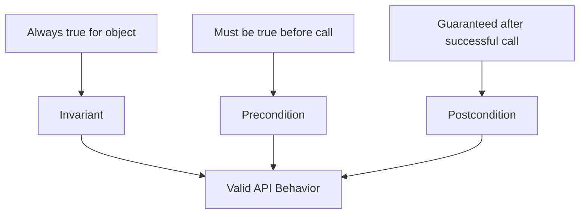
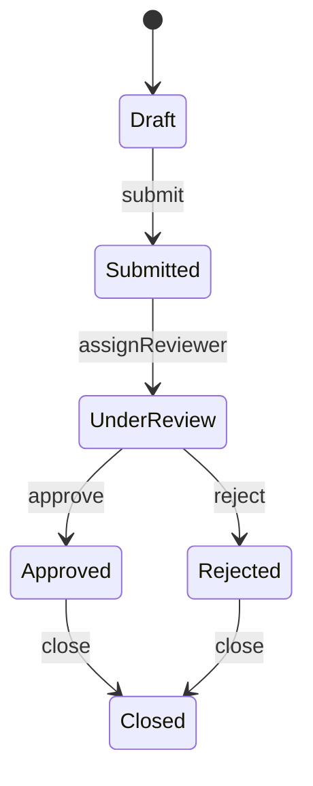
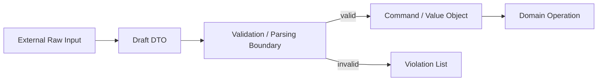

# Part 026 — API Invariants, Preconditions, and Postconditions

## 0. Posisi Part Ini Dalam Seri

Part 025 membahas prinsip desain API Java secara luas. Part ini memperdalam salah satu inti desain API enterprise:

> Bagaimana membuat API yang menjaga invariant, menolak input buruk di boundary yang benar, dan menghasilkan postcondition yang dapat dipercaya?

Di sistem serius, bug jarang muncul karena programmer tidak tahu syntax. Bug muncul karena:

- object berhasil dibuat dalam state tidak sah,
- method menerima input yang tidak memenuhi precondition,
- output tidak memenuhi promise,
- side effect terjadi sebagian,
- validation dilakukan terlalu terlambat,
- exception tidak menjelaskan pelanggaran kontrak,
- caller dan callee tidak sepakat soal responsibility.

API yang kuat membuat kontrak ini eksplisit.

## 1. Kaufman Skill Deconstruction

Untuk menguasai invariants/preconditions/postconditions, pecah skill menjadi sub-skill berikut.

| Sub-skill | Target kemampuan | Latihan |
|---|---|---|
| Invariant identification | Menemukan aturan yang selalu harus benar | Tulis invariant untuk setiap value object/domain object |
| Boundary placement | Menentukan validasi dilakukan di mana | Bandingkan constructor, factory, command validator, service boundary |
| Exception selection | Memilih exception sesuai jenis pelanggaran | Klasifikasikan 20 failure: programming/domain/infrastructure |
| Postcondition design | Menentukan apa yang dijamin setelah method sukses | Tulis postcondition untuk command/evaluator |
| State transition safety | Menolak illegal transition | Model state machine dengan sealed type/enum |
| Contract testing | Mengunci behavior API | Buat test untuk invariant, precondition, postcondition |

Skill ini sangat penting untuk regulatory systems, payment, case management, workflow engine, entitlement, lifecycle platform, dan domain lain yang membutuhkan defensibility.

## 2. Mental Model: Contract Triangle

Setiap operation punya tiga lapis kontrak.



### 2.1 Invariant

Invariant adalah kondisi yang **harus selalu benar** selama object dianggap valid.

Contoh:

- `Money.amount` tidak boleh negatif untuk payment capture.
- `DateRange.start <= DateRange.end`.
- `Case.status` harus salah satu status legal.
- `RuleSet.rules` tidak boleh kosong.
- `Percentage` harus 0..100.
- `EmailAddress.value` harus format valid.

### 2.2 Precondition

Precondition adalah kondisi yang harus benar **sebelum method dipanggil**.

Contoh:

- `command` non-null.
- `order` harus dalam status `AUTHORIZED` sebelum `capture`.
- `pageSize` harus 1..1000.
- `effectiveAt` tidak boleh sebelum `createdAt`.
- Caller harus sudah memegang lock/lifecycle token tertentu.

### 2.3 Postcondition

Postcondition adalah kondisi yang dijamin **setelah method sukses**.

Contoh:

- Jika `capture(command)` return sukses, receipt memiliki non-null id.
- Jika `register(handler)` sukses, handler tersedia di registry.
- Jika `validate(input)` return valid, violation list kosong.
- Jika `transition(case, APPROVE)` sukses, status case menjadi `APPROVED`.

## 3. Invariant Belongs To The Smallest Responsible Type

Tempat terbaik untuk invariant adalah type terkecil yang memiliki konteks cukup.

Buruk:

```java
public record DateRange(LocalDate start, LocalDate end) {}

public final class ReportService {
    public Report generate(DateRange range) {
        if (range.start().isAfter(range.end())) {
            throw new IllegalArgumentException("invalid range");
        }
        // ...
    }
}
```

Masalah:

- `DateRange` invalid bisa beredar ke seluruh sistem.
- Semua consumer harus ingat validasi.
- Bug muncul jauh dari source.

Lebih baik:

```java
public record DateRange(LocalDate start, LocalDate end) {
    public DateRange {
        Objects.requireNonNull(start, "start");
        Objects.requireNonNull(end, "end");
        if (start.isAfter(end)) {
            throw new IllegalArgumentException("start must not be after end");
        }
    }
}
```

Sekarang illegal state tidak bisa direpresentasikan melalui constructor publik record.

## 4. Constructor, Static Factory, Validator: Pilih Boundary Yang Tepat

Tidak semua validasi harus berada di constructor. Pilih boundary berdasarkan jenis aturan.

| Rule type | Contoh | Boundary ideal |
|---|---|---|
| Structural invariant | `start <= end`, non-null field | constructor/compact constructor |
| Parsing rule | string email harus valid | static factory `parse`/`of` |
| Cross-field command validity | `captureAmount <= authorizedAmount` | command constructor atau validator |
| External dependency rule | account exists in DB | service/application boundary |
| Authorization rule | user can perform action | policy/service boundary |
| Temporal business rule | deadline not passed | domain service with clock |
| Batch consistency | all entries same currency | aggregate/factory |

### 4.1 Structural Invariant Di Constructor

```java
public record Percentage(int value) {
    public Percentage {
        if (value < 0 || value > 100) {
            throw new IllegalArgumentException("value must be between 0 and 100");
        }
    }
}
```

### 4.2 Parsing Di Static Factory

```java
public final class AccountId {
    private final String value;

    private AccountId(String value) {
        this.value = value;
    }

    public static AccountId parse(String value) {
        Objects.requireNonNull(value, "value");
        if (!value.matches("ACC-[0-9]{8}")) {
            throw new IllegalArgumentException("account id must match ACC-########");
        }
        return new AccountId(value);
    }

    public String value() {
        return value;
    }
}
```

### 4.3 External Validation Bukan Constructor

Buruk:

```java
public AccountId(String value, AccountRepository repository) {
    if (!repository.exists(value)) {
        throw new IllegalArgumentException("account not found");
    }
}
```

Masalah:

- Value object menjadi tergantung IO.
- Constructor tidak deterministic.
- Testing dan caching jadi buruk.
- Invariant structural bercampur dengan existence rule.

Lebih baik:

```java
AccountId id = AccountId.parse(raw);
Account account = accountRepository.require(id);
```

## 5. Precondition: Caller Responsibility vs Callee Defense

Precondition bisa dianggap responsibility caller, tetapi public API tetap perlu defense.

Untuk public API:

```java
public Receipt capture(CaptureCommand command) {
    Objects.requireNonNull(command, "command");
    // ...
}
```

Untuk private/internal hot path, kadang validasi bisa dihindari jika sudah dijamin caller internal. Tetapi jangan mengorbankan boundary publik.

Rule:

> Validate at trust boundaries. Preserve invariants at construction boundaries. Avoid redundant validation inside deeply internal code unless failure would be catastrophic or unclear.

## 6. Exception Semantics Untuk Contract Violation

Exception yang dipilih harus menjelaskan jenis pelanggaran.

| Violation | Exception umum | Arti |
|---|---|---|
| Required argument null | `NullPointerException` via `Objects.requireNonNull` | Caller melanggar non-null precondition |
| Argument value invalid | `IllegalArgumentException` | Caller memberi value yang tidak diterima method |
| Receiver state invalid | `IllegalStateException` | Object belum/ tidak berada di state yang valid untuk operasi |
| Missing required value | `NoSuchElementException` | Elemen/value yang diminta tidak ada |
| Unsupported operation | `UnsupportedOperationException` | Operation tidak didukung oleh implementation |
| Index invalid | `IndexOutOfBoundsException` | Index di luar range |

Contoh:

```java
public void transitionTo(CaseStatus next) {
    Objects.requireNonNull(next, "next");

    if (!status.canTransitionTo(next)) {
        throw new IllegalStateException(
                "cannot transition case %s from %s to %s".formatted(id, status, next)
        );
    }

    this.status = next;
}
```

Kenapa `IllegalStateException`?

Karena `next` mungkin valid sebagai value, tetapi receiver object saat ini tidak berada pada state yang memperbolehkan transition tersebut.

## 7. Fail Fast vs Accumulate Errors

Ada dua model validasi:

### 7.1 Fail Fast

Cocok untuk programming error dan invariant internal.

```java
public UserProfile(UserId id, EmailAddress email) {
    this.id = Objects.requireNonNull(id, "id");
    this.email = Objects.requireNonNull(email, "email");
}
```

Keuntungan:

- Simpel.
- Stack trace dekat sumber pelanggaran.
- Cocok untuk bug programmer.

### 7.2 Accumulate Errors

Cocok untuk input user/API request/form/batch.

```java
public interface Validator<T> {
    ValidationResult validate(T value);
}

public record ValidationResult(List<Violation> violations) {
    public boolean isValid() {
        return violations.isEmpty();
    }
}
```

Keuntungan:

- User mendapat semua error sekaligus.
- Cocok untuk UX, API payload validation, batch import.
- Tidak memakai exception sebagai control flow normal.

Rule:

> Use fail-fast for programmer contract violations. Use accumulated validation for user/data contract violations.

## 8. Postcondition Design

API sering mendokumentasikan precondition tetapi lupa postcondition. Padahal postcondition menentukan apa yang boleh diasumsikan caller.

Contoh API tanpa postcondition jelas:

```java
void register(Handler handler);
```

Pertanyaan:

- Apakah handler langsung aktif?
- Apakah duplicate handler error?
- Apakah register idempotent?
- Apakah thread-safe?
- Apakah handler order dipertahankan?

Lebih jelas:

```java
/**
 * Registers the given handler if no handler with the same key exists.
 *
 * <p>After this method returns successfully, {@link #find(HandlerKey)} with the
 * handler key returns the registered handler. Registration order is preserved
 * during dispatch.</p>
 *
 * @throws NullPointerException if {@code handler} is null
 * @throws IllegalArgumentException if another handler with the same key exists
 */
void register(Handler handler);
```

Postcondition bukan hanya dokumentasi; ia harus dites.

```java
@Test
void registeredHandlerCanBeFoundByKey() {
    var registry = new HandlerRegistry();
    var handler = new TestHandler("payment.created");

    registry.register(handler);

    assertThat(registry.find(handler.key())).contains(handler);
}
```

## 9. State Machine Invariants

Banyak API enterprise sebenarnya state machine. Jangan sembunyikan state transition dalam boolean dan string.

Buruk:

```java
caseRecord.setStatus("APPROVED");
```

Lebih baik:

```java
caseRecord.approve(actor, reason, clock.instant());
```

Atau explicit transition API:

```java
caseRecord.transition(CaseTransition.approve(actor, reason));
```

Model:



Kode:

```java
public enum CaseStatus {
    DRAFT,
    SUBMITTED,
    UNDER_REVIEW,
    APPROVED,
    REJECTED,
    CLOSED;

    public boolean canTransitionTo(CaseStatus next) {
        return switch (this) {
            case DRAFT -> next == SUBMITTED;
            case SUBMITTED -> next == UNDER_REVIEW;
            case UNDER_REVIEW -> next == APPROVED || next == REJECTED;
            case APPROVED, REJECTED -> next == CLOSED;
            case CLOSED -> false;
        };
    }
}
```

Lalu enforce:

```java
public final class CaseRecord {
    private final CaseId id;
    private CaseStatus status;

    public void transitionTo(CaseStatus next) {
        Objects.requireNonNull(next, "next");
        if (!status.canTransitionTo(next)) {
            throw new IllegalStateException(
                    "illegal transition for case %s: %s -> %s".formatted(id, status, next));
        }
        status = next;
    }
}
```

## 10. Sealed Types Untuk State-Specific API

Enum bagus untuk banyak kasus. Tetapi jika setiap state punya data/behavior berbeda, sealed hierarchy lebih kuat.

```java
public sealed interface CaseState permits Draft, Submitted, UnderReview, Approved, Rejected, Closed {}

public record Draft(CaseId id) implements CaseState {}
public record Submitted(CaseId id, Instant submittedAt) implements CaseState {}
public record UnderReview(CaseId id, ReviewerId reviewerId) implements CaseState {}
public record Approved(CaseId id, DecisionId decisionId) implements CaseState {}
public record Rejected(CaseId id, DecisionId decisionId, String reason) implements CaseState {}
public record Closed(CaseId id, Instant closedAt) implements CaseState {}
```

Transition function:

```java
public CaseState assignReviewer(CaseState state, ReviewerId reviewerId) {
    Objects.requireNonNull(state, "state");
    Objects.requireNonNull(reviewerId, "reviewerId");

    return switch (state) {
        case Submitted submitted -> new UnderReview(submitted.id(), reviewerId);
        default -> throw new IllegalStateException("case must be submitted before reviewer assignment");
    };
}
```

Keuntungan:

- Data state-specific tidak nullable.
- Exhaustiveness lebih kuat.
- Illegal state lebih sulit direpresentasikan.
- Transition lebih eksplisit.

Trade-off:

- Bisa terasa verbose.
- Persistence/serialization membutuhkan desain tambahan.
- Cocok untuk domain yang state-nya kritis.

## 11. Defensive Copies As Invariant Preservation

Invariant collection sering rusak karena ownership tidak jelas.

Buruk:

```java
public final class RuleSet {
    private final List<Rule> rules;

    public RuleSet(List<Rule> rules) {
        if (rules.isEmpty()) {
            throw new IllegalArgumentException("rules must not be empty");
        }
        this.rules = rules;
    }
}
```

Caller bisa melakukan:

```java
List<Rule> rules = new ArrayList<>(List.of(rule));
RuleSet ruleSet = new RuleSet(rules);
rules.clear(); // invariant RuleSet rusak
```

Lebih baik:

```java
public final class RuleSet {
    private final List<Rule> rules;

    public RuleSet(List<Rule> rules) {
        Objects.requireNonNull(rules, "rules");
        if (rules.isEmpty()) {
            throw new IllegalArgumentException("rules must not be empty");
        }
        this.rules = List.copyOf(rules);
    }

    public List<Rule> rules() {
        return rules;
    }
}
```

`List.copyOf` juga menolak null element, sehingga itu bisa menjadi bagian dari invariant jika diinginkan.

## 12. Lazy Validation Is Usually A Trap

Buruk:

```java
public record PaymentCommand(AccountId accountId, Money amount) {}

public Receipt process(PaymentCommand command) {
    if (command.accountId() == null) ...
    if (command.amount() == null) ...
}
```

Ini membiarkan invalid command menyebar.

Lebih baik:

```java
public record PaymentCommand(AccountId accountId, Money amount) {
    public PaymentCommand {
        Objects.requireNonNull(accountId, "accountId");
        Objects.requireNonNull(amount, "amount");
        if (!amount.isPositive()) {
            throw new IllegalArgumentException("amount must be positive");
        }
    }
}
```

Lazy validation bisa diterima jika:

- input berasal dari external boundary dan perlu accumulate errors,
- object adalah raw draft/DTO yang memang belum valid,
- nama type menandakan belum valid, misalnya `PaymentDraft`, bukan `PaymentCommand`.

## 13. Draft vs Validated Command

Untuk sistem enterprise, sering perlu membedakan input mentah dan command valid.

```java
public record PaymentDraft(
        String accountId,
        String amount,
        String currency
) {}

public record PaymentCommand(
        AccountId accountId,
        Money amount
) {
    public PaymentCommand {
        Objects.requireNonNull(accountId, "accountId");
        Objects.requireNonNull(amount, "amount");
    }
}
```

Validation boundary:

```java
public final class PaymentCommandFactory {
    public ValidationResult<PaymentCommand> validate(PaymentDraft draft) {
        // parse, validate, accumulate violations
    }
}
```

Mental model:



Jangan beri nama `Command` pada object yang belum valid. Nama type harus merefleksikan contract maturity.

## 14. Preconditions In Higher-Order APIs

Jika API menerima function/lambda, contract menjadi dua arah:

- API memvalidasi function non-null.
- Caller menjamin function memenuhi expected behavior.
- API harus mendefinisikan kapan function dipanggil dan berapa kali.

Contoh:

```java
public <R> List<R> map(Function<? super T, ? extends R> mapper) {
    Objects.requireNonNull(mapper, "mapper");
    // mapper may be invoked once per element, in encounter order
}
```

Pertanyaan contract:

- Apakah mapper boleh return null?
- Apakah mapper boleh mutate element?
- Apakah mapper boleh throw exception?
- Apakah invocation order deterministic?
- Apakah parallel execution mungkin?

Javadoc harus menjawab jika penting.

## 15. Postconditions In Mutating APIs

Mutating API perlu postcondition kuat.

Buruk:

```java
void add(Rule rule);
```

Lebih jelas:

```java
/**
 * Adds the rule to the end of this rule set.
 *
 * <p>After successful return, {@link #rules()} contains the rule exactly once
 * at the last position.</p>
 *
 * @throws NullPointerException if {@code rule} is null
 * @throws IllegalArgumentException if a rule with the same id already exists
 */
void add(Rule rule);
```

Implementation:

```java
public void add(Rule rule) {
    Objects.requireNonNull(rule, "rule");
    if (containsId(rule.id())) {
        throw new IllegalArgumentException("duplicate rule id: " + rule.id());
    }
    rules.add(rule);
}
```

Contract test:

```java
@Test
void addPlacesRuleAtEnd() {
    var ruleSet = new MutableRuleSet();
    var first = rule("first");
    var second = rule("second");

    ruleSet.add(first);
    ruleSet.add(second);

    assertThat(ruleSet.rules()).containsExactly(first, second);
}
```

## 16. Idempotency As A Contract

Di distributed/enterprise systems, idempotency adalah API contract penting.

```java
Receipt submit(SubmitCommand command);
```

Tidak cukup. Pertanyaan:

- Jika command sama dikirim dua kali, hasilnya apa?
- Apakah duplicate menghasilkan receipt sama?
- Apakah duplicate error?
- Apakah idempotency key wajib?

Lebih baik:

```java
public record SubmitCommand(
        CaseId caseId,
        IdempotencyKey idempotencyKey,
        ActorId actorId
) {
    public SubmitCommand {
        Objects.requireNonNull(caseId, "caseId");
        Objects.requireNonNull(idempotencyKey, "idempotencyKey");
        Objects.requireNonNull(actorId, "actorId");
    }
}
```

Postcondition:

- For the same `idempotencyKey`, repeated successful calls return the same logical submission result.
- The case is submitted at most once.

Ini bukan detail implementasi. Ini kontrak business/operational.

## 17. Temporal Preconditions

Time membuat API mudah nondeterministic.

Buruk:

```java
boolean isExpired() {
    return Instant.now().isAfter(expiresAt);
}
```

Lebih baik:

```java
boolean isExpiredAt(Instant now) {
    Objects.requireNonNull(now, "now");
    return !now.isBefore(expiresAt);
}
```

Atau inject `Clock` di service boundary:

```java
public final class TokenService {
    private final Clock clock;

    public TokenService(Clock clock) {
        this.clock = Objects.requireNonNull(clock, "clock");
    }

    public boolean isExpired(Token token) {
        Objects.requireNonNull(token, "token");
        return token.isExpiredAt(clock.instant());
    }
}
```

Keuntungan:

- Test deterministic.
- Precondition waktu eksplisit.
- Tidak ada hidden dependency ke system clock.

## 18. Cross-Entity Invariants

Tidak semua invariant milik satu object.

Contoh:

- Total allocation across accounts must equal 100%.
- One active policy per customer.
- Case cannot be closed while tasks remain open.
- Shipment cannot be completed before payment settled.

Jangan memaksa cross-entity invariant ke value object kecil.

Gunakan aggregate/domain service/application service boundary:

```java
public final class CaseClosureService {
    public ClosedCase close(CaseRecord caseRecord, List<Task> openTasks, Actor actor) {
        Objects.requireNonNull(caseRecord, "caseRecord");
        Objects.requireNonNull(openTasks, "openTasks");
        Objects.requireNonNull(actor, "actor");

        if (!openTasks.isEmpty()) {
            throw new IllegalStateException("case cannot be closed while open tasks exist");
        }

        return caseRecord.close(actor);
    }
}
```

## 19. Contract Testing Strategy

Contract testing bukan hanya untuk HTTP/provider. Internal Java API juga perlu contract tests.

### 19.1 Invariant Tests

```java
@Test
void dateRangeRejectsStartAfterEnd() {
    assertThrows(IllegalArgumentException.class,
            () -> new DateRange(LocalDate.of(2026, 2, 1), LocalDate.of(2026, 1, 1)));
}
```

### 19.2 Null Contract Tests

```java
@Test
void constructorRejectsNullStart() {
    assertThrows(NullPointerException.class,
            () -> new DateRange(null, LocalDate.now()));
}
```

### 19.3 Postcondition Tests

```java
@Test
void successfulTransitionChangesStatus() {
    var c = CaseRecord.draft(new CaseId("C-1"));

    c.transitionTo(CaseStatus.SUBMITTED);

    assertEquals(CaseStatus.SUBMITTED, c.status());
}
```

### 19.4 Illegal Transition Tests

```java
@Test
void cannotCloseDraftCase() {
    var c = CaseRecord.draft(new CaseId("C-1"));

    assertThrows(IllegalStateException.class,
            () -> c.transitionTo(CaseStatus.CLOSED));
}
```

## 20. Error Message Design

Error message adalah bagian dari operational contract. Message harus membantu debugging tanpa membocorkan rahasia.

Buruk:

```java
throw new IllegalArgumentException("invalid input");
```

Lebih baik:

```java
throw new IllegalArgumentException("pageSize must be between 1 and 1000: " + pageSize);
```

Untuk domain identifiers, hati-hati PII/secret:

```java
throw new IllegalStateException("cannot approve case %s from status %s".formatted(caseId, status));
```

Hindari memasukkan token, password, raw payload sensitif.

## 21. Anti-Patterns

### 21.1 Invalid Object With `isValid()`

```java
public record EmailAddress(String value) {
    public boolean isValid() { ... }
}
```

Jika type bernama `EmailAddress`, object seharusnya sudah valid. Kalau belum valid, namai `EmailAddressDraft` atau `RawEmailAddress`.

### 21.2 Setters That Break Invariant

```java
range.setStart(afterEnd);
```

Prefer immutable value object atau mutator yang enforce invariant atomically:

```java
range = range.withStart(newStart); // returns validated new object
```

### 21.3 Partial Mutation Before Validation

Buruk:

```java
this.status = next;
if (!isValid()) {
    throw new IllegalStateException();
}
```

Validasi sebelum mutation, atau gunakan copy-then-commit pattern.

### 21.4 Validation Duplicated Everywhere

Jika validation logic tersebar di controller/service/repository, invariant tidak punya owner. Tarik ke value object, factory, validator, atau domain service yang tepat.

## 22. Design Checklist

Untuk setiap public API operation, tulis:

### Invariant

- Object ini tidak boleh berada dalam state apa?
- Field mana yang wajib non-null?
- Collection boleh kosong?
- Range numerik/temporal apa yang valid?
- Apakah ada cross-field rule?
- Apakah ada state transition rule?

### Precondition

- Apa yang caller harus siapkan?
- Apakah absence normal atau error?
- Apakah operation valid untuk semua receiver state?
- Apakah function/lambda argument punya contract khusus?
- Apakah time/clock/context harus eksplisit?

### Postcondition

- Jika method return sukses, apa yang pasti benar?
- Apakah state berubah?
- Apakah output immutable?
- Apakah side effect committed?
- Apakah operation idempotent?
- Apakah order preserved?

### Failure

- Programming error atau domain failure?
- Fail fast atau accumulate errors?
- Exception type tepat?
- Message actionable?
- Apakah failure meninggalkan object dalam state valid?

## 23. Worked Example: Regulatory Case Escalation API

### 23.1 Weak API

```java
void escalate(String caseId, String level, String reason, String userId);
```

Masalah:

- Semua primitive/string.
- Tidak jelas valid level.
- Tidak jelas actor authority.
- Tidak jelas state precondition.
- Tidak jelas postcondition.
- Tidak jelas idempotency/audit.

### 23.2 Contract-Rich API

```java
public record EscalationCommand(
        CaseId caseId,
        EscalationLevel targetLevel,
        EscalationReason reason,
        ActorId actorId,
        IdempotencyKey idempotencyKey,
        Instant requestedAt
) {
    public EscalationCommand {
        Objects.requireNonNull(caseId, "caseId");
        Objects.requireNonNull(targetLevel, "targetLevel");
        Objects.requireNonNull(reason, "reason");
        Objects.requireNonNull(actorId, "actorId");
        Objects.requireNonNull(idempotencyKey, "idempotencyKey");
        Objects.requireNonNull(requestedAt, "requestedAt");
    }
}

public interface CaseEscalationService {
    EscalationReceipt escalate(EscalationCommand command);
}
```

Javadoc contract:

```java
/**
 * Escalates a case to the requested target level.
 *
 * <p>Preconditions:</p>
 * <ul>
 *   <li>the case exists;</li>
 *   <li>the case is not closed;</li>
 *   <li>the actor is authorized to request the target level;</li>
 *   <li>the target level is higher than the current level.</li>
 * </ul>
 *
 * <p>Postconditions after successful return:</p>
 * <ul>
 *   <li>the case has the requested escalation level;</li>
 *   <li>an audit event has been recorded;</li>
 *   <li>the same idempotency key returns the same logical receipt.</li>
 * </ul>
 *
 * @throws NullPointerException if {@code command} is null
 * @throws CaseNotFoundException if the case does not exist
 * @throws UnauthorizedEscalationException if the actor lacks authority
 * @throws IllegalStateException if the case cannot be escalated from its current state
 */
EscalationReceipt escalate(EscalationCommand command);
```

Ini API yang bisa dipertanggungjawabkan dalam audit, testing, dan operational incident review.

## 24. Practice Loop

Latihan 1 — Invariant Harvesting:

Ambil 5 domain object. Untuk masing-masing, tulis 5 invariant. Pindahkan minimal 2 invariant ke constructor/factory.

Latihan 2 — Precondition Classification:

Ambil 10 exception di codebase. Klasifikasikan: programming error, domain failure, infrastructure failure, absence normal, validation error.

Latihan 3 — Postcondition Javadoc:

Ambil 5 method mutating. Tambahkan dokumentasi postcondition dan test-nya.

Latihan 4 — State Machine Refactor:

Ubah status string/boolean menjadi enum/sealed state dan enforce transition.

Latihan 5 — Draft/Command Split:

Pisahkan raw external DTO dari validated command di satu workflow.

## 25. Key Takeaways

- Invariant harus dimiliki oleh type terkecil yang bertanggung jawab.
- Public API harus fail fast untuk programming contract violation.
- Input user/data boundary sering butuh accumulated validation, bukan exception pertama.
- Precondition menentukan responsibility caller.
- Postcondition menentukan apa yang boleh diasumsikan caller setelah sukses.
- Exception type adalah bagian dari API semantics.
- Defensive copy menjaga invariant ownership.
- State transition harus diekspresikan sebagai domain operation, bukan setter bebas.
- Draft dan validated command harus dibedakan.
- Contract testing mengubah dokumentasi menjadi executable guarantee.

## 26. References

- Java SE 25 API Documentation — `java.util.Objects`, `NullPointerException`, `IllegalArgumentException`, `IllegalStateException`, `Optional`, collections.
- Java Language Specification SE 25 — class, record, enum, sealed type, exception, and binary compatibility rules.
- Java SE 25 `java.base` module documentation.
