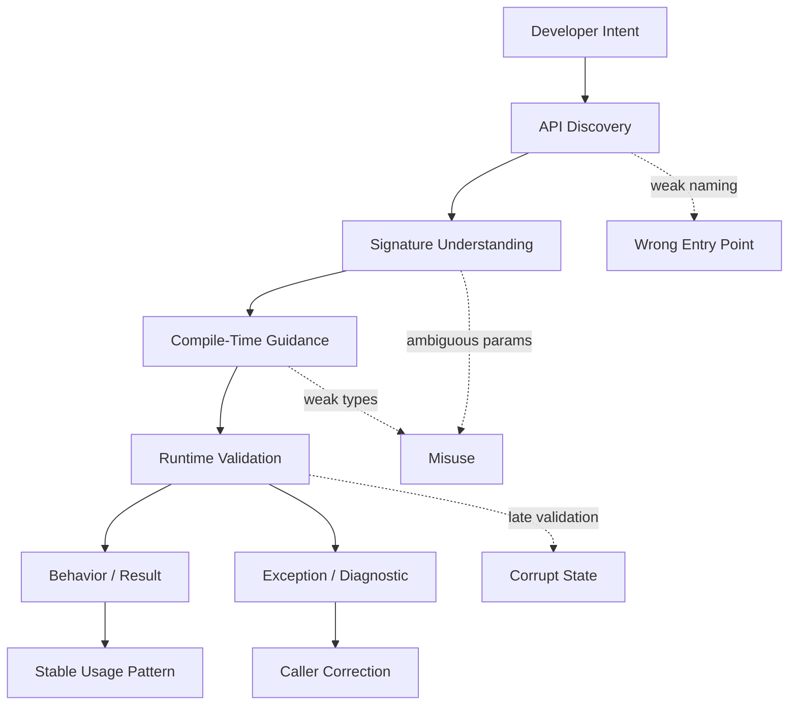
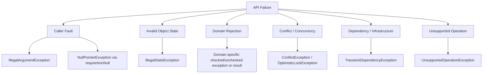

# Part 027 — API Usability, Error Design, and Misuse Resistance

## 0. Posisi Part Ini Dalam Seri

Part 025 membahas prinsip desain API Java. Part 026 membahas invariant, precondition, dan postcondition. Part ini menjawab pertanyaan berikut:

> Bagaimana mendesain API Java yang mudah ditemukan, mudah digunakan secara benar, sulit digunakan secara salah, dan ketika gagal memberikan error yang membantu?

Banyak engineer menganggap API design hanya soal nama method dan jumlah parameter. Itu terlalu dangkal. API adalah **user interface untuk programmer lain**. Programmer tidak hanya membaca dokumentasi; mereka membaca autocomplete, signature, type constraints, exception, log, test failure, dan compile error.

API yang bagus punya empat kualitas:

1. **Discoverable** — caller dapat menemukan entry point yang benar.
2. **Readable at call site** — kode pemanggil menjelaskan maksudnya.
3. **Misuse-resistant** — jalur salah dicegah oleh type system atau validation awal.
4. **Helpful on failure** — error menjelaskan apa yang rusak, di mana, dan bagaimana memperbaikinya.

Materi ini tidak mengulang seri error handling/reliability. Fokusnya adalah **error sebagai bagian dari desain API**, bukan observability production secara penuh.

---

## 1. Kaufman Skill Deconstruction

Mengikuti pendekatan Josh Kaufman, skill ini kita pecah menjadi sub-skill kecil yang bisa dilatih secara sadar.

| Sub-skill | Target kemampuan |
|---|---|
| Call-site reading | Bisa menilai API dari sudut pandang kode pemanggil, bukan hanya implementasi internal. |
| Error taxonomy | Bisa membedakan caller fault, invalid state, domain rejection, conflict, dependency failure, dan unsupported operation. |
| Misuse prevention | Bisa memindahkan kesalahan dari runtime ke compile-time ketika mungkin. |
| Signature design | Bisa memilih parameter, return type, overload, builder, factory, dan result model yang tepat. |
| Diagnostic writing | Bisa menulis exception message yang actionable tanpa membocorkan data sensitif. |
| Evolution awareness | Bisa membuat API nyaman hari ini tanpa mengunci evolusi besok. |

### 1.1 Target 20 Jam

Untuk part ini, target praktisnya:

- mengambil satu API internal yang sudah ada,
- menilai usability-nya dari call-site,
- mengidentifikasi misuse path,
- memperbaiki signature dan error semantics,
- menulis contract tests untuk penggunaan benar dan salah,
- membuat migration note kecil.

Hasil akhir bukan sekadar “lebih rapi”, tetapi API yang membuat kesalahan umum menjadi sulit.

---

## 2. Mental Model: API Sebagai Programmer UX

API adalah antarmuka manusia-mesin. Manusia di sini adalah developer lain.

Developer berinteraksi dengan API melalui:

- nama package,
- nama class,
- nama method,
- type parameter,
- parameter order,
- overload,
- return type,
- exception,
- Javadoc,
- IDE autocomplete,
- compile error,
- runtime error,
- stack trace,
- test failure.

API buruk membuat caller harus mengingat aturan tersembunyi. API baik membuat aturan itu muncul di signature.

### 2.1 Prinsip Inti

> Correct usage should be the shortest, clearest, and safest path.

Kalau jalur paling mudah adalah jalur salah, API design-nya gagal.

Contoh buruk:

```java
processor.process(data, true, false, 30, null);
```

Caller harus tahu arti `true`, `false`, `30`, dan `null`. Ini bukan API; ini teka-teki.

Contoh lebih baik:

```java
processor.process(
    data,
    ProcessingOptions.builder()
        .validationMode(ValidationMode.STRICT)
        .retryPolicy(RetryPolicy.fixedAttempts(3))
        .timeout(Duration.ofSeconds(30))
        .build()
);
```

Lebih panjang sedikit, tetapi jauh lebih jelas. API yang baik tidak selalu paling pendek. API yang baik membuat niat dan constraint terlihat.

---

## 3. Diagram Mental Model



API usability bukan urusan kosmetik. Ia menentukan apakah caller diarahkan ke path benar atau terseret ke failure mode.

---

## 4. Usability Layer 1: Discoverability

Discoverability menjawab:

> “Ketika developer butuh capability ini, apakah mereka bisa menemukan API yang benar tanpa membaca source internal?”

### 4.1 Package dan Class sebagai Peta

Package harus membantu navigasi.

Buruk:

```text
com.company.common
com.company.util
com.company.core
```

Terlalu generik. Developer tidak tahu mana API, mana internal, mana SPI.

Lebih baik:

```text
com.acme.rules.api
com.acme.rules.spi
com.acme.rules.internal
com.acme.rules.model
com.acme.rules.validation
```

Package ini mengkomunikasikan ownership:

- `api` untuk consumer-facing contract,
- `spi` untuk extension provider,
- `internal` untuk implementation detail,
- `model` untuk domain value,
- `validation` untuk policy atau validator.

### 4.2 Entry Point Harus Jelas

Library yang baik biasanya punya entry point yang jelas:

```java
RulesEngine engine = RulesEngine.builder()
    .register(new EligibilityRule())
    .register(new EscalationRule())
    .build();
```

Bukan:

```java
RuleManager manager = new RuleManagerImpl(
    new DefaultRuleContextFactory(),
    new RuleRuntimeConfig(),
    new ArrayList<>()
);
```

Jika caller harus mengetahui class internal untuk memulai, API boundary sudah bocor.

### 4.3 Naming Entry Point

Nama yang baik menjawab tiga hal:

1. object ini merepresentasikan apa,
2. siapa yang seharusnya menggunakannya,
3. apa lifecycle-nya.

Contoh:

| Nama | Masalah |
|---|---|
| `Processor` | Terlalu umum. Processor apa? |
| `Manager` | Biasanya vague dan menjadi god object. |
| `Helper` | Tidak menjelaskan domain ownership. |
| `RuleEvaluator` | Lebih jelas: mengevaluasi rule. |
| `CaseEscalationPolicy` | Lebih domain-specific. |
| `DecisionGraphCompiler` | Jelas: compile graph keputusan. |

---

## 5. Usability Layer 2: Call-Site Readability

API harus dinilai dari kode yang menggunakan API, bukan hanya dari implementasi.

### 5.1 Boolean Parameter Trap

Boolean parameter sering menyembunyikan arti.

Buruk:

```java
caseService.close(caseId, true);
```

Apa arti `true`?

- force close?
- notify parties?
- skip validation?
- archive after close?

Lebih baik:

```java
caseService.close(caseId, CloseMode.FORCE);
```

Atau:

```java
caseService.close(
    CloseCaseCommand.builder()
        .caseId(caseId)
        .mode(CloseMode.FORCE)
        .notifyParties(true)
        .reason(ClosureReason.DUPLICATE_REPORT)
        .build()
);
```

Boolean boleh dipakai jika method memang predicate atau setter sederhana:

```java
caseFile.setArchived(true);
```

Tetapi untuk operation publik yang punya konsekuensi domain, enum atau command object biasanya lebih baik.

### 5.2 Parameter Order Trap

Buruk:

```java
schedule(caseId, start, end, timezone, true, 3);
```

Mudah tertukar.

Lebih baik:

```java
schedule(
    ScheduleCaseReviewCommand.builder()
        .caseId(caseId)
        .window(TimeWindow.of(start, end, timezone))
        .sendNotification(true)
        .maxAttempts(3)
        .build()
);
```

Parameter order aman jika:

- jumlah parameter kecil,
- type berbeda jelas,
- tidak ada dua parameter dengan type sama dan makna berbeda,
- tidak ada primitive yang mewakili domain concept.

### 5.3 Primitive Obsession

Primitive type sering terlalu lemah untuk public API.

Buruk:

```java
Money calculate(String currency, BigDecimal amount);
void assign(String caseId, String officerId);
void expire(long seconds);
```

Lebih baik:

```java
Money calculate(CurrencyUnit currency, BigDecimal amount);
void assign(CaseId caseId, OfficerId officerId);
void expireAfter(Duration duration);
```

Domain-specific type mengurangi salah urutan dan membuat constraint lebih dekat ke data.

```java
public record CaseId(String value) {
    public CaseId {
        if (value == null || value.isBlank()) {
            throw new IllegalArgumentException("caseId must not be blank");
        }
    }
}
```

### 5.4 Null as Hidden Mode

Buruk:

```java
search(query, null);
```

Apakah `null` berarti default? no filter? all tenants? caller tidak tahu.

Lebih baik:

```java
search(query, SearchScope.defaultScope());
search(query, SearchScope.allTenants());
search(query, SearchScope.tenant(tenantId));
```

`null` sebagai mode adalah desain yang rapuh.

---

## 6. Usability Layer 3: Type System Guidance

Type system adalah dokumentasi yang diverifikasi compiler.

### 6.1 Encode State dengan Type

Buruk:

```java
class InvestigationCase {
    private String status;

    void approve() {
        if (!"UNDER_REVIEW".equals(status)) {
            throw new IllegalStateException("Cannot approve");
        }
        status = "APPROVED";
    }
}
```

Lebih baik untuk API tertentu:

```java
sealed interface CaseState permits DraftCase, UnderReviewCase, ApprovedCase {}

record DraftCase(CaseId id) implements CaseState {}
record UnderReviewCase(CaseId id, Reviewer reviewer) implements CaseState {}
record ApprovedCase(CaseId id, Approval approval) implements CaseState {}
```

Lalu operation menerima state yang valid:

```java
ApprovedCase approve(UnderReviewCase current, Approval approval) {
    return new ApprovedCase(current.id(), approval);
}
```

Sekarang caller tidak bisa approve `DraftCase` tanpa melalui transition yang benar.

### 6.2 Encode Capability dengan Interface

Alih-alih satu interface besar:

```java
interface CaseRepository {
    Case find(CaseId id);
    void save(Case c);
    void delete(CaseId id);
    List<Case> search(SearchQuery query);
    void rebuildIndex();
}
```

Pisahkan capability:

```java
interface CaseReader {
    Optional<Case> find(CaseId id);
}

interface CaseWriter {
    void save(Case c);
}

interface CaseIndexer {
    void rebuildIndex();
}
```

API caller menerima capability paling kecil yang diperlukan:

```java
final class CaseAssignmentService {
    private final CaseReader cases;
    private final CaseWriter writer;

    CaseAssignmentService(CaseReader cases, CaseWriter writer) {
        this.cases = Objects.requireNonNull(cases, "cases");
        this.writer = Objects.requireNonNull(writer, "writer");
    }
}
```

Ini mengurangi misuse dan memudahkan testing.

### 6.3 Encode Optionality Secara Eksplisit

Untuk return value yang mungkin tidak ada:

```java
Optional<Case> find(CaseId id);
```

Lebih jelas daripada:

```java
Case find(CaseId id); // returns null if not found?
```

Tetapi jangan overuse `Optional`:

- cocok untuk return value,
- tidak ideal untuk field entity,
- jarang ideal untuk parameter public API,
- tidak cocok untuk collection yang bisa kosong.

Untuk collection, prefer empty collection:

```java
List<Violation> violations(); // never null
```

Bukan:

```java
List<Violation> violations(); // null means none
```

---

## 7. Error Design Sebagai Bagian API

Error bukan afterthought. Error adalah bagian dari kontrak.

### 7.1 Taxonomy Error untuk API Java



### 7.2 Caller Fault

Caller fault berarti caller melanggar precondition method.

Contoh:

```java
public void assign(CaseId caseId, OfficerId officerId) {
    Objects.requireNonNull(caseId, "caseId");
    Objects.requireNonNull(officerId, "officerId");
    // ...
}
```

Untuk argument yang legal secara type tetapi invalid secara value:

```java
public ReviewWindow(Duration duration) {
    Objects.requireNonNull(duration, "duration");
    if (duration.isNegative() || duration.isZero()) {
        throw new IllegalArgumentException("duration must be positive");
    }
    this.duration = duration;
}
```

Gunakan `IllegalArgumentException` untuk illegal atau inappropriate argument. Gunakan `NullPointerException` untuk null yang tidak diizinkan; `Objects.requireNonNull` membuat policy ini konsisten.

### 7.3 Invalid State

`IllegalStateException` cocok ketika method dipanggil pada object yang tidak berada dalam state valid untuk operation itu.

```java
final class CaseWorkflow {
    private CaseStatus status;

    void approve(Approval approval) {
        Objects.requireNonNull(approval, "approval");
        if (status != CaseStatus.UNDER_REVIEW) {
            throw new IllegalStateException(
                "case must be UNDER_REVIEW before approval; currentStatus=" + status
            );
        }
        status = CaseStatus.APPROVED;
    }
}
```

Namun kalau invalid state bisa dimodelkan dengan type, lakukan itu. Exception adalah safety net, bukan pengganti desain state model.

### 7.4 Domain Rejection

Domain rejection bukan selalu programming bug.

Contoh:

- case tidak boleh ditutup karena masih ada active sanction,
- officer tidak punya authorization untuk region tersebut,
- threshold risk score belum terpenuhi,
- entity sedang dalam appeal window.

Untuk domain rejection, ada dua pendekatan:

#### Pendekatan Exception

```java
public void close(CaseId caseId, ClosureReason reason) {
    // throws CaseClosureRejectedException
}
```

Cocok jika rejection adalah exceptional untuk use case tersebut dan caller memang ingin control flow error.

#### Pendekatan Result

```java
public sealed interface CloseCaseResult {
    record Closed(CaseId caseId) implements CloseCaseResult {}
    record Rejected(CaseId caseId, List<Violation> violations) implements CloseCaseResult {}
}
```

Cocok jika rejection adalah outcome normal dari domain decision.

API enterprise sering lebih baik memakai result untuk validation/domain decision, dan exception untuk programmer error/infrastructure failure.

---

## 8. Diagnostic Message yang Baik

Exception message harus membantu caller memperbaiki masalah.

### 8.1 Formula Message

Message yang baik berisi:

1. nama field/parameter,
2. constraint yang dilanggar,
3. nilai aktual jika aman,
4. konteks operation,
5. action hint bila perlu.

Buruk:

```text
Invalid input
```

Lebih baik:

```text
reviewWindow must be positive; actual=PT0S
```

Lebih baik lagi untuk domain:

```text
case cannot be closed while sanctions are active; caseId=CASE-123, activeSanctions=2
```

Tetapi jangan bocorkan data sensitif:

```text
password must meet complexity requirements
```

Bukan:

```text
password 'abc123' is too weak
```

### 8.2 Hindari Message yang Menyalahkan Caller Secara Vague

Buruk:

```text
Bad request
```

Lebih baik:

```text
caseId must not be blank
```

Buruk:

```text
Validation failed
```

Lebih baik:

```text
3 validation errors: officerId is required; reviewWindow must be positive; reasonCode is unsupported
```

### 8.3 Error Code vs Exception Type

Untuk library internal Java murni, exception type sering cukup. Untuk boundary API lintas service, error code penting.

Di library Java:

```java
throw new InvalidRuleDefinitionException("duplicate rule id: " + ruleId);
```

Di platform/service contract:

```java
record ApiError(
    String code,
    String message,
    Map<String, Object> details
) {}
```

Jangan memaksa semua internal library punya error code jika tidak ada consumer contract yang memerlukannya. Tetapi untuk sistem regulatori/audit, error code sering berguna untuk traceability.

---

## 9. Make Illegal States Unrepresentable

Ini prinsip terkuat misuse resistance.

### 9.1 Constructor Harus Menjaga Invariant

Buruk:

```java
public class Penalty {
    private BigDecimal amount;
    private String currency;

    public Penalty() {}

    public void setAmount(BigDecimal amount) { this.amount = amount; }
    public void setCurrency(String currency) { this.currency = currency; }
}
```

Object bisa hidup dalam state invalid.

Lebih baik:

```java
public record Penalty(BigDecimal amount, Currency currency) {
    public Penalty {
        Objects.requireNonNull(amount, "amount");
        Objects.requireNonNull(currency, "currency");
        if (amount.signum() < 0) {
            throw new IllegalArgumentException("amount must not be negative");
        }
    }
}
```

Sekarang `Penalty` tidak bisa dibuat tanpa `amount` dan `currency`.

### 9.2 Static Factory untuk Intent

Constructor punya nama sama dengan class. Static factory bisa mengekspresikan intent.

```java
public final class ReviewDeadline {
    private final Instant value;

    private ReviewDeadline(Instant value) {
        this.value = Objects.requireNonNull(value, "value");
    }

    public static ReviewDeadline at(Instant instant) {
        return new ReviewDeadline(instant);
    }

    public static ReviewDeadline after(Duration duration, Clock clock) {
        Objects.requireNonNull(duration, "duration");
        Objects.requireNonNull(clock, "clock");
        if (duration.isNegative() || duration.isZero()) {
            throw new IllegalArgumentException("duration must be positive");
        }
        return new ReviewDeadline(clock.instant().plus(duration));
    }
}
```

Call-site menjadi jelas:

```java
ReviewDeadline.after(Duration.ofDays(7), clock);
```

### 9.3 Staged Builder untuk Required Fields

Builder biasa sering memindahkan validation ke `build()`. Staged builder bisa memaksa urutan minimal.

```java
public final class EscalationPolicy {
    private final RiskLevel riskLevel;
    private final Duration responseTime;
    private final OfficerGroup targetGroup;

    private EscalationPolicy(RiskLevel riskLevel, Duration responseTime, OfficerGroup targetGroup) {
        this.riskLevel = riskLevel;
        this.responseTime = responseTime;
        this.targetGroup = targetGroup;
    }

    public static RiskStep builder() {
        return riskLevel -> responseTime -> targetGroup -> new EscalationPolicy(
            Objects.requireNonNull(riskLevel, "riskLevel"),
            requirePositive(responseTime, "responseTime"),
            Objects.requireNonNull(targetGroup, "targetGroup")
        );
    }

    public interface RiskStep {
        ResponseTimeStep riskLevel(RiskLevel riskLevel);
    }

    public interface ResponseTimeStep {
        TargetGroupStep responseTime(Duration responseTime);
    }

    public interface TargetGroupStep {
        EscalationPolicy targetGroup(OfficerGroup targetGroup);
    }

    private static Duration requirePositive(Duration value, String name) {
        Objects.requireNonNull(value, name);
        if (value.isZero() || value.isNegative()) {
            throw new IllegalArgumentException(name + " must be positive");
        }
        return value;
    }
}
```

Call-site:

```java
EscalationPolicy policy = EscalationPolicy.builder()
    .riskLevel(RiskLevel.HIGH)
    .responseTime(Duration.ofHours(4))
    .targetGroup(OfficerGroup.SENIOR_REVIEWERS);
```

Trade-off:

- staged builder meningkatkan compile-time safety,
- tetapi menambah kompleksitas API,
- cocok untuk public API penting dengan required fields dan urutan logis,
- kurang cocok untuk object sederhana.

---

## 10. API Misuse Resistance Patterns

### 10.1 Narrow Interface

Berikan caller hanya kemampuan yang dibutuhkan.

```java
interface ClockReader {
    Instant now();
}
```

Lebih sempit daripada memberikan `Clock` jika caller tidak perlu zone.

### 10.2 Immutable Value

Prefer immutable value untuk data yang melewati boundary.

```java
public record RuleEvaluationRequest(
    CaseId caseId,
    RiskProfile riskProfile,
    Instant evaluatedAt
) {
    public RuleEvaluationRequest {
        Objects.requireNonNull(caseId, "caseId");
        Objects.requireNonNull(riskProfile, "riskProfile");
        Objects.requireNonNull(evaluatedAt, "evaluatedAt");
    }
}
```

Immutable request menghindari caller mengubah request setelah dikirim.

### 10.3 Defensive Copy

```java
public final class RuleSet {
    private final List<Rule> rules;

    public RuleSet(List<Rule> rules) {
        Objects.requireNonNull(rules, "rules");
        this.rules = List.copyOf(rules);
    }

    public List<Rule> rules() {
        return rules;
    }
}
```

`List.copyOf` juga menolak null element. Ini sering desirable untuk boundary value.

### 10.4 Explicit Defaults

Buruk:

```java
new RetryPolicy(0); // disabled? unlimited? default?
```

Lebih baik:

```java
RetryPolicy.disabled();
RetryPolicy.noRetry();
RetryPolicy.fixedAttempts(3);
RetryPolicy.exponentialBackoff(3, Duration.ofMillis(100));
```

Static factory membuat default dan mode terlihat.

### 10.5 Avoid Temporal Coupling

Buruk:

```java
var builder = new CaseBuilder();
builder.setCaseId(caseId);
builder.validate();
builder.calculateRisk();
Case c = builder.build();
```

Caller harus tahu urutan method.

Lebih baik:

```java
Case c = CaseDraft.withId(caseId)
    .withSubject(subject)
    .evaluateRisk(riskPolicy)
    .submit();
```

Atau lebih eksplisit:

```java
CaseDraft draft = CaseDraft.open(caseId, subject);
RiskAssessedCase assessed = riskPolicy.assess(draft);
SubmittedCase submitted = caseSubmission.submit(assessed);
```

Urutan lifecycle masuk ke type, bukan dokumentasi tersembunyi.

---

## 11. Return Type Design

Return type adalah kontrak outcome.

### 11.1 Void Operation

`void` cocok jika:

- operation selalu berhasil atau throw exception,
- tidak ada useful result,
- caller tidak perlu metadata.

```java
void archive(CaseId caseId);
```

Tetapi `void` buruk jika caller perlu tahu efek nyata:

```java
ArchiveResult archive(CaseId caseId);
```

```java
public record ArchiveResult(
    CaseId caseId,
    boolean alreadyArchived,
    Instant archivedAt
) {}
```

### 11.2 Optional

Gunakan `Optional<T>` untuk “mungkin tidak ada”.

```java
Optional<Case> find(CaseId id);
```

Jangan gunakan `Optional` untuk menjelaskan failure reason. Ini buruk:

```java
Optional<Decision> decide(Request request); // why empty?
```

Lebih baik:

```java
DecisionResult decide(Request request);
```

### 11.3 Sealed Result

Untuk domain outcome yang finite:

```java
public sealed interface AssignmentResult {
    record Assigned(CaseId caseId, OfficerId officerId) implements AssignmentResult {}
    record Rejected(CaseId caseId, List<Violation> violations) implements AssignmentResult {}
    record AlreadyAssigned(CaseId caseId, OfficerId currentOfficer) implements AssignmentResult {}
}
```

Caller dipaksa menangani setiap outcome:

```java
return switch (result) {
    case AssignmentResult.Assigned assigned -> "assigned";
    case AssignmentResult.Rejected rejected -> "rejected: " + rejected.violations();
    case AssignmentResult.AlreadyAssigned existing -> "already assigned";
};
```

### 11.4 Collection Return

Prefer empty collection, not null.

```java
List<Violation> validate(Request request); // empty means valid
```

Pastikan kontrak mutability jelas:

```java
/**
 * Returns an immutable list of validation violations.
 */
List<Violation> violations();
```

Kalau list mutable, jelaskan ownership.

---

## 12. Exception Type Design

### 12.1 Gunakan Standard Exception Jika Semantik Cocok

| Condition | Exception umum |
|---|---|
| null tidak diizinkan | `NullPointerException` via `Objects.requireNonNull` |
| argument invalid | `IllegalArgumentException` |
| object state tidak valid | `IllegalStateException` |
| index out of range | `IndexOutOfBoundsException` |
| key/element tidak ada saat wajib ada | `NoSuchElementException` |
| operation tidak didukung | `UnsupportedOperationException` |

Jangan membuat custom exception untuk setiap validasi kecil. Terlalu banyak exception type membuat API lebih sulit dipakai.

### 12.2 Buat Custom Exception Jika Ada Kontrak Domain

```java
public final class RuleCompilationException extends RuntimeException {
    private final List<RuleDiagnostic> diagnostics;

    public RuleCompilationException(List<RuleDiagnostic> diagnostics) {
        super("rule compilation failed with " + diagnostics.size() + " diagnostic(s)");
        this.diagnostics = List.copyOf(diagnostics);
    }

    public List<RuleDiagnostic> diagnostics() {
        return diagnostics;
    }
}
```

Custom exception berguna jika caller bisa melakukan hal spesifik berdasarkan exception itu.

Kalau caller hanya akan log dan fail, custom exception mungkin tidak menambah value.

### 12.3 Checked vs Unchecked

Untuk API modern Java internal/platform:

- unchecked cocok untuk programming error dan invariant violation,
- checked cocok jika caller secara realistis harus menangani kondisi itu dan recovery path jelas,
- result type sering lebih baik untuk expected domain rejection.

Contoh checked exception yang masuk akal:

```java
CompiledRules compile(RuleSource source) throws RuleSyntaxException;
```

Jika syntax error adalah expected outcome dari input user, result type mungkin lebih nyaman:

```java
RuleCompilationResult compile(RuleSource source);
```

---

## 13. Misuse Case Study: Rule Registration API

### 13.1 API Buruk

```java
public class RuleEngine {
    public void addRule(String id, Object rule, int order, boolean enabled) {
        // ...
    }

    public Object execute(Map<String, Object> input) {
        // ...
    }
}
```

Masalah:

- `String id` tidak divalidasi sebagai domain type,
- `Object rule` tidak punya contract,
- `int order` tidak menjelaskan range,
- `boolean enabled` ambiguous,
- `Map<String, Object>` membuat schema runtime-only,
- `Object execute` membuat caller cast manual,
- error akan muncul terlambat.

### 13.2 API Lebih Baik

```java
public interface Rule<I, O> {
    RuleId id();
    EvaluationResult<O> evaluate(I input);
}

public record RuleId(String value) {
    public RuleId {
        if (value == null || value.isBlank()) {
            throw new IllegalArgumentException("ruleId must not be blank");
        }
    }
}

public record RuleRegistration<I, O>(
    Rule<I, O> rule,
    RuleOrder order,
    RuleActivation activation
) {
    public RuleRegistration {
        Objects.requireNonNull(rule, "rule");
        Objects.requireNonNull(order, "order");
        Objects.requireNonNull(activation, "activation");
    }
}

public enum RuleActivation {
    ENABLED,
    DISABLED
}
```

Engine:

```java
public final class RuleEngine<I, O> {
    private final List<Rule<I, O>> rules;

    private RuleEngine(List<Rule<I, O>> rules) {
        this.rules = List.copyOf(rules);
    }

    public EvaluationReport<O> evaluate(I input) {
        Objects.requireNonNull(input, "input");
        // ...
    }

    public static <I, O> Builder<I, O> builder() {
        return new Builder<>();
    }

    public static final class Builder<I, O> {
        private final List<RuleRegistration<I, O>> registrations = new ArrayList<>();

        public Builder<I, O> register(RuleRegistration<I, O> registration) {
            registrations.add(Objects.requireNonNull(registration, "registration"));
            return this;
        }

        public RuleEngine<I, O> build() {
            validateNoDuplicateRuleIds(registrations);
            return new RuleEngine<>(registrations.stream()
                .filter(r -> r.activation() == RuleActivation.ENABLED)
                .sorted(Comparator.comparing(RuleRegistration::order))
                .map(RuleRegistration::rule)
                .toList());
        }
    }
}
```

Perbaikan:

- rule punya type contract,
- input/output generic,
- ID domain-specific,
- order dan activation eksplisit,
- duplicate validation terjadi di `build()`,
- result bukan `Object`,
- misuse lebih cepat terdeteksi.

---

## 14. Progressive Disclosure

API untuk sistem besar harus melayani dua user:

1. caller sederhana yang butuh default aman,
2. caller advanced yang butuh tuning.

Jangan memaksa semua caller melewati konfigurasi kompleks.

```java
RulesEngine engine = RulesEngine.createDefault();
```

Untuk advanced:

```java
RulesEngine engine = RulesEngine.builder()
    .clock(clock)
    .diagnostics(Diagnostics.verbose())
    .duplicatePolicy(DuplicateRulePolicy.reject())
    .executionMode(ExecutionMode.FAIL_FAST)
    .build();
```

Progressive disclosure berarti API sederhana tetap sederhana, tetapi complexity tersedia saat dibutuhkan.

---

## 15. Documentation as Contract, Not Decoration

Javadoc harus menjawab:

- apa precondition,
- apa postcondition,
- apakah null diizinkan,
- apakah result immutable,
- exception apa yang dilempar dan kapan,
- apakah method thread-safe atau tidak jika relevan,
- apakah operation idempotent,
- bagaimana ordering ditentukan,
- apakah side effect terjadi.

Contoh:

```java
/**
 * Evaluates all enabled rules against the given input.
 *
 * <p>The input must not be {@code null}. Rules are evaluated in ascending
 * {@link RuleOrder}. The returned report is immutable and contains one entry
 * per rule that was evaluated before termination.</p>
 *
 * @param input the input to evaluate; must not be {@code null}
 * @return immutable evaluation report
 * @throws NullPointerException if {@code input} is {@code null}
 * @throws RuleExecutionException if a rule throws an unexpected runtime exception
 */
public EvaluationReport<O> evaluate(I input) {
    // ...
}
```

Javadoc yang baik tidak menggantikan type system, tetapi melengkapi kontrak yang tidak bisa diekspresikan compiler.

---

## 16. API Usability Review Checklist

Gunakan checklist ini saat review API.

### 16.1 Discovery

- Apakah entry point jelas?
- Apakah package membedakan API, SPI, dan internal?
- Apakah nama class terlalu generik seperti `Manager`, `Helper`, `Util`?
- Apakah caller harus tahu implementation class?

### 16.2 Signature

- Apakah parameter boolean bisa diganti enum?
- Apakah primitive/string bisa diganti domain type?
- Apakah parameter order rawan tertukar?
- Apakah `null` dipakai sebagai mode tersembunyi?
- Apakah return type menjelaskan semua outcome penting?

### 16.3 Error

- Apakah exception type sesuai pelanggaran?
- Apakah message menyebut parameter/constraint?
- Apakah data sensitif tidak bocor?
- Apakah domain rejection memakai exception atau result secara konsisten?
- Apakah caller tahu recovery path?

### 16.4 Misuse Resistance

- Apakah invalid state bisa dicegah di constructor/factory?
- Apakah required fields dipaksa sebelum object dibuat?
- Apakah collection defensively copied?
- Apakah mutable internal state bocor?
- Apakah lifecycle order bisa dimodelkan dengan type?

### 16.5 Evolution

- Apakah API terlalu banyak expose implementation detail?
- Apakah overload baru nanti akan mengubah resolution?
- Apakah exception dan result model masih bisa berkembang?
- Apakah sealed hierarchy sengaja closed?
- Apakah public constructor membuat evolusi sulit?

---

## 17. Latihan Praktis

### Latihan 1 — Call-Site Audit

Ambil 5 method dari codebase Anda. Untuk setiap method, tulis call-site realistis.

Tandai:

- boolean trap,
- primitive obsession,
- null mode,
- ambiguous return,
- vague exception.

Refactor satu method menjadi API yang lebih jelas.

### Latihan 2 — Error Message Rewrite

Ambil 10 exception message dari codebase.

Klasifikasikan:

- vague,
- missing parameter name,
- missing actual value,
- unsafe because leaks sensitive data,
- not actionable.

Rewrite dengan formula:

```text
<field/parameter> <constraint>; actual=<safe-value>; context=<operation>
```

### Latihan 3 — Misuse Prevention

Ambil API yang saat ini melakukan validation terlambat.

Pindahkan minimal satu rule ke:

- constructor,
- static factory,
- domain type,
- builder `build()`, atau
- sealed result.

Tulis test yang menunjukkan misuse lama sekarang gagal lebih cepat.

### Latihan 4 — Result vs Exception Decision

Pilih satu operation domain.

Buat dua versi:

1. exception-based,
2. sealed-result-based.

Bandingkan call-site, test, dan ergonomics.

---

## 18. Common Pitfalls

### Pitfall 1 — Semua Error Jadi `RuntimeException`

```java
throw new RuntimeException("failed");
```

Ini miskin kontrak. Caller tidak bisa membedakan caller fault, domain rejection, atau dependency failure.

### Pitfall 2 — Custom Exception Berlebihan

Terlalu banyak exception type juga buruk.

```java
InvalidCaseIdException
InvalidOfficerIdException
InvalidDurationException
InvalidReasonException
```

Untuk precondition sederhana, `IllegalArgumentException` sering cukup.

### Pitfall 3 — Builder Tanpa Validation

Builder tidak otomatis membuat API aman.

```java
Request request = Request.builder().build();
```

Kalau required fields tidak divalidasi, builder hanya menyembunyikan invalid state.

### Pitfall 4 — Fluent API yang Menjadi Ambiguous

```java
query.with("status", "open").with("age", "30").run();
```

Fluent bukan berarti type-safe. DSL yang baik tetap punya grammar dan type.

### Pitfall 5 — Return `null` untuk Semua Keadaan

```java
Decision decision = evaluator.evaluate(input);
if (decision == null) { ... }
```

Tidak jelas apakah:

- tidak ada decision,
- input invalid,
- evaluator disabled,
- error disembunyikan.

Gunakan `Optional`, result type, atau exception sesuai semantik.

---

## 19. Internal Engineering Standard

Untuk API internal/platform yang serius, gunakan standar berikut.

1. **No ambiguous public boolean parameters** kecuali predicate/setter sederhana.
2. **No public null mode**. Gunakan explicit type/factory.
3. **No mutable collection leak**. Gunakan defensive copy atau immutable view yang jelas.
4. **No vague exception message** seperti `invalid`, `failed`, `error` tanpa context.
5. **No `Object` return** pada API typed kecuali memang reflection/dynamic boundary.
6. **No public API exposing internal implementation class**.
7. **No builder without validation**.
8. **No result ambiguity**. Outcome penting harus terlihat dari return type atau exception contract.
9. **No unchecked cast required by normal caller**.
10. **No lifecycle order hidden only in documentation** jika bisa dimodelkan dengan type.

---

## 20. Ringkasan

API usability dan misuse resistance bukan sekadar gaya penulisan. Ini adalah engineering control.

API yang baik:

- mudah ditemukan,
- mudah dibaca di call-site,
- membuat niat terlihat,
- memakai type system untuk mencegah kesalahan,
- memvalidasi boundary secara fail-fast,
- membedakan caller fault, invalid state, domain rejection, dan infrastructure failure,
- memberi diagnostic yang actionable,
- menjaga evolusi jangka panjang.

Mental model utama:

> API design yang kuat memindahkan sebanyak mungkin kesalahan dari production runtime ke compile-time, construction-time, atau test-time.

Part berikutnya membahas compatibility lebih formal: binary, source, dan behavioral compatibility.

---

## 21. Referensi

- Java SE 25 API — `java.util.Objects`
- Java SE 25 API — `java.lang.IllegalArgumentException`
- Java Language Specification SE 25
- Effective Java design principles, terutama item tentang static factory, builder, immutability, exceptions, dan method design
