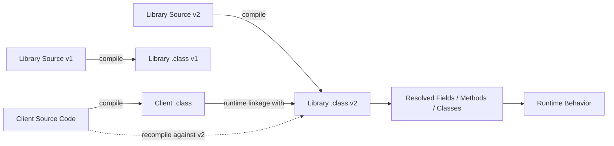

# Part 028 — Binary, Source, and Behavioral Compatibility

## 0. Posisi Part Ini Dalam Seri

Part 025 sampai 027 membahas desain public API dari sisi prinsip, invariant, usability, error, dan misuse resistance. Part ini membahas pertanyaan yang lebih keras:

> Setelah API dipakai banyak client, perubahan apa yang aman, perubahan apa yang mematahkan compile, perubahan apa yang mematahkan runtime, dan perubahan apa yang tampak aman tetapi merusak behavior?

Di Java, compatibility bukan satu dimensi. Minimal ada tiga dimensi utama:

1. **Source compatibility** — source client lama masih bisa dikompilasi ulang.
2. **Binary compatibility** — binary client lama masih bisa berjalan tanpa recompile.
3. **Behavioral compatibility** — client masih mendapat semantic behavior yang dijanjikan.

Banyak engineer hanya mengecek source compatibility. Itu belum cukup. Library/platform Java sering dipakai sebagai binary dependency. Client mungkin tidak dikompilasi ulang saat library diganti. Maka binary compatibility menjadi sangat penting.

JLS Chapter 13 mendefinisikan aturan minimum binary compatibility. Namun JLS tidak menjamin behavioral compatibility. Itu tanggung jawab desain API.

---

## 1. Mental Model: Source, Binary, Runtime, Behavior



Pertanyaan compatibility berbeda tergantung path:

- Source compatibility: apakah `A` bisa compile terhadap `E/F`?
- Binary compatibility: apakah `B` bisa berjalan dengan `F` tanpa recompile?
- Behavioral compatibility: apakah `H` masih memenuhi promise lama?

Perubahan bisa source-compatible tetapi binary-incompatible. Bisa binary-compatible tetapi source-incompatible. Bisa keduanya compatible tetapi behavior berubah dan production rusak.

---

## 2. Compatibility Vocabulary

### 2.1 Source Compatibility

Source compatibility berarti source code client lama masih valid jika dikompilasi ulang terhadap versi library baru.

Contoh source break:

```java
// v1
void process(String input);

// v2
void process(CharSequence input);
```

Secara desain mungkin terlihat lebih general, tetapi client tertentu bisa terdampak overload resolution jika ada overload lain.

### 2.2 Binary Compatibility

Binary compatibility berarti `.class` client lama masih bisa link dan run dengan `.class` library baru.

Contoh binary break:

```java
// v1
public String name() { return name; }

// v2
public CharSequence name() { return name; }
```

Return type di descriptor method berubah. Client lama yang mencari `name()Ljava/lang/String;` bisa gagal linkage.

### 2.3 Behavioral Compatibility

Behavioral compatibility berarti behavior observable tetap sesuai kontrak lama.

Contoh:

```java
// v1: returns empty list when no violations
List<Violation> validate(Request request);

// v2: returns null when no violations
```

Mungkin binary-compatible, tetapi behavior break.

### 2.4 Reflective Compatibility

Framework sering tidak hanya memanggil method secara statis. Mereka membaca:

- constructor,
- annotation,
- generic metadata,
- parameter name,
- field,
- record component,
- method visibility,
- module openness.

Perubahan yang aman untuk normal Java caller bisa mematahkan reflective caller.

### 2.5 Serialization Compatibility

Jika type publik mengimplementasikan `Serializable`, bentuk binary serialized menjadi kontrak tambahan. Seri ini tidak mendalami serialization penuh, tetapi prinsipnya penting:

> Begitu object bisa diserialisasi lintas versi, field shape dan `serialVersionUID` menjadi bagian compatibility surface.

---

## 3. JLS Binary Compatibility: Apa yang Dijamin dan Tidak

JLS Chapter 13 membahas binary compatibility antar release. Intinya, beberapa perubahan pada class/interface/package/module dianggap tidak mematahkan binary existing client, tetapi banyak perubahan lain dapat menghasilkan linkage error.

Contoh error runtime yang terkait compatibility:

| Error | Makna umum |
|---|---|
| `NoSuchMethodError` | Binary client mencari method descriptor yang tidak ada. |
| `NoSuchFieldError` | Binary client mencari field yang tidak ada. |
| `IllegalAccessError` | Member/class ada tetapi aksesnya tidak lagi valid. |
| `IncompatibleClassChangeError` | Binary shape berubah secara incompatible, misalnya class/interface expectation berubah. |
| `AbstractMethodError` | Runtime dispatch menemukan abstract method yang tidak punya implementation sesuai expectation. |
| `NoClassDefFoundError` | Class yang diperlukan binary tidak tersedia saat runtime. |

Source compiler tidak selalu melihat masalah ini jika client tidak dikompilasi ulang. Karena itu library evolution butuh binary compatibility check.

---

## 4. Tabel Perubahan API: Aman, Berisiko, Berbahaya

Tabel ini bukan pengganti JLS. Ini heuristic praktis untuk desain API.

| Perubahan | Source | Binary | Behavioral | Catatan |
|---|---:|---:|---:|---|
| Menambah method baru pada class | Biasanya aman | Biasanya aman | Bisa break jika subclass punya method konflik | Hati-hati overload dan inheritance. |
| Menghapus public method | Break | Break | Break | Jangan lakukan tanpa major version/migration. |
| Mengubah nama method | Break | Break | Break | Sama seperti remove + add. |
| Mengubah parameter type | Break | Break | Bisa break | Descriptor berubah. |
| Mengubah return type | Sering break | Sering break | Bisa break | Covariant return punya aturan khusus; tetap hati-hati. |
| Menambah overload | Bisa break | Biasanya aman | Bisa break | Source overload resolution bisa berubah saat recompile. |
| Menghapus overload | Break untuk source yang pakai | Break untuk binary yang pakai | Break | Deprecate dulu. |
| Menambah checked exception | Break source | Binary biasanya tidak peduli | Break semantic | Source caller harus handle. |
| Menambah unchecked exception | Source aman | Binary aman | Behavioral risk | Dokumentasikan jika observable. |
| Mengubah exception type | Source bisa aman | Binary bisa aman | Behavioral risk | Caller mungkin catch spesifik. |
| Widen access | Aman | Aman | Biasanya aman | `protected` ke `public` umumnya aman. |
| Narrow access | Break | Break | Break | Dapat `IllegalAccessError`. |
| Membuat class `final` | Break source subclass | Bisa break runtime subclass | Break extension | Jangan pada extensible API. |
| Menghapus `final` | Biasanya aman | Biasanya aman | Behavioral risk | Bisa membuka extension yang tidak dirancang. |
| Menambah abstract method ke abstract class | Break subclass | Bisa break | Break | Subclass lama tidak implement. |
| Menambah default method ke interface | Biasanya aman | Biasanya aman | Bisa break | Konflik multiple inheritance/default. |
| Menambah abstract method ke interface | Break implementor | Bisa break | Break | Implementor lama tidak punya method. |
| Menambah enum constant | Source biasanya aman | Binary biasanya aman | Behavioral risk | Switch exhaustive lama bisa punya default buruk. |
| Menghapus enum constant | Break | Break/behavioral | Break | Serialized/name-based usage juga break. |
| Menambah record component | Break canonical constructor/callers | Break reflective/serialization | Break | Record shape adalah API. |
| Mengubah sealed permits | Bisa break | Bisa break | Break modeling | Exhaustiveness dan subclassing terdampak. |
| Mengubah package/module exports | Bisa break | Bisa break | Break | JPMS access/linking affected. |

---

## 5. Source Compatibility Traps

### 5.1 Overload Resolution Trap

Menambah overload terlihat aman, tetapi bisa mengubah source behavior saat recompile.

Versi 1:

```java
void log(Object value) {
    System.out.println("object");
}
```

Client:

```java
log("case");
```

Versi 2:

```java
void log(Object value) {
    System.out.println("object");
}

void log(String value) {
    System.out.println("string");
}
```

Client yang dikompilasi ulang sekarang memilih `log(String)`. Binary lama mungkin tetap memanggil descriptor lama `log(Object)` sampai recompile.

Ini menghasilkan behavior berbeda antara recompiled client dan old binary client.

### 5.2 Null Overload Ambiguity

```java
void search(String query) {}
void search(Predicate<Case> filter) {}

search(null); // ambiguous
```

Overload baru bisa membuat source lama gagal compile jika source memakai `null` literal.

### 5.3 Generic Type Inference Trap

Perubahan signature generic bisa mengubah inference.

```java
// v1
static <T> List<T> copy(Collection<T> source)

// v2
static <T> List<T> copy(Iterable<? extends T> source)
```

Terlihat lebih fleksibel, tetapi call-site tertentu bisa mengalami inference berbeda, terutama dengan method chain dan overloaded context.

### 5.4 Static Import Collision

Menambah public static method atau constant bisa memicu ambiguity pada client yang memakai static import wildcard.

```java
import static com.acme.rules.RulePredicates.*;
import static com.acme.common.Predicates.*;
```

Jika dua library kemudian punya nama method sama, source bisa gagal compile.

### 5.5 Nested Type dan Import

Mengubah nested type menjadi top-level type atau sebaliknya mematahkan import/source references.

```java
RuleEngine.Diagnostic
```

Jika diubah menjadi:

```java
RuleDiagnostic
```

Itu bukan rename kecil; itu public API break.

---

## 6. Binary Compatibility Traps

### 6.1 Method Descriptor Berubah

JVM linkage memakai nama dan descriptor.

```java
// v1
public void submit(CaseId id) {}

// v2
public void submit(Object id) {}
```

Meskipun `CaseId` adalah `Object`, descriptor method berubah:

```text
submit(Lcom/acme/CaseId;)V
submit(Ljava/lang/Object;)V
```

Binary client lama mencari descriptor lama.

### 6.2 Return Type Berubah

```java
// v1
public ArrayList<Case> cases()

// v2
public List<Case> cases()
```

Secara API design, return `List` lebih baik. Tetapi mengubah dari `ArrayList` ke `List` setelah release bisa binary break karena descriptor berubah.

Pelajaran:

> Pilih abstraction return type sejak v1. Jangan expose concrete type jika tidak ingin menguncinya.

### 6.3 Field to Method Migration

```java
// v1
public final String name;

// v2
public String name() { return name; }
```

Ini binary break. Field access dan method invocation berbeda di bytecode.

Hindari public field pada API stabil kecuali constant yang benar-benar dimaksudkan sebagai constant.

### 6.4 Constant Inlining Trap

`public static final` primitive/String compile-time constants bisa di-inline ke client.

```java
public static final int DEFAULT_LIMIT = 100;
```

Jika library mengubah menjadi `200`, client lama yang tidak recompile mungkin masih membawa `100` di bytecode.

Untuk configuration yang bisa berubah, jangan expose compile-time constant.

Alternatif:

```java
public static int defaultLimit() {
    return 100;
}
```

### 6.5 Class vs Interface Change

Mengubah class menjadi interface atau interface menjadi class adalah binary incompatible.

```java
// v1
public abstract class Rule {}

// v2
public interface Rule {}
```

Bytecode instruction dan inheritance model berbeda.

### 6.6 Static vs Instance Change

```java
// v1
public static Rule parse(String source)

// v2
public Rule parse(String source)
```

Binary client lama memakai `invokestatic`, v2 butuh `invokevirtual`. Break.

### 6.7 Package Move

Memindahkan class ke package lain adalah rename binary.

```java
com.acme.rules.RuleEngine
```

ke:

```java
com.acme.engine.RuleEngine
```

Untuk client, class lama hilang. Sediakan adapter/deprecated forwarding type jika perlu migration.

---

## 7. Behavioral Compatibility: Yang Tidak Dijamin Compiler

Behavioral compatibility adalah area paling berbahaya karena tidak terlihat dari signature.

### 7.1 Nullability Behavior

```java
// v1
find(id) returns Optional.empty() if missing

// v2
find(id) throws NoSuchElementException if missing
```

Binary compatible, behavior break.

### 7.2 Ordering Behavior

```java
// v1
violations returned in declaration order

// v2
violations returned in hash order
```

Jika caller/test mengandalkan ordering, behavior break. Jika ordering tidak dijamin, dokumentasikan sejak awal.

### 7.3 Mutability Behavior

```java
// v1
rules() returns mutable list

// v2
rules() returns immutable list
```

Signature sama, behavior break untuk caller yang mutate.

Sebaliknya juga break:

```java
// v1 immutable snapshot
// v2 live mutable internal list
```

Ini lebih buruk karena membuka state corruption.

### 7.4 Exception Behavior

```java
// v1
validate(null) throws NullPointerException

// v2
validate(null) returns ValidationResult.invalid(...)
```

Mungkin terlihat lebih friendly, tetapi caller yang mengandalkan fail-fast akan berubah.

### 7.5 Timing dan Side Effect

```java
// v1
close(caseId) writes audit event before returning

// v2
close(caseId) queues audit event asynchronously
```

Signature sama. Behavior untuk compliance/audit bisa berubah signifikan.

### 7.6 Idempotency

```java
// v1
archive(caseId) is idempotent

// v2
archive(caseId) throws if already archived
```

Behavior break. Idempotency adalah API contract.

---

## 8. Generics dan Erasure Compatibility

Generics membuat compatibility lebih tricky karena public source signature dan erased binary signature tidak selalu sama.

### 8.1 Erased Signature Collision

```java
void process(List<String> values) {}
void process(List<Integer> values) {} // illegal: same erasure
```

Kedua method erase menjadi:

```text
process(Ljava/util/List;)V
```

### 8.2 Changing Generic Bound

```java
// v1
class Registry<T> {}

// v2
class Registry<T extends Rule> {}
```

Ini bisa source break untuk client yang memakai `Registry<String>`. Binary effects juga perlu dicek karena erasure of type variable bisa berubah jika leftmost bound berubah.

### 8.3 Return Generic Narrowing

```java
// v1
List<Rule> rules()

// v2
List<? extends Rule> rules()
```

Binary descriptor sama karena erasure `List`, tetapi source caller bisa break jika sebelumnya menambahkan ke list.

### 8.4 Raw Type Legacy

Jika API publik pernah menerima raw type:

```java
void register(List rules)
```

Mengubah ke generic:

```java
void register(List<Rule> rules)
```

Erasure sama, binary bisa aman, tetapi source warnings/behavior dan overload interaction perlu diperiksa.

### 8.5 Bridge Methods

Compiler bisa menghasilkan bridge method untuk menjaga polymorphism setelah erasure.

Contoh:

```java
interface Handler<T> {
    void handle(T value);
}

final class CaseHandler implements Handler<Case> {
    public void handle(Case value) {}
}
```

Karena erasure, runtime membutuhkan method yang compatible dengan `handle(Object)`. Compiler dapat menambahkan bridge method. Mengubah generic hierarchy bisa mengubah bridge method shape dan berdampak ke binary/framework reflection.

---

## 9. Interface Evolution

Interface sangat sensitif karena banyak implementor eksternal.

### 9.1 Menambah Abstract Method

```java
public interface Rule {
    RuleId id();

    // v2
    RuleMetadata metadata();
}
```

Semua implementor lama tidak punya method baru. Ini break.

### 9.2 Menambah Default Method

Default method sering dipakai untuk evolusi kompatibel.

```java
public interface Rule {
    RuleId id();

    default RuleMetadata metadata() {
        return RuleMetadata.empty();
    }
}
```

Tetapi default method bukan gratis:

- bisa konflik jika implementor punya method dengan signature incompatible,
- bisa konflik pada multiple interface inheritance,
- default behavior mungkin tidak benar untuk semua implementor,
- membuat semantic default menjadi kontrak.

### 9.3 Skeletal Implementation

Alternatif klasik:

```java
public interface Rule {
    RuleId id();
    EvaluationResult evaluate(Context context);
}

public abstract class AbstractRule implements Rule {
    @Override
    public RuleId id() {
        return RuleId.of(getClass().getName());
    }
}
```

Menambah method concrete pada abstract skeletal class lebih aman untuk subclass yang extend class tersebut, tetapi tidak membantu implementor interface langsung.

### 9.4 SPI Versioning

Untuk SPI eksternal, pertimbangkan versioned interface:

```java
public interface RuleProviderV1 {
    List<Rule> rules();
}

public interface RuleProviderV2 extends RuleProviderV1 {
    default ProviderMetadata metadata() {
        return ProviderMetadata.empty();
    }
}
```

Atau gunakan capability negotiation:

```java
interface Extension {
    boolean supports(Capability capability);
}
```

---

## 10. Class Evolution

### 10.1 Constructor Compatibility

Public constructor adalah API keras.

```java
public RuleEngine(List<Rule> rules) {}
```

Jika v2 membutuhkan `Clock`, Anda tidak bisa mengubah constructor tanpa break.

Lebih evolvable:

```java
public static RuleEngine create(List<Rule> rules) { ... }

public static Builder builder() { ... }
```

Builder memberi ruang menambah optional property.

### 10.2 Final dan Sealed

Jika class tidak dirancang untuk subclassing, buat `final` sejak awal.

```java
public final class RuleEngine { ... }
```

Menambahkan `final` kemudian mematahkan subclass client.

Jika hierarchy memang closed, gunakan sealed sejak awal.

```java
public sealed interface DecisionResult
    permits DecisionResult.Approved, DecisionResult.Rejected {

    record Approved(Decision decision) implements DecisionResult {}
    record Rejected(List<Violation> violations) implements DecisionResult {}
}
```

Mengubah permits list adalah compatibility decision karena caller mungkin memakai exhaustive switch.

### 10.3 Protected Members

`protected` adalah API untuk subclass.

```java
protected void beforeEvaluate(Context context) {}
```

Sekali exposed, perubahan signature/semantics memengaruhi subclass eksternal. Jangan gunakan `protected` sebagai “sedikit public”. Gunakan dengan desain extension point yang jelas.

---

## 11. Records, Enums, and Sealed Types Compatibility

### 11.1 Record Shape adalah API

```java
public record Violation(String code, String message) {}
```

Record component menghasilkan accessor, canonical constructor shape, `equals`, `hashCode`, `toString`, dan deconstruction/pattern usage. Menambah component bukan perubahan kecil.

```java
public record Violation(String code, String message, Severity severity) {}
```

Ini mematahkan constructor call dan reflective/serialization clients.

Strategi:

- gunakan record untuk value yang shape-nya stabil,
- gunakan class/builder jika shape akan sering berevolusi,
- tambahkan optional nested metadata map hanya jika memang contract-nya terbuka.

### 11.2 Enum Constant Evolution

Menambah enum constant sering binary-compatible, tetapi behavioral risk tinggi.

```java
enum CaseStatus {
    OPEN,
    CLOSED
}
```

v2:

```java
enum CaseStatus {
    OPEN,
    SUSPENDED,
    CLOSED
}
```

Caller lama dengan switch default bisa memperlakukan `SUSPENDED` sebagai `CLOSED` atau error generic.

Jika enum mewakili protocol/domain external yang bisa berkembang, dokumentasikan bahwa caller harus handle unknown/future value. Tetapi Java enum sendiri tidak mendukung unknown value bawaan seperti beberapa IDL.

### 11.3 Sealed Hierarchy Evolution

Sealed type cocok untuk closed domain set.

Namun jika public sealed hierarchy dipakai caller untuk exhaustive switch, menambah subtype baru adalah source-impacting untuk exhaustive handling saat recompile.

Gunakan sealed jika Anda benar-benar ingin closed world. Jangan gunakan sealed untuk plugin ecosystem terbuka.

---

## 12. Module dan Package Compatibility

JPMS menambahkan compatibility surface:

```java
module com.acme.rules {
    exports com.acme.rules.api;
    exports com.acme.rules.spi;
    opens com.acme.rules.model to com.fasterxml.jackson.databind;
}
```

Perubahan yang berdampak:

- menghapus `exports`,
- memindahkan package ke module lain,
- mengubah `opens` untuk framework reflection,
- mengganti module name,
- menambah dependency transitive atau menghapusnya,
- split package.

### 12.1 `exports` vs `opens`

- `exports` memberi compile-time dan runtime access ke public types.
- `opens` memberi deep reflective access.

Framework seperti serializer, mapper, DI container, dan test framework bisa bergantung pada `opens`. Menghapus `opens` bisa mematahkan runtime meskipun source Java biasa tetap compile.

### 12.2 Module Name adalah API

```java
requires com.acme.rules;
```

Jika module name berubah, module client break. Pilih nama module stabil sejak awal.

---

## 13. Reflective and Framework Compatibility

Framework sering membaca lebih banyak daripada yang Anda anggap API.

### 13.1 Constructor

Jika framework membutuhkan no-arg constructor:

```java
public RuleConfig() {}
```

Menghapusnya bisa mematahkan framework walaupun normal caller tidak pakai.

### 13.2 Annotation

Menghapus atau mengganti annotation bisa break behavior.

```java
@RuleComponent
public final class EligibilityRule { ... }
```

Jika scanner bergantung pada annotation itu, perubahan annotation adalah behavior break.

### 13.3 Parameter Names

Jika framework memakai parameter name via reflection, compiler flag `-parameters` dan nama parameter menjadi surface.

```java
public CaseQuery(CaseId caseId, TenantId tenantId) {}
```

Renaming parameter bisa berdampak jika binding by name.

### 13.4 Generic Metadata

Generic signature disimpan sebagai metadata. Framework seperti mapper/serializer/DI bisa membaca `List<Rule>` vs raw `List`.

Mengubah generic metadata bisa mematahkan framework walau erasure binary sama.

### 13.5 Record Components

Record component names dan accessors sangat visible untuk reflection. Renaming component adalah API break.

---

## 14. Safe API Evolution Patterns

### 14.1 Add, Deprecate, Delegate, Remove

Jangan langsung ubah signature.

```java
// v1
public EvaluationReport evaluate(Request request) { ... }

// v2
/**
 * @deprecated use {@link #evaluate(EvaluationRequest)}.
 */
@Deprecated(since = "2.3", forRemoval = false)
public EvaluationReport evaluate(Request request) {
    return evaluate(EvaluationRequest.from(request));
}

public EvaluationReport evaluate(EvaluationRequest request) { ... }
```

Removal dilakukan hanya di major version atau release yang sudah diumumkan.

### 14.2 Adapter Type

Jika package move diperlukan:

```java
package com.acme.rules;

/**
 * @deprecated use {@link com.acme.rules.api.RuleEngine}.
 */
@Deprecated(since = "2.0", forRemoval = true)
public final class RuleEngine {
    private final com.acme.rules.api.RuleEngine delegate;
    // forwarding methods
}
```

Adapter menjaga migration path.

### 14.3 Introduce Options Object

Jika method butuh parameter baru:

```java
// v1
Report generate(CaseId caseId);

// v2
Report generate(CaseId caseId) {
    return generate(GenerateReportOptions.defaults().caseId(caseId));
}

Report generate(GenerateReportOptions options);
```

Jangan ubah method lama menjadi:

```java
Report generate(CaseId caseId, Locale locale);
```

Tambahkan overload baru, pertahankan method lama.

### 14.4 Interface Default Method

Untuk evolusi interface:

```java
public interface Rule {
    RuleId id();

    default RuleMetadata metadata() {
        return RuleMetadata.empty();
    }
}
```

Tetap tulis release note bahwa default behavior adalah fallback dan implementor boleh override.

### 14.5 Capability Object

Untuk SPI yang berubah-ubah:

```java
public interface RuleProvider {
    List<Rule> rules();

    default Set<ProviderCapability> capabilities() {
        return Set.of();
    }
}
```

Capability object memungkinkan negotiation tanpa menambah abstract method terus-menerus.

---

## 15. Compatibility Testing Strategy

API serius butuh test compatibility, bukan hanya unit test.

### 15.1 Source Compatibility Test

Simpan sample client source dari versi lama. Compile ulang terhadap library baru.

```text
compat-tests/
  v1-client-source/
  v2-library-under-test/
```

Build harus membuktikan client source masih compile jika itu dijanjikan.

### 15.2 Binary Compatibility Test

Simpan compiled client `.class` atau test fixture jar dari versi lama. Jalankan terhadap library baru tanpa recompile.

```text
v1-client.jar + v2-library.jar -> integration test runtime
```

Ini menangkap `NoSuchMethodError`, `NoSuchFieldError`, `IllegalAccessError`, dan linkage error lain.

### 15.3 Behavioral Compatibility Test

Simpan golden behavior:

- return value untuk case penting,
- exception type/message untuk precondition penting,
- ordering,
- mutability contract,
- idempotency,
- side effect timing,
- serialization shape jika relevan.

### 15.4 Reflection Compatibility Test

Jika API dipakai framework:

- scan annotations,
- instantiate via reflection,
- read record components,
- verify generic metadata,
- verify `opens` module behavior,
- verify no-arg/canonical constructors.

### 15.5 Tooling

Di dunia Java, tim sering memakai kombinasi:

- unit/integration test,
- sample client compile test,
- binary compatibility checker,
- API diff tool,
- japicmp/revapi-style checks,
- architecture tests untuk package/module boundary.

Tool membantu, tetapi tetap perlu judgment. Tool bisa melihat signature diff; tool tidak selalu tahu behavioral contract.

---

## 16. Release Policy untuk API Internal/Platform

Untuk platform/library internal yang dipakai banyak team, gunakan policy eksplisit.

### 16.1 SemVer dengan Definisi Nyata

Jangan hanya bilang “semantic versioning”. Definisikan:

- apa yang dianggap public API,
- apakah SPI termasuk public,
- apakah annotations public,
- apakah package `internal` excluded,
- apakah behavioral changes minor boleh,
- berapa lama deprecation window,
- kapan removal boleh.

### 16.2 API Surface Classification

| Surface | Compatibility promise |
|---|---|
| `com.acme.rules.api` | Strong source/binary/behavioral compatibility. |
| `com.acme.rules.spi` | Strong, tetapi extension-specific migration mungkin perlu. |
| `com.acme.rules.internal` | No compatibility promise. |
| Generated code | Tergantung apakah generated type dikonsumsi langsung. |
| Test fixtures | Compatibility optional. |
| Experimental package | Explicitly unstable. |

### 16.3 Deprecation Policy

Contoh policy:

1. Minor release N: mark deprecated, add replacement.
2. Minor release N+1: emit build/runtime warning if appropriate.
3. Major release N+2: remove.

Untuk regulated/enterprise platform, removal window biasanya lebih panjang karena banyak downstream system.

---

## 17. Compatibility Review Before Merge

Sebelum merge perubahan public API, jawab:

1. Apakah ada public/protected type/member berubah?
2. Apakah method descriptor berubah?
3. Apakah return concrete type diganti abstraction setelah release?
4. Apakah overload baru bisa mengubah source resolution?
5. Apakah exception behavior berubah?
6. Apakah nullability berubah?
7. Apakah ordering/mutability/idempotency berubah?
8. Apakah enum/record/sealed shape berubah?
9. Apakah annotation/constructor/parameter name berubah?
10. Apakah module `exports`/`opens` berubah?
11. Apakah generated code shape berubah?
12. Apakah client lama diuji tanpa recompile?

Jika jawaban “ya” untuk salah satu, perubahan perlu compatibility review.

---

## 18. Case Study: Evolving a Rule Engine API

### 18.1 v1 API

```java
public final class RuleEngine {
    public EvaluationReport evaluate(Request request) {
        // ...
    }
}
```

Kebutuhan v2:

- tambah evaluation mode,
- tambah diagnostics level,
- tambah clock,
- tetap jaga client lama.

### 18.2 Perubahan Buruk

```java
public EvaluationReport evaluate(Request request, EvaluationMode mode, Diagnostics diagnostics, Clock clock)
```

Jika method lama dihapus, source dan binary break.

### 18.3 Perubahan Baik

```java
public final class RuleEngine {
    public EvaluationReport evaluate(Request request) {
        return evaluate(EvaluationOptions.defaults().request(request));
    }

    public EvaluationReport evaluate(EvaluationOptions options) {
        // ...
    }
}
```

Options object:

```java
public final class EvaluationOptions {
    private final Request request;
    private final EvaluationMode mode;
    private final DiagnosticsLevel diagnosticsLevel;
    private final Clock clock;

    private EvaluationOptions(Builder builder) {
        this.request = Objects.requireNonNull(builder.request, "request");
        this.mode = builder.mode;
        this.diagnosticsLevel = builder.diagnosticsLevel;
        this.clock = builder.clock;
    }

    public static Builder defaults() {
        return new Builder()
            .mode(EvaluationMode.FAIL_FAST)
            .diagnosticsLevel(DiagnosticsLevel.NORMAL)
            .clock(Clock.systemUTC());
    }

    public static final class Builder {
        private Request request;
        private EvaluationMode mode = EvaluationMode.FAIL_FAST;
        private DiagnosticsLevel diagnosticsLevel = DiagnosticsLevel.NORMAL;
        private Clock clock = Clock.systemUTC();

        public Builder request(Request request) {
            this.request = request;
            return this;
        }

        public Builder mode(EvaluationMode mode) {
            this.mode = Objects.requireNonNull(mode, "mode");
            return this;
        }

        public Builder diagnosticsLevel(DiagnosticsLevel diagnosticsLevel) {
            this.diagnosticsLevel = Objects.requireNonNull(diagnosticsLevel, "diagnosticsLevel");
            return this;
        }

        public Builder clock(Clock clock) {
            this.clock = Objects.requireNonNull(clock, "clock");
            return this;
        }

        public EvaluationOptions build() {
            return new EvaluationOptions(this);
        }
    }
}
```

Client lama tetap jalan. Client baru punya konfigurasi tambahan.

---

## 19. Anti-Patterns

### Anti-pattern 1 — “It Compiles, So It’s Compatible”

Compile ulang client hanyalah source compatibility. Binary client lama mungkin tetap break.

### Anti-pattern 2 — Expose Concrete Return Type

```java
public ArrayList<Rule> rules()
```

Setelah release, Anda terikat pada `ArrayList` secara binary/API. Prefer interface sejak awal:

```java
public List<Rule> rules()
```

Jika immutability penting, dokumentasikan.

### Anti-pattern 3 — Public Field untuk Convenience

```java
public final String code;
```

Field shape sulit berevolusi. Accessor memberi ruang lebih baik.

### Anti-pattern 4 — Enum untuk Open World

Enum cocok untuk closed set. Jangan gunakan enum jika value datang dari external authority yang bisa menambah value tanpa release library.

Alternatif:

```java
public record ReasonCode(String value) {}
```

### Anti-pattern 5 — Internal Package Tanpa Boundary

Jika semua class public di package umum, downstream akan memakai implementation detail. Setelah itu internal detail menjadi public contract secara sosial.

Gunakan package `internal`, JPMS non-exported package, dan dokumentasi compatibility surface.

### Anti-pattern 6 — Silent Behavioral Change

Mengubah default timeout, ordering, idempotency, retry, validation strictness, atau side-effect timing tanpa release note adalah behavioral break.

---

## 20. Practical Migration Ladder

Saat perlu mengubah API, gunakan ladder ini:

1. **Can we keep old method and add new method?**
2. **Can old method delegate to new implementation?**
3. **Can we introduce options object instead of parameter explosion?**
4. **Can we add default method instead of abstract method?**
5. **Can we keep binary adapter for old package/type?**
6. **Can we mark deprecated with clear replacement?**
7. **Can we provide automated migration recipe?**
8. **Can we remove only in major release?**

Jangan mulai dari removal. Mulai dari coexistence.

---

## 21. Latihan Praktis

### Latihan 1 — API Diff Manual

Ambil dua versi class public dari codebase. Tulis diff:

- added method,
- removed method,
- changed parameter,
- changed return type,
- changed visibility,
- changed exception,
- changed annotation,
- changed generic signature.

Klasifikasikan source/binary/behavioral risk.

### Latihan 2 — Binary Client Fixture

Buat module kecil `client-v1` yang compile terhadap `library-v1`.

Lalu jalankan `client-v1.jar` terhadap `library-v2.jar` tanpa recompile.

Sengaja lakukan perubahan incompatible seperti mengubah return type. Amati error runtime.

### Latihan 3 — Overload Trap

Buat API v1:

```java
void handle(Object value)
```

Client:

```java
handle(null);
handle("x");
```

Tambahkan v2:

```java
void handle(String value)
```

Compile ulang client dan bandingkan method yang dipilih.

### Latihan 4 — Behavioral Contract Test

Pilih satu API yang mengembalikan list.

Tulis test untuk:

- nullability,
- ordering,
- mutability,
- duplicate handling,
- exception behavior.

Ini adalah behavioral compatibility test.

---

## 22. Internal Engineering Standard

Untuk library/platform Java stabil, tetapkan standar berikut.

1. Public/protected API change wajib API review.
2. Source compatibility test wajib untuk public API penting.
3. Binary compatibility test wajib untuk library yang dipakai lintas service/team.
4. Behavioral compatibility test wajib untuk business-critical contract.
5. Public constructor harus dihindari jika lifecycle/configuration mungkin berevolusi.
6. Concrete return type tidak boleh diexpose kecuali sengaja menjadi contract.
7. Enum hanya untuk closed set.
8. Record hanya untuk shape stabil.
9. Sealed hanya untuk closed hierarchy yang benar-benar closed.
10. `internal` package tidak boleh diexport.
11. Deprecation harus menyebut replacement dan removal plan.
12. Release note harus mencatat behavior change meskipun binary-compatible.

---

## 23. Ringkasan

Compatibility Java punya beberapa lapisan:

- **Source compatibility**: source client lama masih compile.
- **Binary compatibility**: binary client lama masih link/run tanpa recompile.
- **Behavioral compatibility**: semantic promise tetap sama.
- **Reflective compatibility**: framework/introspection user tetap bisa bekerja.
- **Module compatibility**: `exports`, `opens`, dan module name tetap sesuai contract.
- **Serialization compatibility**: serialized shape tetap sesuai jika dijanjikan.

Mental model utama:

> Public API bukan hanya signature yang terlihat di source. Ia mencakup bytecode descriptor, behavior, reflection metadata, module boundary, dan ekspektasi downstream.

Part berikutnya masuk ke Phase 7: reflection model dan runtime introspection.

---

## 24. Referensi

- Java Language Specification SE 25 — Chapter 13: Binary Compatibility
- Java Language Specification SE 25 — Classes, Interfaces, Generics, Records, Enums, and Sealed Types
- Java SE 25 API — `java.lang.LinkageError` family
- Java SE 25 API — `java.lang.reflect`
- Java Platform Module System documentation
