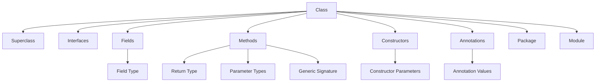
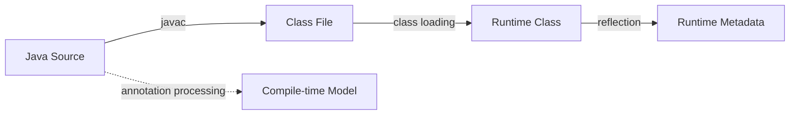
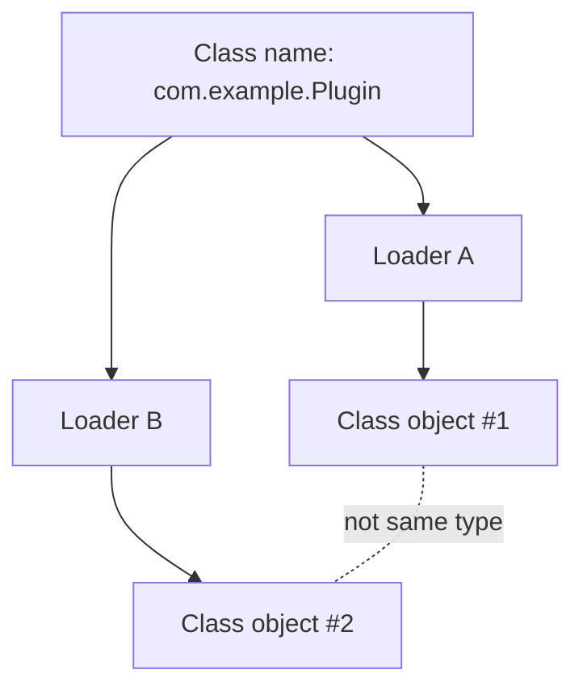
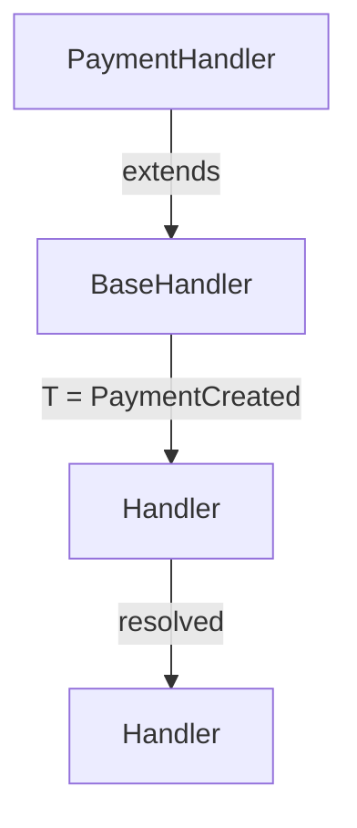
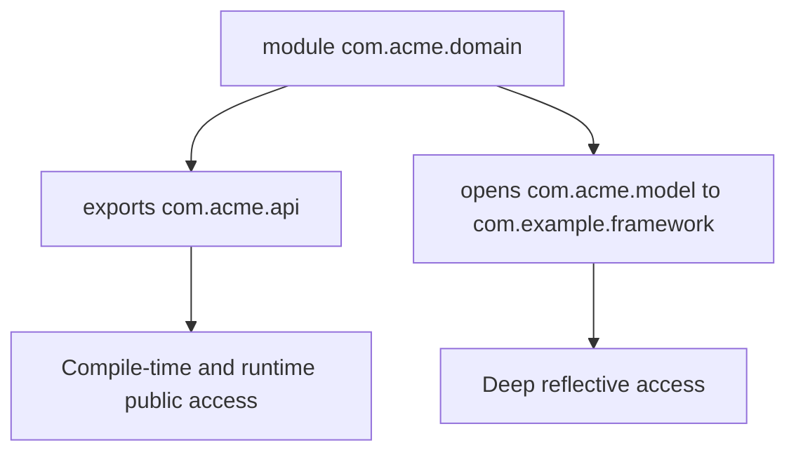
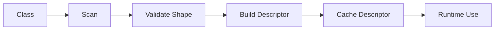
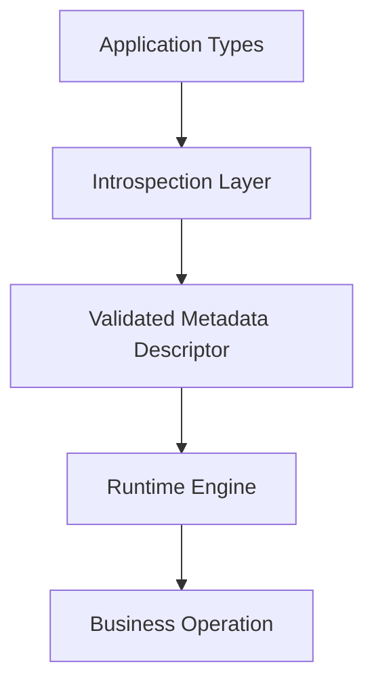

# Part 029 — Reflection Model and Runtime Introspection

## 0. Posisi Part Ini Dalam Seri

Part 025 sampai 028 membahas desain API dari sisi kontrak, usability, invariant, dan compatibility. Part ini masuk ke wilayah yang lebih meta:

> Bagaimana program Java membaca bentuk dirinya sendiri saat runtime, dan bagaimana framework menggunakan metadata itu untuk membuat binding, dependency injection, routing, mapping, validation, serialization, test discovery, plugin loading, dan proxy behavior?

Reflection bukan sekadar teknik untuk memanggil private method. Reflection adalah **runtime metadata model** Java. Ia memungkinkan program melihat:

- class apa yang sedang dipakai,
- field apa yang ada,
- method apa yang tersedia,
- constructor apa yang bisa dipanggil,
- annotation apa yang melekat,
- generic signature apa yang tersimpan,
- modifier/access flag apa yang dimiliki,
- module/package boundary apa yang membatasi akses,
- inheritance/interface shape apa yang membentuk type.

Namun reflection juga membawa risiko:

- compile-time safety berkurang,
- error berpindah ke runtime,
- performance dapat memburuk jika tidak di-cache,
- module encapsulation bisa menolak akses,
- generic metadata bisa disalahpahami karena erasure,
- API yang tampak internal dapat berubah menjadi kontrak framework secara tidak sadar.

Target part ini: memahami reflection sebagai **read model dan operation model** atas runtime Java, bukan sebagai trik.

---

## 1. Kaufman Deconstruction: Reflection Skill Map

Mengikuti pendekatan Josh Kaufman, kita pecah skill reflection menjadi sub-skill kecil yang bisa dilatih terpisah.

### 1.1 Skill Utama

Mampu mendesain dan mengimplementasikan introspection layer Java yang:

1. membaca metadata class secara benar,
2. memahami perbedaan source type, runtime type, dan generic signature,
3. menghormati access/module boundary,
4. mengubah metadata menjadi model internal framework,
5. meminimalkan reflective calls di hot path,
6. menghasilkan error message yang actionable,
7. tetap kompatibel saat API client berevolusi.

### 1.2 Sub-Skill

| Sub-skill | Pertanyaan Inti | Output Praktis |
|---|---|---|
| Class introspection | Apa runtime type sebenarnya? | `Class<?>`, superclass, interfaces, package, module |
| Member introspection | Field/method/constructor apa yang ada? | `Field`, `Method`, `Constructor`, `Executable` |
| Annotation reading | Metadata deklaratif apa yang tersedia? | `AnnotatedElement`, repeatable annotation, inherited annotation |
| Generic metadata | Type parameter apa yang masih tersimpan? | `Type`, `ParameterizedType`, `TypeVariable`, `WildcardType` |
| Access control | Boleh membaca/memanggil ini? | public access, `setAccessible`, `trySetAccessible`, module opens |
| Invocation | Bagaimana memanggil runtime member? | `Method.invoke`, `Constructor.newInstance`, field get/set |
| Caching | Metadata mana yang stabil dan bisa disimpan? | class-level descriptor cache |
| Diagnostics | Bagaimana error framework menjelaskan masalah? | structured reflection error |

### 1.3 Latihan Minimum

Untuk menguasai reflection secara produktif, buat mini framework berikut:

1. scan class DTO,
2. baca field dan getter,
3. baca annotation custom,
4. validasi constructor shape,
5. buat descriptor immutable,
6. cache descriptor per class,
7. gunakan descriptor untuk binding data,
8. laporkan error dengan path `Class.member` yang jelas.

Ini jauh lebih efektif daripada menghafal method-method `java.lang.reflect` secara acak.

---

## 2. Mental Model: Reflection Sebagai Metadata Graph

Reflection dapat dipandang sebagai graph metadata dari runtime Java.



`Class<?>` adalah entry point paling umum. Dari sana kita bisa membaca struktur class. Namun penting membedakan beberapa hal:

- **declared members**: member yang dideklarasikan langsung pada class tersebut,
- **public members**: member public yang terlihat termasuk inherited,
- **runtime descriptor**: bentuk JVM-level yang dipakai saat invocation,
- **generic signature**: metadata tambahan yang mungkin tersedia untuk generic type,
- **annotation metadata**: metadata deklaratif yang hanya terlihat jika retention-nya runtime.

Reflection tidak mengembalikan source code. Ia mengembalikan metadata runtime yang disimpan dalam class file dan dimuat oleh JVM.

---

## 3. Reflection Bukan Compiler API

Kesalahan umum: mengira reflection bisa melihat semua hal yang ada di source code.

Reflection bekerja pada **loaded class**, bukan source file. Akibatnya:

- local variable biasa tidak menjadi model utama reflection,
- komentar tidak tersedia,
- generic type mengalami erasure pada runtime operation,
- parameter name hanya tersedia jika class dikompilasi dengan metadata parameter name,
- annotation hanya terlihat jika `@Retention(RUNTIME)`,
- source-level structure tertentu sudah diturunkan menjadi bytecode structure.

Jika butuh memproses source saat compile-time, gunakan annotation processing atau compiler API. Itu akan dibahas pada Part 032 dan 033.



Reflection melihat `D`, bukan `A`.

---

## 4. `Class<?>`: Root Object Runtime Type

`Class<?>` merepresentasikan class/interface/enum/record/annotation/primitive/array/void pada runtime.

Contoh:

```java
Class<String> stringClass = String.class;
Class<?> runtimeClass = "hello".getClass();
Class<int[]> intArrayClass = int[].class;
Class<Integer> primitiveBox = Integer.class;
Class<Integer.TYPE> impossible = null; // hanya ilustrasi: int.class bukan Class<Integer>
```

Untuk primitive:

```java
Class<?> intType = int.class;
Class<?> voidType = void.class;

System.out.println(intType.isPrimitive()); // true
System.out.println(voidType == Void.TYPE); // true
```

### 4.1 `Class<T>` Tidak Berarti Tersedia Sepenuhnya Saat Runtime

`Class<T>` sering dipakai sebagai runtime evidence sederhana.

```java
<T> T create(Class<T> type) {
    // type memberi evidence untuk raw class T
    return null;
}
```

Namun `Class<T>` tidak dapat merepresentasikan `List<String>` secara penuh. Ia hanya dapat merepresentasikan raw runtime class `List.class`.

```java
Class<?> listClass = List.class;
// Tidak ada List<String>.class
```

Untuk generic type penuh, framework memakai `Type`, `ParameterizedType`, atau type token custom.

---

## 5. Cara Mendapatkan `Class<?>`

Ada beberapa cara umum.

### 5.1 Class Literal

```java
Class<Order> type = Order.class;
```

Ini paling aman, compile-time checked, dan tidak memicu lookup string.

### 5.2 Runtime Object

```java
Object value = new Order();
Class<?> runtimeType = value.getClass();
```

Ini membaca runtime class aktual, bukan static type variable.

```java
CharSequence text = "abc";
System.out.println(text.getClass()); // class java.lang.String
```

### 5.3 `Class.forName`

```java
Class<?> type = Class.forName("com.example.Order");
```

Ini berguna untuk plugin/configuration, tetapi membawa risiko:

- string typo,
- class loader salah,
- class tidak ada,
- initialization side effect,
- module visibility.

Lebih eksplisit:

```java
ClassLoader loader = Thread.currentThread().getContextClassLoader();
Class<?> type = Class.forName("com.example.Order", false, loader);
```

Parameter `initialize=false` berguna jika kita hanya ingin metadata tanpa menjalankan static initializer.

---

## 6. Type Identity: Nama Sama Belum Tentu Type Sama

Runtime type identity Java bukan hanya nama class. Type identity dipengaruhi oleh class loader.



Dua class dengan binary name sama tetapi dimuat oleh class loader berbeda adalah type berbeda.

Implikasi framework:

- jangan hanya membandingkan class name jika butuh type identity,
- hati-hati cache global berbasis class name,
- gunakan `Class<?>` sebagai key cache jika konteks loader penting,
- gunakan weak reference/`ClassValue` untuk menghindari class loader leak,
- plugin system harus jelas boundary class loader-nya.

Contoh cache yang berisiko:

```java
static final Map<String, Descriptor> CACHE = new ConcurrentHashMap<>();
```

Lebih aman:

```java
static final ClassValue<Descriptor> DESCRIPTORS = new ClassValue<>() {
    @Override
    protected Descriptor computeValue(Class<?> type) {
        return inspect(type);
    }
};
```

`ClassValue` cocok untuk metadata yang melekat pada `Class<?>` dan membantu menghindari beberapa bentuk leak manual cache.

---

## 7. Declared vs Public Members

Reflection API punya pasangan method yang sering membingungkan:

| Method | Makna |
|---|---|
| `getDeclaredFields()` | field yang dideklarasikan langsung pada class itu, semua visibility |
| `getFields()` | public field yang terlihat, termasuk inherited public field |
| `getDeclaredMethods()` | method yang dideklarasikan langsung, semua visibility |
| `getMethods()` | public method yang terlihat, termasuk inherited public method |
| `getDeclaredConstructors()` | constructor yang dideklarasikan langsung |
| `getConstructors()` | public constructor |

Framework harus memilih dengan sadar.

### 7.1 Untuk Model Internal Object

Jika framework ingin membaca semua field internal class:

```java
for (Field field : type.getDeclaredFields()) {
    // includes private/package/protected/public fields declared on this class
}
```

Namun ini tidak otomatis membaca field superclass. Harus naik manual:

```java
static List<Field> allDeclaredFields(Class<?> type) {
    List<Field> fields = new ArrayList<>();
    for (Class<?> current = type; current != null && current != Object.class; current = current.getSuperclass()) {
        fields.addAll(List.of(current.getDeclaredFields()));
    }
    return fields;
}
```

### 7.2 Untuk Public API Framework

Jika framework hanya boleh menggunakan public API:

```java
for (Method method : type.getMethods()) {
    // includes public inherited methods
}
```

Ini lebih stabil dan lebih sesuai encapsulation, tetapi bisa membawa inherited methods seperti `Object.toString`, `Object.equals`, dan default interface methods.

---

## 8. `Field`: Metadata dan Access ke State

`Field` merepresentasikan field class atau instance.

```java
Field field = Order.class.getDeclaredField("status");
Class<?> rawType = field.getType();
Type genericType = field.getGenericType();
int modifiers = field.getModifiers();
```

### 8.1 Field Type vs Generic Field Type

```java
class Box {
    List<String> names;
}

Field field = Box.class.getDeclaredField("names");
System.out.println(field.getType());        // interface java.util.List
System.out.println(field.getGenericType()); // java.util.List<java.lang.String>
```

`getType()` memberi runtime raw class. `getGenericType()` memberi generic signature jika tersedia.

### 8.2 Field Get/Set

```java
field.setAccessible(true);
Object value = field.get(order);
field.set(order, OrderStatus.APPROVED);
```

Ini harus dipakai hati-hati. Mengubah field langsung dapat melewati invariant constructor/setter.

Dalam framework production, field access sebaiknya dibungkus dalam descriptor:

```java
record FieldDescriptor(
    String name,
    Class<?> rawType,
    Type genericType,
    boolean readable,
    boolean writable,
    Field field
) {}
```

Jangan sebarkan `Field` mentah ke seluruh kode. Jadikan reflection detail sebagai implementation detail.

---

## 9. `Method`: Metadata dan Invocation

`Method` merepresentasikan method class/interface.

```java
Method method = User.class.getMethod("email");
Class<?> returnType = method.getReturnType();
Type genericReturnType = method.getGenericReturnType();
Class<?>[] parameterTypes = method.getParameterTypes();
Type[] genericParameterTypes = method.getGenericParameterTypes();
```

### 9.1 Invocation

```java
Object result = method.invoke(user);
```

Untuk method dengan parameter:

```java
Method rename = User.class.getMethod("rename", String.class);
rename.invoke(user, "Alice");
```

### 9.2 Exception Wrapping

`Method.invoke` membungkus exception dari target method dalam `InvocationTargetException`.

```java
try {
    method.invoke(target);
} catch (InvocationTargetException e) {
    Throwable actual = e.getCause();
    throw new FrameworkInvocationException("Invocation failed: " + method, actual);
}
```

Jangan tampilkan `InvocationTargetException` mentah kepada user framework. Mereka butuh penyebab asli.

### 9.3 Bridge dan Synthetic Methods

Generics dan compiler transformation dapat menghasilkan bridge/synthetic methods.

```java
for (Method method : type.getDeclaredMethods()) {
    if (method.isBridge() || method.isSynthetic()) {
        continue;
    }
}
```

Namun jangan selalu membuang synthetic method tanpa memahami use case. Beberapa framework perlu melihat metadata compiler-generated, tetapi sebagian besar API scanner ingin menghindarinya agar tidak double-register method.

---

## 10. `Constructor<T>`: Controlled Instantiation

`Constructor<T>` merepresentasikan constructor.

```java
Constructor<Order> ctor = Order.class.getDeclaredConstructor(String.class);
Order order = ctor.newInstance("ORD-001");
```

### 10.1 Prefer `Constructor.newInstance` daripada `Class.newInstance`

`Class.newInstance()` historically ada, tetapi constructor-based reflection lebih eksplisit:

- bisa memilih parameter constructor,
- exception handling lebih jelas,
- tidak terbatas pada public no-arg constructor.

### 10.2 Framework Constructor Policy

Framework harus punya policy jelas:

| Policy | Cocok Untuk | Risiko |
|---|---|---|
| public no-arg constructor | simple bean binding | weak invariant, mutable object |
| annotated constructor | DI/config binding | annotation dependency |
| canonical record constructor | immutable DTO/value | perlu mapping by parameter name/component |
| static factory | richer invariant | tidak selalu mudah ditemukan |
| private constructor access | serialization/framework | module/access risk, invariant bypass |

Contoh descriptor:

```java
record ConstructorDescriptor<T>(
    Constructor<T> constructor,
    List<ParameterDescriptor> parameters,
    boolean accessible
) {}
```

---

## 11. `Executable` dan `Parameter`

`Method` dan `Constructor` berbagi superclass `Executable`. Dari sini kita bisa membaca parameter.

```java
Executable executable = method;
Parameter[] parameters = executable.getParameters();
```

Parameter metadata meliputi:

- name,
- type,
- generic type,
- annotations,
- modifiers,
- whether name is present.

Contoh:

```java
for (Parameter parameter : method.getParameters()) {
    System.out.println(parameter.getName());
    System.out.println(parameter.isNamePresent());
}
```

### 11.1 Parameter Name Trap

Parameter name tidak selalu tersedia. Jika class tidak dikompilasi dengan metadata parameter names, framework bisa melihat nama seperti `arg0`, `arg1`.

Maka API binding sebaiknya tidak bergantung buta pada parameter names. Gunakan fallback:

1. annotation eksplisit,
2. record component name,
3. parameter name jika tersedia,
4. positional binding hanya jika aman dan terdokumentasi.

```java
String logicalName(Parameter parameter) {
    JsonName annotation = parameter.getAnnotation(JsonName.class);
    if (annotation != null) return annotation.value();
    if (parameter.isNamePresent()) return parameter.getName();
    throw new IllegalStateException("Missing parameter name metadata for " + parameter);
}
```

---

## 12. `AnnotatedElement`: Annotation Read Model

Class, method, field, constructor, parameter, package, module, dan beberapa model lain dapat menjadi `AnnotatedElement`.

```java
Retention retention = annotationType.getAnnotation(Retention.class);
```

Untuk membaca annotation:

```java
Route route = method.getAnnotation(Route.class);
boolean secured = method.isAnnotationPresent(Secured.class);
Annotation[] annotations = method.getAnnotations();
```

### 12.1 Retention Policy

Annotation hanya bisa dibaca reflection jika retention-nya runtime.

```java
@Retention(RetentionPolicy.RUNTIME)
@Target(ElementType.METHOD)
public @interface Route {
    String value();
}
```

| Retention | Terlihat oleh Reflection? | Use Case |
|---|---:|---|
| `SOURCE` | Tidak | lint/checker/source generation only |
| `CLASS` | Tidak secara standard reflection | bytecode tools |
| `RUNTIME` | Ya | framework runtime scanning |

### 12.2 Inherited Annotation Trap

`@Inherited` hanya berlaku untuk annotation pada class, bukan method/field.

```java
@Inherited
@Retention(RetentionPolicy.RUNTIME)
@Target(ElementType.TYPE)
@interface Audited {}
```

Jika subclass tidak mendeklarasikan annotation, `getAnnotation` pada class bisa melihat inherited annotation. Tetapi method annotation tidak otomatis inherited seperti itu.

Framework harus memutuskan apakah ingin mencari annotation di hierarchy secara manual.

---

## 13. Repeatable Annotation

Java mendukung repeatable annotation.

```java
@Role("admin")
@Role("auditor")
class ReportController {}
```

Reader harus memakai API yang benar:

```java
Role[] roles = type.getAnnotationsByType(Role.class);
```

Jangan hanya memakai `getAnnotation(Role.class)` jika annotation bisa repeatable.

---

## 14. Type Annotation dan `AnnotatedType`

Annotation tidak hanya bisa melekat pada declaration, tetapi juga pada penggunaan type.

```java
List<@Email String> emails;
```

Untuk membaca ini, gunakan `AnnotatedType`.

```java
AnnotatedType annotatedType = field.getAnnotatedType();
```

Ini relevan untuk framework validation atau static analysis yang ingin memahami annotation pada type argument, bukan hanya field.

Perbedaan:

```java
@NonNull String name;          // field/declaration annotation atau type-use tergantung target
List<@NonNull String> names;   // type-use annotation pada type argument
```

---

## 15. Generic Metadata Reflection

Reflection punya beberapa interface penting di `java.lang.reflect`:

| Interface | Makna |
|---|---|
| `Type` | super-interface generic untuk representasi type |
| `ParameterizedType` | `List<String>`, `Map<String, Integer>` |
| `TypeVariable` | `T`, `E`, `K`, `V` |
| `WildcardType` | `?`, `? extends Number`, `? super String` |
| `GenericArrayType` | array dari non-reifiable component type |

Contoh:

```java
class Repository<T> {
    List<T> findAll() { return List.of(); }
}

Method method = Repository.class.getDeclaredMethod("findAll");
Type genericReturn = method.getGenericReturnType();
System.out.println(genericReturn); // java.util.List<T>
```

### 15.1 `Class<?>` vs `Type`

| API | Contoh Hasil | Menyimpan Generic? |
|---|---|---:|
| `getType()` | `List.class` | Tidak |
| `getGenericType()` | `List<String>` | Ya, jika ada signature |
| `getReturnType()` | `List.class` | Tidak |
| `getGenericReturnType()` | `List<T>` | Ya |

### 15.2 ParameterizedType

```java
Field field = UserGroup.class.getDeclaredField("members");
Type type = field.getGenericType();

if (type instanceof ParameterizedType parameterized) {
    Type raw = parameterized.getRawType();
    Type[] args = parameterized.getActualTypeArguments();
}
```

### 15.3 TypeVariable

```java
class Box<T extends Number> {}

TypeVariable<Class<Box>>[] variables = Box.class.getTypeParameters();
for (TypeVariable<?> variable : variables) {
    System.out.println(variable.getName());      // T
    System.out.println(Arrays.toString(variable.getBounds())); // Number
}
```

### 15.4 WildcardType

```java
class Rules {
    List<? extends Number> numbers;
}

Field field = Rules.class.getDeclaredField("numbers");
ParameterizedType list = (ParameterizedType) field.getGenericType();
WildcardType wildcard = (WildcardType) list.getActualTypeArguments()[0];
System.out.println(Arrays.toString(wildcard.getUpperBounds()));
```

---

## 16. Resolving Generic Type Dalam Hierarchy

Reflection raw sering belum cukup. Misalnya:

```java
interface Handler<T> {
    void handle(T event);
}

final class PaymentHandler implements Handler<PaymentCreated> {
    public void handle(PaymentCreated event) {}
}
```

Framework ingin tahu bahwa `PaymentHandler` menangani `PaymentCreated`.

Naive approach:

```java
for (Type type : PaymentHandler.class.getGenericInterfaces()) {
    System.out.println(type);
}
```

Untuk kasus sederhana, ini cukup. Tetapi kasus nyata lebih kompleks:

```java
abstract class BaseHandler<T> implements Handler<T> {}
final class PaymentHandler extends BaseHandler<PaymentCreated> {}
```

Framework harus resolve type variable mapping:



Implementasi resolver generic type yang benar tidak trivial. Untuk framework serius, isolasi logic ini di satu komponen dan test dengan banyak bentuk hierarchy.

---

## 17. Record Introspection

Record punya metadata khusus.

```java
record UserDto(String id, String email) {}
```

Reflection:

```java
Class<UserDto> type = UserDto.class;
System.out.println(type.isRecord());

for (RecordComponent component : type.getRecordComponents()) {
    System.out.println(component.getName());
    System.out.println(component.getType());
    System.out.println(component.getAccessor());
}
```

Untuk binding DTO immutable, record introspection lebih stabil daripada membaca field private record secara langsung.

### 17.1 Record Binding Strategy

Binding record sebaiknya memakai:

1. `getRecordComponents()`,
2. canonical constructor,
3. component names,
4. component annotations,
5. accessor methods.

Jangan mengandalkan field private record sebagai API utama. Field adalah implementation detail dari record representation.

---

## 18. Enum Introspection

Enum punya runtime metadata khusus:

```java
enum Status {
    DRAFT,
    APPROVED,
    REJECTED
}
```

```java
Class<Status> type = Status.class;
System.out.println(type.isEnum());
System.out.println(Arrays.toString(type.getEnumConstants()));
```

### 18.1 Enum Constant Annotation

Enum constant dapat punya annotation pada field representasinya:

```java
enum Status {
    @Label("Draft document")
    DRAFT
}

Field constant = Status.class.getField("DRAFT");
Label label = constant.getAnnotation(Label.class);
```

Ini sering dipakai untuk UI labels, mapping legacy codes, dan policy metadata.

---

## 19. Sealed Class Introspection

Sealed hierarchy dapat dibaca runtime.

```java
sealed interface Decision permits Approved, Rejected {}
record Approved(String by) implements Decision {}
record Rejected(String reason) implements Decision {}
```

```java
Class<Decision> type = Decision.class;
System.out.println(type.isSealed());
for (Class<?> permitted : type.getPermittedSubclasses()) {
    System.out.println(permitted.getName());
}
```

Use case:

- exhaustive handler registration,
- schema generation,
- validation of closed state hierarchy,
- documentation generation,
- policy matrix completeness check.

---

## 20. Modifier dan Access Flag

Reflection menyediakan `Modifier` untuk membaca modifier klasik.

```java
int modifiers = method.getModifiers();
boolean isPublic = Modifier.isPublic(modifiers);
boolean isStatic = Modifier.isStatic(modifiers);
```

Untuk model lebih modern, Java juga punya access flag API pada beberapa runtime member. Tetapi untuk kebanyakan framework, `Modifier` masih cukup untuk public/private/static/final/abstract checks.

### 20.1 Static vs Instance Member

Framework harus membedakan:

```java
if (Modifier.isStatic(method.getModifiers())) {
    // invoke with null target
    method.invoke(null);
} else {
    method.invoke(instance);
}
```

Jangan memperlakukan static factory seperti instance method.

---

## 21. Access Control: `canAccess`, `setAccessible`, `trySetAccessible`

Reflection tetap tunduk pada access control dan module boundary.

Contoh:

```java
Field field = User.class.getDeclaredField("email");
if (!field.canAccess(user)) {
    boolean opened = field.trySetAccessible();
    if (!opened) {
        throw new IllegalStateException("Cannot access field: " + field);
    }
}
```

### 21.1 Jangan Asumsikan `setAccessible(true)` Selalu Berhasil

Di era JPMS, package/module boundary penting. Akses deep reflection terhadap member non-public bisa ditolak jika package tidak dibuka.

Konsekuensi desain framework:

- prefer public accessor jika memungkinkan,
- dokumentasikan kebutuhan `opens` untuk reflection-based framework,
- berikan error message yang menyebut module/package/class/member,
- jangan silently fallback ke behavior yang salah,
- bedakan public inspection dan deep reflection.

Contoh error yang bagus:

```text
Cannot access field com.acme.order.Order.status.
The package com.acme.order is not opened to module com.example.framework.
Either expose a public accessor or add:
opens com.acme.order to com.example.framework;
```

---

## 22. Reflection dan Module Boundary

JPMS memisahkan dua konsep:

- **exports**: package bisa dikompilasi/dipakai secara public oleh module lain,
- **opens**: package bisa diakses deep reflection oleh module lain.



Framework reflection-heavy seperti serializer, DI container, ORM, mapper, dan test engine sering butuh `opens`, bukan hanya `exports`.

Design implication:

- library API sebaiknya tidak memaksa consumer membuka semua package,
- gunakan constructor/accessor public jika bisa,
- gunakan annotation processing/code generation untuk mengurangi deep reflection,
- buat module documentation yang eksplisit.

---

## 23. Framework Introspection Pipeline

Framework yang sehat tidak langsung memanggil reflection di semua tempat. Ia membangun metadata model dulu.



Descriptor contoh:

```java
record BeanDescriptor(
    Class<?> type,
    List<PropertyDescriptor> properties,
    Optional<ConstructorDescriptor<?>> constructor
) {}

record PropertyDescriptor(
    String logicalName,
    Class<?> rawType,
    Type genericType,
    Optional<Method> getter,
    Optional<Method> setter,
    Optional<Field> field,
    List<Annotation> annotations
) {}
```

Kenapa descriptor penting?

- reflection scanning mahal jika diulang,
- error validasi bisa dilakukan saat startup,
- runtime hot path bisa memakai descriptor siap pakai,
- descriptor bisa diuji tanpa memanggil target behavior,
- API framework lebih stabil daripada menyebar `Field/Method` mentah.

---

## 24. Property Model: Field vs Method vs Record Component

Banyak framework perlu membuat konsep “property”. Java sendiri tidak punya keyword property. Framework harus mendefinisikannya.

### 24.1 Field-Based Property

```java
class User {
    private String email;
}
```

Pro:

- langsung membaca state,
- tidak perlu getter/setter,
- cocok untuk simple DTO internal.

Kontra:

- melewati invariant,
- butuh deep reflection,
- rentan module boundary,
- field rename menjadi breaking untuk framework.

### 24.2 Method-Based Property

```java
class User {
    public String email() { return email; }
}
```

Pro:

- menghormati public API,
- lebih stabil untuk module boundary,
- bisa enforce invariant.

Kontra:

- perlu naming convention,
- computed property bisa punya side effect jika desain buruk,
- setter/getter JavaBeans bisa ambiguous.

### 24.3 Record Component Property

```java
record User(String id, String email) {}
```

Pro:

- component explicit,
- immutable by default,
- accessor jelas,
- constructor shape jelas.

Kontra:

- tidak cocok untuk semua domain entity,
- evolution record component harus hati-hati.

Framework modern sebaiknya punya precedence yang terdokumentasi:

```text
record component > annotated method > annotated field > JavaBeans convention > public field
```

Atau policy lain, tetapi harus jelas.

---

## 25. Annotation Merge Strategy

Annotation bisa muncul di beberapa tempat:

```java
record User(
    @Email String email
) {
    @Override
    @Email
    public String email() {
        return email;
    }
}
```

Framework harus menentukan merge strategy:

- annotation pada field,
- annotation pada accessor,
- annotation pada constructor parameter,
- annotation pada record component,
- annotation pada type use.

Jika tidak jelas, hasilnya inconsistent.

Contoh precedence untuk binding:

```text
constructor parameter annotation
then record component annotation
then accessor annotation
then field annotation
then type-use annotation
```

Untuk validation, type-use annotation mungkin lebih penting.

---

## 26. Reflection Error Taxonomy

Reflective code menghasilkan banyak exception. Framework harus menerjemahkan menjadi error domain yang jelas.

| Exception | Arti Umum | Framework Translation |
|---|---|---|
| `ClassNotFoundException` | class lookup gagal | plugin/config class invalid |
| `NoSuchMethodException` | method/ctor tidak ditemukan | shape tidak sesuai kontrak |
| `NoSuchFieldException` | field tidak ditemukan | metadata stale / configuration salah |
| `IllegalAccessException` | access ditolak | module/accessibility issue |
| `InvocationTargetException` | target method melempar exception | unwrap cause |
| `InstantiationException` | class tidak bisa diinstansiasi | abstract/interface/no usable ctor |
| `SecurityException` | policy/security menolak | environment restriction |
| `InaccessibleObjectException` | strong encapsulation menolak deep access | module opens issue |

Jangan membiarkan exception low-level bocor tanpa konteks.

Contoh wrapper:

```java
final class IntrospectionException extends RuntimeException {
    IntrospectionException(String message, Throwable cause) {
        super(message, cause);
    }
}
```

Error message harus menjawab:

1. class/member mana,
2. kontrak apa yang gagal,
3. apa yang perlu dilakukan user,
4. apakah ini access/module/generic/annotation/constructor issue.

---

## 27. Reflection dan Initialization Side Effect

`Class.forName(String)` dapat memicu class initialization. Static initializer bisa menjalankan side effect.

```java
class Dangerous {
    static {
        System.out.println("Static init runs");
    }
}
```

Gunakan overload dengan `initialize=false` jika hanya butuh metadata:

```java
Class<?> type = Class.forName(name, false, loader);
```

Namun beberapa operasi reflective bisa tetap memicu initialization. Framework scanner harus menghindari accidental initialization saat scanning classpath/plugin.

---

## 28. Classpath/Module Scanning: Bukan Bagian Reflection Murni

Reflection dapat membaca class yang sudah diketahui/dimuat. Tetapi menemukan semua class dalam package/module/classpath bukan kemampuan sederhana dari core reflection.

Classpath scanning biasanya butuh:

- membaca jar entries,
- membaca module layer,
- menggunakan library scanner,
- build-time index,
- annotation processing,
- generated registry.

Jangan desain framework dengan asumsi “reflection bisa menemukan semua class di package”. Itu tidak benar sebagai primitive umum Java.

Strategi lebih baik:

| Strategi | Kelebihan | Kekurangan |
|---|---|---|
| explicit registration | reliable, simple | manual |
| service loader | standard plugin model | SPI shape terbatas |
| build-time index | cepat runtime | build integration |
| annotation processing | type-safe, early error | compile-time complexity |
| classpath scanning | convenient | lambat, brittle, environment-dependent |

---

## 29. Mini Framework: Runtime Validator Scanner

Kita buat contoh kecil untuk membaca annotation validator.

### 29.1 Annotation

```java
@Retention(RetentionPolicy.RUNTIME)
@Target({ElementType.FIELD, ElementType.RECORD_COMPONENT})
public @interface Required {}
```

### 29.2 Descriptor

```java
record RequiredProperty(
    String name,
    Class<?> rawType,
    AccessibleObject source,
    Function<Object, Object> reader
) {}
```

### 29.3 Scanner

```java
final class RequiredScanner {
    List<RequiredProperty> scan(Class<?> type) {
        if (type.isRecord()) {
            return scanRecord(type);
        }
        return scanFields(type);
    }

    private List<RequiredProperty> scanFields(Class<?> type) {
        List<RequiredProperty> result = new ArrayList<>();
        for (Field field : allDeclaredFields(type)) {
            if (!field.isAnnotationPresent(Required.class)) continue;
            if (!field.trySetAccessible()) {
                throw new IntrospectionException("Cannot access required field: " + field, null);
            }
            result.add(new RequiredProperty(
                field.getName(),
                field.getType(),
                field,
                target -> {
                    try {
                        return field.get(target);
                    } catch (IllegalAccessException e) {
                        throw new IntrospectionException("Cannot read field: " + field, e);
                    }
                }
            ));
        }
        return result;
    }

    private List<RequiredProperty> scanRecord(Class<?> type) {
        List<RequiredProperty> result = new ArrayList<>();
        for (RecordComponent component : type.getRecordComponents()) {
            if (!component.isAnnotationPresent(Required.class)) continue;
            Method accessor = component.getAccessor();
            result.add(new RequiredProperty(
                component.getName(),
                component.getType(),
                accessor,
                target -> {
                    try {
                        return accessor.invoke(target);
                    } catch (ReflectiveOperationException e) {
                        throw new IntrospectionException("Cannot read record component: " + component, e);
                    }
                }
            ));
        }
        return result;
    }

    private static List<Field> allDeclaredFields(Class<?> type) {
        List<Field> fields = new ArrayList<>();
        for (Class<?> current = type; current != null && current != Object.class; current = current.getSuperclass()) {
            fields.addAll(List.of(current.getDeclaredFields()));
        }
        return fields;
    }
}
```

### 29.4 Lesson

Contoh ini menunjukkan prinsip:

- scanning dipisah dari runtime validation,
- metadata dibungkus descriptor,
- record diperlakukan sebagai shape khusus,
- access failure dilaporkan jelas,
- reflective call tidak tersebar sembarangan.

---

## 30. Caching Reflection Descriptor

Reflection metadata relatif stabil per `Class<?>`. Jangan scan berulang di hot path.

```java
final class DescriptorCache {
    private final ClassValue<List<RequiredProperty>> cache = new ClassValue<>() {
        @Override
        protected List<RequiredProperty> computeValue(Class<?> type) {
            return List.copyOf(new RequiredScanner().scan(type));
        }
    };

    List<RequiredProperty> requiredProperties(Class<?> type) {
        return cache.get(type);
    }
}
```

Keuntungan:

- cache mengikuti class identity,
- tidak keyed by string,
- cocok untuk class-loader aware metadata,
- menghindari sebagian class loader leak dibanding static map biasa.

Namun tetap perhatikan object yang disimpan descriptor. Jika descriptor menyimpan reference ke object dari plugin class loader, itu memang terkait `Class<?>` tersebut. Jangan simpan class loader global tanpa lifecycle.

---

## 31. Reflection Dalam Hot Path

Reflection scanning boleh dilakukan saat startup atau first-use. Tetapi reflective invocation di hot path perlu dipertimbangkan.

Level cost kasar:

1. direct method call,
2. method handle setelah warmup,
3. cached reflection invocation,
4. uncached lookup + invocation,
5. repeated scanning + invocation.

Prinsip:

- lookup sekali, pakai berkali-kali,
- validasi shape saat descriptor dibuat,
- pisahkan startup cost dan per-request cost,
- gunakan method handles/code generation untuk path sangat panas,
- ukur sebelum optimasi.

Part 030 akan membahas performance lebih detail.

---

## 32. Reflection dan API Compatibility

Jika framework membaca reflection metadata, maka beberapa hal menjadi kontrak tidak resmi:

- nama field,
- nama method,
- nama parameter,
- annotation location,
- constructor shape,
- generic signature,
- record component name,
- enum constant name,
- sealed permitted subclasses,
- package/module openness.

Ini berarti public API Anda bukan hanya method public yang dipanggil compile-time. Jika framework bergantung pada reflection, metadata menjadi bagian dari behavioral compatibility.

Contoh breaking change:

```java
record User(String email) {}
```

Diubah menjadi:

```java
record User(String primaryEmail) {}
```

Secara business mungkin sama, tetapi serializer/schema generator yang memakai component name akan melihat field berbeda.

---

## 33. Framework Design: Introspection Boundary

Reflection harus berada di boundary tertentu.



Yang buruk:

```java
// everywhere in codebase
object.getClass().getDeclaredFields()
```

Yang baik:

```java
BeanDescriptor descriptor = descriptors.forType(object.getClass());
runtimeEngine.process(descriptor, object);
```

Dengan desain ini:

- reflection detail terkapsulasi,
- diagnostic konsisten,
- cache terpusat,
- module access policy jelas,
- test coverage lebih mudah.

---

## 34. Reflection Checklist Untuk Engineer Senior

Sebelum memakai reflection, jawab pertanyaan berikut:

1. Apakah ini harus runtime, atau bisa compile-time annotation processing?
2. Apakah public accessor cukup, atau butuh private field access?
3. Apakah target package/module perlu `opens`?
4. Apakah generic metadata yang dibaca benar-benar tersedia?
5. Apakah parameter names dijamin tersedia?
6. Apakah annotation retention benar?
7. Apakah repeatable/inherited/type-use annotation diperlakukan benar?
8. Apakah reflection lookup di-cache?
9. Apakah invocation error di-unwrap dan diterjemahkan?
10. Apakah descriptor menjadi bagian dari compatibility contract?
11. Apakah class loader lifecycle dipikirkan?
12. Apakah scanning dapat menyebabkan class initialization side effect?
13. Apakah fallback behavior explicit dan aman?
14. Apakah error message memberi remediation?

---

## 35. Common Failure Modes

### 35.1 Menggunakan `getDeclaredMethods()` Lalu Double Register Bridge Method

Generic override bisa menghasilkan bridge method. Scanner endpoint/handler bisa mendaftarkan dua handler jika tidak filter.

Mitigasi:

```java
if (method.isBridge() || method.isSynthetic()) continue;
```

### 35.2 Mengandalkan Parameter Name Tanpa `-parameters`

Binding constructor by name gagal atau salah.

Mitigasi:

- wajibkan annotation eksplisit,
- gunakan record component,
- validasi `parameter.isNamePresent()`,
- fail fast.

### 35.3 Membaca Field Private di Module Tertutup

Berjalan di classpath, gagal di module path.

Mitigasi:

- prefer accessor,
- dokumentasikan `opens`,
- gunakan `trySetAccessible`,
- error message spesifik.

### 35.4 Menganggap `List<String>` Bisa Dicek Dengan `instanceof`

Runtime tidak menyimpan parameterized type untuk object instance.

Mitigasi:

- gunakan descriptor/schema/type token,
- validasi element saat membaca collection,
- jangan overpromise generic safety.

### 35.5 Scanning Classpath Saat Request

Request latency buruk.

Mitigasi:

- scan saat startup,
- cache descriptor,
- gunakan build-time index/code generation.

---

## 36. Deliberate Practice

### Practice 1 — Bean Descriptor

Bangun `BeanDescriptor` yang mendukung:

- field annotation,
- method annotation,
- record component,
- getter convention,
- cache per class.

### Practice 2 — Constructor Resolver

Buat resolver dengan precedence:

1. constructor annotated `@Inject`,
2. canonical record constructor,
3. public no-arg constructor,
4. fail with clear error.

### Practice 3 — Generic Handler Resolver

Diberikan:

```java
interface Handler<T> {
    void handle(T event);
}
```

Resolve event type untuk:

```java
class A implements Handler<OrderCreated> {}
abstract class Base<T> implements Handler<T> {}
class B extends Base<OrderPaid> {}
```

### Practice 4 — Module Access Diagnostic

Buat reflective field reader yang menggunakan `trySetAccessible` dan menghasilkan pesan error berisi:

- module target,
- package target,
- member target,
- contoh `opens` directive.

---

## 37. Ringkasan

Reflection adalah runtime metadata dan operation model. Untuk engineer senior, pertanyaannya bukan “bagaimana memanggil private method”, tetapi:

- metadata apa yang benar-benar tersedia,
- boundary apa yang sedang dilanggar atau dihormati,
- kontrak apa yang tercipta karena framework membaca metadata,
- bagaimana mengubah reflection mentah menjadi descriptor yang stabil,
- bagaimana menghindari performance dan class loader failure,
- bagaimana memberi diagnostics yang membantu.

Mental model utama:

```text
Class<?> -> inspect -> validate -> descriptor -> cache -> runtime engine
```

Jangan menyebar reflection ke seluruh codebase. Jadikan reflection layer sebagai boundary arsitektural.

---

## 38. Referensi Resmi

- Java SE 25 API — `java.lang.reflect` package summary: https://docs.oracle.com/en/java/javase/25/docs/api/java.base/java/lang/reflect/package-summary.html
- Java SE 25 API — `Class`: https://docs.oracle.com/en/java/javase/25/docs/api/java.base/java/lang/Class.html
- Java SE 25 API — `AccessibleObject`: https://docs.oracle.com/en/java/javase/25/docs/api/java.base/java/lang/reflect/AccessibleObject.html
- Java SE 25 API — `Method`: https://docs.oracle.com/en/java/javase/25/docs/api/java.base/java/lang/reflect/Method.html
- Java SE 25 API — `Field`: https://docs.oracle.com/en/java/javase/25/docs/api/java.base/java/lang/reflect/Field.html
- Java SE 25 API — `Constructor`: https://docs.oracle.com/en/java/javase/25/docs/api/java.base/java/lang/reflect/Constructor.html
- Java SE 25 API — `RecordComponent`: https://docs.oracle.com/en/java/javase/25/docs/api/java.base/java/lang/reflect/RecordComponent.html
- Java Language Specification SE 25: https://docs.oracle.com/javase/specs/jls/se25/html/index.html
