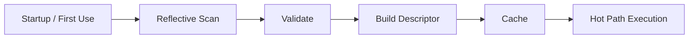
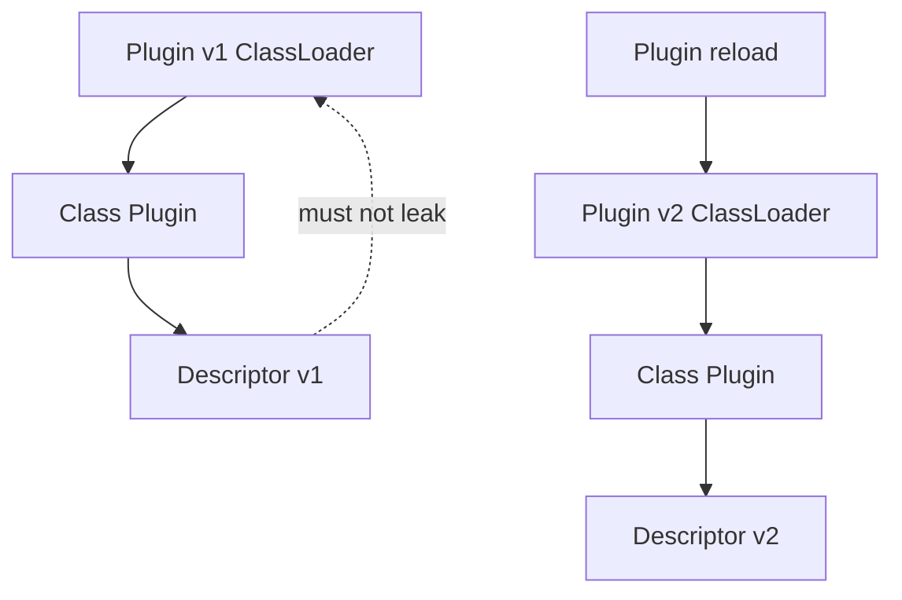
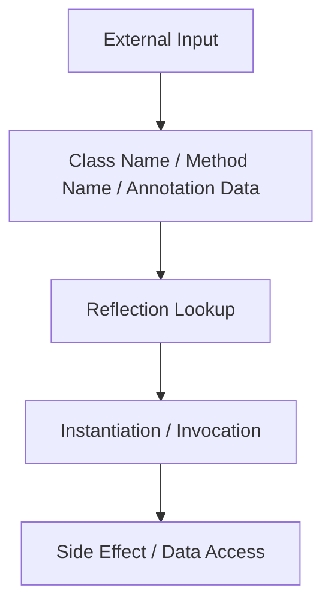
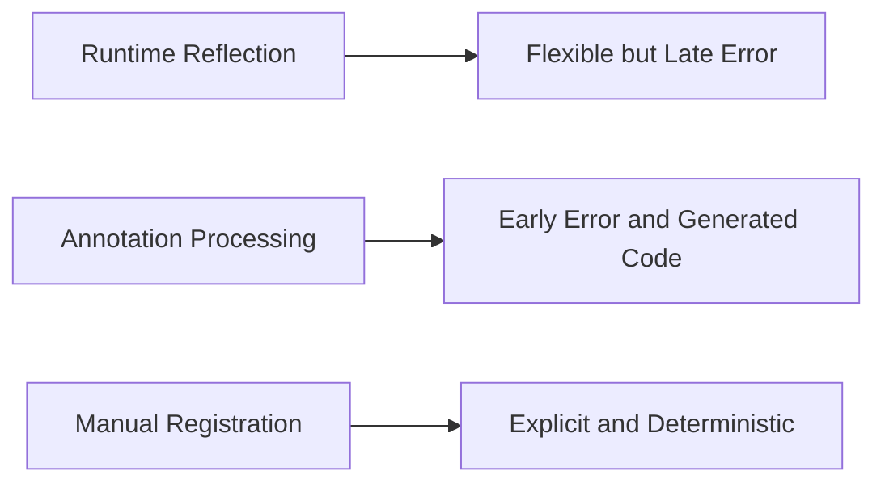
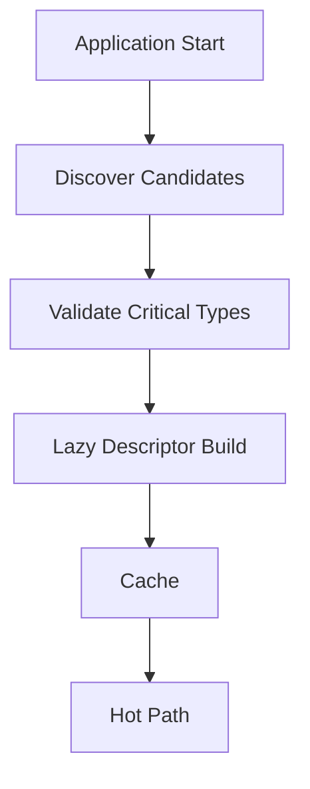
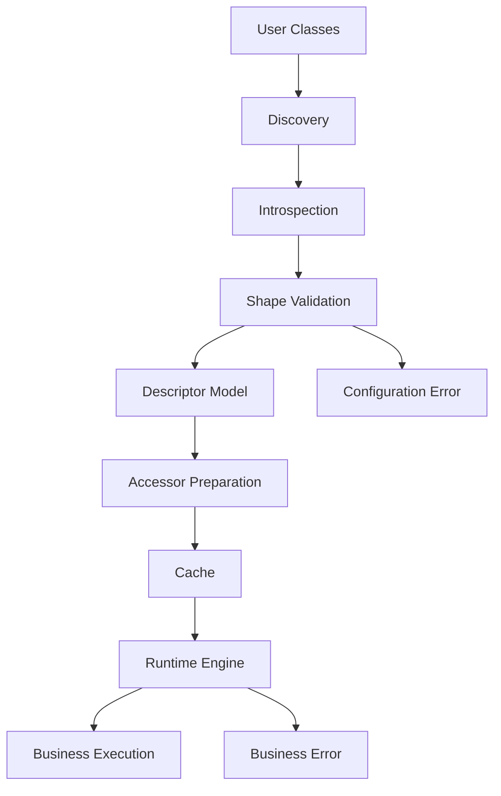

# Part 030 — Reflection Performance, Security, and Framework Design

## 0. Posisi Part Ini Dalam Seri

Part 029 membahas reflection sebagai model introspeksi runtime: `Class`, `Field`, `Method`, `Constructor`, annotation, generic metadata, record, enum, sealed hierarchy, dan module boundary.

Part ini menjawab pertanyaan production:

> Bagaimana menggunakan reflection dalam framework Java tanpa membuat sistem lambat, rapuh, sulit di-debug, melanggar encapsulation, atau bocor class loader?

Reflection hampir selalu muncul di library/platform serius:

- dependency injection,
- serialization/deserialization,
- validation,
- ORM/data mapper,
- RPC/router,
- test framework,
- plugin system,
- object mapper,
- configuration binder,
- workflow engine,
- rule engine,
- schema generator,
- proxy/interceptor framework.

Masalahnya bukan reflection itu buruk. Masalahnya adalah reflection sering dipakai tanpa boundary desain.

Target part ini: membangun mental model **reflection as framework substrate**.

---

## 1. Prinsip Utama

Gunakan reflection untuk **discover and prepare**, bukan untuk berpikir ulang di setiap request.



Di hot path, engine sebaiknya memakai descriptor, accessor yang sudah disiapkan, method handle, generated code, atau minimal cached `Method/Field`, bukan melakukan scan ulang.

Formula senior-level:

```text
Reflection cost is acceptable when paid once, validated early, cached safely, and isolated behind a stable runtime model.
```

---

## 2. Jenis Cost Reflection

Reflection cost bukan satu hal. Ada beberapa jenis cost.

| Cost | Contoh | Mitigasi |
|---|---|---|
| lookup cost | `getDeclaredMethods` berulang | cache descriptor |
| access check cost | reflective invocation/access | prepare access once; method handles for hot path |
| invocation overhead | `Method.invoke` per item | method handle/generated accessor |
| allocation cost | arrays metadata, wrapper values, exceptions | reuse descriptor, avoid repeated conversion |
| class loading cost | `Class.forName` banyak | explicit registry/build index |
| scanning cost | membaca classpath/jar | startup scan/build-time index |
| error cost | exception path mahal | validate at startup |
| class loader retention | static map menyimpan `Class<?>` | `ClassValue`, weak keys, lifecycle-aware cache |

Saat profiling, jangan bilang “reflection lambat” secara umum. Tanya: cost yang mana?

---

## 3. Reflection Lookup vs Reflection Invocation

Lookup:

```java
Method method = type.getDeclaredMethod("handle", Event.class);
```

Invocation:

```java
method.invoke(target, event);
```

Scanning:

```java
for (Method method : type.getDeclaredMethods()) {
    // inspect annotations, generic signatures, modifiers
}
```

Ketiganya punya karakter berbeda.

### 3.1 Anti-Pattern: Lookup di Hot Path

```java
void handle(Object target, Object event) throws Exception {
    Method method = target.getClass().getDeclaredMethod("handle", event.getClass());
    method.invoke(target, event);
}
```

Masalah:

- lookup berulang,
- exception path mahal,
- overload resolution naïve,
- subclass event tidak tertangani benar,
- access check berulang,
- sulit didiagnosis.

### 3.2 Lebih Baik: Descriptor Cache

```java
record HandlerDescriptor(
    Class<?> targetType,
    Class<?> eventType,
    Method method
) {
    Object invoke(Object target, Object event) {
        try {
            return method.invoke(target, event);
        } catch (InvocationTargetException e) {
            throw new HandlerInvocationException(method, e.getCause());
        } catch (IllegalAccessException e) {
            throw new HandlerInvocationException(method, e);
        }
    }
}
```

Lookup dilakukan saat descriptor dibuat, bukan setiap event.

---

## 4. Caching Strategy

Reflection metadata cache harus memperhatikan class identity, module boundary, dan class loader lifecycle.

### 4.1 Cache by `Class<?>`, Bukan String

Buruk:

```java
static final Map<String, BeanDescriptor> CACHE = new ConcurrentHashMap<>();
```

Masalah:

- class name sama bisa dimuat loader berbeda,
- plugin reload bisa salah descriptor,
- class loader leak,
- version conflict.

Lebih baik:

```java
static final ClassValue<BeanDescriptor> CACHE = new ClassValue<>() {
    @Override
    protected BeanDescriptor computeValue(Class<?> type) {
        return BeanIntrospector.inspect(type);
    }
};
```

`ClassValue` cocok untuk value yang secara konseptual melekat ke `Class<?>`.

### 4.2 Cache Scope

Tentukan scope cache:

| Scope | Cocok Untuk | Catatan |
|---|---|---|
| global JVM | JDK/application stable classes | hati-hati plugin |
| per application context | DI container, framework context | mudah dibersihkan |
| per class loader | plugin/server runtime | lifecycle-aware |
| per module layer | JPMS plugin architecture | boundary lebih eksplisit |
| request-local | jarang cocok | biasanya anti-pattern |

### 4.3 Cache Invalidation

Java class metadata tidak berubah untuk loaded class biasa. Tetapi plugin/hot reload membuat class baru via loader baru.

Maka invalidasi biasanya bukan “hapus descriptor untuk class yang sama”, tetapi “buang seluruh context/class loader lama”.



---

## 5. Class Loader Leak

Class loader leak terjadi ketika object yang hidup lama menyimpan reference ke class/class loader yang seharusnya bisa dibersihkan.

Contoh berisiko:

```java
final class GlobalRegistry {
    static final Map<Class<?>, Object> descriptors = new ConcurrentHashMap<>();
}
```

Jika plugin class dimasukkan ke map static milik parent class loader, plugin class loader bisa tidak pernah GC.

Mitigasi:

- gunakan lifecycle-aware registry,
- clear registry saat plugin undeploy,
- gunakan weak keys bila cocok,
- gunakan `ClassValue`,
- jangan simpan instance plugin di singleton global,
- hindari thread lokal yang menahan class plugin,
- hentikan thread/executor milik plugin.

Reflection bukan satu-satunya penyebab leak, tetapi descriptor reflection sering menjadi salah satu anchor.

---

## 6. `setAccessible` dan Strong Encapsulation

Pada Java modern, deep reflection tidak lagi bisa diasumsikan bebas. Module system membedakan package yang diekspor untuk public access dan package yang dibuka untuk deep reflection.

```java
boolean success = member.trySetAccessible();
if (!success) {
    throw new FrameworkConfigurationException("Cannot access " + member);
}
```

### 6.1 Gunakan `trySetAccessible` untuk Framework

`setAccessible(true)` melempar exception jika gagal. `trySetAccessible()` memberi boolean dan cocok untuk membuat pesan diagnostic sendiri.

```java
static void requireAccessible(AccessibleObject object, String usage) {
    if (!object.trySetAccessible()) {
        throw new FrameworkConfigurationException(
            "Cannot make " + object + " accessible for " + usage + ". " +
            "Use public accessors or open the package to this framework module."
        );
    }
}
```

### 6.2 Jangan Paksa Semua Consumer Membuka Semua Package

Buruk:

```java
opens com.acme.domain;
```

Lebih baik jika hanya framework tertentu:

```java
opens com.acme.domain to com.example.framework;
```

Tetapi lebih baik lagi jika framework bisa bekerja dengan public constructor/accessor tanpa deep reflection.

---

## 7. Security Model: Dari SecurityManager ke Encapsulation-Aware Design

Historically, reflection sering dibahas bersama `SecurityManager` dan `ReflectPermission`. Namun Java modern bergerak ke arah strong encapsulation, module boundaries, dan deployment/container policy yang lebih eksplisit.

Untuk desain framework, fokus praktisnya:

- jangan membuka akses private tanpa alasan kuat,
- jangan menganggap semua package bisa di-deep-reflect,
- jangan memanggil class arbitrary dari config tanpa allowlist,
- jangan deserialize/instantiate arbitrary type tanpa policy,
- jangan expose reflective operation kepada input user,
- jangan log secret field value saat introspection error,
- jangan bypass constructor invariant kecuali memang framework low-level seperti serialization.

Reflection dapat menjadi capability berbahaya jika input eksternal bisa memilih class/member yang dipanggil.

---

## 8. Threat Model Reflection

Reflection-heavy framework perlu threat model.



Pertanyaan:

1. Apakah user bisa mengontrol class name?
2. Apakah user bisa mengontrol method name?
3. Apakah user bisa membuat framework instantiate class arbitrary?
4. Apakah constructor/static initializer punya side effect?
5. Apakah reflected field berisi secret?
6. Apakah annotation value bisa menjadi code/config injection?
7. Apakah framework membuka private state yang seharusnya tidak keluar?

### 8.1 Allowlist Lebih Aman Daripada Blocklist

Buruk:

```java
Class<?> type = Class.forName(request.getTypeName());
Object instance = type.getDeclaredConstructor().newInstance();
```

Lebih baik:

```java
Map<String, Class<? extends Command>> allowed = Map.of(
    "approve", ApproveCommand.class,
    "reject", RejectCommand.class
);

Class<? extends Command> type = allowed.get(request.type());
if (type == null) throw new BadRequestException("Unsupported command type");
```

---

## 9. Constructor Invocation Risk

Reflective construction dapat menjalankan constructor, static initializer, validation, IO, atau side effect.

```java
Constructor<?> constructor = type.getDeclaredConstructor();
Object instance = constructor.newInstance();
```

Risiko:

- class initialization,
- constructor side effect,
- heavy object creation,
- dependency missing,
- invariant invalid,
- exception wrapping,
- access denial.

Framework harus punya instantiation policy:

| Policy | Rule |
|---|---|
| explicit registration | hanya class yang didaftarkan |
| annotation required | hanya class dengan marker tertentu |
| package allowlist | hanya package tertentu |
| constructor constraint | public no-arg atau annotated constructor |
| module constraint | module tertentu saja |
| no arbitrary config class | config string tidak boleh bebas |

---

## 10. Reflection and Secrets

Reflection bisa membaca private field termasuk secret jika access tersedia.

Contoh anti-pattern:

```java
for (Field field : type.getDeclaredFields()) {
    field.trySetAccessible();
    log.info("{}={}", field.getName(), field.get(object));
}
```

Masalah:

- password/token/key bisa bocor,
- private state masuk log,
- compliance risk,
- privacy breach.

Mitigasi:

- default redact,
- annotation `@Sensitive`,
- allowlist field yang boleh dilog,
- jangan generic dump object ke log,
- batasi introspection untuk diagnostics.

Contoh:

```java
String render(Field field, Object value) {
    if (field.isAnnotationPresent(Sensitive.class)) return "<redacted>";
    if (field.getName().toLowerCase(Locale.ROOT).contains("password")) return "<redacted>";
    return String.valueOf(value);
}
```

---

## 11. Framework Scanning Design

Scanning adalah salah satu sumber masalah terbesar.

### 11.1 Runtime Classpath Scanning

Kelebihan:

- nyaman untuk user,
- auto-discovery,
- minim boilerplate.

Kekurangan:

- lambat pada aplikasi besar,
- bergantung packaging,
- sulit di native image/AOT,
- module path lebih kompleks,
- bisa memicu class loading,
- hasil tergantung class loader.

### 11.2 Explicit Registration

```java
Framework framework = Framework.builder()
    .registerHandler(new PaymentCreatedHandler())
    .registerHandler(new PaymentFailedHandler())
    .build();
```

Kelebihan:

- deterministic,
- type-safe,
- mudah di-test,
- cepat startup.

Kekurangan:

- lebih manual,
- user harus maintain registry.

### 11.3 Build-Time Index

Framework dapat memindahkan scanning ke build time:

```text
compile/build -> scan annotations -> generate index -> runtime reads index
```

Kelebihan:

- startup cepat,
- error lebih awal,
- cocok cloud/serverless/native,
- mengurangi reflection runtime.

Kekurangan:

- build integration lebih kompleks,
- incremental compile harus benar,
- generated metadata harus kompatibel.

### 11.4 Annotation Processing / Code Generation

Ini akan dibahas detail Part 032-033. Untuk sekarang, pahami trade-off:



---

## 12. Startup vs Runtime Trade-Off

Reflection sering dipakai saat startup untuk membangun model aplikasi.

Strategi startup-heavy cocok jika:

- service long-running,
- request latency penting,
- configuration harus fail fast,
- metadata relatif stabil,
- memory cukup.

Strategi lazy cocok jika:

- banyak type jarang dipakai,
- startup latency penting,
- serverless/cold start sensitif,
- plugin dinamis.

Hybrid:

- scan minimal saat startup,
- build descriptor lazy per type,
- cache descriptor,
- warmup critical path.



---

## 13. Accessor Strategy: Reflection, MethodHandle, Generated Code

Framework punya beberapa pilihan untuk membaca/menulis property atau memanggil method.

| Strategy | Kelebihan | Kekurangan | Cocok Untuk |
|---|---|---|---|
| direct call | tercepat, type-safe | tidak dinamis | hand-written code |
| reflection | simple, flexible | overhead, access/module issue | admin tools, startup, low frequency |
| method handle | lebih JVM-friendly | lebih kompleks | hot path dinamis |
| generated source | type-safe, cepat | build complexity | mappers, DI, serializers |
| bytecode generation | runtime fast/flexible | complex, class loader risk | proxies/interceptors |

Rule praktis:

- mulai dengan reflection + cache,
- ukur,
- pindahkan hot accessor ke method handles/generated code jika terbukti perlu,
- jangan premature generate bytecode.

---

## 14. Method Handles sebagai Alternatif

Part 031 akan membahas method handles secara khusus. Di sini cukup pahami posisinya.

Core Reflection:

```java
Method method = User.class.getMethod("email");
Object value = method.invoke(user);
```

Method Handle:

```java
MethodHandles.Lookup lookup = MethodHandles.lookup();
MethodHandle handle = lookup.findVirtual(
    User.class,
    "email",
    MethodType.methodType(String.class)
);
String value = (String) handle.invokeExact(user);
```

Perbedaan penting:

- reflection melakukan access checks pada operasi reflective,
- method handle access check dilakukan saat handle dibuat,
- method handle dapat lebih baik untuk repeated invocation setelah lookup benar,
- API method handle lebih ketat soal type/method type.

Gunakan method handles ketika:

- descriptor sudah stabil,
- invocation sangat sering,
- method signature diketahui,
- Anda siap mengelola `MethodType`, `Lookup`, dan exception model.

---

## 15. Reflection Invocation Error Handling

Bad framework:

```java
try {
    method.invoke(target, args);
} catch (Exception e) {
    throw new RuntimeException(e);
}
```

Good framework:

```java
try {
    return method.invoke(target, args);
} catch (InvocationTargetException e) {
    throw new HandlerExecutionException(
        "Handler method threw exception: " + describe(method),
        e.getCause()
    );
} catch (IllegalAccessException e) {
    throw new FrameworkConfigurationException(
        "Handler method is not accessible: " + describe(method),
        e
    );
} catch (IllegalArgumentException e) {
    throw new FrameworkConfigurationException(
        "Handler argument mismatch for " + describe(method),
        e
    );
}
```

Pisahkan:

- target method gagal karena business exception,
- framework gagal access,
- framework salah binding argument,
- class shape tidak sesuai.

Ini penting untuk observability dan supportability.

---

## 16. Reflection Diagnostics

Error reflection yang baik harus menyebut:

- target class,
- target member,
- expected shape,
- actual shape,
- module/package jika access issue,
- annotation yang relevan,
- remediation.

Contoh buruk:

```text
java.lang.IllegalAccessException
```

Contoh baik:

```text
Cannot create command handler descriptor for com.acme.payment.PaymentHandler.
Expected exactly one public method annotated with @Handles and one parameter implementing DomainEvent.
Found 2 annotated methods:
- handle(PaymentCreated)
- handle(PaymentFailed)
Use separate handler classes or define explicit event routing.
```

Contoh module access:

```text
Cannot access private field com.acme.order.Order.status for validation.
Module com.acme.order does not open package com.acme.order.model to com.example.validation.
Recommended fixes:
1. expose a public accessor, or
2. add: opens com.acme.order.model to com.example.validation;
```

---

## 17. Descriptor Validation Pattern

Jangan menunggu request untuk menemukan shape salah.

```java
final class HandlerIntrospector {
    HandlerDescriptor inspect(Class<?> type) {
        List<Method> handlers = Arrays.stream(type.getDeclaredMethods())
            .filter(m -> m.isAnnotationPresent(Handles.class))
            .filter(m -> !m.isBridge() && !m.isSynthetic())
            .toList();

        if (handlers.size() != 1) {
            throw new FrameworkConfigurationException(
                "Expected exactly one @Handles method in " + type.getName() +
                ", found " + handlers.size()
            );
        }

        Method method = handlers.get(0);
        validateHandlerMethod(type, method);
        method.trySetAccessible();
        return HandlerDescriptor.from(type, method);
    }
}
```

Validation step harus memeriksa:

- jumlah method,
- visibility/access,
- static/instance,
- return type,
- parameter count,
- parameter type,
- annotation conflicts,
- generic type resolvability,
- thrown exception policy,
- module access.

---

## 18. Avoiding Stringly Reflection

Stringly reflection berarti API framework terlalu bergantung pada string class/method/field.

Buruk:

```java
config.put("handlerClass", "com.acme.PaymentHandler");
config.put("method", "handle");
```

Lebih baik:

```java
registry.register(PaymentCreated.class, new PaymentCreatedHandler());
```

Atau:

```java
@Handles(PaymentCreated.class)
final class PaymentCreatedHandler implements Handler<PaymentCreated> {
    public void handle(PaymentCreated event) {}
}
```

String kadang perlu untuk configuration/plugin. Jika iya:

- validate saat startup,
- gunakan allowlist,
- jangan expose arbitrary invocation,
- simpan resolved descriptor, bukan string,
- versioning config schema.

---

## 19. Reflection and API Surface Design

Jika framework menggunakan reflection, desain API user harus mendukung introspection.

### 19.1 Good Reflectable API

```java
@CommandHandler
public final class ApproveOrderHandler {
    @Handles
    public Decision handle(ApproveOrder command) {
        return Decision.approved();
    }
}
```

Kelebihan:

- public method jelas,
- annotation eksplisit,
- single responsibility,
- parameter type jelas,
- return contract jelas.

### 19.2 Bad Reflectable API

```java
public class Handler {
    private Object process(Object o, Map<String, Object> context) {
        return null;
    }
}
```

Masalah:

- private access butuh opens,
- Object parameter hilangkan type info,
- Map context tidak discoverable,
- return Object tidak punya contract,
- framework harus menebak.

Reflection-friendly API bukan berarti membuka semua state. Artinya API punya shape eksplisit yang bisa dibaca secara reliable.

---

## 20. Annotation Design untuk Reflection Framework

Annotation adalah public API. Desainnya harus stabil.

### 20.1 Annotation Retention dan Target

```java
@Retention(RetentionPolicy.RUNTIME)
@Target(ElementType.METHOD)
public @interface Handles {
    Class<?> value() default Void.class;
}
```

Jangan lupa `RUNTIME` jika annotation dibaca reflection.

### 20.2 Annotation Value Types

Annotation element types terbatas pada primitive, `String`, `Class`, enum, annotation, dan array dari tipe tersebut.

Desain annotation value dengan hati-hati:

```java
public @interface Route {
    String method();
    String path();
}
```

Lebih type-safe:

```java
public @interface Route {
    HttpMethod method();
    String path();
}
```

### 20.3 Avoid Annotation Overload

Buruk:

```java
@Action(
    value = "approve",
    type = "order",
    mode = "sync",
    retry = "3",
    timeout = "PT5S",
    fallback = "reject",
    audit = "true"
)
```

Annotation terlalu banyak menjadi hidden DSL yang sulit berevolusi.

Lebih baik pisahkan:

```java
@Action("approve")
@Retry(maxAttempts = 3)
@Timeout("PT5S")
@Audited
```

---

## 21. Module-Aware Framework Design

Framework modern harus module-aware.

### 21.1 Dokumentasikan Module Requirements

Contoh dokumentasi framework:

```java
module com.acme.app {
    requires com.example.framework;

    exports com.acme.api;
    opens com.acme.model to com.example.framework;
}
```

### 21.2 Prefer Public Contract Over Deep Reflection

Jika framework bisa membaca public method, consumer cukup `exports` package. Jika framework membaca private field, consumer harus `opens` package.

| Framework Style | Consumer Need |
|---|---|
| public method/accessor | `exports` |
| annotation on public method | `exports` + runtime annotation visible |
| private field injection | `opens` |
| private constructor injection | `opens` |
| record component binding | often public accessor + constructor; may avoid deep opens |

### 21.3 Detect and Explain

Jangan biarkan module error membingungkan. Reflection framework harus mendeteksi:

```java
Module targetModule = targetClass.getModule();
String packageName = targetClass.getPackageName();
Module frameworkModule = Framework.class.getModule();

boolean open = targetModule.isOpen(packageName, frameworkModule);
```

Gunakan info ini untuk pesan remediation.

---

## 22. Reflection and Native/AOT Constraints

Lingkungan AOT/native image sering membatasi reflection runtime kecuali metadata didaftarkan. Walaupun detail berbeda per platform, desain framework harus siap dengan mode:

- runtime reflection minimal,
- explicit registration,
- generated metadata,
- build-time discovery,
- no arbitrary classpath scanning,
- deterministic descriptor.

Prinsip portable:

```text
The less your framework depends on arbitrary runtime discovery, the more deployable it becomes.
```

---

## 23. Reflection and Observability

Reflection failure sering terjadi saat startup. Jangan hanya log stack trace.

Metrics yang berguna:

- number of scanned classes,
- number of descriptors built,
- descriptor build duration,
- number of inaccessible members,
- number of skipped synthetic/bridge methods,
- number of annotation conflicts,
- cache hit/miss,
- startup scan duration.

Logs yang berguna:

- class skipped reason,
- duplicate handler reason,
- module open/export issue,
- generated descriptor summary.

Tracing jarang diperlukan untuk setiap reflection call, tetapi startup scanner bisa diberi span besar jika debugging startup penting.

---

## 24. Performance Measurement Pattern

Jangan optimasi reflection berdasarkan mitos. Ukur.

### 24.1 Ukur Tahap Berbeda

Pisahkan benchmark untuk:

- class discovery,
- member scanning,
- annotation reading,
- generic type resolving,
- descriptor creation,
- invocation.

### 24.2 Hindari Benchmark Naif

Benchmark reflection mudah salah karena:

- JIT warmup,
- dead code elimination,
- unrealistic invocation target,
- exception path tidak dihitung,
- cache tidak disimulasikan,
- data shape terlalu kecil.

Untuk engineering decision, sering cukup ukur dalam aplikasi nyata:

```text
Startup scan: 420 ms for 8,000 classes
Descriptor build: p95 2.1 ms per type
Request handler invocation overhead: <1% of request time
```

Kalau overhead reflection bukan bottleneck, jangan pindah ke bytecode generation hanya karena terasa keren.

---

## 25. Production Reflection Architecture

Arsitektur yang disarankan:



Pisahkan error:

- discovery error,
- introspection error,
- configuration/shape error,
- access/module error,
- invocation/business error.

Jangan campur semua menjadi `RuntimeException`.

---

## 26. Case Study: Event Handler Framework

Kita desain mini event handler framework.

### 26.1 User API

```java
@Retention(RetentionPolicy.RUNTIME)
@Target(ElementType.METHOD)
public @interface Handles {}

public interface Event {}

public final class PaymentCreated implements Event {}

public final class PaymentHandler {
    @Handles
    public void on(PaymentCreated event) {
        // business logic
    }
}
```

### 26.2 Descriptor

```java
record EventHandlerDescriptor(
    Class<?> handlerType,
    Class<? extends Event> eventType,
    Method method
) {
    void invoke(Object handler, Event event) {
        try {
            method.invoke(handler, event);
        } catch (InvocationTargetException e) {
            throw new HandlerExecutionException(method, e.getCause());
        } catch (IllegalAccessException | IllegalArgumentException e) {
            throw new HandlerInvocationInfrastructureException(method, e);
        }
    }
}
```

### 26.3 Introspector

```java
final class EventHandlerIntrospector {
    EventHandlerDescriptor inspect(Class<?> handlerType) {
        List<Method> candidates = Arrays.stream(handlerType.getDeclaredMethods())
            .filter(m -> m.isAnnotationPresent(Handles.class))
            .filter(m -> !m.isBridge() && !m.isSynthetic())
            .toList();

        if (candidates.size() != 1) {
            throw new HandlerConfigurationException(
                "Expected exactly one @Handles method in " + handlerType.getName() +
                ", found " + candidates.size()
            );
        }

        Method method = candidates.get(0);
        validate(method);

        if (!method.trySetAccessible()) {
            throw new HandlerConfigurationException(
                "Cannot access handler method " + method + ". " +
                "Make it public or open the package to the framework."
            );
        }

        @SuppressWarnings("unchecked")
        Class<? extends Event> eventType = (Class<? extends Event>) method.getParameterTypes()[0];
        return new EventHandlerDescriptor(handlerType, eventType, method);
    }

    private void validate(Method method) {
        if (Modifier.isStatic(method.getModifiers())) {
            throw new HandlerConfigurationException("@Handles method must not be static: " + method);
        }
        if (method.getParameterCount() != 1) {
            throw new HandlerConfigurationException("@Handles method must have exactly one parameter: " + method);
        }
        if (!Event.class.isAssignableFrom(method.getParameterTypes()[0])) {
            throw new HandlerConfigurationException("@Handles parameter must implement Event: " + method);
        }
        if (method.getReturnType() != void.class) {
            throw new HandlerConfigurationException("@Handles method must return void: " + method);
        }
    }
}
```

### 26.4 Registry

```java
final class EventHandlerRegistry {
    private final Map<Class<? extends Event>, EventHandlerDescriptor> byEventType;

    EventHandlerRegistry(Collection<Class<?>> handlerTypes) {
        EventHandlerIntrospector introspector = new EventHandlerIntrospector();
        Map<Class<? extends Event>, EventHandlerDescriptor> map = new LinkedHashMap<>();

        for (Class<?> handlerType : handlerTypes) {
            EventHandlerDescriptor descriptor = introspector.inspect(handlerType);
            EventHandlerDescriptor previous = map.put(descriptor.eventType(), descriptor);
            if (previous != null) {
                throw new HandlerConfigurationException(
                    "Duplicate handler for " + descriptor.eventType().getName() +
                    ": " + previous.handlerType().getName() +
                    " and " + descriptor.handlerType().getName()
                );
            }
        }

        this.byEventType = Map.copyOf(map);
    }
}
```

### 26.5 Lessons

- annotation is explicit,
- scanning produces descriptor,
- descriptor validates shape,
- cache/registry is immutable,
- invocation unwraps business error,
- duplicate mapping fails fast,
- access issue has remediation.

Inilah bentuk reflection yang defensible.

---

## 27. Advanced Pattern: Prepared Accessor Interface

Alih-alih menyimpan `Method` dan memanggil langsung, buat abstraction:

```java
interface Invoker {
    Object invoke(Object target, Object argument) throws Throwable;
}
```

Reflection implementation:

```java
final class ReflectiveInvoker implements Invoker {
    private final Method method;

    ReflectiveInvoker(Method method) {
        this.method = method;
    }

    public Object invoke(Object target, Object argument) throws Throwable {
        try {
            return method.invoke(target, argument);
        } catch (InvocationTargetException e) {
            throw e.getCause();
        }
    }
}
```

Method handle implementation dapat ditambahkan nanti tanpa mengubah engine:

```java
final class MethodHandleInvoker implements Invoker {
    private final MethodHandle handle;

    MethodHandleInvoker(MethodHandle handle) {
        this.handle = handle;
    }

    public Object invoke(Object target, Object argument) throws Throwable {
        return handle.invoke(target, argument);
    }
}
```

Runtime engine memakai `Invoker`, bukan `Method`.

Ini membuat strategi performance dapat diganti tanpa mengganti semantic framework.

---

## 28. Reflection Compatibility Contract

Jika framework membaca metadata, maka user code harus memahami compatibility contract.

Contoh dokumentasi framework:

```text
A handler class is considered compatible if:
- it keeps exactly one method annotated with @Handles,
- the method keeps one parameter assignable to Event,
- the event parameter type remains stable,
- the method remains accessible to the framework,
- the package remains exported or opened as required,
- annotation retention remains runtime.
```

Tanpa dokumentasi ini, user tidak tahu perubahan mana yang breaking.

---

## 29. Reflection and Records

Untuk records, hindari private field access.

Good:

```java
for (RecordComponent component : type.getRecordComponents()) {
    Method accessor = component.getAccessor();
}
```

Bad:

```java
for (Field field : type.getDeclaredFields()) {
    field.trySetAccessible();
}
```

Record component adalah semantic surface. Field adalah detail representasi.

Binding record harus:

- baca component list,
- cocokkan input dengan component names,
- resolve canonical constructor,
- validasi missing/unknown property,
- invoke constructor,
- jangan set field setelah konstruksi.

---

## 30. Reflection and Sealed Hierarchy

Sealed type memberi framework kesempatan validasi completeness.

```java
sealed interface Command permits ApproveOrder, RejectOrder {}
```

Framework bisa memeriksa semua subtype:

```java
if (Command.class.isSealed()) {
    for (Class<?> subtype : Command.class.getPermittedSubclasses()) {
        // ensure handler exists
    }
}
```

Use case:

- route completeness,
- serializer subtype registry,
- state transition coverage,
- policy matrix completeness.

Caveat:

- permitted subclass metadata menunjukkan type yang diizinkan,
- class loading/initialization strategy tetap perlu hati-hati,
- subtype bisa berada di module/package dengan access berbeda.

---

## 31. Reflection and Generic Metadata Cost

Generic resolver mahal secara kompleksitas, bukan hanya CPU.

Contoh kompleks:

```java
interface Handler<T> {}
abstract class Base<A, B> implements Handler<Map<A, List<B>>> {}
class Concrete extends Base<String, Order> {}
```

Framework perlu resolve:

```text
Handler<Map<String, List<Order>>>
```

Jangan implement generic resolver setengah matang lalu diam-diam fallback ke raw type. Lebih baik:

- dukung subset eksplisit,
- fail fast saat tidak bisa resolve,
- dokumentasikan batas,
- test hierarchy kompleks,
- pertimbangkan library khusus bila perlu.

---

## 32. Reflection Framework Testing

Test reflection framework tidak cukup happy path.

Test matrix:

| Area | Test Case |
|---|---|
| visibility | public/private/package/protected |
| module | open vs not opened |
| inheritance | method inherited/overridden |
| bridge | generic override creates bridge |
| annotation | direct/repeatable/inherited/type-use |
| record | component/accessor/canonical constructor |
| enum | constant annotation |
| sealed | permitted subclass completeness |
| generics | direct, inherited, wildcard, type variable |
| parameter name | present vs absent |
| exception | target throws, access fails, argument mismatch |
| class loader | same name different loader |
| cache | clear/reload/no stale descriptor |

---

## 33. Defensive Defaults

Reflection framework yang aman punya defaults berikut:

1. fail fast on ambiguous metadata,
2. ignore bridge/synthetic unless explicitly needed,
3. prefer public API over private field,
4. require runtime retention for annotations,
5. require explicit registration or bounded scanning,
6. cache descriptors,
7. unwrap `InvocationTargetException`,
8. redact values in diagnostics,
9. detect module access failure,
10. do not instantiate arbitrary class from untrusted input,
11. document reflective compatibility contract,
12. provide AOT/build-time mode if possible.

---

## 34. Anti-Patterns

### 34.1 Reflection Everywhere

```java
someObject.getClass().getDeclaredField("x").get(someObject);
```

Dipakai di banyak layer.

Akibat:

- sulit di-cache,
- error inconsistent,
- access policy tidak jelas,
- refactoring berbahaya.

### 34.2 Silent Fallback

```java
try {
    return field.get(target);
} catch (Exception ignored) {
    return null;
}
```

Akibat:

- bug disembunyikan,
- data hilang,
- debugging sulit,
- invariant rusak.

### 34.3 Magical Scanning Without Contract

Framework auto-scan semua class dan memilih berdasarkan convention samar.

Akibat:

- startup lambat,
- behavior unpredictable,
- conflict sulit dijelaskan,
- deployment packaging memengaruhi behavior.

### 34.4 Private Field as API

Framework membaca private field sebagai default.

Akibat:

- encapsulation rusak,
- JPMS issue,
- internal rename menjadi breaking,
- invariant bypass.

### 34.5 Arbitrary Class Loading From Config

```yaml
handler: com.anything.UserProvidedClass
```

Akibat:

- attack surface besar,
- static initializer side effect,
- dependency/classpath confusion,
- hard-to-debug production issue.

---

## 35. Design Decision Matrix

Gunakan matrix berikut saat memilih strategi.

| Need | Recommended Strategy |
|---|---|
| small internal tool | reflection + simple cache |
| library public API | public method reflection + descriptor validation |
| high-throughput mapper | generated code or method handles |
| plugin discovery | explicit SPI/ServiceLoader/build index |
| cloud/serverless cold start | build-time index/code generation |
| module-friendly framework | avoid deep reflection; document opens if needed |
| security-sensitive input | allowlist, no arbitrary class loading |
| object serialization | constructor/record policy, redaction, type allowlist |
| domain command routing | explicit annotation + fail-fast descriptor |

---

## 36. Production Checklist

Sebelum merilis reflection-heavy component, pastikan:

- [ ] reflection hanya berada di introspection layer,
- [ ] descriptor immutable,
- [ ] descriptor cache class-loader aware,
- [ ] scanner tidak berjalan di hot path,
- [ ] bridge/synthetic method policy jelas,
- [ ] annotation retention/target divalidasi,
- [ ] parameter name dependency terdokumentasi,
- [ ] generic resolver tested,
- [ ] module `exports/opens` requirement terdokumentasi,
- [ ] access failure punya remediation,
- [ ] invocation exception di-unwrap,
- [ ] sensitive values tidak dilog,
- [ ] class loading dari input dibatasi allowlist,
- [ ] startup scanning terukur,
- [ ] AOT/build-time alternative dipertimbangkan,
- [ ] compatibility contract ditulis.

---

## 37. Deliberate Practice

### Practice 1 — Descriptor Cache Refactor

Ambil kode yang melakukan `getDeclaredFields()` di setiap request. Refactor menjadi:

1. `ClassValue<Descriptor>`,
2. startup validation,
3. immutable descriptor,
4. runtime engine yang tidak melakukan lookup.

### Practice 2 — Module Error Reporter

Buat utility:

```java
String moduleAccessMessage(Class<?> targetClass, AccessibleObject member, Class<?> frameworkClass)
```

Output harus berisi:

- target module,
- target package,
- framework module,
- member,
- suggested `opens` directive.

### Practice 3 — Handler Framework

Implement mini framework dari section 26 dengan:

- duplicate detection,
- superclass handler detection,
- bridge method filtering,
- clear error taxonomy,
- descriptor cache.

### Practice 4 — Security Hardening

Tambahkan allowlist untuk class loading:

- hanya package tertentu,
- hanya class yang implement interface tertentu,
- hanya class dengan annotation tertentu,
- tidak boleh abstract/interface,
- constructor policy jelas.

---

## 38. Ringkasan

Reflection aman dan efektif jika diperlakukan sebagai substrate framework yang terisolasi.

Mental model production:

```text
Discover -> Inspect -> Validate -> Prepare -> Cache -> Execute -> Observe
```

Reflection buruk jika:

- dipanggil sembarangan di hot path,
- dipakai untuk bypass invariant tanpa kontrak,
- menerima class/member dari input tidak dipercaya,
- menyembunyikan error,
- tidak module-aware,
- tidak cache-aware,
- tidak class-loader-aware.

Reflection baik jika:

- dipakai untuk membangun descriptor,
- validasi dilakukan awal,
- access policy jelas,
- error message memberi remediation,
- invocation path disiapkan,
- compatibility contract terdokumentasi,
- ada rencana migrasi ke method handles/generated code jika hot path membutuhkan.

Part berikutnya akan membahas `MethodHandle`, `VarHandle`, lookup rules, dynamic invocation, dan bagaimana mereka menjadi jembatan antara reflection dan runtime performance yang lebih serius.

---

## 39. Referensi Resmi

- Java SE 25 API — `java.lang.reflect`: https://docs.oracle.com/en/java/javase/25/docs/api/java.base/java/lang/reflect/package-summary.html
- Java SE 25 API — `AccessibleObject`: https://docs.oracle.com/en/java/javase/25/docs/api/java.base/java/lang/reflect/AccessibleObject.html
- Java SE 25 API — `Method`: https://docs.oracle.com/en/java/javase/25/docs/api/java.base/java/lang/reflect/Method.html
- Java SE 25 API — `Constructor`: https://docs.oracle.com/en/java/javase/25/docs/api/java.base/java/lang/reflect/Constructor.html
- Java SE 25 API — `ClassValue`: https://docs.oracle.com/en/java/javase/25/docs/api/java.base/java/lang/ClassValue.html
- Java SE 25 API — `MethodHandle`: https://docs.oracle.com/en/java/javase/25/docs/api/java.base/java/lang/invoke/MethodHandle.html
- Java SE 25 API — `MethodHandles.Lookup`: https://docs.oracle.com/en/java/javase/25/docs/api/java.base/java/lang/invoke/MethodHandles.Lookup.html
- Java Language Specification SE 25: https://docs.oracle.com/javase/specs/jls/se25/html/index.html
