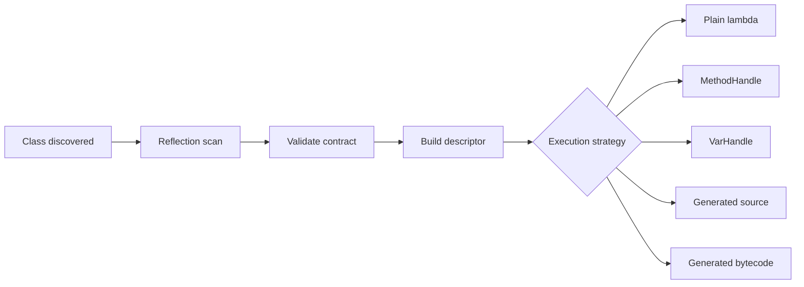
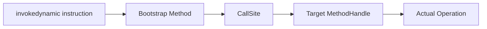

# Part 031 — Method Handles, VarHandles, and Dynamic Invocation

## 0. Posisi Part Ini Dalam Seri

Part 029 dan 030 membahas reflection sebagai mekanisme introspeksi dan framework substrate.

Part ini membahas level yang lebih dekat ke runtime invocation modern Java:

- `MethodHandle`,
- `MethodHandles.Lookup`,
- `MethodType`,
- combinator API,
- `CallSite`,
- `invokedynamic`,
- `VarHandle`,
- dynamic dispatch untuk framework/library,
- kapan memilih reflection, method handle, generated code, atau plain Java.

Tujuan utamanya bukan sekadar tahu API. Targetnya adalah mampu mendesain runtime engine yang:

- type-aware,
- aman terhadap access boundary,
- performa stabil,
- mudah di-cache,
- kompatibel dengan module system,
- bisa menjadi fondasi framework, DSL, rule engine, mapper, router, atau plugin system.

---

## 1. Mental Model: Reflection vs Method Handle vs Generated Code

Reflection dan method handle sama-sama bisa merepresentasikan operasi runtime, tetapi orientasinya berbeda.

| Mekanisme | Fokus | Cocok Untuk | Risiko Utama |
|---|---|---|---|
| Reflection | inspect metadata + invoke dynamically | scanning, descriptor building, admin tooling | access checks, boxed invocation, stringly usage |
| Method Handle | typed executable reference | hot path dispatch, runtime binding, framework invocation | lookup complexity, exact type matching |
| VarHandle | typed variable access | field/array/memory-like access, atomic/volatile semantics | memory ordering misuse |
| Generated source | compile-time generated Java | fast readable adapters, AOT-friendly framework | build complexity |
| Generated bytecode | runtime/proxy optimization | advanced proxies, interceptors, language runtime | class loader lifecycle, debugging cost |

Formula praktis:

```text
Reflection discovers.
MethodHandle executes.
VarHandle accesses state.
Generated code removes runtime guesswork.
```

Aturan desain:

1. Pakai reflection untuk menemukan struktur.
2. Validasi struktur sekali.
3. Ubah menjadi descriptor stabil.
4. Untuk hot path, pakai method handle, var handle, generated adapter, atau plain precomputed function.



---

## 2. What Is a MethodHandle?

`MethodHandle` adalah referensi executable yang strongly typed ke suatu operasi:

- instance method,
- static method,
- constructor,
- field getter,
- field setter,
- array operation,
- adapted operation,
- composed operation.

Hal yang membedakan method handle dari reflection:

- method handle punya `MethodType`,
- access checking terjadi ketika handle dibuat,
- invocation bisa dibuat sangat dekat dengan direct call setelah warm-up,
- handle dapat diadaptasi dan dikomposisi,
- digunakan sebagai substrate untuk lambda, dynamic language, dan `invokedynamic`.

Secara mental:

```text
MethodHandle = capability + function pointer + type descriptor + optional adaptation chain
```

Contoh sederhana:

```java
import java.lang.invoke.MethodHandle;
import java.lang.invoke.MethodHandles;
import java.lang.invoke.MethodType;

public class MethodHandleBasics {
    static class Greeter {
        public String greet(String name) {
            return "Hello, " + name;
        }
    }

    public static void main(String[] args) throws Throwable {
        MethodHandles.Lookup lookup = MethodHandles.lookup();

        MethodHandle mh = lookup.findVirtual(
                Greeter.class,
                "greet",
                MethodType.methodType(String.class, String.class)
        );

        Greeter greeter = new Greeter();
        String result = (String) mh.invokeExact(greeter, "Ayu");

        System.out.println(result);
    }
}
```

Perhatikan signature runtime-nya:

```text
(Greeter, String)String
```

Karena method `greet` adalah instance method, receiver menjadi argumen pertama pada method handle.

---

## 3. MethodType: Signature Sebagai Runtime Object

`MethodType` merepresentasikan return type dan parameter types.

```java
MethodType type = MethodType.methodType(String.class, String.class);
```

Artinya:

```text
(String)String
```

Untuk instance method, `MethodType` yang digunakan saat lookup tidak memasukkan receiver. Namun method handle hasil lookup memiliki receiver sebagai argumen pertama.

```java
MethodHandle mh = lookup.findVirtual(
    Greeter.class,
    "greet",
    MethodType.methodType(String.class, String.class)
);

System.out.println(mh.type());
```

Secara konseptual:

```text
lookup signature: (String)String
handle signature: (Greeter, String)String
```

Kenapa ini penting?

Karena hampir semua error method handle di production berasal dari salah memahami signature aktual.

Checklist sebelum menyalahkan JVM:

- Apakah receiver termasuk di handle type?
- Apakah primitive vs wrapper cocok?
- Apakah return type persis sesuai?
- Apakah argumen sudah diadaptasi?
- Apakah `invokeExact` digunakan dengan cast eksplisit yang benar?

---

## 4. `invokeExact` vs `invoke`

Ada dua mode invocation utama:

```java
mh.invokeExact(...);
mh.invoke(...);
```

| Invocation | Sifat | Cocok Untuk |
|---|---|---|
| `invokeExact` | signature harus match secara exact | hot path, controlled framework engine |
| `invoke` | mengizinkan beberapa konversi method invocation | dynamic boundary, adapter layer |

Contoh exact invocation:

```java
String result = (String) mh.invokeExact(greeter, "Ayu");
```

Cast return penting karena compiler perlu tahu call-site signature.

Contoh yang bisa gagal:

```java
Object result = mh.invokeExact(greeter, "Ayu"); // Wrong if handle returns String
```

Meskipun `String` bisa ditaruh ke `Object`, `invokeExact` membutuhkan signature persis.

Versi yang benar:

```java
String result = (String) mh.invokeExact(greeter, "Ayu");
Object boxed = result;
```

Atau adapt handle:

```java
MethodHandle adapted = mh.asType(
    MethodType.methodType(Object.class, Greeter.class, String.class)
);

Object result = adapted.invokeExact(greeter, "Ayu");
```

Mental model:

```text
invokeExact = no surprise, no implicit guesswork.
invoke      = boundary convenience, not ideal as internal hot path default.
```

---

## 5. Lookup: Capability Model, Bukan Sekadar Factory

`MethodHandles.Lookup` adalah capability object.

Itu berarti `Lookup` tidak hanya membuat handle. Ia membawa otoritas akses.

```java
MethodHandles.Lookup lookup = MethodHandles.lookup();
```

Lookup object menentukan apakah kode saat ini boleh mengakses:

- public member,
- package-private member,
- protected member,
- private member,
- member dalam module/package tertentu.

Pola yang buruk:

```java
static final MethodHandles.Lookup GLOBAL = MethodHandles.lookup();
```

Kenapa buruk?

Karena access authority tergantung lexical class tempat lookup dibuat. Menyimpan dan menyebarkannya tanpa desain jelas bisa membuat boundary kabur.

Pola lebih baik:

```java
final class Accessors {
    private final MethodHandles.Lookup lookup;

    Accessors(MethodHandles.Lookup lookup) {
        this.lookup = lookup;
    }
}
```

Untuk framework yang perlu bekerja pada target class, gunakan capability secara eksplisit:

```java
MethodHandles.Lookup privateLookup = MethodHandles.privateLookupIn(
    targetClass,
    MethodHandles.lookup()
);
```

Namun ini tetap tunduk pada module/package access rules.

Rule senior-level:

```text
A Lookup is an access token. Treat it like authority, not convenience.
```

---

## 6. Common Lookup Operations

### 6.1 Static Method

```java
class Slug {
    public static String normalize(String value) {
        return value.trim().toLowerCase().replace(' ', '-');
    }
}

MethodHandle mh = lookup.findStatic(
    Slug.class,
    "normalize",
    MethodType.methodType(String.class, String.class)
);

String out = (String) mh.invokeExact("Hello Java");
```

Handle signature:

```text
(String)String
```

### 6.2 Virtual Method

```java
MethodHandle mh = lookup.findVirtual(
    String.class,
    "substring",
    MethodType.methodType(String.class, int.class, int.class)
);

String out = (String) mh.invokeExact("abcdef", 1, 4);
```

Handle signature:

```text
(String, int, int)String
```

### 6.3 Constructor

```java
record Money(String currency, long cents) {}

MethodHandle ctor = lookup.findConstructor(
    Money.class,
    MethodType.methodType(void.class, String.class, long.class)
);

Money money = (Money) ctor.invokeExact("IDR", 100_000L);
```

Constructor lookup memakai return `void` pada `MethodType`, tetapi handle hasilnya mengembalikan object.

Konsep:

```text
lookup constructor type: (String, long)void
handle type:             (String, long)Money
```

### 6.4 Field Getter/Setter

```java
class Counter {
    public int value;
}

MethodHandle getter = lookup.findGetter(Counter.class, "value", int.class);
MethodHandle setter = lookup.findSetter(Counter.class, "value", int.class);

Counter c = new Counter();
setter.invokeExact(c, 42);
int value = (int) getter.invokeExact(c);
```

Untuk field access modern, sering kali `VarHandle` lebih tepat daripada getter/setter method handle, terutama jika butuh access mode seperti volatile/atomic.

---

## 7. Binding Receiver dan Partial Application

Untuk instance method, receiver adalah argumen pertama. Kita bisa mengikat receiver dengan `bindTo`.

```java
MethodHandle substring = lookup.findVirtual(
    String.class,
    "substring",
    MethodType.methodType(String.class, int.class, int.class)
);

MethodHandle bound = substring.bindTo("abcdef");
String out = (String) bound.invokeExact(1, 4);
```

Sebelum bind:

```text
(String, int, int)String
```

Sesudah bind:

```text
(int, int)String
```

Ini berguna saat membangun descriptor untuk instance tertentu:

```java
record HandlerDescriptor(String route, MethodHandle invocation) {}
```

Tetapi hati-hati: binding instance ke long-lived cache dapat membuat object tidak bisa di-GC.

Anti-pattern:

```java
static final Map<String, MethodHandle> CACHE = new ConcurrentHashMap<>();
// Cache berisi bound handle ke bean/request object.
```

Lebih aman:

```text
Cache unbound handle per class/method.
Pass receiver at invocation time.
```

---

## 8. Adapting Method Handles

Method handle dapat diadaptasi. Ini adalah salah satu kekuatan utamanya.

### 8.1 `asType`

`asType` mengubah signature handle selama konversi legal.

```java
MethodHandle mh = lookup.findStatic(
    Integer.class,
    "parseInt",
    MethodType.methodType(int.class, String.class)
);

MethodHandle adapted = mh.asType(
    MethodType.methodType(Object.class, Object.class)
);

Object result = adapted.invokeExact((Object) "123");
```

Gunakan untuk membuat boundary uniform:

```text
Object[] input -> Object output
```

Namun jangan jadikan semua internal engine `Object` jika Anda bisa mempertahankan type information. Terlalu cepat menghapus type akan menghilangkan banyak optimisasi dan safety.

### 8.2 `dropArguments`

Menambah argumen yang diabaikan.

```java
MethodHandle constant = MethodHandles.constant(String.class, "OK");
MethodHandle withIgnoredContext = MethodHandles.dropArguments(
    constant,
    0,
    RequestContext.class
);
```

Berguna untuk menyamakan signature handler.

### 8.3 `insertArguments`

Menyisipkan argumen tetap.

```java
MethodHandle parse = lookup.findStatic(
    Integer.class,
    "parseInt",
    MethodType.methodType(int.class, String.class, int.class)
);

MethodHandle parseBase10 = MethodHandles.insertArguments(parse, 1, 10);
int value = (int) parseBase10.invokeExact("123");
```

### 8.4 `filterArguments`

Pre-processing argumen.

```java
MethodHandle trim = lookup.findVirtual(
    String.class,
    "trim",
    MethodType.methodType(String.class)
);

MethodHandle parseInt = lookup.findStatic(
    Integer.class,
    "parseInt",
    MethodType.methodType(int.class, String.class)
);

MethodHandle parseTrimmed = MethodHandles.filterArguments(parseInt, 0, trim);
int value = (int) parseTrimmed.invokeExact(" 42 ");
```

Mental model:

```text
parseTrimmed(x) = parseInt(trim(x))
```

### 8.5 `filterReturnValue`

Post-processing return value.

```java
MethodHandle toString = lookup.findVirtual(
    Object.class,
    "toString",
    MethodType.methodType(String.class)
);

MethodHandle trimResult = MethodHandles.filterReturnValue(toString, trim);
```

### 8.6 `guardWithTest`

Conditional dispatch.

```java
MethodHandle test = lookup.findStatic(
    Rules.class,
    "isAdmin",
    MethodType.methodType(boolean.class, User.class)
);

MethodHandle target = lookup.findStatic(
    Rules.class,
    "allow",
    MethodType.methodType(Decision.class, User.class)
);

MethodHandle fallback = lookup.findStatic(
    Rules.class,
    "deny",
    MethodType.methodType(Decision.class, User.class)
);

MethodHandle guarded = MethodHandles.guardWithTest(test, target, fallback);
```

Konsep:

```text
isAdmin(user) ? allow(user) : deny(user)
```

Ini adalah primitive penting untuk dynamic dispatch dan inline-cache-like design.

---

## 9. Designing a Uniform Invocation Descriptor

Framework sering butuh menjalankan berbagai method dengan bentuk berbeda:

```java
@Get("/users/{id}")
UserDto getUser(String id) { ... }

@Post("/users")
UserDto createUser(CreateUserRequest request) { ... }
```

Daripada menjalankan reflection setiap request, kita buat descriptor.

```java
record InvokerDescriptor(
        String operationName,
        MethodHandle handle,
        MethodType inputType,
        Class<?> returnType
) {}
```

Lalu saat bootstrap:

```java
MethodHandle raw = privateLookup.findVirtual(
    controllerClass,
    method.getName(),
    MethodType.methodType(method.getReturnType(), method.getParameterTypes())
);

MethodHandle bound = raw.bindTo(controllerInstance);
```

Namun untuk cache global, hindari bound instance jika lifecycle-nya pendek. Lebih aman:

```java
record OperationPlan(
        Class<?> receiverType,
        MethodHandle unboundHandle,
        List<ParameterPlan> parameters
) {}
```

Invocation:

```java
Object result = plan.unboundHandle().invokeWithArguments(argsWithReceiver);
```

Untuk hot path tinggi, jangan gunakan `invokeWithArguments` terus-menerus karena ia convenience API berbasis list/varargs dan adaptation. Buat adapter dengan signature stabil.

---

## 10. MethodHandle Failure Modes

| Failure | Gejala | Akar Masalah | Solusi |
|---|---|---|---|
| `WrongMethodTypeException` | runtime error saat invoke | signature tidak exact | print `mh.type()`, adapt dengan `asType` |
| `IllegalAccessException` | lookup gagal | authority tidak cukup | gunakan lookup dari scope benar / `privateLookupIn` |
| `NoSuchMethodException` | lookup gagal | wrong name/type | bangun `MethodType` dari reflection metadata |
| receiver leak | memory leak | bound handle dicache global | cache unbound handle |
| class loader leak | redeploy leak | cache strong reference ke class/handle | gunakan `ClassValue` atau lifecycle cache |
| performance tidak stabil | hot path lambat | `invokeWithArguments`, boxing, megamorphic path | shape signature, cache adapter |
| module access failure | works locally, fails in module | package tidak open/export | desain module contract eksplisit |

Praktik debugging:

```java
System.out.println("handle type = " + handle.type());
System.out.println("expected    = " + expectedType);
```

Untuk framework, selalu bungkus error dengan konteks:

```text
Failed to build invoker for com.acme.UserController#getUser(String):
- discovered method: public UserDto getUser(String)
- expected route signature: (RequestContext)Object
- handle type before adaptation: (UserController,String)UserDto
- module: com.acme.users
- package: com.acme.users.api
```

Error message yang bagus menghemat jam debugging.

---

## 11. CallSite dan `invokedynamic`

`invokedynamic` adalah bytecode instruction yang linkage-nya ditentukan saat runtime oleh bootstrap method.

Anda biasanya tidak menulis `invokedynamic` langsung di Java source. Namun Anda menggunakannya secara tidak langsung melalui:

- lambda,
- string concatenation modern,
- dynamic language runtime,
- beberapa framework/code generation tingkat lanjut.

`CallSite` merepresentasikan target method handle untuk dynamic call site.

Tiga jenis umum:

| CallSite | Sifat | Cocok Untuk |
|---|---|---|
| `ConstantCallSite` | target tetap | lambda/static linkage |
| `MutableCallSite` | target bisa berubah | dynamic relinking |
| `VolatileCallSite` | target update terlihat lintas thread | dynamic runtime dengan visibility kuat |

Mental model:



Pada level framework biasa, Anda jarang perlu membuat `CallSite` sendiri. Namun memahami model ini penting karena:

- lambda bukan anonymous class biasa,
- dynamic dispatch bisa dioptimasi lewat stable call site,
- JVM bisa mengoptimalkan target yang stabil,
- runtime language di JVM banyak bergantung pada mekanisme ini.

---

## 12. Lambda dan `LambdaMetafactory`

Lambda Java secara umum diimplementasikan melalui `invokedynamic` dan bootstrap logic yang dapat membuat instance functional interface.

Untuk framework advanced, kadang Anda ingin mengubah method handle menjadi functional interface.

Contoh sederhana bisa dibuat tanpa `LambdaMetafactory`:

```java
@FunctionalInterface
interface StringParser<T> {
    T parse(String value) throws Throwable;
}
```

Lalu bungkus manual:

```java
MethodHandle parseInt = lookup.findStatic(
    Integer.class,
    "parseInt",
    MethodType.methodType(int.class, String.class)
);

StringParser<Integer> parser = value -> (Integer) parseInt.invoke(value);
```

Untuk library yang sangat performance-sensitive, `LambdaMetafactory` dapat membuat implementation functional interface yang lebih dekat ke lambda JVM-native. Namun API-nya kompleks dan raw. Gunakan hanya jika benar-benar perlu.

Rule praktis:

```text
Prefer normal lambdas and generated adapters.
Reach for LambdaMetafactory only when you control signatures and have measured the bottleneck.
```

---

## 13. VarHandle: Typed Reference to Variables

`VarHandle` adalah reference strongly typed ke variable-like storage:

- instance field,
- static field,
- array element,
- byte array view,
- memory segment component melalui API tertentu.

Berbeda dari `MethodHandle`, `VarHandle` fokus pada **access mode**.

Contoh field:

```java
import java.lang.invoke.MethodHandles;
import java.lang.invoke.VarHandle;

class AccountState {
    volatile int version;
}

public class VarHandleExample {
    static final VarHandle VERSION;

    static {
        try {
            VERSION = MethodHandles.lookup().findVarHandle(
                AccountState.class,
                "version",
                int.class
            );
        } catch (ReflectiveOperationException e) {
            throw new ExceptionInInitializerError(e);
        }
    }

    static boolean advance(AccountState state, int expected, int next) {
        return VERSION.compareAndSet(state, expected, next);
    }
}
```

Access mode contoh:

```java
VERSION.get(state);
VERSION.set(state, 1);
VERSION.getVolatile(state);
VERSION.setVolatile(state, 2);
VERSION.compareAndSet(state, 2, 3);
VERSION.getAndAdd(state, 1);
```

Mental model:

```text
MethodHandle = executable operation handle.
VarHandle    = variable access handle with memory semantics.
```

---

## 14. VarHandle Access Modes dan Memory Semantics

`VarHandle` menyediakan access mode dengan kekuatan memory ordering berbeda.

| Mode | Karakter | Gunakan Saat |
|---|---|---|
| plain `get/set` | ordinary access | tidak ada concurrency contract khusus |
| opaque | ordering sangat lemah tapi visible dengan aturan tertentu | advanced low-level patterns |
| acquire/release | one-way memory ordering | handoff state, lock-free structures |
| volatile | strong ordering seperti volatile field | publish/observe lintas thread |
| compare-and-set | atomic conditional update | state transition, CAS loop |
| get-and-add/set | atomic read-modify-write | counters, sequence |

Jangan memakai weaker mode hanya karena terlihat lebih cepat. Pilih berdasarkan invariant concurrency.

Checklist:

```text
1. Apakah value dibaca/ditulis lintas thread?
2. Apakah butuh visibility?
3. Apakah butuh ordering?
4. Apakah butuh atomicity?
5. Apakah invariant bisa rusak jika update lost?
```

Contoh CAS loop:

```java
static int increment(AccountState state) {
    while (true) {
        int current = (int) VERSION.getVolatile(state);
        int next = current + 1;
        if (VERSION.compareAndSet(state, current, next)) {
            return next;
        }
    }
}
```

Catatan: jika hanya butuh counter sederhana, `AtomicInteger` sering lebih jelas. `VarHandle` lebih cocok untuk framework/low-level data structure yang butuh kontrol terhadap field existing atau array layout.

---

## 15. Reflection Field vs VarHandle

Misalnya Anda membangun mapper.

Reflection:

```java
Field field = User.class.getDeclaredField("name");
field.setAccessible(true);
field.set(user, "Ayu");
```

VarHandle:

```java
VarHandle name = privateLookup.findVarHandle(User.class, "name", String.class);
name.set(user, "Ayu");
```

Perbandingan:

| Aspek | Field Reflection | VarHandle |
|---|---|---|
| metadata | kuat | bukan untuk metadata |
| access operation | dynamic/object-like | typed access modes |
| concurrency mode | terbatas | explicit access modes |
| hot path | perlu hati-hati | lebih cocok untuk prepared accessor |
| framework scanning | baik | bukan scanner |

Pola yang masuk akal:

```text
Use reflection to discover fields.
Use VarHandle to access selected fields in a prepared runtime model.
```

---

## 16. Dynamic Dispatch Engine: Mini Example

Bayangkan rule engine sederhana:

```java
interface Rule<T> {
    boolean test(T input);
}
```

User menandai method:

```java
class PaymentRules {
    public boolean highValue(Payment payment) {
        return payment.amountCents() >= 100_000_000;
    }
}
```

Descriptor:

```java
record RulePlan(
        String name,
        Class<?> inputType,
        MethodHandle testHandle
) {
    boolean test(Object receiver, Object input) {
        try {
            return (boolean) testHandle.invoke(receiver, input);
        } catch (Throwable t) {
            throw new RuleInvocationException(name, inputType, t);
        }
    }
}
```

Bootstrap:

```java
static RulePlan buildRule(Class<?> ruleClass, Method method) throws Exception {
    MethodHandles.Lookup lookup = MethodHandles.privateLookupIn(
        ruleClass,
        MethodHandles.lookup()
    );

    MethodHandle handle = lookup.unreflect(method);

    Class<?> inputType = method.getParameterTypes()[0];

    MethodHandle adapted = handle.asType(
        MethodType.methodType(boolean.class, ruleClass, Object.class)
    );

    return new RulePlan(method.getName(), inputType, adapted);
}
```

Masalah desain yang harus dijawab:

- Apakah receiver dicache atau dipassing?
- Apakah method boleh private?
- Apakah method harus deterministic?
- Apakah exception dari rule dibungkus atau dipropagasi?
- Apakah input type dicek sebelum invocation?
- Apakah class loader lifecycle aman?
- Apakah rule module membuka package-nya?

Framework yang matang bukan hanya bisa invoke method. Framework yang matang punya contract.

---

## 17. `unreflect`: Jembatan Reflection ke Method Handle

Jika Anda sudah menemukan `Method` via reflection, Anda bisa membuat method handle:

```java
Method method = controllerClass.getDeclaredMethod("getUser", String.class);
MethodHandle handle = lookup.unreflect(method);
```

Untuk constructor:

```java
Constructor<User> ctor = User.class.getDeclaredConstructor(String.class);
MethodHandle handle = lookup.unreflectConstructor(ctor);
```

Untuk field:

```java
Field field = User.class.getDeclaredField("name");
MethodHandle getter = lookup.unreflectGetter(field);
MethodHandle setter = lookup.unreflectSetter(field);
```

Ini sangat berguna dalam framework:

1. Reflection scan menemukan member.
2. Reflection metadata dipakai untuk validasi/anotasi/generic info.
3. `unreflect` mengubah member terpilih menjadi executable accessor.

Namun access rules tetap berlaku. Jangan menganggap `unreflect` sebagai bypass permanen terhadap encapsulation.

---

## 18. Module System dan Access Boundary

Dengan JPMS, access bukan hanya `public` atau `private`. Ada juga:

- apakah package diekspor,
- apakah package dibuka untuk deep reflection,
- apakah module membaca module lain,
- apakah caller punya lookup capability tepat.

Contoh module:

```java
module com.acme.orders {
    exports com.acme.orders.api;
    opens com.acme.orders.internal.model to com.acme.framework;
}
```

Makna:

- `exports` membuat package bisa dipakai compile/runtime oleh module lain.
- `opens` membuat package tersedia untuk deep reflection/runtime access kepada target module tertentu.

Desain framework yang baik tidak diam-diam meminta semua package dibuka. Ia mendokumentasikan module contract.

Contoh error message yang baik:

```text
Cannot create private lookup for com.acme.orders.internal.model.OrderEntity.
Package com.acme.orders.internal.model is not opened to com.acme.framework.
Add:

opens com.acme.orders.internal.model to com.acme.framework;
```

---

## 19. Performance Model

Method handle bukan jaminan otomatis lebih cepat dari reflection dalam semua situasi. Yang penting adalah shape dan lifecycle.

| Pola | Dampak |
|---|---|
| lookup setiap request | buruk |
| `invokeWithArguments` di hot path | sering lambat |
| stable `invokeExact` signature | baik |
| adapter dibuat sekali | baik |
| receiver bound ke object short-lived | leak risk |
| method handle cache per class loader | perlu lifecycle control |
| generated adapter | sering paling jelas untuk hot path |

Hot path strategy:

```text
1. Build handle once.
2. Adapt once.
3. Cache per class/lifecycle.
4. Invoke with stable signature.
5. Avoid varargs/list/object array path if throughput matters.
6. Measure with JMH, not intuition.
```

Contoh stable adapter:

```java
@FunctionalInterface
interface OperationInvoker {
    Object invoke(Object receiver, Object argument) throws Throwable;
}
```

Manual wrapper:

```java
OperationInvoker invoker = (receiver, argument) ->
    handle.invoke(receiver, argument);
```

Untuk library production, bandingkan:

- reflection cached `Method.invoke`,
- method handle `invoke`,
- method handle `invokeExact`,
- generated source adapter,
- bytecode generated adapter.

Keputusan final harus berbasis benchmark representatif.

---

## 20. MethodHandle Design Patterns

### 20.1 Prepared Invoker Pattern

```java
record PreparedInvoker(
        String displayName,
        MethodHandle handle,
        MethodType type
) {
    Object invoke(Object receiver, Object arg) {
        try {
            return handle.invoke(receiver, arg);
        } catch (Throwable e) {
            throw new InvocationFailure(displayName, type, e);
        }
    }
}
```

Gunakan saat framework butuh error wrapping dan descriptor tracing.

### 20.2 Descriptor + Accessor Pattern

```java
record PropertyAccessor(
        String name,
        Class<?> type,
        VarHandle handle
) {
    Object get(Object target) {
        return handle.get(target);
    }

    void set(Object target, Object value) {
        handle.set(target, value);
    }
}
```

Gunakan untuk mapper/config binder.

### 20.3 Uniform Handler Signature

Adapt semua handler menjadi satu signature:

```java
MethodType uniform = MethodType.methodType(
    Object.class,
    Object.class,
    RequestContext.class
);
```

Lalu engine tidak perlu tahu bentuk asli handler.

Trade-off:

- lebih simpel,
- lebih uniform,
- tetapi kehilangan sebagian type precision.

### 20.4 Guarded Dispatch

```text
if predicate matches -> target
else -> fallback
```

Cocok untuk rule engine, dynamic type dispatch, plugin routing.

### 20.5 ClassValue Cache

```java
final class AccessorCache {
    private static final ClassValue<List<PropertyAccessor>> CACHE = new ClassValue<>() {
        @Override
        protected List<PropertyAccessor> computeValue(Class<?> type) {
            return buildAccessors(type);
        }
    };

    static List<PropertyAccessor> accessorsFor(Class<?> type) {
        return CACHE.get(type);
    }
}
```

`ClassValue` membantu mengaitkan cache dengan lifecycle class.

---

## 21. Framework Decision Matrix

| Kebutuhan | Rekomendasi |
|---|---|
| hanya metadata | reflection |
| invoke jarang | cached reflection cukup |
| invoke sering, signature stabil | method handle |
| field access dengan atomic/volatile | var handle |
| AOT/native-image friendly | generated source |
| proxy/interceptor complex | Byte Buddy/ASM/proxy |
| dynamic language runtime | method handle + call site |
| public plugin API | avoid private lookup requirement |
| internal framework over owned classes | method handle/private lookup bisa masuk akal |

Rule desain:

```text
Do not choose MethodHandle because it is fashionable.
Choose it when execution shape, access model, and lifecycle justify it.
```

---

## 22. Testing Strategy

Test method handle framework di beberapa level.

### 22.1 Signature Tests

```java
assertEquals(
    MethodType.methodType(Object.class, Object.class, RequestContext.class),
    descriptor.handle().type()
);
```

### 22.2 Access Tests

- public class public method,
- package-private class,
- private method with opened module,
- private method without opened module,
- inherited method,
- bridge method,
- default interface method.

### 22.3 Class Loader Lifecycle Tests

Simulasikan load/unload jika framework dipakai di plugin/server environment.

Test invariant:

```text
After plugin unload, framework cache must not retain plugin classes or instances.
```

### 22.4 Error Message Tests

Framework-level tests harus memverifikasi error bukan sekadar gagal, tetapi memberi konteks actionable.

---

## 23. Anti-Patterns

### 23.1 MethodHandle Everywhere

Tidak semua dynamic operation perlu method handle. Jika invocation jarang dan metadata dominan, reflection cukup.

### 23.2 `invokeWithArguments` in Hot Path

Convenient, tetapi sering membayar overhead adaptation, list/array, boxing.

### 23.3 Ignoring Receiver in Signature

Instance method handle memasukkan receiver sebagai argumen pertama. Ini sumber error umum.

### 23.4 Caching Bound Handles Globally

Bound handle bisa menahan receiver dan menyebabkan leak.

### 23.5 Treating VarHandle as Reflection Replacement

VarHandle bukan scanner metadata. Ia access primitive.

### 23.6 Weak Memory Mode Without Proof

Menggunakan opaque/acquire/release tanpa memahami invariant concurrency adalah bug generator.

### 23.7 Private Lookup as Framework Default

Jika framework selalu butuh private access, API pengguna menjadi fragile dan module-hostile.

---

## 24. Practice: Build a Minimal Runtime Invoker

Target latihan 90 menit:

Buat mini library:

```java
@Operation("normalizeName")
public String normalize(String name) { ... }
```

Library harus:

1. scan class,
2. temukan method beranotasi `@Operation`,
3. validasi method punya satu parameter,
4. buat `MethodHandle`,
5. adapt ke signature uniform,
6. cache descriptor,
7. invoke by operation name,
8. beri error message jelas.

Signature uniform:

```java
@FunctionalInterface
interface OperationInvoker {
    Object invoke(Object receiver, Object input) throws Throwable;
}
```

Descriptor:

```java
record OperationDescriptor(
    String name,
    Class<?> receiverType,
    Class<?> inputType,
    Class<?> outputType,
    MethodHandle handle
) {}
```

Acceptance criteria:

- private method gagal dengan error actionable,
- wrong arity gagal saat bootstrap,
- return `void` ditolak kecuali policy mengizinkan,
- receiver tidak di-cache secara global,
- descriptor menyimpan original method name untuk diagnostics,
- test mencetak handle type saat failure.

---

## 25. Kaufman 20-Hour Practice Loop

### Hour 1–2: MethodType dan Lookup

- tulis 10 lookup: static, virtual, constructor, getter, setter,
- print semua `handle.type()`,
- sengaja buat `WrongMethodTypeException` dan pahami penyebabnya.

### Hour 3–5: Adaptation

- pakai `asType`, `bindTo`, `insertArguments`, `dropArguments`, `filterArguments`,
- ubah berbagai method menjadi signature uniform.

### Hour 6–8: Descriptor Engine

- scan method dengan reflection,
- convert ke method handle,
- simpan descriptor,
- invoke via registry.

### Hour 9–11: VarHandle

- akses field instance/static,
- akses array element,
- implement CAS state transition sederhana,
- bandingkan dengan `AtomicInteger`.

### Hour 12–15: Framework Hardening

- module/access error,
- class loader cache,
- error message,
- invalid method shape,
- lifecycle policy.

### Hour 16–20: Capstone

Bangun mini operation engine:

- annotation-based operation,
- method handle invocation,
- validation,
- type conversion hook,
- diagnostic trace,
- benchmark sederhana.

---

## 26. Senior-Level Checklist

Sebelum memakai method handle/var handle di production, jawab:

- Apa alasan tidak cukup dengan plain Java?
- Apa alasan tidak cukup dengan reflection cached?
- Apakah signature invocation stabil?
- Siapa pemilik `Lookup` authority?
- Apakah module/package access eksplisit?
- Apakah handle bound atau unbound?
- Apakah cache mengikuti class loader lifecycle?
- Apakah error message actionable?
- Apakah memory semantics VarHandle sudah benar?
- Apakah benchmark membuktikan bottleneck?
- Apakah generated source lebih sederhana?

---

## 27. Ringkasan Mental Model

```text
Reflection = see and describe runtime structure.
MethodHandle = execute a typed operation.
VarHandle = access variable-like storage with explicit semantics.
CallSite = link dynamic invocation to a target handle.
Lookup = capability and access authority.
```

Engineer top-tier tidak memakai metaprogramming karena terlihat canggih. Ia memakai metaprogramming untuk memindahkan kompleksitas dari hot path ke bootstrap, dari runtime guesswork ke validated descriptor, dan dari implicit magic ke kontrak yang bisa dites.

---

## 28. Referensi Resmi

- Java SE 25 API — `java.lang.invoke.MethodHandle`
- Java SE 25 API — `java.lang.invoke.MethodHandles`
- Java SE 25 API — `java.lang.invoke.MethodHandles.Lookup`
- Java SE 25 API — `java.lang.invoke.MethodType`
- Java SE 25 API — `java.lang.invoke.CallSite`
- Java SE 25 API — `java.lang.invoke.VarHandle`
- Java Language Specification SE 25
- Java Virtual Machine Specification — `invokedynamic`, method descriptors, call site linkage
