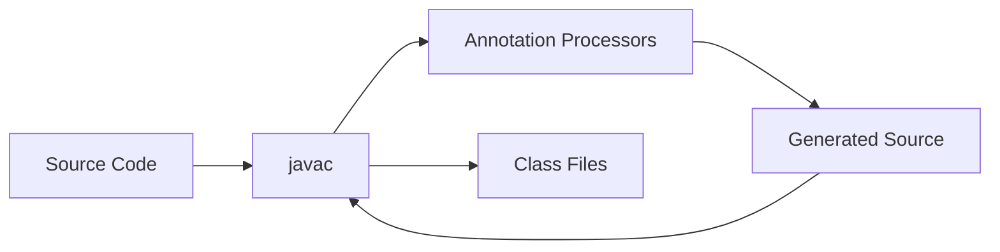
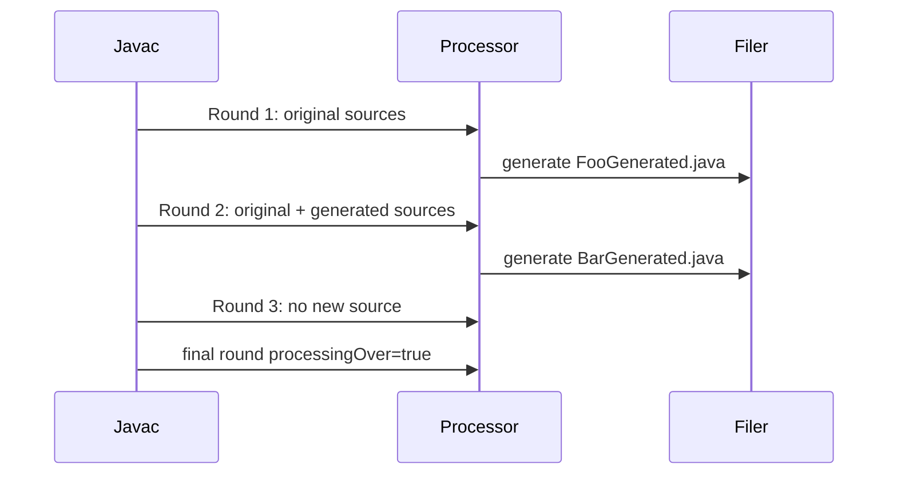
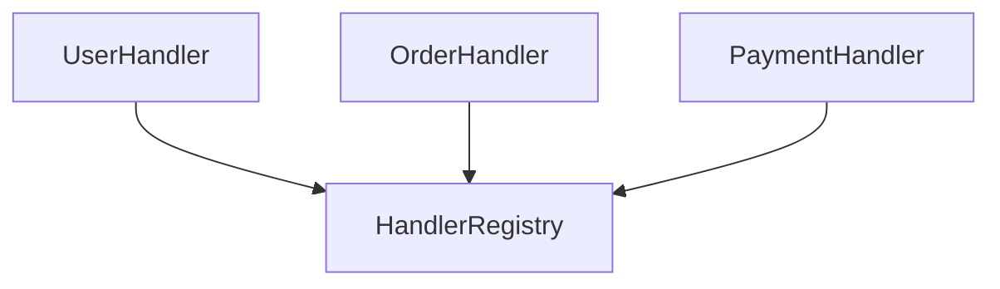

# Part 032 — Annotation Processing Mental Model

## 0. Posisi Part Ini Dalam Seri

Part 031 membahas runtime metaprogramming: method handles, var handles, call sites, dan dynamic invocation.

Part ini bergeser ke compile-time metaprogramming melalui annotation processing.

Targetnya:

- memahami JSR 269 annotation processing model,
- membedakan element model dan type model,
- memahami processing rounds,
- menulis processor yang deterministic,
- menghasilkan source code dengan benar,
- memberi diagnostics yang membantu,
- menghindari processor yang lambat, rapuh, atau hostile terhadap build system,
- menyiapkan fondasi Part 033 tentang compile-time code generation design.

Annotation processor bukan runtime reflection. Ia bekerja saat compilation.

Formula utama:

```text
Annotation processing is compile-time contract analysis plus optional source/resource generation.
```

---

## 1. Kapan Annotation Processing Tepat?

Annotation processing tepat ketika Anda ingin memindahkan kerja dari runtime ke compile-time.

Contoh cocok:

- generate mapper,
- generate registry,
- generate metadata descriptor,
- validate annotation contract,
- generate type-safe DSL,
- generate factory,
- generate schema descriptor,
- generate routing table,
- enforce architectural rule sederhana,
- detect invalid combinations early.

Contoh tidak cocok:

- membaca runtime configuration,
- scan classpath dinamis saat aplikasi berjalan,
- mengakses database/service eksternal saat compile,
- membuat output nondeterministic,
- bergantung pada file system global yang tidak dideklarasikan,
- melakukan heavy network call,
- mengganti source code existing secara in-place.

Rule praktis:

```text
If the fact is knowable from source/types during compilation, annotation processing may be appropriate.
If the fact depends on runtime environment, do not force it into annotation processing.
```

---

## 2. Compile-Time vs Runtime Metaprogramming

| Aspek | Annotation Processing | Reflection/Method Handle |
|---|---|---|
| Waktu kerja | compile-time | runtime |
| Input utama | source model, type model, annotations | loaded classes, runtime metadata |
| Output | generated source/class/resource, diagnostics | descriptors, invocation, dynamic access |
| Failure timing | build fails early | app fails at startup/runtime |
| AOT friendliness | tinggi jika deterministic | perlu konfigurasi/reflection metadata |
| Dynamic capability | rendah | tinggi |
| Build complexity | naik | runtime complexity naik |

Mental model:



Annotation processing berjalan dalam round. Source yang dihasilkan pada satu round dapat ikut dikompilasi dan diproses pada round berikutnya.

---

## 3. Processor API: Komponen Utama

Package inti:

```java
javax.annotation.processing
javax.lang.model.element
javax.lang.model.type
javax.lang.model.util
javax.tools
```

Komponen utama:

| Komponen | Fungsi |
|---|---|
| `Processor` | kontrak processor |
| `AbstractProcessor` | base class praktis |
| `ProcessingEnvironment` | akses ke utilities, filer, messager, options |
| `RoundEnvironment` | informasi per processing round |
| `Filer` | membuat source/class/resource output |
| `Messager` | menulis diagnostics compiler |
| `Elements` | utilitas untuk element/source model |
| `Types` | utilitas untuk type model |
| `Element` | program element: class, method, field, parameter |
| `TypeMirror` | representasi type Java saat compile-time |

Perbedaan paling penting:

```text
Element answers: what declaration is this?
TypeMirror answers: what type is this expression/declaration considered as?
```

Contoh:

```java
List<String> names;
```

- field declaration adalah `VariableElement`,
- type field adalah `DeclaredType` untuk `java.util.List<java.lang.String>`,
- raw element dari type itu adalah `TypeElement` untuk `java.util.List`.

---

## 4. Minimal Annotation Processor

Annotation:

```java
package com.acme.codegen;

import java.lang.annotation.ElementType;
import java.lang.annotation.Retention;
import java.lang.annotation.RetentionPolicy;
import java.lang.annotation.Target;

@Target(ElementType.TYPE)
@Retention(RetentionPolicy.SOURCE)
public @interface GenerateDescriptor {
}
```

Processor:

```java
package com.acme.codegen.processor;

import com.acme.codegen.GenerateDescriptor;

import javax.annotation.processing.AbstractProcessor;
import javax.annotation.processing.RoundEnvironment;
import javax.annotation.processing.SupportedAnnotationTypes;
import javax.annotation.processing.SupportedSourceVersion;
import javax.lang.model.SourceVersion;
import javax.lang.model.element.Element;
import javax.lang.model.element.TypeElement;
import java.util.Set;

@SupportedAnnotationTypes("com.acme.codegen.GenerateDescriptor")
@SupportedSourceVersion(SourceVersion.RELEASE_25)
public final class DescriptorProcessor extends AbstractProcessor {

    @Override
    public boolean process(
            Set<? extends TypeElement> annotations,
            RoundEnvironment roundEnv
    ) {
        if (roundEnv.processingOver()) {
            return false;
        }

        for (Element element : roundEnv.getElementsAnnotatedWith(GenerateDescriptor.class)) {
            if (!(element instanceof TypeElement typeElement)) {
                error(element, "@GenerateDescriptor can only be used on types");
                continue;
            }

            // Generate or validate here.
        }

        return true;
    }

    private void error(Element element, String message) {
        processingEnv.getMessager().printMessage(
            javax.tools.Diagnostic.Kind.ERROR,
            message,
            element
        );
    }
}
```

Service registration:

```text
META-INF/services/javax.annotation.processing.Processor
```

Isi file:

```text
com.acme.codegen.processor.DescriptorProcessor
```

Di build modern, service file sering dihasilkan otomatis oleh helper seperti AutoService, tetapi memahami mekanisme dasar tetap penting.

---

## 5. `process` Return Value: Claiming Annotation

Method `process` mengembalikan boolean.

```java
return true;
```

Artinya processor mengklaim annotation tersebut dan processor lain tidak perlu memproses annotation yang sama pada round tersebut.

```java
return false;
```

Artinya annotation tidak diklaim dan processor lain masih boleh memprosesnya.

Guideline:

| Situasi | Return |
|---|---|
| annotation milik library Anda dan processor adalah owner | `true` |
| processor hanya validator tambahan | sering `false` |
| processor agregator linting | tergantung desain |
| processor gagal dengan error | tetap boleh `true` untuk annotation milik sendiri |

Jangan return `true` untuk annotation umum yang bukan milik Anda. Itu bisa mengganggu processor lain.

---

## 6. Processing Rounds

Annotation processing berjalan dalam beberapa round.



Properti penting:

- processor bisa dipanggil lebih dari sekali,
- source generated pada round sekarang baru terlihat di round berikutnya,
- final round terjadi ketika processing over,
- `processingOver()` bukan waktu untuk generate source baru,
- `errorRaised()` memberi tahu apakah round sebelumnya menghasilkan error.

Anti-pattern umum:

```java
if (roundEnv.processingOver()) {
    generateMissingFiles(); // buruk
}
```

Final round sebaiknya dipakai untuk cleanup ringan atau final validation yang tidak menghasilkan source baru.

---

## 7. Element Model

`Element` merepresentasikan deklarasi program.

Jenis umum:

| Element | Contoh |
|---|---|
| `PackageElement` | `package com.acme;` |
| `TypeElement` | class/interface/record/enum/annotation |
| `ExecutableElement` | method/constructor |
| `VariableElement` | field/parameter/local-ish model tertentu |
| `TypeParameterElement` | generic type parameter |

Contoh membaca class:

```java
TypeElement type = ...;
String simpleName = type.getSimpleName().toString();
String qualifiedName = type.getQualifiedName().toString();
ElementKind kind = type.getKind();
Set<Modifier> modifiers = type.getModifiers();
```

Membaca enclosed members:

```java
for (Element member : type.getEnclosedElements()) {
    if (member instanceof ExecutableElement method) {
        // method or constructor
    }
}
```

Jangan terlalu cepat memakai string parsing. Gunakan API model.

Buruk:

```java
if (element.toString().contains("public")) { ... }
```

Baik:

```java
if (element.getModifiers().contains(Modifier.PUBLIC)) { ... }
```

---

## 8. TypeMirror Model

`TypeMirror` merepresentasikan type.

Jenis penting:

| TypeMirror | Contoh |
|---|---|
| `PrimitiveType` | `int`, `boolean` |
| `DeclaredType` | `String`, `List<String>` |
| `ArrayType` | `String[]` |
| `TypeVariable` | `T` |
| `WildcardType` | `? extends Number` |
| `ExecutableType` | method signature |
| `NoType` | `void`, package/module pseudo-types |
| `ErrorType` | type belum resolve/generated belum ada |

Contoh:

```java
TypeMirror type = variableElement.asType();
```

Mengecek assignability:

```java
Types types = processingEnv.getTypeUtils();
boolean ok = types.isAssignable(sourceType, targetType);
```

Mengecek same type:

```java
boolean same = types.isSameType(a, b);
```

Mengambil erasure:

```java
TypeMirror erased = types.erasure(type);
```

Jangan bandingkan type dengan string kecuali untuk diagnostics.

Buruk:

```java
if (type.toString().equals("java.lang.String")) { ... }
```

Lebih baik:

```java
Elements elements = processingEnv.getElementUtils();
Types types = processingEnv.getTypeUtils();

TypeElement stringElement = elements.getTypeElement("java.lang.String");
boolean isString = types.isSameType(type, stringElement.asType());
```

---

## 9. Element vs Type: Contoh Praktis

Misalnya annotation:

```java
@Handler
final class UserHandler implements Handler<UserCommand, UserResult> {
    @Override
    public UserResult handle(UserCommand command) {
        return null;
    }
}
```

Processor perlu tahu:

- class mana yang diberi `@Handler`,
- apakah dia mengimplementasikan `Handler<I, O>`,
- apa `I` dan `O`,
- method `handle` mana yang override contract.

`TypeElement` menjawab deklarasi class:

```java
TypeElement handlerClass = ...;
```

`TypeMirror` menjawab type relation:

```java
TypeMirror implemented = handlerClass.getInterfaces().get(0);
```

Untuk generic interface, Anda perlu `DeclaredType`:

```java
if (implemented instanceof DeclaredType declared) {
    List<? extends TypeMirror> args = declared.getTypeArguments();
}
```

Jangan memakai reflection mindset:

```java
Class<?> clazz = ... // tidak ada Class<?> untuk source yang sedang dikompilasi
```

Pada annotation processing, Anda bekerja dengan compiler model, bukan loaded runtime class.

---

## 10. Annotation Retention dan Processor

Annotation processing bisa membaca annotation dari source/classpath selama compiler model menyediakannya. Namun desain retention tetap penting.

| Retention | Makna |
|---|---|
| `SOURCE` | hanya source/compile-time |
| `CLASS` | masuk class file, belum tentu tersedia runtime reflection |
| `RUNTIME` | tersedia runtime reflection |

Jika annotation hanya untuk code generation compile-time, pilih `SOURCE`.

```java
@Retention(RetentionPolicy.SOURCE)
public @interface GenerateMapper {}
```

Jika annotation juga dipakai runtime framework, pilih `RUNTIME`, tetapi sadar bahwa Anda mencampur compile-time dan runtime contract.

Rule:

```text
Use the weakest retention that satisfies the contract.
```

---

## 11. Filer: Membuat Output Dengan Benar

`Filer` digunakan untuk membuat source/class/resource.

Contoh generated source sederhana:

```java
private void generateDescriptor(TypeElement type) throws IOException {
    String packageName = processingEnv
        .getElementUtils()
        .getPackageOf(type)
        .getQualifiedName()
        .toString();

    String originalName = type.getSimpleName().toString();
    String generatedName = originalName + "Descriptor";
    String qualifiedName = packageName + "." + generatedName;

    JavaFileObject file = processingEnv
        .getFiler()
        .createSourceFile(qualifiedName, type);

    try (Writer writer = file.openWriter()) {
        writer.write("package " + packageName + ";

");
        writer.write("public final class " + generatedName + " {
");
        writer.write("  public static final String TYPE = "" + originalName + "";
");
        writer.write("}
");
    }
}
```

Perhatikan argumen originating element:

```java
createSourceFile(qualifiedName, type)
```

Ini membantu build tool memahami asal generated file, terutama untuk incremental compilation.

Anti-pattern:

- menulis file langsung ke `src/main/java`,
- menimpa file existing,
- generate file sama lebih dari sekali,
- generate output dengan timestamp/random order,
- tidak menggunakan originating elements.

---

## 12. Messager: Diagnostics Yang Actionable

Gunakan `Messager` untuk error/warning/note.

```java
processingEnv.getMessager().printMessage(
    Diagnostic.Kind.ERROR,
    "@GenerateDescriptor requires a public top-level class",
    element
);
```

Diagnostic yang buruk:

```text
Invalid annotation
```

Diagnostic yang baik:

```text
@GenerateDescriptor can only be used on public top-level classes.
Found: private nested class com.acme.UserModule.InternalUser.
Move the annotation to a public top-level class or make this nested class public static.
```

Gunakan overload yang menyertakan annotation/annotation value jika error terkait attribute tertentu.

Template diagnostic:

```text
<Annotation> <rule violated>.
Found: <actual shape>.
Expected: <required shape>.
Why: <short reason>.
Fix: <concrete action>.
```

---

## 13. Supported Options

Processor bisa menerima option dari compiler/build tool.

```java
@Override
public Set<String> getSupportedOptions() {
    return Set.of("acme.codegen.mode", "acme.codegen.failOnWarning");
}
```

Membaca option:

```java
String mode = processingEnv.getOptions()
    .getOrDefault("acme.codegen.mode", "default");
```

Maven/Gradle dapat meneruskan `-Akey=value`.

Contoh:

```text
-Aacme.codegen.mode=strict
```

Guideline:

- option harus terdokumentasi,
- default harus deterministic,
- jangan menyembunyikan semantic besar di option yang obscure,
- option harus stabil karena menjadi build contract.

---

## 14. Supported Source Version

Gunakan source version yang jelas.

```java
@SupportedSourceVersion(SourceVersion.RELEASE_25)
```

Atau override:

```java
@Override
public SourceVersion getSupportedSourceVersion() {
    return SourceVersion.latestSupported();
}
```

Trade-off:

| Pilihan | Kelebihan | Risiko |
|---|---|---|
| fixed release | eksplisit, reproducible | perlu update saat Java baru |
| latest supported | fleksibel | behavior bisa berubah antar JDK |

Untuk library serius, fixed plus release policy biasanya lebih defensible.

---

## 15. Generated Source Design

Generated source adalah public/internal artifact. Ia harus didesain, bukan hanya dicetak.

Checklist:

- package jelas,
- nama deterministic,
- output stable ordering,
- tidak ada timestamp,
- tidak ada absolute path,
- tidak ada machine-specific data,
- generated file punya header minimal,
- source readable,
- compile error mengarah ke generated atau original element secara jelas,
- binary compatibility dipikirkan jika generated type dipakai consumer.

Contoh header:

```java
// Generated by AcmeDescriptorProcessor. Do not edit.
```

Jangan masukkan:

```java
// Generated at 2026-06-30T09:17:42 on /Users/alice/project
```

Itu membuat build tidak reproducible.

---

## 16. Aggregating vs Isolating Processor

Ini konsep penting untuk incremental build.

### Isolating Processor

Setiap output berasal dari satu input utama.

Contoh:

```text
UserMapper -> UserMapperImpl
OrderMapper -> OrderMapperImpl
```

Lebih mudah incremental.

### Aggregating Processor

Satu output menggabungkan banyak input.

Contoh:

```text
All @Handler classes -> HandlerRegistry
```

Lebih sulit incremental karena perubahan satu handler bisa mempengaruhi registry global.



Guideline:

- pilih isolating jika bisa,
- aggregating hanya jika memang contract-nya global,
- deklarasikan behavior agar build tool bisa mengoptimalkan,
- pastikan ordering deterministic.

---

## 17. Processor Determinism

Processor deterministic menghasilkan output sama untuk input sama.

Sumber nondeterminism umum:

- iterasi `HashSet` tanpa sort,
- timestamp,
- random UUID,
- absolute path,
- environment variable tanpa deklarasi,
- file system scan di luar source roots,
- network call,
- locale/timezone dependent formatting,
- parallel writes tidak terkontrol.

Pola aman:

```java
List<TypeElement> types = roundEnv
    .getElementsAnnotatedWith(GenerateDescriptor.class)
    .stream()
    .filter(TypeElement.class::isInstance)
    .map(TypeElement.class::cast)
    .sorted(Comparator.comparing(t -> t.getQualifiedName().toString()))
    .toList();
```

Rule:

```text
Generated output must be a pure function of declared compile inputs and processor options.
```

---

## 18. ErrorType dan Generated Types

Dalam multi-round processing, processor bisa melihat `ErrorType` ketika type belum tersedia atau belum generated.

Jangan langsung menganggap semua `ErrorType` sebagai fatal. Kadang type akan muncul di round berikutnya.

Namun jangan juga diam selamanya.

Strategi:

1. jika dependency generated belum tersedia, defer processing,
2. simpan element untuk round berikutnya,
3. jika final round dan masih unresolved, emit error.

Pseudo-code:

```java
private final Set<String> deferred = new LinkedHashSet<>();

@Override
public boolean process(Set<? extends TypeElement> annotations, RoundEnvironment roundEnv) {
    if (roundEnv.processingOver()) {
        for (String item : deferred) {
            error(null, "Could not resolve generated dependency for " + item);
        }
        return true;
    }

    // process and defer unresolved items
    return true;
}
```

Hati-hati menyimpan `Element` antar round. Lebih aman simpan qualified name dan resolve ulang.

---

## 19. Annotation Values: Class-Valued Attributes

Annotation dengan `Class<?>` attribute:

```java
public @interface AdapterFor {
    Class<?> value();
}
```

Pada processor, memanggil langsung annotation proxy bisa melempar `MirroredTypeException`:

```java
AdapterFor annotation = element.getAnnotation(AdapterFor.class);
Class<?> clazz = annotation.value(); // problematic in processor
```

Pattern yang lebih aman adalah membaca `AnnotationMirror`.

Utility sketch:

```java
static Map<String, AnnotationValue> valuesOf(AnnotationMirror mirror) {
    Map<String, AnnotationValue> values = new LinkedHashMap<>();
    for (Map.Entry<? extends ExecutableElement, ? extends AnnotationValue> e
            : mirror.getElementValues().entrySet()) {
        values.put(e.getKey().getSimpleName().toString(), e.getValue());
    }
    return values;
}
```

Mental model:

```text
At compile-time, prefer mirrors over runtime annotation proxy behavior.
```

---

## 20. Validating Annotation Contract

Annotation processor terbaik sering lebih bernilai sebagai validator daripada generator.

Contoh annotation:

```java
@Target(ElementType.TYPE)
@Retention(RetentionPolicy.SOURCE)
public @interface UseCaseHandler {
    String value();
}
```

Contract:

- hanya boleh pada public final class,
- harus punya constructor tunggal,
- harus implement `Handler<I, O>`,
- input dan output tidak boleh raw type,
- nama use case tidak boleh kosong,
- tidak boleh ada dua handler dengan nama sama.

Validation code sketch:

```java
private void validateHandler(TypeElement type) {
    if (!type.getModifiers().contains(Modifier.PUBLIC)) {
        error(type, "@UseCaseHandler requires a public class");
    }

    if (!type.getModifiers().contains(Modifier.FINAL)) {
        error(type, "@UseCaseHandler classes must be final to keep dispatch predictable");
    }

    // validate interfaces using Types/DeclaredType
}
```

Compilation failure lebih murah daripada runtime incident.

---

## 21. Generating Registry: Aggregating Example

Input:

```java
@UseCaseHandler("create-user")
public final class CreateUserHandler implements Handler<CreateUser, UserCreated> {}

@UseCaseHandler("close-account")
public final class CloseAccountHandler implements Handler<CloseAccount, AccountClosed> {}
```

Generated:

```java
package com.acme.generated;

public final class UseCaseRegistryGenerated {
    private UseCaseRegistryGenerated() {}

    public static void register(UseCaseRegistry registry) {
        registry.register("close-account", CloseAccountHandler.class);
        registry.register("create-user", CreateUserHandler.class);
    }
}
```

Ordering alphabetic by key ensures deterministic output.

Be careful with global registry generation:

- duplicate keys harus error,
- generated package harus stable,
- output class name harus documented,
- multi-module builds perlu strategi per module,
- runtime discovery masih mungkin diperlukan jika plugin dinamis.

---

## 22. Processor and Modules

Dalam JPMS, annotation processor biasanya ditempatkan di module/jar sendiri.

Pertanyaan desain:

- Apakah annotation API dan processor dalam artifact terpisah?
- Apakah runtime library membutuhkan processor?
- Apakah consumer perlu dependency processor di runtime classpath?
- Apakah generated source bergantung pada internal processor classes?

Desain yang baik:

```text
acme-annotations      -> compile-only annotation API
acme-processor        -> annotation processor
acme-runtime          -> runtime API used by generated code
```

Jangan membuat generated code bergantung pada processor implementation package.

Buruk:

```java
import com.acme.processor.internal.RuntimeHelper;
```

Baik:

```java
import com.acme.runtime.UseCaseRegistry;
```

---

## 23. Build Tool Integration Mental Model

Annotation processor adalah bagian dari compilation pipeline. Karena itu ia harus ramah terhadap build tool.

Checklist:

- processor path terpisah dari compile classpath jika memungkinkan,
- generated source directory dikelola build tool,
- options didokumentasikan,
- tidak menulis ke source tree,
- incremental behavior jelas,
- output deterministic,
- tidak melakukan network/file scan liar,
- warning/error actionable,
- processor cepat.

Maven mental model:

```text
source -> maven-compiler-plugin -> javac + processor path -> generated sources -> classes
```

Gradle mental model:

```text
source inputs + annotationProcessor configuration + options -> JavaCompile task outputs
```

Jangan mendesain processor yang hanya benar di IDE tetapi gagal di CI.

---

## 24. Performance Model

Annotation processor lambat memperlambat build semua orang.

Cost umum:

| Cost | Penyebab | Mitigasi |
|---|---|---|
| repeated scanning | scan all elements tiap round | hanya proses annotated elements |
| type resolution berulang | resolve same type repeatedly | cache per processing run |
| string generation berat | manual concat tidak terstruktur | helper generator/source builder |
| nondeterministic output | file selalu berubah | stable ordering, no timestamp |
| aggregating global output | semua perubahan trigger regen | isolating where possible |
| file IO liar | scan filesystem | use Filer and declared inputs |

Cache processor hanya berlaku selama compilation process. Jangan membuat static global cache yang mengasumsikan compiler daemon lifecycle tertentu.

Buruk:

```java
static final Map<String, TypeElement> CACHE = new HashMap<>();
```

Lebih aman:

```java
private final Map<String, TypeMirror> wellKnownTypes = new HashMap<>();
```

Dan isi per processor instance.

---

## 25. Testing Annotation Processor

Test processor harus meliputi:

1. valid input compiles,
2. generated file matches expected,
3. invalid annotation fails compilation,
4. diagnostic message tepat,
5. duplicate/global validation,
6. generic type extraction,
7. incremental-ish behavior,
8. generated source compiles,
9. source version/module case.

Testing style:

```text
compile source fixture -> run processor -> assert diagnostics -> assert generated source
```

Fixture example:

```java
@GenerateDescriptor
public final class UserCommand {
    private final String name;
}
```

Expected generated:

```java
public final class UserCommandDescriptor {
    public static final String TYPE = "UserCommand";
}
```

Golden-file tests berguna, tetapi pastikan tidak terlalu brittle. Untuk generated source, format deterministic sangat membantu.

---

## 26. API Design for Annotations

Annotation adalah API. Perlakukan seperti public contract.

Contoh buruk:

```java
public @interface Generate {
    String value() default "";
    boolean flag() default false;
    int mode() default 0;
}
```

Masalah:

- nama generik,
- `flag` tidak menjelaskan semantic,
- `mode` integer magic,
- value kosong mungkin ambigu.

Lebih baik:

```java
public @interface GenerateDescriptor {
    String name() default "";
    GenerationVisibility visibility() default GenerationVisibility.PACKAGE_PRIVATE;
    boolean includeInheritedMembers() default false;
}

public enum GenerationVisibility {
    PUBLIC,
    PACKAGE_PRIVATE
}
```

Guideline:

- gunakan nama annotation spesifik,
- hindari boolean jika domain punya lebih dari dua mode,
- gunakan enum untuk closed option,
- dokumentasikan default,
- minimalkan attribute,
- jangan expose implementation detail processor,
- pikirkan compatibility saat menambah required attribute.

Menambah attribute tanpa default adalah breaking change untuk semua pengguna annotation.

---

## 27. Compatibility of Annotation APIs

Annotation API juga punya compatibility risk.

| Perubahan | Risiko |
|---|---|
| tambah attribute dengan default | biasanya aman |
| tambah attribute tanpa default | source breaking |
| rename attribute | breaking |
| ubah default | behavioral breaking |
| ubah retention | compile/runtime behavior berubah |
| ubah target | source compatibility risk |
| ubah enum constant | source/binary/behavioral risk |
| ubah generated type name | downstream breaking |

Generated code juga menjadi contract jika consumer mengimpornya langsung.

Jika generated type adalah internal detail, dokumentasikan:

```text
Generated classes are implementation details and should not be referenced directly.
```

Jika generated type adalah public API, versioning harus lebih ketat.

---

## 28. Anti-Patterns

### 28.1 Runtime Reflection Mindset

Processor mencoba memakai `Class<?>` untuk class yang sedang dikompilasi.

Benar: gunakan `TypeElement` dan `TypeMirror`.

### 28.2 Writing to Source Tree

Processor menulis ke `src/main/java`.

Benar: gunakan `Filer`.

### 28.3 Generating Same File Twice

Dalam multiple rounds, processor membuat file yang sama berulang.

Benar: track generated names.

### 28.4 Non-Deterministic Output

Generated file berubah tiap build meski source sama.

Benar: stable ordering, no timestamp/random.

### 28.5 Poor Diagnostics

Processor gagal dengan stack trace atau pesan generik.

Benar: `Messager` dengan element/annotation position.

### 28.6 Over-Aggregation

Satu registry global untuk semua hal, sehingga incremental build selalu invalid.

Benar: isolating per type jika bisa.

### 28.7 Processor Does Runtime Work

Network call saat compile.

Benar: compile must be reproducible and environment-light.

---

## 29. Practice: Mini Descriptor Processor

Bangun annotation:

```java
@Target(ElementType.TYPE)
@Retention(RetentionPolicy.SOURCE)
public @interface GenerateDescriptor {
    String value() default "";
}
```

Input:

```java
@GenerateDescriptor("user-command")
public final class UserCommand {
    private final String name;
    private final int age;
}
```

Generated:

```java
public final class UserCommandDescriptor {
    public static final String NAME = "user-command";
    public static final String TYPE = "com.acme.UserCommand";
    public static final java.util.List<String> FIELDS = java.util.List.of("age", "name");
}
```

Requirements:

- only public final classes,
- no nested non-static class,
- fields sorted by name,
- duplicate descriptor name error,
- generated file uses `Filer`,
- no timestamps,
- clear diagnostics,
- support `-Aacme.descriptor.package=com.acme.generated`,
- generated package default follows source package.

Stretch:

- support records,
- reject raw generic field types,
- generate registry as aggregating output,
- test invalid examples.

---

## 30. Kaufman 20-Hour Practice Loop

### Hour 1–2: Read Compiler Model

- print annotated elements,
- inspect `ElementKind`, modifiers, enclosed elements,
- inspect package and qualified name.

### Hour 3–5: TypeMirror Exercises

- detect `String`, primitive, array, `List<String>`, raw `List`, wildcard,
- use `Types.isAssignable`, `isSameType`, `erasure`.

### Hour 6–8: Diagnostics

- build validator annotation,
- produce errors on wrong target,
- attach diagnostic to element and annotation value.

### Hour 9–12: Source Generation

- generate descriptor class,
- make output deterministic,
- write golden-file tests.

### Hour 13–15: Rounds and Deferral

- generate one source that triggers another annotated type,
- observe multiple rounds,
- handle `processingOver` correctly.

### Hour 16–18: Aggregating Registry

- collect multiple annotated classes,
- detect duplicate keys,
- generate sorted registry.

### Hour 19–20: Hardening

- options,
- module build,
- invalid generic cases,
- incremental-friendly originating elements,
- performance review.

---

## 31. Senior-Level Checklist

Sebelum membuat annotation processor production, jawab:

- Apakah problem benar-benar compile-time?
- Apakah annotation API minimal dan stabil?
- Apakah retention/target tepat?
- Apakah processor deterministic?
- Apakah output tidak mengandung timestamp/random/path lokal?
- Apakah menggunakan `Filer`, bukan direct file write?
- Apakah diagnostics actionable?
- Apakah element/type comparison memakai `Elements`/`Types`?
- Apakah class-valued annotation dibaca via mirror?
- Apakah processing rounds aman?
- Apakah generated file tidak dibuat dua kali?
- Apakah isolating/aggregating behavior jelas?
- Apakah generated code menjadi public contract atau internal detail?
- Apakah processor cepat di project besar?
- Apakah build tool/IDE/CI behavior konsisten?

---

## 32. Ringkasan Mental Model

```text
Annotation = compile-time API.
Processor = compiler plugin with strict boundaries.
Element = declaration model.
TypeMirror = type model.
Round = staged compilation cycle.
Filer = only valid way to create compiler-managed output.
Messager = user-facing contract diagnostics.
Generated source = artifact that must be deterministic and versioned consciously.
```

Annotation processing yang baik membuat framework terasa magic bagi pengguna, tetapi secara internal justru mengurangi magic: kontrak divalidasi saat compile, kode dihasilkan secara deterministic, dan runtime tidak perlu menebak-nebak struktur aplikasi.

---

## 33. Referensi Resmi

- Java SE 25 API — `javax.annotation.processing`
- Java SE 25 API — `javax.lang.model.element`
- Java SE 25 API — `javax.lang.model.type`
- Java SE 25 API — `javax.lang.model.util.Elements`
- Java SE 25 API — `javax.lang.model.util.Types`
- Java SE 25 API — `javax.tools.Filer` / `JavaFileObject`
- JSR 269 — Pluggable Annotation Processing API
- Java Language Specification SE 25
