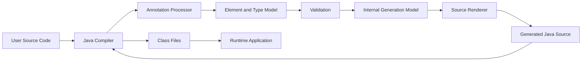
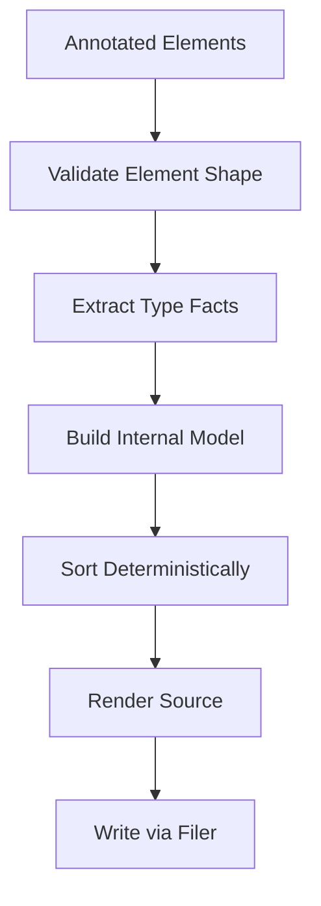
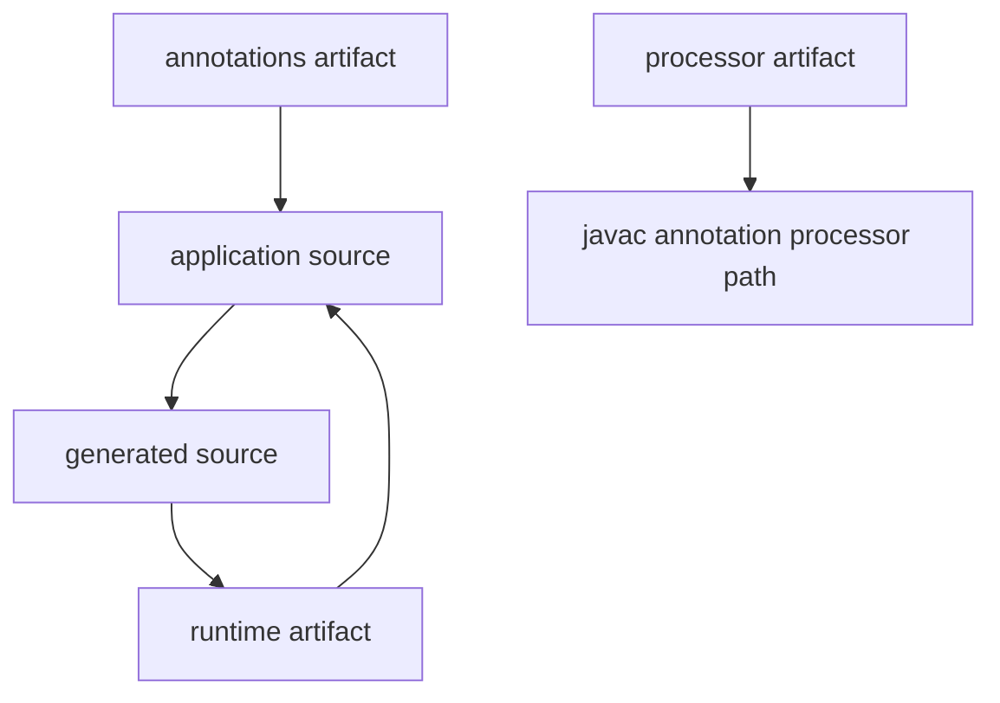

# Part 033 — Compile-Time Code Generation Design

## 0. Posisi Part Ini Dalam Seri

Part 032 membahas mental model annotation processing: processor lifecycle, processing rounds, `Element`, `TypeMirror`, `Filer`, `Messager`, dan build determinism.

Part ini menjawab pertanyaan yang lebih tajam:

> Bagaimana mendesain generated Java source yang aman, deterministic, evolvable, mudah di-debug, dan layak dipakai dalam platform production?

Kita tidak sedang belajar membuat template string sederhana. Kita sedang mendesain **compiler-adjacent subsystem**.

Formula utama:

```text
Compile-time code generation = source-level contract discovery + validation + deterministic materialization.
```

Annotation processor yang bagus bukan hanya “bisa generate file”. Ia harus:

- membaca model Java dengan benar,
- menolak kontrak yang ambigu,
- menghasilkan API yang stabil,
- menjaga incremental build,
- memberi error message yang actionable,
- tidak mengandalkan runtime magic,
- tidak membuat build menjadi nondeterministic,
- tidak membocorkan implementation detail ke public API,
- tetap mudah di-upgrade saat source model berevolusi.

---

## 1. Kaufman Deconstruction: Skill Ini Dipecah Menjadi Apa?

Dalam kerangka Josh Kaufman, skill besar ini perlu dipecah menjadi sub-skill kecil yang bisa dilatih secara sengaja.

| Sub-skill | Pertanyaan Kunci | Output Latihan |
|---|---|---|
| Contract discovery | Apa yang generator baca dari source? | Annotation + element scanner |
| Contract validation | Apa yang dianggap invalid? | Compile-time error dengan lokasi tepat |
| Type modeling | Apakah tipe dibaca sebagai `TypeMirror`, bukan reflection? | Model internal generator |
| Naming design | Bagaimana generated class dinamai? | Naming policy stabil |
| Source rendering | Bagaimana source ditulis tanpa syntax error? | Renderer/JavaPoet template |
| Filer integration | Bagaimana file dibuat sekali dan valid per round? | `Filer.createSourceFile` dengan originating elements |
| Determinism | Apakah output sama untuk input sama? | Stable sorting + no time/randomness |
| Incrementality | Apakah build system bisa cache? | Isolating/aggregating classification |
| Diagnostics | Apakah user tahu cara memperbaiki error? | `Messager` with element location |
| Compatibility | Apakah generated API aman berevolusi? | Versioned generated contract |
| Testing | Apakah generator diuji sebagai compiler plugin? | compile-testing + golden tests |

Target 20 jam pertama untuk topik ini bukan membuat framework sebesar MapStruct atau Dagger. Target realistis:

```text
Mampu membuat annotation processor kecil yang generate source deterministik,
fail-fast terhadap kontrak invalid, diuji melalui compilation test,
dan memiliki batas API yang jelas.
```

---

## 2. Kapan Compile-Time Source Generation Tepat?

Gunakan compile-time source generation ketika fakta yang dibutuhkan bisa diketahui dari source code dan type model saat compilation.

Cocok untuk:

- registry statis,
- adapter boilerplate,
- mapper boilerplate,
- factory dari annotated types,
- route metadata,
- command-handler catalog,
- validation descriptor,
- schema descriptor,
- DSL helper,
- service lookup table,
- type-safe binding,
- configuration metadata yang berasal dari annotation.

Tidak cocok untuk:

- konfigurasi runtime,
- environment-dependent decisions,
- membaca database saat compile,
- melakukan network call,
- generate output berdasarkan waktu saat ini,
- scanning classpath secara tidak terbatas,
- mengganti file source user secara in-place,
- menyembunyikan behavior bisnis kompleks di generated code yang sulit diaudit.

Decision rule:

```text
Generate at compile time when generation improves type safety,
removes repetitive mechanical code,
and fails earlier than runtime reflection.
```

Jangan generate code hanya karena “terlihat keren”. Setiap generated file menambah debugging cost.

---

## 3. Generator Sebagai Boundary Antara Source Model dan Runtime Model

Compile-time generation berada di antara source code dan runtime application.



Hal penting:

- processor membaca **compiler model**, bukan runtime object,
- generated source masuk kembali ke compiler,
- generated source harus valid Java,
- generated classes menjadi bagian dari binary output,
- runtime tidak perlu tahu processor pernah berjalan,
- error terbaik terjadi saat compile, bukan saat application boot.

Anti-pattern:

```text
Annotation processor yang hanya memindahkan error runtime ke generated code tanpa validasi compile-time.
```

Processor yang bagus harus menolak input invalid sebelum generated source gagal compile.

---

## 4. Contoh Problem: Type-Safe Handler Registry

Kita akan memakai contoh sederhana sepanjang part ini.

Misalnya ada command-handler pair:

```java
public interface Command {}

public interface Handler<C extends Command> {
    void handle(C command);
}
```

User menulis:

```java
@Handles(CreateCustomer.class)
public final class CreateCustomerHandler implements Handler<CreateCustomer> {
    @Override
    public void handle(CreateCustomer command) {
        // business behavior
    }
}
```

Tujuan generator:

- membaca semua class yang diberi `@Handles`,
- memvalidasi handler benar-benar implement `Handler<C>`,
- memastikan annotation command type cocok dengan generic argument,
- generate registry statis,
- tidak perlu runtime classpath scanning.

Generated output yang diinginkan:

```java
@Generated("com.acme.processor.HandlerProcessor")
public final class GeneratedHandlerRegistry {
    private GeneratedHandlerRegistry() {}

    public static Map<Class<? extends Command>, Class<? extends Handler<?>>> handlerTypes() {
        return Map.of(
            CreateCustomer.class, CreateCustomerHandler.class,
            SuspendAccount.class, SuspendAccountHandler.class
        );
    }
}
```

Ini intentionally simple. Dalam production, Anda mungkin tidak ingin instantiate handler langsung. Registry cukup menjadi descriptor untuk DI container atau bootstrapper.

---

## 5. Desain Annotation: Kontrak Input Generator

Annotation adalah public API. Jangan meremehkannya.

```java
@Retention(RetentionPolicy.CLASS)
@Target(ElementType.TYPE)
public @interface Handles {
    Class<? extends Command> value();
}
```

Pertanyaan desain:

| Keputusan | Pilihan | Dampak |
|---|---|---|
| Retention | `SOURCE`, `CLASS`, `RUNTIME` | Apakah annotation dibutuhkan setelah compile? |
| Target | `TYPE`, `METHOD`, `FIELD`, dll | Di mana kontrak valid? |
| Attribute type | `Class<?>`, enum, String, nested annotation | Seberapa type-safe input? |
| Repeatable | ya/tidak | Satu element bisa punya banyak contract? |
| Inheritance | `@Inherited` atau tidak | Apakah subclass mewarisi contract? |
| Default value | ada/tidak | Apakah default bisa menimbulkan ambiguity? |

Rule praktis:

```text
Annotation should describe declarative facts, not imperative behavior.
```

Bad annotation:

```java
@DoMagic(scanEverything = true, failSometimes = false)
```

Better annotation:

```java
@Handles(CreateCustomer.class)
```

Annotation yang baik:

- kecil,
- eksplisit,
- type-safe,
- mudah divalidasi,
- tidak mengandung terlalu banyak policy,
- tidak mengekspresikan business workflow kompleks,
- memiliki compatibility story.

---

## 6. Retention Policy: SOURCE, CLASS, atau RUNTIME?

Untuk source generation, retention tidak otomatis harus `RUNTIME`.

| Retention | Meaning | Cocok Untuk |
|---|---|---|
| `SOURCE` | Annotation dibuang setelah compile | Pure compile-time validation/generation |
| `CLASS` | Masuk class file tapi tidak tersedia via reflection biasa | Metadata untuk tools/bytecode processing |
| `RUNTIME` | Tersedia via reflection | Runtime framework scanning |

Untuk annotation processor murni, `SOURCE` sering cukup. Namun `CLASS` juga umum jika metadata berguna untuk downstream tools.

Jangan pilih `RUNTIME` hanya karena terbiasa.

```text
Runtime retention is an operational cost and an API commitment.
```

Jika runtime tidak membaca annotation, hindari `RUNTIME`.

---

## 7. Jangan Gunakan Reflection Model di Processor

Annotation processor tidak bekerja dengan `Class<?>` seperti runtime reflection.

Salah mental model:

```text
I have Class objects during annotation processing.
```

Benar:

```text
I have Element and TypeMirror models supplied by compiler.
```

Perbedaan utama:

| Runtime Reflection | Annotation Processing |
|---|---|
| `Class<?>` | `TypeElement` |
| `Method` | `ExecutableElement` |
| `Field` | `VariableElement` |
| `Type` | `TypeMirror` |
| loaded classes | source/classpath model |
| runtime access | compiler-time analysis |

Jangan memanggil:

```java
Class.forName("com.acme.CreateCustomer")
```

di processor untuk membaca type yang sedang dikompilasi.

Gunakan `Elements` dan `Types`:

```java
Types types = processingEnv.getTypeUtils();
Elements elements = processingEnv.getElementUtils();
```

Rule:

```text
In annotation processing, never load application classes just to inspect them.
```

---

## 8. Internal Model: Jangan Render Langsung Dari Element

Processor yang rapuh biasanya langsung membaca `Element` lalu menulis string source.

Lebih baik buat internal model.

```java
record HandlerBinding(
    String commandCanonicalName,
    String handlerCanonicalName,
    String handlerSimpleName,
    Element originatingElement
) {}
```

Pipeline:



Manfaat internal model:

- renderer tidak tergantung langsung ke compiler API,
- validasi bisa dipisah,
- testing lebih mudah,
- sorting deterministic lebih eksplisit,
- generated output lebih stabil,
- error handling lebih terstruktur.

Rule:

```text
Elements are compiler facts. Internal models are generation decisions.
Do not mix them casually.
```

---

## 9. Validasi Kontrak Sebelum Generate

Generator yang baik tidak membiarkan `javac` menemukan error dari generated source.

Untuk `@Handles`, validasi minimal:

- annotation hanya boleh di class concrete,
- class tidak boleh abstract,
- class harus implement `Handler<C>`,
- `C` harus subtype dari `Command`,
- `@Handles(value)` harus sama dengan `C`,
- tidak boleh ada dua handler untuk command yang sama jika registry mengharuskan uniqueness,
- handler harus visible dari generated package,
- command type harus visible dari generated package.

Contoh pesan error buruk:

```text
Could not generate registry.
```

Contoh pesan error baik:

```text
@Handles(CreateCustomer.class) is inconsistent with Handler<SuspendCustomer>.
Expected handler generic argument to match annotation value.
```

Gunakan `Messager` dengan lokasi element:

```java
processingEnv.getMessager().printMessage(
    Diagnostic.Kind.ERROR,
    "@Handles value must match Handler<C> generic argument.",
    handlerElement
);
```

Validation rule:

```text
Every generated assumption must have a corresponding validation check.
```

Jika generated code mengasumsikan sesuatu, processor harus membuktikannya atau menolak compile.

---

## 10. Error, Warning, dan Note Policy

Diagnostic bukan dekorasi. Diagnostic adalah UX compiler.

| Diagnostic Kind | Gunakan Untuk |
|---|---|
| `ERROR` | Kontrak invalid; build tidak boleh lanjut |
| `WARNING` | Contract legal tapi risky/deprecated |
| `MANDATORY_WARNING` | Warning yang tidak boleh disuppress secara biasa |
| `NOTE` | Informasi debug jika option enabled |
| `OTHER` | Jarang dipakai |

Jangan spam build output.

Recommended policy:

```text
Default output: only errors and actionable warnings.
Verbose output: enabled via processor option.
```

Contoh option:

```java
@SupportedOptions({"handler.processor.verbose"})
public final class HandlerProcessor extends AbstractProcessor {
    boolean verbose() {
        return Boolean.parseBoolean(
            processingEnv.getOptions().getOrDefault("handler.processor.verbose", "false")
        );
    }
}
```

---

## 11. Naming Generated Classes

Naming adalah compatibility decision.

Opsi umum:

| Pattern | Example | Pros | Cons |
|---|---|---|---|
| Fixed global | `GeneratedHandlerRegistry` | Simple | Collision jika multi-module |
| Package-local | `com.acme.generated.HandlerRegistry` | Terorganisir | Perlu package policy |
| Per type | `CreateCustomerHandler_Generated` | Incremental-friendly | Banyak file |
| Aggregated module | `ApplicationGeneratedRegistry` | Bootstrap mudah | Aggregating processor |
| Internal nested-like name | `Foo__Generated` | Dekat dengan source | Bisa bocor ke API |

Rule:

```text
Generated class names must be stable, deterministic, and collision-resistant.
```

Hindari:

```text
GeneratedRegistry_20260630120133
```

Waktu, random UUID, machine-specific path, dan urutan classpath tidak stabil akan merusak cache build.

---

## 12. Package Policy Untuk Generated Code

Ada tiga strategi utama.

### 12.1 Same Package as Origin

```text
com.acme.customer.CreateCustomerHandler_Generated
```

Kelebihan:

- bisa akses package-private members,
- locality bagus,
- isolating processor lebih mudah.

Kekurangan:

- generated classes tersebar,
- public API package bisa terlihat kotor,
- risiko dianggap bagian API.

### 12.2 Dedicated Generated Package

```text
com.acme.generated.handlers.GeneratedHandlerRegistry
```

Kelebihan:

- output terkonsolidasi,
- mudah didump/diaudit,
- cocok untuk aggregated registry.

Kekurangan:

- tidak bisa akses package-private members,
- perlu semua referenced types accessible,
- package naming harus dijaga.

### 12.3 Module-Owned Generated Package

```text
com.acme.customer.internal.generated.HandlerRegistry
```

Kelebihan:

- cocok untuk JPMS/internal boundary,
- tidak harus diekspor,
- menjaga public API surface.

Kekurangan:

- perlu discipline pada module-info,
- bisa menyulitkan konsumsi antar module.

Rule:

```text
Generated package policy is an architectural boundary, not a formatting detail.
```

---

## 13. Public atau Package-Private Generated Types?

Jangan otomatis membuat semua generated class `public`.

Pertanyaan:

- Apakah user harus memanggil generated class langsung?
- Apakah generated class bagian dari supported API?
- Apakah class hanya bootstrap artifact internal?
- Apakah package diekspor dalam JPMS?
- Apakah reflective framework perlu melihatnya?

Strategi:

| Kebutuhan | Visibility |
|---|---|
| Dipakai hanya oleh generated sibling | package-private |
| Dipakai oleh library internal | package-private dalam internal package |
| Dipakai oleh application bootstrap | public tapi documented as generated API |
| Dipakai oleh external consumer | public stable API, sangat hati-hati |

Rule:

```text
Generated does not mean disposable if consumers compile against it.
```

Begitu consumer memakai generated public class, Anda punya compatibility burden.

---

## 14. Deterministic Generation

Determinism berarti input yang sama menghasilkan output byte-for-byte sama.

Hal yang harus stabil:

- urutan annotated elements,
- urutan methods/fields,
- urutan imports,
- format source,
- generated comments,
- annotation values,
- class names,
- package names,
- indentation,
- line endings.

Hal yang harus dihindari:

- timestamp,
- random UUID,
- absolute file path,
- current username,
- host name,
- locale-dependent sort,
- hash map iteration order,
- classpath order yang tidak dinormalisasi.

Contoh:

```java
bindings.stream()
    .sorted(Comparator
        .comparing(HandlerBinding::commandCanonicalName)
        .thenComparing(HandlerBinding::handlerCanonicalName))
    .toList();
```

Rule:

```text
If generated source changes without semantic input changes, your generator is hostile to build systems.
```

---

## 15. `@Generated`: Gunakan, Tapi Jangan Merusak Determinism

Java menyediakan `javax.annotation.processing.Generated` untuk menandai generated source.

Contoh aman:

```java
@Generated("com.acme.processor.HandlerProcessor")
public final class GeneratedHandlerRegistry {
}
```

Hati-hati dengan atribut `date`:

```java
@Generated(
    value = "com.acme.processor.HandlerProcessor",
    date = "2026-06-30T12:00:00Z"
)
```

Timestamp membuat output nondeterministic jika selalu berubah.

Recommended:

```text
Use @Generated(value = processorName), avoid volatile date/comments by default.
```

Jika perlu build metadata, simpan di resource terpisah yang memang dirancang untuk berubah, bukan di generated source yang memengaruhi recompilation massal.

---

## 16. Filer: Cara Benar Menulis Source

Gunakan `Filer`, bukan `new File(...)`.

```java
JavaFileObject file = processingEnv.getFiler().createSourceFile(
    "com.acme.generated.GeneratedHandlerRegistry",
    originatingElements
);

try (Writer writer = file.openWriter()) {
    writer.write(source);
}
```

Kenapa `Filer` penting?

- compiler tahu file generated,
- build tools bisa track originating elements,
- processor tidak menulis di lokasi arbitrary,
- duplicate file creation bisa dideteksi,
- output masuk ke generated-sources directory yang benar.

Failure umum:

```text
Attempt to recreate a file for type X
```

Biasanya terjadi karena:

- processor generate file yang sama di lebih dari satu round,
- processor tidak tracking apakah sudah generate,
- processor mencoba overwrite source existing,
- multiple processors generate class yang sama.

Rule:

```text
A processor should create a generated source file at most once per compilation.
```

---

## 17. Originating Elements dan Incremental Build

Saat membuat file, kirim originating elements.

```java
createSourceFile(generatedName, handlerElements.toArray(Element[]::new));
```

Ini memberi informasi ke build tools:

```text
GeneratedHandlerRegistry depends on these annotated source elements.
```

Untuk processor isolating:

```text
One originating element -> one generated file.
```

Untuk processor aggregating:

```text
Many originating elements -> one generated file.
```

Contoh isolating:

```text
Foo -> FooMapperGenerated
Bar -> BarMapperGenerated
```

Contoh aggregating:

```text
All @Handles classes -> GeneratedHandlerRegistry
```

Trade-off:

| Processor Type | Kelebihan | Kekurangan |
|---|---|---|
| Isolating | Incremental-friendly | Perlu runtime/compile-time aggregation lain |
| Aggregating | Bootstrap mudah | Perubahan kecil bisa regenerate file besar |

Rule:

```text
Prefer isolating generation unless the runtime contract genuinely requires aggregation.
```

---

## 18. Processing Rounds: Generate Kapan?

Annotation processing terjadi dalam rounds. File yang digenerate pada satu round bisa diproses pada round berikutnya.

Untuk aggregated registry, strategi umum:

- kumpulkan elements saat rounds biasa,
- jangan generate terlalu awal jika masih ada source baru,
- generate saat `roundEnv.processingOver()` mendekati akhir?

Hati-hati: ketika `processingOver()` true, Anda tidak boleh berharap generated source ikut diproses lagi.

Pola aman untuk banyak use case:

```java
private final List<HandlerBinding> bindings = new ArrayList<>();
private boolean generated;

@Override
public boolean process(Set<? extends TypeElement> annotations, RoundEnvironment roundEnv) {
    if (roundEnv.processingOver()) {
        if (!generated && !bindings.isEmpty()) {
            generateRegistry();
            generated = true;
        }
        return false;
    }

    for (Element element : roundEnv.getElementsAnnotatedWith(Handles.class)) {
        bindings.add(validateAndExtract(element));
    }

    return false;
}
```

Namun detail round strategy tergantung apakah generated source perlu diproses processor lain. Jika iya, generate sebelum final round.

Rule:

```text
Design generation timing explicitly. Do not accidentally depend on processor ordering.
```

---

## 19. Processor Claiming: Return `true` atau `false`?

Method `process` mengembalikan boolean:

```java
return true;
```

berarti processor mengklaim annotation tersebut sehingga processor lain tidak perlu memproses annotation yang sama.

```java
return false;
```

berarti annotation tidak diklaim secara eksklusif.

Rule praktis:

- return `true` jika annotation milik library Anda dan tidak dimaksudkan untuk diproses processor lain,
- return `false` jika annotation bersifat shared/ecosystem atau processor Anda hanya melakukan validation tambahan.

Untuk annotation private milik generator:

```java
return true;
```

Untuk meta-annotation umum:

```java
return false;
```

---

## 20. Source Rendering: String, Template, atau JavaPoet-Style Builder?

Ada tiga pendekatan umum.

### 20.1 Manual String Builder

```java
String source = "package com.acme.generated;\n" +
    "public final class GeneratedHandlerRegistry {\n" +
    "}\n";
```

Kelebihan:

- tidak ada dependency,
- cepat untuk output kecil.

Kekurangan:

- escaping sulit,
- import management manual,
- formatting rapuh,
- generics/nested types mudah salah.

### 20.2 Template Engine

Kelebihan:

- baik untuk output besar yang mostly static,
- readable jika template disiplin.

Kekurangan:

- logic bisa bocor ke template,
- escaping Java harus benar,
- whitespace drift,
- sulit type-safe.

### 20.3 Code Model Builder

Contoh gaya JavaPoet:

```java
TypeSpec.classBuilder("GeneratedHandlerRegistry")
    .addModifiers(Modifier.PUBLIC, Modifier.FINAL)
    .addMethod(...)
    .build();
```

Kelebihan:

- import handling lebih baik,
- Java syntax lebih aman,
- cocok untuk generated source yang programmatic.

Kekurangan:

- dependency tambahan,
- abstraction kadang verbose,
- perlu memahami model library.

Rule:

```text
Small fixed output: manual string is acceptable.
Complex type-rich output: use a source generation library or disciplined renderer.
```

---

## 21. Import Policy: Prefer Fully Qualified Names Untuk Simplicity?

Generated code bisa memakai imports atau fully qualified names.

Dengan imports:

```java
import java.util.Map;

public final class GeneratedHandlerRegistry {
    public static Map<Class<? extends Command>, Class<? extends Handler<?>>> handlerTypes() { ... }
}
```

Fully qualified:

```java
public static java.util.Map<java.lang.Class<? extends com.acme.Command>, ...> handlerTypes() { ... }
```

Trade-off:

| Strategy | Pros | Cons |
|---|---|---|
| Imports | Readable | Perlu collision handling |
| Fully qualified | Simple renderer | Verbose |
| Mixed | Pragmatic | Perlu policy jelas |

Recommendation:

```text
Use imports if renderer handles collisions. Otherwise use fully qualified names in generated code and prioritize correctness.
```

Generated source untuk manusia dibaca saat debugging, tapi correctness lebih penting daripada estetika.

---

## 22. API Shape Generated Registry

Jangan hanya generate bentuk yang paling mudah. Desain API generated seperti API biasa.

Opsi return type:

```java
public static Map<Class<? extends Command>, Class<? extends Handler<?>>> handlerTypes()
```

Masalah:

- generic type agak longgar,
- caller masih perlu cast saat instantiate,
- class literal hanya descriptor.

Alternatif dengan descriptor:

```java
public record HandlerDescriptor<C extends Command>(
    Class<C> commandType,
    Class<? extends Handler<C>> handlerType
) {}
```

Generated:

```java
public static List<HandlerDescriptor<?>> descriptors() { ... }
```

Trade-off:

- descriptor lebih eksplisit,
- easier to evolve,
- bisa tambah metadata,
- tapi generic precision tetap dibatasi erasure.

Rule:

```text
Generated API should expose the most stable semantic abstraction, not the easiest data structure.
```

Jika registry nanti butuh priority, scope, lifecycle, atau module, descriptor lebih aman daripada raw `Map`.

---

## 23. Jangan Generate Business Logic Kompleks

Generated code idealnya mechanical.

Baik:

- adapter boilerplate,
- registry static,
- delegation glue,
- metadata object,
- type-safe accessor,
- factory sederhana,
- validation descriptor.

Buruk:

- business branching tersembunyi,
- workflow decision kompleks,
- policy legal/regulatory yang sulit diaudit,
- logic yang berubah sering,
- logic yang perlu observability kaya.

Rule:

```text
Generate structure, not hidden policy.
```

Jika business policy berubah karena requirement, source manusia harus tetap menjadi lokasi utama reasoning.

---

## 24. Generated Code dan Nullability

Java tidak punya nullability type system built-in. Generated API harus memilih policy.

Contoh:

```java
public static HandlerDescriptor<?> find(Class<? extends Command> commandType) {
    return REGISTRY.get(commandType);
}
```

Masalah: bisa return null.

Alternatif:

```java
public static Optional<HandlerDescriptor<?>> find(Class<? extends Command> commandType) {
    Objects.requireNonNull(commandType, "commandType");
    return Optional.ofNullable(REGISTRY.get(commandType));
}
```

Atau fail-fast:

```java
public static HandlerDescriptor<?> require(Class<? extends Command> commandType) {
    Objects.requireNonNull(commandType, "commandType");
    HandlerDescriptor<?> descriptor = REGISTRY.get(commandType);
    if (descriptor == null) {
        throw new IllegalArgumentException("No handler registered for " + commandType.getName());
    }
    return descriptor;
}
```

Rule:

```text
Generated code must have the same API hygiene as handwritten code.
```

---

## 25. Versioning Generated API

Generated source ada dua macam:

### 25.1 Internal Generated Implementation

Tidak didokumentasikan untuk caller.

Contoh:

```text
com.acme.internal.generated.HandlerRegistryImpl
```

Boleh berubah lebih bebas.

### 25.2 Supported Generated API

Caller dipersilakan compile against it.

Contoh:

```text
com.acme.generated.HandlerRegistry
```

Harus diperlakukan seperti public API.

Checklist compatibility:

- jangan rename class tanpa migration,
- jangan hapus method public,
- jangan ubah return type sembarangan,
- jangan ubah exception behavior diam-diam,
- jangan ubah generic signature jika consumer source bergantung padanya,
- jangan mengubah nullability behavior tanpa catatan,
- jangan mengubah package tanpa alias/deprecation path.

Rule:

```text
Generated public API is still public API.
```

---

## 26. Generated Code dan JPMS

Dengan Java Platform Module System, generated package perlu dipikirkan.

Jika generated code berada dalam module user:

```java
module com.acme.customer {
    requires com.acme.handler.api;
}
```

Pertanyaan:

- apakah generated package perlu diekspor?
- apakah perlu dibuka untuk reflection?
- apakah generated code mengakses package lain yang tidak exported?
- apakah processor module terpisah dari annotation module?
- apakah annotation artifact masuk compile-only dependency?

Typical split:

```text
com.acme.handler.annotations   -> annotations used by source
com.acme.handler.processor     -> annotation processor
com.acme.handler.runtime       -> small runtime API used by generated code
```

Jangan membuat generated code depend pada processor jar saat runtime.

Rule:

```text
Processor dependency should usually be compile-time only.
Generated code should depend only on runtime API, not processor implementation.
```

---

## 27. Artifact Design: Annotation, Processor, Runtime

Production generator biasanya dipisah menjadi beberapa artifact.



| Artifact | Isi | Runtime Needed? |
|---|---|---|
| annotations | `@Handles`, config annotations | Kadang, tergantung retention |
| processor | `AbstractProcessor`, validators, renderer | Tidak |
| runtime | `Command`, `Handler`, descriptors | Ya jika generated code refer |
| test support | compile testing utilities | Tidak |

Anti-pattern:

```text
Generated source imports com.acme.processor.internal.SomeHelper.
```

Itu membuat runtime application membutuhkan processor jar.

---

## 28. Processor Options

Gunakan processor options untuk konfigurasi build-level.

Contoh:

```java
@SupportedOptions({
    "handler.registry.package",
    "handler.registry.className",
    "handler.verbose"
})
```

Build config:

```text
-Ahandler.registry.package=com.acme.generated
-Ahandler.registry.className=GeneratedHandlerRegistry
```

Guidelines:

- option harus documented,
- default harus deterministic,
- invalid option harus error atau warning,
- jangan pakai environment variable implicit,
- jangan pakai system property sebagai hidden config jika bisa dihindari.

Rule:

```text
Generator configuration must be explicit and reproducible.
```

---

## 29. Handling Duplicates dan Conflicts

Aggregating generator sering punya duplicate problem.

Contoh:

```java
@Handles(CreateCustomer.class)
class FirstHandler implements Handler<CreateCustomer> {}

@Handles(CreateCustomer.class)
class SecondHandler implements Handler<CreateCustomer> {}
```

Jika registry mengharuskan uniqueness, processor harus error:

```text
Duplicate handlers for CreateCustomer:
- com.acme.FirstHandler
- com.acme.SecondHandler
Exactly one @Handles binding is allowed per command type.
```

Jangan biarkan `Map.of` gagal runtime atau generated source silently memilih salah satu.

Conflict policy:

| Conflict | Policy |
|---|---|
| Duplicate unique binding | compile error |
| Duplicate same metadata from same source | dedupe if identical |
| Multiple ordered handlers | require explicit order |
| Ambiguous order | compile error |
| Missing required pair | compile error or no generated entry, tergantung contract |

Rule:

```text
Ambiguity must be resolved in source, not by generator luck.
```

---

## 30. Ordering Policy

Jika generated output punya order, tentukan maknanya.

Bad:

```text
Handlers run in whatever order the compiler returns elements.
```

Better:

```java
@Handles(value = CreateCustomer.class, order = 100)
```

Atau:

```java
@After(ValidateCustomerHandler.class)
```

Namun dependency order bisa membuat topological sort dan cycle detection diperlukan.

Rule:

```text
If order has semantics, order must be explicit, deterministic, and validated.
```

Jangan menggunakan alphabetical order untuk business semantics. Alphabetical order hanya boleh untuk deterministic rendering.

---

## 31. Generated Source Harus Bisa Dibaca

Generated code bukan untuk diedit, tapi harus bisa dibaca saat incident.

Tambahkan header yang membantu:

```java
// Generated by HandlerProcessor. Do not edit manually.
// Source contract: @Handles annotated types.
```

Jangan tambahkan metadata volatile.

Generated source yang baik:

- formatting konsisten,
- nama jelas,
- tidak terlalu clever,
- method kecil,
- error message jelas,
- tidak melakukan reflection misterius,
- mudah dicari saat debugging.

Rule:

```text
Generated code is operational evidence during debugging.
```

---

## 32. Exception Policy di Generated Code

Generated code sering menjadi bootstrap path. Error message harus bagus.

Bad:

```java
throw new RuntimeException(e);
```

Better:

```java
throw new IllegalStateException(
    "Failed to instantiate handler " + handlerType.getName() +
    ". Ensure it has an accessible no-arg constructor or configure a factory.",
    e
);
```

Namun jika memungkinkan, jangan instantiate via generated code sama sekali. Biarkan DI container atau factory explicit.

Rule:

```text
Generated runtime failures should explain which generated contract assumption failed.
```

---

## 33. Avoiding Runtime Classpath Scanning

Salah satu manfaat compile-time generation adalah menghindari runtime scanning.

Runtime scanning problem:

- lambat saat startup,
- classpath/module-path dependent,
- fragile di native image/AOT,
- butuh reflection access,
- sulit diprediksi,
- bisa melewatkan class jika class loader berbeda,
- error muncul saat boot, bukan saat compile.

Generated registry mengganti ini:

```text
Compile-time discovery -> generated registry -> deterministic runtime bootstrap
```

Trade-off:

- build lebih kompleks,
- processor harus benar,
- incremental build harus dijaga,
- generated source perlu didebug.

Rule:

```text
Move discovery to compile time when the set of participants is source-defined and stable for the artifact.
```

---

## 34. Build Tool Integration

Processor harus ramah Maven/Gradle/IDE.

Checklist:

- processor artifact masuk annotation processor path,
- generated sources masuk output generated-sources,
- tidak perlu manual source directory aneh,
- processor tidak membaca working directory sembarangan,
- output deterministic untuk build cache,
- no network,
- no global mutable state antar compilation,
- mendukung incremental build sebisa mungkin,
- clear error jika option missing.

Anti-pattern:

```java
Path output = Path.of("src/main/java/com/acme/generated/Registry.java");
Files.writeString(output, source);
```

Ini salah karena processor menulis ke source tree user.

Correct:

```java
processingEnv.getFiler().createSourceFile(...)
```

Rule:

```text
Generated code belongs to build output, not hand-written source directories.
```

---

## 35. Testing Generator: Jangan Hanya Unit Test Renderer

Generator harus diuji sebagai compiler plugin.

Lapisan test:

| Test Type | Tujuan |
|---|---|
| Unit test validator | Input model kecil -> expected validation result |
| Renderer test | Internal model -> source text |
| Golden file test | Output source stabil |
| Compilation success test | Valid source compiles |
| Compilation failure test | Invalid source gives diagnostic |
| Round test | Generated source from round behaves as expected |
| Incremental-like test | Perubahan input kecil tidak ubah output tak terkait |
| Runtime smoke test | Generated class bisa dipakai setelah compile |

Untuk compile testing, pola umumnya:

```text
source files -> javac with processor -> diagnostics + generated sources + class output
```

Golden file test harus hati-hati agar tidak menjadi brittle berlebihan. Stabilkan formatter dan sorting.

Rule:

```text
A code generator is not tested until invalid input diagnostics are tested.
```

---

## 36. Testing Diagnostics

Invalid cases untuk contoh `@Handles`:

- annotation di interface,
- annotation di abstract class,
- class tidak implement `Handler`,
- generic argument mismatch,
- command type bukan subtype `Command`,
- duplicate command binding,
- handler tidak accessible,
- nested private handler,
- missing runtime API dependency,
- invalid processor option.

Test diagnostic sebaiknya memeriksa:

- compile gagal,
- message mengandung istilah yang actionable,
- location mengarah ke element yang benar,
- tidak ada generated file setengah benar.

Rule:

```text
The best generator UX is a precise compiler error at the user's source line.
```

---

## 37. Performance Model

Annotation processor berjalan saat build. Jangan membuat build lambat.

Cost utama:

- scanning banyak elements,
- repeated type hierarchy traversal,
- string rendering besar,
- file IO,
- resolving types berulang,
- aggregating output besar,
- logging berlebihan.

Optimisasi sederhana:

- proses hanya annotation yang didukung,
- cache `TypeElement` untuk common types,
- gunakan `Types.isAssignable` dengan hati-hati,
- stable sort sekali,
- render file hanya jika perlu,
- hindari scan seluruh root elements jika tidak perlu,
- jangan parse source text sendiri,
- jangan classpath scanning.

Rule:

```text
Annotation processor performance is part of developer feedback latency.
```

Build lambat mengurangi willingness tim untuk memakai generator Anda.

---

## 38. Concurrency dan Global State

Jangan menyimpan global state static yang diasumsikan bersih antar compilation.

Bad:

```java
static final List<HandlerBinding> ALL = new ArrayList<>();
```

Masalah:

- test pollution,
- daemon compiler process,
- IDE incremental compilation,
- memory leak,
- cross-module contamination.

Better:

```java
private final List<HandlerBinding> bindings = new ArrayList<>();
```

Processor instance state masih harus dikelola sesuai lifecycle, tapi lebih aman daripada static mutable state.

Rule:

```text
Treat each compilation as isolated. Static mutable processor state is almost always a bug.
```

---

## 39. Security dan Supply Chain Considerations

Annotation processor adalah code yang berjalan saat build. Ini supply-chain sensitive.

Risiko:

- processor dependency malicious,
- processor membaca file rahasia,
- processor melakukan network exfiltration,
- processor menghasilkan source berbahaya,
- processor menulis file di luar build dir,
- processor mengubah behavior tanpa review.

Policy internal engineering:

- processor dependency harus pinned,
- generated source bisa diaudit,
- no network policy,
- no arbitrary file IO,
- minimal permissions in CI,
- processor source reviewed seperti production code,
- generated output diff diperiksa untuk critical framework.

Rule:

```text
Build-time code execution is still code execution.
```

---

## 40. Mini Implementation Sketch

Annotation:

```java
package com.acme.handlers;

import java.lang.annotation.ElementType;
import java.lang.annotation.Retention;
import java.lang.annotation.RetentionPolicy;
import java.lang.annotation.Target;

@Retention(RetentionPolicy.CLASS)
@Target(ElementType.TYPE)
public @interface Handles {
    Class<? extends Command> value();
}
```

Processor skeleton:

```java
@SupportedAnnotationTypes("com.acme.handlers.Handles")
@SupportedSourceVersion(SourceVersion.RELEASE_25)
public final class HandlerProcessor extends AbstractProcessor {
    private final List<HandlerBinding> bindings = new ArrayList<>();
    private boolean generated;

    @Override
    public boolean process(
            Set<? extends TypeElement> annotations,
            RoundEnvironment roundEnv) {

        if (roundEnv.processingOver()) {
            if (!generated && !bindings.isEmpty()) {
                generateRegistry();
                generated = true;
            }
            return true;
        }

        for (Element element : roundEnv.getElementsAnnotatedWith(Handles.class)) {
            validateAndAdd(element);
        }

        return true;
    }
}
```

Internal model:

```java
record HandlerBinding(
    String commandName,
    String handlerName,
    Element origin
) {}
```

Renderer shape:

```java
final class RegistryRenderer {
    String render(List<HandlerBinding> bindings) {
        List<HandlerBinding> sorted = bindings.stream()
            .sorted(Comparator
                .comparing(HandlerBinding::commandName)
                .thenComparing(HandlerBinding::handlerName))
            .toList();

        StringBuilder out = new StringBuilder();
        out.append("package com.acme.generated;\n\n");
        out.append("@javax.annotation.processing.Generated(\"")
           .append("com.acme.handlers.processor.HandlerProcessor")
           .append("\")\n");
        out.append("public final class GeneratedHandlerRegistry {\n");
        out.append("  private GeneratedHandlerRegistry() {}\n");
        out.append("}\n");
        return out.toString();
    }
}
```

Ini belum lengkap, tetapi shape-nya benar: validation, model, deterministic sort, render, Filer.

---

## 41. Design Checklist

Sebelum membuat generator, jawab ini:

- Apa annotation contract-nya?
- Apa retention policy minimal?
- Apakah generated output bagian public API?
- Apakah processor isolating atau aggregating?
- Apakah output deterministic byte-for-byte?
- Apa naming/package policy?
- Apakah generated code butuh runtime helper?
- Apakah processor jar dibutuhkan di runtime? Jika ya, kenapa?
- Apa invalid inputs yang harus compile error?
- Apa duplicate/ordering policy?
- Apakah diagnostic actionable?
- Bagaimana test compile success/failure?
- Bagaimana processor bekerja di Maven/Gradle/IDE?
- Apakah ada hidden file IO/network/time/randomness?
- Bagaimana generated API berevolusi?

---

## 42. Common Failure Modes

| Failure | Penyebab | Pencegahan |
|---|---|---|
| Duplicate file error | Generate file sama di banyak round | Track `generated`, design round strategy |
| Output berubah tiap build | Timestamp/random/hash order | Stable sort, no volatile metadata |
| IDE build rusak | Manual file IO | Use `Filer` only |
| Runtime butuh processor jar | Generated code import processor internal | Pisahkan runtime artifact |
| Error sulit dipahami | Rely on generated compile error | Validate before generate |
| Incremental build lambat | Aggregating semua hal | Prefer isolating where possible |
| Class loading bug | Processor pakai `Class.forName` | Use `Element`/`TypeMirror` |
| Public generated API break | Rename/change signature | Version generated contract |
| Security issue | Processor arbitrary IO/network | Build-time security policy |
| Wrong order | Compiler iteration order | Explicit deterministic ordering |

---

## 43. Latihan 20 Jam Pertama

### Latihan 1 — Minimal Processor

Buat `@AutoRegistry` yang generate class kosong:

```java
public final class GeneratedRegistry {}
```

Goal: memahami processor registration dan `Filer`.

### Latihan 2 — Element Validation

Annotation hanya boleh di class `public final`.

Goal: diagnostic tepat.

### Latihan 3 — Extract Type Facts

Baca implemented interface generic argument.

Goal: `TypeMirror`, `DeclaredType`, `Types`.

### Latihan 4 — Deterministic Registry

Generate sorted registry dari banyak annotated types.

Goal: stable output.

### Latihan 5 — Duplicate Detection

Dua binding untuk key sama harus compile error.

Goal: conflict policy.

### Latihan 6 — Compilation Tests

Test source valid dan invalid.

Goal: confidence sebagai compiler plugin.

### Latihan 7 — Runtime Smoke

Compile generated code lalu panggil method registry.

Goal: end-to-end validation.

---

## 44. Mental Model Akhir

Compile-time source generation yang baik bukan template hack.

Ia adalah sistem dengan tahapan:

```text
Source contract
  -> compiler model
  -> validation
  -> internal semantic model
  -> deterministic rendering
  -> generated source
  -> compiled binary
  -> runtime simplicity
```

Prinsip inti:

```text
Generate only what is mechanical.
Validate everything you assume.
Keep output deterministic.
Treat generated public API as real API.
Keep processor dependency out of runtime.
Make invalid source fail at the user's line, not in generated code.
```

Jika Anda memegang prinsip itu, compile-time code generation menjadi alat engineering yang kuat: bukan magic, melainkan cara memindahkan contract enforcement dari runtime ke compile-time.

---

## 45. Jembatan ke Part 034

Part ini membahas source generation saat compile-time.

Part 034 akan masuk ke level yang lebih rendah dan lebih berisiko:

- Java dynamic proxies,
- runtime-generated classes,
- bytecode generation,
- ASM,
- Byte Buddy,
- Java Class-File API,
- instrumentation,
- class loading,
- verifier errors,
- performance/security trade-offs.

Rule transisi:

```text
Prefer source generation when source generation is enough.
Use bytecode generation only when source-level generation cannot express the runtime requirement cleanly.
```
