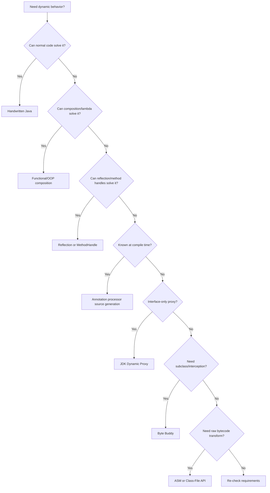
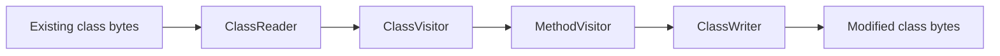

# Part 034 — Bytecode Generation: ASM, Byte Buddy, and Proxies

## 0. Posisi Part Ini Dalam Seri

Part 033 membahas compile-time source generation: annotation processor, generated source, deterministic output, diagnostics, dan generated API design.

Part ini masuk ke dunia yang lebih dekat ke JVM execution model:

- dynamic proxies,
- runtime-generated classes,
- bytecode manipulation,
- ASM,
- Byte Buddy,
- Java Class-File API,
- instrumentation agents,
- class loading,
- verifier failures,
- module boundary,
- performance dan security trade-offs.

Bytecode generation adalah alat yang kuat, tapi bukan default.

Formula utama:

```text
Bytecode generation = runtime or build-time classfile engineering under JVM verifier rules.
```

Jika compile-time source generation cukup, gunakan itu. Jika reflection cukup, gunakan reflection. Jika method handles cukup, gunakan method handles.

Gunakan bytecode generation ketika requirement benar-benar membutuhkan class shape yang tidak bisa dicapai dengan mekanisme lebih sederhana.

---

## 1. Kaufman Deconstruction: Skill Ini Dipecah Menjadi Apa?

| Sub-skill | Pertanyaan Kunci | Output Latihan |
|---|---|---|
| Proxy model | Apa yang bisa diproxy oleh JDK proxy? | Interface proxy dengan `InvocationHandler` |
| Classfile model | Apa bedanya Java source dan bytecode? | Membaca class dengan `javap -c` |
| Verification | Kenapa `VerifyError` muncul? | Generate class valid/invalid |
| Class loading | Di loader mana generated class hidup? | Load generated class dan unload test |
| Naming | Bagaimana nama generated class dibuat? | Stable generated naming policy |
| Interception | Bagaimana method call dialihkan? | Method delegation/advice |
| Byte Buddy DSL | Kapan high-level bytecode API cukup? | Runtime subclass proxy |
| ASM model | Kapan perlu visitor/opcode level? | Generate class minimal |
| Instrumentation | Kapan class existing dimodifikasi? | Java agent mental model |
| JPMS access | Apa boundary module/reflection? | Lookup/open/export decision |
| Testing | Bagaimana membuktikan generated bytecode benar? | verifier + behavioral test |
| Operations | Bagaimana debug generated class? | dump generated bytecode/source metadata |

Target 20 jam pertama:

```text
Mampu memilih mekanisme metaprogramming yang tepat,
membuat proxy runtime sederhana,
memahami kapan Byte Buddy lebih aman dari ASM,
dan mengenali failure modes class loading/verifier/module boundary.
```

---

## 2. Decision Ladder: Dari Paling Sederhana ke Paling Berisiko

Jangan langsung memakai ASM.



Rule:

```text
Choose the highest-level mechanism that satisfies the requirement with acceptable performance and debuggability.
```

---

## 3. Java Source vs Bytecode vs Classfile

Java source:

```java
public int add(int a, int b) {
    return a + b;
}
```

Bytecode roughly:

```text
iload_1
iload_2
iadd
ireturn
```

Classfile contains:

- magic/version,
- constant pool,
- access flags,
- this/super class,
- interfaces,
- fields,
- methods,
- attributes,
- bytecode instructions,
- stack map frames,
- annotations,
- bootstrap methods,
- module/record/sealed metadata when relevant.

Mental model:

```text
Java source is developer syntax.
Bytecode is JVM instruction representation.
Classfile is the binary container for JVM-defined metadata and code.
```

Bytecode generation means you are now responsible for classfile correctness.

---

## 4. The JVM Verifier Is Your Runtime Type Checker

Generated bytecode must pass verification.

Typical verifier concerns:

- operand stack types match instruction expectations,
- local variable types are consistent,
- branch targets valid,
- stack map frames valid,
- constructors call super correctly,
- access flags legal,
- method descriptors valid,
- class hierarchy valid,
- no illegal access to private/package/module members,
- no return type mismatch.

Common failures:

```text
java.lang.VerifyError
java.lang.ClassFormatError
java.lang.NoClassDefFoundError
java.lang.IllegalAccessError
java.lang.IncompatibleClassChangeError
java.lang.LinkageError
```

Rule:

```text
If generated source fails, javac gives you a source error.
If generated bytecode fails, the JVM gives you linkage or verification errors.
```

That is why bytecode generation should be treated as a lower-level engineering decision.

---

## 5. JDK Dynamic Proxy: Interface-Based Runtime Indirection

JDK dynamic proxy creates an object that implements one or more interfaces and dispatches method calls to an `InvocationHandler`.

Example:

```java
public interface CustomerService {
    Customer findById(CustomerId id);
}
```

Handler:

```java
public final class TimingInvocationHandler implements InvocationHandler {
    private final Object target;

    public TimingInvocationHandler(Object target) {
        this.target = Objects.requireNonNull(target, "target");
    }

    @Override
    public Object invoke(Object proxy, Method method, Object[] args) throws Throwable {
        long start = System.nanoTime();
        try {
            return method.invoke(target, args);
        } finally {
            long elapsed = System.nanoTime() - start;
            System.out.println(method.getName() + " took " + elapsed + "ns");
        }
    }
}
```

Proxy creation:

```java
CustomerService proxy = (CustomerService) Proxy.newProxyInstance(
    CustomerService.class.getClassLoader(),
    new Class<?>[] { CustomerService.class },
    new TimingInvocationHandler(realService)
);
```

Good use cases:

- interface-based AOP,
- client stubs,
- transaction boundaries,
- security checks,
- lazy loading interface,
- retry wrapper,
- tracing wrapper,
- test doubles.

Bad use cases:

- concrete class proxying,
- final method interception,
- field access interception,
- heavy per-call reflection path without caching,
- semantic behavior hidden from callers.

---

## 6. Dynamic Proxy Limitations

JDK dynamic proxy only implements interfaces.

Limitations:

| Limitation | Consequence |
|---|---|
| Interface only | Cannot subclass concrete class |
| Invocation through `Method` | Reflection-like dispatch unless optimized manually |
| `Object` methods intercepted | Must handle `equals`, `hashCode`, `toString` intentionally |
| ClassLoader sensitive | Proxy class defined in specified loader |
| Module access sensitive | Interface visibility matters |
| Default method handling non-trivial | Needs explicit method handle logic in advanced cases |
| Generic info erased | Runtime cannot recover all generic type facts |

Handle `Object` methods explicitly:

```java
if (method.getDeclaringClass() == Object.class) {
    return switch (method.getName()) {
        case "toString" -> "Proxy(" + target + ")";
        case "hashCode" -> System.identityHashCode(proxy);
        case "equals" -> proxy == args[0];
        default -> method.invoke(target, args);
    };
}
```

Rule:

```text
A proxy is part of the public behavior of an object. equals/hashCode/toString are not optional details.
```

---

## 7. Proxy Semantics: Wrapper, Facade, or Synthetic Object?

Proxy design must answer identity semantics.

Three possibilities:

### 7.1 Wrapper Semantics

```text
proxy represents target
```

`equals` may delegate to target.

### 7.2 Synthetic Object Semantics

```text
proxy is its own object
```

`equals` is identity-based.

### 7.3 Facade Semantics

```text
proxy represents capability boundary
```

`equals` may not be meaningful beyond reference identity.

Do not accidentally choose.

Rule:

```text
Proxy identity is an API contract.
```

---

## 8. Reflection Invocation vs MethodHandle Invocation vs Generated Invocation

Invocation options:

| Mechanism | Shape | Pros | Cons |
|---|---|---|---|
| Reflection `Method.invoke` | Dynamic method object | Simple | boxing, access, exception wrapping, slower warmup |
| `MethodHandle` | Typed executable handle | More direct, adaptable | more complex lookup/type handling |
| Generated bytecode | Normal call site | JIT-friendly | generation/class loading complexity |

For many frameworks:

```text
Reflection for discovery.
MethodHandle or generated bytecode for hot invocation.
```

But do not optimize prematurely. Measure.

---

## 9. Byte Buddy: High-Level Runtime Code Generation

Byte Buddy is a library for generating and modifying Java classes at runtime without writing raw bytecode instructions manually.

Conceptually, Byte Buddy lets you say:

```text
Create a subclass of X,
override selected methods,
intercept calls,
delegate to Y,
load class into a ClassLoader.
```

Example style:

```java
Class<? extends Service> proxyType = new ByteBuddy()
    .subclass(Service.class)
    .method(ElementMatchers.named("execute"))
    .intercept(MethodDelegation.to(new TimingInterceptor()))
    .make()
    .load(Service.class.getClassLoader())
    .getLoaded();
```

Interceptor shape:

```java
public final class TimingInterceptor {
    @RuntimeType
    public Object intercept(@SuperCall Callable<?> call) throws Exception {
        long start = System.nanoTime();
        try {
            return call.call();
        } finally {
            long elapsed = System.nanoTime() - start;
            System.out.println("elapsed=" + elapsed);
        }
    }
}
```

Use Byte Buddy when:

- you need subclass-based proxy,
- you need method interception,
- you need runtime implementation generation,
- you want safer abstraction than ASM,
- you need instrumentation-friendly model,
- you are building framework infrastructure.

Avoid Byte Buddy when:

- interface proxy is enough,
- source generation is enough,
- simple composition works,
- generated class shape must be audited line-by-line by non-JVM experts,
- target environment restricts dynamic class loading.

---

## 10. Byte Buddy vs ASM

| Aspect | Byte Buddy | ASM |
|---|---|---|
| Abstraction | Java-like DSL | Low-level bytecode visitor |
| Learning curve | Moderate | High |
| Safety | Higher | Lower; you manage instructions/frames |
| Control | High | Very high |
| Use case | proxies, subclassing, interception, agents | custom transforms, tools, fine-grained bytecode |
| Debuggability | Better | Harder |
| Framework friendliness | Strong | Strong but lower-level |

Rule:

```text
Use Byte Buddy when you want generated classes.
Use ASM when you need to reason at bytecode instruction level.
```

---

## 11. ASM Mental Model

ASM is a bytecode manipulation and analysis framework.

It uses visitor-style APIs:

```text
ClassReader -> ClassVisitor -> MethodVisitor -> ClassWriter
```

Flow:



For generation from scratch:

```text
ClassWriter -> visit class -> visit fields -> visit methods -> byte[]
```

You must understand:

- internal names: `java/lang/String`,
- descriptors: `(Ljava/lang/String;)I`,
- opcodes: `ALOAD`, `INVOKEVIRTUAL`, `ARETURN`,
- local variable slots,
- operand stack,
- frames,
- access flags,
- constant pool references.

Example descriptor:

```text
(String) int
```

becomes:

```text
(Ljava/lang/String;)I
```

Rule:

```text
ASM is not Java syntax generation. ASM is classfile construction.
```

---

## 12. Internal Names, Binary Names, and Descriptors

Java name forms matter a lot in bytecode work.

| Form | Example | Used In |
|---|---|---|
| Canonical name | `java.lang.String` | Java source, reflection display |
| Binary name | `java.lang.String` / `com.acme.Outer$Inner` | `Class.forName`, class identity |
| Internal name | `java/lang/String` | JVM classfile references |
| Descriptor | `Ljava/lang/String;` | field/method descriptors |
| Method descriptor | `(Ljava/lang/String;)I` | method signatures in classfile |

Common bug:

```text
Using canonical name where internal name is required.
```

Rule:

```text
When generating bytecode, names are data structures, not strings you casually concatenate.
```

Use library helpers where possible.

---

## 13. Stack and Local Variables

Bytecode instructions operate on an operand stack.

Java:

```java
return a + b;
```

Bytecode idea:

```text
load a onto stack
load b onto stack
add two ints
return top of stack
```

Local variables are indexed slots:

```text
slot 0 = this for instance method
slot 1 = first int argument
slot 2 = second int argument
```

For `long` and `double`, values consume two slots.

Common ASM failure:

- wrong max stack,
- wrong max locals,
- wrong frame,
- wrong return instruction,
- branch stack mismatch.

Use compute options carefully:

```text
COMPUTE_MAXS and COMPUTE_FRAMES can help, but do not remove need to understand generated control flow.
```

---

## 14. Java Class-File API

Modern JDK includes `java.lang.classfile`, a standard API for classfile parsing, generation, and transformation.

This matters because classfile tooling historically depended on third-party libraries such as ASM. The platform-level classfile API gives a JDK-native model for parsing/generating/transforming classfiles when you need low-level classfile work.

Use it when:

- you want JDK-native classfile modeling,
- you are writing tooling close to JDK classfile format,
- you need parsing/generation/transformation without external bytecode library,
- your use case aligns with the API maturity and supported classfile features.

Still use Byte Buddy when you want high-level runtime code generation/interception. Still use ASM when the ecosystem/tooling requirement already depends on ASM or you need a mature low-level bytecode framework.

Decision:

```text
Class-File API: JDK-native classfile engineering.
Byte Buddy: high-level runtime class generation.
ASM: mature low-level bytecode manipulation.
```

---

## 15. Class Loading Generated Classes

Generating bytes is only half the problem. The class must be defined in a loader.

Questions:

- which `ClassLoader` defines the generated class?
- can it see referenced types?
- can referenced types see it?
- is the package already defined?
- is the package sealed?
- is the module boundary compatible?
- can it be unloaded?
- should it be hidden?

Class identity includes class loader:

```text
same binary name + different class loader = different runtime type
```

Failure example:

```text
ClassCastException: com.acme.Service cannot be cast to com.acme.Service
```

Often caused by same class name loaded by different loaders.

Rule:

```text
Generated class loading strategy is part of the API design.
```

---

## 16. Hidden Classes and Runtime Frameworks

Hidden classes can be used by frameworks for implementation details that do not need normal discovery by name.

Useful when:

- generated class is runtime-only implementation detail,
- no need for `Class.forName`,
- want lifecycle tied to lookup/loader behavior,
- want reduce namespace pollution.

Not suitable when:

- external user must refer to class by name,
- class must be serialized by name,
- class must appear in config,
- framework needs stable binary name.

Rule:

```text
If the generated class is an implementation detail, consider whether it should be hidden or at least non-public/non-exported.
```

---

## 17. Naming Runtime Generated Classes

Runtime generated names must balance uniqueness and diagnosability.

Bad:

```text
com.acme.$Proxy$123456789
```

without context.

Better:

```text
com.acme.generated.CustomerService$TimingProxy$1
```

Consider:

- include target type simple name,
- include purpose,
- avoid leaking secrets,
- avoid unbounded name growth,
- avoid relying on random order for semantic behavior,
- allow dumping generated bytecode for debugging.

Rule:

```text
Generated class names are observability data.
```

When an incident has stack traces, generated names are what engineers see.

---

## 18. Caching Generated Types

Generating a class per call is usually wrong.

Cache by stable key:

```java
record ProxyKey(
    Class<?> targetType,
    List<Class<?>> interfaces,
    ProxyOptions options
) {}
```

Cache scope must respect class loader unloading.

Bad:

```java
static final Map<Class<?>, Class<?>> CACHE = new HashMap<>();
```

This can leak class loaders in application servers, plugins, IDEs, tests, or reloadable systems.

Better options:

- `ClassValue` for class-keyed metadata,
- weak keys for classloader-sensitive caches,
- cache owned by lifecycle container,
- explicit close/unload strategy,
- no static cache for per-tenant/per-plugin loaders.

Rule:

```text
Class generation cache must be class-loader aware.
```

---

## 19. Performance Model: Startup vs Per-Call Cost

Generated bytecode often trades startup cost for lower per-call cost.

| Mechanism | Startup Cost | Per-Call Cost | Notes |
|---|---:|---:|---|
| Handwritten code | none | lowest | best if feasible |
| Lambda/composition | low | low | usually enough |
| Reflection | low discovery, medium invocation | medium/high | cache members |
| MethodHandle | medium setup | low after warmup | type adaptation matters |
| Dynamic proxy | medium | medium | `InvocationHandler` dispatch |
| Byte Buddy generated subclass | higher | low after warmup | class loading + JIT warmup |
| ASM custom bytecode | highest engineering cost | can be very low | high correctness burden |

Do not assume generated bytecode is faster in your workload.

Measure:

- cold start,
- warm throughput,
- allocation rate,
- class loading count,
- metaspace usage,
- JIT warmup,
- failure path cost,
- native-image/AOT compatibility.

Rule:

```text
Runtime generation optimization must include startup, memory, and operational cost, not only microbenchmark invocation speed.
```

---

## 20. Interception Semantics

Framework-style interception must define semantics precisely.

Questions:

- Are final methods intercepted?
- Are private methods intercepted?
- Are self-invocations intercepted?
- Are constructors intercepted?
- Are static methods intercepted?
- Are default interface methods intercepted?
- Is exception wrapping preserved?
- Is annotation metadata read from interface, class, method, bridge method, or implementation method?

Classic surprise:

```java
public void outer() {
    inner();
}

@Transactional
public void inner() { ... }
```

If proxy intercepts only external calls, `outer -> inner` self-invocation may bypass proxy.

Rule:

```text
Interception boundary must be documented as call-path semantics, not implementation detail.
```

---

## 21. Bridge Methods and Synthetic Methods

Generics and covariant returns can create bridge methods.

Example:

```java
interface Box<T> {
    T get();
}

final class StringBox implements Box<String> {
    public String get() { return "x"; }
}
```

Compiler may emit bridge methods to preserve polymorphism after erasure.

Interceptors must decide:

- intercept bridge methods?
- ignore synthetic methods?
- map bridge to bridged method?
- preserve annotations from original method?

Rule:

```text
Bytecode-level method sets are not identical to source-level method sets.
```

Frameworks that operate on bytecode must understand synthetic/bridge artifacts.

---

## 22. Records, Sealed Classes, and Finality

Modern Java shapes affect proxying.

Records:

- final classes,
- canonical constructor semantics,
- component methods,
- value-oriented usage.

Sealed classes:

- restricted permitted subclasses,
- runtime subclass generation may be invalid if not permitted.

Final classes/methods:

- cannot be overridden by subclass proxy.

Rule:

```text
Subclass-based proxying is constrained by Java's type model.
```

If you need proxying, prefer interface-based API boundaries.

This is a design reason many frameworks recommend programming to interfaces.

---

## 23. JPMS and Strong Encapsulation

Runtime generation must respect module boundaries.

Questions:

- Does generated class need access to non-public type?
- Is target package exported?
- Is package opened for reflection/deep access?
- Which module owns generated class?
- Is lookup object authorized?
- Does dynamic proxy module placement work for involved interfaces?

Do not treat `setAccessible(true)` as universal. Strong encapsulation means access failures can happen by design.

Rule:

```text
JPMS turns metaprogramming access into explicit architecture.
```

A production framework should produce clear messages:

```text
Cannot create proxy for com.acme.internal.Service because package com.acme.internal is not exported/opened to framework module com.acme.framework.
```

---

## 24. Security Model

Runtime bytecode generation can become an attack surface.

Risks:

- generating classes from untrusted input,
- loading classes into privileged loaders,
- bypassing intended access controls,
- exposing generated implementation internals,
- creating deserialization gadgets,
- malicious instrumentation agent,
- excessive generated classes causing metaspace pressure,
- unsafe class name/content dumping.

Policies:

- never generate bytecode from raw untrusted strings without validation,
- restrict class loader privileges,
- keep generated classes minimal,
- validate target types,
- fail closed on access ambiguity,
- avoid hidden global toggles,
- log generated class purpose, not secrets,
- support disabling dynamic generation if environment requires it.

Rule:

```text
Runtime generation is executable code creation. Treat it like code deployment.
```

---

## 25. Instrumentation Agents

Java instrumentation allows code to observe or transform classes as they are loaded, or sometimes redefine/retransform already loaded classes depending on capabilities.

Agent entry points:

```java
public static void premain(String agentArgs, Instrumentation inst) { }

public static void agentmain(String agentArgs, Instrumentation inst) { }
```

Class file transformer shape:

```java
inst.addTransformer((module, loader, className, classBeingRedefined,
                     protectionDomain, classfileBuffer) -> {
    if (!"com/acme/Service".equals(className)) {
        return null;
    }
    return transform(classfileBuffer);
});
```

Use cases:

- observability instrumentation,
- profilers,
- coverage tools,
- security agents,
- mocking frameworks,
- legacy adaptation,
- runtime weaving.

Risks:

- load-order sensitivity,
- class format bugs,
- performance overhead,
- conflicts between agents,
- difficult debugging,
- module access issues,
- version-specific bytecode assumptions.

Rule:

```text
Instrumentation should be treated as platform-level behavior, not application business logic.
```

---

## 26. Build-Time Transformation vs Runtime Transformation

Bytecode can be transformed at different times.

| Time | Example | Pros | Cons |
|---|---|---|---|
| Compile-time source gen | annotation processor | readable source, early errors | less dynamic |
| Build-time bytecode transform | build plugin | no runtime generation | harder debugging than source |
| Load-time transform | java agent | transparent instrumentation | load-order/module complexity |
| Runtime define class | Byte Buddy/proxy | dynamic adaptation | startup/metaspace/access cost |

Rule:

```text
Prefer earliest transformation point that has enough information.
```

Earlier usually means more deterministic and more debuggable.

---

## 27. Debugging Generated Bytecode

You need operational tools.

Minimum toolkit:

- generated class naming policy,
- optional dump generated class files,
- `javap -c -v`,
- verifier checks,
- unit tests that load class,
- stack traces with meaningful names,
- debug logging guarded by option,
- source mapping/comment metadata where possible,
- bytecode library check utilities.

Example dump option:

```text
-Dframework.generated.dump=/tmp/generated-classes
```

Dump policy:

- disabled by default,
- path explicit,
- no secrets in names/content,
- safe in CI if enabled,
- documented.

Rule:

```text
If engineers cannot inspect generated bytecode during incidents, the framework is operationally hostile.
```

---

## 28. Testing Generated Bytecode

Test layers:

| Test | Purpose |
|---|---|
| Class loading test | Generated bytes can define class |
| Verifier test | JVM accepts class |
| Behavioral test | Methods do what contract says |
| Access test | Works across package/module boundary |
| Classloader test | No wrong loader identity |
| Unload/leak test | Generated classes do not pin loaders |
| Concurrency test | Cache generation thread-safe |
| Stress test | Many generated types do not explode metaspace |
| Version test | Works across supported JDK versions |
| Negative test | Invalid input fails clearly |

A generated class is not tested until it is loaded and invoked.

Rule:

```text
Bytecode generation tests must exercise JVM linkage, not just generated byte array shape.
```

---

## 29. Thread Safety in Runtime Generation

Class generation is often triggered lazily.

Race conditions:

- two threads generate same class,
- class defined twice in same loader,
- cache sees partially initialized metadata,
- class loading deadlock,
- weak cache loses value too early,
- option mutation during generation.

Use safe cache patterns:

```java
private final ConcurrentMap<ProxyKey, Class<?>> cache = new ConcurrentHashMap<>();

Class<?> proxyType(ProxyKey key) {
    return cache.computeIfAbsent(key, this::generateProxyType);
}
```

But ensure `generateProxyType` has no reentrant dependency on same cache key.

Rule:

```text
Runtime generation must be idempotent under concurrent access.
```

---

## 30. Memory and Metaspace

Generated classes live in JVM metadata structures and are unloaded only when their defining class loader becomes unreachable.

Risks:

- generate unbounded classes per request,
- class names include user input causing cardinality explosion,
- static cache pins class loader,
- tenant-specific generated classes never released,
- hot reload leaks loaders,
- test suites leak generated classes.

Prevention:

- bounded generation keys,
- cache reuse,
- classloader-aware lifecycle,
- weak references when appropriate,
- avoid per-request class generation,
- monitor class loading/metaspace,
- provide cleanup hooks.

Rule:

```text
Generated classes are not garbage like normal objects unless their class loader can unload.
```

---

## 31. Native Image and AOT Constraints

Dynamic class generation and reflection-heavy frameworks may be constrained in AOT/native environments.

Potential issues:

- runtime class definition unsupported or limited,
- reflection metadata must be configured,
- proxies may require explicit configuration,
- bytecode generation at runtime may be disabled,
- classpath scanning differs,
- build-time initialization changes behavior.

Design alternatives:

- compile-time source generation,
- build-time bytecode generation,
- static registry,
- explicit configuration,
- generated reflection config,
- avoid runtime dynamic generation for critical paths.

Rule:

```text
If you target AOT/native deployments, prefer compile-time materialization over runtime generation.
```

---

## 32. API Design for Proxy-Based Frameworks

If your framework needs proxying, design user APIs accordingly.

Prefer:

```java
public interface BillingService {
    Invoice issueInvoice(Command command);
}
```

Avoid requiring subclass proxy of:

```java
public final class BillingService {
    public final Invoice issueInvoice(Command command) { ... }
}
```

Guidelines:

- expose interfaces for interceptable services,
- avoid final methods when proxying is intended,
- document self-invocation behavior,
- make annotations visible on the element actually inspected,
- define equals/hashCode semantics,
- make lifecycle explicit,
- avoid hidden constructor requirements,
- provide non-proxy fallback if possible.

Rule:

```text
Framework proxy limitations should shape API design before users write thousands of services.
```

---

## 33. Example: Timing Proxy Decision

Requirement:

> Add timing around service calls.

Options:

### Handwritten Decorator

```java
final class TimedCustomerService implements CustomerService {
    private final CustomerService delegate;

    TimedCustomerService(CustomerService delegate) {
        this.delegate = delegate;
    }

    public Customer findById(CustomerId id) {
        long start = System.nanoTime();
        try {
            return delegate.findById(id);
        } finally {
            record(System.nanoTime() - start);
        }
    }
}
```

Best when number of services small or explicitness matters.

### JDK Proxy

Good when all services are interfaces and behavior uniform.

### Byte Buddy

Good when service classes are concrete and open for subclassing.

### ASM

Usually unjustified for this use case.

Rule:

```text
Do not use bytecode generation for what a decorator can express clearly.
```

---

## 34. Example: Framework Handler Invocation Optimization

Suppose a framework discovers handler method:

```java
public void handle(CreateCustomer command) { ... }
```

Invocation choices:

### Reflection

```java
method.invoke(handler, command);
```

Simple but may wrap exceptions and has dynamic overhead.

### MethodHandle

```java
MethodHandle mh = lookup.unreflect(method);
mh.invoke(handler, command);
```

Better for repeated invocation if adapted/cached properly.

### Generated Invoker

```java
final class CreateCustomerInvoker implements Invoker {
    public void invoke(Object target, Object command) {
        ((CreateCustomerHandler) target).handle((CreateCustomer) command);
    }
}
```

Most direct call shape, but requires source/bytecode generation.

Decision:

- reflection for low volume/simple framework,
- method handles for hot repeated invocation,
- generated invoker for high-performance frameworks with stable contracts.

Rule:

```text
The hotter the invocation path, the more justified generated invocation becomes.
```

---

## 35. Bytecode Generation Failure Modes

| Failure | Cause | Prevention |
|---|---|---|
| `VerifyError` | invalid stack/frame/type flow | use library helpers, verifier tests |
| `ClassFormatError` | malformed classfile | generate through mature API |
| `NoClassDefFoundError` | referenced type not visible | loader/module visibility checks |
| `IllegalAccessError` | access violation at linkage | validate access before define |
| `ClassCastException` same name | class loader mismatch | loader-aware design |
| Metaspace growth | unbounded generated classes | cache and lifecycle control |
| Agent conflict | multiple transforms incompatible | clear transform ordering/support matrix |
| Proxy semantic bug | equals/hashCode/self-call undefined | document and test semantics |
| Native image failure | runtime generation unsupported | compile/build-time generation fallback |
| Debugging pain | generated names opaque | diagnostic naming + dump option |

---

## 36. Production Checklist

Before shipping runtime generation:

- Is normal Java/composition insufficient?
- Is source generation insufficient?
- Is dynamic proxy sufficient?
- Is Byte Buddy sufficient instead of ASM?
- What class loader defines generated classes?
- Can generated classes be unloaded?
- Are generated names meaningful?
- Are generated classes cached by stable keys?
- Are access/module boundaries validated early?
- Are final/sealed/record constraints handled?
- Are bridge/synthetic methods handled?
- Are `equals`, `hashCode`, and `toString` semantics defined?
- Is there a dump/debug option?
- Are verifier/linkage tests present?
- Are supported JDK versions tested?
- Is AOT/native image behavior documented?
- Is security review done?
- Are failure messages actionable?

---

## 37. Practice Plan

### Exercise 1 — Inspect Bytecode

Write a small class and run:

```text
javap -c -v MyClass
```

Identify:

- method descriptors,
- constant pool entries,
- bytecode instructions,
- line number table,
- synthetic/bridge methods if any.

### Exercise 2 — JDK Dynamic Proxy

Create timing proxy for an interface.

Requirements:

- handle `equals`, `hashCode`, `toString`,
- unwrap `InvocationTargetException` carefully,
- cache method metadata.

### Exercise 3 — Byte Buddy Subclass Proxy

Create subclass proxy for non-final class.

Requirements:

- intercept one method,
- call super,
- load class in correct loader,
- test behavior.

### Exercise 4 — ClassLoader Leak Test

Generate proxy for class loaded by custom loader.

Then release loader and verify it can be collected.

Goal: understand cache leak risk.

### Exercise 5 — ASM or Class-File API Minimal Class

Generate a class with:

```java
public String hello() { return "hello"; }
```

Load it and invoke method.

Goal: understand classfile mechanics.

### Exercise 6 — Negative Test

Intentionally generate invalid bytecode and observe verifier/linkage error.

Goal: learn failure signatures.

---

## 38. Mental Model Akhir

Runtime and bytecode generation give Java frameworks enormous power:

- dynamic proxying,
- transparent interception,
- optimized invokers,
- runtime adapters,
- instrumentation,
- generated implementations,
- classfile transformation.

But that power comes with real engineering costs:

- class loader complexity,
- module boundary failures,
- verifier errors,
- metaspace leaks,
- debugging difficulty,
- AOT incompatibility,
- security review burden,
- compatibility risks.

Core rule:

```text
Bytecode generation is not a shortcut around Java's type system.
It is a lower-level way to participate in it.
```

Use the highest-level mechanism that works:

```text
handwritten Java
  -> composition/lambda
  -> reflection/method handles
  -> compile-time source generation
  -> dynamic proxy
  -> Byte Buddy
  -> ASM/Class-File API/instrumentation
```

The closer you get to raw classfiles, the more your design must account for JVM verification, class loading, access control, and operational debugging.

---

## 39. Jembatan ke Part 035

Part 035 adalah capstone.

Kita akan menggabungkan:

- API design,
- generics,
- annotations,
- compile-time generation,
- reflection,
- method handles,
- optional generated invokers,
- registry design,
- diagnostics,
- failure modeling,
- test strategy.

Targetnya bukan membuat framework besar, tetapi membuat **mini language-level framework** yang cukup kecil untuk dipahami dan cukup realistis untuk menunjukkan trade-off production.

Rule untuk capstone:

```text
A framework is a contract machine.
Metaprogramming is only acceptable when it makes that contract clearer, safer, or faster.
```
