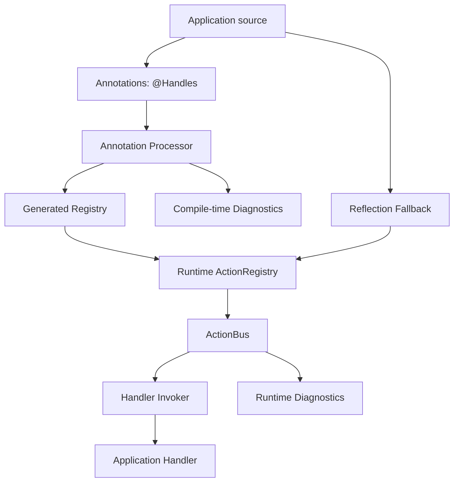
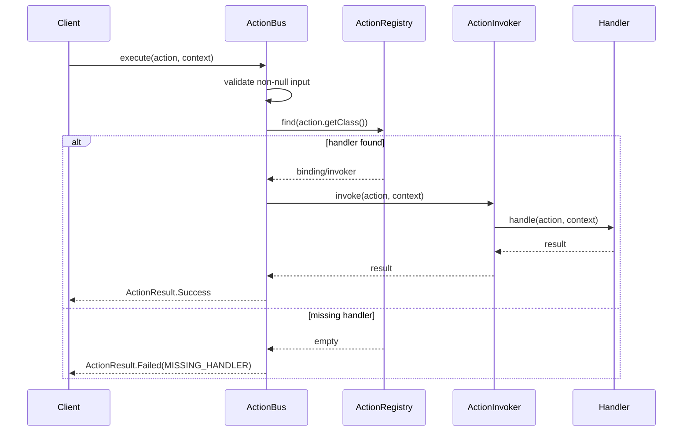
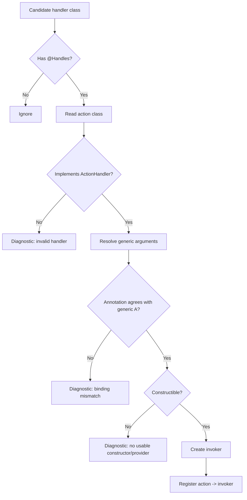
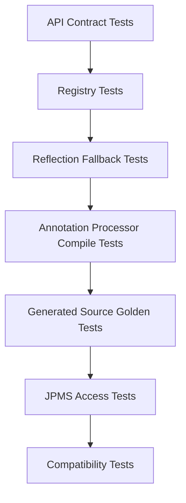
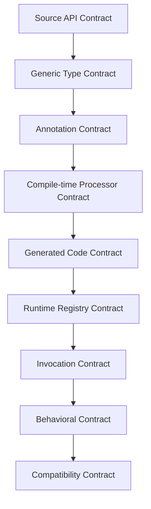

# Part 035 — Capstone: Language-Level Framework Design

This part closes the series by turning the previous concepts into one coherent framework design exercise.

We will design a small Java framework called **ActionKit**.

ActionKit is not meant to compete with Spring, CDI, Micronaut, Quarkus, MapStruct, Jackson, Hibernate Validator, or any existing framework. Its purpose is narrower: to teach how high-quality Java frameworks are shaped at the language level.

The capstone combines:

- package boundary design
- public API minimization
- object model discipline
- role-based interfaces
- generic type contracts
- wildcard-aware API signatures
- type erasure workarounds
- annotation design
- annotation processing
- generated registry code
- reflection fallback
- method handle invocation
- sealed result modeling
- misuse-resistant API design
- compatibility and evolution planning

By the end, the target skill is not merely "I know reflection" or "I know annotation processors". The target skill is:

> I can design a Java framework whose public API is small, typed, evolvable, diagnosable, performant enough, and honest about the boundary between compile-time type guarantees and runtime metadata.

---

## 1. Kaufman Framing: What Are We Practicing?

Josh Kaufman's learning method is useful here because framework design is too large to learn by reading APIs linearly. We deconstruct the skill, identify the minimum useful subskills, remove distractions, and practice with fast feedback.

For this capstone, the skill is not "build a framework". That framing is too broad.

The actual skill is:

> Design a small Java language-level framework that exposes a stable API, captures type information safely, discovers components reliably, invokes behavior efficiently, and reports failures clearly.

### 1.1 Target Performance Level

A top-level engineer should be able to:

1. Design the API before designing the implementation.
2. Separate API, SPI, generated code, runtime internals, and test support.
3. Use generics where they improve correctness, not where they create fake type safety.
4. Know where erasure removes information and where metadata must be explicitly supplied.
5. Decide whether reflection, method handles, generated source, generated bytecode, or ordinary direct calls are appropriate.
6. Create diagnostics that help users fix their code without reading the framework source.
7. Preserve binary and behavioral compatibility across versions.
8. Document extension contracts, not just method signatures.

### 1.2 The 20-Hour Practice Split

A realistic practice plan:

| Block | Time | Practice |
|---:|---:|---|
| 1 | 2h | Define API shape: command, handler, result, registry, invocation. |
| 2 | 2h | Model packages and module boundaries. |
| 3 | 3h | Implement runtime reflection discovery. |
| 4 | 3h | Replace reflection invocation with cached method handles. |
| 5 | 4h | Add annotation processor that generates a registry. |
| 6 | 2h | Add diagnostics and failure taxonomy. |
| 7 | 2h | Add compatibility tests and contract tests. |
| 8 | 2h | Refactor public API and remove accidental surface. |

### 1.3 What We Will Not Build

We will not build:

- dependency injection container
- HTTP server
- persistence layer
- distributed workflow engine
- validation framework clone
- scripting engine
- bytecode weaving platform

Those are different courses. Here, the capstone is intentionally smaller so the language mechanics remain visible.

---

## 2. Problem Statement: Action Dispatch Framework

ActionKit lets application teams define **actions** and **handlers**.

An action is a typed request:

```java
public record ApproveCase(String caseId, String reviewerId, String reason)
        implements Action<ApproveCaseResult> {}
```

A handler owns behavior for an action:

```java
@Handles(ApproveCase.class)
public final class ApproveCaseHandler implements ActionHandler<ApproveCase, ApproveCaseResult> {
    @Override
    public ApproveCaseResult handle(ApproveCase action, ActionContext context) {
        return new ApproveCaseResult(action.caseId(), true);
    }
}
```

A registry locates the handler:

```java
ActionRegistry registry = ActionRegistries.generated();
ActionBus bus = ActionBus.create(registry);

ActionResult<ApproveCaseResult> result = bus.execute(
    new ApproveCase("CASE-123", "USR-9", "Evidence sufficient"),
    ActionContext.empty()
);
```

The framework must support:

- typed result: `Action<R>` produces `R`
- explicit handler binding
- compile-time generated registry when possible
- runtime reflection fallback for development/testing
- method-handle-based invocation internally
- clear errors for duplicate handlers, missing handlers, wrong generic binding, inaccessible constructors, and module access problems
- no large public surface

---

## 3. Architectural Overview

The architecture has two lanes:

1. **Compile-time lane**: annotation processor validates handlers and generates a registry.
2. **Runtime lane**: runtime API executes actions using a registry and cached invokers.



The key principle:

> Generation is an optimization and diagnostics tool. The public semantic model must not depend on generated magic.

If generation fails, the user should still understand the same conceptual model:

- action type
- result type
- handler type
- registry entry
- invocation
- result/failure

---

## 4. Package Design

Before writing classes, define package boundaries.

```text
com.acme.actionkit
├── api
│   ├── Action
│   ├── ActionBus
│   ├── ActionContext
│   ├── ActionHandler
│   ├── ActionRegistry
│   ├── ActionResult
│   └── ActionKitException
├── annotations
│   └── Handles
├── spi
│   ├── ActionInvoker
│   ├── ActionRegistryProvider
│   └── ActionDescriptor
├── processor
│   └── HandlesProcessor
├── runtime.internal
│   ├── MethodHandleInvoker
│   ├── ReflectionRegistryBuilder
│   ├── HandlerBindingValidator
│   └── DefaultActionBus
└── generated
    └── GeneratedActionRegistry
```

A production library may split these into modules/artifacts:

| Artifact | Contains | Consumed By |
|---|---|---|
| `actionkit-api` | API and annotations | Application runtime and compile-time source |
| `actionkit-processor` | annotation processor | compiler only |
| `actionkit-runtime` | runtime internals | application runtime |
| generated source | generated registry | application runtime |

### 4.1 JPMS Module Shape

A possible module layout:

```java
module com.acme.actionkit.api {
    exports com.acme.actionkit.api;
    exports com.acme.actionkit.annotations;
    exports com.acme.actionkit.spi;
}

module com.acme.actionkit.runtime {
    requires com.acme.actionkit.api;
    exports com.acme.actionkit.runtime;
}

module com.acme.actionkit.processor {
    requires java.compiler;
    requires com.acme.actionkit.api;
    provides javax.annotation.processing.Processor
        with com.acme.actionkit.processor.HandlesProcessor;
}
```

Do not export `runtime.internal`. If reflection fallback must access application handlers, document whether the application module needs `opens`.

### 4.2 Boundary Rules

| Package | Public? | Rule |
|---|---:|---|
| `api` | Yes | Stable, small, documented. |
| `annotations` | Yes | Stable annotation contract. |
| `spi` | Limited | For advanced extension, not ordinary users. |
| `processor` | No runtime dependency | Compiler-only implementation. |
| `runtime.internal` | No | May change freely. |
| `generated` | No manual dependency | Generated implementation detail. |

A common mistake is exporting too much because it makes testing easier. This creates accidental API. Test through contracts, not through internals.

---

## 5. Public API First

The API starts with the core type relation:

```java
package com.acme.actionkit.api;

public interface Action<R> {
}
```

This says: an action promises the type of result it expects.

The handler is parameterized by both action and result:

```java
package com.acme.actionkit.api;

@FunctionalInterface
public interface ActionHandler<A extends Action<R>, R> {
    R handle(A action, ActionContext context) throws Exception;
}
```

The bus returns a framework-owned result wrapper:

```java
package com.acme.actionkit.api;

public interface ActionBus {
    <A extends Action<R>, R> ActionResult<R> execute(A action, ActionContext context);
}
```

This signature is important. It keeps the relation between `A` and `R` at the call site.

Bad version:

```java
ActionResult<?> execute(Action<?> action, ActionContext context);
```

That would erase the caller's knowledge. The user would need casts.

Better version:

```java
<A extends Action<R>, R> ActionResult<R> execute(A action, ActionContext context);
```

The result type is inferred from the concrete action.

---

## 6. Result Modeling with Sealed Types

Avoid returning `null`, throwing every failure, or using unstructured maps.

```java
package com.acme.actionkit.api;

public sealed interface ActionResult<R>
        permits ActionResult.Success, ActionResult.Rejected, ActionResult.Failed {

    record Success<R>(R value) implements ActionResult<R> {}

    record Rejected<R>(String code, String message) implements ActionResult<R> {}

    record Failed<R>(String code, String message, Throwable cause) implements ActionResult<R> {}

    static <R> ActionResult<R> success(R value) {
        return new Success<>(value);
    }

    static <R> ActionResult<R> rejected(String code, String message) {
        return new Rejected<>(code, message);
    }

    static <R> ActionResult<R> failed(String code, String message, Throwable cause) {
        return new Failed<>(code, message, cause);
    }
}
```

This gives the caller an explicit state space:

```java
return switch (result) {
    case ActionResult.Success<ApproveCaseResult> ok -> ok.value();
    case ActionResult.Rejected<ApproveCaseResult> rejected -> throw new IllegalStateException(rejected.message());
    case ActionResult.Failed<ApproveCaseResult> failed -> throw new RuntimeException(failed.message(), failed.cause());
};
```

The result type represents framework execution status. It should not replace domain modeling. A domain may still return a domain-specific result object inside `Success<R>`.

---

## 7. Context Object Design

A context object is where frameworks often become messy. The temptation is to expose a mutable map.

Bad:

```java
Map<String, Object> context;
```

Better:

```java
package com.acme.actionkit.api;

import java.time.Clock;
import java.util.Map;
import java.util.Optional;

public final class ActionContext {
    private final Clock clock;
    private final Map<Key<?>, Object> values;

    private ActionContext(Clock clock, Map<Key<?>, Object> values) {
        this.clock = clock;
        this.values = Map.copyOf(values);
    }

    public static ActionContext empty() {
        return new ActionContext(Clock.systemUTC(), Map.of());
    }

    public Clock clock() {
        return clock;
    }

    public <T> Optional<T> get(Key<T> key) {
        Object value = values.get(key);
        if (value == null) {
            return Optional.empty();
        }
        return Optional.of(key.type().cast(value));
    }

    public record Key<T>(String name, Class<T> type) {
        public Key {
            if (name == null || name.isBlank()) {
                throw new IllegalArgumentException("Context key name must not be blank");
            }
            if (type == null) {
                throw new NullPointerException("Context key type must not be null");
            }
        }
    }
}
```

This is still not perfect because `Class<T>` cannot represent `List<String>` precisely. But for context values, simple reifiable keys are often enough. Do not over-engineer type tokens unless the framework genuinely needs them.

---

## 8. Annotation Contract

The annotation binds a handler class to an action class.

```java
package com.acme.actionkit.annotations;

import com.acme.actionkit.api.Action;
import java.lang.annotation.ElementType;
import java.lang.annotation.Retention;
import java.lang.annotation.RetentionPolicy;
import java.lang.annotation.Target;

@Target(ElementType.TYPE)
@Retention(RetentionPolicy.RUNTIME)
public @interface Handles {
    Class<? extends Action<?>> value();
}
```

Why runtime retention?

Because the framework supports reflection fallback. If the framework were compile-time only, `RetentionPolicy.CLASS` could be sufficient. If users need runtime introspection, `RUNTIME` is appropriate.

### 8.1 Annotation Design Rules

| Rule | Reason |
|---|---|
| Annotation has one clear semantic responsibility. | Avoid turning it into configuration soup. |
| Attribute names are stable. | Annotation attributes are source API. |
| Defaults must be safe. | Defaults become sticky compatibility commitments. |
| Use `Class<?>` when binding to types. | Avoid fragile string class names. |
| Avoid arbitrary expressions. | Annotation values are compile-time constants. |

### 8.2 Avoid Overloading the Annotation

Do not start with this:

```java
@Handles(
    value = ApproveCase.class,
    transactional = true,
    retry = true,
    timeoutMillis = 1000,
    async = true,
    audit = true,
    circuitBreaker = "default"
)
```

That annotation is trying to be a policy language.

Better:

- keep `@Handles` for binding
- compose policies separately
- use explicit decorators or pipeline components
- avoid hidden framework behavior

---

## 9. Handler Descriptor

A registry should not store raw classes only. It should store descriptors.

```java
package com.acme.actionkit.spi;

import com.acme.actionkit.api.Action;
import com.acme.actionkit.api.ActionHandler;

public record ActionDescriptor<A extends Action<R>, R>(
        Class<A> actionType,
        Class<? extends ActionHandler<A, R>> handlerType,
        ActionInvoker<A, R> invoker
) {
    public ActionDescriptor {
        if (actionType == null) throw new NullPointerException("actionType");
        if (handlerType == null) throw new NullPointerException("handlerType");
        if (invoker == null) throw new NullPointerException("invoker");
    }
}
```

But there is a subtle problem:

```java
Class<? extends ActionHandler<A, R>>
```

Due to erasure, runtime cannot always prove that a handler class truly implements `ActionHandler<A, R>` for the expected `A` and `R`. The annotation processor can validate much more precisely at compile time using `TypeMirror`. Runtime fallback must validate as much as possible and report uncertainty honestly.

---

## 10. Registry API

Keep the registry simple:

```java
package com.acme.actionkit.api;

import java.util.Optional;

public interface ActionRegistry {
    <A extends Action<R>, R> Optional<ActionBinding<A, R>> find(Class<A> actionType);
}
```

Binding:

```java
package com.acme.actionkit.api;

public interface ActionBinding<A extends Action<R>, R> {
    Class<A> actionType();
    ActionHandler<A, R> handler();
}
```

This version keeps invocation simple but requires handler instances to be constructed. An alternative is to register invokers rather than handlers:

```java
package com.acme.actionkit.spi;

import com.acme.actionkit.api.Action;
import com.acme.actionkit.api.ActionContext;

@FunctionalInterface
public interface ActionInvoker<A extends Action<R>, R> {
    R invoke(A action, ActionContext context) throws Throwable;
}
```

A generated registry can use direct calls. A reflection fallback can use method handles behind this interface.

---

## 11. Runtime Flow



Default bus:

```java
package com.acme.actionkit.runtime;

import com.acme.actionkit.api.*;
import com.acme.actionkit.spi.ActionInvoker;

public final class DefaultActionBus implements ActionBus {
    private final RuntimeActionRegistry registry;

    public DefaultActionBus(RuntimeActionRegistry registry) {
        this.registry = java.util.Objects.requireNonNull(registry, "registry");
    }

    @Override
    public <A extends Action<R>, R> ActionResult<R> execute(A action, ActionContext context) {
        if (action == null) {
            return ActionResult.failed("NULL_ACTION", "Action must not be null", new NullPointerException("action"));
        }
        if (context == null) {
            return ActionResult.failed("NULL_CONTEXT", "ActionContext must not be null", new NullPointerException("context"));
        }

        @SuppressWarnings("unchecked")
        Class<A> actionType = (Class<A>) action.getClass();

        ActionInvoker<A, R> invoker = registry.findInvoker(actionType).orElse(null);
        if (invoker == null) {
            return ActionResult.failed(
                "MISSING_HANDLER",
                "No handler registered for action type: " + actionType.getName(),
                null
            );
        }

        try {
            R value = invoker.invoke(action, context);
            return ActionResult.success(value);
        } catch (ActionRejectedException rejected) {
            return ActionResult.rejected(rejected.code(), rejected.getMessage());
        } catch (Throwable failure) {
            return ActionResult.failed(
                "HANDLER_FAILURE",
                "Handler failed for action type: " + actionType.getName(),
                failure
            );
        }
    }
}
```

Note the local unchecked cast:

```java
@SuppressWarnings("unchecked")
Class<A> actionType = (Class<A>) action.getClass();
```

This is acceptable because the runtime class came from the `A action` parameter itself. Localized unchecked operations are not automatically bad. The rule is:

> If you must use unchecked operations, isolate them, justify them with an invariant, and prevent them from leaking into public API.

---

## 12. Method Handle Invoker

Reflection invocation is easy but slower and less direct semantically. Method handles give a more explicit invocation model.

Handler method:

```java
R handle(A action, ActionContext context) throws Exception;
```

Invoker construction:

```java
package com.acme.actionkit.runtime.internal;

import com.acme.actionkit.api.Action;
import com.acme.actionkit.api.ActionContext;
import com.acme.actionkit.api.ActionHandler;
import com.acme.actionkit.spi.ActionInvoker;
import java.lang.invoke.MethodHandle;
import java.lang.invoke.MethodHandles;
import java.lang.invoke.MethodType;

public final class MethodHandleInvokers {
    private MethodHandleInvokers() {}

    public static <A extends Action<R>, R> ActionInvoker<A, R> forHandler(ActionHandler<A, R> handler) {
        try {
            MethodHandles.Lookup lookup = MethodHandles.lookup();
            MethodHandle handle = lookup.findVirtual(
                handler.getClass(),
                "handle",
                MethodType.methodType(Object.class, Object.class, ActionContext.class)
            );

            MethodHandle bound = handle.bindTo(handler);

            return (action, context) -> {
                @SuppressWarnings("unchecked")
                R result = (R) bound.invoke(action, context);
                return result;
            };
        } catch (NoSuchMethodException | IllegalAccessException e) {
            throw new IllegalStateException(
                "Cannot create method handle invoker for handler: " + handler.getClass().getName(),
                e
            );
        }
    }
}
```

This simple version has a trap: if the implementation method is bridged, synthetic, overridden with specific parameter types, or not visible through the lookup used, `findVirtual` may not find what you expect.

A safer framework implementation may:

1. Discover the actual `handle` method through reflection.
2. Validate it is non-static and public or accessible by the selected lookup strategy.
3. Use `MethodHandles.publicLookup()` when only public API is allowed.
4. Use `privateLookupIn` only when the framework explicitly requires module opening.
5. Cache the resulting invoker.

Pseudo-production version:

```java
public static <A extends Action<R>, R> ActionInvoker<A, R> forMethod(
        Object receiver,
        java.lang.reflect.Method method,
        MethodHandles.Lookup lookup
) {
    try {
        MethodHandle raw = lookup.unreflect(method).bindTo(receiver);
        return (action, context) -> {
            @SuppressWarnings("unchecked")
            R result = (R) raw.invoke(action, context);
            return result;
        };
    } catch (IllegalAccessException e) {
        throw new IllegalStateException("Handler method is not accessible: " + method, e);
    }
}
```

### 12.1 Method Handle Design Rule

Use method handles internally, not as part of the ordinary user API.

Public API:

```java
ActionHandler<A, R>
```

Internal SPI:

```java
ActionInvoker<A, R>
```

Implementation detail:

```java
MethodHandle
```

This keeps framework ergonomics high while allowing runtime optimization internally.

---

## 13. Reflection Fallback Discovery

Reflection fallback is useful for tests, development, and environments where annotation processing is not configured.

Discovery algorithm:



Basic code:

```java
public final class ReflectionRegistryBuilder {
    private final Map<Class<?>, ActionInvoker<?, ?>> invokers = new LinkedHashMap<>();

    public ReflectionRegistryBuilder addHandlerClass(Class<?> handlerType) {
        Handles handles = handlerType.getAnnotation(Handles.class);
        if (handles == null) {
            return this;
        }

        Class<? extends Action<?>> actionType = handles.value();

        if (!ActionHandler.class.isAssignableFrom(handlerType)) {
            throw new ActionKitConfigurationException(
                "Class annotated with @Handles must implement ActionHandler: " + handlerType.getName()
            );
        }

        Object handler = instantiate(handlerType);
        ActionInvoker<?, ?> invoker = MethodHandleInvokers.forUntypedHandler(handler);

        ActionInvoker<?, ?> previous = invokers.putIfAbsent(actionType, invoker);
        if (previous != null) {
            throw new ActionKitConfigurationException(
                "Duplicate handler for action type: " + actionType.getName()
            );
        }
        return this;
    }

    public RuntimeActionRegistry build() {
        return new RuntimeActionRegistry(Map.copyOf(invokers));
    }
}
```

This code is intentionally incomplete because production discovery has hard details:

- how to scan classpath/modules
- how to construct handlers
- how to integrate dependency injection
- how to resolve generic supertype chains
- how to handle non-public handlers
- how to handle nested classes
- how to handle bridge methods
- how to avoid class loader leaks

The lesson is not that reflection fallback is impossible. The lesson is that reflection fallback must be bounded.

---

## 14. Generic Binding Validation

A handler may lie accidentally:

```java
@Handles(ApproveCase.class)
public final class WrongHandler implements ActionHandler<RejectCase, RejectCaseResult> {
    @Override
    public RejectCaseResult handle(RejectCase action, ActionContext context) {
        return new RejectCaseResult(action.caseId());
    }
}
```

The annotation says `ApproveCase`. The generic interface says `RejectCase`.

Annotation processor should catch this.

Runtime reflection can attempt to catch it:

```java
static Optional<Class<?>> resolveActionArgument(Class<?> handlerType) {
    for (Type type : handlerType.getGenericInterfaces()) {
        if (type instanceof ParameterizedType parameterized
                && parameterized.getRawType() == ActionHandler.class) {
            Type actionArg = parameterized.getActualTypeArguments()[0];
            if (actionArg instanceof Class<?> actionClass) {
                return Optional.of(actionClass);
            }
        }
    }
    return Optional.empty();
}
```

But this fails for many cases:

```java
abstract class BaseHandler<A extends Action<R>, R> implements ActionHandler<A, R> {}

@Handles(ApproveCase.class)
final class ApproveCaseHandler extends BaseHandler<ApproveCase, ApproveCaseResult> {}
```

A production resolver needs to walk generic superclasses and substitute type variables. This is doable, but complex.

This is the architectural conclusion:

> Use annotation processing for strong compile-time validation. Use runtime reflection fallback as a convenience path with explicit limitations.

---

## 15. Annotation Processor Shape

Processor responsibilities:

1. Find `@Handles` types.
2. Validate annotated element is a class.
3. Validate it implements `ActionHandler<A, R>`.
4. Validate annotation action type equals generic action type.
5. Validate handler has a supported construction strategy.
6. Detect duplicate handlers for the same action.
7. Generate `GeneratedActionRegistry`.
8. Emit precise diagnostics.

Processor skeleton:

```java
@SupportedAnnotationTypes("com.acme.actionkit.annotations.Handles")
@SupportedSourceVersion(SourceVersion.RELEASE_25)
public final class HandlesProcessor extends AbstractProcessor {
    private Types types;
    private Elements elements;
    private Filer filer;
    private Messager messager;

    @Override
    public synchronized void init(ProcessingEnvironment processingEnv) {
        super.init(processingEnv);
        this.types = processingEnv.getTypeUtils();
        this.elements = processingEnv.getElementUtils();
        this.filer = processingEnv.getFiler();
        this.messager = processingEnv.getMessager();
    }

    @Override
    public boolean process(Set<? extends TypeElement> annotations, RoundEnvironment roundEnv) {
        if (roundEnv.processingOver()) {
            return false;
        }

        List<BindingModel> bindings = new ArrayList<>();

        for (Element element : roundEnv.getElementsAnnotatedWith(Handles.class)) {
            if (element.getKind() != ElementKind.CLASS) {
                error(element, "@Handles can only be used on classes");
                continue;
            }

            TypeElement handlerType = (TypeElement) element;
            validateAndCollect(handlerType).ifPresent(bindings::add);
        }

        if (!bindings.isEmpty()) {
            generateRegistry(bindings);
        }

        return false;
    }

    private void error(Element element, String message) {
        messager.printMessage(Diagnostic.Kind.ERROR, message, element);
    }
}
```

### 15.1 Generated Registry Example

Generated code should be boring and deterministic.

```java
package com.acme.actionkit.generated;

import com.acme.actionkit.api.Action;
import com.acme.actionkit.runtime.RuntimeActionRegistry;
import com.acme.actionkit.spi.ActionInvoker;
import java.util.LinkedHashMap;
import java.util.Map;

public final class GeneratedActionRegistryFactory {
    private GeneratedActionRegistryFactory() {}

    public static RuntimeActionRegistry create() {
        Map<Class<?>, ActionInvoker<?, ?>> map = new LinkedHashMap<>();

        map.put(com.example.ApproveCase.class, (action, context) -> {
            com.example.ApproveCase typedAction = (com.example.ApproveCase) action;
            return new com.example.ApproveCaseHandler().handle(typedAction, context);
        });

        map.put(com.example.RejectCase.class, (action, context) -> {
            com.example.RejectCase typedAction = (com.example.RejectCase) action;
            return new com.example.RejectCaseHandler().handle(typedAction, context);
        });

        return new RuntimeActionRegistry(Map.copyOf(map));
    }
}
```

This generated code uses casts, but they are generated from validated compile-time metadata. It is safer than hand-written unchecked casts scattered through application code.

### 15.2 Determinism Rule

Generated output must be deterministic:

- stable ordering
- stable imports
- stable formatting
- no timestamp in generated source
- no environment-specific absolute paths
- no random names unless derived deterministically

This matters for incremental builds, reproducibility, code review, and cacheability.

---

## 16. Generated Code vs Reflection vs Direct API

| Mechanism | Best For | Cost | Risk |
|---|---|---|---|
| Direct calls | Ordinary application code | Lowest | Manual wiring |
| Generated source | Framework wiring with compile-time validation | Build complexity | Processor bugs |
| Reflection | Development fallback, tools, diagnostics | Runtime cost/access issues | Erasure/module traps |
| Method handles | Cached runtime invocation | Complexity | Lookup/access complexity |
| Bytecode generation | Proxies, high-volume dynamic types | Highest complexity | Verifier/classloader leaks |

ActionKit should prefer:

1. Direct public API for users.
2. Generated source for registry assembly.
3. Method handles for runtime fallback invokers.
4. Reflection for discovery/metadata only.
5. Bytecode generation only if there is a measured need.

Do not start with bytecode generation because it feels advanced. Start with the simplest mechanism that preserves the API contract.

---

## 17. Public Factory Design

Users need one obvious entry point.

```java
package com.acme.actionkit.api;

public final class ActionKit {
    private ActionKit() {}

    public static ActionBus create(ActionRegistry registry) {
        return new DefaultActionBus(registry);
    }
}
```

But `DefaultActionBus` is internal or runtime package. The API module should not depend on runtime internals if split into artifacts. In that case:

```java
package com.acme.actionkit.runtime;

public final class ActionBuses {
    private ActionBuses() {}

    public static ActionBus create(ActionRegistry registry) {
        return new DefaultActionBus(registry);
    }
}
```

Generated registry access:

```java
ActionRegistry registry = GeneratedActionRegistryFactory.create();
ActionBus bus = ActionBuses.create(registry);
```

Reflection fallback:

```java
ActionRegistry registry = ReflectionRegistries.builder()
    .addHandlerClass(ApproveCaseHandler.class)
    .addHandlerClass(RejectCaseHandler.class)
    .build();
```

Keep these flows separate. Do not make one factory method guess everything magically.

---

## 18. Error and Diagnostic Design

Frameworks fail in two places:

1. Compile time
2. Runtime

Compile-time failure should be tied to source elements:

```text
error: @Handles binding mismatch
  handler: com.example.WrongHandler
  annotation action: com.example.ApproveCase
  generic ActionHandler action: com.example.RejectCase
Fix: change @Handles value or ActionHandler<A, R> type arguments.
```

Runtime failure should include:

- failure code
- action type
- handler type if known
- likely cause
- fix recommendation

Example:

```text
ActionKit configuration error [DUPLICATE_HANDLER]
Action type: com.example.ApproveCase
Handler A: com.example.ApproveCaseHandler
Handler B: com.example.AuditApproveCaseHandler
ActionKit requires exactly one handler per action type.
Use an explicit composite handler if you need multiple behaviors.
```

### 18.1 Failure Taxonomy

| Code | Meaning | Detection Time |
|---|---|---|
| `MISSING_HANDLER` | No handler for action type | Runtime |
| `DUPLICATE_HANDLER` | Multiple handlers for one action | Compile/runtime |
| `BINDING_MISMATCH` | `@Handles` disagrees with generic handler type | Compile/runtime partial |
| `INACCESSIBLE_HANDLER` | Constructor/method not accessible | Compile/runtime |
| `UNSUPPORTED_HANDLER_SHAPE` | Handler not constructible or invalid | Compile/runtime |
| `HANDLER_FAILURE` | Handler threw unexpected exception | Runtime |
| `ACTION_REJECTED` | Handler intentionally rejected action | Runtime |
| `MODULE_ACCESS_DENIED` | JPMS blocks reflection/method handle access | Runtime |

Use stable error codes. Messages may evolve; codes often become operational contracts.

---

## 19. Misuse Resistance

### 19.1 Prevent Raw Registry Registration

Bad:

```java
registry.register(Class<?> actionType, Object handler);
```

This accepts everything and fails late.

Better:

```java
public final class RegistryBuilder {
    public <A extends Action<R>, R> RegistryBuilder register(
            Class<A> actionType,
            ActionHandler<A, R> handler
    ) {
        // store safely behind an internal unchecked boundary
        return this;
    }
}
```

### 19.2 Avoid String-Based Type Binding

Bad:

```java
@Handles("com.example.ApproveCase")
```

Better:

```java
@Handles(ApproveCase.class)
```

String names are useful for config files or remote protocols, not for source-level type binding.

### 19.3 Keep Magic Optional

Bad framework design:

```java
ActionBus bus = ActionKit.scanEverythingAndGuess();
```

Better:

```java
ActionRegistry registry = GeneratedActionRegistryFactory.create();
ActionBus bus = ActionBuses.create(registry);
```

Explicit composition is easier to reason about, test, and debug.

---

## 20. Compatibility Strategy

The public API must evolve carefully.

### 20.1 Safe-ish Changes

Usually safer:

- add new types
- add static factory methods
- add default methods to interfaces only when behavior is truly default and safe
- add new result subtypes only if callers are not relying on exhaustive switches outside your controlled boundary
- add annotation attributes only with safe defaults

### 20.2 Dangerous Changes

Dangerous:

- changing generic bounds
- changing method return type
- changing thrown exception semantics
- changing annotation retention
- renaming annotation attributes
- changing generated class names if users import them directly
- changing failure codes
- changing default construction strategy
- changing result state semantics

### 20.3 Generated API Compatibility

Generated code creates a subtle contract. Even if you say "do not depend on generated internals", users may still do it.

Mitigation:

1. Put generated types in a documented package.
2. Document which generated entry points are stable.
3. Use a stable factory name if users must call it.
4. Mark generated internals with comments and annotations.
5. Keep generated output deterministic.

Generated file header:

```java
// Generated by ActionKit. Do not edit manually.
// Stable entry point: GeneratedActionRegistryFactory.create()
// Other implementation details may change between minor versions.
```

---

## 21. Testing Strategy

Framework testing needs several layers.



### 21.1 API Contract Tests

Test user-facing behavior:

```java
@Test
void executesRegisteredHandler() {
    RegistryBuilder builder = RegistryBuilder.create();
    builder.register(ApproveCase.class, new ApproveCaseHandler());

    ActionBus bus = ActionBuses.create(builder.build());
    ActionResult<ApproveCaseResult> result = bus.execute(
        new ApproveCase("C-1", "U-1", "ok"),
        ActionContext.empty()
    );

    assertThat(result).isInstanceOf(ActionResult.Success.class);
}
```

### 21.2 Processor Tests

Use compile-testing style tests:

- valid handler compiles
- handler without `ActionHandler` fails
- binding mismatch fails
- duplicate action handler fails
- generated registry contains expected action mapping
- diagnostics mention exact handler/action names

### 21.3 Reflection Tests

Test reflective edge cases:

- package-private handler
- private constructor
- nested handler
- generic base class
- bridge method
- module without `opens`
- duplicate binding
- class loader unloadability

### 21.4 Compatibility Tests

Keep compiled test fixtures from previous versions and run them against new runtime jars.

This catches changes that unit tests from source compilation may miss.

---

## 22. Performance Model

Do not optimize blindly. Define expected scale.

| Operation | Expected Frequency | Optimization Priority |
|---|---:|---:|
| Registry construction | startup/build time | Medium |
| Handler lookup | per action | High |
| Handler invocation | per action | High |
| Annotation scanning | compile/startup | Medium |
| Generic validation | compile/startup | Medium |
| Diagnostics | failure path | Clarity over speed |

Recommended runtime design:

```java
public final class RuntimeActionRegistry {
    private final Map<Class<?>, ActionInvoker<?, ?>> invokers;

    public RuntimeActionRegistry(Map<Class<?>, ActionInvoker<?, ?>> invokers) {
        this.invokers = Map.copyOf(invokers);
    }

    public <A extends Action<R>, R> Optional<ActionInvoker<A, R>> findInvoker(Class<A> actionType) {
        @SuppressWarnings("unchecked")
        ActionInvoker<A, R> invoker = (ActionInvoker<A, R>) invokers.get(actionType);
        return Optional.ofNullable(invoker);
    }
}
```

Again, the unchecked cast is localized. The registry invariant is:

> For every entry, the map key `Class<A>` corresponds to an `ActionInvoker<A, R>` validated at registration or generation time.

If this invariant is broken, the framework has a bug or accepted invalid registration.

---

## 23. Security and Encapsulation

A framework that uses reflection or method handles must not casually break encapsulation.

### 23.1 Policy

ActionKit should default to public access:

- public handler class
- public constructor or registered instance/provider
- public `handle` method through interface

For non-public access, require explicit opt-in:

- module `opens`
- builder option
- documented security trade-off

### 23.2 Avoid `setAccessible(true)` by Default

Using deep reflection can break module encapsulation and surprise users. Prefer:

- constructor/provider registration
- generated direct call
- public interface invocation
- `MethodHandles.publicLookup()`

Only use `privateLookupIn` when the framework contract explicitly requires opened packages.

---

## 24. Example End-to-End Code

### 24.1 Action

```java
public record ApproveCase(String caseId, String reviewerId, String reason)
        implements Action<ApproveCaseResult> {
    public ApproveCase {
        if (caseId == null || caseId.isBlank()) throw new IllegalArgumentException("caseId");
        if (reviewerId == null || reviewerId.isBlank()) throw new IllegalArgumentException("reviewerId");
        if (reason == null || reason.isBlank()) throw new IllegalArgumentException("reason");
    }
}
```

### 24.2 Result

```java
public record ApproveCaseResult(String caseId, boolean approved) {}
```

### 24.3 Handler

```java
@Handles(ApproveCase.class)
public final class ApproveCaseHandler implements ActionHandler<ApproveCase, ApproveCaseResult> {
    @Override
    public ApproveCaseResult handle(ApproveCase action, ActionContext context) {
        if (action.reason().length() < 10) {
            throw new ActionRejectedException("REASON_TOO_SHORT", "Approval reason is too short");
        }
        return new ApproveCaseResult(action.caseId(), true);
    }
}
```

### 24.4 Bootstrapping

Generated path:

```java
ActionRegistry registry = GeneratedActionRegistryFactory.create();
ActionBus bus = ActionBuses.create(registry);
```

Manual path:

```java
ActionRegistry registry = RegistryBuilder.create()
    .register(ApproveCase.class, new ApproveCaseHandler())
    .build();

ActionBus bus = ActionBuses.create(registry);
```

Reflection fallback:

```java
ActionRegistry registry = ReflectionRegistries.builder()
    .addHandlerClass(ApproveCaseHandler.class)
    .build();
```

Execution:

```java
ActionResult<ApproveCaseResult> result = bus.execute(
    new ApproveCase("CASE-001", "USER-001", "Evidence satisfies review threshold"),
    ActionContext.empty()
);
```

---

## 25. Framework Design Review Checklist

Use this checklist before calling the design production-ready.

### 25.1 API Surface

- Is the public package small?
- Are internals non-exported?
- Are constructors/factories intentional?
- Are method names semantically precise?
- Are generic parameters necessary and understandable?
- Are wildcard signatures used only where they improve flexibility?
- Are unchecked casts isolated?

### 25.2 Type Safety

- Does `Action<R>` preserve result type at call sites?
- Are handler bindings validated?
- Are raw types rejected?
- Are generic mismatches detected by processor?
- Does runtime fallback document erasure limitations?

### 25.3 Diagnostics

- Are compile-time errors tied to source elements?
- Are runtime errors stable-coded?
- Do messages include action and handler type names?
- Do messages suggest a fix?
- Are duplicate/missing/inaccessible cases distinct?

### 25.4 Runtime

- Are invokers cached?
- Is registry immutable after construction?
- Are class loader references controlled?
- Is reflection used only during construction/discovery?
- Is invocation path direct enough?

### 25.5 Evolution

- Are generated entry points stable?
- Are annotation defaults safe?
- Can new result states be added safely?
- Are behavior changes documented as compatibility changes?
- Are old compiled fixtures tested?

---

## 26. Common Design Mistakes

### Mistake 1: The Framework Owns Too Much

Bad:

```java
@Handles(value = ApproveCase.class, transaction = true, async = true, audit = true)
```

This mixes action dispatch, transaction policy, async execution, and auditing.

Better:

- ActionKit dispatches actions.
- Decorators add cross-cutting behavior.
- The application composes policies explicitly.

### Mistake 2: Fake Generic Safety

Bad:

```java
public <T> T execute(Object action);
```

This lets callers ask for anything.

Better:

```java
public <A extends Action<R>, R> ActionResult<R> execute(A action, ActionContext context);
```

The action controls the result type.

### Mistake 3: Reflection Everywhere

Bad:

- scan every request
- resolve handler every request
- inspect generic metadata every request
- call `Method.invoke` every request

Better:

- discover once
- validate once
- cache invoker
- use immutable registry

### Mistake 4: Generated Code Is Too Clever

Generated code should be simple. Avoid generating complex mini-frameworks inside generated files.

Bad generated code:

- custom lifecycle engine
- hidden retry behavior
- dynamic config parsing
- reflection inside generated code

Better generated code:

- construct map
- bind action class to invoker
- call handler directly

### Mistake 5: Poor Module Story

A framework that works only on classpath but fails under JPMS should say so clearly.

Better:

- document classpath and module path behavior
- avoid deep reflection by default
- provide `opens` guidance only when necessary

---

## 27. Extension: Decorator Pipeline

ActionKit can support composition without becoming magical.

```java
@FunctionalInterface
public interface ActionMiddleware {
    <A extends Action<R>, R> ActionResult<R> around(
        A action,
        ActionContext context,
        Invocation<A, R> next
    );

    @FunctionalInterface
    interface Invocation<A extends Action<R>, R> {
        ActionResult<R> proceed(A action, ActionContext context);
    }
}
```

This is powerful but complex. Generic method interfaces with nested generic invocation are harder for users.

A simpler design may be:

```java
public interface ActionBusDecorator {
    ActionBus decorate(ActionBus next);
}
```

Example:

```java
public final class TimingDecorator implements ActionBusDecorator {
    @Override
    public ActionBus decorate(ActionBus next) {
        return (action, context) -> {
            long start = System.nanoTime();
            try {
                return next.execute(action, context);
            } finally {
                long elapsed = System.nanoTime() - start;
                // record metric
            }
        };
    }
}
```

This uses ordinary object composition and avoids turning the core API into a higher-kinded abstraction puzzle.

---

## 28. Extension: Dependency Injection Boundary

A framework like ActionKit should not automatically become a DI container.

Instead, support handler providers:

```java
@FunctionalInterface
public interface HandlerProvider<H> {
    H get();
}
```

Registry builder:

```java
public <A extends Action<R>, R> RegistryBuilder register(
        Class<A> actionType,
        HandlerProvider<? extends ActionHandler<A, R>> provider
) {
    // store provider-backed invoker
    return this;
}
```

Why `? extends ActionHandler<A, R>`?

Because a provider may return a subtype of the required handler contract.

This is a proper use of covariance at API boundary.

---

## 29. Extension: Type Tokens

If ActionKit later supports parameterized actions, `Class<A>` may not be enough.

Example:

```java
public record BulkAction<T>(List<T> items) implements Action<BulkResult<T>> {}
```

At runtime, `BulkAction<String>` and `BulkAction<Long>` have the same class.

If the framework must distinguish them, it needs type tokens:

```java
public abstract class TypeRef<T> {
    private final Type type;

    protected TypeRef() {
        Type superclass = getClass().getGenericSuperclass();
        if (!(superclass instanceof ParameterizedType p)) {
            throw new IllegalStateException("Missing type parameter");
        }
        this.type = p.getActualTypeArguments()[0];
    }

    public final Type type() {
        return type;
    }
}
```

Usage:

```java
TypeRef<BulkAction<String>> type = new TypeRef<>() {};
```

But do not introduce this unless required. Type token APIs are harder to use, harder to evolve, and often unnecessary.

---

## 30. Final Mental Model

A Java framework is a layered contract system.



Each layer can strengthen or weaken the system.

- Bad API shape forces users into casts.
- Weak annotation contract creates ambiguous configuration.
- Poor processor diagnostics make the framework feel magical.
- Reflection without boundaries breaks under modules.
- Generated code without determinism breaks builds.
- Method handles without lookup discipline create access failures.
- Public internals freeze accidental design.
- Behavioral changes break users even when binaries still link.

The best framework code is often not the cleverest code. It is code that makes the contract obvious.

---

## 31. What Top 1% Engineers Should Take Away

At this level, the goal is not to memorize APIs. The goal is to reason across layers.

### 31.1 Language Layer

You understand:

- `Class<?>` is runtime metadata, not full generic truth.
- `Package` and `Module` are real runtime boundaries.
- `Object` contracts influence every collection, cache, registry, and identity map.
- Access control is part of API design, not just syntax.

### 31.2 Type System Layer

You understand:

- generics are compile-time contracts implemented through erasure
- wildcards encode producer/consumer flexibility
- raw types and unchecked casts are controlled hazards
- type tokens are runtime evidence, not magic
- public generic signatures become long-term compatibility commitments

### 31.3 API Design Layer

You understand:

- small API surface is strategic leverage
- naming encodes semantics
- nullability, mutability, exceptions, and lifecycle are API contracts
- misuse resistance beats documentation-only safety
- compatibility includes behavior, not only binary linkage

### 31.4 Metaprogramming Layer

You understand:

- reflection is metadata and dynamic access
- method handles are typed invocation capabilities
- annotation processing is compile-time model transformation
- generated code is an API-adjacent artifact
- bytecode generation is powerful but expensive in complexity

### 31.5 Framework Layer

You understand:

- framework design is mostly boundary design
- hidden magic creates operational debt
- diagnostics are part of user experience
- compile-time validation is better than runtime surprise
- runtime fallback must be honest about limitations

---

## 32. Practice Exercises

### Exercise 1 — Manual Registry

Implement:

```java
RegistryBuilder.create()
    .register(ApproveCase.class, new ApproveCaseHandler())
    .build();
```

Acceptance criteria:

- duplicate registration fails
- missing handler returns structured failure
- unchecked casts are isolated
- registry is immutable

### Exercise 2 — Reflection Fallback

Implement:

```java
ReflectionRegistries.builder()
    .addHandlerClass(ApproveCaseHandler.class)
    .build();
```

Acceptance criteria:

- invalid annotated classes produce useful errors
- no public API exposes `Method` or `Field`
- method handle invoker is cached

### Exercise 3 — Annotation Processor

Implement processor validation for:

- `@Handles` only on classes
- class implements `ActionHandler<A, R>`
- annotation action equals `A`
- duplicate handlers fail
- generated registry compiles

### Exercise 4 — Module Boundary

Create a JPMS sample application.

Acceptance criteria:

- generated registry works without `opens`
- reflection fallback clearly fails or requires documented `opens`
- diagnostics mention module/package access

### Exercise 5 — Compatibility Drill

Compile sample user code against version 1.0.

Then release version 1.1 with:

- added static factory
- added annotation attribute with default
- added default method
- changed error message but not error code

Run old binaries against new runtime.

Then intentionally break compatibility and observe failure modes.

---

## 33. Series Completion

This is the final part of **Learn Java Language Object Model, API Design & Metaprogramming**.

The series started from the Java language substrate and ended with framework-level design:

1. `java.lang` and universal object contracts
2. package, module, and accessibility boundaries
3. OOP as type/behavior/invariant modeling
4. functional composition and higher-order APIs
5. generics, variance, erasure, and defensive generic design
6. API surface, contracts, usability, and compatibility
7. reflection, method handles, and runtime introspection
8. annotation processing, generated source, bytecode generation, and capstone framework design

The final invariant of the whole series:

> Advanced Java engineering is not about using the most advanced mechanism. It is about choosing the narrowest mechanism that preserves the strongest useful contract with the lowest long-term operational and compatibility cost.

---

## 34. References

- Java SE 25 API Documentation — `java.lang`, `java.lang.reflect`, `java.lang.invoke`, `java.lang.classfile`, `javax.annotation.processing`
- Java Language Specification SE 25 — types, generics, classes, interfaces, annotations, binary compatibility
- Java Tutorials — Generics and type erasure
- JDK documentation for `MethodHandle`, `MethodHandles`, `VarHandle`, `Proxy`, `Filer`, `Messager`, `Element`, and `TypeMirror`
