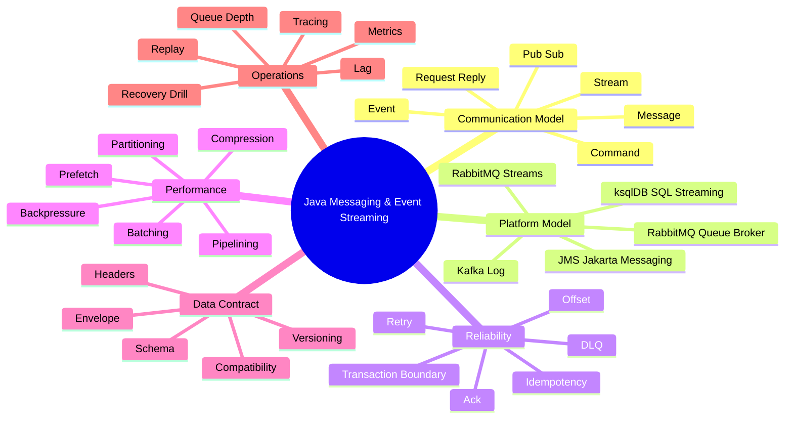
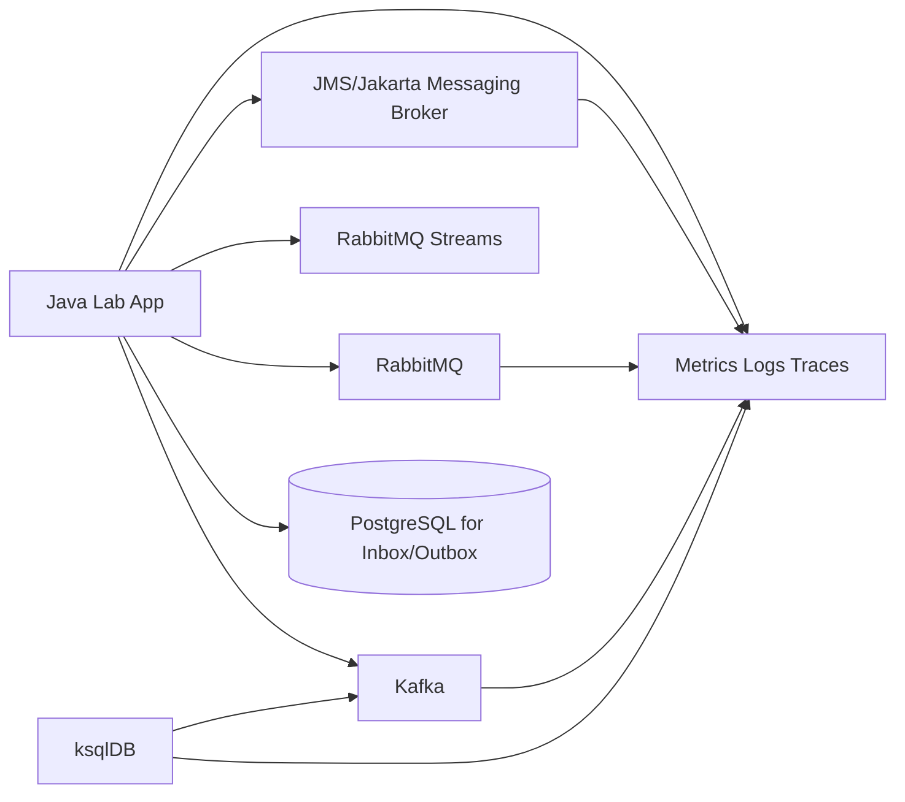
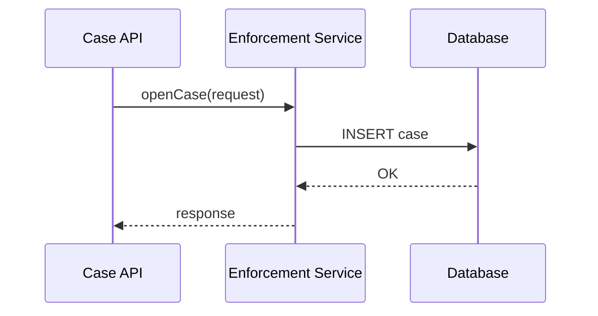
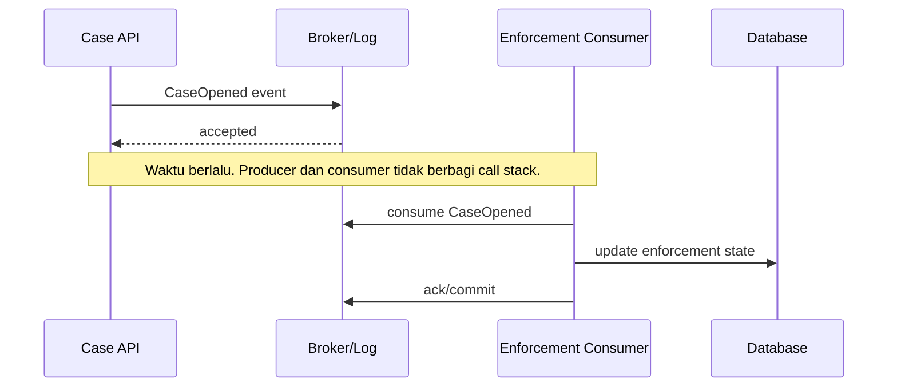
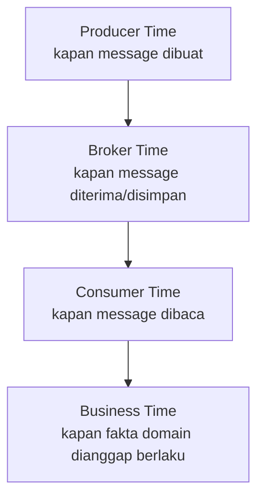
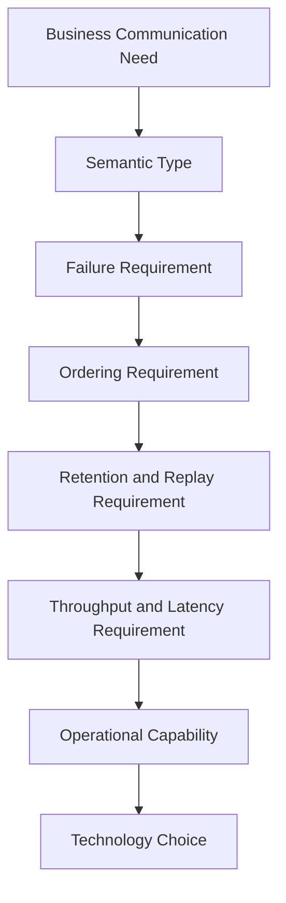
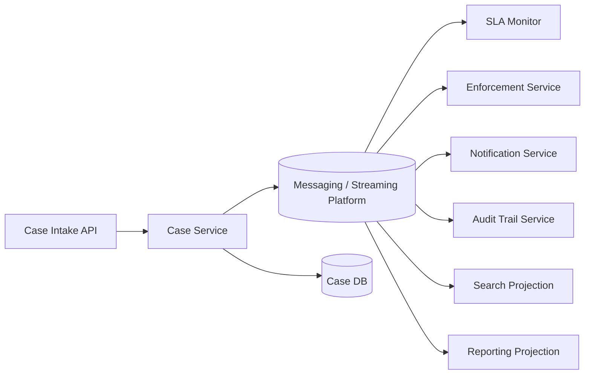
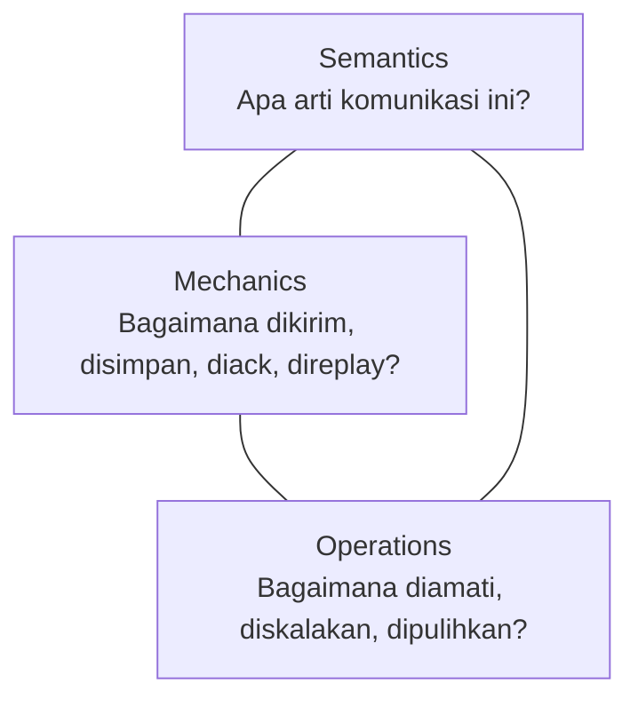

------
title: Learn Java Messaging and Event Streaming - Part 001
description: Kaufman-style skill map for mastering Java messaging, JMS/Jakarta Messaging, Kafka, ksqlDB, RabbitMQ, RabbitMQ Streams, batching, pipelining, reliability, and production failure modelling.
series: learn-java-messaging-event-streaming
seriesTitle: Learn Java Messaging and Event Streaming
order: 1
partTitle: Kaufman Skill Map
tags:
- java
- messaging
- event-streaming
- jms
- jakarta-messaging
- kafka
- rabbitmq
- ksqldb
- distributed-systems
- architecture
date: 2026-06-28
---

# Part 001 — Kaufman Skill Map

> Tujuan part ini bukan langsung menghafal API JMS, Kafka, RabbitMQ, atau ksqlDB. Tujuan part ini adalah membangun **peta skill**: apa yang perlu dipahami, urutan belajar yang efisien, cara latihan, dan standar engineering yang akan kita pakai sepanjang seri.

Seri ini mengikuti prinsip dari *The First 20 Hours* oleh Josh Kaufman: pecah skill menjadi sub-skill kecil, pelajari cukup banyak untuk bisa mengoreksi diri, singkirkan hambatan latihan, lalu lakukan latihan terarah dengan feedback cepat.

Untuk konteks software engineer senior, “20 jam pertama” bukan berarti menjadi ahli seluruh messaging platform dalam 20 jam. Artinya: dalam 20 jam pertama kita harus membangun **kerangka mental yang benar** sehingga pembelajaran berikutnya tidak menjadi kumpulan template, snippet, dan konfigurasi acak.

Messaging dan event streaming sering terlihat seperti urusan library:

```java
producer.send(record);
consumer.receive();
```

Namun di production, messaging adalah urusan:

- kontrak komunikasi,
- kepemilikan state,
- ordering,
- retry,
- durability,
- duplicate handling,
- poison message,
- schema evolution,
- observability,
- backpressure,
- recovery,
- dan konsekuensi bisnis ketika pesan terlambat, hilang, dobel, atau diproses dalam urutan salah.

Engineer top-tier tidak hanya bisa “mengirim message”. Ia bisa menjawab:

- Apa yang terjadi jika producer berhasil mengirim, tetapi database transaction rollback?
- Apa yang terjadi jika consumer commit offset sebelum side effect selesai?
- Apa yang terjadi jika broker menerima message tetapi acknowledgement ke producer hilang?
- Apa yang terjadi jika event schema berubah saat consumer lama masih berjalan?
- Apa yang terjadi jika consumer lambat selama 4 jam lalu mengejar backlog?
- Apa yang terjadi jika retry membuat downstream semakin mati?
- Apa yang terjadi jika satu `caseId` menjadi hot key dan seluruh SLA monitoring tertahan?

Itulah level yang akan kita bangun.

---

## 1. Skill yang Sebenarnya Kita Pelajari

Skill ini bukan “belajar Kafka” atau “belajar RabbitMQ”. Itu terlalu sempit.

Skill sebenarnya adalah:

> Mendesain, mengimplementasikan, mengoperasikan, dan men-debug komunikasi asynchronous dan event-driven di sistem Java yang punya reliability, auditability, scalability, dan failure behaviour yang dapat dijelaskan.

Dari definisi ini, ada beberapa konsekuensi.

Pertama, kita harus memahami **komunikasi** sebelum tool. JMS, Kafka, RabbitMQ, dan ksqlDB hanyalah implementasi dari beberapa model komunikasi yang berbeda.

Kedua, kita harus memahami **waktu**. Dalam sistem synchronous, waktu sering tersembunyi di call stack. Dalam sistem asynchronous, waktu menjadi domain utama: event bisa terlambat, diduplikasi, diproses ulang, diproses oleh consumer lama, atau direplay bertahun-tahun kemudian.

Ketiga, kita harus memahami **failure** sebagai bagian dari desain normal, bukan exception langka.

Keempat, kita harus memahami **operasi production**. Messaging system yang benar di laptop bisa gagal total di production karena disk, lag, partition skew, retry storm, rebalance storm, memory pressure, schema incompatibility, atau observability yang buruk.

---

## 2. Adaptasi Framework Kaufman

Kaufman menyarankan beberapa langkah inti. Kita adaptasi menjadi framework untuk messaging engineering.

## 2.1 Deconstruct the Skill

Kita pecah skill besar menjadi sub-skill yang bisa dilatih satu per satu.



Sub-skill utama dalam seri ini:

| Area | Pertanyaan Kunci | Output Skill |
|---|---|---|
| Communication semantics | Apakah ini command, event, message, stream, atau signal? | Bisa memilih model komunikasi yang tepat |
| Broker/log model | Apakah data dihapus saat dikonsumsi atau disimpan untuk replay? | Bisa membedakan queue, topic, log, dan stream |
| Delivery guarantees | Apa arti at-most-once, at-least-once, effectively-once? | Bisa mendesain duplicate/loss handling |
| Ordering | Apakah urutan global diperlukan atau hanya per entity? | Bisa memilih key, partition, routing, dan sequencing |
| Retry & DLQ | Kapan retry membantu dan kapan memperburuk incident? | Bisa mendesain retry budget dan quarantine |
| Idempotency | Apa yang membuat processing aman diulang? | Bisa membangun handler replay-safe |
| Batching & pipelining | Di mana batch terjadi dan apa trade-off-nya? | Bisa tuning throughput tanpa merusak latency/SLA |
| Backpressure | Bagaimana sistem menahan overload? | Bisa membuat sistem stabil di bawah pressure |
| Schema governance | Bagaimana event berevolusi tanpa mematikan consumer? | Bisa mengatur compatibility dan versioning |
| Observability | Bagaimana membaca health async system? | Bisa debugging lag, stuck message, poison pill |
| Failure recovery | Bagaimana recover tanpa membuat data semakin rusak? | Bisa membuat incident playbook |

---

## 2.2 Learn Enough to Self-Correct

Dalam 20 jam pertama, targetnya bukan menghafal seluruh parameter Kafka atau RabbitMQ. Targetnya adalah bisa melihat gejala dan memperbaiki arah.

Contoh self-correction:

| Gejala | Interpretasi Pemula | Interpretasi Engineer Matang |
|---|---|---|
| Consumer lag naik | Tambah consumer | Cek partition count, processing time, rebalance, downstream bottleneck, poison event, hot key |
| DLQ penuh | Hapus DLQ | Klasifikasikan poison, transient, schema error, business validation, bug |
| Message dobel | Broker error | At-least-once memang mengizinkan duplicate; handler harus idempotent |
| Kafka ordering rusak | Kafka tidak reliable | Mungkin key salah, consumer concurrency salah, retry path mengubah urutan |
| RabbitMQ memory tinggi | Tambah RAM | Cek prefetch, unacked messages, queue length, lazy/quorum behaviour, publisher rate |
| ksqlDB query lambat | SQL jelek | Cek repartition, state store, key format, window, topic cardinality |

Self-correction berarti Anda tahu pertanyaan diagnosis yang benar sebelum membuka dashboard.

---

## 2.3 Remove Practice Barriers

Hambatan utama belajar messaging adalah environment terlalu berat dan feedback terlalu lambat. Kita akan mengurangi hambatan dengan setup minimal yang konsisten.

Kita tidak akan memulai dari cluster production. Kita akan memakai latihan kecil dengan Docker Compose, Java client, dan observable behaviour.

Minimal lab stack yang akan dipakai sepanjang seri:



Prinsip lab:

1. Setiap konsep harus bisa dibuktikan dengan eksperimen kecil.
2. Setiap eksperimen harus punya failure mode.
3. Setiap failure mode harus punya observability signal.
4. Setiap fix harus dinilai dari correctness, not only throughput.

Contoh latihan sederhana:

- Kirim 1.000 event dengan key sama dan lihat ordering.
- Matikan consumer setelah side effect selesai tetapi sebelum ack/commit.
- Buat schema field wajib baru dan lihat consumer lama gagal.
- Buat retry tanpa limit dan lihat downstream collapse.
- Naikkan `linger.ms` dan lihat latency-throughput trade-off.
- Naikkan RabbitMQ prefetch terlalu tinggi dan lihat unacked message accumulation.

---

## 2.4 Practice Deliberately for 20 Hours

Berikut rencana latihan 20 jam pertama. Ini bukan seluruh seri, melainkan rute minimum untuk mendapatkan mental model yang benar.

| Jam | Fokus | Latihan | Output |
|---:|---|---|---|
| 1 | Vocabulary | Bedakan command, event, message, stream, signal | Bisa menjelaskan semantic intent |
| 2 | Queue vs log | Simulasikan consume-delete vs replay-retention | Bisa membedakan RabbitMQ queue vs Kafka log |
| 3 | Ack/commit | Gagalkan consumer sebelum dan sesudah ack | Paham duplicate/loss boundary |
| 4 | Idempotency | Implement idempotency key sederhana | Handler aman untuk retry |
| 5 | Retry | Buat transient error dan poison error | Bisa memisahkan retry vs DLQ |
| 6 | Ordering | Gunakan key berbeda dan sama | Paham ordering per partition/entity |
| 7 | Batching | Ubah producer batching config | Paham throughput-latency trade-off |
| 8 | Backpressure | Lambatkan downstream | Paham lag, queue depth, prefetch |
| 9 | JMS model | Buat queue/topic listener | Paham Session, ack, transaction |
| 10 | RabbitMQ routing | Direct/topic/fanout exchange | Paham exchange-binding-routing |
| 11 | RabbitMQ reliability | Publisher confirm + manual ack | Paham producer/consumer safety |
| 12 | RabbitMQ retry | DLX + TTL retry | Paham retry topology |
| 13 | RabbitMQ Streams | Publish/consume by offset | Paham stream vs queue |
| 14 | Kafka producer | Key, partition, ack, idempotence | Paham write path |
| 15 | Kafka consumer | Poll, commit, rebalance | Paham read path |
| 16 | Kafka retry | Retry topic + DLQ | Paham poison event isolation |
| 17 | Schema | Evolusi JSON/Avro style | Paham compatibility |
| 18 | ksqlDB | Stream/table/query sederhana | Paham declarative processing |
| 19 | Observability | Dashboard minimal | Paham lag/depth/latency |
| 20 | Capstone mini | Case lifecycle event flow | Bisa menjelaskan architecture trade-off |

---

## 3. Mental Model Dasar: Messaging Is Time-Decoupled Control Flow

Dalam call synchronous, alur kontrol terlihat jelas:



Jika `B` gagal, `A` langsung tahu. Jika response timeout, `A` punya konteks request.

Dalam messaging, call stack pecah:



Ini terlihat sederhana, tetapi ada banyak pertanyaan tersembunyi:

- Apakah `accepted` dari broker berarti business process selesai? Tidak.
- Apakah consumer pasti hanya memproses sekali? Tidak selalu.
- Apakah producer tahu consumer gagal? Biasanya tidak.
- Apakah event bisa diproses ulang? Tergantung retention dan offset/ack model.
- Apakah data aman jika consumer crash setelah update database? Tergantung ack/commit boundary dan idempotency.

Mental model pertama:

> Messaging memisahkan **acceptance**, **delivery**, **processing**, dan **business completion**. Jangan pernah menyamakan keempatnya.

---

## 4. Four Clocks Model

Sistem messaging punya banyak “jam”. Banyak bug terjadi karena engineer menganggap hanya ada satu timeline.



Contoh regulatory case:

- `violationDetectedAt`: waktu pelanggaran terjadi.
- `eventCreatedAt`: waktu service membuat event.
- `brokerAppendTime`: waktu Kafka/RabbitMQ stream menerima event.
- `processedAt`: waktu consumer update case state.
- `effectiveAt`: waktu keputusan dianggap berlaku secara hukum/proses.

Jika Anda mencampur semuanya menjadi satu field `timestamp`, sistem akan sulit diaudit.

Checklist timestamp minimal untuk sistem serius:

| Field | Arti | Dipakai Untuk |
|---|---|---|
| `occurredAt` | Fakta domain terjadi | Event-time processing, audit |
| `recordedAt` | Sistem mencatat fakta | Data lineage |
| `publishedAt` | Producer publish | Producer latency |
| `brokerTimestamp` | Broker menerima/menyimpan | Broker latency/retention |
| `consumedAt` | Consumer membaca | Lag diagnosis |
| `processedAt` | Handler selesai | SLA dan processing latency |

Tidak semua message perlu semua field, tetapi engineer harus tahu bedanya.

---

## 5. Messaging Systems as Ownership Boundaries

Dalam sistem synchronous, owner data sering tampak jelas: service yang punya database.

Dalam event-driven system, ownership sering kabur karena banyak service membaca event yang sama. Mental model yang benar:

> Producer owns the meaning of the event. Consumer owns its own reaction. Broker owns delivery/storage mechanics. No consumer owns another consumer’s interpretation.

Contoh:

`CaseEscalated` diterbitkan oleh Case Service.

Consumer:

- Notification Service mengirim email.
- SLA Service menghitung breach risk.
- Enforcement Service memicu review.
- Audit Service menyimpan immutable trail.

Case Service tidak boleh mendesain event berdasarkan kebutuhan satu consumer saja. Event harus merepresentasikan fakta domain yang stabil.

Sebaliknya consumer tidak boleh menganggap semua field internal producer sebagai kontrak abadi kecuali memang didefinisikan di schema/event contract.

---

## 6. Platform Mental Model

Kita akan membahas beberapa teknologi. Berikut peta awalnya.

## 6.1 JMS / Jakarta Messaging

JMS/Jakarta Messaging adalah API/specification untuk Java applications membuat, mengirim, menerima, dan membaca message enterprise. Ia memberi abstraksi seperti `ConnectionFactory`, `JMSContext`, `Session`, `MessageProducer`, `MessageConsumer`, `Queue`, `Topic`, dan berbagai tipe message.

Gunakan mental model ini:

> JMS adalah kontrak API enterprise messaging. Behaviour sebenarnya tetap dipengaruhi provider/broker dan container runtime.

Cocok untuk:

- aplikasi Jakarta EE,
- integration dengan broker enterprise,
- queue/topic abstraction,
- message-driven bean,
- transaksi lokal/JTA,
- sistem yang butuh API Java standard.

Waspada untuk:

- portability yang terlalu diasumsikan,
- provider-specific behaviour,
- XA complexity,
- listener concurrency yang disembunyikan container,
- redelivery policy yang tidak distandarkan sepenuhnya di level bisnis.

## 6.2 RabbitMQ Queues

RabbitMQ kuat sebagai message broker dengan routing model yang eksplisit: exchange, queue, binding, routing key.

Mental model:

> RabbitMQ queue adalah work distribution dan routing fabric. Message biasanya berpindah ke queue dan dihapus setelah ack sukses.

Cocok untuk:

- task queue,
- command processing,
- routing dinamis,
- topic-like routing pattern,
- low-latency brokered messaging,
- request-reply dengan correlation,
- workload yang ingin distribusi kerja ke competing consumers.

Waspada untuk:

- replay bukan default queue model,
- queue terlalu panjang bisa menjadi storage problem,
- requeue storm,
- prefetch salah,
- DLX/retry topology yang rumit,
- quorum queue trade-off.

## 6.3 RabbitMQ Streams

RabbitMQ Streams menambahkan model append-only log dengan non-destructive consuming semantics. Ini membuat consumer bisa membaca berdasarkan offset dan message tidak hilang hanya karena dikonsumsi.

Mental model:

> RabbitMQ Streams membawa konsep stream/log ke ekosistem RabbitMQ, tetapi bukan berarti semua Kafka use case otomatis pindah ke RabbitMQ Streams.

Cocok untuk:

- high-throughput append-only stream,
- replay within RabbitMQ ecosystem,
- stream fan-out,
- use case yang butuh queue dan stream dalam satu platform operasi,
- retention-based consumption.

Waspada untuk:

- perbedaan client/protocol dari AMQP biasa,
- partitioning/superstream complexity,
- ecosystem Kafka yang lebih luas untuk stream processing,
- operational maturity internal team.

## 6.4 Kafka

Kafka adalah distributed event log. Producer menulis event ke topic partition; consumer membaca berdasarkan offset; event disimpan berdasarkan retention, bukan dihapus karena consumer membaca.

Mental model:

> Kafka adalah durable, partitioned, replayable event log. Scaling dan ordering dikendalikan oleh partition dan key.

Cocok untuk:

- event streaming,
- event replay,
- audit trail,
- multiple independent consumers,
- high-throughput ingestion,
- stream processing,
- CDC pipelines,
- analytical/event-driven integration.

Waspada untuk:

- partition count sebagai keputusan sulit diubah,
- ordering hanya per partition,
- consumer group rebalance,
- offset commit bugs,
- schema governance,
- exactly-once misconception,
- broker disk/retention/replication management.

## 6.5 ksqlDB

ksqlDB memberi streaming SQL di atas Kafka. Ia cocok ketika transformasi, join, filtering, dan aggregation bisa diekspresikan secara deklaratif.

Mental model:

> ksqlDB adalah stream processing application yang diekspresikan sebagai SQL dan berjalan di atas Kafka topics, stream/table abstraction, state, dan persistent queries.

Cocok untuk:

- real-time projection,
- enrichment,
- filtering,
- materialized view,
- operational stream transformation,
- tim yang ingin expressiveness SQL.

Waspada untuk:

- repartitioning tersembunyi,
- state store size,
- query lifecycle,
- compatibility key/value format,
- debugging lebih konseptual daripada kode Java biasa,
- kasus yang butuh logic imperative kompleks.

---

## 7. Technology Is Not the Architecture

Kesalahan umum: memilih platform dulu, baru mencari use case.

Pendekatan yang benar:



Contoh pertanyaan yang harus dijawab sebelum memilih teknologi:

| Pertanyaan | Dampak Arsitektur |
|---|---|
| Apakah consumer harus bisa replay data lama? | Queue biasa mungkin tidak cukup; log/stream lebih cocok |
| Apakah setiap message harus diproses oleh satu worker atau banyak subscriber? | Work queue vs pub/sub/log fan-out |
| Apakah ordering per case wajib? | Key/routing harus memakai `caseId` atau aggregate id |
| Apakah event menjadi audit record? | Retention, immutability, schema, legal defensibility penting |
| Apakah throughput tinggi atau latency rendah yang lebih penting? | Batching/pipelining/compression berbeda |
| Apakah processing punya external side effect? | Idempotency/inbox/outbox wajib |
| Apakah consumer bisa lambat berjam-jam? | Backlog, lag, retention, autoscaling, SLA monitoring |
| Apakah message berisi PII? | Encryption, masking, retention governance, access control |

---

## 8. Learning Boundary: Apa yang Tidak Kita Ulang

Karena seri sebelumnya sudah membahas banyak dasar, seri ini tidak akan mengulang secara panjang:

- Java syntax, generics, records, collections, streams.
- Basic design pattern umum.
- JDBC transaction dasar.
- JPA/Hibernate persistence mapping.
- REST API design umum.
- Camunda/BPMN lifecycle dasar.
- DSA umum.

Namun kita akan memakai konsep tersebut saat relevan:

- JDBC untuk inbox/outbox dan idempotency table.
- Records untuk event payload immutable.
- Sealed interface untuk event type hierarchy.
- Concurrency untuk consumer worker model.
- Pattern seperti outbox, saga, retry, circuit breaker, bulkhead, idempotent consumer.

Dengan kata lain, kita tidak mengulang materi, tetapi mengintegrasikannya dalam messaging systems.

---

## 9. Top 1% Competency Rubric

Kita butuh definisi “bagus” yang operasional. Berikut rubric yang akan dipakai.

## 9.1 Level 1 — Can Use

Engineer bisa:

- publish message,
- consume message,
- configure basic topic/queue,
- membuat listener,
- menjalankan broker lokal.

Ini belum cukup untuk production.

## 9.2 Level 2 — Can Make It Work Reliably

Engineer bisa:

- memilih ack/commit strategy,
- membuat retry terbatas,
- membuat DLQ,
- menangani duplicate,
- memakai manual ack,
- membaca lag/queue depth,
- membuat simple schema versioning.

Ini level production junior-to-mid.

## 9.3 Level 3 — Can Reason Under Failure

Engineer bisa:

- menjelaskan apa yang terjadi saat crash di setiap boundary,
- membedakan accepted, delivered, processed, completed,
- mendesain idempotency untuk external side effect,
- membuat recovery plan,
- men-debug poison message,
- mencegah retry storm,
- memahami ordering trade-off.

Ini level senior.

## 9.4 Level 4 — Can Design Platform-Level Architecture

Engineer bisa:

- memilih JMS vs RabbitMQ vs Kafka vs RabbitMQ Streams vs ksqlDB dengan alasan jelas,
- mendesain event taxonomy,
- mengatur topic/queue naming dan ownership,
- menetapkan schema governance,
- mendefinisikan SLO async pipeline,
- mengintegrasikan observability dan audit.

Ini level tech lead/platform engineer.

## 9.5 Level 5 — Can Defend the System

Engineer bisa:

- membuktikan data lineage,
- menjelaskan replay safety,
- melakukan incident drill,
- membuat regulatory audit trail,
- memvalidasi correctness setelah recovery,
- menetapkan invariants yang bisa dites,
- menolak desain yang terlihat mudah tetapi failure-prone.

Ini target kita.

---

## 10. Core Invariants yang Akan Terus Dipakai

Sepanjang seri, kita akan berulang kali kembali ke invariants berikut.

## 10.1 A Message Is Not a Transaction

Message broker bukan pengganti database transaction. Broker dapat memberi durability untuk message, tetapi tidak otomatis membuat update database, HTTP call, email, dan publish event menjadi atomic.

Jika satu handler melakukan:

1. baca message,
2. update database,
3. panggil payment API,
4. publish event lain,
5. ack message,

maka ada banyak titik crash. Setiap titik harus didesain.

## 10.2 At-Least-Once Means Duplicates Are Normal

Jika sistem menggunakan at-least-once delivery, duplicate bukan bug langka. Duplicate adalah bagian dari kontrak.

Handler yang benar:

- punya idempotency key,
- bisa mendeteksi message sudah diproses,
- aman jika dipanggil ulang,
- tidak menggandakan side effect.

## 10.3 Ordering Is a Scoped Guarantee

Ordering global mahal dan sering tidak perlu. Yang biasanya diperlukan adalah ordering per aggregate/entity.

Contoh:

- ordering semua case di negara tidak perlu,
- ordering per `caseId` mungkin wajib,
- ordering per `entityId` atau `licenseId` bisa penting,
- ordering antara case berbeda biasanya tidak boleh menghambat throughput.

## 10.4 Retry Is Load Amplification

Retry bukan hanya “coba lagi”. Retry menambah traffic ke sistem yang mungkin sedang sakit.

Retry harus punya:

- classification,
- backoff,
- jitter,
- max attempt,
- DLQ/quarantine,
- observability,
- replay procedure.

## 10.5 DLQ Is Not a Trash Bin

DLQ adalah evidence room. Isi DLQ harus cukup untuk diagnosis dan replay:

- original payload,
- headers,
- failure reason,
- exception class,
- attempt count,
- first failure time,
- last failure time,
- source topic/queue,
- correlation id,
- schema version.

## 10.6 Lag Is Not Always Bad, But Unbounded Lag Is Always a Risk

Lag bisa normal saat batch processing atau traffic spike. Yang berbahaya adalah lag yang tidak punya bounded recovery time.

Pertanyaan penting:

- Berapa lag normal?
- Berapa lag maksimum sebelum SLA breach?
- Berapa catch-up rate?
- Jika producer berhenti sekarang, berapa lama consumer mengejar backlog?

## 10.7 Replay Requires Determinism Discipline

Replay tidak berarti “putar ulang message dan semua beres”. Replay aman jika handler:

- deterministic untuk input yang sama,
- idempotent,
- tidak memanggil side effect eksternal tanpa guard,
- bisa membedakan historical replay dan live processing jika perlu,
- punya schema compatibility.

---

## 11. Reference Architecture yang Akan Dipakai

Kita akan memakai contoh domain regulatory case-management karena domain ini kaya failure mode: audit, escalation, SLA, enforcement, cross-entity impact, human review, dan legal defensibility.



Event contoh:

- `CaseOpened`
- `CaseAssigned`
- `EvidenceSubmitted`
- `ViolationClassified`
- `CaseEscalated`
- `SlaBreached`
- `EnforcementActionRecommended`
- `DecisionIssued`
- `AppealReceived`
- `CaseClosed`

Command contoh:

- `AssignCase`
- `EscalateCase`
- `RequestEvidence`
- `IssueDecision`
- `NotifyOfficer`

Dokumen/message contoh:

- `CaseSnapshotExported`
- `EvidencePackageReady`
- `OfficerNotificationEmail`

Signal contoh:

- `RecalculateRiskScore`
- `RefreshSearchIndex`
- `WarmCaseCache`

Nanti kita akan memetakan masing-masing ke JMS, RabbitMQ, Kafka, RabbitMQ Streams, dan ksqlDB.

---

## 12. The Messaging Decision Triangle

Setiap desain messaging adalah trade-off antara semantics, mechanics, dan operations.



Contoh:

Anda ingin publish `CaseEscalated`.

Semantic questions:

- Apakah ini fakta final atau request untuk eskalasi?
- Siapa owner event ini?
- Apakah event dapat dibatalkan?
- Apakah event boleh diproses ulang?

Mechanics questions:

- Topic/queue apa?
- Key/routing key apa?
- Ack/commit kapan?
- Retention berapa lama?
- Retry path bagaimana?

Operations questions:

- Metric apa yang menunjukkan pipeline sehat?
- Alert kapan berbunyi?
- Bagaimana replay jika bug ditemukan?
- Siapa owner DLQ?
- Bagaimana membuktikan event diproses?

Desain yang matang menjawab ketiganya.

---

## 13. Practical Learning Rules

Sepanjang seri, gunakan aturan berikut.

## 13.1 Jangan Percaya Demo yang Tidak Memiliki Failure

Demo `hello world` messaging sering menipu karena hanya menunjukkan happy path.

Setiap demo harus ditanya:

- Apa yang terjadi jika producer crash?
- Apa yang terjadi jika broker restart?
- Apa yang terjadi jika consumer crash sebelum ack?
- Apa yang terjadi jika consumer crash setelah side effect?
- Apa yang terjadi jika payload invalid?
- Apa yang terjadi jika downstream timeout?
- Apa yang terjadi jika message terlambat 2 jam?

## 13.2 Jangan Menyetarakan API Success dengan Business Success

`send()` success berarti message diterima oleh client/broker sesuai kontrak producer. Itu bukan berarti consumer sudah selesai.

`ack()` success berarti broker boleh menganggap message selesai untuk consumer itu. Itu bukan berarti downstream side effect benar secara bisnis.

`commit offset` berarti consumer group progress maju. Itu bukan berarti business state valid jika commit dilakukan terlalu awal.

## 13.3 Desain Dari Failure Boundary

Sebelum menulis handler, tulis failure boundary:

```text
1. Receive message
2. Validate schema
3. Check idempotency
4. Start DB transaction
5. Apply business state change
6. Record inbox/outbox marker
7. Commit DB transaction
8. Publish follow-up event
9. Ack/commit message
```

Lalu tanyakan: jika crash di antara setiap langkah, apa outcome-nya?

## 13.4 Observability Harus Didesain Bersamaan dengan Flow

Jangan menambahkan observability setelah incident.

Untuk setiap flow, tentukan:

- correlation id,
- causation id,
- message id,
- event type,
- producer service,
- consumer service,
- attempt count,
- processing duration,
- queue depth / lag,
- DLQ count,
- retry count,
- oldest unprocessed age.

---

## 14. Minimal Vocabulary

Kita akan definisikan lebih dalam di Part 002. Untuk Part 001, cukup hafalkan peta awal ini.

| Istilah | Definisi Pendek |
|---|---|
| Message | Unit data yang dikirim antar komponen |
| Command | Permintaan agar sesuatu dilakukan |
| Event | Fakta bahwa sesuatu sudah terjadi |
| Stream | Urutan event/message yang dipertahankan untuk dibaca |
| Queue | Struktur kerja tempat message dikonsumsi oleh satu consumer dari grup worker |
| Topic | Kanal logical untuk publish/subscribe atau event grouping |
| Partition | Sub-log/subset data untuk scaling dan ordering scope |
| Offset | Posisi consumer dalam log/stream |
| Ack | Sinyal bahwa message diterima/diproses sesuai kontrak broker |
| Commit | Penyimpanan progress consumer, terutama di Kafka/log model |
| DLQ | Tempat isolasi message yang gagal diproses normal |
| Backpressure | Mekanisme mencegah producer/consumer/downstream overload |
| Idempotency | Properti operasi yang aman diulang |
| Replay | Membaca ulang event/message historis untuk rebuild/reprocess |

---

## 15. Anti-Pattern Awal yang Harus Dihindari

## 15.1 “Just Use Kafka for Everything”

Kafka hebat untuk event log, replay, dan streaming. Tetapi tidak semua komunikasi butuh log. Untuk command transient, work queue, atau routing kompleks, RabbitMQ/JMS bisa lebih sederhana.

## 15.2 “Just Use RabbitMQ for Everything”

RabbitMQ sangat baik untuk brokered messaging, routing, dan work queues. Tetapi jika Anda butuh long-term replay, event sourcing-like pipeline, multi-consumer independent progress, dan stream processing ecosystem, Kafka atau RabbitMQ Streams perlu dipertimbangkan.

## 15.3 “Exactly Once Will Save Us”

Exactly-once semantics tidak menghapus kebutuhan idempotency. Begitu handler menyentuh database eksternal, email, HTTP API, payment, atau sistem legacy, boundary exactly-once menjadi terbatas.

## 15.4 “DLQ Means Problem Solved”

DLQ tanpa ownership, alert, retention, dan replay process adalah kuburan data.

## 15.5 “Consumer Lag? Add More Consumers”

Jika partition hanya 3, menambah consumer group member ke 20 tidak membuat 20 consumer aktif memproses partition yang sama. Jika bottleneck downstream database, menambah consumer bisa memperburuk.

## 15.6 “Events Are Just Database Rows in JSON”

Event adalah kontrak domain temporal. Mengirim snapshot tabel mentah membuat consumer terikat pada struktur internal database producer.

## 15.7 “Async Means Faster”

Async sering membuat caller lebih cepat menerima acknowledgement, tetapi total business completion bisa lebih lambat dan lebih sulit diamati.

---

## 16. Practice: Skill Map Exercise

Sebelum lanjut ke Part 002, lakukan exercise berikut.

Ambil satu flow domain:

> Officer submits new evidence for an active enforcement case.

Jawab:

1. Apakah `EvidenceSubmitted` command atau event?
2. Siapa owner event?
3. Consumer apa saja yang mungkin membaca?
4. Apakah ordering per `caseId` penting?
5. Apakah event perlu replay?
6. Apa idempotency key-nya?
7. Apa yang terjadi jika notification consumer gagal?
8. Apa yang terjadi jika audit consumer tertinggal 6 jam?
9. Apakah payload boleh berisi isi dokumen evidence atau hanya metadata?
10. Apa metric utama untuk tahu flow sehat?

Jawaban matang kira-kira:

- `EvidenceSubmitted` adalah event jika evidence sudah diterima dan tercatat.
- Owner-nya Case/Evidence service.
- Audit, SLA, Search Projection, Notification, Risk Scoring bisa menjadi consumer.
- Ordering per `caseId` penting jika evidence mempengaruhi state case.
- Replay penting untuk audit/search/risk rebuild.
- Idempotency key bisa `evidenceId` atau `eventId` dengan semantic uniqueness.
- Notification failure tidak boleh membatalkan evidence submission jika event sudah terjadi.
- Audit lag 6 jam adalah serious compliance risk walaupun business service tetap berjalan.
- Payload sebaiknya metadata dan reference, bukan binary document besar.
- Metric: event publish success, consumer lag, oldest unprocessed age, DLQ count, processing latency, audit projection completeness.

---

## 17. Part 001 Summary

Kita sudah menetapkan peta skill.

Inti yang harus dibawa:

1. Messaging bukan sekadar API, tetapi desain komunikasi lintas waktu dan failure.
2. Empat hal berbeda: acceptance, delivery, processing, business completion.
3. Queue, topic, log, stream, dan broker bukan sinonim.
4. At-least-once membuat duplicate normal, bukan anomali.
5. Ordering harus scoped, biasanya per entity/aggregate.
6. Retry dapat memperbaiki transient failure, tetapi juga dapat memperbesar incident.
7. DLQ adalah evidence room, bukan tempat sampah.
8. Replay hanya aman jika handler dan schema didesain untuk replay.
9. Observability harus menjadi bagian dari flow sejak awal.
10. Tool dipilih setelah semantic, failure, ordering, retention, throughput, dan operational requirement jelas.

Part berikutnya akan membangun vocabulary inti: command, event, message, stream, signal, dan bagaimana memilih model komunikasi yang benar.

---

## References

- Josh Kaufman, *The First 20 Hours: How to Learn Anything ... Fast*.
- Jakarta Messaging Specification: https://jakarta.ee/specifications/messaging/
- Apache Kafka Documentation: https://kafka.apache.org/documentation/
- Apache Kafka APIs: https://kafka.apache.org/documentation/#api
- RabbitMQ Documentation: https://www.rabbitmq.com/docs
- RabbitMQ Java Client API Guide: https://www.rabbitmq.com/client-libraries/java-api-guide
- RabbitMQ Streams: https://www.rabbitmq.com/docs/streams
- RabbitMQ Stream Java Client: https://rabbitmq.github.io/rabbitmq-stream-java-client/stable/htmlsingle/
- ksqlDB Overview: https://docs.confluent.io/platform/current/ksqldb/overview.html
- ksqlDB Concepts: https://docs.confluent.io/platform/current/ksqldb/concepts/overview.html
