------
title: Learn Java Messaging and Event Streaming - Part 002
description: Deep communication semantics for commands, events, document messages, streams, signals, request-reply, pub/sub, competing consumers, and asynchronous business correctness.
series: learn-java-messaging-event-streaming
seriesTitle: Learn Java Messaging and Event Streaming
order: 2
partTitle: Communication Semantics
tags:
- java
- messaging
- event-driven-architecture
- commands
- events
- streams
- distributed-systems
- kafka
- rabbitmq
- jms
date: 2026-06-28
---

# Part 002 — Communication Semantics: Command, Event, Message, Stream, and Signal

> Tujuan part ini adalah membuat vocabulary yang presisi. Banyak architecture incident berawal dari satu kesalahan kecil: semua payload asynchronous disebut “event”, padahal niat komunikasinya berbeda.

Dalam sistem messaging, kesalahan istilah bukan sekadar masalah bahasa. Istilah menentukan:

- siapa owner data,
- siapa boleh mengubah state,
- apakah consumer wajib memproses,
- apakah payload boleh direplay,
- apakah message boleh diduplikasi,
- apakah ordering wajib,
- apakah failure harus membatalkan caller,
- dan bagaimana audit dilakukan.

Jika kita salah menyebut command sebagai event, kita bisa membuat sistem yang terlihat loosely coupled tetapi sebenarnya tightly coupled secara temporal dan business process. Jika kita salah menyebut event sebagai command, kita bisa membuat consumer merasa wajib melakukan sesuatu yang seharusnya hanya menjadi reaksi opsional.

Part ini adalah fondasi untuk seluruh seri.

---

## 1. Message Is the Transport Unit, Not the Meaning

Istilah paling dasar: **message**.

Message adalah unit data yang dikirim melalui broker/log/transport.

Namun message bukan semantic intent. Message bisa berisi:

- command,
- event,
- query,
- reply,
- document,
- signal,
- heartbeat,
- notification,
- tombstone,
- snapshot,
- checkpoint.

Kesalahan umum adalah memperlakukan “message” sebagai jenis domain. Padahal message hanyalah wadah.

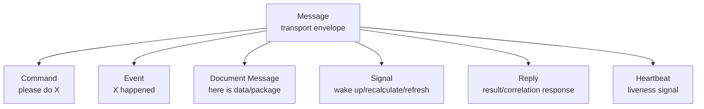

Analogi:

- HTTP request adalah transport interaction, bukan domain intent.
- Kafka record adalah storage/transport unit, bukan selalu event.
- RabbitMQ message adalah broker unit, bukan selalu command.
- JMS `Message` adalah API abstraction, bukan selalu business event.

Karena itu, pertanyaan pertama saat melihat payload bukan “pakai topic apa?”, tetapi:

> Payload ini merepresentasikan fakta, permintaan, dokumen, sinyal, atau respons?

---

## 2. Command

Command adalah permintaan agar penerima melakukan sesuatu.

Contoh:

- `AssignCase`
- `EscalateCase`
- `SendOfficerNotification`
- `GenerateEvidencePackage`
- `RecalculateRiskScore`
- `CreateEnforcementAction`

Command biasanya berbentuk imperative. Ia merepresentasikan **intention**.

Karakteristik command:

| Properti | Command |
|---|---|
| Semantic | Permintaan melakukan aksi |
| Tense | Future/imperative |
| Owner intent | Sender ingin receiver melakukan sesuatu |
| Receiver | Biasanya satu logical owner |
| Failure expectation | Sender/pipeline biasanya peduli berhasil/gagal |
| Naming | Verb phrase, misalnya `AssignCase` |
| Duplicate handling | Harus idempotent atau punya command id |
| Replay | Berbahaya jika command punya side effect |

Command bukan fakta bahwa sesuatu sudah terjadi. Command bisa ditolak.

Contoh:

```json
{
  "commandId": "cmd-9821",
  "commandType": "AssignCase",
  "caseId": "CASE-2026-00091",
  "assigneeId": "OFFICER-17",
  "requestedBy": "SUPERVISOR-3",
  "requestedAt": "2026-06-28T10:14:30+07:00",
  "reason": "Workload rebalance"
}
```

Command ini belum berarti case sudah assigned. Ia berarti ada permintaan assignment.

Event yang mungkin muncul setelah command berhasil:

```json
{
  "eventId": "evt-7741",
  "eventType": "CaseAssigned",
  "caseId": "CASE-2026-00091",
  "assigneeId": "OFFICER-17",
  "assignedBy": "SUPERVISOR-3",
  "occurredAt": "2026-06-28T10:14:32+07:00"
}
```

Command bisa menghasilkan:

- success event,
- rejection event,
- no-op,
- validation error,
- timeout,
- compensating action.

---

## 3. Event

Event adalah fakta bahwa sesuatu sudah terjadi.

Contoh:

- `CaseOpened`
- `CaseAssigned`
- `EvidenceSubmitted`
- `CaseEscalated`
- `SlaBreached`
- `DecisionIssued`
- `CaseClosed`

Event biasanya berbentuk past tense. Ia merepresentasikan **fact**.

Karakteristik event:

| Properti | Event |
|---|---|
| Semantic | Fakta domain yang sudah terjadi |
| Tense | Past tense |
| Owner intent | Producer memberitahu perubahan/fakta |
| Receiver | Banyak independent consumers |
| Failure expectation | Producer tidak harus tahu semua reaksi consumer |
| Naming | Past-tense phrase, misalnya `CaseAssigned` |
| Duplicate handling | Consumer harus idempotent |
| Replay | Biasanya boleh jika event stabil dan handler replay-safe |

Event tidak meminta consumer melakukan sesuatu secara langsung. Consumer boleh bereaksi sesuai responsibility-nya.

Contoh:

```json
{
  "eventId": "evt-10293",
  "eventType": "EvidenceSubmitted",
  "caseId": "CASE-2026-00091",
  "evidenceId": "EVD-5531",
  "submittedBy": "OFFICER-17",
  "occurredAt": "2026-06-28T11:03:14+07:00",
  "schemaVersion": 3
}
```

Consumer berbeda bisa bereaksi berbeda:

| Consumer | Reaction |
|---|---|
| Audit Service | Menyimpan immutable audit trail |
| Search Projection | Update searchable case index |
| SLA Service | Recalculate deadline risk |
| Notification Service | Notify supervisor jika evidence critical |
| Risk Engine | Recompute entity risk score |

Producer tidak perlu tahu semua consumer ini.

---

## 4. Document Message

Document message membawa paket data untuk diproses atau dipindahkan. Ia tidak selalu command dan tidak selalu event.

Contoh:

- `CaseSnapshotExported`
- `EvidencePackageReady`
- `DailyViolationReportGenerated`
- `BulkEntityImportChunk`
- `OfficerNotificationEmail`

Document message biasanya berarti:

> “Ini data/package yang perlu tersedia untuk penerima.”

Ia sering muncul di integration pipelines.

Contoh:

```json
{
  "messageId": "msg-3011",
  "messageType": "CaseSnapshotExported",
  "exportId": "EXP-2026-06-28-001",
  "caseId": "CASE-2026-00091",
  "format": "JSONL",
  "storageUri": "s3://regulatory-export/case/CASE-2026-00091/snapshot.jsonl",
  "createdAt": "2026-06-28T12:00:00+07:00"
}
```

Ini bukan command karena tidak meminta aksi domain spesifik seperti “approve case”. Ini juga bukan event domain murni, karena fokusnya adalah transfer paket data.

Document message umum dipakai untuk:

- batch ingestion,
- file processing,
- export/import,
- report generation,
- integration dengan legacy systems.

Waspada:

- Jangan masukkan file besar langsung ke message broker.
- Gunakan reference/URI untuk payload besar.
- Tetapkan lifecycle storage object.
- Pastikan receiver punya permission membaca object.
- Pastikan idempotency ketika file diproses ulang.

---

## 5. Signal

Signal adalah pesan ringan untuk membangunkan, memicu, atau memberi tanda bahwa sesuatu perlu dicek.

Contoh:

- `RefreshCaseProjection`
- `RecalculateRiskScore`
- `CheckSlaDueSoon`
- `InvalidateOfficerCache`
- `WarmCaseDashboard`

Signal tidak selalu membawa semua data. Ia sering hanya membawa pointer.

Contoh:

```json
{
  "signalId": "sig-4490",
  "signalType": "RefreshCaseProjection",
  "caseId": "CASE-2026-00091",
  "requestedAt": "2026-06-28T12:10:00+07:00"
}
```

Signal berguna ketika:

- data authoritative ada di tempat lain,
- message hanya perlu memicu recomputation,
- payload lengkap terlalu besar,
- consumer dapat mengambil state terbaru sendiri.

Namun signal punya risiko:

- consumer mungkin melihat state yang sudah berubah lagi,
- signal tidak merepresentasikan fakta historis lengkap,
- replay signal bisa menghasilkan hasil berbeda,
- audit domain tidak boleh bergantung hanya pada signal.

Signal cocok untuk cache/projection/recalculation, bukan sebagai audit record utama.

---

## 6. Query and Reply

Query meminta data. Reply mengembalikan hasil.

Dalam messaging, request-reply bisa dibuat dengan correlation id dan reply destination/topic/queue.

Contoh request:

```json
{
  "requestId": "req-8001",
  "requestType": "GetCaseRiskSummary",
  "caseId": "CASE-2026-00091",
  "replyTo": "risk.reply.supervisor-dashboard",
  "requestedAt": "2026-06-28T12:20:00+07:00"
}
```

Contoh reply:

```json
{
  "correlationId": "req-8001",
  "responseType": "CaseRiskSummaryResult",
  "caseId": "CASE-2026-00091",
  "riskLevel": "HIGH",
  "computedAt": "2026-06-28T12:20:01+07:00"
}
```

Request-reply via messaging bisa berguna, tetapi perlu hati-hati. Ia sering menyelundupkan synchronous coupling ke dalam asynchronous transport.

Pertanyaan wajib:

- Berapa timeout?
- Apa yang terjadi jika reply datang setelah timeout?
- Apakah reply bisa dobel?
- Apakah receiver wajib selalu online?
- Apakah caller menunggu blocking?
- Apakah ini lebih tepat sebagai HTTP/gRPC call?
- Apakah result perlu cached/materialized view?

Rule of thumb:

> Gunakan request-reply messaging jika Anda benar-benar butuh broker-mediated asynchronous interaction. Jangan gunakan hanya untuk mengganti HTTP tanpa alasan failure model yang jelas.

---

## 7. Heartbeat, Tombstone, Snapshot, and Checkpoint

Selain command/event/document/signal, sistem streaming sering memakai message khusus.

## 7.1 Heartbeat

Heartbeat memberi tanda liveness atau progress.

Contoh:

```json
{
  "messageType": "ProjectionHeartbeat",
  "projectionName": "case-search-index",
  "lastProcessedOffset": 983771,
  "emittedAt": "2026-06-28T12:25:00+07:00"
}
```

Heartbeat bukan business event. Jangan campur dengan audit event.

## 7.2 Tombstone

Dalam log-compacted stream, tombstone sering berarti deletion marker untuk key tertentu.

Contoh:

```json
{
  "key": "CASE-2026-00091",
  "value": null
}
```

Tombstone harus dipahami oleh consumer. Jika consumer tidak tahu semantik tombstone, projection bisa salah.

## 7.3 Snapshot

Snapshot merepresentasikan state pada titik waktu tertentu.

Contoh:

```json
{
  "eventType": "CaseSnapshotTaken",
  "caseId": "CASE-2026-00091",
  "state": "UNDER_REVIEW",
  "version": 27,
  "snapshotAt": "2026-06-28T12:30:00+07:00"
}
```

Snapshot berguna untuk bootstrap projection, tetapi berbeda dari event perubahan incremental.

## 7.4 Checkpoint

Checkpoint menyimpan progress processing.

Contoh:

```json
{
  "processor": "case-risk-rebuilder",
  "stream": "case-events",
  "partition": 4,
  "offset": 991023,
  "checkpointedAt": "2026-06-28T12:35:00+07:00"
}
```

Checkpoint adalah metadata processing, bukan domain event.

---

## 8. The Fact vs Intention Test

Cara tercepat membedakan command dan event:

> Jika pesan ini bisa ditolak, kemungkinan ia command. Jika pesan ini menyatakan sesuatu sudah terjadi, kemungkinan ia event.

Contoh:

| Name | Kemungkinan Salah? | Lebih Tepat |
|---|---|---|
| `CaseEscalationRequested` | Bisa event atau command tergantung makna | Jika fakta request tercatat: event. Jika minta eskalasi: command `EscalateCase` |
| `EscalateCase` | Command | Permintaan agar case dieskalasi |
| `CaseEscalated` | Event | Fakta case sudah dieskalasi |
| `SendEmail` | Command | Minta Notification Service mengirim email |
| `EmailSent` | Event | Fakta email sudah terkirim |
| `EvidenceSubmitted` | Event | Evidence sudah diterima |
| `SubmitEvidence` | Command | Permintaan submit evidence |

Gunakan tense sebagai guardrail:

- Imperative: command — `AssignCase`, `CloseCase`, `GenerateReport`.
- Past tense: event — `CaseAssigned`, `CaseClosed`, `ReportGenerated`.
- Noun package: document — `CaseSnapshot`, `EvidencePackage`.
- Trigger phrase: signal — `RefreshProjection`, `RecalculateScore`.

---

## 9. Semantic Coupling

Messaging sering dijual sebagai decoupling. Namun asynchronous transport tidak otomatis membuat sistem loosely coupled.

Ada beberapa jenis coupling.

## 9.1 Temporal Coupling

Temporal coupling berarti producer dan consumer harus aktif pada waktu yang sama.

HTTP call biasanya temporal-coupled. Message broker bisa mengurangi temporal coupling karena broker menyimpan message sampai consumer siap.

Namun temporal coupling bisa muncul lagi jika:

- producer menunggu reply synchronously,
- message TTL terlalu pendek,
- request timeout sangat agresif,
- consumer harus online untuk memenuhi business transaction,
- caller menganggap business completion terjadi saat publish.

## 9.2 Spatial Coupling

Spatial coupling berarti sender perlu tahu lokasi/identity receiver.

REST call ke `enforcement-service` punya spatial coupling kuat.

Message ke topic `case-events` punya spatial coupling lebih rendah karena producer tidak tahu semua consumer.

Namun spatial coupling bisa muncul jika:

- routing key menyebut consumer name,
- topic dibuat per consumer tanpa alasan,
- payload berisi field khusus satu consumer,
- producer mengubah event demi kebutuhan satu consumer.

## 9.3 Semantic Coupling

Semantic coupling berarti producer dan consumer berbagi pemahaman kontrak domain.

Ini tidak bisa dihilangkan. Yang bisa dilakukan adalah membuatnya eksplisit dan stabil melalui schema, versioning, dan ownership.

## 9.4 Operational Coupling

Operational coupling berarti kegagalan/kelambatan satu komponen mempengaruhi komponen lain.

Contoh:

- retry storm dari consumer memperberat database shared.
- consumer lambat membuat Kafka retention terancam jika lag melebihi retention window.
- RabbitMQ queue menumpuk sampai disk alarm menahan publisher.
- DLQ tidak dipantau sehingga compliance data hilang dari proses.

Tabel coupling:

| Model | Temporal Coupling | Spatial Coupling | Semantic Coupling | Operational Coupling |
|---|---:|---:|---:|---:|
| HTTP direct call | Tinggi | Tinggi | Tinggi | Tinggi |
| JMS queue command | Sedang | Sedang | Tinggi | Sedang |
| RabbitMQ routing | Rendah-Sedang | Sedang | Tinggi | Sedang |
| Kafka domain event | Rendah | Rendah | Tinggi | Sedang-Tinggi |
| ksqlDB projection | Rendah | Rendah | Tinggi | Tinggi pada schema/key/state |

Kesimpulan:

> Messaging mengurangi beberapa coupling, tetapi memperkenalkan coupling baru di schema, ordering, retention, lag, dan operations.

---

## 10. Delivery, Processing, and Business Completion

Salah satu mental model terpenting:

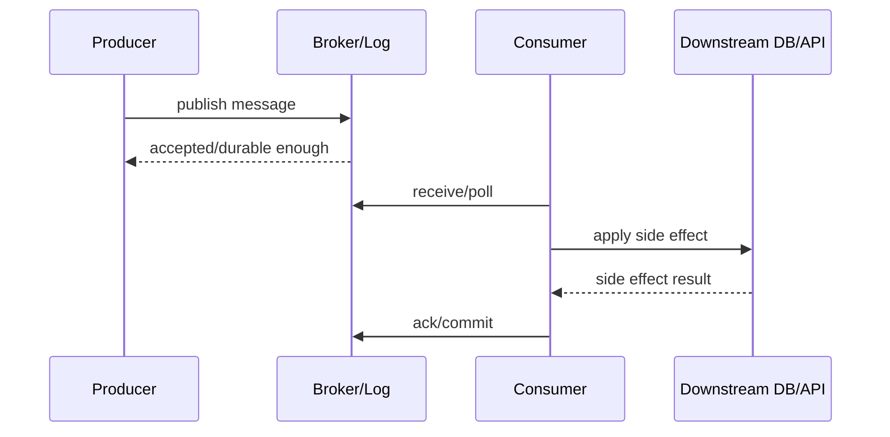

Ada minimal empat outcome berbeda:

| Stage | Arti | Bukan Berarti |
|---|---|---|
| Publish accepted | Broker menerima sesuai producer contract | Consumer sudah memproses |
| Delivered/read | Consumer menerima/membaca | Business state berubah |
| Processed | Handler selesai menurut consumer | Semua consumer selesai |
| Business completed | Outcome domain selesai | Message tidak akan pernah muncul lagi |

Bug umum:

- Producer menganggap publish success berarti proses bisnis selesai.
- Consumer commit offset sebelum side effect selesai.
- Handler mengirim email lalu crash sebelum ack; retry mengirim email dobel.
- Audit consumer gagal tetapi service utama tetap menganggap compliant.
- Caller menunggu reply dari asynchronous process tanpa timeout strategy.

---

## 11. Communication Patterns

Sekarang kita bahas pola komunikasi inti.

## 11.1 Fire-and-Forget

Producer publish tanpa menunggu business response.

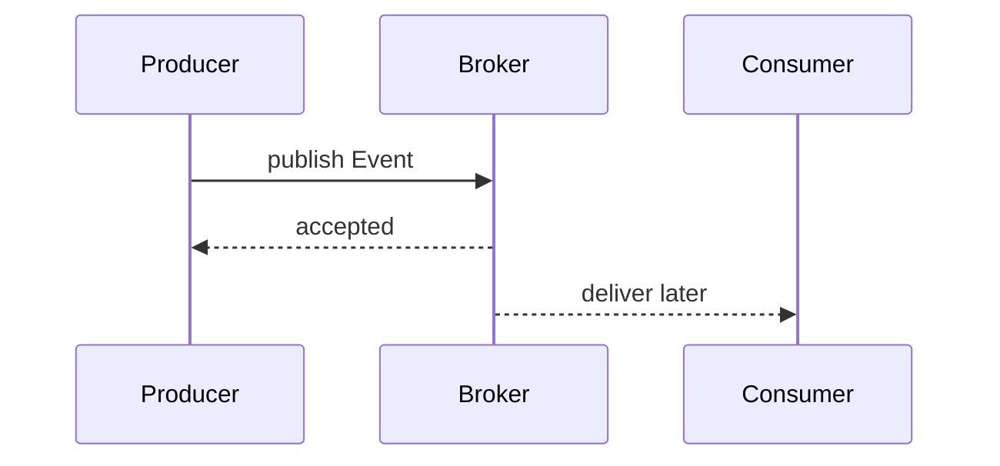

Cocok untuk:

- event notification,
- audit trail,
- projection update,
- analytics ingestion.

Risiko:

- producer tidak tahu consumer gagal,
- observability harus kuat,
- business completion tidak boleh diasumsikan.

## 11.2 Request-Reply

Producer mengirim request dan menunggu reply via broker.

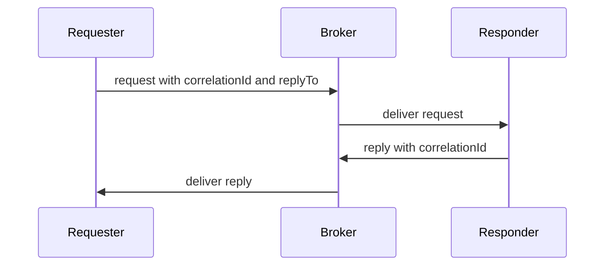

Cocok untuk:

- asynchronous RPC yang butuh broker mediation,
- integration dengan sistem yang tidak expose HTTP/gRPC,
- workflow yang butuh decoupled responder.

Risiko:

- timeout/orphan reply,
- duplicate reply,
- hidden synchronous dependency,
- correlation storage leak.

## 11.3 Competing Consumers

Banyak consumer membaca dari queue/group yang sama untuk membagi beban.

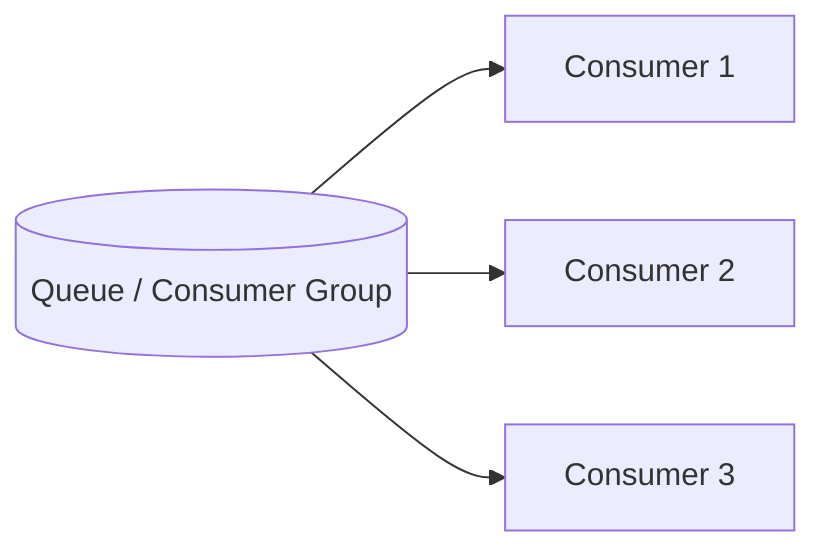

Cocok untuk:

- work distribution,
- scaling homogeneous workers,
- command/task processing.

Risiko:

- ordering bisa pecah jika tidak scoped,
- satu message hanya diproses satu worker,
- poison message bisa menghambat partition/queue,
- scaling dibatasi partition/prefetch/queue behaviour.

## 11.4 Publish/Subscribe

Satu event dibaca banyak subscriber independen.

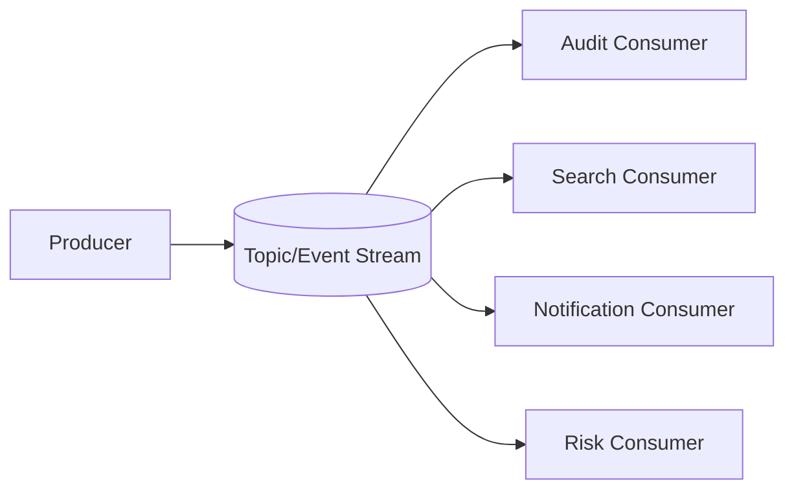

Cocok untuk:

- domain events,
- fan-out,
- independent projections,
- audit and analytics.

Risiko:

- schema evolution harus disiplin,
- producer tidak tahu consumer readiness,
- banyak consumer berarti banyak operational failure mode,
- event contract harus stabil.

## 11.5 Choreography

Service bereaksi terhadap event dan menerbitkan event baru.

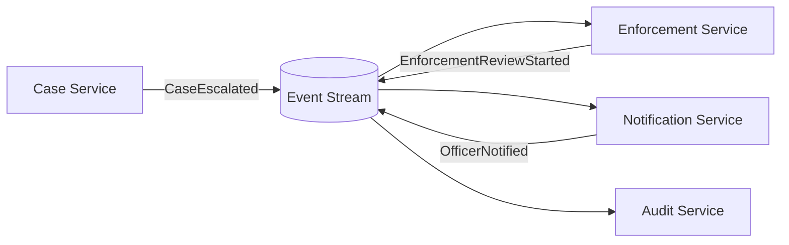

Cocok untuk:

- loosely coupled business process,
- domain event propagation,
- extensible reaction model.

Risiko:

- process sulit dilihat end-to-end,
- cyclic event loop,
- distributed debugging sulit,
- compensating action kompleks,
- tidak jelas owner process.

## 11.6 Orchestration via Messages

Satu orchestrator mengirim command ke participants dan menerima event/reply.

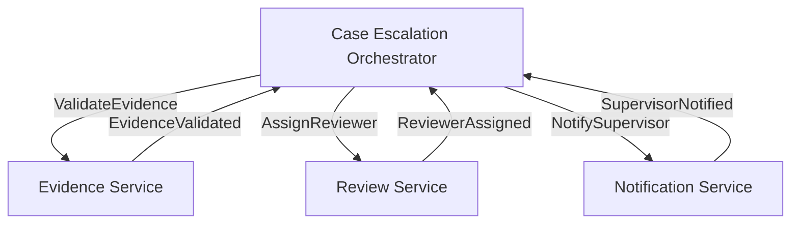

Cocok untuk:

- proses dengan state machine jelas,
- regulatory workflow,
- audit process step,
- human task integration.

Risiko:

- orchestrator menjadi bottleneck/central brain,
- command/reply semantics harus jelas,
- timeout/compensation harus didesain.

---

## 12. Choosing the Right Semantic Type

Gunakan decision table berikut.

| Anda ingin... | Gunakan | Contoh |
|---|---|---|
| Meminta service melakukan aksi | Command | `AssignCase` |
| Memberitahu fakta domain sudah terjadi | Event | `CaseAssigned` |
| Mengirim paket data/reference | Document message | `EvidencePackageReady` |
| Memicu recompute/refresh tanpa fakta historis penuh | Signal | `RefreshCaseProjection` |
| Meminta data dan menunggu hasil | Query/request-reply | `GetCaseRiskSummary` |
| Menandai deletion/update latest state by key | Tombstone/compacted record | `caseId -> null` |
| Menyimpan posisi/progress processor | Checkpoint | `offset checkpoint` |

Heuristic cepat:

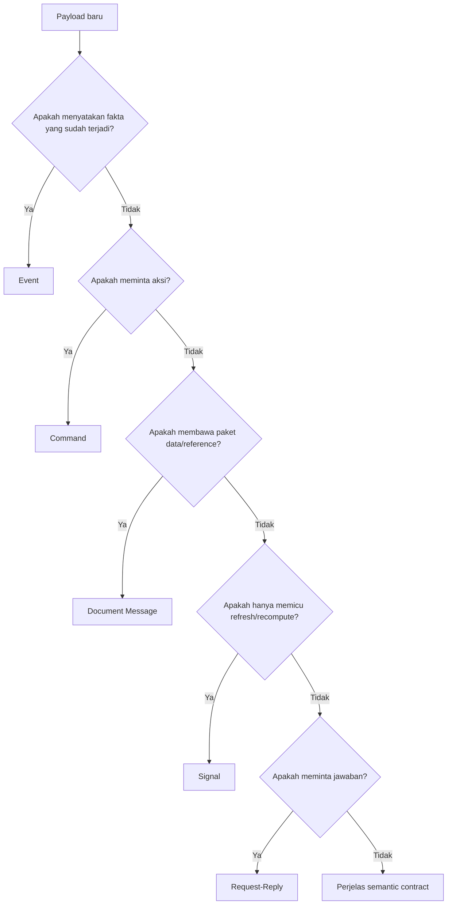

---

## 13. Naming Discipline

Naming adalah governance ringan tetapi sangat efektif.

## 13.1 Command Naming

Gunakan imperative verb:

- `AssignCase`
- `EscalateCase`
- `RequestEvidence`
- `IssueDecision`
- `SendNotification`

Hindari:

- `CaseAssignment` karena ambiguous.
- `CaseAssignedCommand` karena tense bertabrakan.
- `DoCaseStuff` karena tidak punya kontrak.

## 13.2 Event Naming

Gunakan past tense:

- `CaseAssigned`
- `CaseEscalated`
- `EvidenceSubmitted`
- `DecisionIssued`
- `NotificationSent`

Hindari:

- `AssignCaseEvent` karena itu command yang dibungkus sebagai event.
- `CaseUpdate` karena tidak menjelaskan fakta.
- `CaseChanged` kecuali change type punya kontrak jelas.

## 13.3 Document Message Naming

Gunakan noun + lifecycle:

- `EvidencePackageReady`
- `CaseSnapshotExported`
- `DailyReportGenerated`
- `BulkImportChunkAvailable`

## 13.4 Signal Naming

Gunakan trigger verb:

- `RefreshCaseProjection`
- `RecalculateRiskScore`
- `InvalidateCaseCache`
- `RebuildOfficerDashboard`

---

## 14. Payload Design by Semantic Type

## 14.1 Command Payload

Command minimal:

```json
{
  "commandId": "cmd-123",
  "commandType": "EscalateCase",
  "targetId": "CASE-2026-00091",
  "requestedBy": "USER-7",
  "requestedAt": "2026-06-28T13:00:00+07:00",
  "reason": "SLA risk",
  "expectedVersion": 12
}
```

Command sering butuh:

- `commandId` untuk idempotency,
- actor/requester,
- reason,
- expected version untuk optimistic concurrency,
- deadline/timeout,
- authorization context,
- correlation id.

## 14.2 Event Payload

Event minimal:

```json
{
  "eventId": "evt-123",
  "eventType": "CaseEscalated",
  "aggregateType": "Case",
  "aggregateId": "CASE-2026-00091",
  "aggregateVersion": 13,
  "occurredAt": "2026-06-28T13:00:02+07:00",
  "data": {
    "fromLevel": "NORMAL",
    "toLevel": "HIGH_PRIORITY",
    "reason": "SLA risk"
  }
}
```

Event sering butuh:

- stable event id,
- aggregate id,
- aggregate version,
- occurredAt,
- schema version,
- causation id,
- correlation id,
- actor if relevant,
- enough data for consumers without exposing internals.

## 14.3 Document Message Payload

```json
{
  "messageId": "msg-123",
  "messageType": "EvidencePackageReady",
  "packageId": "PKG-9",
  "caseId": "CASE-2026-00091",
  "uri": "s3://bucket/pkg-9.zip",
  "checksum": "sha256:...",
  "contentType": "application/zip",
  "createdAt": "2026-06-28T13:05:00+07:00",
  "expiresAt": "2026-07-28T13:05:00+07:00"
}
```

Tambahkan:

- checksum,
- size,
- content type,
- encryption info,
- expiry,
- access policy,
- idempotency marker.

## 14.4 Signal Payload

```json
{
  "signalId": "sig-123",
  "signalType": "RecalculateRiskScore",
  "caseId": "CASE-2026-00091",
  "requestedAt": "2026-06-28T13:10:00+07:00",
  "priority": "NORMAL"
}
```

Signal harus kecil. Jika signal membutuhkan banyak payload domain, mungkin itu bukan signal.

---

## 15. Event Envelope vs Payload

Untuk sistem besar, pisahkan envelope dari domain payload.

```json
{
  "metadata": {
    "messageId": "evt-123",
    "messageType": "CaseEscalated",
    "schemaVersion": 2,
    "correlationId": "corr-777",
    "causationId": "cmd-555",
    "producer": "case-service",
    "occurredAt": "2026-06-28T13:00:02+07:00",
    "publishedAt": "2026-06-28T13:00:03+07:00"
  },
  "data": {
    "caseId": "CASE-2026-00091",
    "fromLevel": "NORMAL",
    "toLevel": "HIGH_PRIORITY",
    "reason": "SLA risk"
  }
}
```

Envelope berisi hal lintas domain:

- id,
- type,
- schema version,
- producer,
- correlation,
- causation,
- timestamps,
- tracing,
- tenant,
- security classification.

Payload berisi fakta domain.

Manfaat:

- observability konsisten,
- DLQ diagnosis mudah,
- tracing async bisa dibangun,
- schema governance lebih rapi,
- consumer framework bisa membaca metadata tanpa memahami domain.

Risiko:

- envelope terlalu besar,
- metadata duplikatif,
- event menjadi bureaucratic,
- developer mengisi field asal-asalan.

Gunakan envelope yang cukup, bukan semua field imajinatif.

---

## 16. Correlation and Causation

Correlation dan causation sering tertukar.

| Field | Arti |
|---|---|
| `correlationId` | Mengelompokkan seluruh flow/request/business process |
| `causationId` | Menunjukkan message/event/command yang langsung menyebabkan message ini |
| `messageId` / `eventId` | Identitas unik message saat ini |

Contoh flow:

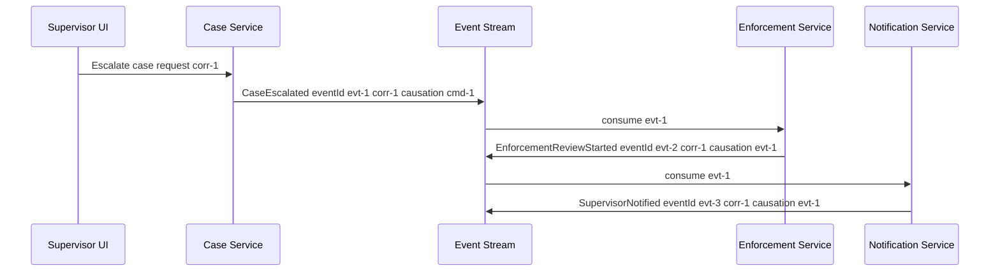

Dengan correlation/causation, kita bisa merekonstruksi causal graph.

Tanpa ini, debugging async system menjadi pencarian log manual.

---

## 17. Semantic Idempotency

Idempotency tidak bisa hanya ditempel di transport. Ia harus sesuai semantic type.

## 17.1 Command Idempotency

Command duplicate harus menghasilkan outcome yang sama atau aman.

Contoh:

- `AssignCase(commandId=cmd-1, caseId=CASE-1, assignee=A)` diproses dua kali.
- Hasil akhirnya tetap case assigned to A sekali.
- Event `CaseAssigned` tidak boleh diterbitkan dua kali untuk command yang sama, kecuali event id/aggregate version membuat duplicate bisa dikenali.

Command idempotency key bisa:

- `commandId`,
- natural key seperti `(caseId, targetStatus, requestedAt bucket)` jika valid,
- external request id.

## 17.2 Event Idempotency

Event duplicate harus tidak menggandakan projection/side effect.

Consumer bisa menyimpan:

```sql
CREATE TABLE processed_message (
    consumer_name VARCHAR(100) NOT NULL,
    message_id VARCHAR(100) NOT NULL,
    processed_at TIMESTAMP NOT NULL,
    PRIMARY KEY (consumer_name, message_id)
);
```

Namun untuk beberapa projection, idempotency bisa berdasarkan aggregate version:

```sql
UPDATE case_projection
SET status = ?, version = ?
WHERE case_id = ? AND version < ?;
```

## 17.3 Signal Idempotency

Signal biasanya aman digabung/debounce.

Contoh: jika `RefreshCaseProjection(CASE-1)` dikirim 100 kali, consumer cukup refresh state terbaru sekali.

## 17.4 Document Message Idempotency

Document processing bisa berdasarkan checksum, package id, import batch id, atau file version.

---

## 18. Replay Semantics

Tidak semua message aman direplay.

| Type | Replay Safety | Catatan |
|---|---|---|
| Domain event | Umumnya tinggi jika schema stabil dan handler idempotent | Cocok untuk rebuilding projection |
| Command | Rendah jika command memicu side effect | Replay command bisa menjalankan aksi ulang |
| Document message | Sedang | Aman jika package immutable dan processing idempotent |
| Signal | Rendah-Sedang | Replay bisa menghasilkan state terbaru, bukan state historis |
| Heartbeat | Rendah | Biasanya tidak perlu replay |
| Snapshot | Tinggi untuk bootstrap | Harus jelas snapshot time/version |

Rule:

> Jangan menyimpan command dalam event log lalu menganggapnya event sourcing. Command adalah intention, event adalah fact.

---

## 19. Ordering Semantics by Message Type

Ordering requirement berbeda per semantic type.

## 19.1 Command Ordering

Command ordering penting jika command memodifikasi aggregate yang sama.

Contoh:

1. `AssignCase(CASE-1, Officer-A)`
2. `EscalateCase(CASE-1)`
3. `CloseCase(CASE-1)`

Jika diproses out-of-order, hasil bisa salah.

Gunakan:

- single owner per aggregate,
- key/routing by aggregate id,
- optimistic locking,
- aggregate version,
- command validation.

## 19.2 Event Ordering

Event ordering penting untuk projection.

Contoh:

1. `CaseOpened(version=1)`
2. `CaseAssigned(version=2)`
3. `CaseEscalated(version=3)`
4. `CaseClosed(version=4)`

Projection harus menjaga version.

Jika menerima version 4 sebelum version 3, consumer harus punya policy:

- buffer,
- skip stale,
- fetch authoritative state,
- fail to retry,
- rebuild projection.

## 19.3 Signal Ordering

Signal ordering biasanya kurang penting. `RefreshProjection` beberapa kali bisa digabung.

Namun jika signal punya priority atau deadline, ordering mungkin relevan secara operasional.

---

## 20. Consumer Responsibility by Semantic Type

Consumer harus tahu perannya.

| Type | Consumer Responsibility |
|---|---|
| Command | Validate, authorize if needed, execute or reject, emit outcome |
| Event | React independently, update local state/projection, maintain idempotency |
| Document | Fetch/read package, verify checksum, process idempotently |
| Signal | Trigger refresh/recompute, coalesce if possible |
| Request | Produce correlated reply or timeout/failure response |
| Reply | Match correlation, complete waiting process, handle orphan/late replies |

Anti-pattern:

```text
Consumer menerima CaseEscalated event lalu menganggap dirinya wajib mengubah status Case Service.
```

Jika status case authoritative ada di Case Service, consumer lain tidak boleh mengubah status itu langsung. Ia boleh membuat reaction sendiri atau mengirim command balik jika memang proses mengizinkan.

---

## 21. Domain Example: Case Escalation

Mari kita bedah satu flow.

User action:

> Supervisor menekan tombol “Escalate Case”.

Ada beberapa desain.

## 21.1 Bad Design: Ambiguous Message

```json
{
  "type": "CaseEscalation",
  "caseId": "CASE-1",
  "level": "HIGH"
}
```

Masalah:

- Apakah ini request atau fakta?
- Siapa yang boleh consume?
- Apakah case sudah escalated?
- Apakah bisa ditolak?
- Apakah replay aman?

## 21.2 Better: Command then Event

Command:

```json
{
  "commandId": "cmd-1",
  "commandType": "EscalateCase",
  "caseId": "CASE-1",
  "targetLevel": "HIGH",
  "requestedBy": "SUPERVISOR-7",
  "reason": "Potential systemic violation",
  "expectedVersion": 12
}
```

Event setelah berhasil:

```json
{
  "eventId": "evt-1",
  "eventType": "CaseEscalated",
  "caseId": "CASE-1",
  "fromLevel": "NORMAL",
  "toLevel": "HIGH",
  "escalatedBy": "SUPERVISOR-7",
  "reason": "Potential systemic violation",
  "aggregateVersion": 13,
  "occurredAt": "2026-06-28T14:00:00+07:00"
}
```

Event jika ditolak:

```json
{
  "eventId": "evt-2",
  "eventType": "CaseEscalationRejected",
  "caseId": "CASE-1",
  "requestedBy": "SUPERVISOR-7",
  "reasonCode": "CASE_ALREADY_CLOSED",
  "occurredAt": "2026-06-28T14:00:00+07:00"
}
```

Desain ini jelas:

- command bisa ditolak,
- event adalah fakta,
- audit bisa menyimpan keduanya jika perlu,
- consumers bereaksi ke event, bukan command internal.

---

## 22. Domain Example: Notification

Notification sering membingungkan.

Apakah `SendEmail` event? Tidak. Itu command.

Command:

```json
{
  "commandId": "cmd-email-1",
  "commandType": "SendOfficerNotification",
  "recipientOfficerId": "OFFICER-17",
  "template": "CASE_ESCALATED",
  "caseId": "CASE-1",
  "deduplicationKey": "CASE-1:CASE_ESCALATED:OFFICER-17"
}
```

Outcome event:

```json
{
  "eventId": "evt-email-1",
  "eventType": "OfficerNotificationSent",
  "recipientOfficerId": "OFFICER-17",
  "channel": "EMAIL",
  "caseId": "CASE-1",
  "sentAt": "2026-06-28T14:01:00+07:00"
}
```

Failure event jika permanent:

```json
{
  "eventId": "evt-email-2",
  "eventType": "OfficerNotificationFailed",
  "recipientOfficerId": "OFFICER-17",
  "channel": "EMAIL",
  "caseId": "CASE-1",
  "failureType": "INVALID_EMAIL_ADDRESS",
  "failedAt": "2026-06-28T14:01:00+07:00"
}
```

Notification side effect harus idempotent. Jika consumer crash setelah email terkirim tetapi sebelum ack, retry bisa mengirim ulang. Deduplication key wajib.

---

## 23. Domain Example: Audit Trail

Audit event harus sangat hati-hati.

Bad design:

```json
{
  "type": "AuditLog",
  "message": "Case updated"
}
```

Masalah:

- tidak menjelaskan fakta,
- tidak punya actor,
- tidak punya before/after atau version,
- sulit diverifikasi,
- tidak cukup untuk regulatory defensibility.

Better event:

```json
{
  "eventId": "evt-audit-1",
  "eventType": "CaseStatusChanged",
  "caseId": "CASE-1",
  "fromStatus": "UNDER_REVIEW",
  "toStatus": "ESCALATED",
  "changedBy": "SUPERVISOR-7",
  "changeReason": "Potential systemic violation",
  "aggregateVersion": 13,
  "occurredAt": "2026-06-28T14:00:00+07:00",
  "correlationId": "corr-123",
  "causationId": "cmd-1"
}
```

Audit consumer bisa menyimpan event ini immutable. Search projection bisa membangun query model. SLA service bisa bereaksi jika status tertentu memicu deadline baru.

---

## 24. Platform Mapping

Sekarang kita petakan semantics ke platform.

## 24.1 JMS / Jakarta Messaging

JMS cocok untuk:

- command queue,
- topic pub/sub,
- request-reply dengan temporary destination,
- enterprise application server integration,
- transactional message processing.

Mapping:

| Semantic | JMS Mapping |
|---|---|
| Command | Queue destination |
| Event | Topic destination |
| Request-reply | Queue + `JMSReplyTo` + `JMSCorrelationID` |
| Document message | Queue/topic depending on flow |
| Signal | Queue/topic, usually lightweight |

Waspada:

- message selector bisa membuat coupling tersembunyi,
- request-reply bisa blocking,
- provider-specific redelivery policy,
- transaction boundary harus jelas.

## 24.2 RabbitMQ

RabbitMQ cocok untuk:

- command routing,
- work queue,
- exchange-based routing,
- retry topology,
- DLX,
- request-reply.

Mapping:

| Semantic | RabbitMQ Mapping |
|---|---|
| Command | Direct exchange + command queue |
| Event | Topic/fanout exchange + subscriber queues |
| Document message | Queue with durable message + external object reference |
| Signal | Lightweight topic/direct routing |
| Request-reply | `replyTo` queue + correlation id |

Waspada:

- queue event replay bukan default,
- requeue storm,
- prefetch tuning,
- queue buildup.

## 24.3 RabbitMQ Streams

RabbitMQ Streams cocok untuk:

- replayable event stream,
- append-only data,
- fan-out stream consumers,
- high-throughput stream in RabbitMQ ecosystem.

Mapping:

| Semantic | RabbitMQ Streams Mapping |
|---|---|
| Event | Stream record |
| Snapshot | Stream record, possibly keyed convention |
| Document reference | Stream record with URI/checksum |
| Command | Usually less ideal if side-effect command replay dangerous |
| Signal | Possible but often overkill |

## 24.4 Kafka

Kafka cocok untuk:

- domain event log,
- CDC,
- replay,
- stream processing,
- independent consumer groups,
- high throughput.

Mapping:

| Semantic | Kafka Mapping |
|---|---|
| Event | Topic record keyed by aggregate/entity id |
| Command | Command topic possible, but semantics must be strict |
| Document reference | Topic record with external object reference |
| Signal | Topic record, often compacted/coalesced if latest-only |
| Snapshot | Compacted topic or snapshot stream |
| Tombstone | Null-value record in compacted topic |

Waspada:

- command topic sering disalahgunakan,
- ordering hanya per partition,
- replay command bisa berbahaya,
- schema registry/governance penting.

## 24.5 ksqlDB

ksqlDB cocok untuk:

- derive stream/table,
- filter event,
- aggregate,
- join,
- materialized view,
- declarative projection.

Mapping:

| Semantic | ksqlDB Mapping |
|---|---|
| Event | Source stream |
| Latest state | Table/materialized view |
| Derived event | `CREATE STREAM AS SELECT` |
| Aggregation | `CREATE TABLE AS SELECT` |
| Signal | Usually not primary use case |
| Command | Usually not appropriate as core abstraction |

---

## 25. Common Semantic Anti-Patterns

## 25.1 Event Named Like Command

```text
AssignCaseEvent
```

Masalah: apakah case sudah assigned atau baru diminta assign?

Fix:

- `AssignCase` untuk command.
- `CaseAssigned` untuk event.

## 25.2 Command Disguised as Event

```json
{
  "eventType": "SendEmailEvent",
  "recipient": "..."
}
```

Ini biasanya command: `SendEmail`.

Event yang benar muncul setelah side effect: `EmailSent` atau `EmailDeliveryFailed`.

## 25.3 Event Too Generic

```json
{
  "eventType": "CaseUpdated"
}
```

Masalah:

- consumer harus inspect diff,
- schema menjadi vague,
- audit lemah,
- consumer logic penuh `if field changed`.

Fix:

- `CaseAssigned`,
- `CaseEscalated`,
- `CaseStatusChanged`,
- `EvidenceSubmitted`,
- `DecisionIssued`.

## 25.4 Event Contains Internal Database Row

Mengirim seluruh row database membuat consumer terikat pada internal persistence model.

Fix:

- desain event sebagai domain contract,
- expose stable fields,
- sembunyikan internal columns,
- gunakan schema evolution.

## 25.5 Signal Used as Audit Event

```json
{
  "signalType": "RefreshCaseProjection",
  "caseId": "CASE-1"
}
```

Ini tidak cukup untuk audit karena tidak menjelaskan fakta apa yang berubah.

Fix:

- audit/domain event: `CaseEscalated`, `EvidenceSubmitted`.
- signal boleh dipakai untuk refresh projection.

## 25.6 Request-Reply for Long-Running Workflow

Jika process butuh menit/jam/hari, jangan pakai request-reply blocking. Gunakan command + event outcome + process state.

Bad:

```text
Send EscalateCase request and wait for reply for 30 minutes.
```

Better:

```text
Send EscalateCase command.
Emit CaseEscalationAccepted/Rejected.
Track process state asynchronously.
Notify UI via projection/subscription.
```

## 25.7 Consumer-Specific Event

```text
CaseEscalatedForNotificationService
```

Ini membuat producer tahu consumer tertentu.

Fix:

- publish `CaseEscalated`,
- Notification Service memutuskan apakah perlu notification.

---

## 26. Semantic Review Checklist

Gunakan checklist ini sebelum membuat topic/queue/message baru.

## 26.1 Identity

- Apa nama message type?
- Apakah nama memakai tense yang benar?
- Apakah ini command, event, document, signal, request, reply, atau metadata?
- Apakah semantic-nya bisa dijelaskan dalam satu kalimat?

## 26.2 Ownership

- Siapa producer owner?
- Siapa schema owner?
- Siapa boleh mengubah semantic?
- Apakah ada consumer khusus yang terlalu mempengaruhi payload?

## 26.3 Time

- Apa `occurredAt`?
- Apa `publishedAt`?
- Apakah event-time dan processing-time berbeda?
- Apakah late event mungkin?

## 26.4 Delivery and Failure

- Apakah duplicate mungkin?
- Apa idempotency key?
- Apakah retry aman?
- Apakah DLQ diperlukan?
- Apakah replay aman?

## 26.5 Ordering

- Ordering diperlukan global, per aggregate, atau tidak?
- Apa key/routing key?
- Apa yang terjadi jika out-of-order?
- Apakah aggregate version diperlukan?

## 26.6 Schema

- Field mana required?
- Field mana optional?
- Bagaimana compatibility dijaga?
- Apakah payload mengandung PII?
- Apakah schema version dibutuhkan?

## 26.7 Operations

- Metric apa yang wajib ada?
- Siapa owner DLQ?
- Alert apa yang dibutuhkan?
- Bagaimana replay dilakukan?
- Bagaimana consumer lag/queue depth diterjemahkan menjadi business risk?

---

## 27. Applied Example: Topic/Queue Design

Misalnya kita punya flow:

> Case service menerbitkan event domain agar audit, search, SLA, dan notification bisa bereaksi.

Kafka design:

```text
topic: regulatory.case.events
key: caseId
value: EventEnvelope<CaseEvent>
consumer groups:
  - audit-trail-writer
  - case-search-projector
  - sla-monitor
  - notification-router
```

RabbitMQ design:

```text
exchange: regulatory.case.events.topic
routing key: case.escalated, case.assigned, evidence.submitted
queues:
  - audit.case-events
  - search.case-events
  - sla.case-events
  - notification.case-events
```

JMS design:

```text
topic: java:/jms/topic/RegulatoryCaseEvents
subscribers:
  - AuditSubscriber
  - SearchProjectionSubscriber
  - SlaSubscriber
  - NotificationSubscriber
```

Semua desain bisa valid, tetapi failure model berbeda.

Kafka:

- independent consumer group offset,
- replay by offset,
- partition by `caseId`,
- retention-based storage,
- schema discipline penting.

RabbitMQ:

- event fan-out melalui exchange dan subscriber queues,
- message hilang dari queue setelah ack,
- retry/DLX per queue,
- replay tidak default kecuali didesain terpisah.

JMS:

- topic subscribers,
- provider/container semantics,
- durable subscription jika perlu,
- transaksi/redelivery tergantung configuration/provider.

---

## 28. Effective Learning Drill

Latihan ini melatih semantic clarity.

Untuk setiap nama berikut, klasifikasikan dan perbaiki jika ambiguous:

1. `CaseUpdate`
2. `SendNotificationEvent`
3. `EvidenceReceived`
4. `RefreshCaseView`
5. `GenerateMonthlyReport`
6. `MonthlyReportGenerated`
7. `OfficerAssigned`
8. `AssignOfficer`
9. `RiskScoreChanged`
10. `RecalculateRiskScore`

Jawaban:

| Name | Classification | Catatan |
|---|---|---|
| `CaseUpdate` | Ambiguous | Ganti menjadi event spesifik seperti `CaseStatusChanged` |
| `SendNotificationEvent` | Command disguised as event | Ganti `SendNotification`; outcome `NotificationSent` |
| `EvidenceReceived` | Event | Fakta evidence diterima |
| `RefreshCaseView` | Signal/command | Signal jika hanya trigger projection refresh |
| `GenerateMonthlyReport` | Command | Meminta report dibuat |
| `MonthlyReportGenerated` | Event/document message | Fakta report tersedia, bisa membawa URI |
| `OfficerAssigned` | Event | Fakta officer sudah assigned |
| `AssignOfficer` | Command | Meminta assignment |
| `RiskScoreChanged` | Event | Fakta risk score berubah |
| `RecalculateRiskScore` | Command/signal | Command jika owner harus compute, signal jika best-effort refresh |

---

## 29. Mini Design Review: Evidence Submission

Mari desain flow evidence submission secara semantic.

## 29.1 Synchronous Front Door

User submit evidence ke API.

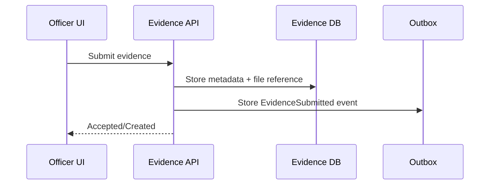

## 29.2 Asynchronous Publication

Outbox publisher menerbitkan event.

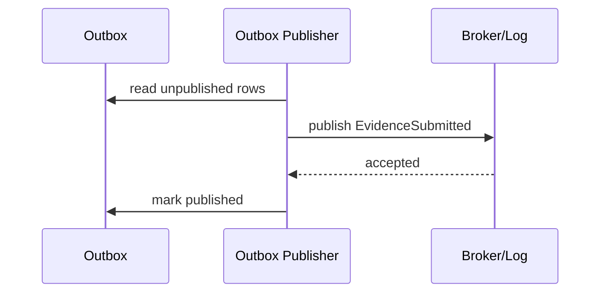

## 29.3 Event Consumers

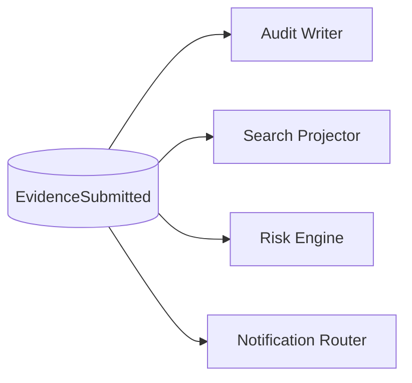

Each consumer has independent responsibility.

Audit Writer:

- must process eventually,
- must preserve causality,
- DLQ is compliance risk.

Search Projector:

- can rebuild,
- lag affects UX,
- replay safe.

Risk Engine:

- may require ordering per `caseId`,
- late evidence matters,
- should use aggregate version or event-time.

Notification Router:

- side effect risk,
- deduplication required,
- may convert event to command `SendOfficerNotification`.

---

## 30. Part 002 Summary

Part ini menetapkan vocabulary yang akan kita pakai sepanjang seri.

Inti yang harus dibawa:

1. Message adalah transport unit; semantic bisa command, event, document, signal, request, reply, heartbeat, tombstone, snapshot, atau checkpoint.
2. Command adalah intention: permintaan agar sesuatu dilakukan.
3. Event adalah fact: sesuatu sudah terjadi.
4. Document message membawa paket/reference data.
5. Signal memicu refresh/recompute dan biasanya bukan audit fact.
6. Request-reply via messaging harus dipakai hati-hati karena bisa menyembunyikan synchronous coupling.
7. Correlation ID mengikat flow; causation ID menjelaskan hubungan sebab langsung.
8. Idempotency harus mengikuti semantic type, bukan hanya transport.
9. Replay aman terutama untuk event yang stabil dan handler idempotent; command replay berbahaya.
10. Naming discipline adalah alat murah untuk mencegah architecture ambiguity.

Part berikutnya akan membahas model broker, queue, topic, log, stream, consumer group, retention, fan-out, routing, dan replay secara lebih dalam.

---

## References

- Jakarta Messaging Specification: https://jakarta.ee/specifications/messaging/
- Apache Kafka Documentation: https://kafka.apache.org/documentation/
- Apache Kafka APIs: https://kafka.apache.org/documentation/#api
- RabbitMQ Documentation: https://www.rabbitmq.com/docs
- RabbitMQ Java Client API Guide: https://www.rabbitmq.com/client-libraries/java-api-guide
- RabbitMQ Streams: https://www.rabbitmq.com/docs/streams
- ksqlDB Overview: https://docs.confluent.io/platform/current/ksqldb/overview.html
- ksqlDB Concepts: https://docs.confluent.io/platform/current/ksqldb/concepts/overview.html
