------
title: Learn Java Messaging and Event Streaming - Part 003
description: Mental model mendalam untuk broker, queue, topic, log, stream, partition, offset, subscription, dan consumer group pada JMS/Jakarta Messaging, Kafka, RabbitMQ, dan RabbitMQ Streams.
series: learn-java-messaging-event-streaming
seriesTitle: Learn Java Messaging and Event Streaming
order: 3
partTitle: Broker, Queue, Topic, Log, Stream, and Consumer Group Mental Model
tags:
- java
- messaging
- event-streaming
- jms
- jakarta-messaging
- kafka
- rabbitmq
- rabbitmq-streams
- architecture
- distributed-systems
date: 2026-06-28
---

# Part 003 — Broker, Queue, Topic, Log, Stream, and Consumer Group Mental Model

> Target part ini: setelah membaca, kita tidak lagi menyebut semua mekanisme asynchronous sebagai “queue”. Kita akan bisa membedakan **broker**, **queue**, **topic**, **exchange**, **log**, **stream**, **partition**, **offset**, **subscription**, dan **consumer group** secara operasional, bukan sekadar definisi textbook.

Part ini adalah fondasi untuk seluruh seri. Banyak incident messaging terjadi bukan karena engineer tidak tahu cara memanggil API, tetapi karena mental model-nya salah: Kafka diperlakukan seperti queue biasa, RabbitMQ queue dipakai sebagai audit log, JMS topic dianggap sama dengan Kafka topic, atau consumer group dianggap broadcast.

Kita akan mempelajari struktur komunikasi dari sisi **storage**, **routing**, **delivery**, **ownership**, **retention**, **replay**, dan **scaling**.

---

## 1. Skill yang Ingin Dibangun

Berdasarkan pendekatan Josh Kaufman, kita pecah skill besar “menguasai messaging dan streaming” menjadi micro-skill yang bisa dilatih.

Di part ini, micro-skill-nya adalah:

1. Membedakan struktur penyimpanan pesan: queue vs log/stream.
2. Membedakan struktur distribusi pesan: point-to-point vs publish-subscribe vs routed messaging.
3. Menjelaskan apa yang terjadi ketika consumer bertambah.
4. Menjelaskan kapan data dihapus, kapan bisa di-replay, dan siapa yang menyimpan progress konsumsi.
5. Memilih primitive komunikasi berdasarkan kebutuhan domain.

Output praktisnya: saat melihat requirement seperti “notifikasi enforcement case harus dikirim ke tiga sistem, bisa di-replay, dan setiap case harus diproses urut”, kita bisa langsung mengurai kebutuhan tersebut menjadi primitive yang benar.

---

## 2. Peta Istilah Inti

Istilah messaging sering menipu karena kata yang sama bisa berarti berbeda di teknologi berbeda.

| Istilah | Makna Operasional | Contoh di JMS/Jakarta Messaging | Contoh di RabbitMQ | Contoh di Kafka | Risiko Salah Paham |
|---|---|---|---|---|---|
| Broker | Komponen server yang menerima, menyimpan, merutekan, dan/atau mengirim pesan | JMS provider seperti ActiveMQ Artemis, IBM MQ, Open MQ | RabbitMQ node/cluster | Kafka broker | Menganggap broker selalu punya model storage yang sama |
| Queue | Struktur untuk work distribution; biasanya satu message diproses oleh satu consumer dari kelompok consumer yang bersaing | `Queue` | Queue binding pada exchange | Tidak identik; Kafka topic + consumer group bisa meniru queue behavior | Menganggap queue cocok untuk audit trail jangka panjang |
| Topic | Struktur publish-subscribe; satu publish dapat diterima banyak subscriber | `Topic` dan durable subscription | Bisa dimodelkan via exchange fanout/topic + multiple queues | Topic adalah log berpartisi | Menganggap JMS topic sama dengan Kafka topic |
| Exchange | Routing layer yang memutuskan queue mana menerima message | Tidak ada konsep yang sama di JMS API standar | Direct, topic, fanout, headers exchange | Tidak ada exchange; routing lewat topic + partitioner/key | Mencampur routing topology RabbitMQ dengan Kafka topic design |
| Log | Append-only sequence record | Bukan model JMS standar | RabbitMQ Streams mendekati log model | Kafka topic partition adalah log | Menghapus data mental model queue padahal retention-based |
| Stream | Urutan event yang disimpan untuk dibaca berdasarkan offset | Bukan model JMS standar | RabbitMQ Stream | Kafka topic/partition sering disebut event stream | Menganggap stream hanya “queue panjang” |
| Partition | Unit paralelisme dan ordering | Tidak standar di JMS API | Superstreams mempartisi stream | Kafka partition | Salah menentukan key menyebabkan hotspot atau ordering rusak |
| Offset | Posisi baca dalam log/stream | Tidak standar di JMS API | Stream offset | Kafka offset | Menganggap ack sama dengan offset commit |
| Subscription | Hubungan consumer dengan sumber message | Durable/non-durable subscription pada topic | Queue binding atau stream subscription | Consumer group membership dan topic subscription | Salah desain fan-out |
| Consumer Group | Sekelompok consumer yang membagi pekerjaan | Tidak standar sebagai API JMS umum | Ada konsep competing consumers pada queue; stream client punya consumer grouping/balancing | Native concept | Menganggap semua consumer menerima semua message |

Satu cara cepat untuk menghindari kebingungan: jangan mulai dari nama teknologinya. Mulai dari pertanyaan:

- Apakah setiap message harus diproses oleh **satu worker** atau **banyak subscriber**?
- Apakah message hilang setelah diproses atau disimpan berdasarkan **retention**?
- Apakah consumer menyimpan progress sendiri dengan **offset**?
- Apakah sistem butuh **replay**?
- Apakah ordering dibutuhkan global, per entity, atau tidak dibutuhkan?
- Apakah routing kompleks diperlukan sebelum message masuk ke storage target?

---

## 3. Broker Bukan Sekadar “Antrian”

Broker adalah perantara komunikasi. Tetapi jenis perantaranya berbeda-beda.

Broker bisa berfungsi sebagai:

1. **Mailbox**: message disimpan sampai consumer mengambilnya.
2. **Router**: message diarahkan ke queue tertentu berdasarkan rule.
3. **Durable log**: record ditambahkan ke ujung log dan dapat dibaca ulang.
4. **Fan-out distributor**: satu publish disebarkan ke banyak subscriber.
5. **Backpressure buffer**: producer dan consumer dipisahkan agar beban tidak langsung menular.
6. **Protocol boundary**: producer dan consumer tidak perlu tahu lokasi masing-masing.

Contoh:

- JMS provider memberi API Java standar untuk membuat, mengirim, menerima, dan membaca message.
- RabbitMQ kuat pada brokered routing: exchange, queue, binding, routing key.
- Kafka kuat pada distributed log: topic, partition, offset, retention, consumer group.
- RabbitMQ Streams menambahkan struktur stream/log di ekosistem RabbitMQ.

Mental model penting: **broker bukan magic reliability layer**. Broker hanya satu bagian dari rantai reliability. Kalau consumer tidak idempotent, side effect tidak aman, schema tidak kompatibel, atau retry tidak terkendali, broker yang kuat pun tidak menyelamatkan sistem.

---

## 4. Queue Model: Work Distribution

Queue adalah struktur komunikasi untuk membagi pekerjaan. Dalam model queue klasik, satu message biasanya diproses oleh satu consumer dari beberapa consumer yang bersaing.

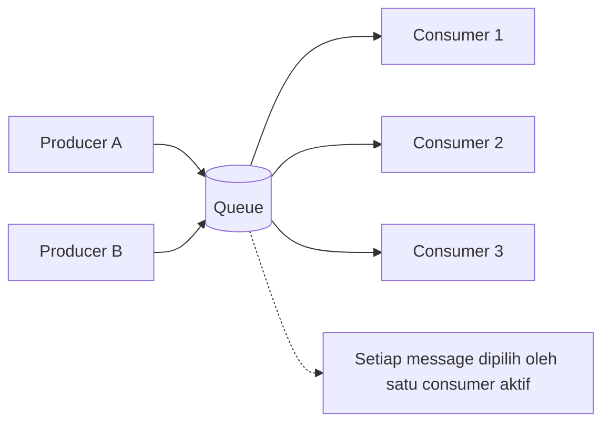

Karakter queue:

| Karakteristik | Implikasi |
|---|---|
| Message disimpan sampai dikonsumsi/di-ack | Queue cocok untuk task handoff |
| Consumer bersaing | Menambah consumer biasanya menambah throughput |
| Data biasanya dihapus setelah selesai | Queue bukan storage historis utama |
| Ordering sering hanya best-effort dalam praktik paralel | Jangan asumsikan ordering global jika consumer paralel |
| Ack menentukan kapan broker boleh menganggap message selesai | Ack terlalu awal bisa menyebabkan data loss; ack terlalu lambat bisa duplicate/retry |

Queue cocok untuk:

- Background job.
- Email sending.
- PDF generation.
- Async command handling.
- Task distribution ke worker pool.
- Integrasi sistem lama yang memakai command/message work item.

Queue kurang cocok untuk:

- Event audit trail jangka panjang.
- Replay histori domain.
- Banyak consumer independen yang semua butuh salinan event.
- Analytics stream jangka panjang.
- Event sourcing sebagai sumber kebenaran.

### 4.1 Queue dan Ack

Dalam queue, progress konsumsi biasanya dikaitkan dengan pengakuan penyelesaian message.

Secara konseptual:

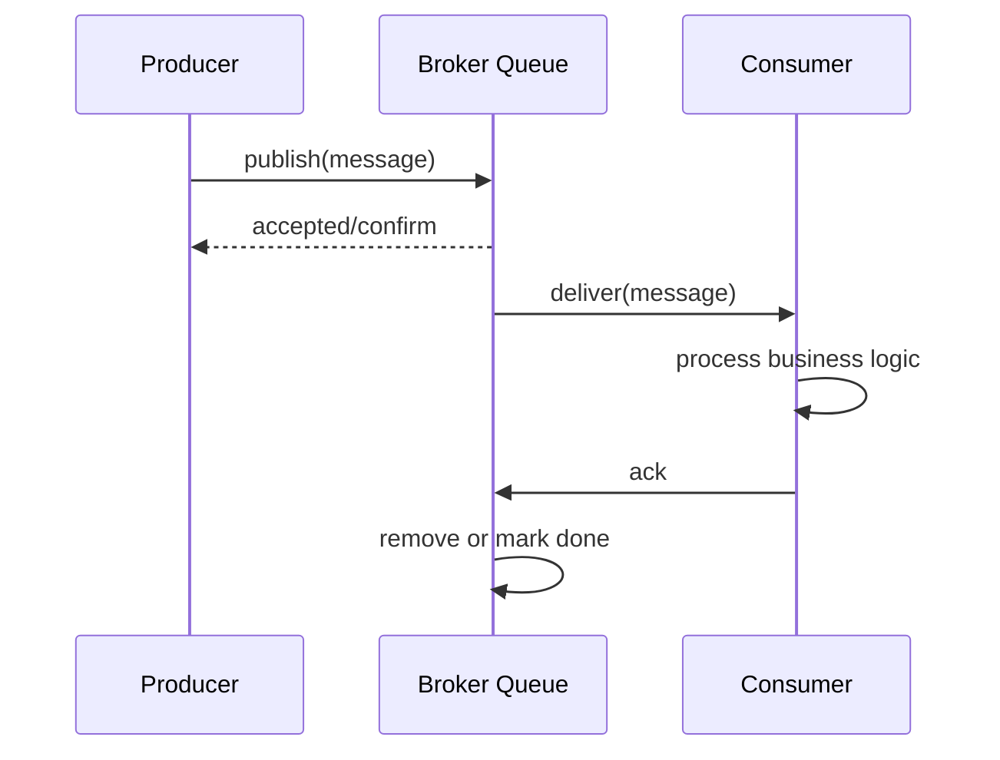

Titik bahaya:

- Consumer melakukan ack sebelum business side effect selesai.
- Consumer crash setelah side effect tetapi sebelum ack.
- Consumer menolak/requeue poison message tanpa batas.
- Queue backlog naik karena consumer lambat tetapi producer tetap cepat.

Dalam sistem nyata, queue semantics hampir selalu berarti: **at-least-once processing harus diasumsikan, dan idempotency harus dirancang**.

---

## 5. Topic Model: Publish-Subscribe

Topic dalam messaging klasik adalah primitive untuk publish-subscribe: satu message dikirim ke banyak subscriber.

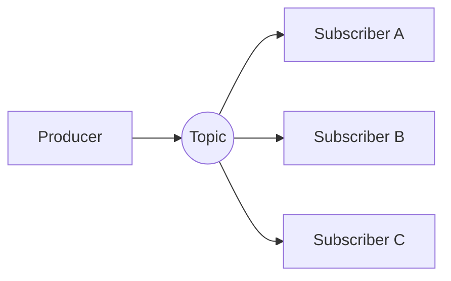

Dalam JMS/Jakarta Messaging, topic adalah destination untuk pub/sub. Subscriber dapat non-durable atau durable. Non-durable subscriber hanya menerima message saat aktif. Durable subscriber dapat tetap memiliki logical subscription sehingga message bisa disimpan saat subscriber tidak aktif, bergantung konfigurasi provider.

Topic cocok untuk:

- Domain event fan-out.
- Notification ke beberapa bounded context.
- Audit listener, reporting listener, integration listener.
- “Satu fakta bisnis, banyak pembaca independen”.

Tetapi topic messaging klasik sering berbeda dari Kafka topic:

| Aspek | JMS/RabbitMQ-style Pub/Sub | Kafka Topic |
|---|---|---|
| Makna utama | Fan-out destination/routing | Append-only log namespace |
| Consumption | Subscriber menerima message | Consumer group membaca partition log |
| Retention | Umumnya dipengaruhi delivery/subscription | Retention-based, tidak langsung hilang setelah dibaca |
| Replay | Tergantung provider/subscription | Native selama data masih retained |
| Scaling | Tergantung provider dan subscription model | Partition + consumer group |

Kesalahan umum: menganggap “topic” selalu berarti hal yang sama. Di JMS, topic terutama adalah pub/sub destination. Di Kafka, topic adalah namespace log berpartisi.

---

## 6. RabbitMQ Exchange + Queue: Routing Topology

RabbitMQ memisahkan routing dari storage queue.

Producer biasanya publish ke **exchange**, lalu exchange merutekan message ke satu atau lebih queue berdasarkan binding.

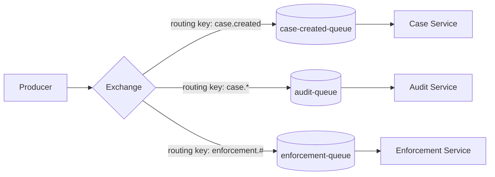

Exchange types:

| Exchange Type | Routing Rule | Typical Use |
|---|---|---|
| Direct | Exact routing key match | Command routing, precise task class |
| Fanout | Broadcast to bound queues | Notification fan-out |
| Topic | Pattern match with routing key | Domain event category routing |
| Headers | Match based on headers | Complex attribute routing, less common |

RabbitMQ’s strength is routing expressiveness. Kafka does not have an equivalent exchange layer. Kafka usually forces routing decisions into:

- topic naming,
- message key,
- partitioner,
- consumer-side filtering,
- stream processing topology.

Design implication: jika requirement utama adalah routing fleksibel, selective delivery, multiple queues with different retry/dead-letter semantics, RabbitMQ often fits better. Jika requirement utama adalah retained event log, replay, analytics stream, and partitioned high-throughput consumption, Kafka often fits better.

---

## 7. Log/Stream Model: Retained Ordered History

Distributed log/stream berbeda dari queue. Dalam log model, producer menambahkan record ke ujung log. Consumer membaca dari posisi tertentu. Record tidak otomatis hilang hanya karena consumer sudah membacanya.

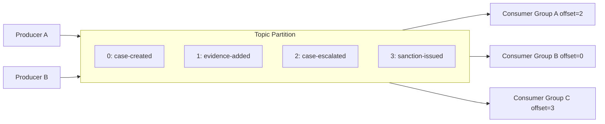

Core properties:

| Property | Meaning |
|---|---|
| Append-only | Record ditambahkan; tidak “diberikan lalu hilang” |
| Offset | Posisi record dalam partition/stream |
| Retention | Data dipertahankan berdasarkan waktu/ukuran/policy |
| Replay | Consumer dapat membaca ulang dari offset lama selama data masih ada |
| Independent consumers | Banyak consumer group dapat membaca data yang sama tanpa saling mengganggu |
| Partitioned ordering | Ordering kuat biasanya hanya dalam satu partition |

Kafka topic partition adalah contoh utama log model. RabbitMQ Streams juga membawa model stream/log: messages disimpan dalam stream, consumer membaca berdasarkan offset, dan stream bisa digunakan untuk use case yang membutuhkan retention/replay lebih mirip log dibanding queue klasik.

### 7.1 Log Bukan Queue Panjang

Log bukan sekadar queue yang tidak pernah habis. Perbedaannya fundamental:

| Pertanyaan | Queue | Log/Stream |
|---|---|---|
| Siapa pemilik message setelah dikonsumsi? | Broker dapat menghapus/menandai selesai | Record tetap ada sampai retention policy |
| Bagaimana consumer progress disimpan? | Ack/redelivery state | Offset per consumer/subscription/group |
| Apakah banyak aplikasi bisa membaca data yang sama? | Perlu fan-out queue/subscription | Natural melalui consumer group berbeda |
| Apakah replay normal? | Tidak selalu natural | Natural selama retention cukup |
| Apakah cocok sebagai history? | Biasanya tidak | Ya, dengan governance benar |

---

## 8. Kafka Consumer Group: Scaling dan Ownership

Kafka consumer group adalah mekanisme yang membuat beberapa consumer instance berbagi partition dari topic yang sama.

Aturan penting:

> Dalam satu consumer group, satu partition hanya diproses oleh satu consumer aktif pada satu waktu. Tetapi satu consumer bisa memegang banyak partition.

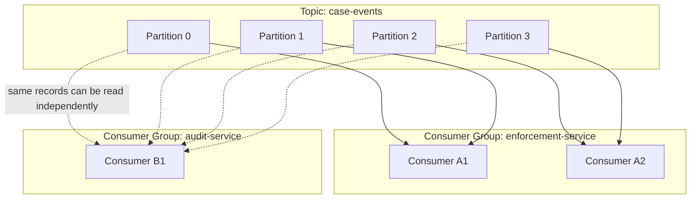

Jika ada 4 partition dan 2 consumer dalam group yang sama, kira-kira tiap consumer mendapat 2 partition. Jika ada 4 partition dan 10 consumer dalam group yang sama, hanya 4 consumer yang aktif memproses partition; sisanya idle untuk topic tersebut.

Hal ini menghasilkan beberapa konsekuensi:

1. Partition count membatasi paralelisme maksimum dalam satu consumer group.
2. Menambah consumer tidak selalu menambah throughput jika partition tidak cukup.
3. Ordering per key bergantung pada key selalu jatuh ke partition yang sama.
4. Consumer group berbeda menerima salinan log yang sama secara independen.
5. Rebalance mengubah assignment partition dan dapat memengaruhi latency.

### 8.1 Consumer Group Bukan Broadcast

Kesalahan klasik:

```text
Saya punya tiga instance service, berarti tiga-tiganya akan menerima event yang sama.
```

Di Kafka, jika tiga instance berada dalam **consumer group yang sama**, mereka membagi partition. Mereka tidak semua menerima semua event.

Untuk broadcast ke tiga aplikasi berbeda, gunakan tiga consumer group berbeda:

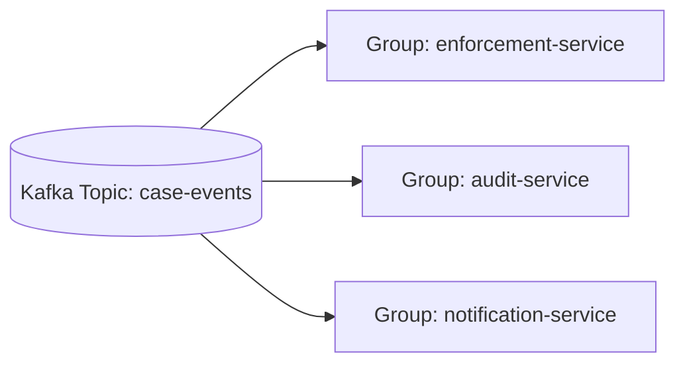

Untuk scaling satu aplikasi, gunakan banyak instance dalam satu group:

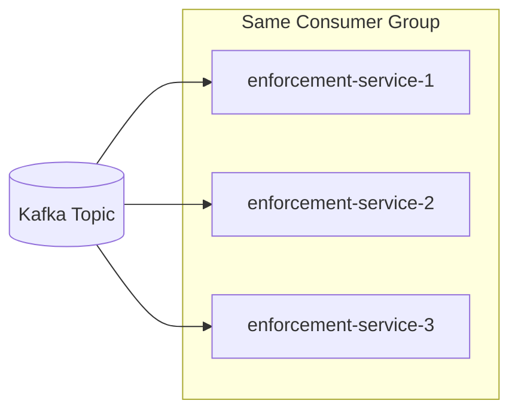

---

## 9. RabbitMQ Competing Consumers vs Kafka Consumer Group

RabbitMQ queue dengan banyak consumer dan Kafka topic dengan satu consumer group dapat terlihat mirip: message/record dibagi ke beberapa worker.

Namun perbedaannya tetap penting.

| Aspek | RabbitMQ Queue + Competing Consumers | Kafka Topic + Consumer Group |
|---|---|---|
| Unit distribusi | Message dari queue | Partition assignment |
| Storage | Queue state; message biasanya selesai setelah ack | Log retained berdasarkan policy |
| Progress | Ack per message/delivery | Offset per partition/group |
| Replay | Tidak natural pada queue biasa | Natural jika retention masih ada |
| Ordering | Dipengaruhi queue, prefetch, consumer concurrency, redelivery | Ordered per partition |
| Scaling | Tambah consumer pada queue | Tambah partition dan consumer |
| Failure recovery | Redelivery unacked message | Consumer lain mengambil partition setelah rebalance |

Rule of thumb:

- Untuk **task queue**, RabbitMQ queue mental model sangat natural.
- Untuk **event history with independent consumers**, Kafka mental model lebih natural.
- Untuk **RabbitMQ Streams**, mental model lebih dekat ke log/stream dibanding queue, tetapi tetap berada di ekosistem operasional RabbitMQ.

---

## 10. Retention: Kapan Data Hilang?

Pertanyaan “kapan message hilang?” adalah pembeda paling penting.

### 10.1 Queue Retention

Dalam queue klasik:

- Message masuk ke queue.
- Consumer menerima message.
- Consumer ack setelah selesai.
- Broker dapat menghapus message.

Queue mungkin punya TTL, max length, dead-lettering, persistence, dan retention-like behavior. Tetapi tujuan utamanya bukan menyimpan histori domain jangka panjang.

### 10.2 Log/Stream Retention

Dalam log/stream:

- Record ditambahkan ke log.
- Banyak consumer membaca secara independen.
- Consumer menyimpan offset/progress.
- Record tetap ada sampai retention policy menghapusnya.

Kafka retention dapat berbasis waktu, ukuran, atau log compaction untuk topic tertentu. RabbitMQ Streams juga berbasis stream retention policy.

### 10.3 Retention Bukan Governance

Retention teknis bukan governance data.

Untuk sistem regulatory, kita perlu menjawab:

- Apakah event mengandung PII?
- Apakah event boleh dihapus?
- Siapa boleh membaca event?
- Apakah event menjadi audit record resmi?
- Bagaimana koreksi dilakukan jika event salah?
- Apakah replay dapat mengubah hasil historis?

Retained log memberi kemampuan replay, tetapi juga menciptakan kewajiban governance.

---

## 11. Ordering: Global, Per Entity, atau Tidak Diperlukan?

Ordering adalah salah satu sumber desain salah paling mahal.

| Requirement | Primitive yang Mungkin | Trade-Off |
|---|---|---|
| Semua event harus total ordered secara global | Single partition/queue | Throughput dan availability terbatas |
| Event per case harus ordered | Key by caseId ke partition yang sama | Hotspot jika beberapa case sangat aktif |
| Event per organization harus ordered | Key by organizationId | Risiko organization besar menjadi hot key |
| Tidak perlu ordering | Random/round-robin partitioning | Throughput tinggi, reasoning lebih sulit |
| Ordering hanya di stage tertentu | Repartition sebelum stage tersebut | Topology lebih kompleks |

Untuk Kafka, ordering kuat berlaku dalam partition. Untuk RabbitMQ queue, ordering bisa terganggu oleh multiple consumers, prefetch, redelivery, priority, dan retry. Untuk JMS provider, ordering tergantung provider, destination type, session, consumer, transaction, dan concurrency model.

Prinsip arsitektur:

> Jangan meminta global ordering kecuali benar-benar diperlukan. Sebagian besar domain sebenarnya membutuhkan ordering per aggregate/entity, bukan global.

Contoh regulatory case:

- `CaseCreated`
- `EvidenceAdded`
- `CaseAssigned`
- `RiskScoreChanged`
- `CaseEscalated`
- `DecisionIssued`

Biasanya ordering yang dibutuhkan adalah per `caseId`, bukan semua case di seluruh sistem.

---

## 12. Fan-Out: Salinan Message atau Salinan Pembacaan?

Ada dua cara besar melakukan fan-out.

### 12.1 Fan-Out by Copy

Message disalin ke banyak queue/subscription.

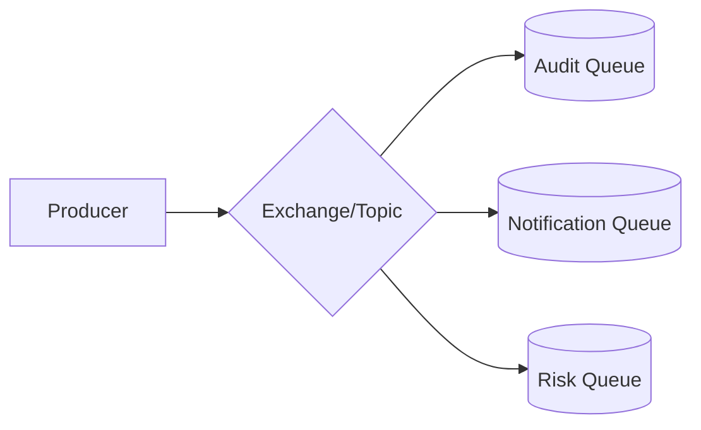

Kelebihan:

- Tiap consumer punya queue sendiri.
- Retry dan DLQ bisa berbeda per consumer.
- Isolasi antar subscriber bagus.

Kekurangan:

- Banyak salinan storage.
- Topology bisa kompleks.
- Subscriber baru mungkin tidak bisa membaca histori lama kecuali message masih tersedia.

### 12.2 Fan-Out by Independent Offset

Satu log dibaca oleh banyak consumer group.

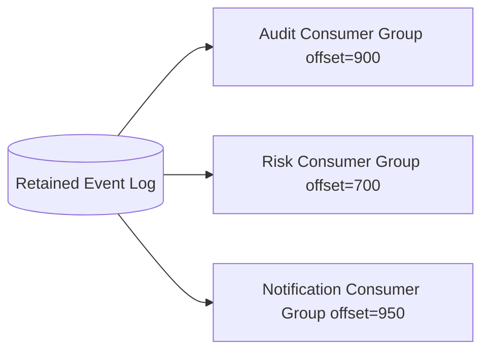

Kelebihan:

- Satu sumber event.
- Subscriber baru bisa replay jika retention cukup.
- Sangat cocok untuk event stream.

Kekurangan:

- Retry per consumer perlu didesain lewat topic tambahan atau app logic.
- Consumer lag harus dipantau.
- Data governance lebih berat.

---

## 13. Routing: Destination, Exchange, Topic Name, Key, Header

Routing menjawab: message ini masuk ke mana?

| Mekanisme | Biasanya Ada Di | Cocok Untuk | Risiko |
|---|---|---|---|
| Destination name | JMS | Queue/topic sederhana | Naming chaos |
| Exchange + binding | RabbitMQ | Routing fleksibel | Topology sulit dipahami jika terlalu dinamis |
| Topic name | Kafka | Domain stream namespace | Topic explosion |
| Message key | Kafka/RabbitMQ Streams | Partitioning/order affinity | Hot key |
| Header | JMS/RabbitMQ/Kafka | Metadata, filtering, tracing | Business data tersebar di header |
| Consumer-side filtering | Semua | Sederhana, fleksibel | Waste bandwidth/CPU; hidden coupling |

Rule:

- Gunakan routing key/topic/destination untuk keputusan routing utama.
- Gunakan header untuk metadata operasional: correlation id, causation id, trace id, schema version, tenant id jika aman.
- Jangan menyembunyikan business state penting hanya di header.

---

## 14. Decision Matrix: Primitive Mana yang Dipakai?

| Kebutuhan | Queue | Topic Pub/Sub | Kafka Topic/Log | RabbitMQ Stream | ksqlDB/Kafka Streams |
|---|---:|---:|---:|---:|---:|
| Background task | Sangat cocok | Tidak utama | Bisa, tapi sering overkill | Bisa, tapi tidak natural | Tidak cocok sebagai primitive utama |
| Fan-out ke beberapa service | Perlu queue per subscriber | Cocok | Sangat cocok via consumer group berbeda | Cocok | Cocok untuk derived streams |
| Replay histori | Lemah | Tergantung durable subscription/provider | Kuat | Kuat | Kuat selama source retained |
| Routing kompleks | Medium | Medium | Lemah-medium | Medium | Transform-based |
| Per-message ack workflow | Kuat | Kuat | Offset-based, beda model | Offset-based | Offset/state-based |
| Long-term event log | Tidak ideal | Tidak ideal | Sangat cocok | Cocok | Mengolah log, bukan menggantikan log |
| Low-latency work dispatch | Kuat | Kuat | Kuat tapi semantics berbeda | Kuat | Tergantung topology |
| Stream aggregation/window | Tidak cocok | Tidak cocok | Perlu Streams/ksqlDB | Terbatas | Sangat cocok |

---

## 15. Regulatory Case-Management Example

Bayangkan platform case-management enforcement lifecycle.

Requirement:

1. Case dibuat oleh intake service.
2. Risk service harus menghitung risk score.
3. Audit service harus merekam semua perubahan.
4. Notification service harus mengirim email/SMS.
5. SLA service harus menghitung deadline.
6. Enforcement service harus memproses escalation secara urut per case.
7. Auditor dapat replay histori case.

Desain naive:

```text
Semua event masuk RabbitMQ queue case-events-queue, semua service consume dari queue yang sama.
```

Masalah:

- Message dibagi antar consumer, bukan diterima semua service.
- Audit bisa kehilangan event jika service lain mengambil message.
- Replay tidak natural.
- Retry satu service mengganggu service lain.

Desain lebih tepat dengan retained log:

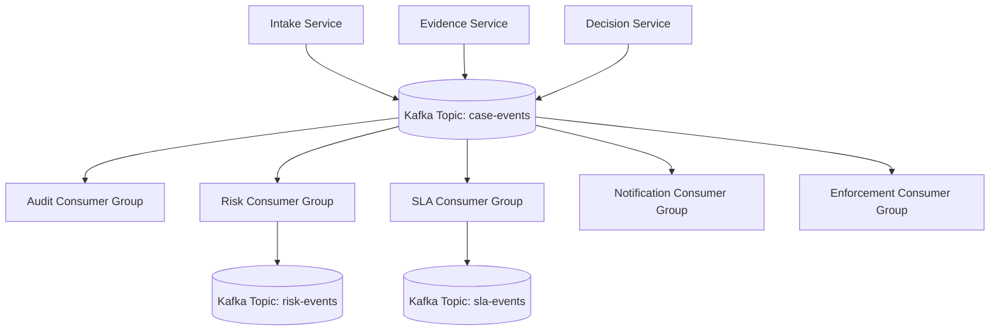

Jika notification butuh retry per destination, RabbitMQ bisa dipakai di edge:

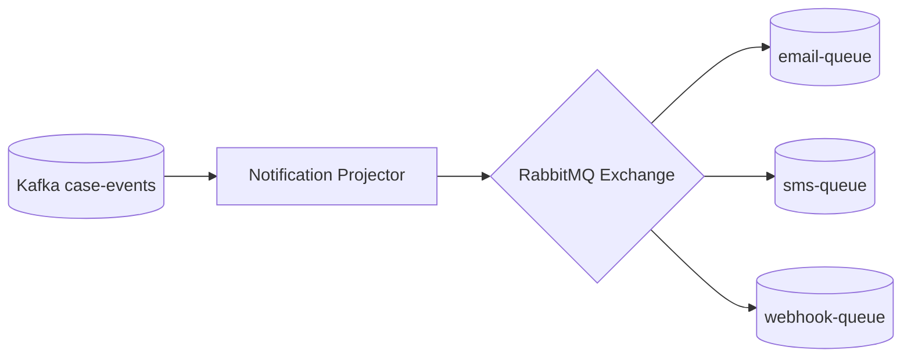

Ini contoh hybrid yang sehat:

- Kafka sebagai retained event backbone.
- RabbitMQ sebagai work dispatch dan retry topology untuk side effect notification.
- Audit membaca dari log, bukan dari task queue.
- Enforcement key by `caseId` untuk ordering per case.

---

## 16. Anti-Pattern Umum

### 16.1 “Kafka Topic sebagai Queue Biasa”

Gejala:

- Retention sangat pendek tanpa alasan.
- Semua consumer dalam satu group padahal service berbeda butuh event yang sama.
- Tidak ada schema governance.
- Tidak ada replay strategy.

Akibat:

- Kehilangan nilai utama Kafka.
- Consumer baru tidak bisa bootstrap state.
- Incident saat consumer lag melewati retention.

### 16.2 “RabbitMQ Queue sebagai Audit Log”

Gejala:

- Queue dipertahankan panjang tanpa consumer jelas.
- Message dianggap histori domain.
- Tidak ada external archival.

Akibat:

- Disk pressure.
- Broker menjadi database buruk.
- Replay dan query histori sulit.

### 16.3 “Satu Topic untuk Semua Event”

Gejala:

- `events` topic berisi semua domain.
- Consumer harus filter manual.
- Schema kacau.

Akibat:

- Coupling tinggi.
- Consumer sulit evolve.
- Access control sulit.

### 16.4 “Satu Queue untuk Semua Subscriber”

Gejala:

- Audit, notification, risk service consume queue yang sama.

Akibat:

- Mereka bersaing, bukan broadcast.
- Sebagian service tidak menerima message yang dibutuhkan.

### 16.5 “Ordering Global Tanpa Alasan”

Gejala:

- Semua event dipaksa ke satu partition atau satu queue.

Akibat:

- Throughput rendah.
- Hotspot permanen.
- Availability berkurang.

---

## 17. Practice: 60-Menit Mental Model Drill

Gunakan latihan ini sebelum memilih teknologi.

### 17.1 Drill A — Klasifikasikan Message

Untuk setiap contoh, tentukan: command, event, task, stream record, atau notification.

1. `ApproveCaseCommand`
2. `CaseApproved`
3. `SendCaseApprovedEmail`
4. `RiskScoreChanged`
5. `DailyCaseSlaSnapshotGenerated`
6. `WebhookDeliveryRequested`
7. `EvidenceUploaded`

Jawaban yang diharapkan:

| Item | Klasifikasi | Primitive Awal |
|---|---|---|
| `ApproveCaseCommand` | Command | Queue/direct route |
| `CaseApproved` | Domain event | Retained log/topic |
| `SendCaseApprovedEmail` | Task | Queue |
| `RiskScoreChanged` | Domain event | Retained log/topic |
| `DailyCaseSlaSnapshotGenerated` | Event/snapshot | Topic/log tergantung retention |
| `WebhookDeliveryRequested` | Task/command | Queue with retry/DLQ |
| `EvidenceUploaded` | Domain event | Log/topic keyed by caseId |

### 17.2 Drill B — Tentukan Fan-Out

Requirement:

> `CaseEscalated` harus diterima oleh audit, enforcement, notification, dan analytics. Notification boleh gagal dan retry. Audit tidak boleh terganggu oleh notification failure.

Desain minimal:

- Publish `CaseEscalated` ke retained event topic/log.
- Audit, enforcement, notification, analytics memakai consumer group berbeda.
- Notification projector meneruskan task ke queue khusus notification jika perlu retry granular.

### 17.3 Drill C — Tentukan Ordering

Requirement:

> Semua update untuk satu case harus diproses urut oleh enforcement service. Tetapi case berbeda boleh paralel.

Desain:

- Key event by `caseId`.
- Pastikan semua event untuk `caseId` masuk partition yang sama.
- Jangan key by random UUID event.
- Monitor hot case.

---

## 18. Checklist Desain Primitive

Sebelum memilih JMS/Kafka/RabbitMQ/RabbitMQ Streams, jawab ini:

- [ ] Apakah message adalah command, event, task, atau notification?
- [ ] Apakah satu message harus diterima satu consumer atau banyak consumer?
- [ ] Apakah data harus bisa di-replay?
- [ ] Apakah consumer baru harus bisa bootstrap state dari histori?
- [ ] Kapan message boleh dihapus?
- [ ] Apakah ordering dibutuhkan? Global atau per entity?
- [ ] Apa key ordering/partitioning-nya?
- [ ] Apa yang terjadi jika consumer crash setelah side effect tetapi sebelum ack/commit?
- [ ] Apakah retry per subscriber perlu berbeda?
- [ ] Apakah DLQ perlu per consumer/service?
- [ ] Apakah schema akan evolve?
- [ ] Apakah event mengandung data sensitif?
- [ ] Apa metric utama: queue depth, consumer lag, publish latency, end-to-end latency?

---

## 19. Key Takeaways

1. Queue cocok untuk **work distribution**, bukan histori domain jangka panjang.
2. Topic klasik cocok untuk **pub/sub**, tetapi Kafka topic adalah **retained partitioned log namespace**.
3. RabbitMQ exchange memberi **routing topology** yang eksplisit; Kafka routing lebih banyak ditentukan oleh topic, key, dan consumer topology.
4. Kafka consumer group adalah mekanisme **scaling dalam satu aplikasi**, bukan broadcast.
5. Fan-out bisa dilakukan dengan **copy ke banyak queue** atau **independent offset dari satu retained log**.
6. Ordering harus dirancang secara eksplisit: global, per entity, atau tidak perlu.
7. Replay adalah kemampuan arsitektural, bukan efek samping dari “pakai broker”.
8. Primitive yang salah akan memaksa retry, observability, dan failure handling menjadi rumit di part berikutnya.

---

## 20. Referensi Resmi

- [Jakarta Messaging Specification](https://jakarta.ee/specifications/messaging/)
- [Jakarta Messaging Concepts — Jakarta EE Tutorial](https://jakarta.ee/learn/docs/jakartaee-tutorial/current/messaging/jms-concepts/jms-concepts.html)
- [Apache Kafka Documentation](https://kafka.apache.org/documentation/)
- [Apache Kafka Design Documentation](https://kafka.apache.org/41/design/design/)
- [RabbitMQ Queues](https://www.rabbitmq.com/docs/queues)
- [RabbitMQ Streams and Superstreams](https://www.rabbitmq.com/docs/streams)
- [RabbitMQ Tutorials](https://www.rabbitmq.com/tutorials)
