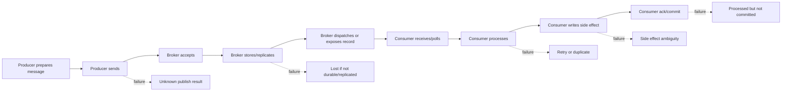
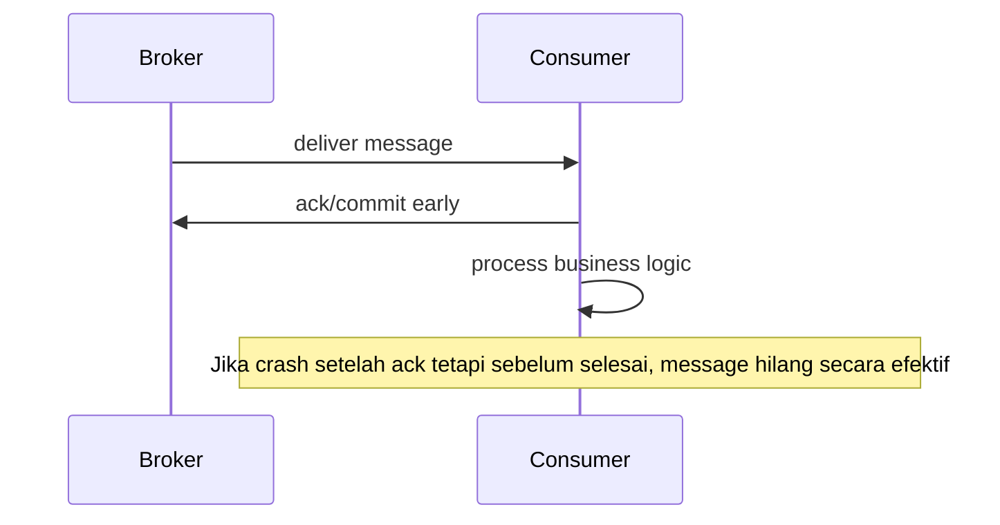
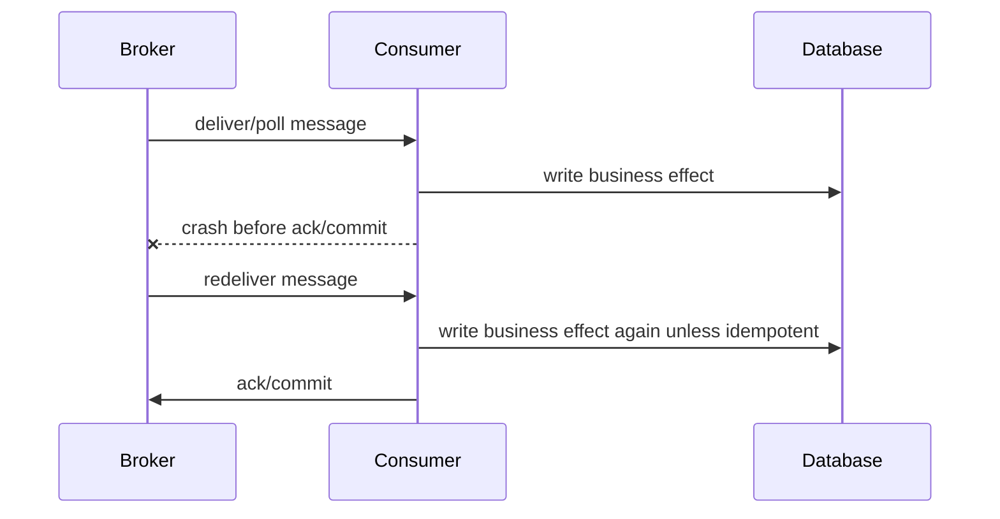
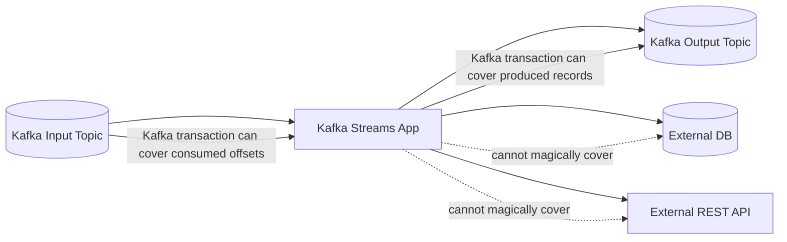
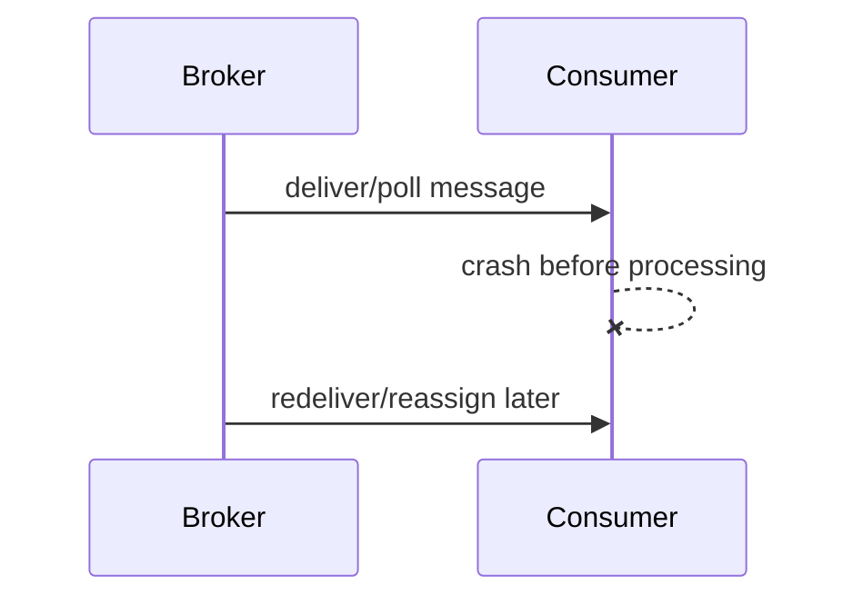
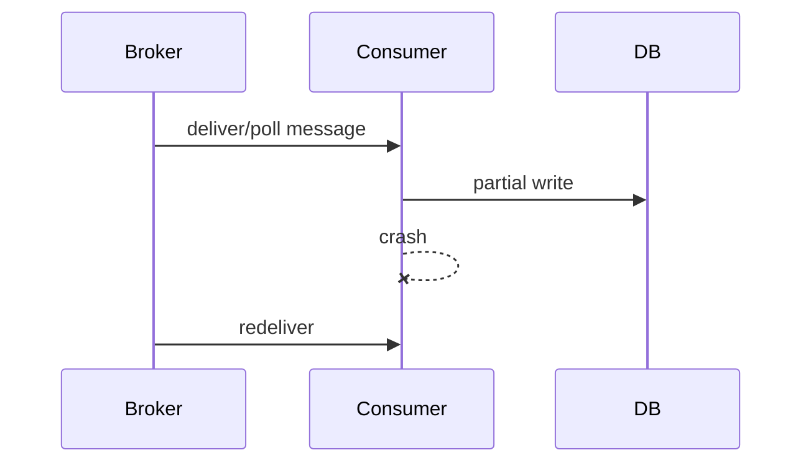
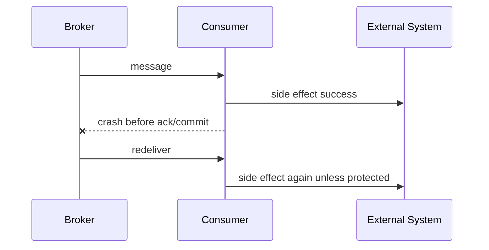
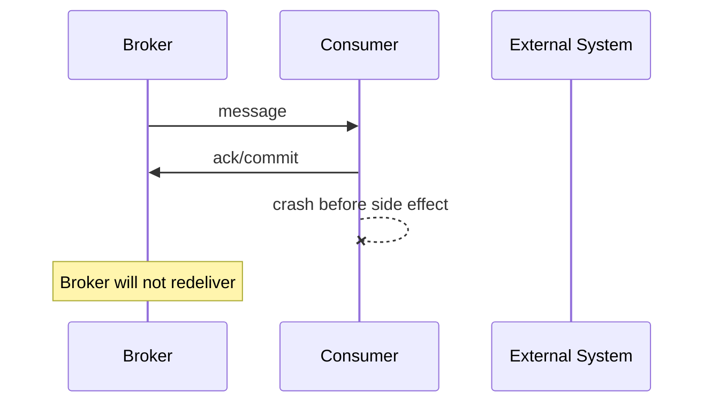
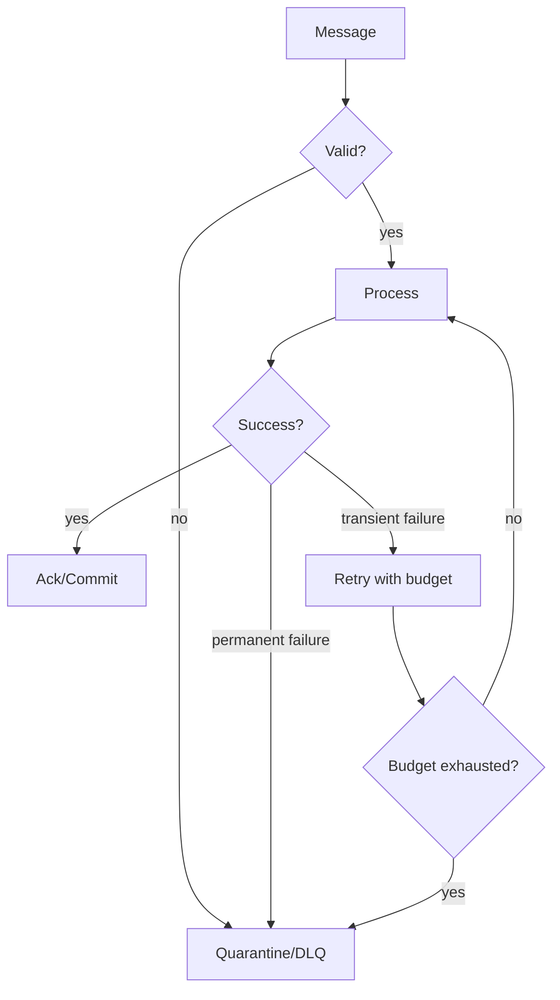
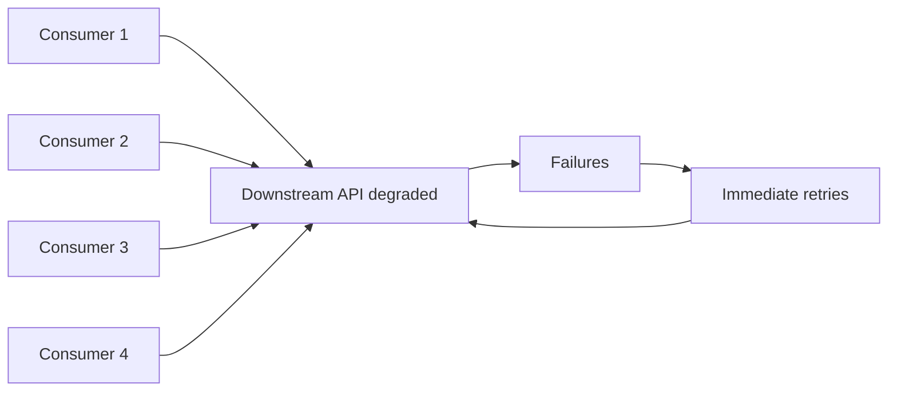

------
title: Learn Java Messaging and Event Streaming - Part 004
description: Taxonomy mendalam untuk delivery guarantees, failure modes, duplicates, loss, reordering, poison messages, retries, acknowledgements, offset commit, and effectively-once engineering.
series: learn-java-messaging-event-streaming
seriesTitle: Learn Java Messaging and Event Streaming
order: 4
partTitle: Delivery Guarantees and Failure Taxonomy
tags:
- java
- messaging
- event-streaming
- reliability
- kafka
- rabbitmq
- jms
- failure-modeling
- distributed-systems
date: 2026-06-28
---

# Part 004 — Delivery Guarantees and Failure Taxonomy

> Target part ini: kita akan berhenti memperlakukan delivery guarantee sebagai label marketing seperti “exactly once”. Kita akan membedah delivery sebagai rantai peristiwa: produce, store, dispatch, process, side effect, ack/commit, retry, dan recovery.

Reliability messaging bukan pertanyaan tunggal:

```text
Apakah broker menjamin message terkirim?
```

Pertanyaan yang benar:

```text
Pada titik mana message bisa hilang, terduplikasi, tertunda, diproses ulang, berubah urutan, masuk DLQ, atau menghasilkan side effect ganda?
```

Part ini membangun mental model yang akan dipakai saat membahas JMS acknowledgement, RabbitMQ ack/nack/DLX, Kafka offset commit, Kafka transactions, retry topics, idempotency, dan outbox/inbox pattern.

---

## 1. Delivery Guarantee Adalah Properti End-to-End

Delivery guarantee bukan hanya fitur broker. Ia adalah hasil komposisi dari:

- Producer behavior.
- Broker durability.
- Replication.
- Consumer acknowledgement/offset commit.
- Retry policy.
- Transaction boundary.
- Idempotency.
- External side effect behavior.
- Operational recovery procedure.



Setiap panah adalah titik kegagalan.

Karena itu, kalimat seperti “Kafka/RabbitMQ/JMS mendukung at-least-once” belum cukup. Kita harus bertanya:

- At-least-once antara siapa dan siapa?
- Message dianggap delivered saat diterima consumer atau selesai business process?
- Side effect external ikut dalam guarantee atau tidak?
- Commit/ack dilakukan sebelum atau sesudah side effect?
- Jika process crash di tengah, apa yang akan terjadi?

---

## 2. Empat Level Penting: Delivery, Processing, Effect, Outcome

Dalam desain sistem messaging, bedakan empat level ini.

| Level | Pertanyaan | Contoh |
|---|---|---|
| Delivery | Apakah message sampai ke consumer? | Broker mengirim message ke listener |
| Processing | Apakah consumer menjalankan logic? | Handler membaca payload dan validasi |
| Effect | Apakah side effect terjadi? | Insert DB, call API, send email |
| Outcome | Apakah business state akhir benar? | Case benar-benar escalated satu kali |

Banyak klaim “exactly once” hanya berlaku pada level tertentu, misalnya record processing dalam stream topology, bukan external API call ke payment gateway atau email provider.

Untuk sistem enterprise/regulatory, yang penting biasanya bukan “message delivered exactly once”, tetapi:

> Business outcome harus benar, audit trail lengkap, duplicate tidak merusak state, dan recovery dapat dijelaskan.

---

## 3. At-Most-Once

At-most-once berarti message diproses nol atau satu kali. Duplicate diminimalkan, tetapi loss mungkin terjadi.

Pola umum:



Karakteristik:

| Aspek | Implikasi |
|---|---|
| Duplicate | Rendah |
| Loss | Mungkin |
| Cocok untuk | Telemetry non-critical, metrics sampling, ephemeral notification |
| Tidak cocok untuk | Payment, enforcement decision, audit event, state transition penting |

Contoh:

- Consumer Kafka commit offset sebelum memproses record.
- Consumer RabbitMQ/JMS ack message sebelum side effect selesai.
- Producer tidak retry dan tidak menunggu confirmation/acks.

At-most-once bisa valid jika data tidak kritikal atau lebih baik hilang daripada duplicate. Tetapi untuk regulatory system, ini jarang cocok untuk domain event utama.

---

## 4. At-Least-Once

At-least-once berarti message tidak hilang selama sistem dan konfigurasi durability benar, tetapi bisa diproses lebih dari sekali.

Pola umum:



Karakteristik:

| Aspek | Implikasi |
|---|---|
| Loss | Rendah jika durability benar |
| Duplicate | Harus diasumsikan |
| Consumer design | Wajib idempotent |
| Retry | Natural tetapi harus dibatasi |
| Cocok untuk | Sebagian besar business messaging |

At-least-once adalah default mental model yang aman untuk mayoritas sistem messaging.

Rule:

> Jika handler tidak idempotent, at-least-once akan berubah menjadi “at-least-one-bug”.

---

## 5. Effectively-Once

Effectively-once bukan berarti broker tidak pernah mengirim duplicate. Artinya, meskipun duplicate terjadi, efek bisnis akhir tetap seperti satu kali.

Teknik utama:

- Idempotency key.
- Deduplication store.
- Unique constraint.
- Inbox table.
- Conditional update.
- State machine transition guard.
- External request idempotency token.

Contoh:

```sql
CREATE TABLE processed_message (
    message_id VARCHAR(128) PRIMARY KEY,
    processed_at TIMESTAMP NOT NULL
);
```

Pseudo-flow:

```java
@Transactional
public void handle(CaseEscalated event) {
    if (processedMessageRepository.exists(event.messageId())) {
        return;
    }

    caseRepository.transitionToEscalated(
        event.caseId(),
        event.expectedPreviousVersion(),
        event.newVersion()
    );

    processedMessageRepository.insert(event.messageId());
}
```

Untuk regulatory case management, effectively-once sering lebih penting daripada exactly-once marketing. Kita ingin state transition benar walaupun message redelivered.

---

## 6. Exactly-Once: Batas yang Sering Disalahpahami

Exactly-once dalam distributed messaging sangat terbatas konteksnya.

Dalam Kafka, exactly-once semantics biasanya terkait kombinasi:

- Idempotent producer.
- Transactions.
- Atomic commit antara output records dan consumed offsets dalam Kafka transaction.
- Stream processing topology yang input dan output-nya tetap berada dalam Kafka boundary.

Namun jika consumer melakukan side effect ke sistem eksternal seperti:

- Database non-transactional dengan Kafka.
- REST API eksternal.
- Email provider.
- Payment gateway.
- File system.
- Legacy system.

maka guarantee Kafka tidak otomatis mencakup side effect tersebut.



Prinsip:

> Exactly-once di dalam satu transactional substrate tidak otomatis menjadi exactly-once untuk seluruh business workflow.

Untuk side effect eksternal, gunakan effectively-once techniques.

---

## 7. Failure Taxonomy

Failure yang harus kita modelkan:

1. Producer failure.
2. Broker acceptance ambiguity.
3. Broker durability failure.
4. Broker replication/leader failure.
5. Network partition.
6. Consumer crash before processing.
7. Consumer crash during processing.
8. Consumer crash after side effect before ack/commit.
9. Consumer ack/commit before side effect.
10. Poison message.
11. Slow consumer.
12. Reordering.
13. Duplicate storm.
14. Retry storm.
15. DLQ flood.
16. Schema incompatibility.
17. Retention expiry before consumption.
18. Clock/time-window error.

Kita bahas satu per satu.

---

## 8. Producer Failure

Producer failure terjadi sebelum, selama, atau setelah publish.

| Failure | Gejala | Risiko | Mitigasi |
|---|---|---|---|
| Crash before send | Message tidak pernah terkirim | Lost business event | Outbox pattern |
| Timeout after send | Producer tidak tahu broker menerima atau tidak | Duplicate jika retry | Idempotent producer/message id |
| Serialization error | Message tidak valid | Event tidak keluar | Contract test/schema validation |
| Buffer full | Producer blocked/fails | Backpressure ke upstream | Bounded queue, metrics, fail-fast policy |
| Wrong routing key/topic | Message masuk tempat salah | Silent data loss bagi intended consumer | Routing tests, topology validation |

### 8.1 Publish Ambiguity

Kasus paling penting:

```text
Producer mengirim message, broker menerima dan menyimpan, tetapi response ACK ke producer hilang.
```

Producer melihat timeout. Jika producer retry, broker bisa menerima duplicate.

Karena itu producer-side retry harus digabung dengan:

- Stable message id.
- Idempotent producer jika tersedia.
- Deduplication di consumer atau broker jika tersedia.
- Outbox pattern untuk event dari database transaction.

---

## 9. Broker Failure

Broker failure tidak selalu berarti data loss. Tergantung durability, replication, quorum, acks, fsync behavior, dan recovery.

| Failure | Queue/Broker Model | Log/Stream Model | Design Question |
|---|---|---|---|
| Single node crash | Durable message mungkin survive jika persisted | Replica leader failover jika replicated | Apakah message sudah durable? |
| Disk full | Publish blocked/fails; queue unavailable | Produce fails; partition unavailable | Apa backpressure behavior? |
| Network partition | Split-brain/quorum behavior bergantung platform | ISR/quorum behavior | Apakah consistency atau availability dipilih? |
| Corrupt segment/store | Data loss/corruption risk | Replica recovery/log truncation | Backup, replication, validation? |
| Metadata failure | Routing/assignment terganggu | Controller/metadata issue | Operational playbook? |

Design rule:

> “Durable message” tidak cukup. Kita harus tahu durable di mana, direplikasi ke berapa node, kapan producer diberi ack, dan apa yang terjadi saat failover.

---

## 10. Consumer Failure

Consumer failure adalah sumber duplicate paling umum.

### 10.1 Crash Before Processing



Biasanya aman jika broker tidak menganggap message selesai.

### 10.2 Crash During Processing



Risiko:

- Partial side effect.
- Lock tertinggal.
- Transaction rollback atau tidak tergantung boundary.
- Duplicate write.

Mitigasi:

- Database transaction.
- Idempotent state transition.
- Version check.
- Compensating cleanup.

### 10.3 Crash After Side Effect Before Ack/Commit

Ini kasus klasik at-least-once duplicate.



Mitigasi:

- Idempotency token ke external API.
- Dedup table sebelum side effect.
- Outbox for side effect dispatcher.
- State transition guard.

### 10.4 Ack/Commit Before Side Effect

Ini menghasilkan at-most-once loss.



Untuk business-critical event, ini biasanya bug.

---

## 11. Acknowledgement vs Offset Commit

Ack dan offset commit sama-sama menandai progress, tetapi modelnya berbeda.

| Aspek | Queue Ack | Kafka Offset Commit |
|---|---|---|
| Unit | Delivery/message | Offset per partition per consumer group |
| Efek | Broker boleh menghapus/mark done | Consumer group progress maju |
| Redelivery | Unacked message dapat dikirim lagi | Record setelah committed offset dianggap sudah dilewati |
| Replay | Tidak natural setelah ack | Bisa seek ke offset lama jika retained |
| Granularity | Per message/delivery atau session tergantung platform | Offset monotonic per partition |

Dalam Kafka, commit offset `100` berarti consumer group menyatakan semua record sebelum offset tersebut sudah diproses. Jika record offset `95` gagal tetapi offset `100` sudah committed, record `95` tidak otomatis diproses ulang.

---

## 12. Redelivery, Retry, and Reprocessing

Ketiga istilah ini berbeda.

| Istilah | Makna |
|---|---|
| Redelivery | Broker mengirim message yang sama lagi karena belum ack/sukses |
| Retry | Aplikasi sengaja mencoba lagi setelah failure |
| Reprocessing | Membaca ulang histori dari log/stream untuk membangun ulang state/output |

Contoh:

- RabbitMQ unacked message setelah consumer crash → redelivery.
- Kafka consumer gagal call API lalu mengirim ke retry topic → retry.
- Kafka consumer group baru membaca topic dari awal → reprocessing.

Desain yang baik membedakan ketiganya agar observability dan incident handling jelas.

---

## 13. Poison Message

Poison message adalah message yang selalu gagal diproses karena isinya, schema, state dependency, atau bug.

Contoh:

- JSON tidak valid.
- Schema version tidak didukung.
- Required field kosong.
- Case state tidak memungkinkan transition.
- Reference data belum tersedia.
- Handler bug untuk nilai tertentu.

Tanpa penanganan, poison message bisa menyebabkan:

- Infinite retry.
- Consumer stuck.
- Lag meningkat.
- Queue tidak bergerak.
- DLQ flood.
- Cost meningkat.

Pola penanganan:



Informasi minimal di DLQ/quarantine:

- Original topic/queue/destination.
- Message key/id.
- Correlation id.
- Causation id.
- Payload atau pointer aman ke payload.
- Error class.
- Error message.
- First failure time.
- Last failure time.
- Retry count.
- Consumer/app version.
- Schema version.

---

## 14. Duplicate Taxonomy

Duplicate bukan satu jenis.

| Duplicate Type | Penyebab | Contoh | Mitigasi |
|---|---|---|---|
| Producer duplicate | Retry after unknown publish result | Same event sent twice | Stable event id, idempotent producer |
| Broker duplicate | Failover/redelivery behavior | Same delivery after reconnect | Consumer idempotency |
| Consumer duplicate | Crash after side effect before ack | DB updated twice | Inbox/dedup/state guard |
| Replay duplicate | Reprocessing historical data | Rebuild triggers side effect | Separate replay mode, output isolation |
| Business duplicate | User/API submits same command twice | Two approval commands | Command idempotency key |

Duplicate harus dideteksi di level yang benar. Jangan hanya dedup berdasarkan payload hash jika semantic id sudah ada. Dua event bisa memiliki payload sama tetapi merupakan event berbeda; sebaliknya duplicate bisa punya timestamp berbeda tetapi message id sama.

---

## 15. Loss Taxonomy

Message loss juga banyak bentuknya.

| Loss Type | Penyebab | Deteksi | Mitigasi |
|---|---|---|---|
| Pre-publish loss | App crash before send | Missing outbox row/event | Transactional outbox |
| Publish loss | No confirm/ack, broker reject | Producer error metrics | Confirm/acks/retry |
| Broker loss | Non-durable storage, replication failure | Broker logs/audit gap | Durability/replication/quorum |
| Consumer skip | Commit/ack before processing | Audit mismatch | Process before commit |
| Retention loss | Consumer lag exceeds retention | Lag vs retention alert | Longer retention, faster consumers |
| Routing loss | Wrong topic/routing key/binding | Unroutable metrics | Mandatory routing/topology tests |
| Schema loss | Consumer drops unknown schema | DLQ or silent logs | Compatibility policy |

Sistem regulatory harus mampu membedakan loss teknis dari event yang memang tidak pernah terjadi.

---

## 16. Reordering Taxonomy

Reordering dapat terjadi karena:

- Multiple producers.
- Multiple partitions.
- Multiple consumers.
- Retry topics.
- Redelivery after later message succeeded.
- Network delay.
- Clock skew.
- Priority queues.
- Parallel processing inside consumer.

Contoh:

```text
Expected:
1. CaseCreated
2. CaseAssigned
3. CaseEscalated

Observed by consumer:
1. CaseCreated
3. CaseEscalated
2. CaseAssigned
```

Mitigasi:

- Key by aggregate id.
- Include aggregate version.
- Reject or buffer out-of-order events.
- State machine transition guard.
- Avoid parallel processing for same key.
- Use sequence number per aggregate.

Untuk regulatory workflows, event ordering sebaiknya dilindungi di dua lapis:

1. Messaging-level ordering per key/partition/queue.
2. Domain-level version/state transition validation.

---

## 17. Slow Consumer and Backlog Failure

Slow consumer bukan hanya performa buruk. Ia bisa menjadi data loss jika retention habis atau disk penuh.

Gejala:

- Kafka consumer lag naik.
- RabbitMQ queue depth naik.
- JMS destination backlog naik.
- End-to-end latency naik.
- Retry queue tumbuh.
- Consumer CPU rendah tetapi throughput rendah karena external dependency lambat.

Penyebab:

- Handler lambat.
- External API lambat.
- Database lock/contention.
- Batch size terlalu kecil.
- Prefetch terlalu rendah/tinggi.
- Partition terlalu sedikit.
- Hot key.
- Poison message blocking.

Mitigasi:

- Backpressure.
- Horizontal scaling jika partition/queue memungkinkan.
- Batch processing.
- Bulk writes.
- Circuit breaker external dependency.
- Retry isolation.
- DLQ poison message.
- Increase retention only as temporary safety margin, bukan solusi tunggal.

---

## 18. Retry Storm

Retry storm terjadi ketika failure downstream membuat banyak consumer retry serentak, memperburuk beban sistem yang sudah gagal.



Anti-pattern:

```java
while (true) {
    try {
        callDownstream();
        break;
    } catch (Exception e) {
        // retry immediately forever
    }
}
```

Prinsip retry sehat:

- Retry hanya untuk transient failure.
- Gunakan exponential backoff dengan jitter.
- Batasi retry budget.
- Pisahkan retry delay dari main consumer loop jika perlu.
- Gunakan DLQ/quarantine setelah budget habis.
- Jangan biarkan retry satu message memblokir seluruh partition/queue tanpa alasan.

---

## 19. DLQ Flood

DLQ bukan tempat sampah permanen. DLQ adalah mekanisme operasional untuk isolasi failure.

DLQ flood berarti banyak message masuk DLQ dalam waktu singkat.

Kemungkinan penyebab:

- Deploy bug.
- Schema incompatible.
- Downstream contract changed.
- Reference data missing.
- Poison batch.
- Authorization expired.
- Tenant-specific data issue.

Runbook minimal:

1. Stop or throttle producer/consumer jika flood masih aktif.
2. Klasifikasikan error: transient, permanent, schema, domain, infrastructure.
3. Ambil sample message dan correlation id.
4. Cek release/deploy terbaru.
5. Cek apakah semua tenant terkena atau subset.
6. Fix handler/schema/config.
7. Replay dari DLQ secara terkendali.
8. Catat audit incident.

---

## 20. Schema Failure

Schema failure adalah salah satu failure paling berbahaya karena sering terlihat seperti poison message biasa.

Contoh:

- Producer menghapus field yang masih dibutuhkan consumer.
- Enum baru tidak dikenal consumer lama.
- Field berubah makna tanpa ganti nama.
- Timestamp timezone berubah.
- Number precision berubah.
- `caseId` berubah dari numeric ke string.

Mitigasi:

- Compatibility check.
- Schema registry atau contract registry.
- Consumer-driven contract test.
- Additive change preference.
- Semantic versioning for event meaning, not only syntax.
- Strict DLQ classification.

Rule:

> Schema compatible secara teknis belum tentu compatible secara semantik.

Contoh: field `riskScore` tetap integer, tetapi maknanya berubah dari `0..100` menjadi `0..1000`. Parser tidak gagal, tetapi business logic rusak.

---

## 21. Retention Expiry Failure

Pada log/stream system, consumer yang terlalu tertinggal bisa kehilangan data jika offset yang dibutuhkan sudah melewati retention.

Contoh:

```text
Retention topic: 3 days
Consumer downtime: 5 days
Oldest available offset: 800000
Consumer committed offset: 600000
```

Consumer tidak bisa melanjutkan secara normal karena data antara 600000 dan 800000 hilang.

Mitigasi:

- Alert consumer lag relatif terhadap retention.
- Retention disesuaikan dengan RTO consumer.
- Backup/tiered storage jika tersedia dan diperlukan.
- Rebuild state dari snapshot + remaining log.
- Operational policy: consumer tidak boleh mati lebih lama dari retention safety window.

---

## 22. Time and Window Failure

Dalam stream processing, waktu bukan satu hal.

| Time Type | Meaning |
|---|---|
| Event time | Waktu kejadian bisnis terjadi |
| Ingestion time | Waktu broker menerima event |
| Processing time | Waktu consumer memproses event |
| Commit time | Waktu offset/state disimpan |

Failure:

- Late event masuk setelah window ditutup.
- Clock producer salah.
- Timezone salah.
- Reprocessing menghasilkan waktu processing baru.
- SLA dihitung dari ingestion time padahal harus event time.

Untuk regulatory systems, time semantics harus eksplisit. Deadline enforcement biasanya tidak boleh bergantung pada processing time saja.

---

## 23. Ack/Commit Placement Patterns

### 23.1 Unsafe Early Ack

```text
ack → process → side effect
```

Cocok hanya untuk non-critical message.

### 23.2 Standard At-Least-Once

```text
process → side effect → ack/commit
```

Duplicate mungkin terjadi. Wajib idempotent.

### 23.3 Transactional DB + Ack After Commit

```text
begin DB tx → process → write state + processed_message → commit DB tx → ack/commit broker
```

Duplicate aman jika dedup table dan state transition benar.

### 23.4 Outbox Dispatch

```text
business tx writes state + outbox row → relay publishes message → mark outbox sent
```

Mengatasi producer crash before publish.

### 23.5 Consume-Transform-Produce Kafka Transaction

```text
poll input → process → produce output → send offsets to transaction → commit transaction
```

Cocok untuk Kafka-in/Kafka-out processing. Tetap tidak otomatis mencakup external side effect.

---

## 24. Invariants untuk Reliability

Gunakan invariant, bukan harapan.

### 24.1 Message Identity Invariant

Setiap message/event penting harus punya identity stabil.

```text
messageId != generated randomly on every retry
```

### 24.2 Business Idempotency Invariant

Duplicate message tidak boleh menghasilkan state akhir yang salah.

```text
Applying CaseEscalated(caseId=123, version=7) twice results in one escalation.
```

### 24.3 Ordering Invariant

Untuk aggregate yang butuh urutan, consumer tidak boleh apply version `n+1` sebelum `n` kecuali ada aturan reconciliation.

### 24.4 Commit Invariant

Consumer tidak boleh ack/commit progress untuk work critical sebelum durable business effect aman.

### 24.5 Replay Invariant

Replay tidak boleh mengirim side effect eksternal tanpa mode eksplisit.

```text
Replaying CaseApproved must not resend approval email unless explicitly requested.
```

### 24.6 DLQ Invariant

Message yang gagal permanen harus bisa diinvestigasi dan direplay secara terkendali.

---

## 25. Reliability Decision Matrix

| Requirement | Recommended Semantics | Required Techniques |
|---|---|---|
| Fire-and-forget metrics | At-most-once acceptable | Best-effort publish, sampling |
| Email notification | At-least-once + idempotent send | Idempotency key, retry, DLQ |
| Case state transition | Effectively-once | State machine guard, message id, transaction |
| Audit event | At-least-once publish + durable log | Outbox, retained log, schema governance |
| Kafka stream transformation | Kafka EOS if Kafka-in/out | Transactions, idempotent producer |
| External API command | At-least-once with external idempotency | Request idempotency token, retry budget |
| Rebuild projection | Replayable log | Offset control, side-effect disabled mode |

---

## 26. Failure Modelling Example: Case Escalation

Event:

```json
{
  "messageId": "msg-2026-0001",
  "eventId": "evt-esc-123-v7",
  "caseId": "CASE-123",
  "caseVersion": 7,
  "eventType": "CaseEscalated",
  "occurredAt": "2026-06-28T09:10:00Z",
  "causationId": "cmd-approve-escalation-888",
  "correlationId": "corr-555"
}
```

Handler invariant:

```text
Apply escalation only if current case version = 6.
After success, current case version = 7.
If event is received again, do nothing and report duplicate.
If current version > 7, classify as stale duplicate.
If current version < 6, classify as out-of-order dependency.
```

Pseudo-code:

```java
@Transactional
public void onCaseEscalated(CaseEscalated event) {
    if (processedMessage.exists(event.messageId())) {
        return;
    }

    CaseRecord current = caseRepository.findForUpdate(event.caseId());

    if (current.version() == event.caseVersion()) {
        processedMessage.insert(event.messageId(), "duplicate-already-applied");
        return;
    }

    if (current.version() != event.caseVersion() - 1) {
        throw new OutOfOrderEventException(event.caseId(), current.version(), event.caseVersion());
    }

    caseRepository.escalate(event.caseId(), event.caseVersion());
    processedMessage.insert(event.messageId(), "applied");
}
```

Catatan:

- Ini tidak bergantung pada broker mengirim tepat satu kali.
- Duplicate aman.
- Out-of-order terdeteksi.
- State transition defensible.
- Audit bisa menjelaskan apa yang terjadi.

---

## 27. Testing Failure Modes

Jangan hanya test happy path. Test matrix minimal:

| Test | Cara Simulasi | Expected Result |
|---|---|---|
| Duplicate delivery | Kirim message sama dua kali | State berubah satu kali |
| Crash after DB commit before ack | Kill consumer setelah commit | Redelivery tidak merusak state |
| Poison payload | Missing required field | Masuk DLQ/quarantine |
| Transient downstream failure | API return 503 | Retry dengan backoff |
| Permanent downstream failure | API return 400 | Tidak retry infinite; DLQ |
| Out-of-order event | version 8 sebelum 7 | Ditolak/buffered sesuai policy |
| Lag exceeds threshold | Consumer paused | Alert sebelum retention risk |
| Schema incompatible | Producer kirim enum baru | Contract test gagal atau DLQ jelas |

---

## 28. Observability Signals for Reliability

Metric yang harus ada:

| Signal | Meaning |
|---|---|
| Publish success/failure rate | Producer health |
| Publish latency | Broker/network pressure |
| Queue depth | Work backlog |
| Consumer lag | Stream backlog |
| Redelivery count | Consumer failure/ack issue |
| Retry count | Downstream instability |
| DLQ rate | Poison/schema/domain failure |
| Duplicate detected count | Reliability behavior visible |
| Processing latency | Handler cost |
| End-to-end latency | Business delay |
| Commit/ack latency | Progress durability |
| Oldest message age | SLA/backlog risk |

Logs harus membawa:

- `messageId`
- `eventId`
- `correlationId`
- `causationId`
- `topic/queue/destination`
- `partition/offset` jika ada
- `deliveryAttempt` atau retry count
- `consumerGroup` jika ada
- `schemaVersion`
- `tenantId` jika aman

---

## 29. Anti-Patterns

### 29.1 Ack Early for Critical Workflow

```text
ack → call external API → update DB
```

Jika crash setelah ack, message hilang secara business.

### 29.2 Infinite Retry in Handler

Menyebabkan consumer stuck dan retry storm.

### 29.3 DLQ Without Replay Plan

DLQ hanya menunda masalah. Tanpa replay tool dan classification, DLQ menjadi kuburan data.

### 29.4 “Exactly Once” as Replacement for Idempotency

External side effects tetap butuh idempotency.

### 29.5 Commit Offset After Batch Without Per-Record Failure Strategy

Jika batch berisi 100 record dan record ke-40 gagal, commit offset ke-100 bisa skip data.

### 29.6 Silent Drop Unknown Event

Consumer yang mengabaikan event unknown tanpa metric akan menciptakan data gap tersembunyi.

---

## 30. Practice: Failure Walkthrough

Ambil satu handler:

```text
NotificationConsumer handles CaseApproved and sends email.
```

Jawab:

1. Apakah email boleh terkirim dua kali?
2. Apakah provider email mendukung idempotency key?
3. Kapan ack/commit dilakukan?
4. Jika provider timeout, apakah email terkirim atau tidak?
5. Apa retry budget?
6. Apa DLQ payload?
7. Bagaimana operator replay tanpa mengirim email dua kali?
8. Apa metric duplicate email prevention?
9. Apa correlation id untuk audit?
10. Apa yang terjadi jika template email version berubah saat replay?

Desain yang matang akan menjawab semua ini sebelum production.

---

## 31. Key Takeaways

1. Delivery guarantee adalah properti end-to-end, bukan satu konfigurasi broker.
2. Bedakan delivery, processing, effect, dan business outcome.
3. At-least-once adalah default aman untuk banyak sistem, tetapi wajib idempotency.
4. Exactly-once punya boundary; external side effect tetap butuh protection.
5. Duplicate, loss, reordering, poison message, lag, dan retry storm harus dimodelkan eksplisit.
6. Ack/commit placement menentukan apakah failure menjadi loss atau duplicate.
7. Regulatory-grade system harus bisa menjelaskan recovery, bukan hanya “message sudah dikirim”.
8. Reliability terbaik dibangun dari invariant: identity, idempotency, ordering, commit discipline, replay safety, dan observability.

---

## 32. Referensi Resmi

- [Jakarta Messaging Specification](https://jakarta.ee/specifications/messaging/)
- [Jakarta Messaging Concepts — Jakarta EE Tutorial](https://jakarta.ee/learn/docs/jakartaee-tutorial/current/messaging/jms-concepts/jms-concepts.html)
- [Apache Kafka Documentation](https://kafka.apache.org/documentation/)
- [Apache Kafka Design Documentation](https://kafka.apache.org/41/design/design/)
- [Apache Kafka Documentation — Message Delivery Semantics](https://kafka.apache.org/documentation/#semantics)
- [Confluent — Message Delivery Guarantees for Apache Kafka](https://docs.confluent.io/kafka/design/delivery-semantics.html)
- [RabbitMQ Queues](https://www.rabbitmq.com/docs/queues)
- [RabbitMQ Reliability Guide](https://www.rabbitmq.com/docs/reliability)
- [RabbitMQ Confirms](https://www.rabbitmq.com/docs/confirms)
- [RabbitMQ Streams and Superstreams](https://www.rabbitmq.com/docs/streams)
