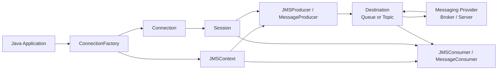
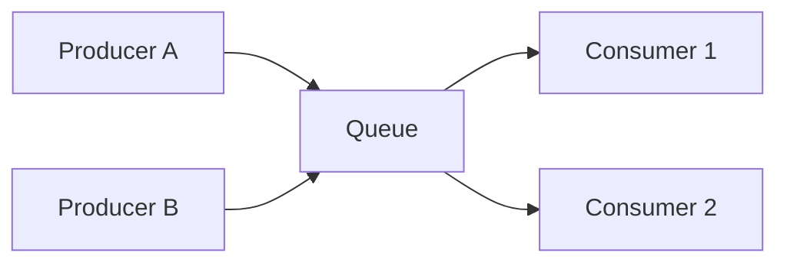
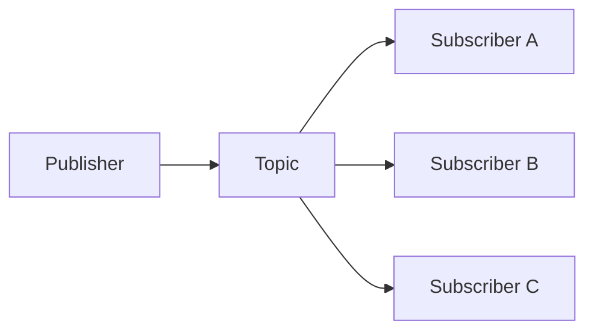
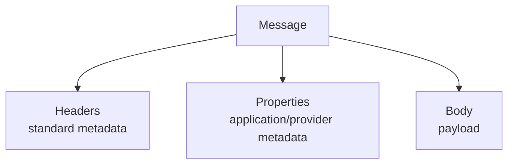
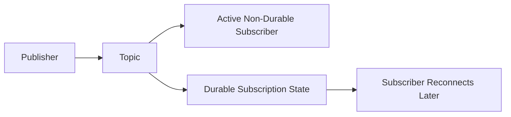

------
title: Learn Java Messaging and Event Streaming - Part 005
description: Deep dive into Jakarta Messaging/JMS API contracts, object model, destination model, message anatomy, lifecycle, portability boundaries, and production design heuristics.
series: learn-java-messaging-event-streaming
seriesTitle: Learn Java Messaging and Event Streaming
order: 5
partTitle: Jakarta Messaging/JMS API, Contracts, and Runtime Model
tags:
- java
- jakarta-messaging
- jms
- messaging
- enterprise-integration
- distributed-systems
- event-driven-architecture
date: 2026-06-28
---

# Part 005 — Jakarta Messaging/JMS API, Contracts, and Runtime Model

## 1. Why This Part Exists

JMS, now **Jakarta Messaging**, is often misunderstood as “a message broker”. It is not. It is a **Java API contract** for sending, receiving, and reading messages through a messaging provider.

That distinction matters because production correctness does not come from importing `jakarta.jms.*`. It comes from understanding the boundary between:

1. what the API guarantees,
2. what the broker/provider implements,
3. what the container manages,
4. what the application must make explicit.

In this part, we focus on the **runtime object model** and the engineering mental model. Transactions, acknowledgement, and redelivery are handled in Part 006.

## 2. Kaufman Framing: What We Are Actually Learning

Based on the *First 20 Hours* approach, we deconstruct Jakarta Messaging into the smallest useful primitives:

| Skill Unit | What You Must Be Able To Do |
|---|---|
| Destination modelling | Decide whether a queue, topic, durable subscription, or temporary destination matches the business communication need. |
| Message modelling | Design message body, headers, properties, correlation, reply target, idempotency key, and trace metadata. |
| Client lifecycle | Know when to create, reuse, close, inject, or pool messaging resources. |
| Consumption model | Choose synchronous receive, asynchronous listener, MDB/container listener, or application-managed worker loop. |
| Provider boundary | Separate portable JMS behaviour from broker-specific features. |
| Failure awareness | Predict what happens when a producer, broker, network, or consumer fails mid-operation. |

The desired capability is not memorising the API. The desired capability is being able to look at a messaging design and say:

> “This part is portable Jakarta Messaging. This part depends on the provider. This part depends on the transaction manager. This part is an application-level invariant.”

## 3. Jakarta Messaging in One Mental Model

A Jakarta Messaging application interacts with a **messaging provider** through objects that represent connection, session, destination, producer, consumer, and message.



Two API styles exist:

| API Style | Main Objects | Typical Use |
|---|---|---|
| Classic JMS 1.1 style | `ConnectionFactory`, `Connection`, `Session`, `MessageProducer`, `MessageConsumer` | Legacy code, lower-level lifecycle control, existing enterprise codebases. |
| Simplified JMS 2.0+ / Jakarta Messaging style | `ConnectionFactory`, `JMSContext`, `JMSProducer`, `JMSConsumer` | Modern Java/Jakarta code, cleaner resource management, less boilerplate. |

`JMSContext` conceptually combines a connection and a session. It simplifies the API but does not remove the underlying ideas. The connection is still the physical/logical link to the provider. The session is still the single-threaded context for producing and consuming messages.

## 4. Core Runtime Objects

### 4.1 `ConnectionFactory`

`ConnectionFactory` is the entry point used to create messaging connections or contexts.

In application servers, it is commonly provided as an administered object and injected:

```java
import jakarta.annotation.Resource;
import jakarta.jms.ConnectionFactory;
import jakarta.jms.JMSContext;
import jakarta.jms.Queue;

public class CaseEventPublisher {

    @Resource(lookup = "java:/jms/CaseConnectionFactory")
    private ConnectionFactory connectionFactory;

    @Resource(lookup = "java:/jms/queue/CaseEvents")
    private Queue caseEventsQueue;

    public void publishCaseOpened(String payload) {
        try (JMSContext context = connectionFactory.createContext()) {
            context.createProducer().send(caseEventsQueue, payload);
        }
    }
}
```

In standalone applications, the provider usually supplies a concrete factory or configuration mechanism.

The important invariant:

> Application code should treat `ConnectionFactory` as provider-specific configuration hidden behind a portable interface.

Do not scatter broker hostnames, credentials, reconnect settings, SSL options, and vendor-specific tuning inside business services.

### 4.2 `JMSContext`

`JMSContext` is the central object in the simplified API. It creates producers, consumers, messages, temporary destinations, and queue browsers.

Example:

```java
try (JMSContext context = connectionFactory.createContext()) {
    JMSProducer producer = context.createProducer();
    TextMessage message = context.createTextMessage("case-opened");

    message.setStringProperty("eventType", "CaseOpened");
    message.setStringProperty("schemaVersion", "1");

    producer.send(caseEventsQueue, message);
}
```

The trap is assuming that `JMSContext` is just a cheap stateless utility. It is not. It is a messaging resource with provider state behind it.

Practical rules:

| Rule | Reason |
|---|---|
| Close application-created contexts. | They may hold network, session, or provider resources. |
| Do not share one context across arbitrary concurrent threads. | The underlying session concept is single-threaded. |
| Prefer container injection where available. | The container can manage lifecycle, transactions, and security context. |
| Do not create a new context for every single message in a high-throughput hot path without measuring. | It may destroy throughput through repeated resource setup. |

### 4.3 `Connection` and `Session`

The classic API exposes the underlying model directly:

```java
try (Connection connection = connectionFactory.createConnection()) {
    Session session = connection.createSession(false, Session.AUTO_ACKNOWLEDGE);
    MessageProducer producer = session.createProducer(caseEventsQueue);
    TextMessage message = session.createTextMessage("case-opened");

    connection.start();
    producer.send(message);
}
```

The simplified API is easier, but knowing the classic model remains valuable because many production behaviours are still described in terms of sessions:

- acknowledgement belongs to a session,
- transaction belongs to a session,
- message ordering is often perceived through a session/consumer path,
- synchronous receive and asynchronous listener behaviour are session-bound,
- session thread-safety is a real design constraint.

## 5. Destination Model

`Destination` is the common supertype for `Queue` and `Topic`.

### 5.1 Queue

A queue models **point-to-point** delivery.



Typical intent:

- distribute work among competing consumers,
- perform asynchronous command handling,
- isolate a slow downstream worker,
- buffer tasks.

Queue mental model:

> One message is normally processed by one consumer.

This makes queues fit commands and tasks, but they are not ideal as an audit/event history unless the broker supports retention/replay semantics outside normal queue consumption.

### 5.2 Topic

A topic models **publish-subscribe**.



Typical intent:

- distribute facts/events to multiple independent subscribers,
- decouple producer from future consumers,
- notify many bounded contexts.

Topic mental model:

> Each subscription represents a separate consumer interest.

The subtle point: a topic is not automatically a durable event log. Depending on subscription type and provider configuration, messages may only be delivered to active subscribers or may be retained for durable subscribers.

### 5.3 Temporary Destinations

Temporary queues/topics are created for the life of a connection/context and are commonly used in request-reply.

```java
try (JMSContext context = connectionFactory.createContext()) {
    TemporaryQueue replyQueue = context.createTemporaryQueue();

    TextMessage request = context.createTextMessage("get-case-status");
    request.setJMSReplyTo(replyQueue);
    request.setJMSCorrelationID("case-123/request-456");

    context.createProducer().send(caseCommandQueue, request);

    JMSConsumer replies = context.createConsumer(replyQueue);
    Message reply = replies.receive(2_000);
}
```

Temporary destinations are useful, but they embed runtime coupling. If the requester dies, the reply path may disappear. For important business responses, prefer durable reply channels or state-based polling/read models.

## 6. Message Anatomy

A Jakarta Messaging message has three conceptual regions:



### 6.1 Standard Headers

Common headers include:

| Header | Meaning | Design Use |
|---|---|---|
| `JMSMessageID` | Provider-assigned message identifier. | Useful for diagnostics; do not treat as business idempotency key unless provider semantics are acceptable. |
| `JMSTimestamp` | Provider timestamp when message is sent. | Useful for rough latency; not a business event time. |
| `JMSCorrelationID` | Correlates messages, often request and reply. | Essential for request-reply and async workflows. |
| `JMSReplyTo` | Destination for replies. | Request-reply pattern. |
| `JMSDestination` | Destination where message was sent. | Diagnostics/routing awareness. |
| `JMSDeliveryMode` | Persistent or non-persistent. | Durability and performance trade-off. |
| `JMSExpiration` | Expiration timestamp derived from time-to-live. | Avoid processing stale commands. |
| `JMSPriority` | Priority hint. | Use carefully; priority can create starvation and operational complexity. |
| `JMSRedelivered` | Whether provider believes message is being redelivered. | Useful signal, not a complete duplicate-detection solution. |

### 6.2 Properties

Message properties are name/value metadata. They are often used for:

- event type,
- schema version,
- tenant id,
- jurisdiction,
- correlation id,
- causation id,
- trace id,
- idempotency key,
- priority class,
- retry count,
- regulatory classification.

Example:

```java
TextMessage message = context.createTextMessage(jsonPayload);
message.setStringProperty("eventType", "CaseEscalated");
message.setStringProperty("schemaVersion", "2");
message.setStringProperty("tenantId", "regulator-id");
message.setStringProperty("correlationId", correlationId);
message.setStringProperty("causationId", commandId);
message.setStringProperty("idempotencyKey", eventId);
```

Properties are powerful because selectors can filter on them. They are dangerous when teams turn them into an uncontrolled secondary schema.

Rule:

> Treat message properties as a governed contract, not random tags.

### 6.3 Body

Common body types:

| Type | Use | Warning |
|---|---|---|
| `TextMessage` | JSON, XML, text payloads. | Easy to inspect; requires schema discipline. |
| `BytesMessage` | Binary formats, Avro/Protobuf/custom binary. | Better for compact payloads; less human-readable. |
| `MapMessage` | Simple structured fields. | Can become provider-specific and awkward for schema evolution. |
| `ObjectMessage` | Serialized Java object. | Avoid in distributed systems unless tightly controlled; creates classpath, versioning, and security risk. |
| `StreamMessage` | Sequential primitive stream. | Rare in modern application architecture. |
| Generic `Message` | Header/properties-only signal. | Useful for lightweight notifications but easy to under-specify. |

For most modern enterprise systems, prefer:

- `TextMessage` with JSON for operational readability and moderate scale,
- `BytesMessage` with Protobuf/Avro for stronger schema discipline and compact encoding,
- avoid `ObjectMessage` across service boundaries.

## 7. Producer Model

A producer sends a message to a destination.

Simplified API:

```java
context.createProducer()
    .setDeliveryMode(DeliveryMode.PERSISTENT)
    .setPriority(4)
    .setTimeToLive(60_000)
    .send(caseEventsQueue, message);
```

Classic API:

```java
MessageProducer producer = session.createProducer(caseEventsQueue);
producer.setDeliveryMode(DeliveryMode.PERSISTENT);
producer.setTimeToLive(60_000);
producer.send(message);
```

Important producer decisions:

| Decision | Impact |
|---|---|
| Persistent vs non-persistent | Durability vs throughput/latency. |
| TTL | Prevents stale command processing. |
| Priority | Can improve urgent handling but may destabilize fairness. |
| Correlation ID | Enables request-reply and causality tracing. |
| Message ID strategy | Separates provider message id from business event id. |
| Payload schema | Determines evolvability. |

### Producer Anti-Pattern: Fire and Forget Without Ownership

Bad:

```java
context.createProducer().send(queue, payload);
```

This line can be fine for demo code, but production code needs explicit answers:

- Is the message persistent?
- What happens if the broker accepts but downstream cannot process?
- Is the send inside or outside a business transaction?
- What idempotency key protects duplicate processing?
- Is TTL required?
- Is this a command, event, or notification?
- How will we trace it during an incident?

A better production shape:

```java
public void publishCaseEscalated(CaseEscalatedEvent event) {
    String payload = json.serialize(event);

    try (JMSContext context = connectionFactory.createContext()) {
        TextMessage message = context.createTextMessage(payload);
        message.setStringProperty("eventType", "CaseEscalated");
        message.setStringProperty("schemaVersion", "3");
        message.setStringProperty("eventId", event.eventId());
        message.setStringProperty("correlationId", event.correlationId());
        message.setStringProperty("causationId", event.causationId());
        message.setStringProperty("caseId", event.caseId());

        context.createProducer()
            .setDeliveryMode(DeliveryMode.PERSISTENT)
            .setTimeToLive(0)
            .send(caseEventsTopic, message);
    }
}
```

## 8. Consumer Model

### 8.1 Synchronous Receive

```java
try (JMSContext context = connectionFactory.createContext()) {
    JMSConsumer consumer = context.createConsumer(caseCommandQueue);
    Message message = consumer.receive(5_000);

    if (message == null) {
        return;
    }

    String body = message.getBody(String.class);
    handle(body);
}
```

Synchronous receive is useful for:

- CLI tools,
- batch drains,
- tests,
- controlled worker loops,
- request-reply waiting.

It is less ideal for high-throughput service consumers unless the worker loop is carefully designed.

### 8.2 Asynchronous Listener

```java
JMSConsumer consumer = context.createConsumer(caseCommandQueue);
consumer.setMessageListener(message -> {
    try {
        String body = message.getBody(String.class);
        handle(body);
    } catch (JMSException e) {
        throw new RuntimeException(e);
    }
});
```

Asynchronous listeners fit service-style consumption, but they hide concurrency and transaction boundaries unless explicitly documented.

Questions to answer:

- How many listener instances exist?
- Does one listener process messages sequentially or concurrently?
- Who controls thread pools?
- What happens when `onMessage` throws?
- When is the message acknowledged?
- Does the listener run inside a container transaction?

### 8.3 Message Selectors

Selectors filter messages using properties.

```java
JMSConsumer consumer = context.createConsumer(
    caseEventsTopic,
    "eventType = 'CaseEscalated' AND jurisdiction = 'ID'"
);
```

Selectors are useful for reducing irrelevant traffic, but they also create hidden coupling:

- producers must maintain selector properties,
- consumers depend on property names and types,
- broker-side filtering can have performance implications,
- selector logic can become distributed business rules.

Use selectors for stable routing metadata, not complex domain policy.

## 9. Durable Subscriptions

A non-durable topic subscription generally receives messages while active. A durable subscription represents a longer-lived subscription identity.

Mental model:



Durable subscriptions are useful when:

- a subscriber must not miss topic messages while offline,
- each subscriber has its own independent consumption state,
- the topic represents important business notifications.

They are not a replacement for Kafka-style event replay over long retention unless your provider explicitly supports equivalent retention/replay behaviour and you have tested it.

## 10. Queue Browser

A queue browser allows inspecting messages without consuming them.

```java
try (JMSContext context = connectionFactory.createContext()) {
    QueueBrowser browser = context.createBrowser(caseCommandQueue);
    Enumeration<?> messages = browser.getEnumeration();

    while (messages.hasMoreElements()) {
        Message message = (Message) messages.nextElement();
        System.out.println(message.getJMSMessageID());
    }
}
```

Use cases:

- diagnostics,
- admin tooling,
- sanity checks,
- tests.

Do not build business logic around queue browsing. It is not a reliable, scalable query model.

## 11. Provider Boundary and Portability Trap

Jakarta Messaging provides a common API, but providers differ in important areas:

- destination naming and provisioning,
- connection failover,
- prefetch/windowing,
- redelivery delay,
- dead-letter configuration,
- message priority implementation,
- clustering and HA semantics,
- broker-side filtering performance,
- durable subscription storage,
- management APIs,
- observability metrics,
- transaction manager integration.

Portability is useful at the source-code level. It does not eliminate operational differences.

A robust design document should explicitly classify behaviour:

| Behaviour | Portable Jakarta Messaging Contract? | Provider-Specific? | Application-Owned? |
|---|---:|---:|---:|
| Creating a `TextMessage` | Yes | No | No |
| Sending to `Queue` | Yes | Destination config varies | No |
| Redelivery delay policy | Partially | Usually yes | Sometimes |
| Dead-letter routing | Not fully portable | Yes | Design-owned |
| Idempotent business processing | No | No | Yes |
| Schema compatibility | No | No | Yes |
| Trace/correlation propagation | No | No | Yes |
| XA transaction behaviour | Partially | Yes | Architecture-owned |

## 12. Jakarta Messaging in a Regulatory Case Platform

Imagine a regulatory case-management system with the following events and commands:

- `CaseOpened`
- `CaseAssigned`
- `CaseEscalated`
- `EvidenceRequested`
- `DeadlineApproaching`
- `EnforcementActionProposed`
- `EnforcementActionApproved`

A JMS/Jakarta Messaging design might use:

| Communication | Destination Type | Reason |
|---|---|---|
| `AssignCaseCommand` | Queue | One worker/service should perform assignment. |
| `CaseEscalated` | Topic | Multiple subscribers may care: SLA, notification, audit, analytics. |
| `DeadlineReminderCommand` | Queue with TTL or scheduled provider feature | Stale reminders should not execute. |
| `CaseStatusRequest` / `CaseStatusReply` | Request queue + reply queue | Useful for short-lived internal request-reply, but avoid for core reads. |
| `AuditTrailEvent` | Topic or dedicated queue | Must be durable and failure-isolated. |

Important invariant:

> A regulatory audit trail should not depend only on transient messaging delivery. The authoritative event/audit record should be persisted in a durable store or append-only log with explicit retention and replay strategy.

JMS can participate in that architecture, but it should not be accidentally treated as the system of record unless the provider and operational model are intentionally designed for that.

## 13. Practical Coding Shape: Publisher Abstraction

Avoid letting every service construct raw JMS messages differently.

```java
public interface DomainEventPublisher {
    void publish(DomainEvent event);
}
```

```java
public final class JmsDomainEventPublisher implements DomainEventPublisher {

    private final ConnectionFactory connectionFactory;
    private final Topic topic;
    private final EventSerializer serializer;

    public JmsDomainEventPublisher(
        ConnectionFactory connectionFactory,
        Topic topic,
        EventSerializer serializer
    ) {
        this.connectionFactory = connectionFactory;
        this.topic = topic;
        this.serializer = serializer;
    }

    @Override
    public void publish(DomainEvent event) {
        try (JMSContext context = connectionFactory.createContext()) {
            TextMessage message = context.createTextMessage(serializer.toJson(event));

            message.setStringProperty("eventId", event.eventId());
            message.setStringProperty("eventType", event.eventType());
            message.setStringProperty("schemaVersion", event.schemaVersion());
            message.setStringProperty("correlationId", event.correlationId());
            message.setStringProperty("causationId", event.causationId());
            message.setStringProperty("occurredAt", event.occurredAt().toString());

            context.createProducer()
                .setDeliveryMode(DeliveryMode.PERSISTENT)
                .send(topic, message);
        } catch (JMSException ex) {
            throw new EventPublicationException("Failed to publish " + event.eventType(), ex);
        }
    }
}
```

This abstraction centralizes:

- serialization,
- metadata,
- delivery mode,
- error handling,
- metrics,
- tracing,
- future migration to Kafka/RabbitMQ.

But do not over-abstract too early. The abstraction must preserve important messaging semantics, not hide them.

## 14. Practical Coding Shape: Consumer Handler

Separate transport from business handling.

```java
public final class CaseCommandListener implements MessageListener {

    private final CaseCommandHandler handler;
    private final CommandDeserializer deserializer;

    public CaseCommandListener(
        CaseCommandHandler handler,
        CommandDeserializer deserializer
    ) {
        this.handler = handler;
        this.deserializer = deserializer;
    }

    @Override
    public void onMessage(Message message) {
        try {
            String body = message.getBody(String.class);
            String commandId = message.getStringProperty("commandId");
            String correlationId = message.getStringProperty("correlationId");

            CaseCommand command = deserializer.fromJson(body);
            handler.handle(command, commandId, correlationId);
        } catch (Exception ex) {
            throw new MessageHandlingException("Failed to handle case command", ex);
        }
    }
}
```

Transport concerns:

- parse message,
- extract metadata,
- map to domain command/event,
- call application handler,
- let ack/transaction policy be managed consistently.

Business concerns:

- validate command,
- enforce invariants,
- perform idempotency check,
- update state,
- emit follow-up events.

## 15. Common Anti-Patterns

### 15.1 Using `ObjectMessage` Across Services

`ObjectMessage` can look convenient:

```java
ObjectMessage message = context.createObjectMessage(caseEvent);
```

But across service boundaries it creates:

- classpath coupling,
- Java serialization risk,
- versioning pain,
- language lock-in,
- poor observability,
- difficult schema governance.

Prefer explicit serialization with a governed schema.

### 15.2 Treating `JMSMessageID` as Domain Event ID

Provider message IDs are transport identifiers. They are useful for diagnostics, but domain idempotency needs a stable business/event identifier generated by the application.

Use:

```java
message.setStringProperty("eventId", event.eventId());
```

### 15.3 One Giant Topic for Everything Without Contract Discipline

A single topic with `eventType` selectors can work at small scale. It becomes dangerous when:

- schemas diverge,
- selector expressions multiply,
- consumers silently miss events due to property mismatch,
- ownership is unclear,
- replay/backfill is needed.

Prefer explicit event families and documented contracts.

### 15.4 Business Logic in Selectors

Bad:

```sql
jurisdiction = 'ID' AND severity > 7 AND team = 'enforcement' AND appealOpen = FALSE
```

This hides domain policy inside broker filtering. Use selectors for routing, not evolving business decisions.

### 15.5 Creating Messaging Resources in Inner Loops

Bad:

```java
for (CaseEvent event : events) {
    try (JMSContext context = connectionFactory.createContext()) {
        context.createProducer().send(topic, toJson(event));
    }
}
```

Better shape:

```java
try (JMSContext context = connectionFactory.createContext()) {
    JMSProducer producer = context.createProducer()
        .setDeliveryMode(DeliveryMode.PERSISTENT);

    for (CaseEvent event : events) {
        producer.send(topic, toMessage(context, event));
    }
}
```

Still measure. Provider behaviour varies.

## 16. Engineering Checklist

Before approving a JMS/Jakarta Messaging design, answer:

1. Is each message a command, event, document, or signal?
2. Is the destination a queue, topic, durable subscription, or temporary destination?
3. Who owns the destination provisioning?
4. What is the message schema?
5. What is the compatibility policy?
6. What metadata is mandatory?
7. What is the idempotency key?
8. What is the correlation and causation strategy?
9. Is the message persistent?
10. Is TTL needed?
11. What happens when the consumer fails after side effects?
12. What happens when the broker accepts the message but the database transaction fails?
13. What is provider-specific?
14. What metrics prove the system is healthy?
15. What is the DLQ/retry/quarantine strategy?

## 17. Deliberate Practice

### Exercise 1 — Message Contract Review

Design a `CaseEscalated` event with:

- body schema,
- headers/properties,
- event id,
- correlation id,
- causation id,
- occurred-at timestamp,
- schema version,
- tenant/jurisdiction,
- idempotency strategy.

Then classify each field as:

- transport metadata,
- business metadata,
- audit metadata,
- payload.

### Exercise 2 — Queue vs Topic Decision

For each item, decide queue or topic:

1. send an email notification,
2. assign a case to an investigator,
3. notify audit trail that a case was escalated,
4. request a fraud score,
5. broadcast a policy-rule update,
6. send a one-time report generation job.

For each answer, state the failure you are optimizing for.

### Exercise 3 — Provider Boundary Table

Pick a provider such as ActiveMQ Artemis, IBM MQ, Solace, or WebLogic JMS. Build a table:

| Behaviour | Jakarta Messaging Standard | Provider Feature | Application Design |
|---|---|---|---|
| Redelivery delay |  |  |  |
| DLQ |  |  |  |
| Failover |  |  |  |
| Metrics |  |  |  |
| Destination provisioning |  |  |  |

## 18. Summary

Jakarta Messaging is best understood as a **contractual Java messaging layer**. It provides a common model for destinations, messages, producers, consumers, and sessions, but it does not erase provider-specific behaviour or application-level correctness requirements.

The top-level mental model:

- `ConnectionFactory` creates access to the provider.
- `JMSContext` combines connection/session ideas in the simplified API.
- `Destination` is either queue-like or topic-like.
- `Message` is headers + properties + body.
- Producers and consumers are transport endpoints, not business boundaries.
- Portability is useful but limited.
- Idempotency, schema discipline, correlation, and observability remain application responsibilities.

Part 006 goes deeper into the most dangerous area of JMS usage: **sessions, transactions, acknowledgement, and redelivery**.
