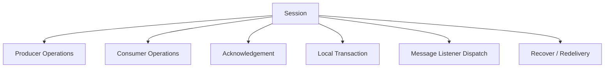
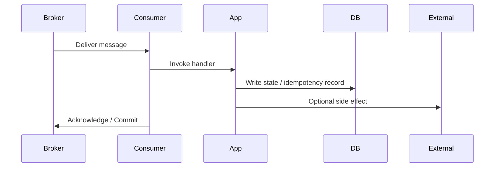
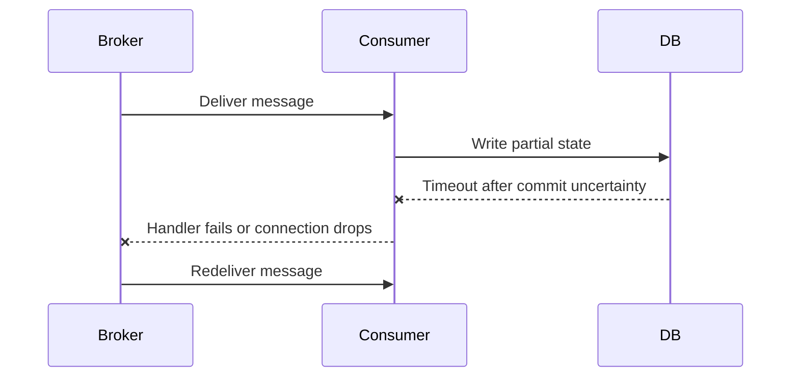
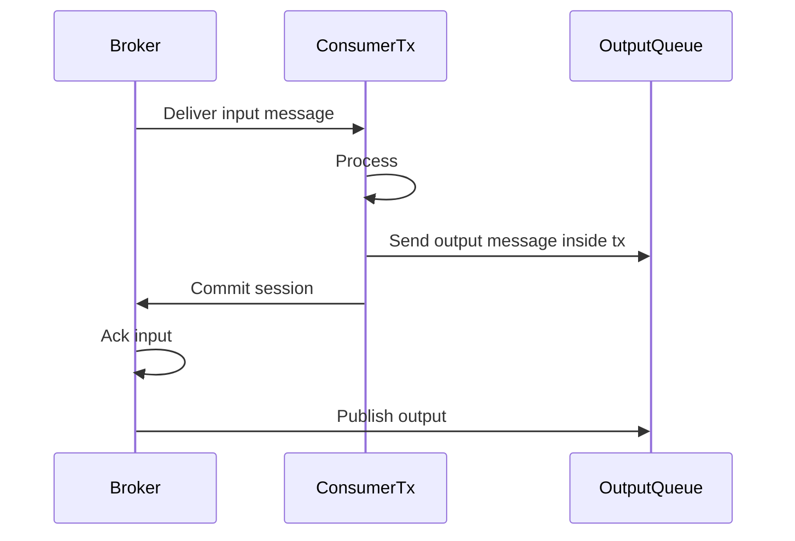
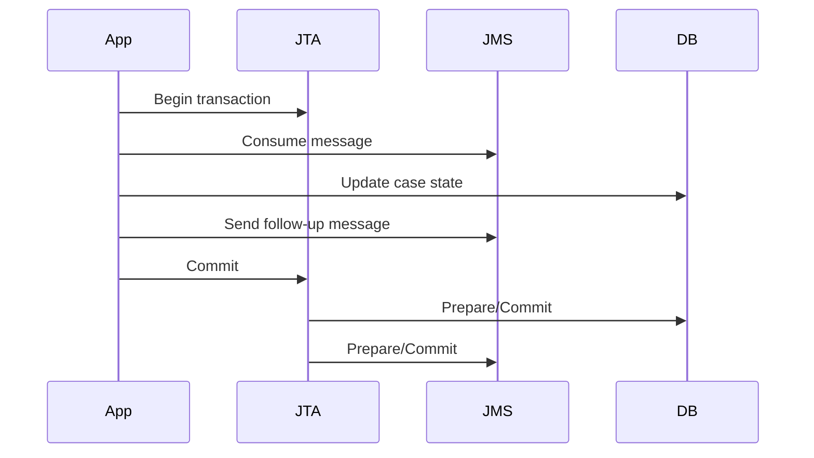
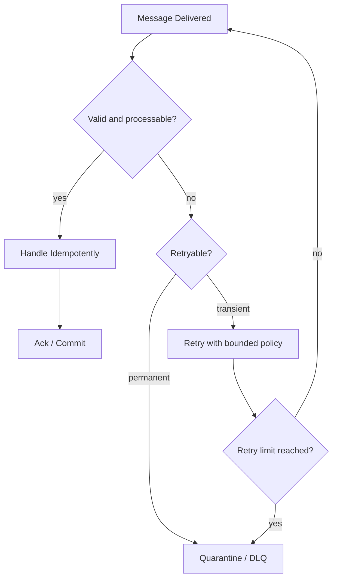
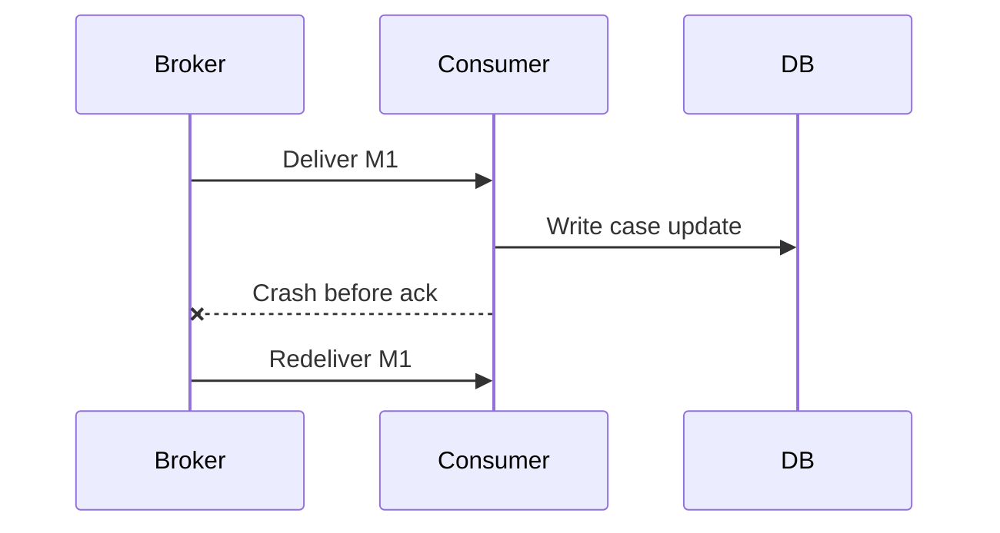
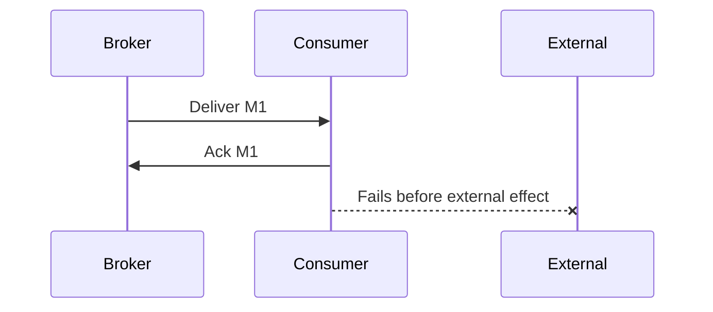
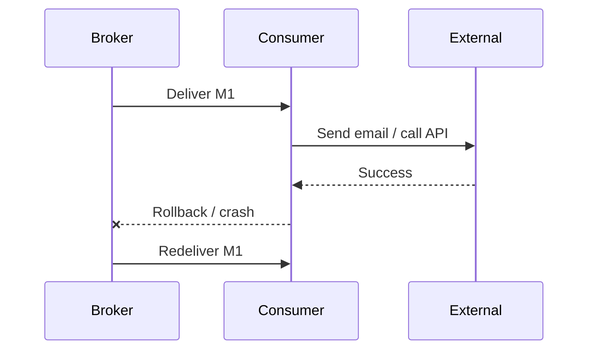
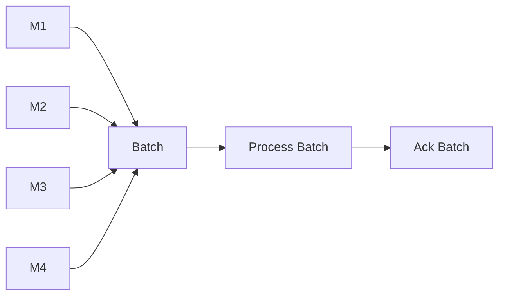

------
title: Learn Java Messaging and Event Streaming - Part 006
description: Deep dive into JMS/Jakarta Messaging sessions, acknowledgement modes, transactions, redelivery, poison message handling, and production failure semantics.
series: learn-java-messaging-event-streaming
seriesTitle: Learn Java Messaging and Event Streaming
order: 6
partTitle: JMS Sessions, Transactions, Acknowledgement, and Redelivery
tags:
- java
- jakarta-messaging
- jms
- transactions
- acknowledgement
- redelivery
- reliability
- distributed-systems
date: 2026-06-28
---

# Part 006 — JMS Sessions, Transactions, Acknowledgement, and Redelivery

## 1. Why This Part Matters

Most JMS/Jakarta Messaging production incidents are not caused by not knowing how to call `send()` or `receive()`.

They are caused by misunderstanding:

- when a message is considered consumed,
- what acknowledgement actually acknowledges,
- how session transactions work,
- what happens when a listener throws,
- how redelivery interacts with side effects,
- where duplicates are created,
- why “exactly once” is not achieved by selecting one ack mode.

The core idea:

> Delivery, acknowledgement, transaction commit, business processing, and external side effects are separate events. Treating them as one event is the root of many messaging bugs.

## 2. The Session as the Reliability Boundary

A JMS `Session` is not just a factory for messages and consumers. It is the unit where several important behaviours meet:

- message production,
- message consumption,
- acknowledgement,
- local transaction,
- asynchronous listener dispatch,
- recovery/redelivery.



The session mental model is crucial because acknowledgement and transactions are session-scoped, not merely consumer-scoped.

This means a design with one session and multiple consumers can have surprising acknowledgement coupling. In high-quality production code, the session-to-consumer relationship is explicit and deliberately constrained.

## 3. Threading Invariant

A session represents a single-threaded context for message production and consumption.

Practical interpretation:

- do not concurrently use the same session from arbitrary application threads,
- do not share a single `JMSContext` as a global singleton across concurrent request handlers,
- prefer one session/context per controlled worker thread or container-managed listener instance,
- when in doubt, assume the provider expects serialized access to a session.

Bad pattern:

```java
public final class UnsafeGlobalPublisher {
    private final JMSContext sharedContext;
    private final Queue queue;

    public void publish(String payload) {
        // Unsafe when called concurrently by multiple request threads.
        sharedContext.createProducer().send(queue, payload);
    }
}
```

Safer shape:

```java
public final class Publisher {
    private final ConnectionFactory connectionFactory;
    private final Queue queue;

    public void publish(String payload) {
        try (JMSContext context = connectionFactory.createContext()) {
            context.createProducer().send(queue, payload);
        }
    }
}
```

High-throughput systems may reuse contexts/sessions through controlled ownership, but they should not do so accidentally.

## 4. Acknowledgement Is Not Business Success

Acknowledgement tells the provider that the client accepts responsibility for consumed messages.

It does not necessarily mean:

- the database transaction committed,
- the downstream HTTP call succeeded,
- the email was sent,
- the regulatory deadline was updated,
- the audit trail was persisted,
- the business process completed.

The actual chain is longer:



Every failure point creates a different outcome.

| Failure Point | Possible Result |
|---|---|
| Before delivery | Message may remain in broker. |
| After delivery before handler | Message may be redelivered. |
| After DB commit before ack | Duplicate processing unless idempotent. |
| After ack before DB commit | Message loss from business perspective. |
| After external side effect before rollback | External duplicate or inconsistent state. |

Therefore:

> Acknowledgement mode is a transport policy. Idempotency is an application invariant.

## 5. Core Acknowledgement Modes

Common acknowledgement/session modes:

| Mode | Meaning | Typical Use | Risk |
|---|---|---|---|
| `AUTO_ACKNOWLEDGE` | Provider/session automatically acknowledges successful receipt/processing according to API rules. | Simple consumers. | Can ack too early for complex side effects if misunderstood. |
| `CLIENT_ACKNOWLEDGE` | Application explicitly acknowledges delivered messages. | Controlled batch-like consumption. | Acknowledges all messages delivered by the session, not just one isolated message in many cases. |
| `DUPS_OK_ACKNOWLEDGE` | Lazy acknowledgement; duplicates are acceptable. | Low-criticality, high-throughput cases. | Duplicate handling required. |
| Transacted session | Acknowledgement and sends are committed/rolled back with session transaction. | Atomic consume/send within JMS provider. | Does not automatically cover database/external side effects. |

Do not choose modes by convenience. Choose by failure semantics.

## 6. `AUTO_ACKNOWLEDGE`

With automatic acknowledgement, the provider/session handles acknowledgement after successful receive/listener processing according to the API contract.

Example:

```java
try (JMSContext context = connectionFactory.createContext(JMSContext.AUTO_ACKNOWLEDGE)) {
    JMSConsumer consumer = context.createConsumer(queue);
    Message message = consumer.receive(5_000);

    if (message != null) {
        handle(message.getBody(String.class));
    }
}
```

For asynchronous listener:

```java
JMSContext context = connectionFactory.createContext(JMSContext.AUTO_ACKNOWLEDGE);
JMSConsumer consumer = context.createConsumer(queue);

consumer.setMessageListener(message -> {
    try {
        handle(message.getBody(String.class));
    } catch (Exception ex) {
        throw new RuntimeException(ex);
    }
});
```

### When It Is Reasonable

Use `AUTO_ACKNOWLEDGE` when:

- processing is simple,
- handler is idempotent,
- side effects are either absent or safe,
- duplicates are acceptable and handled,
- failure handling is validated with integration tests.

### Where It Fails

Risk scenario:



The consumer may not know whether the database write committed. Redelivery is possible. Without idempotency, duplicate effects occur.

## 7. `CLIENT_ACKNOWLEDGE`

With client acknowledgement, the application explicitly calls `acknowledge()`.

```java
try (JMSContext context = connectionFactory.createContext(JMSContext.CLIENT_ACKNOWLEDGE)) {
    JMSConsumer consumer = context.createConsumer(queue);
    Message message = consumer.receive(5_000);

    if (message != null) {
        handle(message.getBody(String.class));
        message.acknowledge();
    }
}
```

This looks like per-message acknowledgement, but the important nuance is session scope. Acknowledge may acknowledge all messages consumed by the session so far, depending on the mode and delivery state.

Therefore, be careful with code like this:

```java
Message m1 = consumer.receive();
Message m2 = consumer.receive();

handle(m1);
handle(m2);

m2.acknowledge();
```

This can acknowledge more than just `m2`.

### Safer Use

Use `CLIENT_ACKNOWLEDGE` when:

- one session is bound to a controlled processing loop,
- you intentionally process a small batch and ack the batch,
- all messages in the session can be acknowledged together,
- failure means the batch can be retried idempotently.

Pseudo-shape:

```java
try (JMSContext context = connectionFactory.createContext(JMSContext.CLIENT_ACKNOWLEDGE)) {
    JMSConsumer consumer = context.createConsumer(queue);

    List<Message> batch = new ArrayList<>();

    for (int i = 0; i < 10; i++) {
        Message message = consumer.receive(500);
        if (message == null) {
            break;
        }
        batch.add(message);
    }

    if (!batch.isEmpty()) {
        processIdempotently(batch);
        batch.get(batch.size() - 1).acknowledge();
    }
}
```

This acknowledges the design reality: you are batch-processing the session’s delivered messages.

## 8. `DUPS_OK_ACKNOWLEDGE`

`DUPS_OK_ACKNOWLEDGE` allows lazy acknowledgement. The provider may reduce acknowledgement overhead, but duplicate delivery is more likely.

Use it only when the business operation is naturally idempotent or low-criticality.

Good candidates:

- metrics-like signals,
- cache invalidation messages,
- search index refresh notifications,
- low-risk notifications that can tolerate duplicates.

Bad candidates:

- payment execution,
- regulatory enforcement action,
- legal deadline mutation,
- irreversible external side effects,
- audit trail mutation without idempotency.

The correct mindset:

> `DUPS_OK_ACKNOWLEDGE` is not a performance button. It is a duplicate-tolerance declaration.

## 9. Transacted Sessions

A transacted JMS session groups sends and receives into a local JMS transaction.

Classic API:

```java
try (Connection connection = connectionFactory.createConnection()) {
    Session session = connection.createSession(true, Session.SESSION_TRANSACTED);
    MessageConsumer consumer = session.createConsumer(inputQueue);
    MessageProducer producer = session.createProducer(outputQueue);

    connection.start();

    Message input = consumer.receive(5_000);
    if (input != null) {
        try {
            String body = input.getBody(String.class);
            String output = transform(body);

            producer.send(session.createTextMessage(output));
            session.commit();
        } catch (Exception ex) {
            session.rollback();
        }
    }
}
```

Simplified API:

```java
try (JMSContext context = connectionFactory.createContext(JMSContext.SESSION_TRANSACTED)) {
    JMSConsumer consumer = context.createConsumer(inputQueue);
    JMSProducer producer = context.createProducer();

    Message input = consumer.receive(5_000);
    if (input != null) {
        try {
            String output = transform(input.getBody(String.class));
            producer.send(outputQueue, output);
            context.commit();
        } catch (Exception ex) {
            context.rollback();
        }
    }
}
```

### What Commit Means

In a local JMS transaction:

- consumed messages are acknowledged on commit,
- produced messages are made visible/committed on commit,
- rollback causes consumed messages to be redelivered and produced messages to be discarded.



This is useful for JMS-to-JMS transformations.

### What Commit Does Not Mean

A local JMS transaction does not automatically include:

- relational database commit,
- HTTP call,
- file write,
- email send,
- Kafka publish,
- external case-management API mutation.

For that, you need either:

- a global transaction/XA/JTA architecture,
- an outbox/inbox design,
- idempotent side effects,
- compensating recovery.

## 10. XA/JTA: Powerful but Expensive

In Jakarta EE environments, JMS can participate in container-managed transactions with JTA/XA when provider and resources support it.

This can coordinate work across JMS and database resources.

Example conceptual flow:



XA can be appropriate when:

- the platform already supports it well,
- operational teams understand recovery,
- throughput requirements are moderate,
- atomicity is more important than simplicity,
- failure recovery has been tested.

But XA has costs:

- operational complexity,
- coordinator failure handling,
- heuristic outcomes,
- lower throughput,
- resource locking,
- vendor-specific behaviour,
- difficult cloud-native portability.

Modern high-scale systems often prefer outbox/inbox plus idempotency over distributed transactions. That does not make XA “bad”; it makes it a deliberate trade-off.

## 11. Redelivery Semantics

Redelivery occurs when the provider delivers a message again after it was not successfully acknowledged/committed.

Common triggers:

- session rollback,
- listener throws runtime exception under a container policy,
- connection failure before acknowledgement,
- consumer crash,
- transaction timeout,
- explicit `recover()`.

Headers/properties may indicate redelivery, such as:

- `JMSRedelivered`,
- provider-specific delivery count,
- commonly `JMSXDeliveryCount` where supported.

Do not rely solely on redelivery flags for correctness.

Use them for routing and diagnostics:

```java
boolean redelivered = message.getJMSRedelivered();
int deliveryCount = 1;

try {
    deliveryCount = message.getIntProperty("JMSXDeliveryCount");
} catch (JMSException ignored) {
    // Provider may not expose it consistently.
}
```

## 12. Poison Messages

A poison message is a message that repeatedly fails processing.

Causes:

- invalid schema,
- impossible domain state,
- missing referenced entity,
- consumer bug,
- downstream permanent rejection,
- unsupported event version,
- corrupt payload,
- unauthorized tenant/jurisdiction.

Bad handling:

```java
while (true) {
    try {
        handle(message);
        message.acknowledge();
    } catch (Exception ex) {
        // Just retry forever.
    }
}
```

This causes:

- consumer starvation,
- queue blockage,
- retry storm,
- noisy logs,
- resource exhaustion,
- hidden business data loss.

Better handling:



## 13. Retry Design

Retries should be classified by failure type.

| Failure | Retry? | Strategy |
|---|---:|---|
| Temporary DB connection issue | Yes | Bounded retry with backoff. |
| Downstream timeout | Yes | Retry with circuit breaker and budget. |
| Invalid JSON | No | Quarantine immediately. |
| Unknown schema version | Usually no | DLQ/quarantine and compatibility fix. |
| Missing reference data | Maybe | Retry if eventual consistency is expected; otherwise quarantine. |
| Business rule rejection | No | Mark as rejected/handled, not transport retry. |
| Duplicate command | No | Idempotently acknowledge as already processed. |

Important invariant:

> Retrying cannot fix deterministic invalid input.

## 14. Dead Letter Queue / Quarantine

JMS itself does not give one universally portable DLQ contract across providers. DLQ behaviour is commonly provider-specific.

A mature design still defines a logical quarantine contract:

| Field | Purpose |
|---|---|
| Original destination | Know where the message came from. |
| Original message id | Debugging and provider correlation. |
| Business event/command id | Idempotency and replay. |
| Error class | Classify failure. |
| Error message | Human diagnosis. |
| First failure time | SLA and incident timeline. |
| Last failure time | Retry history. |
| Delivery count | Poison detection. |
| Payload snapshot | Reprocessing/debugging. |
| Consumer version | Identify bad deployment. |
| Trace/correlation id | Causality reconstruction. |

Logical quarantine can be implemented through:

- provider DLQ,
- separate JMS queue,
- database table,
- incident management workflow,
- object storage + metadata table,
- hybrid design.

For regulatory systems, a database-backed quarantine often matters because operators need search, review, audit notes, reprocessing decisions, and approval trails.

## 15. `recover()`

For non-transacted sessions, `recover()` stops message delivery and restarts delivery with the oldest unacknowledged message.

Conceptual use:

```java
try (JMSContext context = connectionFactory.createContext(JMSContext.CLIENT_ACKNOWLEDGE)) {
    JMSConsumer consumer = context.createConsumer(queue);
    Message message = consumer.receive(5_000);

    try {
        handle(message);
        message.acknowledge();
    } catch (TransientFailure ex) {
        context.recover();
    }
}
```

Use carefully. In many production systems, explicit retry/quarantine design is clearer than relying on repeated recover cycles.

## 16. Failure Timelines

### 16.1 Failure Before Ack



Outcome:

- message returns,
- DB may already be changed,
- duplicate processing risk,
- idempotency required.

### 16.2 Ack Before Side Effect



Outcome:

- broker considers message done,
- business effect missing,
- transport cannot recover it.

Avoid this when the side effect is required.

### 16.3 Side Effect Before Rollback



Outcome:

- external side effect may happen twice,
- idempotency must extend beyond your database.

## 17. Idempotency as the Primary Safety Mechanism

A JMS consumer should assume at-least-once delivery unless proven otherwise for a specific provider and topology. That means handlers must be idempotent.

Basic inbox table:

```sql
CREATE TABLE processed_message (
    message_key      VARCHAR(128) PRIMARY KEY,
    message_type     VARCHAR(128) NOT NULL,
    processed_at     TIMESTAMP NOT NULL,
    status           VARCHAR(32) NOT NULL
);
```

Handler shape:

```java
@Transactional
public void handle(CaseEscalated command) {
    if (processedMessageRepository.exists(command.commandId())) {
        return;
    }

    caseService.escalate(command.caseId(), command.reason());

    processedMessageRepository.insert(
        command.commandId(),
        "CaseEscalated",
        Instant.now(),
        "PROCESSED"
    );
}
```

If the message is redelivered, the handler returns safely.

For stronger correctness, insert the idempotency record and state change atomically in one database transaction.

## 18. Session Transaction plus Database: The Trap

Consider:

```java
try (JMSContext context = connectionFactory.createContext(JMSContext.SESSION_TRANSACTED)) {
    Message message = context.createConsumer(queue).receive();

    updateDatabase(message);

    context.commit();
}
```

This does not necessarily make the database update and JMS acknowledgement atomic. If `updateDatabase()` uses a separate local DB transaction, you have two independent commits.

Failure matrix:

| DB Commit | JMS Commit | Outcome |
|---|---|---|
| success | success | Good. |
| success | failure | Message redelivered; duplicate risk. |
| failure | success | Message lost from business perspective. |
| failure | failure | Message redelivered; safe if failure is transient. |

Solutions:

1. XA/JTA if appropriate and supported.
2. Inbox/idempotency if duplicates are acceptable but must be safe.
3. Outbox for publishing after DB changes.
4. Business reconciliation process.
5. Avoid mixing irreversible side effects inside message handler without safeguards.

## 19. Batching and Acknowledgement

Batching can improve throughput but changes failure granularity.



If `M4` fails after `M1-M3` succeeded, what happens?

Options:

| Strategy | Effect |
|---|---|
| Roll back whole batch | Simpler, but reprocesses successful messages. |
| Ack partial batch | Harder with session-scoped ack semantics. |
| Process each message idempotently, then ack batch | Common practical approach. |
| Quarantine failed message and ack rest | Requires careful separation and often provider-specific flow. |

Batching rule:

> Batch only when your idempotency model can tolerate batch replay.

## 20. Listener Error Handling

In listener-based consumption, throwing from `onMessage` is not a complete error strategy.

Questions:

- Does the container roll back?
- Does the provider redeliver immediately?
- Is there redelivery delay?
- Is there max delivery count?
- Where does the message go after max attempts?
- Are exceptions classified?
- Are poison messages quarantined?
- Does the listener log enough metadata?

Better listener shape:

```java
@Override
public void onMessage(Message message) {
    MessageEnvelope envelope = null;

    try {
        envelope = mapper.toEnvelope(message);
        handler.handle(envelope);
    } catch (PermanentMessageException ex) {
        quarantine(envelope, ex);
        acknowledgeOrCommitAccordingToPolicy(message);
    } catch (TransientDependencyException ex) {
        throw ex; // Let transaction/rollback/redelivery policy apply.
    } catch (Exception ex) {
        throw new MessageHandlingException("Unexpected failure", ex);
    }
}
```

The exact code depends on ack/transaction mode, but the concept is stable: classify failure before deciding retry, ack, rollback, or quarantine.

## 21. Regulatory Case Platform Example

Suppose a `DeadlineApproachingCommand` tells a notification service to notify an investigator.

Bad design:

1. receive message,
2. send email,
3. update `notification_sent = true`,
4. auto ack.

Failure after email but before database update means redelivery may send another email.

Improved design:

1. receive message,
2. compute idempotency key: `deadlineId + notificationType + recipient`,
3. insert notification attempt with unique key,
4. send email with provider idempotency key if supported,
5. mark attempt sent,
6. ack/commit.

If redelivered:

- duplicate unique key prevents duplicate business processing,
- handler can check status,
- email sending can be skipped or reconciled.

## 22. Production Configuration Questions

For any provider, document:

1. What is the redelivery delay?
2. Is there exponential backoff?
3. What is max delivery count?
4. Where do messages go after max delivery?
5. How is DLQ named/provisioned?
6. Is `JMSXDeliveryCount` supported?
7. Are messages persistent by default?
8. What happens on broker restart?
9. How does failover affect duplicate delivery?
10. How are transactions recovered?
11. How are stuck consumers detected?
12. What metrics expose unacked/in-flight messages?
13. How do operators replay DLQ messages?
14. Who approves replay in regulated workflows?
15. How is payload privacy handled in DLQ/quarantine?

## 23. Test Matrix

Do not trust a messaging design until you test failure cases.

| Test | Expected Result |
|---|---|
| Consumer throws before ack | Message redelivered or sent to retry according to policy. |
| Consumer crashes after DB commit before ack | Redelivery occurs; idempotency prevents duplicate effect. |
| Invalid schema message | Quarantined without blocking queue. |
| Broker restarts during send | Producer behaviour documented; no silent loss beyond accepted trade-off. |
| Transaction rollback | Consumed message redelivered; produced messages inside tx not visible. |
| Max redelivery exceeded | Message lands in DLQ/quarantine with metadata. |
| Duplicate message idempotency key | Handler safely skips or returns prior result. |
| Slow dependency | Backpressure/retry does not exhaust consumers. |
| DLQ replay | Message can be reprocessed after fix with audit trail. |

## 24. Heuristics

1. Assume duplicates.
2. Treat ack as transport completion, not business completion.
3. Keep one session/context ownership model clear.
4. Avoid sharing sessions across threads.
5. Use transactions for JMS-to-JMS atomicity.
6. Do not assume local JMS transaction covers database state.
7. Prefer idempotency over wishful exactly-once claims.
8. Bound retries.
9. Quarantine deterministic poison messages.
10. Design replay as an operational workflow, not a panic script.

## 25. Deliberate Practice

### Exercise 1 — Ack Mode Selection

For each use case, choose an acknowledgement/session strategy and explain the failure mode:

1. update a search index,
2. send a regulatory deadline email,
3. transform one JMS message into another JMS message,
4. write case status to a database,
5. consume low-value cache invalidation signals,
6. process enforcement approval commands.

### Exercise 2 — Failure Timeline

Draw a timeline for:

- message delivered,
- database commit succeeds,
- process crashes before ack,
- message redelivered.

Then design the idempotency key and inbox table constraint.

### Exercise 3 — Poison Message Drill

Create a sample invalid `CaseEscalated` payload. Define:

- how many retries occur,
- whether it is transient or permanent,
- what metadata goes to quarantine,
- how replay is approved,
- how the fixed consumer version is tracked.

## 26. Summary

The critical JMS/Jakarta Messaging reliability model is:

- session is the boundary for acknowledgement and local transactions,
- sessions are single-threaded contexts,
- acknowledgement does not equal business success,
- local JMS transactions are powerful for JMS-only work but do not automatically include databases or external systems,
- redelivery is normal, not exceptional,
- poison messages need bounded handling and quarantine,
- idempotency is the primary correctness mechanism.

Part 007 will move from raw JMS/Jakarta Messaging API usage into **message-driven architecture in Jakarta EE**, especially container-managed listeners, MDB-style execution, concurrency, and transaction boundaries.
