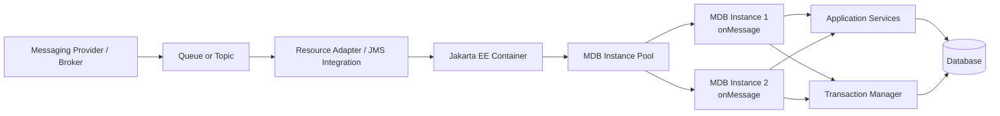
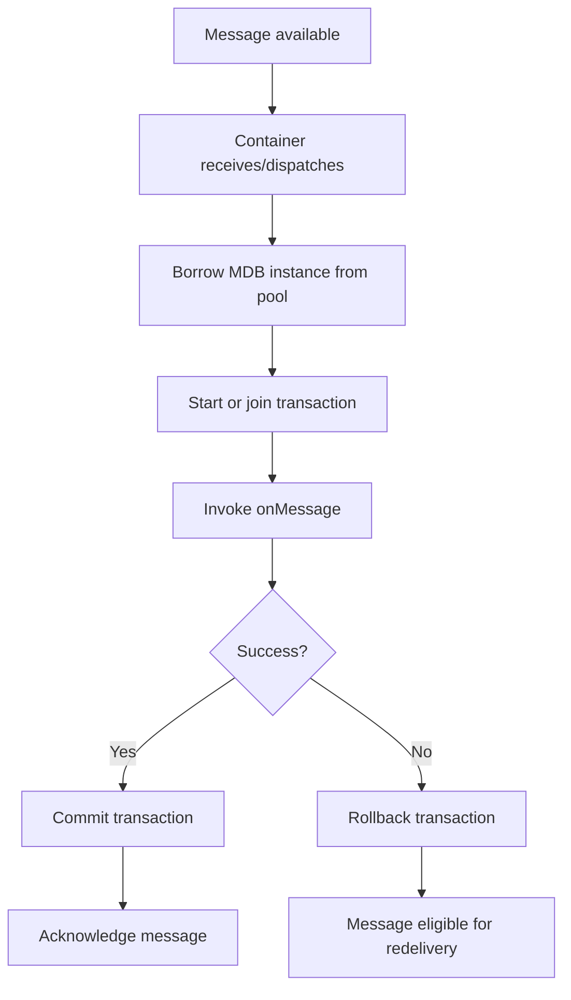
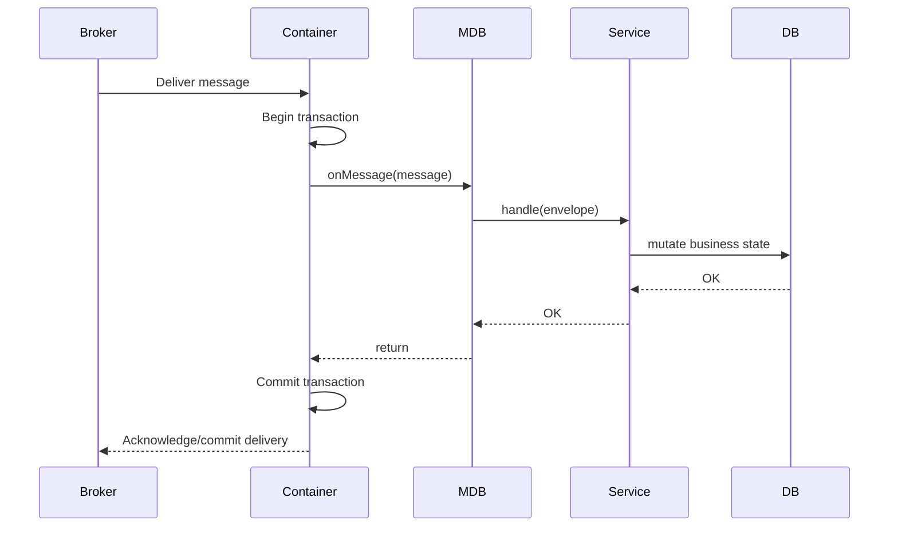
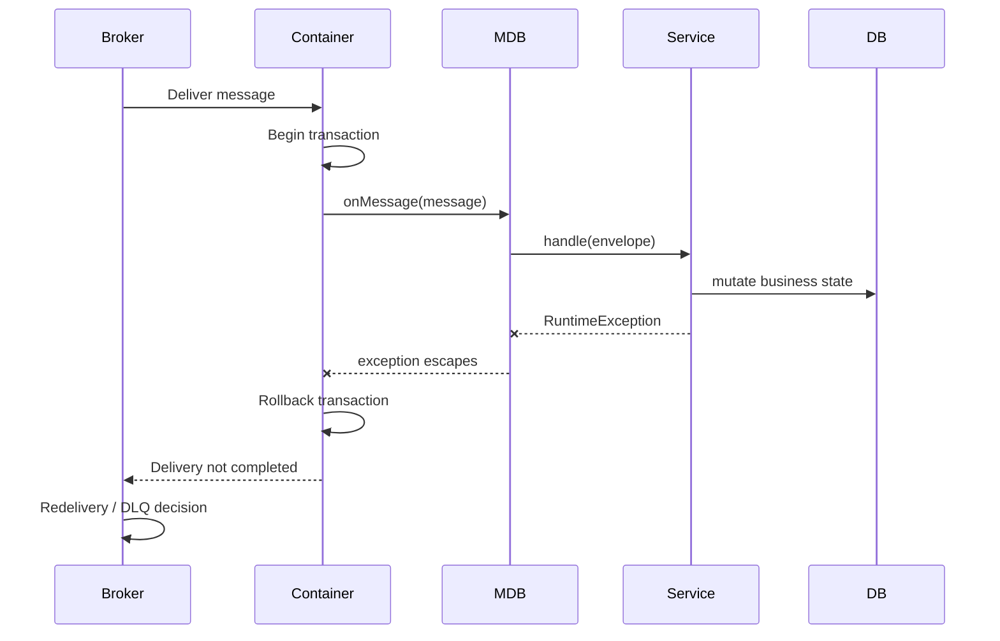
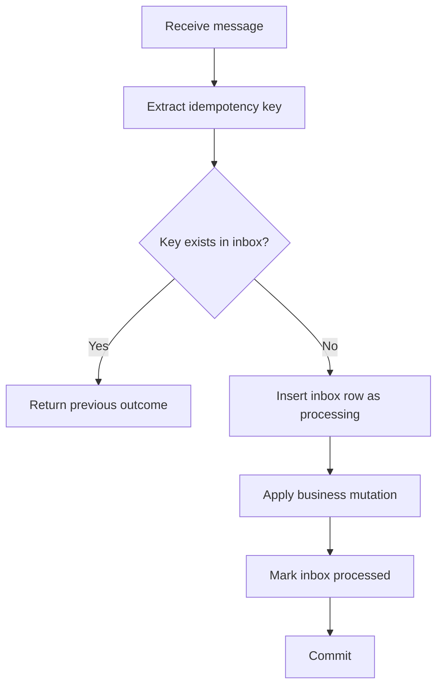
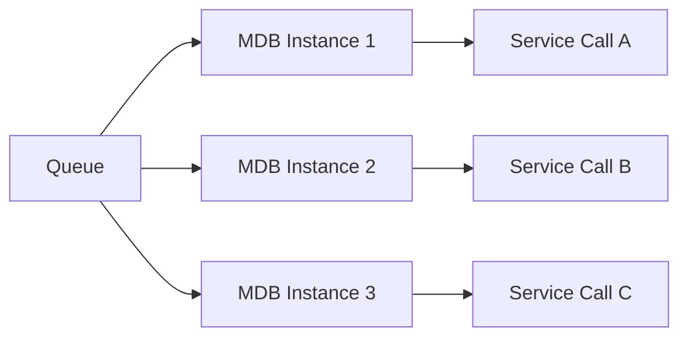
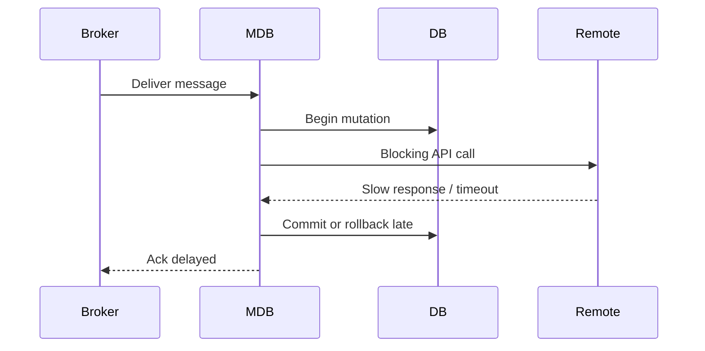
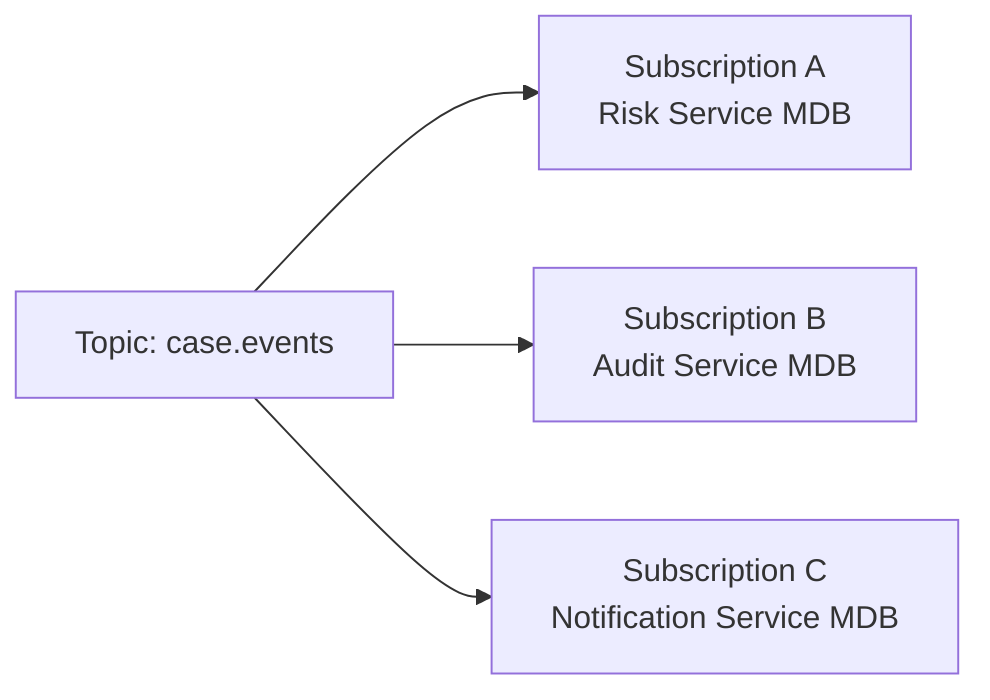
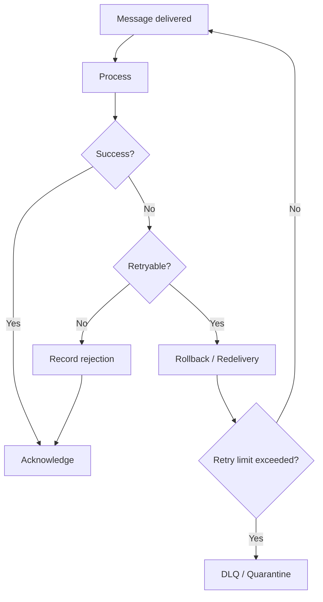

------
title: Learn Java Messaging and Event Streaming - Part 007
description: Message-driven architecture with Jakarta Messaging/JMS in Jakarta EE: MDB lifecycle, container-managed concurrency, transaction boundaries, listener design, operational invariants, and production anti-patterns.
series: learn-java-messaging-event-streaming
seriesTitle: Learn Java Messaging and Event Streaming
order: 7
partTitle: JMS Message-Driven Architecture in Jakarta EE
tags:
- java
- jakarta-ee
- jakarta-messaging
- jms
- message-driven-bean
- mdb
- enterprise-integration
- distributed-systems
date: 2026-06-28
---

# Part 007 — JMS Message-Driven Architecture in Jakarta EE

## 1. Why This Part Exists

In Part 005, we treated Jakarta Messaging/JMS as an API contract. In Part 006, we focused on session, acknowledgement, transaction, and redelivery. This part moves one layer up: **message-driven architecture inside Jakarta EE**.

The most important abstraction here is the **message-driven bean** or **MDB**.

An MDB is not merely a class with `onMessage`. It is a container-managed asynchronous endpoint. The application server controls its lifecycle, pooling, transactions, dependency injection, and message delivery integration with the messaging provider.

That power creates a trap: MDBs make asynchronous processing look deceptively simple. Production systems fail when engineers treat MDBs as normal method calls and forget that every invocation is a distributed event with redelivery, concurrency, ordering, poison-message, transaction, and observability consequences.

This part gives you the mental model needed to use MDBs deliberately.

## 2. Kaufman Framing: The Subskills

Following the *First 20 Hours* style, we deconstruct message-driven architecture into small practice units.

| Subskill | What You Need To Be Able To Do |
|---|---|
| Endpoint modelling | Decide whether an MDB should exist at all, and what message type it owns. |
| Transaction boundary design | Know exactly when message acknowledgement/commit happens relative to business state mutation. |
| Concurrency control | Predict how many messages can be processed concurrently and what ordering guarantees are lost. |
| Failure classification | Separate retryable technical failures, non-retryable business rejections, poison messages, and code defects. |
| Idempotent handling | Make redelivery safe without pretending duplicates will not happen. |
| Operational design | Expose enough metrics, logs, correlation, and DLQ behaviour to debug production incidents. |

The goal is not to memorise MDB annotations. The goal is to answer:

> “If this message is delivered twice, processed concurrently, fails after a database write, or blocks on a downstream dependency, what exactly happens?”

## 3. MDB in One Mental Model

A message-driven bean is a **container-owned consumer endpoint**.

The application code supplies business handling logic. The container supplies the runtime shell.



The MDB itself is not pulling messages with a visible `while(true) receive()`. Instead:

1. the broker has messages in a destination,
2. the container receives messages through configured integration,
3. the container selects an MDB instance from a pool,
4. the container invokes `onMessage`,
5. the transaction outcome determines acknowledgement/commit/rollback behaviour,
6. failures may trigger redelivery or dead-letter handling depending on provider configuration.

The runtime is not just Java code. It is a contract across:

- Jakarta Messaging,
- Jakarta Enterprise Beans / Jakarta EE container,
- transaction manager,
- resource adapter,
- messaging provider,
- application business services.

## 4. Minimal MDB Example

A typical MDB consumes messages from a queue and delegates immediately to a domain service.

```java
package com.acme.enforcement.messaging;

import jakarta.ejb.ActivationConfigProperty;
import jakarta.ejb.MessageDriven;
import jakarta.inject.Inject;
import jakarta.jms.JMSException;
import jakarta.jms.Message;
import jakarta.jms.MessageListener;
import jakarta.jms.TextMessage;

@MessageDriven(
    activationConfig = {
        @ActivationConfigProperty(
            propertyName = "destinationLookup",
            propertyValue = "jms/queue/CaseEventQueue"
        ),
        @ActivationConfigProperty(
            propertyName = "destinationType",
            propertyValue = "jakarta.jms.Queue"
        )
    }
)
public class CaseEventConsumer implements MessageListener {

    @Inject
    CaseEventApplicationService service;

    @Override
    public void onMessage(Message message) {
        try {
            if (!(message instanceof TextMessage textMessage)) {
                throw new NonRetryableMessageException("Expected TextMessage");
            }

            String payload = textMessage.getText();
            String eventId = message.getStringProperty("eventId");
            String correlationId = message.getJMSCorrelationID();

            service.handleCaseEvent(eventId, correlationId, payload);
        } catch (JMSException e) {
            throw new MessageInfrastructureException("Failed to read JMS message", e);
        }
    }
}
```

This example is intentionally simple, but production interpretation must be strict:

- `onMessage` is invoked by the container, not by your code.
- Throwing a runtime exception usually marks the container-managed transaction for rollback.
- Rollback usually makes the message eligible for redelivery.
- Redelivery can produce duplicates.
- Multiple MDB instances may run concurrently.
- There is no automatic business idempotency.
- Provider-specific activation properties may vary.

## 5. MDB Is an Endpoint, Not a Domain Service

A useful design rule:

> MDB code should be a thin adapter from message world into application world.

The MDB should usually do five things:

1. read headers/properties/body,
2. validate the technical envelope,
3. extract idempotency/correlation metadata,
4. call an application service,
5. map exceptions to retry or non-retry behaviour.

It should not contain the full business workflow.

Bad shape:

```java
@MessageDriven(...)
public class EnforcementConsumer implements MessageListener {
    public void onMessage(Message message) {
        // parses JSON
        // validates case state
        // queries ten tables
        // calculates escalation
        // sends email
        // calls remote service
        // updates database
        // publishes another message
        // handles retry logic inline
        // logs partial details
    }
}
```

Better shape:

```java
@MessageDriven(...)
public class EnforcementConsumer implements MessageListener {

    @Inject
    MessageEnvelopeReader envelopeReader;

    @Inject
    EnforcementEventHandler handler;

    @Override
    public void onMessage(Message message) {
        EnforcementEnvelope envelope = envelopeReader.read(message);
        handler.handle(envelope);
    }
}
```

This keeps the MDB as an adapter. The domain service can then be tested without a JMS container.

## 6. Container-Managed Lifecycle

With MDBs, you normally do not construct consumers manually. The container manages:

- instance creation,
- dependency injection,
- pooling,
- transaction demarcation,
- security context,
- resource adapter integration,
- lifecycle callbacks,
- message dispatch.

This changes the design pressure.

In a normal Java SE consumer, you often write:

```java
while (running) {
    Message message = consumer.receive();
    process(message);
    session.commit();
}
```

In an MDB, the equivalent control loop is outside your code:



This is convenient, but it also hides critical operational behaviour. Therefore every MDB design should explicitly document:

- destination name,
- expected payload schema,
- idempotency key,
- transaction boundary,
- retry policy,
- maximum processing time,
- concurrency policy,
- DLQ policy,
- monitoring signals.

## 7. Transaction Boundary in MDBs

MDBs commonly use **container-managed transactions**.

In a container-managed transaction, the high-level path is:



When `onMessage` throws an unchecked exception:



The exact mechanics depend on provider and container integration, but the architectural invariant is:

> Returning normally means “I have successfully handled this message according to this endpoint's contract.”

Do not return normally if the message should be retried.

Do not throw endlessly for messages that can never succeed.

## 8. The Three Outcomes of Message Handling

A robust MDB does not think in terms of “success or exception”. It thinks in terms of three outcomes.

| Outcome | Meaning | Recommended Behaviour |
|---|---|---|
| Processed | Message was valid and business state was handled. | Return normally; commit. |
| Rejected permanently | Message is invalid, unsupported, obsolete, or violates a non-retryable business invariant. | Record rejection; route to quarantine/DLQ if possible; return normally only after durable rejection is recorded. |
| Failed transiently | Dependency, database, broker, network, lock, timeout, or capacity problem may recover. | Throw/rollback so redelivery or retry policy can apply. |

The hardest category is **rejected permanently**.

If you throw for a permanently invalid message, it may redeliver forever until DLQ threshold. If you return normally without recording why it was rejected, you lose auditability. In regulated systems, the correct path is usually:

1. validate message envelope,
2. classify the failure,
3. persist rejection/quarantine record,
4. emit an operational metric,
5. acknowledge the original message,
6. enable later manual or automated replay after correction.

## 9. Exception Mapping Pattern

A production MDB should map exceptions intentionally.

```java
@Override
public void onMessage(Message message) {
    EnforcementEnvelope envelope = null;

    try {
        envelope = envelopeReader.read(message);
        handler.handle(envelope);
    } catch (InvalidEnvelopeException e) {
        // Non-retryable: malformed message, missing required metadata, bad schema version.
        rejectionService.recordInvalidMessage(message, e);
        // Return normally after durable rejection record.
    } catch (BusinessRejectionException e) {
        // Non-retryable business result: case closed, invalid transition, unsupported command.
        rejectionService.recordBusinessRejection(envelope, e);
        // Return normally if rejection is the intended terminal outcome.
    } catch (TransientDependencyException e) {
        // Retryable: DB unavailable, remote dependency unavailable, lock timeout, broker issue.
        throw e;
    } catch (RuntimeException e) {
        // Unknown defect: prefer rollback, alert, and let retry/DLQ reveal the defect.
        throw e;
    }
}
```

The important detail is not the exact class names. The important detail is that **exception type communicates delivery intent**.

## 10. Idempotency Is Not Optional

MDBs process messages asynchronously and may redeliver messages. Therefore the handler must be idempotent at the business boundary.

A typical idempotency flow:



Example service boundary:

```java
public void handle(EnforcementEnvelope envelope) {
    inboxService.runOnce(envelope.eventId(), () -> {
        CaseAggregate aggregate = caseRepository.load(envelope.caseId());
        aggregate.apply(envelope.event());
        caseRepository.save(aggregate);
    });
}
```

The MDB should not attempt to solve idempotency with an in-memory `Set`.

That fails under:

- restart,
- multiple nodes,
- redelivery after failover,
- concurrent delivery,
- database commit uncertainty,
- replay.

## 11. Ordering and MDB Concurrency

MDBs often run from a pool. That means more than one message may be processed at the same time.



This increases throughput but weakens assumptions about ordering.

If your business logic requires strict ordering per entity, the design needs an ordering key strategy. JMS queues do not provide the same partition-key model as Kafka. Provider-specific features may exist, but they are not portable Jakarta Messaging semantics.

Design options:

| Requirement | Possible Design |
|---|---|
| Global strict ordering | Single consumer / low concurrency; usually poor throughput. |
| Per-case ordering | Route by case ID to specific queue/shard, or enforce optimistic version checks in database. |
| Best-effort ordering | Concurrent MDB pool with idempotency and version-tolerant handlers. |
| Out-of-order tolerance | Event handlers are commutative or ignore stale versions. |

In regulatory case-management systems, per-case ordering is often more important than global ordering. A common invariant is:

> Events for the same case must not produce an impossible state transition, even if delivered concurrently or out of order.

That invariant is usually enforced in the database/domain model, not only in the broker.

## 12. MDB and Database Transaction Coupling

The seductive idea is:

> “The message and database update are in one transaction, so we are safe.”

Sometimes, yes. Often, not fully.

If the MDB uses container-managed transaction and the database resource participates in the same transaction, then message acknowledgement and database commit may be coordinated by the transaction manager. But this becomes provider/container/resource dependent and may involve XA/JTA behaviour.

The practical design question is:

> What happens if the database commits but the message acknowledgement outcome is uncertain?

You still need idempotency, because distributed commit uncertainty can produce duplicates.

A safer mindset:

- Use transactions to reduce inconsistency windows.
- Use idempotency to survive uncertainty.
- Use audit/inbox tables to make processing reconstructable.
- Use DLQ/quarantine to isolate poison inputs.

## 13. Avoid Remote Calls Inside the Transaction Unless Intentional

A common production problem is holding a message transaction open while calling slow remote services.



Problems:

- MDB thread is blocked.
- Broker may consider consumer slow.
- Transaction timeout may occur.
- Locks may be held longer.
- Duplicate/redelivery risk increases.
- Throughput collapses under dependency latency.

Better options:

| Situation | Better Design |
|---|---|
| Remote call is not part of core state transition | Persist intent, commit, process remote side effect asynchronously. |
| Remote call must happen before state change | Use timeout, circuit breaker, bounded retry, and small concurrency. |
| Remote call is another internal async service | Prefer message choreography over synchronous call. |
| Remote side effect must be exactly-once-like | Use outbox, idempotency key, and reconciliation. |

## 14. Topic Consumption with MDBs

MDBs can consume from topics as well as queues, but the semantics differ.

Queue consumption usually means competing consumers: one message is handled by one consumer instance.

Topic consumption usually means publish/subscribe: each subscription receives a copy.



Important design concerns:

- Is the subscription durable or non-durable?
- Is it shared by multiple MDB instances?
- What happens while the service is down?
- How are duplicates handled?
- What is the subscription identity?
- How are schema changes rolled out to all subscribers?

Do not use a topic just because “many services might care”. Use a topic when independent consumers need independent delivery lifecycles.

## 15. Activation Configuration Is Part of Architecture

The `activationConfig` is not decoration. It is part of the endpoint contract.

Example:

```java
@MessageDriven(
    activationConfig = {
        @ActivationConfigProperty(
            propertyName = "destinationLookup",
            propertyValue = "jms/queue/CaseEventQueue"
        ),
        @ActivationConfigProperty(
            propertyName = "destinationType",
            propertyValue = "jakarta.jms.Queue"
        )
    }
)
public class CaseEventConsumer implements MessageListener {
    // ...
}
```

Portable properties are limited. Containers and providers often add their own activation properties for concurrency, redelivery, subscription durability, client ID, or destination resolution.

Therefore document:

| Config | Why It Matters |
|---|---|
| destinationLookup | Binds endpoint to a concrete queue/topic. |
| destinationType | Queue vs topic delivery semantics. |
| subscription identity | Determines durable topic consumption identity. |
| max sessions / concurrency | Controls throughput and ordering. |
| redelivery policy | Controls retry storm vs DLQ movement. |
| transaction type | Controls commit/rollback and acknowledgement relationship. |

If this configuration only lives in app-server admin UI and is not versioned, your architecture is incomplete.

## 16. Message Envelope for MDB Endpoints

A production endpoint should expect a stable envelope.

Example JSON body:

```json
{
  "eventId": "evt-2026-000001",
  "eventType": "CaseEscalated",
  "schemaVersion": 3,
  "occurredAt": "2026-06-28T10:15:30Z",
  "producer": "case-service",
  "caseId": "CASE-123",
  "payload": {
    "fromStatus": "UNDER_REVIEW",
    "toStatus": "ESCALATED",
    "reasonCode": "HIGH_RISK_ENTITY"
  }
}
```

Recommended JMS metadata:

| Field | Recommended Use |
|---|---|
| `JMSCorrelationID` | Cross-message causality or request/reply correlation. |
| `JMSMessageID` | Provider-assigned delivery identifier; useful for diagnostics but not stable business ID. |
| `JMSRedelivered` | Signal that this delivery may be a retry. Do not use as sole correctness logic. |
| `JMSReplyTo` | Only for request-reply patterns. |
| custom `eventId` property | Idempotency and deduplication. |
| custom `traceparent` property | Distributed trace propagation. |
| custom `schemaVersion` property | Fast compatibility checks. |

A message without an idempotency key is not production-ready.

## 17. Redelivery-Aware Handler Design

`JMSRedelivered` is useful, but it is not a complete retry count. Providers often expose delivery count through provider-specific properties.

A robust design uses layered signals:

1. `JMSRedelivered` for coarse redelivery awareness,
2. provider delivery-count property if available,
3. inbox table for actual business processing status,
4. DLQ/quarantine for terminal failures,
5. operational metrics for redelivery rate.

Example:

```java
boolean redelivered = message.getJMSRedelivered();
String eventId = message.getStringProperty("eventId");

log.info("Handling JMS message eventId={}, redelivered={}", eventId, redelivered);
```

Do not write logic like:

```java
if (message.getJMSRedelivered()) {
    return; // Dangerous: this may silently drop a valid retry.
}
```

A redelivered message may be the first delivery that can actually complete after a transient failure.

## 18. Poison Message Handling

A poison message is a message that repeatedly fails processing and blocks progress or wastes capacity.

Common causes:

- invalid schema,
- unsupported event type,
- missing required property,
- impossible business transition,
- deserialization defect,
- handler bug,
- stale domain reference,
- payload too large,
- external dependency always rejects it.

A production design needs a terminal path.



The endpoint owner should define:

- maximum redeliveries,
- redelivery delay/backoff,
- DLQ destination,
- quarantine schema,
- operational alert threshold,
- replay procedure,
- ownership of manual correction.

## 19. MDB Observability Checklist

An MDB endpoint must be observable as a distributed processing unit.

Minimum logs per message:

| Field | Why |
|---|---|
| eventId / message key | Deduplication and replay lookup. |
| JMSMessageID | Provider-side delivery lookup. |
| JMSCorrelationID | Cross-service trace. |
| destination | Endpoint identity. |
| handler outcome | Processed, rejected, retryable failure. |
| duration | Latency and saturation detection. |
| redelivered | Retry signal. |
| schemaVersion | Compatibility debugging. |

Minimum metrics:

| Metric | Failure It Reveals |
|---|---|
| consumed count | Traffic baseline. |
| success count | Processing throughput. |
| retryable failure count | Dependency or defect pressure. |
| non-retryable rejection count | Producer contract quality. |
| processing latency | Slow handler or dependency. |
| redelivery rate | Retry storm or poison message. |
| DLQ count | Terminal failure accumulation. |
| active MDB count | Concurrency and saturation. |

Example log shape:

```java
log.info(
    "case-event consumed eventId={} correlationId={} messageId={} redelivered={} outcome={} durationMs={}",
    eventId,
    correlationId,
    messageId,
    redelivered,
    outcome,
    durationMs
);
```

## 20. MDB Contract Template

For every MDB, create a small endpoint contract document.

```md
# Endpoint: CaseEventConsumer

Destination: jms/queue/CaseEventQueue
Destination type: Queue
Payload type: JSON TextMessage
Schema: CaseEventEnvelope v3
Idempotency key: eventId
Correlation: JMSCorrelationID + traceparent
Transaction: container-managed
Concurrency: max 8 instances
Ordering: not guaranteed globally; guarded by case version check
Retryable failures: DB timeout, optimistic lock retry, temporary dependency unavailable
Non-retryable failures: invalid schema, unknown event type, invalid terminal state
DLQ: jms/queue/CaseEventDLQ
Replay owner: Case Platform Team
SLO: p95 processing latency < 500 ms under normal load
```

This is not bureaucracy. It is the difference between an understandable endpoint and a mysterious black box.

## 21. MDB Testing Strategy

MDBs need multiple layers of tests.

| Test Type | Purpose |
|---|---|
| Pure unit test | Test envelope parsing and handler exception mapping without container. |
| Application service test | Test idempotency, domain transition, and database behaviour. |
| Integration test | Verify destination, serialization, transaction, and redelivery with a real provider/container where possible. |
| Failure test | Force exceptions and confirm redelivery/DLQ behaviour. |
| Load test | Validate concurrency, latency, DB lock contention, and broker backlog behaviour. |

A good test does not only assert happy path. It asserts the message lifecycle:

- valid message is processed once,
- duplicate message is safe,
- malformed message is quarantined,
- transient failure retries,
- poison message stops blocking the main flow,
- slow dependency does not collapse the pool.

## 22. Common Anti-Patterns

### 22.1 Fat MDB

Putting all business logic inside `onMessage` makes the endpoint hard to test and hard to evolve.

Better: keep MDB as an adapter and delegate.

### 22.2 Hidden RPC Over MDB

Using MDBs to simulate synchronous RPC often leads to blocked threads, timeouts, and unclear failure semantics.

Better: use asynchronous workflow or bounded request-reply only when the caller truly needs a reply.

### 22.3 No Idempotency Key

Without an idempotency key, redelivery becomes dangerous.

Better: require `eventId`, `commandId`, or another stable operation ID.

### 22.4 Returning Normally After Partial Failure

If a handler writes partial state, catches the exception, logs it, and returns normally, the broker believes the message is handled.

Better: rollback retryable failures or persist a terminal rejection record.

### 22.5 Throwing Forever for Bad Messages

Invalid payloads do not become valid after 100 retries.

Better: classify as non-retryable, record, quarantine, and acknowledge.

### 22.6 Relying on Global Ordering

MDB pooling can process messages concurrently.

Better: enforce ordering at routing, sharding, or domain version level.

### 22.7 ObjectMessage for Cross-Service Integration

`ObjectMessage` couples producer and consumer to Java class serialization and classpath compatibility.

Better: use explicit schema formats such as JSON, Avro, or Protobuf depending on ecosystem constraints.

### 22.8 Provider Configuration Hidden from Source Control

If redelivery, DLQ, or concurrency settings exist only in an admin console, behaviour changes without code review.

Better: version configuration and include it in deployment manifests/runbooks.

## 23. Decision Heuristics

Use an MDB when:

- the application already runs in Jakarta EE,
- container-managed transactions and injection are useful,
- message consumption is naturally tied to application services,
- operational team understands the provider/container integration,
- concurrency and redelivery semantics are documented.

Avoid or reconsider MDB when:

- you need custom partition assignment,
- you need explicit poll-loop control,
- you need Kafka-style offset management,
- you need high-volume stream processing,
- you need long-running workflow orchestration,
- you need portable behaviour across many brokers beyond JMS baseline.

MDBs are strong for enterprise message consumption. They are not a universal event-streaming runtime.

## 24. Production Readiness Rubric

Before approving an MDB endpoint, ask:

| Question | Required Answer |
|---|---|
| What destination does it consume? | Named queue/topic and environment mapping. |
| What payload schema does it expect? | Versioned schema and compatibility rule. |
| What is the idempotency key? | Stable business operation/message ID. |
| What happens on duplicate delivery? | Safe no-op or same result. |
| What happens on invalid payload? | Durable rejection/quarantine. |
| What happens on transient failure? | Rollback/retry with bounded policy. |
| What happens after repeated failure? | DLQ/quarantine and alert. |
| Is ordering required? | Explicit guarantee or mitigation. |
| What is the transaction boundary? | Message + DB + side effects documented. |
| How is it observed? | Logs, metrics, trace, dashboard, alert. |

If any answer is “the container handles it”, the design is incomplete.

## 25. Mini Exercise

Design an MDB endpoint for `CaseEscalated` events.

Constraints:

- payload is `TextMessage` with JSON body,
- idempotency key is `eventId`,
- one case may receive multiple events close together,
- invalid state transition must not retry forever,
- database timeout should retry,
- duplicate message should not create duplicate escalation record,
- every rejected message must be auditable.

Deliverables:

1. endpoint contract,
2. exception mapping table,
3. idempotency table schema,
4. DLQ/quarantine rule,
5. Mermaid sequence diagram for success and failure.

## 26. Key Takeaways

- An MDB is a **container-managed asynchronous endpoint**, not a normal service method.
- The container hides the receive loop, transaction boundary, pooling, and dispatch mechanics.
- Redelivery and duplicates must be treated as normal, not exceptional.
- Returning normally means the endpoint accepts responsibility for the message outcome.
- Throwing means retry/rollback intent, so do not throw forever for non-retryable messages.
- MDB concurrency improves throughput but can break ordering assumptions.
- Production MDBs require explicit endpoint contracts, idempotency, DLQ/quarantine, and observability.

## 27. Source Anchors

This part is grounded in the Jakarta EE/Jakarta Messaging model and official tutorial/API documentation:

- Jakarta Messaging specification and API documentation: `https://jakarta.ee/specifications/messaging/`
- Jakarta Messaging package documentation: `https://jakarta.ee/specifications/messaging/3.1/apidocs/jakarta.messaging/jakarta/jms/package-summary`
- Jakarta EE Tutorial, messaging examples: `https://jakarta.ee/learn/docs/jakartaee-tutorial/current/messaging/jms-examples/jms-examples.html`
- Jakarta EE Tutorial, enterprise beans and MDB concept: `https://jakarta.ee/learn/docs/jakartaee-tutorial/current/entbeans/ejb-intro/ejb-intro.html`

