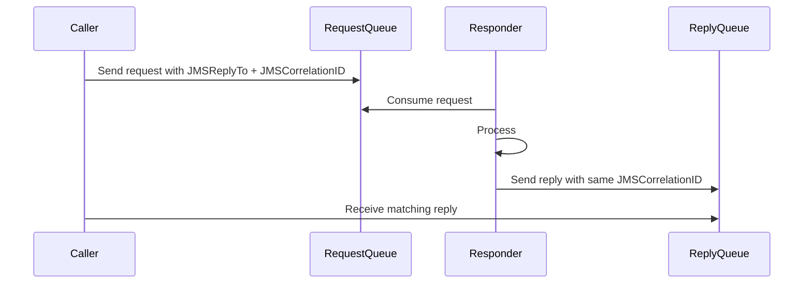
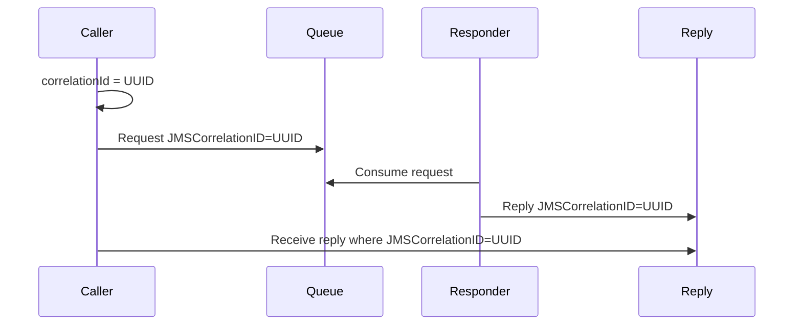
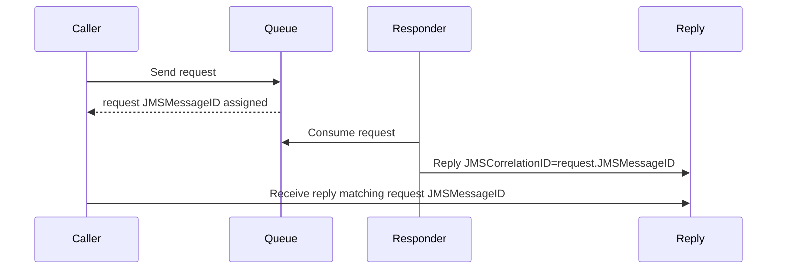
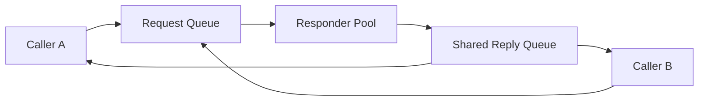
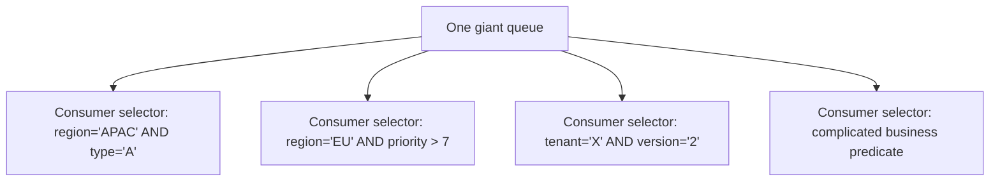
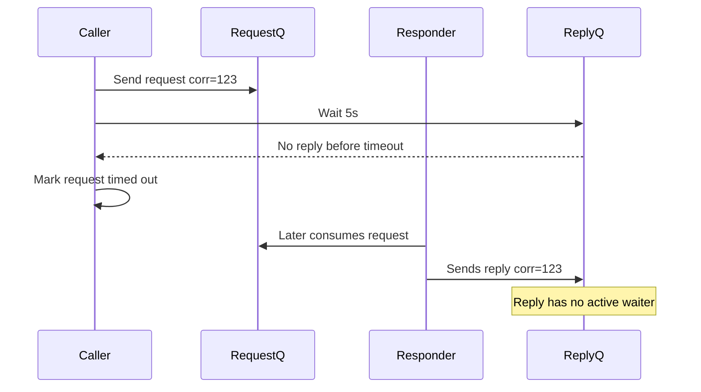
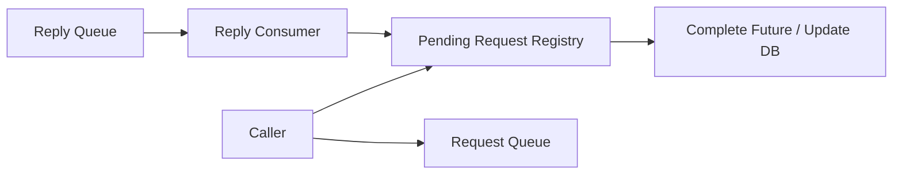
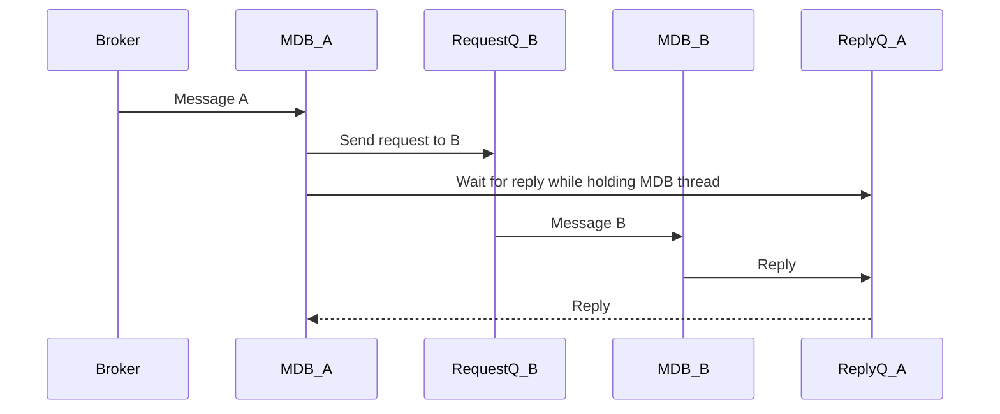
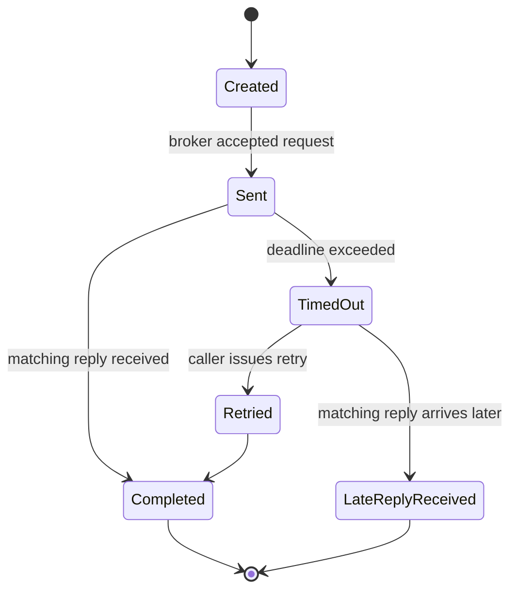
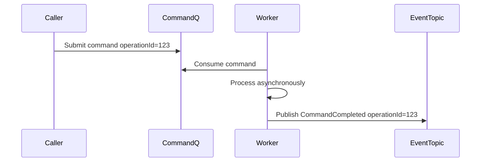

------
title: Learn Java Messaging and Event Streaming - Part 008
description: Deep dive into JMS request-reply, correlation IDs, JMSReplyTo, temporary destinations, selectors, timeout handling, orphan replies, and anti-patterns in synchronous-over-asynchronous messaging.
series: learn-java-messaging-event-streaming
seriesTitle: Learn Java Messaging and Event Streaming
order: 8
partTitle: JMS Request-Reply, Correlation, Selectors, and Temporary Destinations
tags:
- java
- jakarta-messaging
- jms
- request-reply
- correlation-id
- temporary-queue
- message-selector
- distributed-systems
date: 2026-06-28
---

# Part 008 — JMS Request-Reply, Correlation, Selectors, and Temporary Destinations

## 1. Why This Part Exists

Messaging is usually introduced as asynchronous communication. Yet enterprise systems often need a response:

- “Validate this case and tell me whether it can proceed.”
- “Calculate risk score and return the result.”
- “Reserve this external reference and return the reservation ID.”
- “Submit this command and tell me accepted/rejected.”

In JMS/Jakarta Messaging, this is commonly implemented with **request-reply** using:

- `JMSReplyTo`,
- `JMSCorrelationID`,
- temporary destinations,
- shared reply queues,
- message selectors,
- receive timeout.

This is powerful, but dangerous. Request-reply over messaging can quietly become a slower, harder-to-debug version of RPC. The main skill is knowing where it is appropriate and where it creates false confidence.

## 2. Kaufman Framing: The Subskills

To become effective, break request-reply into small units.

| Subskill | What You Must Be Able To Do |
|---|---|
| Correlation design | Match replies to requests without ambiguity or collision. |
| Reply routing | Choose temporary destination, per-client reply queue, or shared reply queue. |
| Timeout design | Treat timeout as unknown outcome, not guaranteed failure. |
| Selector design | Use selectors surgically without turning the broker into a query engine. |
| Orphan reply handling | Decide what happens when the reply arrives after the requester gave up. |
| Failure modelling | Predict duplicate replies, lost replies, stale replies, and responder rollback. |

The goal is to be able to say:

> “This is a bounded synchronous interaction over an asynchronous substrate, and here is the exact behaviour when either side times out, retries, crashes, or replies twice.”

## 3. Request-Reply Is RPC-Shaped, Not RPC-Safe

A simple request-reply flow:



This resembles RPC, but it differs in important ways:

| Concern | HTTP/RPC Mental Model | JMS Request-Reply Reality |
|---|---|---|
| Call path | Caller holds connection to responder. | Caller sends message to broker; responder consumes later. |
| Timeout | Often treated as request failure. | Timeout means unknown outcome. |
| Correlation | Connection/request context often implicit. | Must be explicit in message metadata. |
| Duplicate handling | Usually hidden or not expected. | Must be expected. |
| Load buffering | Usually limited by server/thread pool. | Broker can accumulate requests. |
| Reply routing | Response returns on same protocol exchange. | Reply destination must be specified. |

The first engineering correction:

> A timed-out request may still be processed successfully later.

That single sentence changes how you design retries, idempotency, and user feedback.

## 4. Core JMS Fields

Request-reply normally relies on these message fields.

| JMS Field | Role |
|---|---|
| `JMSReplyTo` | Destination where responder should send the reply. |
| `JMSCorrelationID` | Identifier used to match reply to request. |
| `JMSMessageID` | Provider-assigned message ID after send. Useful for diagnostics or legacy correlation style. |
| `JMSType` | Optional message type classification. |
| message properties | Application metadata such as `requestType`, `tenantId`, `schemaVersion`, `traceparent`. |

Important distinction:

- `JMSMessageID` is provider-assigned.
- `JMSCorrelationID` should usually be application-assigned for request-reply.

Using an application-generated correlation ID avoids awkward timing and makes correlation independent of provider-assigned IDs.

## 5. Two Correlation Patterns

### 5.1 Application Correlation ID Pattern

The caller generates a correlation ID before sending.



Recommended for most new systems.

Advantages:

- ID exists before sending.
- Can be logged before and after send.
- Can be reused in application state.
- Works across bridges and adapters more predictably.
- Fits distributed tracing and idempotency design.

### 5.2 Message ID Correlation Pattern

The responder sets reply `JMSCorrelationID` equal to request `JMSMessageID`.



This appears in older enterprise integration patterns. It can work, but application-generated correlation IDs are often simpler and more explicit.

## 6. Temporary Queue Pattern

A `TemporaryQueue` is a system-defined queue created for the duration of a connection. It can be consumed only by the connection that created it.

This makes it useful for simple request-reply clients.

```java
public RiskReply requestRiskScore(String caseId) {
    try (JMSContext context = connectionFactory.createContext(JMSContext.AUTO_ACKNOWLEDGE)) {
        Queue requestQueue = context.createQueue("jms/queue/RiskRequestQueue");
        TemporaryQueue replyQueue = context.createTemporaryQueue();

        String correlationId = UUID.randomUUID().toString();

        TextMessage request = context.createTextMessage("{\"caseId\":\"" + caseId + "\"}");
        request.setJMSReplyTo(replyQueue);
        request.setJMSCorrelationID(correlationId);
        request.setStringProperty("requestType", "RiskScoreRequest");
        request.setStringProperty("schemaVersion", "1");

        context.createProducer().send(requestQueue, request);

        String selector = "JMSCorrelationID = '" + correlationId.replace("'", "''") + "'";
        Message reply = context.createConsumer(replyQueue, selector).receive(5_000);

        if (reply == null) {
            throw new RequestTimeoutException("Risk score request timed out: " + correlationId);
        }

        if (!(reply instanceof TextMessage textReply)) {
            throw new InvalidReplyException("Expected TextMessage reply: " + correlationId);
        }

        return RiskReply.fromJson(textReply.getText());
    } catch (JMSException e) {
        throw new MessagingRequestException("Risk request failed", e);
    }
}
```

This is easy to understand, but it has trade-offs.

| Strength | Weakness |
|---|---|
| Simple lifecycle. | Temporary destination creation can be expensive at high volume. |
| Reply queue is private to caller connection. | Reply disappears if connection closes. |
| Low risk of another client stealing reply. | Not ideal for clustered stateless services with many short-lived requests. |
| Useful for tools and bounded internal calls. | Can create pressure if used per request at high throughput. |

Temporary queues are best for controlled, bounded request-reply—not as the default architecture for high-volume service-to-service interaction.

## 7. Responder Pattern

The responder receives the request, processes it, and sends a reply to `JMSReplyTo`.

```java
@MessageDriven(
    activationConfig = {
        @ActivationConfigProperty(
            propertyName = "destinationLookup",
            propertyValue = "jms/queue/RiskRequestQueue"
        ),
        @ActivationConfigProperty(
            propertyName = "destinationType",
            propertyValue = "jakarta.jms.Queue"
        )
    }
)
public class RiskRequestResponder implements MessageListener {

    @Inject
    JMSContext context;

    @Inject
    RiskScoringService riskScoringService;

    @Override
    public void onMessage(Message request) {
        try {
            Destination replyTo = request.getJMSReplyTo();
            if (replyTo == null) {
                throw new NonRetryableMessageException("Request missing JMSReplyTo");
            }

            String correlationId = request.getJMSCorrelationID();
            if (correlationId == null || correlationId.isBlank()) {
                correlationId = request.getJMSMessageID();
            }

            RiskScore score = riskScoringService.score(readCaseId(request));

            TextMessage reply = context.createTextMessage(score.toJson());
            reply.setJMSCorrelationID(correlationId);
            reply.setStringProperty("replyType", "RiskScoreReply");
            reply.setStringProperty("schemaVersion", "1");

            context.createProducer().send(replyTo, reply);
        } catch (JMSException e) {
            throw new MessagingRequestException("Could not create risk reply", e);
        }
    }
}
```

Critical rule:

> The responder must copy the correlation identity into the reply.

If it forgets, the requester may receive a message but be unable to match it to the pending request.

## 8. Shared Reply Queue Pattern

For long-running services, a shared reply queue can be better than temporary queues.



Since many callers share the same reply queue, each caller must filter its reply using correlation.

```java
String selector = "JMSCorrelationID = '" + correlationId.replace("'", "''") + "'";
Message reply = context.createConsumer(sharedReplyQueue, selector).receive(5_000);
```

Advantages:

- fewer temporary destinations,
- reply destination can be preconfigured and monitored,
- easier operational visibility,
- works better with stable service instances.

Risks:

- selector overhead,
- reply buildup from timed-out callers,
- incorrect correlation causing reply theft or orphan replies,
- many consumers with selectors can be costly depending on provider,
- one shared queue becomes an operational hotspot.

## 9. Message Selectors

A JMS message selector is a broker-side filter expression used by consumers. Selectors operate on message headers and properties, not on arbitrary message body content.

Typical selector:

```java
String selector = "requestType = 'RiskScoreRequest' AND schemaVersion = '1'";
JMSConsumer consumer = context.createConsumer(queue, selector);
```

Correlation selector:

```java
String selector = "JMSCorrelationID = '" + correlationId.replace("'", "''") + "'";
```

Selectors are useful when:

- a reply queue is shared,
- a consumer only wants certain message types,
- routing cannot be changed easily,
- transitional compatibility requires filtering.

Selectors are dangerous when used as a substitute for topology design.

Bad selector-driven topology:



This often creates:

- broker CPU cost,
- unread messages stuck behind selectors,
- invisible routing rules,
- hard-to-debug starvation,
- poor operational ownership.

Better:

- use explicit destinations for major ownership boundaries,
- use routing keys/exchanges in RabbitMQ-style systems,
- use topics/partitions in log-based systems,
- reserve JMS selectors for narrow cases.

## 10. Timeout Semantics

The most important request-reply rule:

> Timeout does not mean the responder did not process the request.

It only means the requester did not receive a matching reply before its deadline.

Possible realities after timeout:

| Reality | What Happened |
|---|---|
| Request never reached broker | Send failed before broker accepted it. |
| Request reached broker but no responder consumed it yet | Backlog or responder down. |
| Responder consumed and is still processing | Slow dependency or overload. |
| Responder processed successfully but reply is delayed | Reply queue backlog or network issue. |
| Responder processed successfully but reply was lost/misrouted | Reply failure or wrong destination/correlation. |
| Responder failed after side effect | Unknown partial completion. |
| Reply arrived after requester timed out | Orphan/stale reply. |

Therefore, retrying after timeout requires idempotency.

A retry should use either:

- the same business operation ID, or
- a new attempt ID linked to the same operation ID.

Do not blindly create a new business command on every timeout.

## 11. Orphan Replies

An orphan reply is a reply that arrives after the requester has stopped waiting.



Orphan replies matter because they consume storage and confuse operators.

Handling options:

| Option | Use When |
|---|---|
| Message TTL on replies | Replies are useless after deadline. |
| Reply cleanup consumer | Need audit of late replies. |
| Pending request table | Need stateful reconciliation. |
| Async callback/event instead of blocking wait | Response is important but may take longer than a user request. |

In serious systems, timeout state should be durable.

Example pending request table:

```sql
CREATE TABLE pending_jms_request (
    correlation_id      VARCHAR(64) PRIMARY KEY,
    operation_id        VARCHAR(64) NOT NULL,
    request_type        VARCHAR(100) NOT NULL,
    status              VARCHAR(30) NOT NULL,
    created_at          TIMESTAMP NOT NULL,
    deadline_at         TIMESTAMP NOT NULL,
    completed_at        TIMESTAMP NULL,
    reply_message_id    VARCHAR(255) NULL,
    reply_payload       TEXT NULL
);
```

A late reply can then be recorded as `LATE_REPLY_RECEIVED` instead of silently discarded.

## 12. Request-Reply and Idempotency

Request-reply does not remove duplicate risk.

Duplicate possibilities:

- caller sends same request twice after timeout,
- broker redelivers request to responder,
- responder processes request twice,
- responder sends reply twice,
- caller receives duplicate reply,
- caller retries with different correlation ID but same business operation.

Use two identifiers:

| Identifier | Purpose |
|---|---|
| `operationId` | Stable business idempotency key. Same across retries. |
| `correlationId` | Messaging-level request/reply matching key. Often new per attempt, but can be same if simpler. |

Example request body:

```json
{
  "operationId": "risk-score-op-2026-00001",
  "caseId": "CASE-123",
  "requestedAt": "2026-06-28T10:15:30Z"
}
```

Example message properties:

```java
request.setJMSCorrelationID(correlationId);
request.setStringProperty("operationId", operationId);
request.setStringProperty("traceparent", traceparent);
```

The responder should deduplicate on `operationId`, not merely `correlationId`.

## 13. Temporary Queue vs Shared Reply Queue vs Callback Event

| Pattern | Best For | Avoid When |
|---|---|---|
| Temporary queue | Simple bounded client request-reply, tools, low/moderate volume. | Very high request volume, unstable short-lived connections, clustered stateless callers. |
| Shared reply queue | Stable service-to-service request-reply with monitored reply channel. | Too many selector consumers, high orphan reply rate, poor correlation discipline. |
| Per-service reply queue | Each service instance/type has its own reply destination. | Large number of dynamic instances without lifecycle management. |
| Callback event | Long-running processing where caller should not block. | Caller truly needs immediate decision and bounded latency. |
| Pollable result store | User-facing async operation status. | Ultra-low-latency internal call. |

Rule of thumb:

> If the reply may take longer than a normal user-facing request budget, model it as asynchronous completion, not request-reply blocking.

## 14. Synchronous Receive vs Asynchronous Reply Handler

The simplest caller blocks:

```java
Message reply = consumer.receive(5_000);
```

This is acceptable for:

- low-throughput tools,
- simple integration tests,
- bounded administrative operations,
- internal calls with strict timeout and known capacity.

For higher throughput, use an asynchronous reply handler:



Conceptual Java shape:

```java
public CompletionStage<RiskReply> requestRiskScore(RiskRequest request) {
    String operationId = request.operationId();
    String correlationId = UUID.randomUUID().toString();

    CompletableFuture<RiskReply> future = new CompletableFuture<>();
    pendingRequests.put(correlationId, future);

    sendRequest(request, correlationId, operationId);
    timeoutScheduler.schedule(() -> expire(correlationId), 5, TimeUnit.SECONDS);

    return future;
}

public void onReply(Message reply) {
    String correlationId = reply.getJMSCorrelationID();
    CompletableFuture<RiskReply> future = pendingRequests.remove(correlationId);

    if (future == null) {
        orphanReplyRecorder.record(reply);
        return;
    }

    future.complete(parseReply(reply));
}
```

In a cluster, `pendingRequests` cannot be only local memory unless routing guarantees that the reply returns to the same node. A durable pending-request table is safer.

## 15. Do Not Block MDB Threads Waiting for Replies

A severe anti-pattern is sending a JMS request inside an MDB and blocking the MDB thread waiting for another JMS reply.



This may look fine at low load. Under failure, it can cause:

- thread starvation,
- transaction timeout,
- deadlocks across MDB pools,
- cascading latency,
- broker backlog,
- retry storms.

Better options:

- split the workflow into stages,
- persist intermediate state,
- emit a command/event and return,
- handle reply as a separate message,
- use a process manager/state machine if correlation spans long time.

In other words:

> Do not turn asynchronous infrastructure into a distributed blocking call chain unless the latency budget and failure model are explicit.

## 16. Request-Reply State Machine

A request-reply interaction should be modelled as a state machine, not just `send()` followed by `receive()`.



This matters especially in regulatory workflows. A timeout may need to be auditable:

- Was risk scoring requested?
- Did the request leave the system?
- Did the responder process it?
- Did a reply arrive after the decision window?
- Was a fallback decision used?

A synchronous code block cannot answer those questions unless state is recorded.

## 17. Selector Injection and Escaping

Selectors are strings. If selector values come from untrusted input, treat them carefully.

Bad:

```java
String selector = "JMSCorrelationID = '" + userProvidedId + "'";
```

Safer for internally generated UUIDs:

```java
String correlationId = UUID.randomUUID().toString();
String selector = "JMSCorrelationID = '" + correlationId + "'";
```

If values may contain quotes, escape single quotes according to provider-supported selector syntax.

```java
private static String selectorStringLiteral(String value) {
    return "'" + value.replace("'", "''") + "'";
}
```

Then:

```java
String selector = "JMSCorrelationID = " + selectorStringLiteral(correlationId);
```

Better yet, constrain correlation IDs to safe generated formats such as UUID/ULID.

## 18. Message Expiration and Reply TTL

Request messages and reply messages should usually have expiration.

Example:

```java
context.createProducer()
    .setTimeToLive(5_000)
    .send(requestQueue, request);
```

For replies:

```java
context.createProducer()
    .setTimeToLive(10_000)
    .send(replyTo, reply);
```

Expiration is not a business timeout by itself. It is a broker cleanup mechanism. Your application still needs to model the timeout outcome.

Useful distinction:

| Concept | Owner | Meaning |
|---|---|---|
| Receive timeout | Caller | “I stopped waiting.” |
| Message TTL | Broker | “This message is no longer deliverable after this time.” |
| Business deadline | Domain | “This answer is no longer valid for the decision.” |
| Operation timeout state | Application | “This operation has moved to timed-out state.” |

Do not confuse these four.

## 19. Responder Failure Matrix

| Failure Point | Example | Caller Sees | Required Protection |
|---|---|---|---|
| Before request send | Connection failure | Immediate exception | Retry send safely. |
| After request accepted | Caller crashes | No one waits for reply | Durable pending state or accept orphan. |
| Before responder side effect | Responder crashes | Timeout | Redelivery safe. |
| After side effect before reply | Responder crashes | Timeout | Responder idempotency + reconciliation. |
| Reply sent but caller timed out | Slow processing | Timeout then orphan reply | Reply TTL or late-reply handling. |
| Duplicate request | Caller retry/redelivery | Maybe duplicate reply | Operation idempotency. |
| Duplicate reply | Responder retry | Caller may receive second reply | Correlation completion state. |
| Wrong correlation ID | Bug | Caller timeout | Contract tests and observability. |

The nastiest failure is:

> side effect completed, reply not observed.

That is why request-reply needs business idempotency, not just correlation.

## 20. Contract for Request-Reply Interaction

A request-reply endpoint should have a contract like this:

```md
# JMS Request-Reply Contract: Risk Score

Request destination: jms/queue/RiskRequestQueue
Reply pattern: shared reply queue
Reply destination: jms/queue/RiskReplyQueue
Request type: RiskScoreRequest v1
Reply type: RiskScoreReply v1
Correlation: caller-generated JMSCorrelationID
Business idempotency: operationId
Caller timeout: 5 seconds
Request TTL: 10 seconds
Reply TTL: 30 seconds
Late reply handling: recorded in pending_jms_request
Retry policy: max 2 caller attempts using same operationId
Responder duplicate behaviour: return existing score result for same operationId
Non-retryable errors: invalid case ID, unsupported schema, unauthorized tenant
Retryable errors: transient database/network/dependency failure
Observability: log correlationId, operationId, JMSMessageID, requestType, outcome, duration
```

If this contract is absent, the pattern is not production-ready.

## 21. Request-Reply Alternatives

Before implementing JMS request-reply, check whether another model is clearer.

### 21.1 Command Accepted + Completion Event



Best when processing may be slow or operationally complex.

### 21.2 Persistent Result Store

Caller submits work and receives an operation ID. Later it checks status.

Best for user-facing long operations.

### 21.3 Direct HTTP/gRPC

If the call is synchronous, low-latency, point-to-point, and does not need broker decoupling, direct RPC may be simpler.

Messaging is not automatically better. It is better when buffering, decoupling, retry, and asynchronous lifecycle are useful.

## 22. Anti-Patterns

### 22.1 Request-Reply Everywhere

If every service call becomes JMS request-reply, the architecture becomes distributed blocking RPC with broker overhead.

### 22.2 No Timeout

A blocking `receive()` without timeout can hang forever.

Always use bounded receive.

### 22.3 Timeout Means Failure

Timeout means unknown outcome. Treating it as guaranteed failure creates duplicate side effects.

### 22.4 New Temporary Queue Per High-Volume Request

Temporary destinations are convenient, but high churn can stress provider resources.

### 22.5 Selector as Router

Complicated selectors on a shared queue are hidden routing logic.

### 22.6 Correlation ID Collision

Using weak or reused correlation IDs can deliver replies to the wrong waiter.

### 22.7 Blocking Inside Container Transactions

Waiting for replies while holding MDB/container transactions can produce starvation and rollback storms.

### 22.8 No Orphan Reply Plan

Late replies are not rare under load. They are inevitable.

## 23. Production Checklist

Before using JMS request-reply, verify:

| Question | Required Answer |
|---|---|
| Why not direct RPC? | Broker semantics are actually needed. |
| Why not async completion event? | Caller truly needs bounded immediate answer. |
| What is the correlation ID? | Generated, unique, logged, propagated. |
| What is the idempotency key? | Stable operation ID across retries. |
| What is the reply destination? | Temporary/shared/per-service, documented. |
| What is the receive timeout? | Explicit and aligned with business deadline. |
| What is the request TTL? | Prevents stale requests. |
| What is the reply TTL? | Prevents orphan buildup. |
| What happens after timeout? | Durable state or explicit retry strategy. |
| What happens on duplicate request? | Safe replay of same result or no-op. |
| What happens on duplicate reply? | Ignored or reconciled safely. |
| How is it observed? | Correlation logs, metrics, late reply count. |

## 24. Mini Exercise

Design a JMS request-reply interaction for `CalculateCaseRiskScore`.

Constraints:

- caller needs answer within 3 seconds for interactive UI,
- responder may take up to 10 seconds under load,
- risk score calculation updates an audit table,
- caller retries once after timeout,
- duplicate risk scoring must not create duplicate audit rows,
- late replies must be visible to operations.

Deliverables:

1. choose temporary queue, shared reply queue, callback event, or direct RPC,
2. define `operationId` and `correlationId`,
3. define timeout and TTL values,
4. draw state machine,
5. define duplicate and late reply handling,
6. explain why the chosen pattern is safe enough.

## 25. Key Takeaways

- JMS request-reply is synchronous-shaped communication over asynchronous messaging infrastructure.
- `JMSReplyTo` tells the responder where to send the reply.
- `JMSCorrelationID` lets the caller match replies to requests.
- Application-generated correlation IDs are usually simpler than relying on provider-assigned message IDs.
- Temporary queues are convenient but not automatically suitable for high-volume service-to-service traffic.
- Shared reply queues require careful selector and orphan reply handling.
- Timeout means unknown outcome, not guaranteed failure.
- Request-reply needs idempotency because retries, redeliveries, and duplicate replies are normal failure modes.
- Do not block MDB/container threads waiting for nested replies unless the full failure model is explicit.

## 26. Source Anchors

This part is grounded in Jakarta Messaging API concepts and official documentation:

- Jakarta Messaging package documentation: `https://jakarta.ee/specifications/messaging/3.1/apidocs/jakarta.messaging/jakarta/jms/package-summary`
- Jakarta Messaging `Message` API: `https://jakarta.ee/specifications/platform/8/apidocs/javax/jms/message`
- Jakarta Messaging `TemporaryQueue` API: `https://jakarta.ee/specifications/messaging/3.0/apidocs/jakarta/jms/temporaryqueue`
- Jakarta EE Tutorial, Messaging Examples: `https://jakarta.ee/learn/docs/jakartaee-tutorial/current/messaging/jms-examples/jms-examples.html`

