------
title: Learn Java Messaging and Event Streaming - Part 009
description: RabbitMQ core routing model for Java engineers: exchange, queue, binding, routing key, publisher, consumer, acknowledgement, confirms, topology design, and operational failure modes.
series: learn-java-messaging-event-streaming
seriesTitle: Learn Java Messaging and Event Streaming
order: 9
partTitle: RabbitMQ Core Routing Model
tags:
- java
- messaging
- rabbitmq
- amqp
- exchange
- queue
- routing
- distributed-systems
- reliability
date: 2026-06-28
---

# Part 009 — RabbitMQ Core Routing Model

> Tujuan part ini adalah membangun model mental RabbitMQ yang benar: **publisher tidak mengirim langsung ke queue**, tetapi ke **exchange**; exchange melakukan routing ke queue atau stream berdasarkan **binding** dan **routing key**. Setelah model ini jelas, desain retry, DLQ, fan-out, work distribution, dan topology governance akan jauh lebih mudah.

RabbitMQ sering dipakai seperti queue sederhana:

```java
channel.basicPublish("", "case.created.queue", null, body);
```

Kode itu berjalan, tetapi secara arsitektural mudah menipu. Empty exchange `""` adalah **default exchange**, dan routing key diarahkan ke queue bernama sama. Untuk sistem produksi yang tumbuh, terutama sistem regulatory/case-management, desain seperti itu cepat berubah menjadi topology yang rapuh: producer tahu nama queue consumer, routing tersebar di kode, dan perubahan subscriber menjadi breaking change.

Part ini membongkar RabbitMQ dari sudut pandang sistem:

- apa itu exchange, queue, binding, routing key, dan channel,
- bagaimana message bergerak dari producer ke consumer,
- bagaimana memilih direct/topic/fanout/headers exchange,
- bagaimana mendesain routing key untuk domain event,
- bagaimana publisher confirms dan consumer acknowledgements membagi tanggung jawab reliability,
- bagaimana membuat topology yang bisa dioperasikan, bukan hanya bisa jalan di lokal.

RabbitMQ secara resmi mendeskripsikan exchange sebagai entitas tempat publisher menerbitkan message, kemudian message itu dirutekan ke queue atau stream. Jadi, exchange adalah pusat keputusan routing; queue adalah tempat penyimpanan sebelum consumption.

---

## 1. Skill Target

Setelah part ini, Anda harus bisa:

1. Menjelaskan jalur message RabbitMQ tanpa menyederhanakan menjadi “producer kirim ke queue”.
2. Mendesain exchange/queue/binding untuk command, event, fan-out, dan work queue.
3. Memilih exchange type yang tepat untuk masalah routing tertentu.
4. Membaca risiko dari routing key dan binding pattern.
5. Menentukan boundary publisher confirms dan consumer acknowledgements.
6. Menghindari topology anti-pattern seperti shared mega-topic, queue-per-event tanpa governance, dan producer-coupled queue naming.
7. Mendesain topology yang bisa di-review, di-monitor, dan diubah tanpa memecahkan contract.

---

## 2. RabbitMQ Bukan Hanya Queue

RabbitMQ adalah broker messaging. Komponen paling pentingnya adalah:

| Komponen | Peran | Pertanyaan desain |
|---|---|---|
| Producer | Menerbitkan message | Apa yang dikirim, ke exchange mana, dengan routing key apa? |
| Exchange | Menerima publish dan merutekan message | Apa semantic routing-nya? |
| Binding | Hubungan exchange ke queue/stream | Subscriber mana yang menerima message apa? |
| Queue | Menyimpan message sampai dikonsumsi | Siapa owner queue, durability apa, retry/DLQ bagaimana? |
| Consumer | Mengambil dan memproses message | Kapan ack, kapan nack, kapan requeue? |
| Channel | Virtual connection untuk operasi AMQP | Bagaimana thread model dan lifecycle-nya? |
| Virtual host | Namespace isolated untuk exchanges, queues, permissions | Bagaimana multi-tenant/environment isolation? |

Diagram konseptual:

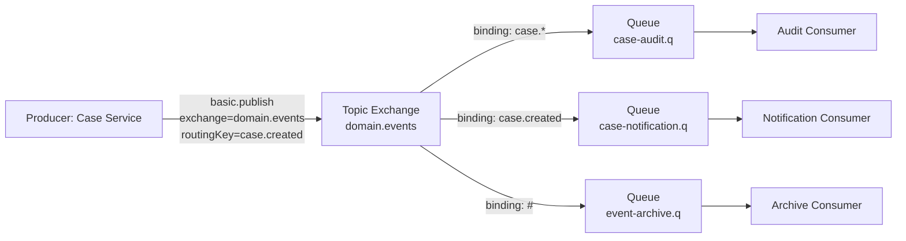

Perhatikan tiga hal:

1. Producer tidak tahu queue mana yang akan menerima message.
2. Exchange tidak memproses business logic; ia hanya routing.
3. Queue adalah **subscription materialization**: hasil keputusan bahwa suatu consumer group perlu menerima subset message tertentu.

Ini berbeda dari Kafka. Di Kafka, producer menulis ke topic partitioned log, consumer group membaca topic tersebut, dan setiap group menyimpan offset. Di RabbitMQ queue model, queue menyimpan message untuk consumer tertentu; setelah message di-ack, message bisa dihapus dari queue.

---

## 3. Minimal Publish Path

Secara runtime, publish path biasanya terlihat seperti ini:

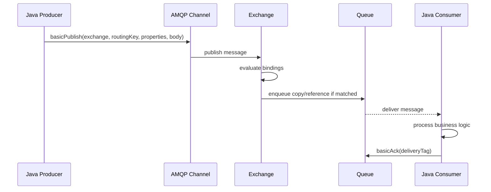

Jika routing gagal, message tidak otomatis masuk queue. Behavior tergantung publish option dan topology:

- jika exchange tidak ada, publish bisa error di channel,
- jika exchange ada tetapi tidak ada binding yang cocok, message dapat hilang secara normal kecuali memakai mechanism seperti `mandatory` dan return listener,
- jika queue ada tetapi consumer tidak ada, message tetap menunggu sesuai queue durability, TTL, length limit, dan policy,
- jika consumer menerima tetapi gagal sebelum ack, message dapat redeliver tergantung acknowledgement dan connection/channel state.

Kesalahan desain umum: mengira `basicPublish` sukses berarti message sudah diproses consumer. Itu salah. Publish sukses maksimum berarti broker menerima operasi publish. Dengan publisher confirms, publisher bisa mengetahui broker telah mengambil responsibility terhadap message sesuai mekanisme confirm. Itu masih belum berarti consumer sudah berhasil memproses side effect.

---

## 4. Exchange

Exchange adalah routing node. Producer publish ke exchange dengan routing key dan properties. Exchange menentukan queue atau stream tujuan berdasarkan binding.

### 4.1 Default Exchange

Default exchange bernama empty string `""`. Ia adalah direct exchange bawaan. Routing key diarahkan ke queue dengan nama yang sama.

Contoh:

```java
channel.basicPublish(
    "",                      // default exchange
    "case.created.queue",    // routing key = queue name
    MessageProperties.PERSISTENT_TEXT_PLAIN,
    payload
);
```

Ini cocok untuk tutorial dan command sederhana. Namun untuk sistem besar, default exchange cenderung membuat producer tergantung nama queue. Ini menghilangkan manfaat broker routing.

Gunakan default exchange hanya ketika:

- topology sangat kecil,
- message memang command point-to-point ke queue tertentu,
- producer dan queue berada dalam bounded context yang sama,
- perubahan routing tidak perlu independent dari deployment producer.

Hindari default exchange untuk domain events yang subscriber-nya bisa bertambah.

### 4.2 Direct Exchange

Direct exchange merutekan message ke queue yang binding key-nya sama dengan routing key.

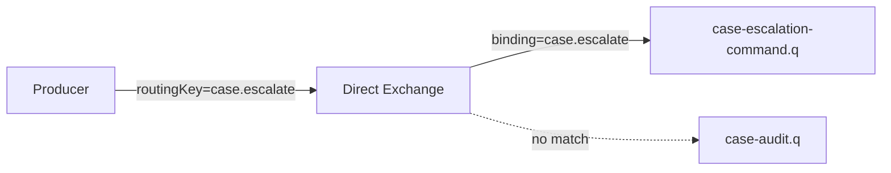

Cocok untuk:

- command routing,
- exact event routing,
- sharding sederhana dengan routing key eksplisit,
- task distribution ke queue spesifik.

Contoh Java:

```java
String exchange = "case.commands";
String routingKey = "case.escalate";

channel.exchangeDeclare(exchange, BuiltinExchangeType.DIRECT, true);
channel.queueDeclare("case-escalation-command.q", true, false, false, null);
channel.queueBind("case-escalation-command.q", exchange, routingKey);

channel.basicPublish(
    exchange,
    routingKey,
    MessageProperties.PERSISTENT_JSON,
    serialize(command)
);
```

Catatan: `MessageProperties.PERSISTENT_JSON` hanyalah convenience property. Durability end-to-end membutuhkan exchange durable, queue durable, message persistent, dan broker storage/replication policy yang sesuai. Persistent message di non-durable queue tetap tidak memberikan safety yang Anda kira.

### 4.3 Topic Exchange

Topic exchange memakai pattern matching pada routing key yang dipisah titik. Biasanya `*` mencocokkan satu word dan `#` mencocokkan nol atau lebih word.

Contoh routing key:

```text
case.created
case.assigned
case.escalated
case.enforcement.notice-issued
case.enforcement.penalty-paid
```

Binding:

```text
case.*                      -> event umum satu level
case.enforcement.*           -> semua enforcement event satu level
case.enforcement.#           -> semua enforcement event multi-level
#.penalty-paid               -> semua event berakhir penalty-paid
```

Diagram:

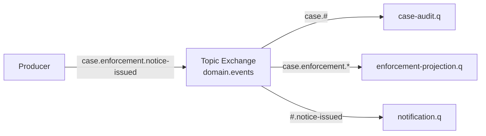

Topic exchange cocok untuk domain events karena subscriber bisa memilih subset event tanpa meminta producer berubah.

Namun topic exchange juga mudah menjadi “global event soup”. Tanpa governance, routing key berubah menjadi API publik yang tidak terdokumentasi.

### 4.4 Fanout Exchange

Fanout exchange mengirim semua message ke semua bound queues tanpa memperhatikan routing key.

Cocok untuk:

- broadcast event internal,
- invalidation signal,
- log fan-out,
- notification ke banyak subsystem saat message type sama.

Tidak cocok jika subscriber butuh filtering granular. Jangan jadikan fanout sebagai pengganti topic exchange lalu menyuruh semua consumer melakukan filtering sendiri. Itu memindahkan biaya routing ke consumer dan memperbesar load.

### 4.5 Headers Exchange

Headers exchange melakukan routing berdasarkan message headers, bukan routing key.

Cocok untuk:

- routing berbasis metadata multi-attribute,
- cases saat routing key tidak cukup ekspresif,
- legacy integration yang sudah punya header contract.

Trade-off:

- lebih sulit dibaca dibanding topic routing key,
- lebih rentan terhadap header naming inconsistency,
- bisa membuat topology kurang jelas dari monitoring UI jika tidak distandarkan.

Untuk kebanyakan domain-event architecture, topic exchange lebih mudah dikelola.

---

## 5. Queue sebagai Subscription Materialization

Queue bukan sekadar buffer. Dalam RabbitMQ, queue sering mewakili **kebutuhan konsumsi dari satu logical consumer group**.

Contoh domain event:

```text
Exchange: domain.events
Routing key: case.created
```

Subscriber:

- Audit service perlu semua event case.
- Notification service hanya perlu event tertentu.
- SLA projection perlu event assignment/escalation/resolution.
- Archive service perlu semua event.

Topology:

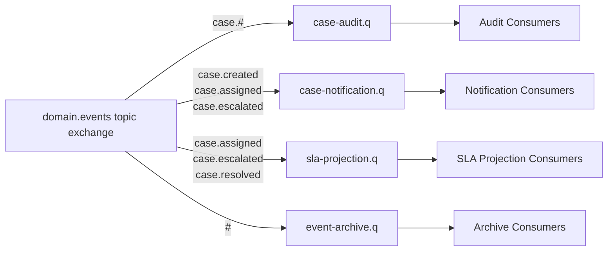

Setiap queue punya lifecycle dan reliability policy sendiri. Jika notification down, audit tidak harus ikut backlog. Jika SLA projection lambat, archive tidak harus terhambat.

Inilah perbedaan penting antara:

- satu queue untuk semua subscriber, dan
- satu queue per logical subscriber.

### 5.1 Satu Queue untuk Banyak Consumer = Competing Consumers

Jika banyak consumer membaca queue yang sama, mereka bersaing. Setiap message biasanya diproses oleh satu consumer saja.

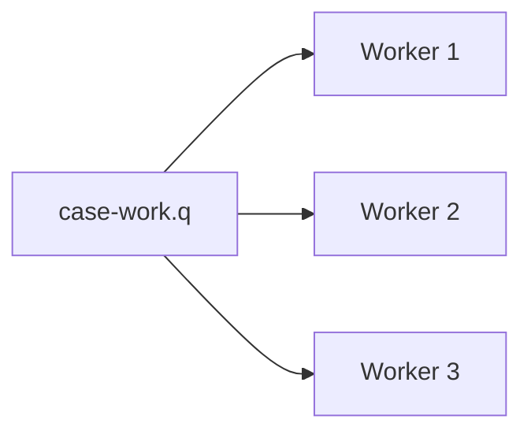

Ini cocok untuk work distribution. Tidak cocok untuk fan-out event ke banyak subsystem yang semuanya harus menerima message.

### 5.2 Banyak Queue Bound ke Exchange = Fan-Out ke Logical Subscribers

Jika banyak queue bound ke exchange yang sama, setiap queue menerima copy message sesuai binding.

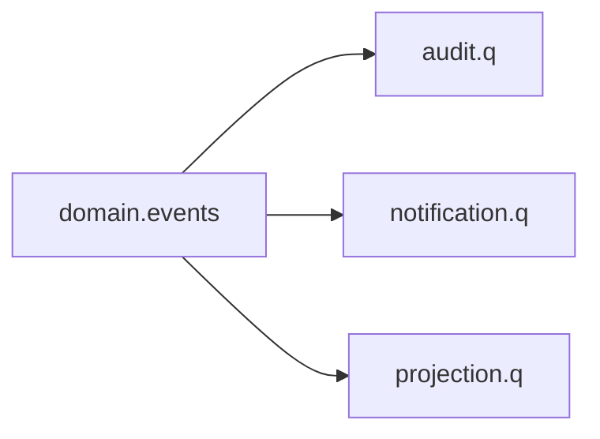

Ini cocok untuk pub/sub. Setiap queue bisa punya beberapa consumer untuk scaling internalnya.

---

## 6. Binding adalah Contract Routing

Binding menghubungkan exchange ke queue dengan binding key atau arguments.

Desain binding menentukan siapa menerima apa. Karena itu binding adalah bagian dari contract, walaupun sering dikelola sebagai infrastruktur.

Contoh binding yang baik:

```text
case-audit.q             <- domain.events / case.#
case-notification.q      <- domain.events / case.created
case-notification.q      <- domain.events / case.escalated
case-sla-projection.q    <- domain.events / case.assigned
case-sla-projection.q    <- domain.events / case.resolved
```

Contoh binding berbahaya:

```text
all-services.q           <- domain.events / #
temp-processing.q        <- domain.events / case.*
service-a.q              <- domain.events / *.created
```

Masalahnya:

- `#` terlalu luas dan sering menjadi silent dependency.
- `temp-processing.q` tidak menjelaskan ownership.
- `*.created` bisa menangkap event dari domain yang tidak diinginkan.

Prinsip:

> Binding harus menjelaskan **business subscription**, bukan convenience teknis.

---

## 7. Routing Key Design

Routing key adalah string kecil yang berdampak besar. Ia sering menjadi API publik antar-service.

### 7.1 Routing Key untuk Domain Event

Format yang umum:

```text
<domain>.<aggregate-or-entity>.<event>
```

Contoh:

```text
regulation.case.created
regulation.case.assigned
regulation.case.escalated
regulation.case.closed
regulation.enforcement.notice-issued
regulation.enforcement.penalty-paid
```

Atau format lebih pendek jika exchange sudah scoped:

```text
case.created
case.assigned
case.escalated
enforcement.notice-issued
```

Jika exchange bernama `regulatory.domain.events`, routing key tidak perlu mengulang `regulatory`.

### 7.2 Routing Key untuk Command

Command biasanya lebih spesifik dan punya target logical handler.

```text
case.assign
case.escalate
case.close
enforcement.issue-notice
```

Untuk command, direct exchange sering cukup karena command biasanya punya satu logical owner. Jika banyak handler menerima command yang sama, Anda mungkin sebenarnya sedang mendesain event, bukan command.

### 7.3 Jangan Taruh Data Volatile di Routing Key

Hindari:

```text
case.created.priority.high.region.jakarta.officer.12345
```

Masalah:

- binding pattern menjadi rumit,
- cardinality meledak,
- routing key menjadi campuran metadata dan domain fact,
- perubahan organizational structure merusak routing.

Lebih baik:

```text
case.created
```

Lalu metadata seperti region, priority, officerId disimpan di payload atau header yang tervalidasi.

### 7.4 Routing Key Stability

Routing key harus stabil. Jika Anda mengganti `case.closed` menjadi `case.resolved`, subscriber lama bisa putus.

Strategi evolusi:

1. Tambahkan routing key baru.
2. Publish dual-routing untuk periode migrasi jika perlu.
3. Update binding subscriber.
4. Monitor tidak ada consumer lama.
5. Hentikan routing key lama.

Jangan rename diam-diam.

---

## 8. Message Anatomy di RabbitMQ

Di Java client, message publish biasanya terdiri dari:

- exchange,
- routing key,
- properties,
- body byte array.

Contoh:

```java
AMQP.BasicProperties props = new AMQP.BasicProperties.Builder()
    .contentType("application/json")
    .contentEncoding("utf-8")
    .deliveryMode(2) // persistent
    .messageId(eventId)
    .correlationId(correlationId)
    .type("CaseCreated")
    .timestamp(Date.from(occurredAt))
    .headers(Map.of(
        "schema", "regulation.case.created.v1",
        "tenant", tenantId,
        "traceparent", traceparent
    ))
    .build();

channel.basicPublish(
    "regulatory.domain.events",
    "case.created",
    true, // mandatory
    props,
    jsonBytes
);
```

### 8.1 Body

Body adalah bytes. Jangan anggap RabbitMQ memahami JSON Anda. Broker merutekan berdasarkan exchange, routing key, binding, dan properties/headers jika memakai headers exchange.

### 8.2 Properties

Properties berguna untuk metadata transport:

- `contentType`,
- `contentEncoding`,
- `deliveryMode`,
- `messageId`,
- `correlationId`,
- `replyTo`,
- `type`,
- `timestamp`,
- `headers`.

Tetapi jangan memindahkan seluruh business payload ke headers. Headers biasanya kurang cocok untuk data besar, evolusi schema, dan domain validation.

### 8.3 deliveryMode

`deliveryMode=2` berarti persistent. Tetapi durability butuh kombinasi:

| Layer | Konfigurasi |
|---|---|
| Exchange | durable exchange |
| Queue | durable queue |
| Message | persistent message |
| Broker | disk/storage policy sehat |
| Cluster | replication/failover model sesuai target |
| Publisher | confirms aktif |
| Consumer | ack setelah side effect aman |

Persistent message tanpa publisher confirm masih bisa membuat producer tidak tahu apakah broker benar-benar mengambil tanggung jawab.

---

## 9. Java Client Runtime Model

RabbitMQ Java client memakai konsep `Connection` dan `Channel`.

Sederhananya:

- `Connection` adalah TCP connection ke broker.
- `Channel` adalah virtual connection di atas connection.
- Kebanyakan operasi AMQP terjadi di channel.
- Channel biasanya tidak dipakai concurrent sembarangan oleh banyak thread.

Contoh lifecycle sederhana:

```java
ConnectionFactory factory = new ConnectionFactory();
factory.setHost("rabbitmq.internal");
factory.setUsername("app_case");
factory.setPassword(secret);
factory.setVirtualHost("regulatory-prod");

try (Connection connection = factory.newConnection("case-service-publisher");
     Channel channel = connection.createChannel()) {

    channel.exchangeDeclare(
        "regulatory.domain.events",
        BuiltinExchangeType.TOPIC,
        true
    );

    channel.basicPublish(
        "regulatory.domain.events",
        "case.created",
        true,
        props,
        body
    );
}
```

Untuk production, jangan create connection per message. Gunakan connection/channel lifecycle yang stabil, connection naming, health check, confirm handling, dan reconnect strategy.

---

## 10. Topology Declaration Strategy

Siapa yang harus mendeklarasikan exchange, queue, dan binding?

Ada beberapa pendekatan.

### 10.1 Application-Declared Topology

Aplikasi mendeklarasikan topology saat startup.

Kelebihan:

- simple,
- cocok untuk service-owned queues,
- environment baru mudah bootstrapped.

Kekurangan:

- aplikasi butuh permission declare,
- drift antar-service mungkin terjadi,
- perubahan topology bisa terjadi saat deploy tanpa review infra.

Cocok untuk:

- sistem kecil-menengah,
- dev/test,
- topology owned oleh satu service.

### 10.2 Infrastructure-Declared Topology

Topology dikelola lewat IaC, Helm, Terraform provider, RabbitMQ definitions, atau operator.

Kelebihan:

- governance kuat,
- reviewable,
- reproducible,
- permission aplikasi bisa dibatasi publish/consume saja.

Kekurangan:

- development lebih lambat,
- butuh pipeline infra matang,
- ownership harus jelas.

Cocok untuk:

- regulated systems,
- multi-team platform,
- production critical workloads.

### 10.3 Hybrid

Exchange global dideklarasikan infra; service queue dideklarasikan aplikasi atau chart service.

Prinsip yang baik:

| Topology object | Owner yang disarankan |
|---|---|
| Shared domain exchange | Platform/domain architecture |
| Service-owned queue | Service owner |
| DLX shared | Platform |
| Retry queue | Service owner dengan template platform |
| Permission/vhost | Platform/security |
| Binding event subscription | Consumer owner, direview domain owner |

---

## 11. Publisher Confirms

Publisher confirms adalah mekanisme agar publisher tahu broker telah menerima responsibility terhadap published message. Ini berbeda dari consumer ack.

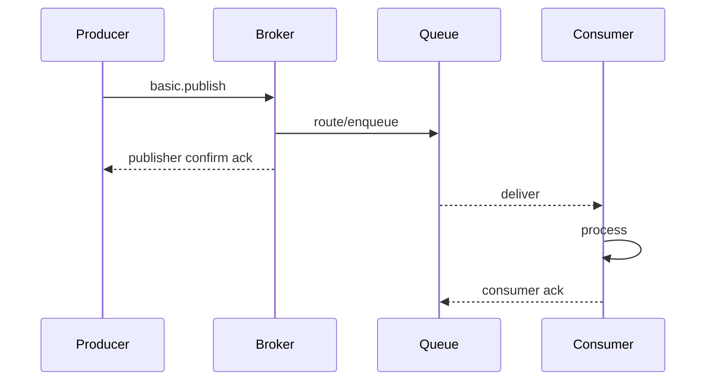

Dua ack berbeda:

| Ack | Dari | Ke | Artinya |
|---|---|---|---|
| Publisher confirm | Broker | Producer | Broker menerima responsibility atas publish |
| Consumer acknowledgement | Consumer | Broker | Consumer sudah selesai sehingga message boleh dihapus/released |

Kesalahan umum: menganggap publisher confirm berarti consumer berhasil. Itu salah.

### 11.1 Synchronous Confirm

```java
channel.confirmSelect();

channel.basicPublish(exchange, routingKey, true, props, body);
boolean confirmed = channel.waitForConfirms(5_000);

if (!confirmed) {
    throw new MessagePublishNotConfirmedException(eventId);
}
```

Cocok untuk:

- low throughput,
- administrative publish,
- simple batch.

Tidak cocok untuk high-throughput publisher karena blocking.

### 11.2 Batch Confirm

```java
channel.confirmSelect();

int batchSize = 100;
for (int i = 0; i < events.size(); i++) {
    Event event = events.get(i);
    channel.basicPublish(exchange, event.routingKey(), true, event.props(), event.body());

    if ((i + 1) % batchSize == 0) {
        channel.waitForConfirmsOrDie(5_000);
    }
}

channel.waitForConfirmsOrDie(5_000);
```

Trade-off:

- throughput lebih baik,
- failure attribution lebih kasar,
- perlu republish strategy untuk batch yang gagal.

### 11.3 Asynchronous Confirm

Lebih cocok untuk high throughput. Anda melacak publish sequence number lalu handle ack/nack callback.

Pseudo-code:

```java
ConcurrentNavigableMap<Long, PendingMessage> outstanding = new ConcurrentSkipListMap<>();

channel.confirmSelect();

channel.addConfirmListener(
    (sequenceNo, multiple) -> {
        if (multiple) {
            outstanding.headMap(sequenceNo, true).clear();
        } else {
            outstanding.remove(sequenceNo);
        }
    },
    (sequenceNo, multiple) -> {
        Collection<PendingMessage> failed = multiple
            ? outstanding.headMap(sequenceNo, true).values()
            : List.of(outstanding.get(sequenceNo));

        // mark for retry or fail outbox row
    }
);

long seq = channel.getNextPublishSeqNo();
outstanding.put(seq, pendingMessage);
channel.basicPublish(exchange, routingKey, true, props, body);
```

Production concern:

- outstanding map harus bounded,
- nack handling harus aman,
- confirm callback tidak boleh blocking lama,
- publish retry harus idempotent,
- connection recovery tidak otomatis menyimpan outgoing messages yang gagal dipublish.

---

## 12. Mandatory Routing and Unroutable Messages

Jika exchange ada tetapi message tidak cocok ke queue mana pun, publish bisa “sukses” tetapi message tidak disimpan. Untuk mendeteksi ini, publisher dapat memakai `mandatory=true` dan return listener.

```java
channel.addReturnListener(returned -> {
    String exchange = returned.getExchange();
    String routingKey = returned.getRoutingKey();
    int replyCode = returned.getReplyCode();
    String replyText = returned.getReplyText();

    // mark event as unroutable, alert, or send to fallback handling
});

channel.basicPublish(
    "regulatory.domain.events",
    "case.unknown-event",
    true, // mandatory
    props,
    body
);
```

Mandatory publish membantu mendeteksi topology mismatch.

Namun mandatory bukan pengganti contract test. Jika producer mem-publish routing key baru dan tidak ada binding, Anda ingin tahu sebelum production.

Checklist:

- Gunakan mandatory untuk publisher penting.
- Aktifkan publisher confirms.
- Buat topology contract test.
- Alert untuk returned messages.
- Jangan silent-drop unroutable domain events.

---

## 13. Consumer Acknowledgements

Consumer ack memberi tahu broker bahwa message boleh dianggap selesai.

Ada dua mode besar:

1. Auto ack — broker menganggap message selesai saat dikirim ke consumer.
2. Manual ack — consumer eksplisit mengirim ack setelah processing berhasil.

Untuk production critical workloads, manual ack hampir selalu lebih aman.

Contoh:

```java
boolean autoAck = false;

channel.basicConsume("case-escalation-command.q", autoAck, (consumerTag, delivery) -> {
    long tag = delivery.getEnvelope().getDeliveryTag();

    try {
        CaseEscalationCommand command = deserialize(delivery.getBody());
        escalationService.handle(command);

        channel.basicAck(tag, false);
    } catch (TransientDependencyException ex) {
        channel.basicNack(tag, false, true);  // requeue, but beware requeue storm
    } catch (InvalidMessageException ex) {
        channel.basicNack(tag, false, false); // dead-letter if DLX configured
    }
}, consumerTag -> {
    // cancelled
});
```

### 13.1 Ack Setelah Side Effect Aman

Ack terlalu awal:

```text
receive -> ack -> write database -> crash
```

Risiko: message hilang secara business.

Ack terlalu akhir:

```text
receive -> write database -> call email -> call external API -> ack
```

Risiko: jika crash setelah database write tetapi sebelum ack, message redeliver dan side effect harus idempotent.

Rule:

> Ack setelah unit of work yang ingin dianggap atomic secara bisnis sudah aman, dan semua side effect setelahnya harus idempotent atau dipisahkan menjadi message baru.

---

## 14. Prefetch sebagai Flow Control Awal

Prefetch membatasi jumlah unacked messages yang dapat dikirim broker ke consumer.

```java
channel.basicQos(50); // max 50 unacked messages on this channel/consumer context
```

Tanpa prefetch, broker bisa mengirim terlalu banyak message ke consumer cepat secara network tetapi lambat secara processing. Akibatnya:

- memory consumer naik,
- message terdistribusi tidak adil,
- redelivery setelah crash besar,
- latency message lain naik.

Prefetch terlalu kecil:

- throughput rendah,
- network round trip lebih terasa,
- worker sering idle.

Prefetch terlalu besar:

- unfair distribution,
- banyak in-flight unacked,
- crash recovery mahal.

Praktik awal:

| Workload | Prefetch awal |
|---|---:|
| CPU-bound cepat | 50–200 |
| I/O-bound cepat | 100–500, tergantung concurrency |
| Heavy side effect | 1–20 |
| Strict fairness | 1 |
| Large payload | kecil, sesuai memory budget |

Angka ini bukan hukum. Ukur dengan latency, throughput, queue depth, unacked count, dan failure recovery time.

---

## 15. Routing Patterns untuk Sistem Nyata

### 15.1 Work Queue Pattern

Satu queue, banyak worker.

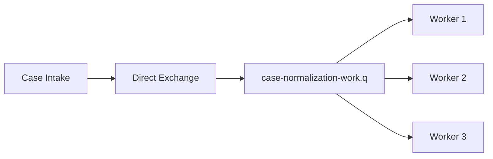

Cocok untuk:

- task distribution,
- background jobs,
- command handling,
- CPU/IO parallelization.

Caution:

- setiap message diproses oleh satu worker,
- ordering global tidak dijamin jika banyak worker,
- idempotency tetap wajib.

### 15.2 Domain Event Fan-Out

Topic exchange, queue per subscriber.

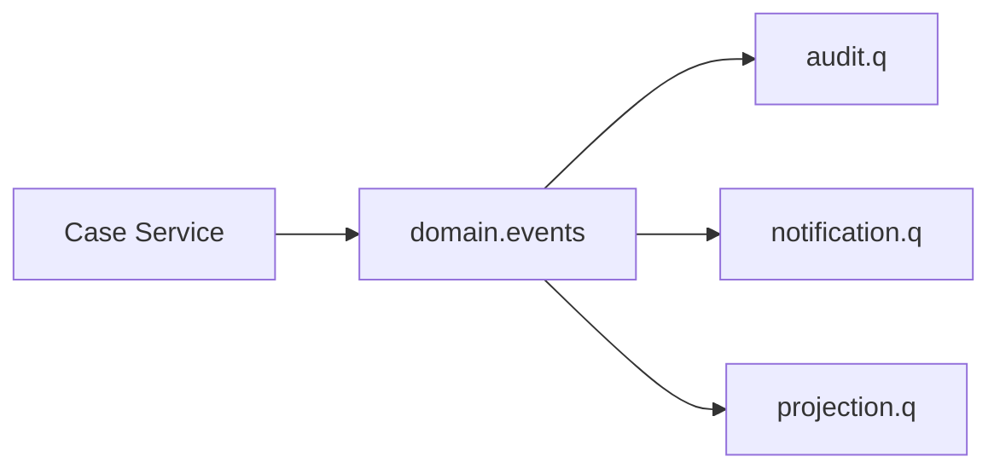

Cocok untuk:

- subscriber independen,
- audit trail,
- read model projection,
- notification,
- compliance archival.

Caution:

- event schema menjadi public contract,
- queue count tumbuh,
- DLQ/retry policy perlu distandarkan.

### 15.3 Command Bus

Direct exchange untuk command per bounded context.

```text
Exchange: case.commands
Routing keys:
- case.assign
- case.escalate
- case.close
```

Command sebaiknya punya satu owner. Jika dua service sama-sama merasa berhak memproses command, boundary domain belum jelas.

### 15.4 Routing Slip / Multi-Step Pipeline

Message berpindah tahap:

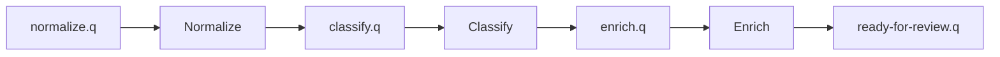

Ini cocok untuk pipeline batch/async. Tetapi hati-hati:

- setiap hop menambah latency,
- error handling tiap tahap berbeda,
- correlation ID wajib,
- schema antar tahap harus jelas,
- partial progress harus observable.

---

## 16. Topology Naming Convention

Naming bukan kosmetik. Naming menentukan operability.

Contoh convention:

```text
Exchange:
<domain>.<category>
regulatory.domain.events
regulatory.case.commands
regulatory.platform.dlx

Queue:
<service>.<purpose>.q
case-audit.domain-events.q
case-notification.domain-events.q
sla-projection.case-events.q
case-escalation.commands.q

Retry Queue:
<service>.<purpose>.retry.<delay>.q
case-notification.domain-events.retry.5m.q

DLQ:
<service>.<purpose>.dlq
case-notification.domain-events.dlq
```

Untuk environment, lebih baik pakai vhost atau cluster/namespace, bukan suffix acak di setiap object:

```text
VHost: regulatory-prod
Exchange: regulatory.domain.events
```

Daripada:

```text
Exchange: regulatory.domain.events.prod.v2.final
```

---

## 17. Contract Testing untuk Routing

Karena routing key dan binding adalah contract, test harus memverifikasi:

- exchange tersedia,
- routing key valid,
- binding subscriber cocok,
- mandatory publish tidak return,
- DLX/retry queue terhubung,
- permission producer/consumer sesuai.

Contoh test konseptual:

```java
@Test
void caseCreatedShouldRouteToAuditAndNotification() {
    publishMandatory("regulatory.domain.events", "case.created", caseCreatedPayload);

    assertEventuallyQueueContains("case-audit.domain-events.q", eventId);
    assertEventuallyQueueContains("case-notification.domain-events.q", eventId);
}
```

Untuk test ringan, Anda bisa inspect topology via management API atau definitions file. Untuk test integrasi, pakai container RabbitMQ dan declare topology seperti production.

---

## 18. Failure Modes Routing

### 18.1 Exchange Tidak Ada

Gejala:

- publish error,
- channel closed,
- producer exception.

Penyebab:

- deploy order salah,
- topology belum dibuat,
- vhost salah,
- permission salah.

Mitigasi:

- topology bootstrap,
- startup check,
- IaC,
- deploy dependency.

### 18.2 Binding Tidak Ada

Gejala:

- publish terlihat sukses,
- consumer tidak menerima,
- queue depth tidak naik.

Mitigasi:

- mandatory publish,
- return listener,
- topology contract test,
- alert unroutable.

### 18.3 Routing Key Typo

Gejala:

- satu event type hilang,
- subscriber tertentu tidak bergerak,
- audit gap.

Mitigasi:

- routing key constants/generated contract,
- schema registry/event catalog,
- producer integration test,
- no string literal scattered.

### 18.4 Queue Tidak Ada

Jika binding dibuat ke queue yang tidak ada, declare bisa gagal. Jika consumer membaca queue yang tidak ada, consumer startup gagal.

Mitigasi:

- declare topology deterministik,
- startup fail-fast,
- no auto-create in production tanpa review.

### 18.5 Consumer Ack Hilang karena Connection Drop

Consumer memproses message, lalu connection putus sebelum ack sampai broker. Broker akan redeliver. Side effect bisa terjadi dua kali.

Mitigasi:

- idempotency key,
- inbox table,
- dedup store,
- ack setelah durable local result,
- external side effect idempotency.

### 18.6 Requeue Storm

Consumer gagal, `basicNack(..., requeue=true)`, broker segera redeliver ke consumer yang sama atau consumer lain, gagal lagi, loop cepat.

Mitigasi:

- bounded retry,
- delayed retry queue,
- DLX,
- classify transient vs permanent error,
- circuit breaker downstream.

---

## 19. RabbitMQ vs Kafka Mental Boundary

RabbitMQ routing model kuat untuk:

- task queues,
- complex routing,
- request/reply,
- per-subscriber queue lifecycle,
- broker-mediated work dispatch,
- low-latency command/event delivery.

Kafka kuat untuk:

- retained event log,
- replay,
- high-throughput partitioned streaming,
- stream processing,
- consumer groups reading same topic independently by offset,
- long-lived event history.

RabbitMQ Streams menambah log/stream model dalam RabbitMQ ecosystem, tetapi core queue/exchange model tetap berbeda dari Kafka.

Pertanyaan pemilihan:

| Pertanyaan | Cenderung RabbitMQ | Cenderung Kafka |
|---|---|---|
| Message selesai lalu dihapus? | Ya | Tidak, retained by policy |
| Banyak routing pattern dinamis? | Ya | Tidak utama |
| Replay event historis penting? | Tidak utama | Ya |
| Work queue/task dispatch? | Ya | Bisa, tapi bukan sweet spot utama |
| Stream processing stateful? | Terbatas/core bukan fokus | Ya |
| Per-subscriber backlog terpisah? | Queue per subscriber | Consumer group offset |

---

## 20. Regulatory Case Example

Misalkan ada sistem enforcement lifecycle:

- Case Intake Service membuat case.
- Assignment Service menugaskan officer.
- Escalation Service memantau SLA.
- Audit Service menyimpan immutable audit.
- Notification Service mengirim email/SMS/in-app.
- Analytics Service membangun projection.

Topology:

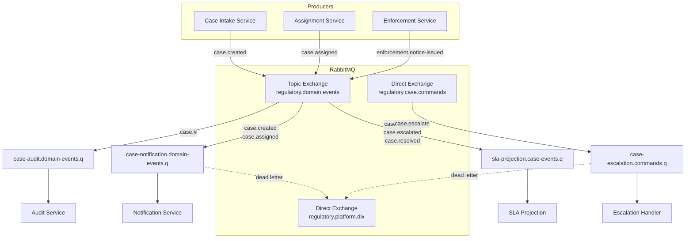

Engineering decisions:

- Domain events memakai topic exchange.
- Commands memakai direct exchange.
- Audit punya queue sendiri agar tidak bergantung pada notification.
- Notification retry/DLQ tidak memengaruhi audit.
- Routing key memakai domain semantics, bukan service name.
- Correlation ID menghubungkan event dengan case journey.

---

## 21. Anti-Patterns

### 21.1 Producer Publishes Directly to Consumer Queue Names

```java
channel.basicPublish("", "notification-service-queue", props, body);
```

Masalah:

- producer tahu internal consumer,
- subscriber baru butuh perubahan producer,
- fan-out sulit,
- ownership contract kabur.

Lebih baik publish event ke exchange domain.

### 21.2 One Queue for All Services

```text
all-domain-events.q
```

Masalah:

- competing consumer menyebabkan hanya satu service menerima message,
- filtering kacau,
- backlog satu service memengaruhi lain,
- tidak cocok untuk pub/sub.

### 21.3 `#` Binding Everywhere

Setiap service bind ke semua event lalu filter sendiri.

Masalah:

- traffic boros,
- consumer coupling ke event yang tidak diperlukan,
- schema exposure melebar,
- sulit audit siapa butuh event apa.

### 21.4 Infinite Requeue

```java
catch (Exception ex) {
    channel.basicNack(tag, false, true);
}
```

Masalah:

- poison message loop,
- CPU/network churn,
- queue tidak maju,
- downstream makin ditekan.

### 21.5 Auto Ack untuk Side-Effectful Processing

Auto ack cocok untuk telemetry non-critical. Untuk business process, auto ack bisa menghilangkan message saat consumer crash setelah delivery tetapi sebelum processing selesai.

### 21.6 Routing Key sebagai Business Database

Routing key terlalu panjang dan volatile. Ini membuat routing key sulit berevolusi dan binding rawan salah.

---

## 22. Review Checklist

Gunakan checklist ini saat review RabbitMQ topology:

### Producer

- [ ] Publish ke exchange, bukan queue internal consumer, kecuali command point-to-point yang disengaja.
- [ ] Routing key terdokumentasi.
- [ ] `messageId`, `correlationId`, `contentType`, dan schema metadata diset.
- [ ] Persistent message dipakai untuk business-critical workload.
- [ ] Publisher confirms aktif.
- [ ] Mandatory publish/return listener dipakai untuk event penting.
- [ ] Publish retry idempotent.

### Exchange/Binding

- [ ] Exchange type sesuai semantics.
- [ ] Binding dimiliki consumer dan direview domain owner.
- [ ] Wildcard tidak terlalu luas.
- [ ] Topology bisa direkonstruksi dari code/IaC.
- [ ] Tidak ada queue orphan tanpa owner.

### Queue

- [ ] Queue owner jelas.
- [ ] Durability sesuai workload.
- [ ] DLX/retry strategy jelas.
- [ ] Length limit/TTL dipahami.
- [ ] Queue name jelas dan environment isolation rapi.

### Consumer

- [ ] Manual ack untuk workload penting.
- [ ] Ack setelah safe point.
- [ ] Prefetch diset.
- [ ] Error diklasifikasi transient/permanent.
- [ ] Poison message tidak infinite-loop.
- [ ] Idempotency diterapkan.

### Observability

- [ ] Queue depth dimonitor.
- [ ] Unacked count dimonitor.
- [ ] Publish return dimonitor.
- [ ] Confirm failures dimonitor.
- [ ] Consumer error dan DLQ rate dimonitor.
- [ ] Correlation ID muncul di log.

---

## 23. Latihan Terarah

### Latihan 1 — Routing Topology

Desain topology RabbitMQ untuk event berikut:

```text
case.created
case.assigned
case.escalated
case.closed
enforcement.notice-issued
enforcement.penalty-paid
```

Subscriber:

- audit menerima semua,
- notification menerima created/escalated/notice-issued,
- SLA projection menerima assigned/escalated/closed,
- analytics menerima semua enforcement.

Output:

- exchange type,
- queue list,
- binding list,
- routing key convention,
- DLQ naming.

### Latihan 2 — Failure Trace

Trace kejadian berikut:

```text
Producer publishes case.escalated.
Exchange exists.
No binding matches.
Producer uses mandatory=false.
```

Jawab:

- apakah producer error?
- apakah queue depth naik?
- apakah consumer tahu?
- observability apa yang menangkap ini?
- perubahan desain apa yang harus dibuat?

### Latihan 3 — Ack Boundary

Consumer memproses command `case.escalate`:

1. update database,
2. send email,
3. publish `case.escalated`,
4. ack message.

Tentukan risiko duplicate dan lost processing. Rancang ulang dengan outbox/inbox secara high-level.

---

## 24. Ringkasan

RabbitMQ harus dipahami sebagai routing broker, bukan hanya queue.

Model inti:

```text
Producer -> Exchange -> Binding -> Queue -> Consumer
```

Exchange memutuskan routing. Queue menyimpan message untuk logical subscriber. Binding adalah contract subscription. Routing key adalah API komunikasi. Publisher confirms melindungi producer-broker boundary. Consumer acknowledgements melindungi broker-consumer boundary. Tidak satu pun dari ini otomatis menjamin business side effect exactly-once.

Jika model ini benar, desain RabbitMQ menjadi dapat direview:

- Exchange type mengikuti semantic komunikasi.
- Queue mengikuti ownership consumer.
- Binding mengikuti business subscription.
- Routing key stabil dan terdokumentasi.
- Ack/confirm dipakai untuk boundary yang tepat.
- Failure mode terlihat sebelum incident.

Part berikutnya akan membahas queue type: classic, quorum, priority, lazy behavior, queue length limit, overflow, dan konsekuensi operasional dari pemilihan queue.

---

## References

- RabbitMQ Documentation — Exchanges: https://www.rabbitmq.com/docs/exchanges
- RabbitMQ Documentation — Publishers: https://www.rabbitmq.com/docs/publishers
- RabbitMQ Documentation — Consumer Acknowledgements and Publisher Confirms: https://www.rabbitmq.com/docs/confirms
- RabbitMQ Java Client API Guide: https://www.rabbitmq.com/client-libraries/java-api-guide
- RabbitMQ Tutorial — Work Queues Java: https://www.rabbitmq.com/tutorials/tutorial-two-java
- RabbitMQ Tutorial — Publisher Confirms Java: https://www.rabbitmq.com/tutorials/tutorial-seven-java
