------
title: Learn Java Messaging and Event Streaming - Part 010
description: RabbitMQ queue types and operational trade-offs: classic queues, quorum queues, lazy behavior, priority queues, queue length limits, overflow, replication, durability, and failure modelling.
series: learn-java-messaging-event-streaming
seriesTitle: Learn Java Messaging and Event Streaming
order: 10
partTitle: RabbitMQ Queue Types and Trade-Offs
tags:
- java
- messaging
- rabbitmq
- queue
- quorum-queue
- classic-queue
- priority-queue
- backpressure
- reliability
- operations
date: 2026-06-28
---

# Part 010 — RabbitMQ Queue Types and Trade-Offs

> Tujuan part ini adalah memahami bahwa “queue” di RabbitMQ bukan satu benda tunggal. Queue type menentukan durability, replication, latency, throughput, memory pressure, failover behavior, dan batas operasional. Salah memilih queue type bisa menjadi akar incident: message hilang, broker disk penuh, leader overload, requeue storm, atau upgrade path tertutup.

Di part sebelumnya kita membahas exchange, binding, routing key, dan queue sebagai materialisasi subscription. Sekarang kita masuk ke desain queue itu sendiri.

Pertanyaan yang harus bisa dijawab engineer senior:

- Apakah queue ini boleh kehilangan message saat node mati?
- Apakah queue ini perlu replicated dan highly available?
- Apakah workload membutuhkan strict ordering atau throughput?
- Apakah backlog bisa besar?
- Apakah pesan besar atau kecil?
- Apakah message perlu priority?
- Apa yang terjadi saat queue terlalu panjang?
- Apa recovery behavior setelah consumer down 2 jam?
- Apa yang terjadi saat leader queue pindah node?
- Apa yang terjadi saat disk hampir penuh?

Part ini membahas:

- classic queue,
- quorum queue,
- lazy behavior dan disk-backed queue,
- priority queue,
- TTL dan queue length limit,
- overflow strategy,
- queue replication dan failure mode,
- decision matrix untuk workload nyata.

---

## 1. Queue Type adalah Reliability Decision

Queue type bukan hanya parameter deklarasi.

Contoh deklarasi:

```java
Map<String, Object> args = new HashMap<>();
args.put("x-queue-type", "quorum");

channel.queueDeclare(
    "case-escalation.commands.q",
    true,   // durable
    false,  // exclusive
    false,  // autoDelete
    args
);
```

Satu baris `x-queue-type` dapat mengubah:

- bagaimana message disimpan,
- apakah queue replicated,
- bagaimana leader dipilih,
- apa latency write,
- fitur apa yang tersedia,
- bagaimana queue recover setelah node failure,
- bagaimana queue harus dimonitor.

Mental model:

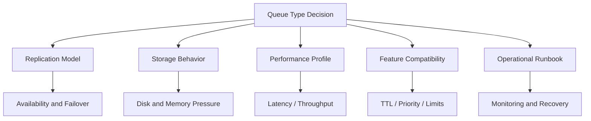

Jangan memilih queue type dari tutorial. Pilih dari failure requirement.

---

## 2. Classic Queues

Classic queue adalah queue tradisional RabbitMQ. Ia cocok untuk banyak workload umum, terutama non-replicated queue, temporary queue, transient workload, dan use case yang tidak membutuhkan consensus replication.

Karakter umum:

- simple,
- familiar,
- low overhead dibanding replicated consensus queue,
- cocok untuk queue lokal/non-critical,
- bisa durable atau non-durable,
- bisa exclusive/auto-delete,
- mendukung banyak fitur RabbitMQ queue.

Contoh:

```java
channel.queueDeclare(
    "case-notification.domain-events.q",
    true,   // durable
    false,  // exclusive
    false,  // autoDelete
    Map.of("x-queue-type", "classic")
);
```

Jika tidak menentukan type, default ditentukan oleh broker/policy. Untuk production, lebih baik eksplisit melalui policy atau definitions agar tidak bergantung pada default yang tidak diketahui developer.

### 2.1 Kapan Classic Queue Cocok

Classic queue cocok untuk:

- temporary reply queue,
- transient work queue,
- low-criticality background job,
- queue yang bisa di-rebuild,
- queue yang kehilangan beberapa message bisa diterima,
- local dev/test,
- workloads yang membutuhkan fitur yang tidak tersedia di quorum queue.

Contoh:

```text
report-generation.preview.q
user-session-cleanup.q
temporary-request-reply.q
noncritical-telemetry-forwarder.q
```

### 2.2 Kapan Classic Queue Berisiko

Classic queue berisiko jika:

- message tidak boleh hilang,
- queue harus tetap available saat node failure,
- queue menjadi critical command path,
- backlog besar dan recovery perlu predictable,
- operator mengira durable queue sama dengan replicated queue.

Durable classic queue berarti queue definition dan message persistent bisa bertahan restart node yang sama. Itu tidak sama dengan replicated high availability across nodes.

### 2.3 Classic Mirroring Legacy Warning

Di RabbitMQ versi modern, mirrored classic queues adalah jalur legacy/deprecated/removed tergantung versi. Untuk replicated durable queue, RabbitMQ mendorong penggunaan quorum queues atau streams, bukan mirrored classic queues.

Engineering implication:

- Jangan memulai desain baru dengan mirrored classic queues.
- Jika sistem lama masih memakai mirrored classic queues, buat migration plan.
- Jangan menganggap tutorial lama RabbitMQ HA masih berlaku untuk RabbitMQ 4.x.

---

## 3. Quorum Queues

Quorum queue adalah replicated durable queue berbasis Raft-like consensus model. Ia dirancang untuk data safety dan availability yang lebih baik dibanding mirrored classic queue legacy.

Karakter umum:

- replicated queue,
- leader/follower model,
- write harus direplikasi sesuai quorum,
- cocok untuk durable critical workloads,
- lebih predictable untuk failover dibanding classic mirroring lama,
- fitur tidak identik dengan classic queue.

Diagram:

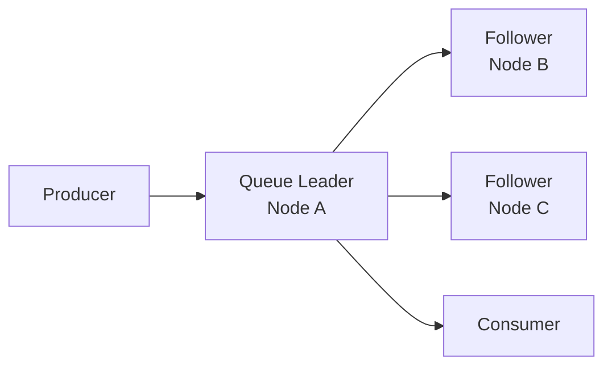

Message publish ke leader, lalu state direplikasi. Jika leader gagal, follower eligible bisa menjadi leader.

### 3.1 Kapan Quorum Queue Cocok

Quorum queue cocok untuk:

- business-critical commands,
- durable domain event subscription queue,
- regulatory workflow step yang tidak boleh hilang,
- financial/compliance notification pipeline,
- workload yang membutuhkan replicated queue dan predictable failover.

Contoh:

```text
case-escalation.commands.q
case-audit.domain-events.q
enforcement-decision.commands.q
regulatory-deadline-monitor.q
```

### 3.2 Trade-Off Quorum Queue

Quorum queue bukan “selalu lebih baik”. Ia membawa biaya:

| Aspek | Konsekuensi |
|---|---|
| Write latency | Lebih tinggi karena replication/consensus |
| Throughput | Bisa lebih rendah daripada classic non-replicated untuk workload tertentu |
| Disk | Replicated data memperbesar konsumsi storage |
| Leader placement | Hot leader bisa overload node tertentu |
| Feature compatibility | Tidak semua fitur classic queue tersedia/sama |
| Operational complexity | Perlu memahami quorum, member, leader, failover |

Gunakan quorum queue ketika reliability requirement membutuhkannya, bukan karena terdengar enterprise.

### 3.3 Quorum Queue dan Poison Message

Quorum queue menyimpan delivery count dan mendukung poison message handling melalui delivery limit. Ini sangat berguna untuk mencegah infinite redelivery.

Model:

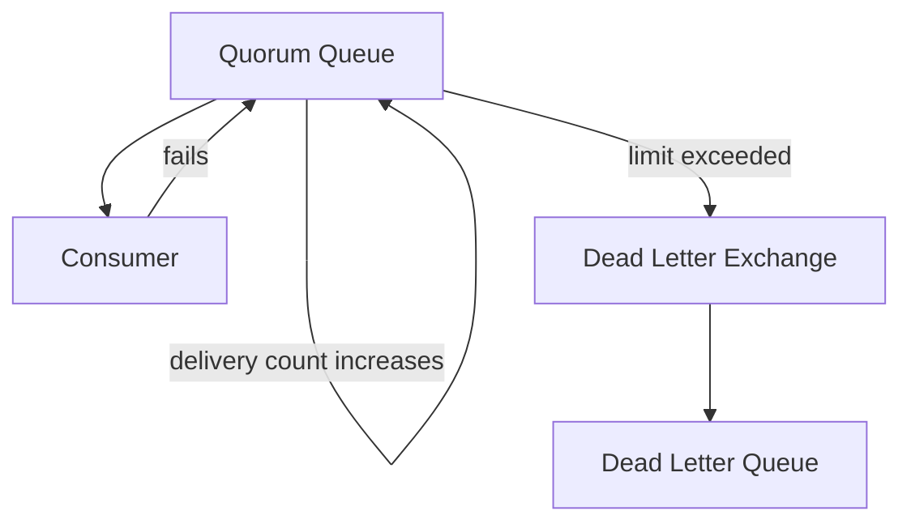

Prinsip:

- Jangan rely pada requeue infinite.
- Tetapkan delivery limit untuk workload critical.
- Arahkan exceeded delivery ke DLX/DLQ.
- Buat runbook replay/quarantine.

### 3.4 Quorum Queue dan Ordering

Quorum queue tetap queue, tetapi concurrency consumer bisa membuat processing completion out-of-order.

Jika butuh strict per-entity ordering:

- pakai single active consumer pattern bila sesuai,
- atau partition queue berdasarkan key,
- atau gunakan stream/log model jika replay dan ordering per partition lebih cocok.

Queue ordering bukan hanya broker order. Ordering end-to-end mencakup:

```text
publish order -> enqueue order -> delivery order -> processing order -> side-effect commit order
```

Jika consumer concurrency > 1, processing order bisa berbeda dari delivery order.

---

## 4. Lazy Queues and Disk-Backed Behavior

Historisnya, RabbitMQ punya lazy queues: queue yang berusaha memindahkan message ke disk sedini mungkin agar memory footprint rendah saat backlog besar. Pada versi modern, behavior queue storage berubah; sebagian lazy-mode semantics menjadi kurang relevan atau bergeser tergantung versi dan queue implementation.

Karena seri ini menargetkan engineering jangka panjang, mental model yang lebih aman adalah:

> Jangan mendesain backlog besar dengan asumsi “lazy queue akan menyelamatkan memory”. Desain backlog, disk, flow control, TTL, retention, dan consumer capacity secara eksplisit.

### 4.1 Masalah yang Ingin Diselesaikan Lazy Behavior

Jika producer jauh lebih cepat daripada consumer, queue depth naik. Message menumpuk. Broker harus menyimpan message di memory/disk. Jika terlalu banyak message ada di memory, broker memory pressure meningkat.

Lazy/disk-backed behavior mencoba mengurangi memory pressure dengan menyimpan backlog di disk.

Namun disk bukan magic:

- disk throughput terbatas,
- disk latency lebih tinggi,
- paging/reloading message memperlambat delivery,
- disk full bisa menghentikan broker,
- recovery bisa lama.

### 4.2 Kapan Backlog Besar Valid

Backlog besar kadang valid:

- consumer downstream maintenance,
- batch processing window,
- regulatory archive delay,
- disaster recovery catch-up,
- temporary spike.

Tetapi backlog besar harus punya budget:

```text
max backlog messages
max backlog bytes
max acceptable catch-up time
max disk usage
max consumer recovery rate
max message age
```

Tanpa angka ini, backlog besar hanyalah incident yang belum diberi nama.

### 4.3 Jangan Gunakan Queue sebagai Database

RabbitMQ queue bukan database untuk menyimpan event historis lama. Jika use case butuh retention panjang dan replay berkali-kali, pertimbangkan Kafka atau RabbitMQ Streams.

Queue cocok untuk work/subscription backlog. Stream/log cocok untuk retained ordered history.

---

## 5. Priority Queues

Priority queue memungkinkan message dengan priority lebih tinggi dideliver lebih dulu.

Contoh deklarasi:

```java
Map<String, Object> args = new HashMap<>();
args.put("x-max-priority", 10);

channel.queueDeclare(
    "case-review.priority.q",
    true,
    false,
    false,
    args
);
```

Publish:

```java
AMQP.BasicProperties props = new AMQP.BasicProperties.Builder()
    .deliveryMode(2)
    .priority(8)
    .messageId(commandId)
    .build();

channel.basicPublish("case.commands", "case.review", props, body);
```

### 5.1 Priority Queue Mengubah Fairness

Priority terlihat menarik, tetapi mengubah fairness dan latency distribution.

Jika high-priority traffic terus masuk, low-priority message bisa starvation.

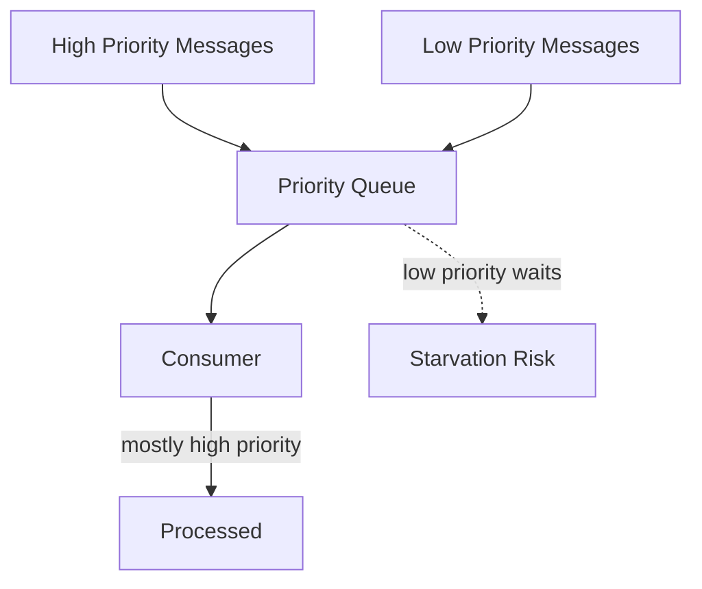

### 5.2 Priority Levels Jangan Terlalu Banyak

Priority level terlalu banyak meningkatkan overhead dan membuat behavior sulit diprediksi.

Lebih baik:

```text
0 = normal
5 = urgent
9 = critical
```

Daripada:

```text
1..255 dengan semantics tidak jelas
```

### 5.3 Alternatif Priority Queue

Kadang lebih baik memakai queue terpisah:

```text
case-review-critical.q
case-review-normal.q
```

Lalu consumer memilih polling/weighting:

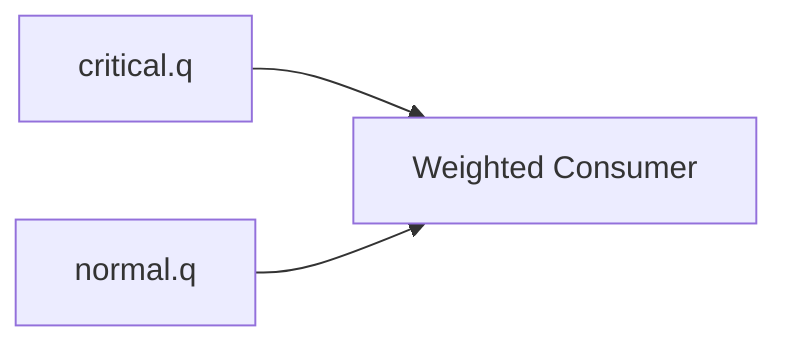

Kelebihan queue terpisah:

- observability lebih jelas,
- capacity bisa dipisah,
- starvation lebih mudah dikontrol,
- DLQ/retry berbeda.

Kekurangan:

- consumer logic lebih kompleks,
- topology bertambah.

Gunakan priority queue jika priority memang properti message dalam queue yang sama. Gunakan queue terpisah jika priority adalah class of service yang perlu capacity dan SLO berbeda.

---

## 6. TTL: Message TTL and Queue TTL

TTL menentukan umur message atau queue.

### 6.1 Message TTL

Message TTL membatasi berapa lama message boleh berada di queue.

Use case:

- notification yang basi setelah 1 jam,
- temporary workflow reminder,
- retry delay topology,
- request-reply response timeout.

Risiko:

- message expired bisa hilang atau dead-letter tergantung DLX,
- TTL terlalu pendek menyebabkan silent business gap,
- TTL tidak mengganti SLA monitoring.

### 6.2 Queue TTL

Queue TTL/expires menghapus queue jika tidak digunakan dalam periode tertentu.

Cocok untuk:

- temporary queues,
- dynamic reply queues,
- short-lived workers.

Tidak cocok untuk:

- business-critical durable queues,
- audit queues,
- long-lived subscriptions.

---

## 7. Queue Length Limit and Overflow

Queue length limit membatasi jumlah message atau total bytes dalam queue.

Ini adalah safety guard, bukan capacity planning penuh.

Contoh:

```java
Map<String, Object> args = new HashMap<>();
args.put("x-max-length", 100_000);
args.put("x-overflow", "reject-publish");

channel.queueDeclare(
    "case-notification.domain-events.q",
    true,
    false,
    false,
    args
);
```

### 7.1 Default Overflow: Drop Head / Dead-Letter Oldest

Secara umum, ketika queue mencapai batas dan overflow default berlaku, message paling lama dapat didrop atau dead-letter jika DLX dikonfigurasi.

Cocok untuk:

- telemetry,
- cache invalidation,
- non-critical signal,
- workload yang lebih mementingkan data terbaru.

Berbahaya untuk:

- commands,
- audit event,
- legal/regulatory workflow,
- payment/enforcement decision.

### 7.2 Reject Publish

Dengan `reject-publish`, message baru ditolak saat queue penuh. Jika publisher confirms aktif, publisher dapat menerima nack.

Cocok ketika producer harus merasakan backpressure.

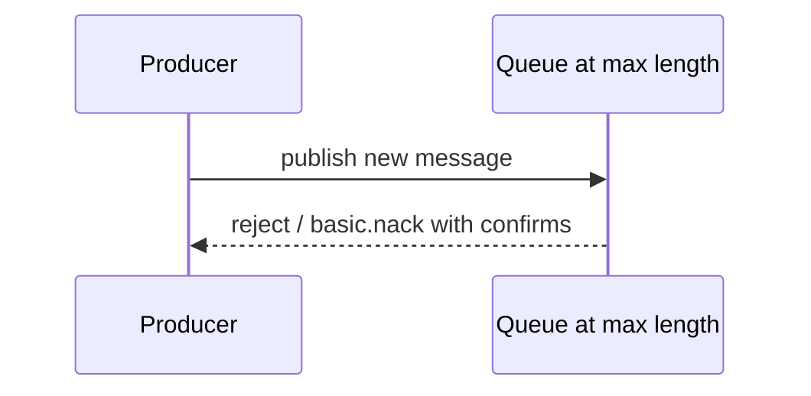

Trade-off:

- upstream harus punya retry/backoff,
- producer availability bisa terdampak,
- lebih baik daripada silent drop untuk business-critical workload.

### 7.3 Reject Publish DLX

Beberapa queue type/versi mendukung variasi overflow yang dead-letter message yang ditolak. Namun fitur support berbeda antar queue type, jadi jangan mengasumsikan semua queue type mendukung mode yang sama.

Prinsip:

> Queue limit policy harus diuji pada queue type dan versi RabbitMQ yang benar-benar dipakai.

### 7.4 Queue Limit sebagai Circuit Breaker

Queue limit bisa menjadi circuit breaker:

- jika downstream mati, backlog tidak tumbuh tanpa batas,
- producer dipaksa backoff,
- operator menerima alert,
- sistem mencegah disk full total.

Tetapi untuk regulated system, menolak publish command/event harus dianggap incident atau controlled degradation, bukan normal behavior tersembunyi.

---

## 8. Durability Matrix

Durability RabbitMQ adalah kombinasi beberapa layer.

| Exchange durable | Queue durable | Message persistent | Publisher confirm | Node survives? | Message safety expectation |
|---|---|---|---|---|---|
| No | Any | Any | Any | No | Topology/message bisa hilang |
| Yes | No | Any | Any | No | Queue/message bisa hilang |
| Yes | Yes | No | Any | Partial | Message transient bisa hilang |
| Yes | Yes | Yes | No | Better | Producer tidak tahu broker responsibility |
| Yes | Yes | Yes | Yes | Good on same node | Masih bukan cross-node HA jika non-replicated |
| Yes | Quorum | Yes | Yes | Better HA | Replicated, tetap perlu monitor quorum/disk |

Durability bukan binary. Untuk business-critical flow, minimum baseline:

- durable exchange,
- durable queue,
- persistent message,
- publisher confirms,
- manual consumer ack,
- idempotent consumer,
- DLQ/retry,
- broker storage monitoring,
- tested recovery.

---

## 9. Queue Type Decision Matrix

| Requirement | Recommended starting point | Reason |
|---|---|---|
| Critical command queue | Quorum queue | Replicated durability and safer failover |
| Audit event subscription | Quorum queue or stream | Queue if subscription backlog; stream if replay history |
| Temporary reply queue | Classic exclusive auto-delete | Short-lived and not critical after connection ends |
| Non-critical background job | Classic durable or transient | Lower overhead |
| High-throughput retained history | RabbitMQ Streams/Kafka | Queue is not long-term log |
| Priority handling | Priority classic queue or separate queues | Depends on fairness/observability needs |
| Very large backlog | Re-evaluate architecture | Queue can buffer, but not replace capacity planning |
| Legacy mirrored classic queue | Migrate | Modern RabbitMQ recommends quorum/streams instead |

---

## 10. Queue Declaration Arguments: Use Carefully

Queue behavior can be controlled by arguments or policies. Prefer policy for operational attributes that may need changes without app redeploy.

Examples:

```java
Map<String, Object> args = new HashMap<>();
args.put("x-queue-type", "quorum");
args.put("x-delivery-limit", 5);
args.put("x-dead-letter-exchange", "regulatory.platform.dlx");
args.put("x-dead-letter-routing-key", "case-escalation.commands.dlq");

channel.queueDeclare(
    "case-escalation.commands.q",
    true,
    false,
    false,
    args
);
```

Caution:

- Some arguments cannot be changed after queue creation.
- Declaring existing queue with different immutable args can fail.
- App-declared args can fight operator policies.
- Version compatibility matters.

Untuk production, dokumentasikan:

```yaml
queue: case-escalation.commands.q
owner: case-service
queueType: quorum
durable: true
messagePersistenceRequired: true
dlx: regulatory.platform.dlx
retryPolicy: 5 attempts, delayed retry, then quarantine
maxLength: 100000
overflow: reject-publish
expectedThroughput: 500 msg/s
maxBacklogBytes: 20GiB
recoveryTimeObjective: 30m
```

---

## 11. Replication and Leader Placement

Quorum queue punya leader. Semua queue leader yang panas di satu node bisa membuat node itu overload.

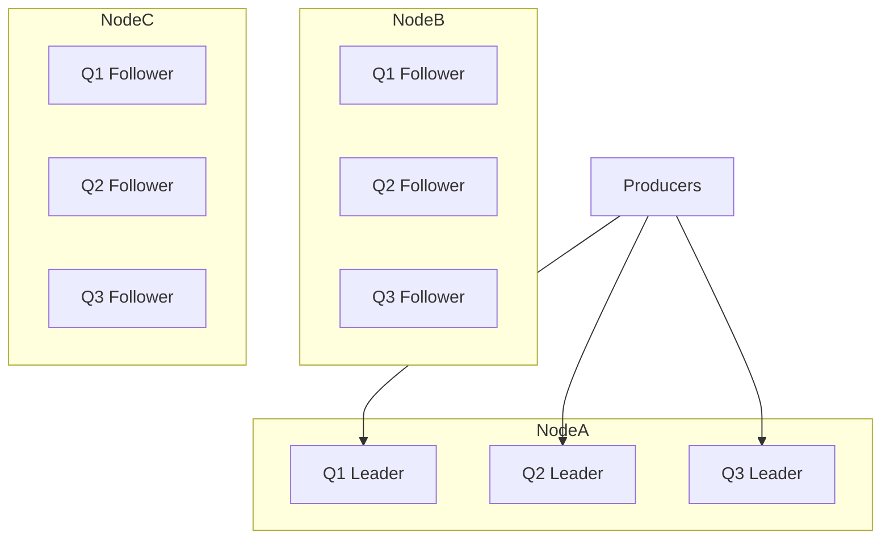

Masalah:

- NodeA CPU/disk/network tinggi.
- Failover NodeA menyebabkan banyak leader election.
- Throughput cluster tidak seimbang.

Mitigasi:

- distribute queue leaders,
- monitor per-node queue leader count,
- separate hot workloads,
- avoid too many tiny critical queues jika overhead besar,
- capacity test failover.

---

## 12. Consumer Concurrency and Queue Type

Queue type tidak menghapus problem consumer concurrency.

Jika queue punya 10 consumers:

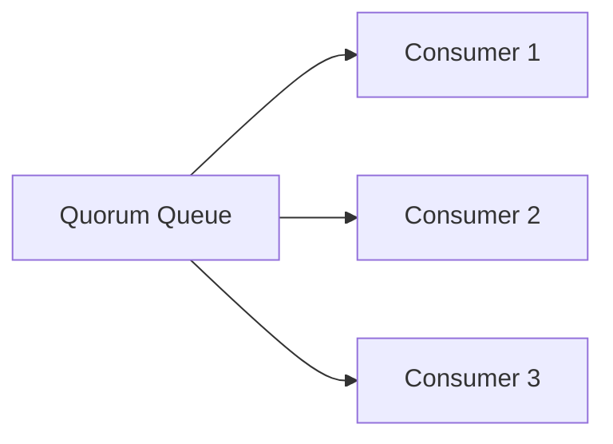

Maka:

- throughput naik,
- processing order bisa berubah,
- duplicate redelivery tetap mungkin,
- downstream bisa overload,
- unacked messages perlu dimonitor.

Untuk strict ordering per case:

- satu queue per partition key class,
- consistent hash exchange/plugin jika sesuai,
- single active consumer jika workload cocok,
- atau pindah ke stream/log partitioning model.

Jangan mengklaim “RabbitMQ queue menjaga ordering” tanpa menyebut consumer concurrency dan ack behavior.

---

## 13. Queue as Backpressure Surface

Queue depth adalah sinyal tekanan.

Tetapi queue depth sendiri tidak cukup.

Monitor:

| Metric | Makna |
|---|---|
| Ready messages | Belum dikirim ke consumer |
| Unacked messages | Sudah dikirim tetapi belum ack |
| Publish rate | Laju masuk |
| Deliver/get rate | Laju keluar broker |
| Ack rate | Laju selesai consumer |
| Redeliver rate | Failure/retry pressure |
| Consumer count | Kapasitas aktif |
| Message age | SLA backlog nyata |
| Disk free | Survival budget |
| Memory watermark | Broker pressure |

Important distinction:

```text
queue depth high + ack rate high = catch-up mungkin sehat
queue depth high + ack rate zero = consumer mati/stuck
unacked high + CPU low = consumer blocked downstream
redelivery high = poison/retry storm
publish rate > ack rate sustained = capacity deficit
```

---

## 14. Disk Full Failure Mode

Queue backlog akhirnya menjadi storage problem.

Failure chain:

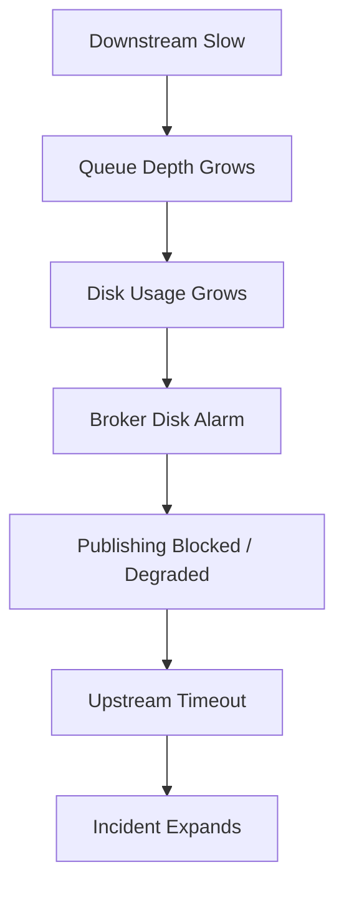

Mitigation design:

- per-queue max length/bytes,
- publisher backpressure handling,
- DLQ/quarantine capacity,
- disk alert well before alarm,
- consumer autoscaling or manual runbook,
- reject-publish for critical backpressure rather than silent drop,
- replay/reprocess tool.

For regulated systems, disk-full prevention is part of defensibility. “The queue filled up” is not a root cause; it is a symptom of missing capacity/failure control.

---

## 15. DLQ Strategy Depends on Queue Type

Dead-lettering is routing. Queue type controls original queue behavior, but DLQ itself also needs queue type decision.

Question:

- Should DLQ be quorum?
- How long should DLQ keep messages?
- Can DLQ grow without bound?
- Who owns replay?
- Are DLQ messages PII-sensitive?
- What schema is used for DLQ metadata?

Pattern:

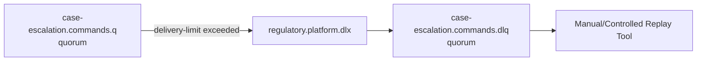

DLQ should not be a trash bin. It is a quarantine system.

DLQ payload should preserve:

- original body,
- original properties,
- routing key,
- exchange,
- failure reason if available,
- first failure time,
- last failure time,
- consumer/app version,
- correlation ID,
- trace ID.

---

## 16. Retry Queue Topology and Queue Type

A common RabbitMQ retry design uses TTL + DLX:

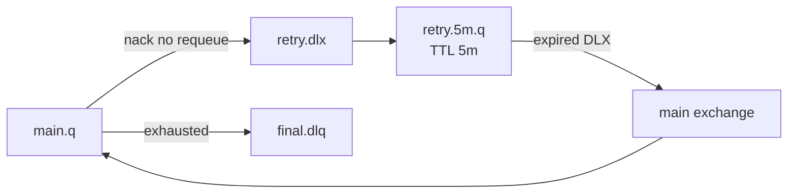

Queue type choices:

- Main critical queue: quorum.
- Retry queues: depends on criticality and volume.
- Final DLQ: often quorum if messages are critical evidence.

Trade-off:

- Quorum retry queues improve safety but increase replication cost.
- Classic retry queues reduce overhead but may lose delayed messages during failure if not durable/persistent/available enough.

For critical enforcement actions, losing retry message may mean missing legal deadline. That changes queue type decision.

---

## 17. Version and Feature Compatibility

RabbitMQ evolves. Queue features differ by version and queue type. For example, mirrored classic queues were deprecated and then removed in modern major versions; quorum queues do not support every classic queue feature; lazy mode behavior depends on queue implementation/version.

Engineering rule:

> Treat RabbitMQ queue behavior as versioned infrastructure contract. Validate against the exact broker version and enabled feature flags/policies used in production.

Do not rely on:

- old blog posts without version,
- tutorials using default queue type,
- StackOverflow snippets,
- local Docker default behavior,
- assumptions from other brokers.

Maintain a platform compatibility matrix:

```text
RabbitMQ version: 4.x
Default queue type: quorum/classic? controlled by policy
Allowed queue types: quorum, classic, stream
Mirrored classic queues: not allowed
Lazy mode: not allowed / version-specific
Priority queues: allowed only for approved workloads
Max queue length policy: mandatory for non-temporary queues
DLX policy: mandatory for critical queues
```

---

## 18. Case Study: Case Escalation Command Queue

Requirement:

- `case.escalate` command must not be lost.
- Duplicate processing is acceptable only if idempotent.
- SLA deadline is legally important.
- Consumer calls database and notification service.
- If message invalid, quarantine.
- If downstream unavailable, retry with delay.

Design:

```yaml
exchange: regulatory.case.commands
type: direct
routingKey: case.escalate
queue: case-escalation.commands.q
queueType: quorum
durable: true
messagePersistence: required
publisherConfirms: required
consumerAck: manual
prefetch: 10
deliveryLimit: 5
dlx: regulatory.platform.dlx
retry: exponential delayed retry
finalDlq: case-escalation.commands.dlq
idempotencyKey: commandId
```

Flow:

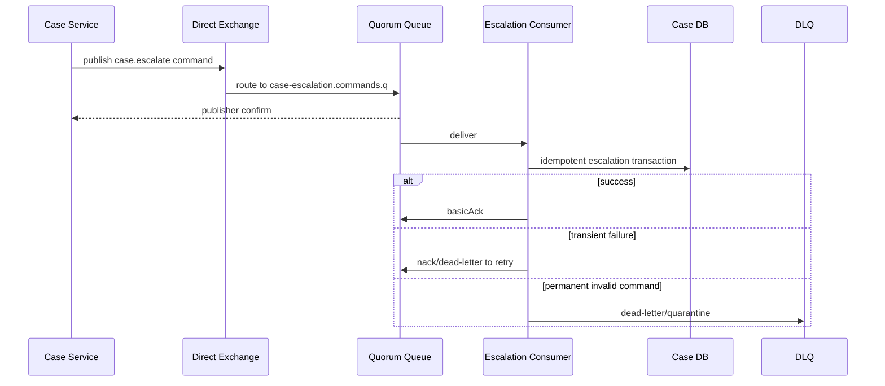

Why quorum?

- Command is business-critical.
- Queue backlog is part of legal process state until consumed.
- Node failure should not erase command.

Why manual ack?

- Ack must happen after database transaction safe point.

Why idempotency?

- Redelivery can happen after consumer crash.

Why DLQ?

- Invalid command should not block queue forever.

---

## 19. Case Study: Non-Critical Notification Queue

Requirement:

- Send notification after case created/escalated.
- Missing one notification is bad but not legally state-changing.
- User can see status in portal anyway.
- High volume spike possible.
- Old notification after 24h is useless.

Possible design:

```yaml
exchange: regulatory.domain.events
queue: case-notification.domain-events.q
queueType: classic or quorum depending on business SLO
durable: true
messageTtl: 24h
maxLength: 500000
overflow: reject-publish or drop-head depending business decision
dlx: case-notification.domain-events.dlq
retry: delayed retry 5m/30m/2h
```

Decision discussion:

- If notification is compliance-required, use quorum and strict DLQ.
- If notification is convenience, classic may be acceptable.
- If old messages are worthless, TTL is valid.
- If queue full, `drop-head` may be acceptable only if business explicitly accepts losing oldest notifications.

Do not let engineer choose this alone. This is product/compliance decision encoded as infrastructure.

---

## 20. Anti-Patterns

### 20.1 Durable Classic Queue Assumed as HA

Durable means survives broker restart on same node. It does not automatically mean replicated across nodes.

Better: choose quorum queue or stream if HA/replication is required.

### 20.2 Quorum Queue for Everything

Quorum queue adds replication cost. Using it for every temporary/non-critical queue can waste disk and reduce throughput.

Better: classify workload criticality.

### 20.3 Priority Queue as SLA Strategy

Priority does not create capacity. It only changes service order. If system is overloaded, lower priority may starve.

Better: separate capacity pools or enforce admission control.

### 20.4 Unlimited Queue as Safety

Unlimited queue hides downstream failure until disk/memory incident.

Better: bounded queue, backpressure, alert, and explicit degradation.

### 20.5 DLQ Without Owner

DLQ with no owner is delayed data loss.

Better: define ownership, alert, replay tool, retention, and audit process.

### 20.6 Retry Queue Without Attempt Budget

Infinite delayed retry creates unbounded repeated failure.

Better: retry budget, delivery count, final DLQ.

### 20.7 Version-Blind Queue Arguments

Copying `x-queue-mode=lazy` or mirrored classic settings from old examples can break on modern RabbitMQ.

Better: validate against exact production RabbitMQ version.

---

## 21. Operational Runbook per Queue

Every important queue should have a runbook.

Template:

```md
# Queue Runbook: case-escalation.commands.q

## Owner
Case Platform Team

## Purpose
Durable command queue for legally significant case escalation.

## Queue Type
Quorum queue, 3 members.

## Expected Rates
- publish: 50 msg/s normal, 500 msg/s peak
- consume: 100 msg/s normal capacity

## SLO
- p95 processing latency < 30s
- max backlog age < 5m

## Alerts
- ready > 10,000 for 5m
- unacked > 1,000 for 5m
- redelivery rate > 5 msg/s
- DLQ rate > 0 for critical commands
- disk free < 30%

## Failure Actions
1. Check consumer deployment health.
2. Check downstream DB/notification dependencies.
3. Inspect sample message from queue/DLQ.
4. Pause producer if reject/nack storm occurs.
5. Scale consumers only if downstream can handle it.
6. Replay DLQ after fix with idempotency check.

## Do Not
- Purge queue without incident commander approval.
- Requeue DLQ blindly.
- Increase max length without disk capacity review.
```

---

## 22. Review Checklist

### Queue Type

- [ ] Queue type explicitly chosen.
- [ ] Choice justified by reliability requirement.
- [ ] Feature compatibility checked for RabbitMQ production version.
- [ ] Mirrored classic queues avoided for new design.
- [ ] Quorum queue used for critical replicated workloads.
- [ ] Classic queue used intentionally for lower-risk/transient workloads.

### Durability

- [ ] Durable queue if message must survive restart.
- [ ] Persistent messages if message must survive restart.
- [ ] Durable exchange used.
- [ ] Publisher confirms enabled for critical publishers.
- [ ] Manual ack used for critical consumers.

### Capacity

- [ ] Expected publish/consume rate known.
- [ ] Backlog budget known.
- [ ] Queue length/byte limit considered.
- [ ] Overflow behavior explicit.
- [ ] Disk capacity model exists.
- [ ] Message TTL is business-approved if used.

### Failure Handling

- [ ] DLX configured.
- [ ] DLQ owner defined.
- [ ] Retry budget defined.
- [ ] Poison message handling defined.
- [ ] Idempotency key defined.
- [ ] Replay process exists.

### Observability

- [ ] Ready/unacked monitored.
- [ ] Redelivery monitored.
- [ ] Consumer count monitored.
- [ ] Message age monitored.
- [ ] Disk/memory alarm monitored.
- [ ] Queue leader distribution monitored for quorum workloads.

---

## 23. Latihan Terarah

### Latihan 1 — Queue Classification

Klasifikasikan queue berikut:

```text
case-audit.domain-events.q
case-notification.domain-events.q
case-escalation.commands.q
report-preview-render.q
temporary-reply-abc123.q
enforcement-decision.commands.q
```

Untuk masing-masing, tentukan:

- queue type,
- durable atau tidak,
- persistent message atau tidak,
- DLQ atau tidak,
- TTL atau tidak,
- max length/overflow,
- alasan failure requirement.

### Latihan 2 — Disk Full Simulation

Skenario:

```text
Notification consumer mati 6 jam.
Producer tetap publish 2,000 msg/s.
Average message size 4 KB.
```

Hitung:

- total message backlog,
- total body bytes minimum,
- apakah disk budget cukup,
- catch-up time jika consumer bisa 5,000 msg/s setelah recovery,
- alert apa yang harus berbunyi sebelum disk alarm.

### Latihan 3 — Priority Decision

Skenario:

```text
Case review punya normal, urgent, critical.
Critical tidak boleh menunggu normal.
Normal tetap harus selesai dalam 24 jam.
```

Bandingkan:

- satu priority queue,
- tiga queue terpisah,
- weighted consumer,
- admission control.

Pilih desain dan jelaskan trade-off.

---

## 24. Ringkasan

Queue type adalah keputusan reliability dan operability.

Classic queue cocok untuk banyak workload umum, temporary, dan non-critical. Quorum queue cocok untuk critical replicated queue dan pengganti desain mirrored classic legacy. Priority queue membantu service ordering tetapi bisa membuat starvation. Lazy/disk-backed behavior bukan pengganti capacity planning. TTL dan length limit adalah safety control yang harus dikaitkan dengan business meaning. Overflow behavior harus dipilih secara sadar: drop oldest, dead-letter, atau reject publish memiliki konsekuensi berbeda.

Prinsip utama:

```text
Queue type follows failure requirement.
Durability is multi-layer.
Replication has cost.
Backlog needs budget.
DLQ needs owner.
Retry needs limit.
Monitoring needs message age, not only queue depth.
```

Di sistem regulatory/case-management, queue bukan sekadar buffer. Queue bisa menjadi temporary holder untuk proses hukum, escalation command, audit event, atau notification obligation. Karena itu, setiap queue critical harus punya owner, SLO, failure policy, replay strategy, dan runbook.

Part berikutnya akan membahas RabbitMQ consumer design: prefetch, ack, nack, requeue, backpressure, competing consumers, dan slow-consumer failure modes secara lebih dalam.

---

## References

- RabbitMQ Documentation — Quorum Queues: https://www.rabbitmq.com/docs/quorum-queues
- RabbitMQ Documentation — Classic Queues: https://www.rabbitmq.com/docs/classic-queues
- RabbitMQ Documentation — Queue Length Limit: https://www.rabbitmq.com/docs/maxlength
- RabbitMQ Documentation — Consumer Acknowledgements and Publisher Confirms: https://www.rabbitmq.com/docs/confirms
- RabbitMQ Documentation — Lazy Queues: https://www.rabbitmq.com/docs/lazy-queues
- RabbitMQ Documentation — Classic Queue Mirroring Deprecated: https://www.rabbitmq.com/docs/3.13/ha
- RabbitMQ Documentation — Java Client API Guide: https://www.rabbitmq.com/client-libraries/java-api-guide
