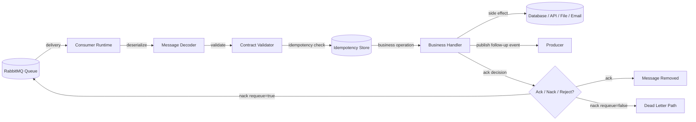
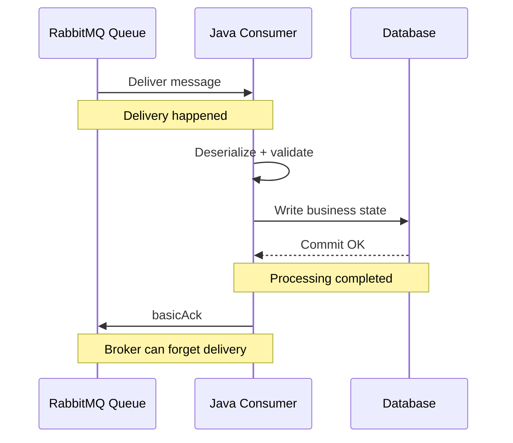
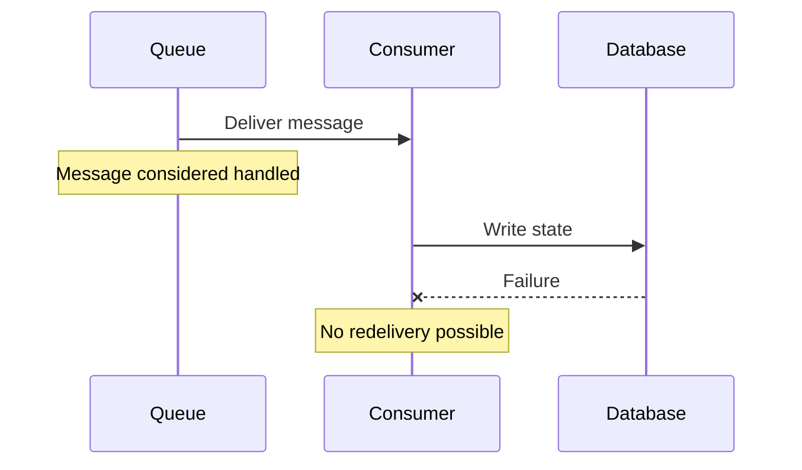
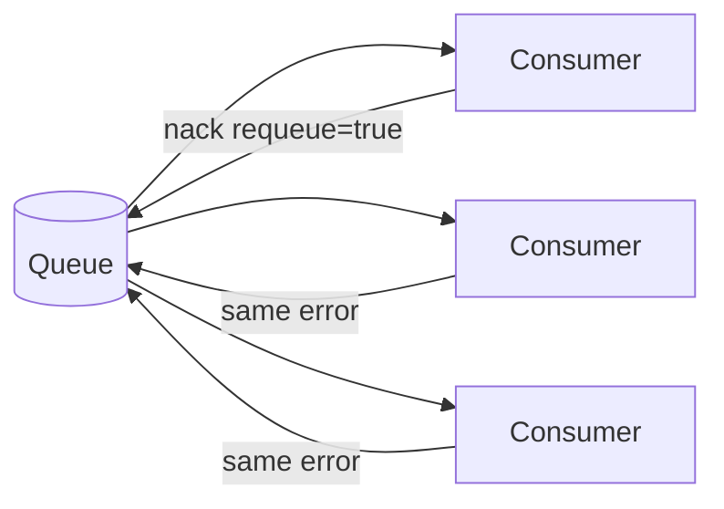
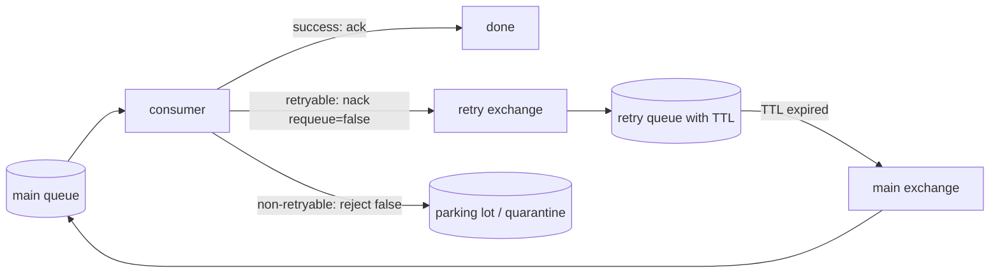
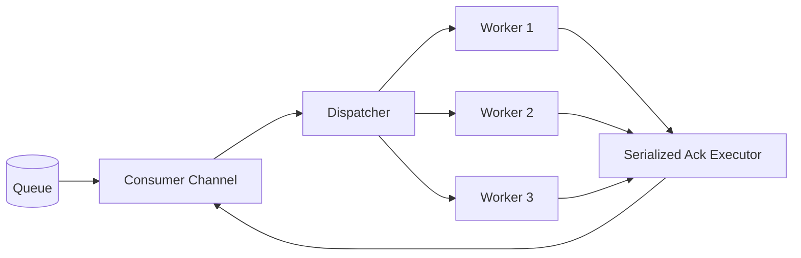
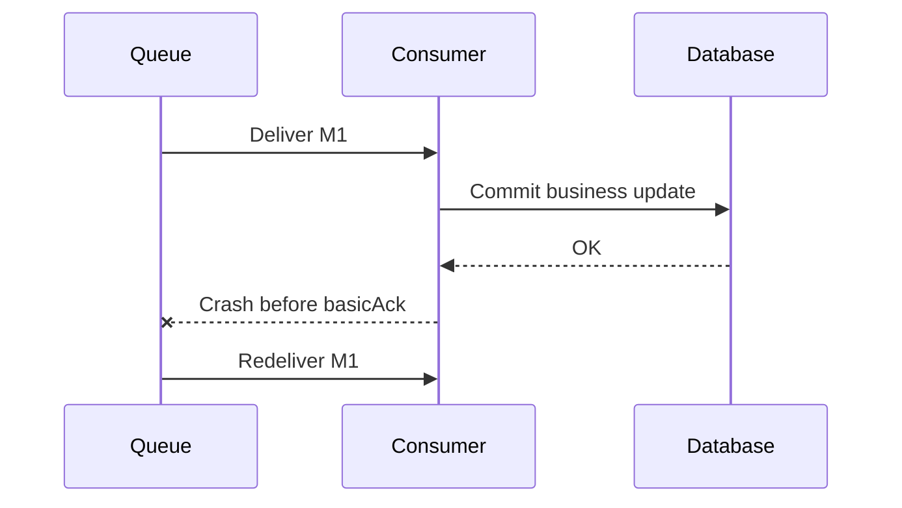
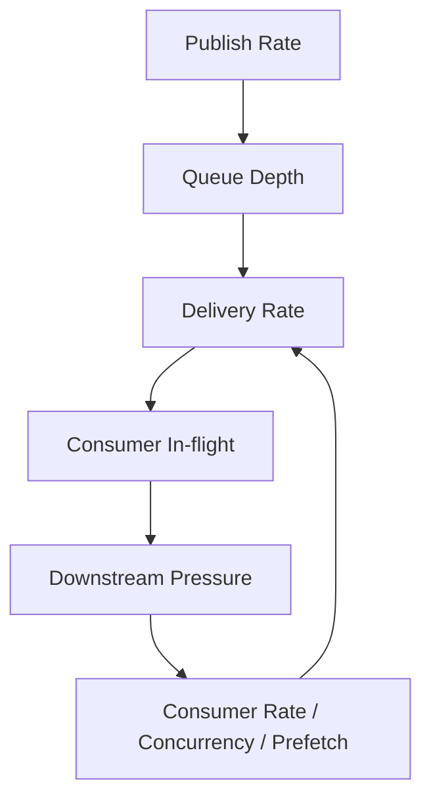
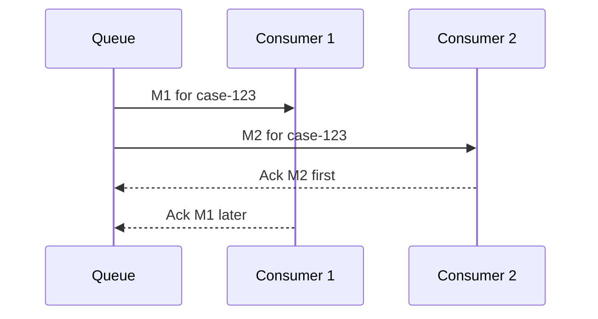
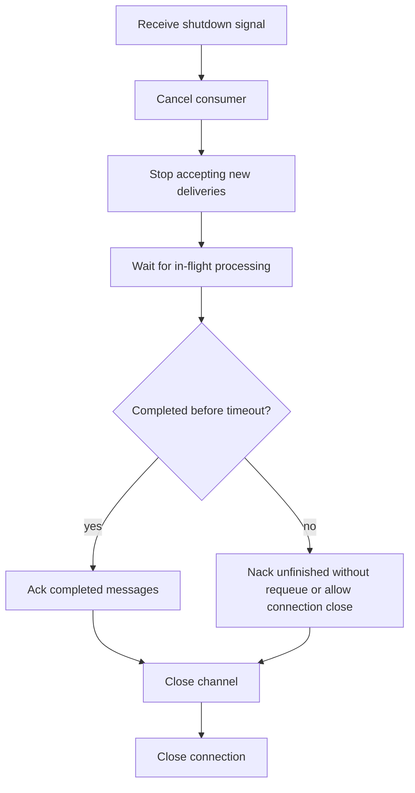

------
title: Learn Java Messaging and Event Streaming - Part 011
description: Advanced RabbitMQ consumer design covering manual acknowledgement, prefetch, nack/reject, requeue behaviour, backpressure, batching, idempotency, concurrency, and production failure modelling.
series: learn-java-messaging-event-streaming
seriesTitle: Learn Java Messaging and Event Streaming
order: 11
partTitle: RabbitMQ Consumer Design: Prefetch, Ack, Nack, Requeue, and Backpressure
tags:
- java
- rabbitmq
- messaging
- amqp
- backpressure
- acknowledgement
- reliability
- distributed-systems
date: 2026-06-28
---

# Part 011 — RabbitMQ Consumer Design: Prefetch, Ack, Nack, Requeue, and Backpressure

Bagian ini membahas desain consumer RabbitMQ dari sudut pandang produksi. Targetnya bukan sekadar tahu cara memanggil `basicConsume`, tetapi mampu menjawab:

- Berapa `prefetch` yang aman?
- Kapan `basicAck`, `basicNack`, `basicReject`, atau requeue dipakai?
- Bagaimana mencegah requeue storm?
- Bagaimana membedakan retryable error, poison message, dan downstream overload?
- Bagaimana consumer concurrency memengaruhi ordering, memory, fairness, dan database pressure?
- Bagaimana membuat consumer yang stabil saat throughput naik, dependency lambat, atau broker sedang redeliver message lama?

RabbitMQ consumer adalah control point yang paling sering menentukan apakah sistem tetap stabil atau berubah menjadi incident. Producer bisa sangat cepat, broker bisa menahan backlog, tetapi consumer-lah yang mengubah message menjadi side effect bisnis: update database, panggil API eksternal, kirim email, ubah status case, atau publish event lanjutan.

---

## 1. Posisi Bagian Ini dalam Framework Kaufman

Dalam pendekatan *The First 20 Hours*, bagian ini masuk ke tahap:

1. **Deconstruct the skill**  
   Skill “consume message reliably” dipecah menjadi acknowledgement, prefetch, concurrency, retry, idempotency, dan observability.

2. **Learn enough to self-correct**  
   Setelah bagian ini, sinyal seperti `messages_unacknowledged`, consumer utilisation, redelivery spike, dan queue depth tidak lagi dibaca sebagai angka mentah, tetapi sebagai gejala mekanisme kontrol.

3. **Remove practice barriers**  
   Consumer template yang aman diberikan supaya tidak terjebak default auto-ack atau infinite requeue.

4. **Practice deliberately**  
   Latihan diarahkan ke failure drills: crash before ack, slow dependency, poison payload, duplicate delivery, dan requeue storm.

---

## 2. Mental Model: Consumer Bukan “Function yang Dipanggil Broker”

Consumer sering digambarkan terlalu sederhana:

```text
queue -> consumer -> process
```

Model produksi yang lebih akurat:



Consumer adalah **state transition executor**. Message tidak dianggap selesai ketika diterima. Message selesai hanya ketika seluruh business invariant yang diwajibkan sudah terpenuhi dan keputusan ack sudah benar.

Untuk sistem enforcement/case-management, contoh invariant:

> `CaseEscalationRequested` boleh di-ack hanya setelah escalation record tersimpan, idempotency key tercatat, dan audit entry berhasil dibuat.

Kalau audit entry gagal tetapi consumer tetap ack, sistem bisa kehilangan jejak defensibility.

---

## 3. Delivery, Processing, dan Completion Adalah Tiga Hal Berbeda

RabbitMQ bisa mengirim message ke consumer. Itu **delivery**.

Consumer bisa mulai menjalankan handler. Itu **processing**.

Business operation bisa berhasil dan aman untuk tidak diulang. Itu **completion**.



Ack harus ditempatkan setelah completion, bukan setelah delivery.

Anti-pattern:

```java
// Salah untuk workload penting: ack terlalu awal.
deliverCallback = (consumerTag, delivery) -> {
    channel.basicAck(delivery.getEnvelope().getDeliveryTag(), false);
    processBusinessOperation(delivery); // jika gagal, message sudah hilang dari queue
};
```

Pattern yang benar:

```java
deliverCallback = (consumerTag, delivery) -> {
    long tag = delivery.getEnvelope().getDeliveryTag();
    try {
        processBusinessOperation(delivery);
        channel.basicAck(tag, false);
    } catch (RetryableException e) {
        channel.basicNack(tag, false, false); // kirim ke retry/DLX, bukan requeue langsung tanpa kontrol
    } catch (PoisonMessageException e) {
        channel.basicReject(tag, false); // quarantine/dead-letter
    }
};
```

---

## 4. Auto Ack vs Manual Ack

RabbitMQ Java client mendukung mode auto acknowledgement dan manual acknowledgement.

### 4.1 Auto Ack

Auto ack berarti message dianggap selesai segera setelah dikirim ke consumer. Ini cepat, tetapi tidak aman untuk workload penting.

Cocok untuk:

- telemetry yang boleh hilang,
- cache warmup yang bisa diulang dari sumber lain,
- best-effort notification,
- local development demo.

Tidak cocok untuk:

- payment,
- case state transition,
- regulatory audit,
- enforcement escalation,
- inventory update,
- email/SMS yang punya consequence,
- workflow yang harus defensible.

```java
boolean autoAck = true;
channel.basicConsume(queueName, autoAck, deliverCallback, cancelCallback);
```

Risiko auto ack:



### 4.2 Manual Ack

Manual ack memberi consumer hak untuk menentukan kapan message selesai.

```java
boolean autoAck = false;
channel.basicConsume(queueName, autoAck, deliverCallback, cancelCallback);
```

Manual ack adalah default mental model untuk sistem yang membutuhkan correctness.

---

## 5. `basicAck`: Satu Message atau Banyak Message

RabbitMQ acknowledgement memakai `deliveryTag`. Pada satu channel, delivery tag bertambah secara monoton.

```java
channel.basicAck(deliveryTag, false);
```

Parameter kedua adalah `multiple`.

- `false`: ack hanya message dengan delivery tag itu.
- `true`: ack semua unacknowledged messages sampai delivery tag tersebut pada channel yang sama.

Batch ack bisa meningkatkan throughput, tetapi berbahaya jika handler memproses message secara paralel di luar urutan.

### 5.1 Aman untuk Ack Per Message

```java
long tag = delivery.getEnvelope().getDeliveryTag();
process(delivery);
channel.basicAck(tag, false);
```

Ini sederhana dan aman untuk mayoritas workload.

### 5.2 Batch Ack Hanya Jika Ordering Processing Terkontrol

Batch ack cocok bila:

- consumer memproses message secara sequential pada satu channel,
- semua message sampai tag tertentu sudah benar-benar complete,
- tidak ada worker thread yang menyelesaikan message di luar urutan,
- duplicate akibat crash masih bisa ditoleransi via idempotency.

Salah:

```java
// Salah: worker thread paralel, tetapi ack multiple bisa meng-ack message yang belum selesai.
executor.submit(() -> process(delivery));
channel.basicAck(deliveryTag, true);
```

Benar secara prinsip:

```java
// Sequential processing; safe untuk multiple ack jika semua sebelumnya selesai.
process(delivery);
completedDeliveryTag = delivery.getEnvelope().getDeliveryTag();
if (++processedSinceLastAck >= ackBatchSize) {
    channel.basicAck(completedDeliveryTag, true);
    processedSinceLastAck = 0;
}
```

Namun untuk sistem bisnis kompleks, ack per message sering lebih layak daripada optimasi dini.

---

## 6. `basicReject` vs `basicNack`

RabbitMQ menyediakan dua bentuk negative acknowledgement:

```java
channel.basicReject(deliveryTag, requeue);
channel.basicNack(deliveryTag, multiple, requeue);
```

Perbedaan praktis:

| Operation | Bisa bulk? | Cocok untuk |
|---|---:|---|
| `basicReject` | Tidak | Tolak satu message |
| `basicNack` | Ya | Tolak satu atau banyak message |

Parameter `requeue` adalah keputusan penting.

| `requeue` | Efek | Risiko |
|---|---|---|
| `true` | Message masuk kembali ke queue | Requeue storm, hot poison loop |
| `false` | Message dibuang atau dead-letter jika DLX dikonfigurasi | Perlu DLQ/quarantine agar tidak hilang diam-diam |

Rule of thumb:

> Jangan gunakan `requeue=true` sebagai default retry mechanism.

`requeue=true` boleh dipakai untuk transient consumer-local failure, misalnya graceful shutdown sebelum processing dimulai. Untuk dependency error seperti database down, API timeout, schema mismatch, atau validation error, lebih aman memakai retry topology/DLX dengan delay dan retry budget.

---

## 7. Requeue Storm

Requeue storm terjadi saat consumer terus menolak message dan mengembalikannya ke queue tanpa delay yang berarti.



Gejala:

- CPU consumer naik,
- throughput bisnis nol,
- message delivery rate tinggi,
- redelivery count naik,
- log penuh error yang sama,
- downstream semakin tertekan,
- queue terlihat “bergerak” tetapi tidak selesai.

Penyebab umum:

- poison payload,
- missing reference data,
- downstream API down,
- schema tidak kompatibel,
- bug handler deterministik,
- database constraint violation,
- permission/secret salah,
- requeue digunakan untuk semua exception.

Pattern aman:



---

## 8. Prefetch sebagai Backpressure Valve

Prefetch membatasi jumlah message yang boleh berada dalam keadaan **delivered but unacknowledged** untuk consumer/channel.

Tanpa limit yang benar, broker bisa mengirim terlalu banyak message ke consumer sehingga memory consumer penuh atau work-in-progress membesar tanpa kontrol.

```java
int prefetchCount = 20;
channel.basicQos(prefetchCount);
```

Mental model:

```text
max in-flight per consumer ~= prefetch_count
max in-flight total ~= consumers * prefetch_count
```

Jika ada 20 consumer dan prefetch 100, maka sistem bisa punya sekitar 2.000 message sedang diproses atau tertahan di client sebelum ack.

### 8.1 Prefetch Terlalu Kecil

Efek:

- throughput rendah,
- consumer sering idle menunggu round-trip,
- dependency cepat tetapi pipeline dangkal.

Cocok bila:

- processing berat,
- ordering penting,
- side effect mahal,
- message payload besar,
- dependency downstream punya kapasitas kecil.

### 8.2 Prefetch Terlalu Besar

Efek:

- memory pressure,
- unfair dispatch,
- message lama “terkunci” di consumer lambat,
- redelivery besar saat consumer crash,
- latency tail memburuk,
- database/API downstream kena burst.

Cocok hanya bila:

- handler sangat cepat,
- payload kecil,
- consumer stabil,
- downstream mampu menerima burst,
- idempotency kuat,
- observability matang.

---

## 9. Menentukan Prefetch dengan Cara Engineering

Jangan memilih angka prefetch karena contoh tutorial.

Mulai dari kapasitas downstream.

Misalnya:

- database aman menerima 300 write/second untuk operasi tertentu,
- ada 10 consumer instances,
- setiap instance memiliki 4 worker thread,
- rata-rata processing 100 ms,
- target utilisasi 70%.

Throughput per worker kira-kira:

```text
1 / 0.1s = 10 msg/s
```

Total worker:

```text
10 instances * 4 workers = 40 workers
```

Potensi throughput:

```text
40 * 10 = 400 msg/s
```

Jika downstream aman 300 msg/s, sistem consumer harus dibatasi.

Prefetch awal yang masuk akal:

```text
prefetch per instance ~= worker_threads * small_multiplier
prefetch = 4 * 2 = 8
```

Lalu ukur:

- messages ready,
- messages unacknowledged,
- processing latency,
- DB latency,
- consumer CPU,
- redelivery rate,
- p95/p99 end-to-end latency.

Rule praktis:

| Workload | Starting prefetch |
|---|---:|
| Long-running CPU/IO task | 1–4 |
| Business transaction with DB write | worker count × 1–2 |
| Fast idempotent handler | worker count × 2–5 |
| High-throughput stateless transform | benchmark-driven, often higher |
| Payload besar | rendah, ukur memory |

---

## 10. Consumer Concurrency: Channel, Thread, dan Worker Pool

RabbitMQ Java client `Channel` tidak boleh diperlakukan sebagai object bebas untuk concurrent publishing/acking tanpa disiplin. Dalam desain consumer, masalah utama adalah menggabungkan:

- thread yang menerima delivery,
- worker thread yang memproses message,
- thread yang mengirim ack/nack,
- channel ownership.

Pattern sederhana dan aman:

```text
1 consumer thread
1 channel
process sequentially
ack on same thread/channel
```

Pattern ini stabil tetapi throughput terbatas.

Pattern umum untuk throughput lebih tinggi:



Jika memproses paralel, pastikan:

- jumlah worker selaras dengan prefetch,
- ack/nack dikirim dengan channel-safe discipline,
- tidak memakai `multiple=true` sembarangan,
- shutdown menunggu in-flight selesai atau melakukan nack terkontrol,
- semua side effect idempotent.

---

## 11. Java Consumer Skeleton yang Lebih Aman

Contoh ini sengaja tidak memakai framework agar kontraknya terlihat jelas.

```java
import com.rabbitmq.client.*;

import java.nio.charset.StandardCharsets;
import java.time.Duration;
import java.util.Map;
import java.util.concurrent.*;

public final class ReliableRabbitConsumer implements AutoCloseable {
    private final Connection connection;
    private final Channel channel;
    private final ExecutorService workers;
    private final String queueName;

    public ReliableRabbitConsumer(ConnectionFactory factory,
                                  String queueName,
                                  int prefetch,
                                  int workerThreads) throws Exception {
        this.connection = factory.newConnection("case-event-consumer");
        this.channel = connection.createChannel();
        this.queueName = queueName;
        this.workers = Executors.newFixedThreadPool(workerThreads);

        channel.basicQos(prefetch);
    }

    public void start() throws Exception {
        boolean autoAck = false;

        DeliverCallback deliverCallback = (consumerTag, delivery) -> {
            workers.submit(() -> handleDelivery(delivery));
        };

        CancelCallback cancelCallback = consumerTag -> {
            // Consumer cancelled by broker or application.
            // In production, emit metric + trigger graceful shutdown/reconnect.
        };

        channel.basicConsume(queueName, autoAck, deliverCallback, cancelCallback);
    }

    private void handleDelivery(Delivery delivery) {
        long tag = delivery.getEnvelope().getDeliveryTag();

        try {
            MessageEnvelope envelope = decode(delivery);
            validate(envelope);
            processIdempotently(envelope);

            ack(tag);
        } catch (RetryableProcessingException e) {
            nackWithoutRequeue(tag);
        } catch (PoisonMessageException e) {
            rejectWithoutRequeue(tag);
        } catch (Exception e) {
            // Unknown exception should not create hot requeue loop.
            // Prefer DLQ/retry budget over requeue=true.
            nackWithoutRequeue(tag);
        }
    }

    private MessageEnvelope decode(Delivery delivery) {
        String body = new String(delivery.getBody(), StandardCharsets.UTF_8);
        AMQP.BasicProperties props = delivery.getProperties();
        Map<String, Object> headers = props.getHeaders();
        return new MessageEnvelope(body, props.getMessageId(), props.getCorrelationId(), headers);
    }

    private void validate(MessageEnvelope envelope) {
        if (envelope.messageId() == null || envelope.messageId().isBlank()) {
            throw new PoisonMessageException("message_id is required for idempotency");
        }
    }

    private void processIdempotently(MessageEnvelope envelope) {
        // 1. Check idempotency key.
        // 2. Apply business operation in transaction.
        // 3. Store processed key.
        // 4. Optionally publish follow-up event using outbox.
    }

    private void ack(long tag) {
        synchronized (channel) {
            try {
                channel.basicAck(tag, false);
            } catch (Exception e) {
                // Ack failure means broker may redeliver.
                // Handler must be idempotent.
                throw new RuntimeException(e);
            }
        }
    }

    private void nackWithoutRequeue(long tag) {
        synchronized (channel) {
            try {
                channel.basicNack(tag, false, false);
            } catch (Exception e) {
                throw new RuntimeException(e);
            }
        }
    }

    private void rejectWithoutRequeue(long tag) {
        synchronized (channel) {
            try {
                channel.basicReject(tag, false);
            } catch (Exception e) {
                throw new RuntimeException(e);
            }
        }
    }

    @Override
    public void close() throws Exception {
        workers.shutdown();
        workers.awaitTermination(30, TimeUnit.SECONDS);
        channel.close();
        connection.close();
    }

    record MessageEnvelope(String body,
                           String messageId,
                           String correlationId,
                           Map<String, Object> headers) {
    }

    static final class RetryableProcessingException extends RuntimeException {
        RetryableProcessingException(String message) { super(message); }
    }

    static final class PoisonMessageException extends RuntimeException {
        PoisonMessageException(String message) { super(message); }
    }
}
```

Catatan penting:

- Contoh ini menunjukkan konsep, bukan production-ready library.
- Untuk parallel worker, ack pada channel perlu disiplin thread-safety.
- Unknown exception diarahkan ke DLX/retry path, bukan requeue langsung.
- Ack failure harus dianggap bisa menghasilkan duplicate redelivery.
- Handler harus idempotent.

---

## 12. Error Classification: Jangan Satu Catch untuk Semua

Consumer production-grade harus mengklasifikasikan error.

| Error | Contoh | Action |
|---|---|---|
| Validation error | field wajib kosong, event type tidak dikenal | reject/nack without requeue ke quarantine |
| Schema incompatible | payload tidak bisa decode | quarantine + alert |
| Business conflict permanent | case sudah closed dan event tidak valid | domain decision: ignore idempotently atau quarantine |
| Duplicate | message id sudah diproses | ack |
| Retryable dependency | DB timeout, HTTP 503 | nack without requeue ke retry topology |
| Capacity overload | thread pool penuh, DB saturated | stop consuming / reduce concurrency / delayed retry |
| Consumer bug | NullPointerException deterministik | quarantine setelah retry budget kecil |
| Broker/client issue | channel closed, connection interrupted | reconnect; unacked messages akan redeliver |

Jangan menyamakan semua exception sebagai “retryable”. Retry untuk bug deterministik hanya membakar CPU dan memperlama incident.

---

## 13. Idempotency: Syarat Manual Ack yang Realistis

Dengan manual ack, crash bisa terjadi setelah side effect berhasil tetapi sebelum ack terkirim.



Tanpa idempotency, redelivery bisa menggandakan efek bisnis.

Idempotency minimal:

```sql
CREATE TABLE processed_message (
    consumer_name VARCHAR(128) NOT NULL,
    message_id VARCHAR(256) NOT NULL,
    processed_at TIMESTAMP NOT NULL,
    PRIMARY KEY (consumer_name, message_id)
);
```

Pseudo-flow:

```java
transaction(() -> {
    if (alreadyProcessed(consumerName, messageId)) {
        return;
    }

    applyBusinessChange(event);
    markProcessed(consumerName, messageId);
});

channel.basicAck(tag, false);
```

Untuk regulatory workflow, idempotency key sebaiknya bukan sekadar UUID acak jika event punya business identity kuat. Contoh:

```text
case-id + event-type + event-version + source-command-id
```

Namun jangan membuat key terlalu sempit. Jika retry mengirim event yang sama dengan UUID berbeda, idempotency gagal menahan duplicate.

---

## 14. Backpressure sebagai Control Loop

Backpressure bukan hanya “buat prefetch kecil”. Backpressure adalah loop kontrol agar input rate tidak melampaui processing capacity.



Sinyal yang harus dibaca bersama:

| Metric | Interpretasi jika naik |
|---|---|
| `messages_ready` | backlog belum dikirim ke consumer |
| `messages_unacknowledged` | message sudah di consumer tetapi belum selesai |
| delivery rate | broker mengirim message ke consumer |
| ack rate | consumer benar-benar menyelesaikan message |
| redeliver rate | retry/requeue/crash/timeout meningkat |
| consumer utilisation | queue punya consumer aktif atau bottleneck |
| processing p95/p99 | downstream atau handler lambat |
| DB pool saturation | consumer menekan database |

Stabilitas terjadi ketika:

```text
long_term_ack_rate >= long_term_publish_rate
```

Jika publish rate lebih tinggi daripada ack rate dalam waktu lama, backlog pasti naik.

---

## 15. Worker Pool dan Bounded Queue

Jangan memakai unbounded executor untuk message consumer.

Salah:

```java
ExecutorService workers = Executors.newCachedThreadPool();
```

Risiko:

- thread explosion,
- memory pressure,
- downstream overload,
- context switching tinggi,
- graceful shutdown sulit.

Lebih aman:

```java
int workerThreads = 8;
int localQueueCapacity = 100;

ThreadPoolExecutor workers = new ThreadPoolExecutor(
    workerThreads,
    workerThreads,
    0L,
    TimeUnit.MILLISECONDS,
    new ArrayBlockingQueue<>(localQueueCapacity),
    new ThreadPoolExecutor.CallerRunsPolicy()
);
```

Namun perhatikan: jika delivery callback blocked karena local queue penuh, consumer bisa menahan channel thread. Ini bisa diterima sebagai pressure signal jika dipahami, tetapi harus diuji.

Alternatif:

- reduce `prefetch`,
- stop consuming sementara,
- scale out consumer instances,
- split workload by queue/routing key,
- protect downstream dengan rate limiter,
- gunakan retry delay untuk transient overload.

---

## 16. Ordering dan Competing Consumers

RabbitMQ queue mengirim message ke consumers. Dengan banyak consumer, ordering global tidak boleh diasumsikan untuk business processing completion.



Jika business entity membutuhkan urutan ketat, opsi desain:

1. Satu queue per shard/entity group.
2. Routing key berdasarkan entity id ke queue tertentu.
3. Consumer sequential per entity lock.
4. Gunakan stream/log dengan partition key jika replay dan ordering per key lebih penting.
5. Buat handler commutative/idempotent sehingga urutan tidak fatal.

Untuk case-management, event seperti berikut sering tidak boleh diproses sembarang urutan:

```text
CaseOpened -> EvidenceSubmitted -> CaseEscalated -> EnforcementActionIssued
```

Jika queue memakai competing consumers tanpa entity ordering guard, sistem bisa menghasilkan state invalid.

---

## 17. Graceful Shutdown

Shutdown buruk bisa menyebabkan redelivery massal atau message stuck lama.

Shutdown sequence yang lebih aman:



Java sketch:

```java
String consumerTag = channel.basicConsume(queueName, false, deliverCallback, cancelCallback);

Runtime.getRuntime().addShutdownHook(new Thread(() -> {
    try {
        channel.basicCancel(consumerTag);
        workers.shutdown();
        if (!workers.awaitTermination(30, TimeUnit.SECONDS)) {
            workers.shutdownNow();
        }
        channel.close();
        connection.close();
    } catch (Exception e) {
        // log and rely on redelivery/idempotency
    }
}));
```

Prinsip:

- setelah cancel, tidak ada delivery baru,
- message yang belum ack akan redeliver jika channel/connection tutup,
- idempotency melindungi duplicate,
- shutdown timeout harus sesuai SLA handler.

---

## 18. Consumer Observability

Metric minimal per consumer:

| Metric | Mengapa penting |
|---|---|
| processing count by outcome | success/retry/quarantine/duplicate |
| processing latency p50/p95/p99 | mendeteksi slow handler/downstream |
| ack latency | waktu delivery sampai ack |
| redelivery count | duplicate/retry storm |
| nack/reject count | error path |
| in-flight count | work sedang berlangsung |
| local executor queue depth | tekanan di process consumer |
| idempotency hit rate | duplicate/replay signal |
| DLQ publish count | poison/retry exhausted |
| downstream latency/error | akar bottleneck |

Log minimal per failed message:

```json
{
  "event": "rabbitmq_consumer_failed",
  "consumer": "case-escalation-consumer",
  "queue": "case.escalation.q",
  "message_id": "msg-2026-0001",
  "correlation_id": "cmd-8812",
  "routing_key": "case.escalation.requested",
  "redelivered": true,
  "error_class": "RetryableProcessingException",
  "decision": "nack_without_requeue",
  "retry_count": 2
}
```

Jangan log full payload bila mengandung PII/regulatory-sensitive data. Log identifier, hash, atau sanitized summary.

---

## 19. Failure Scenario Matrix

| Scenario | Gejala | Penyebab Mungkin | Response |
|---|---|---|---|
| `messages_unacknowledged` tinggi | message banyak tertahan di consumer | prefetch terlalu besar, handler lambat, worker stuck | turunkan prefetch, inspect thread dump, cek downstream |
| `messages_ready` naik | backlog belum terserap | consumer kurang, ack rate rendah | scale consumer, optimasi handler, cek DB/API |
| redelivery spike | message dikirim ulang | crash, nack, requeue, timeout | cek deploy terbaru, DLQ, retry path |
| ack rate nol tapi delivery tinggi | requeue storm | deterministic failure + requeue true | stop consumer, quarantine, fix handler |
| CPU tinggi, throughput rendah | busy loop | poison message/retry tanpa delay | disable requeue hot path |
| DB pool saturated | consumer terlalu agresif | concurrency/prefetch berlebih | rate limit, reduce worker, add DB capacity |
| memory consumer naik | payload besar/in-flight besar | prefetch tinggi, executor unbounded | bound executor, lower prefetch |

---

## 20. Anti-Patterns

### 20.1 Auto Ack untuk Business-Critical Work

Auto ack membuat broker menganggap message selesai sebelum side effect aman.

### 20.2 Infinite Requeue

```java
channel.basicNack(tag, false, true);
```

Jika dipakai untuk semua error, ini menciptakan loop tanpa backoff.

### 20.3 Prefetch 1000 Karena Ingin Cepat

Prefetch tinggi tanpa model downstream sering hanya memindahkan backlog dari broker ke memory consumer.

### 20.4 Ack Sebelum Commit

Jika database commit gagal setelah ack, message hilang.

### 20.5 Tidak Ada Idempotency

Manual ack tanpa idempotency berarti duplicate delivery bisa menjadi duplicate side effect.

### 20.6 Multiple Ack dengan Parallel Processing

`basicAck(tag, true)` bisa meng-ack message yang belum selesai.

### 20.7 DLQ sebagai Tempat Sampah Tak Dipantau

DLQ tanpa alert, owner, replay tool, dan retention adalah silent failure.

---

## 21. Design Checklist

Sebelum consumer RabbitMQ dianggap production-ready, jawab pertanyaan berikut:

- Apakah auto ack dimatikan untuk workload penting?
- Apakah ack dilakukan setelah business completion?
- Apakah handler idempotent terhadap duplicate delivery?
- Apakah `prefetch` dipilih berdasarkan worker/downstream capacity?
- Apakah requeue langsung dibatasi?
- Apakah retryable dan non-retryable error dipisahkan?
- Apakah DLX/retry/quarantine topology tersedia?
- Apakah poison message tidak bisa memblokir queue utama?
- Apakah consumer punya graceful shutdown?
- Apakah metrics membedakan ready, unacknowledged, ack rate, delivery rate, redelivery?
- Apakah log punya message id, correlation id, routing key, decision, retry count?
- Apakah PII tidak bocor ke logs?
- Apakah runbook menjelaskan kapan scale out, stop consuming, quarantine, atau replay?

---

## 22. Latihan Deliberate Practice

### Drill 1 — Crash Before Ack

1. Publish message valid.
2. Consumer memproses dan commit DB.
3. Paksa crash sebelum `basicAck`.
4. Pastikan message redeliver.
5. Pastikan idempotency mencegah duplicate state.

Expected learning:

- at-least-once delivery berarti duplicate adalah normal,
- ack bukan transaction commit,
- idempotency adalah correctness primitive.

### Drill 2 — Poison Payload

1. Publish payload invalid.
2. Consumer gagal decode/validate.
3. Pastikan message masuk quarantine/DLQ.
4. Pastikan queue utama tetap mengalir.

Expected learning:

- poison message tidak boleh memblokir queue utama,
- validation error bukan retryable.

### Drill 3 — Downstream Timeout

1. Simulasikan database/API timeout.
2. Consumer mengirim ke retry path dengan delay.
3. Pastikan tidak terjadi hot requeue.
4. Pulihkan dependency.
5. Pastikan retry berhasil.

Expected learning:

- delay retry menjaga sistem tetap stabil,
- retry budget mencegah infinite noise.

### Drill 4 — Prefetch Experiment

Uji prefetch 1, 5, 20, 100 dengan workload sama.

Catat:

- throughput,
- p95 processing latency,
- memory,
- unacknowledged count,
- DB latency,
- redelivery saat crash.

Expected learning:

- prefetch adalah trade-off,
- throughput bukan satu-satunya metric.

---

## 23. Ringkasan

RabbitMQ consumer yang baik bukan consumer yang selalu cepat. Consumer yang baik adalah consumer yang **stabil, idempotent, observable, dan punya keputusan ack/nack yang eksplisit**.

Prinsip paling penting:

1. Gunakan manual ack untuk workload penting.
2. Ack setelah business completion.
3. Jangan jadikan `requeue=true` sebagai retry default.
4. Gunakan prefetch sebagai pressure valve.
5. Batasi worker dan local queue.
6. Buat handler idempotent.
7. Pisahkan retryable, permanent, duplicate, dan poison error.
8. Ukur ready, unacked, delivery, ack, redelivery, latency, dan downstream pressure.
9. Pastikan DLQ/quarantine bukan kuburan diam-diam.
10. Uji crash, poison, timeout, dan overload sebelum produksi.

Bagian berikutnya membahas sisi producer dan topology reliability: **publisher confirms, mandatory routing, alternate exchange, dead-letter exchange, TTL retry, dan retry budget**.

---

## Referensi

- RabbitMQ Documentation — Consumer Acknowledgements and Publisher Confirms: https://www.rabbitmq.com/docs/confirms
- RabbitMQ Documentation — Consumer Prefetch: https://www.rabbitmq.com/docs/consumer-prefetch
- RabbitMQ Documentation — Consumers: https://www.rabbitmq.com/docs/consumers
- RabbitMQ Documentation — Negative Acknowledgements: https://www.rabbitmq.com/docs/nack
- RabbitMQ Documentation — Reliability Guide: https://www.rabbitmq.com/docs/reliability
