------
title: Learn Java Messaging and Event Streaming - Part 012
description: Advanced RabbitMQ reliability design covering publisher confirms, mandatory routing, alternate exchanges, durable publishing, DLX, TTL-based retry, poison message quarantine, retry budgets, and Java implementation patterns.
series: learn-java-messaging-event-streaming
seriesTitle: Learn Java Messaging and Event Streaming
order: 12
partTitle: RabbitMQ Reliability: Publisher Confirms, Mandatory Routing, DLX, TTL, and Retries
tags:
- java
- rabbitmq
- messaging
- amqp
- publisher-confirms
- dead-letter-exchange
- retry
- reliability
- distributed-systems
date: 2026-06-28
---

# Part 012 — RabbitMQ Reliability: Publisher Confirms, Mandatory Routing, DLX, TTL, and Retries

Bagian ini membahas reliability RabbitMQ dari sisi producer dan topology. Part sebelumnya fokus pada consumer: prefetch, ack, nack, requeue, dan backpressure. Di bagian ini fokusnya adalah:

- bagaimana producer tahu broker menerima message,
- bagaimana producer tahu message bisa dirutekan,
- bagaimana memastikan message durable secara realistis,
- bagaimana mendesain dead-letter exchange,
- bagaimana membuat retry dengan delay dan budget,
- bagaimana mencegah poison message mengunci sistem,
- bagaimana mengoperasikan DLQ sebagai bagian dari engineering process, bukan tempat sampah.

Reliability RabbitMQ bukan satu konfigurasi tunggal. Reliability adalah gabungan beberapa kontrak:

```text
producer confirm
+ routing guarantee
+ durable topology
+ persistent message
+ replicated/durable queue choice
+ consumer ack discipline
+ idempotent side effect
+ retry/quarantine policy
+ observability/runbook
```

Kalau satu lapisan hilang, klaim “reliable messaging” melemah.

---

## 1. Posisi Bagian Ini dalam Framework Kaufman

Dalam pendekatan *The First 20 Hours*, bagian ini masuk ke deliberate practice untuk skill “membuat delivery path yang bisa dipertanggungjawabkan”.

Skill dipecah menjadi:

1. **Publish acceptance** — apakah broker menerima message?
2. **Routing correctness** — apakah message masuk ke minimal satu queue/stream yang diharapkan?
3. **Durability** — apakah message bertahan terhadap crash sesuai requirement?
4. **Failure path** — ke mana message pergi saat gagal diproses?
5. **Retry discipline** — kapan retry, berapa kali, dengan delay berapa?
6. **Quarantine discipline** — kapan message berhenti mengganggu main flow?
7. **Replay discipline** — bagaimana memperbaiki dan menjalankan ulang message?

---

## 2. Reliability Boundary: Apa yang Dijamin, Apa yang Tidak

RabbitMQ bisa membantu menjamin bahwa message diterima broker, dirutekan, disimpan sesuai konfigurasi, dan dikirim ke consumer. Namun RabbitMQ tidak bisa otomatis menjamin bahwa business side effect di database atau sistem eksternal persis sekali.

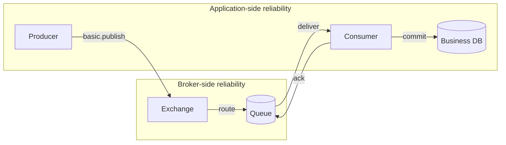

Boundary penting:

| Concern | RabbitMQ membantu? | Tetap tanggung jawab aplikasi? |
|---|---:|---:|
| Broker menerima publish | Ya, dengan publisher confirms | Ya, handle confirm timeout/nack |
| Message bisa dirutekan | Ya, dengan mandatory/return atau alternate exchange | Ya, declare/bind topology benar |
| Message durable di broker | Ya, dengan durable exchange/queue + persistent message + queue type tepat | Ya, memilih queue type dan policy |
| Message diproses consumer | Ya, delivery + ack tracking | Ya, handler, transaction, idempotency |
| Side effect persis sekali | Tidak penuh | Ya |
| Retry aman | DLX/TTL membantu | Ya, retry budget dan classifier |
| Poison isolation | DLX membantu | Ya, quarantine owner dan replay process |

---

## 3. Publisher Confirms: Producer Tahu Broker Menerima Message

Publisher confirms adalah mekanisme acknowledgement dari broker ke publisher. Producer mengaktifkan confirm mode pada channel, lalu RabbitMQ akan mengirim ack/nack untuk publish sequence number.

```java
Channel channel = connection.createChannel();
channel.confirmSelect();
```

Mental model:

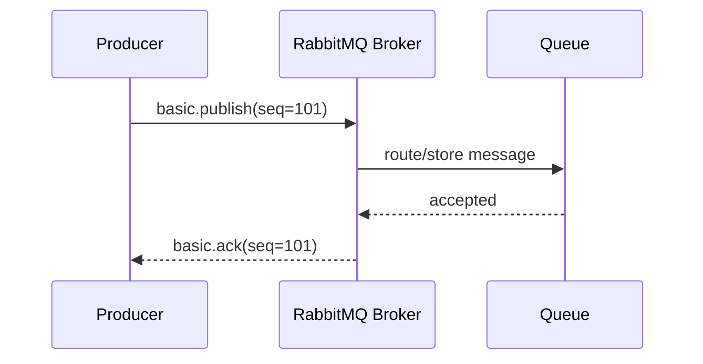

Publisher confirm menjawab:

> “Apakah broker sudah mengambil tanggung jawab atas message sesuai konfigurasi?”

Publisher confirm tidak menjawab:

- apakah consumer sudah memproses message,
- apakah database side effect berhasil,
- apakah message benar secara bisnis,
- apakah consumer tidak akan gagal nanti.

---

## 4. Synchronous Confirm: Sederhana tapi Terbatas

Cara paling sederhana:

```java
channel.confirmSelect();

channel.basicPublish(exchange, routingKey, properties, body);

if (!channel.waitForConfirms(Duration.ofSeconds(5).toMillis())) {
    throw new IllegalStateException("Message was not confirmed by broker");
}
```

Kelebihan:

- mudah dipahami,
- cocok untuk low throughput,
- failure handling sederhana.

Kekurangan:

- satu round-trip per message/batch,
- throughput rendah jika per message,
- producer thread blocked,
- confirm timeout harus ditangani hati-hati.

Batch synchronous confirm:

```java
channel.confirmSelect();

int batchSize = 100;
int published = 0;

for (OutboundMessage message : messages) {
    channel.basicPublish(exchange, message.routingKey(), message.properties(), message.body());
    published++;

    if (published % batchSize == 0) {
        channel.waitForConfirmsOrDie(5_000);
    }
}

channel.waitForConfirmsOrDie(5_000);
```

Jika batch gagal, producer perlu tahu message mana yang mungkin belum diterima. Karena itu producer outbox lebih aman untuk business-critical publishing.

---

## 5. Asynchronous Confirm: Throughput Lebih Baik, State Lebih Sulit

Untuk throughput tinggi, gunakan confirm listener.

```java
import com.rabbitmq.client.Channel;
import com.rabbitmq.client.ConfirmCallback;

import java.util.concurrent.ConcurrentNavigableMap;
import java.util.concurrent.ConcurrentSkipListMap;

public final class ConfirmingPublisher {
    private final Channel channel;
    private final ConcurrentNavigableMap<Long, OutboundMessage> outstanding = new ConcurrentSkipListMap<>();

    public ConfirmingPublisher(Channel channel) throws Exception {
        this.channel = channel;
        this.channel.confirmSelect();

        ConfirmCallback ackCallback = (sequenceNumber, multiple) -> {
            if (multiple) {
                outstanding.headMap(sequenceNumber, true).clear();
            } else {
                outstanding.remove(sequenceNumber);
            }
        };

        ConfirmCallback nackCallback = (sequenceNumber, multiple) -> {
            if (multiple) {
                var failed = outstanding.headMap(sequenceNumber, true);
                failed.values().forEach(this::scheduleRepublish);
                failed.clear();
            } else {
                OutboundMessage failed = outstanding.remove(sequenceNumber);
                if (failed != null) {
                    scheduleRepublish(failed);
                }
            }
        };

        this.channel.addConfirmListener(ackCallback, nackCallback);
    }

    public void publish(OutboundMessage message) throws Exception {
        long nextSeqNo = channel.getNextPublishSeqNo();
        outstanding.put(nextSeqNo, message);

        try {
            channel.basicPublish(
                message.exchange(),
                message.routingKey(),
                message.mandatory(),
                message.properties(),
                message.body()
            );
        } catch (Exception publishFailure) {
            outstanding.remove(nextSeqNo);
            throw publishFailure;
        }
    }

    private void scheduleRepublish(OutboundMessage message) {
        // Prefer durable outbox retry instead of immediate recursive publish.
    }

    public record OutboundMessage(
        String exchange,
        String routingKey,
        boolean mandatory,
        com.rabbitmq.client.AMQP.BasicProperties properties,
        byte[] body
    ) {}
}
```

Design notes:

- outstanding confirms harus bounded,
- confirm timeout perlu monitoring,
- republish harus idempotent,
- jangan republish recursive tanpa backoff,
- kalau process crash sebelum confirm diterima, producer harus bisa recover dari outbox.

---

## 6. Publisher Confirms Tidak Sama dengan Consumer Ack

Dua mekanisme ini sering tertukar.

| Mechanism | Arah | Makna |
|---|---|---|
| Publisher confirm | Broker → Producer | Broker menerima publish |
| Consumer ack | Consumer → Broker | Consumer selesai memproses delivery |

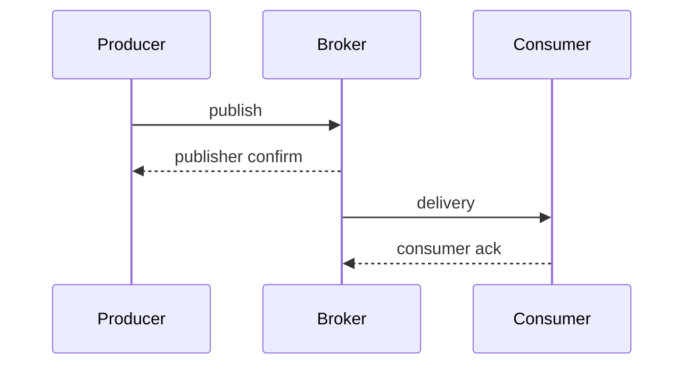

Jika publisher mendapat confirm, message belum tentu sudah diproses. Jika consumer ack, producer mungkin sudah lama tidak hidup.

---

## 7. Routing Reliability: Mandatory Flag

Publisher confirms hanya memberi tahu broker menerima message. Jika message publish ke exchange tetapi tidak cocok ke queue mana pun, producer perlu routing signal.

`mandatory=true` membuat broker mengembalikan message yang tidak bisa dirutekan ke queue mana pun.

```java
channel.addReturnListener(returned -> {
    String exchange = returned.getExchange();
    String routingKey = returned.getRoutingKey();
    int replyCode = returned.getReplyCode();
    String replyText = returned.getReplyText();

    // Persist as routing failure, alert, and retry after topology fix if appropriate.
});

channel.basicPublish(
    "case.events.x",
    "case.escalation.requested",
    true, // mandatory
    properties,
    body
);
```

Mental model:

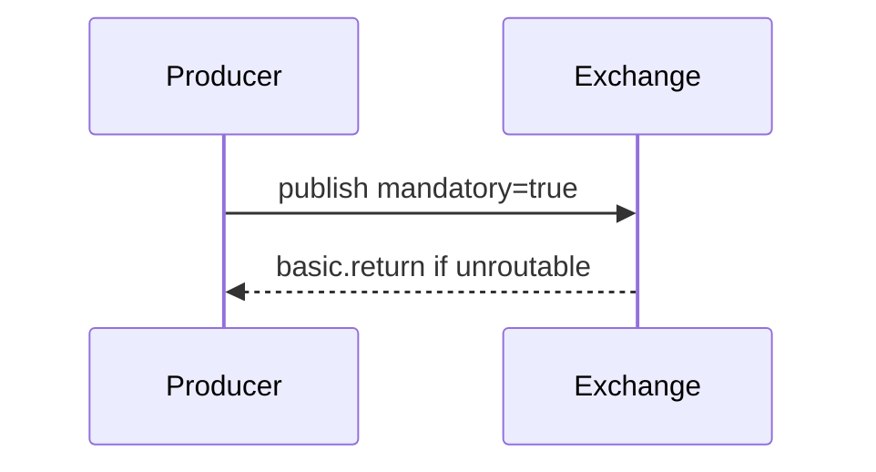

Mandatory flag menjawab:

> “Apakah message ini berhasil dirutekan ke minimal satu destination?”

Namun jika message dirutekan ke destination yang salah tetapi tetap ada binding, mandatory tidak tahu. Routing contract tetap perlu test.

---

## 8. Alternate Exchange

Alternate exchange adalah fallback exchange untuk message yang tidak bisa dirutekan dari exchange utama.

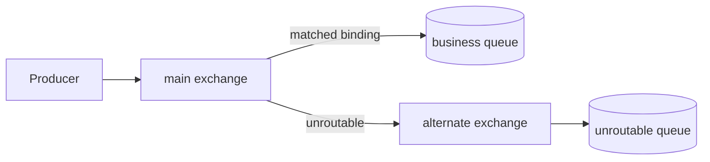

Kapan pakai alternate exchange:

- ingin menangkap unroutable message secara broker-side,
- producer tidak selalu memakai mandatory flag,
- ingin membuat operational inbox untuk routing mistakes,
- ingin observability terhadap topology drift.

Namun alternate exchange bisa menyembunyikan routing bug jika tidak dipantau. Setiap message ke unroutable queue harus dianggap contract failure sampai terbukti bukan.

---

## 9. Durable Publishing: Empat Syarat yang Sering Dilupakan

Untuk message bertahan terhadap broker restart/crash sesuai target, minimal perhatikan:

1. Exchange durable.
2. Queue durable.
3. Message persistent.
4. Queue type/policy sesuai durability requirement.

Contoh message persistent:

```java
AMQP.BasicProperties properties = new AMQP.BasicProperties.Builder()
    .deliveryMode(2) // persistent
    .messageId(messageId)
    .correlationId(correlationId)
    .contentType("application/json")
    .build();
```

Topology declaration:

```java
channel.exchangeDeclare("case.events.x", BuiltinExchangeType.TOPIC, true);

channel.queueDeclare(
    "case.escalation.q",
    true,   // durable
    false,  // exclusive
    false,  // autoDelete
    Map.of("x-queue-type", "quorum")
);

channel.queueBind("case.escalation.q", "case.events.x", "case.escalation.*");
```

Anti-pattern:

```java
// Persistent message ke non-durable queue tetap tidak cukup untuk crash survivability.
channel.queueDeclare("case.q", false, false, false, null);
```

Reliability bukan property message saja; topology juga bagian dari kontrak.

---

## 10. Outbox: Producer Reliability yang Bisa Dipulihkan

Publisher confirm melindungi publish yang sedang berjalan, tetapi tidak menyelesaikan masalah crash di antara database commit dan publish.

Salah satu solusi adalah outbox.

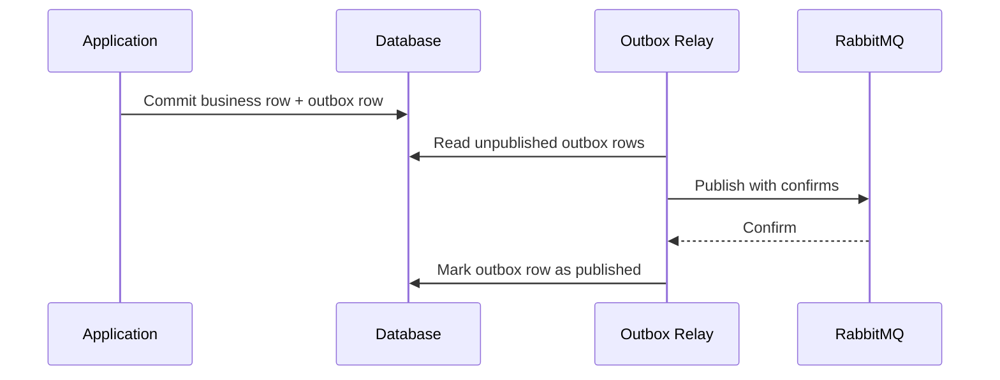

Outbox invariant:

> Business state dan intent untuk publish harus commit dalam transaksi yang sama.

Tabel minimal:

```sql
CREATE TABLE message_outbox (
    id VARCHAR(128) PRIMARY KEY,
    aggregate_type VARCHAR(128) NOT NULL,
    aggregate_id VARCHAR(128) NOT NULL,
    event_type VARCHAR(256) NOT NULL,
    routing_key VARCHAR(256) NOT NULL,
    payload_json TEXT NOT NULL,
    headers_json TEXT NOT NULL,
    status VARCHAR(32) NOT NULL,
    attempt_count INT NOT NULL DEFAULT 0,
    next_attempt_at TIMESTAMP NOT NULL,
    created_at TIMESTAMP NOT NULL,
    published_at TIMESTAMP NULL
);
```

Outbox relay harus:

- memakai publisher confirms,
- handle returned message jika mandatory gagal,
- retry dengan backoff,
- punya max attempt dan dead state,
- publish idempotently dengan `message_id`,
- expose lag dan failure metrics.

---

## 11. Dead Letter Exchange: Failure Path yang Eksplisit

Message bisa dead-letter ketika, antara lain:

- consumer menolak/nack message dengan `requeue=false`,
- message expired karena TTL,
- queue melebihi length limit,
- quorum queue delivery limit tercapai.

Topology dasar:

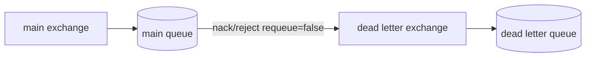

Declaration sketch:

```java
channel.exchangeDeclare("case.events.x", BuiltinExchangeType.TOPIC, true);
channel.exchangeDeclare("case.dlx", BuiltinExchangeType.TOPIC, true);

Map<String, Object> args = Map.of(
    "x-dead-letter-exchange", "case.dlx",
    "x-dead-letter-routing-key", "case.escalation.dead"
);

channel.queueDeclare("case.escalation.q", true, false, false, args);
channel.queueBind("case.escalation.q", "case.events.x", "case.escalation.requested");

channel.queueDeclare("case.escalation.dlq", true, false, false, null);
channel.queueBind("case.escalation.dlq", "case.dlx", "case.escalation.dead");
```

DLQ harus punya owner dan proses:

- alert,
- inspect,
- classify,
- fix,
- replay,
- archive,
- delete dengan approval jika perlu.

DLQ tanpa ownership adalah silent data loss yang ditunda.

---

## 12. TTL-Based Retry: Delay tanpa Hot Requeue

RabbitMQ retry pattern umum memakai kombinasi DLX dan TTL.

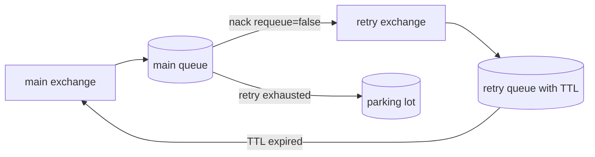

Konsep:

1. Consumer gagal retryable.
2. Consumer `basicNack(tag, false, false)`.
3. Message dead-letter ke retry exchange/queue.
4. Retry queue menahan message selama TTL.
5. Saat TTL expired, message dead-letter kembali ke main exchange.
6. Consumer mencoba ulang.
7. Setelah retry budget habis, message masuk parking lot.

Declaration sketch:

```java
channel.exchangeDeclare("case.main.x", BuiltinExchangeType.TOPIC, true);
channel.exchangeDeclare("case.retry.x", BuiltinExchangeType.TOPIC, true);
channel.exchangeDeclare("case.parking.x", BuiltinExchangeType.TOPIC, true);

Map<String, Object> mainArgs = Map.of(
    "x-dead-letter-exchange", "case.retry.x",
    "x-dead-letter-routing-key", "case.escalation.retry"
);

channel.queueDeclare("case.escalation.q", true, false, false, mainArgs);
channel.queueBind("case.escalation.q", "case.main.x", "case.escalation.requested");

Map<String, Object> retryArgs = Map.of(
    "x-message-ttl", 30_000,
    "x-dead-letter-exchange", "case.main.x",
    "x-dead-letter-routing-key", "case.escalation.requested"
);

channel.queueDeclare("case.escalation.retry.30s.q", true, false, false, retryArgs);
channel.queueBind("case.escalation.retry.30s.q", "case.retry.x", "case.escalation.retry");

channel.queueDeclare("case.escalation.parking.q", true, false, false, null);
channel.queueBind("case.escalation.parking.q", "case.parking.x", "case.escalation.poison");
```

Catatan penting:

- TTL retry bisa menimbulkan ordering side effect.
- Message dalam retry queue bisa tertahan di belakang message lain dengan TTL berbeda.
- Untuk delay yang kompleks, pertimbangkan delayed exchange plugin atau scheduled retry service.
- Retry budget perlu disimpan di header atau external retry table.

---

## 13. Retry Budget

Tanpa retry budget, sistem bisa retry selamanya.

Header yang umum:

```text
x-retry-count: 0
x-first-failure-at: 2026-06-28T10:15:30Z
x-last-failure-at: 2026-06-28T10:16:00Z
x-error-class: DownstreamTimeoutException
x-original-routing-key: case.escalation.requested
```

Pseudo-policy:

```java
RetryDecision decide(Throwable error, int retryCount) {
    if (error instanceof PoisonMessageException) {
        return RetryDecision.parkingLot("non_retryable_payload");
    }

    if (error instanceof BusinessRulePermanentException) {
        return RetryDecision.parkingLot("permanent_business_rejection");
    }

    if (retryCount >= 5) {
        return RetryDecision.parkingLot("retry_exhausted");
    }

    return switch (retryCount) {
        case 0 -> RetryDecision.retryAfter("case.retry.10s", Duration.ofSeconds(10));
        case 1 -> RetryDecision.retryAfter("case.retry.30s", Duration.ofSeconds(30));
        case 2 -> RetryDecision.retryAfter("case.retry.2m", Duration.ofMinutes(2));
        case 3 -> RetryDecision.retryAfter("case.retry.10m", Duration.ofMinutes(10));
        default -> RetryDecision.retryAfter("case.retry.30m", Duration.ofMinutes(30));
    };
}
```

Retry policy harus eksplisit per use case. Regulatory workflow mungkin membutuhkan lebih konservatif daripada telemetry pipeline.

---

## 14. Retry dengan Republish vs Nack ke DLX

Ada dua pendekatan umum:

### 14.1 Consumer Nack ke DLX

```java
channel.basicNack(tag, false, false);
```

Kelebihan:

- sederhana,
- broker memindahkan message ke DLX,
- consumer tidak perlu republish payload.

Kekurangan:

- sulit mengubah headers retry count kecuali republish,
- policy retry lebih terbatas,
- x-death header perlu dipahami.

### 14.2 Consumer Republish ke Retry Exchange lalu Ack Original

```java
publishToRetryExchange(modifiedProperties, body);
channel.basicAck(originalTag, false);
```

Kelebihan:

- bisa menambah retry headers,
- bisa memilih delay tier secara dinamis,
- bisa menjaga metadata domain lebih jelas.

Kekurangan:

- perlu publisher confirms untuk republish,
- ada risiko duplicate jika publish retry berhasil tetapi ack original gagal,
- perlu idempotency lebih kuat.

Pattern aman untuk republish:

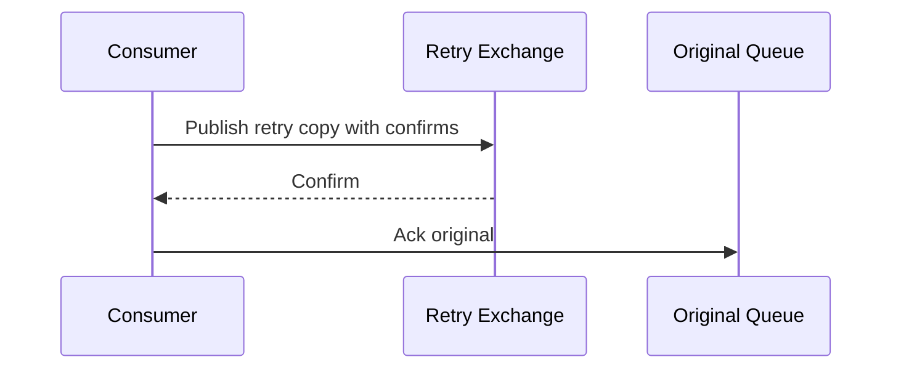

Jika crash setelah retry publish confirm tetapi sebelum ack original, message bisa muncul dua kali: original redelivery dan retry copy. Idempotency tetap wajib.

---

## 15. `x-death` Header

RabbitMQ menambahkan metadata dead-lettering ke header, biasa dikenal sebagai `x-death`. Header ini dapat membantu mengetahui berapa kali message melewati dead-letter path.

Namun jangan membangun seluruh domain retry policy hanya dari asumsi rapuh terhadap format header tanpa test. Perlakukan `x-death` sebagai broker metadata yang perlu dipahami, diuji, dan dimonitor.

Praktik aman:

- simpan retry count domain sendiri jika policy kompleks,
- tetap log `x-death` untuk forensic,
- uji setiap path DLX/TTL di integration test,
- jangan menghapus history error penting saat republish.

---

## 16. Parking Lot / Quarantine

Parking lot adalah queue untuk message yang tidak boleh lagi mengganggu main flow.

Message masuk parking lot jika:

- payload invalid,
- schema tidak kompatibel,
- retry budget habis,
- business state tidak memungkinkan,
- handler bug deterministik belum diperbaiki,
- message butuh manual investigation.

Parking lot bukan DLQ biasa. Ia harus punya workflow operasional.

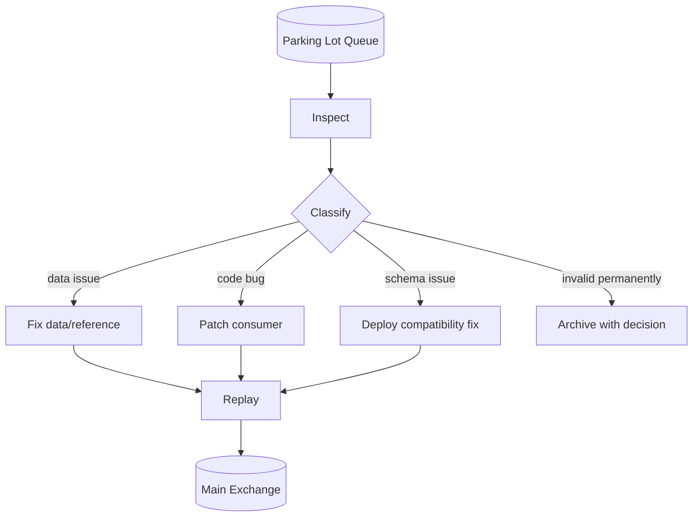

Untuk sistem regulatory, parking lot entry sebaiknya menyimpan:

- original message id,
- correlation id,
- causation id,
- source system,
- event type,
- aggregate id,
- routing key,
- first failure time,
- last failure time,
- retry count,
- error summary,
- owner team,
- investigation status,
- replay decision,
- audit trail.

---

## 17. Replay Tooling

Replay tidak boleh berarti “copy paste payload dari UI management”.

Replay tool minimal:

- membaca message dari DLQ/parking lot,
- validasi izin operator,
- mencatat alasan replay,
- membersihkan atau mempertahankan headers sesuai policy,
- menetapkan retry count baru jika diperlukan,
- publish ke exchange target dengan publisher confirms,
- mencatat replay audit,
- tidak menghapus original sebelum publish confirmed.

Replay flow:

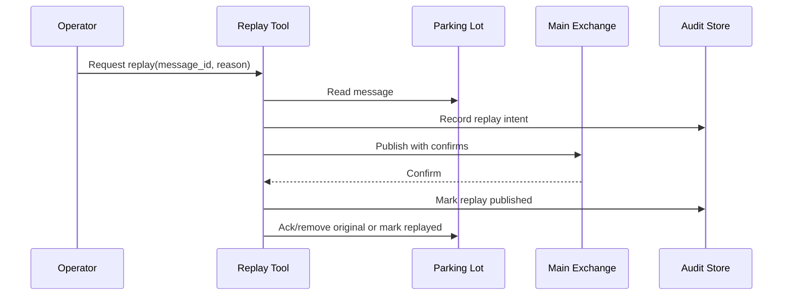

Replay harus mempertahankan defensibility: siapa yang replay, kapan, kenapa, payload mana, dan hasilnya apa.

---

## 18. Confirm Timeout dan Ambiguous Publish

Jika producer timeout menunggu confirm, status message bisa ambigu:

- message belum diterima broker,
- message diterima tetapi confirm hilang/terlambat,
- connection terganggu,
- broker sedang lambat.

Jangan langsung publish ulang tanpa idempotency.

Outbox relay approach:

```text
if confirm received:
    mark published
else if timeout:
    keep outbox row pending or uncertain
    retry later with same message_id
```

Consumer idempotency akan menangani duplicate jika publish pertama sebenarnya berhasil.

---

## 19. Reliability Metrics

Producer metrics:

| Metric | Meaning |
|---|---|
| publish rate | outgoing pressure |
| confirm latency p95/p99 | broker/disk/network pressure |
| outstanding confirm count | producer backlog |
| confirm nack count | broker reject signal |
| return count | unroutable message |
| publish exception count | client/network failure |
| outbox pending count | relay lag |
| outbox oldest pending age | publishing stuck |

Topology metrics:

| Metric | Meaning |
|---|---|
| main queue ready | business backlog |
| retry queue depth | transient failures |
| DLQ depth | unhandled failures |
| parking lot depth | manual intervention load |
| dead-letter rate | error path volume |
| retry exhausted count | policy failure or downstream outage |

Alerting examples:

```text
return_count > 0 for 5 minutes => routing contract broken
oldest_outbox_age > 2 minutes => publisher relay stuck
parking_lot_depth increasing => manual investigation required
confirm_latency_p99 > baseline * 5 => broker/disk/network pressure
retry_queue_depth increasing + main ack rate low => downstream unstable
```

---

## 20. Failure Scenario Matrix

| Scenario | Symptom | Likely Cause | Action |
|---|---|---|---|
| Publisher confirm timeout | outbox pending grows | broker disk/network slow, connection issue | keep pending, retry same message id, inspect broker |
| Basic return received | return count > 0 | routing key/binding missing | stop bad publisher, fix topology, replay returned messages |
| DLQ grows | dead-letter rate high | consumer bug, validation error, downstream failure | classify, patch, replay or archive |
| Retry queue grows | delayed backlog | downstream transient outage | protect downstream, monitor recovery, avoid scaling blindly |
| Parking lot grows | retry exhausted/non-retryable | poison data, schema mismatch | owner investigation, fix, replay tool |
| Duplicate after retry | idempotency hit spike | crash after retry publish before ack original | expected with at-least-once; verify idempotency |
| Messages disappear | no DLQ, ack early, non-durable topology | reliability gap | fix contract, add tests/alerts |

---

## 21. Topology Contract Test

RabbitMQ topology should be tested as contract, not assumed.

Test cases:

1. Known routing key reaches expected queue.
2. Unknown routing key is returned or goes to alternate exchange.
3. Consumer `nack(requeue=false)` sends message to expected retry/DLQ queue.
4. Retry queue TTL sends message back to main exchange.
5. Retry exhausted sends message to parking lot.
6. Persistent message survives broker restart in chosen queue type.
7. Producer confirm is received for valid publish.
8. Return listener fires for unroutable mandatory publish.

Pseudo-test:

```java
@Test
void escalationRequestedRoutesToEscalationQueue() throws Exception {
    publishMandatory("case.events.x", "case.escalation.requested", payload);

    Delivery delivery = channel.basicGet("case.escalation.q", false);

    assertThat(delivery).isNotNull();
    assertThat(delivery.getEnvelope().getRoutingKey()).isEqualTo("case.escalation.requested");

    channel.basicAck(delivery.getEnvelope().getDeliveryTag(), false);
}
```

---

## 22. Anti-Patterns

### 22.1 Fire-and-Forget Producer untuk Critical Event

```java
channel.basicPublish(exchange, routingKey, properties, body);
// no confirm, no return listener, no outbox
```

Ini bukan reliable publish.

### 22.2 Menganggap Confirm Berarti Consumer Sukses

Confirm hanya broker-side acceptance. Business completion tetap di consumer.

### 22.3 Persistent Message ke Non-Durable Queue

Durability harus end-to-end pada exchange, queue, message, dan queue type/policy.

### 22.4 DLQ Tanpa Alert

DLQ tanpa alert hanya menunda data loss sampai user komplain.

### 22.5 Retry Tanpa Budget

Infinite retry menutupi bug dan membakar kapasitas.

### 22.6 Requeue Langsung untuk Downstream Outage

Jika dependency down, requeue langsung membuat hot loop.

### 22.7 Replay Manual Tanpa Audit

Dalam sistem regulatory, replay adalah tindakan operasional yang harus punya jejak keputusan.

---

## 23. Design Checklist

Producer reliability:

- Apakah publisher confirms aktif?
- Apakah publish timeout/confirm timeout ditangani sebagai ambiguous state?
- Apakah mandatory flag atau alternate exchange dipakai untuk routing failure?
- Apakah returned message disimpan/di-alert?
- Apakah producer memakai outbox untuk event yang berasal dari database transaction?
- Apakah message id stabil untuk retry/duplicate handling?

Topology reliability:

- Apakah exchange durable?
- Apakah queue durable?
- Apakah message persistent?
- Apakah queue type sesuai failure requirement?
- Apakah binding diuji?
- Apakah DLX dikonfigurasi via policy/topology yang jelas?

Retry reliability:

- Apakah retryable dan non-retryable error dibedakan?
- Apakah retry punya delay?
- Apakah retry punya max attempt?
- Apakah retry exhausted masuk parking lot?
- Apakah poison message tidak memblokir queue utama?
- Apakah replay punya tool dan audit?

Observability:

- Apakah publish rate, confirm latency, return count, DLQ depth, retry depth, dan parking lot depth dimonitor?
- Apakah alert actionable dan punya owner?
- Apakah runbook menjelaskan replay/archival decision?

---

## 24. Deliberate Practice

### Drill 1 — Unroutable Publish

1. Publish dengan routing key yang tidak punya binding.
2. Gunakan `mandatory=true`.
3. Pastikan return listener menerima message.
4. Pastikan message disimpan sebagai routing failure.

Expected learning:

- confirm dan routing success adalah dua hal berbeda.

### Drill 2 — Confirm Timeout

1. Simulasikan broker lambat atau network issue.
2. Buat producer timeout menunggu confirm.
3. Pastikan outbox row tidak ditandai published.
4. Retry dengan same message id.
5. Pastikan consumer idempotent.

Expected learning:

- timeout menciptakan ambiguous state,
- idempotency menutup celah duplicate.

### Drill 3 — TTL Retry

1. Consumer gagal karena dependency timeout.
2. Nack tanpa requeue.
3. Message masuk retry queue.
4. Setelah TTL, message kembali ke main queue.
5. Pulihkan dependency dan pastikan sukses.

Expected learning:

- delay retry menjaga stability,
- nack/requeue=false bukan berarti drop jika DLX benar.

### Drill 4 — Retry Exhausted

1. Publish poison message.
2. Biarkan retry sampai max attempt.
3. Pastikan message masuk parking lot.
4. Pastikan alert muncul.
5. Jalankan replay setelah fix.

Expected learning:

- retry bukan tujuan; recovery adalah tujuan.

---

## 25. Ringkasan

RabbitMQ reliability harus dilihat sebagai rantai kontrak.

Producer-side:

1. Gunakan publisher confirms.
2. Gunakan mandatory flag atau alternate exchange untuk routing failure.
3. Tangani confirm timeout sebagai ambiguous state.
4. Gunakan outbox untuk publish yang terkait transaksi bisnis.

Broker/topology-side:

1. Durable exchange.
2. Durable queue.
3. Persistent message.
4. Queue type dan replication policy sesuai kebutuhan.
5. DLX/retry/parking topology jelas.

Consumer/failure-side:

1. Retry dengan delay, bukan hot requeue.
2. Retry dengan budget.
3. Poison message masuk quarantine.
4. Replay harus audited.
5. Semua side effect harus idempotent.

Dengan prinsip ini, RabbitMQ tidak hanya menjadi queue broker, tetapi menjadi bagian dari delivery fabric yang bisa dioperasikan, diaudit, dan dipertanggungjawabkan.

Bagian berikutnya masuk ke **RabbitMQ Streams**, yaitu model log-based messaging di ekosistem RabbitMQ: offset, retention, stream client, use case, dan batasannya dibanding Kafka.

---

## Referensi

- RabbitMQ Documentation — Publishers: https://www.rabbitmq.com/docs/publishers
- RabbitMQ Documentation — Consumer Acknowledgements and Publisher Confirms: https://www.rabbitmq.com/docs/confirms
- RabbitMQ Documentation — Reliability Guide: https://www.rabbitmq.com/docs/reliability
- RabbitMQ Documentation — Dead Letter Exchanges: https://www.rabbitmq.com/docs/dlx
- RabbitMQ Documentation — Time-To-Live and Expiration: https://www.rabbitmq.com/docs/ttl
- RabbitMQ Documentation — Alternate Exchanges: https://www.rabbitmq.com/docs/ae
