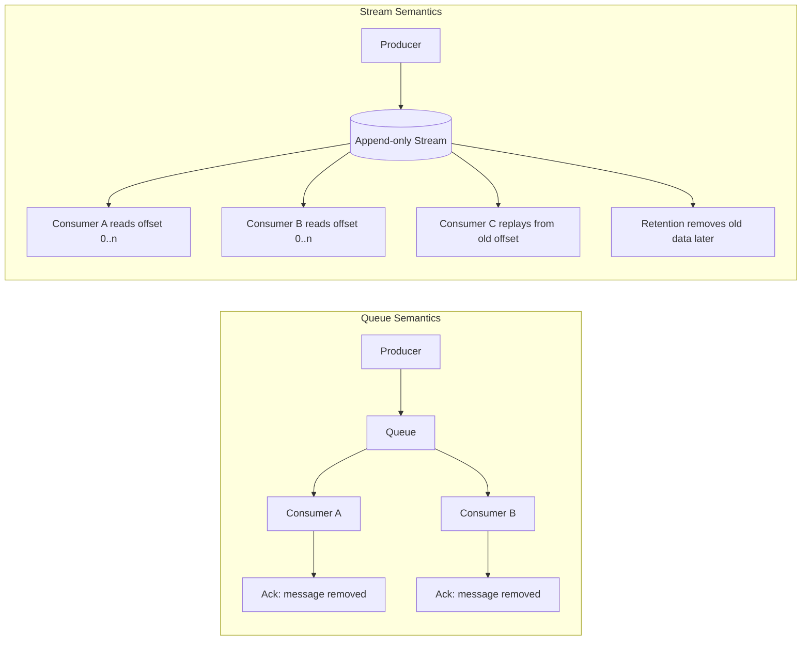
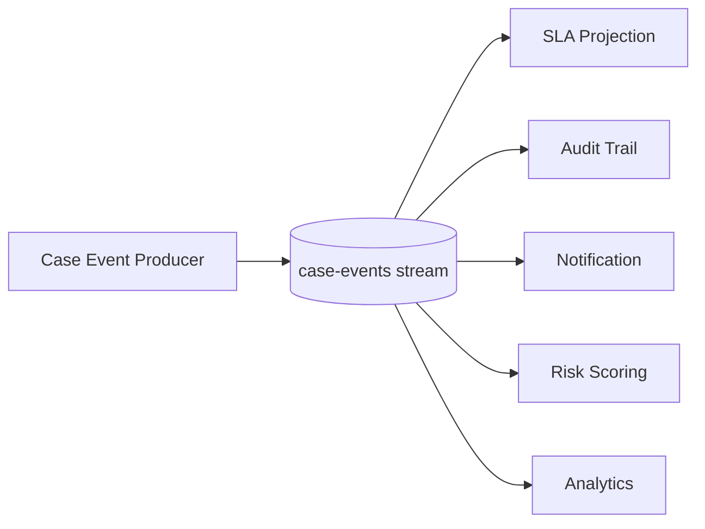
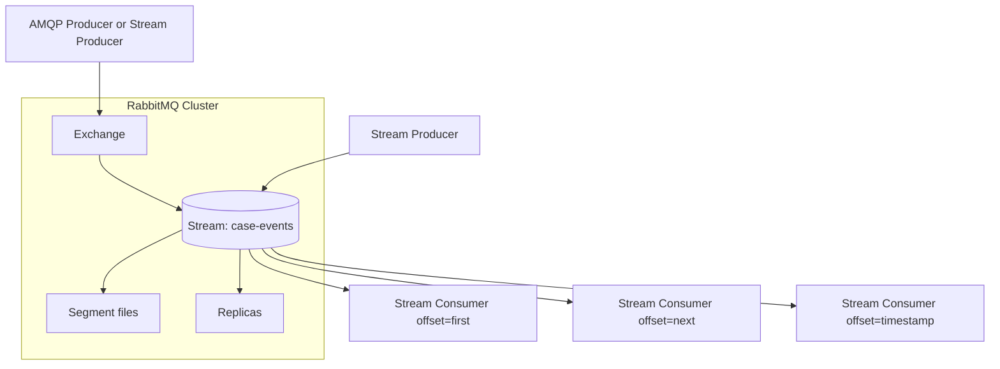
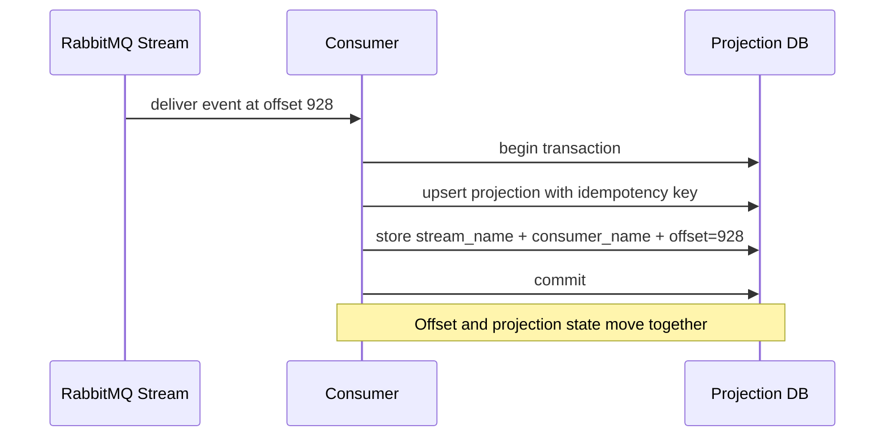
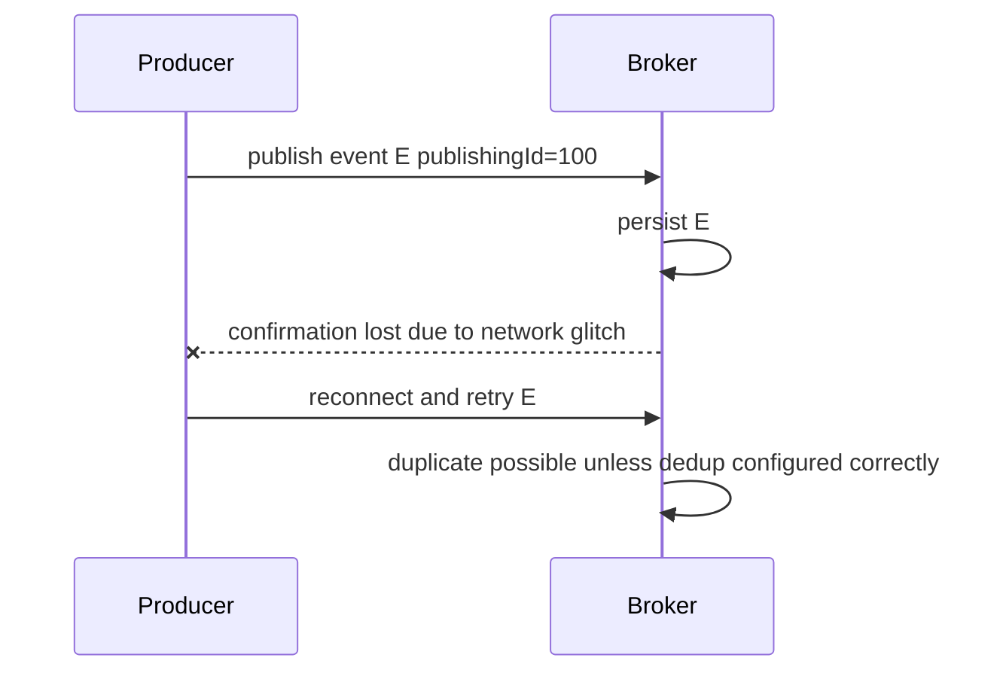
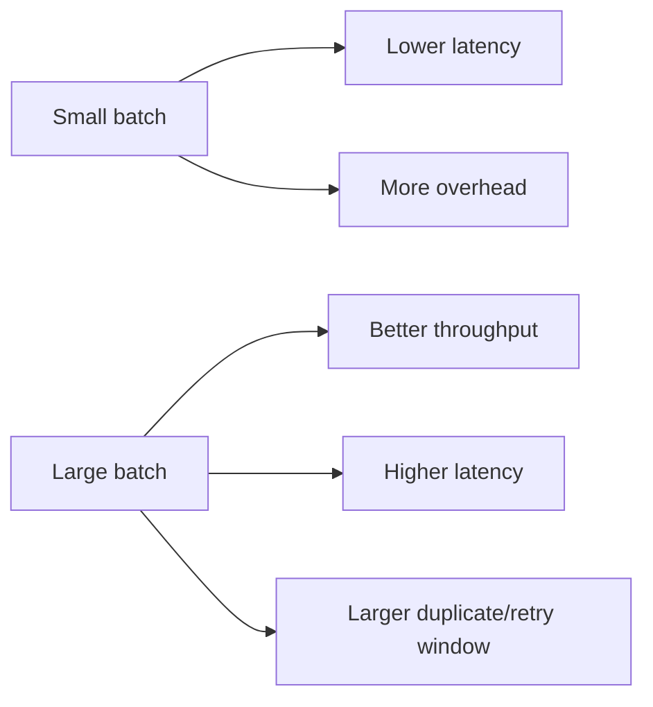
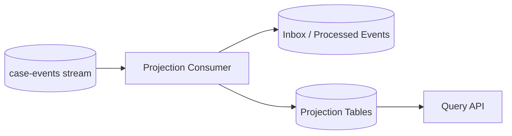
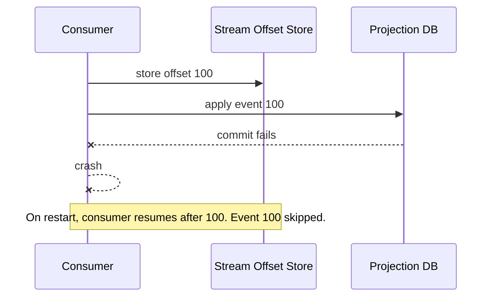
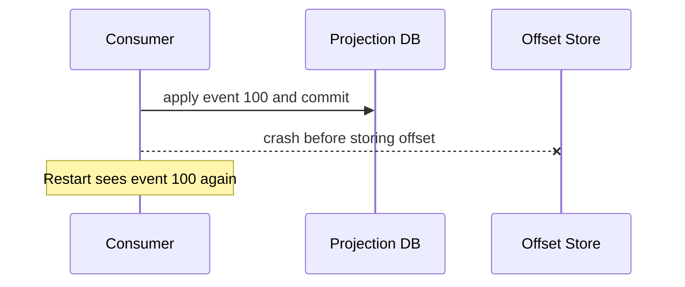
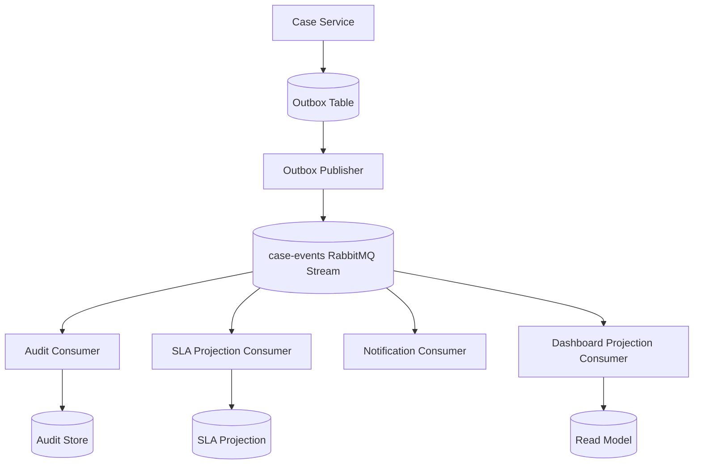

------
title: Learn Java Messaging and Event Streaming - Part 013
description: RabbitMQ Streams deep dive: append-only log semantics, stream declaration, retention, producer/consumer API, offset tracking, deduplication, batching, and operational boundaries.
series: learn-java-messaging-event-streaming
seriesTitle: Learn Java Messaging and Event Streaming
order: 13
partTitle: RabbitMQ Streams Log-Based Messaging
tags:
- java
- rabbitmq
- rabbitmq-streams
- messaging
- event-streaming
- distributed-systems
- reliability
- offset
- retention
date: 2026-06-28
---

# Part 013 — RabbitMQ Streams: Log-Based Messaging Inside RabbitMQ

## Tujuan Bagian Ini

Di part sebelumnya kita sudah membahas RabbitMQ sebagai broker berbasis exchange, queue, binding, routing key, consumer acknowledgement, publisher confirm, DLX, TTL, dan retry topology. Bagian ini tidak mengulang itu. Fokus kita sekarang adalah **RabbitMQ Streams**: fitur RabbitMQ untuk model komunikasi yang lebih dekat ke **append-only log** daripada queue tradisional.

Setelah menyelesaikan bagian ini, kamu harus bisa:

1. Menjelaskan mengapa RabbitMQ Streams **bukan pengganti semua queue**.
2. Membedakan **destructive queue consumption** dengan **non-destructive stream consumption**.
3. Mendesain stream untuk **fan-out besar**, **replay**, **large backlog**, dan **high-throughput ingestion**.
4. Memilih kapan memakai AMQP 0-9-1 access dan kapan memakai **RabbitMQ Stream Java Client**.
5. Menggunakan mental model offset, retention, segment, producer confirmation, deduplication, batching, dan compression.
6. Membaca failure mode RabbitMQ Streams sebelum menjadi incident produksi.

> Prinsip utama: RabbitMQ Streams memberi RabbitMQ kemampuan log-based messaging, tetapi tidak otomatis membuat RabbitMQ menjadi Kafka. Streams menambah model baru di dalam RabbitMQ; ia tetap memiliki trade-off, batasan, dan operational personality sendiri.

---

## Kaufman Deconstruction

Mengikuti pendekatan Josh Kaufman, skill besar “menguasai RabbitMQ Streams” harus dipecah menjadi sub-skill kecil yang bisa dilatih cepat.

| Sub-skill | Yang Harus Dikuasai | Latihan Efektif |
|---|---|---|
| Semantic model | Stream sebagai append-only log, bukan queue kosong-akhir | Bandingkan queue consume vs stream replay dengan payload sama |
| Declaration | `x-queue-type=stream`, retention, segment sizing | Buat stream dengan batas size/time lalu observasi truncation |
| Producer | Publish confirmation, message properties, batch, dedup | Kirim 100k event dengan confirm handler dan retry bounded |
| Consumer | Offset specification, replay, named consumer | Consume dari `first`, `next`, timestamp, explicit offset |
| Offset tracking | Automatic, manual, external store | Simulasi crash setelah proses tapi sebelum store offset |
| Reliability | duplicate, replay, retention expiry, producer recovery | Matikan koneksi producer/consumer di tengah traffic |
| Performance | batch size, sub-entry batching, compression | Ukur throughput, latency, CPU, disk write, duplicate risk |
| Operation | leader/replica locality, disk, retention, metrics | Jalankan load test sambil memantau disk dan consumer lag |

Target kita bukan “tahu syntax”, tetapi mampu menjawab:

- Apakah stream ini harus replayable?
- Berapa lama event harus disimpan?
- Apakah consumer boleh melihat duplicate?
- Offset disimpan kapan?
- Apakah consumer harus bisa restart dari titik terakhir?
- Apakah event bisa expired sebelum compliance replay selesai?
- Apakah stream ini seharusnya satu stream atau superstream?

---

## 1. Mental Model: Queue Mengosongkan, Stream Menyimpan

RabbitMQ classic/quorum queue biasanya dipakai untuk work distribution. Message masuk ke queue, satu consumer memproses, lalu message di-ack dan keluar dari queue. Goal normalnya adalah queue mendekati kosong.

RabbitMQ Stream berbeda. Stream adalah log yang disimpan, dibaca, dan bisa dibaca ulang sampai retention menghapusnya.



Perbedaan konseptualnya:

| Dimensi | Queue | Stream |
|---|---|---|
| Consume | Destructive setelah ack | Non-destructive |
| Normal state | Kosong atau mendekati kosong | Menyimpan backlog hingga retention |
| Replay | Tidak natural | Natural |
| Fan-out banyak consumer | Perlu queue per subscriber/topology tambahan | Banyak consumer bisa membaca stream yang sama |
| Progress consumer | Ack/delivery tag | Offset |
| Retention | Message hilang setelah consumed atau TTL/limit | Message hilang karena retention size/time |
| Cocok untuk | Work queue, task distribution, command processing | Event history, replay, audit, high fan-out, large backlog |

Konsekuensinya besar: **di queue, “sudah diproses” sering berarti message tidak ada lagi; di stream, “sudah diproses” berarti consumer sudah menyimpan progress-nya.**

---

## 2. Kapan RabbitMQ Streams Masuk Akal

RabbitMQ Streams paling masuk akal ketika satu atau lebih kondisi ini benar.

### 2.1 Large Fan-Out

Misalnya event `CaseStatusChanged` perlu dibaca oleh:

- SLA projection service
- audit trail service
- notification service
- enforcement scoring service
- analytics pipeline
- investigation dashboard cache

Dengan queue biasa, kamu sering membuat banyak queue terpisah untuk tiap subscriber. Itu valid, tetapi makin banyak subscriber berarti makin banyak queue, binding, storage, replication, dan operational overhead.

Dengan stream, banyak consumer bisa membaca data yang sama dari log yang sama.



### 2.2 Replay / Time Travel

Replay dibutuhkan ketika:

- projection rusak dan harus dibangun ulang,
- bug transformation sudah diperbaiki dan event lama harus diproses ulang,
- audit/compliance membutuhkan rekonstruksi urutan kejadian,
- model scoring baru perlu dihitung dari event historis,
- consumer baru perlu bootstrap dari event lama.

Queue biasa tidak cocok untuk replay karena message yang sudah di-ack sudah hilang. Stream cocok karena consumer bisa attach dari offset/timestamp lama selama data belum dihapus retention.

### 2.3 Throughput Performance

Streams dirancang untuk throughput tinggi dengan model append, batching, segment file, dan stream protocol. Ini cocok untuk ingestion event volume besar, terutama ketika consumer tidak perlu routing granular seperti exchange/queue topology tradisional.

### 2.4 Large Backlogs

Queue biasanya optimal ketika backlog tidak tumbuh terus-menerus. Streams lebih cocok untuk backlog besar karena memang dirancang menyimpan data dalam struktur log/segment.

Contoh regulatory platform:

- `case-events` disimpan 90 hari untuk operational replay,
- `case-audit-events` disimpan 7 tahun di storage compliance terpisah,
- stream lokal RabbitMQ dipakai sebagai high-throughput operational log, bukan satu-satunya archive final.

---

## 3. Kapan RabbitMQ Streams Tidak Masuk Akal

RabbitMQ Streams bukan default untuk semua hal.

Jangan gunakan stream hanya karena terlihat “lebih modern”. Gunakan queue biasa jika:

1. Setiap message adalah task yang hanya boleh dikerjakan satu worker.
2. Message tidak perlu replay.
3. Backlog normalnya kecil.
4. Kamu butuh DLX semantics per rejected message seperti queue biasa.
5. Kamu butuh message priority.
6. Kamu butuh queue-level features yang tidak tersedia di stream.
7. Consumer processing lebih mirip command execution daripada event observation.

Contoh yang lebih cocok queue:

- generate PDF report,
- send email job,
- execute external API call,
- OCR document task,
- payment retry command,
- long-running enrichment task dengan DLQ per job.

Contoh yang lebih cocok stream:

- `CaseOpened`, `CaseAssigned`, `EvidenceReceived`, `EnforcementActionIssued`,
- audit event feed,
- high-volume telemetry,
- immutable domain event history,
- projection rebuild source.

---

## 4. RabbitMQ Streams di Dalam RabbitMQ

Secara operasional, stream tetap hidup di ekosistem RabbitMQ. Ia bisa dideklarasikan sebagai queue dengan tipe `stream`. Namun semantik penyimpanan dan konsumsi berbeda dari classic/quorum queue.



Ada dua cara umum berinteraksi:

| Cara | Kapan Dipakai | Trade-off |
|---|---|---|
| AMQP 0-9-1 client | Integrasi cepat dengan library RabbitMQ biasa | Tidak mendapatkan seluruh fitur stream-specific dan performa terbaik |
| RabbitMQ Stream Java Client | Throughput tinggi, offset tracking, dedup, stream-native features | Perlu model API berbeda dan operational understanding baru |

Untuk sistem Java production yang memang memakai stream sebagai primitive utama, gunakan **RabbitMQ Stream Java Client**. AMQP access cocok untuk compatibility atau transisi, bukan untuk memaksimalkan stream-specific capabilities.

---

## 5. Deklarasi Stream dengan AMQP 0-9-1

Stream bisa dideklarasikan sebagai queue dengan argument `x-queue-type=stream`.

```java
import com.rabbitmq.client.Channel;
import com.rabbitmq.client.Connection;
import com.rabbitmq.client.ConnectionFactory;

import java.util.Collections;

ConnectionFactory factory = new ConnectionFactory();
factory.setHost("localhost");

try (Connection connection = factory.newConnection();
     Channel channel = connection.createChannel()) {

    channel.queueDeclare(
        "case-events",
        true,          // durable
        false,         // not exclusive
        false,         // not auto-delete
        Collections.singletonMap("x-queue-type", "stream")
    );
}
```

Beberapa hal penting:

- Tipe queue harus ditentukan saat declaration.
- Queue type tidak bisa diubah belakangan dengan policy dinamis.
- Stream tetap bisa dibind ke exchange seperti queue RabbitMQ lain.
- Stream selalu persistent.
- Stream punya retention policy sendiri.

---

## 6. Retention: Ukuran, Waktu, dan Bahaya Salah Asumsi

Retention adalah batas hidup data di stream. Karena stream tidak menghapus message setelah consumer ack, maka data harus dipotong berdasarkan size atau age.

Contoh declaration dengan argument retention:

```java
import java.util.HashMap;
import java.util.Map;

Map<String, Object> arguments = new HashMap<>();
arguments.put("x-queue-type", "stream");

// Maximum stream size: 20 GB
arguments.put("x-max-length-bytes", 20_000_000_000L);

// Maximum age: 7 days
arguments.put("x-max-age", "7D");

// Segment size: 100 MB
arguments.put("x-stream-max-segment-size-bytes", 100_000_000L);

channel.queueDeclare(
    "case-events",
    true,
    false,
    false,
    arguments
);
```

### Retention Invariant

> Retention harus lebih panjang dari waktu maksimum consumer tertinggal plus waktu maksimum recovery plus waktu maksimum investigasi operasional.

Jika consumer lag 3 hari, retention 2 hari, dan consumer crash, maka sebagian event mungkin sudah tidak tersedia untuk replay. Ini bukan “message loss” dari perspektif broker; ini kesalahan desain retention.

### Retention Formula Praktis

```text
retention_age >= max_expected_lag
               + max_incident_detection_time
               + max_recovery_time
               + replay_safety_margin
```

Contoh:

```text
max_expected_lag              = 12 jam
max_incident_detection_time   = 4 jam
max_recovery_time             = 8 jam
replay_safety_margin          = 24 jam
retention_age minimum         = 48 jam
```

Untuk domain regulatory, biasanya retention operasional perlu jauh lebih panjang karena investigasi issue bisa terjadi beberapa hari setelah incident.

---

## 7. Offset Specification: Dari Mana Consumer Mulai Membaca

Consumer stream tidak “mengambil message berikutnya dari queue kosong”. Consumer memilih titik mulai di log.

Pilihan mental model:

| Offset Specification | Makna | Use Case |
|---|---|---|
| `first` | Mulai dari message pertama yang masih tersedia | Full replay, rebuild projection |
| `last` | Mulai dari chunk terakhir | Warm start mendekati tail |
| `next` | Mulai dari message baru setelah consumer start | Live-only consumer |
| explicit offset | Mulai dari offset numerik | Recovery presisi, replay terkontrol |
| timestamp | Mulai dari waktu arrival tertentu | Replay sejak incident time |
| interval | Mulai relatif dari waktu sekarang | Debug atau partial replay |

Contoh AMQP-style consume dari awal stream:

```java
channel.basicQos(100); // required for stream consumption via AMQP

channel.basicConsume(
    "case-events",
    false,
    Map.of("x-stream-offset", "first"),
    (consumerTag, delivery) -> {
        try {
            byte[] body = delivery.getBody();
            process(body);
            channel.basicAck(delivery.getEnvelope().getDeliveryTag(), false);
        } catch (Exception ex) {
            // Do not blindly requeue in stream processing.
            // Prefer idempotent recovery or explicit failure handling.
            channel.basicNack(delivery.getEnvelope().getDeliveryTag(), false, false);
        }
    },
    consumerTag -> {}
);
```

Catatan penting: dalam stream via AMQP, ack bekerja sebagai credit/progress mechanism, bukan “hapus message dari queue” seperti classic queue.

---

## 8. Stream Java Client: Environment, Producer, Consumer

RabbitMQ Stream Java Client memberi API stream-native.

Minimal flow:

```java
import com.rabbitmq.stream.Consumer;
import com.rabbitmq.stream.Environment;
import com.rabbitmq.stream.OffsetSpecification;
import com.rabbitmq.stream.Producer;

import java.nio.charset.StandardCharsets;
import java.util.UUID;
import java.util.concurrent.CountDownLatch;
import java.util.concurrent.TimeUnit;
import java.util.stream.IntStream;

public class CaseEventStreamSmokeTest {

    public static void main(String[] args) throws Exception {
        Environment environment = Environment.builder().build();

        String stream = "case-events-" + UUID.randomUUID();
        environment.streamCreator().stream(stream).create();

        int messageCount = 10_000;
        CountDownLatch publishConfirmLatch = new CountDownLatch(messageCount);

        Producer producer = environment.producerBuilder()
            .stream(stream)
            .build();

        IntStream.range(0, messageCount).forEach(i -> {
            byte[] payload = ("{\"eventNo\":" + i + "}")
                .getBytes(StandardCharsets.UTF_8);

            producer.send(
                producer.messageBuilder()
                    .addData(payload)
                    .build(),
                confirmationStatus -> {
                    if (!confirmationStatus.isConfirmed()) {
                        // In production: route to retry/outbox/reconciliation path.
                    }
                    publishConfirmLatch.countDown();
                }
            );
        });

        publishConfirmLatch.await(10, TimeUnit.SECONDS);

        CountDownLatch consumeLatch = new CountDownLatch(messageCount);

        Consumer consumer = environment.consumerBuilder()
            .stream(stream)
            .offset(OffsetSpecification.first())
            .messageHandler((offset, message) -> {
                byte[] body = message.getBodyAsBinary();
                process(body, offset);
                consumeLatch.countDown();
            })
            .build();

        consumeLatch.await(10, TimeUnit.SECONDS);

        consumer.close();
        producer.close();
        environment.deleteStream(stream);
        environment.close();
    }

    private static void process(byte[] body, long offset) {
        // Domain processing goes here.
    }
}
```

Perhatikan hal berikut:

- `Environment` adalah object untuk koneksi, stream management, producer, consumer.
- `Producer#send` asynchronous dan menerima confirmation callback.
- `MessageBuilder` sebaiknya dipakai untuk satu message saja.
- Confirmation callback harus pendek; jangan blocking connection thread.
- Consumer bisa mulai dari `OffsetSpecification.first()`, `next()`, explicit offset, atau strategi lain.

---

## 9. Message Anatomy: Jangan Kirim Byte Tanpa Kontrak

RabbitMQ Stream message bisa membawa:

- standard properties,
- application properties,
- body,
- annotations.

Contoh message dengan metadata:

```java
Message message = producer.messageBuilder()
    .properties()
        .messageId(UUID.randomUUID())
        .correlationId(correlationId)
        .contentType("application/json")
    .messageBuilder()
    .applicationProperties()
        .entry("eventType", "CaseStatusChanged")
        .entry("schemaVersion", "1")
        .entry("tenantId", tenantId)
    .messageBuilder()
    .addData(payloadBytes)
    .build();

producer.send(message, confirmation -> {
    if (!confirmation.isConfirmed()) {
        scheduleReconciliation(message);
    }
});
```

Gunakan metadata untuk hal yang benar-benar infrastruktur atau routing/observability:

| Field | Isi yang Direkomendasikan |
|---|---|
| `messageId` | Unique event/message id untuk idempotency |
| `correlationId` | Trace/correlation antar command-event-side-effect |
| `contentType` | `application/json`, `application/avro`, `application/protobuf` |
| application property `eventType` | Nama semantic event |
| application property `schemaVersion` | Versi kontrak payload |
| application property `tenantId` | Tenant atau boundary multi-tenant bila aman |
| application property `producer` | Nama service producer |

Hindari payload tanpa envelope jika event akan hidup lama. Stream cenderung membuat data lebih lama tersedia, sehingga kontrak event buruk akan menjadi utang jangka panjang.

---

## 10. Offset Tracking: Progress Bukan Ack Biasa

Dalam stream, consumer progress biasanya dinyatakan sebagai offset. RabbitMQ Stream Java Client menyediakan server-side offset tracking.

### 10.1 Named Consumer

Offset tracking membutuhkan nama consumer dari perspektif aplikasi.

```java
Consumer consumer = environment.consumerBuilder()
    .stream("case-events")
    .name("case-audit-projection")
    .messageHandler((context, message) -> {
        process(message);
    })
    .build();
```

Dengan nama consumer, client dapat menyimpan offset agar instance berikutnya bisa resume.

### 10.2 Automatic Offset Tracking

Automatic tracking menyimpan offset secara periodik berdasarkan jumlah message atau interval.

```java
Consumer consumer = environment.consumerBuilder()
    .stream("case-events")
    .name("sla-projection")
    .autoTrackingStrategy()
        .messageCountBeforeStorage(50_000)
        .flushInterval(Duration.ofSeconds(10))
    .builder()
    .messageHandler((context, message) -> {
        process(message);
    })
    .build();
```

Trade-off:

- Semakin sering store offset, semakin kecil duplicate window saat restart.
- Semakin sering store offset, semakin besar overhead karena offset tracking juga dipersist.
- Semakin jarang store offset, semakin tinggi kemungkinan reprocessing setelah crash.

### 10.3 Manual Offset Tracking

Manual tracking memberi kontrol eksplisit setelah domain processing selesai.

```java
Consumer consumer = environment.consumerBuilder()
    .stream("case-events")
    .name("enforcement-score-projection")
    .manualTrackingStrategy()
    .builder()
    .messageHandler((context, message) -> {
        processIdempotently(message);

        if (safeToCheckpoint()) {
            context.storeOffset();
        }
    })
    .build();
```

Manual tracking cocok ketika:

- processing punya batch transaction,
- offset hanya boleh disimpan setelah database commit,
- consumer melakukan side effect eksternal,
- kamu ingin mengontrol duplicate window.

### 10.4 External Offset Store

Kadang offset disimpan di database sendiri agar atomic dengan projection state.



Ini lebih kompleks, tetapi sering lebih aman untuk projection yang harus konsisten.

Rule:

> Jika offset disimpan di broker tetapi projection commit gagal, kamu bisa skip event. Jika projection commit berhasil tetapi offset belum tersimpan, kamu bisa duplicate event. Duplicate lebih mudah ditangani daripada skip, selama consumer idempotent.

---

## 11. Idempotency di Stream Consumer

RabbitMQ Streams membuat replay lebih mudah, dan replay berarti duplicate harus dianggap normal.

Consumer yang benar:

```java
void handle(CaseEvent event, long offset) {
    if (inboxRepository.alreadyProcessed(event.messageId(), consumerName)) {
        return;
    }

    transactionTemplate.executeWithoutResult(tx -> {
        projection.apply(event);
        inboxRepository.markProcessed(
            consumerName,
            event.messageId(),
            "case-events",
            offset
        );
    });
}
```

Invariant:

```text
Applying the same event more than once must not corrupt business state.
```

Contoh buruk:

```java
caseCounter.increment(event.caseType());
```

Jika event duplicate, counter bertambah dua kali.

Contoh lebih aman:

```java
projection.upsertCaseStatus(
    event.caseId(),
    event.status(),
    event.occurredAt(),
    event.eventId()
);
```

Tetap perlu rule ordering: jangan update status lama mengalahkan status baru.

---

## 12. Producer Confirmation dan Duplicate Window

Stream producer menerima confirmation dari broker. Confirmation memberi tahu apakah message sudah diterima/persist oleh broker.

Tetapi ada window klasik:



RabbitMQ Stream mendukung deduplication berbasis:

- producer name,
- publishing ID yang strictly increasing.

Contoh producer dengan explicit publishing ID:

```java
Producer producer = environment.producerBuilder()
    .name("case-event-outbox-publisher")
    .stream("case-events")
    .build();

long publishingId = outboxRow.sequence();

Message message = producer.messageBuilder()
    .publishingId(publishingId)
    .properties()
        .messageId(outboxRow.eventId())
    .messageBuilder()
    .addData(outboxRow.payload())
    .build();

producer.send(message, confirmation -> {
    if (confirmation.isConfirmed()) {
        outbox.markPublished(outboxRow.id());
    } else {
        outbox.markPublishUnknown(outboxRow.id());
    }
});
```

Ingat:

- publishing ID bukan pengganti business event id,
- publishing ID harus strictly increasing per producer name,
- jangan pakai producer name yang sama dari banyak instance aktif kecuali sequence dikontrol benar,
- dedup producer tidak menghapus kebutuhan idempotent consumer.

---

## 13. Batching, Sub-Entry Batching, dan Compression

RabbitMQ Stream Java Client memiliki beberapa level throughput tuning.

| Mechanism | Efek | Risiko |
|---|---|---|
| producer batch | Mengurangi overhead publish | Latency naik |
| max unconfirmed messages | Mengontrol in-flight publish | Producer bisa block |
| sub-entry batching | Throughput naik signifikan | Latency naik, duplicate risk bisa bertambah |
| compression | Bandwidth/storage turun | CPU naik |
| batch publishing delay | Mengatur flush cadence | Tail latency naik |

Contoh:

```java
Producer producer = environment.producerBuilder()
    .stream("case-events")
    .batchSize(100)
    .subEntrySize(10)
    .compression(Compression.ZSTD)
    .build();
```

Gunakan sub-entry batching hanya jika kamu sudah mengukur:

- p50/p95/p99 publish latency,
- end-to-end event latency,
- broker disk write throughput,
- CPU producer dan consumer,
- duplicate behavior saat failure,
- consumer compatibility.

### Throughput vs Latency Trade-off



Untuk regulatory case event, jangan hanya optimize throughput. Banyak event seperti escalation, SLA breach, enforcement action, atau legal deadline memiliki latency SLO dan audit importance.

---

## 14. Consumer Design Pattern untuk Projection

Stream consumer sering dipakai untuk membangun projection.



Pattern:

1. Consumer membaca event.
2. Consumer parse envelope dan payload.
3. Consumer cek idempotency/inbox.
4. Consumer apply event ke projection dalam transaction.
5. Consumer simpan offset atau processed marker.
6. Consumer checkpoint secara aman.

Pseudo-code:

```java
void onMessage(Message message, long offset) {
    CaseEventEnvelope envelope = decoder.decode(message.getBodyAsBinary());

    transactionTemplate.executeWithoutResult(tx -> {
        if (inbox.exists(consumerName, envelope.eventId())) {
            return;
        }

        switch (envelope.eventType()) {
            case "CaseOpened" -> projection.onCaseOpened(envelope);
            case "CaseStatusChanged" -> projection.onCaseStatusChanged(envelope);
            case "EvidenceReceived" -> projection.onEvidenceReceived(envelope);
            default -> unknownEventPolicy.handle(envelope);
        }

        inbox.insert(consumerName, envelope.eventId(), offset);
        offsets.store("case-events", consumerName, offset);
    });
}
```

Unknown event policy harus eksplisit:

| Policy | Kapan Dipakai |
|---|---|
| Fail fast | Consumer harus selalu paham semua event |
| Skip with metric | Event irrelevant untuk projection |
| Quarantine | Event type/schema tidak valid |
| Dead-letter equivalent custom stream | Perlu investigasi dan replay manual |

Streams tidak memberi DLX semantics yang sama seperti queue. Jadi desain failure output-mu sendiri.

---

## 15. Failure Modes RabbitMQ Streams

### 15.1 Retention Expired Before Replay

Gejala:

- consumer ingin replay dari offset lama,
- offset sudah tidak tersedia,
- projection rebuild tidak bisa full dari stream.

Penyebab:

- retention terlalu pendek,
- consumer lag tidak dipantau,
- event archive tidak tersedia,
- compliance replay expectation tidak cocok dengan stream retention.

Mitigasi:

- retention formula eksplisit,
- monitor oldest available offset/timestamp,
- external archival pipeline,
- periodic projection snapshot,
- replay drill.

### 15.2 Offset Stored Too Early

Sequence:



Mitigation:

- store offset after successful processing,
- prefer external offset store in same transaction as projection,
- make replay procedure available.

### 15.3 Offset Stored Too Late

Sequence:



Mitigation:

- idempotent projection,
- inbox table,
- deterministic upsert,
- duplicate metrics.

This is usually preferable to skip.

### 15.4 Producer Dedup Misconfigured

Problem:

- two producer instances use same producer name,
- publishing IDs overlap or go backward,
- broker filters valid events as duplicate or stores duplicates unexpectedly.

Mitigation:

- one active publisher per producer name,
- producer name includes shard identity,
- sequence generated from outbox primary key,
- alert on negative confirmation and duplicate rate.

### 15.5 Confirmation Callback Blocking

Problem:

- confirmation handler calls database synchronously,
- callback blocks connection thread,
- producer/consumer becomes sluggish.

Mitigation:

- keep callback short,
- push work to executor,
- use bounded queue,
- separate publish path from reconciliation path.

### 15.6 Stream Churn

Problem:

- app creates/deletes streams per request/tenant/job,
- cluster does filesystem and metadata housekeeping continuously,
- stream management becomes bottleneck.

Mitigation:

- streams are long-lived infrastructure resources,
- manage centrally via IaC/admin process,
- avoid per-entity streams unless explicitly justified.

---

## 16. Operational Invariants

Untuk production, tulis invariants ini di architecture decision record.

### Invariant 1 — Stream Retention Must Cover Recovery

```text
No consumer is allowed to depend on replay older than configured retention
unless an external archive exists and the replay path is tested.
```

### Invariant 2 — Consumer Must Be Idempotent

```text
Every RabbitMQ Stream consumer must tolerate duplicate delivery and replay.
```

### Invariant 3 — Offset Must Reflect Durable Processing

```text
A stored offset means all business effects up to that offset are durably applied
or safely ignored through idempotency policy.
```

### Invariant 4 — Producer Confirmation Is Not Business Completion

```text
Broker confirmation means the broker accepted the event. It does not mean
any downstream consumer has processed it.
```

### Invariant 5 — Streams Are Not DLQ Topologies

```text
Poison event handling must be modelled explicitly with quarantine streams,
error projections, or operator workflow.
```

---

## 17. RabbitMQ Streams vs Kafka: Jangan Salah Membandingkan

RabbitMQ Streams dan Kafka sama-sama memberi log-like model, tetapi keputusan tidak boleh hanya berdasarkan kata “stream”.

| Dimensi | RabbitMQ Streams | Kafka |
|---|---|---|
| Ecosystem fit | Cocok jika organisasi sudah RabbitMQ-heavy | Cocok jika event log adalah platform utama |
| Routing integration | Bisa hidup dengan exchange/queue model RabbitMQ | Topic/partition-first |
| Stream unit | Stream, superstream | Topic partitions |
| Consumer progress | Offset tracking via stream client/server/external | Consumer group offset |
| Scale-out | Superstreams | Partitions |
| Stream processing ecosystem | Lebih terbatas | Kafka Streams, ksqlDB, Connect, ecosystem luas |
| Operational personality | RabbitMQ cluster semantics | Kafka broker/log/controller semantics |
| Best use | RabbitMQ-native event log, replay, fan-out | Large-scale event platform, durable event backbone |

Rule praktis:

- Jika kamu sudah memakai RabbitMQ dan butuh replay/fan-out/high backlog untuk beberapa flow, RabbitMQ Streams bisa sangat masuk akal.
- Jika seluruh organisasi butuh event backbone, schema registry, stream processing, connect ecosystem, long retention, dan cross-domain data platform, Kafka sering lebih natural.
- Jika use case hanya task queue, jangan pakai stream hanya karena bisa.

---

## 18. Case Study: Regulatory Case Event Feed

### Problem

Sebuah platform case-management regulatory butuh:

- audit trail near real-time,
- SLA projection,
- dashboard case status,
- notification trigger,
- replay projection setelah bug,
- event fan-out ke beberapa service.

### Design



### Event Envelope

```json
{
  "eventId": "01J...",
  "eventType": "CaseStatusChanged",
  "schemaVersion": 1,
  "aggregateType": "Case",
  "aggregateId": "CASE-2026-000912",
  "tenantId": "regulator-id",
  "occurredAt": "2026-06-28T10:15:30Z",
  "producer": "case-service",
  "correlationId": "trace-...",
  "payload": {
    "fromStatus": "UNDER_REVIEW",
    "toStatus": "ESCALATED",
    "reasonCode": "SLA_RISK"
  }
}
```

### Key Decisions

| Decision | Rationale |
|---|---|
| Use stream instead of queue | Multiple consumers need same event and replay |
| Use outbox publisher | Avoid dual-write bug between DB and broker |
| Use messageId = eventId | Idempotency across consumers |
| Use named consumers | Server-side or external offset tracking |
| Use projection-specific inbox | Duplicate-safe processing |
| Retention = 14 days operational | Supports bug fix replay and incident recovery |
| Archive audit events externally | Compliance retention exceeds stream retention |

### Anti-Pattern Avoided

Do not use a single “case-events” stream as legal archive unless retention, immutability, backup, access control, and compliance requirements are explicitly satisfied. Operational stream and compliance archive are different responsibilities.

---

## 19. Testing Matrix

Minimum tests before production:

| Test | What to Verify |
|---|---|
| Replay from first | Projection rebuild works |
| Replay from timestamp | Incident-time recovery works |
| Crash after DB commit before offset store | Duplicate handled |
| Crash after offset store before DB commit | No skip if design claims exactly-once effect |
| Producer network drop after persist before confirm | Dedup/reconciliation works |
| Consumer lag exceeds expected | Alert fires before retention risk |
| Retention truncation | Old data is unavailable as expected |
| Bad schema event | Consumer quarantines or fails predictably |
| Slow consumer | Backpressure and lag metrics visible |
| Confirmation callback pressure | Producer does not block indefinitely |

---

## 20. Common Pitfalls

### Pitfall 1 — Treating Stream Ack Like Queue Ack

Ack in stream consumption does not mean delete message. It participates in progress/credit mechanics. If your mental model says “ack removes message”, you will misread storage growth.

### Pitfall 2 — No Retention Budget

A stream without retention planning can either grow until disk pressure or delete data before replay requirements are satisfied.

### Pitfall 3 — Offset Without Idempotency

Offset tracking only controls where to resume. It does not make processing exactly-once.

### Pitfall 4 — Producer Dedup Without Business Event ID

Publishing ID helps broker dedup producer retries. Consumer still needs business/event id for idempotency.

### Pitfall 5 — Stream Per Tenant Without Capacity Model

Per-tenant stream sounds clean until thousands of streams create metadata and operational overhead. Prefer partitioning/routing strategy unless tenant isolation truly requires separate streams.

### Pitfall 6 — Blocking Confirmation Handler

Confirmation callback is not a place for heavy business processing.

### Pitfall 7 — Assuming RabbitMQ Streams Equals Kafka

Both expose log-like semantics, but ecosystem, operations, partitioning, stream processing, and governance differ.

---

## 21. Practice: 90-Minute Lab

### Lab Goal

Build a local RabbitMQ Stream event feed and projection consumer.

### Steps

1. Enable RabbitMQ Stream plugin.
2. Create stream `case-events`.
3. Publish 100k synthetic case events.
4. Consume from `first` and build projection.
5. Stop consumer halfway.
6. Restart with named consumer and offset tracking.
7. Replay from `first` into a new projection table.
8. Reduce retention in test and observe old data truncation.
9. Add duplicate event and verify idempotency.
10. Add confirmation handler metrics.

### Expected Learning

At the end, you should be able to explain:

- why replay is easy but idempotency is mandatory,
- why offset storage timing matters,
- why retention is a correctness parameter,
- why stream throughput tuning changes latency and duplicate window,
- why stream is not a drop-in replacement for queue retry/DLX behavior.

---

## Ringkasan

RabbitMQ Streams memberi RabbitMQ model **persistent replicated append-only log** dengan **non-destructive consume semantics**. Ini membuka use case yang sulit atau mahal dengan queue biasa: large fan-out, replay, high throughput, dan large backlog.

Namun RabbitMQ Streams membawa kewajiban baru:

- retention harus didesain,
- offset harus dipahami,
- consumer harus idempotent,
- producer confirmation harus direkonsiliasi,
- dedup harus dikonfigurasi dengan sequence benar,
- poison event handling harus dibuat eksplisit,
- stream tidak boleh dipakai sebagai pengganti semua queue.

Mental model paling penting:

```text
Queue asks: who should do this work?
Stream asks: who wants to observe this history, from which point, and how safely?
```

Di part berikutnya kita naik satu level: **Superstreams**, yaitu cara RabbitMQ mem-partition logical stream menjadi beberapa stream agar throughput dan storage bisa scale out.

---

## Referensi Resmi yang Dicek

- RabbitMQ Documentation — Streams and Superstreams
- RabbitMQ Stream Java Client Documentation
- RabbitMQ Documentation — Consumer Acknowledgements and Publisher Confirms
- RabbitMQ Documentation — Reliability and Data Safety
