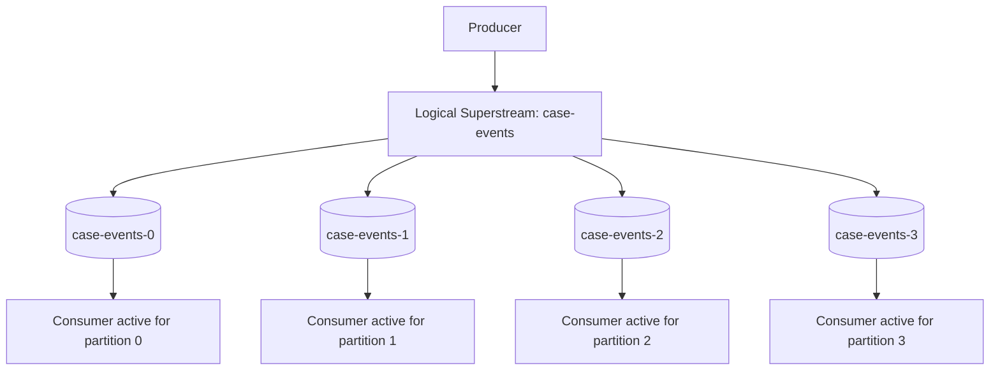
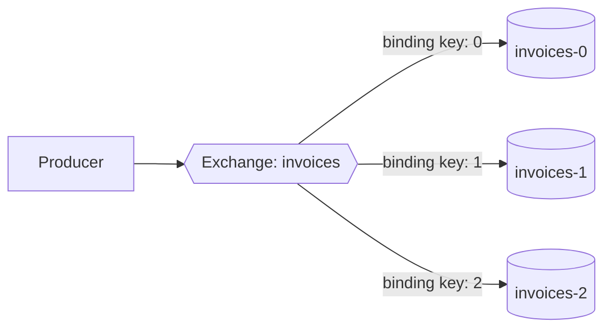
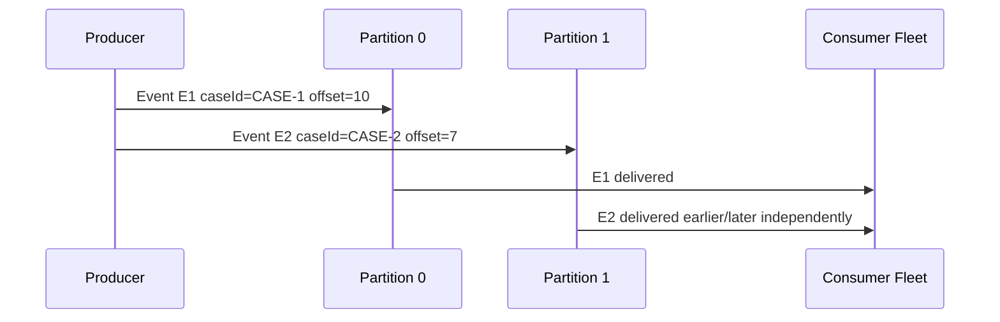
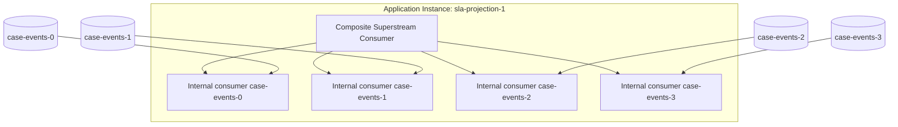
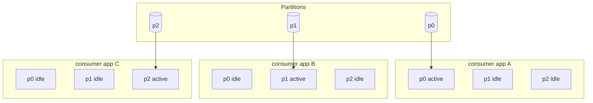
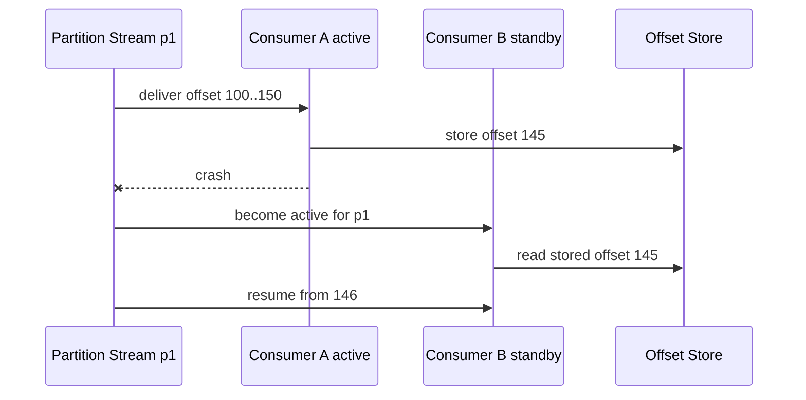
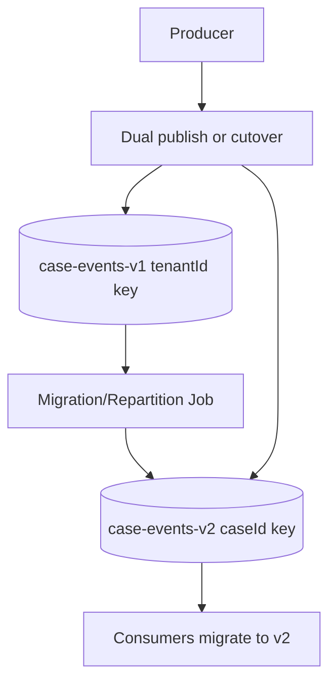
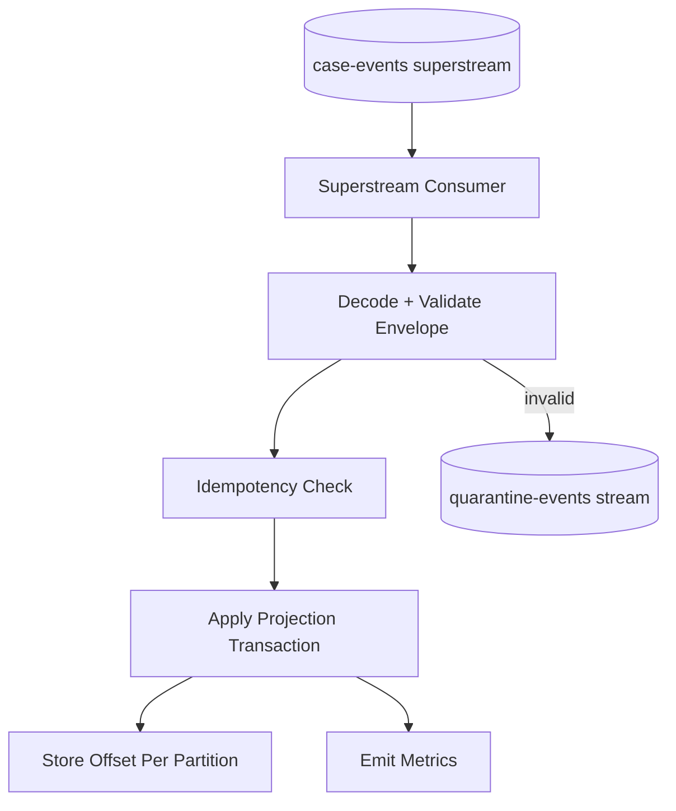
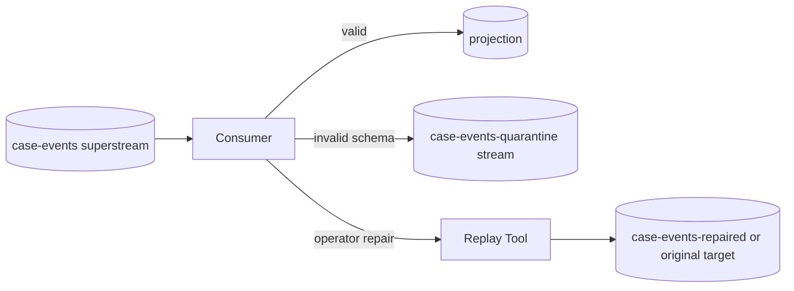
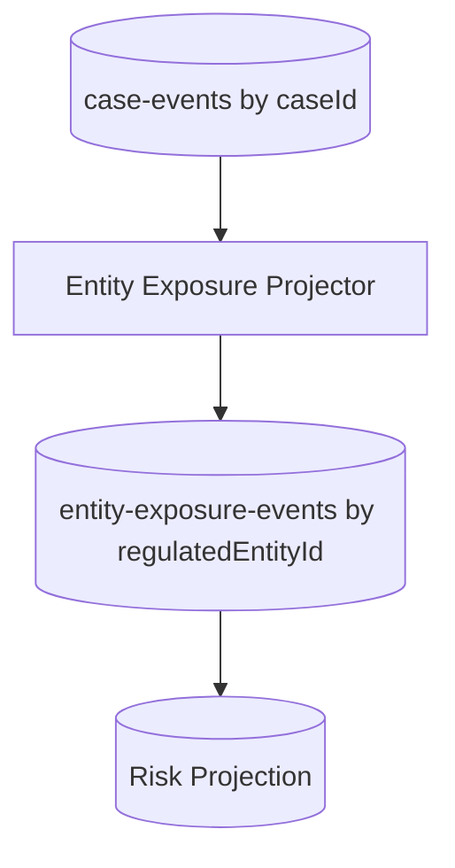

------
title: Learn Java Messaging and Event Streaming - Part 014
description: RabbitMQ Superstreams deep dive: partitioned streams, routing keys, ordering per partition, single active consumer, offset tracking, scaling model, and operational failure modes.
series: learn-java-messaging-event-streaming
seriesTitle: Learn Java Messaging and Event Streaming
order: 14
partTitle: RabbitMQ Superstreams, Partitioning, and Scaling
tags:
- java
- rabbitmq
- rabbitmq-streams
- superstreams
- partitioning
- scaling
- ordering
- distributed-systems
- event-streaming
date: 2026-06-28
---

# Part 014 — RabbitMQ Superstreams, Partitioned Streams, and Scaling

## Tujuan Bagian Ini

Di Part 013, kita membahas RabbitMQ Streams sebagai append-only log. Sekarang kita naik ke **Superstreams**, yaitu logical stream yang terdiri dari beberapa stream individual. Tujuannya adalah scale-out: membagi storage dan traffic ke beberapa partition stream.

Setelah bagian ini, kamu harus bisa:

1. Menjelaskan Superstream sebagai **partitioned stream**, bukan magic auto-scaling.
2. Mendesain partition key yang menjaga ordering yang benar.
3. Memahami hubungan antara exchange, binding, stream partition, dan routing key.
4. Menggunakan single active consumer untuk menjaga order per partition.
5. Mendesain consumer group style processing di RabbitMQ Streams.
6. Menghindari anti-pattern: over-partitioning, wrong key, global ordering illusion, dan uncontrolled rebalance.
7. Membuat decision matrix: kapan cukup single stream, kapan perlu superstream, kapan sebaiknya Kafka.

---

## 1. Mental Model: Superstream = Logical Stream + Partition Streams

Satu stream punya batas throughput dan storage praktis. Jika satu stream tidak cukup, RabbitMQ menyediakan Superstream: satu logical stream yang terdiri dari beberapa stream biasa.



Mental model paling penting:

```text
A superstream is not one bigger stream.
It is one logical stream composed of multiple physical streams.
```

Artinya:

- ordering hanya aman di dalam partition stream,
- routing key menentukan partition,
- consumer scaling terjadi per partition,
- offset tracking harus dipahami per stream/partition,
- partition count adalah keputusan arsitektur.

---

## 2. Mengapa Superstream Ada

Superstream menyelesaikan masalah yang muncul ketika single stream mulai menjadi bottleneck.

### 2.1 Storage Scale-Out

Satu stream disimpan dan direplikasi. Jika volume besar, satu stream bisa menciptakan pressure pada node tertentu. Superstream membagi data ke beberapa stream sehingga storage dan traffic bisa tersebar.

### 2.2 Publish Throughput

Jika banyak producer menulis ke satu stream, partitioning membantu membagi append load. Producer memilih partition berdasarkan routing key.

### 2.3 Consumer Throughput

Jika satu consumer tidak cukup cepat memproses satu stream, partitioning memungkinkan beberapa consumer aktif memproses partition berbeda.

### 2.4 Data Locality

Jika partition key punya makna domain, misalnya `region`, `tenantId`, atau `caseId`, processing bisa lebih lokal dan cache/projection update lebih stabil.

---

## 3. Kapan Jangan Pakai Superstream

RabbitMQ sendiri menekankan bahwa superstream menambah kompleksitas dan tidak seharusnya menjadi default semua use case stream.

Jangan pakai superstream jika:

1. Single stream masih cukup dari sisi throughput, storage, dan lag.
2. Kamu butuh global ordering semua event.
3. Kamu belum punya partition key yang jelas.
4. Consumer logic belum idempotent.
5. Tim belum bisa mengoperasikan offset per partition.
6. Masalah sebenarnya adalah consumer lambat, bukan stream bottleneck.
7. Kamu belum mengukur bottleneck.

Rule:

```text
Use superstream because measured limits require partitioning,
not because partitioning sounds more scalable.
```

---

## 4. Topology: Exchange, Binding, dan Partition Stream

Superstream dibangun di atas model AMQP 0-9-1 untuk mendeskripsikan topology: exchange, queues/streams, dan binding. Namun transport stream-native tetap memakai stream protocol ketika menggunakan Stream Java Client.

Contoh logical topology:



Dalam Superstream:

- exchange merepresentasikan logical superstream,
- stream individual adalah partition,
- binding menentukan routing rules,
- client library membaca topology untuk mengetahui partition.

Ada dua cara umum membuat Superstream:

1. CLI `rabbitmq-streams add_super_stream`.
2. Stream Java Client `Environment#streamCreator()`.
3. AMQP 0-9-1 manual topology creation.
4. Management plugin.

Untuk production, topology sebaiknya dikelola sebagai infrastructure resource, bukan dibuat liar oleh aplikasi domain saat runtime.

---

## 5. Membuat Superstream

Contoh CLI konseptual:

```bash
rabbitmq-streams add_super_stream case-events --partitions 4
```

Dengan pendekatan ini, RabbitMQ membuat logical superstream `case-events` dengan partition:

```text
case-events-0
case-events-1
case-events-2
case-events-3
```

Contoh Java Stream Client:

```java
Environment environment = Environment.builder().build();

// Creates case-events-0, case-events-1, case-events-2, case-events-3
// and the corresponding exchange/bindings for the superstream.
environment.streamCreator()
    .name("case-events")
    .superStream()
    .partitions(4)
    .creator()
    .create();
```

Contoh dengan binding key eksplisit:

```java
environment.streamCreator()
    .name("regional-case-events")
    .superStream()
    .bindingKeys("apac", "emea", "amer")
    .creator()
    .create();
```

Binding key eksplisit cocok ketika domain partition memang kategorikal dan stabil, misalnya region. Hash partition cocok ketika domain key cardinality tinggi, misalnya `caseId` atau `tenantId`.

---

## 6. Partition Key: Keputusan Paling Mahal

Partition key menentukan:

- ordering scope,
- load distribution,
- hotspot risk,
- consumer locality,
- future migration cost,
- correctness of projection.

### 6.1 Candidate Keys

| Key | Kelebihan | Risiko |
|---|---|---|
| `caseId` | Semua event satu case urut dalam partition sama | Hotspot jika case tertentu sangat aktif |
| `tenantId` | Data tenant lokal | Tenant besar menjadi hotspot |
| `region` | Operasional/regulatory locality | Distribusi tidak merata |
| `caseType` | Mudah dianalisis | Cardinality rendah, hotspot tinggi |
| random UUID | Distribusi bagus | Ordering per entity hilang |
| `enforcementEntityId` | Cross-case entity ordering | Satu entity besar bisa hotspot |

### 6.2 Rule Utama

```text
Choose the narrowest key that preserves the ordering invariant your business actually needs.
```

Contoh:

- Jika status case harus diproses berurutan per case, gunakan `caseId`.
- Jika semua event tenant harus strict order, gunakan `tenantId`, tetapi siap menghadapi hotspot.
- Jika hanya aggregate case yang butuh order, jangan pilih tenant sebagai key.

### 6.3 Ordering Invariant

Tulis ordering invariant eksplisit:

```text
For a given caseId, events that mutate case lifecycle must be observed in publish order.
```

Lalu partition key:

```text
partition_key = caseId
```

Jika invariant-nya:

```text
For a given regulated entity, enforcement exposure updates must be observed in order.
```

Partition key mungkin:

```text
partition_key = regulatedEntityId
```

Jangan pilih key sebelum tahu invariant.

---

## 7. Global Ordering Illusion

Superstream tidak memberi global ordering lintas partition.



Kalau kamu membutuhkan urutan total semua event, partitioning akan melanggar asumsi itu. Tetapi banyak sistem sebenarnya tidak butuh global ordering. Mereka butuh ordering per aggregate/entity.

Pertanyaan desain:

- Apakah `CaseOpened` untuk case A harus diurutkan terhadap `EvidenceReceived` untuk case B?
- Biasanya tidak.
- Apakah `CaseOpened`, `CaseStatusChanged`, `CaseClosed` untuk case A harus berurutan?
- Biasanya ya.

Maka partition by `caseId` masuk akal.

---

## 8. Publishing ke Superstream

Dalam Stream Java Client, producer bisa diarahkan ke superstream. Producer membutuhkan routing logic untuk menentukan partition.

Contoh konseptual:

```java
Producer producer = environment.producerBuilder()
    .superStream("case-events")
    .routing(message -> {
        String caseId = message.getApplicationProperties()
            .get("caseId")
            .toString();
        return caseId;
    })
    .build();
```

> Catatan: API detail bisa berbeda antar versi client. Prinsipnya tetap: message harus menyediakan routing value agar client/broker dapat memilih partition.

Envelope event harus menyimpan key yang digunakan:

```json
{
  "eventId": "01J...",
  "eventType": "CaseStatusChanged",
  "aggregateId": "CASE-2026-00912",
  "partitionKey": "CASE-2026-00912",
  "occurredAt": "2026-06-28T10:15:30Z",
  "payload": {
    "from": "UNDER_REVIEW",
    "to": "ESCALATED"
  }
}
```

Kenapa `partitionKey` disimpan di payload/envelope?

- Debugging routing lebih mudah.
- Reprocessing bisa memverifikasi key consistency.
- Migration ke topology baru bisa diaudit.
- Consumer bisa melakukan sanity check.

---

## 9. Consumer Model: Composite Consumer

Superstream consumer terlihat seperti satu consumer logical, tetapi di bawahnya ia membaca beberapa partition stream.



Minimal consumer:

```java
Consumer consumer = environment.consumerBuilder()
    .superStream("case-events")
    .messageHandler((context, message) -> {
        process(context.stream(), context.offset(), message);
    })
    .build();
```

Dalam production, hampir selalu butuh:

- consumer name,
- offset tracking strategy,
- idempotency,
- metrics per partition stream,
- graceful shutdown,
- retry/quarantine policy.

---

## 10. Single Active Consumer: Order per Partition

Jika beberapa instance membaca superstream yang sama, kamu tidak ingin semua instance memproses partition yang sama secara paralel bila order harus dijaga. Di sinilah **single active consumer** penting.

Dengan single active consumer:

- beberapa consumer instance bisa share nama yang sama,
- untuk setiap partition, hanya satu consumer aktif,
- consumer lain idle/standby,
- jika active consumer crash, consumer lain mengambil alih,
- order per partition dijaga karena hanya satu active consumer per partition.



Contoh:

```java
Consumer consumer = environment.consumerBuilder()
    .superStream("case-events")
    .name("sla-projection")
    .singleActiveConsumer()
    .messageHandler((context, message) -> {
        processIdempotently(context.stream(), context.offset(), message);
    })
    .build();
```

Nama consumer bukan kosmetik. Nama consumer mengidentifikasi group consumer dan juga berhubungan dengan offset tracking.

---

## 11. Scaling Formula

Untuk Superstream dengan `P` partition dan `N` application instances:

```text
max_active_consumers = min(P, N) per consumer group
```

Jika:

```text
P = 4 partitions
N = 2 instances
```

Maka maksimal 2 instance aktif, masing-masing bisa menangani beberapa partition.

Jika:

```text
P = 4 partitions
N = 10 instances
```

Maka hanya 4 active partition consumers. Sisanya idle/standby.

Artinya menambah instance lebih banyak dari partition count tidak menaikkan parallelism, hanya menambah standby/recovery capacity.

### Decision Table

| Partition Count | Instance Count | Efek |
|---:|---:|---|
| 1 | 5 | Hanya 1 active, 4 standby |
| 4 | 2 | 2 active instances, masing-masing bisa memegang >1 partition |
| 4 | 4 | Ideal parallelism: 1 partition per instance |
| 4 | 8 | 4 active, 4 idle/standby |
| 12 | 4 | 4 active instances, masing-masing beberapa partition |

---

## 12. Offset Tracking di Superstream

Offset di superstream bukan satu angka global. Offset bermakna pada partition stream tertentu.

```text
case-events-0 offset 900
case-events-1 offset 122
case-events-2 offset 9912
case-events-3 offset 17
```

Jangan membuat tabel offset seperti ini:

```text
consumer_name | superstream_name | offset
```

Itu salah karena offset tidak global.

Gunakan:

```text
consumer_name | stream_partition | offset | stored_at
```

Contoh schema:

```sql
CREATE TABLE stream_consumer_offsets (
    consumer_name      VARCHAR(200) NOT NULL,
    stream_name        VARCHAR(200) NOT NULL,
    offset_value       BIGINT NOT NULL,
    updated_at         TIMESTAMP NOT NULL,
    PRIMARY KEY (consumer_name, stream_name)
);
```

Untuk superstream `case-events`, `stream_name` berisi partition aktual:

```text
case-events-0
case-events-1
case-events-2
case-events-3
```

### Manual Tracking dengan Partition Awareness

Pseudo-code:

```java
Map<String, Long> lastProcessedOffsetByStream = new ConcurrentHashMap<>();

Consumer consumer = environment.consumerBuilder()
    .superStream("case-events")
    .name("case-dashboard-projection")
    .singleActiveConsumer()
    .manualTrackingStrategy()
    .builder()
    .messageHandler((context, message) -> {
        String partitionStream = context.stream();
        long offset = context.offset();

        processIdempotently(partitionStream, offset, message);

        lastProcessedOffsetByStream.put(partitionStream, offset);

        if (shouldCheckpoint(partitionStream)) {
            context.storeOffset();
        }
    })
    .build();
```

Dalam external offset store, simpan offset per partition stream.

---

## 13. Rebalancing dan Consumer Handoff

Dengan single active consumer, ketika instance aktif berhenti/crash, broker memilih consumer lain untuk menjadi aktif pada partition tersebut.



Duplicate window tetap mungkin:

- A memproses sampai 150 tapi baru store 145,
- B resume dari 146,
- event 146..150 diproses ulang.

Itu normal. Consumer harus idempotent.

Skip window tidak boleh terjadi:

- jika offset 150 disimpan sebelum processing 146..150 durable,
- lalu A crash,
- B resume dari 151,
- event 146..150 hilang dari projection.

Maka offset harus merepresentasikan durable processing.

---

## 14. Partition Count Decision

Partition count sulit diubah tanpa konsekuensi routing/replay/migration. Pilih dengan hati-hati.

### 14.1 Inputs

- expected write throughput,
- expected consumer throughput per partition,
- target lag recovery time,
- storage distribution,
- partition key cardinality,
- hotspot distribution,
- operational overhead,
- future growth.

### 14.2 Rough Sizing

```text
required_partitions_by_write = ceil(target_write_throughput / safe_write_throughput_per_partition)

required_partitions_by_read = ceil(target_processing_throughput / safe_processing_throughput_per_consumer)

partition_count = max(required_partitions_by_write, required_partitions_by_read, minimum_distribution_requirement)
```

Jangan pakai angka vendor/benchmark mentah. Ukur payload, confirm mode, compression, network, disk, consumer processing, dan retention pattern milikmu sendiri.

### 14.3 Example

```text
Target publish throughput:              40,000 events/sec
Measured safe throughput per partition: 10,000 events/sec
Consumer processing per instance:        5,000 events/sec
Target consumer parallelism:             8 instances

By write: ceil(40,000 / 10,000) = 4
By read:  ceil(40,000 / 5,000)  = 8
Recommended starting partitions:         8
```

Tambahkan margin, tetapi jangan over-partition tanpa alasan.

---

## 15. Hot Partition

Hot partition terjadi ketika routing key tidak merata.

Contoh:

```text
partition key = tenantId
```

Jika tenant A menghasilkan 70% traffic, satu partition bisa overload sementara partition lain idle.

Gejala:

- lag hanya naik di satu partition,
- CPU/disk node tertentu tinggi,
- consumer group terlihat tidak seimbang,
- p99 latency event untuk tenant tertentu naik.

Mitigasi:

| Strategy | Kapan Dipakai | Trade-off |
|---|---|---|
| Better key | Key awal salah | Bisa butuh migration/replay |
| Composite key | Tenant besar perlu dipecah | Ordering tenant global hilang |
| Dedicated stream for huge tenant | Tenant isolation penting | Operational overhead naik |
| Increase partitions | Key cardinality cukup tinggi | Tidak menyelesaikan low-cardinality hotspot |
| Split aggregate | Domain bisa dipecah | Complexity business naik |

Composite key example:

```text
partitionKey = tenantId + ':' + hash(caseId) % 16
```

Ini menyebar tenant besar, tetapi ordering hanya per `(tenantId, caseShard)`, bukan per tenant global. Jika business hanya butuh order per case, ini aman.

---

## 16. Partition Key Migration

Partition key migration adalah pekerjaan serius.

Misalnya awalnya:

```text
partition_key = tenantId
```

Lalu karena hotspot, ingin ubah ke:

```text
partition_key = caseId
```

Masalah:

- event lama tersebar dengan rule lama,
- event baru tersebar dengan rule baru,
- projection replay harus tahu rule berdasarkan waktu/version,
- ordering lintas migration boundary bisa rusak,
- consumer offset lama tidak langsung berlaku.

### Migration Pattern



Steps:

1. Buat superstream baru `case-events-v2`.
2. Jalankan bridge/repartition job dari v1 ke v2.
3. Pastikan idempotency event id dipertahankan.
4. Jalankan projection parallel dan compare hasil.
5. Cutover consumers.
6. Freeze v1 setelah confidence window.
7. Hapus v1 hanya setelah retention/archive policy aman.

Jangan ubah partition key diam-diam di producer aktif tanpa versioned migration.

---

## 17. Backpressure di Superstream

Backpressure harus dilihat per partition, bukan hanya aggregate.

Metrics minimal:

| Metric | Level |
|---|---|
| publish rate | superstream + partition |
| confirm latency | producer + partition |
| consumer processing rate | consumer group + partition |
| consumer lag | partition |
| oldest available offset/timestamp | partition |
| active consumer owner | partition |
| handoff count | partition |
| error/quarantine rate | event type + partition |

Aggregate metrics bisa menipu:

```text
Total lag = 10,000 events
```

Terlihat aman. Tetapi detailnya:

```text
p0 lag = 0
p1 lag = 0
p2 lag = 10,000
p3 lag = 0
```

Ini hot partition atau stuck consumer.

---

## 18. Failure Modes Superstream

### 18.1 Wrong Partition Key Breaks Ordering

Penyebab:

- producer memakai random key,
- producer lupa set key,
- event untuk aggregate sama masuk partition berbeda,
- key berubah antar event type.

Dampak:

- `CaseClosed` diproses sebelum `CaseOpened`,
- projection menolak event valid,
- retry tidak menyelesaikan karena ordering source salah.

Mitigasi:

- contract test producer,
- event envelope wajib punya `aggregateId` dan `partitionKey`,
- consumer sanity check:

```java
if (!event.aggregateId().equals(event.partitionKey())) {
    quarantine(event, "PARTITION_KEY_MISMATCH");
}
```

Tentu check ini hanya berlaku jika memang rule-nya `partitionKey = aggregateId`.

### 18.2 More Consumers Than Partitions

Penyebab:

- scale deployment ke 20 replica,
- partition hanya 4,
- 16 idle.

Dampak:

- ekspektasi throughput salah,
- cost naik,
- operator bingung karena pod hidup tapi tidak bekerja.

Mitigasi:

- autoscaling berdasarkan active partition assignment,
- dokumentasikan max parallelism,
- increase partition hanya jika bottleneck terukur.

### 18.3 Partition Consumer Crash Loop

Penyebab:

- poison event di satu partition,
- active consumer crash,
- standby mengambil alih,
- crash lagi di event sama.

Dampak:

- partition stuck,
- handoff storm,
- lag naik hanya di partition itu.

Mitigasi:

- quarantine policy,
- bounded retry,
- poison event skip with audit after operator approval,
- replay tool.

### 18.4 Offset Per Superstream, Bukan Per Partition

Penyebab:

- custom offset table salah schema,
- hanya menyimpan satu offset untuk logical superstream.

Dampak:

- resume salah partition,
- duplicate besar,
- skip event,
- recovery tidak deterministic.

Mitigasi:

- offset key wajib `(consumerName, partitionStream)`.

### 18.5 Repartition Without Replay Plan

Penyebab:

- partition count atau routing key diganti langsung.

Dampak:

- ordering inconsistency,
- projection divergence,
- audit reconstruction sulit.

Mitigasi:

- versioned stream,
- bridge job,
- dual-run projection compare,
- cutover checklist.

---

## 19. Superstream vs Multiple Separate Streams

Kadang engineer membuat banyak stream manual:

```text
case-events-apac
case-events-emea
case-events-amer
```

Itu bisa valid. Bedanya dengan Superstream:

| Option | Kelebihan | Kekurangan |
|---|---|---|
| Separate streams manual | Isolasi jelas, governance berbeda | Client harus tahu semua stream, scaling manual |
| Superstream | Logical abstraction, client support, partition semantics | Perlu paham topology dan routing |
| Single stream | Sederhana | Batas scale dan hotspot single stream |

Gunakan separate streams jika boundary-nya benar-benar berbeda:

- retention berbeda,
- access control berbeda,
- compliance boundary berbeda,
- deployment region berbeda,
- ownership team berbeda.

Gunakan superstream jika semua partition adalah bagian dari satu logical feed yang sama.

---

## 20. Superstream vs Kafka Partitioned Topic

Superstream mirip Kafka topic partition dari sisi “logical feed dibagi ke partition”, tetapi tidak identik.

| Dimensi | RabbitMQ Superstream | Kafka Topic Partition |
|---|---|---|
| Topology basis | Exchange + stream queues + bindings | Topic + partitions |
| Client ecosystem | RabbitMQ Stream Java Client | Kafka Producer/Consumer ecosystem |
| Ordering | Per stream partition | Per topic partition |
| Consumer ownership | Single active consumer support | Consumer group partition assignment |
| Stream processing | Lebih terbatas | Kafka Streams/ksqlDB ecosystem matang |
| Routing style | Routing key/binding model RabbitMQ | Partitioner/key model Kafka |
| Operational fit | RabbitMQ-native org | Kafka/event-platform org |

Jika kebutuhanmu adalah beberapa RabbitMQ-native stream feed dengan replay dan fan-out, Superstream sangat masuk akal. Jika kebutuhanmu adalah enterprise event platform dengan banyak producer/consumer lintas domain, schema governance kuat, connect ecosystem, dan stream processing kompleks, Kafka bisa lebih cocok.

---

## 21. Java Consumer Architecture untuk Superstream

Recommended architecture:



Pseudo-code:

```java
public final class CaseEventsSuperstreamConsumer {

    private final String consumerName = "case-dashboard-projection";
    private final ProjectionRepository projectionRepository;
    private final InboxRepository inboxRepository;
    private final OffsetRepository offsetRepository;
    private final QuarantinePublisher quarantinePublisher;

    public void start(Environment environment) {
        environment.consumerBuilder()
            .superStream("case-events")
            .name(consumerName)
            .singleActiveConsumer()
            .manualTrackingStrategy()
            .builder()
            .messageHandler((context, message) -> {
                String partition = context.stream();
                long offset = context.offset();

                try {
                    handle(partition, offset, message);
                    context.storeOffset();
                } catch (InvalidEventException ex) {
                    quarantinePublisher.publish(partition, offset, message, ex);
                    context.storeOffset(); // only if policy says invalid event is safely handled
                } catch (TransientDependencyException ex) {
                    throw ex; // let process-level retry/restart policy handle it
                }
            })
            .build();
    }

    private void handle(String partition, long offset, Message message) {
        CaseEventEnvelope event = decode(message);

        transaction(() -> {
            if (inboxRepository.exists(consumerName, event.eventId())) {
                return;
            }

            projectionRepository.apply(event);
            inboxRepository.insert(consumerName, event.eventId(), partition, offset);
            offsetRepository.store(consumerName, partition, offset);
        });
    }
}
```

Critical policy:

- Jangan `storeOffset()` setelah invalid event kecuali event sudah masuk quarantine durable.
- Jangan swallow transient exception lalu store offset.
- Jangan update projection dan offset di resource berbeda tanpa idempotency.

---

## 22. Quarantine Stream untuk Poison Event

Superstream tidak memberi DLX semantics seperti queue. Buat quarantine eksplisit.



Quarantine payload harus menyimpan:

- original stream partition,
- original offset,
- original event id,
- error code,
- exception class/message sanitized,
- received timestamp,
- consumer name,
- raw payload jika policy memperbolehkan,
- schema version,
- producer metadata.

Contoh:

```json
{
  "quarantineId": "01J...",
  "sourceSuperstream": "case-events",
  "sourcePartition": "case-events-2",
  "sourceOffset": 998812,
  "consumerName": "case-dashboard-projection",
  "reasonCode": "UNKNOWN_SCHEMA_VERSION",
  "eventId": "01J...",
  "eventType": "CaseStatusChanged",
  "schemaVersion": 99,
  "capturedAt": "2026-06-28T11:00:00Z"
}
```

---

## 23. Observability Dashboard

Untuk Superstream, dashboard minimal harus memisahkan logical dan partition-level view.

### Logical View

- total publish rate,
- total consume rate per consumer group,
- total lag,
- p95/p99 publish confirm latency,
- active consumer count,
- error/quarantine rate.

### Partition View

- publish rate per partition,
- lag per partition,
- active owner per partition,
- handoff count per partition,
- oldest offset/timestamp per partition,
- disk usage per partition,
- confirmation latency per partition,
- processing latency per partition.

### Alert yang Berguna

| Alert | Condition |
|---|---|
| Retention risk | consumer lag age > 70% retention age |
| Hot partition | one partition receives > 50% traffic for sustained window |
| Stuck partition | partition lag increases while others drain |
| Handoff storm | active owner changes repeatedly |
| Quarantine spike | invalid events exceed baseline |
| Confirm latency high | producer confirm p99 above SLO |
| Idle over-scale | replicas > partitions with no failover need |

---

## 24. Autoscaling: Jangan Hanya Berdasarkan CPU

Autoscaling consumer superstream berdasarkan CPU saja sering salah.

Scale signal yang lebih baik:

```text
desired_instances = min(partition_count, ceil(total_lag_drain_rate_needed / measured_processing_rate_per_instance))
```

Namun karena active parallelism dibatasi partition count:

```text
effective_instances <= partition_count
```

Jika partition count 6, scale ke 30 tidak menaikkan parallelism. Ia hanya menambah standby.

Gunakan signals:

- partition lag,
- lag age,
- processing rate per active consumer,
- partition assignment count,
- p99 processing latency,
- downstream DB saturation.

Jangan scale up jika bottleneck ada di database projection. Itu hanya membuat lebih banyak consumer bertarung di resource yang sama.

---

## 25. Regulatory Case-Management Design Example

### Domain Requirement

- Event lifecycle per case harus urut.
- Banyak case bisa diproses paralel.
- Rebuild dashboard harus bisa dari stream.
- Tenant besar tidak boleh membuat semua tenant lain stuck.
- Audit consumer harus menerima semua event.

### Superstream Design

```text
superstream: case-events
partitions: 12
partition key: caseId
consumer groups:
  - case-dashboard-projection
  - sla-projection
  - audit-ingestor
  - notification-trigger
retention: 14 days operational
archive: audit store / object storage / compliance system
```

### Why `caseId`

- Preserves lifecycle ordering per case.
- Distributes traffic across many cases.
- Avoids tenant hotspot if one tenant is large.
- Allows projection updates keyed by case.

### Known Trade-Off

Cross-case entity-level ordering is not guaranteed. If enforcement exposure for same regulated entity must be strictly ordered across cases, create another derived stream keyed by `regulatedEntityId`.



This is better than forcing one stream key to satisfy incompatible ordering requirements.

---

## 26. Design Checklist

Before approving a Superstream design, answer these:

### Semantics

- What is the logical stream?
- What is the partition key?
- What ordering is guaranteed?
- What ordering is explicitly not guaranteed?
- What event types are allowed?

### Scale

- Why is single stream insufficient?
- What throughput was measured?
- How many partitions are needed?
- What is the hotspot risk?
- What is max active consumer parallelism?

### Reliability

- How are producer duplicates handled?
- How are consumer duplicates handled?
- Where are offsets stored?
- Are offsets per partition?
- What happens on consumer handoff?

### Operations

- What is retention?
- What is replay path?
- What is quarantine path?
- What metrics exist per partition?
- What alerts protect retention risk?
- How is topology managed?

### Migration

- How will partition count/key change later?
- Is there a v2 stream migration plan?
- Can projections dual-run for comparison?

---

## 27. Practice: Superstream Load and Failure Lab

### Setup

Create superstream:

```bash
rabbitmq-streams add_super_stream case-events --partitions 4
```

Run producer:

- 1 million events,
- partition key = `caseId`,
- 10k unique case IDs,
- event type mix: `CaseOpened`, `CaseStatusChanged`, `EvidenceReceived`.

Run consumers:

- 1 instance,
- 2 instances,
- 4 instances,
- 8 instances.

### Observe

- active consumer per partition,
- lag per partition,
- publish confirm latency,
- processing rate,
- duplicate rate after crash,
- handoff behavior.

### Failure Injection

1. Kill active consumer instance.
2. Confirm standby takes over.
3. Verify duplicate window.
4. Introduce poison event in one partition.
5. Verify only one partition gets stuck.
6. Quarantine poison event.
7. Resume processing.
8. Create hotspot by sending 80% traffic to one case ID.
9. Observe partition imbalance.

### Expected Learning

You should be able to explain why:

- partition count limits active parallelism,
- single active consumer preserves order per partition,
- offset tracking must be partition-aware,
- wrong key creates correctness bugs,
- hotspot cannot always be solved by adding instances.

---

## 28. Common Anti-Patterns

### Anti-Pattern 1 — Superstream by Default

Superstream is not the default stream mode. Use it after measured need.

### Anti-Pattern 2 — Random Partition Key

Random key gives distribution but destroys per-entity order.

### Anti-Pattern 3 — Tenant Key for Everything

Tenant key often creates hotspots. It also over-orders unrelated entities within one tenant.

### Anti-Pattern 4 — One Offset for Logical Superstream

Offset is per partition stream. One global offset is wrong.

### Anti-Pattern 5 — More Replicas = More Throughput

Throughput cannot exceed active partition parallelism.

### Anti-Pattern 6 — No Quarantine Path

A single poison event can crash-loop one partition forever.

### Anti-Pattern 7 — Repartition In Place

Changing key/partition count without versioned migration breaks replay and ordering assumptions.

### Anti-Pattern 8 — Assuming Global Order

Partitioned systems preserve local order, not global order.

---

## 29. Production Readiness Rubric

Score each item 0–2:

| Area | Question | Score |
|---|---|---:|
| Partition key | Is ordering invariant explicit and matched by key? | 0–2 |
| Hotspot analysis | Have high-volume keys been modelled? | 0–2 |
| Offset tracking | Is offset stored per partition? | 0–2 |
| Idempotency | Can duplicate replay corrupt state? | 0–2 |
| SAC | Is single active consumer used where order matters? | 0–2 |
| Retention | Does retention cover lag + recovery? | 0–2 |
| Quarantine | Can poison event be isolated? | 0–2 |
| Metrics | Are partition-level metrics visible? | 0–2 |
| Migration | Is v2 repartition plan documented? | 0–2 |
| Load test | Was throughput measured with real payload? | 0–2 |

Interpretation:

```text
0-8   : Not production-ready
9-14  : Risky; acceptable only for non-critical flow
15-18 : Reasonable with known limitations
19-20 : Strong production posture
```

---

## Ringkasan

Superstream adalah cara RabbitMQ Streams melakukan partitioning. Ia memberi scale-out untuk publish, consume, dan storage, tetapi dengan harga kompleksitas:

- ordering hanya per partition,
- partition key menentukan correctness,
- offset harus per partition,
- active parallelism dibatasi partition count,
- single active consumer penting untuk order per partition,
- hot partition tetap mungkin,
- repartitioning harus versioned dan tested.

Mental model utama:

```text
Single stream solves replay and fan-out.
Superstream solves scale-out by partitioning.
Partitioning solves throughput but creates ordering and migration constraints.
```

Di part berikutnya kita akan membahas fitur lanjutan RabbitMQ Streams: **filtering, deduplication lebih dalam, performance testing, dan benchmark methodology**.

---

## Referensi Resmi yang Dicek

- RabbitMQ Documentation — Streams and Superstreams
- RabbitMQ Stream Java Client Documentation — Super Streams, Single Active Consumer, Offset Tracking
- RabbitMQ Documentation — Stream Plugin and stream management tooling
