------
title: Learn Java Messaging and Event Streaming - Part 015
description: RabbitMQ Streams advanced features: stream filtering, deduplication, offset interaction, benchmark discipline, Stream PerfTest, and production performance failure modes.
series: learn-java-messaging-event-streaming
seriesTitle: Learn Java Messaging and Event Streaming
order: 15
partTitle: RabbitMQ Stream Filtering, Deduplication, and Performance Testing
tags:
- java
- rabbitmq
- rabbitmq-streams
- stream-filtering
- deduplication
- performance-testing
- benchmarking
- event-streaming
date: 2026-06-28
---

# Part 015 — RabbitMQ Stream Filtering, Deduplication, and Performance Testing

## Tujuan Bagian Ini

Di Part 013 kita membangun mental model RabbitMQ Streams sebagai append-only log. Di Part 014 kita membahas Superstreams sebagai partitioned stream. Bagian ini menutup blok RabbitMQ Streams dengan tiga kemampuan production-grade:

1. **Filtering**: mengurangi data yang dikirim ke consumer ketika consumer hanya membutuhkan subset stream.
2. **Deduplication**: mencegah duplicate publish akibat retry, restart, reconnect, atau publisher replay.
3. **Performance testing**: mengukur throughput/latency dengan skenario yang realistis, bukan angka kosong yang tidak bisa dipakai untuk keputusan arsitektur.

Setelah bagian ini, kamu harus bisa:

- menjelaskan filtering sebagai optimisasi delivery, bukan otorisasi dan bukan business validation;
- memilih filter value yang rendah risiko terhadap false positive dan cardinality problem;
- mendesain publisher dedup dengan producer name dan publishing id yang stabil;
- memahami mengapa dedup producer-side tidak menggantikan idempotent consumer;
- membuat benchmark RabbitMQ Streams yang mengukur producer, broker, disk, network, consumer, dan end-to-end behavior;
- menghindari benchmark yang misleading karena payload, compression, batching, replication, retention, atau consumer logic tidak realistis.

---

## 1. Mental Model: Filtering dan Dedup Ada di Jalur Berbeda

Filtering dan deduplication sering dibahas bersamaan karena sama-sama mengurangi “message yang tidak perlu”. Tapi keduanya berada di jalur berbeda.

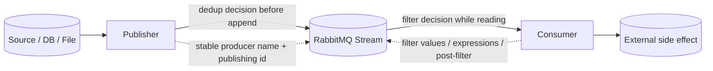

**Deduplication** menjawab:

```text
Apakah message ini sudah pernah berhasil dipublish oleh producer ini ke stream ini?
```

**Filtering** menjawab:

```text
Apakah consumer ini perlu menerima message ini dari stream ini?
```

Perbedaannya penting:

| Concern | Filtering | Deduplication |
|---|---|---|
| Posisi | read path | write path |
| Tujuan | kurangi delivery ke consumer | kurangi duplicate append |
| Aktor utama | consumer | producer |
| State penting | filter value/expression | producer name + publishing id |
| Risiko utama | missing message karena filter salah, false positive, unexpected unfiltered handling | message legitimate difilter karena publishing id tidak strictly increasing |
| Mengganti idempotency? | tidak | tidak |
| Mengganti authorization? | tidak | tidak |

Rule utama:

```text
Filtering optimizes selection.
Deduplication optimizes publish retry.
Neither proves business correctness.
```

---

## 2. Stream Filtering: Mengapa Dibutuhkan

Tanpa filtering, setiap consumer yang attach ke stream membaca semua message dari offset yang dipilih. Ini cocok untuk audit replay, analytics, dan consumer yang benar-benar butuh semua event. Tapi dalam banyak sistem, consumer hanya butuh sebagian.

Contoh regulatory case-management:

- `case-audit-projector` butuh semua event.
- `sla-breach-detector` hanya butuh event yang memengaruhi deadline.
- `enforcement-escalation-worker` hanya butuh event dengan `region = APAC` dan `caseType = ENFORCEMENT`.
- `notification-worker` hanya butuh event yang menghasilkan notifikasi.

Tanpa filtering:

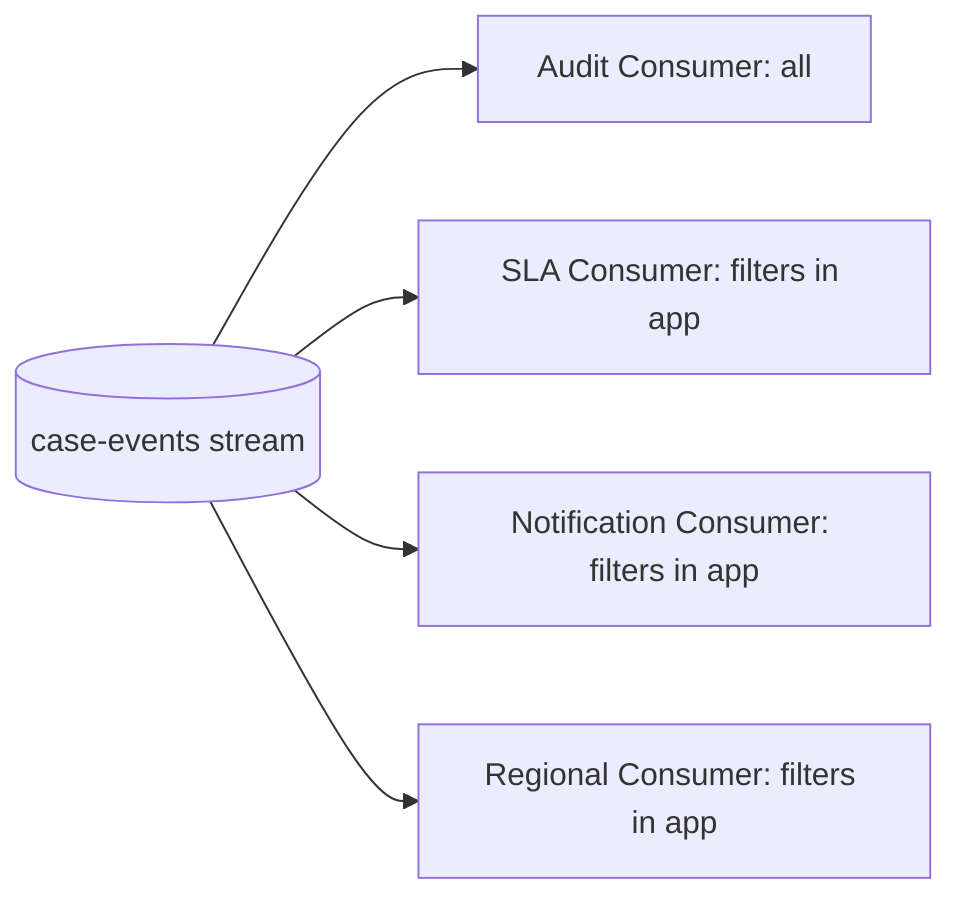

Masalahnya:

- broker membaca data yang akhirnya dibuang consumer;
- network bandwidth terpakai untuk message yang tidak relevan;
- consumer CPU/memory dipakai untuk parse dan discard;
- lag terlihat tinggi padahal sebagian besar message tidak relevan;
- scaling consumer menjadi mahal karena semua consumer membawa full stream load.

Dengan stream filtering:

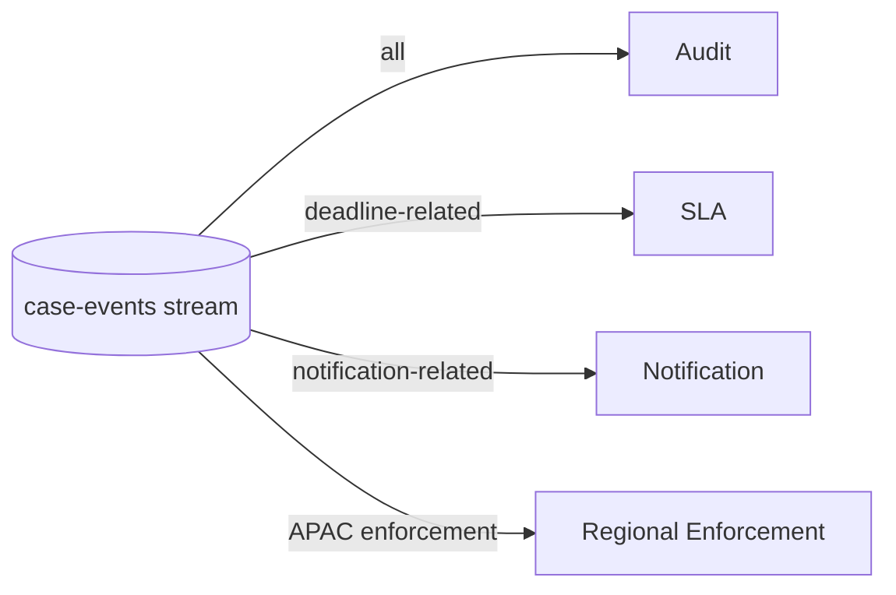

Filtering membuat stream tetap menjadi source of truth, tetapi consumer bisa mengurangi traffic yang tidak dibutuhkan.

---

## 3. Filtering Bukan Routing Topology

Jangan salah memahami filtering sebagai pengganti exchange routing.

RabbitMQ exchange routing menentukan **ke stream/queue mana message masuk**. Stream filtering menentukan **message mana yang dikirim ke consumer dari stream yang sudah ada**.

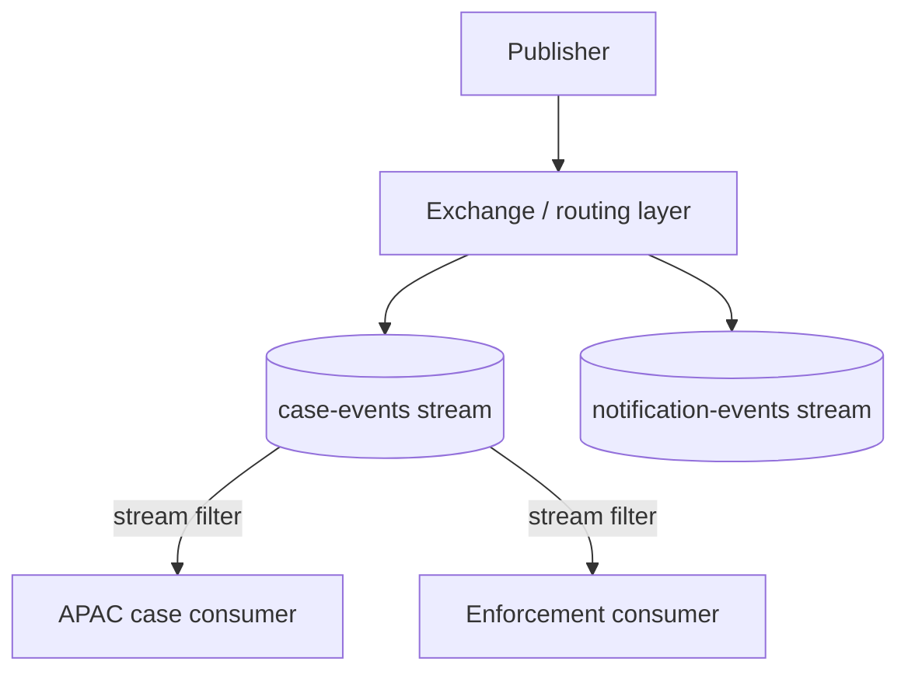

Gunakan exchange/topology ketika:

- domain event memang berbeda destination;
- retention policy berbeda;
- ownership berbeda;
- security boundary berbeda;
- consumer group besar tidak perlu share physical stream;
- operational lifecycle berbeda.

Gunakan stream filtering ketika:

- message tetap masuk ke stream yang sama;
- retention dan audit trail sama;
- consumer hanya butuh subset;
- kamu ingin mengurangi network/CPU tanpa memecah log utama;
- order di dalam subset masih penting.

Anti-pattern:

```text
Satu stream raksasa + filter untuk semua tenant + semua domain + semua retention.
```

Itu biasanya bukan desain stream yang fleksibel. Itu tanda domain boundary belum dipahami.

---

## 4. Tiga Tahap Filtering

RabbitMQ Stream filtering dapat dipahami sebagai tiga lapisan. Tidak semua lapisan harus dipakai bersamaan, tetapi mental model ini penting untuk correctness dan performance.

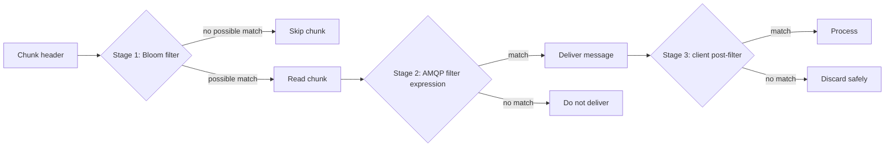

### 4.1 Stage 1 — Bloom Filter

Bloom filter adalah probabilistic set membership check. Karakter penting:

- bisa menghasilkan **false positive**;
- tidak menghasilkan **false negative** untuk value yang benar-benar ada di set;
- sangat efisien untuk melewati chunk yang pasti tidak mengandung value yang diminta;
- bekerja pada level chunk, bukan individual message.

Implikasinya:

```text
Bloom filter can tell the broker: this chunk definitely has no target value.
It cannot always tell: this exact message is definitely wanted.
```

Karena itu, Stage 1 bagus untuk menghemat disk I/O, CPU broker, bandwidth, dan CPU consumer. Tapi untuk business correctness, consumer tetap harus siap melakukan post-filter.

### 4.2 Stage 2 — AMQP Filter Expressions

AMQP filter expressions memungkinkan broker mengevaluasi metadata message seperti properties dan application properties. Ini lebih presisi daripada Bloom filter chunk-level, tetapi lebih mahal.

Cocok untuk:

- field metadata yang stabil;
- consumer yang butuh server-side per-message filtering;
- filter yang tidak terlalu kompleks;
- mengurangi kebutuhan post-filter di client.

Jangan taruh logic bisnis kompleks di filter expression. Filter expression adalah selection mechanism, bukan rules engine.

### 4.3 Stage 3 — Client-Side Post-Filter

Client-side post-filter adalah pertahanan terakhir. Karena Bloom filter dapat false positive dan bekerja per chunk, aplikasi harus tetap memvalidasi bahwa message yang diterima memang cocok dengan predicate yang diinginkan.

Rule praktis:

```text
Every filtered consumer must still be safe when it receives non-matching messages.
```

Contoh:

```java
Consumer consumer = environment.consumerBuilder()
    .stream("case-events")
    .filter()
        .values("region:apac")
        .postFilter(message -> {
            Object region = message.getApplicationProperties().get("region");
            return "APAC".equals(region);
        })
    .builder()
    .messageHandler((context, message) -> {
        CaseEvent event = decode(message);
        processApacEvent(event);
    })
    .build();
```

Catatan:

- `filter().values(...)` mengurangi kemungkinan chunk dibaca/dikirim.
- `postFilter(...)` menjaga correctness di sisi client.
- `processApacEvent(...)` tetap harus idempotent.

---

## 5. Mendesain Filter Value

Filter value harus diperlakukan sebagai bagian dari stream contract. Jangan dibuat sembarangan dari field yang kebetulan tersedia.

### 5.1 Filter Value yang Baik

Filter value yang baik biasanya:

- pendek;
- stabil;
- low-to-medium cardinality;
- mewakili selection dimension yang sering dipakai;
- tidak mengandung PII;
- tidak bergantung pada value yang sering berubah;
- mudah dijelaskan dalam contract.

Contoh baik:

```text
case-type:enforcement
case-type:licensing
region:apac
region:emea
priority:high
notification:true
deadline-impacting:true
```

Contoh berisiko:

```text
customer-id:123456789
case-id:CASE-2026-000001
user-email:person@example.com
full-name:Jane Doe
random-uuid:...
```

High-cardinality value bisa berguna pada kasus tertentu, tetapi membuat filter size, false positive rate, dan operational reasoning lebih sulit.

### 5.2 Filter Value Harus Berdasarkan Query Pattern

Jangan desain filter berdasarkan payload structure saja. Desain berdasarkan consumer query pattern.

Pertanyaan desain:

1. Consumer mana yang membaca stream ini?
2. Consumer mana yang membaca hampir semua event?
3. Consumer mana yang membaca subset kecil?
4. Field apa yang paling sering dipakai untuk subset?
5. Apakah field itu stabil sejak publish time?
6. Apakah field itu aman secara governance?
7. Apakah filter value itu masih valid setelah schema evolution?

Contoh:

```text
Jika 80% consumer memfilter berdasarkan region,
region adalah kandidat filter value yang kuat.

Jika hanya satu debug tool sesekali memfilter berdasarkan caseId,
caseId bukan kandidat filter value utama.
```

### 5.3 Multi-Dimensional Filtering

Kadang consumer butuh kombinasi:

```text
region = APAC AND caseType = ENFORCEMENT AND priority = HIGH
```

Ada beberapa pilihan:

#### Pilihan A — Single Composite Filter Value

```text
apac:enforcement:high
```

Kelebihan:

- efisien untuk exact selection;
- mudah dipakai oleh Bloom filter;
- cocok jika kombinasi terbatas.

Kekurangan:

- combinatorial explosion;
- sulit mendukung query alternatif;
- schema filter value cepat membengkak.

#### Pilihan B — Multiple Coarse Filter Values + Post-Filter

Publisher set value seperti:

```text
region:apac
case-type:enforcement
priority:high
```

Consumer pilih coarse value yang paling selektif, lalu post-filter field lain.

Kelebihan:

- flexible;
- filter value lebih reusable;
- tidak meledak kombinasi.

Kekurangan:

- masih menerima sebagian message tidak relevan;
- perlu post-filter disiplin.

#### Pilihan C — Separate Streams

Pisahkan stream jika boundary kuat:

```text
case-events.apac.enforcement
case-events.emea.enforcement
```

Kelebihan:

- retention dan ownership bisa berbeda;
- consumer lebih sederhana;
- security boundary lebih jelas.

Kekurangan:

- topology lebih kompleks;
- global replay lebih sulit;
- producer routing lebih penting.

Rule praktis:

```text
Use filtering for selection inside a shared log.
Use topology split for ownership, retention, security, or lifecycle boundaries.
```

---

## 6. Filtering dan Ordering

Filtering tidak membuat global ordering baru. Ordering tetap mengikuti stream atau partition stream.

Misalnya stream berisi:

```text
offset 0: region=APAC, case=A, status=OPENED
offset 1: region=EMEA, case=B, status=OPENED
offset 2: region=APAC, case=A, status=ASSIGNED
offset 3: region=APAC, case=C, status=OPENED
```

Consumer dengan filter `region=APAC` melihat:

```text
offset 0: case=A, status=OPENED
offset 2: case=A, status=ASSIGNED
offset 3: case=C, status=OPENED
```

Urutan relatif APAC tetap mengikuti offset stream. Tetapi consumer tidak boleh menyimpulkan bahwa offset 0 langsung diikuti offset 2 tanpa event lain di antaranya. Untuk audit dan causality, offset gap itu valid.

### 6.1 Offset Gap Bukan Data Loss

Dalam filtered consumption, offset gap normal.

```text
Received offsets: 100, 104, 109, 120
```

Itu bisa berarti:

- offset 101–103 tidak cocok filter;
- offset 105–108 tidak cocok filter;
- offset 110–119 tidak cocok filter.

Jangan alert “missing offsets” untuk filtered consumer tanpa memahami filter behavior.

### 6.2 Filtered Consumer Tetap Harus Store Offset Dengan Hati-Hati

Offset yang disimpan harus merepresentasikan posisi di stream, bukan jumlah message yang diproses.

Anti-pattern:

```text
processedCount = 10, therefore next offset = 10
```

Itu salah untuk filtered consumer.

Yang benar:

```text
lastSeenStreamOffset = context.offset()
store(lastSeenStreamOffset)
```

Jika consumer hanya memproses sebagian message karena post-filter, pastikan offset tracking tetap sesuai posisi stream yang sudah aman dilewati.

---

## 7. Deduplication of Published Messages

Publisher duplication terjadi lebih sering daripada yang terlihat. Penyebab umum:

- publisher crash setelah broker menerima message tetapi sebelum callback confirm diterima;
- network timeout membuat publisher retry message yang sebenarnya sudah tersimpan;
- deployment restart mengulang pembacaan source;
- file/DB reader tidak menyimpan checkpoint dengan benar;
- outbox relay membaca batch yang sama setelah crash;
- producer reconnect dan resend in-flight messages.

RabbitMQ Stream deduplication didesain untuk kasus ini.

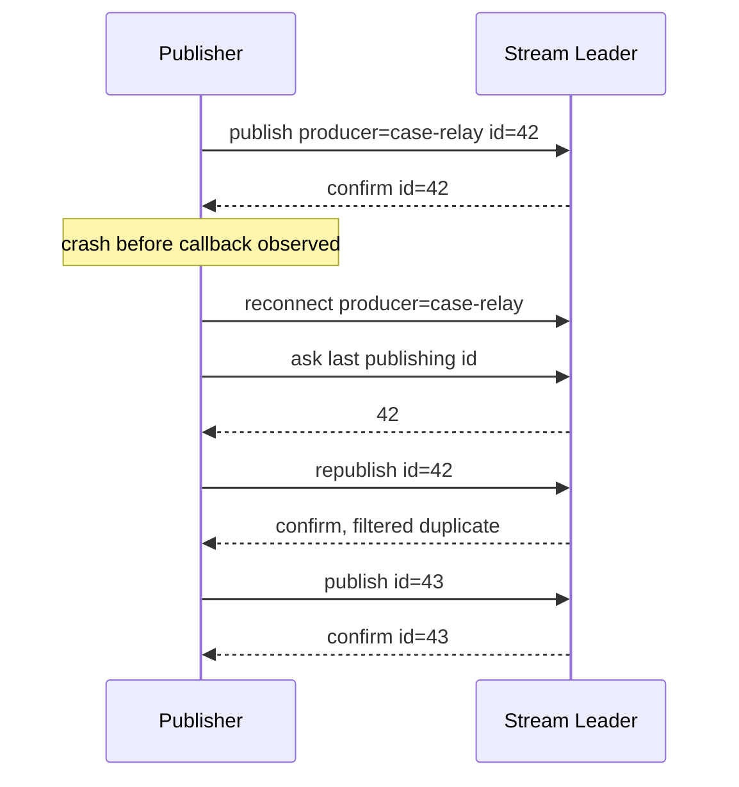

Dedup membutuhkan dua elemen:

1. **Producer name** yang stabil dan unik per stream.
2. **Publishing ID** yang strictly increasing untuk producer tersebut.

---

## 8. Producer Name Discipline

Producer name bukan random UUID per process. Producer name adalah identity dari logical publishing application.

Contoh baik:

```text
case-outbox-relay-primary
license-case-importer
sanction-decision-publisher
case-event-replay-tool-2026q2
```

Contoh buruk:

```text
producer-${randomUuid}
localhost-12345
pod-${podName}
thread-${threadId}
```

Kenapa pod name buruk? Karena saat pod restart, identity berubah. Broker tidak bisa mengaitkan publishing ID baru dengan history producer lama.

Rule:

```text
Producer name must survive process restart.
It should represent logical publisher identity, not runtime instance identity.
```

### 8.1 Satu Producer Name Tidak Boleh Dipakai Concurrently Sembarangan

Dedup memakai highest publishing ID untuk producer name tertentu. Jika dua instance aktif memakai producer name yang sama dan publishing ID masing-masing, urutan bisa intertwine.

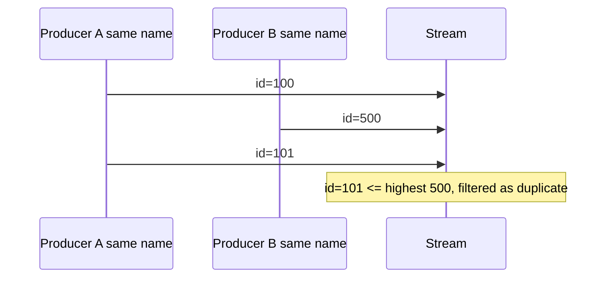

Message `101` mungkin legitimate, tetapi difilter karena `500` sudah menaikkan limit.

Rule:

```text
One logical named producer must have one strictly ordered publishing-id sequence.
```

Jika butuh parallel publishing:

- gunakan producer name berbeda per shard;
- pastikan masing-masing shard punya monotonic publishing ID sendiri;
- route ke stream/partition yang sesuai;
- jangan campur ID sequence dari banyak worker tanpa sequencer.

---

## 9. Publishing ID Discipline

Publishing ID harus strictly increasing. Ia boleh punya gap, tetapi tidak boleh mundur.

Valid:

```text
1, 2, 3, 4, 5
10, 20, 30, 40
100, 101, 105, 200
```

Invalid:

```text
1, 2, 10, 3
100, 90, 91
50, 50, 51
```

Masalah paling berbahaya:

```text
Publish id=10 berhasil.
Lalu publish id=4.
Broker melihat id=4 <= highest id=10.
Broker filter id=4 sebagai duplicate.
Padahal id=4 belum pernah tersimpan.
```

Jadi publishing ID bukan “unique id” biasa. Ia adalah **monotonic cursor**.

### 9.1 Sumber Publishing ID yang Aman

Sumber yang biasanya aman:

- outbox table dengan numeric increasing primary key;
- append-only file line number;
- CDC log sequence number yang monotonic per source partition;
- sequence table yang dikelola khusus untuk relay;
- deterministic ordered replay cursor.

Sumber yang berisiko:

- UUID;
- timestamp millisecond dari multi-node publisher;
- database ID yang tidak ordered dalam query;
- event version yang reset per aggregate tetapi producer name global;
- hash payload;
- retry attempt number.

### 9.2 Publishing ID Scope

Publishing ID scope harus jelas:

```text
(producerName, streamName) -> highestPublishingId
```

Jika satu outbox relay publish ke beberapa stream, jangan asal pakai satu sequence global tanpa memahami recovery. Bisa valid, tetapi harus konsisten.

Pilihan desain:

| Desain | Cocok Jika | Risiko |
|---|---|---|
| satu producer per stream | stream punya lifecycle sendiri | lebih banyak producer identity |
| satu producer per outbox shard | source DB shard jelas | routing harus deterministic |
| satu producer per tenant | tenant isolation tinggi | jumlah producer identity besar |
| satu producer per service global | publish path sederhana | parallelism dan interleaving sulit |

---

## 10. Dedup Tidak Mengganti Consumer Idempotency

Dedup hanya membantu mencegah duplicate append dari producer tertentu. Ia tidak mencegah semua duplicate processing.

Duplicate masih bisa muncul karena:

- consumer crash setelah side effect tetapi sebelum offset stored;
- replay sengaja dari offset lama;
- event yang semantically duplicate tetapi berbeda publishing ID;
- dua service mempublish fakta bisnis yang sama;
- operator replay dari backup/source;
- downstream retry mengulang side effect.

Karena itu:

```text
Producer dedup reduces duplicate messages in the stream.
Consumer idempotency protects business side effects.
```

Consumer tetap perlu idempotency key.

Contoh regulatory event:

```json
{
  "eventId": "evt-2026-000001",
  "caseId": "CASE-2026-000042",
  "eventType": "CASE_ESCALATED",
  "eventVersion": 7,
  "occurredAt": "2026-06-28T04:00:00Z"
}
```

Idempotency key consumer bisa:

```text
eventId
```

atau untuk aggregate projector:

```text
caseId + eventVersion
```

---

## 11. Dedup dengan Outbox Relay

Outbox relay adalah use case paling natural untuk stream dedup.

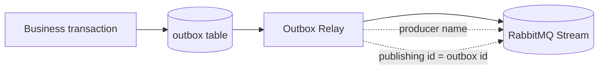

Outbox table:

```sql
CREATE TABLE outbox_event (
    id BIGINT PRIMARY KEY,
    aggregate_type VARCHAR(64) NOT NULL,
    aggregate_id VARCHAR(128) NOT NULL,
    event_type VARCHAR(128) NOT NULL,
    payload JSON NOT NULL,
    created_at TIMESTAMP NOT NULL,
    published_at TIMESTAMP NULL
);
```

Relay pseudo-code:

```java
long lastPublishingId = producer.getLastPublishingId();

List<OutboxEvent> batch = outboxRepository.findAfterId(lastPublishingId, 500);

for (OutboxEvent event : batch) {
    Message message = producer.messageBuilder()
        .publishingId(event.id())
        .properties()
            .messageId("outbox-" + event.id())
            .subject(event.eventType())
        .messageBuilder()
        .applicationProperties()
            .entry("aggregateType", event.aggregateType())
            .entry("aggregateId", event.aggregateId())
            .entry("eventType", event.eventType())
        .messageBuilder()
        .addData(event.payloadBytes())
        .build();

    producer.send(message, confirmation -> {
        if (confirmation.isConfirmed()) {
            outboxRepository.markPublished(event.id());
        } else {
            // retry according to policy
        }
    });
}
```

Important nuance:

- `published_at` adalah operational marker, bukan source of truth untuk dedup.
- `getLastPublishingId()` bisa digunakan saat restart untuk mengetahui posisi broker.
- Jika `published_at` belum terset karena crash, dedup masih bisa melindungi republish.
- Query outbox harus ordered by `id ASC`.

---

## 12. Offset Tracking + Filtering + Dedup: Gabungan yang Sering Membingungkan

Ada tiga cursor berbeda:

| Cursor | Pemilik | Arti |
|---|---|---|
| publishing ID | producer | posisi publish dari producer ke stream |
| stream offset | broker/stream | posisi message dalam stream |
| consumer offset tracking | consumer | posisi consume yang sudah aman |

Jangan campur.

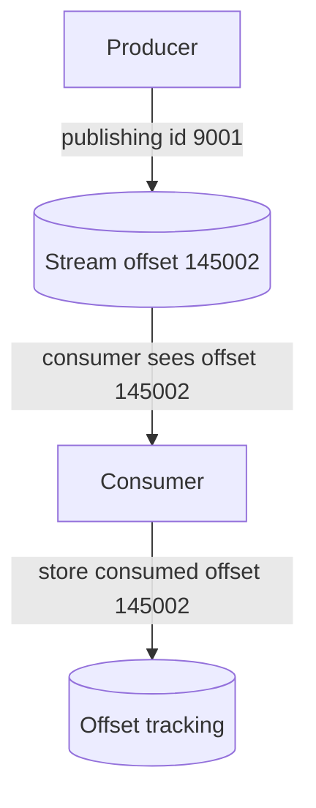

Koreksi mental model:

```text
publishingId != streamOffset != processedCount
```

Contoh incident:

> Engineer memakai `publishingId` sebagai checkpoint consumer. Saat stream menerima event dari producer lain, offset consumer lompat tidak sesuai. Consumer replay salah posisi dan menghasilkan duplicate side effect.

Solusi:

- producer checkpoint memakai publishing ID;
- consumer checkpoint memakai stream offset;
- business idempotency memakai event ID atau aggregate version;
- jangan gunakan satu angka untuk semua state.

---

## 13. Performance Testing: Apa yang Sebenarnya Diukur?

Benchmark messaging sering misleading karena orang hanya mengukur “messages/sec”. Angka itu tidak berguna tanpa konteks.

Pertanyaan pertama:

```text
Apakah kita mengukur broker capacity, producer capacity, consumer capacity, network capacity, disk behavior, atau end-to-end business throughput?
```

Masing-masing punya desain test berbeda.

| Target Test | Yang Diukur | Yang Harus Dikontrol |
|---|---|---|
| producer throughput | publish rate + confirm latency | payload size, batching, confirms, compression |
| broker ingest | disk write, replication, page cache | retention, replicas, stream count, fsync behavior |
| consumer throughput | read rate + handler cost | offset, filter, post-filter, ack/store offset |
| end-to-end latency | publish to processed side effect | clocks, tracing, consumer load |
| recovery | restart, reconnect, replay speed | offset tracking, dedup, batch size |
| filtered consumption | selected vs scanned rate | filter cardinality, false positive, chunk size |
| superstream scale | partition throughput | partition key distribution, single active consumer |

Rule:

```text
A benchmark without a workload model is a random number generator.
```

---

## 14. PerfTest vs Stream PerfTest

RabbitMQ Performance Testing Tool atau PerfTest memakai AMQP 0-9-1 untuk menguji RabbitMQ queues/exchanges. Untuk RabbitMQ Streams dengan stream protocol, gunakan **Stream PerfTest**.

Jangan mencampur hasil:

```text
AMQP queue PerfTest result != Stream protocol performance result
```

Alasannya:

- protocol berbeda;
- storage path berbeda;
- consume semantics berbeda;
- batching model berbeda;
- offset model berbeda;
- confirmation semantics berbeda;
- retention behavior berbeda.

Benchmark queue classic/quorum memakai PerfTest. Benchmark RabbitMQ Streams memakai Stream PerfTest atau aplikasi test custom dengan Stream Java Client.

---

## 15. Benchmark Dimensions untuk RabbitMQ Streams

### 15.1 Payload Size

Selalu uji beberapa ukuran payload:

```text
100 B
1 KB
10 KB
100 KB
1 MB jika use case benar-benar butuh
```

Message kecil menguji overhead per message. Message besar menguji bandwidth, memory pressure, dan disk throughput.

### 15.2 Publish Confirmation

Tanpa confirmation, angka publish bisa tampak tinggi tetapi tidak merepresentasikan durable acceptance.

Test matrix:

| Mode | Arti |
|---|---|
| fire-and-forget style | maksimal throughput client, reliability rendah |
| async confirm | realistic high-throughput reliable publish |
| sync wait per message | worst-case latency, biasanya bukan production pattern |
| batched wait confirm | useful untuk relay/batch publisher |

### 15.3 Replication Factor

Replication mengubah durability dan throughput. Test RF=1 tidak boleh dipakai untuk memutuskan kapasitas RF=3.

```text
RF=1: single replica, useful for baseline only.
RF=3: realistic for production availability.
RF=5: higher availability, more replication cost.
```

### 15.4 Retention Policy

Retention memengaruhi disk footprint dan cleanup behavior.

Test harus menjawab:

- berapa jam/hari data disimpan;
- apakah retention berdasarkan size, time, atau keduanya;
- apa yang terjadi saat disk mendekati penuh;
- apakah replay dari old offset masih dalam SLA;
- apakah page cache membantu atau test selalu cold.

### 15.5 Filtering Selectivity

Untuk stream filtering, ukur:

```text
selectivity = delivered messages / total stream messages
```

Contoh:

| Scenario | Total | Matching | Selectivity |
|---|---:|---:|---:|
| broad filter | 1,000,000 | 500,000 | 50% |
| medium filter | 1,000,000 | 100,000 | 10% |
| selective filter | 1,000,000 | 10,000 | 1% |
| ultra selective | 1,000,000 | 100 | 0.01% |

Jika filter selectivity 50%, manfaat filtering mungkin kecil. Jika 1%, manfaat bisa besar.

### 15.6 Cardinality

Uji jumlah unique filter values:

```text
10 regions
100 categories
10,000 tenants
1,000,000 customers
```

High cardinality bisa menaikkan false positive rate atau storage overhead tergantung konfigurasi filter. Jangan asumsi filter by customer ID akan murah tanpa test.

### 15.7 Consumer Handler Cost

Benchmark broker kosong tidak mewakili production jika handler melakukan:

- JSON decode;
- schema validation;
- DB lookup;
- remote API call;
- cryptographic verification;
- idempotency insert;
- projection update.

Pisahkan dua jenis test:

1. **Infrastructure capacity test**: handler minimal.
2. **Application throughput test**: handler production-like.

Keduanya berguna, tetapi menjawab pertanyaan berbeda.

---

## 16. Benchmark Topology Minimal

Untuk benchmark RabbitMQ Streams yang masuk akal:

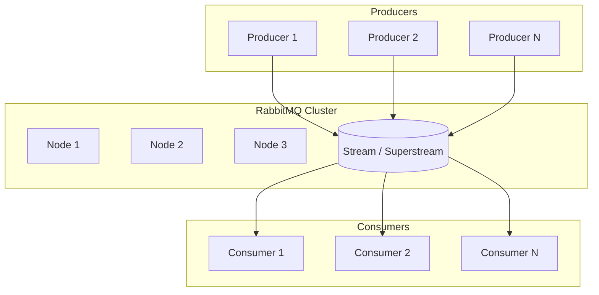

Catat semua variabel:

```yaml
rabbitmq:
  version: "4.3.x"
  nodes: 3
  stream_replicas: 3
  disk_type: "nvme"
  cpu: "..."
  memory: "..."
  network: "10Gbps"

workload:
  streams: 1
  superstream_partitions: 0
  producers: 4
  consumers: 4
  payload_size_bytes: 1024
  compression: "none|gzip|..."
  confirm_mode: "async"
  filter_enabled: true
  filter_selectivity: "10%"
  duration_minutes: 30
  warmup_minutes: 5

metrics:
  publish_rate: true
  confirm_latency_p50_p95_p99: true
  consume_rate: true
  end_to_end_latency_p50_p95_p99: true
  disk_write_mb_s: true
  disk_read_mb_s: true
  network_in_out_mb_s: true
  broker_cpu: true
  broker_memory: true
  consumer_cpu: true
```

Benchmark tanpa konfigurasi seperti ini sulit direproduksi.

---

## 17. Latency: Jangan Hanya Rata-Rata

Average latency menipu. Messaging incident biasanya terjadi di tail.

Minimal ukur:

- p50;
- p90;
- p95;
- p99;
- p99.9 jika SLA ketat;
- max dengan hati-hati karena outlier bisa noisy;
- latency distribution over time.

Pisahkan latency:

```text
producer send -> broker confirm
broker append -> consumer receive
consumer receive -> side effect committed
producer send -> side effect committed
```

Diagram:

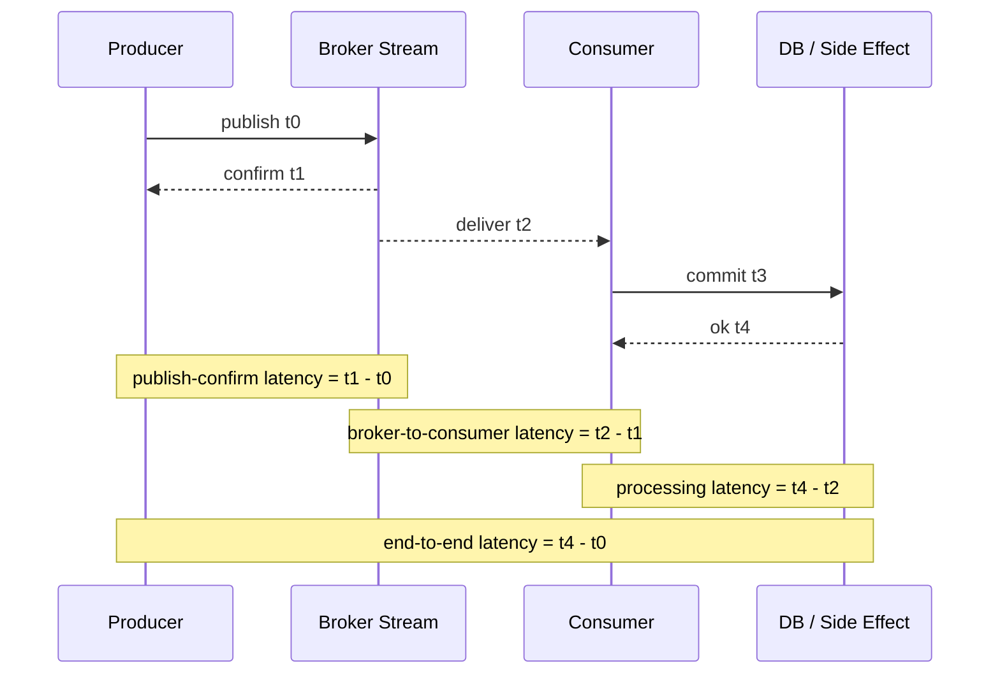

---

## 18. Throughput: Messages/sec Bukan Satu-Satunya Unit

Gunakan minimal dua unit:

```text
messages/sec
MB/sec
```

100,000 msg/sec dengan 100-byte payload sangat berbeda dari 100,000 msg/sec dengan 10KB payload.

Tambahkan:

```text
business events/sec
cases projected/sec
notifications committed/sec
```

Untuk regulatory platform, business throughput lebih berguna daripada raw message throughput.

---

## 19. Cold Cache vs Warm Cache

RabbitMQ Streams dan Kafka sama-sama sangat dipengaruhi storage/cache behavior.

Test warm cache:

- consumer membaca data yang baru saja ditulis;
- OS page cache membantu;
- hasil sering sangat tinggi.

Test cold/older data:

- consumer replay dari data lama;
- disk read lebih nyata;
- hasil bisa jauh berbeda.

Keduanya valid, tetapi jangan dicampur.

```text
Real-time consumption benchmark != historical replay benchmark
```

---

## 20. Benchmark Filtering dengan False Positive Awareness

Untuk Bloom filter, ukur tiga angka:

```text
total stream messages
messages delivered to client
messages actually processed after post-filter
```

Lalu hitung:

```text
broker_filter_reduction = 1 - delivered_to_client / total_stream_messages
client_false_positive_ratio = 1 - processed_after_post_filter / delivered_to_client
```

Contoh:

```text
total stream messages = 1,000,000
delivered to client = 20,000
processed after post-filter = 10,000

broker_filter_reduction = 98%
client_false_positive_ratio = 50%
```

Interpretasi:

- broker berhasil mengurangi traffic besar;
- tetapi post-filter masih membuang setengah delivered messages;
- mungkin chunk-level filtering terlalu coarse, filter cardinality tinggi, atau ingestion pattern mencampur banyak value dalam chunk.

---

## 21. Ingestion Pattern Mempengaruhi Filtering

Karena Bloom filter bekerja di chunk level, urutan publish memengaruhi efektivitas filter.

Scenario A — mixed values per chunk:

```text
APAC, EMEA, AMER, APAC, EMEA, AMER, ...
```

Banyak chunk mengandung semua region. Filter `APAC` tetap membuat broker membaca banyak chunk.

Scenario B — grouped values per chunk:

```text
APAC, APAC, APAC, APAC, ...
EMEA, EMEA, EMEA, EMEA, ...
```

Filter lebih efektif karena chunk lebih homogen.

Tapi jangan mengorbankan ordering/business semantics hanya demi filter. Jika ordering by case ID lebih penting, pertahankan key tersebut.

Trade-off:

| Publish Ordering | Filtering Efficiency | Ordering Correctness |
|---|---:|---:|
| grouped by filter value | tinggi | bisa buruk untuk aggregate ordering |
| grouped by aggregate key | sedang | baik untuk aggregate |
| random/mixed | rendah | tergantung source |

---

## 22. Production Metrics untuk Stream Filtering

Tambahkan metrics aplikasi:

```text
consumer.received.total
consumer.post_filter.discarded.total
consumer.processed.total
consumer.offset.stored.total
consumer.offset.store.failures.total
consumer.filter.value
consumer.filter.match_unfiltered.enabled
consumer.lag.by_stream
consumer.processing.latency
```

Untuk producer:

```text
producer.filter_value.missing.total
producer.filter_value.invalid.total
producer.filter_value.cardinality.estimate
producer.dedup.enabled
producer.publishing_id.last
producer.confirm.latency
producer.confirm.failure.total
```

Untuk broker/ops:

```text
stream.disk.used
stream.replica.status
stream.leader.node
stream.retention.deleted.bytes
stream.read.bytes
stream.write.bytes
stream.connection.count
stream.consumer.count
```

---

## 23. Anti-Pattern Filtering

### 23.1 Menganggap Filter Sebagai Security Boundary

Salah:

```text
Tenant A tidak akan menerima Tenant B karena consumer pakai filter tenant=A.
```

Filter bukan security boundary. Untuk tenant isolation serius, gunakan permission, vhost, topology separation, atau stream terpisah sesuai kebutuhan.

### 23.2 Filter Value Berisi PII

Salah:

```text
x-stream-filter-value = nik:3175...
x-stream-filter-value = email:person@example.com
```

Filter metadata bisa muncul di logs, metrics, traces, atau debugging output. Gunakan kategori non-PII.

### 23.3 Filter Value Tidak Stabil

Salah:

```text
filter = currentStatus
```

Jika status berubah, event lama tetap punya filter lama. Ini bisa benar jika memang event fact, tetapi buruk jika consumer berpikir filter merepresentasikan current state.

### 23.4 Tidak Ada Post-Filter

Salah:

```java
// assumes every delivered message matches filter exactly
process(message);
```

Untuk Bloom filtering, false positive dan chunk-level behavior berarti post-filter tetap perlu.

### 23.5 Alert Offset Gap Sebagai Data Loss

Filtered consumer normal melihat gap. Alert harus berbasis lag, processing failure, missing expected business event, atau offset tracking error, bukan sequence contiguous.

---

## 24. Anti-Pattern Deduplication

### 24.1 Publishing ID Pakai UUID

UUID unique tetapi tidak monotonic. Dedup membutuhkan strictly increasing sequence.

### 24.2 Producer Name Per Pod

Pod restart mengganti producer identity. Dedup history hilang.

### 24.3 Dua Producer Aktif dengan Name Sama

Interleaving publishing ID bisa menyebabkan legitimate message difilter.

### 24.4 Menganggap Confirm Duplicate Sebagai Stored New Message

Dedup bisa mengirim confirmation untuk duplicate yang difilter. Confirmation berarti broker sudah memperhitungkan message itu, bukan selalu append baru.

### 24.5 Tidak Query Last Publishing ID Saat Restart

Jika publisher tidak tahu posisi terakhir broker, ia bisa republish terlalu banyak atau publish dari posisi salah.

### 24.6 Menghapus Idempotency Karena Ada Dedup

Dedup producer-side tidak melindungi consumer side effect dari replay, offset rollback, atau business duplicates.

---

## 25. Testing Dedup Correctness

Buat test eksplisit.

### 25.1 Crash After Confirm Sent, Before Callback Observed

Simulasi:

1. Publish ID 1–100.
2. Broker menerima 100.
3. Publisher process crash sebelum callback 100 diproses.
4. Restart publisher.
5. Query last publishing ID.
6. Republish 100.
7. Publish 101.

Expected:

```text
Stream contains 1..101 exactly once.
Publisher receives confirm for republish 100.
No business duplicate in consumer side effect.
```

### 25.2 Out-of-Order Publishing ID

Simulasi:

```text
publish 1, 2, 10, 3
```

Expected:

```text
3 is filtered or rejected according to semantics/client behavior.
Test proves this pattern is invalid.
```

Tujuan test ini bukan membuat pattern berhasil. Tujuannya mencegah engineer menggunakannya.

### 25.3 Concurrent Producer Same Name

Simulasi dua publisher dengan name sama. Expected: test harus gagal sebagai desain. Dokumentasikan bahwa concurrency model invalid.

---

## 26. Testing Filtering Correctness

### 26.1 False Positive Safe

Buat stream:

```text
region=APAC
region=EMEA
region=AMER
```

Consumer filter `APAC`, tetapi test handler dipaksa menerima beberapa non-APAC message. Expected:

```text
post-filter discards non-APAC safely.
offset tracking still progresses correctly.
no side effect for non-APAC.
```

### 26.2 Missing Filter Value

Publish beberapa message tanpa filter value. Tentukan behavior:

- apakah consumer dengan filter menerima unfiltered message?
- apakah unfiltered message ditolak contract?
- apakah metric `producer.filter_value.missing.total` naik?

Jangan biarkan default behavior tidak diketahui.

### 26.3 Schema Evolution

Jika filter value berdasarkan field `caseType`, lalu schema baru mengganti `caseType` menjadi `caseCategory`, test harus memastikan:

- publisher masih mengisi filter value lama selama compatibility window;
- consumer lama masih bekerja;
- consumer baru bisa membaca field baru;
- metrics mendeteksi missing/invalid filter values.

---

## 27. Performance Runbook

Saat benchmark hasilnya buruk, gunakan urutan diagnosis ini.

### 27.1 Producer Confirm Latency Tinggi

Cek:

- broker CPU;
- stream leader node;
- disk write latency;
- replication health;
- network RTT;
- producer batch size;
- outstanding in-flight publish;
- confirm callback thread bottleneck;
- payload serialization cost.

### 27.2 Consumer Throughput Rendah

Cek:

- handler CPU;
- decode/validation cost;
- DB/API downstream latency;
- offset store frequency;
- post-filter discard ratio;
- consumer connection locality;
- stream leader placement;
- network bandwidth;
- GC pauses.

### 27.3 Filter Tidak Mengurangi Traffic

Cek:

- filter value benar-benar dipublish;
- consumer attach dengan filter yang benar;
- cardinality terlalu tinggi;
- chunk terlalu mixed;
- filter value terlalu broad;
- match-unfiltered behavior;
- post-filter metrics.

### 27.4 Duplicate Publish Masih Terjadi

Cek:

- producer name stabil;
- publishing ID strictly increasing;
- producer name tidak dipakai concurrent;
- broker last publishing ID di-query saat restart;
- source query ordered;
- dedup enabled di client;
- duplicate berasal dari producer lain atau replay tool.

---

## 28. Decision Checklist

Sebelum memakai stream filtering, jawab:

```text
[ ] Apa filter dimension utama?
[ ] Apakah filter value non-PII?
[ ] Apakah cardinality masuk akal?
[ ] Apakah consumer tetap post-filter?
[ ] Apakah offset gap dianggap normal?
[ ] Apakah missing filter value dimonitor?
[ ] Apakah filtering tidak dipakai sebagai security boundary?
[ ] Apakah schema evolution filter value sudah direncanakan?
```

Sebelum memakai deduplication:

```text
[ ] Producer name stabil lintas restart?
[ ] Producer name unik per stream?
[ ] Tidak ada concurrent producer dengan name sama?
[ ] Publishing ID strictly increasing?
[ ] Publishing ID bersumber dari ordered durable cursor?
[ ] Publisher query last publishing ID saat restart?
[ ] Consumer tetap idempotent?
[ ] Crash/retry tests sudah dibuat?
```

Sebelum percaya benchmark:

```text
[ ] Payload realistic?
[ ] Producer confirms enabled sesuai production?
[ ] Replication factor sesuai production?
[ ] Retention sesuai production?
[ ] Test cukup lama setelah warmup?
[ ] p95/p99 latency dicatat?
[ ] Disk/network/CPU metrics dicatat?
[ ] Consumer handler realistic atau sengaja synthetic?
[ ] Cold replay dan hot consume dipisah?
[ ] Stream PerfTest digunakan untuk stream protocol?
```

---

## 29. Mini Case Study: Enforcement Regional Worker

### Context

Satu stream `case-events` menyimpan semua case lifecycle event. Regional enforcement worker APAC hanya perlu event:

```text
region = APAC
caseType = ENFORCEMENT
```

### Desain Awal Buruk

```text
Consumer membaca semua event.
Consumer parse payload JSON.
Consumer discard 97% event.
Lag tinggi.
CPU consumer habis untuk discard.
```

### Desain Lebih Baik

Publisher menambahkan application properties:

```text
region=APAC
caseType=ENFORCEMENT
deadlineImpacting=true
```

Filter value dipilih:

```text
region:apac
```

Consumer:

1. Attach dengan stream filter `region:apac`.
2. Post-filter `caseType == ENFORCEMENT`.
3. Process event idempotently berdasarkan `eventId`.
4. Store offset setelah side effect aman.

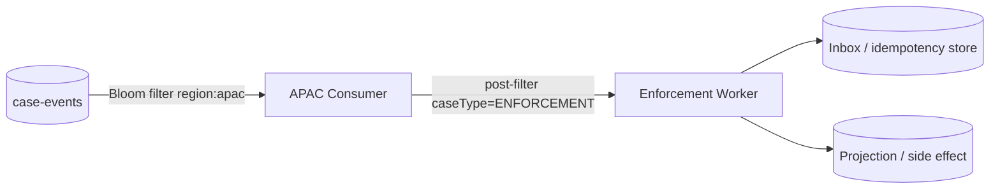

### Kenapa Tidak Filter Composite?

Bisa saja pakai:

```text
region:apac:case-type:enforcement
```

Tetapi jika banyak consumer APAC lain juga ada, `region:apac` lebih reusable. Jika traffic APAC masih terlalu besar, baru pertimbangkan composite value atau stream split.

---

## 30. Latihan 20 Menit

Ambil satu stream dari desainmu sendiri. Buat tabel:

| Consumer | Butuh Semua Event? | Filter Candidate | Cardinality | PII Risk | Post-Filter? | Offset Strategy |
|---|---:|---|---:|---:|---:|---|
| audit projector | yes | none | - | low | no | store every batch |
| SLA detector | no | deadline-impacting:true | 2 | low | yes | store stream offset |
| APAC worker | no | region:apac | 5 | low | yes | store stream offset |
| tenant worker | no | tenant id | high | high | yes | likely separate topology |

Lalu tulis:

```text
Which consumers justify stream filtering?
Which consumers justify separate streams?
Which consumers should just read all events?
```

---

## 31. Ringkasan

RabbitMQ Stream filtering dan deduplication adalah fitur kuat, tetapi hanya aman jika dipahami sebagai bagian dari contract.

Ingat invariants berikut:

```text
Filtering reduces delivery cost; it does not prove authorization or business correctness.
Bloom filter can have false positives; post-filter remains mandatory for correctness.
Filtered consumers can see offset gaps; gaps are not automatically data loss.
Dedup requires stable producer name and strictly increasing publishing ID.
Producer dedup does not replace consumer idempotency.
Benchmark numbers are useless without workload, payload, confirms, replication, retention, and latency distribution.
```

Jika kamu menguasai bagian ini, kamu tidak hanya bisa “menggunakan RabbitMQ Streams”, tetapi juga bisa mengevaluasi apakah desain stream akan tetap stabil saat traffic naik, consumer bertambah, replay terjadi, dan publisher crash di waktu yang paling buruk.

---

## Referensi

- RabbitMQ Streams and Superstreams documentation — stream behavior, offset tracking, deduplication, resource usage, and replication notes.
- RabbitMQ Stream Filtering documentation — Bloom filter, AMQP filter expressions, client-side post-filter, stream layout, and filtering examples.
- RabbitMQ Stream Java Client documentation.
- RabbitMQ Performance Testing Tool repository and Stream PerfTest guidance.
