------
title: Learn Java Messaging and Event Streaming - Part 016
description: Apache Kafka core architecture: broker, topic, partition, record batch, offset, log segment, retention, replica, ISR, leader/follower, controller, producer path, and consumer path.
series: learn-java-messaging-event-streaming
seriesTitle: Learn Java Messaging and Event Streaming
order: 16
partTitle: Kafka Core Architecture
tags:
- java
- kafka
- apache-kafka
- broker
- topic
- partition
- offset
- replication
- distributed-log
- event-streaming
date: 2026-06-28
---

# Part 016 — Kafka Core Architecture: Broker, Topic, Partition, Segment, Offset, Replica

## Tujuan Bagian Ini

Bagian ini membuka blok Kafka. Kita tidak mulai dari Producer API atau Consumer API dulu. Kita mulai dari arsitektur inti, karena hampir semua tuning Kafka adalah konsekuensi dari model ini:

```text
Kafka is a distributed, replicated, partitioned, append-only log.
```

Setelah bagian ini, kamu harus bisa:

1. Menjelaskan Kafka sebagai distributed log, bukan sekadar message broker.
2. Memahami topic, partition, offset, segment, replica, leader, follower, ISR, controller, dan consumer group.
3. Menjelaskan path producer dari record sampai durable/committed message.
4. Menjelaskan path consumer dari fetch request sampai offset commit.
5. Membaca failure mode Kafka dari struktur log dan replication-nya.
6. Mendesain partition count, key, retention, dan replication factor sebagai keputusan arsitektur.
7. Menghindari anti-pattern: topic-per-entity, partition explosion, global ordering illusion, dan retention tanpa disk budget.

---

## 1. Mental Model Utama

Kafka bukan queue tradisional yang menghapus message saat consumer selesai. Kafka menyimpan record di log partition, lalu consumer menyimpan posisi baca dalam bentuk offset.

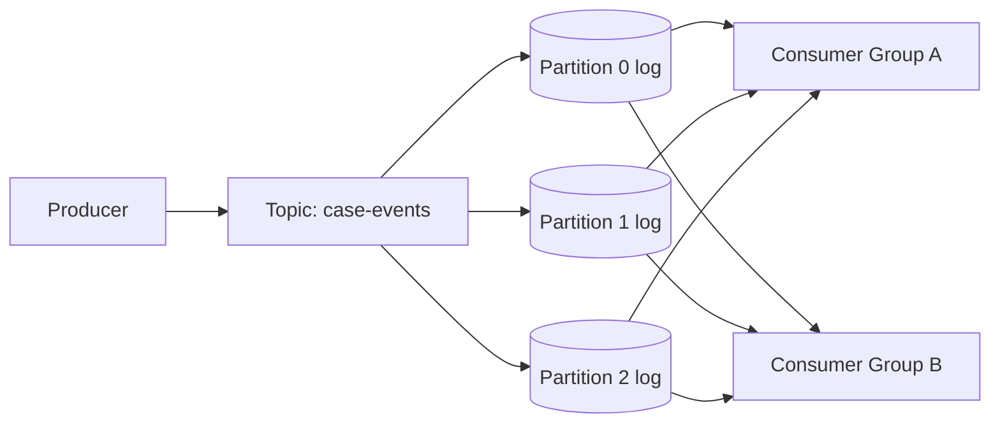

Invariants:

```text
A topic is split into partitions.
A partition is an ordered append-only log.
An offset is a position inside one partition.
Ordering is guaranteed within a partition, not across partitions.
Consumers track their own progress.
Kafka retention is independent of whether a consumer has read the record.
```

Kalau kamu mengingat hanya satu hal:

```text
Kafka scales by partitioning the log.
```

Bukan dengan membuat satu queue lebih cepat, tetapi dengan membagi satu topic menjadi banyak ordered sub-logs.

---

## 2. Vocabulary Dasar

| Istilah | Arti | Design Consequence |
|---|---|---|
| Broker | server Kafka yang menyimpan partition dan melayani client | kapasitas cluster berasal dari gabungan broker |
| Topic | logical stream/category record | unit contract dan retention |
| Partition | ordered log shard dari topic | unit parallelism, ordering, dan replication |
| Record | key/value/header/timestamp yang dipublish | unit data aplikasi |
| Offset | posisi record di partition | consumer progress dan replay position |
| Segment | file log fisik untuk bagian partition | retention dan cleanup bekerja per segment |
| Leader | replica partition yang menerima write | producer menulis ke leader |
| Follower | replica yang menyalin leader | durability/failover |
| ISR | in-sync replicas | basis committed record dan durability |
| Controller | node/role yang mengelola metadata, broker liveness, partition leadership | control plane cluster |
| Consumer Group | kumpulan consumer yang membagi partition assignment | scale-out consumption |
| Group Coordinator | broker yang mengelola group membership dan offset commit | rebalance dan offset tracking |

---

## 3. Topic Bukan Queue

Queue klasik:

```text
message delivered -> acknowledged -> removed or hidden from others
```

Kafka topic:

```text
record appended -> retained by time/size/compaction -> many consumer groups read independently
```

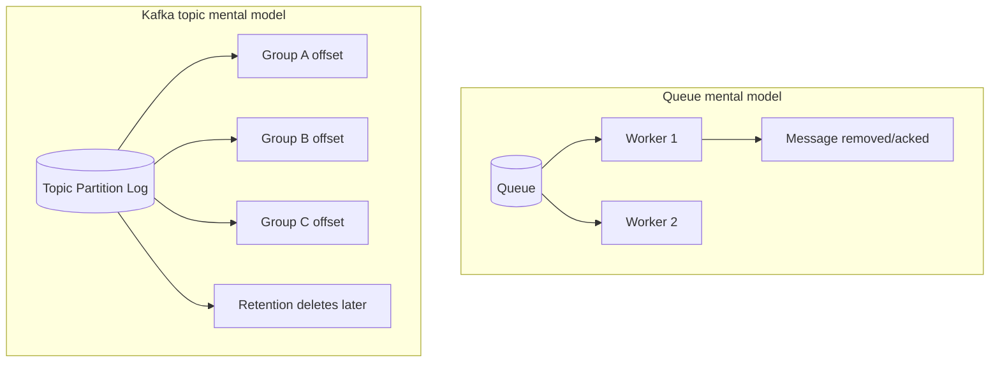

Konsekuensi:

- consumer group A dan B bisa membaca data yang sama tanpa saling mengganggu;
- replay adalah fitur natural;
- message yang sudah dibaca tidak otomatis hilang;
- disk planning wajib;
- retention menjadi bagian dari contract.

Anti-pattern:

```text
Treating Kafka topic like a task queue where message lifetime follows worker ack.
```

Kafka bisa dipakai untuk work distribution, tetapi mental modelnya tetap log + offset, bukan deletion-on-consume queue.

---

## 4. Partition: Unit Ordering, Parallelism, dan Storage

Partition adalah unit paling penting di Kafka.

```text
Topic case-events
  partition 0: offset 0, 1, 2, 3, ...
  partition 1: offset 0, 1, 2, 3, ...
  partition 2: offset 0, 1, 2, 3, ...
```

Setiap partition punya offset sequence sendiri.

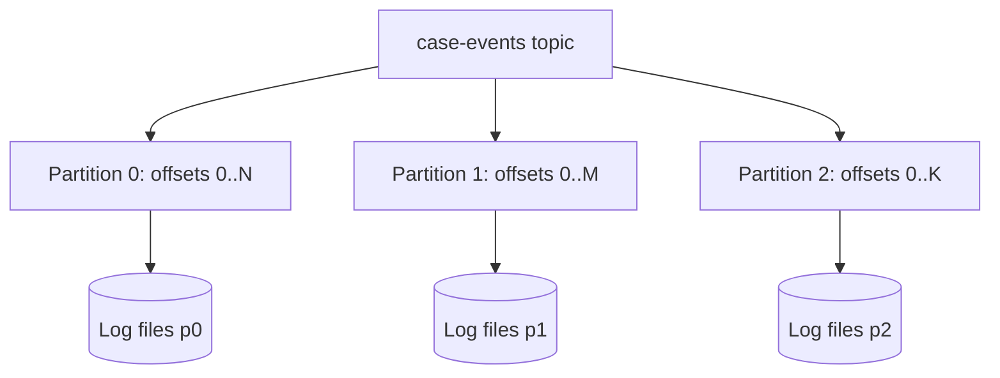

### 4.1 Ordering Hanya per Partition

Jika record dengan key sama selalu masuk partition yang sama, order record untuk key itu bisa dipertahankan.

Contoh:

```text
key = caseId
```

Maka event untuk `CASE-123` akan masuk partition yang sama, sehingga urutan lifecycle case bisa dijaga.

```text
CASE-123 OPENED
CASE-123 ASSIGNED
CASE-123 ESCALATED
CASE-123 CLOSED
```

Tapi order antar case berbeda tidak dijamin secara global.

```text
CASE-123 offset 10 in partition 0
CASE-999 offset 8 in partition 1
```

Tidak ada meaningful global order antar partition hanya dari offset.

### 4.2 Partition Count Adalah Keputusan Arsitektur

Partition count menentukan:

- parallelism producer write;
- parallelism consumer group;
- jumlah file/log handle;
- replication workload;
- rebalance cost;
- controller metadata size;
- recovery time;
- maximum number of active consumers in one group for that topic.

Rule:

```text
More partitions increase parallelism and operational overhead.
Fewer partitions simplify operations but cap throughput and consumer scaling.
```

Jangan membuat 1,000 partition karena “biar scalable”. Jangan membuat 1 partition karena “ordering gampang” jika throughput dan replay SLA tidak akan cukup.

---

## 5. Offset: Posisi, Bukan ID Bisnis

Offset adalah posisi record dalam satu partition. Offset bukan event ID, bukan transaction ID, bukan business sequence global.

```text
(topic=case-events, partition=2, offset=99182)
```

Ini cukup untuk menemukan record secara teknis, tetapi tidak cukup sebagai identity bisnis.

Gunakan event envelope:

```json
{
  "eventId": "evt-2026-000042",
  "caseId": "CASE-123",
  "eventType": "CASE_ESCALATED",
  "eventVersion": 7,
  "occurredAt": "2026-06-28T04:15:00Z"
}
```

Lalu Kafka coordinate:

```text
topic=case-events
partition=4
offset=120998
```

Keduanya punya fungsi berbeda:

| Value | Dipakai Untuk |
|---|---|
| eventId | idempotency, audit, trace |
| caseId | partition key, aggregate affinity |
| eventVersion | aggregate ordering/business concurrency |
| topic/partition/offset | replay, debugging, consumer checkpoint |

Anti-pattern:

```text
Menggunakan offset sebagai business event id.
```

Offset bisa berubah jika event di-republish ke topic lain, cluster lain, atau hasil compacted/reprocessed pipeline.

---

## 6. Record Anatomy

Record Kafka biasanya punya:

```text
key
value
headers
timestamp
topic
partition
offset
```

### 6.1 Key

Key menentukan partition jika partitioner menggunakan hash key.

Contoh:

```java
ProducerRecord<String, byte[]> record = new ProducerRecord<>(
    "case-events",
    caseId,        // key
    payloadBytes   // value
);
```

Key sebaiknya dipilih berdasarkan ordering dan locality requirement.

Common key choices:

| Key | Cocok Untuk | Risiko |
|---|---|---|
| caseId | lifecycle per case | hot case jika satu case sangat aktif |
| customerId | customer-level timeline | high-cardinality, possible hot customer |
| region | regional ordering | hot region, low parallelism |
| random/null | max distribution | no per-entity ordering |
| composite key | custom locality | migration dan compatibility lebih sulit |

### 6.2 Value

Value adalah payload. Gunakan schema discipline. Ini akan dibahas khusus di Part 022.

### 6.3 Headers

Headers berguna untuk metadata ringan:

```text
correlation-id
causation-id
traceparent
schema-id
event-type
producer-service
```

Jangan taruh payload besar di headers. Jangan taruh PII di headers kecuali governance mengizinkan.

### 6.4 Timestamp

Timestamp dapat merepresentasikan create time atau log append time tergantung konfigurasi. Jangan asal pakai timestamp Kafka sebagai business occurred time tanpa contract.

---

## 7. Log Segment: Bentuk Fisik dari Partition

Partition log tidak disimpan sebagai satu file tak terbatas. Ia dipecah menjadi segment files.

```text
case-events-0/
  00000000000000000000.log
  00000000000000000000.index
  00000000000000000000.timeindex
  00000000000000100000.log
  00000000000000100000.index
  00000000000000100000.timeindex
```

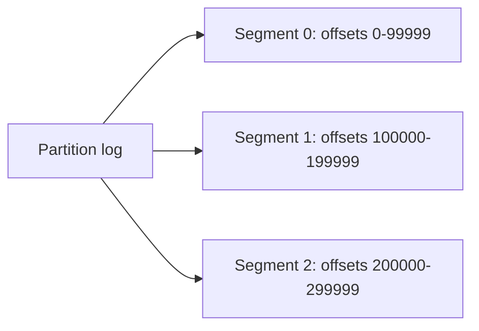

Segment penting karena:

- retention delete bekerja per segment;
- compaction bekerja terhadap log data;
- file rolling memengaruhi cleanup timing;
- index membantu lookup offset;
- disk footprint dihitung dari semua segment replica.

### 7.1 Retention Tidak Presisi Per Record

Jika retention time 7 hari, bukan berarti setiap record dihapus tepat pada umur 7 hari. Karena cleanup bekerja per segment, record bisa bertahan lebih lama tergantung segment boundary dan cleanup schedule.

Rule:

```text
Retention is a storage policy, not a precise per-record deletion timer.
```

Untuk compliance deletion/PII, jangan mengandalkan topic retention saja tanpa governance desain yang benar.

---

## 8. Broker dan Cluster

Broker menyimpan partition replicas dan melayani request producer/consumer/admin.

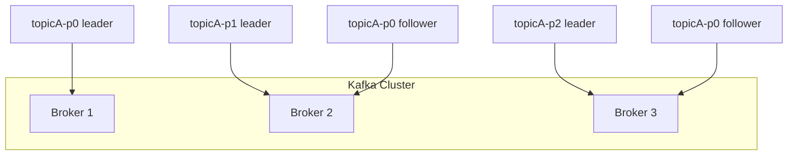

Cluster capacity bukan hanya jumlah broker. Capacity dipengaruhi:

- leader distribution;
- replica distribution;
- disk throughput;
- network throughput;
- CPU untuk compression/TLS/requests;
- page cache;
- partition count;
- request batching;
- consumer lag/replay pattern.

Broker yang punya terlalu banyak partition leader bisa menjadi hotspot.

---

## 9. Controller dan Metadata

Kafka butuh control plane yang tahu:

- broker mana yang hidup;
- topic dan partition apa yang ada;
- replica assignment;
- partition leader;
- ISR;
- cluster metadata changes.

Di Kafka modern, metadata dikelola dengan KRaft mode, bukan bergantung pada ZooKeeper untuk cluster baru. Untuk engineer aplikasi, detail internal controller tidak selalu muncul di code, tetapi sangat penting saat incident.

Gejala control-plane problem:

- metadata request lambat;
- leader election sering;
- topic creation/deletion lambat;
- partition reassignment stuck;
- broker flapping;
- consumer rebalance ikut terganggu.

Mental model:

```text
Data plane moves records.
Control plane decides where partitions live and who leads them.
```

---

## 10. Replication: Leader, Follower, ISR

Setiap partition punya replicas. Satu replica menjadi leader. Producer menulis ke leader. Follower menyalin log dari leader.

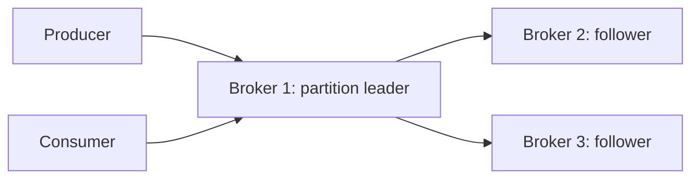

Untuk replication factor 3:

```text
1 leader + 2 followers = 3 replicas
```

### 10.1 ISR

ISR berarti **in-sync replicas**: replica yang dianggap cukup up-to-date terhadap leader.

Committed record berkaitan dengan ISR dan producer acknowledgment.

Important invariant:

```text
Kafka durability is about replicated log state, not simply “broker accepted write”.
```

Jika producer memakai durability setting lemah, producer bisa mendapat latency rendah tetapi risiko loss lebih besar saat leader failure.

### 10.2 acks dan min.insync.replicas

Producer setting `acks` menentukan kapan producer menganggap write sukses:

| acks | Makna Sederhana | Risiko |
|---|---|---|
| 0 | producer tidak menunggu broker ack | loss tidak terdeteksi |
| 1 | leader ack setelah menerima write | loss mungkin jika leader gagal sebelum replica catch up |
| all / -1 | tunggu ISR sesuai aturan | latency lebih tinggi, durability lebih kuat |

Topic/broker setting `min.insync.replicas` menentukan minimal ISR yang diperlukan untuk menerima write dengan `acks=all`.

Common production baseline untuk critical event:

```text
replication.factor = 3
min.insync.replicas = 2
producer acks = all
producer enable.idempotence = true
```

Detail producer reliability akan dibahas di Part 017 dan Part 020.

---

## 11. Producer Write Path

Producer write path simplified:

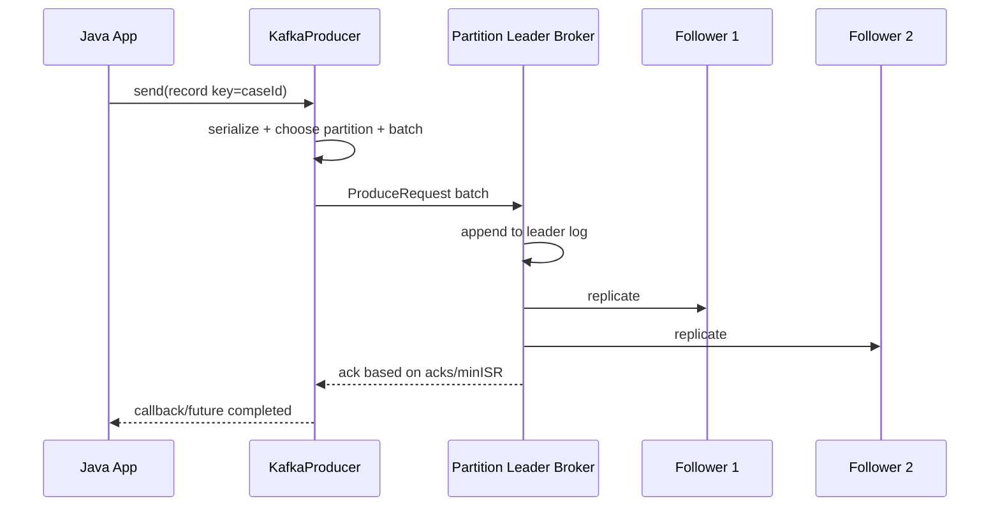

Important details:

- producer tidak mengirim ke “topic” secara abstrak; producer mengirim ke leader broker untuk partition tertentu;
- metadata digunakan untuk mengetahui leader partition;
- key menentukan partition;
- producer melakukan batching;
- compression bisa terjadi pada batch;
- broker append ke log;
- replication menentukan committed visibility/durability.

### 11.1 Metadata Matters

Producer perlu metadata cluster:

```text
topic -> partitions -> leader broker
```

Jika metadata stale:

- producer mendapat `NotLeaderOrFollower`/leader-related error;
- refresh metadata;
- retry;
- latency spike.

Ini normal saat leader election atau broker rolling restart.

---

## 12. Consumer Read Path

Consumer read path simplified:

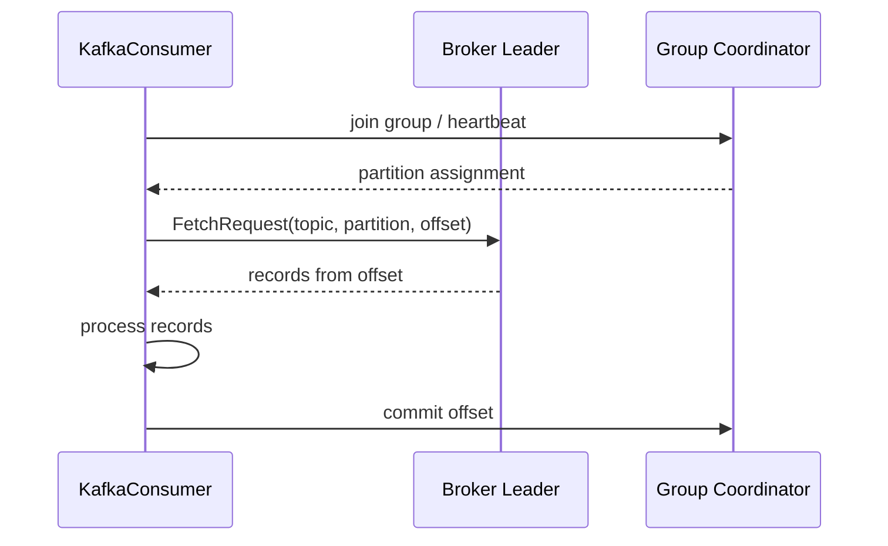

Important details:

- consumer pulls data;
- fetch request menyertakan offset;
- consumer bisa rewind/seek;
- group coordinator mengelola membership dan offset commit;
- offset commit biasanya menyimpan “next offset to read”, bukan last processed offset.

### 12.1 Pull Model

Kafka consumer pull model membuat consumer bisa:

- mengontrol rate;
- membaca batch besar;
- tertinggal dan catch up;
- replay dari offset lama;
- menghindari broker push yang membanjiri consumer lambat.

Tapi pull model juga berarti:

- poll loop harus sehat;
- processing tidak boleh blocking terlalu lama;
- commit strategy harus benar;
- lag harus dimonitor.

---

## 13. Consumer Group dan Partition Assignment

Dalam satu consumer group, satu partition hanya diproses oleh satu consumer aktif pada satu waktu.

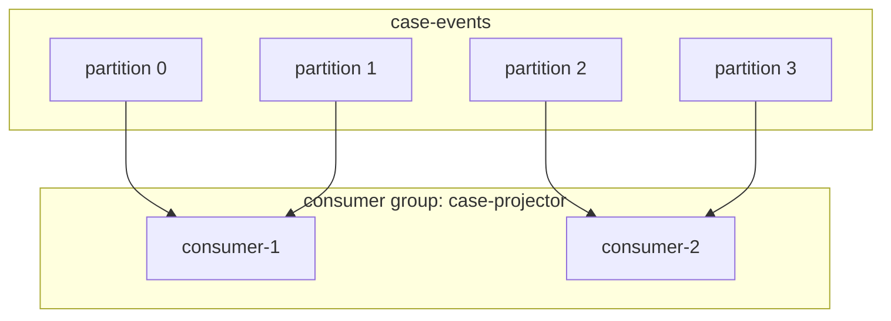

Jika ada 4 partitions dan 2 consumers, masing-masing bisa mendapat 2 partitions. Jika ada 4 partitions dan 6 consumers, 2 consumers idle.

```text
Max active consumers for a topic in one group <= partition count.
```

Consumer group memungkinkan scale-out tetapi tidak mengubah ordering per partition.

### 13.1 Banyak Consumer Group

Consumer group berbeda membaca secara independen.

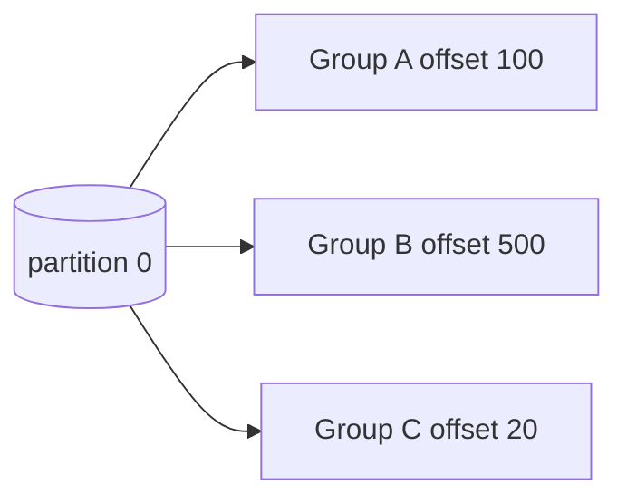

Ini menguntungkan untuk:

- audit projector;
- search indexer;
- notification service;
- analytics pipeline;
- compliance archive.

Tapi setiap group menambah read load dan operational surface.

---

## 14. Offset Commit: Checkpoint Consumer

Offset commit adalah checkpoint consumer group. Kafka menyimpan offset commit di internal compacted topic `__consumer_offsets` melalui group coordinator.

Important:

```text
Offset commit says: this group can resume from here.
It does not prove business side effect is correct.
```

Commit terlalu awal:

```text
consume -> commit -> process -> crash during process
```

Risiko: data dianggap selesai padahal side effect belum terjadi.

Commit terlalu akhir:

```text
consume -> process -> crash before commit
```

Risiko: message diproses ulang. Ini aman jika idempotent.

Untuk at-least-once processing, pattern umum:

```text
poll -> process idempotently -> commit offset after success
```

---

## 15. Retention dan Replay

Kafka menyimpan data berdasarkan retention policy, bukan berdasarkan consumer acknowledgement.

Retention modes:

| Mode | Makna |
|---|---|
| time-based | hapus segment yang lebih tua dari waktu tertentu |
| size-based | hapus saat size melebihi limit |
| compaction | simpan latest value per key secara eventual |
| delete + compact | kombinasi behavior |

Replay hanya mungkin selama data masih ada.

```text
Replay SLA <= retention window
```

Jika regulatory audit butuh replay 1 tahun, tetapi retention 7 hari, Kafka topic bukan audit archive penuh. Kamu butuh archive/storage lain atau retention yang sesuai budget.

### 15.1 Retention Cost Formula

Estimasi kasar:

```text
daily_ingress_bytes = avg_record_size * records_per_day
retained_bytes = daily_ingress_bytes * retention_days
cluster_storage_bytes = retained_bytes * replication_factor * overhead_factor
```

Contoh:

```text
avg record = 2 KB
records/day = 100 million
ingress/day = 200 GB
retention = 14 days
replication factor = 3
overhead factor = 1.2

storage ≈ 200 GB * 14 * 3 * 1.2 = 10.08 TB
```

Jangan set retention berdasarkan keinginan replay tanpa menghitung disk.

---

## 16. Log Compaction: Latest Value per Key, Bukan Full History

Log compaction mempertahankan setidaknya latest value per key secara eventual. Ini cocok untuk changelog/state topics, bukan audit timeline yang butuh semua event.

Contoh compacted topic:

```text
key=CASE-1 value=status=OPENED
key=CASE-1 value=status=ASSIGNED
key=CASE-1 value=status=CLOSED
```

Setelah compaction, older values bisa hilang dan latest tetap ada.

Cocok untuk:

- lookup table replication;
- latest profile state;
- Kafka Streams changelog;
- materialized state recovery.

Tidak cocok sebagai satu-satunya audit log jika semua transition harus disimpan.

Rule:

```text
Use delete retention for event history.
Use compaction for latest state by key.
Use both only if you understand the cleanup semantics.
```

---

## 17. Kafka Batching dan Page Cache

Kafka performance sangat bergantung pada batching dan sequential I/O.

Producer batching:

```text
many records -> one batch -> one request -> append sequentially
```

Consumer fetch:

```text
one request -> many records -> large sequential read
```

Broker storage:

```text
append to log segment -> OS page cache -> disk
```

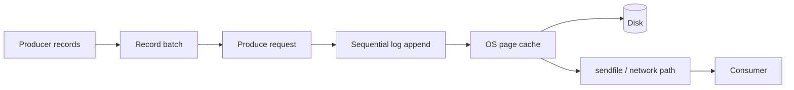

Implication:

- tiny unbatched messages waste overhead;
- compression works better per batch;
- caught-up consumers often read from page cache;
- historical replay can become disk-heavy;
- TLS can change zero-copy behavior and CPU cost;
- benchmark must include realistic batching/compression.

---

## 18. Topic Design

Topic adalah contract boundary. Jangan buat topic hanya karena ada satu class/event kecil. Jangan gabungkan semua domain karena “biar gampang”.

Pertanyaan desain:

1. Siapa owner topic?
2. Apa semantic contract record di topic?
3. Apa key dan ordering requirement?
4. Berapa retention?
5. Apakah compacted atau delete retention?
6. Siapa consumers?
7. Apakah schema evolution policy jelas?
8. Apakah PII/governance jelas?
9. Berapa throughput dan growth estimate?
10. Bagaimana replay dilakukan?

### 18.1 Contoh Topic Boundary

Regulatory platform:

```text
case.lifecycle.events
case.assignment.events
enforcement.decision.events
notification.commands
case.search-index.changelog
reference.regulated-entity.compacted
```

Penjelasan:

- `case.lifecycle.events`: audit/event history, retention panjang, key `caseId`.
- `notification.commands`: command-like work distribution, retention pendek, key mungkin `notificationId`.
- `reference.regulated-entity.compacted`: latest reference data, compacted, key `entityId`.

---

## 19. Partition Key Design

Partition key adalah salah satu keputusan paling sulit.

### 19.1 Key by Aggregate ID

```text
key = caseId
```

Kelebihan:

- order per case;
- projector mudah;
- event version validasi sederhana.

Risiko:

- hot case;
- jika satu case punya event sangat banyak, satu partition jadi hotspot;
- cross-case ordering tidak ada.

### 19.2 Key by Tenant

```text
key = tenantId
```

Kelebihan:

- tenant affinity;
- tenant-level processing mudah.

Risiko:

- tenant besar menjadi hotspot;
- parallelism per tenant rendah;
- ordering terlalu coarse.

### 19.3 Key by Region

```text
key = region
```

Biasanya buruk untuk high-throughput karena cardinality rendah. Semua APAC masuk partition yang sama jika jumlah region kecil dan key hash menghasilkan distribusi terbatas.

### 19.4 Key by Composite

```text
key = tenantId + ':' + caseId
```

Bisa menjaga case ordering dan distribusi lebih baik, tetapi migration dan compatibility perlu disiplin.

Rule:

```text
Choose the key that preserves the smallest ordering scope required by correctness.
```

Jangan menjaga ordering lebih luas dari kebutuhan. Global ordering mahal dan sering tidak perlu.

---

## 20. Partition Count Sizing

Mulai dari pertanyaan:

```text
How much parallelism do we need now and in the foreseeable future?
```

Faktor:

- target MB/sec write;
- target MB/sec read per consumer group;
- number of consumer groups;
- maximum consumers per group;
- per-partition throughput expected;
- broker count;
- replication factor;
- recovery/rebalance tolerance;
- future growth.

Simplified heuristic:

```text
partitions >= max(required_producer_parallelism, required_consumer_parallelism)
```

Tetapi jangan berhenti di situ. Terlalu banyak partition:

- memperbanyak metadata;
- memperbanyak file handles;
- memperbanyak leader election work;
- memperlama recovery;
- memperbesar rebalance cost;
- memperumit monitoring.

### 20.1 Menambah Partition Mengubah Key Mapping

Jika partition count dinaikkan, hash key ke partition bisa berubah untuk sebagian key. Ini bisa mengganggu ordering jika producer lama dan baru tidak dikontrol.

Contoh:

```text
caseId=CASE-123 sebelumnya partition 2
setelah partition count naik, CASE-123 bisa ke partition 7
```

Event untuk case yang sama bisa tersebar di partition berbeda setelah perubahan partition count.

Mitigasi:

- rencanakan partition count cukup untuk horizon tertentu;
- gunakan topic baru untuk repartition besar;
- gunakan custom partitioning dengan hati-hati;
- lakukan migration window;
- pastikan consumer bisa handle ordering transition jika diperlukan.

---

## 21. Producer Path Failure Modes

| Failure | Gejala | Penyebab Umum | Mitigasi |
|---|---|---|---|
| metadata stale | retry, latency spike | leader election | retry dengan timeout benar |
| buffer exhausted | send blocked/error | broker lambat, producer terlalu cepat | backpressure, buffer tuning |
| serialization error | record gagal sebelum send | schema/payload invalid | validate sebelum publish |
| not enough replicas | produce error | ISR < min.insync.replicas | broker health, RF/minISR design |
| timeout | unknown outcome | network/broker overload | idempotent producer, retry discipline |
| record too large | rejection | payload melebihi config | payload contract, external blob storage |

Unknown outcome adalah masalah utama distributed publish:

```text
Producer timeout does not always mean broker did not append.
```

Karena itu producer idempotence dan idempotent consumer penting.

---

## 22. Consumer Path Failure Modes

| Failure | Gejala | Penyebab Umum | Mitigasi |
|---|---|---|---|
| lag grows | consumer tertinggal | handler lambat, traffic naik | scale partitions/consumers, optimize handler |
| rebalance storm | processing interrupted | poll loop lambat, unstable instances | tune poll, static membership, cooperative rebalance |
| duplicate processing | side effect berulang | crash before commit | idempotency/inbox |
| message skipped | business data hilang | commit before process | commit after success |
| out-of-range offset | consumer cannot read old offset | retention expired | reset policy, larger retention, archive |
| hot partition | one consumer overloaded | bad key distribution | key redesign, repartition topic |

---

## 23. Kafka Tidak Menghapus Kebutuhan Database Transaction Design

Kafka menyelesaikan log transport dan retention. Ia tidak otomatis menyelesaikan:

- atomicity DB update + publish;
- idempotent side effects;
- external API exactly-once;
- business invariant validation;
- duplicate semantic events;
- authorization;
- PII governance.

Untuk publish dari database transaction, outbox/CDC masih relevan. Untuk consume ke database, inbox/idempotency masih relevan.

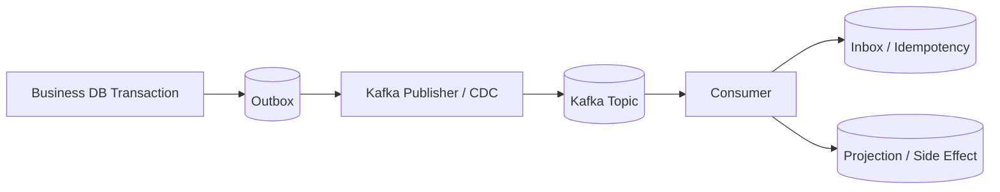

Kita akan bahas detail di Part 031.

---

## 24. Kafka vs RabbitMQ Streams Mental Diff

Keduanya punya model log/stream, tetapi ecosystem dan operational assumptions berbeda.

| Concern | Kafka | RabbitMQ Streams |
|---|---|---|
| Core identity | distributed event streaming platform | stream feature inside RabbitMQ broker ecosystem |
| Partitioning | native topic partition model | stream + superstream |
| Consumer group | core concept | single active consumer / stream consumer patterns |
| Ecosystem | Kafka Streams, Connect, ksqlDB, Schema Registry ecosystem | RabbitMQ routing + stream protocol + AMQP ecosystem |
| Routing | topic/partition centric | exchange/queue/stream routing model also available |
| Operational fit | large-scale event platform | broker + stream hybrid use cases |

Jangan pilih hanya karena “dua-duanya stream”. Pilih berdasarkan platform fit, team operation, routing needs, replay volume, ecosystem, and governance.

---

## 25. Java Touchpoint: AdminClient untuk Melihat Topology

Contoh membaca topic description:

```java
import org.apache.kafka.clients.admin.AdminClient;
import org.apache.kafka.clients.admin.DescribeTopicsResult;
import org.apache.kafka.clients.admin.TopicDescription;

import java.util.List;
import java.util.Map;
import java.util.Properties;

public final class TopicInspector {
    public static void main(String[] args) throws Exception {
        Properties props = new Properties();
        props.put("bootstrap.servers", "localhost:9092");

        try (AdminClient admin = AdminClient.create(props)) {
            DescribeTopicsResult result = admin.describeTopics(List.of("case-events"));
            Map<String, TopicDescription> descriptions = result.allTopicNames().get();

            TopicDescription topic = descriptions.get("case-events");
            System.out.println("Topic: " + topic.name());
            topic.partitions().forEach(partition -> {
                System.out.printf(
                    "partition=%d leader=%s replicas=%s isr=%s%n",
                    partition.partition(),
                    partition.leader(),
                    partition.replicas(),
                    partition.isr()
                );
            });
        }
    }
}
```

Ini bukan production observability lengkap, tetapi melatih mental model:

```text
topic -> partitions -> leader -> replicas -> ISR
```

---

## 26. Diagram End-to-End Kafka Core

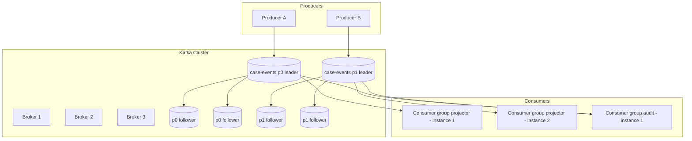

Interpretasi:

- Producer menulis ke partition leader.
- Follower replicate dari leader.
- Consumer group projector membagi partition antar instance.
- Consumer group audit bisa membaca semua partition independen dari projector.
- Offset masing-masing group berbeda.

---

## 27. Anti-Pattern Kafka Core

### 27.1 Global Ordering Illusion

Salah:

```text
Semua event dalam topic Kafka punya order global.
```

Benar:

```text
Order hanya per partition.
```

Jika butuh order per case, key by `caseId`. Jika butuh order global seluruh organisasi, Kafka multi-partition bukan jawabannya tanpa sequencer global, dan sequencer global menjadi bottleneck.

### 27.2 Topic per Entity Instance

Salah:

```text
case-CASE-1
case-CASE-2
case-CASE-3
...
```

Ini menghancurkan metadata dan operasi. Gunakan topic per event category/domain, key per entity.

### 27.3 Partition per Tenant Tanpa Hitung Tenant Growth

Jika tenant tumbuh ribuan, partition-per-tenant bisa meledak. Jika tenant besar, satu partition bisa hotspot.

### 27.4 Retention Panjang Tanpa Disk Budget

Salah:

```text
Set retention 365 hari saja, nanti disk ditambah.
```

Retention adalah cost commitment. Hitung ingress * retention * replication.

### 27.5 Commit Before Process

Salah:

```text
poll -> commit -> process
```

Ini bisa skip message jika crash setelah commit.

### 27.6 Menganggap Kafka Exactly-Once Menyelesaikan Semua Side Effect

Kafka transactions membantu consume-process-produce di Kafka boundary. Ia tidak membuat email, HTTP call, atau database eksternal magically exactly-once.

---

## 28. Operational Questions yang Harus Bisa Dijawab

Untuk setiap production topic, engineer senior harus bisa menjawab:

```text
[ ] Berapa partition count dan kenapa?
[ ] Apa partition key dan kenapa?
[ ] Apa replication factor?
[ ] Apa min.insync.replicas?
[ ] Producer pakai acks apa?
[ ] Berapa retention time/size?
[ ] Apakah compacted, delete, atau keduanya?
[ ] Berapa estimated ingress MB/day?
[ ] Berapa estimated storage dengan replication?
[ ] Consumer group apa saja yang membaca?
[ ] Consumer mana yang paling lambat?
[ ] Apa replay SLA?
[ ] Apa schema compatibility policy?
[ ] Apa PII/data governance policy?
[ ] Apa recovery plan jika partition hot?
```

Jika jawaban tidak ada, topic itu belum siap production-critical workload.

---

## 29. Mini Case Study: `case-events`

### Requirement

Regulatory case platform butuh event stream untuk lifecycle case:

- create case;
- assign officer;
- request evidence;
- receive evidence;
- escalate;
- enforcement decision;
- close case.

Correctness:

```text
Events for the same case must be processed in order.
Different cases do not require global ordering.
```

### Design

```yaml
topic: case.lifecycle.events
key: caseId
partitions: 24
replication_factor: 3
min_insync_replicas: 2
retention: 90 days
cleanup_policy: delete
producer_acks: all
producer_idempotence: true
schema: versioned envelope + payload
```

Why:

- `caseId` preserves order per case;
- 24 partitions allow consumer scale-out;
- RF=3 and minISR=2 provide durability baseline;
- 90-day retention supports operational replay;
- long-term audit archive should still exist outside Kafka if legal retention exceeds 90 days.

### Consumer Groups

```text
case-projector
case-search-indexer
sla-monitor
notification-orchestrator
audit-archive-writer
```

Each group stores offsets independently.

### Known Risk

Hot case:

```text
A large investigation case generates millions of events.
All go to same partition because key=caseId.
```

Mitigation options:

- accept if rare and bounded;
- special-case high-volume case event type;
- split sub-stream by `caseId + subProcessId` if business ordering permits;
- build hot-key detection metrics.

---

## 30. Latihan 30 Menit

Ambil satu candidate topic dari sistemmu. Isi ini:

```yaml
topic: ""
owning_service: ""
record_semantics: "event|command|state-change|changelog"
key: ""
why_this_key: ""
ordering_scope: ""
partitions_initial: 0
partitions_growth_plan: ""
replication_factor: 0
min_insync_replicas: 0
retention_time: ""
retention_size: ""
cleanup_policy: "delete|compact|delete,compact"
estimated_records_per_day: 0
estimated_avg_record_size: ""
estimated_storage: ""
consumer_groups:
  - name: ""
    purpose: ""
    replay_sla: ""
pii_fields: []
schema_compatibility: "backward|forward|full|none"
known_hot_key_risks: []
```

Kemudian jawab:

```text
Apa satu keputusan yang paling mungkin salah?
Apa failure mode-nya?
Apa metric yang akan mendeteksinya paling awal?
```

---

## 31. Ringkasan

Kafka core architecture sederhana tetapi konsekuensinya dalam.

Invariants:

```text
Topic is logical; partition is physical ordering unit.
Offset is per partition, not global business identity.
Producer writes to partition leader.
Followers replicate leader log.
ISR determines which replicas are sufficiently caught up.
Consumer group parallelism is bounded by partition count.
Retention is independent of consumption.
Replay exists only inside retention window.
Partition key is a correctness decision, not only a distribution decision.
```

Setelah memahami bagian ini, Part 017 tentang producer internals akan jauh lebih masuk akal. Producer configs seperti `acks`, `linger.ms`, `batch.size`, `compression.type`, `enable.idempotence`, dan `delivery.timeout.ms` bukan tuning random; semuanya adalah knob yang memengaruhi path dari record aplikasi ke replicated partition log.

---

## Referensi

- Apache Kafka 4.3 documentation — Design, Implementation Log, Distribution, Operations, and Configuration.
- Apache Kafka documentation — producer, consumer, admin, and streams APIs.
- Apache Kafka design notes on log persistence, batching, pull-based consumer model, offsets, replication, ISR, and committed messages.
