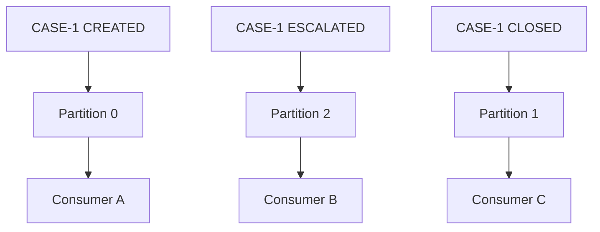
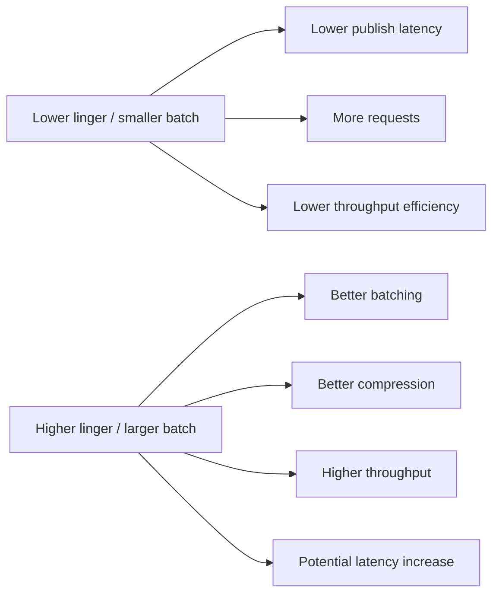
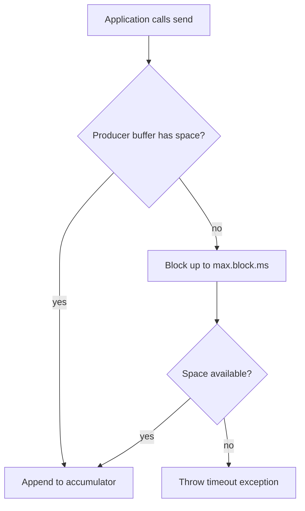
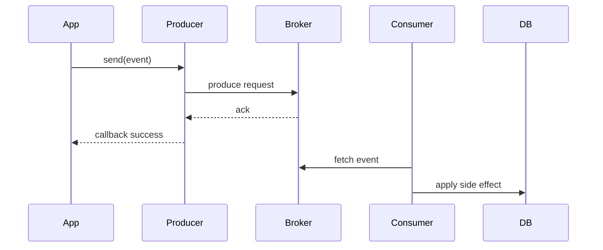
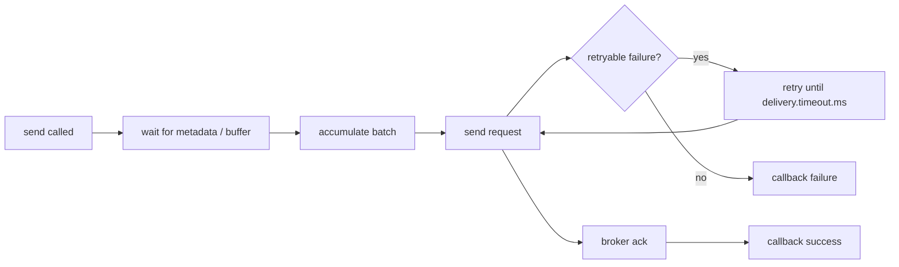
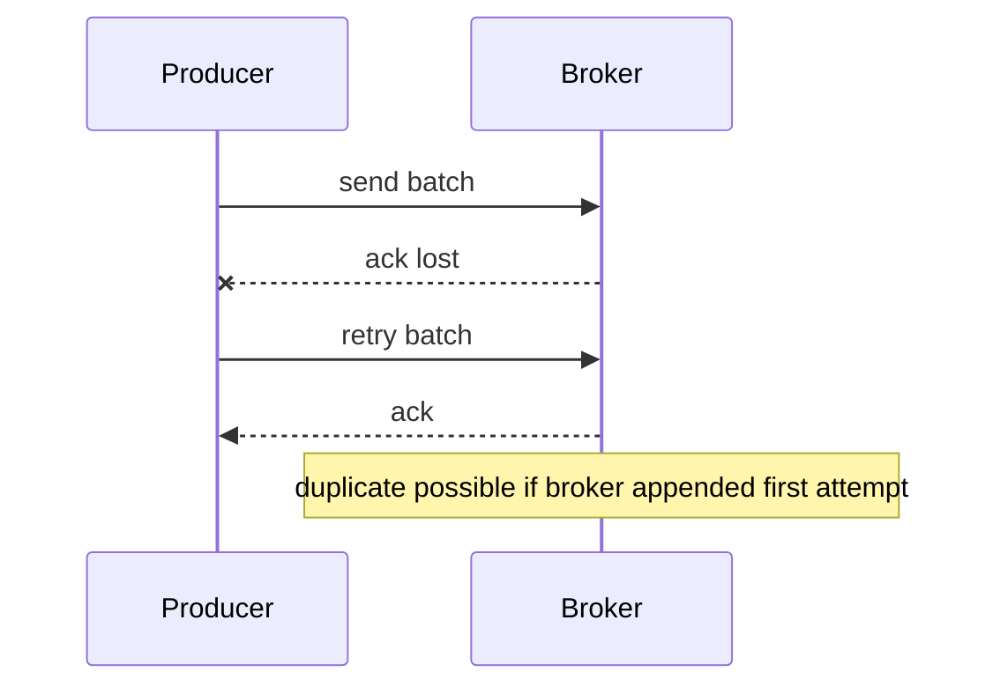
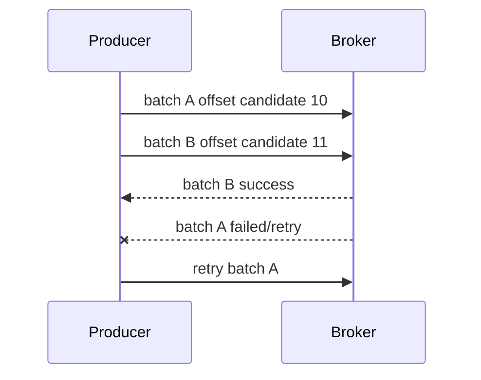
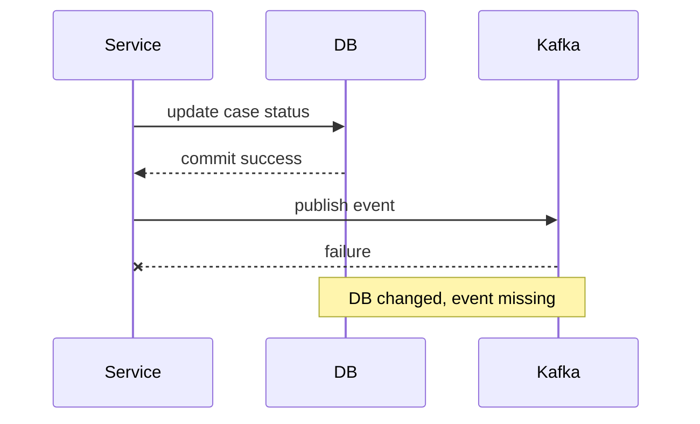
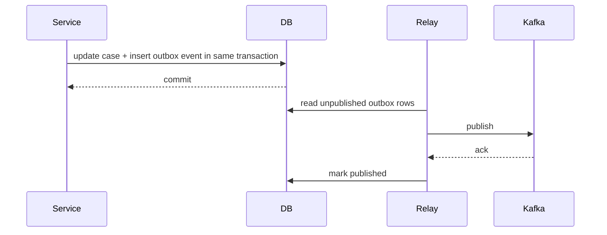

------
title: Learn Java Messaging and Event Streaming - Part 017
description: Kafka producer internals in Java: ProducerRecord, key, partitioner, accumulator, batching, linger, compression, acks, retries, delivery timeout, idempotence, transactions boundary, and production tuning.
series: learn-java-messaging-event-streaming
seriesTitle: Learn Java Messaging and Event Streaming
order: 17
partTitle: Kafka Producer Internals, Batching, Linger, Compression, Acks, and Idempotence
tags:
- java
- kafka
- apache-kafka
- producer
- batching
- compression
- idempotence
- reliability
- throughput
- performance
- event-streaming
date: 2026-06-28
---

# Part 017 — Kafka Producer Internals: Batching, Linger, Compression, Acks, Idempotence

## Tujuan Bagian Ini

Bagian ini membahas Kafka producer dari sisi Java engineer yang harus membuat keputusan produksi, bukan sekadar menulis `producer.send(record)`.

Setelah bagian ini, kamu harus bisa:

1. Menjelaskan path internal record dari aplikasi Java sampai broker.
2. Mendesain key dan partitioning dengan sadar terhadap ordering, load distribution, dan hotspot.
3. Mengatur batching, linger, compression, buffer, retry, timeout, dan inflight request sebagai satu sistem.
4. Membedakan acknowledgement broker, callback sukses, durability, dan business success.
5. Memahami idempotent producer dan batasnya.
6. Membuat producer wrapper yang aman untuk production use.
7. Menghindari anti-pattern umum seperti `flush()` per message, random key untuk event yang butuh ordering, atau callback yang diabaikan.

---

## 1. Mental Model Utama

Kafka producer bukan object sederhana yang langsung mengirim satu record ke broker setiap kali `send()` dipanggil.

Producer adalah pipeline asynchronous:


Hal yang sering disalahpahami:

- `send()` biasanya tidak berarti record sudah sampai broker.
- callback sukses tidak berarti business transaction downstream selesai.
- `acks=all` tidak berarti tidak mungkin duplicate.
- idempotence mengurangi duplicate akibat retry producer, tetapi tidak menyelesaikan duplicate akibat aplikasi memanggil publish dua kali.
- ordering Kafka adalah ordering per partition, bukan global ordering topic.
- batching terjadi per topic-partition.

Producer harus dilihat sebagai **asynchronous, batched, partition-aware, retrying network client**.

---

## 2. ProducerRecord sebagai Contract Envelope

Bentuk dasar publish Kafka di Java:

```java
ProducerRecord<String, CaseLifecycleEvent> record = new ProducerRecord<>(
    "case.lifecycle.v1",
    caseId,
    event
);

producer.send(record, (metadata, exception) -> {
    if (exception != null) {
        // record not acknowledged successfully
        log.error("Kafka publish failed", exception);
        return;
    }

    log.info("Published to topic={}, partition={}, offset={}",
        metadata.topic(), metadata.partition(), metadata.offset());
});
```

`ProducerRecord` membawa beberapa keputusan arsitektural:

| Field | Makna Engineering | Risiko Jika Salah |
|---|---|---|
| topic | stream contract publik | topic sprawl, lifecycle kacau |
| key | partitioning + ordering affinity | reordering entity, hotspot |
| value | payload event/command | schema breaking, payload bloat |
| headers | metadata teknis/context | PII leak, inconsistent tracing |
| timestamp | event-time/log-time semantics | salah windowing dan audit timeline |
| partition eksplisit | override partitioner | coupling keras ke topology fisik |

Rule praktis:

```text
Kafka key bukan hanya lookup key.
Kafka key adalah ownership key untuk ordering, load distribution, dan state locality.
```

---

## 3. Key Design: Keputusan Terkecil dengan Efek Terbesar

Misalnya kita publish event regulatory case:

```json
{
  "eventId": "evt-901",
  "caseId": "CASE-2026-00017",
  "regulatedEntityId": "BANK-778",
  "eventType": "ESCALATION_TRIGGERED",
  "occurredAt": "2026-06-28T09:15:00Z"
}
```

Pilihan key berbeda menghasilkan properti sistem berbeda:

| Key | Ordering | Load | Cocok Untuk | Risiko |
|---|---|---|---|---|
| `caseId` | urutan per case | biasanya baik | case lifecycle | hot case dapat membebani partition |
| `regulatedEntityId` | urutan per entity | bisa hotspot | exposure/entity aggregation | bank besar jadi hot partition |
| `eventId` | tidak menjaga urutan entity | sangat merata | event independen | lifecycle case bisa reorder |
| null key | round-robin/sticky distribution | merata | telemetry stateless | tidak ada entity ordering |
| composite key | tergantung desain | bisa dikontrol | sharded aggregate | join downstream lebih sulit |

### 3.1 Heuristik Key

Gunakan key yang menjawab pertanyaan:

```text
Apa unit bisnis terkecil yang tidak boleh diproses out-of-order?
```

Untuk case lifecycle biasanya jawabannya `caseId`.

Untuk payment account ledger mungkin `accountId`.

Untuk enforcement exposure by institution mungkin `institutionId`, tetapi hati-hati hotspot.

Untuk log telemetry stateless, null/random key bisa masuk akal.

### 3.2 Anti-Pattern: Random Key untuk Event Stateful

Random key sering dipilih agar beban merata. Ini benar untuk throughput, tetapi salah untuk stateful lifecycle.



Efek:

- event satu case diproses oleh consumer berbeda;
- state lokal tidak lengkap;
- ordering antar event case hilang;
- downstream harus membuat reorder buffer sendiri;
- audit trail sulit direkonstruksi secara deterministik.

---

## 4. Internal Producer Pipeline

Secara konseptual, Kafka producer memiliki komponen berikut:

```mermaid
flowchart TB
    subgraph App[Application Threads]
        A1[send(record)]
        A2[send(record)]
        A3[send(record)]
    end

    A1 --> S[Serializer]
    A2 --> S
    A3 --> S

    S --> P[Partitioner]
    P --> Acc[RecordAccumulator]

    subgraph Accum[Per Broker / Per Partition Buffers]
        B0[batch topic-0]
        B1[batch topic-1]
        B2[batch topic-2]
    end

    Acc --> B0
    Acc --> B1
    Acc --> B2

    B0 --> Sender[Sender Thread]
    B1 --> Sender
    B2 --> Sender

    Sender --> Broker0[Broker Leader 0]
    Sender --> Broker1[Broker Leader 1]
```

Tahapan penting:

1. Application thread membuat `ProducerRecord`.
2. Key/value diserialize menjadi bytes.
3. Partitioner menentukan topic-partition.
4. Record masuk accumulator per partition.
5. Sender thread mengambil batch siap kirim.
6. Request dikirim ke broker leader partition.
7. Broker merespons berdasarkan `acks` dan replication state.
8. Callback/future diselesaikan.

Implikasi:

- serialization terjadi sebelum record masuk network pipeline;
- batch biasanya dibentuk per partition;
- broker leader untuk partition menjadi target write;
- backpressure bisa muncul di buffer producer sebelum mencapai broker;
- callback berjalan di thread producer internals, jadi jangan lakukan kerja berat di callback.

---

## 5. Batching: Throughput Datang dari Mengirim Lebih Sedikit Request Besar

Kafka sangat bergantung pada batching.

Tanpa batching:

```text
100,000 records/sec = 100,000 network requests/sec
```

Dengan batching:

```text
100,000 records/sec = mungkin ratusan/ribuan requests/sec
```

Batching meningkatkan throughput karena:

- amortisasi overhead TCP/request;
- kompresi lebih efektif;
- disk append lebih efisien;
- broker bisa memproses record dalam block;
- consumer fetch juga lebih efisien.

### 5.1 `batch.size`

`batch.size` adalah batas byte maksimum batch per topic-partition.

Misalnya:

```properties
batch.size=65536
```

Artinya producer boleh mengumpulkan sampai sekitar 64 KiB record untuk satu partition sebelum mengirim batch, tetapi batch tidak harus penuh untuk dikirim.

Trade-off:

| Nilai | Efek |
|---|---|
| terlalu kecil | request terlalu banyak, compression buruk |
| terlalu besar | memory lebih besar, latency bisa naik, waste jika traffic sparse |
| moderat | throughput baik tanpa latency ekstrem |

### 5.2 `linger.ms`

`linger.ms` adalah waktu tunggu tambahan agar batch bisa terisi sebelum dikirim.

```properties
linger.ms=5
```

Artinya producer boleh menunggu beberapa milidetik untuk mendapatkan record tambahan sebelum mengirim batch.

Mental model:

```text
batch.size = batas kapasitas batch
linger.ms  = batas waktu menunggu batch menjadi lebih penuh
```

Jika traffic sangat tinggi, batch bisa penuh sebelum linger habis.

Jika traffic rendah, linger menentukan latency tambahan.

### 5.3 Latency vs Throughput



Tidak ada nilai universal. Tuning harus berbasis SLA:

| Use Case | Tuning Bias |
|---|---|
| user-facing synchronous action | lower linger, bounded timeout |
| audit event pipeline | moderate linger, strong durability |
| telemetry/high-volume metrics | higher batching/compression |
| fraud/enforcement trigger | low-to-moderate latency, strict idempotency |
| bulk migration/replay | aggressive batching, high compression |

---

## 6. Compression: Jangan Lihat Payload Satu Record

Compression Kafka bekerja jauh lebih efektif saat batch cukup besar.

Common options:

```properties
compression.type=none
compression.type=gzip
compression.type=snappy
compression.type=lz4
compression.type=zstd
```

Trade-off konseptual:

| Compression | Bias | Catatan |
|---|---|---|
| none | CPU rendah | network/disk lebih besar |
| gzip | ratio baik | CPU lebih tinggi |
| snappy | cepat | ratio sedang |
| lz4 | cepat | sering baik untuk latency |
| zstd | ratio sangat baik | CPU/setting perlu diuji |

Gunakan compression saat:

- payload JSON besar;
- network/disk menjadi bottleneck;
- consumer dan broker CPU masih cukup;
- traffic volume tinggi.

Hindari asumsi:

```text
Compression memperlambat sistem.
```

Kadang compression mempercepat end-to-end karena mengurangi network, disk, replication, dan fetch bytes.

Benchmark harus mengukur:

- producer latency p50/p95/p99;
- throughput records/sec dan bytes/sec;
- broker network in/out;
- broker request handler utilization;
- broker disk I/O;
- consumer fetch throughput;
- CPU producer/broker/consumer.

---

## 7. Buffering and Backpressure

Producer punya memory buffer untuk record yang belum terkirim.

```properties
buffer.memory=33554432
max.block.ms=60000
```

Jika broker lambat, network bermasalah, metadata unavailable, atau request menumpuk, buffer bisa penuh.

Saat buffer penuh, `send()` bisa block sampai `max.block.ms`, lalu gagal.



### 7.1 Producer Backpressure Signals

Sinyal bahwa producer sedang under pressure:

- `send()` mulai lambat;
- `bufferpool-wait-time` naik;
- request latency naik;
- batch queue time naik;
- record error rate naik;
- timeout exception muncul;
- broker throttle time naik;
- application thread blocked.

### 7.2 Jangan Abaikan `send()` Failure

Anti-pattern:

```java
producer.send(record);
```

Tanpa callback dan tanpa inspect future, kegagalan asynchronous bisa hilang dari business logic.

Versi minimal lebih baik:

```java
producer.send(record, (metadata, exception) -> {
    if (exception != null) {
        publishFailureCounter.increment();
        log.error("Kafka publish failed topic={} key={}",
            record.topic(), record.key(), exception);
    }
});
```

Untuk domain kritikal, jangan hanya log. Gunakan outbox, retry persistence, atau error channel.

---

## 8. Acknowledgements: `acks` Bukan Sekadar “Safe atau Tidak”

`acks` menentukan kapan broker leader menganggap produce request berhasil.

Common values:

```properties
acks=0
acks=1
acks=all
```

| Setting | Meaning | Risiko |
|---|---|---|
| `acks=0` | producer tidak menunggu broker response | data loss tidak terlihat |
| `acks=1` | leader menulis lalu ack | loss jika leader mati sebelum replica catch up |
| `acks=all` | leader menunggu ISR sesuai durability config | latency lebih tinggi, lebih aman |

Untuk event bisnis penting, default mindset:

```properties
acks=all
```

Tetapi `acks=all` harus dipasangkan dengan broker/topic durability seperti:

```properties
min.insync.replicas=2
replication.factor=3
```

Jika `acks=all` tetapi `min.insync.replicas=1`, durability faktual masih lemah.

### 8.1 Producer Success Does Not Mean End-to-End Success



Callback success hanya berarti Kafka menerima record sesuai `acks`.

Belum berarti:

- consumer sudah membaca;
- consumer berhasil proses;
- DB downstream sudah berubah;
- email/webhook downstream sudah terkirim;
- business workflow sudah selesai.

Gunakan istilah presisi:

```text
Produced successfully != Processed successfully != Business completed.
```

---

## 9. Retries and Timeout: Sistem Waktu Producer

Kafka producer punya beberapa timeout penting:

| Config | Fungsi |
|---|---|
| `retries` | berapa kali producer boleh retry request gagal yang retryable |
| `retry.backoff.ms` | jeda antar retry |
| `delivery.timeout.ms` | batas total waktu delivery record sejak send sampai success/failure |
| `request.timeout.ms` | batas tunggu response request |
| `linger.ms` | tunggu tambahan untuk batching |
| `max.block.ms` | batas block saat metadata/buffer tidak tersedia |

Mental model:



### 9.1 Retryable vs Non-Retryable Failure

Retryable examples conceptually:

- leader not available;
- not enough replicas temporarily;
- network disconnect;
- request timeout where final state unknown.

Non-retryable examples conceptually:

- serialization failure;
- authorization failure;
- invalid topic;
- record too large;
- incompatible config.

Application code should distinguish:

```java
producer.send(record, (metadata, ex) -> {
    if (ex == null) {
        return;
    }

    if (ex instanceof org.apache.kafka.common.errors.SerializationException) {
        quarantine(record, ex);
        return;
    }

    if (ex instanceof org.apache.kafka.common.errors.AuthorizationException) {
        alertSecurityMisconfiguration(record, ex);
        return;
    }

    persistForReplay(record, ex);
});
```

---

## 10. Idempotent Producer

Idempotent producer mencegah duplicate yang muncul karena retry producer pada sequence yang sama.

Tanpa idempotence:



Dengan idempotence, producer menggunakan identity dan sequence number sehingga broker dapat mendeteksi duplicate dari producer session yang sama.

Konfigurasi konseptual:

```properties
enable.idempotence=true
acks=all
retries=2147483647
max.in.flight.requests.per.connection=5
```

Catatan penting:

- idempotence melindungi terhadap retry duplicate dari producer client;
- idempotence tidak melindungi jika aplikasi membuat dua event berbeda dengan dua `eventId` berbeda untuk aksi bisnis yang sama;
- idempotence tidak membuat side effect consumer exactly-once;
- idempotence tidak menggantikan idempotency key domain.

### 10.1 Domain Idempotency Tetap Wajib

Untuk event regulatory case:

```json
{
  "eventId": "evt-901",
  "commandId": "cmd-443",
  "caseId": "CASE-2026-00017",
  "eventType": "ESCALATION_TRIGGERED"
}
```

Consumer harus bisa berkata:

```sql
INSERT INTO processed_event(event_id, processed_at)
VALUES (?, now())
ON CONFLICT (event_id) DO NOTHING;
```

Karena duplicate bisa datang dari:

- producer retry sebelum idempotence aktif;
- application retry membuat publish baru;
- outbox relay restart;
- topic replay;
- manual replay;
- consumer offset rollback;
- cross-region failover.

---

## 11. `max.in.flight.requests.per.connection` and Ordering

Producer bisa mengirim beberapa request ke connection yang sama tanpa menunggu response sebelumnya.

Ini meningkatkan throughput, tetapi historisnya dapat mengganggu ordering jika ada retry dan idempotence tidak mengontrol sequence.

Mental model:



Jika tidak dijaga, batch B bisa muncul sebelum retry batch A.

Prinsip:

- untuk strict ordering, jangan gunakan konfigurasi yang memungkinkan retry reorder;
- idempotent producer modern dirancang untuk menjaga ordering dalam batas konfigurasi valid;
- jangan mematikan idempotence tanpa alasan kuat;
- uji ordering dengan failure injection, bukan hanya happy path.

---

## 12. Serialization: Tempat Banyak Failure Terjadi Sebelum Network

Producer harus serialize key/value sebelum mengirim.

Common serializer:

```properties
key.serializer=org.apache.kafka.common.serialization.StringSerializer
value.serializer=io.confluent.kafka.serializers.KafkaAvroSerializer
```

atau JSON custom:

```java
public final class JsonSerializer<T> implements Serializer<T> {
    private final ObjectMapper mapper = new ObjectMapper();

    @Override
    public byte[] serialize(String topic, T data) {
        if (data == null) return null;
        try {
            return mapper.writeValueAsBytes(data);
        } catch (JsonProcessingException e) {
            throw new SerializationException("Failed to serialize event", e);
        }
    }
}
```

Serialization failure biasanya non-retryable karena bug data/schema.

Jangan retry serialization failure secara infinite. Karantina dan perbaiki payload/schema.

### 12.1 Header Discipline

Headers cocok untuk metadata teknis:

```java
record.headers()
    .add("event-id", eventId.getBytes(StandardCharsets.UTF_8))
    .add("correlation-id", correlationId.getBytes(StandardCharsets.UTF_8))
    .add("causation-id", causationId.getBytes(StandardCharsets.UTF_8))
    .add("traceparent", traceparent.getBytes(StandardCharsets.UTF_8))
    .add("schema-version", "1".getBytes(StandardCharsets.UTF_8));
```

Jangan taruh data bisnis penting hanya di header jika consumer contract-mu menganggap payload sebagai source of truth.

Gunakan header untuk:

- correlation;
- tracing;
- schema metadata;
- retry count;
- producer identity;
- causation chain.

Hindari header untuk:

- PII yang tidak perlu;
- authorization decision;
- field bisnis yang wajib untuk replay;
- data yang harus masuk audit payload.

---

## 13. Producer Configuration Profiles

### 13.1 Safe Business Event Producer

Untuk event bisnis penting:

```properties
bootstrap.servers=kafka-a:9092,kafka-b:9092,kafka-c:9092
client.id=case-service-producer

key.serializer=org.apache.kafka.common.serialization.StringSerializer
value.serializer=com.company.kafka.CaseEventSerializer

acks=all
enable.idempotence=true
retries=2147483647
delivery.timeout.ms=120000
request.timeout.ms=30000
retry.backoff.ms=100

batch.size=32768
linger.ms=5
compression.type=zstd
buffer.memory=67108864
max.block.ms=10000
```

Properties:

- durability kuat;
- retry bounded by delivery timeout;
- batching cukup;
- compression aktif;
- idempotence aktif;
- block time application dibatasi.

### 13.2 Low-Latency Producer

Untuk user-facing path yang latency-sensitive:

```properties
acks=all
enable.idempotence=true
linger.ms=0
batch.size=16384
compression.type=lz4
delivery.timeout.ms=30000
request.timeout.ms=10000
max.block.ms=3000
```

Catatan:

- jangan otomatis pakai `acks=1` demi latency jika event penting;
- turunkan payload size dan improve broker health lebih dulu;
- gunakan async API agar request thread tidak menunggu Kafka jika business semantics memungkinkan.

### 13.3 High-Throughput Ingestion Producer

Untuk telemetry atau bulk replay:

```properties
acks=all
enable.idempotence=true
linger.ms=20
batch.size=131072
compression.type=zstd
buffer.memory=268435456
max.in.flight.requests.per.connection=5
```

Catatan:

- pastikan broker disk/network mampu;
- pastikan consumer juga bisa mengejar;
- monitor lag dan end-to-end latency, bukan producer throughput saja.

---

## 14. Producer Wrapper untuk Production

Aplikasi besar sebaiknya tidak membiarkan semua tim memanggil Kafka producer langsung tanpa discipline.

Buat wrapper internal:

```java
public interface EventPublisher<E> {
    CompletionStage<PublishResult> publish(E event);
}
```

Implementasi:

```java
public final class KafkaEventPublisher<E extends DomainEvent>
        implements EventPublisher<E>, AutoCloseable {

    private final KafkaProducer<String, E> producer;
    private final String topic;
    private final MeterRegistry metrics;

    public KafkaEventPublisher(
            KafkaProducer<String, E> producer,
            String topic,
            MeterRegistry metrics
    ) {
        this.producer = Objects.requireNonNull(producer);
        this.topic = Objects.requireNonNull(topic);
        this.metrics = Objects.requireNonNull(metrics);
    }

    @Override
    public CompletionStage<PublishResult> publish(E event) {
        Objects.requireNonNull(event, "event");

        CompletableFuture<PublishResult> result = new CompletableFuture<>();

        ProducerRecord<String, E> record = new ProducerRecord<>(
            topic,
            event.partitionKey(),
            event.occurredAt().toEpochMilli(),
            event
        );

        addHeaders(record, event);

        producer.send(record, (metadata, exception) -> {
            if (exception != null) {
                metrics.counter("kafka.publish.failure", "topic", topic).increment();
                result.completeExceptionally(exception);
                return;
            }

            metrics.counter("kafka.publish.success", "topic", topic).increment();
            result.complete(new PublishResult(
                metadata.topic(),
                metadata.partition(),
                metadata.offset()
            ));
        });

        return result;
    }

    private void addHeaders(ProducerRecord<String, E> record, E event) {
        record.headers().add("event-id", utf8(event.eventId()));
        record.headers().add("correlation-id", utf8(event.correlationId()));
        record.headers().add("event-type", utf8(event.eventType()));
    }

    private byte[] utf8(String value) {
        return value.getBytes(StandardCharsets.UTF_8);
    }

    @Override
    public void close() {
        producer.close(Duration.ofSeconds(10));
    }
}
```

Wrapper responsibilities:

- enforce topic naming;
- enforce key selection;
- add mandatory headers;
- map exception classes;
- publish metrics;
- expose future/completion;
- prevent ad-hoc `flush()`;
- centralize producer config;
- support outbox integration.

---

## 15. Outbox Integration: Producer Reliability Beyond Kafka Client

Kafka producer can retry broker/network failures, but it cannot atomically publish with your relational database transaction unless you use a more deliberate design.

Bad pattern:

```java
@Transactional
public void escalateCase(String caseId) {
    caseRepository.markEscalated(caseId);
    kafkaProducer.send(new ProducerRecord<>("case.events", caseId, event));
}
```

Failure window:



Outbox pattern:



Outbox shifts guarantee from “try to publish during business transaction” to “durably record intent to publish”.

Producer config still matters, but missing-event risk becomes manageable.

---

## 16. Error Handling Strategy

Producer errors should be classified:

| Error Class | Example | Action |
|---|---|---|
| transient infrastructure | broker unavailable, leader moving | retry by client; alert if sustained |
| timeout unknown state | request timeout | rely on idempotence + dedup; inspect callback |
| serialization bug | invalid payload | quarantine payload, fix code/schema |
| authorization/config | ACL denied, invalid topic | page team; no blind retry |
| size violation | record too large | reject, split payload, externalize blob |
| buffer pressure | max.block timeout | shed load, slow input, scale broker/topic |

Anti-pattern:

```text
catch Exception -> log -> continue
```

Untuk event kritikal, publish failure harus menjadi domain-visible failure, bukan noise log.

---

## 17. Flush, Close, and Shutdown

`flush()` memaksa producer menunggu record buffered selesai dikirim.

Gunakan `flush()`:

- saat graceful shutdown;
- dalam integration test;
- pada boundary batch job tertentu;
- sebelum proses benar-benar exit.

Jangan gunakan `flush()` per message:

```java
producer.send(record);
producer.flush(); // anti-pattern in hot path
```

Efeknya:

- batching rusak;
- throughput turun drastis;
- latency naik;
- CPU/network overhead naik;
- producer pipeline berubah jadi synchronous.

Shutdown yang lebih baik:

```java
Runtime.getRuntime().addShutdownHook(new Thread(() -> {
    log.info("Closing Kafka producer");
    producer.close(Duration.ofSeconds(30));
}));
```

---

## 18. Observability Producer

Minimal producer metrics yang harus diamati:

| Metric Family | Pertanyaan |
|---|---|
| record send rate | berapa record/sec dikirim? |
| record error rate | apakah publish gagal? |
| request latency | broker ack lambat? |
| batch size avg | batching efektif? |
| compression rate | compression membantu? |
| buffer available/wait | producer backpressure? |
| metadata age/errors | topic/leader discovery sehat? |
| outgoing byte rate | network pressure? |
| record retry rate | broker/network unstable? |

Tambahkan application-level metrics:

- publish success by event type;
- publish failure by error class;
- outbox pending count;
- outbox publish age p95/p99;
- event creation-to-publish latency;
- correlation ID sampling.

Log publish failure dengan context:

```text
eventId, eventType, aggregateId, topic, key, correlationId, exceptionClass, retryable, producerClientId
```

Jangan log full payload jika mengandung PII.

---

## 19. Testing Producer Correctness

### 19.1 Unit Test

Test:

- key selection;
- topic mapping;
- header presence;
- serialization happy path;
- serialization failure;
- event envelope invariants.

### 19.2 Integration Test

Gunakan Kafka test container/embedded broker untuk:

- publish event dan consume kembali;
- verify topic/partition assignment expectation;
- verify header;
- verify schema compatibility;
- verify callback failure for invalid topic/authorization jika memungkinkan.

### 19.3 Failure Injection

Test scenario:

| Scenario | Expected Behavior |
|---|---|
| broker unavailable | publish future gagal atau outbox tetap pending |
| leader change | retry sukses tanpa duplicate visible by eventId |
| slow broker | buffer wait naik, caller tidak hang selamanya |
| serialization failure | event masuk quarantine, tidak infinite retry |
| oversized record | reject dengan error jelas |
| duplicate application command | single business effect downstream |

---

## 20. Common Anti-Patterns

### 20.1 Fire-and-Forget untuk Event Penting

```java
producer.send(record);
```

Masalah: kegagalan asynchronous tidak terlihat.

Perbaikan: callback, future handling, outbox, metrics.

### 20.2 `flush()` per Message

Masalah: menghancurkan batching.

Perbaikan: biarkan producer async, flush hanya pada shutdown/batch boundary.

### 20.3 Key Tidak Sesuai Semantics

Masalah: event lifecycle reorder atau hotspot.

Perbaikan: key design review per topic.

### 20.4 Satu Producer per Request

Masalah:

- connection churn;
- metadata refresh overhead;
- batching hilang;
- resource leak.

Perbaikan: producer adalah expensive, thread-safe, long-lived component.

### 20.5 Callback Berat

Masalah: callback yang melakukan DB write besar atau HTTP call bisa mengganggu producer thread.

Perbaikan: callback ringan, push ke executor jika perlu.

### 20.6 Retry di Application + Producer Retry Tanpa Idempotency

Masalah: duplicate storm.

Perbaikan:

- enable idempotence;
- domain event ID;
- outbox unique constraint;
- consumer dedup.

### 20.7 Menganggap Compression Hanya Producer Concern

Compression memengaruhi:

- broker CPU;
- network;
- disk;
- replication;
- consumer decompression;
- end-to-end latency.

Uji sebagai pipeline, bukan producer microbenchmark saja.

---

## 21. Design Review Checklist

Sebelum producer topic baru live, jawab:

1. Apa topic contract-nya?
2. Apa event type yang dipublish?
3. Apa partition key dan mengapa?
4. Apakah ordering per key cukup?
5. Berapa target throughput dan payload size?
6. Apa compression type?
7. Apa `acks`, `enable.idempotence`, `delivery.timeout.ms`?
8. Apa retry behavior?
9. Apa yang terjadi jika publish gagal setelah DB commit?
10. Apakah outbox diperlukan?
11. Apa schema compatibility policy?
12. Apa header wajib?
13. Apa PII policy?
14. Apa metrics dan alert?
15. Bagaimana replay dan duplicate ditangani?
16. Siapa owner topic?
17. Bagaimana deprecate versi event lama?

---

## 22. Mini Lab

### Target

Buat Java producer untuk event `CaseEscalated` dengan:

- key = `caseId`;
- header `event-id`, `correlation-id`, `event-type`;
- idempotence aktif;
- `acks=all`;
- compression aktif;
- callback yang menghasilkan metric/log;
- tidak ada `flush()` per send;
- integration test yang consume event dan verify key/header/value.

### Exercise 1 — Key Experiment

Publish 10.000 event:

1. key null;
2. key `caseId` dengan 10.000 case berbeda;
3. key `regulatedEntityId` dengan distribusi sangat skewed.

Observasi:

- distribution per partition;
- hot partition;
- ordering per key;
- throughput difference.

### Exercise 2 — Batching Experiment

Bandingkan:

```properties
linger.ms=0
batch.size=16384
```

vs

```properties
linger.ms=20
batch.size=131072
```

Ukur:

- records/sec;
- request rate;
- average batch size;
- p99 publish latency;
- compression ratio.

### Exercise 3 — Failure Experiment

Matikan broker leader saat producer mengirim.

Verify:

- callback behavior;
- retry rate;
- duplicate downstream by `eventId`;
- publish latency spike;
- metrics/alert.

---

## 23. Ringkasan

Kafka producer adalah pipeline asynchronous yang melakukan serialization, partitioning, batching, compression, network send, retry, dan acknowledgement handling.

Mental model yang harus dibawa:

```text
Producer correctness = key semantics + durable publish + bounded retry + idempotency + observability.
```

Tuning producer tidak bisa dilakukan dengan satu config tunggal. `batch.size`, `linger.ms`, `compression.type`, `buffer.memory`, `acks`, `retries`, `delivery.timeout.ms`, `max.in.flight.requests.per.connection`, dan `enable.idempotence` saling membentuk sistem.

Untuk top 1% engineering, pertanyaan utamanya bukan “bagaimana publish ke Kafka?”, tetapi:

```text
Apa bukti bahwa setiap event penting yang seharusnya dipublish akan durable, observable, replayable, dan aman terhadap duplicate?
```
