------
title: Learn Java Messaging and Event Streaming - Part 018
description: Kafka consumer internals in Java: poll loop, fetch, consumer groups, assignment, heartbeat, session timeout, max poll interval, offset commit, rebalance listener, backpressure, and safe processing patterns.
series: learn-java-messaging-event-streaming
seriesTitle: Learn Java Messaging and Event Streaming
order: 18
partTitle: Kafka Consumer Internals, Poll Loop, Rebalance, and Commit
tags:
- java
- kafka
- apache-kafka
- consumer
- poll-loop
- consumer-group
- rebalance
- offset
- commit
- backpressure
- reliability
- event-streaming
date: 2026-06-28
---

# Part 018 — Kafka Consumer Internals: Poll Loop, Group Coordination, Rebalance, Commit

## Tujuan Bagian Ini

Producer membuat event durable di Kafka. Consumer membuat event itu berdampak ke sistem nyata.

Bagian ini membahas Kafka consumer dari sudut pandang production Java engineer: poll loop, group coordination, rebalancing, offset commit, backpressure, failure handling, dan correctness.

Setelah bagian ini, kamu harus bisa:

1. Menjelaskan kontrak `KafkaConsumer.poll()`.
2. Mendesain processing loop yang aman untuk at-least-once semantics.
3. Memilih auto commit, manual sync commit, manual async commit, atau commit per partition.
4. Membaca failure mode antara process success dan offset commit.
5. Menangani rebalance tanpa kehilangan progress.
6. Mengontrol backpressure dengan pause/resume, max poll records, worker pool, dan commit discipline.
7. Menghindari anti-pattern consumer: blocking poll loop, auto commit untuk side effect berat, dan retry infinite.

---

## 1. Mental Model Utama

Kafka consumer bukan thread ajaib yang “dipush” broker.

Kafka consumer adalah client yang **pull** record dari broker, memprosesnya, lalu menyimpan progress sebagai offset.

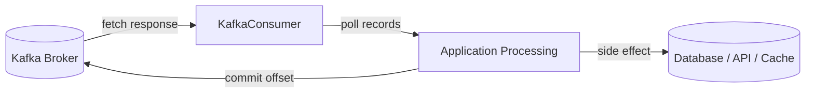

Record tidak hilang setelah consumer baca. Kafka tetap menyimpan record sampai retention policy menghapusnya. Yang berubah adalah posisi consumer group.

```text
Data position = offset in partition
Consumer progress = committed offset for group
```

---

## 2. Poll Loop Contract

Consumer loop minimal:

```java
try (KafkaConsumer<String, CaseEvent> consumer = new KafkaConsumer<>(props)) {
    consumer.subscribe(List.of("case.lifecycle.v1"));

    while (running.get()) {
        ConsumerRecords<String, CaseEvent> records = consumer.poll(Duration.ofMillis(500));

        for (ConsumerRecord<String, CaseEvent> record : records) {
            process(record);
        }

        consumer.commitSync();
    }
}
```

Ini terlihat sederhana, tetapi ada kontrak tersembunyi:

1. `poll()` harus dipanggil secara teratur.
2. Processing tidak boleh membuat consumer melewati `max.poll.interval.ms`.
3. Offset commit harus terjadi setelah side effect aman jika ingin at-least-once.
4. Rebalance bisa mencabut partition kapan saja saat membership berubah.
5. Consumer instance tidak boleh dipakai sembarangan lintas thread.
6. Shutdown harus memberi kesempatan commit progress terakhir.

### 2.1 Poll is Not Only Fetch

`poll()` bukan hanya mengambil record. Ia juga berhubungan dengan:

- group membership;
- heartbeat/coordinator interaction;
- partition assignment;
- rebalance callback;
- fetch request/response;
- internal state progress.

Jika loop berhenti terlalu lama, group coordinator bisa menganggap consumer tidak sehat dan memicu rebalance.

---

## 3. Consumer Group and Partition Assignment

Consumer group membagi partition antar member.

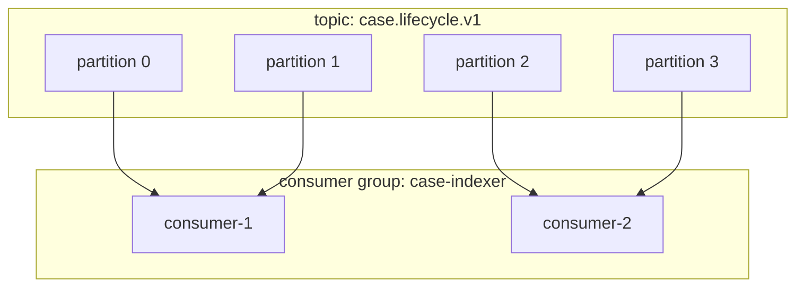

Rules penting:

- satu partition hanya dikonsumsi oleh satu consumer dalam group pada satu waktu;
- satu consumer bisa punya banyak partition;
- jika jumlah consumer > jumlah partition, sebagian consumer idle;
- group berbeda bisa membaca topic yang sama secara independen;
- offset disimpan per group-topic-partition.

### 3.1 Scaling Ceiling

Jika topic punya 6 partition, maka parallelism maksimum dalam satu consumer group adalah 6 active consumers.

```text
max active consumers in one group <= partition count
```

Menambah consumer ke-7 tidak menaikkan throughput group jika hanya ada 6 partition.

---

## 4. Offset: Posisi Baca, Bukan ID Record Global

Offset adalah posisi monotonik dalam satu partition.

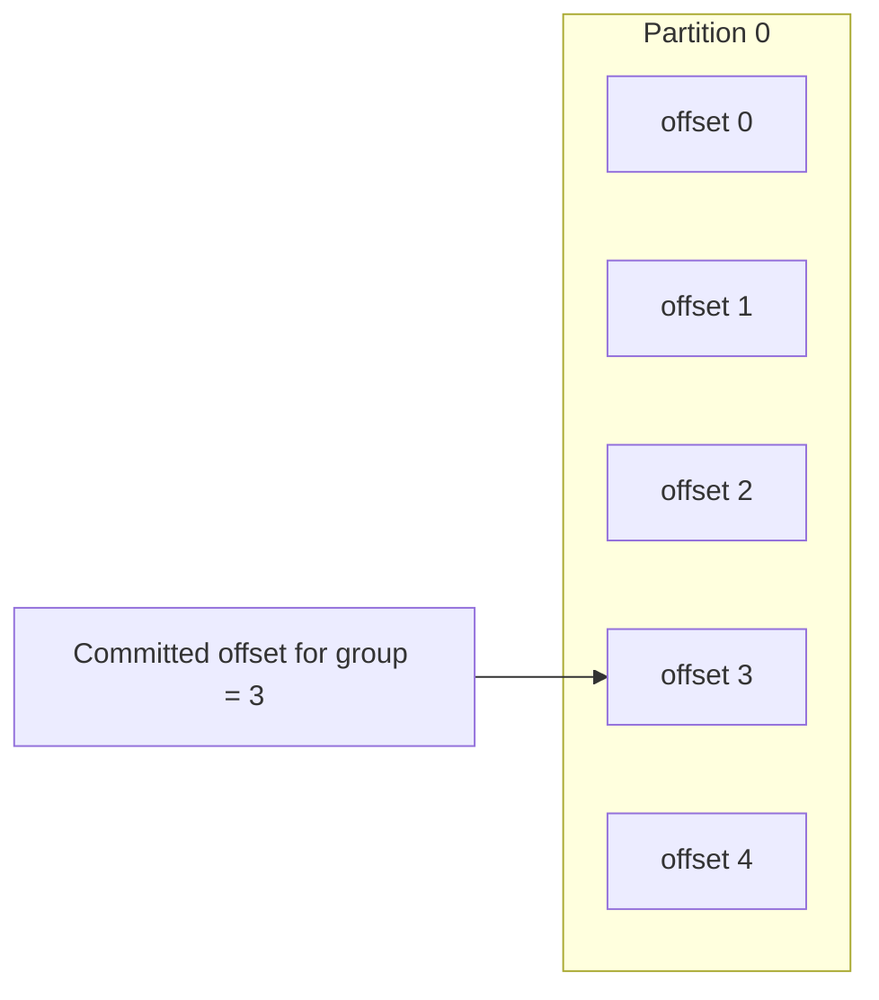

Kafka commit offset biasanya berarti “record sebelum offset ini sudah dianggap selesai”.

Jika commit offset 3, artinya consumer berikutnya mulai dari offset 3; offset 0, 1, 2 dianggap sudah diproses.

### 4.1 Offset Commit Bukan Transaction Bisnis

Commit offset hanya menyimpan progress consumer group.

Ia tidak otomatis menjamin:

- DB downstream sudah commit;
- HTTP call sukses;
- email terkirim;
- search index update selesai;
- audit write selesai.

Correctness tergantung urutan:

```text
process side effect successfully -> commit offset
```

Bukan sebaliknya.

---

## 5. Auto Commit: Nyaman Tetapi Berbahaya untuk Side Effect Berat

Konfigurasi:

```properties
enable.auto.commit=true
auto.commit.interval.ms=5000
```

Dengan auto commit, consumer akan commit offset berkala.

Problem: offset bisa tercommit sebelum record benar-benar selesai diproses application code.

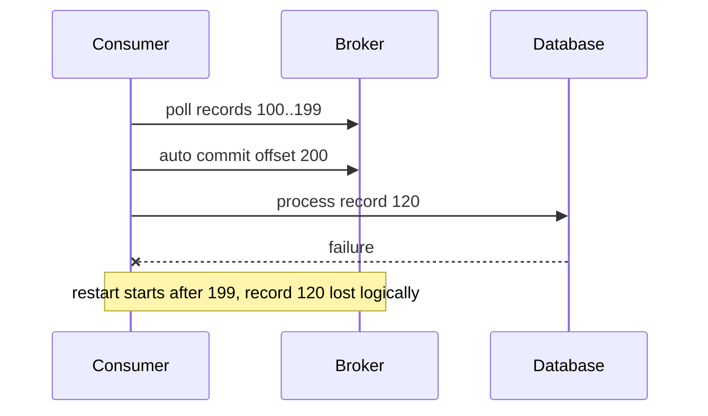

Auto commit cocok untuk:

- telemetry best-effort;
- stateless processing yang loss-tolerant;
- prototyping;
- monitoring stream yang tidak membuat side effect kritikal.

Auto commit tidak cocok untuk:

- payment;
- regulatory audit;
- case lifecycle;
- enforcement escalation;
- workflow state mutation;
- external side effect irreversible.

---

## 6. Manual Commit: At-Least-Once Baseline

Konfigurasi:

```properties
enable.auto.commit=false
```

Pattern:

```java
while (running.get()) {
    ConsumerRecords<String, CaseEvent> records = consumer.poll(Duration.ofMillis(500));

    for (ConsumerRecord<String, CaseEvent> record : records) {
        processIdempotently(record);
    }

    consumer.commitSync();
}
```

Guarantee:

- jika process sukses lalu commit sukses, progress maju;
- jika process sukses tetapi commit gagal lalu consumer restart, record bisa diproses ulang;
- karena itu consumer harus idempotent.

### 6.1 Failure Window At-Least-Once

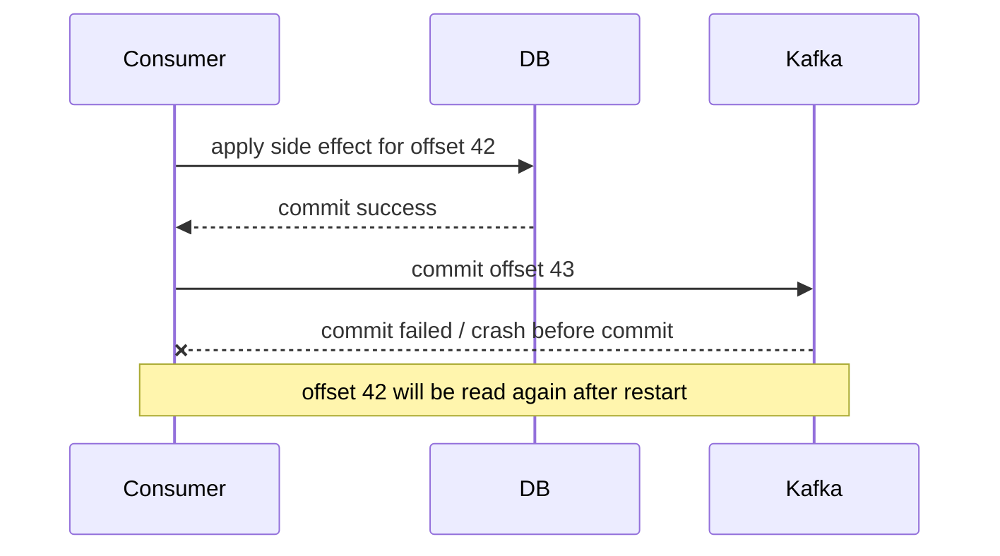

At-least-once berarti duplicate processing mungkin terjadi.

Untuk domain serius:

```text
At-least-once without idempotency is duplicate side-effect waiting to happen.
```

---

## 7. `commitSync()` vs `commitAsync()`

### 7.1 `commitSync()`

```java
consumer.commitSync();
```

Karakter:

- blocking;
- caller tahu sukses/gagal;
- lebih sederhana untuk correctness;
- bisa menurunkan throughput jika terlalu sering.

Gunakan untuk:

- shutdown final commit;
- batch boundary penting;
- simpler at-least-once loop;
- rebalance callback sebelum partition dicabut.

### 7.2 `commitAsync()`

```java
consumer.commitAsync((offsets, exception) -> {
    if (exception != null) {
        log.warn("Async commit failed offsets={}", offsets, exception);
    }
});
```

Karakter:

- non-blocking;
- throughput lebih baik;
- failure callback tidak otomatis retry aman;
- commit callback bisa datang out-of-order.

Risiko:

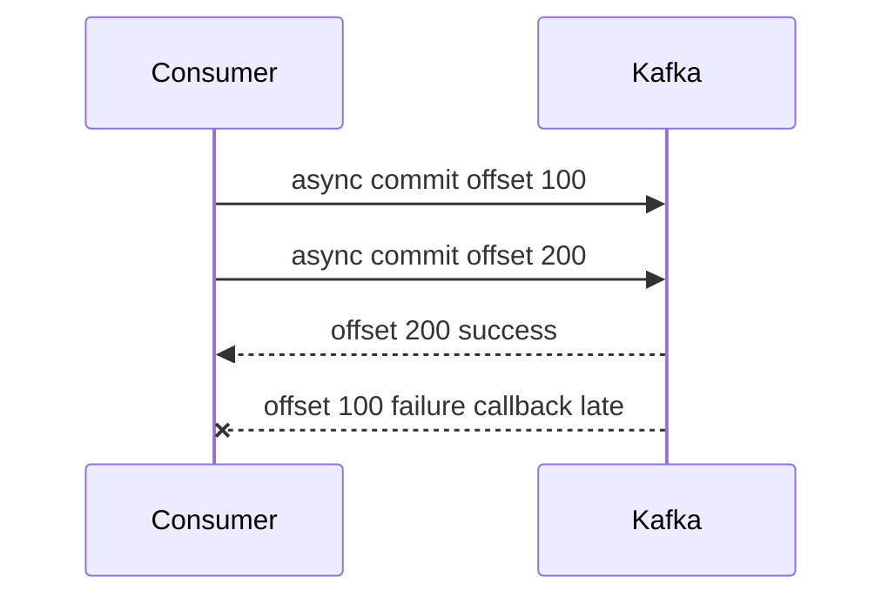

Jika retry naïve offset 100 setelah offset 200, progress mundur secara logis.

Pattern umum:

- gunakan async commit selama steady state;
- gunakan sync commit saat shutdown/rebalance;
- track offset monotonic;
- jangan retry async commit lama tanpa guard.

---

## 8. Commit Per Partition

ConsumerRecords bisa berisi record dari banyak partition. Jika processing per partition berbeda speed, commit global batch bisa terlalu kasar.

Gunakan commit map:

```java
Map<TopicPartition, OffsetAndMetadata> offsetsToCommit = new HashMap<>();

for (TopicPartition partition : records.partitions()) {
    List<ConsumerRecord<String, CaseEvent>> partitionRecords = records.records(partition);

    for (ConsumerRecord<String, CaseEvent> record : partitionRecords) {
        processIdempotently(record);
    }

    long nextOffset = partitionRecords.get(partitionRecords.size() - 1).offset() + 1;
    offsetsToCommit.put(partition, new OffsetAndMetadata(nextOffset));
}

consumer.commitSync(offsetsToCommit);
```

Kelebihan:

- progress bisa disimpan per partition;
- failure satu partition tidak harus menahan semua partition;
- cocok untuk pause/resume per partition;
- lebih presisi untuk batch processing.

Kekurangan:

- code lebih kompleks;
- harus menjaga ordering per partition;
- harus hati-hati pada partial failure.

---

## 9. Rebalance: Saat Ownership Partition Berubah

Rebalance terjadi ketika:

- consumer join group;
- consumer leave group;
- consumer crash;
- `max.poll.interval.ms` dilanggar;
- session timeout;
- topic partition berubah;
- subscription berubah;
- coordinator berubah.

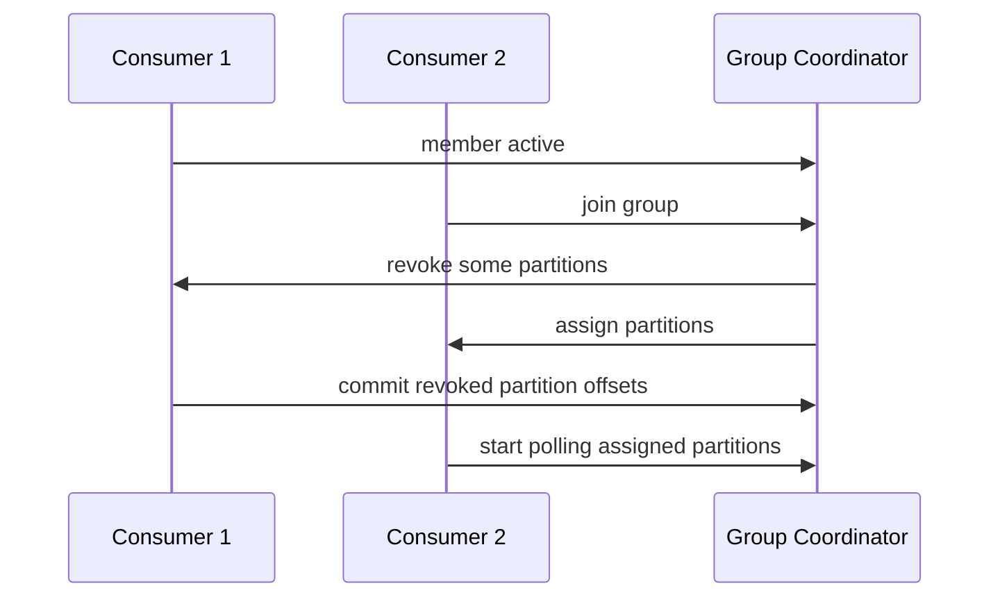

Rebalance bukan error. Rebalance adalah mekanisme normal. Tetapi rebalance yang terlalu sering adalah incident.

### 9.1 ConsumerRebalanceListener

Gunakan listener jika perlu commit/flush sebelum partition dicabut.

```java
consumer.subscribe(List.of("case.lifecycle.v1"), new ConsumerRebalanceListener() {
    @Override
    public void onPartitionsRevoked(Collection<TopicPartition> partitions) {
        log.info("Partitions revoked: {}", partitions);
        consumer.commitSync(currentOffsetsFor(partitions));
    }

    @Override
    public void onPartitionsAssigned(Collection<TopicPartition> partitions) {
        log.info("Partitions assigned: {}", partitions);
    }
});
```

Tujuan utama:

- commit offset terakhir untuk partition yang dicabut;
- flush state lokal;
- close resources partition-specific;
- initialize state untuk partition baru;
- seek ke offset khusus jika external offset storage dipakai.

### 9.2 Cooperative Rebalancing

Rebalance modern bisa lebih incremental/cooperative, sehingga tidak semua partition harus dicabut dari semua consumer setiap perubahan kecil.

Namun mental model tetap:

```text
Partition ownership can change. Your consumer must survive it.
```

---

## 10. Heartbeat, Session Timeout, and Max Poll Interval

Ada tiga konsep waktu yang sering membingungkan.

| Config | Makna |
|---|---|
| `heartbeat.interval.ms` | seberapa sering consumer mengirim heartbeat ke coordinator |
| `session.timeout.ms` | berapa lama coordinator menunggu heartbeat sebelum consumer dianggap mati |
| `max.poll.interval.ms` | maksimum jeda antar pemanggilan `poll()` saat memakai group management |

Konsekuensi:

- jika heartbeat berhenti terlalu lama, session timeout;
- jika aplikasi terlalu lama memproses tanpa `poll()`, max poll interval bisa terlampaui;
- jika max poll interval terlampaui, consumer dianggap tidak sehat untuk assignment;
- processing lama harus dipecah, dibatasi, atau dipindahkan ke worker model yang tetap menjaga poll loop.

### 10.1 Anti-Pattern: Long Blocking Processing Inside Poll Loop

```java
for (ConsumerRecord<String, CaseEvent> record : records) {
    callSlowExternalApi(record); // can take minutes
}

consumer.commitSync();
```

Jika batch besar dan API lambat, loop tidak memanggil `poll()` cukup cepat.

Akibat:

- rebalance;
- partition dicabut;
- duplicate processing;
- commit failure;
- group instability;
- lag naik.

---

## 11. `max.poll.records`: Ukuran Batch Application

Konfigurasi:

```properties
max.poll.records=500
```

Ini membatasi jumlah record yang dikembalikan per `poll()`.

Tuning:

| Jika | Turunkan | Naikkan |
|---|---|---|
| processing lambat | yes | no |
| external API latency tinggi | yes | no |
| CPU processing ringan | maybe | yes |
| throughput rendah dan consumer sehat | no | yes |
| max poll interval sering terlampaui | yes | no |

Formula kasar:

```text
max.poll.records * p99_processing_time_per_record < max.poll.interval.ms safety budget
```

Contoh:

```text
p99 processing = 200 ms
max.poll.records = 500
worst-case batch = 100,000 ms = 100 sec
max.poll.interval.ms = 300,000 ms
```

Masih aman secara interval, tetapi p99 batch 100 detik mungkin buruk untuk latency.

---

## 12. Backpressure in Consumer

Consumer backpressure berarti consumer sengaja mengontrol fetch/processing agar downstream tidak collapse.

Tools:

- `max.poll.records`;
- `fetch.min.bytes` dan `fetch.max.wait.ms`;
- `pause()` / `resume()` partition;
- worker pool bounded queue;
- rate limiter;
- circuit breaker untuk downstream;
- retry topic/DLQ;
- scale consumer group;
- increase partition count bila arsitektural perlu.

### 12.1 `pause()` and `resume()`

Contoh:

```java
if (workerQueue.remainingCapacity() < LOW_WATERMARK) {
    consumer.pause(consumer.assignment());
}

if (workerQueue.remainingCapacity() > HIGH_WATERMARK) {
    consumer.resume(consumer.assignment());
}
```

Catatan:

- tetap panggil `poll()` agar heartbeat/group management jalan;
- jangan pause selamanya tanpa alert;
- track lag saat partition paused;
- commit offset hanya setelah processing selesai.

---

## 13. Worker Pool Pattern: Kuat tetapi Berbahaya Jika Salah Commit

Banyak sistem ingin poll cepat, lalu memproses di worker pool.

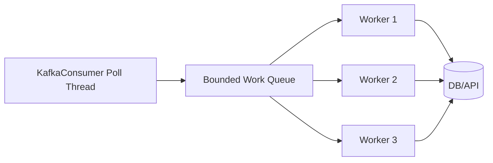

Problem utama: ordering dan offset commit.

Jika partition yang sama diproses paralel, offset 12 bisa selesai sebelum offset 10.

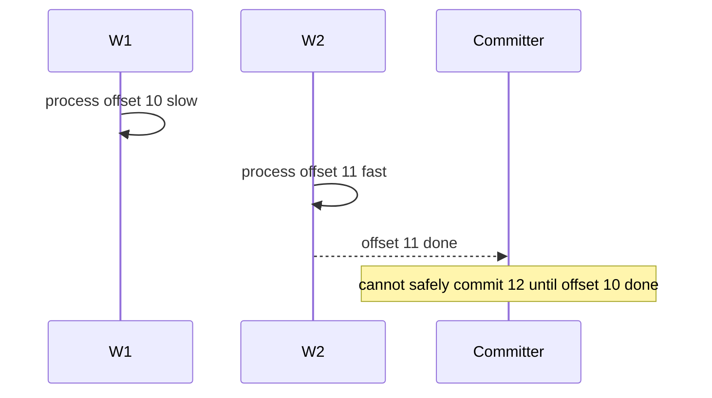

### 13.1 Safe Worker Model

Pilihan aman:

1. single-thread processing per partition;
2. partition-affine worker;
3. track contiguous completed offset per partition;
4. commit hanya offset tertinggi yang semua sebelumnya selesai;
5. pause partition jika in-flight terlalu banyak;
6. handle rebalance dengan drain/commit/revoke.

Partition-affine model:

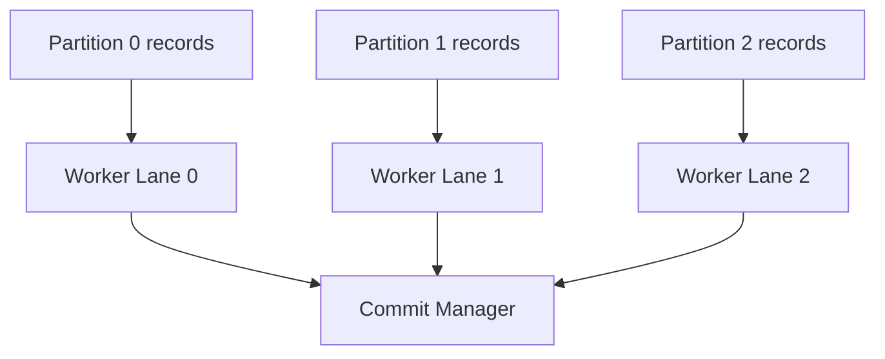

---

## 14. Idempotent Consumer Pattern

At-least-once consumer harus idempotent.

Minimal DB-backed pattern:

```sql
CREATE TABLE processed_event (
    consumer_name VARCHAR(128) NOT NULL,
    event_id VARCHAR(128) NOT NULL,
    processed_at TIMESTAMP NOT NULL,
    topic VARCHAR(255) NOT NULL,
    partition_id INT NOT NULL,
    offset_value BIGINT NOT NULL,
    PRIMARY KEY (consumer_name, event_id)
);
```

Processing:

```java
@Transactional
public void processIdempotently(ConsumerRecord<String, CaseEvent> record) {
    CaseEvent event = record.value();

    boolean firstTime = processedEventRepository.tryInsert(
        "case-indexer",
        event.eventId(),
        record.topic(),
        record.partition(),
        record.offset()
    );

    if (!firstTime) {
        return;
    }

    caseProjectionRepository.apply(event);
}
```

Commit offset setelah DB transaction sukses.

### 14.1 Natural Idempotency

Kadang operation natural idempotent:

```sql
UPDATE case_projection
SET status = 'ESCALATED'
WHERE case_id = ?
  AND status <> 'ESCALATED';
```

Tetapi hati-hati: natural idempotency sering gagal jika event punya additive effect:

- increment counter;
- append audit row;
- send notification;
- call external API;
- create child entity.

Untuk additive effect, gunakan event ID dedup.

---

## 15. Retry Strategy: Jangan Infinite Retry di Poll Loop

Anti-pattern:

```java
while (true) {
    try {
        process(record);
        break;
    } catch (Exception e) {
        Thread.sleep(1000);
    }
}
```

Masalah:

- partition stuck;
- poll interval terlampaui;
- lag membesar;
- semua event setelah poison pill tertahan;
- consumer group rebalance storm.

### 15.1 Retry Classification

| Error | Action |
|---|---|
| transient DB connection | short bounded retry |
| downstream 429 | backoff + pause/resume or retry topic |
| validation/schema bug | DLQ/quarantine |
| missing reference eventually available | delayed retry topic |
| poison event | quarantine + alert |
| authorization/config | stop consumer + page |

### 15.2 Retry Topic Pattern

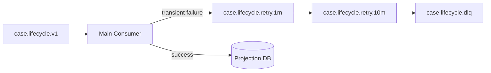

Jangan commit main offset sebelum memastikan failed record sudah aman dipindah ke retry topic/DLQ.

Untuk transaksi consume-process-produce, Kafka transactions bisa membantu, tetapi external DB/API tetap butuh idempotency/outbox/inbox discipline.

---

## 16. Consumer Lag: Signal, Not Diagnosis

Lag adalah selisih antara end offset partition dan committed/current position consumer.

```text
lag = log end offset - consumer committed offset
```

Lag naik bisa berarti:

- producer volume meningkat;
- consumer processing lambat;
- consumer down;
- partition hotspot;
- downstream DB lambat;
- retry storm;
- rebalance storm;
- commit macet;
- network/broker fetch lambat.

Jangan diagnosis hanya dari lag total. Lihat per partition.

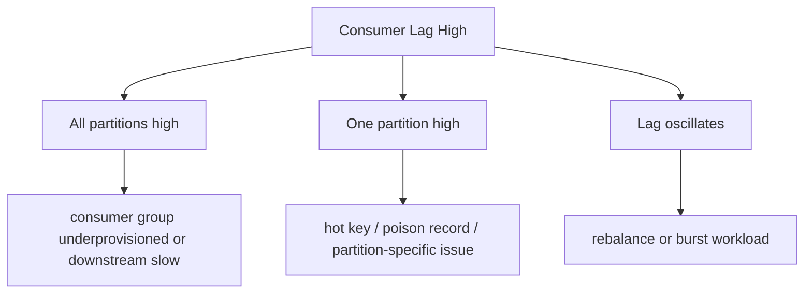

Metrics tambahan:

- records consumed/sec;
- records processed/sec;
- processing latency p95/p99;
- commit latency;
- rebalance count;
- assigned partitions;
- poll idle ratio;
- fetch latency;
- DLQ rate;
- retry topic rate;
- downstream error rate.

---

## 17. Graceful Shutdown

Shutdown buruk menyebabkan duplicate dan lost progress symptoms.

Pattern:

```java
AtomicBoolean running = new AtomicBoolean(true);

Runtime.getRuntime().addShutdownHook(new Thread(() -> {
    running.set(false);
    consumer.wakeup();
}));

try {
    while (running.get()) {
        ConsumerRecords<String, CaseEvent> records = consumer.poll(Duration.ofMillis(500));
        processBatch(records);
        consumer.commitSync();
    }
} catch (WakeupException e) {
    if (running.get()) {
        throw e;
    }
} finally {
    try {
        consumer.commitSync();
    } finally {
        consumer.close();
    }
}
```

Shutdown steps:

1. stop accepting new work;
2. wake poll;
3. finish in-flight records within budget;
4. commit completed offsets;
5. close consumer;
6. expose shutdown timeout metric.

---

## 18. Reprocessing and Seeking

Kafka consumer bisa seek ke offset tertentu.

Use cases:

- replay projection;
- rebuild index;
- recover from bad deployment;
- reprocess DLQ after fix;
- forensic investigation;
- compare old/new processor output.

Example:

```java
TopicPartition tp = new TopicPartition("case.lifecycle.v1", 0);
consumer.assign(List.of(tp));
consumer.seek(tp, 12345L);
```

Caution:

- replay bisa menghasilkan duplicate side effect;
- gunakan idempotency;
- jangan replay production consumer group tanpa change plan;
- gunakan group baru untuk rebuild read model;
- pastikan retention masih menyimpan data;
- pastikan schema lama masih bisa dibaca.

---

## 19. Consumer Configuration Profiles

### 19.1 Safe Business Consumer

```properties
bootstrap.servers=kafka-a:9092,kafka-b:9092,kafka-c:9092
group.id=case-projection-service
client.id=case-projection-consumer-1

enable.auto.commit=false
auto.offset.reset=earliest
max.poll.records=200
max.poll.interval.ms=300000
session.timeout.ms=45000
heartbeat.interval.ms=15000

key.deserializer=org.apache.kafka.common.serialization.StringDeserializer
value.deserializer=com.company.kafka.CaseEventDeserializer

isolation.level=read_committed
```

Bias:

- manual commit;
- bounded batch;
- safe for transactional producers if used;
- enough poll interval for controlled processing;
- explicit group id.

### 19.2 Low-Latency Consumer

```properties
enable.auto.commit=false
max.poll.records=50
fetch.min.bytes=1
fetch.max.wait.ms=50
max.poll.interval.ms=120000
```

Bias:

- smaller batches;
- faster fetch return;
- lower processing latency;
- lower throughput efficiency.

### 19.3 High-Throughput Batch Consumer

```properties
enable.auto.commit=false
max.poll.records=1000
fetch.min.bytes=65536
fetch.max.wait.ms=500
max.poll.interval.ms=600000
```

Bias:

- larger fetch/batch;
- better throughput;
- higher per-record latency;
- must ensure processing time stays within interval.

---

## 20. Common Anti-Patterns

### 20.1 Auto Commit with Non-Idempotent Side Effect

Symptom:

- event appears consumed;
- DB update missing;
- no retry;
- audit gap.

Fix:

- disable auto commit;
- process idempotently;
- commit after success.

### 20.2 Processing Too Long in Poll Thread

Symptom:

- max poll exceeded;
- rebalance storm;
- duplicate processing;
- unstable lag.

Fix:

- reduce `max.poll.records`;
- use bounded worker model;
- pause/resume;
- move slow operation to retry workflow;
- increase interval only after design review.

### 20.3 Commit Before Side Effect

Symptom:

- logical data loss.

Fix:

```text
side effect commit first, Kafka offset commit second
```

Then handle duplicate through idempotency.

### 20.4 Parallel Processing Without Partition Offset Discipline

Symptom:

- out-of-order state;
- committing offset past unfinished record;
- missing retry after crash.

Fix:

- partition-affine worker;
- contiguous offset tracker;
- commit only safe offsets.

### 20.5 Infinite Local Retry

Symptom:

- partition stuck;
- lag increases forever;
- poisoned event blocks all later events in same partition.

Fix:

- retry budget;
- DLQ/quarantine;
- delayed retry topic;
- alert.

### 20.6 Ignoring Rebalance Listener with External Offset/State

Symptom:

- duplicate after rebalance;
- state cache corruption;
- offset not flushed.

Fix:

- implement listener;
- commit/flush revoked partitions;
- initialize assigned partitions.

---

## 21. Design Review Checklist

Untuk consumer baru, jawab:

1. Apa group id?
2. Apakah consumer membuat side effect?
3. Apakah side effect idempotent?
4. Apakah auto commit dimatikan?
5. Kapan offset di-commit?
6. Apakah commit per batch atau per partition?
7. Berapa `max.poll.records` dan mengapa?
8. Apa p95/p99 processing time per record?
9. Apakah `max.poll.interval.ms` cukup dengan safety margin?
10. Bagaimana transient failure ditangani?
11. Bagaimana poison event ditangani?
12. Apakah DLQ punya owner dan replay process?
13. Apakah rebalancing aman?
14. Apakah shutdown commit progress terakhir?
15. Apa metric lag per partition?
16. Apa alert untuk rebalance storm?
17. Bagaimana replay dilakukan tanpa duplicate side effect?
18. Bagaimana schema lama dibaca?
19. Apa impact jika satu partition hotspot?
20. Apa runbook jika consumer lag tinggi?

---

## 22. Mini Lab

### Lab 1 — Auto Commit Failure

1. Buat consumer dengan `enable.auto.commit=true`.
2. Poll 100 record.
3. Simulasikan crash setelah auto commit tetapi sebelum processing semua record.
4. Restart consumer.
5. Amati record yang tidak diproses tetapi offset sudah maju.

Tujuan: memahami logical loss.

### Lab 2 — Manual Commit Duplicate

1. Disable auto commit.
2. Process record ke DB dengan event ID dedup.
3. Crash setelah DB commit sebelum Kafka commit.
4. Restart.
5. Amati record diproses ulang tetapi side effect tidak duplicate.

Tujuan: memahami at-least-once + idempotency.

### Lab 3 — Max Poll Interval

1. Set `max.poll.records=500`.
2. Tambahkan sleep 1 detik per record.
3. Amati rebalance.
4. Turunkan `max.poll.records` atau pindahkan ke worker pattern.

Tujuan: memahami poll-loop liveness.

### Lab 4 — Rebalance Listener

1. Jalankan consumer group dengan satu consumer.
2. Tambah consumer kedua.
3. Log `onPartitionsRevoked` dan `onPartitionsAssigned`.
4. Commit offsets pada revoke.
5. Amati assignment berubah.

Tujuan: memahami partition ownership.

### Lab 5 — Hot Partition Diagnosis

1. Publish 100.000 record dengan key sama.
2. Jalankan consumer group dengan banyak consumer.
3. Amati hanya satu partition lag tinggi.
4. Ubah key distribution.

Tujuan: memahami batas scaling akibat key/partition.

---

## 23. Ringkasan

Kafka consumer adalah mesin ownership dan progress.

Core invariants:

```text
A consumer owns partitions temporarily.
A committed offset is a claim of completed progress.
Rebalance can change ownership.
Processing can duplicate.
Idempotency makes duplication survivable.
```

Consumer production-grade tidak cukup hanya bisa `poll()` dan `forEach(process)`.

Ia harus punya:

- manual commit discipline;
- idempotent processing;
- bounded retry;
- DLQ/quarantine;
- rebalance handling;
- graceful shutdown;
- backpressure strategy;
- lag observability;
- replay plan.

Pertanyaan top-level untuk design review:

```text
Jika consumer crash di setiap titik antara fetch, process, side effect, and commit, apakah sistem tetap benar?
```
