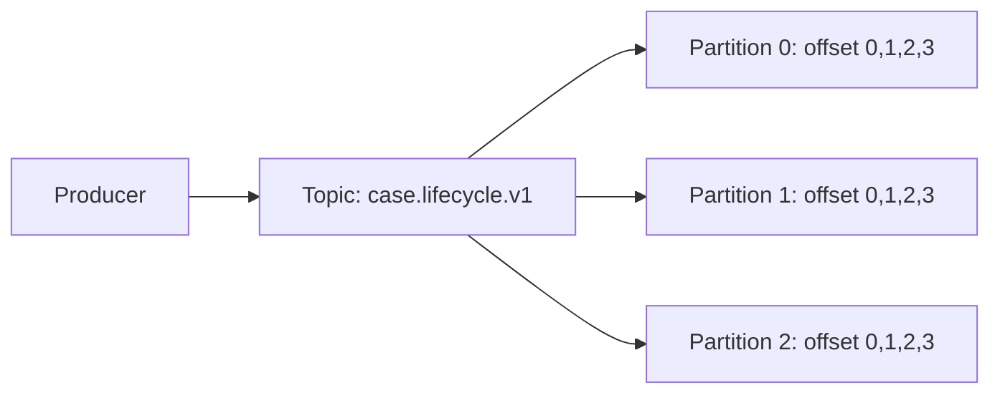
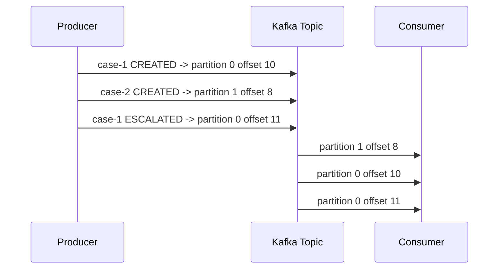
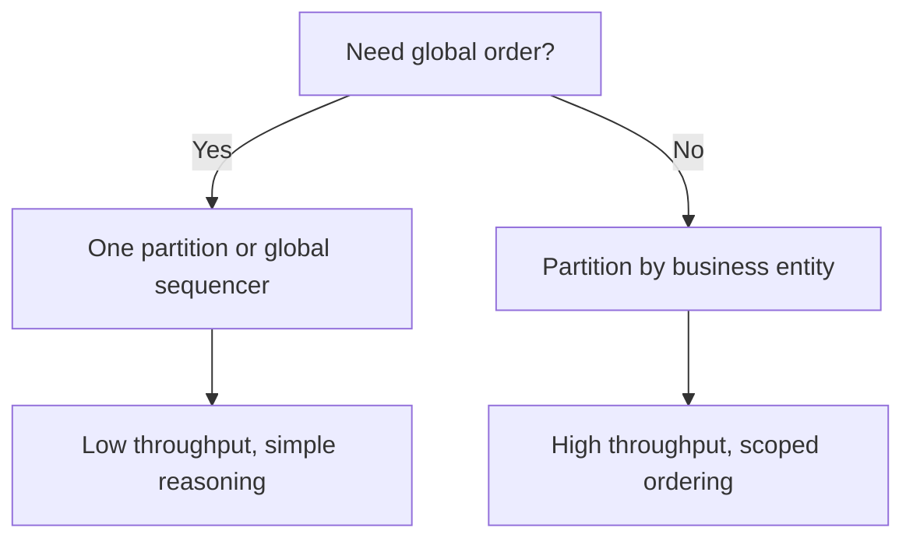
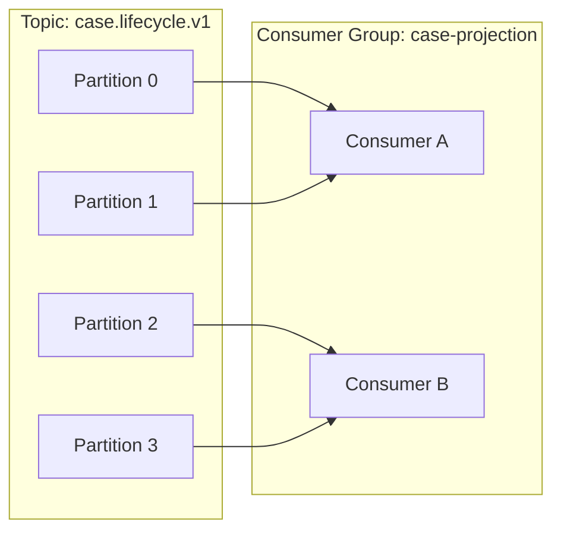
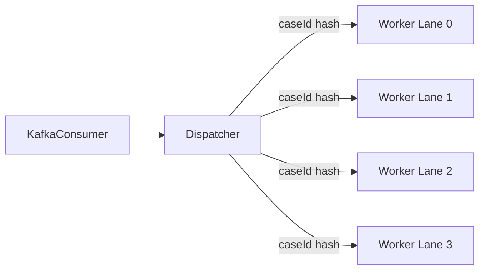
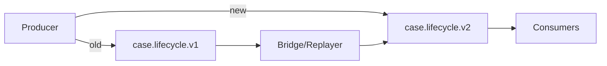
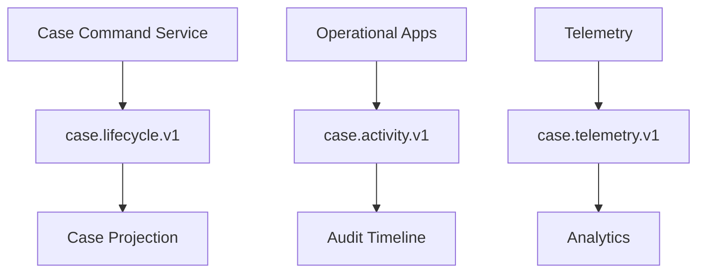
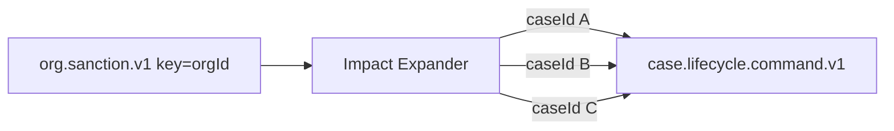
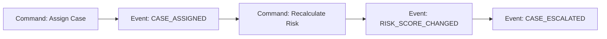

------
title: Learn Java Messaging and Event Streaming - Part 019
description: Kafka ordering, partitioning, message keys, entity affinity, hot partition avoidance, repartitioning strategy, and business-order correctness for Java event-driven systems.
series: learn-java-messaging-event-streaming
seriesTitle: Learn Java Messaging and Event Streaming
order: 19
partTitle: Kafka Ordering, Partitioning, Keys, and Hotspot Avoidance
tags:
- java
- kafka
- apache-kafka
- partitioning
- ordering
- message-key
- hot-partition
- consumer-group
- scalability
- event-streaming
- distributed-systems
date: 2026-06-28
---

# Part 019 — Kafka Ordering, Partitioning, Keys, and Hotspot Avoidance

## Tujuan Bagian Ini

Kafka terlihat sederhana: producer mengirim record ke topic, consumer membaca record dari topic.

Masalahnya, sistem produksi jarang gagal karena engineer tidak tahu cara memanggil `producer.send()`. Sistem produksi lebih sering gagal karena engineer salah menjawab pertanyaan berikut:

- record mana yang harus punya urutan ketat?
- key apa yang menjadi boundary ordering?
- apakah ordering yang dimaksud adalah append order, business sequence, event time, atau causal order?
- apakah partition key menciptakan hotspot?
- apakah consumer boleh memproses beberapa record secara paralel?
- apa yang terjadi saat partition count berubah?
- apakah retry, rebalance, producer concurrency, dan external side effect bisa mengacak efek bisnis?

Bagian ini membangun mental model untuk mendesain ordering dan partitioning Kafka secara sadar, bukan berdasarkan kebiasaan.

Setelah bagian ini, kamu harus bisa:

1. Menjelaskan kenapa Kafka memberi ordering **per partition**, bukan global per topic.
2. Memilih message key berdasarkan invariant bisnis.
3. Mendeteksi dan menghindari hot partition.
4. Mendesain consumer parallelism tanpa merusak ordering.
5. Membedakan broker order, business order, event-time order, dan causal order.
6. Mendesain migrasi repartitioning tanpa menghancurkan downstream consumer.
7. Membuat review checklist untuk topik Kafka yang punya constraint ordering.

---

## 1. Mental Model Utama

Kafka topic adalah kumpulan partition.

Setiap partition adalah log berurutan.



Ordering kuat berlaku di dalam satu partition.

Tidak ada ordering total yang stabil lintas semua partition di satu topic.

Artinya:

```text
same partition  -> ordered by offset
across partition -> no global order guarantee
```

Kalau dua event harus diproses berurutan, keduanya harus masuk ke partition yang sama, atau aplikasi harus punya mekanisme ordering sendiri.

---

## 2. Kafka Ordering Guarantee yang Sebenarnya

Kafka menjamin bahwa record dalam satu partition memiliki offset yang meningkat monoton.

```text
partition 3:
offset 101 -> CASE_OPENED
offset 102 -> CASE_ASSIGNED
offset 103 -> CASE_ESCALATED
```

Consumer yang membaca partition tersebut akan melihat record sesuai order offset.

Namun Kafka tidak menjamin bahwa record di partition 3 offset 102 “lebih dulu secara bisnis” daripada record di partition 4 offset 10. Partition berbeda punya timeline log berbeda.



Urutan konsumsi lintas partition bisa berbeda karena fetch scheduling, consumer assignment, processing time, dan downstream delay.

---

## 3. Empat Jenis Ordering yang Sering Tercampur

Banyak desain Kafka kacau karena satu kata “order” dipakai untuk beberapa konsep berbeda.

### 3.1 Append Order

Append order adalah urutan record masuk ke satu partition.

```text
partition=7 offset=200 before partition=7 offset=201
```

Ini ordering yang Kafka berikan secara natural.

### 3.2 Business Order

Business order adalah urutan transisi domain yang benar.

```text
CASE_OPENED -> CASE_ASSIGNED -> CASE_REVIEWED -> CASE_ESCALATED -> CASE_CLOSED
```

Kafka tidak tahu apakah `CASE_CLOSED` boleh muncul sebelum `CASE_REVIEWED`. Aplikasi yang harus memvalidasi.

### 3.3 Event-Time Order

Event-time order adalah urutan berdasarkan waktu kejadian domain.

```json
{
  "eventType": "CASE_ESCALATED",
  "occurredAt": "2026-06-28T09:15:00+07:00"
}
```

Event-time bisa berbeda dari append-time. Event lama bisa baru dipublish setelah sistem recovery.

### 3.4 Causal Order

Causal order adalah relasi sebab-akibat.

```text
EvidenceSubmitted caused RiskScoreRecalculated
RiskScoreRecalculated caused EnforcementEscalated
```

Causal order sering perlu `causationId`, `correlationId`, dan domain version.

---

## 4. Rule Paling Penting: Key adalah Boundary Ordering

Kafka producer memilih partition berdasarkan record key, default partitioner, atau explicit partition.

Secara praktis:

```text
same key -> same partition, as long as partition count and partitioner remain compatible
same partition -> ordered by offset
```

Jadi key bukan sekadar metadata. Key adalah keputusan arsitektural.

Contoh event case-management:

```java
ProducerRecord<String, CaseLifecycleEvent> record = new ProducerRecord<>(
    "case.lifecycle.v1",
    event.caseId(),
    event
);
producer.send(record);
```

Dengan key `caseId`, semua event untuk case yang sama diarahkan ke partition yang sama.

```text
case-123 OPENED    -> partition 4 offset 80
case-123 ASSIGNED  -> partition 4 offset 81
case-123 ESCALATED -> partition 4 offset 82
```

Ini memberi ordering per case.

---

## 5. Cara Memilih Message Key

Key yang baik menjawab pertanyaan:

> “Unit bisnis apa yang tidak boleh diproses secara out-of-order?”

Beberapa kandidat umum:

| Domain | Key yang Mungkin | Ordering Scope |
|---|---:|---|
| Regulatory case lifecycle | `caseId` | Semua event per case |
| Enforcement action | `enforcementActionId` | Semua event per action |
| Customer ledger | `accountId` | Semua mutation per account |
| Payment | `paymentId` | Lifecycle per payment |
| Investigation | `investigationId` | Semua activity per investigation |
| Tenant analytics | `tenantId` | Semua event tenant, berisiko hotspot |
| Notification delivery | `recipientId` | Semua delivery per recipient |

Key yang buruk biasanya terlalu luas atau terlalu sempit.

Terlalu luas:

```text
key = tenantId
```

Kalau satu tenant sangat besar, satu partition akan panas.

Terlalu sempit:

```text
key = random UUID per event
```

Throughput bagus, tetapi ordering entity hilang.

---

## 6. Aggregate Root sebagai Default Heuristic

Dalam domain-driven thinking, key sering cocok dengan aggregate root.

Untuk case-management:

```text
Case adalah aggregate root.
CaseEvent.key = caseId.
```

Alasannya:

1. State transition case harus konsisten.
2. Duplicate handling biasanya per case.
3. Replay per case masuk akal.
4. Consumer bisa membangun local projection per case.
5. Cross-case ordering jarang benar-benar dibutuhkan.

Namun heuristic ini bukan hukum. Kalau throughput `caseId` terlalu skewed, atau satu case bisa punya ribuan sub-workflow paralel, key mungkin perlu lebih granular.

---

## 7. Jangan Menuntut Global Order Kecuali Terpaksa

Global order berarti semua record harus masuk ke satu partition, atau kamu harus membangun sequencer global.



Global order mahal karena membatasi parallelism.

Satu partition berarti:

- satu leader partition;
- satu ordered log;
- consumer group efektif hanya satu active consumer untuk partition itu;
- scaling horizontal terbatas;
- recovery lebih lambat jika backlog besar.

Dalam banyak sistem, yang sebenarnya dibutuhkan bukan global order, melainkan **per-entity order**.

---

## 8. Ordering dan Consumer Group Parallelism

Consumer group membagi partition ke consumer.



Dalam satu consumer group, satu partition hanya diassign ke satu consumer pada satu waktu.

Konsekuensi:

```text
max active consumers for one group <= partition count
```

Kalau topic punya 12 partition, group bisa punya maksimal 12 consumer aktif yang membaca partition berbeda. Consumer ke-13 idle.

---

## 9. Processing Paralel di Dalam Consumer Bisa Merusak Ordering

Kafka memberi record berurutan dari partition. Aplikasi bisa tetap merusaknya.

Contoh anti-pattern:

```java
for (ConsumerRecord<String, CaseEvent> record : records) {
    executor.submit(() -> process(record));
}
```

Kalau record untuk key yang sama masuk berurutan, tetapi diproses oleh thread pool bebas, hasilnya bisa out-of-order.

```text
poll result:
  offset 100 CASE_ASSIGNED
  offset 101 CASE_ESCALATED

thread pool result:
  offset 101 selesai dulu
  offset 100 selesai belakangan
```

Kalau downstream side effect tidak idempotent dan tidak memvalidasi version, state bisa rusak.

---

## 10. Pattern: Partition-Sequential Consumer

Pattern paling aman untuk strict ordering:

```java
while (running.get()) {
    ConsumerRecords<String, CaseEvent> records = consumer.poll(Duration.ofMillis(500));

    for (TopicPartition tp : records.partitions()) {
        List<ConsumerRecord<String, CaseEvent>> partitionRecords = records.records(tp);
        for (ConsumerRecord<String, CaseEvent> record : partitionRecords) {
            process(record); // sequential per partition
        }
        commitAfterPartition(tp, lastOffset(partitionRecords));
    }
}
```

Kelebihan:

- sederhana;
- ordering per partition aman;
- offset commit mudah;
- failure reasoning jelas.

Kekurangan:

- throughput per partition dibatasi processing serial;
- satu slow record menahan record berikutnya di partition itu;
- perlu partition count cukup.

---

## 11. Pattern: Key-Serial, Partition-Parallel Worker

Kalau satu partition berisi banyak key dan kamu butuh throughput lebih tinggi, gunakan worker pool yang menjaga serialisasi per key.



Rule:

```text
same key -> same worker lane -> sequential processing
```

Namun offset commit menjadi lebih sulit. Kamu tidak boleh commit offset N kalau offset sebelumnya di partition yang sama belum selesai.

Untuk correctness, kamu perlu tracker per partition:

```text
partition 2 offsets processed:
100 done
101 running
102 done
103 done

safe committed offset = 101? No.
safe commit next offset = 101 only after 101 done.
```

Kafka commit menyimpan **next offset to read**, bukan offset terakhir yang selesai.

---

## 12. Hot Partition: Masalah yang Tidak Terlihat di Unit Test

Hot partition terjadi ketika distribusi key tidak seimbang.

```text
partition 0:  2 MB/s
partition 1:  3 MB/s
partition 2: 45 MB/s  <- hot
partition 3:  2 MB/s
```

Akibat:

- latency partition panas naik;
- broker leader partition itu lebih sibuk;
- consumer lag naik hanya di partition tertentu;
- consumer group terlihat “punya cukup instance”, tapi satu partition tetap bottleneck;
- storage dan network tidak rata;
- rebalance tidak menyelesaikan masalah karena satu partition tetap hanya bisa dimiliki satu consumer.

Hot partition sering muncul karena key seperti:

- `tenantId` untuk multi-tenant platform;
- `countryCode`;
- `eventType`;
- `status`;
- `null` key dengan pattern producer tertentu;
- `caseId` ketika ada beberapa mega-case yang dominan.

---

## 13. Cara Mendeteksi Hot Partition

Jangan hanya lihat total topic throughput.

Lihat per partition:

- bytes in per partition;
- records in per partition;
- leader partition distribution per broker;
- consumer lag per partition;
- fetch latency per partition;
- produce request latency per broker;
- record size distribution;
- key cardinality;
- top keys by event count.

Checklist diagnosis:

```text
[ ] Apakah lag hanya naik di partition tertentu?
[ ] Apakah satu broker memimpin terlalu banyak hot partitions?
[ ] Apakah key cardinality rendah?
[ ] Apakah ada tenant/entity dominan?
[ ] Apakah producer mengirim null key?
[ ] Apakah partition count terlalu kecil untuk throughput aktual?
[ ] Apakah record besar terkonsentrasi di satu key?
```

---

## 14. Hotspot Mitigation Strategy

Tidak ada satu solusi universal. Pilihan bergantung pada invariant ordering.

### 14.1 Tambah Partition

Menambah partition bisa membantu kalau key cardinality tinggi.

```text
Before: 12 partitions, 1M active caseId
After : 48 partitions, 1M active caseId
```

Tetapi kalau satu key dominan, menambah partition tidak membantu karena key yang sama tetap masuk satu partition.

```text
tenant-big -> partition 17, always hot
```

### 14.2 Pilih Key Lebih Granular

Dari:

```text
key = tenantId
```

Menjadi:

```text
key = caseId
```

Ini mempertahankan ordering per case dan menyebar beban lebih baik.

### 14.3 Compound Key

Kadang key perlu mencerminkan domain boundary lebih tepat.

```text
key = tenantId + ':' + caseId
```

Ini menjaga case uniqueness lintas tenant, tetapi distribution tetap mengikuti cardinality case.

### 14.4 Salting

Salting memecah satu key besar ke beberapa shard.

```text
key = tenantId + ':' + salt
```

Masalahnya: salting memecah ordering per tenant.

Gunakan hanya jika ordering per tenant tidak dibutuhkan, atau jika ada secondary ordering di downstream.

### 14.5 Virtual Shard per Entity

Untuk entity sangat besar, desain explicit shard.

```text
key = caseId + ':' + activityShardId
```

Ini cocok kalau domain memang punya substream independen, misalnya:

- evidence ingestion;
- notification activity;
- audit enrichment;
- risk signal.

Jangan memecah aggregate utama kalau state transition-nya harus serial.

---

## 15. Null Key dan Default Partitioning

Record tanpa key tidak punya entity affinity.

```java
producer.send(new ProducerRecord<>("case.lifecycle.v1", event));
```

Untuk event lifecycle, ini biasanya anti-pattern.

Null key boleh untuk event yang memang tidak butuh ordering per entity, seperti telemetry agregat, firehose analytics, atau load-balanced notification yang tidak punya sequence constraint.

Namun untuk sistem regulatory, enforcement, financial ledger, case lifecycle, atau state machine, null key sering berbahaya.

---

## 16. Partition Count adalah Keputusan Kontrak

Partition count bukan hanya angka kapasitas.

Partition count memengaruhi:

- maximum consumer parallelism per group;
- ordering distribution;
- partition-to-key mapping;
- broker metadata overhead;
- recovery time;
- rebalance behavior;
- future repartitioning complexity.

Menambah partition pada topic existing dapat mengubah mapping key ke partition untuk sebagian key jika partitioner menggunakan modulo partition count. Ini bisa merusak asumsi “same key always same partition historically”.

Contoh risiko:

```text
Before 12 partitions:
case-123 -> partition 4

After 24 partitions:
case-123 -> partition 16
```

Event lama ada di partition 4, event baru masuk partition 16. Ordering historis per case lintas cutover bisa pecah jika consumer membaca dua partition secara paralel.

---

## 17. Safe Repartitioning: Topic Versioning

Cara paling defensible untuk mengubah partitioning contract adalah membuat topic baru.

```text
case.lifecycle.v1 -> 12 partitions, key=caseId
case.lifecycle.v2 -> 48 partitions, key=caseId
```

Lalu lakukan migration plan eksplisit:

1. freeze schema contract v1;
2. buat topic v2 dengan partition count baru;
3. deploy bridge/replayer dari v1 ke v2 jika dibutuhkan;
4. deploy producer dual-write sementara atau switch producer atomik;
5. migrate consumer ke v2;
6. monitor lag, duplicates, ordering violation;
7. decommission v1 setelah retention dan audit window selesai.

Diagram:



Dual-write harus dipakai hati-hati karena bisa membuat duplicate. Kalau outbox digunakan, idealnya satu outbox row punya deterministic event id sehingga v1 dan v2 bisa deduplicate.

---

## 18. Business Sequence Number

Untuk domain state machine, jangan hanya bergantung pada offset Kafka.

Tambahkan domain version.

```json
{
  "eventId": "evt-789",
  "caseId": "case-123",
  "eventType": "CASE_ESCALATED",
  "caseVersion": 17,
  "occurredAt": "2026-06-28T10:15:00+07:00"
}
```

Consumer dapat memvalidasi:

```text
expected next version = currentVersion + 1
incoming version = 17
```

Jika incoming version lebih kecil:

```text
duplicate or late event -> ignore/idempotent handling
```

Jika incoming version lebih besar:

```text
gap detected -> park, retry, or trigger reconciliation
```

Ini sangat penting untuk regulatory defensibility. Kafka offset adalah posisi transport. `caseVersion` adalah posisi domain.

---

## 19. Ordering Invariant untuk State Machine

Untuk case lifecycle:

```text
OPENED -> ASSIGNED -> UNDER_REVIEW -> ESCALATED -> CLOSED
```

Consumer projection tidak boleh menerima:

```text
CLOSED before OPENED
ESCALATED after CLOSED
ASSIGNED version 4 after ESCALATED version 5
```

Contoh guard:

```java
void apply(CaseEvent event) {
    CaseProjection current = repository.find(event.caseId());

    if (current.hasProcessed(event.eventId())) {
        return; // duplicate
    }

    if (event.caseVersion() != current.version() + 1) {
        throw new OrderingGapException(event.caseId(), current.version(), event.caseVersion());
    }

    CaseProjection next = transition(current, event);
    repository.save(next);
}
```

Jangan menyimpan projection tanpa memeriksa version jika ordering bisnis penting.

---

## 20. Multiple Producers dan Ordering

Jika satu key diproduksi oleh banyak producer instance, ordering masih bergantung pada urutan append di partition, tetapi business intent bisa kacau.

Contoh:

```text
Service A publishes CASE_ESCALATED
Service B publishes CASE_CLOSED
```

Kalau kedua service memproduksi untuk `caseId` sama tanpa single writer atau version authority, urutan Kafka mungkin bukan urutan valid bisnis.

Solusi:

- single writer per aggregate;
- command handler yang menghasilkan event lifecycle;
- optimistic locking pada source database;
- outbox dengan aggregate version;
- reject stale command sebelum publish;
- versioned event contract.

Kafka tidak menggantikan domain concurrency control.

---

## 21. Producer Retry dan Ordering

Ordering producer dapat terganggu jika retry diaktifkan tanpa idempotence dan ada beberapa in-flight request per connection.

Dengan idempotent producer, Kafka producer memakai sequencing untuk mencegah duplicate dari retry pada partition yang sama dan menjaga ordering dalam batas konfigurasi yang didukung.

Konfigurasi baseline untuk producer yang peduli reliability/order:

```properties
acks=all
enable.idempotence=true
retries=2147483647
max.in.flight.requests.per.connection=5
delivery.timeout.ms=120000
request.timeout.ms=30000
```

Catatan: nilai aktual harus disesuaikan dengan SLO, ukuran payload, network, dan broker capacity. Jangan copy-paste tanpa load test.

---

## 22. Event-Time Tidak Sama dengan Processing-Time

Consumer bisa menerima event dengan `occurredAt` lama karena:

- mobile/offline producer;
- batch import;
- CDC catch-up;
- broker outage;
- replay;
- delayed retry;
- manual correction event.

Jika logic bergantung pada waktu kejadian, gunakan event-time field dan explicit lateness handling.

Contoh:

```text
receivedAt = 2026-06-28 10:00
occurredAt = 2026-06-27 23:30
```

Jangan pakai “waktu consumer menerima record” sebagai kebenaran domain jika event-time penting.

---

## 23. Design Pattern: Ordered Event with Versioned Aggregate

Envelope minimal:

```json
{
  "eventId": "01JZ...",
  "eventType": "CASE_ASSIGNED",
  "aggregateType": "Case",
  "aggregateId": "case-123",
  "aggregateVersion": 12,
  "correlationId": "corr-456",
  "causationId": "evt-previous",
  "occurredAt": "2026-06-28T10:00:00+07:00",
  "producedAt": "2026-06-28T10:00:01+07:00",
  "producer": "case-command-service",
  "schemaVersion": 1,
  "payload": {
    "assigneeId": "officer-88"
  }
}
```

Key:

```text
aggregateId
```

Invariant:

```text
for same aggregateId, aggregateVersion must increase by 1
```

This gives you:

- Kafka offset order;
- domain sequence;
- idempotency key;
- causality reconstruction;
- replay safety.

---

## 24. Pattern: Separate Lifecycle Topic from Activity Firehose

Jangan memasukkan semua event ke satu topic hanya karena semua berhubungan dengan case.

Pisahkan berdasarkan ordering requirement.

```text
case.lifecycle.v1
  key=caseId
  strict per-case ordering
  low/medium throughput
  used for source-of-truth projection

case.activity.v1
  key=caseId or activityId
  high volume
  weaker ordering
  used for audit/search/timeline

case.telemetry.v1
  key=null or shard key
  analytics only
  high throughput
```

Diagram:



Satu domain bisa punya beberapa stream dengan semantics berbeda.

---

## 25. Pattern: Routing Topic untuk Cross-Entity Work

Kadang satu event memengaruhi banyak entity.

Contoh:

```text
organization sanctioned -> all active cases under organization need re-evaluation
```

Jangan memaksa global order. Modelkan sebagai command expansion.



Setiap case tetap diproses dengan ordering `caseId`. Cross-entity impact dilacak dengan `correlationId`.

---

## 26. Anti-Pattern: Key by Event Type

```java
new ProducerRecord<>("case.events.v1", event.type(), event);
```

Ini membuat semua `CASE_ESCALATED` masuk partition yang sama, semua `CASE_CLOSED` masuk partition lain.

Akibat:

- ordering per case rusak;
- event type populer jadi hotspot;
- consumer projection menerima lifecycle out-of-order;
- partition distribution mengikuti traffic event type, bukan entity.

Key by event type hanya masuk akal untuk workload tertentu yang memang di-shard berdasarkan jenis event, bukan entity lifecycle.

---

## 27. Anti-Pattern: Key by Status

```text
key = case.status
```

Status cardinality rendah. Semua case `OPEN` masuk partition tertentu, semua case `CLOSED` masuk partition lain.

Ini hampir pasti hotspot dan ordering per case rusak.

---

## 28. Anti-Pattern: Random Key untuk Mengatasi Lag

Random key memang menyebar beban.

Tetapi kalau topic membawa state transition, random key menghancurkan ordering entity.

```text
CASE_OPENED    key=random-1 -> partition 1
CASE_ASSIGNED  key=random-2 -> partition 7
CASE_ESCALATED key=random-3 -> partition 2
```

Consumer projection harus menyelesaikan ordering sendiri. Biasanya ini lebih mahal daripada memperbaiki partitioning.

---

## 29. Anti-Pattern: Satu Topic untuk Semua Domain

```text
platform.events.v1
```

Dengan semua event:

- case lifecycle;
- payment;
- notification;
- audit;
- search indexing;
- telemetry;
- user activity;
- risk score.

Masalah:

- key semantics tidak jelas;
- retention satu ukuran untuk semua;
- schema governance sulit;
- consumer filtering mahal;
- ordering invariant bercampur;
- hot partition sulit didiagnosis;
- ACL dan data governance buruk.

Topik sebaiknya merepresentasikan stream kontraktual, bukan tempat sampah event.

---

## 30. Partitioning Decision Record

Untuk setiap topic penting, buat decision record.

Template:

```md
# Topic: case.lifecycle.v1

## Purpose
Source-of-truth lifecycle events for regulatory cases.

## Key
caseId

## Ordering Requirement
Strict per-case ordering.
No global ordering requirement across cases.

## Partition Count
48 initial partitions.
Sized for projected 12-month throughput and max consumer parallelism.

## Retention
365 days hot retention; archive to object storage for regulatory audit.

## Hotspot Risk
Mega-cases can produce disproportionate activity.
Lifecycle events expected low enough; activity events separated to case.activity.v1.

## Repartition Strategy
Create case.lifecycle.v2. Do not increase partition count in-place without migration plan.

## Consumer Contract
Consumers must validate aggregateVersion and deduplicate eventId.
```

Ini terlihat administratif, tetapi di organisasi besar ini mencegah perubahan topic sembarangan.

---

## 31. Rebalance dan Ordering

Rebalance memindahkan ownership partition dari consumer lama ke consumer baru.

Kafka tetap menjaga satu partition dimiliki satu consumer dalam group, tetapi aplikasi perlu memastikan:

- processing record lama selesai sebelum partition revoke;
- offset aman sudah dicommit;
- worker thread berhenti menerima work untuk partition revoked;
- tidak ada duplicate side effect tanpa idempotency.

Jika memakai async worker, rebalance listener wajib paham inflight record.

```java
consumer.subscribe(List.of(topic), new ConsumerRebalanceListener() {
    @Override
    public void onPartitionsRevoked(Collection<TopicPartition> partitions) {
        stopAcceptingWork(partitions);
        waitForInflightToFinish(partitions);
        commitSafeOffsets(partitions);
    }

    @Override
    public void onPartitionsAssigned(Collection<TopicPartition> partitions) {
        initializePartitionState(partitions);
    }
});
```

Kalau tidak, consumer baru bisa memproses ulang record yang consumer lama sudah efekkan ke DB tetapi belum commit.

---

## 32. Causal Chain dan Correlation

Ordering tidak hanya tentang offset. Untuk debugging incident, kamu perlu merekonstruksi rantai sebab-akibat.

Gunakan:

```text
eventId       = unique id of current event
correlationId = business flow id
causationId   = event or command that caused this event
aggregateId   = ordering key
version       = domain sequence
```

Contoh:



Untuk regulatory audit, ini lebih penting daripada “topic mana record-nya”.

---

## 33. Testing Ordering

Unit test biasa tidak cukup.

Test yang perlu:

### 33.1 Same-Key Routing Test

Pastikan key yang sama selalu masuk partition yang sama untuk konfigurasi saat ini.

```java
@Test
void sameCaseIdShouldProduceSameKey() {
    CaseEvent opened = opened("case-123");
    CaseEvent closed = closed("case-123");

    assertThat(keyOf(opened)).isEqualTo("case-123");
    assertThat(keyOf(closed)).isEqualTo("case-123");
}
```

### 33.2 Out-of-Order Domain Test

```java
@Test
void shouldRejectVersionGap() {
    projection.apply(event("case-123", 1, "CASE_OPENED"));

    assertThrows(OrderingGapException.class, () ->
        projection.apply(event("case-123", 3, "CASE_ESCALATED"))
    );
}
```

### 33.3 Parallel Processing Test

Simulasikan thread pool menyelesaikan offset lebih baru lebih dulu. Pastikan commit offset tidak melewati gap.

### 33.4 Rebalance Test

Simulasikan revoke partition saat ada inflight work.

### 33.5 Repartition Migration Test

Replay event sebelum dan sesudah migration cutover. Pastikan consumer tidak melihat duplicate atau version regression.

---

## 34. Operational Runbook: Hot Partition

Jika lag naik hanya di satu partition:

1. Identifikasi partition panas.
2. Identifikasi leader broker partition tersebut.
3. Ambil sample key dari partition tersebut.
4. Hitung top key cardinality.
5. Cek apakah record size besar terkonsentrasi.
6. Cek apakah consumer processing time per key tidak seimbang.
7. Cek apakah partition leader placement tidak rata.
8. Jika satu key dominan, partition count tambahan tidak cukup.
9. Jika banyak key tapi partition sedikit, rencanakan topic v2 dengan partition count lebih besar.
10. Jika ordering terlalu ketat, pisahkan stream lifecycle dari stream activity.

Jangan langsung menaikkan jumlah consumer. Kalau partition panas hanya satu, consumer tambahan tidak akan membantu.

---

## 35. Operational Runbook: Ordering Violation

Jika projection menunjukkan state out-of-order:

1. Cari `aggregateId` dan `aggregateVersion`.
2. Ambil semua event untuk aggregate tersebut dari topic.
3. Cek apakah semua event punya key yang sama.
4. Cek apakah partition berubah di tengah timeline.
5. Cek apakah producer version authority tunggal.
6. Cek apakah ada dual-write/replay tanpa dedup.
7. Cek apakah consumer parallel worker merusak order.
8. Cek apakah offset commit melewati inflight gap.
9. Cek apakah event-time dipakai sebagai processing order.
10. Quarantine projection dan rebuild dari event source jika perlu.

---

## 36. Performance Trade-Off: Ordering vs Throughput

Ordering dan throughput sering bertukar tempat.

| Desain | Ordering | Throughput | Complexity |
|---|---|---:|---:|
| Single partition | Global | Rendah | Rendah |
| Key by aggregate | Per aggregate | Tinggi | Sedang |
| Random key | Tidak ada entity order | Sangat tinggi | Rendah untuk producer, tinggi untuk consumer |
| Salting hot key | Per salt | Tinggi | Tinggi |
| Key-serial worker | Per key | Tinggi | Tinggi |
| Sequencer global | Global | Sedang/rendah | Tinggi |

Prinsipnya:

> Jangan membeli global order kalau invariant bisnis hanya butuh per-entity order.

---

## 37. Review Checklist untuk Topic Kafka

Gunakan checklist ini saat desain topic baru.

```text
[ ] Apa tujuan topic ini?
[ ] Apakah topic ini command, event, changelog, activity, atau telemetry?
[ ] Apa ordering requirement-nya?
[ ] Apakah global order benar-benar dibutuhkan?
[ ] Apa message key-nya?
[ ] Apakah key sesuai aggregate/domain boundary?
[ ] Apakah key cardinality cukup tinggi?
[ ] Apakah ada risiko tenant/entity dominan?
[ ] Apakah partition count mencukupi consumer parallelism?
[ ] Apa rencana jika partition count harus berubah?
[ ] Apakah event punya eventId?
[ ] Apakah event punya aggregateVersion?
[ ] Apakah consumer melakukan idempotency?
[ ] Apakah consumer memvalidasi version/order?
[ ] Apakah async processing menjaga offset commit discipline?
[ ] Apakah observability tersedia per partition dan per key sample?
```

---

## 38. Case Study: Regulatory Case Lifecycle

### Problem

Sebuah platform enforcement punya event:

```text
CASE_OPENED
CASE_ASSIGNED
EVIDENCE_SUBMITTED
RISK_SCORE_CHANGED
CASE_ESCALATED
CASE_CLOSED
```

Awalnya semua event masuk topic `case.events.v1` dengan key `tenantId`.

### Symptoms

- tenant besar membuat partition panas;
- case projection menerima update out-of-order;
- consumer lag besar pada partition tertentu;
- audit timeline sulit direkonstruksi;
- event activity volume tinggi menahan lifecycle event penting.

### Redesign

Pisahkan stream:

```text
case.lifecycle.v1
  key=caseId
  strict versioned lifecycle transitions

case.activity.v1
  key=caseId
  high-volume timeline/audit events

case.risk-score.v1
  key=caseId
  risk scoring outputs

case.impact-command.v1
  key=caseId
  downstream commands for re-evaluation
```

Tambahkan envelope:

```text
eventId
caseId
caseVersion
correlationId
causationId
occurredAt
producedAt
```

Consumer lifecycle projection wajib:

- dedup by `eventId`;
- validate `caseVersion`;
- reject invalid transition;
- commit offset setelah DB transaction selesai;
- expose lag per partition;
- expose ordering-gap metric.

### Resulting Invariant

```text
For each caseId, lifecycle events are processed in aggregateVersion order.
Cross-case ordering is not guaranteed and not required.
```

Ini adalah invariant yang bisa diuji, dimonitor, dan dijelaskan dalam audit.

---

## 39. Common Pitfalls

### Pitfall 1: “Kafka menjaga order topic.”

Tidak. Kafka menjaga order partition.

### Pitfall 2: “Tambah consumer menyelesaikan semua lag.”

Tidak jika bottleneck ada pada satu partition panas.

### Pitfall 3: “Random key aman karena load balance.”

Aman untuk firehose tertentu, berbahaya untuk lifecycle/state transition.

### Pitfall 4: “Offset cukup sebagai business sequence.”

Offset adalah posisi transport, bukan version domain.

### Pitfall 5: “Menambah partition selalu aman.”

Bisa mengubah mapping key ke partition dan merusak ordering historis.

### Pitfall 6: “Async worker otomatis meningkatkan throughput tanpa risiko.”

Async worker bisa merusak order dan offset commit jika tidak ada tracker.

### Pitfall 7: “Event-time sama dengan processing order.”

Late event dan replay membuat asumsi ini salah.

---

## 40. Mental Model Ringkas

Kafka partitioning adalah desain invariant.

```text
message key -> partition -> ordering scope -> consumer parallelism -> failure behavior
```

Kalau key salah, semua lapisan setelahnya ikut salah.

Untuk sistem produksi serius:

1. Tentukan ordering scope bisnis.
2. Pilih key berdasarkan aggregate/invariant.
3. Pisahkan stream dengan semantics berbeda.
4. Tambahkan domain version.
5. Validasi order di consumer.
6. Monitor per partition, bukan hanya per topic.
7. Rencanakan repartitioning sebagai migration, bukan tweak cepat.

---

## 41. Latihan 20 Menit

Ambil satu sistem yang kamu kenal dan jawab:

```text
Topic name:
Purpose:
Event/command type:
Current key:
Required ordering scope:
Actual ordering scope:
Potential hot key:
Partition count:
Max useful consumers:
Consumer commit strategy:
Domain version exists? yes/no
Repartition plan exists? yes/no
```

Kalau kamu tidak bisa menjawab dalam 20 menit, topic itu belum punya contract yang cukup matang.

---

## 42. Sumber Resmi dan Bacaan Lanjutan

- Apache Kafka Documentation — Introduction and core concepts: https://kafka.apache.org/documentation/
- Apache Kafka Design — partitions, replication, pull-based consumers, and log model: https://kafka.apache.org/43/design/design/
- Apache Kafka Producer Configs — `acks`, `enable.idempotence`, `batch.size`, `linger.ms`, `max.in.flight.requests.per.connection`: https://kafka.apache.org/41/configuration/producer-configs/
- Apache Kafka Consumer Configs — group management, `max.poll.interval.ms`, session timeout, offset behavior: https://kafka.apache.org/41/configuration/consumer-configs/

---

## Ringkasan

Kafka ordering bukan fitur global yang tinggal dinyalakan.

Ordering adalah hasil dari:

- key design;
- partition count;
- producer configuration;
- consumer processing model;
- domain versioning;
- idempotency;
- migration discipline.

Engineer yang kuat tidak bertanya “berapa partition yang bagus?” secara abstrak. Ia bertanya:

> “Invariant ordering apa yang harus dipertahankan, berapa throughput yang dibutuhkan, dan failure mode apa yang bisa diterima?”
