------
title: Learn Java Messaging and Event Streaming - Part 020
description: Kafka reliability, replication, durability, producer idempotence, transactions, consume-process-produce workflows, exactly-once semantics boundaries, and production failure modelling.
series: learn-java-messaging-event-streaming
seriesTitle: Learn Java Messaging and Event Streaming
order: 20
partTitle: Kafka Reliability, Transactions, and Exactly-Once Boundaries
tags:
- java
- kafka
- apache-kafka
- reliability
- replication
- durability
- transactions
- exactly-once
- idempotence
- producer
- consumer
- event-streaming
- distributed-systems
date: 2026-06-28
---

# Part 020 — Kafka Reliability: Replication, Durability, Transactions, and Exactly-Once Boundaries

## Tujuan Bagian Ini

Kafka sering dipakai untuk sistem yang tidak boleh kehilangan event. Namun “pakai Kafka” tidak otomatis berarti reliable.

Reliability Kafka adalah hasil gabungan dari:

- topic replication;
- in-sync replica policy;
- producer acknowledgement;
- retry behavior;
- idempotent producer;
- consumer offset commit discipline;
- transaction boundary;
- external side-effect design;
- operational runbook.

Bagian ini menjelaskan reliability Kafka dari ujung ke ujung.

Setelah bagian ini, kamu harus bisa:

1. Menjelaskan peran leader, follower, ISR, replication factor, `acks`, dan `min.insync.replicas`.
2. Mendesain producer config untuk durability dan duplicate control.
3. Membedakan idempotent producer dan transactional producer.
4. Menjelaskan consume-process-produce transaction.
5. Menjelaskan batas exactly-once semantics Kafka.
6. Menangani external side effects dengan idempotency, inbox, outbox, dan reconciliation.
7. Membaca failure modes seperti ambiguous timeout, zombie producer, transaction fencing, dan duplicate side effect.

---

## 1. Mental Model Utama

Reliability bukan satu titik. Reliability adalah rantai.

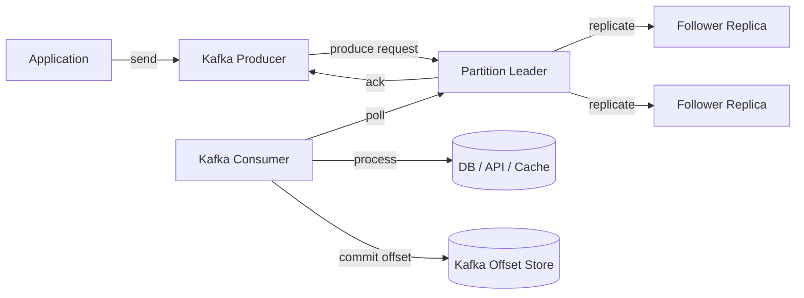

Jika salah satu link lemah, sistem tetap bisa kehilangan data, menghasilkan duplicate, atau membuat state downstream tidak konsisten.

---

## 2. Broker-Side Durability: Partition Replication

Kafka topic terdiri dari partition. Setiap partition bisa punya beberapa replica.

```text
topic: case.lifecycle.v1
partition: 3
replication.factor: 3

replicas:
  broker-1 leader
  broker-2 follower
  broker-3 follower
```

Producer menulis ke leader partition. Follower mereplikasi dari leader.

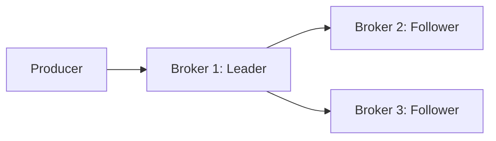

Replication factor menentukan berapa salinan data yang dimiliki partition.

Namun replication factor saja tidak cukup. Yang menentukan kapan write dianggap sukses adalah interaksi antara producer `acks` dan topic/broker `min.insync.replicas`.

---

## 3. ISR: In-Sync Replicas

ISR adalah replica yang dianggap cukup up-to-date terhadap leader.

```text
replicas = [1,2,3]
isr      = [1,2,3]
```

Jika broker 3 tertinggal atau gagal:

```text
replicas = [1,2,3]
isr      = [1,2]
```

Durability write bergantung pada jumlah ISR yang mengakui write jika producer memakai `acks=all`.

---

## 4. Producer `acks`

`acks` mengatur kapan broker membalas sukses ke producer.

### 4.1 `acks=0`

Producer tidak menunggu acknowledgement broker.

```text
fast, weakest durability
```

Jika broker gagal menerima record, producer mungkin tidak tahu.

Gunakan hanya untuk telemetry yang disposable.

### 4.2 `acks=1`

Leader membalas sukses setelah menerima record.

```text
leader wrote record -> ack producer
```

Risiko: leader bisa crash sebelum follower mereplikasi. Jika leader yang belum direplikasi hilang, record bisa hilang.

### 4.3 `acks=all`

Leader menunggu replica in-sync yang diperlukan sebelum ack.

```text
leader + required ISR wrote record -> ack producer
```

Ini baseline untuk data penting.

---

## 5. `min.insync.replicas`

`min.insync.replicas` menetapkan jumlah minimum ISR yang harus tersedia untuk menerima write dengan `acks=all`.

Contoh production baseline:

```properties
replication.factor=3
min.insync.replicas=2
producer.acks=all
```

Artinya write sukses jika minimal 2 replica in-sync mengakui write.

Jika ISR turun ke 1, broker menolak write daripada menerima data dengan durability lemah.

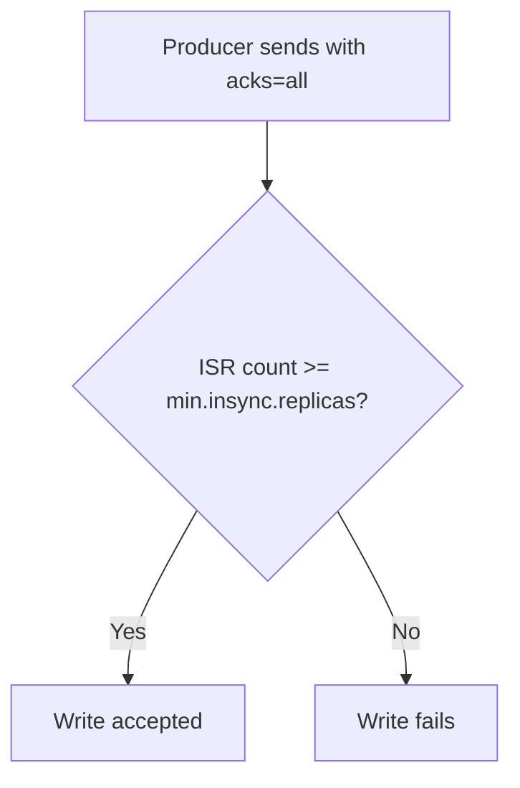

Ini trade-off availability vs durability.

Kalau kamu memilih durability, sistem harus siap menangani produce failure saat cluster degraded.

---

## 6. Reliability Matrix

| Setting | Data Loss Risk | Availability | Notes |
|---|---:|---:|---|
| RF=1, acks=1 | Tinggi | Tinggi | Tidak cocok untuk critical event |
| RF=3, acks=1 | Sedang | Tinggi | Leader crash sebelum replication masih berisiko |
| RF=3, acks=all, minISR=1 | Lebih baik | Tinggi | Bisa ack hanya leader jika ISR tinggal 1 |
| RF=3, acks=all, minISR=2 | Kuat | Sedang | Baseline umum untuk critical stream |
| RF=5, acks=all, minISR=3 | Sangat kuat | Lebih rendah | Biaya dan latency lebih tinggi |

Tidak ada konfigurasi gratis. Durability kuat biasanya mengorbankan availability saat cluster degraded.

---

## 7. Idempotent Producer

Producer retry bisa menyebabkan duplicate.

Skenario:

```text
1. Producer sends record.
2. Broker writes record.
3. Ack response lost in network.
4. Producer times out.
5. Producer retries.
6. Broker could write duplicate if no idempotence.
```

Idempotent producer menambahkan producer identity dan sequence number sehingga broker dapat menolak duplicate retry untuk partition yang sama.

Baseline:

```properties
enable.idempotence=true
acks=all
retries=2147483647
max.in.flight.requests.per.connection=5
```

Dengan idempotence, Kafka mengurangi duplicate akibat producer retry. Namun ini bukan berarti seluruh bisnis exactly-once. Ini berlaku pada write producer ke Kafka dalam boundary tertentu.

---

## 8. Ambiguous Produce Result

Producer timeout tidak selalu berarti record gagal ditulis.

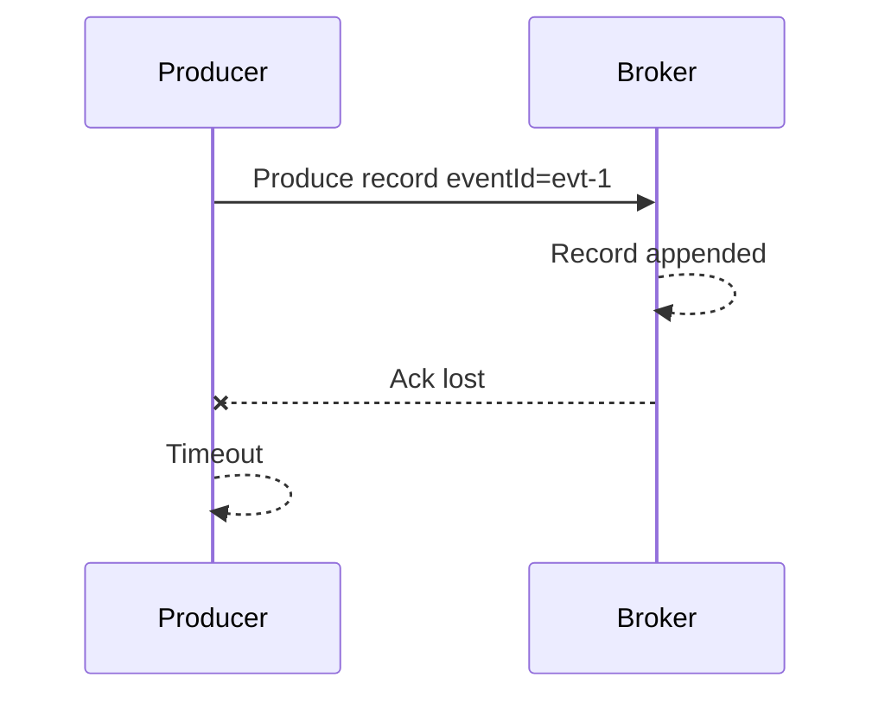

Dari sisi producer:

```text
result = unknown
```

Record mungkin sudah ada di Kafka.

Implikasi:

- event harus punya deterministic `eventId`;
- producer retry harus idempotent;
- consumer harus deduplicate;
- caller tidak boleh blindly membuat event baru dengan ID baru untuk retry bisnis yang sama.

---

## 9. Delivery Timeout vs Request Timeout

Producer punya beberapa timeout penting:

- `request.timeout.ms`: berapa lama producer menunggu response untuk request tertentu;
- `delivery.timeout.ms`: batas total waktu send, termasuk retry;
- `linger.ms`: waktu menunggu batching;
- `max.block.ms`: waktu blocking saat metadata/buffer tidak tersedia.

Kesalahan umum adalah menaikkan retry tanpa memahami `delivery.timeout.ms`. Jika delivery timeout terlalu pendek, producer bisa gagal sebelum cluster punya cukup waktu untuk recover dari gangguan sementara.

Namun delivery timeout terlalu panjang juga bisa menyembunyikan masalah dan membuat upstream request menggantung.

Pilih berdasarkan SLO:

```text
synchronous user request -> timeout pendek, fallback jelas
async outbox publisher   -> timeout lebih panjang, retry resilient
batch pipeline           -> timeout panjang, alert berbasis lag
```

---

## 10. `max.in.flight.requests.per.connection`

Config ini membatasi jumlah request yang belum mendapat response pada satu connection.

Tanpa idempotence, retry dengan banyak in-flight request bisa mengubah ordering.

Dengan idempotence modern, Kafka mendukung beberapa in-flight request dalam batas tertentu sambil menjaga sequencing.

Namun untuk pipeline yang sangat konservatif terhadap ordering, kamu tetap perlu memahami latency/throughput trade-off.

```properties
max.in.flight.requests.per.connection=1
```

memberi reasoning paling sederhana tetapi throughput lebih rendah.

```properties
max.in.flight.requests.per.connection=5
```

lebih umum dipakai bersama idempotence.

---

## 11. Consumer Reliability: Offset Commit adalah Boundary Progress

Consumer offset commit menyatakan:

> “Consumer group ini tidak perlu membaca record sebelum offset ini lagi.”

Commit offset terlalu cepat menyebabkan data loss secara processing.

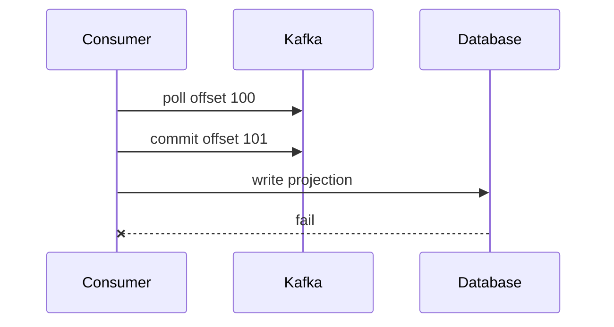

Kafka menganggap offset 100 selesai, tetapi side effect gagal. Record tidak diproses ulang secara normal.

Commit offset terlalu lambat menyebabkan duplicate.

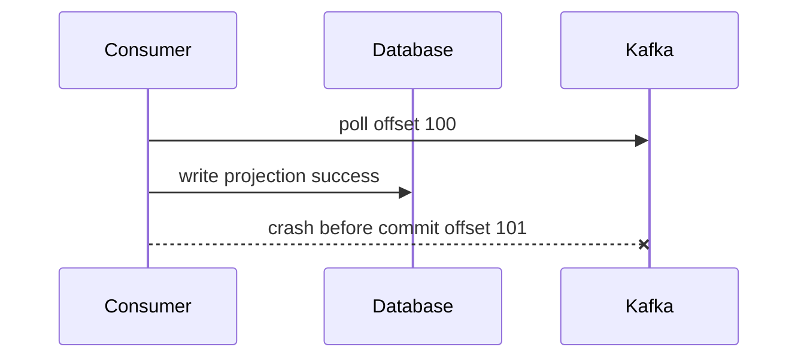

Saat restart, record 100 dibaca ulang. Side effect harus idempotent.

---

## 12. At-Least-Once Consumer Pattern

Pattern aman dasar:

1. poll record;
2. process side effect idempotently;
3. commit offset setelah side effect sukses.

```java
while (running.get()) {
    ConsumerRecords<String, CaseEvent> records = consumer.poll(Duration.ofMillis(500));

    for (ConsumerRecord<String, CaseEvent> record : records) {
        processIdempotently(record);
        offsets.markProcessed(record);
    }

    consumer.commitSync(offsets.safeCommitMap());
}
```

Guarantee:

```text
record may be processed more than once
record should not be skipped after successful poll if process fails before commit
```

Karena duplicate mungkin terjadi, idempotency wajib.

---

## 13. Idempotent Consumer

Idempotent consumer memastikan record yang sama tidak menggandakan efek bisnis.

Gunakan `eventId` atau kombinasi `(topic, partition, offset)` tergantung kebutuhan.

Untuk event bisnis, lebih baik `eventId` stabil.

```sql
CREATE TABLE processed_event (
    event_id VARCHAR(64) PRIMARY KEY,
    processed_at TIMESTAMP NOT NULL
);
```

Processing:

```java
@Transactional
public void apply(CaseEvent event) {
    if (processedEventRepository.exists(event.eventId())) {
        return;
    }

    projection.apply(event);
    processedEventRepository.insert(event.eventId());
}
```

Kalau duplicate datang, insert `eventId` mencegah side effect ganda.

---

## 14. Inbox Pattern untuk Consumer

Inbox pattern menyimpan event masuk sebelum diproses.

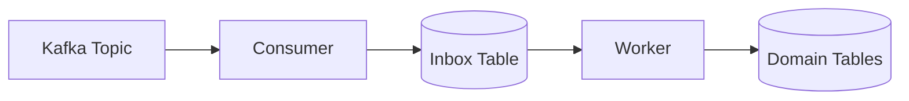

Keuntungan:

- Kafka poll loop cepat;
- dedup di DB;
- retry lokal lebih terkendali;
- audit processing jelas;
- external side effect bisa diorkestrasi.

Tabel contoh:

```sql
CREATE TABLE inbox_event (
    event_id VARCHAR(64) PRIMARY KEY,
    topic VARCHAR(255) NOT NULL,
    partition_no INT NOT NULL,
    offset_no BIGINT NOT NULL,
    aggregate_id VARCHAR(64),
    payload JSONB NOT NULL,
    status VARCHAR(32) NOT NULL,
    received_at TIMESTAMP NOT NULL,
    processed_at TIMESTAMP NULL
);
```

Commit Kafka offset boleh dilakukan setelah event berhasil disimpan ke inbox, bukan setelah seluruh side effect selesai. Tetapi ini berarti reliability berpindah ke worker inbox.

---

## 15. Outbox Pattern untuk Producer

Outbox pattern menyelesaikan masalah:

> “Bagaimana menyimpan perubahan database dan publish event tanpa distributed transaction?”

Flow:

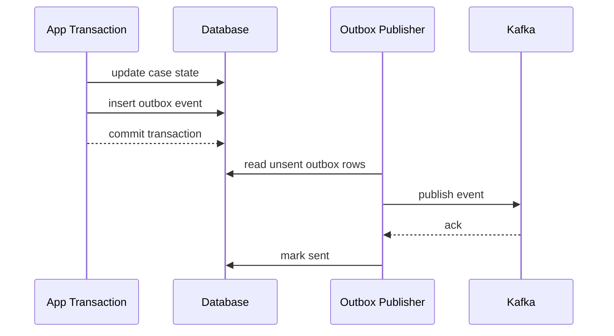

Database change dan outbox event commit atomik di database yang sama. Kafka publishing dilakukan asynchronously.

Outbox publisher harus idempotent karena publish berhasil tetapi mark-sent bisa gagal.

Gunakan stable `eventId` dari outbox row sebagai dedup key.

---

## 16. Transactional Producer

Kafka transactional producer memungkinkan beberapa write ke Kafka topic/partition dan offset commit consumer group diperlakukan sebagai satu transaction Kafka.

Use case utama:

```text
consume from Kafka -> process -> produce to Kafka -> commit input offsets atomically
```

Contoh flow:

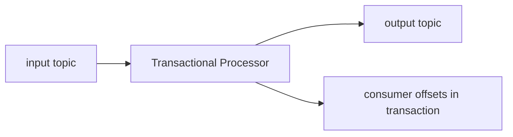

Jika transaction commit:

- output records visible;
- input offsets committed.

Jika transaction abort:

- output records aborted;
- input offsets not committed.

Ini mencegah kondisi output sudah dipublish tetapi offset belum commit, atau offset commit tetapi output tidak ada.

---

## 17. Transactional Producer Lifecycle di Java

Skeleton:

```java
Properties props = new Properties();
props.put(ProducerConfig.BOOTSTRAP_SERVERS_CONFIG, bootstrapServers);
props.put(ProducerConfig.KEY_SERIALIZER_CLASS_CONFIG, StringSerializer.class.getName());
props.put(ProducerConfig.VALUE_SERIALIZER_CLASS_CONFIG, EventSerializer.class.getName());
props.put(ProducerConfig.TRANSACTIONAL_ID_CONFIG, "case-enrichment-worker-01");

KafkaProducer<String, Event> producer = new KafkaProducer<>(props);
producer.initTransactions();

while (running.get()) {
    ConsumerRecords<String, InputEvent> records = consumer.poll(Duration.ofMillis(500));
    if (records.isEmpty()) {
        continue;
    }

    try {
        producer.beginTransaction();

        for (ConsumerRecord<String, InputEvent> record : records) {
            Event output = transform(record.value());
            producer.send(new ProducerRecord<>("case.enriched.v1", record.key(), output));
            offsets.markProcessed(record);
        }

        producer.sendOffsetsToTransaction(
            offsets.toCommitMap(),
            consumer.groupMetadata()
        );

        producer.commitTransaction();
    } catch (Exception e) {
        producer.abortTransaction();
        // records will be consumed again because offsets were not committed
    }
}
```

Ini contoh Kafka-to-Kafka processing. Jangan menganggap ini otomatis membuat database/API external exactly-once.

---

## 18. Consumer Isolation Level

Untuk membaca topic yang menerima transactional writes, consumer bisa memakai:

```properties
isolation.level=read_committed
```

Dengan `read_committed`, consumer hanya melihat record dari transaction yang committed.

Dengan `read_uncommitted`, consumer bisa melihat record yang kemudian aborted.

Untuk downstream yang mengandalkan transactional producer, gunakan `read_committed` kecuali ada alasan eksplisit.

---

## 19. Exactly-Once Semantics: Makna yang Tepat

Exactly-once di Kafka sering disalahartikan.

Makna yang lebih tepat:

> Kafka dapat memberi exactly-once processing semantics untuk pipeline Kafka-to-Kafka jika producer idempotence, transactions, offset commit transaction, dan consumer isolation dikonfigurasi dengan benar.

Bukan berarti:

```text
external REST API called exactly once
email sent exactly once
database row updated exactly once without idempotency
payment captured exactly once automatically
```

External systems tidak berada dalam transaction Kafka.

---

## 20. Boundary Diagram

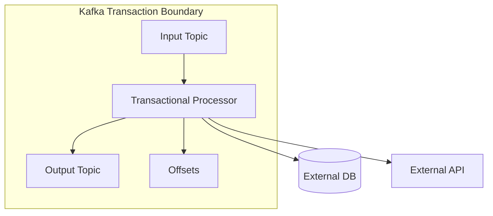

Output topic dan offset bisa atomic dalam Kafka transaction.

External DB/API tidak otomatis atomic dengan Kafka transaction.

---

## 21. External Side Effects: Tiga Strategi

### 21.1 Idempotency Key

Kirim idempotency key ke external API.

```http
POST /payments/capture
Idempotency-Key: evt-123
```

Jika retry terjadi, API mengembalikan hasil yang sama.

### 21.2 Inbox/Outbox di Database

Gunakan database sebagai boundary transaksi untuk state lokal.

```text
consume -> insert inbox -> commit offset
worker -> process inbox idempotently -> insert outbox -> publisher -> Kafka/API
```

### 21.3 Reconciliation

Untuk side effect yang tidak bisa exactly-once, buat proses rekonsiliasi.

Contoh:

- email delivery log;
- payment capture status;
- external case registry sync;
- regulatory notice submission.

Reliability production sering berasal dari idempotency + reconciliation, bukan klaim exactly-once murni.

---

## 22. Zombie Producer dan Fencing

Transactional producer memakai `transactional.id`.

Jika dua producer memakai `transactional.id` yang sama, Kafka dapat melakukan fencing terhadap producer lama agar producer zombie tidak melanjutkan transaction.

Skenario:

```text
1. Worker A starts with transactional.id=case-enricher-7.
2. Worker A stalls due to long GC pause.
3. Orchestrator starts Worker B with same transactional.id.
4. Worker B initializes transaction.
5. Worker A resumes and tries to commit.
6. Worker A is fenced and must stop.
```

Rule:

- `transactional.id` harus stabil per logical task/partition ownership;
- jangan reuse sembarangan antar instance aktif;
- treat fencing exception as fatal for that producer instance;
- restart cleanly.

---

## 23. Transaction Timeout

Kafka transaction tidak boleh dibiarkan terbuka terlalu lama.

Jika processing batch terlalu lambat:

- transaction bisa timeout;
- producer harus abort;
- records akan diproses ulang;
- long transaction menahan visibility untuk `read_committed` consumer;
- latency downstream naik.

Desain:

- batasi ukuran batch transaction;
- hindari external call lambat dalam Kafka transaction;
- jangan membuka transaction lalu melakukan operasi tidak terprediksi;
- ukur p99 processing time.

---

## 24. Transactional Outbox vs Kafka Transaction

Keduanya menyelesaikan masalah berbeda.

| Problem | Kafka Transaction | Transactional Outbox |
|---|---|---|
| Kafka input offset + Kafka output atomic | Ya | Tidak langsung |
| DB state + event publish atomic | Tidak | Ya |
| External API exactly once | Tidak | Tidak, perlu idempotency/reconciliation |
| Kafka Streams-style processing | Cocok | Bisa, tapi lebih manual |
| Business command writes DB then event | Kurang cocok | Sangat cocok |

Untuk service biasa yang menyimpan domain state di DB lalu publish event, outbox biasanya lebih tepat.

Untuk Kafka-to-Kafka stream processor, Kafka transaction biasanya lebih tepat.

---

## 25. Common Processing Patterns

### 25.1 Kafka-to-DB Projection

```text
Kafka -> Consumer -> DB projection
```

Gunakan:

- manual commit;
- DB transaction;
- processed event table;
- commit offset setelah DB commit;
- replay support.

### 25.2 DB-to-Kafka Domain Event

```text
Command -> DB state + Outbox -> Kafka
```

Gunakan:

- outbox;
- idempotent producer;
- deterministic eventId;
- mark sent after ack;
- retry publisher.

### 25.3 Kafka-to-Kafka Enrichment

```text
input topic -> processor -> output topic
```

Gunakan:

- transactional producer;
- `sendOffsetsToTransaction`;
- `read_committed` downstream;
- deterministic output key.

### 25.4 Kafka-to-External API

```text
Kafka -> Consumer -> External API
```

Gunakan:

- idempotency key;
- retry budget;
- DLQ/quarantine;
- reconciliation;
- status table.

---

## 26. Failure Scenario: Leader Crash After Ack

### With `acks=1`

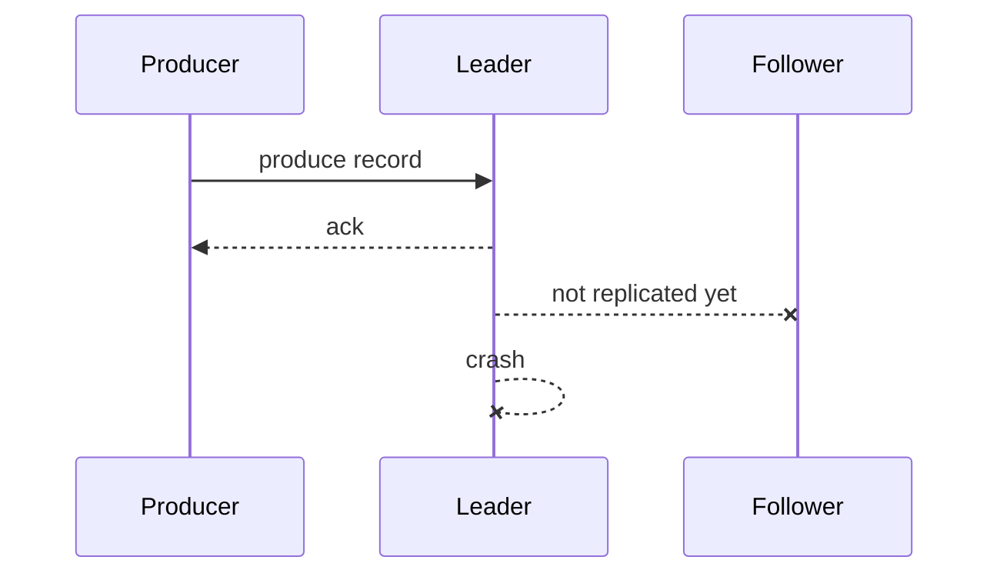

Record can be lost if new leader did not have it.

### With `acks=all` and `min.insync.replicas=2`

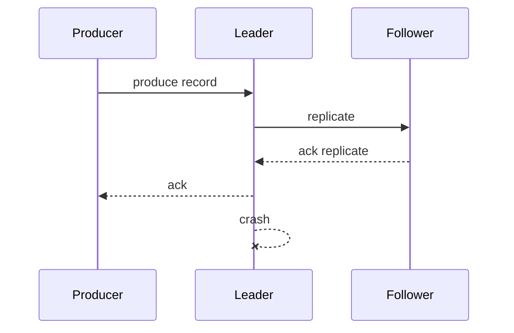

Record survives if follower with record becomes leader.

---

## 27. Failure Scenario: ISR Shrink

If ISR shrinks below `min.insync.replicas`, writes with `acks=all` fail.

This is good for durability but bad for availability.

Application behavior must be deliberate:

```text
critical command -> fail fast, surface degraded platform status
outbox publisher -> keep retrying, alert on backlog
telemetry -> maybe drop or route to fallback
```

Do not hide persistent produce failures in logs only.

---

## 28. Failure Scenario: Producer Timeout but Broker Wrote Record

Outcome is ambiguous.

Correct response:

- retry with same producer/idempotence;
- use deterministic event id;
- deduplicate downstream;
- do not create semantically new event for same business action.

Incorrect response:

```text
catch TimeoutException -> create new eventId -> send again
```

This creates business duplicate.

---

## 29. Failure Scenario: Consumer Crash After DB Commit Before Offset Commit

Expected result: duplicate processing after restart.

Correct response:

- DB transaction includes processed event id;
- duplicate is ignored;
- offset eventually committed.

Incorrect response:

- assume Kafka exactly-once prevents duplicate DB update.

Kafka does not know your DB write happened.

---

## 30. Failure Scenario: Transactional Processor Crash Before Commit

Flow:

```text
consume input offset 10
produce output event
crash before commitTransaction
```

If transaction was not committed:

- output not visible to `read_committed` consumer;
- input offset not committed;
- input record processed again.

This is the strength of Kafka transaction for Kafka-to-Kafka workflows.

---

## 31. Failure Scenario: External API Inside Kafka Transaction

Bad design:

```java
producer.beginTransaction();
callExternalApi();
producer.send(outputRecord);
producer.sendOffsetsToTransaction(offsets, metadata);
producer.commitTransaction();
```

If external API succeeds and Kafka transaction aborts, retry will call API again.

Kafka transaction cannot roll back the external API.

Use idempotency key or move external call behind an outbox/inbox workflow.

---

## 32. Reliability Configuration Baseline

For critical event streams:

### Topic

```properties
replication.factor=3
min.insync.replicas=2
unclean.leader.election.enable=false
```

### Producer

```properties
acks=all
enable.idempotence=true
retries=2147483647
delivery.timeout.ms=120000
request.timeout.ms=30000
max.in.flight.requests.per.connection=5
compression.type=zstd
```

### Consumer

```properties
enable.auto.commit=false
isolation.level=read_committed # if consuming transactional topics
max.poll.interval.ms=300000
max.poll.records=500
```

### Application

```text
stable eventId
idempotent consumer
manual offset commit after durable side effect
DLQ/quarantine policy
replay tooling
observability per topic/partition/group
```

Baseline bukan jawaban final. Validasi dengan load test, failure drill, dan SLO.

---

## 33. Observability untuk Reliability

Monitor minimal:

### Broker/Cluster

- under-replicated partitions;
- offline partitions;
- ISR shrink/expand rate;
- leader election rate;
- request latency;
- disk usage;
- controller health;
- transaction coordinator health.

### Producer

- record error rate;
- retry rate;
- request latency;
- batch size;
- buffer available bytes;
- record queue time;
- delivery timeout count;
- transaction abort count;
- fencing exception count.

### Consumer

- lag per partition;
- commit latency;
- processing latency;
- duplicate count;
- ordering gap count;
- DLQ count;
- poll interval;
- rebalance count.

### Business

- event published count vs command success count;
- projection freshness;
- reconciliation mismatch;
- unprocessed inbox count;
- outbox backlog;
- stuck transactions.

---

## 34. Reliability Runbook: Produce Failures

When producer error rate spikes:

1. Identify exception type: timeout, authorization, serialization, not enough replicas, unknown topic, record too large.
2. Check broker health and ISR count.
3. Check whether failures correlate with specific topic/partition.
4. Check producer buffer pressure.
5. Check network latency.
6. Check schema serialization failures.
7. Check outbox backlog.
8. Decide whether to fail user-facing operation or degrade async publishing.
9. Do not drop critical events silently.
10. Record incident timeline with event IDs and correlation IDs.

---

## 35. Reliability Runbook: Duplicate Spike

When duplicates spike:

1. Check producer retry rate and timeout rate.
2. Check idempotence enabled.
3. Check whether event IDs are stable across retry.
4. Check consumer crash/restart/rebalance events.
5. Check offset commit failures.
6. Check outbox publisher mark-sent failures.
7. Check replay jobs or manual backfill.
8. Check whether downstream dedup table is working.
9. Check transaction abort/retry cycles.
10. Verify duplicates are harmless or quarantine if side effect is non-idempotent.

---

## 36. Reliability Runbook: Data Loss Suspicion

When someone says “Kafka lost event”:

1. Get eventId, key, topic, approximate time.
2. Check producer logs for send result.
3. Check outbox row if producer uses outbox.
4. Search Kafka topic by key/eventId.
5. Check retention and compaction policy.
6. Check consumer logs and processed_event table.
7. Check DLQ/quarantine.
8. Check whether event was produced to wrong topic/environment.
9. Check schema deserialization failures.
10. Check whether projection lost state, not Kafka.

Often the event was not produced, was produced with different key/schema, was compacted/expired, failed deserialization, or was processed then overwritten by out-of-order state.

---

## 37. Anti-Patterns

### Anti-Pattern 1: `acks=1` for Critical Events

This accepts leader-only durability. It can be fine for some workloads, but not for regulatory lifecycle events.

### Anti-Pattern 2: Auto Commit with Heavy Side Effects

`enable.auto.commit=true` can commit offsets before business processing is durably complete.

### Anti-Pattern 3: Believing Transactions Cover External APIs

Kafka transaction covers Kafka records and offsets, not external systems.

### Anti-Pattern 4: New Event ID on Retry

Retrying same business action with new event ID defeats idempotency.

### Anti-Pattern 5: Infinite Retry Inside Consumer Poll Loop

This blocks partition progress and can trigger rebalances. Use retry topics, DLQ, or inbox worker retry.

### Anti-Pattern 6: No Replay Plan

Reliable systems assume replay will happen. If consumer cannot tolerate replay, it is not production-ready.

### Anti-Pattern 7: Hiding Produce Failure

Logging and continuing after critical publish failure creates invisible data loss.

---

## 38. Decision Matrix

| Use Case | Recommended Reliability Pattern |
|---|---|
| Case lifecycle event after DB command | Transactional outbox + idempotent producer |
| Kafka-to-Kafka enrichment | Kafka transaction + `sendOffsetsToTransaction` |
| Kafka-to-DB projection | Manual commit after DB transaction + processed_event table |
| Kafka-to-external API | Idempotency key + status table + retry/DLQ + reconciliation |
| Audit event firehose | Idempotent producer, retention/archive, monitoring |
| Disposable telemetry | Weaker ack may be acceptable with explicit loss budget |
| Regulatory notice delivery | Idempotent external API if possible + durable delivery log + reconciliation |

---

## 39. Capstone Example: Case Escalation Pipeline

### Flow

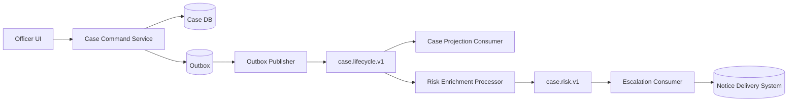

### Reliability Design

Command service:

```text
DB transaction:
  update case state
  insert outbox event CASE_ESCALATED with eventId stable
```

Outbox publisher:

```text
acks=all
enable.idempotence=true
retry until ack
mark sent after ack
```

Projection consumer:

```text
manual commit
processed_event table
validate caseVersion
commit after DB transaction
```

Risk processor:

```text
transactional Kafka-to-Kafka if input=case.lifecycle and output=case.risk
read_committed downstream
```

Notice delivery:

```text
idempotency key = eventId or noticeId
status table
retry budget
DLQ
manual reconciliation
```

### Invariant

```text
A case escalation is never considered externally delivered unless:
1. CASE_ESCALATED exists in case.lifecycle.v1 or archived equivalent.
2. Projection applied correct aggregateVersion.
3. Notice delivery status is confirmed or explicitly failed/quarantined.
4. Correlation chain connects command, event, risk decision, and notice.
```

This is defensible engineering, not blind trust in a broker.

---

## 40. Review Checklist

```text
[ ] Topic replication factor defined?
[ ] min.insync.replicas defined?
[ ] Producer uses acks=all for critical events?
[ ] Producer idempotence enabled?
[ ] Event ID stable across retry?
[ ] Producer timeout behavior understood?
[ ] Outbox used when DB state and event must be atomic?
[ ] Consumer auto commit disabled for side-effect processing?
[ ] Consumer side effect idempotent?
[ ] Offset committed only after durable processing boundary?
[ ] Transactional producer used only where Kafka transaction boundary applies?
[ ] read_committed used for transactional output topics?
[ ] External API has idempotency key or reconciliation?
[ ] DLQ/quarantine policy exists?
[ ] Replay has been tested?
[ ] Duplicate handling has been tested?
[ ] Broker ISR and under-replication alerts exist?
[ ] Outbox/inbox backlog alerts exist?
```

---

## 41. Sumber Resmi dan Bacaan Lanjutan

- Apache Kafka Documentation — core APIs, guarantees, and concepts: https://kafka.apache.org/documentation/
- Apache Kafka Design — replication, partitions, log model, and consumer pull model: https://kafka.apache.org/43/design/design/
- Apache Kafka Producer Configs — `acks`, `enable.idempotence`, `retries`, `transactional.id`, `max.in.flight.requests.per.connection`: https://kafka.apache.org/41/configuration/producer-configs/
- Apache Kafka Consumer Configs — `enable.auto.commit`, group management, `isolation.level`: https://kafka.apache.org/41/configuration/consumer-configs/
- Apache Kafka Java API — `KafkaProducer`, transactions, and client APIs: https://kafka.apache.org/43/javadoc/index.html
- Confluent Kafka Delivery Semantics — background explanation of Kafka delivery semantics: https://docs.confluent.io/kafka/design/delivery-semantics.html

---

## Ringkasan

Kafka reliability harus dipikirkan sebagai chain of responsibility.

```text
producer durability + broker replication + consumer commit discipline + idempotent side effects + operational recovery
```

Exactly-once bukan mantra. Exactly-once adalah property terbatas yang hanya valid jika boundary-nya jelas.

Untuk engineer senior, pertanyaan yang benar bukan:

> “Apakah Kafka exactly-once?”

Pertanyaan yang benar:

> “Bagian mana dari pipeline ini berada dalam Kafka transaction boundary, dan bagian mana yang membutuhkan idempotency, outbox, inbox, atau reconciliation?”
