------
title: Learn Java Messaging and Event Streaming - Part 021
description: Kafka error handling, retry strategy, dead-letter topics, poison events, quarantine, replay, ordering trade-offs, and production recovery design.
series: learn-java-messaging-event-streaming
seriesTitle: Learn Java Messaging and Event Streaming
order: 21
partTitle: Kafka Error Handling, Retry, DLQ, and Poison Events
tags:
- java
- kafka
- apache-kafka
- error-handling
- retry
- dead-letter-queue
- dlq
- poison-message
- resilience
- reliability
- event-streaming
- distributed-systems
date: 2026-06-28
---

# Part 021 — Kafka Error Handling: Retries, DLQ, Retry Topics, Poison Events, and Quarantine

## Tujuan Bagian Ini

Kafka bukan queue tradisional yang otomatis “memindahkan pesan gagal” ke tempat lain. Kafka adalah retained partitioned log. Error handling adalah desain aplikasi di atas log tersebut.

Bagian ini membahas bagaimana membangun error handling Kafka yang aman secara produksi: tidak kehilangan event, tidak membuat infinite retry storm, tidak menahan seluruh partition tanpa alasan, dan tetap memungkinkan audit serta replay.

Setelah bagian ini, kamu harus bisa:

1. Membedakan error transient, deterministic, poison, infrastructure, dan business rejection.
2. Mendesain retry policy tanpa memblokir poll loop terlalu lama.
3. Memilih antara fail-fast, inline retry, retry topic, DLQ, dan quarantine.
4. Menjaga ordering saat error terjadi.
5. Mendesain DLQ envelope yang cukup untuk debugging dan replay.
6. Menghindari anti-pattern seperti infinite retry, commit-before-side-effect, dan DLQ tanpa owner.
7. Membuat runbook untuk replay, quarantine release, dan incident recovery.

---

## 1. Mental Model Utama

Di Kafka, consumer membaca dari partition berdasarkan offset.

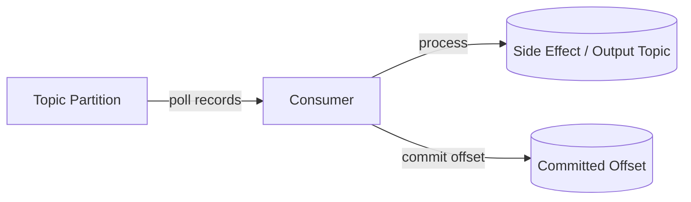

Saat processing gagal, ada tiga fakta penting:

1. record tetap ada di Kafka sampai retention menghapusnya;
2. consumer position di memory bisa maju karena `poll()` sudah mengambil record;
3. committed offset menentukan dari mana consumer group akan lanjut setelah restart/rebalance.

Kesalahan desain paling umum adalah mengira offset commit adalah error handling. Offset commit hanya menyimpan progress. Ia tidak menjawab pertanyaan:

- apakah record gagal harus dicoba lagi?
- kapan retry berhenti?
- apakah partition boleh lanjut ke record berikutnya?
- di mana error disimpan?
- siapa yang memperbaiki data gagal?
- bagaimana replay dilakukan?

Kafka menyediakan primitive. Error policy tetap tanggung jawab aplikasi.

---

## 2. Taxonomy Error Kafka Consumer

Sebelum memilih mekanisme retry, klasifikasikan error.

| Error type | Contoh | Retry cocok? | DLQ cocok? | Catatan |
|---|---|---:|---:|---|
| Transient infrastructure | DB timeout, HTTP 503, network reset | Ya | Jika retry budget habis | Jangan langsung DLQ |
| Rate/pressure failure | downstream overloaded, 429, pool exhausted | Ya, dengan backoff | Bisa jika terlalu lama | Perlu throttling |
| Deterministic data error | invalid enum, missing required field | Tidak banyak guna | Ya | Harus diperbaiki data/schema |
| Poison event | event selalu crash consumer | Tidak setelah bukti deterministik | Ya/quarantine | Harus diisolasi cepat |
| Business rejection | case closed, transition illegal | Tergantung domain | Bisa ke rejected topic | Bukan selalu error teknis |
| Serialization/deserialization | schema incompatible, bad bytes | Tidak di consumer normal | Ya, raw DLQ | Perlu handler khusus |
| Programming bug | NullPointerException, bad mapping | Tidak sampai hotfix | Quarantine | Jangan masking bug dengan retry tanpa batas |
| Ordering dependency missing | event B datang sebelum A | Retry/delay | Bisa parking lot | Butuh sequence/state model |

Mental model:

```text
retry helps when waiting changes the outcome.
retry does not help when the input is invalid or the code is wrong.
```

---

## 3. Processing Outcome Matrix

Setiap record yang dipoll harus berakhir pada salah satu outcome berikut.

| Outcome | Meaning | Offset commit? | Evidence |
|---|---|---:|---|
| Success | Business side effect selesai | Ya | Output written, DB updated, audit recorded |
| Skipped by policy | Record sah tapi tidak relevan | Ya | Reason logged/metric |
| Retriable failure | Akan dicoba ulang | Tidak, atau commit setelah dipindah ke retry topic | Retry metadata |
| Dead-lettered | Tidak akan diproses normal | Ya setelah DLQ write sukses | DLQ record |
| Quarantined | Butuh manual/controlled review | Ya setelah quarantine write sukses | Quarantine record |
| Fatal application failure | Consumer harus stop | Tidak | Alert + crash |

Invariant produksi:

```text
Never commit past a record unless its outcome is durably known.
```

“Durably known” berarti salah satu:

- side effect sudah sukses;
- output topic sudah menerima event hasil;
- retry topic sudah menerima event retry;
- DLQ/quarantine topic sudah menerima event gagal;
- record memang disepakati untuk skip dengan audit reason.

---

## 4. Lima Pola Error Handling Kafka

### 4.1 Pattern A — Stop on Error

Consumer berhenti saat record gagal.

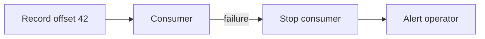

Cocok untuk:

- strict ordering;
- financial ledger;
- state machine yang tidak boleh lompat event;
- regulatory lifecycle event yang wajib diproses berurutan.

Kelebihan:

- menjaga ordering paling kuat;
- failure terlihat cepat;
- tidak menyembunyikan data buruk.

Kekurangan:

- satu poison event bisa menahan partition;
- butuh operasi manual cepat;
- availability rendah jika error sering.

Gunakan jika invariant ordering lebih penting daripada throughput.

---

### 4.2 Pattern B — Inline Retry

Consumer mencoba ulang di thread processing yang sama.

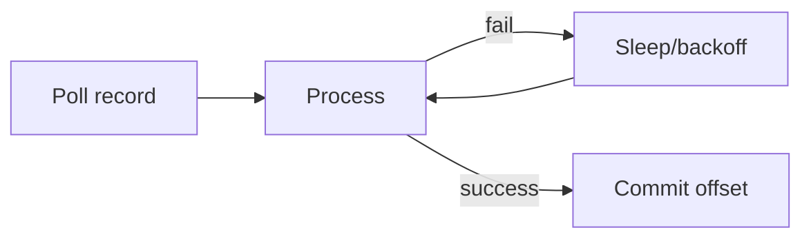

Cocok untuk:

- error transient singkat;
- downstream hiccup beberapa detik;
- consumer volume rendah;
- ordering harus dijaga.

Risiko:

- poll loop bisa terlalu lama;
- `max.poll.interval.ms` bisa terlewati;
- rebalance bisa terjadi;
- consumer group menjadi tidak stabil;
- thread worker terblokir.

Aturan praktis:

```text
Inline retry boleh pendek. Retry panjang harus keluar dari poll loop.
```

Contoh Java sederhana:

```java
int attempts = 0;
while (true) {
    try {
        process(record);
        consumer.commitSync(Map.of(tp, new OffsetAndMetadata(record.offset() + 1)));
        break;
    } catch (TransientDependencyException ex) {
        attempts++;
        if (attempts >= 3) {
            publishToRetryTopic(record, ex, attempts);
            consumer.commitSync(Map.of(tp, new OffsetAndMetadata(record.offset() + 1)));
            break;
        }
        Thread.sleep(backoff(attempts));
    }
}
```

Kode di atas hanya aman jika `publishToRetryTopic` durable dan error type memang retriable.

---

### 4.3 Pattern C — Retry Topic

Record gagal dipublish ke topic retry dengan metadata attempt dan due time. Consumer normal commit offset setelah write retry topic sukses.

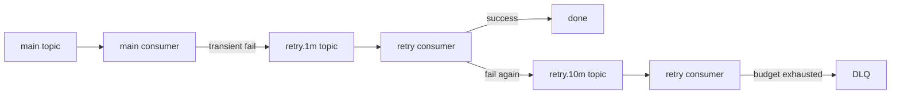

Cocok untuk:

- retry yang lebih lama dari beberapa detik;
- high-throughput consumer;
- downstream outage;
- ingin partition utama tetap bergerak;
- ingin observability retry terpisah.

Trade-off:

- ordering bisa rusak karena record berikutnya lanjut dulu;
- topologi lebih kompleks;
- perlu metadata retry yang disiplin;
- retry consumer bisa banjir saat dependency pulih.

Retry topic harus punya contract, bukan tempat sampah.

---

### 4.4 Pattern D — Dead Letter Topic / DLQ

Record yang tidak bisa diproses setelah policy tertentu dikirim ke DLQ.

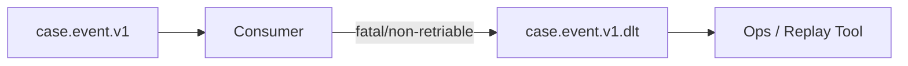

DLQ cocok untuk:

- invalid payload;
- schema incompatible;
- max retry exceeded;
- poison event;
- unknown exception setelah circuit breaker policy;
- manual review.

DLQ tidak cocok jika:

- tidak ada owner;
- tidak ada alert;
- tidak ada replay process;
- tidak ada retention cukup;
- tidak ada metadata sebab gagal.

Invariant:

```text
A DLQ without ownership is delayed data loss.
```

---

### 4.5 Pattern E — Quarantine / Parking Lot

Quarantine adalah DLQ yang lebih terkontrol, biasanya untuk record yang penting secara bisnis dan tidak boleh sekadar diabaikan.

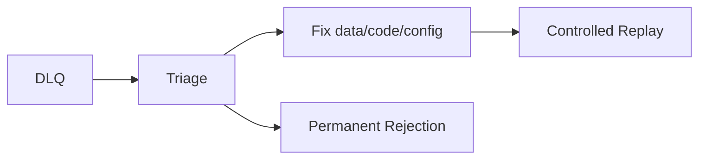

Cocok untuk:

- regulatory case event;
- enforcement lifecycle transition;
- payment/settlement;
- legal/audit record;
- high-value customer operations.

Bedakan:

| Topic | Purpose |
|---|---|
| retry topic | automatic delayed retry |
| DLQ | failed terminal processing |
| quarantine | failed record requiring controlled decision |
| rejected topic | business decision that input is invalid/denied |
| parking lot | temporarily held until dependency/state exists |

---

## 5. Inline Retry vs Retry Topic vs DLQ

| Concern | Inline retry | Retry topic | DLQ/quarantine |
|---|---|---|---|
| Short transient failure | Good | Overkill | Bad |
| Long dependency outage | Bad | Good | Only after budget |
| Ordering preservation | Good | Weak unless partition blocked | Depends on replay |
| Poll loop stability | Risky if long | Good | Good |
| Operational visibility | Medium | High | High |
| Complexity | Low | Medium/high | Medium |
| Duplicate risk | Medium | Medium/high | Medium/high |
| Replay support | Low | Medium | Must be high |

Decision heuristic:

```text
If waiting milliseconds/seconds can fix it, inline retry.
If waiting minutes can fix it, retry topic.
If waiting will not fix it, DLQ/quarantine.
If ordering cannot be violated, stop partition or use ordered parking strategy.
```

---

## 6. Kafka Consumer Poll Loop Safety

A Kafka consumer is not a job runner that can block indefinitely. It has group membership constraints.

Bad shape:

```java
while (true) {
    ConsumerRecords<String, Event> records = consumer.poll(Duration.ofSeconds(1));
    for (ConsumerRecord<String, Event> record : records) {
        processWithTenMinuteRetry(record); // dangerous
    }
    consumer.commitSync();
}
```

Problem:

- `poll()` cadence becomes unstable;
- heartbeats/group management can be impacted depending on client behavior and config;
- `max.poll.interval.ms` can be exceeded;
- rebalance can revoke partitions while processing is still running;
- duplicate processing risk increases;
- commit may apply to records whose actual outcome is ambiguous.

Safer shape:

```java
while (running) {
    ConsumerRecords<String, Event> records = consumer.poll(Duration.ofMillis(500));

    for (ConsumerRecord<String, Event> record : records) {
        ProcessingResult result = processor.process(record);

        switch (result.status()) {
            case SUCCESS -> commit(record);
            case RETRYABLE_EXHAUSTED -> {
                retryPublisher.publish(record, result.error());
                commit(record);
            }
            case NON_RETRYABLE -> {
                dlqPublisher.publish(record, result.error());
                commit(record);
            }
            case FATAL -> throw result.error();
        }
    }
}
```

Even safer for consume-process-produce is using Kafka transactions if the output is Kafka-only. But external DB/API side effects still need idempotency.

---

## 7. Commit Discipline

Kafka commit stores the next offset to read for a consumer group.

For a record at offset `42`, committing `43` means:

```text
record 42 is done from this consumer group's perspective
```

Do not commit before the outcome is known.

### 7.1 Dangerous: Commit Before Side Effect

```java
consumer.commitSync(offsetAfter(record));
callExternalApi(record); // may fail after commit
```

If the process crashes after commit and before API call, the event is skipped.

### 7.2 Dangerous: Side Effect Before Idempotency

```java
callExternalApi(record);       // succeeds
consumer.commitSync(offset);   // crashes before commit
```

After restart, record is processed again and external API may be called twice.

Therefore, side effects must be idempotent.

### 7.3 Safer: Idempotent Side Effect + Commit

```java
String idempotencyKey = record.topic() + ":" + record.partition() + ":" + record.offset();
externalApi.call(record.value(), idempotencyKey);
consumer.commitSync(offsetAfter(record));
```

Better if the domain event has a natural event ID:

```java
String idempotencyKey = event.eventId();
```

Do not use offset as the only business idempotency key if the same event can be replayed from a different topic or regenerated.

---

## 8. DLQ Record Design

A DLQ record should preserve enough information to debug, classify, and replay.

Minimum DLQ envelope:

```json
{
  "failureId": "01JZ...",
  "failedAt": "2026-06-28T10:15:30Z",
  "source": {
    "topic": "case.lifecycle.v1",
    "partition": 7,
    "offset": 123456,
    "timestamp": "2026-06-28T10:12:01Z",
    "key": "case-81273"
  },
  "consumer": {
    "groupId": "case-risk-projection-v3",
    "application": "case-risk-projector",
    "version": "3.14.2"
  },
  "error": {
    "type": "NON_RETRYABLE_SCHEMA_ERROR",
    "exceptionClass": "InvalidEventVersionException",
    "message": "Unsupported case status: PRE_ESCALATED",
    "stackTraceHash": "d7a6d1b8",
    "attempt": 5,
    "retryExhausted": true
  },
  "payload": {
    "format": "avro",
    "schemaId": 1024,
    "redacted": false,
    "data": { }
  },
  "headers": {
    "traceparent": "00-...",
    "correlationId": "corr-123",
    "causationId": "event-999"
  }
}
```

### 8.1 Preserve Original Bytes When Needed

For deserialization failure, the consumer may not be able to construct the typed payload. You need a lower-level error handler that can capture:

- raw key bytes;
- raw value bytes;
- headers;
- topic/partition/offset;
- deserializer exception;
- schema ID if available.

Do not assume all failures happen after successful deserialization.

### 8.2 Redaction and PII

DLQ often becomes a hidden data lake of broken payloads.

If events contain personal data:

- apply the same retention policy as source topic or stricter;
- redact sensitive fields when full payload is not required;
- encrypt DLQ topics where required;
- restrict ACLs;
- make DLQ access auditable;
- document lawful basis/retention for regulatory contexts.

A DLQ is production data, not debug scratch space.

---

## 9. Retry Metadata Contract

Retry topic messages should carry retry metadata.

Example headers:

```text
x-original-topic: case.lifecycle.v1
x-original-partition: 7
x-original-offset: 123456
x-original-timestamp: 2026-06-28T10:12:01Z
x-retry-attempt: 3
x-retry-not-before: 2026-06-28T10:22:01Z
x-first-failed-at: 2026-06-28T10:12:05Z
x-last-error-class: java.net.SocketTimeoutException
x-last-error-hash: a7c2e9
x-correlation-id: corr-123
```

Retry contract should answer:

- how many attempts have happened?
- why did the last attempt fail?
- when should next attempt happen?
- what was the original record location?
- what consumer/application failed?
- which trace/correlation does this belong to?

Do not encode retry state only in logs. Logs expire and are hard to join with records.

---

## 10. Delay Strategies in Kafka

Kafka does not natively schedule arbitrary per-record delivery like a timer queue. Common delay strategies:

### 10.1 Fixed Retry Topics

```text
case.events.retry.1m
case.events.retry.5m
case.events.retry.30m
case.events.retry.2h
case.events.dlq
```

Each retry consumer delays or filters until due time.

Pros:

- simple topology;
- easy metrics per tier;
- operationally visible.

Cons:

- many topics;
- less flexible;
- ordering changes.

### 10.2 Timestamp-Based Delay Consumer

Retry record includes `notBefore`. Consumer checks whether it is due.

Problem: if the first record in a partition is not due yet, later records in that partition may be blocked.

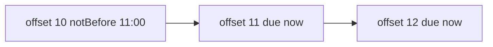

If strict partition order is used, B and C wait behind A.

### 10.3 External Scheduler

Failed records are stored in a DB/scheduler and re-emitted to Kafka when due.

Pros:

- flexible scheduling;
- queryable;
- can prioritize.

Cons:

- adds another durable system;
- requires exactly-once-ish bridging discipline;
- can create operational split-brain between scheduler and Kafka.

### 10.4 Backoff Topic Chain

Consumer publishes to next retry topic based on attempt.

```text
main -> retry.1m -> retry.5m -> retry.30m -> dlq
```

This is usually the best default for microservice event pipelines.

---

## 11. Ordering and Error Handling

Kafka ordering is per partition. Error handling can violate perceived entity order.

Example:

```text
partition 3:
offset 100: CaseOpened(case-1)
offset 101: CaseEscalated(case-1)
offset 102: CaseClosed(case-1)
```

If offset 101 fails and is sent to retry topic while offset 102 is processed, downstream state can become invalid.

### 11.1 Ordering Policy Options

| Policy | Behavior | Use when |
|---|---|---|
| Stop partition on error | Do not commit beyond failed record | Strict ordering required |
| Retry out-of-band | Move failed record to retry and continue | Availability > strict order |
| Entity parking lot | Park later records for same entity | Per-entity order required |
| State-machine guard | Later event rejected until prerequisite exists | Domain can self-heal |
| Compensating event | Allow out-of-order then correct later | Eventually consistent domain |

### 11.2 Per-Entity Parking Lot

A more advanced pattern:

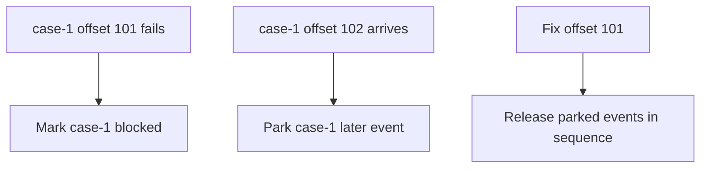

This preserves ordering per entity but adds state.

Required table:

```sql
create table entity_processing_block (
    entity_id varchar primary key,
    blocked_since timestamp not null,
    failed_topic varchar not null,
    failed_partition int not null,
    failed_offset bigint not null,
    reason varchar not null
);

create table parked_event (
    entity_id varchar not null,
    sequence_no bigint,
    source_topic varchar not null,
    source_partition int not null,
    source_offset bigint not null,
    payload jsonb not null,
    parked_at timestamp not null,
    primary key (entity_id, source_topic, source_partition, source_offset)
);
```

Trade-off:

- stronger business ordering;
- more operational complexity;
- need cleanup/replay tooling;
- risk of unbounded parking if entity stays broken.

---

## 12. Poison Event Handling

A poison event is a record that repeatedly causes failure and prevents progress.

Signs:

- same topic/partition/offset fails repeatedly;
- stack trace hash stable;
- retry attempts high;
- consumer lag grows behind one record;
- redeploy does not fix;
- CPU spikes due to tight retry loop.

Response:

1. Stop infinite retry.
2. Capture original record and failure metadata.
3. Move to DLQ/quarantine if policy allows.
4. Commit only after DLQ/quarantine publish succeeds.
5. Alert owner.
6. Add regression test using captured payload.
7. Replay after fix through controlled tool.

Do not simply skip poison events silently.

---

## 13. Retry Budget

Retry budget prevents endless attempts.

Example policy:

```yaml
retryPolicy:
  inline:
    maxAttempts: 3
    backoff: [100ms, 500ms, 2s]
  delayed:
    topics:
      - name: case.lifecycle.retry.1m
        delay: PT1M
      - name: case.lifecycle.retry.10m
        delay: PT10M
      - name: case.lifecycle.retry.1h
        delay: PT1H
    maxTotalAttempts: 9
  terminal:
    topic: case.lifecycle.dlq
```

Retry budget dimensions:

| Dimension | Reason |
|---|---|
| max attempts | stop infinite loop |
| max age | old event may be harmful |
| max cumulative delay | SLA impact |
| per-error-class policy | invalid data should not retry |
| per-entity cap | avoid one entity dominating |
| global retry rate | avoid thundering herd |

Retry should be treated as load. During outage, retry can amplify traffic.

---

## 14. Retry Storm and Thundering Herd

If a downstream service is down for 30 minutes, all failed events may become due around the same time.

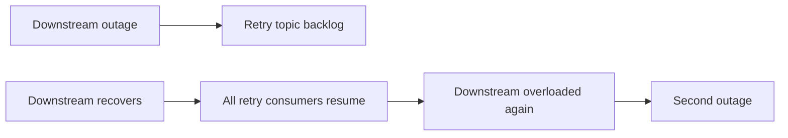

Mitigations:

- exponential backoff;
- jitter;
- retry rate limit;
- circuit breaker;
- bulkhead per downstream dependency;
- pause/resume consumer partitions;
- drain slowly after recovery;
- monitor dependency saturation.

Example jitter:

```java
Duration backoffWithJitter(int attempt) {
    long baseMillis = Math.min(60_000, 1_000L * (1L << Math.min(attempt, 6)));
    long jitter = ThreadLocalRandom.current().nextLong(0, baseMillis / 2 + 1);
    return Duration.ofMillis(baseMillis + jitter);
}
```

---

## 15. DLQ Topic Naming

Good topic names encode source and purpose.

```text
<domain>.<event-stream>.<version>.retry.<delay>
<domain>.<event-stream>.<version>.dlt
<domain>.<event-stream>.<version>.quarantine
```

Examples:

```text
case.lifecycle.v1
case.lifecycle.v1.retry.1m
case.lifecycle.v1.retry.10m
case.lifecycle.v1.retry.1h
case.lifecycle.v1.dlt
case.lifecycle.v1.quarantine
```

Avoid:

```text
dlq
errors
failed-events
misc-retry
```

Bad names make ownership and lineage unclear.

---

## 16. DLQ Partitioning

DLQ partitioning is not trivial.

Options:

| DLQ key | Benefit | Risk |
|---|---|---|
| original key | preserves entity locality | hot failed entity creates hotspot |
| original topic-partition | easier source replay | less domain-friendly |
| failure type | easy operational grouping | loses entity ordering |
| random | spreads load | hard replay/order |
| composite | flexible | more complex |

Default recommendation:

```text
Use original record key for DLQ if entity-level replay matters.
Use original topic-partition-offset in headers for exact lineage.
```

Do not rely on DLQ offset as source identity.

---

## 17. DLQ Retention

DLQ retention must be long enough for operational reality.

Questions:

- How long until someone notices?
- How long until root cause is fixed?
- How long until replay is approved?
- Are failed records legally/audit relevant?
- Does payload contain PII?
- Is compacted DLQ appropriate? Usually no.

For regulatory case-management:

```text
DLQ retention should usually align with incident audit requirements, not developer convenience.
```

In many systems, DLQ should be retained longer than normal retry topics, but access should be stricter.

---

## 18. Replay Design

Replay is not “produce the DLQ payload back to main topic” blindly.

Replay must answer:

- What was fixed?
- Is the original event still valid?
- Has the entity state moved on?
- Should replay preserve original key?
- Should replay preserve original timestamp?
- Should replay go to original topic or a repair topic?
- Should consumers distinguish replay from first delivery?
- How do we avoid replaying twice?

### 18.1 Replay Envelope

When replaying, add headers:

```text
x-replayed: true
x-replay-id: replay-20260628-001
x-replay-requested-by: user@example.com
x-replay-reason: fixed schema mapping for PRE_ESCALATED
x-original-topic: case.lifecycle.v1
x-original-partition: 7
x-original-offset: 123456
x-original-failure-id: 01JZ...
```

### 18.2 Replay Modes

| Mode | Meaning |
|---|---|
| Same-topic replay | Re-publish to original topic |
| Repair-topic replay | Publish to `<topic>.repair` consumed by same projection |
| Direct projector replay | Tool calls consumer logic directly |
| Bulk rebuild | Rebuild projection from source-of-truth/log |
| Manual correction | Do not replay, correct state with audit record |

Same-topic replay is simple but can confuse consumers that assume topic timestamp/order equals original business time.

---

## 19. Kafka Transaction Use in Error Handling

If consumer reads from topic A and writes to topic B/DLQ, Kafka transactions can atomically commit output records and source offsets.

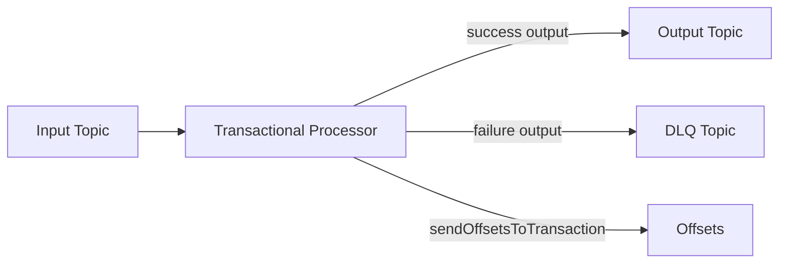

Pseudo-flow:

```java
producer.initTransactions();

while (running) {
    ConsumerRecords<String, Event> records = consumer.poll(Duration.ofMillis(500));

    producer.beginTransaction();
    Map<TopicPartition, OffsetAndMetadata> offsets = new HashMap<>();

    for (ConsumerRecord<String, Event> record : records) {
        try {
            ProducerRecord<String, ProjectionEvent> output = transform(record);
            producer.send(output);
        } catch (NonRetryableException ex) {
            producer.send(toDlq(record, ex));
        }
        offsets.put(
            new TopicPartition(record.topic(), record.partition()),
            new OffsetAndMetadata(record.offset() + 1)
        );
    }

    producer.sendOffsetsToTransaction(offsets, consumer.groupMetadata());
    producer.commitTransaction();
}
```

This protects Kafka-to-Kafka processing. It does not make external HTTP/DB side effects exactly-once.

---

## 20. Deserialization Error Handling

Deserialization errors happen before your typed handler receives a domain object.

Bad assumption:

```text
try { handle(event); } catch (...) { sendToDlq(event); }
```

If deserialization fails, `event` does not exist.

Design options:

1. Use framework-level deserialization error handler.
2. Consume raw bytes and deserialize inside application boundary.
3. Have a side-channel raw DLQ for malformed records.
4. Validate schema at producer boundary to reduce bad records.

Raw DLQ record should include:

- raw bytes or secure pointer to raw bytes;
- schema ID if encoded in wire format;
- deserializer class/config;
- exception class/message;
- topic/partition/offset;
- headers.

---

## 21. Business Rejection Is Not Always Technical Failure

Example:

```text
CaseEscalated(caseId=123)
```

Consumer reads current case state and finds case already closed.

This can mean:

- event is out of order;
- upstream emitted invalid transition;
- consumer state is stale;
- duplicate event;
- legitimate no-op;
- fraud/error requiring investigation.

Do not blindly send all business rejections to technical DLQ.

Better taxonomy:

```text
case.lifecycle.rejected.v1
case.lifecycle.quarantine.v1
case.lifecycle.dlt
```

A rejected event may be a domain signal, not an infrastructure error.

---

## 22. Error Classification Code Shape

Use explicit classification.

```java
public enum FailureClass {
    TRANSIENT_DEPENDENCY,
    RATE_LIMITED,
    NON_RETRYABLE_DATA,
    SCHEMA_INCOMPATIBLE,
    BUSINESS_REJECTED,
    POISON_EVENT,
    PROGRAMMING_BUG,
    UNKNOWN
}
```

Classifier:

```java
public final class FailureClassifier {
    public FailureClass classify(Throwable error) {
        if (error instanceof SocketTimeoutException) {
            return FailureClass.TRANSIENT_DEPENDENCY;
        }
        if (error instanceof RateLimitedException) {
            return FailureClass.RATE_LIMITED;
        }
        if (error instanceof InvalidSchemaException) {
            return FailureClass.SCHEMA_INCOMPATIBLE;
        }
        if (error instanceof BusinessTransitionRejectedException) {
            return FailureClass.BUSINESS_REJECTED;
        }
        if (error instanceof NullPointerException) {
            return FailureClass.PROGRAMMING_BUG;
        }
        return FailureClass.UNKNOWN;
    }
}
```

Policy:

```java
public sealed interface FailureDecision {
    record RetryInline(Duration backoff) implements FailureDecision {}
    record PublishRetryTopic(String topic, Instant notBefore) implements FailureDecision {}
    record PublishDlq(String topic) implements FailureDecision {}
    record PublishQuarantine(String topic) implements FailureDecision {}
    record StopConsumer() implements FailureDecision {}
}
```

Avoid error handling code shaped like:

```java
catch (Exception ex) {
    log.warn("failed", ex);
}
```

That is data loss disguised as resilience.

---

## 23. Observability for Error Handling

Required metrics:

| Metric | Why it matters |
|---|---|
| processed_total | baseline throughput |
| processing_failed_total by class | failure classification |
| retry_published_total | retry volume |
| retry_exhausted_total | terminal failures |
| dlq_published_total | DLQ inflow |
| quarantine_published_total | manual workload |
| retry_age_seconds | stale retry detection |
| dlq_oldest_age_seconds | unowned DLQ detection |
| poison_offset_repeats | same offset failing repeatedly |
| replay_total | recovery activity |
| replay_failed_total | bad recovery process |

Required logs:

- topic;
- partition;
- offset;
- key;
- event ID;
- correlation ID;
- causation ID;
- consumer group;
- application version;
- failure class;
- retry attempt;
- action taken.

Example log shape:

```json
{
  "level": "WARN",
  "message": "event processing failed; publishing to retry topic",
  "topic": "case.lifecycle.v1",
  "partition": 7,
  "offset": 123456,
  "key": "case-81273",
  "eventId": "evt-999",
  "consumerGroup": "case-risk-projection-v3",
  "failureClass": "TRANSIENT_DEPENDENCY",
  "attempt": 2,
  "nextTopic": "case.lifecycle.v1.retry.10m",
  "correlationId": "corr-123"
}
```

---

## 24. Alerting Rules

Alert on symptoms that require action.

| Alert | Severity | Action |
|---|---|---|
| DLQ inflow > 0 for critical stream | High | Triage immediately |
| DLQ rate spike | High | Check deployment/schema/upstream |
| Retry backlog age exceeds SLA | Medium/high | Check downstream dependency |
| Same offset fails > N times | High | Poison event |
| Quarantine oldest age > SLA | High | Manual process stuck |
| Replay failure | High | Recovery unsafe |
| Consumer lag + retry errors | High | Downstream/infrastructure pressure |

Do not alert only on consumer crash. Many broken pipelines keep running while silently writing DLQ.

---

## 25. Testing Error Handling

Minimum tests:

### 25.1 Transient Failure Then Success

```text
Given downstream fails twice
When consumer processes record
Then it retries according to policy
And commits only after success
```

### 25.2 Retry Exhausted

```text
Given downstream keeps timing out
When retry budget is exhausted
Then record is published to DLQ
And source offset is committed only after DLQ publish succeeds
```

### 25.3 Non-Retryable Data Error

```text
Given payload has invalid enum
When consumer processes record
Then it does not retry infinitely
And record is sent to DLQ/quarantine with reason
```

### 25.4 Deserialization Error

```text
Given record bytes cannot be deserialized
When consumer polls
Then raw failure is captured
And offset handling follows policy
```

### 25.5 Ordering Failure

```text
Given event N fails for entity E
And event N+1 arrives
When ordering policy is strict
Then N+1 is not applied before N
```

### 25.6 Crash Windows

Test crash windows explicitly:

| Crash point | Expected result |
|---|---|
| after side effect before commit | duplicate-safe reprocess |
| after retry topic publish before commit | duplicate retry-safe |
| after DLQ publish before commit | duplicate DLQ-safe |
| after commit before DLQ publish | must not happen |

---

## 26. Regulatory Case-Management Example

Input topic:

```text
case.lifecycle.v1
```

Events:

```text
CaseOpened
EvidenceSubmitted
RiskScoreChanged
CaseEscalated
NoticeIssued
CaseClosed
```

Consumer:

```text
case-enforcement-projection
```

Failure policy:

| Failure | Policy |
|---|---|
| DB timeout | inline retry 3 times, then retry.1m |
| DB outage | retry topics with jitter and rate limit |
| invalid lifecycle transition | quarantine, not generic DLQ |
| unsupported event version | DLQ/schema incident |
| duplicate event ID | idempotent skip with metric |
| out-of-order sequence | entity parking lot |
| programming bug | stop consumer for critical stream |

Topology:

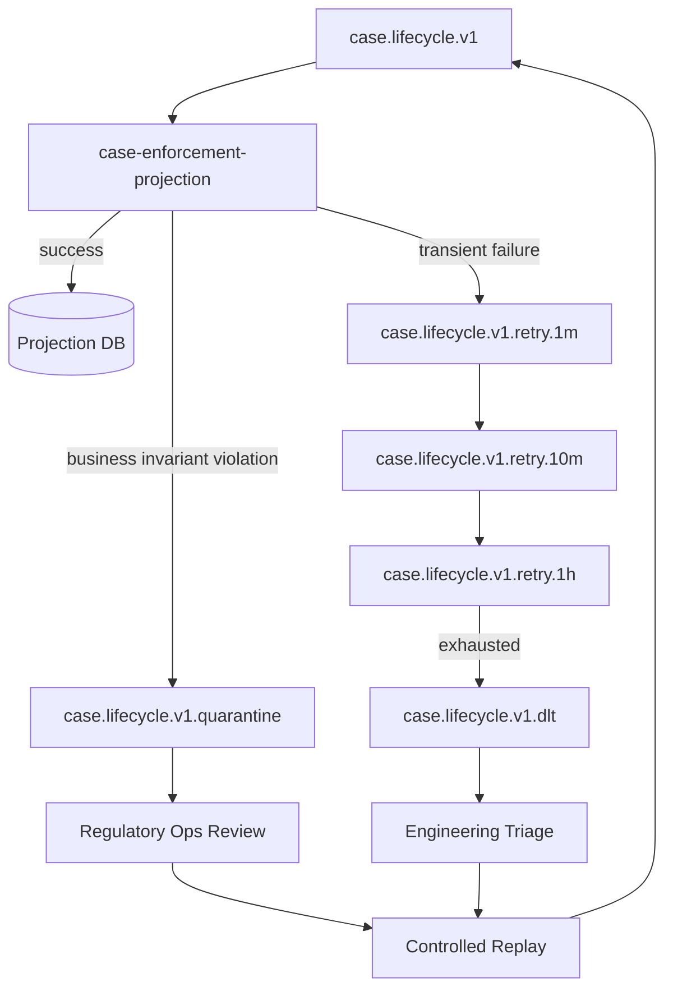

Important: business invariant violation goes to quarantine, not ordinary DLQ, because it may imply a legally relevant lifecycle inconsistency.

---

## 27. Common Anti-Patterns

### 27.1 Infinite Retry in Poll Loop

```text
while true -> process same bad record -> fail -> sleep -> retry forever
```

Impact:

- partition stuck;
- lag grows;
- dependency overloaded;
- no terminal signal.

Fix:

- retry budget;
- poison detection;
- DLQ/quarantine;
- alert.

### 27.2 Catch-and-Commit

```java
try {
    process(record);
} catch (Exception ex) {
    log.error("failed", ex);
}
consumer.commitSync();
```

This loses data.

### 27.3 DLQ Without Replay

DLQ that nobody checks is just a slower deletion mechanism.

### 27.4 Retrying Non-Retryable Errors

Invalid enum does not become valid after sleeping 30 seconds.

### 27.5 One Global DLQ

A single `errors` topic mixes unrelated domains, schemas, owners, and severities.

### 27.6 Retrying Everything at Same Time

No jitter + downstream recovery = retry storm.

### 27.7 Treating Business Rejection as Technical Failure

Some rejected events are valid domain facts.

### 27.8 DLQ Without Original Coordinates

Without original topic/partition/offset, replay and forensic analysis become weak.

---

## 28. Production Checklist

Before production, answer:

- What failure classes exist?
- Which failures are retriable?
- What is max retry attempt?
- What is max retry age?
- Which topic receives terminal failures?
- Who owns the DLQ?
- What alert fires when DLQ receives data?
- How is DLQ replay performed?
- Is replay idempotent?
- Are DLQ payloads redacted/encrypted?
- What is retention?
- How is ordering preserved or intentionally relaxed?
- What is the poison event procedure?
- What happens if DLQ publishing fails?
- What happens if consumer crashes after side effect but before commit?
- What happens if consumer crashes after DLQ publish but before commit?

---

## 29. Deliberate Practice

### Exercise 1 — Classify Failures

Ambil 20 failure dari production logs atau test cases. Kelompokkan menjadi:

- transient;
- deterministic;
- schema;
- business rejection;
- poison;
- programming bug;
- unknown.

Untuk setiap kelas, tulis policy.

### Exercise 2 — Design Retry Topology

Untuk stream `case.lifecycle.v1`, desain:

- retry topics;
- DLQ;
- quarantine;
- retention;
- alert;
- replay flow.

### Exercise 3 — Crash Window Test

Buat integration test yang mematikan consumer pada empat titik:

1. after poll;
2. after side effect;
3. after retry publish;
4. after commit.

Buktikan tidak ada silent loss.

### Exercise 4 — Poison Event Drill

Masukkan event yang selalu gagal.

Expected:

- retry budget berjalan;
- event masuk quarantine/DLQ;
- partition lanjut jika policy mengizinkan;
- alert muncul;
- replay tool bisa memproses setelah fix.

---

## 30. Ringkasan

Kafka error handling bukan fitur tunggal. Ia adalah desain end-to-end.

Prinsip utama:

1. Offset commit bukan bukti sukses bisnis.
2. Jangan commit melewati record kecuali outcome-nya durable.
3. Retry hanya berguna jika waktu bisa mengubah outcome.
4. Retry panjang jangan menahan poll loop.
5. DLQ harus punya owner, metadata, alert, retention, dan replay.
6. Ordering harus dinyatakan sebagai policy eksplisit.
7. Quarantine berbeda dari DLQ teknis.
8. External side effects butuh idempotency.
9. Replay adalah operasi produksi, bukan script ad hoc.
10. Semua failure harus meninggalkan evidence.

Part berikutnya membahas schema discipline: bagaimana JSON, Avro, Protobuf, Schema Registry, dan compatibility policy menentukan apakah event stream bisa berevolusi tanpa menghancurkan consumer.

---

## Referensi

- Apache Kafka Documentation — https://kafka.apache.org/documentation/
- Apache Kafka APIs — https://kafka.apache.org/42/apis/
- Apache Kafka Connect User Guide, Errors and DLQ — https://kafka.apache.org/40/kafka-connect/user-guide/
- Confluent: Error Handling Patterns for Apache Kafka Applications — https://www.confluent.io/blog/error-handling-patterns-in-kafka/
- Confluent: Apache Kafka Dead Letter Queue Guide — https://www.confluent.io/learn/kafka-dead-letter-queue/
