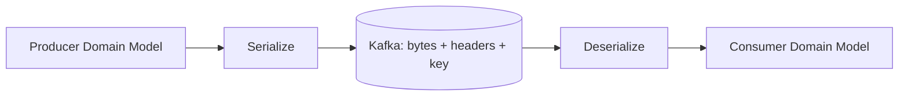
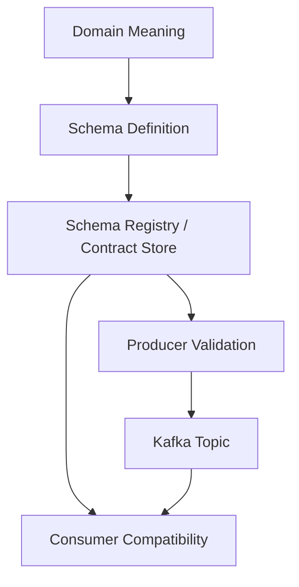
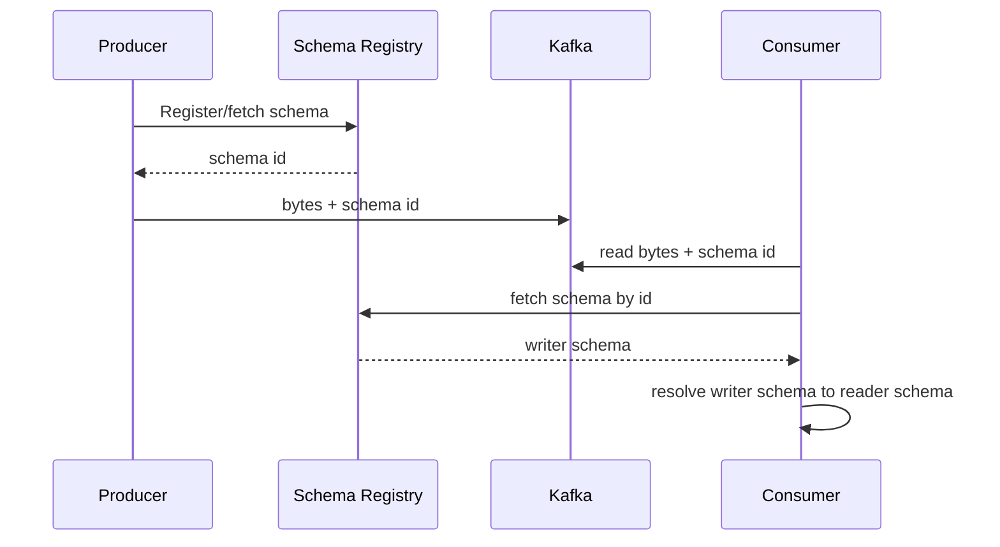
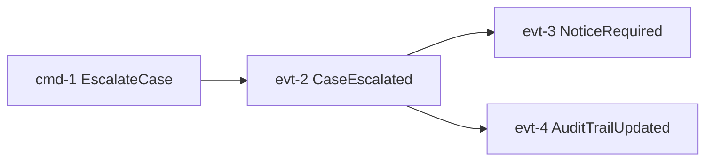
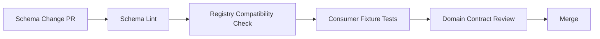
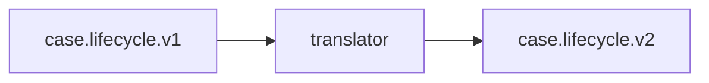

------
title: Learn Java Messaging and Event Streaming - Part 022
description: Kafka schema discipline with JSON, Avro, Protobuf, Schema Registry, compatibility modes, event envelopes, semantic versioning, and contract governance.
series: learn-java-messaging-event-streaming
seriesTitle: Learn Java Messaging and Event Streaming
order: 22
partTitle: Kafka Schema Discipline: JSON, Avro, Protobuf, Schema Registry, and Compatibility
tags:
- java
- kafka
- schema-registry
- avro
- protobuf
- json-schema
- schema-evolution
- compatibility
- event-contracts
- governance
- event-streaming
- distributed-systems
date: 2026-06-28
---

# Part 022 — Kafka Schema Discipline: JSON, Avro, Protobuf, Schema Registry, and Compatibility

## Tujuan Bagian Ini

Event stream adalah kontrak antar waktu. Producer hari ini bisa dibaca consumer minggu depan, bulan depan, atau oleh service yang belum ada saat event dibuat.

Karena itu schema bukan detail serialization. Schema adalah boundary organisasi, runtime, compatibility, audit, dan evolusi domain.

Setelah bagian ini, kamu harus bisa:

1. Menjelaskan perbedaan payload schema, event envelope, semantic contract, dan business invariant.
2. Memilih JSON, JSON Schema, Avro, atau Protobuf secara rasional.
3. Mendesain schema evolution yang aman untuk producer dan consumer.
4. Memahami backward, forward, full compatibility.
5. Menggunakan Schema Registry sebagai contract registry, bukan sekadar serializer helper.
6. Menghindari event design yang membuat replay dan audit rusak.
7. Membuat compatibility checklist untuk event-driven system.

---

## 1. Mental Model Utama

Kafka menyimpan bytes. Consumer memberi makna pada bytes.



Jika schema tidak dikelola, maka event stream menjadi implicit contract:

```text
"Consumer akan berharap field X ada, type Y, meaning Z, walaupun tidak ada yang menjaga."
```

Itu rapuh.

Schema discipline membuat kontrak menjadi eksplisit:



Schema bukan hanya bentuk data. Schema menjawab:

- field apa yang ada?
- type apa?
- mana yang optional?
- default-nya apa?
- field ini berarti apa secara bisnis?
- perubahan apa yang aman?
- consumer lama masih bisa baca event baru?
- consumer baru masih bisa baca event lama?

---

## 2. Event Contract Layers

Pisahkan empat layer:

| Layer | Example | Dikelola oleh |
|---|---|---|
| Wire format | Avro binary, Protobuf binary, JSON | serializer/deserializer |
| Structural schema | field, type, default, enum | schema registry/build checks |
| Semantic contract | meaning of field, units, lifecycle semantics | domain ownership/design review |
| Operational contract | topic, key, partitioning, retention, ACL | platform/stream governance |

Contoh:

```json
{
  "caseId": "CASE-123",
  "riskScore": 82
}
```

Structural schema menjawab `riskScore` adalah integer.

Semantic contract menjawab:

- apakah range 0-100?
- apakah 82 berarti high risk?
- apakah score dihitung saat event dibuat atau saat dibaca?
- apakah score bisa turun?
- apakah null berarti unknown atau not applicable?

Banyak incident terjadi bukan karena schema structural rusak, tetapi karena semantic contract berubah diam-diam.

---

## 3. Data Format Options

### 3.1 Plain JSON

Plain JSON mudah dibaca dan cepat dipakai.

Example:

```json
{
  "eventId": "evt-123",
  "caseId": "case-123",
  "status": "ESCALATED",
  "occurredAt": "2026-06-28T10:15:30Z"
}
```

Pros:

- human-readable;
- tooling luas;
- mudah debug;
- cocok untuk low-friction integration.

Cons:

- schema sering implicit;
- type ambiguity;
- compatibility sulit ditegakkan;
- payload lebih besar;
- enum/type errors muncul runtime;
- field rename mudah merusak consumer.

Plain JSON bisa diterima untuk prototyping atau low-criticality telemetry. Untuk platform event jangka panjang, gunakan JSON Schema atau format schema-driven lain.

---

### 3.2 JSON Schema

JSON Schema membuat JSON lebih eksplisit.

Example:

```json
{
  "$schema": "https://json-schema.org/draft/2020-12/schema",
  "title": "CaseEscalated",
  "type": "object",
  "required": ["eventId", "caseId", "occurredAt", "escalationLevel"],
  "properties": {
    "eventId": { "type": "string" },
    "caseId": { "type": "string" },
    "occurredAt": { "type": "string", "format": "date-time" },
    "escalationLevel": {
      "type": "string",
      "enum": ["SUPERVISOR", "ENFORCEMENT", "LEGAL"]
    },
    "reason": { "type": ["string", "null"] }
  },
  "additionalProperties": false
}
```

Pros:

- still JSON;
- explicit validation;
- good for REST/event contract alignment;
- easy for non-JVM consumers.

Cons:

- compatibility can be subtle;
- binary efficiency lower than Avro/Protobuf;
- schema evolution rules must be enforced;
- teams may overuse permissive schemas.

Good for:

- polyglot platform;
- externally visible event contracts;
- audit/debug friendliness;
- teams already using JSON deeply.

---

### 3.3 Avro

Avro is schema-driven and commonly used with Kafka Schema Registry.

Example:

```json
{
  "type": "record",
  "name": "CaseEscalated",
  "namespace": "com.example.caseevents.v1",
  "fields": [
    { "name": "eventId", "type": "string" },
    { "name": "caseId", "type": "string" },
    { "name": "occurredAt", "type": "string" },
    { "name": "escalationLevel", "type": {
      "type": "enum",
      "name": "EscalationLevel",
      "symbols": ["SUPERVISOR", "ENFORCEMENT", "LEGAL"]
    }},
    { "name": "reason", "type": ["null", "string"], "default": null }
  ]
}
```

Pros:

- compact;
- mature Kafka ecosystem;
- strong schema evolution support;
- good with generated Java classes or generic records;
- no field names repeated in every message.

Cons:

- less human-readable on wire;
- unions/defaults require discipline;
- enum evolution can be dangerous;
- schema registry dependency becomes part of platform.

Good for:

- high-throughput Kafka event streams;
- internal data products;
- event sourcing/replay use cases;
- schema governance with compatibility checks.

---

### 3.4 Protobuf

Protocol Buffers are schema-driven with numeric field tags.

Example:

```proto
syntax = "proto3";

package com.example.caseevents.v1;

message CaseEscalated {
  string event_id = 1;
  string case_id = 2;
  string occurred_at = 3;
  EscalationLevel escalation_level = 4;
  string reason = 5;
}

enum EscalationLevel {
  ESCALATION_LEVEL_UNSPECIFIED = 0;
  SUPERVISOR = 1;
  ENFORCEMENT = 2;
  LEGAL = 3;
}
```

Pros:

- compact and fast;
- excellent polyglot support;
- explicit field numbers help evolution;
- widely used for service contracts.

Cons:

- field number discipline is critical;
- default values in proto3 can hide presence issues;
- semantic nullability/presence needs care;
- generated-code workflow can be heavier.

Good for:

- polyglot systems;
- teams already using gRPC/protobuf;
- strong binary contracts;
- cross-language domain event APIs.

---

## 4. Choosing a Format

| Concern | Plain JSON | JSON Schema | Avro | Protobuf |
|---|---:|---:|---:|---:|
| Human readability | Excellent | Excellent | Low | Low/medium |
| Compactness | Low | Low | High | High |
| Schema governance | Weak | Good | Excellent | Excellent |
| Kafka ecosystem maturity | Medium | Good | Excellent | Excellent |
| Polyglot support | Excellent | Excellent | Good | Excellent |
| Evolution discipline | Manual | Good | Strong | Strong |
| Generated Java types | Optional | Optional | Common | Common |
| Best for | Simple/debug | JSON contracts | Kafka data products | Polyglot binary APIs |

Default recommendations:

```text
For serious internal Kafka event streams: Avro or Protobuf.
For externally inspected/event API contracts: JSON Schema can be appropriate.
For prototypes only: plain JSON.
```

But format is less important than discipline. Bad Avro is still bad architecture.

---

## 5. Schema Registry Mental Model

Schema Registry is a metadata service for schemas and compatibility.



Key idea:

```text
Kafka stores bytes. Schema Registry tells clients how to interpret those bytes.
```

Schema Registry usually stores:

- subject;
- schema versions;
- schema IDs;
- compatibility settings;
- references/imports;
- metadata/rules depending on platform.

It should be treated as production dependency and governance boundary.

---

## 6. Subject Naming Strategy

A subject is the name under which schemas evolve.

Common strategies:

| Strategy | Shape | Meaning |
|---|---|---|
| TopicNameStrategy | `<topic>-value` | one value schema evolution line per topic |
| RecordNameStrategy | fully qualified record name | schema evolves by record type |
| TopicRecordNameStrategy | `<topic>-<record>` | record evolution scoped per topic |

Decision:

- one event type per topic: TopicNameStrategy is simpler;
- multiple event types in one topic: RecordNameStrategy or TopicRecordNameStrategy may fit;
- event-carried type envelope: be careful with compatibility across variants.

Avoid mixing unrelated event types in one topic unless you have a strong reason and a schema strategy that supports it.

---

## 7. Compatibility Modes

Compatibility answers whether new schemas can coexist with old data and old consumers/producers.

Common modes:

| Mode | Meaning |
|---|---|
| BACKWARD | New consumers/readers can read data written with previous schema |
| FORWARD | Old consumers/readers can read data written with new schema |
| FULL | Both backward and forward compatibility |
| NONE | No compatibility check |

Also common:

| Transitive mode | Meaning |
|---|---|
| BACKWARD_TRANSITIVE | New schema compatible with all previous versions |
| FORWARD_TRANSITIVE | Previous schemas can read data from new schema across all versions |
| FULL_TRANSITIVE | Both directions across all versions |

Mental model:

```text
Backward compatibility protects new code reading old events.
Forward compatibility protects old code reading new events.
Full compatibility protects rolling upgrade and replay better.
```

For Kafka streams with replay and long retention, transitive compatibility is often more important than teams expect.

---

## 8. Evolution Rules: Safe and Unsafe Changes

### 8.1 Usually Safe

| Change | Condition |
|---|---|
| Add optional field | Has default or nullable semantics |
| Add field with default | Consumer can use default for old events |
| Widen documentation | Does not change machine contract |
| Add enum only if consumers tolerate unknown | Otherwise risky |
| Add new event type to separate topic | Safer than mixing |

### 8.2 Usually Unsafe

| Change | Why |
|---|---|
| Remove required field | Old/new consumers may fail |
| Rename field | Equivalent to remove + add |
| Change type | Reader/writer mismatch |
| Change unit silently | Semantic break |
| Change meaning of enum | Semantic break |
| Reuse Protobuf field number | Catastrophic confusion |
| Remove enum symbol used in history | Replay failure |
| Make optional field required | Old events lack it |

Critical principle:

```text
Schema compatibility checks catch structural breaks. They do not catch every semantic break.
```

Example semantic break:

```text
riskScore: integer
old meaning: 0-100
new meaning: 0-1000
```

Schema may pass. Consumers still break logically.

---

## 9. Event Envelope Design

A good envelope separates common metadata from domain payload.

```json
{
  "eventId": "evt-01JZABC",
  "eventType": "CaseEscalated",
  "eventVersion": "1.2.0",
  "occurredAt": "2026-06-28T10:15:30Z",
  "producedAt": "2026-06-28T10:15:32Z",
  "producer": "case-command-service",
  "correlationId": "corr-123",
  "causationId": "cmd-789",
  "tenantId": "regulator-id",
  "subject": {
    "type": "CASE",
    "id": "case-81273"
  },
  "payload": {
    "caseId": "case-81273",
    "escalationLevel": "ENFORCEMENT",
    "reason": "SLA_BREACH"
  }
}
```

Common fields:

| Field | Purpose |
|---|---|
| eventId | idempotency/dedup/audit |
| eventType | routing/deserialization/meaning |
| eventVersion | semantic version or contract version |
| occurredAt | business time |
| producedAt | system emission time |
| correlationId | request/process trace |
| causationId | event/command that caused this event |
| producer | ownership/debugging |
| tenantId | multi-tenancy/access |
| subject | entity identity |
| payload | domain data |

Do not put everything in headers. Headers are useful for operational metadata, but event body should remain self-describing enough for replay and audit.

---

## 10. Event ID, Correlation ID, and Causation ID

These IDs are different.

| ID | Meaning |
|---|---|
| eventId | unique identity of this event |
| correlationId | ties a broader workflow/request together |
| causationId | identifies immediate cause |
| commandId | unique command/request being handled |
| traceparent | distributed tracing context |

Example:

```text
Command: EscalateCase(commandId=cmd-1, correlationId=corr-9)
Event: CaseEscalated(eventId=evt-2, causationId=cmd-1, correlationId=corr-9)
Event: NoticeRequired(eventId=evt-3, causationId=evt-2, correlationId=corr-9)
```

This creates causal graph:



For regulatory workflows, causality reconstruction is not optional.

---

## 11. Key Schema vs Value Schema

Kafka record has key and value.

```text
key   = case-81273
value = CaseEscalated payload
```

Key is not just lookup metadata. Key determines partitioning if using default partitioning behavior.

Design key schema carefully:

| Key choice | Effect |
|---|---|
| caseId | per-case ordering and locality |
| customerId | per-customer ordering but case events interleaved |
| random UUID | good distribution, weak entity ordering |
| composite tenantId:caseId | tenant isolation + case locality |
| null | round-robin/sticky behavior, no entity affinity |

If key format changes, partition assignment can change. That can break ordering assumptions.

Recommendation:

```text
Document key schema in the same contract as value schema.
```

---

## 12. Headers Contract

Headers are good for operational metadata:

```text
traceparent
correlation-id
schema-id
producer-version
retry-attempt
original-topic
original-partition
original-offset
```

But headers should not carry required domain state unless every consumer framework preserves them and contract tests enforce it.

Problems with overusing headers:

- harder to inspect in some tools;
- some bridges/connectors may drop/mangle headers;
- schema registry usually governs value/key, not all header semantics;
- replay tooling may forget to preserve headers.

Rule:

```text
If losing the field changes business meaning, it belongs in payload/envelope, not only in headers.
```

---

## 13. Versioning Strategy

There are several version concepts.

| Version | Meaning |
|---|---|
| schema version | registry version for a subject |
| event version | semantic version of event contract |
| topic version | major compatibility boundary in topic name |
| application version | producer/consumer deployment version |

Example topic:

```text
case.lifecycle.v1
```

Event type:

```text
CaseEscalated
```

Schema version:

```text
subject case.lifecycle.v1-value version 17
```

Event semantic version:

```text
1.4.0
```

Use topic version for major incompatible contract families.

```text
case.lifecycle.v1
case.lifecycle.v2
```

Do not create `v2` for every small additive change. That defeats schema evolution.

---

## 14. Topic Versioning vs Schema Evolution

| Change type | Recommended action |
|---|---|
| Add optional field | evolve schema same topic |
| Add new enum with tolerant consumers | evolve schema, coordinate |
| Rename required field | new field + deprecate old, later major topic if needed |
| Change meaning of field | new field or new event type/topic |
| Change key semantics | likely new topic |
| Change event granularity | likely new topic/event type |
| Change domain lifecycle meaning | formal migration/versioning |

Topic versioning is expensive:

- dual publishing;
- dual consuming;
- migration tooling;
- retention duplication;
- operational monitoring;
- backfill/replay decisions.

Use it for real incompatibility, not casual cleanup.

---

## 15. Additive Change Done Right

Initial Avro schema:

```json
{
  "type": "record",
  "name": "CaseOpened",
  "fields": [
    { "name": "eventId", "type": "string" },
    { "name": "caseId", "type": "string" }
  ]
}
```

Add optional field:

```json
{
  "type": "record",
  "name": "CaseOpened",
  "fields": [
    { "name": "eventId", "type": "string" },
    { "name": "caseId", "type": "string" },
    { "name": "sourceChannel", "type": ["null", "string"], "default": null }
  ]
}
```

Consumer logic:

```java
String sourceChannel = Optional.ofNullable(event.getSourceChannel())
    .orElse("UNKNOWN");
```

Semantic documentation:

```text
sourceChannel=null means producer version did not provide source channel.
sourceChannel=UNKNOWN means producer knew the concept but could not classify it.
```

Those two meanings are different.

---

## 16. Field Deprecation Pattern

Do not rename directly.

Bad:

```text
caseStatus -> lifecycleStatus
```

This breaks consumers expecting `caseStatus`.

Better:

1. Add `lifecycleStatus` optional.
2. Populate both fields.
3. Migrate consumers to `lifecycleStatus`.
4. Mark `caseStatus` deprecated in schema docs.
5. Keep field until major version boundary or forever if retained history requires it.

Example:

```json
{
  "name": "caseStatus",
  "type": ["null", "string"],
  "default": null,
  "doc": "Deprecated. Use lifecycleStatus."
}
```

Remember: retained old events still have old fields. Replay makes deprecation timeline longer.

---

## 17. Enum Evolution

Enums are dangerous.

Example:

```text
OPEN, ESCALATED, CLOSED
```

Add:

```text
PRE_ESCALATED
```

Schema compatibility may allow or reject depending on format/config, but consumer code can still fail:

```java
switch (status) {
    case OPEN -> ...;
    case ESCALATED -> ...;
    case CLOSED -> ...;
}
```

If no default branch exists, new enum can crash old consumer.

Safer patterns:

### 17.1 Unknown Tolerant Consumer

```java
switch (status) {
    case OPEN -> handleOpen(event);
    case ESCALATED -> handleEscalated(event);
    case CLOSED -> handleClosed(event);
    default -> handleUnknownStatus(event);
}
```

### 17.2 Protobuf Unspecified First Value

```proto
enum CaseStatus {
  CASE_STATUS_UNSPECIFIED = 0;
  OPEN = 1;
  ESCALATED = 2;
  CLOSED = 3;
}
```

### 17.3 Avoid Enum for Highly Dynamic Taxonomy

If values are administrative/configurable, use string code + registry table, not compiled enum.

---

## 18. Null, Missing, Empty, Unknown

These are not the same.

| Representation | Meaning candidate |
|---|---|
| missing field | old producer did not know field |
| null | known but absent/not applicable |
| empty string | explicitly empty value |
| UNKNOWN | producer could not classify |
| NOT_APPLICABLE | concept does not apply |
| OTHER | value exists outside enum |

Document semantics.

Bad:

```java
if (reason == null || reason.isBlank()) {
    reason = "UNKNOWN";
}
```

This collapses distinct meanings and weakens audit.

---

## 19. Time Fields

Every event system should distinguish time concepts.

| Field | Meaning |
|---|---|
| occurredAt | business fact time |
| observedAt | when system observed input |
| producedAt | when producer emitted event |
| ingestedAt | when Kafka/platform received event |
| processedAt | when consumer processed event |
| effectiveFrom | domain validity start |
| effectiveTo | domain validity end |

Example:

```json
{
  "occurredAt": "2026-06-28T10:15:30Z",
  "producedAt": "2026-06-28T10:16:02Z"
}
```

Do not use a single `timestamp` field for everything.

For Java, prefer `Instant` for machine timestamps and document timezone/precision explicitly.

---

## 20. Money, Decimal, and Precision

Do not use floating point for money or legally relevant amounts.

Bad:

```json
{
  "penaltyAmount": 1000.25
}
```

Better options:

```json
{
  "penaltyAmountMinor": 100025,
  "currency": "USD"
}
```

or decimal logical type depending on format:

```json
{
  "name": "penaltyAmount",
  "type": {
    "type": "bytes",
    "logicalType": "decimal",
    "precision": 18,
    "scale": 2
  }
}
```

Document:

- currency;
- scale;
- rounding mode;
- whether amount is gross/net;
- whether tax/fee included.

---

## 21. Snapshot vs Delta Events

Event schema must say whether payload is snapshot or delta.

### 21.1 Delta Event

```json
{
  "eventType": "CaseStatusChanged",
  "fromStatus": "OPEN",
  "toStatus": "ESCALATED"
}
```

Pros:

- compact;
- captures transition semantics;
- good for audit.

Cons:

- consumer needs prior state;
- replay requires full stream history;
- out-of-order events harder.

### 21.2 Snapshot Event

```json
{
  "eventType": "CaseUpdated",
  "caseId": "case-1",
  "status": "ESCALATED",
  "priority": "HIGH",
  "assignedTeam": "ENFORCEMENT"
}
```

Pros:

- easier consumer projection;
- robust to missed intermediate deltas;
- useful for compacted topics.

Cons:

- larger;
- transition reason may be lost;
- weak audit if old values absent.

For regulatory lifecycle modelling, prefer explicit transition events for audit and optionally publish snapshot projection topics separately.

---

## 22. One Event Type Per Topic vs Multiple Event Types

### 22.1 One Event Type Per Topic

```text
case.opened.v1
case.escalated.v1
case.closed.v1
```

Pros:

- simple schema;
- clear consumers;
- easier compatibility;
- easier ACL/retention per event type.

Cons:

- many topics;
- cross-event ordering harder;
- lifecycle reconstruction requires merging.

### 22.2 Multiple Event Types in Lifecycle Topic

```text
case.lifecycle.v1
```

Contains:

```text
CaseOpened
CaseEscalated
CaseClosed
```

Pros:

- per-case ordering if keyed by caseId;
- lifecycle stream is natural;
- easier replay for entity timeline.

Cons:

- schema strategy more complex;
- consumers must filter event types;
- compatibility across variants must be managed;
- bad event mixing can create coupled deployment.

For case lifecycle, a single lifecycle topic keyed by `caseId` is often reasonable, with strict event envelope and schema registry subject strategy.

---

## 23. Consumer-Driven Compatibility

Producer teams often think:

```text
Schema registry accepted it, therefore it is safe.
```

Not enough.

Need consumer contract tests:

- sample old event with new consumer;
- sample new event with old consumer if rolling deploy matters;
- unknown enum behavior;
- missing optional fields;
- null/default semantics;
- replay from earliest retained event;
- DLQ behavior for unsupported versions.

Example compatibility test shape:

```java
@Test
void v3ConsumerCanReadV1CaseEscalatedEvent() {
    byte[] oldBytes = fixture("case-escalated-v1.avro.bin");

    CaseEscalated event = deserializer.deserialize("case.lifecycle.v1", oldBytes);

    assertThat(event.getCaseId()).isEqualTo("case-123");
    assertThat(projector.apply(event)).isSuccessful();
}
```

Store fixtures in repo. They are contract evidence.

---

## 24. Producer Compatibility Gate

CI/CD should reject unsafe schema changes before deployment.

Pipeline:



Checks:

- schema syntax valid;
- compatibility mode passes;
- prohibited field names avoided;
- docs present for new fields;
- enum change reviewed;
- PII classification set;
- key schema unchanged or migration plan present;
- consumer fixtures updated.

---

## 25. Schema Governance Metadata

For every event, document:

```yaml
event: CaseEscalated
owner: case-platform-team
topic: case.lifecycle.v1
key: tenantId:caseId
retention: P7Y
classification: confidential
dataSubjects:
  - regulated-entity
pii: false
compatibility: FULL_TRANSITIVE
schemaFormat: avro
producerServices:
  - case-command-service
criticalConsumers:
  - enforcement-projection
  - sla-monitor
  - audit-ledger
replayAllowed: true
ordering:
  scope: per caseId
  sequenceField: lifecycleSequence
```

This metadata is not bureaucracy. It prevents production ambiguity.

---

## 26. Schema and Regulatory Defensibility

For enforcement/case systems, event schema must support defensibility.

Ask:

- Can we prove what happened?
- Can we prove when it happened?
- Can we prove who/what caused it?
- Can we replay the timeline?
- Can we distinguish correction from original fact?
- Can we explain schema changes during an audit?
- Can we read old events after application code moved on?

Important fields:

```text
eventId
caseId
tenantId
occurredAt
recordedAt/producedAt
actor/system
causationId
correlationId
lifecycleSequence
schemaVersion/eventVersion
reasonCode
sourceSystem
```

Avoid schema designs that only make current UI projection easy but cannot support audit reconstruction.

---

## 27. Backfill and Replay Compatibility

Replay stresses schema design.

A consumer deployed in 2026 might read events written in 2024.

Therefore:

- keep old schema versions accessible;
- keep deserializers compatible;
- do not delete enum meanings from code without migration;
- test from earliest retained event;
- store event fixtures from production-like history;
- keep transformation/migration jobs versioned.

If a consumer cannot read old retained events, the stream is not truly replayable.

---

## 28. Schema Migration Patterns

### 28.1 Dual Field Migration

```text
old field: caseStatus
new field: lifecycleStatus
```

Steps:

1. add new optional field;
2. producer writes both;
3. consumers read new with fallback old;
4. validate no consumers depend on old;
5. deprecate old;
6. remove only at major boundary if safe.

### 28.2 Dual Topic Migration

```text
case.lifecycle.v1 -> case.lifecycle.v2
```

Steps:

1. define v2 contract;
2. dual publish v1 and v2;
3. migrate consumers;
4. backfill v2 if needed;
5. freeze v1 producers;
6. retire v1 after retention/consumer migration.

### 28.3 Translation Layer

A stream processor translates old format to new format.



Useful when old producers cannot be upgraded quickly.

---

## 29. Schema Anti-Patterns

### 29.1 Map of String to Object

```json
{
  "attributes": {
    "anything": "goes"
  }
}
```

This hides contract from schema governance.

### 29.2 Reusing One Generic Event

```json
{
  "eventType": "string",
  "payload": "stringified json"
}
```

This bypasses schema registry and pushes parsing failures to runtime.

### 29.3 Renaming Fields Casually

Rename is breaking change unless carefully migrated.

### 29.4 Semantic Change Without Field Change

```text
priority: LOW/MEDIUM/HIGH
```

Old meaning: urgency.
New meaning: enforcement risk.

Same schema. Broken consumers.

### 29.5 Required Field Added to Existing Event

Old events do not have the field. Replay breaks.

### 29.6 Enum Without Unknown Strategy

New values crash old consumers.

### 29.7 Key Schema Not Documented

Partitioning behavior becomes accidental.

### 29.8 Headers as Business Contract

Connectors/replay tools may drop them.

---

## 30. Java Implementation Shape

### 30.1 Avro Producer Shape

```java
CaseEscalated event = CaseEscalated.newBuilder()
    .setEventId(UUID.randomUUID().toString())
    .setCaseId(command.caseId())
    .setOccurredAt(Instant.now().toString())
    .setEscalationLevel(EscalationLevel.ENFORCEMENT)
    .setReason("SLA_BREACH")
    .build();

ProducerRecord<String, CaseEscalated> record = new ProducerRecord<>(
    "case.lifecycle.v1",
    event.getCaseId().toString(),
    event
);

record.headers().add("correlation-id", correlationId.getBytes(StandardCharsets.UTF_8));

producer.send(record).get();
```

### 30.2 Consumer With Unknown Handling

```java
void handle(CaseLifecycleEvent event) {
    switch (event.getEventType()) {
        case "CaseOpened" -> handleOpened(event);
        case "CaseEscalated" -> handleEscalated(event);
        case "CaseClosed" -> handleClosed(event);
        default -> quarantineUnsupportedEventType(event);
    }
}
```

Do not let unsupported event types crash forever without classification.

### 30.3 Semantic Validation

Schema validates structure. Application validates domain.

```java
void validate(CaseEscalated event) {
    requireNonBlank(event.getCaseId(), "caseId");
    requireNonBlank(event.getEventId(), "eventId");

    if (event.getOccurredAt().isAfter(clock.instant().plusSeconds(300))) {
        throw new BusinessValidationException("occurredAt is too far in the future");
    }
}
```

---

## 31. Schema Review Checklist

Before approving a new event/schema:

- Is the event a fact, not a command disguised as event?
- Is the owner clear?
- Is the topic clear?
- Is the key clear and stable?
- Is ordering scope documented?
- Are required fields truly always available?
- Do optional fields have defined semantics?
- Are null/missing/unknown distinguished?
- Are timestamps named precisely?
- Are money/decimal fields safe?
- Are enum changes tolerant?
- Is compatibility mode appropriate?
- Are old retained events readable by new consumers?
- Are new events readable by old consumers during rollout?
- Is PII classification documented?
- Are sample fixtures provided?
- Is replay behavior defined?
- Is DLQ behavior defined for unsupported versions?

---

## 32. Example: Case Lifecycle Schema Set

Topic:

```text
case.lifecycle.v1
```

Key:

```text
tenantId:caseId
```

Envelope:

```json
{
  "eventId": "evt-123",
  "eventType": "CaseEscalated",
  "eventVersion": "1.0.0",
  "tenantId": "reg-001",
  "caseId": "case-123",
  "lifecycleSequence": 42,
  "occurredAt": "2026-06-28T10:15:30Z",
  "producedAt": "2026-06-28T10:15:32Z",
  "producer": "case-command-service",
  "correlationId": "corr-999",
  "causationId": "cmd-888",
  "payload": {
    "fromStatus": "UNDER_REVIEW",
    "toStatus": "ESCALATED",
    "reasonCode": "SLA_BREACH",
    "assignedUnit": "ENFORCEMENT"
  }
}
```

Invariants:

```text
eventId globally unique
lifecycleSequence strictly increasing per tenantId:caseId
occurredAt <= producedAt + allowedClockSkew
fromStatus must match prior lifecycle state
toStatus must be valid transition from fromStatus
reasonCode must come from governed code list
```

This contract supports:

- per-case ordering;
- idempotency;
- audit timeline;
- replay;
- transition validation;
- causality reconstruction;
- multi-tenant isolation.

---

## 33. Deliberate Practice

### Exercise 1 — Break a Schema Safely

Take an existing event and make these changes safely:

1. add optional field;
2. rename a field through dual-field migration;
3. add enum value;
4. deprecate a field;
5. change semantic unit by adding a new field.

Write migration steps for each.

### Exercise 2 — Compatibility Fixtures

Create fixtures:

```text
case-escalated-v1.bin
case-escalated-v2.bin
case-escalated-v3.bin
```

Test newest consumer against all old fixtures.

### Exercise 3 — Unknown Enum Drill

Add new lifecycle status:

```text
PRE_ESCALATED
```

Verify old consumer:

- does not crash infinitely;
- sends unsupported event to quarantine if required;
- emits metric;
- preserves original event for replay.

### Exercise 4 — Schema Review

Review an event schema and identify:

- structural risks;
- semantic ambiguities;
- ordering assumptions;
- PII risks;
- replay risks;
- operational metadata gaps.

---

## 34. Ringkasan

Schema discipline is event-stream engineering discipline.

Prinsip utama:

1. Kafka stores bytes; schema gives bytes meaning.
2. Schema compatibility is necessary but not sufficient.
3. Semantic compatibility must be reviewed by domain owners.
4. Avro/Protobuf/JSON Schema are tools; governance is the system.
5. Required fields are expensive forever.
6. Renames are breaking unless migrated carefully.
7. Enums need unknown-value strategy.
8. Null, missing, empty, unknown, and not applicable are different.
9. Key schema is part of the contract.
10. Replay is the real compatibility test.
11. DLQ and schema design are connected.
12. Regulatory systems need causality, audit, sequence, and defensible evolution.

Part berikutnya masuk ke Kafka Streams in Java: topology, `KStream`, `KTable`, `GlobalKTable`, state store, changelog topic, standby replica, and local-state operational consequences.

---

## Referensi

- Apache Kafka Documentation — https://kafka.apache.org/documentation/
- Apache Kafka APIs — https://kafka.apache.org/42/apis/
- Confluent Schema Registry: Schema Evolution and Compatibility — https://docs.confluent.io/platform/current/schema-registry/fundamentals/schema-evolution.html
- Confluent Schema Registry: Formats, Serializers, and Deserializers — https://docs.confluent.io/platform/current/schema-registry/fundamentals/serdes-develop/index.html
- Confluent Schema Registry GitHub — https://github.com/confluentinc/schema-registry
