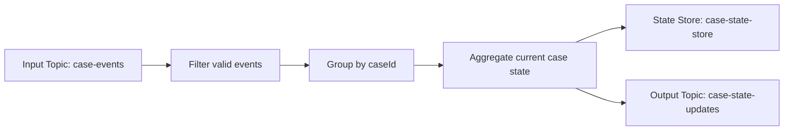
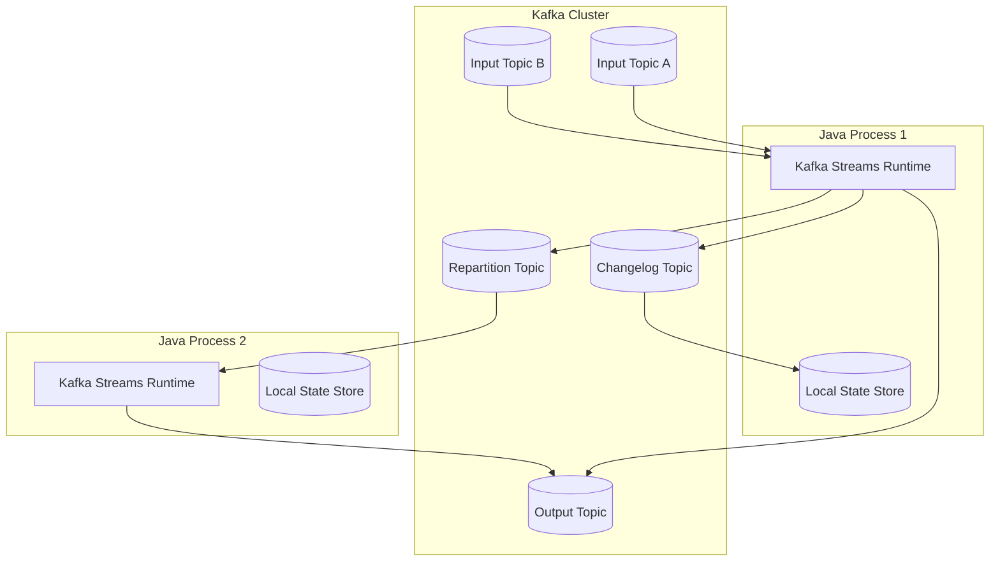
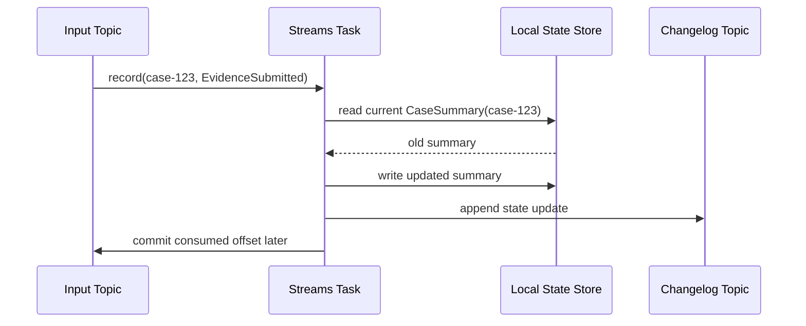
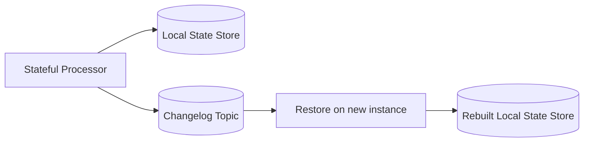
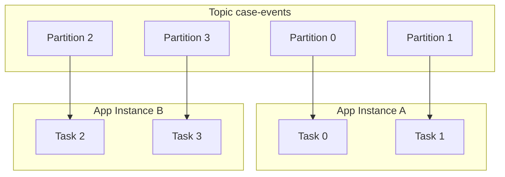
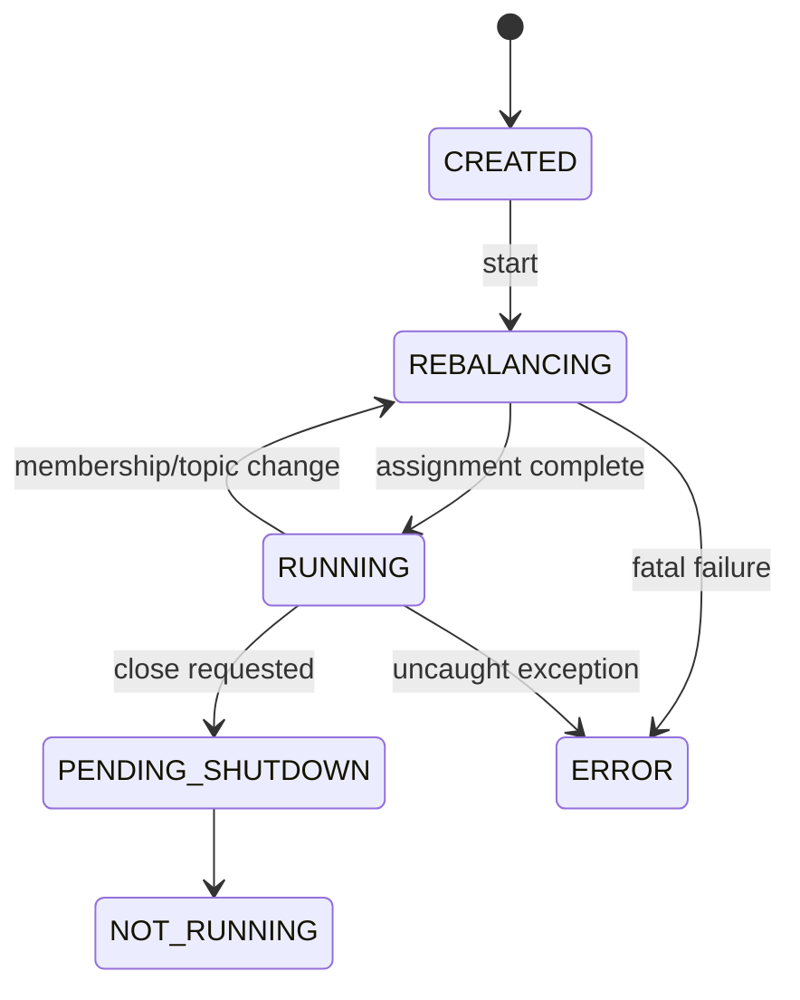
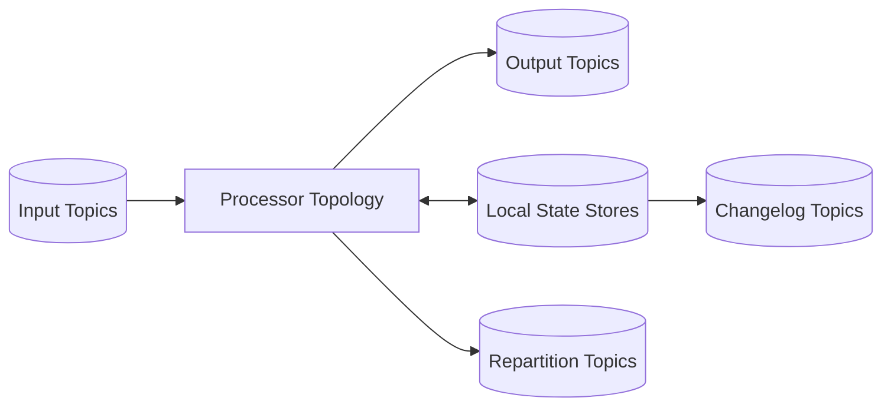

------
title: Learn Java Messaging and Event Streaming - Part 023
description: Kafka Streams in Java, topology design, KStream, KTable, GlobalKTable, state stores, changelog topics, standby replicas, internal topics, lifecycle, operational failure modes, and production-grade topology invariants.
series: learn-java-messaging-event-streaming
seriesTitle: Learn Java Messaging and Event Streaming
order: 23
partTitle: Kafka Streams in Java: Topology, KStream, KTable, GlobalKTable, State Store
tags:
- java
- kafka
- kafka-streams
- stream-processing
- kstream
- ktable
- state-store
- distributed-systems
date: 2026-06-28
---

# Part 023 — Kafka Streams in Java: Topology, KStream, KTable, GlobalKTable, State Store

## 1. Why This Part Exists

Up to this point, Kafka has mostly been treated as a durable event log with producers, consumers, partitions, offsets, retries, schema, and DLQ strategy.

Kafka Streams changes the mental model.

Instead of writing one consumer that reads records and manually decides what to do, Kafka Streams lets us define a continuously running **processing topology**:



That topology is embedded inside a normal Java application. There is no separate stream-processing cluster required by Kafka Streams itself. The application instances coordinate through Kafka consumer groups, partitions, changelog topics, repartition topics, and task assignment.

The core shift is this:

> A Kafka consumer reacts to records. A Kafka Streams application continuously maintains derived streams and tables.

This distinction matters in production. A normal consumer often hides state in memory, a database, or ad hoc caches. Kafka Streams makes state explicit, partitioned, recoverable, backed by Kafka changelog topics, and tied to the topology.

## 2. Kaufman Deconstruction

For this skill, the fastest useful decomposition is not “learn every Kafka Streams method”. The skill breaks down into six sub-skills:

| Sub-skill | What You Must Be Able To Do |
|---|---|
| Topology modelling | Draw input topics, processing nodes, repartition points, state stores, and output topics. |
| Stream/table reasoning | Decide when a data source is a `KStream`, `KTable`, or `GlobalKTable`. |
| State modelling | Know which state is local, which state is changelogged, which state is queryable, and how it restores. |
| Partition reasoning | Ensure records that must meet are co-partitioned by the same key. |
| Runtime operation | Understand application id, tasks, instances, rebalance, internal topics, restore, lag, and reset. |
| Failure modelling | Predict what happens on restart, schema change, repartition, poison record, state corruption, or rolling deploy. |

The deliberate practice target for this part:

> Given three topics and a business question, you should be able to decide whether the solution is a stateless stream transformation, a table materialization, a stateful aggregation, a join, or a bad fit for Kafka Streams.

## 3. Kafka Streams Is a Library, Not a Broker

Kafka Streams is a Java library for building stream-processing applications and microservices on Kafka.

It is not:

- a broker,
- a message queue,
- a scheduler,
- a database replacement,
- a general workflow engine,
- or a distributed transaction coordinator for arbitrary external systems.

It is best understood as:



A Kafka Streams application consumes from Kafka topics, processes records, may maintain local state, writes internal changelog/repartition topics, and produces output topics. Scaling is achieved by running more instances of the same application with the same `application.id`.

The `application.id` is not a cosmetic label. It controls:

- the consumer group identity,
- internal topic prefixes,
- state directory identity,
- offset ownership,
- and reset behavior.

A careless `application.id` change can make the application reprocess from scratch or create a separate processing application.

## 4. Topology Mental Model

A Kafka Streams topology is a directed graph of processors.

At the DSL level, we usually define it through `StreamsBuilder`:

```java
StreamsBuilder builder = new StreamsBuilder();

KStream<String, CaseEvent> events = builder.stream(
    "case-events",
    Consumed.with(Serdes.String(), caseEventSerde)
);

KStream<String, CaseEvent> validEvents = events
    .filter((caseId, event) -> event != null && event.isStructurallyValid());

validEvents.to(
    "valid-case-events",
    Produced.with(Serdes.String(), caseEventSerde)
);

Topology topology = builder.build();
```

The DSL code is not the runtime itself. The runtime starts when the `KafkaStreams` object is created and started:

```java
Properties props = new Properties();
props.put(StreamsConfig.APPLICATION_ID_CONFIG, "case-event-normalizer-v1");
props.put(StreamsConfig.BOOTSTRAP_SERVERS_CONFIG, "kafka-1:9092,kafka-2:9092");
props.put(StreamsConfig.DEFAULT_KEY_SERDE_CLASS_CONFIG, Serdes.String().getClass());

KafkaStreams streams = new KafkaStreams(topology, props);

Runtime.getRuntime().addShutdownHook(new Thread(streams::close));
streams.start();
```

The topology should be reviewed like production architecture, not like incidental Java code.

A useful topology review asks:

1. What are the input topics?
2. What are the output topics?
3. Which operations require state?
4. Which operations require repartitioning?
5. Which topics are internal?
6. Which data is retained forever, compacted, or window-retained?
7. What happens if this application restarts after one day of downtime?
8. Can the topology be reset safely?
9. Can old events still be deserialized after a deployment?
10. What is the business invariant of the output?

## 5. KStream: A Record Stream

A `KStream<K,V>` represents an unbounded stream of records.

Think of it as facts or observations arriving over time:

```text
case-123 -> CaseOpened
case-123 -> EvidenceSubmitted
case-456 -> CaseOpened
case-123 -> RiskScoreChanged
case-456 -> CaseAssigned
```

A `KStream` is appropriate when each record is independently meaningful.

Good examples:

- `case-events`
- `payment-events`
- `audit-events`
- `user-activity-events`
- `sensor-readings`
- `notification-commands`

Common operations:

```java
events
    .filter((key, event) -> event.type() == CaseEventType.CASE_OPENED)
    .mapValues(event -> CaseOpenedView.from(event))
    .to("case-opened-view");
```

KStream semantics:

| Property | Meaning |
|---|---|
| Each record matters | Two records with the same key are two events, not overwrite operations. |
| Order is per partition | If records share a key and the key maps to one partition, their relative order is preserved. |
| Transformations can be stateless or stateful | `filter` is stateless; `aggregate` is stateful. |
| Records can be re-keyed | But re-keying before key-sensitive operations may trigger repartition topics. |

A common mistake is using `KStream` when the business object is actually “current state”. If the desired question is “what is the latest case status by case id?”, a table abstraction is usually more honest.

## 6. KTable: A Changelog-Backed Table

A `KTable<K,V>` represents a continuously updated table. Each record is interpreted as an update for a key.

```text
case-123 -> status=OPEN
case-456 -> status=OPEN
case-123 -> status=UNDER_REVIEW
case-123 -> status=ESCALATED
```

The latest value for `case-123` is `ESCALATED`. Previous values were updates on the way to current state.

This is the key difference:

| Abstraction | Record Meaning |
|---|---|
| `KStream` | This happened. |
| `KTable` | This is the latest value for this key. |

A `KTable` is appropriate for:

- latest customer profile by customer id,
- current case state by case id,
- latest risk score by entity id,
- product catalog by product id,
- account status by account id,
- current policy configuration by policy id.

Example:

```java
KTable<String, CaseState> caseState = builder.table(
    "case-state-by-id",
    Consumed.with(Serdes.String(), caseStateSerde),
    Materialized.as("case-state-store")
);
```

A `KTable` is often backed by a state store. Kafka Streams can materialize the latest value by key locally and use a changelog topic for recovery.

## 7. GlobalKTable: Fully Replicated Lookup Table

A `GlobalKTable<K,V>` is also table-like, but it is replicated to every Kafka Streams instance.

This matters for joins.

With a normal `KTable`, the table is partitioned across app instances. For a stream-table join, matching records must be co-partitioned by key. With a `GlobalKTable`, every instance has a complete copy, so a stream record can look up data locally without repartitioning the stream to match table partitioning.

Use `GlobalKTable` when:

- the table is small enough to replicate everywhere,
- the data changes slowly,
- it is used for enrichment,
- and repartitioning the stream would be costly or awkward.

Examples:

- country code lookup,
- region metadata,
- policy threshold table,
- product category mapping,
- office or branch reference data.

Avoid `GlobalKTable` when:

- the table is huge,
- the table changes at very high frequency,
- each instance cannot afford a full copy,
- or data locality/security requires partitioned ownership.

```java
GlobalKTable<String, PolicyDefinition> policies = builder.globalTable(
    "policy-definitions",
    Consumed.with(Serdes.String(), policySerde),
    Materialized.as("policy-definition-global-store")
);
```

## 8. KStream vs KTable vs GlobalKTable Decision Table

| Question | Prefer |
|---|---|
| Do you need to process every occurrence? | `KStream` |
| Do you need current value by key? | `KTable` |
| Do you need local lookup reference data on every instance? | `GlobalKTable` |
| Do old records represent historical facts? | `KStream` |
| Do old records represent overwritten values? | `KTable` |
| Is the dataset too large to copy to all instances? | `KTable`, not `GlobalKTable` |
| Do records from two streams need to meet within time? | `KStream` + windowed join |
| Do events need enrichment from latest state? | `KStream` + `KTable` or `GlobalKTable` |

## 9. Stateless Transformations

Stateless operations process one record at a time.

Examples:

- `filter`
- `map`
- `mapValues`
- `flatMap`
- `flatMapValues`
- `peek`
- `branch`
- `selectKey`

A stateless topology is easier to operate because it has no local state restore problem.

```java
KStream<String, CaseEvent> suspiciousEvents = events
    .filter((caseId, event) -> event.riskScore() >= 80)
    .mapValues(event -> event.withClassification("HIGH_RISK"));
```

But stateless does not mean risk-free.

Stateless operations can still cause:

- serialization failure,
- output schema incompatibility,
- bad key distribution,
- accidental repartition before downstream operations,
- duplicate output after reprocessing,
- and poisonous records.

## 10. Stateful Transformations

Stateful operations remember something across records.

Examples:

- `groupByKey().count()`
- `aggregate()`
- `reduce()`
- joins,
- windowed aggregations,
- suppression,
- custom processors with state stores.

```java
KTable<String, CaseSummary> summaries = events
    .groupByKey(Grouped.with(Serdes.String(), caseEventSerde))
    .aggregate(
        CaseSummary::empty,
        (caseId, event, summary) -> summary.apply(event),
        Materialized.<String, CaseSummary, KeyValueStore<Bytes, byte[]>>as("case-summary-store")
            .withKeySerde(Serdes.String())
            .withValueSerde(caseSummarySerde)
    );
```

This code is not “just aggregation”. It creates a distributed stateful system.

It implies:

- a local state store,
- a Kafka changelog topic,
- restore behavior on restart,
- partition ownership,
- possible repartition topics,
- serialization contracts for state,
- and operational metrics for state restoration and lag.

## 11. State Store Mental Model

A state store is local storage maintained by Kafka Streams.



The local store gives fast reads/writes. The changelog topic gives recovery.

State store types include:

| Store Type | Typical Use |
|---|---|
| Key-value store | Current state by key. |
| Window store | Aggregates or joins scoped to time windows. |
| Session store | Activity sessions with inactivity gaps. |
| Timestamped store | State with timestamp metadata. |
| Versioned store | Time-aware lookups and temporal joins in newer Kafka Streams versions. |

Most production applications use RocksDB-backed stores by default for persistent local state. In-memory stores may be useful for small or disposable state, but they increase restore requirements after restart because state must be rebuilt from changelog or input.

## 12. Changelog Topics

A changelog topic is an internal Kafka topic used to recover a state store.

If a Streams instance dies, another instance can restore the state store by replaying the changelog.



Changelog topics are usually compacted, because only the latest state per key is needed for key-value stores. Window stores need retention aligned to the window and grace requirements.

Production implications:

- Changelog topics need correct replication factor.
- Changelog topics need sufficient retention.
- Changelog serialization must remain backward-compatible.
- Large state stores can cause long restore times.
- Restores compete for network, disk, and broker I/O.
- State store corruption often requires application reset or local state cleanup.

## 13. Repartition Topics

A repartition topic is an internal topic Kafka Streams creates when data must be re-keyed for a key-dependent operation.

Example:

```java
KTable<String, Long> countByAssignee = events
    .selectKey((caseId, event) -> event.assigneeId())
    .groupByKey(Grouped.with(Serdes.String(), caseEventSerde))
    .count(Materialized.as("case-count-by-assignee"));
```

The original topic may be keyed by `caseId`. After `selectKey`, the key is `assigneeId`. For `groupByKey().count()` to work correctly, records with the same assignee must land in the same partition. Kafka Streams writes the re-keyed records to an internal repartition topic, then consumes from that topic.

Repartition topics are not free.

They add:

- extra write path,
- extra read path,
- extra storage,
- extra latency,
- extra failure surface,
- and schema compatibility concerns for internal records.

A topology with many accidental repartitions is often a sign that keys were not designed around business access patterns.

## 14. Tasks, Partitions, and Instances

Kafka Streams decomposes work into tasks. A task owns one or more input partitions and the corresponding local state.



If the input topic has four partitions, at most four active tasks can process that source in parallel. Running ten application instances will not create ten-way parallelism for that topic; six instances may be idle for that source.

The number of partitions is therefore a capacity and concurrency decision.

## 15. Standby Replicas

A standby replica is a warm copy of a state store on another instance. It consumes the changelog topic so it can take over faster when an active task moves.

Without standby replicas:

```text
failure -> rebalance -> assign task -> restore state from changelog -> process
```

With standby replicas:

```text
failure -> rebalance -> promote warm state -> catch up smaller delta -> process
```

Standby replicas trade resource usage for recovery speed.

Use them when:

- state is large,
- restore time is operationally painful,
- the application is latency-sensitive,
- downtime or degraded processing matters.

Avoid blind use when:

- state is tiny,
- cluster capacity is limited,
- changelog traffic is already high,
- or restore time is acceptable.

## 16. Interactive Queries

Kafka Streams can expose local state stores for read queries. This is often called interactive queries.

Example use case:

- maintain `case-summary-store` by case id,
- expose `/cases/{caseId}/summary` from the same service,
- route the query to the instance that owns the key.

Important distinction:

> A state store is local. A complete query API across all keys requires routing or fan-out across application instances.

Local query example:

```java
ReadOnlyKeyValueStore<String, CaseSummary> store = streams.store(
    StoreQueryParameters.fromNameAndType(
        "case-summary-store",
        QueryableStoreTypes.keyValueStore()
    )
);

CaseSummary summary = store.get(caseId);
```

Operational concerns:

- Query must handle store not ready during startup/restore.
- Key may belong to another instance.
- Application metadata must be exposed for routing.
- Local state may lag input topic.
- Querying state must not bypass authorization rules.
- State store values must be treated as materialized projections, not source-of-truth unless deliberately designed that way.

## 17. Application Lifecycle

A production Kafka Streams application has meaningful states:



Your service readiness should reflect this lifecycle.

Bad readiness check:

```text
HTTP server started => ready
```

Better readiness check:

```text
Kafka Streams state == RUNNING and critical state stores are queryable
```

For Kubernetes-like platforms:

- liveness should detect irrecoverable stuck process,
- readiness should reflect whether the stream application can process/query correctly,
- shutdown should call `streams.close()` with enough grace period,
- rolling deploy should avoid avoidable rebalance storms.

## 18. Exception Handling

Kafka Streams has several classes of exceptions:

| Failure | Example | Handling Strategy |
|---|---|---|
| Deserialization | Bad bytes, incompatible schema | Deserialization exception handler, quarantine if possible. |
| Processing | Null field, invalid business rule | Validate, route to error topic, avoid crashing for known bad records. |
| Production | Output topic unavailable, auth error | Usually fatal or retry depending on cause. |
| State store | RocksDB issue, disk full, corruption | Operational intervention, reset, restore, disk repair. |
| Topology | Missing topic, incompatible internal topic | Deployment/configuration fix. |

A dangerous anti-pattern is treating all exceptions as retryable. Some records will never become valid by waiting.

A stronger design separates:

- transient infrastructure failure,
- deterministic bad input,
- schema incompatibility,
- business rejection,
- and programming bug.

## 19. Minimal Production Topology Example

The following example builds a current case state table from event stream.

```java
public final class CaseStateTopology {

    public static Topology build(
            Serde<String> stringSerde,
            Serde<CaseEvent> caseEventSerde,
            Serde<CaseState> caseStateSerde) {

        StreamsBuilder builder = new StreamsBuilder();

        KStream<String, CaseEvent> events = builder.stream(
            "case-events",
            Consumed.with(stringSerde, caseEventSerde)
        );

        KStream<String, CaseEvent> validEvents = events
            .filter((caseId, event) -> caseId != null)
            .filter((caseId, event) -> event != null)
            .filter((caseId, event) -> event.eventId() != null)
            .filter((caseId, event) -> event.eventTime() != null);

        KTable<String, CaseState> state = validEvents
            .groupByKey(Grouped.with(stringSerde, caseEventSerde))
            .aggregate(
                CaseState::initial,
                (caseId, event, currentState) -> currentState.apply(event),
                Materialized.<String, CaseState, KeyValueStore<Bytes, byte[]>>as("case-state-store")
                    .withKeySerde(stringSerde)
                    .withValueSerde(caseStateSerde)
            );

        state.toStream()
            .to("case-state-updates", Produced.with(stringSerde, caseStateSerde));

        return builder.build();
    }
}
```

This topology looks small, but it encodes several important contracts:

- input topic key must be `caseId`,
- all events for a case must be routed to the same partition,
- `CaseState.apply()` must be deterministic,
- the state schema must evolve compatibly,
- the aggregate must be idempotent or tolerate reprocessing,
- output topic is a projection, not the raw event log,
- replay of `case-events` must produce the same `case-state-updates` for the same input and code version, unless the logic intentionally changes.

## 20. Deterministic State Transitions

Kafka Streams stateful logic should be deterministic.

Bad aggregate:

```java
(caseId, event, state) -> state.withLastProcessedAt(Instant.now())
```

This makes replay produce different state depending on wall-clock time.

Better:

```java
(caseId, event, state) -> state.withLastProcessedAt(event.eventTime())
```

Bad aggregate:

```java
(caseId, event, state) -> state.withRandomBucket(UUID.randomUUID().toString())
```

Better:

```java
(caseId, event, state) -> state.withBucket(hash(caseId) % 32)
```

Determinism matters because Kafka Streams applications are frequently restarted, restored, rebalanced, and sometimes reset/replayed.

## 21. State Is a Projection, Not Automatically the Truth

A state store can become a source of operational read queries, but it is still a projection from input topics.

The truth hierarchy should be explicit:

| Data | Usually Means |
|---|---|
| Raw event topic | Historical fact log. |
| Compacted table topic | Current value by key. |
| Kafka Streams state store | Local materialization of a table/aggregation. |
| Output projection topic | Derived data product. |
| External database projection | Serving/read model, usually eventually consistent. |

If a regulatory case-management platform uses Kafka Streams state to answer “what is the current case status?”, it must define:

- whether state store is authoritative,
- whether raw events can rebuild it,
- whether manual corrections are events,
- whether old processing logic must remain reproducible,
- and how corrected projections are audited.

## 22. Internal Topic Governance

Kafka Streams may create internal topics.

Examples:

```text
<application.id>-<store-name>-changelog
<application.id>-<operation-name>-repartition
```

Do not ignore these topics in governance. They affect:

- storage usage,
- broker load,
- replication,
- retention,
- disaster recovery,
- ACLs,
- monitoring,
- and reset procedures.

For production, document:

```yaml
applicationId: case-state-builder-v1
inputTopics:
  - case-events
outputTopics:
  - case-state-updates
stateStores:
  - case-state-store
internalTopics:
  - case-state-builder-v1-case-state-store-changelog
  - case-state-builder-v1-...-repartition
resettable: true
requiresBackfill: true
stateSizeExpected: 200GB
restoreTimeObjective: 30m
```

## 23. Configuration Checklist

Core properties:

```java
props.put(StreamsConfig.APPLICATION_ID_CONFIG, "case-state-builder-v1");
props.put(StreamsConfig.BOOTSTRAP_SERVERS_CONFIG, bootstrapServers);
props.put(StreamsConfig.PROCESSING_GUARANTEE_CONFIG, StreamsConfig.EXACTLY_ONCE_V2);
props.put(StreamsConfig.STATE_DIR_CONFIG, "/var/lib/app/kafka-streams");
props.put(StreamsConfig.NUM_STANDBY_REPLICAS_CONFIG, 1);
props.put(StreamsConfig.COMMIT_INTERVAL_MS_CONFIG, 1000);
```

Configuration reasoning:

| Config | Why It Matters |
|---|---|
| `application.id` | Consumer group, internal topics, state identity. |
| `bootstrap.servers` | Kafka cluster location. |
| `processing.guarantee` | Controls at-least-once vs exactly-once-v2 processing boundary. |
| `state.dir` | Persistent local state path. Must survive process restart if desired. |
| `num.standby.replicas` | Faster failover for stateful apps. |
| `commit.interval.ms` | Offset/state commit cadence and output visibility trade-off. |
| default serdes | Avoids repetitive configuration but can hide schema mistakes. |

Never copy Kafka Streams configuration from a blog into production without explaining each value.

## 24. Topology Testing

Kafka Streams topologies can be tested without a real Kafka cluster using `TopologyTestDriver`.

A good topology test should validate:

- input topic parsing,
- output topic values,
- state store contents,
- event ordering assumptions,
- duplicate input handling,
- late or invalid data behavior,
- schema evolution cases,
- and deterministic replay.

Example structure:

```java
@Test
void shouldBuildCaseStateFromEvents() {
    Topology topology = CaseStateTopology.build(
        Serdes.String(),
        caseEventSerde,
        caseStateSerde
    );

    Properties props = new Properties();
    props.put(StreamsConfig.APPLICATION_ID_CONFIG, "test-case-state-builder");
    props.put(StreamsConfig.BOOTSTRAP_SERVERS_CONFIG, "dummy:9092");

    try (TopologyTestDriver driver = new TopologyTestDriver(topology, props)) {
        TestInputTopic<String, CaseEvent> input = driver.createInputTopic(
            "case-events",
            Serdes.String().serializer(),
            caseEventSerde.serializer()
        );

        TestOutputTopic<String, CaseState> output = driver.createOutputTopic(
            "case-state-updates",
            Serdes.String().deserializer(),
            caseStateSerde.deserializer()
        );

        input.pipeInput("case-1", CaseEvent.opened("evt-1", "case-1"));
        input.pipeInput("case-1", CaseEvent.escalated("evt-2", "case-1"));

        List<KeyValue<String, CaseState>> results = output.readKeyValuesToList();

        assertThat(results.get(results.size() - 1).value.status())
            .isEqualTo(CaseStatus.ESCALATED);
    }
}
```

A weak test checks only “one input produces one output”. A strong test checks business invariants over a sequence.

## 25. Production Failure Modes

### 25.1 State Restore Takes Too Long

Symptoms:

- instance starts but not ready,
- high restore-consumer lag,
- local disk I/O saturation,
- CPU spike from deserialization,
- rebalance after rebalance if liveness kills the pod too early.

Likely causes:

- huge state store,
- no standby replicas,
- slow broker/disk/network,
- changelog topic under-replicated or throttled,
- bad readiness/liveness configuration.

Mitigation:

- use persistent volumes where appropriate,
- add standby replicas,
- increase graceful startup budget,
- reduce state size,
- split topology,
- tune restore consumers cautiously,
- review changelog retention and compaction.

### 25.2 Repartition Topic Explosion

Symptoms:

- unexpected internal topics,
- higher latency,
- broker storage growth,
- producer and consumer metrics increase,
- unclear topology graph.

Likely causes:

- repeated `selectKey()` before grouping,
- grouping by non-source key,
- join inputs not co-partitioned,
- casual DSL chaining without topology inspection.

Mitigation:

- print and review `topology.describe()`,
- design input keys deliberately,
- materialize intermediate topics intentionally,
- split topology when key domains differ.

### 25.3 Bad State After Code Bug

Symptoms:

- output projection wrong,
- state store contains wrong aggregate,
- changelog contains wrong state,
- restarting does not fix it.

Likely causes:

- deterministic but wrong aggregation logic,
- schema misinterpretation,
- invalid correction handling,
- duplicate not handled.

Mitigation:

- fix code,
- reset application if safe,
- replay from source topics,
- version output topic if downstream cannot tolerate correction,
- publish correction events when business audit requires it.

### 25.4 Query Store Not Available

Symptoms:

- API endpoint returns store unavailable,
- errors during rebalance,
- reads fail after deployment.

Likely causes:

- store not restored,
- app state not RUNNING,
- query routed to wrong instance,
- topology name changed,
- state store name changed.

Mitigation:

- readiness check on store availability,
- use Kafka Streams metadata routing,
- keep store names stable,
- return 503 instead of stale/incorrect result during restore,
- document API consistency model.

## 26. Anti-Patterns

### Anti-pattern 1 — Using Kafka Streams as a Workflow Engine

Kafka Streams is excellent for transformations, joins, aggregations, and materialized views. It is not naturally suited for long-running human workflows with timers, manual steps, compensations, and complex escalation state unless the workflow is carefully event-sourced and the operational model is accepted.

For case-management lifecycle orchestration, use Kafka Streams for projections, enrichment, SLA aggregates, risk signals, and state derivation. Do not blindly replace a BPM/workflow engine with Kafka Streams because both “process events”.

### Anti-pattern 2 — Hiding External Side Effects Inside `mapValues`

Bad:

```java
events.mapValues(event -> {
    emailClient.send(event.userEmail(), "Case updated");
    return event;
});
```

This breaks replay safety. On restore or reset, emails may be sent again.

Better:

```java
events
    .filter((key, event) -> event.requiresNotification())
    .mapValues(NotificationCommand::from)
    .to("notification-commands");
```

Then a separate idempotent notification service handles side effects.

### Anti-pattern 3 — Treating State Store as Magic Database

A state store is local and partition-owned. It is not a general distributed SQL database. Query routing, replication, restore, and consistency must be designed.

### Anti-pattern 4 — Ignoring Internal Topics

Internal topics are part of production. If you do not monitor them, you do not understand your Kafka Streams application.

### Anti-pattern 5 — Topology Changes Without Reset Plan

Some topology changes are compatible; others change internal topic names, state stores, serdes, or repartition behavior. A production topology change needs migration or reset strategy.

## 27. Design Review Template

Use this before shipping a Kafka Streams topology:

```md
# Kafka Streams Design Review

## Purpose
- What business projection/transformation does this topology provide?

## Inputs
- Topic:
- Key:
- Value schema:
- Retention:
- Ordering assumption:

## Outputs
- Topic:
- Key:
- Value schema:
- Consumers:

## State
- Store name:
- Store type:
- Expected size:
- Changelog topic:
- Retention/compaction:
- Restore time objective:

## Repartition
- Does topology trigger repartition?
- Why is it necessary?
- Can upstream keying avoid it?

## Failure Handling
- Bad record strategy:
- Deserialization failure strategy:
- Processing failure strategy:
- Replay strategy:

## Operations
- application.id:
- instance count:
- input partitions:
- standby replicas:
- readiness check:
- reset procedure:

## Invariants
- What must always be true about the output?
- How is duplicate input handled?
- How are out-of-order records handled?
```

## 28. Practice: Build a Case State Projection

Exercise:

Input topic: `case-events`

Events:

```json
{"eventId":"evt-1","caseId":"case-1","type":"CASE_OPENED","eventTime":"2026-06-28T09:00:00Z"}
{"eventId":"evt-2","caseId":"case-1","type":"EVIDENCE_SUBMITTED","eventTime":"2026-06-28T09:10:00Z"}
{"eventId":"evt-3","caseId":"case-1","type":"CASE_ESCALATED","eventTime":"2026-06-28T09:20:00Z"}
```

Build:

1. `KStream<String, CaseEvent>` from `case-events`.
2. Validate non-null key, event id, type, and event time.
3. Group by key.
4. Aggregate into `CaseState`.
5. Materialize as `case-state-store`.
6. Output to `case-state-updates`.
7. Add topology test for replay determinism.

Acceptance criteria:

- all events for the same case result in one final state,
- duplicate `eventId` does not double-apply business effect,
- invalid records are not silently dropped without metric/error topic,
- output key remains `caseId`,
- state store is queryable only after app is RUNNING.

## 29. Mental Model Summary

Kafka Streams is not just a nicer Kafka consumer API. It is a stateful stream-processing runtime embedded in your Java process.

The essential model:



Key takeaways:

- `KStream` means events/facts over time.
- `KTable` means latest value by key.
- `GlobalKTable` means replicated lookup table.
- Stateful operations create state stores and changelog topics.
- Re-keying before key-dependent operations can create repartition topics.
- Local state is fast, but it must be restored, monitored, and migrated.
- Processing logic must be deterministic if replay matters.
- Kafka Streams outputs are derived data products with explicit invariants.

## 30. References

- Apache Kafka Documentation — Streams API: https://kafka.apache.org/documentation/
- Apache Kafka Streams DSL Developer Guide: https://kafka.apache.org/40/streams/developer-guide/dsl-api/
- Apache Kafka Streams Core Concepts: https://kafka.apache.org/42/streams/core-concepts/
- Apache Kafka Streams Javadocs: https://kafka.apache.org/javadoc/
- Confluent Kafka Streams Concepts: https://docs.confluent.io/platform/current/streams/concepts.html
