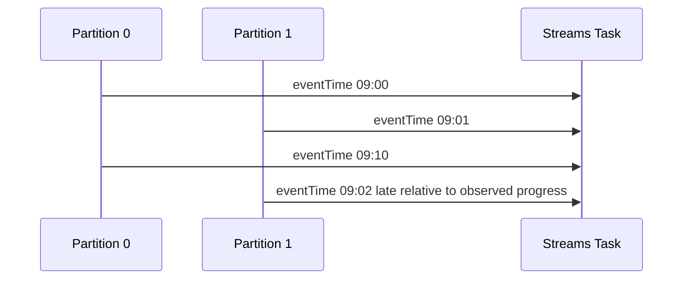
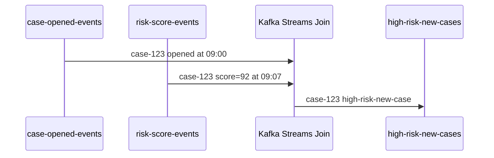
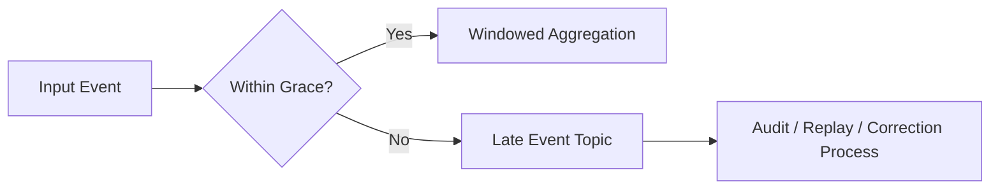
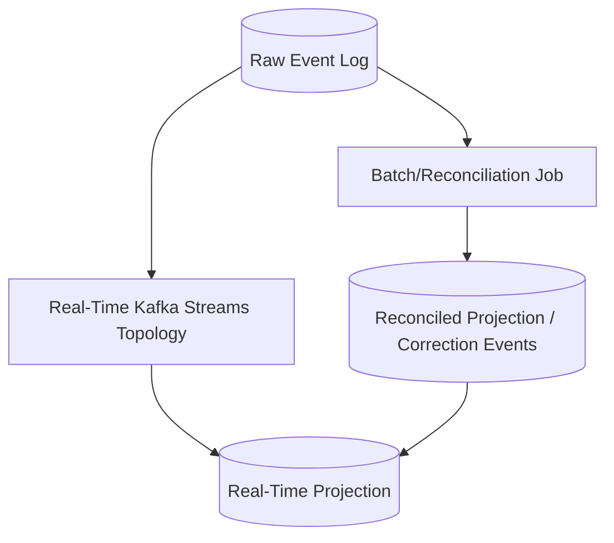

------
title: Learn Java Messaging and Event Streaming - Part 024
description: Kafka Streams joins, event-time processing, timestamp extraction, stream-stream joins, stream-table joins, table-table joins, tumbling/hopping/sliding/session windows, grace periods, suppression, late events, and operational design for time-aware stream processing.
series: learn-java-messaging-event-streaming
seriesTitle: Learn Java Messaging and Event Streaming
order: 24
partTitle: Kafka Streams Joins, Windows, Suppression, and Event-Time Reasoning
tags:
- java
- kafka
- kafka-streams
- joins
- windows
- event-time
- stream-processing
- stateful-processing
date: 2026-06-28
---

# Part 024 — Kafka Streams Joins, Windows, Suppression, and Event-Time Reasoning

## 1. Why This Part Exists

A large part of stream-processing difficulty comes from one uncomfortable fact:

> Data does not arrive in the same order as the business world happened.

A case was opened at 09:00. Evidence was submitted at 09:10. A risk score was recalculated at 09:12. The evidence message arrived late at 09:30 because an upstream service retried. A customer profile update was compacted into a table. A sanctions-list update was applied after the event that should have used it.

If we ignore time semantics, we build systems that look correct in unit tests and fail under real distributed timing.

Kafka Streams gives us primitives for joins, windows, grace periods, and stateful processing. But the API does not decide the business semantics for us. We must choose:

- which timestamp matters,
- how late is too late,
- which records are allowed to join,
- whether corrections are emitted,
- whether downstream should see intermediate results,
- and how much state we are willing to retain.

This part builds that mental model.

## 2. Kaufman Skill Slice

For joins and windows, do not start by memorizing APIs. Start with the questions the APIs are trying to answer:

| Question | Kafka Streams Concept |
|---|---|
| Did two events happen close enough in business time? | Stream-stream join with window. |
| What was the current reference data when this event was processed? | Stream-table join. |
| What is the current combined state of two keyed tables? | Table-table join. |
| How many events happened per interval? | Windowed aggregation. |
| How long should we accept late data? | Grace period. |
| Should downstream see updates or only final window result? | Suppression. |
| How much state must be kept? | Window retention and store sizing. |
| Can old events change previous results? | Event-time and correction policy. |

The goal is to recognize the shape of the business question before choosing the operator.

## 3. Time Semantics

There are at least three useful notions of time:

| Time Type | Meaning | Example |
|---|---|---|
| Event time | When the business event happened. | Evidence submitted at 09:10. |
| Ingestion time | When the record entered Kafka. | Topic append time 09:12. |
| Processing time | When the Streams app processed it. | App consumed record at 09:30. |

For regulatory, financial, audit, and case-management systems, event time is usually the business-relevant time.

Example:

```json
{
  "eventId": "evt-92",
  "caseId": "case-123",
  "type": "EVIDENCE_SUBMITTED",
  "eventTime": "2026-06-28T09:10:00Z",
  "producedAt": "2026-06-28T09:12:31Z"
}
```

If this record is processed at 09:30, a processing-time window would count it in the 09:30 bucket. An event-time window would count it in the 09:10 bucket.

For most serious stream-processing systems, event-time reasoning is the correct default.

## 4. TimestampExtractor

Kafka Streams uses record timestamps for windowing and event-time operations. If your business timestamp is inside the payload, implement a `TimestampExtractor`.

```java
public final class CaseEventTimestampExtractor implements TimestampExtractor {

    @Override
    public long extract(ConsumerRecord<Object, Object> record, long partitionTime) {
        Object value = record.value();

        if (value instanceof CaseEvent event && event.eventTime() != null) {
            return event.eventTime().toEpochMilli();
        }

        // Fallback must be deliberate. Returning processing time here can hide data quality issues.
        return record.timestamp();
    }
}
```

Configuration:

```java
props.put(
    StreamsConfig.DEFAULT_TIMESTAMP_EXTRACTOR_CLASS_CONFIG,
    CaseEventTimestampExtractor.class.getName()
);
```

Do not treat timestamp extraction as plumbing. It is a domain decision.

Questions to answer:

- What field is authoritative event time?
- Can event time be missing?
- Can event time be in the future?
- Can upstream correct event time later?
- Should invalid timestamp records go to quarantine?
- Does event time use UTC?
- Is clock skew acceptable?

## 5. Stream-Time, Not Magic Watermarks

Kafka Streams uses the timestamps it observes in input records to advance stream-time. This is not the same as a global perfect clock.

A simplified mental model:



Late data is judged relative to window end and grace. If a record arrives after the window is closed beyond grace, it can be dropped from that window.

This means window correctness depends on:

- timestamp extraction,
- partition event-time distribution,
- input ordering per partition,
- grace period,
- retention,
- and upstream delay patterns.

## 6. Window Types

Kafka Streams supports several window shapes.

### 6.1 Tumbling Window

Fixed-size, non-overlapping windows.

```text
09:00 - 09:05
09:05 - 09:10
09:10 - 09:15
```

Use for:

- count per minute,
- SLA breach count per hour,
- case creation count per day,
- transaction volume per fixed interval.

### 6.2 Hopping Window

Fixed-size windows that advance by a smaller interval, so records may belong to multiple windows.

```text
size = 10 minutes, advance = 5 minutes
09:00 - 09:10
09:05 - 09:15
09:10 - 09:20
```

Use for:

- rolling counts,
- moving averages,
- overlapping risk windows.

### 6.3 Sliding Window

Windows based on time difference between records. Useful for detecting two events occurring within a time distance.

Use for:

- login followed by suspicious action within 2 minutes,
- case reopened shortly after closure,
- duplicate submission within 30 seconds.

### 6.4 Session Window

Dynamic windows separated by inactivity gaps.

Use for:

- user activity sessions,
- investigator work sessions,
- bursty case updates,
- device telemetry sessions.

```text
Event at 09:00
Event at 09:03
Event at 09:05
--- inactivity gap exceeded ---
Event at 09:30
```

## 7. Grace Period

Grace period answers:

> How long after a window ends are we still willing to accept out-of-order records for that window?

Example:

```java
TimeWindows windows = TimeWindows
    .ofSizeAndGrace(Duration.ofMinutes(5), Duration.ofMinutes(2));
```

This means:

- window size: 5 minutes,
- late records may still be accepted for 2 minutes after window end,
- after that, records are late beyond grace and are not processed for that window.

A grace period is not merely technical. It is a business correctness parameter.

| Domain | Grace Decision |
|---|---|
| UI dashboard | Small grace may be acceptable. |
| Alerting | Grace must balance speed vs false/incomplete results. |
| Billing | Larger grace/correction model likely needed. |
| Regulatory audit | Late event policy must be explicit and defensible. |

## 8. Retention vs Grace

Grace says how long late records are accepted. Retention says how long window state is kept.

A common failure is configuring grace without enough retention, or letting default retention surprise you.

For windowed state:

```text
state retention must cover at least window size + grace period
```

But in production, you also consider:

- restore time,
- replay horizon,
- operational delay,
- downstream correction requirements,
- and storage cost.

## 9. Suppression

Windowed aggregations often emit multiple updates before a window is final.

Example count:

```text
09:00 window count = 1
09:00 window count = 2
09:00 window count = 3
```

If downstream wants live updates, this is fine.

If downstream wants only final results, use suppression.

```java
KTable<Windowed<String>, Long> counts = events
    .groupByKey(Grouped.with(Serdes.String(), eventSerde))
    .windowedBy(TimeWindows.ofSizeAndGrace(
        Duration.ofMinutes(5),
        Duration.ofMinutes(1)
    ))
    .count(Materialized.as("case-counts-5m"))
    .suppress(Suppressed.untilWindowCloses(Suppressed.BufferConfig.unbounded()));
```

Suppression trades output cleanliness for buffered state and delayed emission.

Questions:

- Can memory/disk handle the suppression buffer?
- What happens during spikes?
- Does downstream need intermediate results?
- Is late correction allowed after final emission?
- Is “final” based on grace or business close?

## 10. Stream-Stream Join

A stream-stream join matches records from two event streams by key within a time window.

Example:

- `case-opened-events`
- `risk-score-events`

Question:

> Did a high-risk score arrive within 10 minutes of case opening?



Code:

```java
KStream<String, CaseOpened> opened = builder.stream(
    "case-opened-events",
    Consumed.with(Serdes.String(), caseOpenedSerde)
);

KStream<String, RiskScoreChanged> riskScores = builder.stream(
    "risk-score-events",
    Consumed.with(Serdes.String(), riskScoreSerde)
);

KStream<String, HighRiskCaseSignal> highRiskNewCases = opened.join(
    riskScores.filter((caseId, score) -> score.score() >= 80),
    (open, score) -> HighRiskCaseSignal.from(open, score),
    JoinWindows.ofTimeDifferenceAndGrace(
        Duration.ofMinutes(10),
        Duration.ofMinutes(2)
    ),
    StreamJoined.with(Serdes.String(), caseOpenedSerde, riskScoreSerde)
);

highRiskNewCases.to(
    "high-risk-new-cases",
    Produced.with(Serdes.String(), highRiskSignalSerde)
);
```

Stream-stream join requires state for both sides because either side may arrive first.

## 11. Stream-Stream Join Invariants

For a stream-stream join to be correct:

1. Both streams must use compatible keys.
2. Records that should join must share the same key.
3. The join window must match the business time relationship.
4. Grace must match expected lateness.
5. Both input streams must use correct event timestamps.
6. State retention must cover the join window and grace.
7. Duplicates must be considered.

If `case-opened-events` is keyed by `caseId` but `risk-score-events` is keyed by `entityId`, they will not join correctly unless re-keyed intentionally.

## 12. Stream-Table Join

A stream-table join enriches each event with the current table value for the same key.

Example:

- Stream: `case-events`
- Table: `case-owner-by-case-id`

Question:

> When a case event arrives, who is the current owner?

```java
KStream<String, CaseEvent> events = builder.stream(
    "case-events",
    Consumed.with(Serdes.String(), caseEventSerde)
);

KTable<String, CaseOwner> owners = builder.table(
    "case-owner-by-case-id",
    Consumed.with(Serdes.String(), caseOwnerSerde),
    Materialized.as("case-owner-store")
);

KStream<String, EnrichedCaseEvent> enriched = events.join(
    owners,
    (event, owner) -> EnrichedCaseEvent.of(event, owner),
    Joined.with(Serdes.String(), caseEventSerde, caseOwnerSerde)
);
```

In a stream-table join, the stream drives the output. A table update alone does not re-emit past stream records.

This is a critical semantic point.

If the owner changes at 10:00, Kafka Streams does not automatically re-enrich old case events that were processed at 09:00.

## 13. GlobalKTable Join

A `GlobalKTable` can be used for replicated reference-data enrichment.

Example:

- Stream key: `caseId`
- Event contains `policyId`
- Global table key: `policyId`

```java
GlobalKTable<String, PolicyDefinition> policies = builder.globalTable(
    "policy-definitions",
    Consumed.with(Serdes.String(), policySerde),
    Materialized.as("policy-definition-global-store")
);

KStream<String, EnrichedCaseEvent> enriched = events.join(
    policies,
    (caseId, event) -> event.policyId(),
    (event, policy) -> EnrichedCaseEvent.withPolicy(event, policy)
);
```

This avoids repartitioning the event stream by `policyId`, because each instance has the full policy table locally.

Use this carefully. Replicating a 5 MB policy table is fine. Replicating a 500 GB customer table to every instance is not.

## 14. Table-Table Join

A table-table join combines current state from two tables.

Example:

- `case-state-by-id`
- `case-risk-by-id`

Question:

> What is the current case state with current risk classification?

```java
KTable<String, CaseState> caseState = builder.table(
    "case-state-by-id",
    Consumed.with(Serdes.String(), caseStateSerde)
);

KTable<String, RiskState> riskState = builder.table(
    "case-risk-by-id",
    Consumed.with(Serdes.String(), riskStateSerde)
);

KTable<String, CaseOperationalView> view = caseState.join(
    riskState,
    (state, risk) -> CaseOperationalView.of(state, risk),
    Materialized.as("case-operational-view-store")
);
```

Unlike stream-table join, table-table join can update output when either side updates, because the output is itself a table-like current view.

## 15. Join Decision Matrix

| Business Question | Operator Shape |
|---|---|
| Did A and B happen within 5 minutes? | Stream-stream windowed join. |
| Enrich event A with latest reference data B. | Stream-table or stream-GlobalKTable join. |
| Maintain current combined view of A and B. | Table-table join. |
| Count events per interval. | Windowed aggregation. |
| Detect user/case session bursts. | Session window aggregation. |
| Join using non-key field with small reference data. | KStream + GlobalKTable. |
| Join huge datasets by foreign key. | Re-key/repartition or reconsider architecture. |

## 16. Co-Partitioning

For partitioned joins, matching records must be co-partitioned.

Co-partitioning means:

- same key domain,
- same partitioning logic,
- compatible number of partitions where required,
- and records that should meet land in corresponding tasks.

Bad:

```text
case-events key = caseId
case-owner-updates key = ownerId
```

Then joining by key will not mean “case event joins owner for this case”.

Better:

```text
case-events key = caseId
case-owner-by-case-id key = caseId
```

If you must join on a different field, re-key intentionally and accept the repartition cost.

```java
KStream<String, CaseEvent> byEntityId = events
    .selectKey((caseId, event) -> event.entityId());
```

This is not just code. It is an architectural decision.

## 17. Windowed Aggregation Example

Question:

> How many escalations happen per enforcement unit every 15 minutes, accepting events up to 3 minutes late?

```java
KTable<Windowed<String>, Long> escalationCounts = events
    .filter((caseId, event) -> event.type() == CaseEventType.CASE_ESCALATED)
    .selectKey((caseId, event) -> event.enforcementUnitId())
    .groupByKey(Grouped.with(Serdes.String(), caseEventSerde))
    .windowedBy(TimeWindows.ofSizeAndGrace(
        Duration.ofMinutes(15),
        Duration.ofMinutes(3)
    ))
    .count(Materialized.as("escalation-counts-15m"));

escalationCounts
    .toStream()
    .map((windowedUnit, count) -> {
        String unitId = windowedUnit.key();
        TimeWindow window = windowedUnit.window();
        return KeyValue.pair(
            unitId,
            EscalationCount.of(unitId, window.startTime(), window.endTime(), count)
        );
    })
    .to("escalation-counts-15m", Produced.with(Serdes.String(), escalationCountSerde));
```

This topology likely creates a repartition topic because `selectKey` changes key from `caseId` to `enforcementUnitId` before grouping.

That may be correct. But it must be known, monitored, and sized.

## 18. Hopping Window Example

Question:

> Maintain rolling 1-hour case activity counts updated every 5 minutes.

```java
KTable<Windowed<String>, Long> rollingActivity = events
    .selectKey((caseId, event) -> event.enforcementUnitId())
    .groupByKey(Grouped.with(Serdes.String(), caseEventSerde))
    .windowedBy(TimeWindows
        .ofSizeAndGrace(Duration.ofHours(1), Duration.ofMinutes(5))
        .advanceBy(Duration.ofMinutes(5)))
    .count(Materialized.as("rolling-activity-1h"));
```

Hopping windows multiply state because one record can belong to multiple windows.

If size is 1 hour and advance is 5 minutes, each event can contribute to up to 12 windows.

This affects:

- CPU,
- state store size,
- changelog volume,
- output volume,
- and restore time.

## 19. Session Window Example

Question:

> Group investigator actions into work sessions separated by 30 minutes of inactivity.

```java
KTable<Windowed<String>, InvestigatorSession> sessions = actions
    .selectKey((actionId, action) -> action.investigatorId())
    .groupByKey(Grouped.with(Serdes.String(), investigatorActionSerde))
    .windowedBy(SessionWindows.ofInactivityGapAndGrace(
        Duration.ofMinutes(30),
        Duration.ofMinutes(5)
    ))
    .aggregate(
        InvestigatorSession::new,
        (investigatorId, action, session) -> session.add(action),
        (investigatorId, left, right) -> left.merge(right),
        Materialized.as("investigator-sessions")
    );
```

Session windows can merge when late events bridge two sessions.

Example:

```text
Session A: 09:00 - 09:10
Session B: 09:45 - 10:00
Late event: 09:25
Gap threshold: 30 minutes
```

The late event may cause previously separate sessions to merge. This is correct if the business definition says so, but surprising if downstream expects stable session IDs.

## 20. Suppression and Final Window Output

Suppose downstream billing or compliance reporting wants only final window results.

```java
KTable<Windowed<String>, Long> finalCounts = events
    .selectKey((caseId, event) -> event.enforcementUnitId())
    .groupByKey(Grouped.with(Serdes.String(), caseEventSerde))
    .windowedBy(TimeWindows.ofSizeAndGrace(
        Duration.ofHours(1),
        Duration.ofMinutes(10)
    ))
    .count(Materialized.as("hourly-case-counts"))
    .suppress(Suppressed.untilWindowCloses(
        Suppressed.BufferConfig.maxRecords(100_000).emitEarlyWhenFull()
    ));
```

The buffer config is a business and operational decision.

- `unbounded()` can be dangerous under high cardinality.
- bounded buffer may emit early when full, which weakens “final only” semantics.
- shutting down before emission requires understanding how state and buffer recover.

A final-result promise must be backed by capacity planning.

## 21. Late Events

A late event is not always bad. It may be a normal consequence of distributed systems.

Late events happen because of:

- upstream retry,
- batch ingestion,
- mobile/offline clients,
- network delay,
- clock skew,
- partition backlog,
- broker outage,
- replay/backfill,
- manual correction,
- CDC lag.

Design options:

| Strategy | Meaning |
|---|---|
| Accept within grace | Normal late data. |
| Drop beyond grace | Fast but may lose business completeness. |
| Route to late-events topic | Allows audit/reprocessing. |
| Emit correction event | Downstream receives adjustment. |
| Rebuild projection | Strong but operationally heavy. |
| Use larger windows/grace | More complete but higher latency/state. |

For audit-sensitive systems, silently dropping late events is usually unacceptable. Even if late events are not included in real-time windows, they should be observable.

## 22. Designing Late Event Quarantine

Pattern:



Kafka Streams' built-in window operators may drop records beyond grace. If the business requires explicit late-event capture, design a pre-classification path when possible.

Example approach:

1. Extract event time.
2. Compare with observed processing time or domain cutoff.
3. Route suspiciously late records to `late-case-events`.
4. Still allow normal window operator to enforce formal grace.
5. Monitor late-event rate.

Do not rely solely on logs for late data governance.

## 23. Temporal Correctness in Regulatory Case Management

Consider an enforcement platform.

Events:

```text
09:00 CASE_OPENED
09:05 RISK_SCORE_CHANGED score=91
09:06 CASE_ASSIGNED investigator=A
09:20 EVIDENCE_SUBMITTED
```

Questions may differ:

| Question | Correct Time Model |
|---|---|
| Was case high-risk within 10 minutes of opening? | Stream-stream join on event time. |
| Who owns the case now? | KTable current state. |
| Who owned the case when evidence arrived? | Temporal join or event-sourced state reconstruction. |
| How many escalations happened in the 09:00 hour? | Event-time windowed aggregation. |
| What did the dashboard show at 09:10? | Processing-time/audit snapshot, not same as event truth. |

The question “join event with current table” is not the same as “join event with table value valid at event time”.

Kafka Streams standard stream-table join uses the table state as observed by the stream-processing flow, not a full temporal database unless you model versioned state explicitly.

## 24. Event-Time Join vs Current-State Enrichment

Suppose a policy threshold changes:

```text
09:00 threshold = 80
10:00 threshold = 90
```

A case event happened at 09:30 but arrived at 10:05.

Which threshold should apply?

- If the rule is “apply current policy at processing time,” use stream-table enrichment with current table.
- If the rule is “apply policy effective at event time,” you need temporal versioning: policy versions with effective intervals, custom state, versioned store, or an explicit rule evaluation service.

This is not a Kafka Streams API detail. It is a legal/business rule.

## 25. Join Result Cardinality

Joins can multiply records.

Stream-stream join example:

```text
A1 for key K at 09:00
A2 for key K at 09:01
B1 for key K at 09:02
B2 for key K at 09:03
```

Within a matching window, this may produce:

```text
A1-B1
A1-B2
A2-B1
A2-B2
```

If the business expects one output, you must define how to select or aggregate:

- first match,
- latest match,
- highest priority match,
- all matches,
- deduplicated matches,
- or a windowed aggregate.

Never assume a join emits one record per input record.

## 26. Duplicate Inputs and Joins

Duplicates can create duplicate join outputs.

If upstream can produce duplicates:

```text
CASE_OPENED evt-1
CASE_OPENED evt-1 duplicate
RISK_SCORE_CHANGED evt-2
```

A stream-stream join may emit duplicate `HighRiskCaseSignal` unless deduplicated before the join or made idempotent downstream.

Dedup options:

- producer idempotence reduces broker-level duplicates but not business duplicates from retries across systems,
- event id store before join,
- compacted processed-event topic,
- downstream idempotency key,
- aggregate that tracks applied event ids within bounded horizon.

For high-value workflows, define `eventId` and idempotency behavior as part of the event contract.

## 27. Join Failure Modes

### 27.1 Wrong Key

Symptom:

- join output unexpectedly low or zero,
- no errors,
- topics have data.

Cause:

- left and right inputs are not keyed by same join key.

Fix:

- inspect keys, not just values,
- re-key intentionally,
- verify repartition topics,
- add topology tests with real keys.

### 27.2 Wrong Timestamp

Symptom:

- records that “should” join do not join,
- late-record drop metrics increase,
- windows close unexpectedly.

Cause:

- timestamp extractor uses ingestion or broker timestamp instead of business event time,
- event time parsing fallback hides invalid data,
- clock skew.

Fix:

- validate timestamp extraction,
- quarantine invalid timestamp records,
- add tests with out-of-order inputs.

### 27.3 Too-Small Grace

Symptom:

- correct late events are excluded,
- counts disagree with batch reports,
- audit disputes.

Cause:

- grace period optimized for latency rather than completeness.

Fix:

- measure lateness distribution,
- choose grace based on percentile and business tolerance,
- route beyond-grace records for audit.

### 27.4 Too-Large Grace

Symptom:

- high state store size,
- delayed final results,
- restore time grows,
- suppression buffer pressure.

Cause:

- grace chosen defensively without storage/latency model.

Fix:

- define explicit correction path instead of infinite grace,
- reduce window cardinality,
- split real-time and reconciliation pipelines.

### 27.5 Table Update Semantics Misunderstood

Symptom:

- old enriched records do not update after table correction.

Cause:

- stream-table join is stream-driven; table updates do not reprocess historical stream records.

Fix:

- use table-table join for current view,
- replay events,
- emit correction events,
- use versioned/temporal modelling if required.

## 28. Operational Metrics

Monitor:

| Metric Area | Why |
|---|---|
| Consumer lag | Input delay affects real-time guarantees. |
| Record lateness | Confirms grace assumptions. |
| Dropped records | Indicates grace/timestamp/data-quality issue. |
| State store size | Predicts restore and disk pressure. |
| Changelog topic throughput | Indicates state update rate. |
| Repartition topic throughput | Indicates key reshuffling cost. |
| Suppression buffer pressure | Prevents memory/disk blow-up. |
| Restore time | Determines recovery objective. |
| Join output rate | Detects key mismatch or cardinality explosion. |

A stream-processing app without lateness metrics is blind.

## 29. Testing Joins and Windows

Unit tests must include time.

Test cases:

1. Records arrive in order and join.
2. Right side arrives before left side and still joins.
3. Record arrives within grace and is accepted.
4. Record arrives beyond grace and is rejected or quarantined.
5. Duplicate event does not double-count if that is the invariant.
6. Table update does not re-emit stream-table join unless stream record arrives.
7. Session windows merge when late bridging event arrives.
8. Suppression emits only after window close.

Example pattern with controlled timestamps:

```java
input.pipeInput("case-1", CaseOpened.at("case-1", Instant.parse("2026-06-28T09:00:00Z")));
riskInput.pipeInput("case-1", RiskScoreChanged.at("case-1", 91, Instant.parse("2026-06-28T09:07:00Z")));
```

The test should control event timestamp, not only wall-clock test execution time.

## 30. Architecture Pattern: Real-Time + Reconciliation

For high-stakes systems, real-time stream processing and correctness reconciliation are often separate.



This pattern accepts that real-time windows may have practical grace limits, while the business may still need eventual correction.

Use when:

- late data can be very late,
- legal/audit correctness matters,
- downstream can consume corrections,
- backfill is common,
- or operational cost of huge grace is too high.

## 31. Regulatory Example: SLA Breach Detection

Question:

> Raise an SLA breach signal if a high-priority case is not assigned within 30 minutes of opening.

Naive approach:

- join `case-opened` and `case-assigned` within 30 minutes,
- if no join, emit breach.

But absence is harder than presence.

Better model:

1. On `CASE_OPENED`, create timer/check state.
2. On `CASE_ASSIGNED`, mark assigned.
3. When stream-time passes deadline plus grace, emit breach if still unassigned.

This may require custom processor/state store or a windowed aggregation pattern.

Why not a simple join?

Because a join emits when both sides exist. SLA breach is about missing counterpart event by a deadline.

This distinction prevents many broken alerting systems.

## 32. Regulatory Example: Evidence Submitted After Closure

Question:

> Detect evidence submitted after case closure.

Possible model:

- `case-events` as stream,
- derive `case-state` as KTable,
- join evidence-submitted stream with current case-state table,
- emit violation if current status is CLOSED.

But this answers:

> Was the case closed when the evidence event was processed?

If the actual rule is:

> Was the case closed at the evidence event time?

Then current-state table is insufficient if events arrive out of order. You need event-sourced state reconstruction or temporal state.

This is the kind of distinction that separates robust event processing from accidental dashboards.

## 33. Design Checklist for Joins and Windows

```md
# Join/Window Design Review

## Business Question
- What exact question does this topology answer?
- Is it about occurrence, current state, historical state, or absence?

## Time
- Which timestamp is authoritative?
- How is timestamp extracted?
- What is max expected lateness?
- What happens beyond grace?

## Keys
- What is the join/group key?
- Are topics co-partitioned?
- Is repartition required?
- Is key cardinality safe?

## State
- What state store is created?
- How large can it become?
- What is retention?
- What is restore target?

## Output
- Are outputs intermediate or final?
- Can corrections be emitted?
- Is output idempotent?
- Can downstream handle updates?

## Failure
- What happens to invalid timestamps?
- What happens to duplicates?
- What happens to late events?
- What happens during replay/backfill?
```

## 34. Anti-Patterns

### Anti-pattern 1 — Using Processing Time for Business Time

If a case event happened yesterday but arrived today, processing-time windows count it today. That may be useful for operational ingestion metrics, but wrong for business event analytics.

### Anti-pattern 2 — Assuming Joins Are One-to-One

Many stream joins are many-to-many within the window. Cardinality must be designed.

### Anti-pattern 3 — Infinite Grace

Very large grace avoids late drops but creates state, latency, and restore pressure. Sometimes a correction/reconciliation model is better.

### Anti-pattern 4 — Stream-Table Join for Historical Truth

A stream-table join enriches with table state as processed, not necessarily table state valid at event time.

### Anti-pattern 5 — Suppression Without Capacity Planning

Final-only output sounds attractive until the suppression buffer grows under high-cardinality windows.

### Anti-pattern 6 — Dropping Late Events Without Audit

For compliance and regulatory systems, late events are often evidence of upstream delay or correction. They should be measured and often persisted.

## 35. Practice Exercises

### Exercise 1 — High-Risk Case Within 10 Minutes

Build:

- `case-opened-events`
- `risk-score-events`
- stream-stream join by `caseId`
- join window 10 minutes
- grace 2 minutes
- output `high-risk-new-cases`

Test:

- risk arrives after open,
- risk arrives before open,
- risk arrives beyond window,
- duplicate risk event,
- wrong key.

### Exercise 2 — Hourly SLA Dashboard

Build:

- count opened cases by enforcement unit per hour,
- grace 10 minutes,
- output intermediate updates,
- then modify to output final-only using suppression.

Compare:

- output volume,
- latency,
- state size,
- behavior with late events.

### Exercise 3 — Policy Effective-Time Evaluation

Given:

- policy threshold changes over time,
- case events arrive late,
- rule says “use policy effective at event time”.

Design:

- why current `KTable` is insufficient,
- how to model policy versions,
- what state store is needed,
- how corrections are emitted.

## 36. Mental Model Summary

Kafka Streams joins and windows are about bringing records together across key and time.

The core rules:

- Stream-stream joins are windowed because both sides are unbounded events.
- Stream-table joins are stream-driven enrichment with latest table state as observed.
- Table-table joins maintain current combined state.
- Windows require event-time, grace, retention, and state sizing decisions.
- Suppression delays output until a window is final, but needs buffer capacity.
- Late events are a business policy issue, not just an API behavior.
- Co-partitioning and correct keys are mandatory for correctness.
- For regulatory domains, distinguish current-state enrichment from historical effective-time evaluation.

The strongest engineers do not ask only “which Kafka Streams operator do I use?” They ask:

> What temporal truth does this topology claim to produce, and what failure modes can violate that claim?

## 37. References

- Apache Kafka Documentation — Streams API: https://kafka.apache.org/documentation/
- Apache Kafka Streams DSL Developer Guide: https://kafka.apache.org/40/streams/developer-guide/dsl-api/
- Apache Kafka Streams Core Concepts: https://kafka.apache.org/42/streams/core-concepts/
- Apache Kafka JoinWindows Javadocs: https://kafka.apache.org/39/javadoc/org/apache/kafka/streams/kstream/JoinWindows.html
- Apache Kafka Windows Javadocs: https://kafka.apache.org/33/javadoc/org/apache/kafka/streams/kstream/Windows.html
- Confluent Kafka Streams Concepts: https://docs.confluent.io/platform/current/streams/concepts.html
